May 18, 2026 10:11 AM GMT

# Investor Presentation | Asia Pacific

# Hong Kong/China Insurance: Marketing Pack 1Q26

Insurers finished 1Q26 with largely in-line earnings and high-quality life and P&C businesses. We think the 1Q earnings overhang has played out, and we see more upside risk from here, as markets have already rebounded since April.

MS ASIA LIMITED+

# Rick Zhao

Equity Analyst

Rick.Zhao@morganstanley.com +852 2239-7033

# Richard Xu, CFA

Equity Analyst

Richard.Xu@morganstanley.com +852 2848-6729

# Chenqian Liu

Research Associate

Chenqian.Liu@morganstanley.com +852 3963-0359

# HONG KONG/CHINA INSURANCE

# Asia Pacific

Industry View Attractive

MS does and seeks to do business with companies covered in MS. As a result, investors should be aware that the firm may have a conflict of interest that could affect the objectivity of MS. Investors should consider MS as only a single factor in making their investment decision.

# For analyst certification and other important disclosures, refer to the Disclosure Section, located at the end of this report.

+= Analysts employed by non-U.S. affiliates are not registered with FINRA, may not be associated persons of the member and may not be subject to FINRA restrictions on communications with a subject company, public appearances and trading securities held by a research analyst account.

# MS

MS

Hong Kong/China Insurance

May 18, 2026

# Table of Contents

1. Hong Kong/China Insurance Share Price Performance and Valuation Comps   
2. 1Q26 Wrap-Up: Key Earnings, Life, P&C and Solvency   
3. FY25 Wrap-Up: Key Focus, Group Performance, Life, P&C, Investment, Capital   
4. Single Stock Names: AIA, Ping An, PICC P&C, CPIC, China Life   
5. Southbound Fund Flow Comps

# MS

MS

Hong Kong/China Insurance

May 18, 2026

1. Hong Kong/China Insurance Share Price Performance 

<table><tr><td rowspan="2">15/05/26Company</td><td rowspan="2">Ticker</td><td rowspan="2">Price</td><td colspan="8">Absolute Performance (%)</td><td rowspan="2">Premium/(Discount)to A-shares</td></tr><tr><td>YTD</td><td>1W</td><td>1M</td><td>3M</td><td>6M</td><td>12M</td><td>2 YR</td><td>3 YR</td></tr><tr><td colspan="12">H share</td></tr><tr><td>AIA</td><td>1299-HK</td><td>87.65</td><td>9.7</td><td>1.2</td><td>4.5</td><td>9.2</td><td>6.4</td><td>33.1</td><td>39.3</td><td>7.9</td><td></td></tr><tr><td>Prudential</td><td>2378-HK</td><td>119.40</td><td>0.0</td><td>-1.9</td><td>1.8</td><td>3.0</td><td>8.1</td><td>34.5</td><td>55.3</td><td>5.5</td><td></td></tr><tr><td>FWD</td><td>1828-HK</td><td>30.32</td><td>-20.3</td><td>-3.4</td><td>-5.3</td><td>-20.2</td><td>-23.0</td><td>NA</td><td>NA</td><td>NA</td><td></td></tr><tr><td>PICC</td><td>2328-HK</td><td>15.39</td><td>-5.9</td><td>3.4</td><td>4.5</td><td>-7.1</td><td>-17.9</td><td>1.1</td><td>48.6</td><td>54.7</td><td></td></tr><tr><td>Ping An</td><td>2318-HK</td><td>62.15</td><td>-4.6</td><td>-5.3</td><td>-0.6</td><td>-11.7</td><td>3.7</td><td>33.2</td><td>54.8</td><td>7.8</td><td>(3.0)</td></tr><tr><td>China Pacific</td><td>2601-HK</td><td>33.22</td><td>-5.6</td><td>-6.3</td><td>-1.9</td><td>-10.8</td><td>-0.9</td><td>36.1</td><td>70.2</td><td>32.9</td><td>(16.7)</td></tr><tr><td>Zhong An</td><td>6060-HK</td><td>11.09</td><td>-31.1</td><td>-9.2</td><td>-12.5</td><td>-31.2</td><td>-32.3</td><td>-12.5</td><td>-26.3</td><td>-55.6</td><td></td></tr><tr><td>China Life</td><td>2628-HK</td><td>29.86</td><td>9.1</td><td>-4.5</td><td>8.9</td><td>-9.7</td><td>9.1</td><td>87.1</td><td>156.5</td><td>100.1</td><td>(26.8)</td></tr><tr><td>PICC Group</td><td>1339-HK</td><td>5.39</td><td>-20.1</td><td>-3.2</td><td>0.4</td><td>-17.8</td><td>-27.2</td><td>3.1</td><td>93.2</td><td>68.4</td><td>(32.9)</td></tr><tr><td>China Taiping</td><td>966-HK</td><td>21.78</td><td>16.5</td><td>-7.9</td><td>-0.9</td><td>-9.2</td><td>7.6</td><td>79.7</td><td>159.6</td><td>135.7</td><td></td></tr><tr><td>New China Life</td><td>1336-HK</td><td>49.90</td><td>-8.2</td><td>-5.8</td><td>5.1</td><td>-14.5</td><td>-2.8</td><td>54.3</td><td>194.9</td><td>122.8</td><td>(29.3)</td></tr><tr><td colspan="12">A share</td></tr><tr><td>Ping An</td><td>601318-CN</td><td>55.50</td><td>-18.9</td><td>-7.6</td><td>-5.5</td><td>-15.0</td><td>-8.5</td><td>2.3</td><td>32.6</td><td>4.3</td><td></td></tr><tr><td>China Pacific</td><td>601601-CN</td><td>34.57</td><td>-17.5</td><td>-6.3</td><td>-9.0</td><td>-19.4</td><td>-4.7</td><td>1.6</td><td>26.6</td><td>4.9</td><td></td></tr><tr><td>New China Life</td><td>601336-CN</td><td>61.12</td><td>-12.3</td><td>-6.0</td><td>-0.9</td><td>-21.3</td><td>-10.4</td><td>17.9</td><td>90.5</td><td>54.1</td><td></td></tr><tr><td>China Life</td><td>601628-CN</td><td>35.35</td><td>-22.3</td><td>-5.3</td><td>-6.2</td><td>-25.4</td><td>-19.9</td><td>-10.1</td><td>11.7</td><td>-14.2</td><td></td></tr><tr><td>PICC Group</td><td>601319-CN</td><td>6.96</td><td>-22.2</td><td>-4.9</td><td>-7.0</td><td>-21.6</td><td>-21.0</td><td>-15.9</td><td>29.9</td><td>5.3</td><td></td></tr><tr><td colspan="12">Index</td></tr><tr><td>HSCEI</td><td>160462</td><td>8,678</td><td>-2.6</td><td>-2.4</td><td>-0.5</td><td>-3.9</td><td>-7.7</td><td>2.0</td><td>28.7</td><td>27.8</td><td></td></tr><tr><td>HSI</td><td>180458</td><td>25,931</td><td>1.2</td><td>-1.8</td><td>-0.1</td><td>-2.4</td><td>-2.4</td><td>10.6</td><td>35.9</td><td>29.8</td><td></td></tr><tr><td>SHCOMP</td><td>180167</td><td>4,134</td><td>4.2</td><td>-1.1</td><td>2.7</td><td>1.3</td><td>3.6</td><td>22.3</td><td>32.5</td><td>25.6</td><td></td></tr><tr><td>MSCI China</td><td>MS302400</td><td>81</td><td>-3.4</td><td>-0.7</td><td>0.7</td><td>-3.9</td><td>-8.1</td><td>6.3</td><td>27.3</td><td>24.6</td><td></td></tr><tr><td>MSCI AxJ</td><td>899800</td><td>1,541</td><td>26.3</td><td>1.5</td><td>11.5</td><td>14.7</td><td>27.7</td><td>54.2</td><td>68.6</td><td>88.3</td><td></td></tr><tr><td>CSI 300 Financials</td><td>CSI00014</td><td>6,025</td><td>-10.3</td><td>-1.5</td><td>-2.4</td><td>-5.6</td><td>-10.8</td><td>-5.4</td><td>17.7</td><td>8.4</td><td></td></tr></table>

Note: Prices as close of May 15, 2026. Source: FactSet, MS.

# MS

MS

Hong Kong/China Insurance

May 18, 2026

1. Hong Kong/China Insurance: Valuation Comps 

<table><tr><td rowspan="2">Company</td><td rowspan="2">TRSL</td><td rowspan="2">CCY Trading</td><td rowspan="2">Price (LC)</td><td rowspan="2">Market Cap (USD mn)</td><td rowspan="2">Turn-over (USD mn)</td><td rowspan="2">Rating</td><td rowspan="2">PT</td><td rowspan="2">Upside</td><td colspan="2">P/Group EV</td><td colspan="2">P/B</td><td colspan="2">P/E</td><td colspan="2">Dividend Yield %</td><td colspan="2">ROE %</td><td colspan="2">VNB growth %</td></tr><tr><td>2026 E</td><td>2027 E</td><td>2026 E</td><td>2027 E</td><td>2026 E</td><td>2027 E</td><td>2026 E</td><td>2027 E</td><td>2026 E</td><td>2027 E</td><td>2026 E</td><td>2027 E</td></tr><tr><td colspan="21">Regional Life Insurers</td></tr><tr><td>AIA</td><td>1299-HK</td><td>HKD</td><td>87.80</td><td>117,782</td><td>292.3</td><td>O</td><td>109.0</td><td>24%</td><td>1.21</td><td>1.07</td><td>2.35</td><td>2.10</td><td>14.4</td><td>12.8</td><td>2.5</td><td>2.8</td><td>17.4</td><td>17.4</td><td>14.7</td><td>14.9</td></tr><tr><td>FWD</td><td>1828-HK</td><td>HKD</td><td>30.32</td><td>6,522</td><td>3.4</td><td>O</td><td>42.5</td><td>40%</td><td>0.71</td><td>0.61</td><td>0.66</td><td>0.62</td><td>13.4</td><td>10.7</td><td>NA</td><td>NA</td><td>4.1</td><td>5.1</td><td>12.5</td><td>12.8</td></tr><tr><td colspan="21">Chinese Life insurers</td></tr><tr><td>Ping An</td><td>2318-HK</td><td>HKD</td><td>62.45</td><td>144,377</td><td>327.1</td><td>O</td><td>92.0</td><td>47%</td><td>0.61</td><td>0.57</td><td>0.90</td><td>0.82</td><td>6.6</td><td>5.8</td><td>5.3</td><td>5.7</td><td>14.3</td><td>14.7</td><td>16.0</td><td>16.5</td></tr><tr><td>China Life</td><td>2628-HK</td><td>HKD</td><td>29.90</td><td>107,900</td><td>221.9</td><td>O</td><td>38.9</td><td>30%</td><td>0.46</td><td>0.42</td><td>1.10</td><td>0.99</td><td>7.9</td><td>7.1</td><td>3.6</td><td>3.9</td><td>14.8</td><td>14.6</td><td>21.0</td><td>13.5</td></tr><tr><td>China Pacific</td><td>2601-HK</td><td>HKD</td><td>33.20</td><td>40,821</td><td>73.9</td><td>O</td><td>46.0</td><td>39%</td><td>0.42</td><td>0.38</td><td>0.83</td><td>0.76</td><td>6.8</td><td>6.3</td><td>4.3</td><td>4.6</td><td>12.9</td><td>12.6</td><td>10.7</td><td>11.5</td></tr><tr><td>PICC Group</td><td>1339-HK</td><td>HKD</td><td>5.41</td><td>30,546</td><td>42.4</td><td>O</td><td>7.7</td><td>42%</td><td>0.49</td><td>0.44</td><td>0.60</td><td>0.54</td><td>4.6</td><td>4.2</td><td>4.7</td><td>5.2</td><td>13.9</td><td>13.6</td><td>16.5</td><td>13.9</td></tr><tr><td>China Taiping</td><td>966-HK</td><td>HKD</td><td>21.80</td><td>10,003</td><td>28.8</td><td>E</td><td>25.7</td><td>18%</td><td>0.33</td><td>0.30</td><td>0.67</td><td>0.62</td><td>7.2</td><td>6.6</td><td>5.6</td><td>6.1</td><td>9.5</td><td>9.8</td><td>11.8</td><td>12.4</td></tr><tr><td>New China Life</td><td>1336-HK</td><td>HKD</td><td>49.80</td><td>19,835</td><td>82.9</td><td>U</td><td>44.8</td><td>-10%</td><td>0.43</td><td>0.40</td><td>1.11</td><td>1.01</td><td>7.5</td><td>7.5</td><td>3.7</td><td>4.0</td><td>14.4</td><td>14.3</td><td>9.5</td><td>9.2</td></tr><tr><td colspan="21">Non-Life Insurers</td></tr><tr><td>PICC P&amp;C</td><td>2328-HK</td><td>HKD</td><td>15.39</td><td>43,705</td><td>64.1</td><td>O</td><td>20.5</td><td>33%</td><td>NA</td><td>NA</td><td>0.95</td><td>0.88</td><td>7.5</td><td>6.9</td><td>5.6</td><td>6.1</td><td>13.3</td><td>13.3</td><td>NA</td><td>NA</td></tr><tr><td>Zhong An</td><td>6060-HK</td><td>HKD</td><td>11.11</td><td>2,390</td><td>64.1</td><td>O</td><td>18.1</td><td>63%</td><td>NA</td><td>NA</td><td>0.61</td><td>0.58</td><td>14.9</td><td>13.0</td><td>NA</td><td>NA</td><td>4.2</td><td>4.6</td><td>NA</td><td>NA</td></tr><tr><td colspan="21">A share Insurers</td></tr><tr><td>Ping An</td><td>601318-CN</td><td>CNY</td><td>55.50</td><td>148,086</td><td>617.3</td><td>O</td><td>84.0</td><td>51%</td><td>0.62</td><td>0.58</td><td>0.92</td><td>0.84</td><td>6.8</td><td>6.0</td><td>5.2</td><td>5.5</td><td>14.3</td><td>14.7</td><td>16.0</td><td>16.5</td></tr><tr><td>China Pacific</td><td>601601-CN</td><td>CNY</td><td>34.54</td><td>49,014</td><td>200.6</td><td>O</td><td>47.2</td><td>37%</td><td>0.50</td><td>0.46</td><td>1.00</td><td>0.91</td><td>8.1</td><td>7.6</td><td>3.6</td><td>3.9</td><td>12.9</td><td>12.6</td><td>10.7</td><td>11.5</td></tr><tr><td>China Life</td><td>601628-CN</td><td>CNY</td><td>35.36</td><td>147,271</td><td>105.9</td><td>E</td><td>44.7</td><td>26%</td><td>0.62</td><td>0.58</td><td>1.50</td><td>1.35</td><td>10.7</td><td>9.7</td><td>2.6</td><td>2.8</td><td>14.8</td><td>14.6</td><td>21.0</td><td>13.5</td></tr><tr><td>PICC Group</td><td>601319-CN</td><td>CNY</td><td>6.96</td><td>45,355</td><td>103.1</td><td>E</td><td>8.7</td><td>25%</td><td>0.73</td><td>0.65</td><td>0.89</td><td>0.80</td><td>6.8</td><td>6.2</td><td>3.2</td><td>3.5</td><td>13.9</td><td>13.6</td><td>16.5</td><td>13.9</td></tr><tr><td>New China Life</td><td>601336-CN</td><td>CNY</td><td>61.22</td><td>28,141</td><td>193.7</td><td>U</td><td>62.9</td><td>3%</td><td>0.61</td><td>0.56</td><td>1.58</td><td>1.43</td><td>10.6</td><td>10.6</td><td>2.6</td><td>2.8</td><td>14.4</td><td>14.3</td><td>9.5</td><td>9.2</td></tr></table>

Note: Prices as close of May 15, 2026. Source: Company data, FactSet, MS (E) estimates.

# MS

MS

Hong Kong/China Insurance

May 18, 2026

# 2. 1Q26 Wrap-up: Key Earnings

Most CN insurers saw earnings declines in 1Q26   
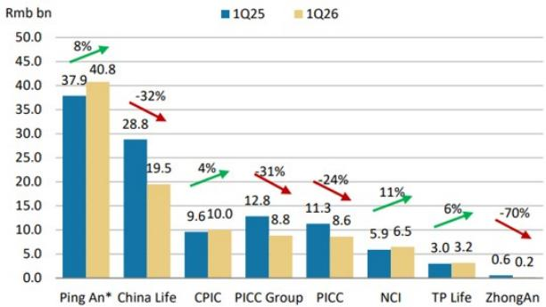

bar

| Company | 1Q25 (Rmb bn) | 1Q26 (Rmb bn) | Change (%) |
| :--- | :--- | :--- | :--- |
| Ping An* | 37.9 | 40.8 | 8 |
| China Life | 28.8 | 19.5 | -32 |
| CPIC | 9.6 | 10.0 | 4 |
| PICC Group | 12.8 | 8.8 | -31 |
| PICC | 11.3 | 8.6 | -24 |
| NCI | 5.9 | 6.5 | 11 |
| TP Life | 3.0 | 3.2 | 6 |
| ZhongAn | 0.6 | 0.2 | -70 |

\*OPAT for Ping An, while NPAT down 7% y-y

Insurers' annualized gross investment yield in 1Q26 decline across peers   
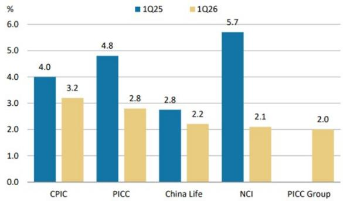

bar

| Company | 1Q25 (%) | 1Q26 (%) |
| :--- | :--- | :--- |
| CPIC | 4.0 | 3.2 |
| PICC | 4.8 | 2.8 |
| China Life | 2.8 | 2.2 |
| NCI | 5.7 | 2.1 |
| PICC Group | 0.0 | 2.0 |

Annualized ROE declined across insurers in 1Q26, but still healthy   
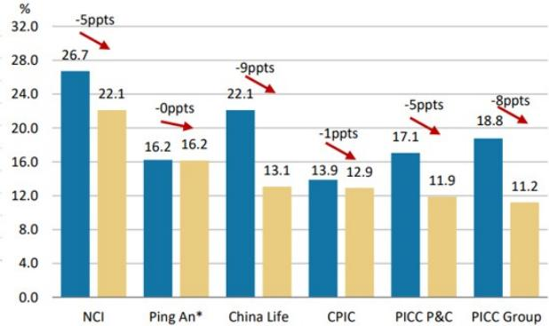

bar

| Entity | Blue Bar (%) | Yellow Bar (%) |
| :--- | :--- | :--- |
| NCI | 26.7 | 22.1 |
| Ping An* | 16.2 | 16.2 |
| China Life | 22.1 | 13.1 |
| CPIC | 13.9 | 12.9 |
| PICC P&C | 17.1 | 11.9 |
| PICC Group | 18.8 | 11.2 |
-5ppts indicated by red arrow; -0ppts indicated by red arrow; -9ppts indicated by red arrow; -1ppts indicated by red arrow; -5ppts indicated by red arrow; -8ppts indicated by red arrow.

\*OPAT ROE for Ping An

Insurers' BVPS saw broad-based increase in 1Q26...   
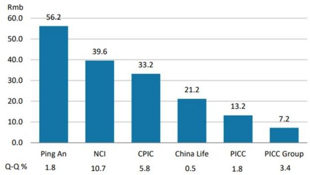

bar

| Company | Q-Q % |
| :--- | :--- |
| Ping An | 1.8 |
| NCI | 10.7 |
| CPIC | 5.8 |
| China Life | 0.5 |
| PICC | 1.8 |
| PICC Group | 3.4 |

Earnings breakdown in 1Q26 – insurance results are steady while investment results decline   
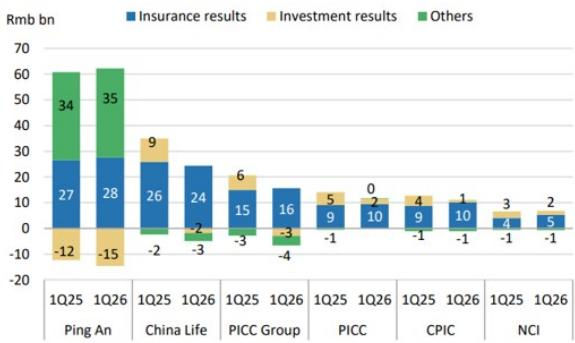

bar_stacked

| Category | Quarter | Insurance results (Rmb bn) | Investment results (Rmb bn) | Others (Rmb bn) |
| :--- | :--- | :--- | :--- | :--- |
| Ping An | 1Q25 | 27 | -12 | 34 |
| Ping An | 1Q26 | 28 | -15 | 35 |
| China Life | 1Q25 | 26 | -2 | -2 |
| China Life | 1Q26 | 24 | -3 | -2 |
| PICC Group | 1Q25 | 15 | -3 | 6 |
| PICC Group | 1Q26 | 16 | -4 | -3 |
| PICC | 1Q25 | 9 | -1 | 5 |
| PICC | 1Q26 | 10 | 0 | 2 |
| CPIC | 1Q25 | 9 | -1 | 4 |
| CPIC | 1Q26 | 10 | -1 | 1 |
| NCI | 1Q25 | 4 | -1 | 3 |
| NCI | 1Q26 | 5 | -1 | 2 |

\* Earnings before tax and asso&JV

...while insurers' total assets showed diversified q-q trends in 1Q26   
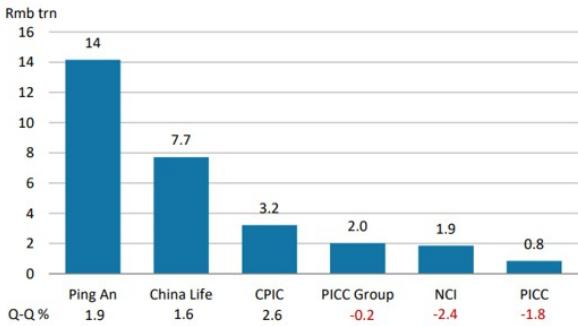

bar

| Company | Q-Q % |
| :--- | :--- |
| Ping An | 1.9 |
| China Life | 1.6 |
| CPIC | 2.6 |
| PICC Group | -0.2 |
| NCI | -2.4 |
| PICC | -1.8 |

Source: Company data; MS

# MS

MS

Hong Kong/China Insurance

May 18, 2026

# 2. 1Q26 Wrap-up: Life

Insurers saw very healthy y-y growth in APE in 1Q26   
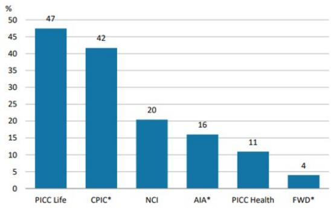

bar

| Entity | Value (%) |
| :--- | :--- |
| PICC Life | 47 |
| CPIC* | 42 |
| NCI | 20 |
| AIA* | 16 |
| PICC Health | 11 |
| FWD* | 4 |

\* Agency APE for CPIC

Insurers FYP y-y trends were diversified in 1Q26, due to structure optimization   
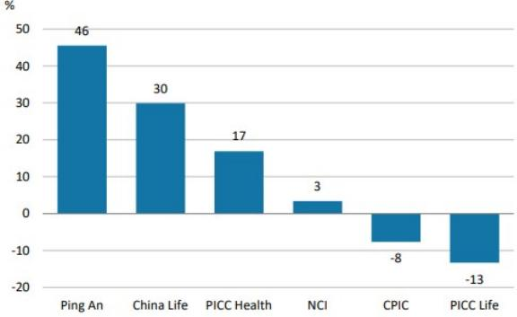

bar

| Company | Value (%) |
| :--- | :--- |
| Ping An | 46 |
| China Life | 30 |
| PICC Health | 17 |
| NCI | 3 |
| CPIC | -8 |
| PICC Life | -13 |

Most China life insurers' VNB margin increase in 1Q26   
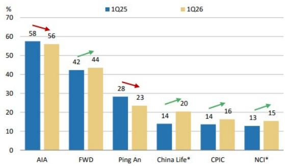

bar

| Company | 1Q25 (%) | 1Q26 (%) |
| :--- | :--- | :--- |
| AIA | 58 | 56 |
| FWD | 42 | 44 |
| Ping An | 28 | 23 |
| China Life* | 14 | 20 |
| CPIC | 14 | 16 |
| NCI* | 13 | 15 |

AIA and FWD were under APE basis while China insurers under FYP basis

FYP channel mix - agency channel was still very healthy while banca down due to SP cut   
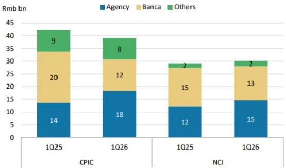

bar_stacked

| Rating | Quarter | Agency (Rmb bn) | Banca (Rmb bn) | Others (Rmb bn) |
| :--- | :--- | :--- | :--- | :--- |
| CPIC | 1Q25 | 14 | 20 | 9 |
| CPIC | 1Q26 | 18 | 12 | 8 |
| NCI | 1Q25 | 12 | 15 | 2 |
| NCI | 1Q26 | 15 | 13 | 2 |

Insurers FYP y-y trends were diversified in 1Q26, due to structure optimization   
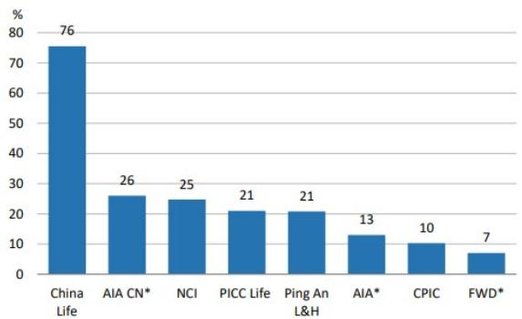

bar

| Company | Value (%) |
| :--- | :--- |
| China Life | 76 |
| AIA CN* | 26 |
| NCI | 25 |
| PICC Life | 21 |
| Ping An L&H | 21 |
| AIA* | 13 |
| CPIC | 10 |
| FWD* | 7 |

\*AIA Group, AIA CN and FWD were under CER basis

Most insurers' agent number increased q-q in 1Q26   
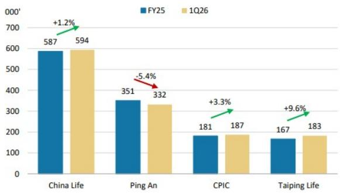

bar

| Company | FY25 | 1Q26 | Change (%) |
| :--- | :--- | :--- | :--- |
| China Life | 587 | 594 | +1.2 |
| Ping An | 351 | 332 | -5.4 |
| CPIC | 181 | 187 | +3.3 |
| Taiping Life | 167 | 183 | +9.6 |

Source: Company data; MS

# MS

MS

Hong Kong/China Insurance

May 18, 2026

# 2. 1Q26 Wrap-up: P&C and Solvency

Core solvency ratios trend mixed for insurers in 1Q26 q-q   
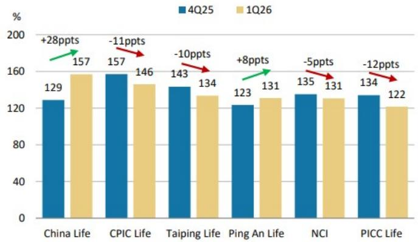

bar

| Company | 4Q25 (%) | 1Q26 (%) | Change (ppts) |
| :--- | :--- | :--- | :--- |
| China Life | 129 | 157 | +28 |
| CPIC Life | 157 | 146 | -11 |
| Taiping Life | 143 | 134 | -10 |
| Ping An Life | 123 | 131 | +8 |
| NCI | 135 | 131 | -5 |
| PICC Life | 134 | 122 | -12 |

P&C insurers earnings performance y-y   
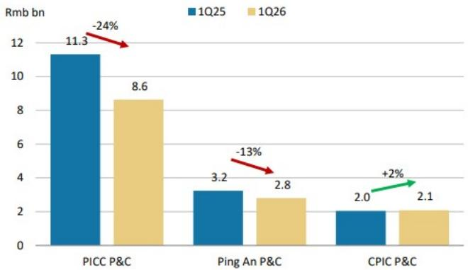

bar

| Company | 1Q25 (Rmb bn) | 1Q26 (Rmb bn) | Change (%) |
| :--- | :--- | :--- | :--- |
| PICC P&C | 11.3 | 8.6 | -24 |
| Ping An P&C | 3.2 | 2.8 | -13 |
| CPIC P&C | 2.0 | 2.1 | +2 |

Source: Company data; MS

P&C insurers' CoR saw y-y improvement in 1Q26   
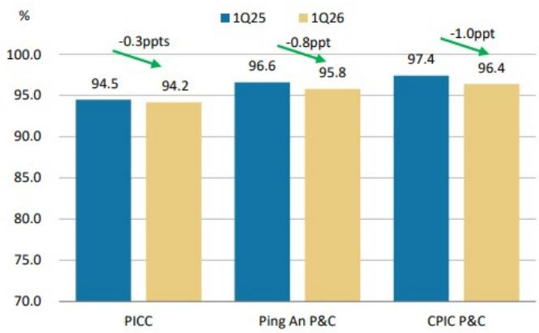

bar

| Company | 1Q25 (%) | 1Q26 (%) | Change (ppt) |
| :--- | :--- | :--- | :--- |
| PICC | 94.5 | 94.2 | -0.3 |
| Ping An P&C | 96.6 | 95.8 | -0.8 |
| CPIC P&C | 97.4 | 96.4 | -1.0 |

P&C premiums growth y-y in 1Q26   
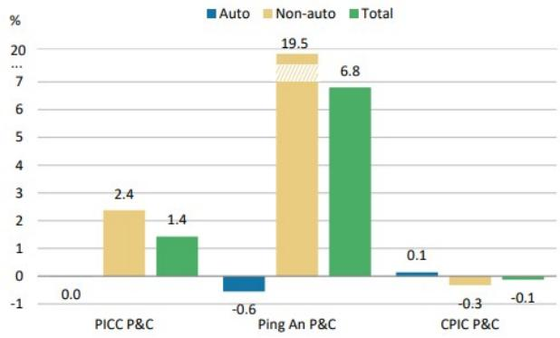

bar

| Category | Auto (%) | Non-auto (%) | Total (%) |
|---|---|---|---|
| PICC P&C | 0.0 | 2.4 | 1.4 |
| Ping An P&C | -0.6 | 19.5 | 6.8 |
| CPIC P&C | 0.1 | -0.3 | -0.1 |

# MS

MS

Hong Kong/China Insurance

May 18, 2026

# 3. FY25 Wrap-up: Key Market Focus

4Q25 earnings vs. 4Q24 earnings - broad-based decline triggered market concerns   
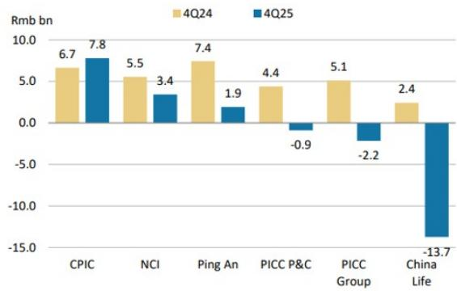

bar

| Company | 4Q24 (Rmb bn) | 4Q25 (Rmb bn) |
| :--- | :--- | :--- |
| CPIC | 6.7 | 7.8 |
| NCI | 5.5 | 3.4 |
| Ping An | 7.4 | 1.9 |
| PICC P&C | 4.4 | -0.9 |
| PICC Group | 5.1 | -2.2 |
| China Life | 2.4 | -13.7 |

Ping An and CPIC saw earnings growth on favorable bases   
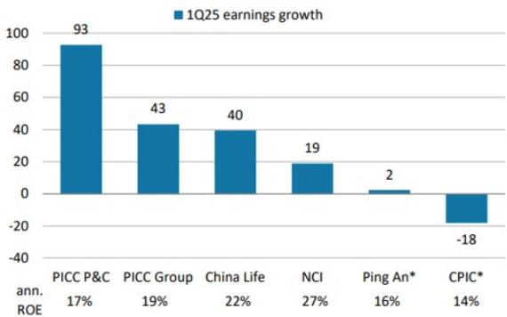

bar

1Q25 earnings growth
| Company | 1Q25 earnings growth (ann. ROE) |
| :--- | :--- |
| PICC P&C | 93 |
| PICC Group | 43 |
| China Life | 40 |
| NCI | 19 |
| Ping An* | 2 |
| CPIC* | -18 |

\*Operating ROE for Ping An and CPIC.   
Source: Company data; MS

Some insurers' group ROE reached notable 25-35% in 2025   
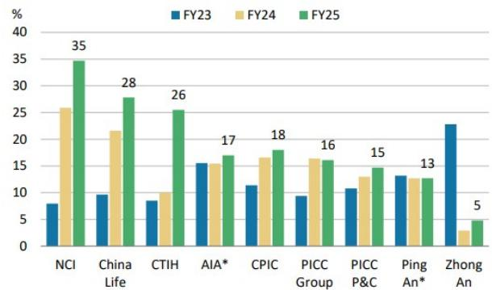

bar

| Company | FY23 (%) | FY24 (%) | FY25 (%) |
| :--- | :--- | :--- | :--- |
| NCI | 8 | 26 | 35 |
| China Life | 9.5 | 21.5 | 28 |
| CTIH | 8.5 | 10 | 26 |
| AIA* | 15.5 | 15.5 | 17 |
| CPIC | 11.5 | 16.5 | 18 |
| PICC Group | 9.5 | 16.5 | 16 |
| PICC P&C | 10.5 | 13 | 15 |
| Ping An* | 13.5 | 12.5 | 13 |
| Zhong An | 23 | 3 | 5 |

\*Operating ROE for Ping An and AIA.

VNB growth was strong across China insurers in FY25   
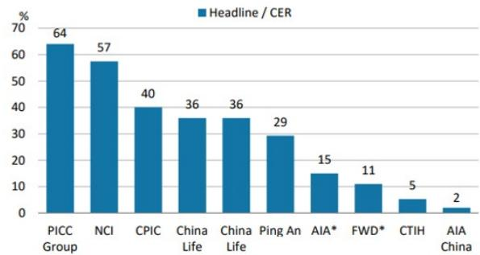

bar

| Company | Headline / CER (%) |
|---|---|
| PICC Group | 64 |
| NCI | 57 |
| CPIC | 40 |
| China Life | 36 |
| China Life | 36 |
| Ping An | 29 |
| AIA* | 15 |
| FWD* | 11 |
| CTIH | 5 |
| AIA China | 2 |

# MS

MS

Hong Kong/China Insurance

May 18, 2026

# 3. FY25 Wrap-up: Key Market Focus

VNB growth in agency channel vs. banca – most big China insurers doubled their banca VNB   
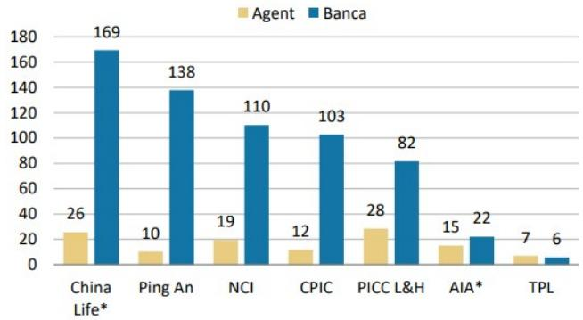

bar

| Entity | Agent | Banca |
| :--- | :--- | :--- |
| China Life* | 26 | 169 |
| Ping An | 10 | 138 |
| NCI | 19 | 110 |
| CPIC | 12 | 103 |
| PICC L&H | 28 | 82 |
| AIA* | 15 | 22 |
| TPL | 7 | 6 |

\* CL and AIA refer to non-agency channel

CSM balance further improved vs. FY24 across most names   
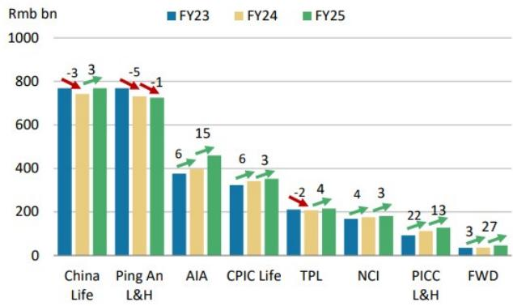

bar

| Company | FY23 (Rmb bn) | FY24 (Rmb bn) | FY25 (Rmb bn) |
| :--- | :--- | :--- | :--- |
| China Life | 780 | 750 | 780 |
| Ping An L&H | 780 | 740 | 730 |
| AIA | 380 | 400 | 460 |
| CPIC Life | 320 | 350 | 360 |
| TPL | 210 | 220 | 220 |
| NCI | 170 | 180 | 190 |
| PICC L&H | 100 | 120 | 130 |
| FWD | 40 | 50 | 60 |
Red arrows indicate percentage changes: -3, -5, -6, -1, -2, -3, -5, -15, -2, -4, -3, -13, -27 respectively.

Source: Company data; MS

Much higher par mix in first-year regular premiums   
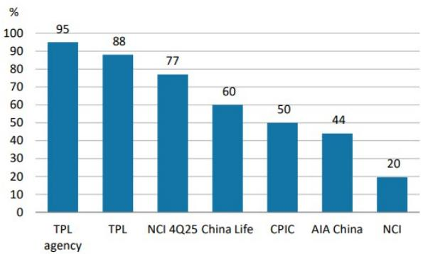

bar

| Category | Value (%) |
|---|---|
| TPL agency | 95 |
| TPL | 88 |
| NCI 4Q25 | 77 |
| China Life | 60 |
| CPIC | 50 |
| AIA China | 44 |
| NCI | 20 |

\* CL was of agent channel; AIA CN incl. par and UL, and was as of VNB in 2H25

Group EV growth at healthy levels in 2025, with higher ROEV expectations across peers   
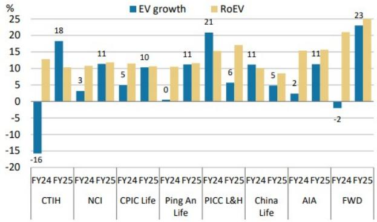

bar

| Category | EV growth (%) | RoEV (%) |
| :--- | :--- | :--- |
| CTIH | -16 | 13 |
| NCI | 3 | 10 |
| CPIC Life | 5 | 11 |
| Ping An Life | 0 | 11 |
| PICC L&H | 21 | 15 |
| China Life | 6 | 17 |
| AIA | 5 | 8 |
| FWD | -2 | 23 |

# MS

MS

Hong Kong/China Insurance

May 18, 2026

# 3. FY25 Wrap-up: Key Market Focus

FVOCI assets still account for a higher mix across most names   
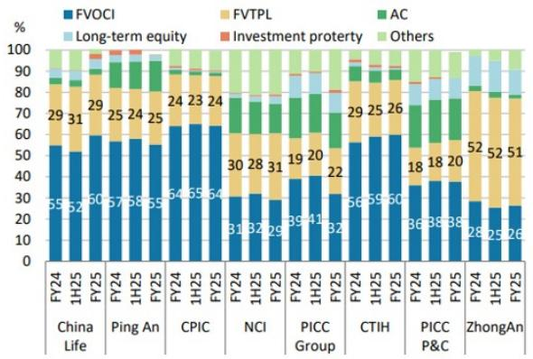

bar_stacked

| Company | Period | FVOCI (%) | FVTPL (%) | AC (%) | Long-term equity (%) | Investment proterty (%) | Others (%) |
| :--- | :--- | :--- | :--- | :--- | :--- | :--- | :--- |
| China Life | FY24 | 55 | 29 | 31 | 6 | 0 | 0 |
| China Life | FY25 | 52 | 31 | 31 | 6 | 0 | 0 |
| Ping An | FY24 | 60 | 29 | 29 | 7 | 0 | 0 |
| Ping An | FY25 | 57 | 25 | 24 | 8 | 0 | 0 |
| CPIC | FY24 | 58 | 25 | 24 | 8 | 0 | 0 |
| CPIC | FY25 | 59 | 24 | 23 | 8 | 0 | 0 |
| NCI | FY24 | 64 | 24 | 30 | 8 | 0 | 0 |
| NCI | FY25 | 65 | 23 | 28 | 8 | 0 | 0 |
| PICC Group | FY24 | 64 | 24 | 31 | 8 | 0 | 0 |
| PICC Group | FY25 | 31 | 30 | 28 | 8 | 0 | 0 |
| CTIH | FY24 | 32 | 31 | 19 | 8 | 0 | 0 |
| CTIH | FY25 | 29 | 19 | 20 | 8 | 0 | 0 |
| PICC P&C | FY24 | 32 | 22 | 29 | 8 | 0 | 0 |
| PICC P&C | FY25 | 36 | 18 | 25 | 8 | 0 | 0 |
| ZhongAn | FY24 | 38 | 18 | 20 | 8 | 0 | 0 |
| ZhongAn | FY25 | 38 | 18 | 20 | 8 | 0 | 0 |
| China Life (FY24) - FVOCI (%) = 55.5% + FVTPL (%) = 31.5% + AC (%) = -1.5% + Long-term equity (%) = -1.5% + Investment proterty (%) = -1.5% + Others (%) = -1.5%<lcel><lcel><lcel><lcel><lcel><lcel><lcel><lcel><nl>

VNB sensitivity – If investment returns are -50bp

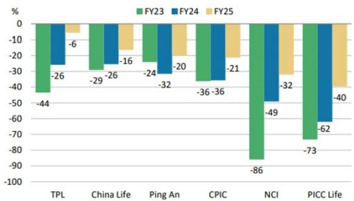

bar

| Company | FY23 (%) | FY24 (%) | FY25 (%) |
| :--- | :--- | :--- | :--- |
| TPL | -44 | -26 | -6 |
| China Life | -29 | -26 | -16 |
| Ping An | -24 | -32 | -20 |
| CPIC | -36 | -36 | -21 |
| NCI | -86 | -49 | -32 |
| PICC Life | -73 | -62 | -40 |

\* FY23 under 4.5% investment return assumption and FY24 under 4%; TPL is based off Investment return and risk discount rate decreased by 50bp

Almost all insurers raised their equity allocation in 2H25, with increases in both FVTPL and FVOCI stocks   
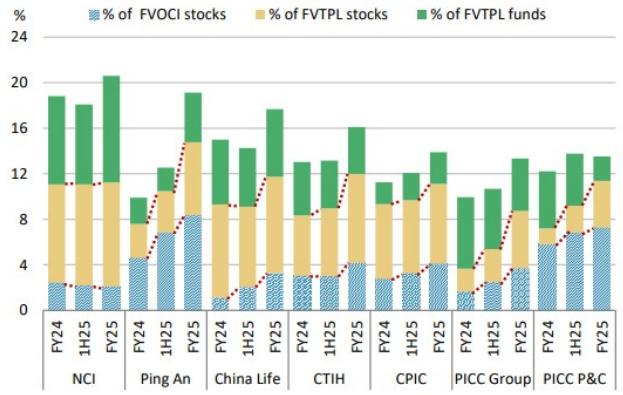

bar_stacked

| Bank | Period | % of FVOCI stocks (%) | % of FVTPL stocks (%) | % of FVTPL funds (%) |
|---|---|---|---|---|
| NCI | FY24 | 3.0 | 9.0 | 7.0 |
| NCI | 1H25 | 2.5 | 8.5 | 6.5 |
| NCI | FY25 | 2.0 | 8.0 | 10.0 |
| Ping An | FY24 | 4.0 | 3.0 | 3.0 |
| Ping An | 1H25 | 6.0 | 4.0 | 3.0 |
| Ping An | FY25 | 8.0 | 5.0 | 6.0 |
| China Life | FY24 | 1.0 | 8.0 | 6.0 |
| China Life | 1H25 | 2.0 | 7.0 | 5.0 |
| China Life | FY25 | 3.0 | 6.0 | 5.0 |
| CTIH | FY24 | 3.0 | 5.0 | 5.0 |
| CTIH | 1H25 | 3.0 | 5.0 | 5.0 |
| CTIH | FY25 | 4.0 | 6.0 | 4.0 |
| CPIC | FY24 | 3.0 | 6.0 | 4.0 |
| CPIC | 1H25 | 3.0 | 6.0 | 4.0 |
| CPIC | FY25 | 4.0 | 6.0 | 4.0 |
| PICC Group | FY24 | 1.0 | 3.0 | 6.0 |
| PICC Group | 1H25 | 2.0 | 4.0 | 4.0 |
| PICC Group | FY25 | 3.0 | 4.0 | 4.0 |
| PICC P&C | FY24 | 6.0 | 3.0 | 4.0 |
| PICC P&C | 1H25 | 7.0 | 3.0 | 4.0 |
| PICC P&C | FY25 | 7.5 | 3.0 | 4.0 |

VIF sensitivity – If investment returns are -50bp   
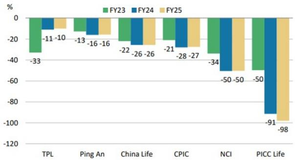

bar

| Company | FY23 (%) | FY24 (%) | FY25 (%) |
| :--- | :--- | :--- | :--- |
| TPL | -33 | -11 | -10 |
| Ping An | -13 | -16 | -16 |
| China Life | -22 | -26 | -26 |
| CPIC | -21 | -28 | -27 |
| NCI | -34 | -50 | -50 |
| PICC Life | -50 | -91 | -98 |

\* FY23 under 4.5% investment return assumption and FY24 under 4%; TPL is based off Investment return and risk discount rate decreased by 50bp; Ping An is based off Ping An L&H EV   
Source: Company data; MS

# MS

MS

Hong Kong/China Insurance

May 18, 2026

# 3. FY25 Wrap-up: Group Performance

Earnings grew strongly across peers   
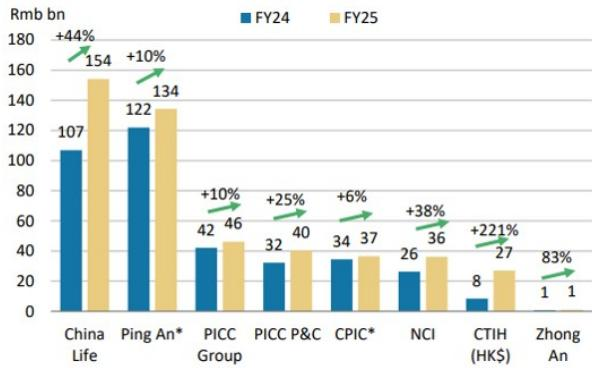

bar

| Company | FY24 (Rmb bn) | FY25 (Rmb bn) | Change (%) |
| :--- | :--- | :--- | :--- |
| China Life | 107 | 154 | +44 |
| Ping An* | 122 | 134 | +10 |
| PICC Group | 42 | 46 | +10 |
| PICC P&C | 32 | 40 | +25 |
| CPIC* | 34 | 37 | +6 |
| NCI | 26 | 36 | +38 |
| CTIH (HK$) | 8 | 27 | +221 |
| Zhong An | 1 | 1 | 83 |
The chart displays a series of values for FY24 and FY25 across the categories. The percentage change between consecutive FY24 and FY25 is indicated by arrows on the bars.

\* PA and CPIC are based off headline OPAT, and NPAT up 6.5% and 19%, respectively

Group total assets experienced solid growth   
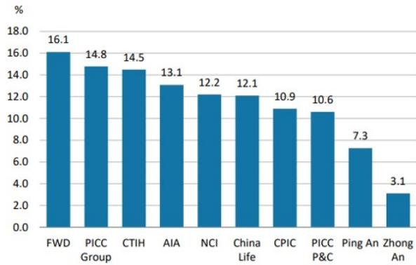

bar

| Company | Value (%) |
| :--- | :--- |
| FWD | 16.1 |
| PICC Group | 14.8 |
| CTIH | 14.5 |
| AIA | 13.1 |
| NCI | 12.2 |
| China Life | 12.1 |
| CPIC | 10.9 |
| PICC P&C | 10.6 |
| Ping An | 7.3 |
| Zhong An | 3.1 |

Source: Company data; MS

Insurers reported strong net earnings growth in 2025   
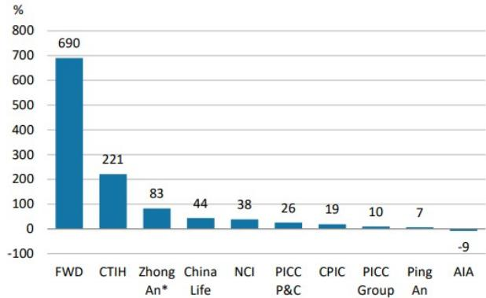

bar

| Entity | Value (%) |
| :--- | :--- |
| FWD | 690 |
| CTIH | 221 |
| Zhong An* | 83 |
| China Life | 44 |
| NCI | 38 |
| PICC P&C | 26 |
| CPIC | 19 |
| PICC Group | 10 |
| Ping An | 7 |
| AIA | -9 |

\* Ping An, AIA and FWD's OPAT up 10%, 16% and 8%, respectively

Most insurers lowered their payout ratios for sustainable growth   
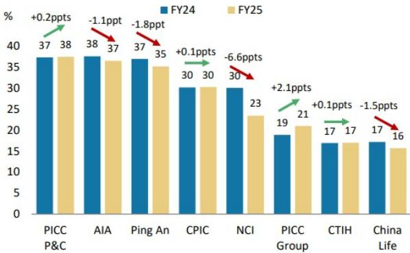

bar

| Category | FY24 (%) | FY25 (%) | Change (ppts) |
| :--- | :--- | :--- | :--- |
| PICC P&C | 37 | 38 | +0.2 |
| AIA | 38 | 37 | -1.1 |
| Ping An | 37 | 35 | -1.8 |
| CPIC | 30 | 30 | +0.1 |
| NCI | 30 | 23 | -6.6 |
| PICC Group | 19 | 21 | +2.1 |
| CTIH | 17 | 17 | +0.1 |
| China Life | 17 | 16 | -1.5 |

Group shareholders' equity growth saw broad-based healthy improvement   
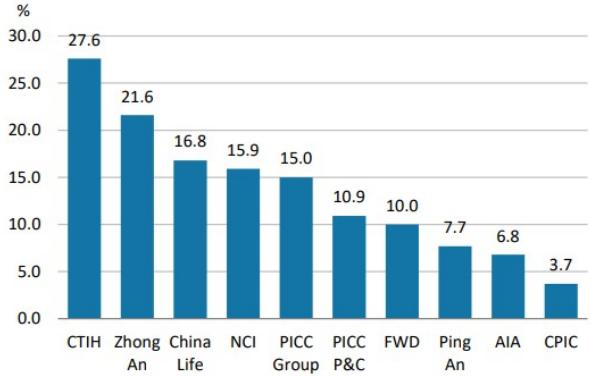

bar

| Company | Value (%) |
| :--- | :--- |
| CTIH | 27.6 |
| Zhong An | 21.6 |
| China Life | 16.8 |
| NCI | 15.9 |
| PICC Group | 15.0 |
| PICC P&C | 10.9 |
| FWD | 10.0 |
| Ping An | 7.7 |
| AIA | 6.8 |
| CPIC | 3.7 |

DPS saw a broad-based increase across peers

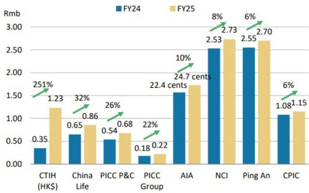

bar

| Company | FY24 (Rmb) | FY25 (Rmb) | Growth (%) |
| :--- | :--- | :--- | :--- |
| CTIH (HK$) | 0.35 | 1.23 | 251 |
| China Life | 0.65 | 0.86 | 32 |
| PICC P&C | 0.54 | 0.68 | 26 |
| PICC Group | 0.18 | 0.22 | 22 |
| AIA | 1.58 | 1.72 | 10 |
| NCI | 2.53 | 2.73 | 8 |
| Ping An | 2.55 | 2.70 | 6 |
| CPIC | 1.08 | 1.15 | 6 |

# MS

MS

Hong Kong/China Insurance

May 18, 2026

# 3. FY25 Wrap-up: Life Business

Earnings growth for Life business in 2025   
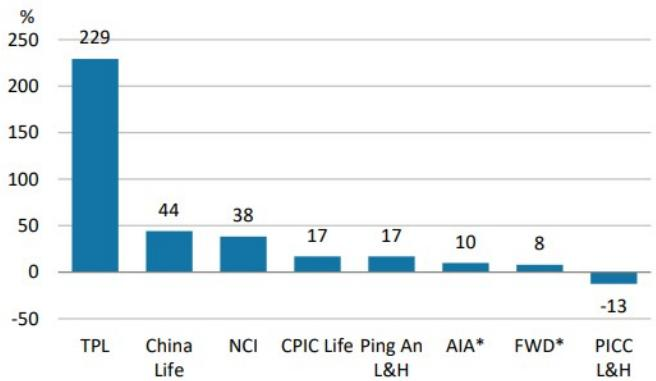

bar

| Company | Value (%) |
| :--- | :--- |
| TPL | 229 |
| China Life | 44 |
| NCI | 38 |
| CPIC Life | 17 |
| Ping An L&H | 17 |
| AIA* | 10 |
| FWD* | 8 |
| PICC L&H | -13 |

\* Operating profit for AIA and FWD

China insurers' 13-month persistency ratios in 2025   
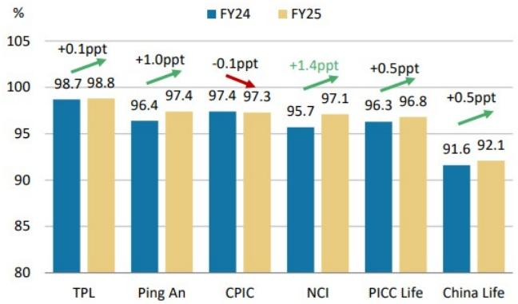

bar

| Company | FY24 (%) | FY25 (%) | Change (ppt) |
| :--- | :--- | :--- | :--- |
| TPL | 98.7 | 98.8 | +0.1 |
| Ping An | 96.4 | 97.4 | +1.0 |
| CPIC | 97.4 | 97.3 | -0.1 |
| NCI | 95.7 | 97.1 | +1.4 |
| PICC Life | 96.3 | 96.8 | +0.5 |
| China Life | 91.6 | 92.1 | +0.5 |

Source: Company data; MS

Strong life business ROE >20% for China insurers in 2025 across peers   
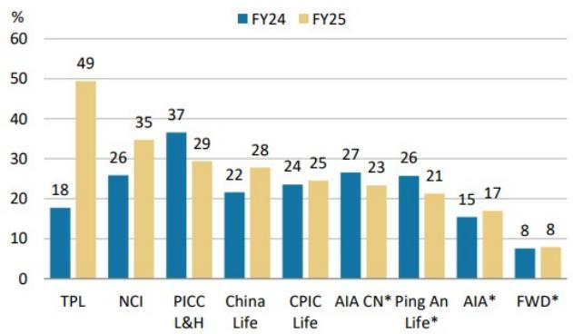

bar

| Company | FY24 (%) | FY25 (%) |
| :--- | :--- | :--- |
| TPL | 18 | 49 |
| NCI | 26 | 35 |
| PICC L&H | 37 | 29 |
| China Life | 22 | 28 |
| CPIC Life | 24 | 25 |
| AIA CN* | 27 | 23 |
| Ping An Life* | 26 | 21 |
| AIA* | 15 | 17 |
| FWD* | 8 | 8 |

\*Operating ROE for Ping An and CPIC.

China insurers' 25-month persistency ratios rose in 2025   
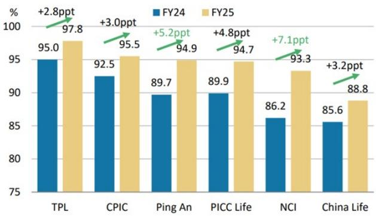

bar

| Company | FY24 (%) | FY25 (%) | Change (ppt) |
| :--- | :--- | :--- | :--- |
| TPL | 95.0 | 97.8 | +2.8 |
| CPIC | 92.5 | 95.5 | +3.0 |
| Ping An | 89.7 | 94.9 | +5.2 |
| PICC Life | 89.9 | 94.7 | +4.8 |
| NCI | 86.2 | 93.3 | +7.1 |
| China Life | 85.6 | 88.8 | +3.2 |

# MS

MS

Hong Kong/China Insurance

May 18, 2026

# 3. FY25 Wrap-up: Life Business

Overall VNB margin increased across life insurers   
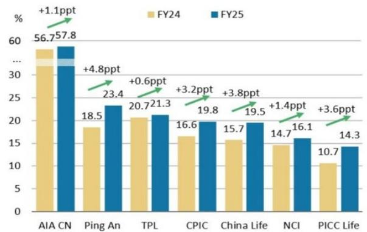

bar

| Company | FY24 (%) | FY25 (%) | Change (ppt) |
| :--- | :--- | :--- | :--- |
| AIA CN | 32.0 | 33.7 | +1.1 |
| Ping An | 18.5 | 23.4 | +4.8 |
| TPL | 20.7 | 21.3 | +0.6 |
| CPIC | 16.6 | 19.8 | +3.2 |
| China Life | 15.7 | 19.5 | +3.8 |
| NCI | 14.7 | 16.1 | +1.4 |
| PICC Life | 10.7 | 14.3 | +3.6 |

Most insurers saw stabilized agent headcount in 2025 except for Taiping

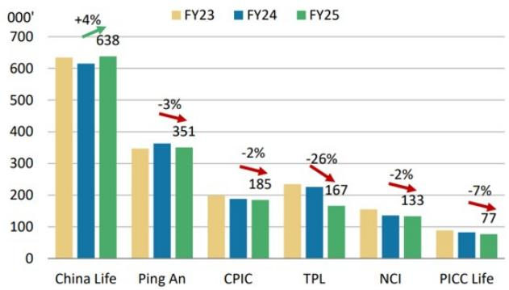

bar

| Company | FY23 | FY24 | FY25 |
| :--- | :--- | :--- | :--- |
| China Life | 638 | 610 | 638 |
| Ping An | 351 | 360 | 351 |
| CPIC | 200 | 190 | 185 |
| TPL | 235 | 225 | 167 |
| NCI | 155 | 140 | 133 |
| PICC Life | 90 | 85 | 77 |
+4% indicates increase from FY23 to FY25 for China Life; -3% and -2% indicate decreases from FY23 to FY25 for Ping An and CPIC respectively; -7% indicates decrease from FY23 to PICC Life.

Source: Company data; MS

Agency channel margin increased, except for NCI   
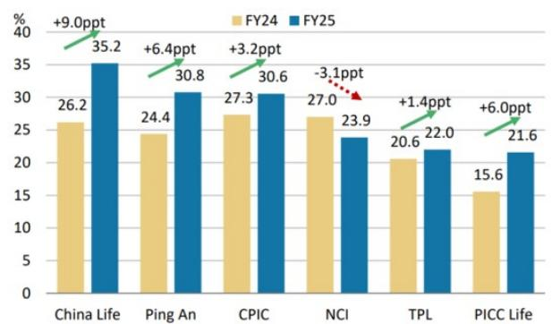

bar

| Company | FY24 (%) | FY25 (%) | Change (ppt) |
| :--- | :--- | :--- | :--- |
| China Life | 26.2 | 35.2 | +9.0 |
| Ping An | 24.4 | 30.8 | +6.4 |
| CPIC | 27.3 | 30.6 | +3.2 |
| NCI | 27.0 | 23.9 | -3.1 |
| TPL | 20.6 | 22.0 | +1.4 |
| PICC Life | 15.6 | 21.6 | +6.0 |

Bancassurance channel margin increased for most players to double-digit levels

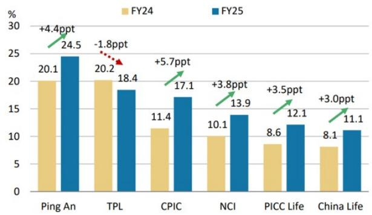

bar

| Company | FY24 (%) | FY25 (%) | Change (ppt) |
| :--- | :--- | :--- | :--- |
| Ping An | 20.1 | 24.5 | +4.4 |
| TPL | 20.2 | 18.4 | -1.8 |
| CPIC | 11.4 | 17.1 | +5.7 |
| NCI | 10.1 | 13.9 | +3.8 |
| PICC Life | 8.6 | 12.1 | +3.5 |
| China Life | 8.1 | 11.1 | +3.0 |

# MS

MS

Hong Kong/China Insurance

May 18, 2026

# 3. FY25 Wrap-up: Life Business

Agent monthly VNB productivity increased by double digits across all players   
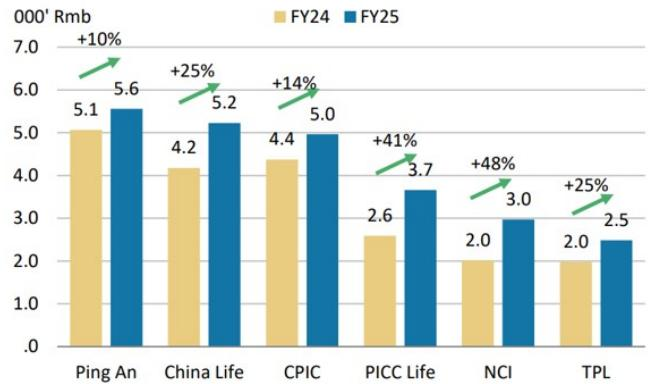

bar

| Company | FY24 (Rmb) | FY25 (Rmb) | Growth (%) |
| :--- | :--- | :--- | :--- |
| Ping An | 5.1 | 5.6 | +10 |
| China Life | 4.2 | 5.2 | +25 |
| CPIC | 4.4 | 5.0 | +14 |
| PICC Life | 2.6 | 3.7 | +41 |
| NCI | 2.0 | 3.0 | +48 |
| TPL | 2.0 | 2.5 | +25 |

FYP mix for Chinese insurers – Banca channel proportion increased slightly across most peers

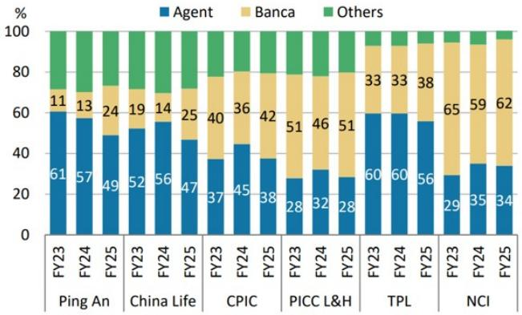

bar_stacked

| Company | Period | Agent (%) | Banca (%) | Others (%) |
| :--- | :--- | :--- | :--- | :--- |
| Ping An | FY23 | 61 | 11 | 24 |
| Ping An | FY24 | 57 | 13 | 28 |
| Ping An | FY25 | 49 | 24 | 26 |
| China Life | FY23 | 52 | 19 | 24 |
| China Life | FY24 | 56 | 14 | 28 |
| China Life | FY25 | 47 | 25 | 30 |
| CPIC | FY23 | 37 | 40 | 26 |
| CPIC | FY24 | 45 | 36 | 24 |
| CPIC | FY25 | 38 | 42 | 26 |
| PICC L&H | FY23 | 28 | 51 | 26 |
| PICC L&H | FY24 | 32 | 46 | 26 |
| PICC L&H | FY25 | 28 | 51 | 26 |
| TPL | FY23 | 60 | 33 | 10 |
| TPL | FY24 | 60 | 33 | 10 |
| TPL | FY25 | 56 | 38 | 10 |
| NCI | FY23 | 29 | 65 | 10 |
| NCI | FY24 | 35 | 59 | 10 |
| NCI | FY25 | 34 | 62 | 10 |

Source: Company data; MS

FY25 FYP growth in agency channel vs. banca   
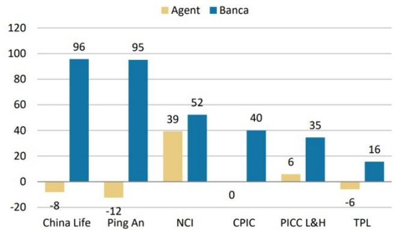

bar

| Company | Agent | Banca |
| :--- | :--- | :--- |
| China Life | -8 | 96 |
| Ping An | -12 | 95 |
| NCI | 39 | 52 |
| CPIC | 0 | 40 |
| PICC L&H | 6 | 35 |
| TPL | -6 | 16 |

VNB mix for Chinese insurers – Increased banca contribution, while agent channel still accounted for most of VNB

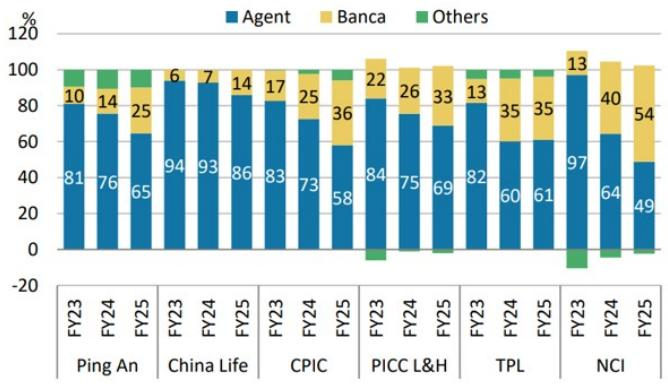

bar_stacked

| Category | Period | Agent (%) | Banca (%) | Others (%) |
|---|---|---|---|---|
| Ping An | FY23 | 81 | 10 | 0 |
| Ping An | FY24 | 76 | 14 | 0 |
| Ping An | FY25 | 65 | 25 | 0 |
| China Life | FY23 | 94 | 6 | 0 |
| China Life | FY24 | 93 | 7 | 0 |
| China Life | FY25 | 86 | 14 | 0 |
| CPIC | FY23 | 83 | 17 | 0 |
| CPIC | FY24 | 73 | 25 | 0 |
| CPIC | FY25 | 58 | 36 | 0 |
| PICC L&H | FY23 | 84 | 22 | -5 |
| PICC L&H | FY24 | 75 | 26 | 0 |
| PICC L&H | FY25 | 69 | 33 | -5 |
| TPL | FY23 | 82 | 13 | 0 |
| TPL | FY24 | 60 | 35 | 0 |
| TPL | FY25 | 61 | 35 | 0 |
| NCI | FY23 | 97 | 13 | -10 |
| NCI | FY24 | 64 | 40 | -5 |
| NCI | FY25 | 49 | 54 | -5 |

# MS

MS

Hong Kong/China Insurance

May 18, 2026

# 3. FY25 Wrap-up: P&C Business

2025 P&C earnings were strong   
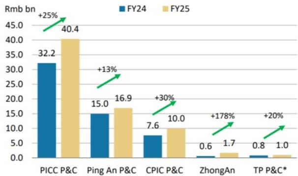

bar

| Category | FY24 (Rmb bn) | FY25 (Rmb bn) | Growth (%) |
| :--- | :--- | :--- | :--- |
| PICC P&C | 32.2 | 40.4 | +25 |
| Ping An P&C | 15.0 | 16.9 | +13 |
| CPIC P&C | 7.6 | 10.0 | +30 |
| ZhongAn | 0.6 | 1.7 | +178 |
| TP P&C* | 0.8 | 1.0 | +20 |

\*HK\$ and NPAT for Taiping P&C, while others are all NPATSH

P&C players' ROE   
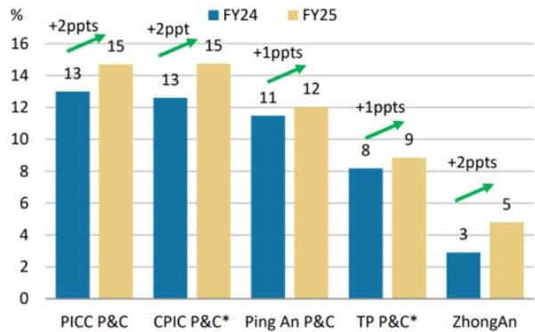

bar

| Category | FY24 (%) | FY25 (%) | Change (%) |
|---|---|---|---|
| PICC P&C | 13 | 15 | +2ppts |
| CPIC P&C* | 13 | 15 | +2ppt |
| Ping An P&C | 11 | 12 | +1ppts |
| TP P&C* | 8 | 9 | +1ppts |
| ZhongAn | 3 | 5 | +2ppts |

\*ROE for CPIC P&C and TP P&C are calculated.

CoR improved across P&C insurers   
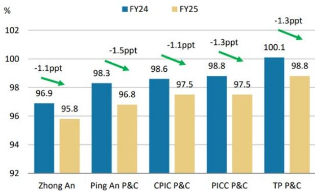

bar

| Index | FY24 (%) | FY25 (%) | Change (ppt) |
|---|---|---|---|
| Zhong An | 96.9 | 95.8 | -1.1 |
| Ping An P&C | 98.3 | 96.8 | -1.5 |
| CPIC P&C | 98.6 | 97.5 | -1.1 |
| PICC P&C | 98.8 | 97.5 | -1.3 |
| TP P&C | 100.1 | 98.8 | -1.3 |

Auto and non-auto CoR showed diversified trends   
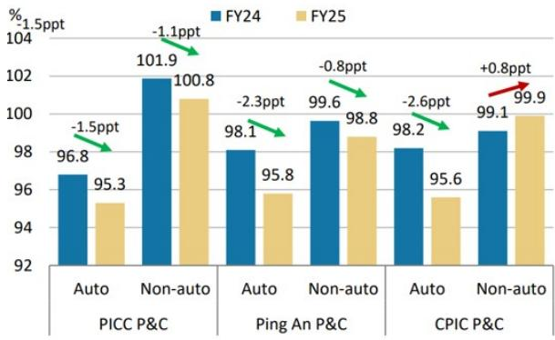

bar

| Category | Auto (%) | Non-auto (%) |
| :--- | :--- | :--- |
| PICC P&C FY24 | 96.8 | 101.9 |
| PICC P&C FY25 | -1.5 | 100.8 |
| Ping An P&C FY24 | 98.1 | 99.6 |
| Ping An P&C FY25 | -2.3 | 98.8 |
| CPIC P&C FY24 | 98.2 | 99.1 |
| CPIC P&C FY25 | -2.6 | 99.9 |
The chart includes a red arrow indicating a +0.8ppt change in the latter two bars. The green arrows show percentage point changes relative to the previous data points.

P&C premium growth and mix   
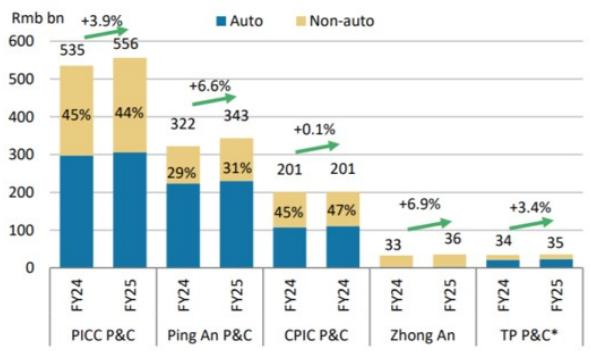

bar_stacked

| Company | Period | Auto (Rmb bn) | Non-auto (Rmb bn) | Total (Rmb bn) | YoY Growth (%) |
| :--- | :--- | :--- | :--- | :--- | :--- |
| PICC P&C | FY24 | 300 | 180 | 535 | +3.9 |
| PICC P&C | FY25 | 300 | 180 | 556 | +3.9 |
| Ping An P&C | FY24 | 220 | 70 | 322 | +6.6 |
| Ping An P&C | FY25 | 230 | 70 | 343 | +6.6 |
| CPIC P&C | FY24 | 100 | 60 | 201 | +0.1 |
| CPIC P&C | FY24 | 100 | 60 | 201 | +0.1 |
| Zhong An | FY24 | 10 | 10 | 33 | +6.9 |
| Zhong An | FY25 | 10 | 10 | 36 | +6.9 |
| TP P&C* | FY24 | 10 | 10 | 34 | +3.4 |
| TP P&C* | FY25 | 10 | 10 | 35 | +3.4 |

\*TP P&C are HK\$.

NEV proportion reached >20% as of overall auto premium   
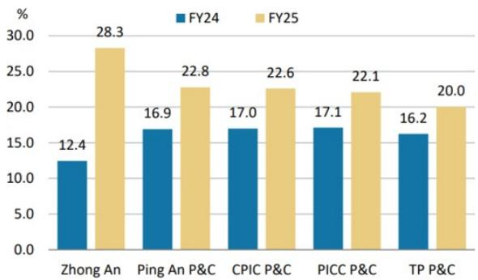

bar

| Category | FY24 (%) | FY25 (%) |
|---|---|---|
| Zhong An | 12.4 | 28.3 |
| Ping An P&C | 16.9 | 22.8 |
| CPIC P&C | 17.0 | 22.6 |
| PICC P&C | 17.1 | 22.1 |
| TP P&C | 16.2 | 20.0 |

Source: Company data; MS

# MS

MS

Hong Kong/China Insurance

May 18, 2026

# 3. FY25 Wrap-up: Investment and Capital

Net investment yields down 0.3-0.4ppt for most insurers   
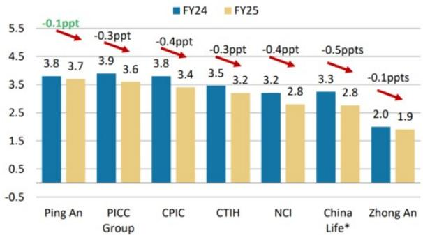

bar

| Company | FY24 (Value) | FY25 (Value) | Change (ppt) |
| :--- | :--- | :--- | :--- |
| Ping An | 3.8 | 3.7 | -0.1 |
| PICC Group | 3.9 | 3.6 | -0.3 |
| CPIC | 3.8 | 3.4 | -0.4 |
| CTIH | 3.5 | 3.2 | -0.3 |
| NCI | 3.2 | 2.8 | -0.4 |
| China Life* | 3.3 | 2.8 | -0.5 |
| Zhong An | 2.0 | 1.9 | -0.1 |
The chart displays a series of values for FY24 (blue bars) and FY25 (yellow bars), with red arrows indicating statistical changes.

\*CL data was calculated

Most insurers' gross investment yields remained at $>5.5\%$   
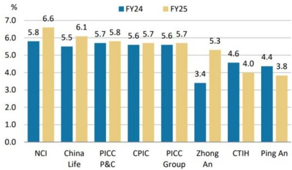

bar

| Company | FY24 (%) | FY25 (%) |
| :--- | :--- | :--- |
| NCI | 5.8 | 6.6 |
| China Life | 5.5 | 6.1 |
| PICC P&C | 5.7 | 5.8 |
| CPIC | 5.6 | 5.7 |
| PICC Group | 5.6 | 5.7 |
| Zhong An | 3.4 | 5.3 |
| CTIH | 4.6 | 4.0 |
| Ping An | 4.4 | 3.8 |

Life insurers' core solvency ratios all remain adequate across peers   
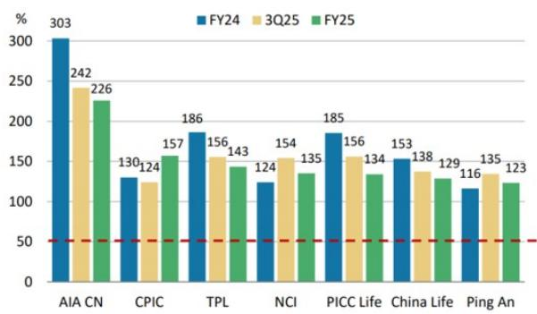

bar

| Company | FY24 (%) | 3Q25 (%) | FY25 (%) |
| :--- | :--- | :--- | :--- |
| AIA CN | 303 | 242 | 226 |
| CPIC | 130 | 124 | 157 |
| TPL | 186 | 156 | 143 |
| NCI | 124 | 154 | 135 |
| PICC Life | 185 | 156 | 134 |
| China Life | 153 | 138 | 129 |
| Ping An | 116 | 135 | 123 |
The red dashed line at 50% serves as a reference threshold.

Source: Company data; MS

Comprehensive solvency at the group level   
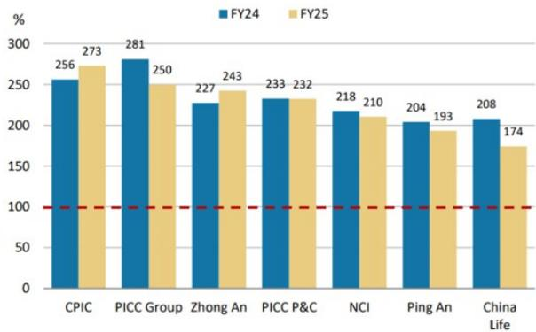

bar

| Company | FY24 (%) | FY25 (%) |
| :--- | :--- | :--- |
| CPIC | 256 | 273 |
| PICC Group | 281 | 250 |
| Zhong An | 227 | 243 |
| PICC P&C | 233 | 232 |
| NCI | 218 | 210 |
| Ping An | 204 | 193 |
| China Life | 208 | 174 |
A dashed red line at 100% indicates a threshold.

Some insurers' comprehensive yields fell notably in FY25 due to rate impact   
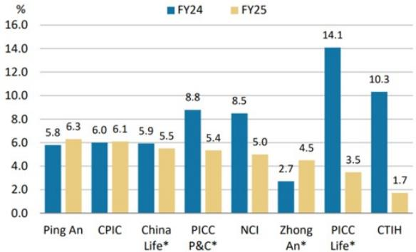

bar

| Company | FY24 (%) | FY25 (%) |
| :--- | :--- | :--- |
| Ping An | 5.8 | 6.3 |
| CPIC | 6.0 | 6.1 |
| China Life* | 5.9 | 5.5 |
| PICC P&C* | 8.8 | 5.4 |
| NCI | 8.5 | 5.0 |
| Zhong An* | 2.7 | 4.5 |
| PICC Life* | 14.1 | 3.5 |
| CTIH | 10.3 | 1.7 |

\*Ping An data was calculated

P&C players' comprehensive ratios   
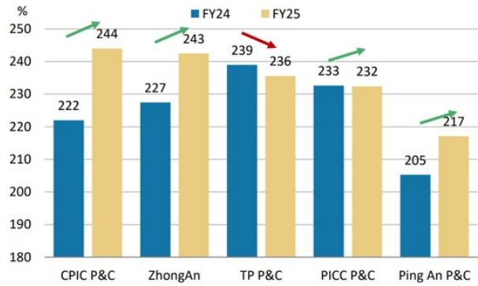

bar

| Category | FY24 (%) | FY25 (%) |
|---|---|---|
| CPIC P&C | 222 | 244 |
| ZhongAn | 227 | 243 |
| TP P&C | 239 | 236 |
| PICC P&C | 233 | 232 |
| Ping An P&C | 205 | 217 |

# MS

MS

Hong Kong/China Insurance

May 18, 2026

# 4. AIA – Resilient Performance and More Sustainable Growth

- AIA's share price has held up much better vs. China's domestic names over the past 2-3 months, as the company has seen very limited impact from market volatility; 1Q26 disclosed VNB data only, with no earnings.   
- VNB growth is still key for investors to track; we think China could be the engine, helping it maintain \~15% VNB growth in FY26 and FY27, and 13% growth in 1Q is on-track with full-year consensus growth.   
- Buybacks could support the share price in 2Q26. However, we see limited near-term catalysts.   
- Valuation at 1.35x 26E P/EV is higher than peers, with 12-month VNB multiple of 3.7x; we see FY26E EV growth at >10%.

AIA has completed HKD6.2bn buyback as of May 14, \~US\$0.8bn vs. planned US\$1.7bn   
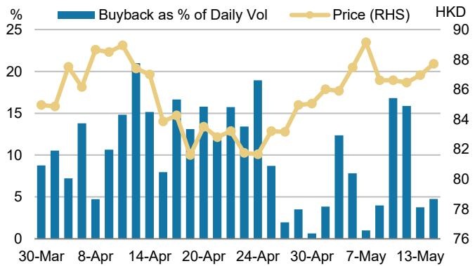

bar_line

| Date     | Buyback as % of Daily Vol | Price (RHS) |
|----------|----------------------------|-------------|
| 30-Mar   | 9                          | 85          |
| 8-Apr    | 14                         | 86          |
| 14-Apr   | 21                         | 84          |
| 20-Apr   | 16                         | 82          |
| 24-Apr   | 19                         | 83          |
| 30-Apr   | 3                          | 85          |
| 7-May    | 12                         | 89          |
| 13-May   | 16                         | 87          |

P/EV Valuation   
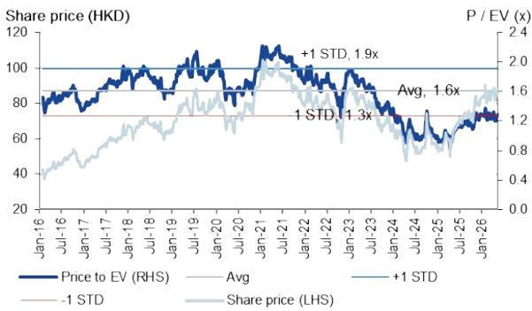

line

| Date   | Price to EV (RHS) | Avg  | +1 STD | -1 STD | Share price (LHS) |
|--------|-------------------|------|--------|--------|-------------------|
| Jan-16 | ~80               | ~40  | 1.9    | 1.3    | ~80               |
| Jul-16 | ~85               | ~50  | 1.9    | 1.3    | ~85               |
| Jan-17 | ~90               | ~60  | 1.9    | 1.3    | ~90               |
| Jul-17 | ~95               | ~70  | 1.9    | 1.3    | ~95               |
| Jan-18 | ~100              | ~80  | 1.9    | 1.3    | ~100              |
| Jul-18 | ~105              | ~90  | 1.9    | 1.3    | ~105              |
| Jan-19 | ~110              | ~100 | 1.9    | 1.3    | ~110              |
| Jul-19 | ~105              | ~95  | 1.9    | 1.3    | ~105              |
| Jan-20 | ~100              | ~90  | 1.9    | 1.3    | ~100              |
| Jul-20 | ~95               | ~85  | 1.9    | 1.3    | ~95               |
| Jan-21 | ~90               | ~80  | 1.9    | 1.3    | ~90               |
| Jul-21 | ~85               | ~75  | 1.9    | 1.3    | ~85               |
| Jan-22 | ~80               | ~70  | 1.9    | 1.3    | ~80               |
| Jul-22 | ~75               | ~65  | 1.9    | 1.3    | ~75               |
| Jan-23 | ~70               | ~60  | 1.9    | 1.3    | ~70               |
| Jul-23 | ~65               | ~55  | 1.9    | 1.3    | ~65               |
| Jan-24 | ~60               | ~50  | 1.9    | 1.3    | ~60               |
| Jul-24 | ~55               | ~45  | 1.9    | 1.3    | ~55               |
| Jan-25 | ~50               | ~40  | 1.9    | 1.3    | ~50               |
| Jul-25 | ~45               | ~35  | 1.9    | 1.3    | ~45               |
| Jan-26 | ~40               | ~30  | 1.9    | 1.3    | ~40               |

P/VNB Multiple   
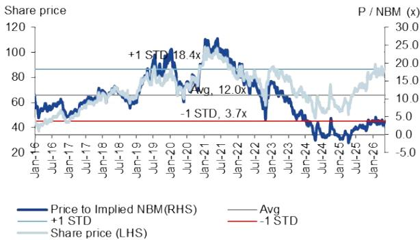

line

| Date    | Price to Implied NBM (RHS) | +1 STD | Avg   | -1 STD | Share Price (LHS) |
|---------|-----------------------------|--------|-------|--------|-------------------|
| Jan-16  | ~50                         | ~40    | ~10   | ~3     | ~4                |
| Jul-16  | ~60                         | ~50    | ~12   | ~4     | ~5                |
| Jan-17  | ~70                         | ~60    | ~14   | ~5     | ~6                |
| Jul-17  | ~80                         | ~70    | ~16   | ~6     | ~7                |
| Jan-18  | ~90                         | ~80    | ~18   | ~7     | ~8                |
| Jul-18  | ~100                        | ~90    | ~20   | ~8     | ~9                |
| Jan-19  | ~110                        | ~100   | ~22   | ~9     | ~10               |
| Jul-19  | ~100                        | ~90    | ~20   | ~8     | ~9                |
| Jan-20  | ~90                         | ~80    | ~18   | ~7     | ~8                |
| Jul-20  | ~80                         | ~70    | ~16   | ~6     | ~7                |
| Jan-21  | ~70                         | ~60    | ~14   | ~5     | ~6                |
| Jul-21  | ~60                         | ~50    | ~12   | ~4     | ~5                |
| Jan-22  | ~50                         | ~40    | ~10   | ~3     | ~4                |
| Jul-22  | ~40                         | ~30    | ~8    | ~2     | ~3                |
| Jan-23  | ~30                         | ~20    | ~6    | ~1     | ~2                |
| Jul-23  | ~20                         | ~10    | ~4    | ~0.5   | ~1                |
| Jan-24  | ~10                         | ~5     | ~2    | ~0.2   | ~0.5              |
| Jul-24  | ~5                          | ~2     | ~1    | ~0.1   | ~0.2              |
| Jan-25  | ~3                          | ~1     | ~0.5  | ~0.05  | ~0.1              |
| Jul-25  | ~2                          | ~0.5   | ~0.2  | ~0.02  | ~0.05             |
| Jan-26  | ~1                          | ~0.2   | ~0.1  | ~0.01  | ~0.02             |

VNB Growth and Margin Forecasts 

<table><tr><td>%</td><td>FY25</td><td>FY26E</td><td>FY27E</td></tr><tr><td>VNB Margin</td><td>58.2</td><td>57.5</td><td>57.6</td></tr><tr><td>VNB Growth</td><td>15.0</td><td>14.7</td><td>14.9</td></tr><tr><td>Hong Kong</td><td>28.0</td><td>12.8</td><td>11.5</td></tr><tr><td>Thailand</td><td>13.0</td><td>8.4</td><td>11.0</td></tr><tr><td>Singapore</td><td>14.0</td><td>12.1</td><td>12.3</td></tr><tr><td>Malaysia</td><td>0.0</td><td>11.5</td><td>9.8</td></tr><tr><td>China</td><td>2.0</td><td>24.7</td><td>23.8</td></tr><tr><td>Other Markets</td><td>7.0</td><td>16.3</td><td>15.3</td></tr></table>

# MS

MS

Hong Kong/China Insurance

May 18, 2026

4. AIA – More Sustainable Growth and More Resilient Performance 

<table><tr><td>Income Statement (US$mn)</td><td>FY24</td><td>FY25</td><td>FY26E</td><td>FY27E</td><td>FY28E</td></tr><tr><td>Insurance revenue</td><td>19,314</td><td>21,618</td><td>23,749</td><td>26,562</td><td>29,839</td></tr><tr><td>Insurance service expenses</td><td>-13,205</td><td>-14,455</td><td>-15,681</td><td>-17,478</td><td>-19,566</td></tr><tr><td>Net expenses/income from reinsurance</td><td>-418</td><td>-391</td><td>-422</td><td>-471</td><td>-529</td></tr><tr><td>Insurance service result</td><td>5,691</td><td>6,772</td><td>7,647</td><td>8,613</td><td>9,744</td></tr><tr><td>Net investment result</td><td>3,528</td><td>3,342</td><td>3,603</td><td>3,999</td><td>4,616</td></tr><tr><td>Fee income &amp; other operating revenue</td><td>473</td><td>501</td><td>547</td><td>604</td><td>670</td></tr><tr><td>Other expenses</td><td>-1,439</td><td>-1,488</td><td>-1,631</td><td>-1,812</td><td>-2,042</td></tr><tr><td>Other finance costs</td><td>-489</td><td>-573</td><td>-621</td><td>-690</td><td>-794</td></tr><tr><td>Share of (losses)/profit from asso and JV</td><td>-13</td><td>-2</td><td>-2</td><td>-2</td><td>-2</td></tr><tr><td>Operating profit before tax</td><td>7,751</td><td>8,552</td><td>9,543</td><td>10,712</td><td>12,192</td></tr><tr><td>Tax</td><td>-1,119</td><td>-1,381</td><td>-1,515</td><td>-1,714</td><td>-2,021</td></tr><tr><td>OPAT</td><td>6,632</td><td>7,171</td><td>8,028</td><td>8,998</td><td>10,172</td></tr><tr><td>Minority interest</td><td>27</td><td>35</td><td>36</td><td>41</td><td>47</td></tr><tr><td>Operating net income</td><td>6,605</td><td>7,136</td><td>7,992</td><td>8,956</td><td>10,125</td></tr><tr><td>Net profit to shareholders</td><td>6,836</td><td>6,234</td><td>7,988</td><td>8,954</td><td>10,122</td></tr></table>

<table><tr><td>Statement of Financial Position</td><td>FY24</td><td>FY25</td><td>FY26E</td><td>FY27E</td><td>FY28E</td></tr><tr><td>Cash &amp; deposits</td><td>10,658</td><td>12,351</td><td>13,737</td><td>15,823</td><td>18,284</td></tr><tr><td>Government &amp; agency bonds</td><td>102,322</td><td>108,489</td><td>120,665</td><td>138,988</td><td>160,599</td></tr><tr><td>Corporate bonds</td><td>67,885</td><td>67,849</td><td>75,464</td><td>86,923</td><td>100,439</td></tr><tr><td>Equity &amp; mutual funds</td><td>62,314</td><td>81,460</td><td>90,603</td><td>104,360</td><td>120,588</td></tr><tr><td>Others</td><td>11,779</td><td>14,960</td><td>16,639</td><td>19,166</td><td>22,146</td></tr><tr><td>Total investment assets</td><td>254,958</td><td>285,109</td><td>317,108</td><td>365,260</td><td>422,055</td></tr><tr><td>Par business</td><td>121,195</td><td>136,113</td><td>154,494</td><td>177,953</td><td>205,623</td></tr><tr><td>Non-par and surplus assets</td><td>134,138</td><td>149,122</td><td>165,785</td><td>190,959</td><td>220,652</td></tr><tr><td>Other assets</td><td>50,496</td><td>60,314</td><td>60,314</td><td>60,314</td><td>60,314</td></tr><tr><td>Total assets</td><td>305,454</td><td>345,423</td><td>377,422</td><td>425,574</td><td>482,369</td></tr><tr><td>Total AC</td><td>6,169</td><td>6,973</td><td>7,619</td><td>8,591</td><td>9,738</td></tr><tr><td>Total FVOCI</td><td>98,289</td><td>106,281</td><td>116,127</td><td>130,942</td><td>148,417</td></tr><tr><td>Total FVTPL</td><td>167,693</td><td>194,005</td><td>211,977</td><td>239,021</td><td>270,920</td></tr><tr><td>Insurance reserves</td><td>228,379</td><td>264,040</td><td>290,517</td><td>332,981</td><td>383,360</td></tr><tr><td>Other liabilities</td><td>36,262</td><td>37,775</td><td>37,775</td><td>37,775</td><td>37,775</td></tr><tr><td>Total liabilities</td><td>264,641</td><td>301,815</td><td>328,292</td><td>370,756</td><td>421,135</td></tr><tr><td>Minority interest</td><td>323</td><td>363</td><td>363</td><td>363</td><td>363</td></tr><tr><td>Total shareholders&#x27; equity</td><td>40,813</td><td>43,608</td><td>49,130</td><td>54,818</td><td>61,233</td></tr></table>

<table><tr><td>Embedded value</td><td>FY24</td><td>FY25</td><td>FY26E</td><td>FY27E</td><td>FY28E</td></tr><tr><td>Adjusted net worth</td><td>30,527</td><td>30,680</td><td>34,984</td><td>39,418</td><td>44,419</td></tr><tr><td>Free surplus</td><td>12,554</td><td>10,972</td><td>11,624</td><td>14,074</td><td>17,035</td></tr><tr><td>Value of in-force</td><td>38,508</td><td>46,131</td><td>49,596</td><td>55,702</td><td>62,776</td></tr><tr><td>Total embedded value</td><td>69,035</td><td>76,811</td><td>84,580</td><td>95,119</td><td>107,195</td></tr><tr><td>Underlying FSG</td><td>6,327</td><td>6,765</td><td>7,616</td><td>8,489</td><td>9,653</td></tr><tr><td>Value of new business</td><td>4,712</td><td>5,516</td><td>6,326</td><td>7,270</td><td>8,317</td></tr><tr><td>APE</td><td>8,606</td><td>9,484</td><td>11,001</td><td>12,625</td><td>14,389</td></tr></table>

<table><tr><td>Key metrics</td><td>FY25</td><td>FY26E</td><td>FY27E</td><td>FY28E</td></tr><tr><td>Closing CSM</td><td>64,945</td><td>72,375</td><td>81,078</td><td>91,202</td></tr><tr><td>CSM Release</td><td>6,224</td><td>7,023</td><td>7,916</td><td>8,960</td></tr><tr><td>CSM Release rate</td><td>8.7</td><td>8.8</td><td>8.9</td><td>8.9</td></tr></table>

<table><tr><td>Key ratios %</td><td>FY25</td><td>FY26E</td><td>FY27E</td><td>FY28E</td></tr><tr><td>P/EV</td><td>1.50</td><td>1.33</td><td>1.18</td><td>1.05</td></tr><tr><td>P/B</td><td>2.6</td><td>2.3</td><td>2.0</td><td>1.8</td></tr><tr><td>P/E</td><td>16.2</td><td>14.1</td><td>12.6</td><td>11.1</td></tr><tr><td>VNB multiple</td><td>7.5</td><td>5.4</td><td>3.2</td><td>1.4</td></tr><tr><td>Total Investment Return*</td><td>4.3</td><td>4.4</td><td>4.4</td><td>4.4</td></tr><tr><td>New business margin</td><td>58.2</td><td>57.5</td><td>57.6</td><td>57.8</td></tr><tr><td>ROE (%)</td><td>17.0</td><td>17.3</td><td>17.3</td><td>17.5</td></tr><tr><td>Operating EPS (cps)</td><td>67.6</td><td>77.7</td><td>87.4</td><td>99.1</td></tr><tr><td>DPS (HKc)</td><td>192</td><td>222</td><td>250</td><td>284</td></tr><tr><td>Dividend yield (%)</td><td>2.2</td><td>2.6</td><td>2.9</td><td>3.3</td></tr><tr><td>Net assets per share ($)</td><td>4.2</td><td>4.8</td><td>5.4</td><td>6.0</td></tr><tr><td>EV per share ($)</td><td>7.3</td><td>8.3</td><td>9.3</td><td>10.5</td></tr><tr><td>EV growth</td><td>11.3</td><td>10.1</td><td>12.5</td><td>12.7</td></tr><tr><td>VoNB growth (CER)</td><td>15.0</td><td>14.7</td><td>14.9</td><td>14.4</td></tr><tr><td>VoNB growth (AER)</td><td>17.1</td><td>14.7</td><td>14.9</td><td>14.4</td></tr><tr><td>Operating EPS growth (AER)</td><td>13.2</td><td>15.0</td><td>12.5</td><td>13.5</td></tr><tr><td>Weighted number of shares</td><td>10,507</td><td>10,235</td><td>10,235</td><td>10,235</td></tr></table>

<table><tr><td>Premium mix</td><td>FY25</td><td>FY26E</td><td>FY27E</td><td>FY28E</td></tr><tr><td>Renewal premium</td><td>38,012</td><td>42,326</td><td>47,596</td><td>53,822</td></tr><tr><td>First year regular premium</td><td>8,198</td><td>9,557</td><td>10,999</td><td>12,555</td></tr><tr><td>10% of Single premium</td><td>690</td><td>768</td><td>857</td><td>959</td></tr><tr><td>Total weighted premium index (TWP)</td><td>46,900</td><td>52,651</td><td>59,453</td><td>67,336</td></tr></table>

<table><tr><td>Operating profit by country</td><td>FY25</td><td>FY26E</td><td>FY27E</td><td>FY28E</td></tr><tr><td>Hong Kong</td><td>2,770</td><td>3,230</td><td>3,641</td><td>4,161</td></tr><tr><td>Thailand</td><td>1,210</td><td>1,346</td><td>1,506</td><td>1,710</td></tr><tr><td>Singapore</td><td>721</td><td>786</td><td>833</td><td>901</td></tr><tr><td>Malaysia</td><td>401</td><td>424</td><td>472</td><td>533</td></tr><tr><td>China</td><td>1,708</td><td>1,894</td><td>2,135</td><td>2,433</td></tr><tr><td>Other Markets</td><td>658</td><td>678</td><td>795</td><td>945</td></tr></table>

<table><tr><td>VNB growth %</td><td>FY25</td><td>FY26E</td><td>FY27E</td><td>FY28E</td></tr><tr><td>Hong Kong</td><td>27.9</td><td>12.8</td><td>11.5</td><td>11.5</td></tr><tr><td>Thailand</td><td>21.7</td><td>8.4</td><td>11.0</td><td>11.0</td></tr><tr><td>Singapore</td><td>16.7</td><td>12.1</td><td>12.3</td><td>12.1</td></tr><tr><td>Malaysia</td><td>6.9</td><td>11.5</td><td>9.8</td><td>9.8</td></tr><tr><td>China</td><td>1.9</td><td>24.7</td><td>23.8</td><td>20.9</td></tr><tr><td>Other Markets</td><td>3.9</td><td>16.3</td><td>15.3</td><td>15.5</td></tr></table>

Source: Company data, MS (E) estimates

# MS

MS

Hong Kong/China Insurance

May 18, 2026

# 4. Ping An – Strong High-Quality Growth and Less Property Drag

- Ping An's share price underwent some correction, mainly dragged by China peers amid the 4Q25 slowdown, concerns over 1Q26 earnings, weak market sentiment, and national team selling.   
- However, 1Q26 results were solid, and management expects AM to become profit-making in 2026 – one year earlier than previous market expectation, suggesting the property drag could finally come to an end.   
• We think growth in 2026 could be healthy and of higher quality, with the CSM balance returning to positive growth.   
- FY26E P/B is 0.90x and dividend yield has returned to \~5.3%, which we view as more appealing.

FYP growth, FYP mix and margin by channel 

<table><tr><td>%</td><td>FY24</td><td>FY25</td><td>FY26E</td></tr><tr><td colspan="4">FYP margin</td></tr><tr><td>Agent</td><td>24</td><td>31</td><td>29</td></tr><tr><td>Banca</td><td>20</td><td>25</td><td>26</td></tr><tr><td>Other</td><td>7</td><td>9</td><td>10</td></tr><tr><td colspan="4">FYP growth</td></tr><tr><td>Agent</td><td>-12</td><td>-12</td><td>7</td></tr><tr><td>Banca</td><td>9</td><td>95</td><td>52</td></tr><tr><td>Other</td><td>-3</td><td>-8</td><td>5</td></tr><tr><td colspan="4">FYP mix</td></tr><tr><td>Agent</td><td>57</td><td>49</td><td>45</td></tr><tr><td>Banca</td><td>13</td><td>24</td><td>32</td></tr><tr><td>Other</td><td>30</td><td>27</td><td>24</td></tr></table>

Source: Factset, Company data, MS

Property exposure among insurance funds   
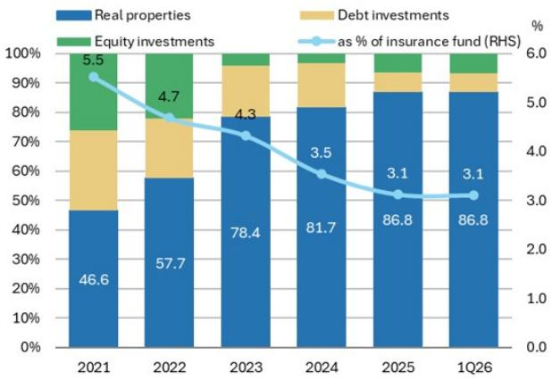

bar_line

| Year | Real properties (%) | Equity investments (%) | Debt investments (%) | as % of insurance fund (RHS) (%) |
|---|---|---|---|---|
| 2021 | 46.6 | 23.8 | 27.9 | 5.5 |
| 2022 | 57.7 | 18.0 | 21.7 | 4.7 |
| 2023 | 78.4 | 5.1 | 18.3 | 4.3 |
| 2024 | 81.7 | 4.9 | 14.9 | 3.5 |
| 2025 | 86.8 | 6.1 | 7.1 | 3.1 |
| 1Q26 | 86.8 | 6.9 | 7.1 | 3.1 |

Ping An H's monthly LOs allocations   
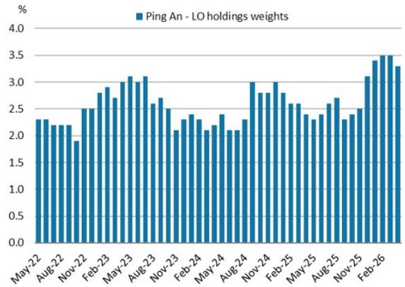

bar

Ping An - LO holdings weights
| Month | Value (%) |
|---|---|
| May-22 | 2.3 |
| Aug-22 | 2.3 |
| Nov-22 | 2.2 |
| Feb-23 | 2.5 |
| May-23 | 2.9 |
| Aug-23 | 3.1 |
| Nov-23 | 2.7 |
| Feb-24 | 2.1 |
| May-24 | 2.4 |
| Aug-24 | 2.3 |
| Nov-24 | 3.0 |
| Feb-25 | 2.8 |
| May-25 | 2.6 |
| Aug-25 | 2.4 |
| Nov-25 | 2.5 |
| Feb-26 | 3.5 |
| May-27 | 3.4 |

AM net losses and impairment losses, 2020-25

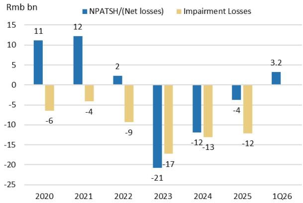

bar

| Year | NPATSH/(Net losses) (Rmb bn) | Impairment Losses (Rmb bn) |
| :--- | :--- | :--- |
| 2020 | 11 | -6 |
| 2021 | 12 | -4 |
| 2022 | 2 | -9 |
| 2023 | -21 | -17 |
| 2024 | -12 | -13 |
| 2025 | -4 | -12 |
| 1Q26 | 3.2 | |

# MS

MS

Hong Kong/China Insurance

May 18, 2026

# 4. Ping An – Strong High-Quality Growth and Less Property Drag

Ping An H Share P/B   
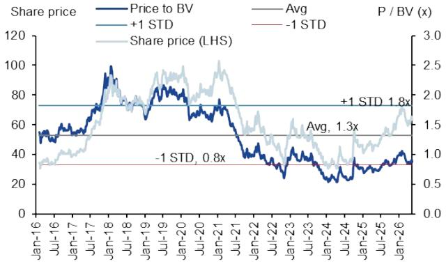

line

| Date   | Price to BV | Avg  | +1 STD | -1 STD | Share price (LHS) |
|--------|-------------|------|--------|--------|-------------------|
| Jan-16 | ~50         | 1.3x | 1.8x   | 0.8x   | ~35               |
| Jul-16 | ~55         | 1.3x | 1.8x   | 0.8x   | ~40               |
| Jan-17 | ~65         | 1.3x | 1.8x   | 0.8x   | ~50               |
| Jul-17 | ~75         | 1.3x | 1.8x   | 0.8x   | ~60               |
| Jan-18 | ~95         | 1.3x | 1.8x   | 0.8x   | ~80               |
| Jul-18 | ~85         | 1.3x | 1.8x   | 0.8x   | ~70               |
| Jan-19 | ~80         | 1.3x | 1.8x   | 0.8x   | ~75               |
| Jul-19 | ~75         | 1.3x | 1.8x   | 0.8x   | ~85               |
| Jan-20 | ~70         | 1.3x | 1.8x   | 0.8x   | ~90               |
| Jul-20 | ~65         | 1.3x | 1.8x   | 0.8x   | ~95               |
| Jan-21 | ~60         | 1.3x | 1.8x   | 0.8x   | ~100              |
| Jul-21 | ~55         | 1.3x | 1.8x   | 0.8x   | ~95               |
| Jan-22 | ~45         | 1.3x | 1.8x   | 0.8x   | ~85               |
| Jul-22 | ~35         | 1.3x | 1.8x   | 0.8x   | ~75               |
| Jan-23 | ~40         | 1.3x | 1.8x   | 0.8x   | ~65               |
| Jul-23 | ~35         | 1.3x | 1.8x   | 0.8x   | ~55               |
| Jan-24 | ~30         | 1.3x | 1.8x   | 0.8x   | ~45               |
| Jul-24 | ~25         | 1.3x | 1.8x   | 0.8x   | ~35               |
| Jan-25 | ~30         | 1.3x | 1.8x   | 0.8x   | ~45               |
| Jul-25 | ~35         | 1.3x | 1.8x   | 0.8x   | ~55               |
| Jan-26 | ~40         | 1.3x | 1.8x   | 0.8x   | ~65               |

Ping An H Dividend Yield

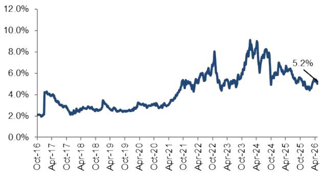

line

| Date   | Value |
|--------|-------|
| Apr-26 | 5.2%  |

Source: Factset, Company data, MS (E) estimates

<table><tr><td>Statement of financial performance (RMB, m)</td><td>FY25</td><td>FY26E</td><td>FY27E</td><td>FY28E</td></tr><tr><td>Insurance revenue</td><td>559,502</td><td>608,891</td><td>648,568</td><td>691,796</td></tr><tr><td>Interest revenue from banking operations</td><td>169,266</td><td>171,643</td><td>178,963</td><td>191,433</td></tr><tr><td>Investment income</td><td>154,544</td><td>133,301</td><td>145,140</td><td>162,274</td></tr><tr><td>Other revenues and other gains</td><td>257,012</td><td>259,144</td><td>263,122</td><td>271,999</td></tr><tr><td>Total revenue</td><td>1,140,324</td><td>1,172,979</td><td>1,235,795</td><td>1,317,502</td></tr><tr><td>Insurance service expenses</td><td>-453,268</td><td>-492,922</td><td>-523,726</td><td>-556,434</td></tr><tr><td>Net of insurance finance expenses</td><td>-179,642</td><td>-168,891</td><td>-173,674</td><td>-177,870</td></tr><tr><td>Interest expenses on banking</td><td>-80,868</td><td>-82,013</td><td>-85,540</td><td>-91,548</td></tr><tr><td>Net impairment losses</td><td>-74,409</td><td>-63,668</td><td>-58,659</td><td>-62,206</td></tr><tr><td>General and admin expenses</td><td>-86,216</td><td>-82,550</td><td>-83,209</td><td>-80,258</td></tr><tr><td>Other expenses</td><td>-80,331</td><td>-88,701</td><td>-93,711</td><td>-98,746</td></tr><tr><td>Total expenses</td><td>-954,734</td><td>-978,746</td><td>-1,018,520</td><td>-1,067,063</td></tr><tr><td>Insurance results</td><td>97,330</td><td>106,273</td><td>114,518</td><td>124,396</td></tr><tr><td>Investment results</td><td>58,974</td><td>50,961</td><td>59,176</td><td>76,173</td></tr><tr><td>Other results</td><td>29,286</td><td>36,999</td><td>43,580</td><td>49,871</td></tr><tr><td>Profit before tax</td><td>185,590</td><td>194,233</td><td>217,275</td><td>250,439</td></tr><tr><td>Income tax</td><td>-27,289</td><td>-22,131</td><td>-25,007</td><td>-28,806</td></tr><tr><td>Net profit after tax</td><td>158,301</td><td>172,103</td><td>192,268</td><td>221,634</td></tr><tr><td>Minority interest</td><td>-23,523</td><td>-24,026</td><td>-25,410</td><td>-27,332</td></tr><tr><td>Net profit to shareholders</td><td>134,778</td><td>148,077</td><td>166,858</td><td>194,302</td></tr><tr><td>Short-term investment variance and others</td><td>363</td><td>3,086</td><td>6,195</td><td>16,442</td></tr><tr><td>OPAT to shareholders</td><td>134,415</td><td>144,991</td><td>160,663</td><td>177,860</td></tr></table>

<table><tr><td>Operating profit by segment (RMB, mn)</td><td>FY25</td><td>FY26E</td><td>FY27E</td><td>FY28E</td></tr><tr><td>Life</td><td>99,752</td><td>107,310</td><td>116,255</td><td>126,993</td></tr><tr><td>P&amp;C</td><td>14,531</td><td>16,747</td><td>18,859</td><td>21,499</td></tr><tr><td>Bank</td><td>24,711</td><td>25,580</td><td>27,224</td><td>29,179</td></tr><tr><td>AM</td><td>-3,785</td><td>-1,201</td><td>974</td><td>2,705</td></tr><tr><td>FinTech</td><td>249</td><td>1,050</td><td>1,980</td><td>3,525</td></tr><tr><td>Others &amp; Corporate</td><td>-1,043</td><td>-4,494</td><td>-4,628</td><td>-6,041</td></tr><tr><td>Total</td><td>134,415</td><td>144,991</td><td>160,663</td><td>177,860</td></tr></table>

<table><tr><td>Statement of financial position (RMB, m n)</td><td>FY25</td><td>FY26E</td><td>FY27E</td><td>FY28E</td></tr><tr><td>Cash and term deposits</td><td>606,882</td><td>646,573</td><td>680,384</td><td>717,922</td></tr><tr><td>Bond investments</td><td>3,700,971</td><td>3,943,021</td><td>4,149,213</td><td>4,378,127</td></tr><tr><td>Debt scheme investment</td><td>323,452</td><td>344,606</td><td>362,627</td><td>382,633</td></tr><tr><td>Equity</td><td>1,714,665</td><td>1,613,169</td><td>1,697,526</td><td>1,791,179</td></tr><tr><td>Property</td><td>143,992</td><td>153,409</td><td>161,432</td><td>170,338</td></tr><tr><td>Insurance fund</td><td>6,489,962</td><td>6,700,779</td><td>7,051,181</td><td>7,440,199</td></tr><tr><td>Loans</td><td>3,409,074</td><td>3,604,352</td><td>3,712,482</td><td>3,860,981</td></tr><tr><td>Investments in associates</td><td>141,251</td><td>145,092</td><td>154,721</td><td>164,985</td></tr><tr><td>Others</td><td>3,858,184</td><td>3,899,720</td><td>4,181,956</td><td>4,467,270</td></tr><tr><td>Total assets</td><td>13,898,471</td><td>14,349,943</td><td>15,100,340</td><td>15,933,435</td></tr><tr><td>Insurance contract liabilities</td><td>5,360,910</td><td>5,789,736</td><td>6,269,691</td><td>6,800,579</td></tr><tr><td>Customer deposits</td><td>3,809,246</td><td>3,739,996</td><td>3,904,139</td><td>4,075,485</td></tr><tr><td>Other liabilities</td><td>3,312,327</td><td>3,312,327</td><td>3,312,327</td><td>3,312,327</td></tr><tr><td>Total liabilities</td><td>12,482,483</td><td>12,842,059</td><td>13,486,156</td><td>14,188,391</td></tr><tr><td>Shareholder equity</td><td>1,000,419</td><td>1,092,315</td><td>1,198,614</td><td>1,329,475</td></tr><tr><td>Minority interests</td><td>415,569</td><td>415,569</td><td>415,569</td><td>415,569</td></tr><tr><td>Total equity</td><td>1,415,988</td><td>1,507,884</td><td>1,614,183</td><td>1,745,044</td></tr></table>

<table><tr><td>Solvency %</td><td>FY25</td><td>FY26E</td><td>FY27E</td><td>FY28E</td></tr><tr><td>Solvency - Life</td><td>176</td><td>161</td><td>164</td><td>167</td></tr><tr><td>Solvency - P&amp;C</td><td>217</td><td>215</td><td>216</td><td>218</td></tr><tr><td>Bank - CET 1</td><td>11.2</td><td>11.9</td><td>12.5</td><td>13.2</td></tr><tr><td>Bank - CAR</td><td>15.5</td><td>16.0</td><td>16.7</td><td>17.3</td></tr></table>

<table><tr><td>Key val&#x27;n metrics (x)</td><td>FY25</td><td>FY26E</td><td>FY27E</td><td>FY28E</td></tr><tr><td>P / E</td><td>6.9</td><td>6.4</td><td>5.8</td><td>5.2</td></tr><tr><td>P / BV</td><td>0.96</td><td>0.88</td><td>0.80</td><td>0.72</td></tr><tr><td>P/ Group EV</td><td>0.64</td><td>0.59</td><td>0.55</td><td>0.51</td></tr><tr><td>Dividend yield (%)</td><td>5.1</td><td>5.3</td><td>5.7</td><td>6.1</td></tr><tr><td>RMB / HKD</td><td>1.14</td><td>1.14</td><td>1.14</td><td>1.14</td></tr></table>

<table><tr><td>Per share data (Rmb)</td><td>FY25</td><td>FY26E</td><td>FY27E</td><td>FY28E</td></tr><tr><td>Operating EPS</td><td>7.66</td><td>8.26</td><td>9.15</td><td>10.13</td></tr><tr><td>Reported EPS (Ending balance)</td><td>7.44</td><td>8.18</td><td>9.21</td><td>10.73</td></tr><tr><td>BPS</td><td>55.25</td><td>60.32</td><td>66.19</td><td>73.42</td></tr><tr><td>DPS</td><td>2.68</td><td>2.82</td><td>3.02</td><td>3.24</td></tr><tr><td>EV per share (life only)</td><td>51.3</td><td>55.7</td><td>60.7</td><td>66.3</td></tr><tr><td>VNB per share</td><td>2.0</td><td>2.4</td><td>2.8</td><td>3.3</td></tr><tr><td>No. of shares (EoP)</td><td>18,108</td><td>18,108</td><td>18,108</td><td>18,108</td></tr></table>

<table><tr><td>Life insurance data (RMB, π)</td><td>FY25</td><td>FY26E</td><td>FY27E</td><td>FY28E</td></tr><tr><td>Adjusted net assets</td><td>544,502</td><td>584,996</td><td>637,347</td><td>696,103</td></tr><tr><td>Value of in-force</td><td>384,128</td><td>423,618</td><td>461,527</td><td>504,074</td></tr><tr><td>Embedded value</td><td>928,630</td><td>1,008,614</td><td>1,098,874</td><td>1,200,177</td></tr><tr><td>Value of new business</td><td>36,896</td><td>43,601</td><td>50,878</td><td>58,916</td></tr><tr><td>Embedded value (Group)</td><td>1,504,287</td><td>1,609,533</td><td>1,733,693</td><td>1,876,742</td></tr><tr><td>CSM balance</td><td>725,119</td><td>730,680</td><td>744,917</td><td>768,637</td></tr><tr><td>CSM release rate</td><td>8.6</td><td>8.7</td><td>8.7</td><td>8.7</td></tr><tr><td>Release of CSM</td><td>68,187</td><td>69,586</td><td>70,941</td><td>73,200</td></tr></table>

<table><tr><td>Growth (% p.a.)</td><td>FY25</td><td>FY26E</td><td>FY27E</td><td>FY28E</td></tr><tr><td>Operating EPS</td><td>11.2</td><td>7.9</td><td>10.8</td><td>10.7</td></tr><tr><td>BPS</td><td>8.3</td><td>9.2</td><td>9.7</td><td>10.9</td></tr><tr><td>DPS</td><td>5.1</td><td>5.1</td><td>7.2</td><td>7.4</td></tr><tr><td>P&amp;C GWP</td><td>6.6</td><td>6.7</td><td>6.4</td><td>6.0</td></tr><tr><td>Life APE</td><td>1.7</td><td>21.7</td><td>13.6</td><td>12.8</td></tr><tr><td>Bank loans</td><td>.0</td><td>2.0</td><td>3.0</td><td>4.0</td></tr><tr><td>EV</td><td>11.2</td><td>8.6</td><td>8.9</td><td>9.2</td></tr><tr><td>NBV</td><td>29.3</td><td>18.2</td><td>16.7</td><td>15.8</td></tr></table>

<table><tr><td>Business mix %</td><td>FY25</td><td>FY26E</td><td>FY27E</td><td>FY28E</td></tr><tr><td>Motor</td><td>67</td><td>65</td><td>63</td><td>61</td></tr><tr><td>Non-motor</td><td>22</td><td>22</td><td>23</td><td>24</td></tr><tr><td>Accident &amp; health</td><td>11</td><td>13</td><td>14</td><td>15</td></tr><tr><td>Total</td><td>100</td><td>100</td><td>100</td><td>100</td></tr><tr><td colspan="5">Life premium breakdown</td></tr><tr><td>Single premium</td><td>11</td><td>11</td><td>10</td><td>10</td></tr><tr><td>Regular premium</td><td>21</td><td>22</td><td>21</td><td>21</td></tr><tr><td>Renew al</td><td>68</td><td>68</td><td>69</td><td>70</td></tr><tr><td>Total</td><td>100</td><td>100</td><td>100</td><td>100</td></tr></table>

<table><tr><td>Key metrics %</td><td>FY25</td><td>FY26E</td><td>FY27E</td><td>FY28E</td></tr><tr><td>Operating ROE</td><td>13.9</td><td>13.9</td><td>14.0</td><td>14.1</td></tr><tr><td>ROA</td><td>1.00</td><td>1.05</td><td>1.13</td><td>1.25</td></tr><tr><td>FYP margin</td><td>23.4</td><td>23.2</td><td>23.8</td><td>24.3</td></tr><tr><td>P&amp;C - combined ratio</td><td>96.8</td><td>96.7</td><td>96.4</td><td>96.1</td></tr><tr><td>Banking - NIM</td><td>1.78</td><td>1.78</td><td>1.83</td><td>1.93</td></tr><tr><td>Insurance gross yield</td><td>3.1</td><td>3.1</td><td>3.2</td><td>3.3</td></tr><tr><td>Insurance eet yield</td><td>3.8</td><td>3.5</td><td>3.6</td><td>3.7</td></tr><tr><td>Number of agents (000&#x27;s)</td><td>351</td><td>360</td><td>367</td><td>374</td></tr><tr><td>Agency growth</td><td>-3.3</td><td>2.5</td><td>2.0</td><td>2.0</td></tr><tr><td>Agency productivity (Rmb)</td><td>30,893</td><td>33,055</td><td>34,708</td><td>36,096</td></tr></table>

# MS

MS

Hong Kong/China Insurance

May 18, 2026

# 4. China Life – Leading VNB Growth in 2026 and Potential for Further Valuation Upside

- China Life's H-share price saw a sharper correction before end-April, due to a mix of factors including market rumors, weak stock market performance, and volatile earnings in 4Q25 and 1Q26.   
• However, the 1Q26 results overhang appears to be fully factored in, and we expect potentially stronger 2Q earnings considering the market rebound. Its VNB growth in 1Q26 was at a strong 76%.   
• FY26E P/B is 1.1x, higher than key peers, though investors may be willing to pay a premium in a bull market.   
- Longer-term P&L volatility is still a key concern for LO investors.

P/B valuation for China Life H   
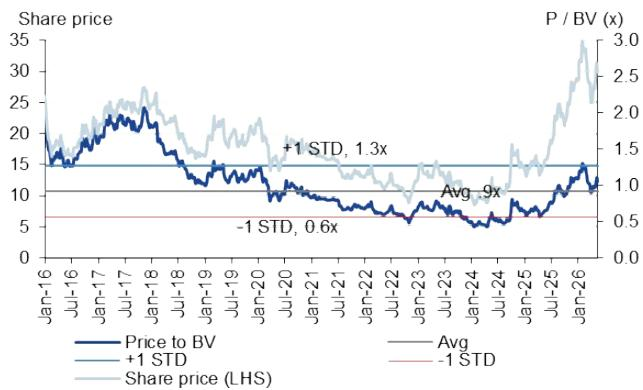

VNB growth for CL   
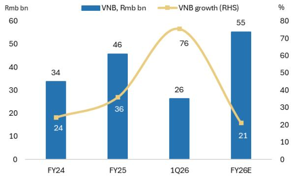

bar_line

| Period | VNB, Rmb bn (Rmb bn) | VNB growth (%) |
| :--- | :--- | :--- |
| FY24 | 34 | 24 |
| FY25 | 46 | 36 |
| 1Q26 | 26 | 76 |
| FY26E | 55 | 21 |

Earnings and ROE   
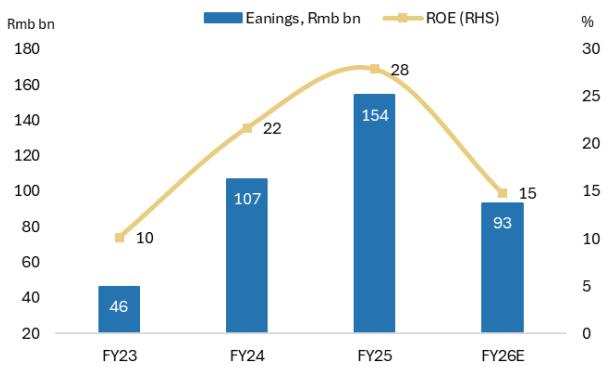

bar_line

| Fiscal Year | Earnings, Rmb bn | ROE (%) |
| :--- | :--- | :--- |
| FY23 | 46 | 10 |
| FY24 | 107 | 22 |
| FY25 | 154 | 28 |
| FY26E | 93 | 15 |

Source: Factset, Company data, MS (E) estimates

# MS

MS

Hong Kong/China Insurance

May 18, 2026

# 4. China Life – Leading VNB Growth in 2026 and Potential for Further Valuation Upside

<table><tr><td>Statement of financial performance (RMB, mn)</td><td>FY25</td><td>FY26E</td><td>FY27E</td><td>FY28E</td></tr><tr><td>Insurance revenue</td><td>214,136</td><td>215,850</td><td>226,120</td><td>243,839</td></tr><tr><td>Interest income</td><td>128,286</td><td>132,887</td><td>135,626</td><td>147,523</td></tr><tr><td>Investment income</td><td>255,411</td><td>90,759</td><td>94,056</td><td>103,858</td></tr><tr><td>Other income</td><td>18,232</td><td>18,327</td><td>18,897</td><td>19,880</td></tr><tr><td>Total revenues</td><td>616,065</td><td>457,823</td><td>474,700</td><td>515,100</td></tr><tr><td>Insurance service expenses</td><td>-148,736</td><td>-145,756</td><td>-143,765</td><td>-155,570</td></tr><tr><td>Net of Insurance finance income/(expenses)</td><td>-258,203</td><td>-174,251</td><td>-180,924</td><td>-191,344</td></tr><tr><td>Other expenses</td><td>-27,497</td><td>-27,928</td><td>-29,029</td><td>-31,009</td></tr><tr><td>Total expenses</td><td>-434,436</td><td>-347,936</td><td>-353,718</td><td>-377,923</td></tr><tr><td>Operating profit</td><td>181,629</td><td>109,888</td><td>120,982</td><td>137,177</td></tr><tr><td>Insurance results</td><td>64,898</td><td>69,556</td><td>81,723</td><td>87,591</td></tr><tr><td>Investment results</td><td>128,421</td><td>52,082</td><td>51,370</td><td>62,320</td></tr><tr><td>Other results</td><td>-153,498</td><td>-67,254</td><td>-68,073</td><td>-81,260</td></tr><tr><td>Income tax expenses</td><td>-25,077</td><td>-15,172</td><td>-16,704</td><td>-18,940</td></tr><tr><td>Net profit</td><td>156,552</td><td>94,716</td><td>104,278</td><td>118,237</td></tr><tr><td>Minority interests</td><td>2,474</td><td>1,497</td><td>1,648</td><td>1,869</td></tr><tr><td>Net profit to shareholders</td><td>154,078</td><td>93,219</td><td>102,630</td><td>116,369</td></tr></table>

<table><tr><td>Statement of financial position (RMB, mn)</td><td>FY25</td><td>FY26E</td><td>FY27E</td><td>FY28E</td></tr><tr><td>Cash &amp; deposits</td><td>567,681</td><td>617,809</td><td>669,938</td><td>727,043</td></tr><tr><td>Bond</td><td>3,903,364</td><td>4,248,040</td><td>4,606,479</td><td>4,999,133</td></tr><tr><td>Debt</td><td>1,275,960</td><td>1,307,843</td><td>1,383,154</td><td>1,463,025</td></tr><tr><td>Stocks &amp; funds</td><td>1,305,874</td><td>1,501,973</td><td>1,663,747</td><td>1,843,593</td></tr><tr><td>Associates</td><td>307,788</td><td>334,966</td><td>363,230</td><td>394,192</td></tr><tr><td>Investment property</td><td>11,702</td><td>12,735</td><td>13,810</td><td>14,987</td></tr><tr><td>Others</td><td>50,879</td><td>55,372</td><td>60,044</td><td>65,162</td></tr><tr><td>Total investment assets</td><td>7,423,248</td><td>8,078,739</td><td>8,760,402</td><td>9,507,135</td></tr><tr><td>Others</td><td>167,756</td><td>167,756</td><td>167,756</td><td>167,756</td></tr><tr><td>Total assets</td><td>7,591,004</td><td>8,246,495</td><td>8,928,158</td><td>9,674,891</td></tr><tr><td>Insurance contract liabilities</td><td>6,376,114</td><td>6,964,060</td><td>7,569,197</td><td>8,227,993</td></tr><tr><td>Financial assets sold under agreements to repurcha</td><td>331,863</td><td>331,863</td><td>331,863</td><td>331,863</td></tr><tr><td>Other liabilities</td><td>274,634</td><td>273,154</td><td>273,154</td><td>273,154</td></tr><tr><td>Total liabilities</td><td>6,982,611</td><td>7,569,077</td><td>8,174,214</td><td>8,833,010</td></tr><tr><td>Shareholders equity</td><td>595,205</td><td>664,229</td><td>740,755</td><td>828,693</td></tr><tr><td>Minority interests</td><td>13,188</td><td>13,188</td><td>13,188</td><td>13,188</td></tr><tr><td>Total equity</td><td>608,393</td><td>677,417</td><td>753,943</td><td>841,881</td></tr></table>

<table><tr><td>Life insurance embedded value (RMB, mn)</td><td>FY25</td><td>FY26E</td><td>FY27E</td><td>FY28E</td></tr><tr><td>Adjusted net assets</td><td>936,673</td><td>1,045,296</td><td>1,165,726</td><td>1,304,112</td></tr><tr><td>Value of in-force</td><td>531,203</td><td>556,328</td><td>572,326</td><td>573,699</td></tr><tr><td>Embedded value</td><td>1,467,876</td><td>1,601,624</td><td>1,738,052</td><td>1,877,811</td></tr><tr><td>Value of new business</td><td>45,752</td><td>55,345</td><td>62,831</td><td>71,301</td></tr><tr><td>Ending CSM</td><td>768,369</td><td>802,796</td><td>844,323</td><td>893,970</td></tr><tr><td>CSM release</td><td>68,475</td><td>72,496</td><td>77,251</td><td>82,860</td></tr></table>

<table><tr><td>Key val&#x27;n metrics (x)</td><td>FY25</td><td>FY26E</td><td>FY27E</td><td>FY28E</td></tr><tr><td>P / E</td><td>4.7</td><td>7.8</td><td>7.1</td><td>6.3</td></tr><tr><td>P / BV</td><td>1.22</td><td>1.10</td><td>0.98</td><td>0.88</td></tr><tr><td>P / EV</td><td>0.50</td><td>0.46</td><td>0.42</td><td>0.39</td></tr><tr><td>Dividend yield (%)</td><td>3.3</td><td>3.6</td><td>3.9</td><td>4.3</td></tr><tr><td>RMB / HKD</td><td>1.14</td><td>1.14</td><td>1.14</td><td>1.14</td></tr></table>

<table><tr><td>Per share (RMB)</td><td>FY25</td><td>FY26E</td><td>FY27E</td><td>FY28E</td></tr><tr><td>EPS (Ending balance)</td><td>5.45</td><td>3.30</td><td>3.63</td><td>4.12</td></tr><tr><td>BPS</td><td>21.06</td><td>23.50</td><td>26.21</td><td>29.32</td></tr><tr><td>DPS</td><td>0.86</td><td>0.92</td><td>1.01</td><td>1.10</td></tr><tr><td>EV per share</td><td>51.9</td><td>56.7</td><td>61.5</td><td>66.4</td></tr><tr><td>VNB per share</td><td>1.62</td><td>1.96</td><td>2.22</td><td>2.52</td></tr><tr><td>No. of shares (EoP)</td><td>28,265</td><td>28,265</td><td>28,265</td><td>28,265</td></tr></table>

<table><tr><td>Growth (% p.a.)</td><td>FY25</td><td>FY26E</td><td>FY27E</td><td>FY28E</td></tr><tr><td>EPS</td><td>44.1</td><td>-39.5</td><td>10.1</td><td>13.4</td></tr><tr><td>BPS</td><td>16.8</td><td>11.6</td><td>11.5</td><td>11.9</td></tr><tr><td>EV</td><td>4.8</td><td>9.1</td><td>8.5</td><td>8.0</td></tr><tr><td>VNB</td><td>35.7</td><td>21.0</td><td>13.5</td><td>13.5</td></tr><tr><td>GWP</td><td>8.7</td><td>2.5</td><td>6.6</td><td>9.8</td></tr><tr><td>FYP</td><td>9.3</td><td>17.5</td><td>10.5</td><td>10.1</td></tr><tr><td>APE</td><td>-0.5</td><td>16.2</td><td>9.4</td><td>9.2</td></tr><tr><td>Total asset</td><td>12.3</td><td>8.8</td><td>8.4</td><td>8.5</td></tr></table>

<table><tr><td>Business &amp;Channel mix %</td><td>FY25</td><td>FY26E</td><td>FY27E</td><td>FY28E</td></tr><tr><td>Single premium</td><td>5</td><td>6</td><td>7</td><td>7</td></tr><tr><td>Regular premium</td><td>16</td><td>19</td><td>20</td><td>20</td></tr><tr><td>Short term A&amp;H</td><td>11</td><td>11</td><td>11</td><td>11</td></tr><tr><td>Renewal</td><td>68</td><td>63</td><td>62</td><td>62</td></tr><tr><td>Total</td><td>100</td><td>100</td><td>100</td><td>100</td></tr><tr><td>Individual Channel</td><td>76</td><td>73</td><td>71</td><td>70</td></tr><tr><td>Group Channel</td><td>15</td><td>18</td><td>20</td><td>21</td></tr><tr><td>Bancassurance Channel</td><td>4</td><td>4</td><td>4</td><td>3</td></tr><tr><td>Other channels</td><td>6</td><td>6</td><td>6</td><td>6</td></tr><tr><td>Total</td><td>100</td><td>100</td><td>100</td><td>100</td></tr></table>

<table><tr><td>Key metrics %</td><td>FY25</td><td>FY26E</td><td>FY27E</td><td>FY28E</td></tr><tr><td>ROE</td><td>27.9</td><td>14.8</td><td>14.6</td><td>14.8</td></tr><tr><td>ROA</td><td>2.1</td><td>1.2</td><td>1.2</td><td>1.3</td></tr><tr><td>FYP margin</td><td>19.5</td><td>20.1</td><td>20.7</td><td>21.3</td></tr><tr><td>Net investment yield</td><td>2.8</td><td>2.6</td><td>2.5</td><td>2.5</td></tr><tr><td>Gross investment yield</td><td>5.7</td><td>3.0</td><td>2.8</td><td>2.8</td></tr><tr><td>Number of agents (000&#x27;s)</td><td>587</td><td>602</td><td>614</td><td>626</td></tr><tr><td>Agency growth</td><td>-4.6</td><td>2.5</td><td>2.0</td><td>2.0</td></tr><tr><td>Agency productivity (Rmb)</td><td>15,184</td><td>17,917</td><td>18,992</td><td>20,321</td></tr><tr><td>Life solvency</td><td>174</td><td>168</td><td>163</td><td>159</td></tr></table>

Source: Factset, Company data, MS (E) estimates

# MS

MS

Hong Kong/China Insurance

May 18, 2026

# 4. PICC P&C – CoR Improvement Potential amid Deregulation

- PICC P&C's share price has also been weak since end-2025 and was not defensive amid market uncertainty.   
- Management has set clear 2026 guidance: auto CoR no worse than FY25's $95.3\%$ and non-auto CoR $< 100\%$ .   
• We still see some short-term uncertainties, including 1) a high CoR base in 1H25; 2) limited cat losses in 2025; and 3) slow premium growth in 1Q26.   
- However, FY26E P/B is currently 0.95x and dividend yield is appealing at \~5.6%, both of which we see as attractive, especially for LO investors.

PICC P&C P/B   
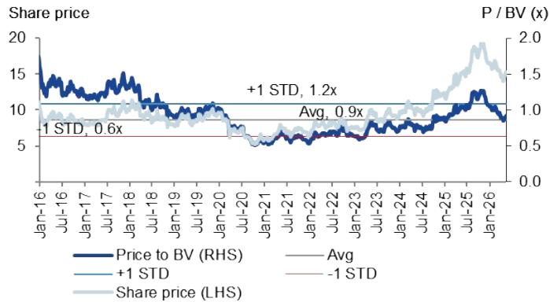

line

| Date    | Price to BV (RHS) | Avg  | +1 STD | -1 STD | Share price (LHS) |
|---------|-------------------|------|--------|--------|-------------------|
| Jan-16  | ~18               | ~1.0 | ~1.0   | ~0.6   | ~1.0              |
| Jul-16  | ~14               | ~1.0 | ~1.0   | ~0.6   | ~1.0              |
| Jan-17  | ~13               | ~1.0 | ~1.0   | ~0.6   | ~1.0              |
| Jul-17  | ~14               | ~1.0 | ~1.0   | ~0.6   | ~1.0              |
| Jan-18  | ~13               | ~1.0 | ~1.0   | ~0.6   | ~1.0              |
| Jul-18  | ~12               | ~1.0 | ~1.0   | ~0.6   | ~1.0              |
| Jan-19  | ~11               | ~1.0 | ~1.0   | ~0.6   | ~1.0              |
| Jul-19  | ~10               | ~1.0 | ~1.0   | ~0.6   | ~1.0              |
| Jan-20  | ~9                | ~1.0 | ~1.0   | ~0.6   | ~1.0              |
| Jul-20  | ~7                | ~1.0 | ~1.0   | ~0.6   | ~1.0              |
| Jan-21  | ~6                | ~1.0 | ~1.0   | ~0.6   | ~1.0              |
| Jul-21  | ~7                | ~1.0 | ~1.0   | ~0.6   | ~1.0              |
| Jan-22  | ~8                | ~1.0 | ~1.0   | ~0.6   | ~1.0              |
| Jul-22  | ~9                | ~1.0 | ~1.0   | ~0.6   | ~1.0              |
| Jan-23  | ~8                | ~1.0 | ~1.0   | ~0.6   | ~1.0              |
| Jul-23  | ~9                | ~1.0 | ~1.0   | ~0.6   | ~1.0              |
| Jan-24  | ~10               | ~1.0 | ~1.0   | ~0.6   | ~1.0              |
| Jul-24  | ~11               | ~1.0 | ~1.0   | ~0.6   | ~1.0              |
| Jan-25  | ~12               | ~1.0 | ~1.0   | ~0.6   | ~1.5              |
| Jul-25  | ~13               | ~1.0 | ~1.0   | ~0.6   | ~2.0              |
| Jan-26  | ~9                | ~1.0 | ~1.0   | ~0.6   | ~1.5              |

PICC P&C Dividend Yield   
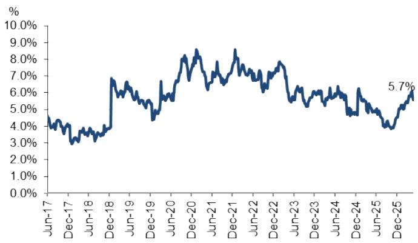

line

| Date    | Value |
|---------|-------|
| Dec-25  | 5.7%  |

Key data on NEV insurance in China in 2025 

<table><tr><td>Rmb mn</td><td>2024</td><td>2025</td><td>YoY</td></tr><tr><td>Auto premium</td><td>913,673</td><td>940,873</td><td>3%</td></tr><tr><td>NEV premium</td><td>140,900</td><td>190,000</td><td>35%</td></tr><tr><td>as % of auto premium</td><td>15.4</td><td>20.2</td><td>4.8 ppts</td></tr><tr><td>Underwriting profits/losses</td><td>(5,700)</td><td>(5,600)</td><td>NA</td></tr><tr><td>Estimated CoR</td><td>104.2</td><td>102.9</td><td>-1.3 ppts</td></tr><tr><td># of vehicles insured (mn)</td><td>31.1</td><td>43.6</td><td>40%</td></tr><tr><td>Average Premium per Vehicle (RMB)</td><td>4,531</td><td>4,360</td><td>-4%</td></tr><tr><td>% of vehicle model series* with &gt;100% loss ratios</td><td>38.5</td><td>33.3</td><td>-5.1 ppts</td></tr><tr><td>passenger vehicles %</td><td>32.9</td><td>28.6</td><td>-4.2 ppts</td></tr><tr><td>commercial trucks %</td><td>69.1</td><td>62.7</td><td>-6.4 ppts</td></tr></table>

Source: Company data, Factset; CAA, CBIT, NAFR, MS; \* vehicle model series represent passenger vehicles underwriting volume exceeds 10K units or commercial trunks exceeds 5K units.

# MS

MS

Hong Kong/China Insurance

May 18, 2026

4. PICC P&C – CoR Improvement Potential amid Deregulation 

<table><tr><td>Financial Statement (mn, RMB)</td><td>FY25</td><td>FY26E</td><td>FY27E</td><td>FY28E</td></tr><tr><td>Insurance revenue</td><td>511,594</td><td>533,419</td><td>558,408</td><td>585,501</td></tr><tr><td>Insurance service expenses</td><td>-486,254</td><td>-506,422</td><td>-529,965</td><td>-555,670</td></tr><tr><td>Net of reinsurance premiums</td><td>-5,175</td><td>-1,099</td><td>-125</td><td>349</td></tr><tr><td>Insurance results</td><td>20,165</td><td>25,898</td><td>28,318</td><td>30,180</td></tr><tr><td>Net of finance expenses/income</td><td>-7,630</td><td>-8,987</td><td>-9,348</td><td>-9,727</td></tr><tr><td>Underwriting profit</td><td>12,535</td><td>16,910</td><td>18,970</td><td>20,453</td></tr><tr><td>Interest income</td><td>11,933</td><td>12,156</td><td>12,486</td><td>13,286</td></tr><tr><td>Other Investment income</td><td>20,350</td><td>13,341</td><td>13,904</td><td>14,505</td></tr><tr><td>Impairment losses</td><td>-279</td><td>723</td><td>904</td><td>976</td></tr><tr><td>Other income</td><td>-164</td><td>-164</td><td>-164</td><td>-164</td></tr><tr><td>Other finance costs</td><td>-976</td><td>-976</td><td>-976</td><td>-976</td></tr><tr><td>Other operating expenses</td><td>-2,911</td><td>-2,911</td><td>-2,911</td><td>-2,911</td></tr><tr><td>Share of profit or loss of asso &amp; JV</td><td>7,376</td><td>7,958</td><td>8,527</td><td>9,206</td></tr><tr><td>Others</td><td>-163</td><td>0</td><td>0</td><td>0</td></tr><tr><td>Profit before income tax</td><td>47,701</td><td>47,037</td><td>50,740</td><td>54,375</td></tr><tr><td>Incomes taxes</td><td>-7,324</td><td>-7,240</td><td>-7,810</td><td>-7,826</td></tr><tr><td>Net profit after tax</td><td>40,377</td><td>39,797</td><td>42,930</td><td>46,549</td></tr><tr><td>Non-controlling interests</td><td>-7</td><td>-7</td><td>-7</td><td>-6</td></tr><tr><td>NPATSH</td><td>40,370</td><td>39,790</td><td>42,923</td><td>46,543</td></tr></table>

<table><tr><td>Balance Sheet (mn, RMB)</td><td>FY25</td><td>FY26E</td><td>FY27E</td><td>FY28E</td></tr><tr><td>Cash and term deposits</td><td>93,778</td><td>101,295</td><td>109,355</td><td>118,047</td></tr><tr><td>Debt securities</td><td>377,701</td><td>407,978</td><td>440,439</td><td>475,445</td></tr><tr><td>Equity securities</td><td>209,130</td><td>225,894</td><td>243,868</td><td>263,250</td></tr><tr><td>Others</td><td>79,757</td><td>86,150</td><td>93,005</td><td>100,397</td></tr><tr><td>Total investment assets</td><td>760,366</td><td>821,317</td><td>886,667</td><td>957,140</td></tr><tr><td>Others</td><td>100,132</td><td>100,132</td><td>100,132</td><td>100,132</td></tr><tr><td>Total assets</td><td>860,498</td><td>921,449</td><td>986,799</td><td>1,057,272</td></tr><tr><td>Insurance contract liabilities</td><td>433,224</td><td>469,510</td><td>508,436</td><td>550,379</td></tr><tr><td>Policyholders&#x27; deposits</td><td>1,725</td><td>1,725</td><td>1,725</td><td>1,725</td></tr><tr><td>Subordinated loan / debts</td><td>12,076</td><td>12,076</td><td>12,076</td><td>12,076</td></tr><tr><td>Other liabilities</td><td>124,770</td><td>124,770</td><td>124,770</td><td>124,770</td></tr><tr><td>Total liabilities</td><td>571,795</td><td>608,081</td><td>647,007</td><td>688,950</td></tr><tr><td>Total equity</td><td>288,703</td><td>313,368</td><td>339,792</td><td>368,322</td></tr></table>

<table><tr><td>Key val&#x27;n metrics</td><td>FY25</td><td>FY26E</td><td>FY27E</td><td>FY28E</td></tr><tr><td>P / E</td><td>6.8</td><td>6.9</td><td>6.4</td><td>5.9</td></tr><tr><td>P / BV</td><td>0.96</td><td>0.88</td><td>0.81</td><td>0.75</td></tr><tr><td>Dividend yield %</td><td>5.5</td><td>6.0</td><td>6.6</td><td>7.2</td></tr><tr><td>RMB / HKD</td><td>1.14</td><td>1.14</td><td>1.14</td><td>1.14</td></tr></table>

<table><tr><td>Per share (Rmb)</td><td>FY25</td><td>FY26E</td><td>FY27E</td><td>FY28E</td></tr><tr><td>EPS (ending balance)</td><td>1.81</td><td>1.79</td><td>1.93</td><td>2.09</td></tr><tr><td>BPS</td><td>12.86</td><td>13.97</td><td>15.15</td><td>16.44</td></tr><tr><td>DPS</td><td>0.68</td><td>0.74</td><td>0.81</td><td>0.88</td></tr><tr><td>No. of shares</td><td>22,243</td><td>22,243</td><td>22,243</td><td>22,243</td></tr></table>

<table><tr><td>Growth %</td><td>FY25</td><td>FY26E</td><td>FY27E</td><td>FY28E</td></tr><tr><td>EPS</td><td>25.5</td><td>-1.4</td><td>7.9</td><td>8.4</td></tr><tr><td>BPS</td><td>10.9</td><td>8.6</td><td>8.5</td><td>8.5</td></tr><tr><td>DPS</td><td>25.9</td><td>9.1</td><td>9.2</td><td>8.4</td></tr><tr><td>Motor GWP</td><td>2.8</td><td>3.2</td><td>3.2</td><td>3.2</td></tr><tr><td>Non Motor GWP</td><td>3.9</td><td>6.2</td><td>7.2</td><td>7.5</td></tr><tr><td>Total GWP</td><td>3.3</td><td>4.6</td><td>5.0</td><td>5.2</td></tr><tr><td>Business mix %</td><td>FY25</td><td>FY26E</td><td>FY27E</td><td>FY28E</td></tr><tr><td>Motor</td><td>55.0</td><td>54.3</td><td>53.3</td><td>52.3</td></tr><tr><td>Non-Motor</td><td>45.0</td><td>45.7</td><td>46.7</td><td>47.7</td></tr><tr><td>Total</td><td>100.0</td><td>100.0</td><td>100.0</td><td>100.0</td></tr></table>

<table><tr><td>Key metrics %</td><td>FY25</td><td>FY26E</td><td>FY27E</td><td>FY28E</td></tr><tr><td>ROE</td><td>14.8</td><td>13.3</td><td>13.3</td><td>13.2</td></tr><tr><td>ROA</td><td>4.9</td><td>4.5</td><td>4.5</td><td>4.6</td></tr><tr><td>Net investment yield</td><td>3.0</td><td>2.8</td><td>2.7</td><td>2.7</td></tr><tr><td>Gross investment yield</td><td>5.0</td><td>3.6</td><td>3.4</td><td>3.3</td></tr><tr><td>Net loss ratio</td><td>73.9</td><td>73.8</td><td>73.7</td><td>73.6</td></tr><tr><td>Expense ratio</td><td>23.7</td><td>23.1</td><td>22.9</td><td>22.9</td></tr><tr><td>Combined ratio - overall</td><td>97.5</td><td>96.8</td><td>96.6</td><td>96.5</td></tr><tr><td>Combined ratio - motor</td><td>95.3</td><td>95.3</td><td>95.2</td><td>95.1</td></tr><tr><td>Combined ratio - non-motor</td><td>100.8</td><td>99.0</td><td>98.5</td><td>98.4</td></tr><tr><td>Solvency ratio</td><td>215</td><td>224</td><td>223</td><td>223</td></tr></table>

Source: Company data, MS (E) estimates

# MS

MS

Hong Kong/China Insurance

May 18, 2026

# 4. CPIC – More Appealing Valuation, but We Need to See More Catalysts

- CPIC has underperformed peers since late 2025, with lower market interest due to both liability-side concerns in 1H25 and asset-side concerns in 3Q25.   
- Its 1Q26 earnings outperformed most peers with positive net profit growth. The agency channel continues to improve quality, while the banca channel focuses on structure optimization and compliant operations.   
• Valuation is more appealing at P/B of 0.83x, lower than its key peers.   
• However, we expect VNB growth to be lower than peers, with a lack of short-term catalysts.

CPIC H P/B   
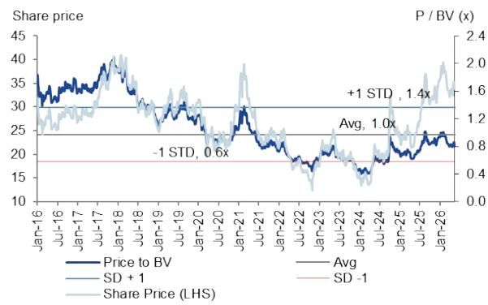

line

| Date   | Price to BV | SD + 1 | Share Price (LHS) |
|--------|-------------|--------|-------------------|
| Jan-16 | 35          | 30     | 25                |
| Jul-16 | 33          | 28     | 23                |
| Jan-17 | 34          | 29     | 24                |
| Jul-17 | 36          | 31     | 26                |
| Jan-18 | 38          | 33     | 28                |
| Jul-18 | 37          | 32     | 27                |
| Jan-19 | 35          | 31     | 26                |
| Jul-19 | 34          | 30     | 25                |
| Jan-20 | 33          | 29     | 24                |
| Jul-20 | 32          | 28     | 23                |
| Jan-21 | 31          | 27     | 22                |
| Jul-21 | 30          | 26     | 21                |
| Jan-22 | 29          | 25     | 20                |
| Jul-22 | 28          | 24     | 19                |
| Jan-23 | 27          | 23     | 18                |
| Jul-23 | 26          | 22     | 17                |
| Jan-24 | 25          | 21     | 16                |
| Jul-24 | 24          | 20     | 15                |
| Jan-25 | 23          | 19     | 14                |
| Jul-25 | 22          | 18     | 13                |
| Jan-26 | 21          | 17     | 12                |

OPAT and NPAT over the past 5 years   
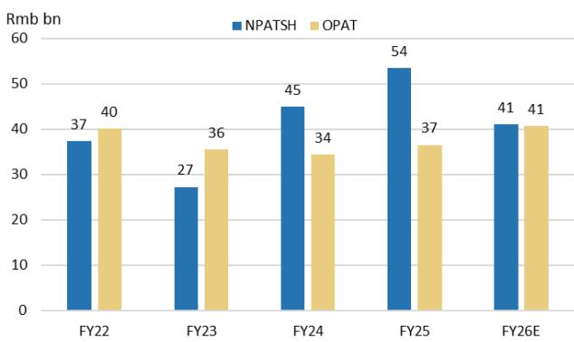

bar

| Year | NPATSH (Rmb bn) | OPAT (Rmb bn) |
| :--- | :--- | :--- |
| FY22 | 37 | 40 |
| FY23 | 27 | 36 |
| FY24 | 45 | 34 |
| FY25 | 54 | 37 |
| FY26E | 41 | 41 |

1Q earnings and annualized ROE   
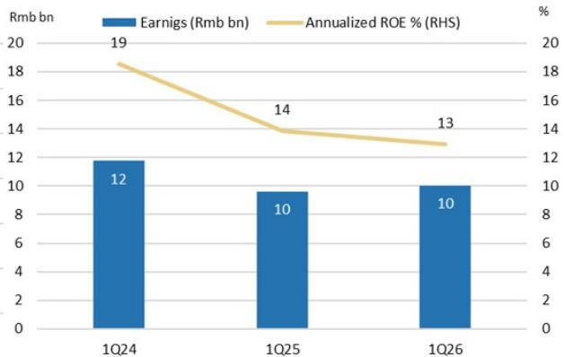

bar_line

| Quarter | Earnings (Rmb bn) | Annualized ROE % (RHS) (%) |
|---|---|---|
| 1Q24 | 12 | 19 |
| 1Q25 | 10 | 14 |
| 1Q26 | 10 | 13 |

Source: Factset, Company data, MS (E) estimates

# MS

MS

Hong Kong/China Insurance

May 18, 2026

4. CPIC – More Appealing Valuation, but We Need to See More Catalysts 

<table><tr><td>Statement of financial performance (RMB, mn)</td><td>FY25</td><td>FY26E</td><td>FY27E</td><td>FY28E</td></tr><tr><td>Insurance revenue</td><td>288,910</td><td>298,896</td><td>311,855</td><td>328,031</td></tr><tr><td>Interest income</td><td>58,832</td><td>59,218</td><td>61,152</td><td>66,914</td></tr><tr><td>Investment income</td><td>52,657</td><td>53,003</td><td>54,733</td><td>59,891</td></tr><tr><td>Gains/(Losses) arising from changes in fair val</td><td>29,932</td><td>6,723</td><td>6,719</td><td>7,558</td></tr><tr><td>Other revenue</td><td>5,019</td><td>5,339</td><td>5,306</td><td>5,426</td></tr><tr><td>Total revenue</td><td>435,350</td><td>423,179</td><td>439,765</td><td>467,820</td></tr><tr><td>Insurance service expenses</td><td>-252,043</td><td>-260,277</td><td>-270,272</td><td>-283,517</td></tr><tr><td>Net of insurance finance expenses</td><td>-100,954</td><td>-95,110</td><td>-97,395</td><td>-106,414</td></tr><tr><td>Other expenses</td><td>-16,284</td><td>-16,834</td><td>-17,493</td><td>-18,270</td></tr><tr><td>Total expenses</td><td>-369,281</td><td>-372,220</td><td>-385,160</td><td>-408,201</td></tr><tr><td>Insurance results</td><td>35,688</td><td>37,396</td><td>39,853</td><td>42,692</td></tr><tr><td>Investment results</td><td>36,167</td><td>20,345</td><td>21,596</td><td>23,836</td></tr><tr><td>Other results</td><td>-8,001</td><td>-8,273</td><td>-8,891</td><td>-9,458</td></tr><tr><td>Profit before tax</td><td>66,069</td><td>50,959</td><td>54,605</td><td>59,619</td></tr><tr><td>Income tax</td><td>-10,669</td><td>-8,486</td><td>-9,086</td><td>-9,937</td></tr><tr><td>Net profit for the year/period</td><td>55,400</td><td>42,472</td><td>45,519</td><td>49,682</td></tr><tr><td>Minority interests</td><td>-1,894</td><td>-1,452</td><td>-1,556</td><td>-1,699</td></tr><tr><td>Net profit to shareholders</td><td>53,506</td><td>41,020</td><td>43,962</td><td>47,983</td></tr><tr><td>OPAT to shareholders</td><td>36,524</td><td>40,718</td><td>43,982</td><td>48,100</td></tr></table>

<table><tr><td>Net profit after tax (RMB, mn)</td><td>FY25</td><td>FY26E</td><td>FY27E</td><td>FY28E</td></tr><tr><td>Life</td><td>42,355</td><td>31,719</td><td>33,956</td><td>36,791</td></tr><tr><td>P&amp;C</td><td>9,964</td><td>8,227</td><td>8,545</td><td>9,408</td></tr><tr><td>Corporate &amp; Others</td><td>3,081</td><td>2,525</td><td>3,018</td><td>3,483</td></tr><tr><td>Total</td><td>55,400</td><td>42,472</td><td>45,519</td><td>49,682</td></tr></table>

<table><tr><td>Statement of financial position (RMB, mn)</td><td>FY25</td><td>FY26E</td><td>FY27E</td><td>FY28E</td></tr><tr><td>Cash &amp; deposits</td><td>256,999</td><td>283,758</td><td>313,811</td><td>347,646</td></tr><tr><td>Bond</td><td>1,855,656</td><td>2,048,866</td><td>2,265,865</td><td>2,510,170</td></tr><tr><td>Debt</td><td>437,511</td><td>469,638</td><td>511,955</td><td>558,929</td></tr><tr><td>Stocks &amp; funds</td><td>422,541</td><td>479,962</td><td>538,219</td><td>604,475</td></tr><tr><td>Associates</td><td>14,616</td><td>16,138</td><td>17,847</td><td>19,771</td></tr><tr><td>Investment property</td><td>28,147</td><td>31,078</td><td>34,369</td><td>38,075</td></tr><tr><td>Others</td><td>24,517</td><td>27,070</td><td>29,937</td><td>33,164</td></tr><tr><td>Total investment assets</td><td>3,039,987</td><td>3,356,509</td><td>3,712,003</td><td>4,112,230</td></tr><tr><td>Others</td><td>104,780</td><td>104,780</td><td>104,780</td><td>104,780</td></tr><tr><td>Total assets</td><td>3,144,767</td><td>3,461,289</td><td>3,816,783</td><td>4,217,010</td></tr><tr><td>Insurance contract liabilities</td><td>2,466,607</td><td>2,744,842</td><td>3,058,855</td><td>3,413,353</td></tr><tr><td>Other liabilities</td><td>343,936</td><td>352,267</td><td>361,668</td><td>372,282</td></tr><tr><td>Total liabilities</td><td>2,810,543</td><td>3,097,108</td><td>3,420,523</td><td>3,785,635</td></tr><tr><td>Shareholders equity</td><td>302,143</td><td>332,100</td><td>364,179</td><td>399,294</td></tr><tr><td>Minority interests</td><td>32,081</td><td>32,081</td><td>32,081</td><td>32,081</td></tr><tr><td>Total equity</td><td>334,224</td><td>364,181</td><td>396,260</td><td>431,375</td></tr></table>

<table><tr><td>Life insurance embedded value (RMB, mn)</td><td>FY25</td><td>FY26E</td><td>FY27E</td><td>FY28E</td></tr><tr><td>Adjusted net assets</td><td>220,599</td><td>246,802</td><td>274,801</td><td>305,148</td></tr><tr><td>Value of in-force</td><td>244,880</td><td>262,285</td><td>282,544</td><td>305,532</td></tr><tr><td>Embedded value</td><td>465,479</td><td>509,087</td><td>557,345</td><td>610,680</td></tr><tr><td>Value of new business</td><td>18,609</td><td>20,608</td><td>22,974</td><td>25,599</td></tr></table>

<table><tr><td>Key val&#x27;n metrics (x)</td><td>FY25</td><td>FY26E</td><td>FY27E</td><td>FY28E</td></tr><tr><td>P / E (Net)</td><td>5.2</td><td>6.8</td><td>6.4</td><td>5.8</td></tr><tr><td>P / E (Operating)</td><td>7.7</td><td>6.9</td><td>6.4</td><td>5.8</td></tr><tr><td>P / BV</td><td>0.93</td><td>0.84</td><td>0.77</td><td>0.70</td></tr><tr><td>P / EV</td><td>0.6</td><td>0.5</td><td>0.5</td><td>0.5</td></tr><tr><td>Dividend yield (%)</td><td>4.0</td><td>4.2</td><td>4.6</td><td>5.1</td></tr><tr><td>RMB / HKD</td><td>1.14</td><td>1.14</td><td>1.14</td><td>1.14</td></tr></table>

<table><tr><td>Per share (Rmb)</td><td>FY25</td><td>FY26E</td><td>FY27E</td><td>FY28E</td></tr><tr><td>EPS (Net)</td><td>5.56</td><td>4.26</td><td>4.57</td><td>4.99</td></tr><tr><td>BPS</td><td>31.41</td><td>34.52</td><td>37.86</td><td>41.51</td></tr><tr><td>DPS</td><td>1.15</td><td>1.24</td><td>1.34</td><td>1.47</td></tr><tr><td>EV per share (life only)</td><td>47.56</td><td>52.01</td><td>56.94</td><td>62.39</td></tr><tr><td>NBV per share</td><td>1.93</td><td>2.14</td><td>2.39</td><td>2.66</td></tr><tr><td>No. of shares (period end)</td><td>9,620</td><td>9,620</td><td>9,620</td><td>9,620</td></tr></table>

<table><tr><td>Growth (% p.a.)</td><td>FY25</td><td>FY26E</td><td>FY27E</td><td>FY28E</td></tr><tr><td>EPS</td><td>19</td><td>-23</td><td>7</td><td>9</td></tr><tr><td>DPS</td><td>6</td><td>7</td><td>8</td><td>10</td></tr><tr><td>EV</td><td>10</td><td>9</td><td>9</td><td>10</td></tr><tr><td>NBV</td><td>40</td><td>11</td><td>11</td><td>11</td></tr></table>

<table><tr><td>Life CSM (RMB, mn)</td><td>FY25</td><td>FY26E</td><td>FY27E</td><td>FY28E</td></tr><tr><td>Release of CSM</td><td>27,244</td><td>28,626</td><td>30,223</td><td>32,203</td></tr><tr><td>Closing CSM</td><td>352,981</td><td>368,113</td><td>388,076</td><td>412,888</td></tr></table>

<table><tr><td>Business mix %</td><td>FY25</td><td>FY26E</td><td>FY27E</td><td>FY28E</td></tr><tr><td>Agency - single pay</td><td>3</td><td>2</td><td>2</td><td>2</td></tr><tr><td>Agency - regular pay</td><td>10</td><td>9</td><td>9</td><td>9</td></tr><tr><td>Agency - renewal</td><td>59</td><td>59</td><td>59</td><td>60</td></tr><tr><td>Group and other channels</td><td>28</td><td>30</td><td>29</td><td>29</td></tr><tr><td>Total Life</td><td>100</td><td>100</td><td>100</td><td>100</td></tr><tr><td>Motor</td><td>55</td><td>55</td><td>55</td><td>54</td></tr><tr><td>Non-motor</td><td>45</td><td>45</td><td>45</td><td>46</td></tr><tr><td>Total P&amp;C</td><td>100</td><td>100</td><td>100</td><td>100</td></tr></table>

<table><tr><td>Key metrics %</td><td>FY25</td><td>FY26E</td><td>FY27E</td><td>FY28E</td></tr><tr><td>ROE (Net)</td><td>18.0</td><td>12.9</td><td>12.6</td><td>12.6</td></tr><tr><td>ROA</td><td>1.8</td><td>1.2</td><td>1.2</td><td>1.2</td></tr><tr><td>FYP margin</td><td>19.8</td><td>20.1</td><td>20.6</td><td>21.1</td></tr><tr><td>Gross yield</td><td>4.9</td><td>2.9</td><td>2.7</td><td>2.7</td></tr><tr><td>Net yield</td><td>3.0</td><td>2.7</td><td>2.5</td><td>2.5</td></tr><tr><td>P&amp;C - combined ratio</td><td>97.5</td><td>97.6</td><td>97.5</td><td>97.4</td></tr><tr><td>Number of agents (000&#x27;s)</td><td>181</td><td>185</td><td>188</td><td>192</td></tr><tr><td>Agency growth</td><td>-1.6</td><td>2.0</td><td>2.0</td><td>2.0</td></tr><tr><td>Agency productivity (Rmb)</td><td>16,994</td><td>17,673</td><td>18,734</td><td>19,858</td></tr></table>

<table><tr><td>Solvency Ratio %</td><td>FY25</td><td>FY26E</td><td>FY27E</td><td>FY28E</td></tr><tr><td>Life</td><td>228</td><td>231</td><td>233</td><td>235</td></tr><tr><td>P&amp;C</td><td>244</td><td>229</td><td>222</td><td>213</td></tr><tr><td>Group</td><td>273</td><td>272</td><td>270</td><td>268</td></tr></table>

Source: Company data, MS (E) estimates

# MS

MS

Hong Kong/China Insurance

May 18, 2026

# 5. Southbound Fund Flows Comps and LO Position

Southbound Holdings as of H shares   
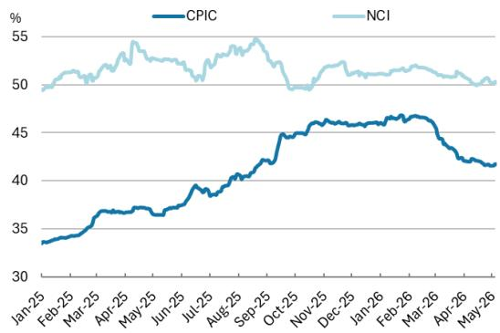

line

| Date   | CPIC | NCI  |
|--------|------|------|
| Jan-25 | 34   | 50   |
| Feb-25 | 35   | 51   |
| Mar-25 | 36   | 52   |
| Apr-25 | 37   | 54   |
| May-25 | 38   | 53   |
| Jun-25 | 39   | 52   |
| Jul-25 | 40   | 51   |
| Aug-25 | 41   | 53   |
| Sep-25 | 42   | 55   |
| Oct-25 | 44   | 50   |
| Nov-25 | 46   | 51   |
| Dec-25 | 47   | 52   |
| Jan-26 | 47   | 51   |
| Feb-26 | 47   | 52   |
| Mar-26 | 46   | 51   |
| Apr-26 | 44   | 50   |
| May-26 | 42   | 50   |

Southbound Holdings Change in April 2026

SB Holding changes in April 2026\*   
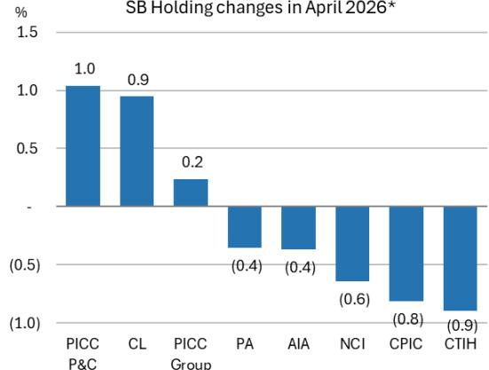

bar

SB Holding changes in April 2026*
| Entity | Change (%) |
| :--- | :--- |
| PICC P&C | 1.0 |
| CL | 0.9 |
| PICC Group | 0.2 |
| PA | -0.4 |
| AIA | -0.4 |
| NCI | -0.6 |
| CPIC | -0.8 |
| CTIH | -0.9 |

Southbound Holdings as of H shares   
Southbound Holdings as of H shares   
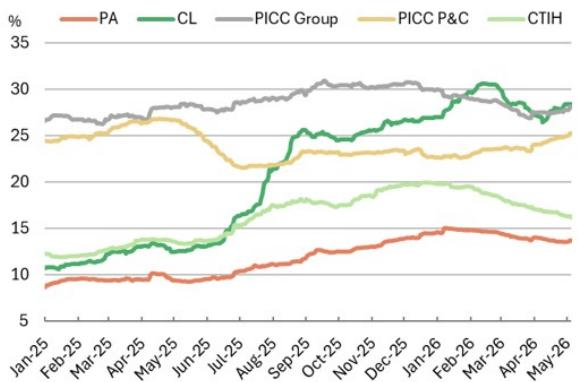

line

| Date   | PA   | CL   | PICC Group | PICC P&C | CTIH |
|--------|------|------|------------|----------|------|
| Jan-25 | 9.0  | 9.5  | 27.0       | 24.5     | 12.0 |
| Feb-25 | 9.5  | 10.0 | 27.5       | 25.0     | 12.5 |
| Mar-25 | 10.0 | 11.0 | 28.0       | 25.5     | 13.0 |
| Apr-25 | 10.5 | 12.0 | 28.5       | 26.0     | 13.5 |
| May-25 | 11.0 | 13.0 | 29.0       | 26.5     | 14.0 |
| Jun-25 | 11.5 | 14.0 | 29.5       | 27.0     | 14.5 |
| Jul-25 | 12.0 | 15.0 | 30.0       | 27.5     | 15.0 |
| Aug-25 | 12.5 | 16.0 | 30.5       | 28.0     | 16.0 |
| Sep-25 | 13.0 | 17.0 | 31.0       | 28.5     | 17.0 |
| Oct-25 | 13.5 | 18.0 | 31.5       | 29.0     | 18.0 |
| Nov-25 | 14.0 | 19.0 | 32.0       | 29.5     | 19.0 |
| Dec-25 | 14.5 | 20.0 | 32.5       | 30.0     | 20.0 |
| Jan-26 | 15.0 | 21.0 | 33.0       | 30.5     | 21.0 |
| Feb-26 | 14.5 | 22.0 | 33.5       | 31.0     | 22.0 |
| Mar-26 | 14.0 | 23.0 | 34.0       | 31.5     | 23.0 |
| Apr-26 | 13.5 | 24.0 | 34.5       | 32.0     | 24.0 |
| May-26 | 13.0 | 25.0 | 35.0       | 32.5     | 25.0 |

H-share listed insurers' holdings among LOs

Insurers' Holding Weights   
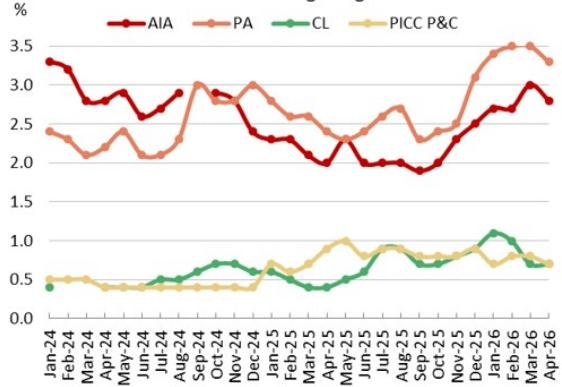

line

| Date | AIA (%) | PA (%) | CL (%) | PICC P&C (%) |
|---|---|---|---|---|
| Jan-24 | 3.3 | 2.4 | 0.4 | 0.5 |
| Feb-24 | 3.1 | 2.3 | 0.4 | 0.5 |
| Mar-24 | 2.8 | 2.1 | 0.4 | 0.4 |
| Apr-24 | 2.9 | 2.2 | 0.4 | 0.4 |
| May-24 | 2.7 | 2.3 | 0.4 | 0.4 |
| Jun-24 | 2.6 | 2.1 | 0.4 | 0.4 |
| Jul-24 | 2.8 | 2.1 | 0.4 | 0.4 |
| Aug-24 | 2.9 | 2.3 | 0.4 | 0.4 |
| Sep-24 | 3.0 | 3.0 | 0.5 | 0.4 |
| Oct-24 | 2.9 | 2.8 | 0.6 | 0.4 |
| Nov-24 | 2.8 | 3.0 | 0.6 | 0.5 |
| Dec-24 | 2.7 | 3.1 | 0.6 | 0.5 |
| Jan-25 | 2.5 | 2.9 | 0.5 | 0.6 |
| Feb-25 | 2.3 | 2.7 | 0.4 | 0.6 |
| Mar-25 | 2.1 | 2.6 | 0.4 | 0.7 |
| Apr-25 | 2.0 | 2.5 | 0.4 | 0.8 |
| May-25 | 1.9 | 2.4 | 0.5 | 0.9 |
| Jun-25 | 1.9 | 2.5 | 0.6 | 0.9 |
| Jul-25 | 1.9 | 2.7 | 0.7 | 1.0 |
| Aug-25 | 1.9 | 2.8 | 0.7 | 1.0 |
| Sep-25 | 1.9 | 2.7 | 0.7 | 1.0 |
| Oct-25 | 1.9 | 2.6 | 0.7 | 1.0 |
| Nov-25 | 2.0 | 2.7 | 0.8 | 1.0 |
| Dec-25 | 2.1 | 3.1 | 0.9 | 1.1 |
| Jan-26 | 2.3 | 3.3 | 1.1 | 1.0 |
| Feb-26 | 2.5 | 3.5 | 1.0 | 0.9 |
| Mar-26 | 3.0 | 3.5 | 0.8 | 0.8 |
| Apr-26 | 2.8 | 3.3 | 0.7 | 0.7 |

Southbound Holdings as of H shares   
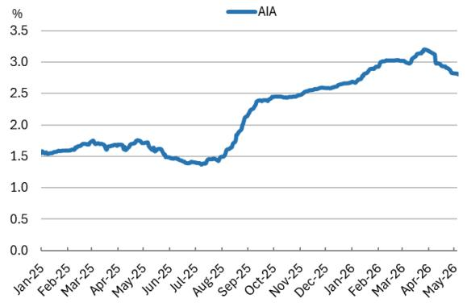

line

| Month    | AIA  |
| -------- | ---- |
| Jan-25   | 1.5  |
| Feb-25   | 1.6  |
| Mar-25   | 1.7  |
| Apr-25   | 1.6  |
| May-25   | 1.7  |
| Jun-25   | 1.5  |
| Jul-25   | 1.4  |
| Aug-25   | 1.5  |
| Sep-25   | 2.0  |
| Oct-25   | 2.4  |
| Nov-25   | 2.5  |
| Dec-25   | 2.6  |
| Jan-26   | 2.7  |
| Feb-26   | 2.9  |
| Mar-26   | 3.0  |
| Apr-26   | 3.1  |
| May-26   | 2.8  |

H-share listed insurers' weights in MSCI Index

Insurers' MSCI Index Weights   
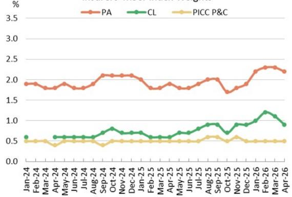

line

| Month    | PA    | CL    | PICC P&C |
| -------- | ----- | ----- | -------- |
| Jan-24   | 1.9   | 0.6   | 0.5      |
| Feb-24   | 1.8   | 0.6   | 0.5      |
| Mar-24   | 1.8   | 0.6   | 0.5      |
| Apr-24   | 1.8   | 0.6   | 0.5      |
| May-24   | 1.8   | 0.6   | 0.5      |
| Jun-24   | 1.8   | 0.6   | 0.5      |
| Jul-24   | 1.8   | 0.6   | 0.5      |
| Aug-24   | 1.8   | 0.6   | 0.5      |
| Sep-24   | 2.1   | 0.7   | 0.5      |
| Oct-24   | 2.1   | 0.8   | 0.5      |
| Nov-24   | 2.1   | 0.7   | 0.5      |
| Dec-24   | 2.1   | 0.7   | 0.5      |
| Jan-25   | 2.1   | 0.7   | 0.5      |
| Feb-25   | 1.8   | 0.6   | 0.5      |
| Mar-25   | 1.8   | 0.6   | 0.5      |
| Apr-25   | 1.8   | 0.6   | 0.5      |
| May-25   | 1.8   | 0.6   | 0.5      |
| Jun-25   | 1.8   | 0.6   | 0.5      |
| Jul-25   | 1.9   | 0.7   | 0.5      |
| Aug-25   | 2.0   | 0.8   | 0.5      |
| Sep-25   | 2.0   | 0.7   | 0.5      |
| Oct-25   | 1.7   | 0.7   | 0.5      |
| Nov-25   | 1.8   | 0.8   | 0.5      |
| Dec-25   | 1.9   | 0.9   | 0.5      |
| Jan-26   | 2.3   | 1.0   | 0.5      |
| Feb-26   | 2.3   | 1.2   | 0.5      |
| Mar-26   | 2.3   | 1.1   | 0.5      |
| Apr-26   | 2.2   | 0.9   | 0.5      |

Source: Factset, Wind, Company data, MorningStar, EPFR, MS; Latest data as of May 14, 2026; For LO Holdings, % are among overall CN/HK holdings; data refreshed as of April 30, 2026, most funds have disclosed position data up to March 30.

# Disclosure Section

The information and opinions in MS were prepared or are disseminated by MS Asia Limited (which accepts the responsibility for its contents) and/or MS Asia (Singapore) Pte. (Registration number 199206298Z) and/or MS Asia (Singapore) Securities Pte Ltd (Registration number 200008434H), regulated by the Monetary Authority of Singapore (which accepts legal responsibility for its contents and should be contacted with respect to any matters arising from, or in connection with, MS), and/or MS Taiwan Limited and/or MS & Co International plc, Seoul Branch, and/or MS Australia Limited (A.B.N. 67 003 734 576, holder of Australian financial services license No. 233742, which accepts responsibility for its contents), and/or MS Wealth Management Australia Pty Ltd (A.B.N. 19 009 145 555, holder of Australian financial services license No. 240813, which accepts responsibility for its contents), and/or MS India Company Private Limited having Corporate Identification No (CIN) U22990MH1998PTC115305, regulated by the Securities and Exchange Board of India ("SEBI") and holder of licenses as a Research Analyst (SEBI Registration No. INH000001105); Stock Broker (SEBI Stock Broker Registration No. INZ000244438), Merchant Banker (SEBI Registration No. INM000011203), and depository participant with National Securities Depository Limited (SEBI Registration No. IN-DP-NSDL-567-2021) having registered office at Altimus, Level 39 & 40, Pandurang Budhkar Marg, Worli, Mumbai 400018, India; Telephone no. +91-22-61181000; Compliance Officer Details: Mr. Tejarshi Hardas, Tel. No.: +91-22-61181000 or Email: tejarshi.hardas@morganstanley.com; Grievance officer details: Mr. Tejarshi Hardas, Tel. No.: +91-22-61181000 or Email: msic-compliance@morganstanley.com which accepts the responsibility for its contents and should be contacted with respect to any matters arising from, or in connection with, MS, and their affiliates (collectively, "MS"). MS India Company Private Limited (MSICPL) may use AI tools in providing research services. All recommendations contained herein are made by the duly qualified research analysts.

For important disclosures, stock price charts and equity rating histories regarding companies that are the subject of this report, please see the MS Disclosure Website at www.morganstanley.com/eqr/disclosures/webapp/generalresearch, or contact your investment representative or MS at 1585 Broadway, (Attention: Research Management), New York, NY, 10036 USA.

For valuation methodology and risks associated with any recommendation, rating or price target referenced in this research report, please contact the Client Support Team as follows: US/Canada +1800 303-2495; Hong Kong +852 2848-5999; Latin America +1718 754-5444 (U.S.); London +44 (0)20-7425-8169; Singapore +65 6834-6860; Sydney +61(0)2-9770-1505; Tokyo +81(0)3-6836-9000. Alternatively you may contact your investment representative or MS at 1585 Broadway, (Attention: Research Management), New York, NY 10036 USA.

# Analyst Certification

The following analysts hereby certify that their views about the companies and their securities discussed in this report are accurately expressed and that they have not received and will not receive direct or indirect compensation in exchange for expressing specific recommendations or views in this report: Richard Xu, CFA; Rick Zhao.

# Global Research Conflict Management Policy

MS has been published in accordance with our conflict management policy, which is available at www.morganstanley.com/institutional/research/conflictpolicies. A Portuguese version of the policy can be found at www.morganstanley.com.br

# Important Regulatory Disclosures on Subject Companies

As of April 30, 2026, MS beneficially owned 1% or more of a class of common equity securities of the following companies covered in MS: AIA Group Ltd, China Life Insurance Co Ltd, China Pacific Insurance Group Co Ltd, PICC Group, PICC P&C Company Ltd, Ping An Insurance Group Co of China Ltd.

Within the last 12 months, MS managed or co-managed a public offering (or 144A offering) of securities of AIA Group Ltd, China Pacific Insurance Group Co Ltd, FWD Group Holdings Ltd, Ping An Insurance Group Co of China Ltd, ZhongAn Online P & C Insurance Co Ltd.

Within the last 12 months, MS has received compensation for investment banking services from China Pacific Insurance Group Co Ltd, FWD Group Holdings Ltd, Ping An Insurance Group Co of China Ltd, ZhongAn Online P & C Insurance Co Ltd. In the next 3 months, MS expects to receive or intends to seek compensation for investment banking services from AIA Group Ltd, China Life Insurance Co Ltd, China Pacific Insurance Group Co Ltd, China Taiping Insurance Holdings Co Ltd, FWD Group Holdings Ltd, New China Life Insurance Company Ltd, PICC Group, Ping An Insurance Group Co of China Ltd, ZhongAn Online P & C Insurance Co Ltd.

Within the last 12 months, MS has received compensation for products and services other than investment banking services from AIA Group Ltd, China Life Insurance Co Ltd, China Taiping Insurance Holdings Co Ltd, FWD Group Holdings Ltd, PICC Group, Ping An Insurance Group Co of China Ltd, ZhongAn Online P & C Insurance Co Ltd.

Within the last 12 months, MS has provided or is providing investment banking services to, or has an investment banking client relationship with, the following company: AIA Group Ltd, China Life Insurance Co Ltd, China Pacific Insurance Group Co Ltd, China Taiping Insurance Holdings Co Ltd, FWD Group Holdings Ltd, New China Life Insurance Company Ltd, PICC Group, Ping An Insurance Group Co of China Ltd, ZhongAn Online P & C Insurance Co Ltd.

Within the last 12 months, MS has either provided or is providing non-investment banking, securities-related services to and/or in the past has entered into an agreement to provide services or has a client relationship with the following company: AIA Group Ltd, China Life Insurance Co Ltd, China Pacific Insurance Group Co Ltd, China Taiping Insurance Holdings Co Ltd, FWD Group Holdings Ltd, PICC Group, PICC P&C Company Ltd, Ping An Insurance Group Co of China Ltd, ZhongAn Online P & C Insurance Co Ltd.

The equity research analysts or strategists principally responsible for the preparation of MS have received compensation based upon various factors, including quality of research, investor client feedback, stock picking, competitive factors, firm revenues and overall investment banking revenues. Equity Research analysts' or strategists' compensation is not linked to investment banking or capital markets transactions performed by MS or the profitability or revenues of particular trading desks.

MS and its affiliates do business that relates to companies/instruments covered in MS, including market making, providing liquidity, fund management, commercial banking, extension of credit, investment services and investment banking. MS sells to and buys from customers the securities/instruments of companies covered in MS on a principal basis. MS may have a position in the debt of the Company or instruments discussed in this report. MS trades or may trade as principal in the debt securities (or in related derivatives) that are the subject of the debt research report.

Certain disclosures listed above are also for compliance with applicable regulations in non-US jurisdictions.

# STOCK RATINGS

MS uses a relative rating system using terms such as Overweight, Equal-weight, Not-Rated or Underweight (see definitions below). MS does not assign ratings of Buy, Hold or Sell to the stocks we cover. Overweight, Equal-weight, Not-Rated and Underweight are not the equivalent of buy, hold and sell. Investors should carefully read the definitions of all ratings used in MS. In addition, since MS contains more complete information concerning the analyst's views, investors should carefully read MS, in its entirety, and not infer the contents from the rating alone. In any case, ratings (or research) should not be used or relied upon as investment advice. An investor's decision to buy or sell a stock should depend on individual circumstances (such as the investor's existing holdings) and other considerations.

# Global Stock Ratings Distribution

(as of April 30, 2026)

The Stock Ratings described below apply to MS's Fundamental Equity Research and do not apply to Debt Research produced by the Firm.

For disclosure purposes only (in accordance with FINRA requirements), we include the category headings of Buy, Hold, and Sell alongside our ratings of Overweight, Equal-weight, Not-Rated and Underweight. MS does not assign ratings of Buy, Hold or Sell to the stocks we cover. Overweight, Equal-weight, Not-Rated and Underweight are not the equivalent of buy, hold, and sell but represent recommended relative weightings (see definitions below). To satisfy regulatory requirements, we correspond Overweight, our most positive stock rating, with a buy recommendation; we correspond Equal-weight and Not-Rated to hold and Underweight to sell recommendations, respectively.

<table><tr><td></td><td colspan="2">Coverage Universe</td><td colspan="3">Investment Banking Clients (IBC)</td><td colspan="2">Other Material Investment Services Clients (MISC)</td></tr><tr><td>Stock Rating Category</td><td>Count</td><td>% of Total</td><td>Count</td><td>% of Total IBC</td><td>% of Rating Category</td><td>Count</td><td>% of Total Other MISC</td></tr><tr><td>Overweight/Buy</td><td>1546</td><td>42%</td><td>467</td><td>51%</td><td>30%</td><td>709</td><td>44%</td></tr><tr><td>Equal-weight/Hold</td><td>1568</td><td>43%</td><td>358</td><td>39%</td><td>23%</td><td>715</td><td>44%</td></tr><tr><td>Not-Rated/Hold</td><td>4</td><td>0%</td><td>0</td><td>0%</td><td>0%</td><td>1</td><td>0%</td></tr><tr><td>Underweight/Sell</td><td>555</td><td>15%</td><td>84</td><td>9%</td><td>15%</td><td>202</td><td>12%</td></tr><tr><td>Total</td><td>3,673</td><td></td><td>909</td><td></td><td></td><td>1627</td><td></td></tr></table>

Data include common stock and ADRs currently assigned ratings. Investment Banking Clients are companies from whom MS received investment banking compensation in the last 12 months. Due to rounding off of decimals, the percentages provided in the "% of total" column may not add up to exactly 100 percent.

# Analyst Stock Ratings

Overweight (O). The stock's total return is expected to exceed the average total return of the analyst's industry (or industry team's) coverage universe, on a risk-adjusted basis, over the next 12-18 months.

Equal-weight (E). The stock's total return is expected to be in line with the average total return of the analyst's industry (or industry team's) coverage universe, on a risk-adjusted basis, over the next 12-18 months.

Not-Rated (NR). Currently the analyst does not have adequate conviction about the stock's total return relative to the average total return of the analyst's industry (or industry team's) coverage universe, on a risk-adjusted basis, over the next 12-18 months.

Underweight (U). The stock's total return is expected to be below the average total return of the analyst's industry (or industry team's) coverage universe, on a risk-adjusted basis, over the next 12-18 months.

Unless otherwise specified, the time frame for price targets included in MS is 12 to 18 months.

# Analyst Industry Views

Attractive (A): The analyst expects the performance of his or her industry coverage universe over the next 12-18 months to be attractive vs. the relevant broad market benchmark, as indicated below.

In-Line (I): The analyst expects the performance of his or her industry coverage universe over the next 12-18 months to be in line with the relevant broad market benchmark, as indicated below.

Cautious (C): The analyst views the performance of his or her industry coverage universe over the next 12-18 months with caution vs. the relevant broad market benchmark, as indicated below.

Benchmarks for each region are as follows: North America - S&P 500; Latin America - relevant MSCI country index or MSCI Latin America Index; Europe - MSCI Europe; Japan - TOPIX; Asia - relevant MSCI country index or MSCI sub-regional index or MSCI AC Asia Pacific ex Japan Index.

# Important Disclosures for MS Smith Barney LLC Customers

Important disclosures regarding any material conflict of interest that can reasonably be expected to have influenced MS Smith Barney LLC's choice of a third-party research provider or the subject company of a third-party research report, are available on the MS Wealth Management disclosure website at www.morganstanley.com/online/researchdisclosures. For MS specific disclosures, you may refer to https://www.morganstanley.com/eqr/disclosures/webapp/generalre-

search.

Each MS report is reviewed and approved on behalf of MS Smith Barney LLC. This review and approval is conducted by the same person who reviews the research report on behalf of MS. This could create a conflict of interest.

# Other Important Disclosures

MS policy is to update research reports as and when the Research Analyst and Research Management deem appropriate, based on developments with the issuer, the sector, or the market that may have a material impact on the research views or opinions stated therein. In addition, certain Research publications are intended to be updated on a regular periodic basis (weekly/monthly/quarterly/annual) and will ordinarily be updated with that frequency, unless the Research Analyst and Research Management determine that a different publication schedule is appropriate based on current conditions.

MS is not acting as a municipal advisor and the opinions or views contained herein are not intended to be, and do not constitute, advice within the meaning of Section 975 of the Dodd-Frank Wall Street Reform and Consumer Protection Act. MS produces an equity research product called a "Tactical Idea." Views contained in a "Tactical Idea" on a particular stock may be contrary to the recommendations or views expressed in research on the same stock. This may be the result of differing time horizons, methodologies, market events, or other factors. For all research available on a particular stock, please contact your sales representative or go to Matrix at http://www.morganstanley.com/matrix.

MS is provided to our clients through our proprietary research portal on Matrix and also distributed electronically by MS to clients. Certain, but not all, MS products are also made available to clients through third-party vendors or redistributed to clients through alternate electronic means as a convenience. For access to all available MS, please contact your sales representative or go to Matrix at http://www.morganstanley.com/matrix.Any access and/or use of MS is subject to MS's Terms of Use (http://www.morganstanley.com/terms.html). By accessing and/or using MS, you are indicating that you have read and agree to be bound by our Terms of Use (http://www.morganstanley.com/terms.html). In addition you consent to MS processing your personal data and using cookies in accordance with our Privacy Policy and our Global Cookies Policy (http://www.morganstanley.com/privacy\_pledge.html), including for the purposes of setting your preferences and to collect readership data so that we can deliver better and more personalized service and products to you. To find out more information about how MS processes personal data, how we use cookies and how to reject cookies see our Privacy Policy and our Global Cookies Policy (http://www.morganstanley.com/privacy\_pledge.html). Please use the provided link to review the Terms and Conditions and Most Important Terms and Conditions for MS India Company Private Limited (https://www.morganstanley.com/assets/pdfs/about-us-global-offices/india/Terms\_and\_conditions.pdf) and the following link to review the audit report (https://ny.matrix.ms.com/eqr/research/webapp/researchdocs/MSICPL\_Morgan\_Stanley\_Research\_Audit\_Report.pdf).

If you do not agree to our Terms of Use and/or if you do not wish to provide your consent to MS processing your personal data or using cookies please do not access our research.

MS does not provide individually tailored investment advice. MS has been prepared without regard to the circumstances and objectives of those who receive it. MS recommends that investors independently evaluate particular investments and strategies, and encourages investors to seek the advice of a financial adviser. The appropriateness of an investment or strategy will depend on an investor's circumstances and objectives. The securities, instruments, or strategies discussed in MS may not be suitable for all investors, and certain investors may not be eligible to purchase or participate in some or all of them. MS is not an offer to buy or sell or the solicitation of an offer to buy or sell any security/instrument or to participate in any particular trading strategy. The value of and income from your investments may vary because of changes in interest rates, foreign exchange rates, default rates, prepayment rates, securities/instruments prices, market indexes, operational or financial conditions of companies or other factors. There may be time limitations on the exercise of options or other rights in securities/instruments transactions. Past performance is not necessarily a guide to future performance. Estimates of future performance are based on assumptions that may not be realized. If provided, and unless otherwise stated, the closing price on the cover page is that of the primary exchange for the subject company's securities/instruments.

The fixed income research analysts, strategists or economists principally responsible for the preparation of MS have received compensation based upon various factors, including quality, accuracy and value of research, firm profitability or revenues (which include fixed income trading and capital markets profitability or revenues), client feedback and competitive factors. Fixed Income Research analysts', strategists' or economists' compensation is not linked to investment banking or capital markets transactions performed by MS or the profitability or revenues of particular trading desks.

The "Important Regulatory Disclosures on Subject Companies" section in MS lists all companies mentioned where MS owns 1% or more of a class of common equity securities of the companies. For all other companies mentioned in MS, MS may have an investment of less than 1% in securities/instruments or derivatives of securities/instruments of companies and may trade them in ways different from those discussed in MS. Employees of MS not involved in the preparation of MS may have investments in securities/instruments or derivatives of securities/instruments of companies mentioned and may trade them in ways different from those discussed in MS. Derivatives may be issued by MS or associated persons.

With the exception of information regarding MS, MS is based on public information. MS makes every effort to use reliable, comprehensive information, but we make no representation that it is accurate or complete. We have no obligation to tell you when opinions or information in MS change apart from when we intend to discontinue equity research coverage of a subject company. Facts and views presented in MS have not been reviewed by, and may not reflect information known to, professionals in other MS business areas, including investment banking personnel.

MS personnel may participate in company events such as site visits and are generally prohibited from accepting payment by the company of associated expenses unless pre-approved by authorized members of Research management. MS may make investment decisions that are inconsistent with the recommendations or views in this report.

To our readers based in Taiwan or trading in Taiwan securities/instruments: Information on securities/instruments that trade in Taiwan is distributed by MS Taiwan Limited ("MSTL"). Such information is for your reference only. The reader should independently evaluate the investment risks and is solely responsible for their investment decisions. MS may not be distributed to the public media or quoted or used by the public media without the express written consent of MS. Any non-customer reader within the scope of Article 7-1 of the Taiwan Stock Exchange Recommendation Regulations accessing and/or receiving MS is not permitted to provide MS to any third party (including but not limited to related parties, affiliated companies and any other third parties) or engage in any activities regarding MS which may create or give the appearance of creating a conflict of interest. Information on securities/instruments that do not trade in Taiwan is for informational purposes only and is not to be construed as a recommendation or a solicitation to trade in such securities/instruments. MSTL may not execute transactions for clients in these securities/instruments.

Certain information in MS was sourced by employees of the Shanghai Representative Office of MS Asia Limited for the use of MS Asia Limited.

MS is not incorporated under PRC law and the research in relation to this report is conducted outside the PRC. MS does not constitute an offer to sell or the solicitation of an offer to buy any securities in the PRC. PRC investors shall have the relevant qualifications to invest in such securities and shall be responsible for obtaining all relevant approvals, licenses, verifications and/or registrations from the relevant governmental authorities themselves. Neither this report nor any part of it is intended as, or shall constitute, provision of any consultancy or advisory service of securities investment as defined under PRC law. Such information is provided for your reference only.

MS is disseminated in Brazil by MS C.T.V.M. S.A. located at Av. Brigadeiro Faria Lima, 3600, 6th floor, São Paulo - SP, Brazil; and is regulated by the Comissão de Valores Mobiliários; in Mexico by MS México, Casa de Bolsa, S.A. de C.V which is regulated by Comision Nacional Bancaria y de Valores. Paseo de los Tamarindos 90, Torre 1, Col. Bosques de las Lomas Floor 29, 05120 Mexico City; in Japan by MS MUFG Securities Co., Ltd. and, for Commodities related research reports only, MS Capital Group Japan Co., Ltd; in Hong Kong by MS Asia Limited (which accepts responsibility for its contents) and by MS Bank Asia Limited; in Singapore by MS Asia (Singapore) Pte. (Registration number 199206298Z) and/or MS Asia (Singapore) Securities Pte Ltd (Registration number 200008434H), regulated by the Monetary Authority of Singapore (which accepts legal responsibility for its contents and should be contacted with respect to any matters arising from, or in connection with, MS) and by MS Bank Asia Limited, Singapore Branch (Registration number T14FC0118); in Australia to "wholesale clients" within the meaning of the Australian Corporations Act by MS Australia Limited A.B.N. 67 003 734 576, holder of Australian financial services license No. 23374-2, which accepts responsibility for its contents; in Australia to "wholesale clients" and "retail clients" within the meaning of the Australian Corporations Act by MS Wealth Management Australia Pty Ltd (A.B.N. 19 009 1445 555, holder of Australian financial services license No. 240813, which accepts responsibility for its contents; in Korea by MS & Co International plc, Seoul Branch; in India by MS India Company Private Limited having Corporate Identification No (CIN) U22990MH1998PTC115305, regulated by the Securities and Exchange Board of India ("SEBI") and holder of licenses as a Research Analyst (SEBI Registration No. INH000001105); Stock Broker (SEBI Stock Broker Registration No. INZ000244438), Merchant Banker (SEBI Registration No. INM000011203), and depository participant with National Securities Depository Limited (SEBI Registration No. IN-DP-NSDL-567-2021) having registered office at Altimus, Level 39 & 40, Pandurang Budhkar Marg, Worli, Mumbai 400018, India; Telephone no. +91-22-61181000; Compliance Officer Details: Mr. Tejarshi Hardas, Tel. No.: +91-22-61181000 or Email: tejarshi.hardas@morganstanley.com; Grievance officer details: Mr. Tejarshi Hardas, Tel. No.: +91-22-61181000 or Email: msic-compliance@morganstanley.com. MS India Company Private Limited (MSICPL) may use AI tools in providing research services. All recommendations contained herein are made by the duly qualified research analysts; in Canada by MS Canada Limited; in Germany and the European Economic Area where required by MS Europe S.E., authorised and regulated by Bundesanstalt fuer Finanzdienstleistungsaufsicht (BaFin) under the reference number 149169; in the US by MS & Co. LLC, which accepts responsibility for its contents. MS & Co. International plc, authorized by the Prudential Regulation Authority and regulated by the Financial Conduct Authority and the Prudential Regulation Authority, disseminates in the UK research that it has prepared, and research which has been prepared by any of its affiliates, only to persons who (i) are investment professionals falling within Article 19(5) of the Financial Services and Markets Act 2000 (Financial Promotion) Order 2005 (as amended, the "Order"); (ii) are persons who are high net worth entities falling within Article 49(2)(a) to (d) of the Order; or (iii) are persons to whom an invitation or inducement to engage in investment activity (within the meaning of section 21 of the Financial Services and Markets Act 2000, as amended) may otherwise lawfully be communicated or caused to be communicated. RMB MS Proprietary Limited is a member of the JSE Limited and A2X (Pty) Ltd. RMB MS Proprietary Limited is a joint venture owned equally by MS International Holdings Inc. and RMB Investment Advisory (Proprietary) Limited, which is wholly owned by FirstRand Limited. The information in MS is being disseminated by MS Saudi Arabia, regulated by the Capital Market Authority in the Kingdom of Saudi Arabia, and is directed at Sophisticated investors only.

MS Hong Kong Securities Limited is the liquidity provider/market maker for securities of AIA Group Ltd, China Life Insurance Co Ltd, China Pacific Insurance Group Co Ltd, New China Life Insurance Company Ltd, PICC Group, PICC P&C Company Ltd, Ping An Insurance Group Co of China Ltd, ZhongAn Online P & C Insurance Co Ltd listed on the Stock Exchange of Hong Kong Limited. An updated list can be found on HKEx website: http://www.hkex.com.hk.

The information in MS is being communicated by MS & Co. International plc (DIFC Branch), regulated by the Dubai Financial Services Authority (the DFSA) or by MS & Co. International plc (ADGM Branch), regulated by the Financial Services Regulatory Authority Abu Dhabi (the FSRA), and is directed at Professional Clients only, as defined by the DFSA or the FSRA, respectively. The financial products or financial services to which this research relates will only be made available to a customer who we are satisfied meets the regulatory criteria of a Professional Client. A distribution of the different MS Research ratings or recommendations, in percentage terms for Investments in each sector covered, is available upon request from your sales representative.

The information in MS is being communicated by MS & Co. International plc (QFC Branch), regulated by the Qatar Financial Centre Regulatory Authority (the QFCRA), and is directed at business customers and market counterparties only and is not intended for Retail Customers as defined by the QFCRA.

As required by the Capital Markets Board of Turkey, investment information, comments and recommendations stated here, are not within the scope of investment advisory activity. Investment advisory service is provided exclusively to persons based on their risk and income preferences by the authorized firms. Comments and recommendations stated here are general in nature. These opinions may not fit to your financial status, risk and return preferences. For this reason, to make an investment decision by relying solely to this information stated here may not bring about outcomes that fit your expectations.

The trademarks and service marks contained in MS are the property of their respective owners. Third-party data providers make no warranties or representations relating to the accuracy, completeness, or timeliness of the data they provide and shall not have liability for any damages relating to such data. The Global Industry Classification Standard (GICS) was developed by and is the exclusive property of MSCI and S&P.

MS, or any portion thereof may not be reprinted, sold or redistributed without the written consent of MS.

Indicators and trackers referenced in MS may not be used as, or treated as, a benchmark under Regulation EU 2016/1011, or any other similar framework.

The issuers and/or fixed income products recommended or discussed in certain fixed income research reports may not be continuously followed. Accordingly, investors should regard those fixed income research reports as providing stand-alone analysis and should not expect continuing analysis or additional reports relating to such issuers and/or individual fixed income products.

MS may hold, from time to time, material financial and commercial interests regarding the company subject to the Research report.

Registration granted by SEBI and certification from the National Institute of Securities Markets (NISM) in no way guarantee performance of the intermediary or provide any assurance of returns to investors. Investment in securities market are subject to market risks. Read all the related documents carefully before investing.

INDUSTRY COVERAGE: Hong Kong/China Insurance 

<table><tr><td>COMPANY (TICKER)</td><td>RATING (AS OF)</td><td>PRICE* (05/18/2026)</td></tr><tr><td colspan="3">Richard Xu, CFA</td></tr><tr><td>AIA Group Ltd (1299.HK)</td><td>O (12/12/2023)</td><td>HK$86.65</td></tr><tr><td>FWD Group Holdings Ltd (1828.HK)</td><td>O (08/13/2025)</td><td>HK$30.50</td></tr><tr><td>Ping An Insurance Group Co of China Ltd (2318.HK)</td><td>O (05/30/2023)</td><td>HK$61.85</td></tr><tr><td>Ping An Insurance Group Co of China Ltd (601318.SS)</td><td>O (05/30/2023)</td><td>Rmb54.89</td></tr><tr><td colspan="3">Rick Zhao</td></tr><tr><td>China Life Insurance Co Ltd (601628.SS)</td><td>E (05/30/2023)</td><td>Rmb34.75</td></tr><tr><td>China Life Insurance Co Ltd (2628.HK)</td><td>O (05/30/2023)</td><td>HK$29.76</td></tr><tr><td>China Pacific Insurance Group Co Ltd (601601.SS)</td><td>O (06/07/2024)</td><td>Rmb33.87</td></tr><tr><td>China Pacific Insurance Group Co Ltd (2601.HK)</td><td>O (05/30/2023)</td><td>HK$32.94</td></tr><tr><td>China Taiping Insurance Holdings Co Ltd (0966.HK)</td><td>E (05/30/2023)</td><td>HK$21.42</td></tr><tr><td>New China Life Insurance Company Ltd (601336.SS)</td><td>U (05/30/2023)</td><td>Rmb60.12</td></tr><tr><td>New China Life Insurance Company Ltd (1336.HK)</td><td>U (07/31/2025)</td><td>HK$49.14</td></tr><tr><td>PICC Group (1339.HK)</td><td>O (09/23/2024)</td><td>HK$5.26</td></tr><tr><td>PICC Group (601319.SS)</td><td>E (07/31/2025)</td><td>Rmb6.84</td></tr><tr><td>PICC P&amp;C Company Ltd (2328.HK)</td><td>O (05/30/2023)</td><td>HK$15.43</td></tr><tr><td>ZhongAn Online P &amp; C Insurance Co Ltd (6060.HK)</td><td>O (05/30/2023)</td><td>HK$11.00</td></tr></table>

Stock Ratings are subject to change. Please see latest research for each company.   
\* Historical prices are not split adjusted.

© 2026 MS