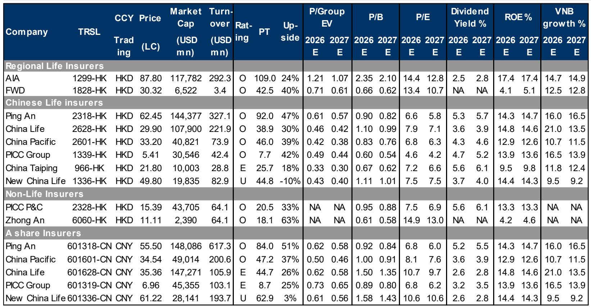
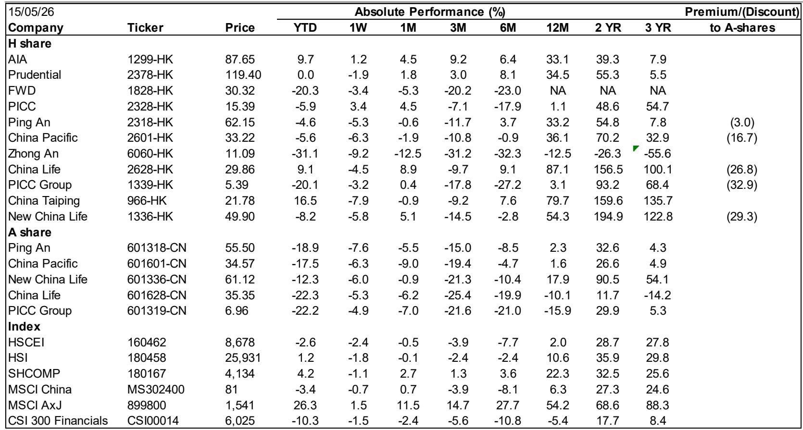
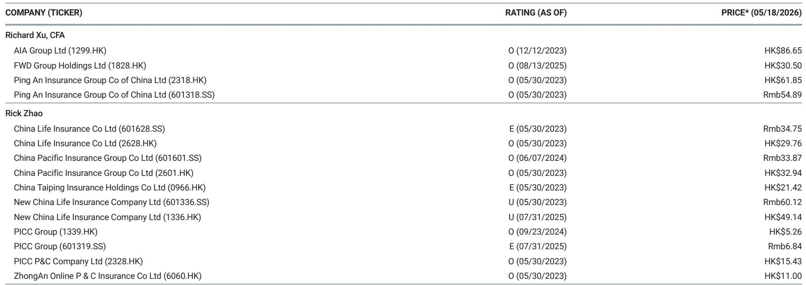

# The 1Q26 Earnings Overhang Has Cleared: Hong Kong/China Insurers Are Positioned for a Second-Quarter Re-Rating

The first quarter of 2026 was never going to be easy for Hong Kong and China insurers. Markets entered the period with elevated expectations, and the subsequent earnings releases delivered a mixed picture that left many investors uncertain about the trajectory ahead. But the data now available tells a clearer story. The 1Q26 earnings overhang that weighed on sentiment has largely played out, and the sector is entering the second quarter with a fundamentally different risk-reward profile. This is not a moment for caution. It is a moment to reassess the structural drivers that will drive the next leg of performance.

The argument is straightforward. First-quarter earnings were largely in line with expectations when viewed through the lens of underlying business quality, even if headline numbers appeared soft. The life insurance segment demonstrated healthy annual premium equivalent growth and improving value of new business margins, while property and casualty insurers showed meaningful combined ratio improvement. The weakness came almost entirely from investment results, which are inherently volatile and have already begun to reverse as markets rebounded in April. The earnings drag from investment income is a backward-looking concern, not a forward-looking risk. Investors who focus on the operational momentum rather than the accounting noise will see the opportunity clearly.

The timing matters. Markets have already started to price in the recovery, with share prices rebounding since April. But the valuation picture remains compelling across the board. Chinese life insurers trade at 0.4 to 0.6 times projected 2026 embedded value, with dividend yields in the 3.5 to 5.5 percent range and return on equity that remains healthy despite the first-quarter compression. The discount to A-shares for H-share names is wide, ranging from 3 percent for Ping An to over 30 percent for PICC Group and China Life. This is not a sector that has run away from fundamentals. It is a sector where operational improvement has not yet been fully reflected in the price.

The strategic question for investors is no longer whether the first quarter was disappointing. It is whether the second quarter and beyond will deliver the compounding that the business models are designed to produce. The evidence suggests yes.

## Life Insurers Delivered Genuine Operating Momentum That Headline Earnings Obscured

The most important takeaway from the 1Q26 results is that life insurers executed well on the metrics that matter most for long-term value creation. Annual premium equivalent growth was robust across the board, with PICC Life leading at 47 percent year-on-year, followed by CPIC at 42 percent and New China Life at 20 percent. AIA Group delivered 16 percent APE growth, demonstrating continued strength in its Asian franchise. These are not trivial numbers. They reflect genuine demand for protection and savings products in a market where consumer confidence is recovering.

The quality of this growth is equally important. Value of new business margins improved for most Chinese life insurers, with China Life jumping from 14 to 20 percent and CPIC moving from 14 to 16 percent. Ping An was a notable exception, with VNB margin declining from 28 to 23 percent, but this appears to be a function of product mix shifts rather than structural deterioration. The agency channel remained healthy, with agent headcount stabilizing or increasing at China Life, CPIC, and Taiping Life. This is a critical indicator. After years of agent force contraction across the industry, the stabilization of distribution capacity signals that the restructuring phase is maturing and that productivity improvements are beginning to flow through.

The earnings breakdown confirms the narrative. Insurance results were steady or slightly improved for all major players. Ping An's insurance results rose from 27 billion renminbi in 1Q25 to 28 billion. China Life's insurance results dipped modestly from 26 billion to 24 billion, but this is well within normal fluctuation ranges. The earnings decline that caught headlines came from investment results, which fell across the board as bond yields compressed and equity markets experienced volatility. This is the quarterly noise that investors should look through, not anchor on.

The strategic implication is clear. If the underlying life insurance business is generating more premium, at better margins, through a stabilizing distribution network, then the earnings trajectory is set to improve as investment markets normalize. The first-quarter investment drag is already reversing. The operational momentum is real.

## Property and Casualty Insurers Showed Underappreciated Underwriting Improvement

The P&C segment delivered a quieter but equally important story. Headline earnings for PICC P&C fell 24 percent year-on-year, and Ping An P&C declined 13 percent. But these numbers mask a significant improvement in underwriting quality. The combined ratio improved for all three major P&C players: PICC P&C from 94.5 to 94.2 percent, Ping An P&C from 96.6 to 95.8 percent, and CPIC P&C from 97.4 to 96.4 percent. A 0.3 to 1.0 percentage point improvement in combined ratio in a single quarter is material, especially in a market where pricing competition has historically been intense.

The improvement reflects disciplined underwriting, better risk selection, and a more favorable claims environment. It also suggests that the regulatory push toward higher-quality growth is having a real impact. P&C insurers are not chasing market share at the expense of profitability. They are prioritizing margin over volume, and the data shows it is working.

The earnings decline, again, was driven by investment results. PICC P&C's investment income fell from a 1 billion renminbi gain to near zero. This is the same pattern seen in life insurance. The operating business is performing well. The financial results are being distorted by short-term market movements that have already reversed.

For investors, the P&C story is one of underappreciated structural improvement. The combined ratio trajectory suggests that underwriting margins have room to expand further, especially if the macro environment remains supportive. The dividend yields are attractive, with PICC P&C offering over 5.5 percent. And the valuation, at 0.95 times projected 2026 book value, leaves ample room for re-rating as the market recognizes the improved earnings quality.

## Solvency and Capital Positions Provide a Buffer That Markets Are Underpricing

One of the most underappreciated developments in the first quarter was the improvement in solvency ratios across the sector. China Life's core solvency ratio jumped from 129 to 157 percent, an extraordinary 28 percentage point increase in a single quarter. Ping An Life improved from 123 to 131 percent. These are not small movements. They reflect strong internal capital generation, disciplined dividend policies, and the benefit of rising equity markets on asset valuations.

The solvency improvement has direct implications for shareholder returns. Insurers with stronger capital positions have more flexibility to increase dividends, pursue share buybacks, or invest in growth initiatives. The dividend yields are already attractive, but the potential for upward revision is significant if solvency remains comfortable. The market has not yet priced this optionality.

There are some divergences worth noting. CPIC Life's solvency ratio declined from 157 to 146 percent, and PICC Life fell from 134 to 122 percent. These are not alarming levels, but they bear watching. The dispersion in solvency trends suggests that not all insurers are equally positioned for aggressive capital return. Investors should distinguish between those with surplus capital to deploy and those that need to retain earnings to maintain regulatory buffers.

The broader point is that the sector's financial health is improving, not deteriorating. The solvency data confirms that the operating businesses are generating real economic value, even if reported earnings are temporarily depressed by investment volatility.

## What the Report Does Not Fully Answer: The Durability of Margin Expansion and the Path of Investment Normalization

The report provides strong evidence of operational improvement, but it leaves two critical questions unresolved. First, how durable is the margin expansion in life insurance? The improvement in VNB margins is encouraging, but it comes in the context of product mix shifts that may not be sustainable. The decline in bancassurance volumes, driven by a reduction in single-premium products, contributed to margin improvement but also reduced overall premium growth. If insurers continue to shift away from lower-margin products, margins should improve further, but the pace of premium growth may moderate. The trade-off between volume and margin is not fully resolved.

Second, the path of investment normalization is uncertain. The report notes that markets have rebounded since April, which should support second-quarter investment results. But the sustainability of that rebound depends on macro factors that are outside the control of insurers. Interest rate policy, equity market performance, and credit conditions will all influence investment income. The report implicitly assumes normalization, but it does not model the downside scenarios. Investors need to stress-test their assumptions about investment returns and assess how much of the earnings recovery is dependent on favorable market conditions.

These open questions are not reasons to avoid the sector. They are reasons to be selective and to build positions that are resilient across different macro outcomes. The operational momentum is real. The question is how much of the earnings recovery is structural versus cyclical.

## A Decision Framework for Positioning in Hong Kong/China Insurance

For investors looking to act on the 1Q26 results, a structured decision framework is essential. The starting point is to distinguish between insurers with strong operational momentum and those where the improvement is more fragile. The life insurers with the best combination of APE growth, margin expansion, and agent force stabilization are the most compelling. China Life and CPIC stand out in this regard, with strong VNB margin improvement and agent headcount growth. Ping An remains a high-quality franchise, but the margin compression and agent decline warrant a more cautious near-term view.

The second dimension is capital strength and shareholder return potential. Insurers with improving solvency ratios and high dividend yields offer a compelling risk-reward, especially if the market has not fully priced the potential for dividend increases. PICC P&C is the standout in this category, with a 5.6 percent dividend yield, improving combined ratio, and a strong capital position. China Life also offers an attractive yield with significant solvency headroom.

The third dimension is valuation. The H-share discount to A-shares remains wide for several names, creating an opportunity for investors who can access the Hong Kong market. China Life trades at a 27 percent discount, CPIC at 17 percent, and New China Life at 29 percent. These discounts reflect structural factors such as liquidity and investor base, but they also create asymmetric upside if sentiment improves.

The framework leads to a clear conclusion. The sector is attractive, but not uniformly so. Investors should overweight insurers with strong operational momentum, improving capital positions, and wide valuation discounts. They should underweight names where margin or agent trends are deteriorating, or where solvency is under pressure. The 1Q26 results provide the data to make these distinctions with confidence.

## The Next Phase of the Cycle Requires Granular Analysis, Not Broad Sector Bets

The first-quarter results have cleared the earnings overhang and set the stage for a second-quarter re-rating. But the opportunity is not uniform. The dispersion in operational performance, capital strength, and valuation creates a stock-picker's market. Investors who treat the sector as a single trade will miss the nuance that drives outperformance.

The full report provides detailed charts on valuation comps, earnings breakdowns, solvency trends, and southbound fund flows that are essential for making these distinctions. The original data reveals patterns that are not immediately visible in the summary analysis. For example, the relationship between solvency changes and dividend capacity is more nuanced than the headline numbers suggest, and the southbound fund flow data shows which names are seeing incremental buying from mainland investors.

Join the community to read the full report and review the original charts. The data is too rich to summarize in a single article, and the charts provide the visual context that makes the patterns clear. The next phase of the cycle will reward those who do the detailed work.

*This article is for learning and discussion only and does not constitute investment advice.*

Personal reading notes and learning share only. Not investment advice.

