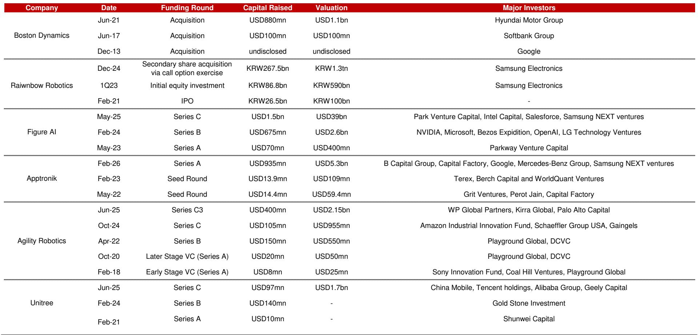
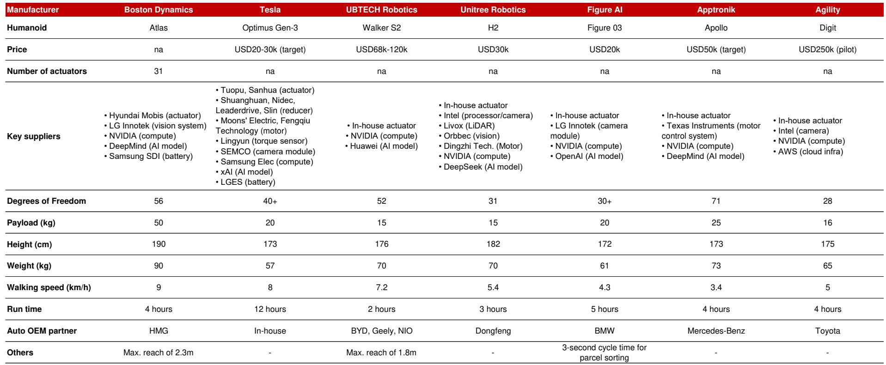

# The Humanoid Race Has Shifted from Technical Viability to Commercial Scalability, and the Next Twelve Months Will Separate the Winners from the Spectators

The investment thesis for Physical AI underwent a fundamental transformation in mid-May 2026. Two events, occurring within days of each other, demonstrated that the humanoid robotics industry has crossed the chasm from research and development cost centers to scalable operational assets. Boston Dynamics presented a commercially mature strategy for its all-electric Atlas model, complete with standardized actuators and demonstrated payload capabilities that target heavy-duty industrial tasks no competitor can match. Figure AI completed six consecutive days of autonomous endurance operations, proving that humanoids can replace human shifts at scale in logistics environments. These are not incremental improvements. They represent a structural shift in what the industry can promise and deliver.

The implications for investors are profound. The market is no longer debating whether humanoids will work. The debate has moved to who will achieve mass production unit economics first, who will capture the proprietary data flywheels that create insurmountable competitive advantages, and which applications will generate the fastest return on capital. The window for placing strategic bets is narrowing rapidly. The next twelve to eighteen months will determine which companies emerge as dominant platforms and which become legacy curiosities.

This article synthesizes the key insights from a detailed research report on global Physical AI, extending the analysis into second-order strategic implications and decision frameworks for investors. The central argument is straightforward: the humanoid market is entering a winner-take-most phase driven by manufacturing scale and data network effects, and investors must shift their evaluation criteria from technical benchmarks to commercial deployment metrics.

## Standardized Actuators and Heavy Payload Capability Give Boston Dynamics a Structural Advantage in Industrial Applications

Boston Dynamics' May 18 presentation in Boston marked a decisive departure from the company's historical reputation as a producer of spectacular but commercially unviable machines. The all-electric Atlas model, which had previously raised investor concerns about high bill of materials costs and bespoke engineering, now features a radically simplified architecture. The company has consolidated its complex hydraulic legacy into just two types of standardized commercial actuators deployed across the entire robot. This is not a minor engineering optimization. It is a fundamental rethinking of the manufacturing strategy.

The significance of actuator standardization cannot be overstated. In humanoid robotics, actuators are the single largest cost driver and the primary source of supply chain complexity. By reducing the actuator portfolio to two standardized types, Boston Dynamics has dramatically simplified its supply chain dependencies, reduced manufacturing capital expenditure requirements, and created a clear path to mass production margins. The company has effectively addressed the most persistent investor skepticism about humanoid economics: the belief that these machines would forever remain bespoke, high-cost curiosities.

The payload demonstration at the presentation reinforced the strategic logic of this approach. Atlas used whole-body control to lift and transport a 23-kilogram mini-refrigerator, a task that requires coordinated torque across multiple joints and precise balance management. More importantly, the underlying reinforcement learning model successfully scaled to handle weights up to 45 kilograms during training. The hardware payload capacity of 50 kilograms positions Atlas to target heavy-duty industrial tasks such as automotive parts sequencing, steel knitting, and large-component material handling. These are applications where lighter competitors, with payload capacities in the 15 to 25 kilogram range, simply cannot operate.

The strategic implication is clear. Boston Dynamics is not competing for the same addressable market as other humanoid manufacturers. It is targeting the high-value, high-friction end of the industrial spectrum where precision, strength, and reliability command premium pricing. This positioning creates a natural moat. Competitors cannot simply increase their payload capacity through software updates. They would need to redesign their entire mechanical architecture, a process that takes years and billions of dollars. Boston Dynamics has effectively locked itself into a segment where the barriers to entry are structural, not just technical.

## Figure AI's Logistics Endurance Demonstration Proves That Operational Reliability Has Replaced Technical Novelty as the Key Competitive Metric

While Boston Dynamics is winning the heavy-payload segment, Figure AI is demonstrating the operational endurance required to replace human labor at scale in logistics environments. The company's six-consecutive-day autonomous showcase, which began on May 14, represents a milestone that is easy to underestimate. Continuous autonomous operation over multiple days is not about a single impressive demonstration. It is about system reliability, thermal management, battery endurance, error recovery, and the absence of teleoperation. These are the metrics that matter to enterprise customers who need to trust that a robot can complete a full shift without human intervention.

The logistics use case is strategically astute. Automotive manufacturing lines, which have been the most visible validation partners for humanoid companies, require millimeter-level precision and carry immense safety and liability friction. Logistics fulfillment centers, by contrast, feature a lower precision threshold but infinite volume. Picking, sorting, and placing items in a warehouse does not require the same level of dexterity as assembling a vehicle transmission. But it requires consistent, reliable, and cost-effective operation across millions of cycles per year. This is a volume game, not a precision game.

Figure AI's decision to target logistics first reflects a clear understanding of total addressable market dynamics. The global logistics and fulfillment industry employs tens of millions of workers in repetitive, physically demanding roles. Labor shortages, wage inflation, and the structural shift toward e-commerce have created an urgent need for automation solutions that can compress variable operating expenses and insulate margins from labor market volatility. For companies such as Coupang, transitioning from human labor to Robot-as-a-Service models represents a direct path to permanently lower cost structures.

The company's production scaling achievements reinforce the commercial logic. Figure AI has successfully transitioned from producing one unit per day to one robot per hour, representing an annualized run-rate capability exceeding 12,000 units. This is not a laboratory achievement. It reflects a deliberate shift from low-volume machining to automotive-grade high-volume die-casting, the same manufacturing approach that transformed the automobile industry a century ago. The marginal cost per robot is declining rapidly, and the trajectory suggests that Figure AI can achieve its target price point of approximately 20,000 dollars per unit within a reasonable timeframe.

The 11-month field deployment at BMW's Spartanburg plant provides the critical data point that investors have been waiting for. Figure AI humanoids autonomously moved components valued at over 90,000 dollars each, with zero teleoperation incidents. Multi-quarter deployment data of this kind severely de-risks the long-term investment thesis. It transforms the conversation from what a robot can do in a controlled demonstration to what a robot can do in a real production environment over hundreds of operational cycles.

## The Winner-Take-Most Dynamic Is Driven by Manufacturing Scale and Proprietary Data Flywheels, Not by Technical Specifications Alone

The competitive landscape of humanoid robotics is often analyzed through technical specifications: degrees of freedom, payload capacity, walking speed, and battery runtime. These metrics are important, but they are increasingly becoming table stakes rather than differentiators. The table comparing major humanoid manufacturers reveals a striking convergence in basic specifications. Most models have between 28 and 56 degrees of freedom, payload capacities between 15 and 50 kilograms, and walking speeds between 3.4 and 9 kilometers per hour. The differences are meaningful for specific applications, but they do not explain the dramatic valuation disparities among these companies.

The real competitive advantage is being built in two areas that are invisible to specification comparisons: manufacturing scale and data network effects.

Manufacturing scale is the most direct path to competitive advantage. The company that achieves the lowest unit cost through high-volume production will be able to undercut competitors on price while maintaining or improving margins. This is the classic experience curve effect that has driven cost reductions in every manufacturing industry from semiconductors to solar panels. The company that reaches 100,000 units of cumulative production first will have a cost structure that is simply unreachable for competitors operating at 10,000 units. Figure AI's trajectory toward 12,000 units per year and Boston Dynamics' standardized actuator strategy are both explicit attempts to capture this advantage.

Data network effects are more subtle but potentially more powerful. Every hour of autonomous operation generates data that can be used to improve the reinforcement learning models that control the robot. Better models enable more efficient operation, which enables the robot to handle more complex tasks, which generates more valuable data. This creates a virtuous cycle that is extremely difficult for late entrants to overcome. A company that has accumulated millions of hours of operational data across diverse environments will have models that are simply more capable and more reliable than those trained on synthetic data or limited field trials.

The funding and valuation data for major humanoid companies reveals the market's implicit recognition of these dynamics. Figure AI raised 1.5 billion dollars in its Series C round at a 39 billion dollar valuation. Apptronik raised 935 million dollars in its Series A at a 5.3 billion dollar valuation. Agility Robotics raised 400 million dollars at a 2.15 billion dollar valuation. The valuation dispersion is not explained by technical specifications. It is explained by the market's assessment of which companies have the manufacturing strategy, the data strategy, and the commercial partnerships to capture the winner-take-most dynamics of this emerging industry.

## What the Report Does Not Fully Answer: The Unit Economics of Robot-as-a-Service Models and the Timing of Labor Cost Parity

The research report provides an excellent framework for understanding the competitive dynamics of humanoid robotics, but it leaves several critical questions unanswered. These are not weaknesses in the analysis. They are the natural frontiers of uncertainty in an industry that is evolving faster than the data can be collected.

The most important unanswered question concerns the unit economics of Robot-as-a-Service models. The report references the potential for companies such as Coupang to transition from human labor to RaaS models, compressing variable operating expenses and insulating margins from labor market volatility. But the actual economics of these arrangements remain opaque. What is the implied cost per hour of robot operation? How does this compare to the fully loaded cost of human labor in different geographies and industries? What is the payback period for a customer investing in a humanoid fleet?

The answer to these questions will determine the pace of adoption. If humanoid RaaS models achieve cost parity with human labor within the next two years, the addressable market expands explosively. If parity takes five years or more, the adoption curve will be more gradual and the competitive dynamics will be different. The report provides the directional signal but not the precise timing.

A second unresolved question concerns the geographic distribution of humanoid adoption. The report focuses primarily on developed market applications, particularly in the United States, South Korea, and Germany. But the most compelling economic case for humanoid deployment may exist in markets with rapidly aging workforces and rising labor costs, such as Japan, China, and parts of Europe. The regulatory environment, labor market structure, and existing automation infrastructure vary dramatically across these markets, and the optimal go-to-market strategy is likely to be different in each.

A third question relates to the role of large technology companies as both investors and potential competitors. The funding table shows investments from NVIDIA, Microsoft, Amazon, Samsung, Tencent, and Alibaba. These companies are not passive financial investors. They are positioning themselves to capture value from the humanoid ecosystem through compute platforms, cloud infrastructure, AI models, and component supply. The strategic interests of these investors may not always align with the interests of the humanoid manufacturers, and the potential for vertical integration or platform competition is a risk that the report does not fully explore.

## A Decision Framework for Evaluating Humanoid Investments: Focus on Deployment Density, Unit Cost Trajectory, and Data Accumulation Velocity

For investors seeking to translate the insights from this report into actionable decisions, three metrics provide a more useful framework than traditional technology evaluation criteria. These metrics are deployment density, unit cost trajectory, and data accumulation velocity.

Deployment density refers to the number of robots operating in real production environments, normalized by the complexity of the tasks being performed. A company with 100 robots performing simple pick-and-place operations in a single warehouse has lower deployment density than a company with 50 robots performing diverse tasks across multiple manufacturing facilities. The key insight is that deployment density drives both revenue visibility and data accumulation. Investors should prioritize companies that can demonstrate growing deployment density across multiple customer sites and use cases.

Unit cost trajectory is the most direct measure of manufacturing progress. The relevant metric is not the current unit cost but the rate at which unit cost is declining as a function of cumulative production. A company that can demonstrate a 20 percent cost reduction for every doubling of cumulative production has a structural advantage that will compound over time. Investors should look for evidence of specific manufacturing improvements, such as actuator standardization, die-casting transitions, or supply chain consolidation, that provide a clear path to continued cost reduction.

Data accumulation velocity measures the rate at which a company is generating operational data that can be used to improve its AI models. This is the hardest metric to assess from public information, but it is arguably the most important. Companies should be evaluated on the diversity of their deployment environments, the duration of their field deployments, and the sophistication of their data feedback loops. A company that has accumulated millions of hours of operational data across diverse environments has a data moat that is extremely difficult for competitors to replicate.

These three metrics provide a consistent framework for evaluating companies across different segments of the humanoid market. They are mutually exclusive and collectively exhaustive in the sense that they capture the three dimensions of competitive advantage: commercial traction, manufacturing capability, and AI model improvement. Investors who apply this framework will be better positioned to distinguish between companies that are building sustainable competitive advantages and companies that are simply generating impressive demonstrations.

## The Full Report Contains Detailed Competitive Analysis, Funding History, and Supply Chain Maps That Cannot Be Compressed into a Single Article

The analysis presented in this article is based on a comprehensive research report that includes detailed comparisons of major humanoid manufacturers, their funding histories, valuation trajectories, key suppliers, and commercial partnerships. The comparative table showing specifications for seven major humanoid models reveals important patterns that are worth studying in detail, particularly the relationship between payload capacity, battery runtime, and target applications. The funding history table shows the rapid escalation of valuations and the increasing involvement of strategic investors from the technology and automotive sectors.

These details matter because the humanoid industry is entering a phase where small differences in manufacturing strategy, supply chain configuration, or data accumulation will compound into large differences in competitive position. A company that has secured the right actuator supplier, the right compute partner, and the right initial deployment customer will have advantages that persist for years. The full report provides the granularity needed to make these assessments.

The report also includes detailed analysis of the supply chain ecosystem, identifying the key component suppliers for each major humanoid manufacturer. This analysis reveals interesting patterns. NVIDIA is the dominant compute platform supplier across virtually all humanoid manufacturers. LG Innotek appears as a vision system supplier for both Boston Dynamics and Figure AI. Samsung SDI and LG Energy Solution are the primary battery suppliers. These supply chain relationships create both dependencies and strategic options for the humanoid manufacturers, and understanding them is essential for evaluating competitive dynamics.

Join the community to read the full report and review the original charts. The complete analysis includes detailed financial projections, competitive positioning maps, and scenario analyses that provide a more complete picture of the opportunities and risks in the humanoid robotics market. The community discussion will also provide access to ongoing updates as new data points emerge from field deployments, funding rounds, and manufacturing announcements.

*This article is for learning and discussion only and does not constitute investment advice.*

Personal reading notes and learning share only. Not investment advice.

