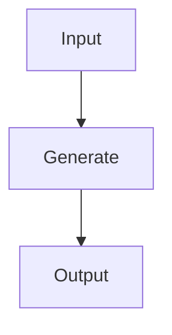
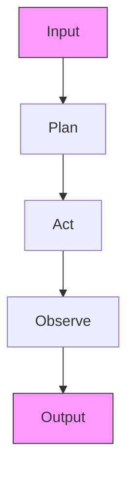
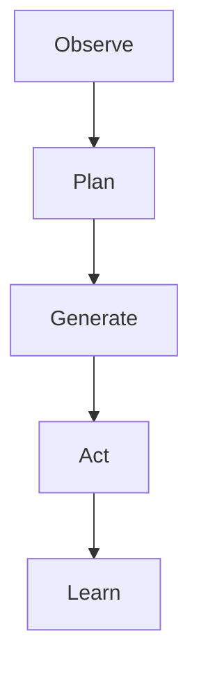

你是知乎商业/行业研究作者，擅长把英文/中文研报改写成适合知乎发布的长文。

【目标】
- 基于下面研报解析内容，生成一篇中文知乎文章。
- 风格接近微信公众号文章，但更适合知乎：论证更完整、语气更克制、有问题意识、有推理链条。
- 文章不需要把研报所有内容讲完，要留下继续阅读完整报告或加入社群讨论的空间。
- 目标长度：约 2200 字，允许上下浮动 20%。

【结构要求】
1. 第一行：知乎标题，直接讲观点，不要标题党，不要夸张极限词。
2. 开头 2-3 段：用一个真实问题或市场分歧切入，说明为什么这份报告值得看。
3. 正文按金字塔原则组织：先给核心判断，再展开 3-5 个支撑逻辑。
4. 每个小标题都要像观点句，不要写“核心判断”“支撑逻辑一”“对读者的启发”这种模板名。
5. 内容要比小红书更理性，比微信更像问答式分析，可以适度提出反问。
6. 结尾自然留下讨论空间，可使用这类表达：`完整报告里还有不少细节，适合放在社群里继续拆。`

【平台发布合规要求】
- 不要出现“投资建议”“买入”“卖出”“强烈推荐”“稳赚”“保本”“必涨”“抄底”“上车”“内幕”“翻倍”等金融操作或收益承诺表达。
- 不要写“非投资建议”“仅做学习交流”这种免责声明，也不要出现包含“投资”的免责声明。
- “投资”相关词尽量改成“投研”“研究”“观察”“学习参考”。
- 不要写“关注”“点赞”“求关注”“评论区留言”等直接互动诱导。
- 不要使用“爆款”“震惊”“必看”“必读”“最强”“最全”“唯一”“全网首发”等极限词。

【内容要求】
- 只能基于研报原文和解析内容推导，不要编造数据、页数、作者、结论或引用。
- 可以基于报告内容做适度发散，但必须明确哪些是报告内容，哪些是你的延展观察。
- 默认避免具体投行品牌名，比如“GS”“GS”，统一写作“投行研报”或使用 GS/JPM/MS 等缩写。
- 不要输出解释说明，只输出知乎文章正文。

【研报解析内容】
"""
# Global Oil Services

# Oil Services – Artificial Intelligence: later, not quite yet - who cares of the ego of an Agentic AI in the Oil Services industry?

Guillaume Delaby

+33 1 42 13 62 29

guillaume.delaby@bernsteinsg.com

Luis-Fernando Sarmiento

+44 20 7762 1851

luis-fernando.sarmiento@bernsteinsg.com

Richard Nguyen

+33 1 42 13 54 22

richard.nguyen@bernsteinsg.com

# Specialist Sales

Gareth Williams

+44 20 7762 5256

gareth.b.williams@bernsteinsg.com

Sooner. In the late 1970s, Jean Riboud, the CEO of Schlumberger, was pondering in his Park Avenue office full of Rothko paintings: "can I create something BIG by putting Oil Services and chips together?" Having just acquired US chip company Fairchild for \$425m, Riboud explicitly mentioned Artificial Intelligence in the company's 1979 annual report. All the stars seemed aligned, and a vision was set (even if the Fairchild acquisition proved a poor investment). Ahead of its 17 June Digital Day, SLB remains the most AI-advanced company in the industry.

Later. Our December 2025 view was that the Oil Services industry was about to catch up. Back in December 2025, we assessed the digital maturity of the O&G and Oil services industries with our colleague Richard Nguyen. We concluded that: 1) these two industries were VERY late in their adoption of AI/digital tools; and 2) that a catch-up did seem to be imminent (2026-27?).

Later. Our new May 2026 view – AI/Digital adoption may be delayed for longer (catch up in 2028-29?). Priorities have changed with the conflict in the Middle East. While the adoption of AI/Digital across the industry continues – and is even (slowly) accelerating – AI/Digital is no longer the major theme we had expected it to be in January 2026. Since March/April 2026, the CEOs of large oil services companies have been engaging extensively with governments, whose priorities have shifted dramatically towards security/diversity of supply and incremental energy infrastructures.

Human league. An O&G reservoir is a complex and evolving ecosystem that, like the human body, requires regular monitoring through repeated imaging (= seismic) and blood tests (= drilling). This is where AI can mainly bring additional revenue: more (quality) data → more hydrocarbons → increasing recovery rates.

The AI opportunity can be estimated at c.\$5.6bn p.a. 1) It comprises both AI-related additional revenue (c.\$1.0bn/18%) and cost improvements (c.\$4.6bn/82%). 2) It can be split between Oil Field Services (OFS, c.\$3.3bn/59%) and Engineering & Construction (E&C, c.\$2.3bn/41%) companies. 3) The c.\$3.3bn OFS opportunity may come from both cost improvements (c.\$2.3bn) and revenue (c.\$1.0bn). 4) The c.\$2.3bn E&C opportunity is likely to come almost exclusively from cost improvements (c.\$2.3bn), with little/no (c.\$0bn) additional revenue.

Amara's law is unlikely to apply to Oil Services. Amara's law is the tendency to both; 1) overestimate the ST impact of a technology; and 2) underestimate its LT effects. In this report, we conclude that: 1) the O&G and Oil Services industries is very late with its Digital/Al adoption; 2) catch-up may now be delayed to 2028-2029, rather than 2026-2027; 3) the AI/Digital opportunity could nonetheless triple of the over the next 5 years, and may potentially add an incremental c.1.7% to EBITDA margins; 4) most of the gains may come from cost optimisations (rather than additional revenue); 5) regarding additional revenue, OFS in general, and seismic companies in particular, are better positioned; and 6) SLB (with a potential AI-related incremental boost to EBITDA/EBITDA margin of +8.7%/+1.9%), Viridien (+4.5%/+1.5%) and Technip Energies (+13.5%/+1.4%) are best positioned.

BERNSTEIN TICKER TABLE 

<table><tr><td rowspan="2" colspan="3"></td><td colspan="2">15 May2026</td><td colspan="2">TTM</td><td colspan="4">Adjusted EPS</td><td colspan="3">Adjusted P/E (x)</td></tr><tr><td rowspan="2">ClosingPrice</td><td rowspan="2">PriceTarget</td><td rowspan="2">Rel.Perf.</td><td rowspan="2">Cur</td><td rowspan="2">2025A</td><td rowspan="2">2026E</td><td rowspan="2">2027E</td><td rowspan="2">2025A</td><td rowspan="2">2026E</td><td rowspan="2">2027E</td><td></td></tr><tr><td>Ticker</td><td>Rating</td><td>Cur</td><td></td></tr><tr><td>SLB (Schlumberger)</td><td>O</td><td>USD</td><td>55.38</td><td>71.00</td><td>30.6%</td><td>USD</td><td>2.93</td><td>2.37</td><td>2.92</td><td>18.9</td><td>23.3</td><td>19.0</td><td></td></tr><tr><td>VIRI.FP (Viridien)</td><td>O</td><td>EUR</td><td>112.00</td><td>163.00</td><td>86.0%</td><td>USD</td><td>9.89</td><td>6.82</td><td>13.23</td><td>3.9</td><td>4.5</td><td>4.0</td><td></td></tr><tr><td>TEN.IM (Tenaris)</td><td>O</td><td>EUR</td><td>26.66</td><td>29.00</td><td>59.8%</td><td>USD</td><td>1.83</td><td>1.96</td><td>1.93</td><td>17.0</td><td>15.8</td><td>16.1</td><td></td></tr><tr><td>TE.FP (Technip)</td><td>O</td><td>EUR</td><td>37.08</td><td>47.00</td><td>0.2%</td><td>EUR</td><td>2.47</td><td>2.34</td><td>2.82</td><td>15.0</td><td>15.8</td><td>13.2</td><td></td></tr><tr><td>GTT.FP (GTT)</td><td>O</td><td>EUR</td><td>209.40</td><td>245.00</td><td>21.1%</td><td>EUR</td><td>12.24</td><td>10.07</td><td>10.75</td><td>17.1</td><td>20.8</td><td>19.5</td><td></td></tr><tr><td>SPX</td><td></td><td></td><td>7,403.05</td><td></td><td></td><td></td><td></td><td></td><td></td><td></td><td></td><td></td><td></td></tr><tr><td>EDME</td><td></td><td></td><td>1,510.80</td><td></td><td></td><td></td><td></td><td></td><td></td><td></td><td></td><td></td><td></td></tr></table>

O - Outperform, M - Market-Perform, U - Underperform, NR - Not Rated, CS - Coverage Suspended TEN.IM estimate is Reported EPS; VIRI.FP valuation is EV/EBITDA (x); TEN.IM valuation is Reported P/E (x); Source: Bloomberg, Bernstein estimates and analysis.

VALUATION COMPS TABLE 

<table><tr><td rowspan="2">Company</td><td rowspan="2">Currency</td><td rowspan="2">Share Price</td><td rowspan="2">Price Target</td><td rowspan="2">Rating</td><td colspan="3">EV / Revenue</td><td colspan="3">EV / EBITDA</td><td colspan="3">Dividend Yield</td></tr><tr><td>2026e</td><td>2027e</td><td>2028e</td><td>2026e</td><td>2027e</td><td>2028e</td><td>2026e</td><td>2027e</td><td>2028e</td></tr><tr><td>SLB</td><td>USD</td><td>55.38</td><td>71.0</td><td>Outperform</td><td>2.5</td><td>2.3</td><td>2.1</td><td>11.6</td><td>9.7</td><td>8.8</td><td>2.1%</td><td>2.2%</td><td>2.3%</td></tr><tr><td>Adnoc Drilling</td><td>AED</td><td>5.96</td><td>6.76</td><td>Outperform</td><td>5.4</td><td>5.1</td><td>4.8</td><td>12.5</td><td>11.2</td><td>10.4</td><td>4.4%</td><td>4.8%</td><td>5.3%</td></tr><tr><td>Tenaris</td><td>EUR</td><td>26.14</td><td>29.0</td><td>Outperform</td><td>2.2</td><td>2.0</td><td>1.8</td><td>9.2</td><td>8.3</td><td>7.5</td><td>3.3%</td><td>3.3%</td><td>3.3%</td></tr><tr><td>TechnipFMC</td><td>USD</td><td>71.28</td><td>45.0</td><td>Market-Perform</td><td>2.7</td><td>2.5</td><td>2.3</td><td>13.7</td><td>12.5</td><td>11.2</td><td>0.3%</td><td>0.3%</td><td>0.3%</td></tr><tr><td>Adnoc L&amp;S</td><td>AED</td><td>5.85</td><td>6.94</td><td>Outperform</td><td>2.6</td><td>2.7</td><td>2.6</td><td>7.7</td><td>8.9</td><td>8.6</td><td>2.9%</td><td>3.0%</td><td>3.2%</td></tr><tr><td>Technip Energies</td><td>EUR</td><td>36.08</td><td>47.0</td><td>Outperform</td><td>0.8</td><td>0.7</td><td>0.6</td><td>9.9</td><td>7.6</td><td>6.4</td><td>2.8%</td><td>3.1%</td><td>3.4%</td></tr><tr><td>GTT</td><td>EUR</td><td>209.40</td><td>245.0</td><td>Outperform</td><td>10.1</td><td>9.4</td><td>8.7</td><td>15.3</td><td>14.2</td><td>13.1</td><td>3.8%</td><td>4.1%</td><td>4.4%</td></tr><tr><td>Subsea7</td><td>NOK</td><td>346.00</td><td>240.0</td><td>Outperform</td><td>1.4</td><td>1.3</td><td>1.2</td><td>6.0</td><td>6.0</td><td>5.7</td><td>-</td><td>-</td><td>-</td></tr><tr><td>Saipem</td><td>EUR</td><td>4.49</td><td>4.96</td><td>Outperform</td><td>0.6</td><td>0.5</td><td>0.5</td><td>4.7</td><td>4.4</td><td>4.2</td><td>4.0%</td><td>4.0%</td><td>4.0%</td></tr><tr><td>SBM Offshore</td><td>EUR</td><td>35.82</td><td>46.0</td><td>Outperform</td><td>1.7</td><td>1.8</td><td>1.7</td><td>6.3</td><td>7.5</td><td>7.2</td><td>2.9%</td><td>2.9%</td><td>2.9%</td></tr><tr><td>Vallourec</td><td>EUR</td><td>26.62</td><td>29.0</td><td>Outperform</td><td>1.8</td><td>1.6</td><td>1.4</td><td>8.8</td><td>6.5</td><td>6.0</td><td>6.6%</td><td>5.5%</td><td>5.5%</td></tr><tr><td>Rubis</td><td>EUR</td><td>34.80</td><td>38.7</td><td>Outperform</td><td>0.7</td><td>0.7</td><td>0.7</td><td>7.0</td><td>6.6</td><td>6.4</td><td>6.1%</td><td>6.4%</td><td>6.8%</td></tr><tr><td>Viridien</td><td>EUR</td><td>112.00</td><td>163.0</td><td>Outperform</td><td>1.6</td><td>1.4</td><td>1.2</td><td>3.6</td><td>3.0</td><td>2.6</td><td>-</td><td>-</td><td>-</td></tr></table>

As of 15/05/26   
Source: Bernstein analysis & estimates

# Table Of Contents

Previous research....5

Previous research on SLB....6

Previous research on Viridien....7

Oil Services & AI....8

Poetry, Vision, Applications....10

AI in the O&G Industry....14

AI in the Oil Services Industry....19

Assessing the impact of AI on some of our companies.... 21

SLB - the digital city....23

Viridien - a cleaner picture....29

# DETAILS

# PREVIOUS RESEARCH

24 April 2026: Bernstein Energy & Power: Running faster than the wolf. Follow these (simpler) heuristics, and you will be fine

20 April 2026: Oil Services: State of the business in 2H25 – The ultimate black & white photo of a past era (that ended in Feb. 2026)

25 March 2026: Global Oil Services: Unleashing the wolf. Oil Services market shares in the Middle East. A 1970s-style supercycle seems likely.

20 February 2026: Bernstein Energy & Power: Reshaping the Oil Services industry (Part. 4) — The quiet beauty of sleepless nights (2030-35)

19 January 2026: Global Oil Services: Our 2026 outlook in 9 slides

12 January 2026: Global Oil Services: 2026 outlook — 13 themes: Time for investors to "stomp out their cigarettes" and invest in Oil Services again?

05 January 2026: The "Donroe Doctrine": a potential 'new frontier' for Oil Services that might imply potential E&P capex of c. \$600bn p.a. out to 2035-40

22 October 2025: Global Oil Services: will 2026-27 surprise to the upside?

06 October 2025: Oil Services - State of the Business 1H25: Hope springs eternal... 10 key takeways

29 August 2025: Bernstein Energy & Power: Reshaping the Oil Services Industry - the 2000-50 journey (Part 1: The Golden Age: 2000-14)

# PREVIOUS RESEARCH ON SLB

11 May 2026: SLB: 100th anniversary. Stronger for longer.   
21 April 2026: SLB: Initial thoughts ahead of 1Q26. How our own 'animal spirits' need to change in bull times — the leader is the exception   
11 March 2026: SLB: Middle East - Deciphering the new, new, environment. All eyes on Friday's US rig count. PT increased to \$56.1 (vs \$52.3).   
21 January 2026: SLB - The Oracle of Delphi. What the bellwether may signal about the industry - and itself. Early thoughts ahead of FY25 results   
07 October 2025: SLB: the strategic vision and the strategic dilemma   
18 July 2025: SLB 2Q25: Towards a stabilised/marginally more constructive outlook   
16 July 2025: SLB: Finalisation of the ChampionX acquisition   
17 February 2025: SLB: Integration & Digital   
7 February 2025: Bernstein Energy & Power: Trust & Joy! — The two powerful business lessons that our mentor may have overlooked   
8 December 2024: Bernstein Energy & Power: Business lessons from a mentor — (part 2)   
13 November 2024: SLB: Four moving pieces in the OFS puzzle   
18 October 2024: Bernstein Energy & Power: Business lessons from a mentor — (Part. 1)   
20 September 2024: SLB: 2024 Digital Forum in Monaco — 12 takeaways   
12 September 2024: SLB: 2024 Digital Forum — what are your questions?   
23 September 2024: SLB: Time to tactically buy the share   
17 June 2024: SLB: Finalisation of Aker Carbon Capture (ACC) acquisition   
28 May 2024: SLB: Change of profile — 6 themes ahead of SDC (29 May)   
24 April 2024: SLB: Four keys to the house of SLB   
02 April 2024: The leader takes it all - two acquisitions in a row   
09 October 2023: Four keys to the house of SLB – The 1965-2050 journey

# PREVIOUS RESEARCH ON VIRIDIEN

09 March 2026: Viridien: A 'few extra pennies'. Risk/reward is improving again. PT lifted to €163 (vs €117).   
18 December 2025: Viridien: Macro fears may be masking new catalysts; Rating upgraded to Outperform   
21 November 2025: Viridien: Time for a pause? PT raised to €117, but rating downgraded to Market-Perform. All eyes on FY26 exploration capex   
19 November 2025: Viridien: Henning Berg's profile suggests a smooth transition. Old and new guard have something special in common?   
03 September 2025: Viridien: Brave New World? An improved risk/reward proposition. Upgrade to Outperform (vs MP)   
02 June 2025: Viridien: Growing value vs potential short-term headwinds; all eyes on 2Q25 results (31 July)   
21 May 2025: Viridien: Nice Conference - We remain comfortable with our Market-Perform rating   
16 December 2024: Viridien (ex CGG): Upgrade to MP — Time to revisit the case

# OIL SERVICES & AI

# DEMAND

The best definition of AI comes from our colleague Bob Brackett. He defines Artificial Intelligence as “electricity contemplating itself”. There are two advantages with this definition. First, it reflects the increasingly egoistic nature of AI – and particularly of Agentic AI (=AI systems capable of autonomous decision-making). Second, it looks at AI through the angle of growing associated energy demand. While electricity demand from Data Centers/AI was c.1,000 terawatt-hours in 2024 (=annual consumption of Japan), it is set to double to c.2,000 terawatt-hours by 2030 (=annual consumption of India).

AI training and energy demand are walking hand in hand. Quoting Bob: “training a single LLM next year is forecast to use the same energy as raising more than one million children to adulthood! - and by the way, estimates of training costs typically ring-fence the GPU and thus don’t include a comparable amount of energy to keep the data center cool, lit, and well operating”. Note however that the education/training of large LLMs are still at an early stage. In a recent essay (“Le temps de l’obsolescence humaine”), Bruno Patino, the CEO of Arte – a Franco-German cultural TV channel – states that “the largest LLMs can still be compared to four-year old children”.

EXHIBIT 2: Agentic AI can be trained... it therefore has a bigger ego than Generic AI and AI Agents   

flowchart

flowchart

flowchart

EXHIBIT 3: The largest LLMs can still be compared to four-year old children (according to Bruno Patino)...   

natural_image

Cartoon illustration of a smiling boy with brown hair and large eyes (no text or symbols)

Source: Al Scribbles, Bernstein analysis   
Source: Bernstein analysis

EXHIBIT 4: ... even if large LLMs are thirsty (for energy, knowledge and maybe self-recognition?). From 10^18 towards 10^26 flops and beyond....   
Data on AI models   

scatter

| Year | Frontier LLMs |
|------|---------------|
| 2018 | ~10^18        |
| 2020 | ~10^22        |
| 2022 | ~10^24        |
| 2024 | ~10^26        |

Source: Epoch.ai, Bernstein analysis

EXHIBIT 5: ... subsurface leader Viridien is trying hard to cope... its computing power is now 690 x 10^15 flops   

bar

| Year | Value |
|---|---|
| 2021 | 291 |
| 2022 | 351 |
| 2023 | 510 |
| 2024 | 520 |
| 2025 | 690 |

Source: Viridien, Bernstein analysis

# SUPPLY

While most analysts focus on the demand side, we have always preferred to focus on the supply side. We believe that supply-side analysis is simply superior as demand can be volatile and unpredictable. Supply, on the other hand, offers the superior advantage of being fixed – at least in the short term! When you know that something is sure – even if it does not last – you should capitalize on it... Correct?

One of the most revealing overviews we have found on AI and the supply of Oil Services is provided by Aramco's CFO Ziad Al-Murshed in a September 2025 speech. We view this speech as truly insightful. "Applying AI has the potential to massively increase the capability to find more O&G, reduce development costs, and increase recovery rates". He highlighted that the highest value would be found in "operations" and within operations "in the reservoir". There may, however, be a bottleneck: "generating this value would be data intensive and requires massive computing power".

The impact of AI on the Oil Services industry is therefore about to evolve. Up to now, AI was essentially – and still remains today – an optimizer of internal costs, rather than a source of revenue. Globally speaking, we estimate the current AI opportunity for the entire Oil Services industry at c.\$5.6bn, which can be split between cost optimization (c.\$4.6bn) and additional revenue (c.\$1.0bn) or between Oil Field Services (OFS, c.\$3.3bn) and Engineering & Construction (E&C, c.\$2.3bn) companies.

While this market may be tripling over the next five years to c.\$17bn (OFS c.\$10bn; E&C c.\$7bn), AI is also likely to further widen the differences between OFS, where AI will be both an optimizer of costs and a source revenue, and E&Cs, where AI will mainly remain a

[中间内容因长度限制已省略]

is report, to train or finetune any third-party machine learning or artificial intelligence system, or as a prompt or input into any such system. You also may not, without Bernstein's express written consent, do any of the foregoing in connection with your own internal machine learning or artificial intelligence system.

Bernstein may use artificial intelligence tools in the preparation of its materials. Any such materials are reviewed by Bernstein's research analysts prior to publication.

This report has been prepared for information purposes only and is based on current public information that we consider reliable, but the entities noted herein do not warrant or represent (express or implied) as to the sources of information or data contained herein are accurate, complete, not misleading or as to its fitness for the purpose intended even though the entities noted herein rely on reputable or trustworthy data providers, it should not be relied upon as such. Opinions expressed are the author(s)' current opinions as of the date appearing on the material only and we do not undertake to advise you of any change in the reported information or in the opinions herein.

This publication was prepared and issued by the entity referred to herein for distribution to eligible counterparties or professional clients. The information in this report is intended for general circulation and does not constitute an offer to buy or sell any security, investment, legal or tax advice nor a personal recommendation, as defined by any of the aforementioned regulators. It does not take into account the particular investment objectives, financial situations, or needs of individual investors. The report has not been reviewed by any of the aforementioned regulators and does not represent any official recommendation from the aforementioned regulators. The investments referred to herein may not be suitable for you. Investors must make their own investment decisions in consultation with advice sought from a financial adviser regarding the suitability of the investment product, taking into account the specific investment objectives, financial situation or particular needs of any recipient of the recommendation, before the recipient makes a commitment to purchase the investment product.

The analysis contained herein is based on numerous assumptions. Different assumptions could result in materially different results. The information in this report does not constitute, or form part of, any offer to sell or issue, or any offer to purchase or subscribe for shares, or to induce engage in any other investment activity. The value of any securities or financial instruments mentioned in this report may fluctuate subject to market conditions. Information about past performance of an investment is not necessarily a guide to, indicative of, or assurance of future performance. Estimates of future performance mentioned by the research analyst in this report are based on assumptions that may not be realized due to unforeseen factors like market volatility/fluctuation. In relation to securities or financial instruments denominated in a foreign currency other than the clients' home currency, movements in exchange rates will have an effect on the value, either favorable or unfavorable. Before acting on any recommendations in this report, recipients should consider the appropriateness of investing in the subject securities or financial instruments mentioned in this report and, if necessary, seek for independent professional advice.

The securities described herein may not be eligible for sale in all jurisdictions or to certain categories of investors where that permission profile is not consistent with the licenses held by the entities noted herein. This document is for distribution only as may be permitted by law. It is not directed to, or intended for distribution to or use by, any person or entity who is a citizen or resident of or located in any locality, state, country or other jurisdiction where such distribution, publication, availability or use would be contrary to law or regulation or would subject the entities noted herein to any regulation or licensing requirement within such jurisdiction.

Source: Bloomberg Index Services Limited. BLOOMBERG® is a trademark and service mark of Bloomberg Finance L.P. and its affiliates (collectively “Bloomberg”). Bloomberg or Bloomberg’s licensors own all proprietary rights in the Bloomberg Indices. Neither Bloomberg nor Bloomberg’s licensors approves or endorses this material, or guarantees the accuracy or completeness of any information herein, or makes any warranty, express or implied, as to the results to be obtained therefrom and, to the maximum extent allowed by law, neither shall have any liability or responsibility for injury or damages arising in connection therewith.

No part of this material may be reproduced, distributed or transmitted or otherwise made available without prior consent of the entities noted herein. Copyright Bernstein Institutional Services LLC Bernstein Autonomous LLP, BSG France S.A., Bernstein (Hong Kong) Limited 盛博香港有限公司, Bernstein (Canada) Limited, Bernstein (India) Private Limited (SEBI registration no. INH000006378), Bernstein (Singapore) Private Limited and Bernstein Japan KK (サンフォード・C・バーンスタイン株式会社). All rights reserved. The trademarks and service marks contained herein are the property of their respective owners. Any unauthorized use or disclosure is strictly prohibited. The entities noted herein may pursue legal action if the unauthorized use results in any defamation and/or reputational risk to the entities noted herein and research published under the Bernstein and Autonomous brands.
"""
