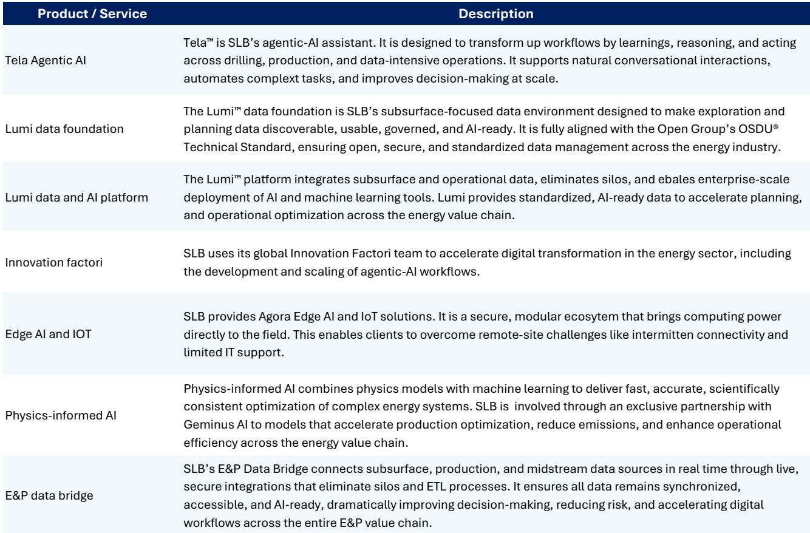
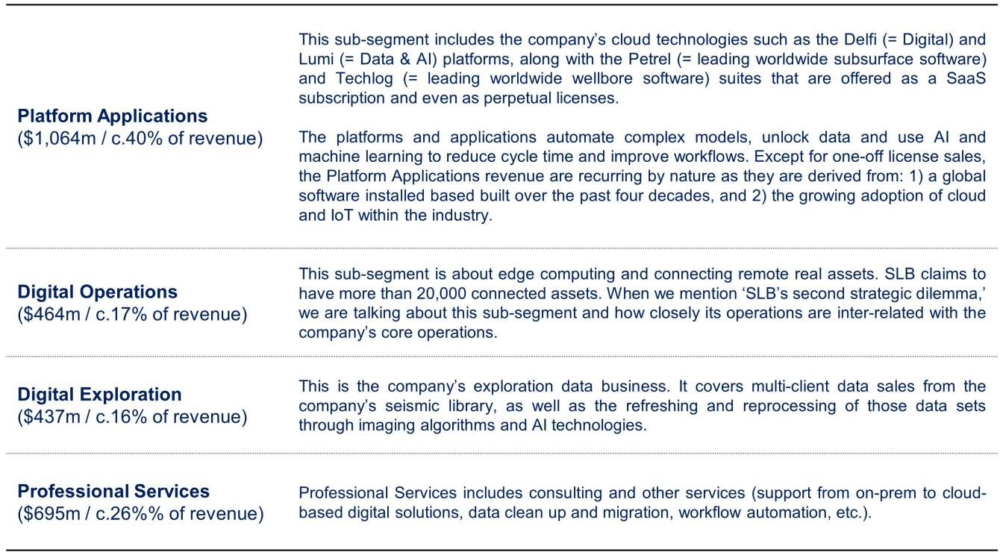
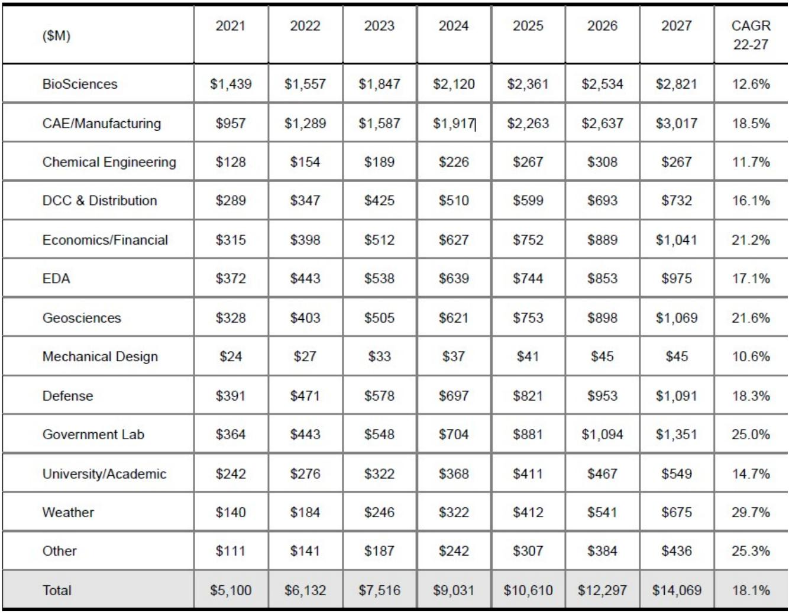

# The Oil Services AI Opportunity Is Real but Delayed: Why the Catch-Up Has Been Pushed to 2028-2029

The oil services industry is on the cusp of an artificial intelligence transformation that could add roughly $5.6 billion in annual value today, yet this opportunity remains largely unrealized. Contrary to the market's narrative that AI adoption in oil and gas is accelerating rapidly, the evidence suggests that the industry is actually running later than most investors assume. The catch-up that appeared imminent in late 2025 has been pushed further out, and the reasons for this delay reveal something important about how capital, geopolitics, and technology interact in capital-intensive industries.

This is not a story about technological readiness. The technology exists. The data exists. The use cases are well understood. The bottleneck is strategic attention. Since early 2026, the priorities of oil services CEOs have shifted dramatically toward security of supply and incremental energy infrastructure, driven by the conflict in the Middle East. Governments, not technology vendors, are now setting the agenda. And when governments demand capacity, AI adoption moves to the back burner.

The irony is that the industry may be underestimating the long-term impact of AI even as it overestimates the short-term disruption. Amara's law, which states that we tend to overestimate the effect of a technology in the short run and underestimate it in the long run, may not apply here. In oil services, the short-term impact has been consistently overestimated, but the long-term potential remains genuinely large. The question is not whether AI will reshape the industry, but when, and which companies will be positioned to capture the value when the window finally opens.

## The Industry Is Later Than It Thinks: AI Adoption Has Been Delayed by Geopolitical Priorities

The oil services industry has always been a late adopter of digital technology, but the current delay is not purely a function of organizational inertia. It is a function of competing priorities. In December 2025, the consensus view among analysts and industry participants was that 2026-2027 would be the inflection point for AI adoption. That timeline has now shifted to 2028-2029.

What changed? The conflict in the Middle East has fundamentally altered the strategic landscape. Since March and April of 2026, the CEOs of large oil services companies have been spending an increasing amount of time engaging with governments whose priorities have shifted dramatically toward security and diversity of supply. When the customer is a government focused on energy security, the conversation is about building more capacity, not about deploying smarter algorithms.

This is not an argument that AI adoption has stopped. It has not. The adoption of AI and digital tools across the industry continues and is even slowly accelerating. But the pace has decelerated relative to expectations. The theme that investors expected to dominate in January 2026 is no longer the major theme. Energy security is.

The implication for investors is straightforward: do not model a rapid AI-driven margin expansion in 2027. The uplift will come later, and it will likely arrive in a compressed timeframe once the geopolitical environment stabilizes. The question is which companies will have maintained their digital investments during the delay.

## The $5.6 Billion Annual Opportunity Is Concentrated in Cost Optimization, Not Revenue Generation

The AI opportunity in oil services is real, but its composition matters. The total annual opportunity is estimated at roughly $5.6 billion, but this is not evenly distributed between cost savings and new revenue. Cost improvements account for approximately $4.6 billion, or 82 percent of the total. Additional revenue accounts for only $1.0 billion, or 18 percent.

This split has strategic implications. Cost optimization is valuable, but it is also more easily replicated by competitors. When every company deploys AI to reduce drilling costs, the competitive advantage erodes. The real prize is revenue generation, and that is concentrated in a specific subset of the industry.

Breaking the opportunity down by segment reveals further asymmetry. Oil Field Services companies, which include drilling, seismic, and well services, have a total opportunity of roughly $3.3 billion, of which $2.3 billion comes from cost improvements and $1.0 billion from additional revenue. Engineering and Construction companies have a $2.3 billion opportunity, but nearly all of it comes from cost improvements, with essentially no additional revenue.

This means that investors looking for AI-driven revenue growth should focus on Oil Field Services, and within that segment, on companies that can sell data and insights rather than just services. The companies that can translate AI into higher recovery rates for their customers will be the ones that capture the revenue upside.

## The Revenue Opportunity Is Real, but It Belongs to Seismic and Subsurface Specialists

The most valuable application of AI in oil and gas is not in optimizing supply chains or reducing drilling downtime. It is in understanding what is underground. An oil and gas reservoir is a complex and evolving ecosystem that requires regular monitoring through repeated imaging and testing. This is where AI can generate the most additional revenue: more quality data leads to better reservoir understanding, which leads to higher recovery rates.

Seismic companies and subsurface specialists are uniquely positioned to capture this value. They already own the data, the processing capabilities, and the customer relationships. AI allows them to extract more insight from existing data and to sell higher-value products to their customers.

Consider the analogy to medical imaging. A hospital that owns an MRI machine can generate revenue by scanning patients, but the real value is in the interpretation. The radiologist who can read the scan and identify problems creates more value than the technician who operates the machine. In oil and gas, seismic companies are the radiologists. They have the data and the expertise to interpret it, and AI enhances their interpretive capabilities.

The companies that are best positioned for AI-driven revenue growth are those that combine subsurface expertise with computing power. Among Oil Field Services companies, the leaders have invested in both proprietary data sets and high-performance computing. These investments create barriers to entry that cost optimization alone cannot replicate.

## The Report Does Not Fully Answer How AI Will Reshape Competitive Dynamics Within the Industry

The analysis provides a clear picture of the size and timing of the AI opportunity, but it leaves several important questions unanswered. The most significant is how AI will change the competitive structure of the oil services industry over the next decade.

Will AI concentrate market share among the largest players, or will it enable smaller, more specialized firms to compete? The report suggests that companies with strong data assets and computing power are best positioned, but it does not fully explore whether AI will create winner-take-most dynamics or whether it will fragment the market.

Another open question is how pricing will evolve. If AI-driven cost optimization becomes widespread, will it lead to lower prices for oil services, or will the value created be captured by the service providers? The answer depends on bargaining power, which varies significantly across segments.

A third question concerns the role of national oil companies. If governments are driving the agenda toward security of supply, will they also drive AI adoption within their national champions? Or will the geopolitical focus on capacity crowd out digital investment? The report flags the geopolitical delay but does not model how different government strategies might affect the pace of adoption in different regions.

These are not criticisms of the analysis. They are the natural limits of any forward-looking study. But they are also the questions that investors should be asking as they build their own frameworks.

## A Decision Framework for Investors: Three Questions to Determine Which Companies Will Benefit

For investors trying to translate this analysis into portfolio decisions, three questions can serve as a framework.

First, does the company have proprietary data that AI can enhance? The companies that will generate revenue from AI are those that already own valuable subsurface data. Seismic companies are the obvious candidates, but any company that collects unique operational data over time has an asset that AI can monetize.

Second, does the company have the computing infrastructure to process that data at scale? AI models require significant computing power, and not every company has invested in this capability. The companies that have built high-performance computing centers are better positioned than those that rely on third-party cloud providers.

Third, is the company maintaining its digital investment during the current geopolitical distraction? The companies that continue to invest in AI capabilities during the delay will be the ones that benefit when the window opens. The temptation will be to cut digital spending to focus on near-term capacity demands. The companies that resist this temptation will emerge with a competitive advantage.

Applying this framework to the companies covered in the report yields a clear ranking. The companies that combine data assets, computing power, and strategic commitment to digital are the ones that are best positioned for the AI opportunity when it finally materializes.

## Join the Community to Read the Full Report and Review the Original Charts

The analysis above captures the key strategic conclusions, but the full report contains the detailed projections, company-level assessments, and supporting data that investors need to make informed decisions. The original report includes specific estimates of the AI-driven EBITDA uplift for individual companies, the breakdown of the opportunity by segment, and the historical context that explains why this industry has been slow to adopt digital technology.

These details matter because the difference between a good investment and a great one often comes down to precision. Knowing that the AI opportunity could add roughly 1.7 percent to industry EBITDA margins is useful, but knowing which companies could see an uplift of 8.7 percent versus 1.5 percent is what drives portfolio returns.

The full report also includes the original charts that illustrate the computing power trajectories, the data on AI model scaling, and the comparative analysis of company positioning. For investors who want to do their own work, these charts are essential.

Join the community to read the full report and review the original charts.

*This article is for learning and discussion only and does not constitute investment advice.*

Personal reading notes and learning share only. Not investment advice.

