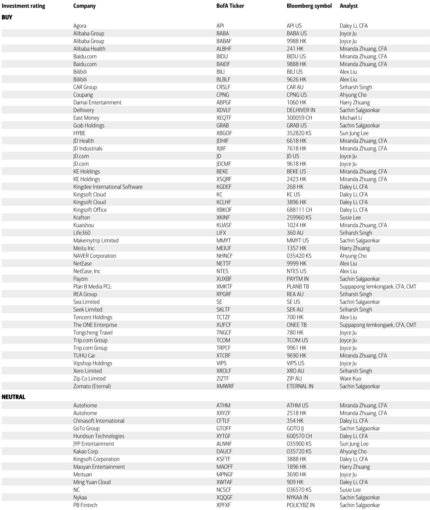
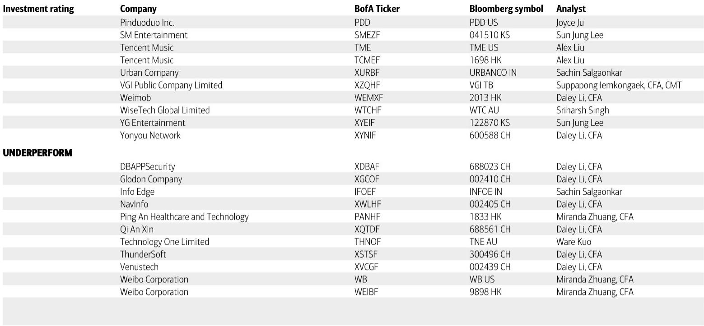
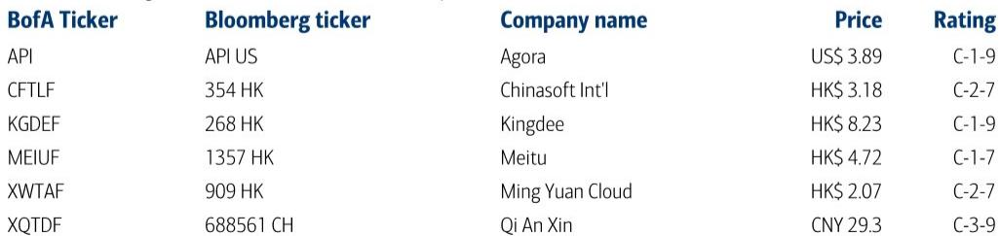

# AI 正在重塑中国软件业的定价权，但市场低估了“从 SaaS 到 RaaS”的深远影响

过去一个月，某外资投行在深圳举办的中国投资会议上，与超过10家中国软件公司管理层进行了密集交流。会议传递的核心信号并非某个单一公司的业绩拐点，而是一个正在加速发生的行业结构性变化：软件价值的计量单位，正在从“账号数”转向“Token数”。这听起来像技术细节，但它对收入模型、竞争格局和利润结构的影响，可能比大多数投资者预期的更为深刻。

这份研报解析并非要复述所有会议纪要，而是提炼出那些值得产业决策者和长期投资者认真对待的判断。其中最关键的一条是：AI 货币化正在从概念验证进入规模兑现期，但真正的投资机会不在于谁先喊出“AI”，而在于谁能把技术能力转化为可预测、可定价的经常性收入。

以下是我们基于报告原文逻辑推导出的五个核心洞察，以及一个尚未被充分回答的关键问题。

## 1. AI 货币化正在从 ARPU 提升走向收入模型的重构，Token 计价是真正的变量

报告中最具信号意义的变化，并非某家公司 AI 业务收入增长了多少，而是收入计量方式的转变。多家公司管理层明确提到，定价模式正从传统的按席位收费（seat-based），转向按使用量或 Token 收费（usage/token-based）。

这不仅仅是定价策略的调整。从 SaaS（软件即服务）到 RaaS（结果即服务），意味着软件公司的收入从“订阅一个工具”变为“为每一次有效输出付费”。对于客户而言，这降低了前期投入门槛，但也让成本与使用价值直接挂钩。对于软件公司而言，这带来了 ARPU 的弹性——如果 AI 功能确实能提升效率，客户愿意为更频繁的使用支付更多。

金蝶的 AI 原生产品合同价值在2026年第一季度已达2.3亿元人民币，管理层预期全年相关收入将超过10亿元。讯策的 Token 化年经常性收入从1月的6000万人民币快速增长至4月的超过2亿。这些数字本身并不巨大，但趋势斜率值得关注。当一家公司能够将 AI 能力转化为按 Token 计价的收入流时，其收入的可预测性和增长天花板都发生了质的改变。

这里的关键洞察是：Token 化计价不仅提升了 ARPU，更重要的是它改变了软件公司与客户之间的价值对齐方式。过去，软件卖的是“功能可能性”；现在，卖的是“实际产出”。这种对齐一旦建立，客户粘性和续费率将显著增强。

## 2. 成本结构正在被 AI 重构，但利润释放的节奏并非线性

AI 对软件公司的影响不仅体现在收入端，更深刻地体现在成本端。报告明确指出，AI 编程能力的快速提升正在结构性降低软件开发成本。多家公司管理层提到，员工人数正在缩减——金蝶计划到2028年将总员工数降至1万人以下，中软国际预计2026年每月减少约1000人。

这听起来像是利润释放的明确信号。但我们需要更谨慎地拆解这个逻辑。

首先，成本下降的受益者并不均匀。报告提到，大型软件厂商和灵活的小型团队可能是赢家，而中型软件公司面临更大的业务转型压力。原因在于：大型厂商有规模优势去训练和部署自有模型，小型团队可以轻装上阵利用 API 调用，而中型公司既没有规模效应，又难以快速转型。

其次，AI 带来的效率提升并不自动转化为利润。报告中的中软国际是一个典型案例：虽然其 AI 业务毛利率可达40%，但传统 IT 外包业务正面临客户压价和行业竞争，整体毛利率预期与去年持平。这意味着，AI 带来的成本节约可能被传统业务的定价压力所抵消。

第三，GPU 云服务成本正在上升。UCloud 管理层提到，由于 AI 服务器需求旺盛且成本上升，已将 GPU 云服务价格上调20-25%。对于依赖第三方 API 的软件公司来说，这构成了成本端的潜在风险。

因此，利润释放并非一个简单的“AI 降本，利润提升”的线性故事。真正需要关注的是，哪些公司能够同时实现收入增长和成本结构优化，并且将这两者转化为可持续的利润率提升。

## 3. 需求分化正在加剧：ERP 和设计工具是确定性最高的赛道，而 IT 外包和政府相关需求依然疲软

报告中最清晰的信号之一是需求的分化。ERP（企业资源规划）和图片编辑/设计工具展现出更强的增长可见性，背后是 AI 收入贡献的提升和更高的经常性收入占比。而 IT 外包、网络安全和地产软件需求依然疲软。

这种分化并非偶然。ERP 和设计工具具有几个共同特征：它们解决的是企业和个人的核心生产问题，AI 功能可以直接提升产出效率，且客户愿意为效率提升付费。金蝶的云服务在2026年第一季度收入增速快于2025全年，美图的管理层对 ARPU 提升持乐观态度——这些都不是孤立的个案。

反观需求疲软的领域，问题在于 AI 的替代效应正在侵蚀传统业务。中软国际的传统 IT 外包业务面临需求下滑，明源云的 CRM SaaS 虽然仍是核心，但新项目活动疲弱。网络安全领域，虽然 AI 相关预算预期在2027年才会落地，但2026年 IT 预算已基本确定，增量有限。

从客户类型看，国企（尤其是能源等关键基础设施领域）和大型民营企业需求稳健，而政府相关客户的需求尚未恢复。这与当前宏观环境下的投资节奏一致：有预算的客户在加速数字化和 AI 投入，预算紧张的客户则在推迟或削减。

对于投资者而言，这意味着“AI 概念”本身不足以构成投资理由。需要区分的是：哪些公司的 AI 功能是客户愿意额外付费的，哪些只是成本中心或营销噱头。ERP 和设计工具目前看起来属于前者。

## 4. 竞争格局正在重塑：多模型策略降低切换成本，但规模效应依然是护城河

报告中的一个重要洞察来自 AI 专家会议：多模型策略的普及正在降低切换成本，加剧了大模型厂商之间的竞争。这意味着，软件公司不再被单一模型绑定，可以根据成本和性能灵活选择底层模型。

这对软件公司是利好，但对大模型厂商是压力。当客户可以轻松切换模型时，定价权从模型提供商转移到了应用层。软件公司可以采取“最佳组合”策略，选择性价比最高的模型，甚至逐步用自研/微调模型替代第三方 API——美图就是一个典型例子，管理层明确提到会将高频功能从第三方模型转向自研垂直模型。

但这也带来了新的竞争维度：规模效应。大型软件厂商可以分摊自研模型的成本，而小型团队只能依赖 API。随着 API 调用量的增加，成本会线性增长，而自研模型的边际成本则递减。因此，长期来看，拥有足够用户规模和调用量的公司，将在成本结构上获得优势。

报告提到的“大型软件厂商和小型敏捷团队受益，中型公司承压”的判断，本质上就是这个逻辑的体现。中型公司既没有规模去自研模型，又不像小型团队那样灵活，最容易在转型中被挤压。

## 5. 报告尚未完全回答的关键问题：AI 货币化的可持续性需要进一步验证

尽管报告传递了诸多积极信号，但有两个关键问题尚未被充分回答。

第一，Token 化定价的可持续性。Token 收入的高增长是否只是早期客户的尝鲜效应？当客户的使用量趋于稳定后，ARPU 是否还能继续提升？金蝶的净美元留存率（NDR）在2026年第一季度从110%降至103%，虽然管理层预期年底将回升至110%以上，但这一波动本身提醒我们：AI 货币化的初期增长并不自动意味着长期粘性。

第二，利润率的可预测性。多家公司提到 AI 带来的效率提升，但传统业务的利润率压力同样真实。中软国际的毛利率预期持平，奇安信的信用减值损失可能在未来一两年内持续拖累利润。AI 业务的高毛利率能否抵消传统业务的压力，取决于转型速度。如果传统业务下滑快于 AI 业务增长，利润释放可能被推迟。

这两个问题并非否定 AI 货币化的大趋势，而是提醒我们：当前的估值可能已经反映了部分乐观预期，但真正的验证点在于2026年下半年到2027年的财报数据。届时，我们才能更清晰地判断，哪些公司真正完成了从“AI 概念”到“AI 收入”的跨越。

---

以上是基于这份研报内容提炼出的五个核心判断。我们刻意没有覆盖报告中的所有公司细节和财务数据，因为那恰恰是完整报告的价值所在。如果你对某个具体公司（比如金蝶的 AI 产品发布、美图的 ARPU 提升路径、或讯策的 Token 化收入模型）的更多细节感兴趣，欢迎来我们的星球微信群继续讨论。在那里，我们会分享完整的研报原文、图表以及更深入的交叉验证分析。

Personal reading notes and learning share only. Not investment advice.

