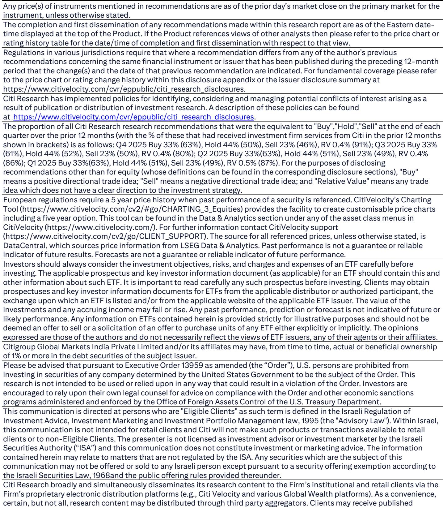
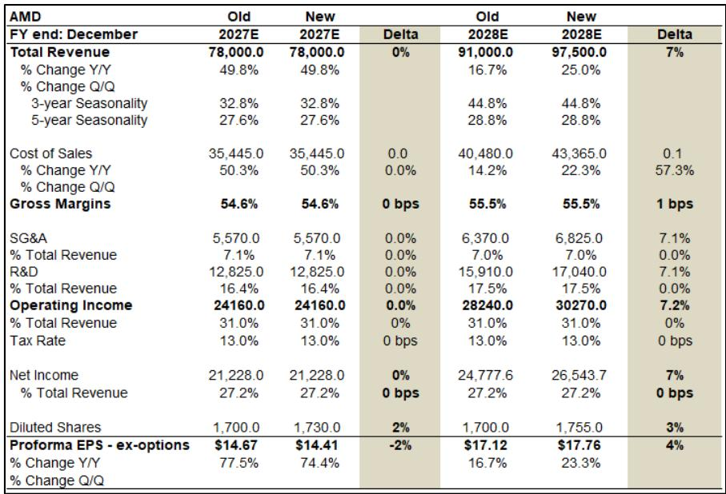
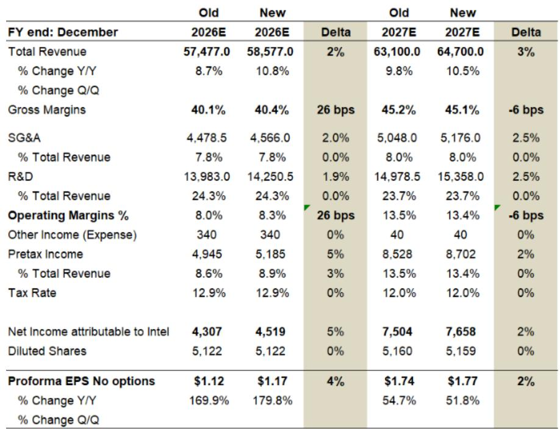

# The CPU Market Is Not Just Growing—It Is Being Rebuilt Around Agentic AI, and the Winners Will Be Determined by Execution, Not Architecture

The prevailing narrative in semiconductor investing has been that the GPU era is the only era that matters. For the past two years, nearly every dollar of incremental data center spending has flowed toward AI accelerators, leaving the central processing unit to be treated as a legacy component—necessary but unexciting. That narrative is now obsolete. A new analysis from a global investment bank introduces a server CPU total addressable market model that forecasts the segment expanding from $29.3 billion in 2025 to $131.5 billion by 2030, representing a 35% compound annual growth rate. The driving force behind this expansion is not a gradual recovery in general-purpose computing. It is the emergence of agentic CPU applications, a category that barely existed two years ago and is projected to grow at an extraordinary 185% CAGR, capturing 45% of the total CPU TAM by 2030.

This is not a cyclical upturn. It is a structural redefinition of what a CPU is for. The implications for investors, technology strategists, and data center operators are profound. The CPU is no longer a supporting actor in the AI story. It is becoming a lead performer in its own right, and the competitive dynamics among Intel, AMD, and ARM-based entrants are shifting accordingly. The report raises price targets on both Intel and AMD, but the rationale for each is distinct and reveals deeper strategic questions about market share, foundry leverage, and the ability to execute in a rapidly diversifying demand environment.

The key insight is that the CPU TAM is fracturing into three distinct sub-markets, each with its own growth trajectory, competitive dynamics, and margin profile. General-purpose CPUs, the traditional backbone of the server market, are forecast to grow at a respectable 20% CAGR to $50.9 billion by 2030. AI head nodes, which serve as the control and coordination layer for GPU clusters, will grow at a similar 21% CAGR to $21.1 billion. But the explosive growth comes from agentic CPU applications, defined as CPUs dedicated to running autonomous AI agents that perform tasks without human intervention. This segment is projected to leap from a negligible $313 million in 2025 to $59.4 billion in 2030. The scale and speed of this shift demand that investors rethink not only which companies will benefit but also what metrics will matter in evaluating them.

## Agentic AI Is Creating a New CPU Demand Vector That Is Larger Than the Entire GPU Market Was Two Years Ago

The most important number in the report is not the total TAM. It is the growth trajectory of agentic CPU applications. A 185% CAGR implies that this segment will double roughly every seven months. By 2030, it will represent nearly half of all server CPU spending. To put that in perspective, the entire GPU accelerator market was roughly $40 billion in 2023. Agentic CPU applications alone are forecast to surpass that figure by 2029. This is not a niche. It is a tsunami.

What explains this growth? The report does not explicitly model the underlying adoption drivers, but the logic is clear. As AI agents become more sophisticated and are deployed in enterprise workflows, they require dedicated compute resources that are optimized for latency-sensitive, decision-intensive tasks. These agents cannot rely solely on GPU clusters for every operation. They need CPUs that can handle real-time inference, task orchestration, and secure execution of autonomous actions. The CPU is becoming the brain of the agent, not just a traffic cop for data movement.

This has direct implications for product strategy. CPU designers can no longer focus solely on raw throughput or core count. They must optimize for agentic workloads, which may require different cache architectures, security features, and power management profiles. The companies that can define and deliver a purpose-built agentic CPU will capture disproportionate value. The companies that treat this as just another server refresh cycle will be left behind.

## Intel and AMD Are on Divergent Paths, and the Report Reveals Why Both Could Win in the Short Term But Face Very Different Long-Term Risks

The report raises price targets for both Intel and AMD, but the reasoning for each reveals fundamentally different investment theses. For Intel, the upside comes from a combination of foundry wins and ASIC business expansion. The report references a preliminary agreement between Intel and Apple for chip manufacturing, as well as the likelihood that Nvidia will become a foundry customer for gaming GPUs. Intel's Mount Evans IPU, used by Google and extending to Anthropic, is cited as an example of its ASIC business gaining traction. These are not CPU-centric catalysts. They are diversification plays that leverage Intel's manufacturing capacity and design services.

For AMD, the thesis is more directly tied to CPU performance leadership and capacity allocation at TSMC. The report believes AMD has won Anthropic as a customer for its MI450 AI accelerator, which would be a significant validation of its GPU roadmap. But the core argument for AMD is that it is the primary beneficiary of the "CPU renaissance" driven by agentic AI demand. AMD's unit share is forecast to grow from 25% in 2025 to 34% by 2030, while Intel's share declines from 61% to 47%. ARM-based processors are also expected to gain, reaching 19% share.

The divergence in these theses raises an important question: Can Intel sustain its CPU market share while simultaneously pivoting to a foundry model? The report suggests Intel's unit share will continue to decline through 2030, even as its absolute unit volumes grow at a 10% CAGR. That is a classic innovator's dilemma scenario. Intel is investing heavily in foundry capabilities, which may pay off in the long run, but the near-term cost is continued erosion in its core CPU business. AMD, by contrast, is riding a wave of product cycle momentum and has no foundry distractions. The risk for AMD is that its reliance on TSMC for capacity creates a single point of failure, especially as demand for agentic CPUs accelerates faster than expected.

## The Unit Share Data Tells a Story That Revenue Share Data Does Not Fully Capture

The report provides detailed market share data for both units and revenue. In the first quarter of 2026, Intel's server MPU unit share stood at 54.9%, down 372 basis points quarter over quarter. AMD's unit share was 27.4%, up 228 basis points. ARM's unit share reached 17.7%, up 145 basis points. On a revenue basis, the picture is even more striking. Intel's revenue share fell to 53.8%, while AMD's rose to 46.2%. That means AMD captured nearly half of all server CPU revenue in the first quarter of 2026, despite having only about half of Intel's unit volume.

This revenue share divergence is a critical insight. It suggests that AMD is winning in higher-value segments, likely the premium general-purpose and AI head node CPUs that command higher average selling prices. Intel, meanwhile, may be holding on to unit volume in lower-value applications, including legacy servers and entry-level configurations. As agentic CPU applications grow, the revenue per unit in that segment could be significantly higher than in general-purpose CPUs, further amplifying AMD's revenue advantage if it can capture share there.

The open question is whether ARM-based processors will follow a similar revenue trajectory. ARM's unit share is growing rapidly, but the report does not provide a separate revenue share for ARM. If ARM processors are being deployed primarily in price-sensitive or internal-use scenarios by cloud service providers, their revenue contribution may lag their unit share. If, however, ARM is winning high-value agentic workloads, the revenue story could shift dramatically. This is one of the most important unresolved questions in the report.

## One Critical Question the Report Does Not Fully Answer: How Will Agentic CPU Workloads Differ from General-Purpose and AI Head Node Workloads?

The report segments the CPU TAM into three categories but does not provide a detailed technical or architectural definition of what constitutes an agentic CPU application. This is not a criticism of the report, which is an investment analysis, not a product specification. But for investors and strategists, the absence of clarity creates significant uncertainty. If agentic CPUs are simply general-purpose CPUs running agent software, then the competitive dynamics may not change much. If they require specialized instruction sets, security enclaves, or memory architectures, then the winners may be determined by architectural innovation rather than manufacturing scale.

The report's assumption that agentic CPUs will grow at a 185% CAGR implies that this is not just a software trend. It implies a hardware upgrade cycle. But the nature of that upgrade cycle is unclear. Will cloud service providers retrofit existing servers with agentic CPUs, or will they deploy purpose-built systems? Will the agentic CPU be integrated into the same socket as the general-purpose CPU, or will it be a separate chip? These decisions will have enormous implications for Intel, AMD, and ARM, as well as for the broader server ecosystem.

Another unresolved question is the relationship between agentic CPU demand and GPU demand. The report treats them as separate TAMs, but in practice, many AI workloads will require both. An autonomous agent may use a CPU for task planning and a GPU for large-scale inference. The report does not model the substitution or complementarity effects between the two. If agentic CPUs cannibalize some GPU workloads, the total AI silicon TAM may grow more slowly than current forecasts suggest. If they are purely additive, the growth could be even more explosive.

## A Decision Framework for Investors: Three Questions to Ask Before Positioning in CPU Stocks

The report provides a wealth of data, but the most valuable output for an investor is a decision framework. Based on the analysis, three questions emerge that should guide any investment thesis in the CPU space.

First, how much of the agentic CPU TAM is incremental versus replacement? If agentic CPUs are primarily replacing general-purpose CPUs in existing servers, the growth in total TAM may be more modest than the headline numbers suggest. If they are driving new server deployments, the growth is real and sustainable. The answer to this question will determine whether the 35% CAGR is achievable or whether it will be revised downward as adoption patterns become clearer.

Second, which company has the most defensible position in agentic CPU workloads? The report suggests AMD has performance leadership, but Intel has foundry scale and a growing ASIC business. ARM has architectural efficiency and cloud service provider alignment. The winner may be determined not by raw performance but by ecosystem lock-in. If agentic CPUs require tight integration with specific software frameworks or cloud platforms, the incumbent with the strongest developer relationships may have an advantage.

Third, what is the margin profile of agentic CPU sales? The report does not provide margin estimates for the agentic CPU segment. If agentic CPUs command premium pricing, the revenue growth will translate into disproportionate profit growth. If they are commoditized, the revenue growth may be accompanied by margin compression. The report's price target increases for Intel and AMD assume that revenue growth will be profitable, but that assumption has not been stress-tested.

## The Full Report Contains Original Charts That Illustrate the Market Share Dynamics and TAM Build-Up in Greater Detail

The analysis presented here is based on the report's key findings, but the original document contains detailed charts that visualize the TAM model, unit share trends, and revenue share dynamics over multiple quarters. These charts provide context that is difficult to capture in text alone. The trajectory of Intel's revenue share decline, for example, becomes much starker when viewed as a time series from 2021 to 2026. The acceleration of ARM's unit share in the most recent quarters is also more evident in graphical form.

For serious investors and technology strategists, the full report offers a level of granularity that is essential for building conviction. The TAM model includes year-by-year projections for each segment, allowing readers to stress-test the assumptions. The market share data includes historical context that reveals the pace of change. The bull and bear scenarios for AMD provide a range of outcomes that can be used to calibrate risk.

Join the community to read the full report and review the original charts.

*This article is for learning and discussion only and does not constitute investment advice.*

Personal reading notes and learning share only. Not investment advice.

