# US Technology | North America

# Large-Cap Institutional Ownership 1Q26: Mega-Cap Tech Under-Ownership Narrows

The gap between Mega-cap tech S&P weighting and institutional ownership narrowed 12bps in 1Q, with mega-cap tech now 125bps under-owned vs. -137bps in 4Q. The rest of large-cap tech is modestly over-owned at +32bps. NVDA remains the most under-owned, followed by AAPL, MSFT, AMZN and GOOGL.

# Key Takeaways

Mega-cap Tech under-ownership vs the S&P 500 modestly narrowed to -125bps from -137bps at 4Q25 end.   
Outside of mega-cap Tech stocks, the spread between institutional ownership and S&P 500 weighting was +32bps, in-line with last quarter.   
NVDA remains the most under-owned large-cap tech stock vs. S&P 500 at -2.39%, followed by AAPL (-2.32%), MSFT (-1.86%), and AMZN (-1.24%).   
■ SNDK is still the most "over-owned" large-cap tech stock at +2.16% vs. S&P 500, more than 2x STX, the next most over-owned stock behind SNDK.   
Institutional positioning in large-cap tech favors AI infra bottlenecks, with relatively high memory/storage ownership and low software ownership exiting 1Q26.

Mega-cap Tech stocks are modestly less under-owned vs. the S&P 500 exiting 1Q26 than at 2025 year-end; NVDA remains the most "under-owned" large-cap tech stock, while SNDK is the most "over-owned" (Exhibit1). Leveraging 13Fs filed for the end of 1Q26, most mega-cap technology stocks remain under-owned relative to their weighting in the S&P 500, with NVDA (-2.39%), AAPL (-2.32%), MSFT (-1.86%) and AMZN (-1.24%) the most under-owned of the mega-cap tech stocks we track. Conversely, SNDK (+2.16%), STX (+0.84%) and CRM (+0.63%), are the most over-owned technology stocks we track relative to their weighting in the S&P 500. On average, the spread between active institutional ownership and S&P 500 weighting for the largest technology companies in the US by market cap - NVDA, AAPL, MSFT, AMZN, GOOGL, META, and TSLA - was -125bps exiting 1Q26 (Exhibit 2) vs. -137bps at the end of 4Q25, showing a modest narrowing of mega-cap under-ownership over the last 90 days. For the remaining 21 large-cap tech stocks we track, the spread between institutional ownership and S&P 500 weighting exiting 1Q26 was +32bps, in-line with 4Q25.

MS & CO. LLC

# Erik W Woodring

Equity Analyst

Erik.Woodring@morganstanley.com +1 212 296-8083

# Keith Weiss, CFA

Equity Analyst

Keith.Weiss@morganstanley.com +1 212 761-4149

# Brian Nowak, CFA

Equity Analyst

Brian.Nowak@morganstanley.com +1 212 761-3365

# Joseph Moore

Equity Analyst

Joseph.Moore@morganstanley.com +1 212 761-7516

# Meta A Marshall

Equity Analyst

Meta.Marshall@morganstanley.com +1 212 761-0430

# Rauf Ural

Research Associate

Rauf.Ural@morganstanley.com +1 212 761-5958

# IT HARDWARE

# North America

Industry View

Cautious

MS does and seeks to do business with companies covered in MS. As a result, investors should be aware that the firm may have a conflict of interest that could affect the objectivity of MS. Investors should consider MS as only a single factor in making their investment decision.

For analyst certification and other important disclosures, refer to the Disclosure Section, located at the end of this report.

Exhibit1: The gap between mega-cap tech's institutional weighting and its S&P 500 weighting narrowed in 1Q26.   
Average Institutional Portfolio Weighting   
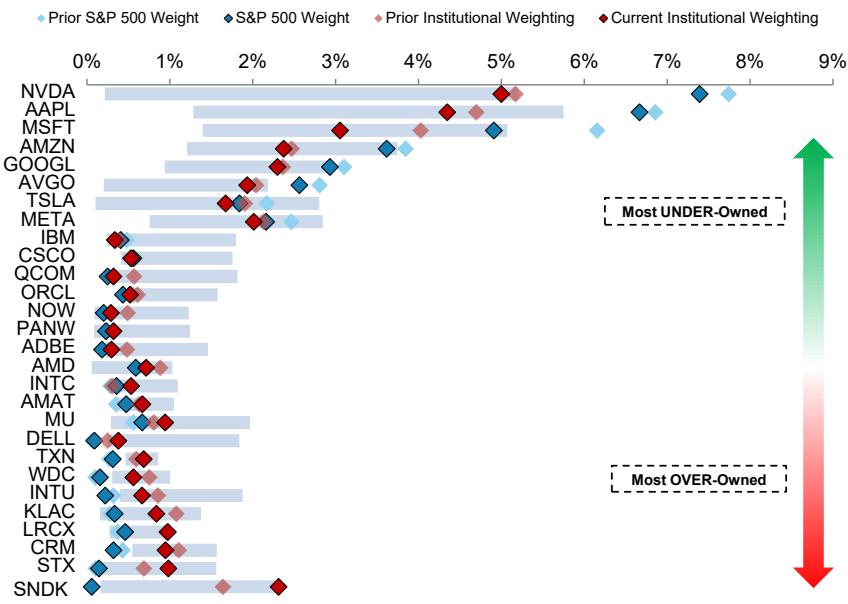

bar

| Company | Prior S&P 500 Weight | S&P 500 Weight | Prior Institutional Weighting | Current Institutional Weighting |
|---------|----------------------|----------------|-------------------------------|----------------------------------|
| NVDA    | ~6%                  | ~7%            | ~5%                           | ~8%                              |
| AAPL    | ~4%                  | ~5%            | ~4%                           | ~6%                              |
| MSFT    | ~3%                  | ~4%            | ~3%                           | ~5%                              |
| AMZN    | ~2%                  | ~3%            | ~2%                           | ~4%                              |
| GOOGL   | ~1%                  | ~2%            | ~1%                           | ~3%                              |
| AVGO    | ~0.5%                | ~1%            | ~0.5%                         | ~2%                              |
| TSLA    | ~0.5%                | ~1%            | ~0.5%                         | ~2%                              |
| META    | ~0.5%                | ~1%            | ~0.5%                         | ~2%                              |
| IBM     | ~0.5%                | ~1%            | ~0.5%                         | ~2%                              |
| CSCO    | ~0.5%                | ~1%            | ~0.5%                         | ~2%                              |
| QCOM    | ~0.5%                | ~1%            | ~0.5%                         | ~2%                              |
| ORCL    | ~0.5%                | ~1%            | ~0.5%                         | ~2%                              |
| NOW     | ~0.5%                | ~1%            | ~0.5%                         | ~2%                              |
| PANW    | ~0.5%                | ~1%            | ~0.5%                         | ~2%                              |
| ADBE    | ~0.5%                | ~1%            | ~0.5%                         | ~2%                              |
| AMD     | ~0.5%                | ~1%            | ~0.5%                         | ~2%                              |
| INTC    | ~0.5%                | ~1%            | ~0.5%                         | ~2%                              |
| AMAT    | ~0.5%                | ~1%            | ~0.5%                         | ~2%                              |
| MU      | ~0.5%                | ~1%            | ~0.5%                         | ~2%                              |
| DELL    | ~0.5%                | ~1%            | ~0.5%                         | ~2%                              |
| TXN     | ~0.5%                | ~1%            | ~0.5%                         | ~2%                              |
| WDC     | ~0.5%                | ~1%            | ~0.5%                         | ~2%                              |
| INTU    | ~0.5%                | ~1%            | ~0.5%                         | ~2%                              |
| KLAC    | ~0.5%                | ~1%            | ~0.5%                         | ~2%                              |
| LRCX    | ~0.5%                | ~1%            | ~0.5%                         | ~2%                              |
| CRM     | ~0.5%                | ~1%            | ~0.5%                         | ~2%                              |
| STX     | ~0.5%                | ~1%            | ~0.5%                         | ~2%                              |
| SNDK    | ~0.5%                | ~1%            | ~0.5%                         | ~2%                              |

Note: Based on 13-F filings for the period from 1Q09 to 1Q26. Google historical time period begins in 1Q14 and reflects only GOOGL share class, which has a directionally similar dynamic as GOOG. Source: Factset, MS.

# At the stock level, there are three key observations from the 1Q26 13-F data.

First, NVDA remains the most under-owned large-cap tech stock we track as of 1Q26 (Exhibit 2), with the gap between NVDA's S&P 500 weighting and institutional ownership narrowing Q/Q by just 18bps, ending 1Q26 at -2.39%, near all-time highs. Second, exiting 1Q26, institutional active manager ownership remains notably high (vs. the S&P 500) in large cap memory/storage-related names - SNDK, STX, LRCX, KLAC, and WDC - but notably low in software stocks - IBM, ORCL, PANW, NOW and ADBE, illustrating a continued clear institutional bias towards AI 'picks and shovels' / bottlenecks in 1Q. Finally, we'd highlight that SNDK's institutional ownership has been steadily increasing since its re-listing in 1Q25, and even after its inclusion into the S&P 500 in 4Q25, SNDK has the widest gap between institutional ownership and S&P 500 weighting among any other large-cap tech stock we track, with the "over-ownership" gap exiting 1Q26 at +2.16%, more than 2x STX, the next most "over-owned" large cap tech stock we track.

Exhibit 2: Of the large cap stocks we evaluate, NVDA, AAPL, MSFT, AMZN, and GOOGL are currently the most under-owned in actively managed portfolios vs. the S&P 500, while SNDK, STX, CRM, and LRCX are the most over-owned.   
Average Active Ownership Portfolio Weighting vs. S&P 500 Weighting   
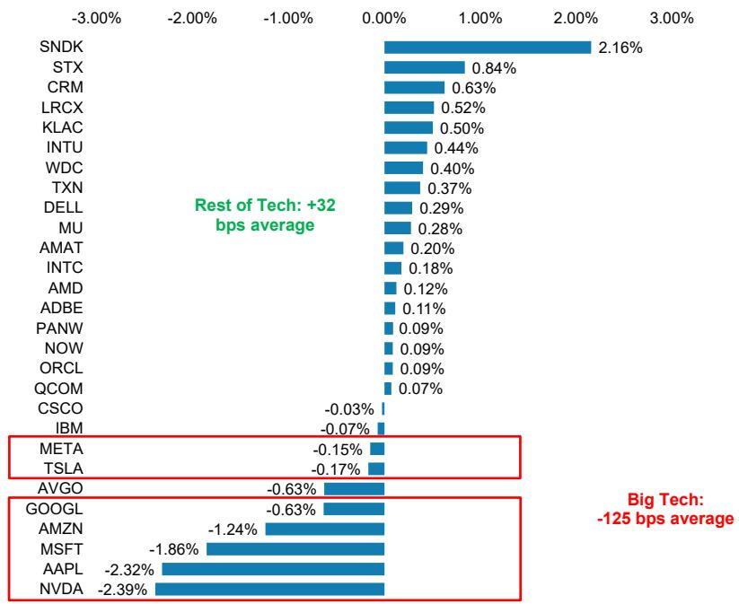

bar

| Entity | Value (%) |
| :--- | :--- |
| SNDK | 2.16 |
| STX | 0.84 |
| CRM | 0.63 |
| LRCX | 0.52 |
| KLAC | 0.50 |
| INTU | 0.44 |
| WDC | 0.40 |
| TXN | 0.37 |
| DELL | 0.29 |
| MU | 0.28 |
| AMAT | 0.20 |
| INTC | 0.18 |
| AMD | 0.12 |
| ADBE | 0.11 |
| PANW | 0.09 |
| NOW | 0.09 |
| ORCL | 0.09 |
| QCOM | 0.07 |
| CSCO | -0.03 |
| IBM | -0.07 |
| META | -0.15 |
| TSLA | -0.17 |
| AVGO | -0.63 |
| GOOGL | -0.63 |
| AMZN | -1.24 |
| MSFT | -1.86 |
| AAPL | -2.32 |
| NVDA | -2.39 |
Rest of Tech: +32 bps average; Big Tech: -125 bps average

Source: Based on 13-F filings for the period from 1Q09 to 1Q26. Factset, MS.

Why does this data matter? Each quarter, we track ownership data for 28 of the largest cap tech companies across MS's US technology equity research coverage, which is based on each company's average weighting within the top 100 actively managed institutional portfolios relative to that same company's weighting in the S&P 500. A quant analysis of this historical ownership data indicates that, on average, after adjusting for market cap and earnings beats, there is a statistically significant relationship between low active ownership relative to the S&P 500 and future stock performance. This indicates that on average, stocks appear to experience a technical pull higher when active ownership is much lower than the market, and vice versa.

# Key Exhibits

Exhibit 3: Of the large cap stocks we evaluate, SNDK saw the gap between its institutional ownership and S&P 500 weighting increase the most by 57bps in 1Q (vs. 4Q), while KLAC saw the gap narrow by 30bps.

Q/Q Change in Gap of Active Ownership Portfolio Weighting vs. S&P 500 Weighting   
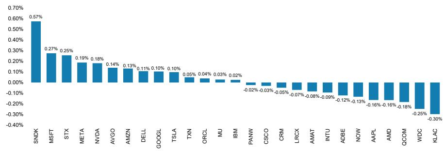

bar

| Ticker | Value (%) |
| :--- | :--- |
| SNDK | 0.57 |
| MSFT | 0.27 |
| STX | 0.25 |
| META | 0.19 |
| NVDA | 0.18 |
| AVGO | 0.14 |
| AMZN | 0.13 |
| DELL | 0.11 |
| GOOGL | 0.10 |
| TSLA | 0.10 |
| TXN | 0.05 |
| ORCL | 0.04 |
| MU | 0.03 |
| IBM | 0.02 |
| PANW | -0.02 |
| CSCO | -0.03 |
| CRM | -0.05 |
| LRCX | -0.07 |
| AMAT | -0.08 |
| INTU | -0.09 |
| ADBE | -0.12 |
| NOW | -0.13 |
| AAPL | -0.16 |
| AMD | -0.16 |
| QCOM | -0.18 |
| WDC | -0.25 |
| KLAC | -0.30 |

Source: Based on 13-F filings for the period from 1Q09 to 1Q26. Factset, MS.

Exhibit 4: The spread between the average active portfolio weighting vs. the S&P 500 widened Q/Q for AAPL, but narrowed for AMZN, META, GOOGL, NVDA, MSFT, and TSLA.

"Mag 7" Average Active Portfolio Weighting vs. S&P 500 Weighting   
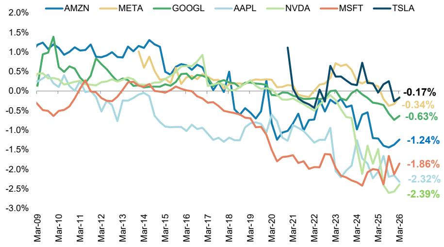

line

| Date   | AMZN   | META   | GOOGL  | AAPL   | NVDA   | MSFT   | TSLA   |
|--------|--------|--------|--------|--------|--------|--------|--------|
| Mar-26 | -1.24% | -0.34% | -0.63% | -2.32% | -2.39% | -1.86% | -0.17% |

Source: Based on 13-F filings for the period from 1Q09 to 1Q26. Google historical time period begins in 1Q14 and reflects only GOOGL share class, which has a directionally similar dynamic as GOOG. Source: Factset, MS.

Exhibit 5: For the rest of Software ex-MSFT, average active ownership weighting vs. the S&P 500 (0.24%) decreased by 6bp Q/Q.   
Software Average Active Portfolio Weighting vs. S&P 500 Weighting   
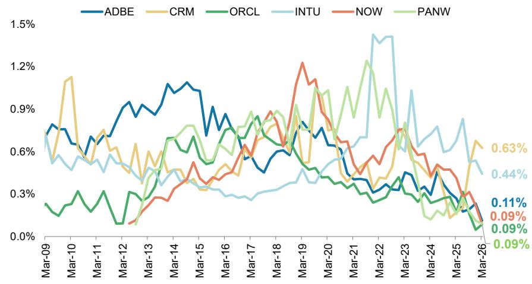

line

| Date   | ADBE  | CRM   | ORCL  | INTU  | NOW   | PANW  |
|--------|-------|-------|-------|-------|-------|-------|
| Mar-26 | 0.11% | 0.63% | 0.09% | 0.44% | 0.09% | 0.09% |

Source: Based on 13-F filings for the period from 1Q09 to 1Q26. Google historical time period begins in 1Q14 and reflects only GOOGL share class, which has a directionally similar dynamic as GOOG. Source: Factset, MS.

Exhibit 6: In semis, SNDK saw the largest increase in the spread between the average active vs. passive ownership Q/Q.   
Semis Average Active Portfolio Weighting vs. S&P 500 Weighting   
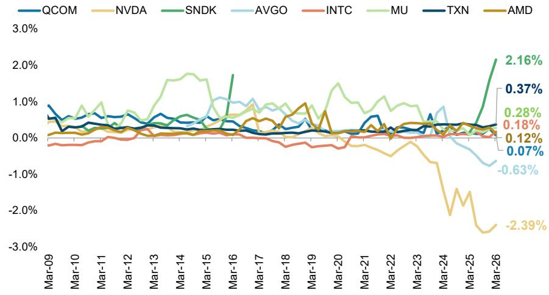

line

| Date   | QCOM  | NVDA  | SNDK  | AVGO  | INTC  | MU    | TXN   | AMD   |
|--------|-------|-------|-------|-------|-------|-------|-------|-------|
| Mar-26 | 0.37% | -2.39%| 2.16% | -0.63%| 0.18% | 0.28% | 0.12% | 0.07% |

Source: Based on 13-F filings for the period from 1Q09 to 1Q26. Factset, MS.

Exhibit 7: Across memory and HDDs, average active ownership weighting vs. the S&P 500 (0.73%) increased by 4 bps Q/Q.   
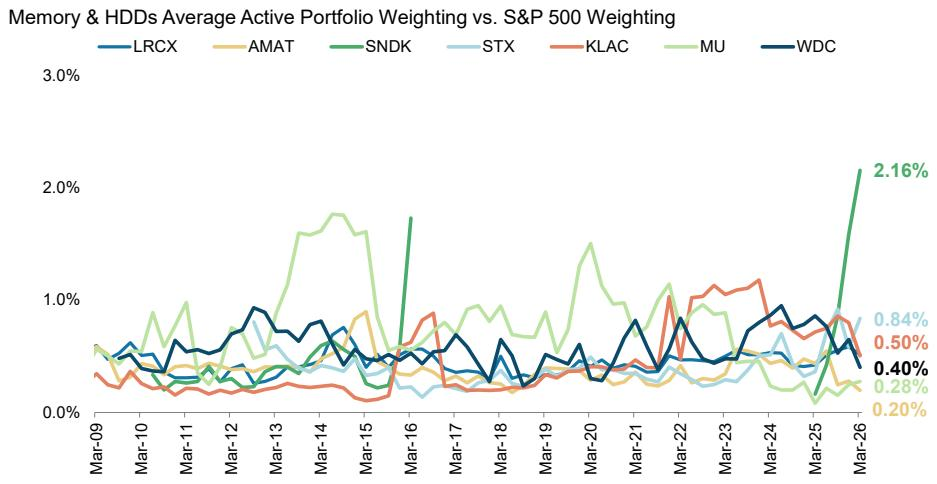

line

| Date   | LRCX  | AMAT  | SNDK  | STX   | KLAC  | MU    | WDC   |
|--------|-------|-------|-------|-------|-------|-------|-------|
| Mar-26 | 0.84% | 0.20% | 2.16% | 0.50% | 0.40% | 0.28% | 0.40% |

Source: Based on 13-F filings for the period from 1Q09 to 1Q26. Factset, MS

Exhibit 8: CSCO active institutional ownership weighting has remained relatively in-line with the S&P 500 over the last 5 years.   
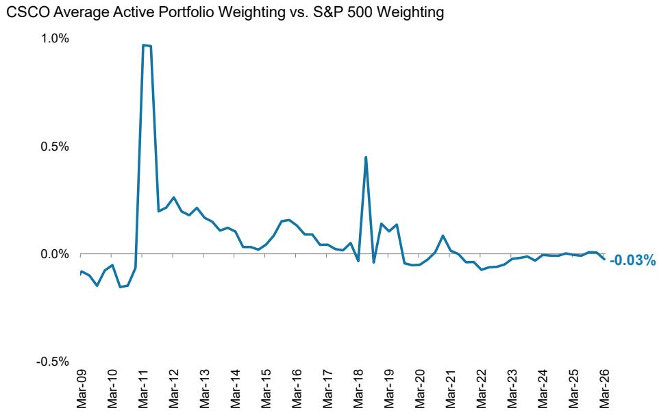

line

| Date   | Value   |
|--------|---------|
| Mar-09 | -0.1%   |
| Mar-10 | -0.2%   |
| Mar-11 | 1.0%    |
| Mar-12 | 0.2%    |
| Mar-13 | 0.1%    |
| Mar-14 | 0.0%    |
| Mar-15 | 0.1%    |
| Mar-16 | 0.2%    |
| Mar-17 | 0.1%    |
| Mar-18 | 0.4%    |
| Mar-19 | 0.1%    |
| Mar-20 | 0.0%    |
| Mar-21 | 0.1%    |
| Mar-22 | -0.1%   |
| Mar-23 | -0.1%   |
| Mar-24 | 0.0%    |
| Mar-25 | 0.0%    |
| Mar-26 | -0.03%  |

Source: Based on 13-F filings for the period from 1Q09 to 1Q26. Factset, MS.

Exhibit 9: IBM's S&P 500 weighting vs active ownership upticked slightly by 3bps in 1Q26 Q/Q.   
IBM Average Active Portfolio Weighting vs. S&P 500 Weighting   
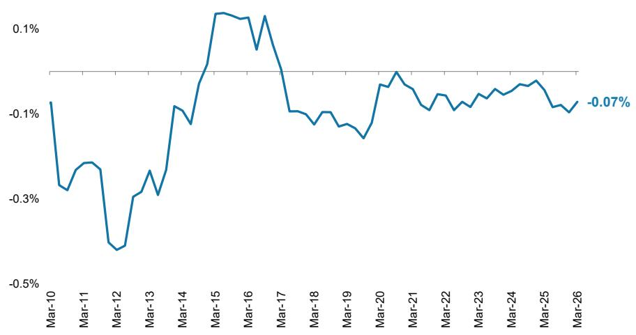

line

| Date   | Value  |
|--------|--------|
| Mar-26 | -0.07% |

Source: Based on 13-F filings for the period from 1Q09 to 1Q26

MS is acting as exclusive financial advisor to AP Grange Holdings, LLC ("AP Grange") in relation to a definitive agreement with Intel Corporation ("Intel"), for Intel to repurchase the 49% equity interest in the joint venture related to Intel's Fab 34 in Ireland not held by Intel, as announced on April 1, 2026. The transaction is subject to customary closing conditions. AP Grange has agreed to pay fees to MS for its financial advisory services. Please refer to the notes at the end of this report.

MS is acting as financial advisor to Armis Inc. ("Armis") in relation to the proposed acquisition by ServiceNow, Inc. as announced on December 23, 2025. Armis has agreed to pay fees to MS for its financial services. Please refer to the notes at the end of the report.

MS is acting as lead financial advisor to Intersect, LLC in relation to the sale to Alphabet Inc, as announced on December 22, 2025. The deal is subject to customary closing conditions. Intersect, LLC has agreed to pay fees to MS for its financial services.

# Risk Reward – Adobe Inc. (ADBE.O)

Pools of Limited Visibility Obfuscate Path to Growth Reacceleration

# PRICE TARGET \$365.00

Our \$365 PT is based on a 13x Base Case 2027e EPS of \$27.56 as Generative AI sustains durable growth in Creative Cloud. The 13x EPS multiple in FY27e implies a \~1x PEG, a discount to ADBE's historical average.

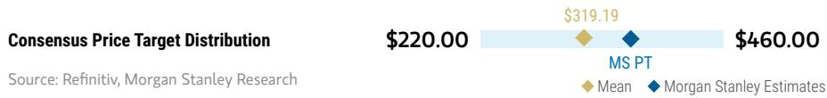

bar_line

| Scenario | Value    |
| -------- | -------- |
| Mean     | $220.00  |
| MS Estimates | $319.19  |
| MS PT    | $460.00  |

RISK REWARD CHART AND OPTIONS IMPLIED PROBABILITIES (12M)   
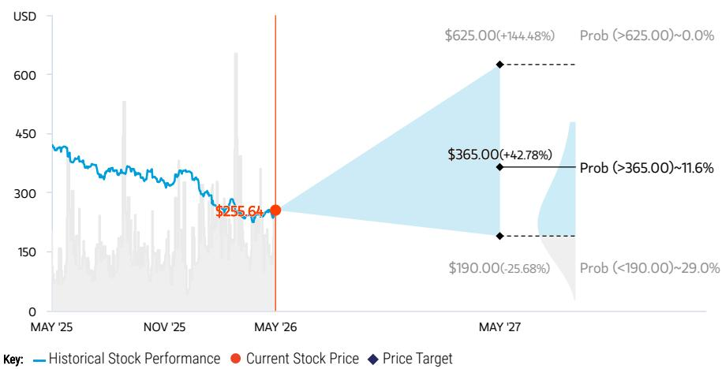  
Source: Refinitiv, MS, MS Institutional Equities Division. The probabilities of our Bull, Base, and Bear case scenarios playing out were estimated with implied volatility data from the options market as of 18 May 2026. All figures are approximate risk-neutral probabilities of the stock reaching beyond the scenario price in either three-months' or one-years' time. View explanation of Options Probabilities methodology here

# EQUAL-WEIGHT THESIS

■ Remain constructive on Adobe's competitive moat, particularly among complex, multi-channel marketers that lean on Adobe as: 1) an integrated 'system of record' across content creation (Digital Media) and content distribution (Digital Experience); 2) a deliverer of Gen AI functionality that should enhance and accelerate content supply chains; and 3) enabling strict compliance & protection related to IP rights

■ Limited visibility into the size and magnitude of AI disruption headwinds with Consumers, simple marketers, and business users lowers our conviction in the net AI impact to Creative Cloud and Digital Media growth

■ \$365 PT is based on a 13x 2027e EPS of \$27.56, which implies a \~1.0x PEG

Consensus Rating Distribution   
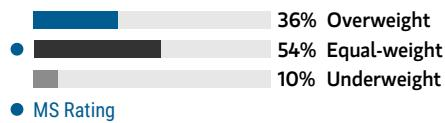

bar

| Category | Value (%) |
|---|---|
| Overweight | 36 |
| Equal-weight | 54 |
| Underweight | 10 |
| MS Rating | (not labeled) |

Source: Refinitiv, MS

# Risk Reward Themes

New Data Era: Positive
Secular Growth: Positive
Technology Diffusion: Positive

View descriptions of Risk Rewards Themes here

# BULL CASE

# \$625.00

# 21x Bull Case 2027e EPS of \$29.75

Creative Cloud + GenAI expands the user base and pushes pricing higher, supporting a total revenue CAGR of 13%. Operating margin of 45.5% results in FY27 EPS of \$29.75. ADBE trades at 21x EPS, largely inline with large-cap peers, supported by a strong 16% EPS CAGR, yielding \$625/share.

# BASE CASE

# 13x Base Case 2027e EPS of \$27.56

Total revenue grows at 10% CAGR from FY24-FY27. Operating margin of 45.3% results in FY27 EPS of \$27.56 and a FY24-FY27 EPS CAGR of 14%. At a 13x EPS multiple in FY27e, yielding \$365/share, ADBE trades at \~1.0x PEG, a discount to its historical average.

# \$365.00

# BEAR CASE

# \$190.00

# 8x Bear Case 2027e EPS of \$23.91

Generative AI adds little upside to the existing user or revenue base as competition is fierce. A worsening macro environment negatively impacts a growing base of cyclically sensitive consumers. Margins remain 45.3% in FY27, resulting in FY27e EPS of \$23.91. The stock trades at 8x FY27e EPS, which yields \$190/share.

# Risk Reward – Adobe Inc. (ADBE.O)

KEY EARNINGS INPUTS 

<table><tr><td>Drivers</td><td>2024</td><td>2025e</td><td>2026e</td><td>2027e</td></tr><tr><td>Net New Digital Media ARR YoY (%)</td><td>13.1</td><td>11.5</td><td>10.3</td><td>9.6</td></tr><tr><td>EPS YoY (%)</td><td>14.7</td><td>13.6</td><td>12.1</td><td>12.4</td></tr><tr><td>Digital Experience Revenue YoY (%)</td><td>9.4</td><td>9.0</td><td>9.6</td><td>10.1</td></tr><tr><td>Total Revenue YoY (%)</td><td>10.8</td><td>10.5</td><td>9.4</td><td>9.8</td></tr><tr><td>Operating Margin (%)</td><td>46.6</td><td>46.2</td><td>45.0</td><td>45.3</td></tr></table>

# INVESTMENT DRIVERS

- Increased customer lifetime value and TAM expansion opportunity   
- Growing the customer base through freemium offerings   
• Secular data trends around first party data   
- Operating leverage and share buybacks

GLOBAL REVENUE EXPOSURE 

<table><tr><td></td><td>0-10%</td></tr><tr><td colspan="2">APAC, ex Japan, Mainland China and India</td></tr><tr><td colspan="2">India</td></tr><tr><td colspan="2">Japan</td></tr><tr><td colspan="2">Latin America</td></tr><tr><td colspan="2">MEA</td></tr><tr><td colspan="2">UK</td></tr><tr><td colspan="2">Europe ex UK</td></tr><tr><td colspan="2">40-50%</td></tr></table>

Source: MS Estimate
View explanation of regional hierarchies here

MS ALPHA MODELS 

<table><tr><td>1/5BEST</td><td>24 MonthHorizon</td><td>1/5MOST</td><td>3 MonthHorizon</td></tr></table>

Source: Refinitiv, FactSet, MS; 1 is the highest favored Quintile and 5 is the least favored Quintile

# RISKS TO PT/RATING

# RISKS TO UPSIDE

• GenAI pricing closer to peers   
- Expand the addressable customer base   
- Added GenAI functionality to the Digital Experience product portfolio   
- Faster transition to margin expansion out of investment mode

# RISKS TO DOWNSIDE

• Timing of releases / AI availability   
- Pricing on Firefly / ETLA / Creative Cloud uplift   
• Lower margins from GenAI investment   
- Cannibalization of the subscriber base / increased competition

OWNERSHIP POSITIONING 

<table><tr><td>Inst. Owners, % Active</td><td>47.3%</td><td></td><td></td><td></td></tr><tr><td>HF Sector Long/Short Ratio</td><td>2x</td><td></td><td></td><td></td></tr><tr><td>HF Sector Net Exposure</td><td>25.3%</td><td></td><td></td><td></td></tr></table>

Refinitiv; MSPB Content. Includes certain hedge fund exposures held with MSPB. Information may be inconsistent with or may not reflect broader market trends. Long/Short Ratio = Long Exposure / Short exposure. Sector % of Total Net Exposure = (For a particular sector: Long Exposure - Short Exposure) / (Across all sectors: Long Exposure – Short Exposure).

MS ESTIMATES VS. CONSENSUS 

<table><tr><td colspan="3">FY Dec 2025e</td></tr><tr><td rowspan="2">Sales / Revenue ($, mm)</td><td rowspan="2">23,591</td><td>23,769</td></tr><tr><td>23,777</td></tr><tr><td rowspan="2">EBITDA ($, mm)</td><td>11,035</td><td rowspan="2">11,844</td></tr><tr><td>11,635</td></tr><tr><td rowspan="2">Net income ($, mm)</td><td>8,855</td><td rowspan="2">8,941</td></tr><tr><td>8,906</td></tr><tr><td rowspan="2">EPS ($)</td><td>20.60</td><td>20.94</td></tr><tr><td>20.84</td><td>21.04</td></tr></table>

Source: Refinitiv, MS

# Risk Reward – Alphabet Inc. (GOOGL.O)

Alphabet Inc.

# PRICE TARGET \$375.00

Our price target is determined using a discounted cash flow/discount to long-term EBITDA multiple. It implies a \~24X '27 P/E Multiple. Our DCF uses a \~8% WACC and a \~3% terminal growth rate (in line with other growth-oriented internet companies)

Consensus Price Target Distribution

Source: Refinitiv, MS

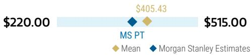

bar_line

|        | Value    |
| ------ | -------- |
| MS PT  | $405.43  |
|        | $515.00  |

RISK REWARD CHART AND OPTIONS IMPLIED PROBABILITIES (12M)   
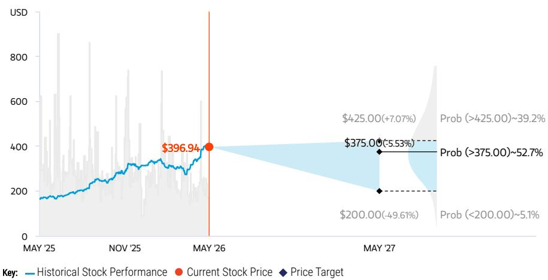

line

| Date     | Historical Stock Performance | Current Stock Price | Price Target |
| -------- | ----------------------------- | ------------------- | ------------ |
| MAY '25  | ~180                          | -                   | -            |
| NOV '25  | ~250                          | -                   | -            |
| MAY '26  | $396.94                       | $396.94             | -            |
| MAY '27  | $425.00 (-7.07%)              | $375.00 (-5.53%)    | $200.00 (-49.61%) |
| Prob (>425.00)~39.2% | -                             | -                   | -            |
| Prob (>375.00)~52.7% | -                           | -                   | -            |
| Prob (<200.00)~5.1% | -                           | -                   | -            |

Source: Refinitiv, MS, MS Institutional Equities Division. The probabilities of our Bull, Base, and Bear case scenarios playing out were estimated with implied volatility data from the options market as of 18 May 2026. All figures are approximate risk-neutral probabilities of the stock reaching beyond the scenario price in either three-months' or one-years' time. View explanation of Options Probabilities methodology here

# OVERWEIGHT THESIS

■ Continued AI-driven platform-level innovation on Search, YouTube, Cloud, and with other offerings improve confidence in the durability of long term growth.   
■ Continued expense discipline leads to operating leverage and upward revisions on EPS and FCF estimates.

Consensus Rating Distribution   
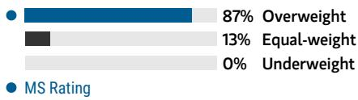

bar

| Category       | Value |
| -------------- | ----- |
| Overweight     | 87%   |
| Equal-weight   | 13%   |
| Underweight    | 0%    |

Source: Refinitiv, MS

# Risk Reward Themes

Secular Growth: Positive
New Data Era: Positive

View descriptions of Risk Rewards Themes here

# BULL CASE

# \$425.00

# Implied \~15X '27 bull case EBITDA.

Faster innovation and Search/GCP acceleration lead to multiple expansion and higher earnings power. Search revenue accelerates as AI-driven innovation delivers meaningful upside to engagement. New AI offerings prove incremental to the top and bottom line and don't cannibalize core Search. YouTube and Cloud become even bigger contributors to top-line growth, and operate at a higher margin than in our base case.

# BASE CASE

# \$375.00

# Implied \~14X '27 base case EBITDA.

Assumes pragmatic search revenue growth in '26, continued incremental platform monetization and Google Cloud acceleration in '26. As GOOGL continues platform-level innovation on Search and other categories, we assume pragmatic revenue/EBITDA growth. GOOGL introduces new AI offerings which increase confidence in the durability of long term growth and calm fears around competition. Google Cloud accelerates driven by new partnerships and growing backlog.

# BEAR CASE

# \$200.00

# Implied \~8X '27 bear case EBITDA.

Global ad growth slows further and margins face pressure. Assumes slower search advertising growth, and that ad spending slows further. Expense discipline fails to materialize leading to lower than expected margin expansion and adj. EBITDA. New AI products create greater than expected margin pressure due to lower monetization rates and increased compute intensity.

# Risk Reward – Alphabet Inc. (GOOGL.O)

KEY EARNINGS INPUTS 

<table><tr><td>Drivers</td><td>2025</td><td>2026e</td><td>2027e</td><td>2028e</td></tr><tr><td>Total operating income (GAAP) ($, mm)</td><td>129,039</td><td>179,101</td><td>230,479</td><td>279,692</td></tr><tr><td>GAAP Operating Income (Loss) ($, mm)</td><td>137,054</td><td>186,576</td><td>237,679</td><td>286,242</td></tr></table>

# INVESTMENT DRIVERS

- Search advertising spend continues to gain share of global advertising budgets.   
- Mobile search advertising continues to take share of online budgets.   
• Investments in video driving longer-term monetization at YouTube.   
• Moderation of expense growth.

# GLOBAL REVENUE EXPOSURE

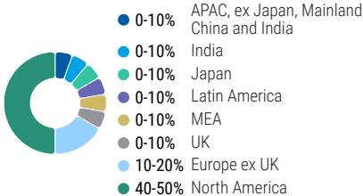

pie

| Region | Percentage (%) |
| :--- | :--- |
| APAC, ex Japan, Mainland China and India | 0-10 |
| India | 0-10 |
| Japan | 0-10 |
| Latin America | 0-10 |
| MEA | 0-10 |
| UK | 0-10 |
| Europe ex UK | 10-20 |
| North America | 40-50 |

Source: MS Estimate View explanation of regional hierarchies here

# MS ALPHA MODELS

5/5 BEST

24 Month Horizon

3/5 MOST

3 Month Horizon

Source: Refinitiv, FactSet, MS; 1 is the highest favored Quintile and 5 is the least favored Quintile

# RISKS TO PT/RATING

# RISKS TO UPSIDE

- New products generate higher than expected top line contribution.   
- Capital returns through greater share buybacks.   
- Hiring and/or spend per headcount is lower than expected.

# RISKS TO DOWNSIDE

- High exposure to SMB and travel could pressure ad revenue in a recession   
- Improved disclosure around the Google and Other Alphabet segments may not decrease the overall investment activity of the business.

# OWNERSHIP POSITIONING

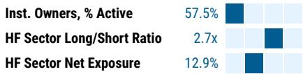

bar

| Category                     | Value  |
| ---------------------------- | ------ |
| Inst. Owners, % Active       | 57.5%  |
| HF Sector Long/Short Ratio   | 2.7x   |
| HF Sector Net Exposure        | 12.9%  |

Refinitiv; MSPB Content. Includes certain hedge fund exposures held with MSPB. Information may be inconsistent with or may not reflect broader market trends. Long/Short Ratio = Long Exposure / Short exposure. Sector % of Total Net Exposure = (For a particular sector: Long Exposure - Short Exposure) / (Across all sectors: Long Exposure – Short Exposure).

# MS ESTIMATES VS. CONSENSUS

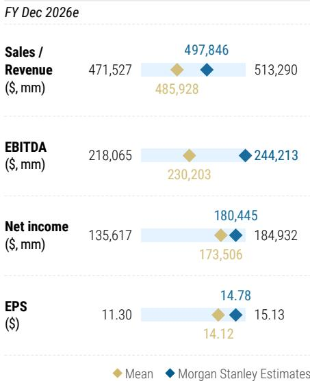

bar_line

FY Dec 2026e
| Metric | Mean ($) | MS Estimates ($) |
| :--- | :--- | :--- |
| Sales / Revenue ($, mm) | 471,527 | 485,928 |
| EBITDA ($, mm) | 218,065 | 230,203 |
| Net income ($, mm) | 135,617 | 173,506 |
| EPS ($) | 11.30 | 14.12 |
| Sales / Revenue ($, mm) | 497,846 | 513,290 |
| EBITDA ($, mm) | 218,065 | 244,213 |
| Net income ($, mm) | 180,445 | 184,932 |
| EPS ($) | 14.78 | 15.13 |

Source: Refinitiv, MS

# Risk Reward – Amazon.com Inc (AMZN.O)

AMZN Risk Reward

# PRICE TARGET \$330.00

Our \$330 PT is based on applying a \~29X P/E multiple to our \$11.3 of '27 EPS and implies paying \~1.1X PEG, a \~40% discount to AMZN's peer median.

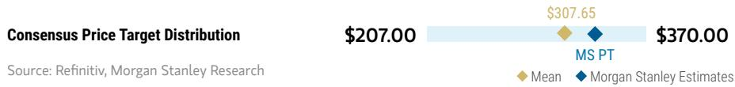

bar_line

| Category | Value    |
| -------- | -------- |
| MS PT    | $307.65  |
| MS Estimates | $370.00  |
Source: Refinitiv, MS

RISK REWARD CHART AND OPTIONS IMPLIED PROBABILITIES (12M)   
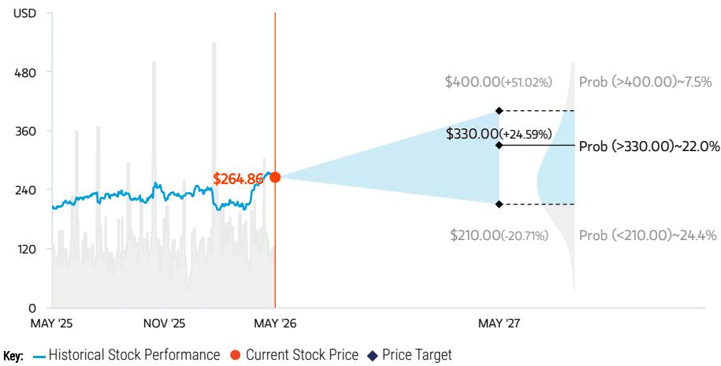

line

| Date     | Historical Stock Performance | Current Stock Price | Price Target |
| -------- | ----------------------------- | ------------------- | ------------ |
| MAY '25  | ~$240                         | -                   | -            |
| NOV '25  | ~$240                         | -                   | -            |
| MAY '26  | $264.86                       | -                   | -            |
| MAY '27  | $330.00                       | +$24.59             | $210.00      |
| MAY '27  | -                             | -                   | $400.00      |

Source: Refinitiv, MS, MS Institutional Equities Division. The probabilities of our Bull, Base, and Bear case scenarios playing out were estimated with implied volatility data from the options market as of 18 May 2026. All figures are approximate risk-neutral probabilities of the stock reaching beyond the scenario price in either three-months' or one-years' time. View explanation of Options Probabilities methodology here

# OVERWEIGHT THESIS

\- Amazon's high-margin businesses continue to allow Amazon to drive greater profitability while still continuing to invest (last mile delivery, fulfillment, Prime Now, Fresh, Prime digital content, Alexa/Echo, India, AWS, etc).

■ Amazon Prime membership growth drives recurring revenue and positive mix shift.   
■ Cloud adoption hitting an inflection point.   
■ Advertising serves as a key area for both further growth potential and profitability flow-through.

Consensus Rating Distribution   
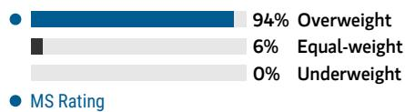

bar

| Category       | Value |
| -------------- | ----- |
| Overweight     | 94%   |
| Equal-weight   | 6%    |
| Underweight    | 0%    |

Source: Refinitiv, MS

# Risk Reward Themes

Secular Growth: Positive
New Data Era: Positive
Technology Diffusion: Positive

View descriptions of Risk Rewards Themes here

# BULL CASE

# \$400.00

\~31X bull case 2027 EPS of \$13.0

Our Bull case is derived from higher Revenue and EBIT margin assumptions than in our base case

# BASE CASE

# \$330.00

\~29X base case 2027 EPS of \$11.3

Our \$330 PT is based on applying a \~29X P/E multiple to our \$11.3 of '27 EPS and implies paying \~1.1X PEG, a \~40% discount to AMZN's peer median.

# BEAR CASE

# \$210.00

\~20X bear case 2027 EPS of \$10.6

Our Bear case is derived from lower Revenue and EBIT margin assumptions than in our base case

# Risk Reward – Amazon.com Inc (AMZN.O)

KEY EARNINGS INPUTS 

<table><tr><td>Drivers</td><td>2025</td><td>2026e</td><td>2027e</td><td>2028e</td></tr><tr><td>Revenue ($, mm)</td><td>716,924</td><td>825,620</td><td>951,082</td><td>1,088,139</td></tr><tr><td>Gross Profit ($, mm)</td><td>361,287</td><td>426,385</td><td>515,815</td><td>613,700</td></tr><tr><td>GAAP EBIT ($, mm)</td><td>79,975</td><td>111,844</td><td>155,801</td><td>203,824</td></tr><tr><td>Paid Unit Growth (y/y) (%)</td><td>10.8</td><td>11.8</td><td>10.6</td><td>9.8</td></tr><tr><td>AWS Revenue Growth (%)</td><td>19.7</td><td>34.7</td><td>36.5</td><td>31.0</td></tr></table>

# INVESTMENT DRIVERS

- Amazon's high-margin businesses continue to allow Amazon to drive greater profitability while still continuing to invest   
• Cloud is in a multi-decade secular adoption cycle   
- Amazon is gaining share in eCommerce/retail and share of consumers' wallets

# GLOBAL REVENUE EXPOSURE

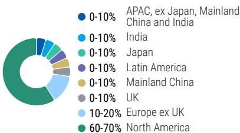

pie

| Region | Percentage (%) |
| :--- | :--- |
| APAC, ex Japan, Mainland China and India | 0-10 |
| India | 0-10 |
| Japan | 0-10 |
| Latin America | 0-10 |
| Mainland China | 0-10 |
| UK | 0-10 |
| Europe ex UK | 10-20 |
| North America | 60-70 |

Source: MS Estimate
View explanation of regional hierarchies here

# MS ALPHA MODELS

4/5 BEST

24 Month Horizon

3/5
MOST

3 Month Horizon

Source: Refinitiv, FactSet, MS; 1 is the highest favored Quintile and 5 is the least favored Quintile

# RISKS TO PT/RATING

# RISKS TO UPSIDE

- Faster than expected AWS rev growth and stable margin expansion   
- Faster than expected Retail rev growth, stable to expanding 1P Merch Margins   
- Greater than expected shipping and fulfillment leverage

# RISKS TO DOWNSIDE

• Investments step up and continue for longer than expected   
- Merch margins worse than expected   
- AWS revenue decelerates and /or margins decline

# OWNERSHIP POSITIONING

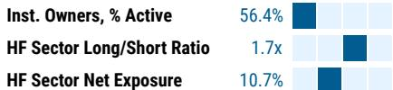

bar

| Category                  | Value  |
| ------------------------- | ------ |
| Inst. Owners, % Active    | 56.4%  |
| HF Sector Long/Short Ratio | 1.7x   |
| HF Sector Net Exposure    | 10.7%  |

Refinitiv; MSPB Content. Includes certain hedge fund exposures held with MSPB. Information may be inconsistent with or may not reflect broader market trends. Long/Short Ratio = Long Exposure / Short exposure. Sector % of Total Net Exposure = (For a particular sector: Long Exposure - Short Exposure) / (Across all sectors: Long Exposure – Short Exposure).

# MS ESTIMATES VS. CONSENSUS

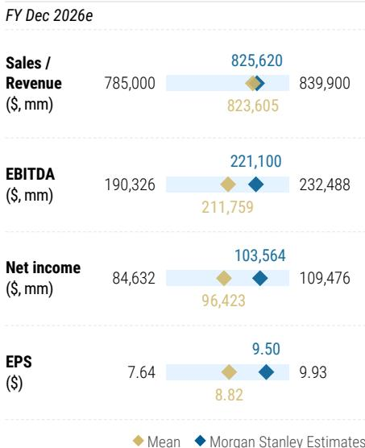

bar_line

FY Dec 2026e
| Metric | FY Dec 2026e (Mean) | FY Dec 2026e (MS Estimates) |
| :--- | :--- | :--- |
| Sales / Revenue ($, mm) | 785,000 | 825,620 |
| EBITDA ($, mm) | 190,326 | 221,100 |
| Net income ($, mm) | 84,632 | 103,564 |
| EPS ($) | 7.64 | 9.50 |
| Sales / Revenue ($, mm) / EBITDA ($, mm) | 823,605 | 839,900 |
| Net income ($, mm) / EPS ($) | 96,423 | 109,476 |
| EPS ($) / MS Estimates | 8.82 | 9.93 |

Source: Refinitiv, MS

# Risk Reward – Apple, Inc. (AAPL.O)

More Near-Term Cost Uncertainties Before a Catalyst-Laden 2H

# PRICE TARGET \$330.00

Our \$330 PT is based on 8.3x EV/Sales FY27 multiple, which is derived from a regression of tech and consumer platform peers. Our price target implies \~32x P/E on \$10.23 FY27 EPS.

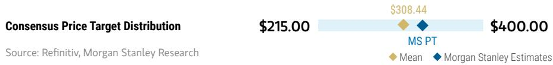

bar_line

| Category | Value     |
| -------- | --------- |
| MS PT    | $308.44   |
| MS Estimates | $400.00  |
| Mean     | $215.00   |

RISK REWARD CHART AND OPTIONS IMPLIED PROBABILITIES (12M)   
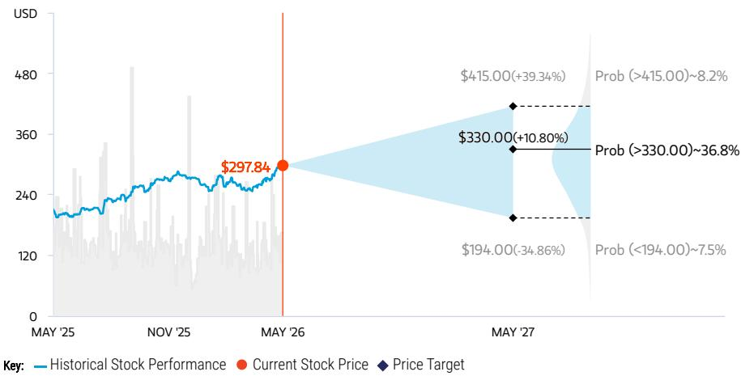

line

| Date     | Historical Stock Performance | Current Stock Price | Price Target Change |
| -------- | ----------------------------- | ------------------- | --------------------- |
| MAY '25  | ~240                          | -                   | -                     |
| NOV '25  | ~260                          | -                   | -                     |
| MAY '26  | $297.84                       | -                   | -                     |
| MAY '27  | $330.00                       | -                   | -                     |
| MAY '27  | $415.00                       | -                   | -                     |
| MAY '27  | $36.80                        | -                   | -                     |
| MAY '27  | $194.00                       | -                   | -                     |
| MAY '27  | $415.00                       | -                   | +39.34%               |
| MAY '27  | $330.00                       | -                   | +10.80%               |
| MAY '27  | $194.00                       | -                   | -7.5%                 |

Source: Refinitiv, MS, MS Institutional Equities Division. The probabilities of our Bull, Base, and Bear case scenarios playing out were estimated with implied volatility data from the options market as of 18 May 2026. All figures are approximate risk-neutral probabilities of the stock reaching beyond the scenario price in either three-months' or one-years' time. View explanation of Options Probabilities methodology here

# OVERWEIGHT THESIS

With the most elongated iPhone replacement cycles, new AI features rolling out around the world, and a renewed focus on device form factor changes, we believe Apple can accelerate iPhone growth starting in FY26, with replacement cycles peaking as aged installed base starts to upgrade. When combined with consistent, double digit services growth and moderate operating leverage, we believe Apple can earn \$8.89 in FY26 and \$10.23 by FY27. Memory cost dynamic could create uncertainties in the near term. Longer-term, investments in AI, payments, cloud, health, and home, and long runway to grow spend per user from \$1/day today are key arguments for sustained long-term growth and value creation.

Consensus Rating Distribution   
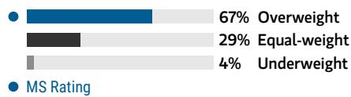

bar

| Category | Value (%) |
|---|---|
| Overweight | 67 |
| Equal-weight | 29 |
| Underweight | 4 |
MS Rating

Source: Refinitiv, MS

Risk Reward Themes 

<table><tr><td>Disruption:</td><td>Positive</td></tr><tr><td>New Data Era:</td><td>Positive</td></tr><tr><td>Pricing Power:</td><td>Positive</td></tr></table>

View descriptions of Risk Rewards Themes here

# BULL CASE

# \$415.00

10.9x EV/Sales FY27; 39.1x Bull FY27 P/E of \$10.60

iPhone replacement cycles accelerate in FY26/FY27 with Robotics as an long-term upside. Consumer demand returns, and stronger than expected iPhone 17 upgrade intentions + mix shift to higher end iPhones drives mid-teens Y/Y iPhone revenue growth, while rising component costs are mitigated given Apple's bargaining power against consumers and the supply chain. Our bull case valuation implies a 39.1x P/E multiple on FY27 Bull EPS, which embeds \$22 per share of upside from its Robotics efforts.

# BASE CASE

# \$330.00

8.3x EV/Sales FY27 or \~32x FY27 EPS of \$10.23

Services and margins remain resilient, while investors start to expect stronger iPhone cycles ahead. Revenue grows 14% Y/Y in FY27, driven by 10%+ Services growth and mid-teens % Products growth. GM may contract Y/Y in FY27 driven by higher Product revenue mix and memory costs, while Apple leverages the supply chain and repricing to mitigate the cost impact. The iPhone replacement cycle are peaking and create pent up demand for upgrades in FY27.

# BEAR CASE

# \$194.00

6.3x EV/Sales FY27; 24.6x FY27 Bear EPS of \$7.89

iPhone 17 cycle disappoints as consumer spending weakens more than expected amidst synthetic price increases. Growth slows further across the portfolio as discretionary income is pressured by hard landing, leading to just LSD of Product rev growth and decelerating Services rev growth in FY26. With revenue slightly growing but margin contracting, FY26 EPS will only grow MSD to \~\$7.36. Our bear case valuation implies a 24.6x FY27 P/E, below T5Y avg of 26.0x due to plateauing Services profit mix.

# Risk Reward – Apple, Inc. (AAPL.O)

KEY EARNINGS INPUTS 

<table><tr><td>Drivers</td><td>2025</td><td>2026e</td><td>2027e</td><td>2028e</td></tr><tr><td>Total Revenue Growth (Y/Y) (%)</td><td>6.4</td><td>16.6</td><td>14.1</td><td>5.5</td></tr><tr><td>iPhone Revenue Growth (Y/Y) (%)</td><td>4.2</td><td>23.6</td><td>18.6</td><td>3.9</td></tr><tr><td>Services Revenue Growth (Y/Y) (%)</td><td>13.5</td><td>14.0</td><td>11.6</td><td>10.2</td></tr><tr><td>Gross Margin (%)</td><td>46.9</td><td>48.0</td><td>47.6</td><td>47.9</td></tr><tr><td>EPS Growth (Y/Y) (%)</td><td>10.6</td><td>19.1</td><td>15.1</td><td>6.7</td></tr></table>

# INVESTMENT DRIVERS

- Positive iPhone build revisions / clearer signs of accelerating replacement cycles   
• Services revenue growth reacceleration   
- Apple Intelligence feature and distribution expansion   
- New product launches in home, health and AI

# GLOBAL REVENUE EXPOSURE

0-10% APAC, ex Japan, Mainland China and India   
0-10% India   
0-10% Japan   
0-10% Latin America   
0-10% MEA   
0-10% UK   
10-20% Europe ex UK   
10-20% Mainland China   
30-40% North America

Source: MS Estimate View explanation of regional hierarchies here

# MS ALPHA MODELS

3/5 BEST

24 Month Horizon

1/5 MOST

3 Month Horizon

Source: Refinitiv, FactSet, MS; 1 is the highest favored Quintile and 5 is the least favored Quintile

# RISKS TO PT/RATING

# RISKS TO UPSIDE

- iPhone 17 outperforms expectations   
- Apple Intelligence adoption surprises to the upside   
• Apple pulls forward form factor changes   
• Services growth re-accelerates despite tougher compares   
• Gross margins surprise positively

# RISKS TO DOWNSIDE

- Weak consumer spending limits iPhone upgrade rates   
• Higher memory input costs   
- Limited progress on AI features   
- Geopolitical tensions   
- Increased regulation, particularly with App Store

# OWNERSHIP POSITIONING

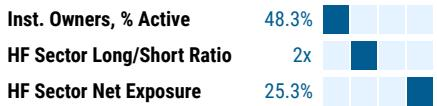

bar

| Category | Value |
| -------- | ----- |
| Inst. Owners, % Active | 48.3% |
| HF Sector Long/Short Ratio | 2x |
| HF Sector Net Exposure | 25.3% |

Refinitiv; MSPB Content. Includes certain hedge fund exposures held with MSPB. Information may be inconsistent with or may not reflect broader market trends. Long/Short Ratio = Long Exposure / Short exposure. Sector % of Total Net Exposure = (For a particular sector: Long Exposure - Short Exposure) / (Across all sectors: Long Exposure – Short Exposure).

# MS ESTIMATES VS. CONSENSUS

<table><tr><td colspan="3">FY Sep 2027e</td></tr><tr><td>Sales / Revenue ($, mm)</td><td>487,423</td><td>518,137</td></tr><tr><td>EBITDA ($, mm)</td><td>160,270</td><td>182,397</td></tr><tr><td>Net income ($, mm)</td><td>127,262</td><td>139,235</td></tr><tr><td>EPS ($)</td><td>8.81</td><td>9.67</td></tr></table>

Source: Refinitiv, MS

# Risk Reward – Meta Platforms Inc (META.O)

Top Pick

The Age of Efficiency

# PRICE TARGET \$775.00

Our price target is determined using a discounted cash flow/long-term EBITDA multiple. It implies a $\sim 23x$ '27 P/E Multiple. Our DCF uses an $\sim 8\%$ WACC and a $\sim 3\%$ terminal growth rate

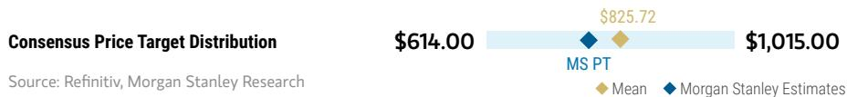

bar_line

| Category | Value     |
| -------- | --------- |
| Consensus Price Target Distribution | $614.00   |
| MS PT    | $825.72   |
| $1,015.00 | $1,015.00 |

RISK REWARD CHART AND OPTIONS IMPLIED PROBABILITIES (12M)   
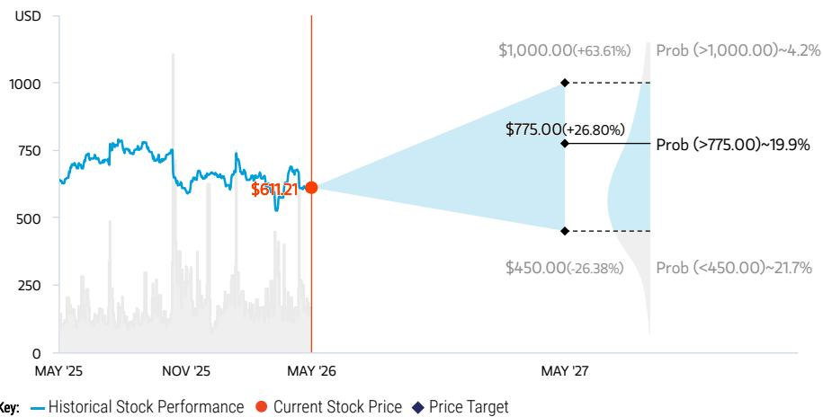  
Source: Refinitiv, MS, MS Institutional Equities Division. The probabilities of our Bull, Base, and Bear case scenarios playing out were estimated with implied volatility data from the options market as of 18 May 2026. All figures are approximate risk-neutral probabilities of the stock reaching beyond the scenario price in either three-months' or one-years' time. View explanation of Options Probabilities methodology here

# OVERWEIGHT THESIS

A Structural Pivot to Focus on Multi-Year Efficiency, Productivity and Leaner Operations... We think META's "year of efficiency" is more than just a 365 day change...but rather a structural and cultural pivot to operate leaner and with a greater focus on investor returns...even through investment.   
■ Importantly, Revenue and Engagement Trends Are Also Improving Across META's Platform... our industry and company conversations speak to progress driving incremental Reels engagement and monetization...and traction improving ad measurement/attribution in the post IDFA world.   
■ 3 Underappreciated "Call Options" including 1) further AI driven upside, 2) subscription adoption and 3) click-to-message.

Consensus Rating Distribution   
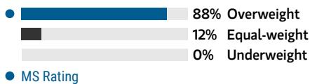

bar

| Category       | Value |
| -------------- | ----- |
| Overweight     | 88%   |
| Equal-weight   | 12%   |
| Underweight    | 0%    |

Source: Refinitiv, MS

# Risk Reward Themes

New Data Era: Positive
Self-help: Positive
Technology Diffusion: Positive

View descriptions of Risk Rewards Themes here

# BULL CASE

# \$1,000.00

# Implied \~28x '27 P/E

AI investments drive increased engagement and lead to new products/tools, which supports outsized ad monetization and revenue growth. Execution on newer offerings (like click to message) could also contribute to higher than expected growth. META could also drive further efficiency gains and be more successful in closing the Reels monetization gap. Reality Labs losses moderate and macro environment is better than expected.

# BASE CASE

# Implied \~23X base case '27 P/E

Ad revenue grows \~28% in '26 as META's AI investments drive incremental Reels engagement/monetization and support improved performance and ad measurement/attribution across the Family of Apps. We also see META continuing to focus on efficiency and improving productivity.

# \$775.00

# BEAR CASE

# \$450.00

# Implied \~14x '27 P/E

Declines in engagement and/or evidence of Reels monetization ramping more slowly than expected could lead to lower growth and greater uncertainty. We also watch for any macro uncertainty, regulation that limits META's ability to target ads, Reality Labs losses widen more materially than expected, and higher capital intensity from mis-execution around the data center build. Any additional opex and capex could weigh on operating income growth and FCF.

# Risk Reward – Meta Platforms Inc (META.O)

KEY EARNINGS INPUTS 

<table><tr><td>Drivers</td><td>2025</td><td>2026e</td><td>2027e</td><td>2028e</td></tr><tr><td>Constant Currency % Growth (%)</td><td>22.5</td><td>26.2</td><td>20.5</td><td>18.3</td></tr><tr><td>Operating income (GAAP) ($, mm)</td><td>83,276</td><td>92,944</td><td>104,243</td><td>108,640</td></tr><tr><td>Consolidated Total Daily Active Users (mm)</td><td>2,239.9</td><td>2,294.5</td><td>2,344.5</td><td>2,389.2</td></tr></table>

# INVESTMENT DRIVERS

\- We are positive on META's structural pivot towards efficiency and improving revenue, engagement and Reels. We continue to monitor META's progress on call options (AI, subscriptions, click-to-message) and further investment in AI/data centers.

# GLOBAL REVENUE EXPOSURE

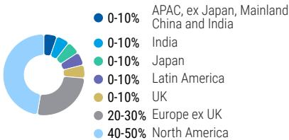

pie

| Region | Percentage (%) |
| :--- | :--- |
| APAC, ex Japan, Mainland China and India | 0-10 |
| India | 0-10 |
| Japan | 0-10 |
| Latin America | 0-10 |
| UK | 0-10 |
| Europe ex UK | 20-30 |
| North America | 40-50 |

Source: MS Estimate View explanation of regional hierarchies here

MS ALPHA MODELS 

<table><tr><td>3/5BEST</td><td>24 MonthHorizon</td><td>2/5MOST</td><td>3 MonthHorizon</td></tr></table>

Source: Refinitiv, FactSet, MS; 1 is the highest favored Quintile and 5 is the least favored Quintile

# RISKS TO PT/RATING

# RISKS TO UPSIDE

- Faster than expected Reels monetization & higher engagement growth   
- Increased benefit from AI investment   
• Revenue driven by subscriptions and/or click-to-message ads   
• Further efficiency improvements drive outsized FCF growth

# RISKS TO DOWNSIDE

• Macro pressures/weaker consumer spend  
• Regulation impacts ability to target ads   
• Reality labs losses widen further   
- Mis-execution risk could result in higher LT capital intensity

OWNERSHIP POSITIONING 

<table><tr><td>Inst. Owners, % Active</td><td>55.8%</td><td colspan="3"></td></tr><tr><td>HF Sector Long/Short Ratio</td><td>2.7x</td><td colspan="3"></td></tr><tr><td>HF Sector Net Exposure</td><td>12.9%</td><td colspan="3"></td></tr></table>

Refinitiv; MSPB Content. Includes certain hedge fund exposures held with MSPB. Information may be inconsistent with or may not reflect broader market trends. Long/Short Ratio = Long Exposure / Short exposure. Sector % of Total Net Exposure = (For a particular sector: Long Exposure - Short Exposure) / (Across all sectors: Long Exposure – Short Exposure).

MS ESTIMATES VS. CONSENSUS 

<table><tr><td colspan="3">FY Dec 2026e</td></tr><tr><td>Sales / Revenue ($, mm)</td><td>249,553</td><td>252,934</td></tr><tr><td></td><td></td><td>256,708</td></tr><tr><td></td><td></td><td>258,240</td></tr><tr><td>EBITDA ($, mm)</td><td>114,318</td><td>141,770</td></tr><tr><td></td><td></td><td>148,942</td></tr><tr><td></td><td></td><td>170,068</td></tr><tr><td>Net income ($, mm)</td><td>71,171</td><td>85,256</td></tr><tr><td></td><td></td><td>84,596</td></tr><tr><td></td><td></td><td>108,329</td></tr><tr><td>EPS ($)</td><td>27.28</td><td>32.83</td></tr><tr><td></td><td></td><td>32.91</td></tr></table>

Source: Refinitiv, MS

# Risk Reward – IBM (IBM.N)

Equal-Weight Rating Balances All-Time High Valuation With Quantum Optionality

# PRICE TARGET \$225.00

Our \$215 price target reflects a 13.6x P/FCF 2026 multiple of \$16.52 FCF/share, and implies IBM trades in-line with software and consulting peers on a growth adjusted basis.

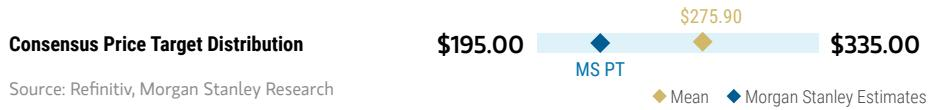

bar_line

| Category | Value    |
| -------- | -------- |
| Mean     | $195.00  |
| MS Estimates | $275.90  |
| Total    | $335.00  |

RISK REWARD CHART AND OPTIONS IMPLIED PROBABILITIES (12M)   
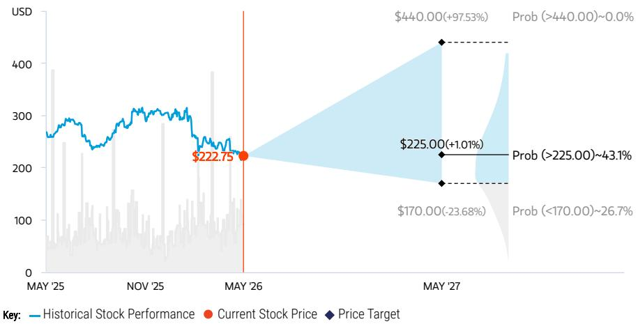

line

| Date     | Historical Stock Performance | Current Stock Price | Price Target |
| -------- | ----------------------------- | ------------------- | ------------ |
| MAY '26  | $222.75                       | $222.75             | -            |
| MAY '27  | $440.00 (approx)              | $225.00 (approx)    | -            |
| Prob (approx) ~$440.00 | -                             | -                   | +97.53%      |
| Prob (>440.00) ~$440.00 | -                           | -                   | +1.01%       |
| Prob (>225.00) ~$225.00 | -                         | -                   | -43.1%       |
| Prob (<170.00) ~$170.00 | -                         | -                   | -23.68%      |
| Prob (<170.00) ~$26.7% | -                         | -                   | -            |

Source: Refinitiv, MS, MS Institutional Equities Division. The probabilities of our Bull, Base, and Bear case scenarios playing out were estimated with implied volatility data from the options market as of 18 May 2026. All figures are approximate risk-neutral probabilities of the stock reaching beyond the scenario price in either three-months' or one-years' time. View explanation of Options Probabilities methodology here

# EQUAL-WEIGHT THESIS

IBM has gained credit for driving more consistent performance in recent years and shifting its portfolio to more recurring Software and Services. The acquisition of HashiCorp combined with a mainframe/ELA cycle is resulting in growth accelerating in 2025, but also creates risk of a deceleration in 2026. This risk, among others, is what supports our \$225 price target. Yet, the market is clearly also focused on Quantum, and given the re-rating we have seen from pure-play quantum stocks, IBM's early Quantum leadership has upside optionality. Balancing these facts is what drives our EW-rating, with mis-execution the key bear case risk.

Consensus Rating Distribution   
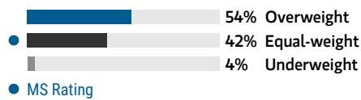

bar

| Category      | Value |
| ------------- | ----- |
| Overweight    | 54%   |
| Equal-weight  | 42%   |
| Underweight   | 4%    |

Source: Refinitiv, MS

# Risk Reward Themes

<table><tr><td>New Data Era:</td><td>Positive</td></tr><tr><td>Pricing Power:</td><td>Positive</td></tr><tr><td>Technology Diffusion:</td><td>Positive</td></tr></table>

View descriptions of Risk Rewards Themes here

# BULL CASE

# \$440.00

# 25.5x P/FCFe of CY26 \$17.29/share (ex-receivables)

IBM Quantum becomes more material to the model. General consensus is that IBM has a seat at the gen-AI and Quantum table, and customer wins/revenue outpaces expectations. IBM accelerates Consulting & Software growth, as competitive positioning improves on the core business. Additionally, quantum adds \$180B in Enterprise Value on top of our base case valuation, and as a result, shares re-rate to 25.5x P/FCFe 2026 on \$17.29/share.

# BASE CASE

# \$225.00

# 13.6x P/FCFe of CY26 \$16.52/share (ex-receivables)

Stable fundamentals drives 6% Y/Y revenue growth at CC and 7% Y/Y FCF growth in CY26. Consulting grows 2.5% Y/Y at CC due to green shoots in IT services and easy comps, Software grows 11.0% Y/Y at CC due to extended ELA cycle renewal in 2026, Infrastructure declines 1.6% Y/Y at CC. AI Consulting bookings gradually become additive to Consulting revenue growth. We forecast 6% Y/Y revenue growth at CC. We value IBM at 13.6x P/FCF 2026 of \$16.52/shr.

# BEAR CASE

# \$170.00

# 10.6x P/FCFe of CY26 \$16.02/share (ex-receivables)

Tough macro environment leads to budget cuts, and IBM FCF grows 4% Y/Y CC in CY26. RHT growth slows due to share loss, and acquisitions in Software fail to increase portfolio relevancy, driving core growth to decelerate faster than expected. ELA cycle in 2026 also fails to materialize. IT Services spend does not rebound due to mis-execution, causing Consulting revenue to decline. Spend on mainframe is significantly cut due to irrelevancy of new mainframe launch to enterprises.

# Risk Reward – IBM (IBM.N)

KEY EARNINGS INPUTS 

<table><tr><td>Drivers</td><td>2025</td><td>2026e</td><td>2027e</td><td>2028e</td></tr><tr><td>Constant Currency Revenue Growth (Y/Y) (%)</td><td>6.1</td><td>5.5</td><td>4.2</td><td>6.3</td></tr><tr><td>Software CC Revenue Growth (Y/Y) (%)</td><td>9.1</td><td>11.0</td><td>8.9</td><td>0.0</td></tr><tr><td>PTI Margins (Y/Y) (%)</td><td>18.823</td><td>19.470</td><td>20.021</td><td>0.000</td></tr><tr><td>FCF Growth (Y/Y) (%)</td><td>15.6</td><td>7.5</td><td>6.6</td><td>11.1</td></tr></table>

# INVESTMENT DRIVERS

• (+) Sustained/multi-year topline growth   
• (+) Strategic divestitures and/or acquisitions   
• (+) Positive FCF surprises   
- (-) Decelerating SW/Consulting growth below medium-term model   
• (-) Margins pressure earnings and FCF

# GLOBAL REVENUE EXPOSURE

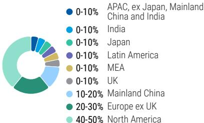

pie

| Region | Percentage (%) |
| :--- | :--- |
| APAC, ex Japan, Mainland China and India | 0-10 |
| India | 0-10 |
| Japan | 0-10 |
| Latin America | 0-10 |
| MEA | 0-10 |
| UK | 0-10 |
| Mainland China | 10-20 |
| Europe ex UK | 20-30 |
| North America | 40-50 |

Source: MS Estimate View explanation of regional hierarchies here

# MS ALPHA MODELS

3/5

BEST

24 Month

Horizon

3/5

MOST

3 Month

Horizon

Source: Refinitiv, FactSet, MS; 1 is the highest favored Quintile and 5 is the least favored Quintile

# RISKS TO PT/RATING

# RISKS TO UPSIDE

• Strength in Gen AI adds incremental growth to SW and Consulting   
- Consulting growth surprises positively   
• Incremental M&A accelerates growth   
- IBM upsides on FCF   
• Demonstrated commercial success in Quantum

# RISKS TO DOWNSIDE

• Macro disruption leads to deal elongation   
- Accelerated cannibalization of on-prem software   
• AI cannibalizes/disrupts core Consulting   
• Organic SW growth undergrows 7% target   
- Lack of M&A contribution

# OWNERSHIP POSITIONING

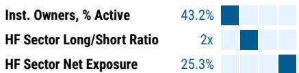

bar

| Category | Value |
| -------- | ----- |
| Inst. Owners, % Active | 43.2% |
| HF Sector Long/Short Ratio | 2x |
| HF Sector Net Exposure | 25.3% |

Refinitiv; MSPB Content. Includes certain hedge fund exposures held with MSPB. Information may be inconsistent with or may not reflect broader market trends. Long/Short Ratio = Long Exposure / Short exposure. Sector % of Total Net Exposure = (For a particular sector: Long Exposure - Short Exposure) / (Across all sectors: Long Exposure – Short Exposure).

# MS ESTIMATES VS. CONSENSUS

FY Dec 2026e

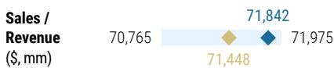

bar

| Sales / Revenue ($, mm) | Value   |
| ------------------------ | ------- |
| 70,765                   | 71,842  |
| 71,448                   | 71,975  |

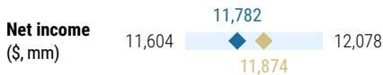

bar

| Category | Value  |
| -------- | ------ |
| Top Bar | 11,782 |
| Bottom Bar | 11,874 |
| Total   | 12,078 |

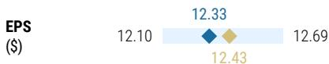  
◆ Mean ◆ MS Estimates   
Source: Refinitiv, MS

# Risk Reward – Intel Corporation (INTC.O)

EW as CPU roadmap and foundry strategy remain uncertain

# PRICE TARGET \$73.00

\~42x EPS CY2027 EPS of \$1.73, 42x is above the high end of the large cap logic semi peer group, reflecting high leverage potential on numbers that are still depressed, and foundry optionality, despite our longer term skepticism

Consensus Price Target Distribution

Source: Refinitiv, MS

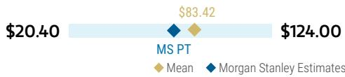

bar_line

| Category | Value   |
| -------- | ------- |
| MS PT    | $83.42  |
| Mean     | $20.40  |
| MS Estimates | $124.00 |

RISK REWARD CHART AND OPTIONS IMPLIED PROBABILITIES (12M)   
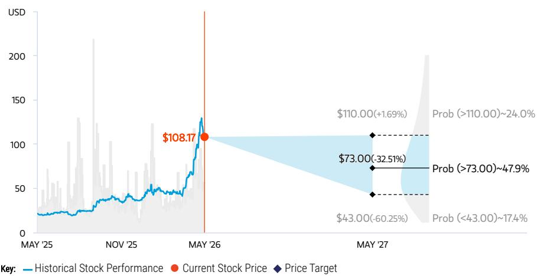

line

| Date       | Historical Stock Performance | Current Stock Price | Price Target |
| ---------- | ----------------------------- | ------------------- | ------------ |
| MAY '25    | ~20                           | -                   | -            |
| NOV '25    | ~40                           | -                   | -            |
| MAY '26    | $108.17                       | -                   | -            |
| MAY '27    | -                             | $110.00(+1.69%)   | $43.00(-60.25%) |
|        | -                             | $73.00(-32.51%)    | $43.00(-60.25%) |
|        | -                             | Prob (>110.00)~24.0% | -            |
|        | -                             | Prob (>73.00)~47.9% | -            |

Source: Refinitiv, MS, MS Institutional Equities Division. The probabilities of our Bull, Base, and Bear case scenarios playing out were estimated with implied volatility data from the options market as of 18 May 2026. All figures are approximate risk-neutral probabilities of the stock reaching beyond the scenario price in either three-months' or one-years' time. View explanation of Options Probabilities methodology here

# EQUAL-WEIGHT THESIS

Server market shortages are creating a strong near term environment for everyone in CPUs, but at these levels we need more confidence in an enduring market position. We are skeptical about Intel's ability to regain performance leadership in servers, and to generate high returns on foundry investments

Consensus Rating Distribution   
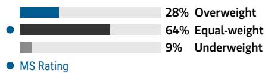

bar

| Category | Value (%) |
|---|---|
| Overweight | 28 |
| Equal-weight | 64 |
| Underweight | 9 |
| MS Rating | - |

Source: Refinitiv, MS

# Risk Reward Themes

New Data Era: Positive
Self-help: Positive

View descriptions of Risk Rewards Themes here

# BULL CASE

# \$110.00

# \~40x CY2027 EPS of \$2.75

# Intel clearly addresses issues with the pipeline and roadmap delivers competitive performance that stabilizes share

- Management executes on product roadmaps helping investor sentiment and the multiple   
- Revenues reach \$69bn in CY27, with 50% gross margins

# BASE CASE

# \~42x CY2027 EPS of \$1.73

# Server CPU shortages prove to be manageable beyond 12 months, and AMD continues to be in a share gain position.

Given Intel's historic roadmap issues in server; even the foundry successes could prove a distraction relative to the purer goal of making the world's best microprocessors. For us to turn more constructive we would need to see evidence that Intel can regain performance leadership in servers.

# \$73.00

# BEAR CASE

# \$43.00

# 40x bear case EPS of \$1.07

# Cycle turns in 2027 and Intel share losses continue. Data-centric revenue underwhelms due to lackluster product roadmap and foundry dissapoints.

- AMD continues to take share in consumer and cloud segments, with delays in the Intel product portfolio that create risk of erosion in the previously protected enterprise space   
- Multiple compresses as Intel is not able to secure meaningful foundry relationships

# Risk Reward – Intel Corporation (INTC.O)

KEY EARNINGS INPUTS 

<table><tr><td>Drivers</td><td>2025</td><td>2026e</td><td>2027e</td><td>2028e</td></tr><tr><td>GAAP Revenue ($, mm)</td><td>52,853</td><td>58,131</td><td>64,227</td><td>70,446</td></tr><tr><td>MW Gross Margin (%)</td><td>36.7</td><td>40.8</td><td>43.6</td><td>44.2</td></tr><tr><td>MW EPS ($)</td><td>(0.05)</td><td>0.67</td><td>1.42</td><td>1.75</td></tr><tr><td>Inventory ($, mm)</td><td>11,618</td><td>12,074</td><td>11,628</td><td>12,635</td></tr><tr><td>DOI</td><td>123.0</td><td>124.8</td><td>114.3</td><td>114.7</td></tr></table>

# INVESTMENT DRIVERS

• PC and server units and ASPs   
• AMD competition in server   
- End market growth in data centers, particularly the cloud, enterprise & government, and telco segments

# GLOBAL REVENUE EXPOSURE

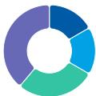

10-20% Europe ex UK   
10-20% North America   
20-30% Mainland China   
30-40% APAC, ex Japan, Mainland China and India

Source: MS Estimate View explanation of regional hierarchies here

MS ALPHA MODELS 

<table><tr><td>5/5BEST</td><td>24 MonthHorizon</td><td>5/5MOST</td><td>3 MonthHorizon</td></tr></table>

Source: Refinitiv, FactSet, MS; 1 is the highest favored Quintile and 5 is the least favored Quintile

# RISKS TO PT/RATING

# RISKS TO UPSIDE

- Foundry partnerships de-risk the story and further improve the multiple   
- The company regains lost share in desktop and server following CPU shortages

# RISKS TO DOWNSIDE

- AMD competition increasingly becomes more significant, which could lead to further share losses in processors and pressure on ASPs   
- Minimal success in foundry leads to an inflated cost structure

OWNERSHIP POSITIONING 

<table><tr><td>Inst. Owners, % Active</td><td>42%</td><td></td><td></td><td></td></tr><tr><td>HF Sector Long/Short Ratio</td><td>2x</td><td></td><td></td><td></td></tr><tr><td>HF Sector Net Exposure</td><td>25.3%</td><td></td><td></td><td></td></tr></table>

Refinitiv; MSPB Content. Includes certain hedge fund exposures held with MSPB. Information may be inconsistent with or may not reflect broader market trends. Long/Short Ratio = Long Exposure / Short exposure. Sector % of Total Net Exposure = (For a particular sector: Long Exposure - Short Exposure) / (Across all sectors: Long Exposure – Short Exposure).

MS ESTIMATES VS. CONSENSUS 

<table><tr><td colspan="3">FY Dec 2026e</td></tr><tr><td rowspan="2">Sales / Revenue ($, mm)</td><td rowspan="2">53,763</td><td>58,131</td></tr><tr><td>58,352</td></tr><tr><td rowspan="2">EBITDA ($, mm)</td><td rowspan="2">16,100</td><td>19,859</td></tr><tr><td>19,170</td></tr><tr><td rowspan="2">Net income ($, mm)</td><td rowspan="2">1,545</td><td>3,249</td></tr><tr><td>5,430</td></tr><tr><td rowspan="2">EPS ($)</td><td rowspan="2">0.55</td><td>1.12</td></tr><tr><td>1.07</td></tr></table>

Source: Refinitiv, MS

# Risk Reward – Intuit (INTU.O)

Top Pick

Durable EPS Grower Showing Macro Resiliency

# PRICE TARGET \$580.00

\~20x Base Case CY27e EPS of \$28.99, implying a PEG ratio of 1.3x, in-line with large cap software peers at 1.2x.

<table><tr><td>Consensus Price Target Distribution</td><td>$425.00</td><td>$597.29</td><td>$916.00</td></tr><tr><td></td><td></td><td>MS PT</td><td></td></tr><tr><td></td><td></td><td>Mean</td><td>MS Estimates</td></tr><tr><td colspan="4">Source: Refinitiv, MS</td></tr></table>

RISK REWARD CHART AND OPTIONS IMPLIED PROBABILITIES (12M)   
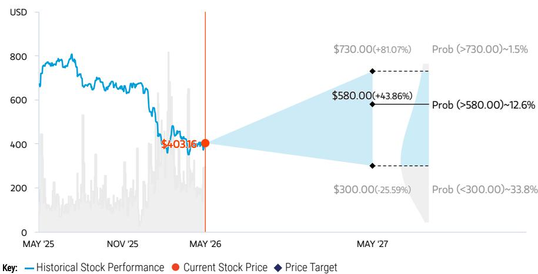

line

| Date     | Historical Stock Performance | Current Stock Price | Price Target |
| -------- | ----------------------------- | ------------------- | ------------ |
| MAY '25  | ~$800                         | -                   | -            |
| NOV '25  | ~$600                         | -                   | -            |
| MAY '26  | $403.16                       | $403.16             | -            |
| MAY '27  | -                             | $300.00              | $33.8%       |
| Prob (>730.00) | -                          | $580.00              | +12.6%       |
| Prob (<300.00) | -                          | -                   | -            |
| Prob (>580.00) | -                          | -                   | +12.6%       |
| Prob (>730.00) | -                          | -                   | +1.5%        |

Source: Refinitiv, MS, MS Institutional Equities Division. The probabilities of our Bull, Base, and Bear case scenarios playing out were estimated with implied volatility data from the options market as of 18 May 2026. All figures are approximate risk-neutral probabilities of the stock reaching beyond the scenario price in either three-months' or one-years' time. View explanation of Options Probabilities methodology here

# OVERWEIGHT THESIS

Intuit is in the early days of two compelling product cycles: 1) Mid-Market Accounting and 2) Assisted Tax. These product cycles combined with solid yields on efficiency initiatives drive durable high-teens EPS growth, putting Intuit in rarified air among large-cap software peers. Durable mid-teens revenue and high-teens EPS growth are not priced in with the stock trading well below historical PEG ratio of 1.8X and below large cap software average of 1.7x.

Consensus Rating Distribution   
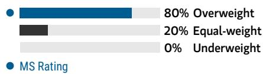

bar

| Category       | Value |
| -------------- | ----- |
| Overweight     | 80%   |
| Equal-weight   | 20%   |
| Underweight    | 0%    |
| MS Rating      | 0%    |

Source: Refinitiv, MS

# Risk Reward Themes

Secular Growth: Positive
Technology Diffusion: Positive

View descriptions of Risk Rewards Themes here

# BULL CASE

# \$730.00

\~24x Bull Case CY27e EPS of \$30.20

Monetizing the Platform.

Intuit is able to monetize the QBO platform as well as sustain rapid sub growth, resulting in Quickbooks Online growth of 22% through CY27. TurboTax grows 11% annually through CY27 by gaining share in the Assisted Category, alongside beneficial pricing trends. Total Revenue grows at a CAGR of \~15% while margins expand due to improved monetization, lifting CY27 EPS to \$30.20. Stock trades to \~20x CY27e EPS, or \~1.4x PEG.

# BASE CASE

# \$580.00

\~20x Base Case CY27e EPS of \$28.99

Focus on Higher Value Solutions Drives Faster Margin Expansion.

QBO add-ons and other high value solutions gain traction alongside new sub adds, bolstering Global Business Solutions Group Revenue to 16% growth through CY27. Consumer grows \~9% annually through CY27. Margins improve to 41.7% in CY27, resulting in EPS of \$28.99. Stock trades to \~20x CY27 EPS estimate, implying a PEG of \~1.3x, in-line with large cap software peers.

# BEAR CASE

# \$300.00

\~12x Bear Case CY27e EPS of \$25.20

Competition heats up and QBO falls short of expectations.

Online proves to be a more competitive market for both tax and small business resulting in price and market share pressure. Competition constrains pricing and units while investments in int'l expansion fail to pay off. Top-line growth of 11% embeds Consumer growth of 6% and SMB growth of 14% thru CY27. Margin expansion is constrained, resulting in CY27e EPS of \$25.20. The stock trades at 12x CY27e EPS.

# Risk Reward – Intuit (INTU.O)

KEY EARNINGS INPUTS 

<table><tr><td>Drivers</td><td>2025</td><td>2026e</td><td>2027e</td><td>2028e</td></tr><tr><td>Online Ecosystem Revenue YoY Growth (%)</td><td>24.8</td><td>23.0</td><td>22.3</td><td>22.2</td></tr><tr><td>Small Business Segment Revenue YoY Growth (%)</td><td>18.5</td><td>17.3</td><td>16.8</td><td>17.1</td></tr><tr><td>Operating Margin (%)</td><td>40.2</td><td>40.9</td><td>41.8</td><td>42.5</td></tr><tr><td>QBO Subscriber Growth (%)</td><td>5.7</td><td>5.3</td><td>3.9</td><td>4.0</td></tr></table>

# INVESTMENT DRIVERS

• Quarterly earnings   
- Pricing actions   
• Cross-selling of newer, higher value products   
• Penetration of International markets   
• FY Tax Season Results

# GLOBAL REVENUE EXPOSURE

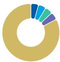

0-10% Europe ex UK   
0-10% India   
0-10% Latin America   
0-10% UK   
90-100% North America

Source: MS Estimate View explanation of regional hierarchies here

# MS ALPHA MODELS

2/5 BEST

24 Month Horizon

4/5 MOST

3 Month Horizon

Source: Refinitiv, FactSet, MS; 1 is the highest favored Quintile and 5 is the least favored Quintile

# RISKS TO PT/RATING

# RISKS TO UPSIDE

• Accelerating growth at TurboTax Live and Full Assist   
• Greater adoption of QBO Advanced and IES   
• Further efficiencies lead to greater margin expansion

# RISKS TO DOWNSIDE

- Competitive pressures intensify, leading to further share losses at TurboTax   
• QBO growth disappoints as adoption of Advanced slows   
- A slowing macro environment negatively impacts the more macro sensitive Credit Karma and Mailchimp businesses

# OWNERSHIP POSITIONING

Inst. Owners, % Active
HF Sector Long/Short Ratio
HF Sector Net Exposure

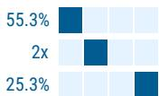

Refinitiv; MSPB Content. Includes certain hedge fund exposures held with MSPB. Information may be inconsistent with or may not reflect broader market trends. Long/Short Ratio = Long Exposure / Short exposure. Sector % of Total Net Exposure = (For a particular sector: Long Exposure - Short Exposure) / (Across all sectors: Long Exposure – Short Exposure).

# MS ESTIMATES VS. CONSENSUS

FY Jul 2026e

Sales / Revenue ( \$, mm )
21,092 21,202 21,913
21,233

EBITDA (\$, mm) 8,233 8,844 9,556
8,945

Net income (\$, mm) 6,426 6,519 6,722
6,510

EPS (\$) 23.10
23.02 24.06
23.21 MS Estimates

Source: Refinitiv, MS

# Risk Reward – Microsoft (MSFT.O)

Durability of Earnings Growth & AI Leadership Not Priced-In

# PRICE TARGET \$650.00

30x Base Case CY27e EPS of \$21.76. 30x PE is a slight premium to large cap software peers, 1.5x PEG is relatively in line with MSFT historical PEG while a premium to peers, justified by Microsoft's strong positioning and strong execution.

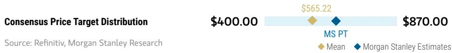

bar_line

| Consensus Price Target Distribution | Value    |
| ----------------------------------- | -------- |
| $400.00                             | $565.22  |
| $870.00                             |          |

RISK REWARD CHART AND OPTIONS IMPLIED PROBABILITIES (12M)   
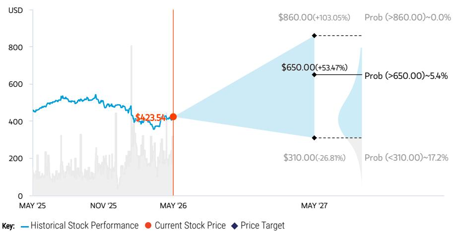

line

| Date     | Historical Stock Performance | Current Stock Price | Price Target |
| -------- | ----------------------------- | ------------------- | ------------ |
| MAY '25  | ~450                          | -                   | -            |
| NOV '25  | ~500                          | -                   | -            |
| MAY '26  | $423.54                       | $423.54             | -            |
| MAY '27  | -                             | $860.00(+103.05%)   | $650.00(+53.47%) |
| MAY '27  | -                             | $650.00~5.4%        | $310.00(-26.81%) |
| MAY '27  | -                             | Prob (<310.00)      | -            |

Source: Refinitiv, MS, MS Institutional Equities Division. The probabilities of our Bull, Base, and Bear case scenarios playing out were estimated with implied volatility data from the options market as of 18 May 2026. All figures are approximate risk-neutral probabilities of the stock reaching beyond the scenario price in either three-months' or one-years' time. View explanation of Options Probabilities methodology here

# OVERWEIGHT THESIS

■ Strong positioning for public cloud adoption & AI, large distribution channels and installed customer base, and expanding margins supports EPS growth. Weaker cyclical environment improves as cloud optimizations complete - LT trends remain durable.   
- Teens revenue growth, opex discipline and strong capital return lead to durable mid- to high-teens total return profile long term.
- At \~30x CY27e GAAP EPS, the durability of Microsoft's earnings growth and the company's premium return profile remains underpriced. Multiple expansion and positive estimate revisions will come from greater than expected strength in commercial businesses including Azure.

Consensus Rating Distribution   
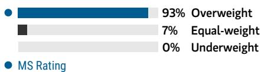

bar

| Category      | Value |
| ------------- | ----- |
| Overweight    | 93%   |
| Equal-weight  | 7%    |
| Underweight   | 0%    |

Source: Refinitiv, MS

# Risk Reward Themes

<table><tr><td>New Data Era:</td><td>Positive</td></tr><tr><td>Pricing Power:</td><td>Positive</td></tr><tr><td>Secular Growth:</td><td>Positive</td></tr></table>

View descriptions of Risk Rewards Themes here

# BULL CASE

# \$860.00

# BASE CASE

# \$650.00

# BEAR CASE

# \$310.00

# \~35x Bull Case CY27e EPS: \$24.42

Azure, O365 & Robust Contribution from AI Drive Top-Line Growth. Acceleration in Azure growth, adoption of higher priced M365 Commercial SKUs and continued seat growth, and robust adoption of Azure AI services and Microsoft AI Copilots across business lines drive mid-teens revenue CAGR in the coming years. Operating margins expand to \~49.3% by CY27 and CY27e EPS is \$24.42. \~35x PE represents a premium to large cap software peers, but roughly inline with Hist Avg PEG at \~1.4x given >20% EPS CAGR.

# \~30x Base Case CY27e EPS of \$21.76

Azure, M365 & Ramping Contribution from AI Drive Top-Line Growth. Durability of Azure growth, adoption of higher priced M365 Commercial SKUs and continued seat growth, and ramping adoption of Azure AI services & Microsoft AI Copilots across business lines drive low-teens rev CAGR ahead. Operating margins expand beyond \~47.3% by CY27 and CY27e EPS is \$21.76. 30x PE is a premium to large cap software peers, given strong positioning and execution. 1.5x PEG is inline with MSFT historical PEG.

# \~16x Bear Case CY27e EPS: \$19.70

Macro, Scale & Limited AI Adoption Drives Top-Line Growth Deceleration. Azure growth continues deceleration given scale, while M365 reaches penetration and adoption of Azure AI services & Microsoft AI Copilots across business lines remains limited. This drives low double-digit rev CAGR. Operating margins only expand to \~45.3% by CY27 from gross margin pressure and CY27e EPS is \$19.70. \~16x PE is a discount to large cap software peers and a discount on a PEG.

# Risk Reward – Microsoft (MSFT.O)

KEY EARNINGS INPUTS 

<table><tr><td>Drivers</td><td>2025</td><td>2026e</td><td>2027e</td><td>2028e</td></tr><tr><td>Azure Revenue Growth (%)</td><td>29.7</td><td>30.2</td><td>26.4</td><td>22.4</td></tr><tr><td>Server Products On-Prem Growth (%)</td><td>(2.0)</td><td>(1.0)</td><td>(1.0)</td><td>(1.0)</td></tr><tr><td>Gross Margins (%)</td><td>68.8</td><td>67.7</td><td>66.2</td><td>65.7</td></tr><tr><td>Operating Margins (%)</td><td>45.6</td><td>46.6</td><td>46.9</td><td>47.7</td></tr><tr><td>GAAP EPS Growth (%)</td><td>15.6</td><td>27.2</td><td>13.6</td><td>22.0</td></tr></table>

# INVESTMENT DRIVERS

- Sustainability of commercial growth, cloud momentum, improving cloud margins   
- Improving PC data points

# GLOBAL REVENUE EXPOSURE

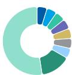

0-10% APAC, ex Japan, Mainland China and India   
0-10% India   
0-10% Japan   
0-10% Latin America   
0-10% MEA   
0-10% Mainland China   
0-10% UK   
10-20% Europe ex UK   
50-60% North America

Source: MS Estimate View explanation of regional hierarchies here

# MS ALPHA MODELS

3/5

BEST

24 Month

Horizon

2/5

MOST

3 Month

Horizon

Source: Refinitiv, FactSet, MS; 1 is the highest favored Quintile and 5 is the least favored Quintile

# RISKS TO PT/RATING

# RISKS TO UPSIDE

- Cloud adoption accelerates, with Azure as convincing winner   
- AI leadership results in substantial revenue contribution over-time   
- Operational efficiencies leading to greater than anticipated economies of scale and margin expansion

# RISKS TO DOWNSIDE

- Weak macro impacting IT spending   
- On-premises cannibalization by Cloud   
- Increased investments hurt margin expansion   
• AI adoption proves limited

# OWNERSHIP POSITIONING

Inst. Owners, % Active

HF Sector Long/Short Ratio

HF Sector Net Exposure

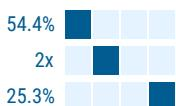

Refinitiv; MSPB Content. Includes certain hedge fund exposures held with MSPB. Information may be inconsistent with or may not reflect broader market trends. Long/Short Ratio = Long Exposure / Short exposure. Sector % of Total Net Exposure = (For a particular sector: Long Exposure - Short Exposure) / (Across all sectors: Long Exposure – Short Exposure).

# MS ESTIMATES VS. CONSENSUS

FY Jun 2026e

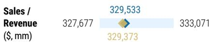

bar

| Sales / Revenue ($, mm) | Value     |
| ------------------------ | --------- |
|                 | 327,677   |
|                 | 329,533   |
|                 | 329,373   |
|                 | 333,071   |

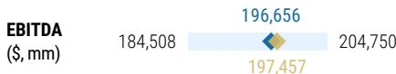

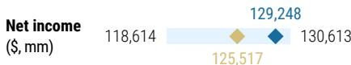

bar_line

| Category | Value   |
| -------- | ------- |
| Net income ($, mm) | 118,614 |
| 129,248  | 129,248 |
| 130,613  | 130,613 |
| 125,517  | 125,517 |

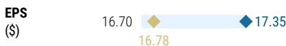

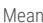

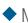

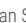

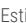

Source: Refinitiv, MS

# Risk Reward – NVIDIA Corp. (NVDA.O)

Top Pick

OW as large language model enthusiasm is transforming cloud capex

# PRICE TARGET \$285.00

\~22 our MW CY27 EPS estimate of \$12.99, in-line with large cap AI peer AVGO, in-line with the broader market and a discount to compute semis peers (AMD/AVGO/INTC) as high marketshare and gross margins leave create limited levers for multiple expansion in the near term.

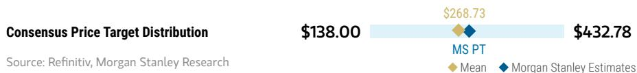

bar_line

| Category | Value    |
| -------- | -------- |
| MS PT    | $268.73  |
| Mean     | $138.00  |
| MS Estimates | $432.78 |

RISK REWARD CHART AND OPTIONS IMPLIED PROBABILITIES (12M)   
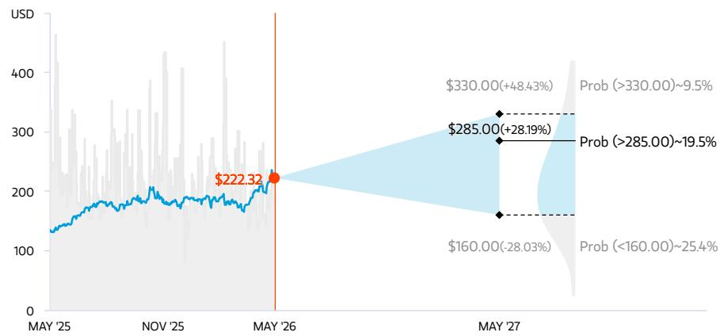

line

| Date    | Value    |
|---------|----------|
| MAY '26 | $222.32  |
| MAY '27 | $330.00  |
| MAY '27 | $285.00  |
| MAY '27 | $160.00  |

Key: — Historical Stock Performance ● Current Stock Price ◆ Price Target   
Source: Refinitiv, MS, MS Institutional Equities Division. The probabilities of our Bull, Base, and Bear case scenarios playing out were estimated with implied volatility data from the options market as of 18 May 2026. All figures are approximate risk-neutral probabilities of the stock reaching beyond the scenario price in either three-months' or one-years' time. View explanation of Options Probabilities methodology here

# OVERWEIGHT THESIS

■ Blackwell remains the premiere solution for gen-AI workloads, where compute demand continues to outstrip supply   
■ We see continued upward pressure to estimates as demand strength continues, with Rubin expected to maintain Nvidia's performance leadership position

Consensus Rating Distribution   
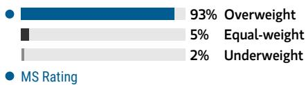

bar

| Category      | Value |
| ------------- | ----- |
| Overweight    | 93%   |
| Equal-weight  | 5%    |
| Underweight   | 2%    |

Source: Refinitiv, MS

Risk Reward Themes 

<table><tr><td>New Data Era:</td><td>Positive</td></tr><tr><td>Pricing Power:</td><td>Positive</td></tr><tr><td>Secular Growth:</td><td>Positive</td></tr></table>

View descriptions of Risk Rewards Themes here

# BULL CASE

# \$330.00

\~30x bull case MW CY27 EPS of \$11

Bull case has DC revenues continuing to grow through 2027. Upside from networking, GB300 based systems, networking, and software create potential for a full stack AI computing company worthy of an even greater valuation premium

- Higher margin data center and AI-focused software and services growth accelerates   
- GPU based AI PC gains traction, widely increasing the client TAM   
- Automotive opportunity takes off, allowing the company to earn recurring, per-car licensing revenue

# BASE CASE

\~22x our MW CY27 EPS of \$12.99

\~22x PE in-line with the broader market and a discount to compute semis peers (AMD/AVGO/INTC) as high marketshare and gross margins leave create limited levers for multiple expansion in the near term..

\- Revenue grows by 76.3% in 2026 and 54.4% in 2027

# \$285.00

# BEAR CASE

# \$160.00

\~18x bear case MW CY27 EPS of \$9

Two key debates both go the wrong direction, causing investors to question future prospects for growth

- Growth in DC slows substantially as supply catches up to demand faster than anticipated   
- AI development costs come down materially, a strong competitor enters the market to take market share, or customers begin insourcing custom hardware solutions   
- Greater than expected impact from tariff headwinds and export controls

# Risk Reward – NVIDIA Corp. (NVDA.O)

KEY EARNINGS INPUTS 

<table><tr><td>Drivers</td><td>2026</td><td>2027e</td><td>2028e</td><td>2029e</td></tr><tr><td>GAAP Revenue ($, mm)</td><td>215,938</td><td>380,591</td><td>587,450</td><td>781,342</td></tr><tr><td>MW Gross Margin (%)</td><td>71.3</td><td>74.5</td><td>72.7</td><td>72.3</td></tr><tr><td>MW EPS ($)</td><td>4.61</td><td>8.60</td><td>12.99</td><td>17.84</td></tr><tr><td>Inventory ($, mm)</td><td>21,403</td><td>36,899</td><td>52,985</td><td>65,640</td></tr><tr><td>DOI</td><td>123.3</td><td>136.3</td><td>118.7</td><td>68.5</td></tr></table>

# INVESTMENT DRIVERS

• Growth in AI capex from customers   
- Next gen GPUs continue to outpace the competition   
- Systems approach allows for higher monetization over time   
- New drivers emerge for Nvidia such as AI PCs, autonomous vehicles, robotics, and software

GLOBAL REVENUE EXPOSURE   
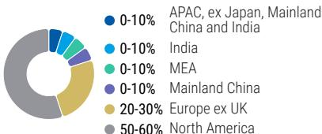

pie

| Region | Percentage (%) |
| :--- | :--- |
| APAC, ex Japan, Mainland China and India | 0-10 |
| India | 0-10 |
| MEA | 0-10 |
| Mainland China | 0-10 |
| Europe ex UK | 20-30 |
| North America | 50-60 |

Source: MS Estimate View explanation of regional hierarchies here

MS ALPHA MODELS 

<table><tr><td>5/5BEST</td><td>24 MonthHorizon</td><td>4/5MOST</td><td>3 MonthHorizon</td></tr></table>

Source: Refinitiv, FactSet, MS; 1 is the highest favored Quintile and 5 is the least favored Quintile

# RISKS TO PT/RATING

# RISKS TO UPSIDE

- Growth in training and inference propel data center revenue   
- Gaming sales accelerate as GPU based AI PCs gain traction   
• Nvidia can recapture lost revenue in China

# RISKS TO DOWNSIDE

- AI end markets don't materialize as expected, customers sharply reduce GPU purchases   
• AMD reemerges as a viable GPU competitor   
- Cloud customers outside of Google are able to develop competitive custom hardware

OWNERSHIP POSITIONING   
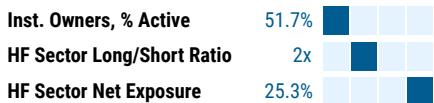

heatmap

| Category                     | Value   |
| ---------------------------- | ------- |
| Inst. Owners, % Active       | 51.7%   |
| HF Sector Long/Short Ratio   | 2x      |
| HF Sector Net Exposure        | 25.3%   |

Refinitiv; MSPB Content. Includes certain hedge fund exposures held with MSPB. Information may be inconsistent with or may not reflect broader market trends. Long/Short Ratio = Long Exposure / Short exposure. Sector % of Total Net Exposure = (For a particular sector: Long Exposure - Short Exposure) / (Across all sectors: Long Exposure – Short Exposure).

MS ESTIMATES VS. CONSENSUS   
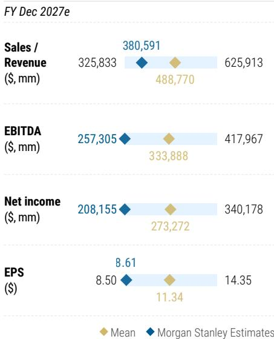

bar_line

FY Dec 2027e
| Metric | Mean ($) | MS Estimates ($) |
| :--- | :--- | :--- |
| Sales / Revenue ($, mm) | 325,833 | 380,591 |
| EBITDA ($, mm) | 257,305 | 417,967 |
| Net income ($, mm) | 208,155 | 340,178 |
| EPS ($) | 8.50 | 14.35 |
| Sales / Revenue (MM) | 488,770 | 625,913 |
| EBITDA (MM) | 333,888 | 417,967 |
| Net income (MM) | 273,272 | 340,178 |
| EPS ($) | 11.34 | 14.35 |
The chart displays a single data series representing the actual values of the sales/revenue and other financial metrics for fiscal year 2027e. Legend indicates 'Mean' (gold diamond) and 'MS Estimates' (blue diamond).

Source: Refinitiv, MS

# Risk Reward – Oracle Corporation (ORCL.N)

Big Opportunity, Little Room For Error

# PRICE TARGET \$207.00

Derived from \~25x FY28e base case NGAAP EPS of \$8.28. Our 25x multiple reflects a premium to ORCL's 5Y average (\~20x), given potential for accelerated earnings growth FY29/FY30.

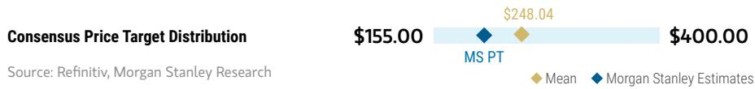

bar_line

| Category | Value    |
| -------- | -------- |
| Mean     | $155.00  |
| MS Estimates | $248.04  |
| Total    | $400.00  |

RISK REWARD CHART AND OPTIONS IMPLIED PROBABILITIES (12M)   
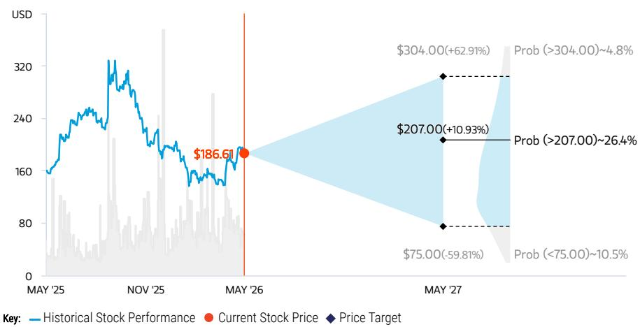

line

| Date       | Historical Stock Performance | Current Stock Price | Price Target |
| ---------- | ----------------------------- | ------------------- | ------------ |
| MAY '25    | ~160                          | -                   | -            |
| NOV '25    | ~240                          | -                   | -            |
| MAY '26    | $186.61                       | -                   | -            |
| MAY '27    | -                             | $207.00             | $75.00       |
| MAY '27    | -                             | $304.00             | $207.00      |
| MAY '27    | -                             | $304.00             | $26.4%       |
| MAY '27    | -                             | -                   | ~4.8%        |
| MAY '27    | -                             | -                   | ~10.5%       |

Source: Refinitiv, MS, MS Institutional Equities Division. The probabilities of our Bull, Base, and Bear case scenarios playing out were estimated with implied volatility data from the options market as of 18 May 2026. All figures are approximate risk-neutral probabilities of the stock reaching beyond the scenario price in either three-months' or one-years' time. View explanation of Options Probabilities methodology here

# EQUAL-WEIGHT THESIS

- Our assessment of the underlying drivers within Oracle's FY30 targets suggest a) acceleration is expected in other areas of the business (e.g. SaaS, core OCI) b) substantial operating leverage and c) favorable outcomes in financing its infrastructure build out.   
■ While robust RPO provides visibility towards achievement of \$225 billion of FY30 revenue, magnitude and duration of GPUaaS investment cycle remain highly uncertain, as do longer term economics -- particularly given mounting balance sheet obligations.   
■ Given the importance of execution across numerous vectors, we see a balanced risk reward on shares at current levels.

Consensus Rating Distribution   
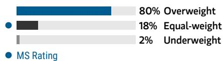

bar

| Category      | Value |
| ------------- | ----- |
| Overweight    | 80%   |
| Equal-weight  | 18%   |
| Underweight   | 2%    |

Source: Refinitiv, MS

# BULL CASE

# \$304.00

\~30x FY30e SOTP NGAAP EPS of \$11.97 (disc. back)

30x FY30 SOTP EPS of \~\$11.97, discounted back to FY28 at an 8.7% WACC. Our Bull Case FY30 EPS contemplates \~\$9.07 of core earnings power, and \~\$2.90 of EPS contribution from GPUaaS. On core earnings power, our FY30 EPS estimate assumes a) revenues of \~\$89 billion, NGAAP gross margins of 70.8%, and c) NGAAP operating margins of 54.7%. For GPUaaS, our \~\$2.90 EPS estimate assumes that GPUaaS revenue scales to \~\$110 billion by FY30, with associated NGAAP gross margins scaling to \~30%.

# BASE CASE

# \$207.00

\~25x FY28e Base Case NGAAP EPS of \$8.28
25x Base Case FY28 NGAAP EPS of \$8.28.

Our base case contemplates topline performance closer to Analyst Day targets (\~\$123.2 billion vs. \~\$130 billion target), though also reflects meaningful underperformance on EPS (vs. \$10.65 target). This is driven by estimated impact of incremental interest expense associated with debt issuance and lease obligations, partially offset by strong opex discipline (NGAAP opex % of FY28 revenue of 13.6%, vs. 24.2% in FY26e).

# BEAR CASE

# \$75.00

\~18x FY28e Core (ex-GPUaaS) GAAP EPS of \$4.16

18x FY28 Core GAAP earnings power (ex-GPUaaS) of \$4.16. Our bear case assumes Oracle below historical averages given lack of confidence towards accelerating EPS growth in the out years as GPUaaS opportunity falls meaningfully short of expectations. Our Bear Case EPS of \$4.16 reflects our FY28 core earnings power, burdened by a) SBC and intangible amortization and b) 50% of our estimated FY28 lease expenses (implying that Oracle would be able to exit \~50% of existing lease agreements).

# Risk Reward – Oracle Corporation (ORCL.N)

KEY EARNINGS INPUTS 

<table><tr><td>Drivers</td><td>2025</td><td>2026e</td><td>2027e</td><td>2028e</td></tr><tr><td>Cloud Services and License Support YoY Growth (%)</td><td>11.8</td><td>20.0</td><td>43.4</td><td>45.7</td></tr><tr><td>Total Revenue YoY Growth (%)</td><td>8.4</td><td>17.1</td><td>32.2</td><td>38.7</td></tr><tr><td>Operating Margin % (%)</td><td>43.6</td><td>42.5</td><td>42.9</td><td>38.5</td></tr><tr><td>Earnings Per Share YoY Growth (%)</td><td>8.4</td><td>20.8</td><td>7.1</td><td>6.2</td></tr></table>

# INVESTMENT DRIVERS

• Execution of GPUaaS build out   
• Additional share repurchases   
- Accretive acquisitions

GLOBAL REVENUE EXPOSURE   
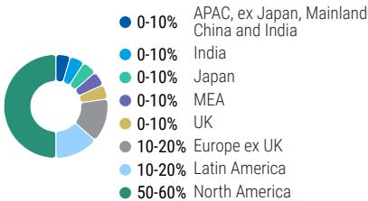

pie

| Region | Percentage (%) |
| :--- | :--- |
| APAC, ex Japan, Mainland China and India | 0-10 |
| India | 0-10 |
| Japan | 0-10 |
| MEA | 0-10 |
| UK | 0-10 |
| Europe ex UK | 10-20 |
| Latin America | 10-20 |
| North America | 50-60 |

Source: MS Estimate View explanation of regional hierarchies here

MS ALPHA MODELS 

<table><tr><td>4/5BEST</td><td>24 MonthHorizon</td><td>4/5MOST</td><td>3 MonthHorizon</td></tr></table>

Source: Refinitiv, FactSet, MS; 1 is the highest favored Quintile and 5 is the least favored Quintile

# RISKS TO PT/RATING

# RISKS TO UPSIDE

- Faster than expected OCI capacity ramps   
• Stronger than expected OCI gross margins   
- Accelerated adoption of Fusion Apps and Cloud Database across the installed base   
• Accelerated market share gains in non-AI Cloud

# RISKS TO DOWNSIDE

• Challenges in ramping OCI capacity   
- Weaker than expect OCI gross margins   
- GPUaaS capacity investments drive substantial leverage   
- Disruptive technologies in the data management market

OWNERSHIP POSITIONING   
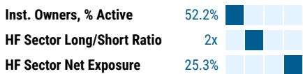

bar

| Category | Value |
| -------- | ----- |
| Inst. Owners, % Active | 52.2% |
| HF Sector Long/Short Ratio | 2x |
| HF Sector Net Exposure | 25.3% |

Refinitiv; MSPB Content. Includes certain hedge fund exposures held with MSPB. Information may be inconsistent with or may not reflect broader market trends. Long/Short Ratio = Long Exposure / Short exposure. Sector % of Total Net Exposure = (For a particular sector: Long Exposure - Short Exposure) / (Across all sectors: Long Exposure – Short Exposure).

MS ESTIMATES VS. CONSENSUS   
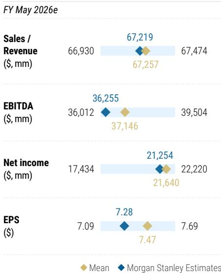

bar_line

FY May 2026e
| Metric | Mean ($) | MS Estimates ($) |
| :--- | :--- | :--- |
| Sales / Revenue ($, mm) | 66,930 | 67,219 |
| EBITDA ($, mm) | 36,012 | 36,255 |
| Net income ($, mm) | 17,434 | 21,254 |
| EPS ($) | 7.09 | 7.28 |
| FY May 2026e | 67,474 | 67,257 |
| FY May 2026e | 39,504 | 37,146 |
| FY May 2026e | 22,220 | 21,640 |
| FY May 2026e | 7.69 | 7.47 |

Source: Refinitiv, MS

# Risk Reward – Broadcom Inc. (AVGO.O)

Overweight on growth in AI, recovery in core semis, and potential VMW upside.

# PRICE TARGET \$470.00

We value AVGO at 27X CY2027e ModelWare EPS of \$17.39. This is roughly 24x non-GAAP EPS of \$19.54, and reflects a slight premium over AI peers that accounts for their outsized AI growth potential and long-term prospects in ASICs.

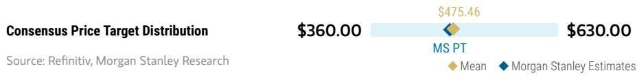

bar_line

| Category | Value     |
| -------- | --------- |
| MS PT    | $475.46   |
| MS Estimates | $630.00  |

RISK REWARD CHART AND OPTIONS IMPLIED PROBABILITIES (12M)   
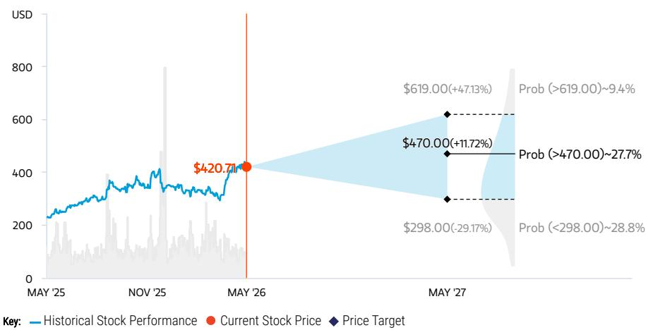

line

| Date     | Historical Stock Performance | Current Stock Price | Price Target |
| -------- | ----------------------------- | ------------------- | ------------ |
| MAY '25  | ~250                          | -                   | -            |
| NOV '25  | ~350                          | -                   | -            |
| MAY '26  | $420.71                       | -                   | -            |
| MAY '27  | $619.00(+47.13%)              | $470.00(+11.72%)    | $298.00(-29.17%) |
| Prob (>619.00)~9.4%   | -                             | -                   | -            |
| Prob (>470.00)~27.7%  | -                             | -                   | -            |
| Prob (<298.00)~28.8%  | -                             | -                   | -            |

Source: Refinitiv, MS, MS Institutional Equities Division. The probabilities of our Bull, Base, and Bear case scenarios playing out were estimated with implied volatility data from the options market as of 18 May 2026. All figures are approximate risk-neutral probabilities of the stock reaching beyond the scenario price in either three-months' or one-years' time. View explanation of Options Probabilities methodology here

# OVERWEIGHT THESIS

■ AVGO has the second largest AI exposure (in absolute dollars) in our coverage and is poised to grow as hyperscale capex increases. We see the company maintaining their premium multiple as networking and ASIC businesses continue to grow.   
We expect non-AI semis to have a cyclical rebound late next year after a period of high excess inventory in the networking and storage markets.   
■ We expect VMware to successfully integrate into the portfolio and focus operations, cut costs, and drive stable cash flows.

Consensus Rating Distribution   
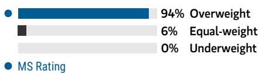

bar

| Category     | Value |
| ------------ | ----- |
| Overweight   | 94%   |
| Equal-weight | 6%    |
| Underweight  | 0%    |

Source: Refinitiv, MS

# Risk Reward Themes

New Data Era: Positive

Pricing Power: Positive

View descriptions of Risk Rewards Themes here

# BULL CASE

# \$619.00

# 31X 2027e ModelWare Bull EPS of \$19.96

Revenue growth surprises to the upside and AI revenues grow from ramp of new xPU customers, continued networking strength, and VMware synergies. The stock's valuation multiple expands as investors gain confidence in its AI and M&A strategy.

# BASE CASE

# 27X 2027e ModelWare Base EPS of \$17.39

Posts strong revenue growth in CY26 CY27 driven by strong AI revenues from xPU and Networking, and software growth.

# \$470.00

# BEAR CASE

# \$298.00

# 20X 2027e ModelWare Bear EPS of \$15.02

Revenue growth disappoints and synergies underwhelm. New customer engagements fail to reach production The stock's valuation multiple falls to 31X

# Risk Reward – Broadcom Inc. (AVGO.O)

KEY EARNINGS INPUTS 

<table><tr><td>Drivers</td><td>2025</td><td>2026e</td><td>2027e</td><td>2028e</td></tr><tr><td>GAAP Revenue ($, mm)</td><td>63,887</td><td>107,720</td><td>168,288</td><td>211,568</td></tr><tr><td>MW Gross Margin (%)</td><td>77.3</td><td>73.8</td><td>70.4</td><td>69.7</td></tr><tr><td>MW EPS ($)</td><td>5.39</td><td>9.90</td><td>15.99</td><td>20.57</td></tr><tr><td>Inventory ($, mm)</td><td>2,270</td><td>6,089</td><td>11,115</td><td>12,331</td></tr><tr><td>DOI</td><td>57.2</td><td>78.7</td><td>81.5</td><td>70.3</td></tr></table>

# INVESTMENT DRIVERS

- Dominant position in the data center with merchant silicon and ASICs   
- Increasing adoption of carrier aggregation, antenna filtering in RF and 5G adoption   
- Potential for better than expected accretion from the Symantec deal

# GLOBAL REVENUE EXPOSURE

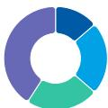

10-20% Europe ex UK   
20-30% Mainland China   
20-30% North America   
40-50% APAC, ex Japan, Mainland China and India

Source: MS Estimate View explanation of regional hierarchies here

MS ALPHA MODELS 

<table><tr><td>4/5BEST</td><td>24 MonthHorizon</td><td>4/5MOST</td><td>3 MonthHorizon</td></tr></table>

Source: Refinitiv, FactSet, MS; 1 is the highest favored Quintile and 5 is the least favored Quintile

# RISKS TO PT/RATING

# RISKS TO UPSIDE

• Stronger AI revenues   
- Faster recovery in core semis businesses   
• Realized VMware synergies

# RISKS TO DOWNSIDE

- Lose networking share to Nvidia (Mellanox)   
- ASIC chips are uncompetitive; lose customers to competitors   
• Execution on VMware acquisition

OWNERSHIP POSITIONING 

<table><tr><td>Inst. Owners, % Active</td><td>54.8%</td><td></td><td></td><td></td></tr><tr><td>HF Sector Long/Short Ratio</td><td>2x</td><td></td><td></td><td></td></tr><tr><td>HF Sector Net Exposure</td><td>25.3%</td><td></td><td></td><td></td></tr></table>

Refinitiv; MSPB Content. Includes certain hedge fund exposures held with MSPB. Information may be inconsistent with or may not reflect broader market trends. Long/Short Ratio = Long Exposure / Short exposure. Sector % of Total Net Exposure = (For a particular sector: Long Exposure - Short Exposure) / (Across all sectors: Long Exposure – Short Exposure).

MS ESTIMATES VS. CONSENSUS 

<table><tr><td colspan="3">FY Oct 2026e</td></tr><tr><td rowspan="2">Sales / Revenue ($, mm)</td><td rowspan="2">95,742</td><td>107,720</td></tr><tr><td>104,966</td></tr><tr><td rowspan="2">EBITDA ($, mm)</td><td rowspan="2">51,917</td><td>72,451</td></tr><tr><td>69,141</td></tr><tr><td rowspan="2">Net income ($, mm)</td><td rowspan="2">34,490</td><td>57,896</td></tr><tr><td>55,305</td></tr><tr><td rowspan="2">EPS ($)</td><td rowspan="2">9.20</td><td>11.69</td></tr><tr><td>11.33</td></tr></table>

Source: Refinitiv, MS

# Risk Reward – Cisco Systems Inc (CSCO.O)

Stock Can See Further Multiple Expansion from Cloud / Ent AI Investment Cycle

# PRICE TARGET \$120.00

25x CY27e EPS, upper end of historical trading range

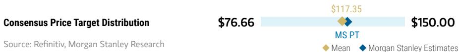

bar_line

| Category | Value     |
| -------- | --------- |
| MS PT    | $117.35   |
| Mean     | $150.00   |
| MS Estimates | (labeled as MS PT) |

RISK REWARD CHART AND OPTIONS IMPLIED PROBABILITIES (12M)   
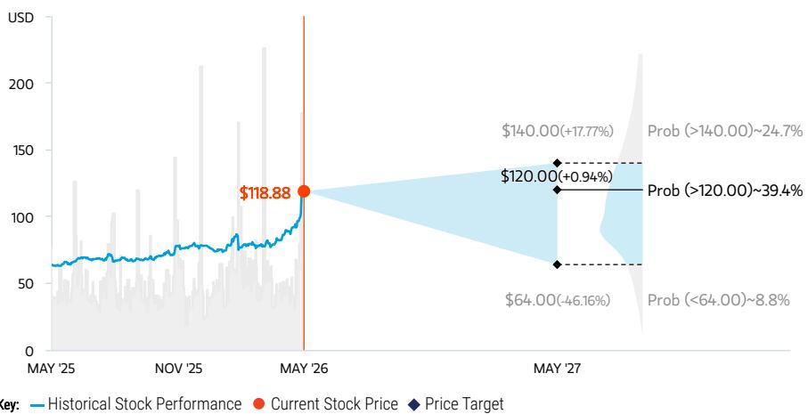

line

| Date       | Current Stock Price | Prob Change     |
| ---------- | ------------------- | ---------------- |
| MAY '25    | $118.88             | -                |
| MAY '26    | -                   | $140.00(+17.77%) |
| MAY '27    | -                   | $120.00(+0.94%) |
| MAY '27    | -                   | $64.00(-46.16%) |
| MAY '27    | -                   | Prob (<64.00)~8.8% |

Source: Refinitiv, MS, MS Institutional Equities Division. The probabilities of our Bull, Base, and Bear case scenarios playing out were estimated with implied volatility data from the options market as of 18 May 2026. All figures are approximate risk-neutral probabilities of the stock reaching beyond the scenario price in either three-months' or one-years' time. View explanation of Options Probabilities methodology here

# OVERWEIGHT THESIS

■ Networking has positive market growth dynamics, like the Cat 9K refresh, which helps offset headwinds from share losses.   
■ Splunk acquisition offers meaningful opportunities for bull case eventually, but minimal expectations for the near term.   
■ Cloud AI business could help multiple if contribute meaningfully to growth.

Consensus Rating Distribution   
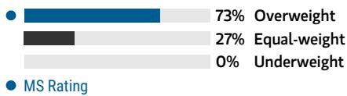

bar

| Category | Value (%) |
|---|---|
| Overweight | 73 |
| Equal-weight | 27 |
| Underweight | 0 |
MS Rating

Source: Refinitiv, MS

# Risk Reward Themes

New Data Era: Positive

View descriptions of Risk Rewards Themes here

# BULL CASE

# \$140.00

# 28x CY27 bull case EPS (\$5)

Becomes a more material participant in AI; enterprise investment cycle allows for acceleration to continue. 10%+ of company growth from AI, able to benefit in outsized way from capacity, able to participate in multi-year investment cycle on the enterprise business, no material pullforward. Trades more in-line with AI names vs. traditional range.

# BASE CASE

# 25x CY27e EPS (\$4.70)

AI cycle help company sustain HSD growth for multiple years. AI business continues to gain share, enterprise business sees some benefit from AI investment, but pullforward in 1H limits upside to FY27. Trades at a premium to long term range given AI gains.

# \$120.00

# BEAR CASE

# \$64.00

# 16x CY27 bear case EPS (\$4)

Trades more in line with historical averages as pullforward offsets AI share gains.

Enterprise faces headwinds in FY27 from macro headwinds, offsetting gains on the AI side, growth slows to MSD. Valuation falls to historical averages given margin headwinds.

# Risk Reward – Cisco Systems Inc (CSCO.O)

KEY EARNINGS INPUTS 

<table><tr><td>Drivers</td><td>2025</td><td>2026e</td><td>2027e</td><td>2028e</td></tr><tr><td>Revenue Growth Y/Y (%)</td><td>5.3</td><td>11.0</td><td>8.1</td><td>4.0</td></tr><tr><td>Operating Margin (%)</td><td>34.4</td><td>34.5</td><td>34.6</td><td>35.0</td></tr><tr><td>EPS Growth Y/Y (%)</td><td>1.9</td><td>12.5</td><td>9.5</td><td>5.8</td></tr><tr><td>FCF Growth Y/Y (%)</td><td>30.1</td><td>6.3</td><td>4.3</td><td>26.3</td></tr></table>

# INVESTMENT DRIVERS

- Can CSCO successfully transition to a software and services oriented business?   
- Does the move to the cloud adversely impact CSCO's traditional enterprise market?   
- Can it achieve incremental margin improvement as business turns more software & services?

# GLOBAL REVENUE EXPOSURE

0-10% APAC, ex Japan, Mainland China and India   
0-10% India   
0-10% Japan   
0-10% Latin America   
0-10% MEA   
0-10% Mainland China   
10-20% Europe ex UK   
10-20% UK   
50-60% North America

Source: MS Estimate View explanation of regional hierarchies here

# MS ALPHA MODELS

4/5

BEST

24 Month

Horizon

5/5

MOST

3 Month

Horizon

Source: Refinitiv, FactSet, MS; 1 is the highest favored Quintile and 5 is the least favored Quintile

# RISKS TO PT/RATING

# RISKS TO UPSIDE

• Security portfolio reaccelerates.   
- Recurring portion of business causes more meaningful mix shift.   
- Cat 9K refresh contributes meaningfully to growth.   
- Hyperscale wins.   
• AI capex continues to be revised up.

# RISKS TO DOWNSIDE

• Prolonged macro slowdown.   
- Share losses accelerate.   
- Difficulty seeing continued operating leverage.   
- Splunk integration challenges.   
- Meaningful pullforward into FY26.

# OWNERSHIP POSITIONING

Inst. Owners, % Active

HF Sector Long/Short Ratio

HF Sector Net Exposure

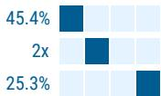

Refinitiv; MSPB Content. Includes certain hedge fund exposures held with MSPB. Information may be inconsistent with or may not reflect broader market trends. Long/Short Ratio = Long Exposure / Short exposure. Sector % of Total Net Exposure = (For a particular sector: Long Exposure - Short Exposure) / (Across all sectors: Long Exposure – Short Exposure).

# MS ESTIMATES VS. CONSENSUS

FY Jul 2026e

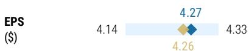

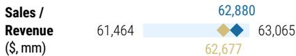

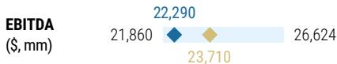

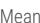

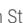

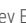

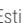

Source: Refinitiv, MS

# Risk Reward – Dell Technologies Inc. (DELL.N)

Underweight As Margin Pressure Offsets AI Momentum

# PRICE TARGET \$110.00

Our \$110 PT is based on a 10x P/E multiple on FY27 (CY26) EPS of \$10.97. This implies a 16.5x multiple on DELL's AI server business & 9x multiple on DELL's traditional HW business.

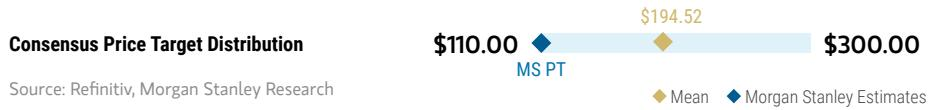

bar_line

| Category | Value    |
| -------- | -------- |
| Mean     | $110.00  |
| MS Estimates | $194.52  |
| Total    | $300.00  |

RISK REWARD CHART AND OPTIONS IMPLIED PROBABILITIES (12M)   
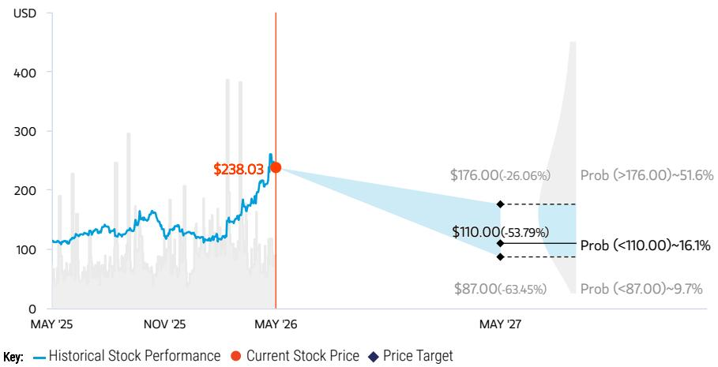

line

| Date       | Historical Stock Performance | Current Stock Price | Price Target |
| ---------- | ----------------------------- | ------------------- | ------------ |
| MAY '25    | ~100                          | -                   | -            |
| NOV '25    | ~150                          | -                   | -            |
| MAY '26    | $238.03                       | -                   | -            |
| MAY '27    | $176.00 (-26.06%)           | $110.00 (-53.79%)   | $87.00 (-63.45%) |
| MAY '27    | Prob (>176.00)                | Prob (<110.00)      | Prob (<87.00)  |

Source: Refinitiv, MS, MS Institutional Equities Division. The probabilities of our Bull, Base, and Bear case scenarios playing out were estimated with implied volatility data from the options market as of 18 May 2026. All figures are approximate risk-neutral probabilities of the stock reaching beyond the scenario price in either three-months' or one-years' time. View explanation of Options Probabilities methodology here

# UNDERWEIGHT THESIS

DELL is a full stack technology provider managing more data than any other IT provider, which positions the company well to capitalize on the 'Data Era'. Despite the challenging Hardware spending environment, we see a long runway for growth as DELL capitalizes on rapidly accelerating AI Server demand. However, in the near-term, we believe margin pressure from a stronger AI server mix coupled with memory cost inflation will limit multiple expansion and positive estimate revisions from here.

Consensus Rating Distribution   
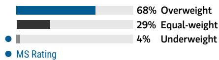

bar

| Category      | Value |
| ------------- | ----- |
| Overweight    | 68%   |
| Equal-weight  | 29%   |
| Underweight   | 4%    |

Source: Refinitiv, MS

Risk Reward Themes 

<table><tr><td>Contrarian:</td><td>Negative</td></tr><tr><td>New Data Era:</td><td>Positive</td></tr><tr><td>Self-help:</td><td>Positive</td></tr></table>

View descriptions of Risk Rewards Themes here

# BULL CASE

# \$176.00

# 13x FY27 bull case EPS of \$13.50

Demand exceeds expectations in FY27. PC and enterprise infrastructure demand rebounds quicker than expected, driven by a better macro & prolonged Win 11 refresh activity. DELL gains share across PCs, servers, & storage. CSG grows LSD-MSD Y/Y in FY27 as DELL gains gains share. ISG grows 50%+ in FY27 driven by demand for AI servers, greater compute needs & software defined storage, with revenue exceeding the COVID period. Cap returns accelerate.

# BASE CASE

# 10x FY27 base case EPS of \$10.97

Strong demand for AI Servers, PC market refresh, and accelerating shareholder returns unlocks value.

CSG revenue inflects to 3% Y/Y declines in FY27, a function of mid-teens Y/Y unit declines, partially offset by mid-teens Y/Y ASP growth as higher prices from memory inflation weigh on demand. Traditional infrastructure growth also decelerates Y/Y, to +1% Y/Y on demand challenges and tough comps Y/Y. On the other hand, AI server demand continues to accelerate, growing 100%+ Y/Y in FY27.

# \$110.00

# BEAR CASE

# \$87.00

# 9x FY27 bear case EPS of \$9.65

Demand deteriorates meaningfully and DELL is unable to mitigate margin pressure. DELL tried to raise prices to offset component cost inflation, and as a result demand deteriorates meaningfully. DELL is only able to mitigate \~25% of the headwind from higher memory costs vs. \~70% in our base case. Furthermore, broader macro uncertainty drives a slowdown in AI capex spend. Revenue declines LSD Y/Y and EPS declines MSD Y/Y in FY27. Stock trades to 9x P/E.

# Risk Reward – Dell Technologies Inc. (DELL.N)

KEY EARNINGS INPUTS 

<table><tr><td>Drivers</td><td>2026</td><td>2027e</td><td>2028e</td><td>2029e</td></tr><tr><td>Revenue Growth (Y/Y) (%)</td><td>18.8</td><td>21.8</td><td>8.5</td><td>6.4</td></tr><tr><td>Non-GAAP Gross Margin (%)</td><td>20.4</td><td>16.9</td><td>16.1</td><td>16.4</td></tr><tr><td>Non-GAAP Operating Margin (%)</td><td>8.8</td><td>7.4</td><td>7.0</td><td>7.2</td></tr><tr><td>FCF ($M) ($, mm)</td><td>8,552</td><td>6,998</td><td>8,090</td><td>8,453</td></tr></table>

# INVESTMENT DRIVERS

• AI Server wins/backlog growth   
• PC's inflect to growth   
• Capital return commitment exceeds expectations   
- Continued share gains in Servers, Storage and PCs   
- Mix shift to storage benefits gross margin

# GLOBAL REVENUE EXPOSURE

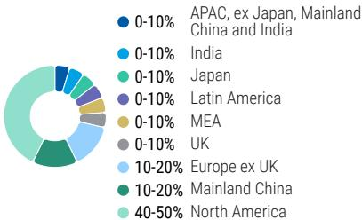

pie

| Region | Percentage (%) |
| :--- | :--- |
| APAC, ex Japan, Mainland China and India | 0-10 |
| India | 0-10 |
| Japan | 0-10 |
| Latin America | 0-10 |
| MEA | 0-10 |
| UK | 0-10 |
| Europe ex UK | 10-20 |
| Mainland China | 10-20 |
| North America | 40-50 |

Source: MS Estimate View explanation of regional hierarchies here

# MS ALPHA MODELS

2/5 BEST

24 Month Horizon

1/5
MOST

3 Month Horizon

Source: Refinitiv, FactSet, MS; 1 is the highest favored Quintile and 5 is the least favored Quintile

# RISKS TO PT/RATING

# RISKS TO UPSIDE

• ISG accelerates due to pent up refresh demand & datacenter modernization   
- Commercial PC refresh ahead of Win 10 EOL in Oct '25   
• AI Server demand drives Server ASPs materially higher

# RISKS TO DOWNSIDE

- The hardware downcycle elongates as recession constrains spending through 2025 and into 2026   
- PC share losses   
• Al capex slows materially   
- Enterprise IT demand cannibalized by cloud workload migration

# OWNERSHIP POSITIONING

bar

| Category | Value |
| -------- | ----- |
| Inst. Owners, % Active | 51.3% |
| HF Sector Long/Short Ratio | 2x |
| HF Sector Net Exposure | 25.3% |

Refinitiv; MSPB Content. Includes certain hedge fund exposures held with MSPB. Information may be inconsistent with or may not reflect broader market trends. Long/Short Ratio = Long Exposure / Short exposure. Sector % of Total Net Exposure = (For a particular sector: Long Exposure - Short Exposure) / (Across all sectors: Long Exposure – Short Exposure)

# MS ESTIMATES VS. CONSENSUS

FY Jan 2028e

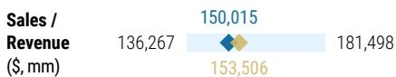

bar

| Sales / Revenue ($, mm) | Value     |
| ------------------------ | --------- |
| 136,267                  | 150,015   |
| 153,506                  | 153,506   |

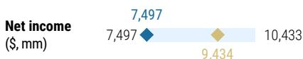

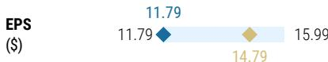  
◆ Mean ◆ MS Estimates   
Source: Refinitiv, MS

# Risk Reward – Salesforce, Inc. (CRM.N)

Underappreciated Topline Durability, More Room for Margin Expansion

# PRICE TARGET \$287.00

Based on a 14x multiple applied to our FY28e FCF per share of \~\$18, discounted back at \~10%, adding back \~\$29 net cash per share.

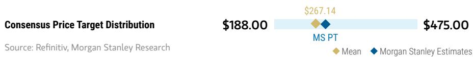

bar_line

Consensus Price Target Distribution
| Category | Value ($) |
|---|---|
| MS PT (Mean) | 267.14 |
| MS PT (MS Estimates) | 475.00 |
Source: Refinitiv, MS

RISK REWARD CHART AND OPTIONS IMPLIED PROBABILITIES (12M)   
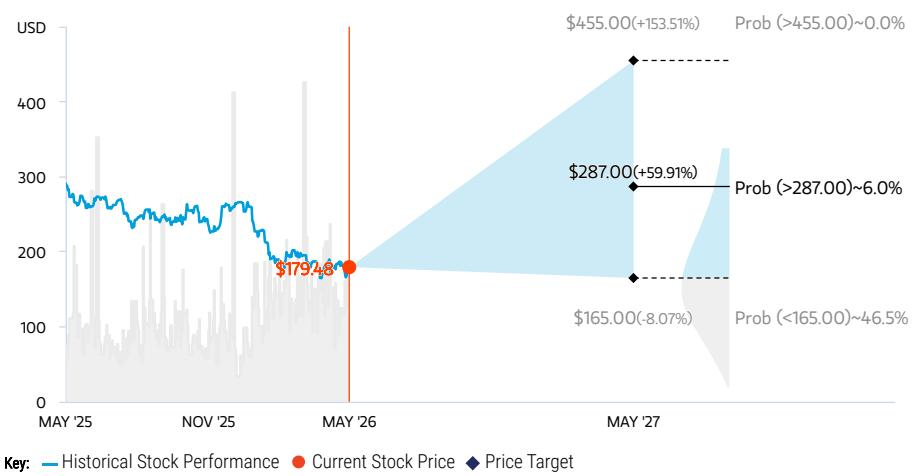

line

| Date     | Historical Stock Performance | Current Stock Price | Price Target |
| -------- | ----------------------------- | ------------------- | ------------ |
| MAY '25  | ~$280.00                      | -                   | -            |
| NOV '25  | ~$260.00                      | -                   | -            |
| MAY '26  | $179.48                       | $179.48             | -            |
| MAY '27  | $455.00 (approx)               | $287.00 (approx)    | $455.00      |
| MAY '27  | $455.00 (-0.0%)                | $287.00 (-6.0%)    | $287.00      |
| MAY '27  | $165.00 (-8.07%)               | -                   | -            |
| MAY '27  | $165.00 (-46.5%)               | -                   | -            |

Source: Refinitiv, MS, MS Institutional Equities Division. The probabilities of our Bull, Base, and Bear case scenarios playing out were estimated with implied volatility data from the options market as of 18 May 2026. All figures are approximate risk-neutral probabilities of the stock reaching beyond the scenario price in either three-months' or one-years' time. View explanation of Options Probabilities methodology here

# OVERWEIGHT THESIS

■ Salesforce remains one of the best secularly positioned names within Software, as the global incumbent for front-office applications and a platform squarely addressing many of enterprises' top digital transformation needs.

■ Low investor expectations vs potential topline upside drivers in price increases, product bundling and Data Cloud adoption frame an attractive risk/reward. The ramp in GenAI apps may still be >12 months away; however, Data Cloud likely proves a bridge to better growth.   
■ Shares continue to trade at a discount to large cap Software peers on a GAAP PEG basis, a gap we expect to narrow as Salesforce continues to display above consensus top & bottom line growth.

Consensus Rating Distribution   
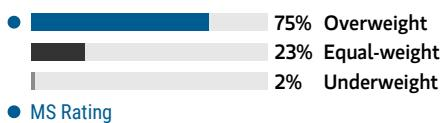

bar

| Category | Value (%) |
|---|---|
| Overweight | 75 |
| Equal-weight | 23 |
| Underweight | 2 |
MS Rating

Source: Refinitiv, MS

# Risk Reward Themes

<table><tr><td>New Data Era:</td><td>Positive</td></tr><tr><td>Pricing Power:</td><td>Positive</td></tr><tr><td>Secular Growth:</td><td>Positive</td></tr></table>

View descriptions of Risk Rewards Themes here

# BULL CASE

# \$455.00

# 18x FY28e FCF of \~\$23B

\~15% FY25-28 revenue CAGR, on the back of strong customer growth and additions, rapid adoption of Agentforce and Data Cloud, and improved renewal rates as CRM becomes more of a strategic tech provider for customers. A larger base of high margin renewal business drives op. margins to \~39% by FY28. A \~20%+ FCF growth CAGR supports CRM's multiple at 18x EV/FCF in FY28, yielding a forward twelve month \$455 valuation, assuming a \~10% discount rate.

# BASE CASE

# 14x FY28e FCF of \~\$18B

Sustainable teens revenue CAGR, benefited by recent M&A. Seat counts expand in Sales & Service Clouds, while Platform & Data Clouds become material. Revenue grows at a \~10% CAGR from FY25-28 & FCF benefits as op margins grow to \~35% by FY28. We value shares at 14x EV/FCF in FY28 discounted at a \~10% WACC. Our PT implies 14x CY27 FCF, a discount to the large-cap software average.

# \$287.00

# BEAR CASE

# \$165.00

# 10x FY28e FCF of \~\$15B

Prolonged macro downturn drives high single digit revenue growth. A tepid spending environment amid macro weakness and increasing attrition pressures topline growth well-below pre-Covid levels over the next 3 years. Incremental investments limit margin expansion potential despite increasing opex discipline, limiting the ability to achieve >34% op. margins by FY28. CRM trades at 10x EV/FCF in FY28, yielding a forward twelve month \$165 valuation, assuming a \~10% discount rate.

# Risk Reward – Salesforce, Inc. (CRM.N)

KEY EARNINGS INPUTS 

<table><tr><td>Drivers</td><td>2025</td><td>2026e</td><td>2027e</td><td>2028e</td></tr><tr><td>Total Billings YoY Growth (%)</td><td>8.6</td><td>13.8</td><td>8.3</td><td>0.0</td></tr><tr><td>Current Remaining Performance Obligations YoY (%)</td><td>9.4</td><td>16.2</td><td>11.6</td><td>0.0</td></tr><tr><td>Current RPO-Base Bookings YoY (%)</td><td>7.0</td><td>14.6</td><td>8.2</td><td>0.0</td></tr><tr><td>Operating Margin % (%)</td><td>33.0</td><td>34.1</td><td>34.3</td><td>35.0</td></tr></table>

# INVESTMENT DRIVERS

• Organic revenue growth sustains near high-teens CAGR   
• Balanced revenue growth and margin framework following recent M&A

# GLOBAL REVENUE EXPOSURE

<table><tr><td rowspan="8"></td><td>0-10%</td><td>APAC, ex Japan, Mainland China and India</td></tr><tr><td>0-10%</td><td>Europe ex UK</td></tr><tr><td>0-10%</td><td>India</td></tr><tr><td>0-10%</td><td>Japan</td></tr><tr><td>0-10%</td><td>Latin America</td></tr><tr><td>0-10%</td><td>MEA</td></tr><tr><td>0-10%</td><td>UK</td></tr><tr><td>0-10%</td><td>60-70%</td></tr></table>

Source: MS Estimate View explanation of regional hierarchies here

# MS ALPHA MODELS

1/5

BEST

24 Month

Horizon

3/5

MOST

3 Month

Horizon

Source: Refinitiv, FactSet, MS; 1 is the highest favored Quintile and 5 is the least favored Quintile

# RISKS TO PT/RATING

# RISKS TO UPSIDE

- Quicker than expected ramp in Generative AI products   
- Announcements of significant new cost cutting initiatives   
- Larger buyback authorizations & faster deployment of buybacks

# RISKS TO DOWNSIDE

• Data Cloud uptake slows   
- Go-to-market improvements stall   
• GenAI investments could weigh on margins   
- Demand for new CRM front-office solutions crowded out as enterprises utilize alternative platforms

# OWNERSHIP POSITIONING

<table><tr><td>Inst. Owners, % Active</td><td>55.3%</td><td></td><td></td><td></td></tr><tr><td>HF Sector Long/Short Ratio</td><td>2x</td><td></td><td></td><td></td></tr><tr><td>HF Sector Net Exposure</td><td>25.3%</td><td></td><td></td><td></td></tr></table>

Refinitiv; MSPB Content. Includes certain hedge fund exposures held with MSPB. Information may be inconsistent with or may not reflect broader market trends. Long/Short Ratio = Long Exposure / Short exposure. Sector % of Total Net Exposure = (For a particular sector: Long Exposure - Short Exposure) / (Across all sectors: Long Exposure – Short Exposure).

# MS ESTIMATES VS. CONSENSUS

FY Jan 2027e

<table><tr><td rowspan="2">EPS($)</td><td>12.60</td><td>13.16</td><td>13.84</td></tr><tr><td></td><td>13.19</td><td></td></tr></table>

<table><tr><td>Sales / Revenue($, mm)</td><td>45,850</td><td>46,151</td><td>47,418</td></tr><tr><td></td><td colspan="3">46,127</td></tr></table>

<table><tr><td rowspan="2">EBITDA($, mm)</td><td>17,982</td><td>18,992</td><td>20,580</td></tr><tr><td></td><td>19,409</td><td></td></tr></table>

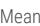

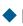

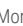

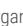

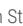

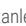

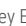

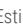

Source: Refinitiv, MS

# Risk Reward – KLA Corp (KLAC.O)

OW on structural and idiosyncratic drivers

# PRICE TARGET \$1,900.00

33x CY27e EPS of \$57.58, a 15% premium to US SPE peers LAM & AMAT to reflect growth prospects in foundry logic and DRAM.

bar_line

| Category | Value     |
| -------- | --------- |
| Mean     | $1,811.01 |
| MS Estimates | $2,100.00 |

RISK REWARD CHART AND OPTIONS IMPLIED PROBABILITIES (12M)   
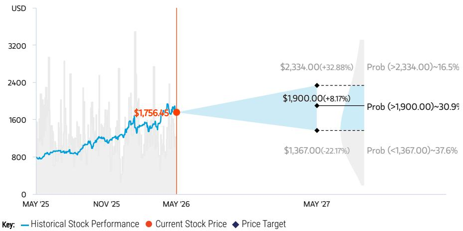

line

| Date     | Historical Stock Performance | Current Stock Price | Price Target |
| -------- | ----------------------------- | ------------------- | ------------ |
| MAY '25  | ~$800                         | -                   | -            |
| NOV '25  | ~$1,000                       | -                   | -            |
| MAY '26  | $1,756.45                     | $1,756.45            | -            |
| MAY '27  | -                             | $1,900.00            | $1,367.00    |
| Prob (May '27) | -                          | $2,334.00 (+32.88%)   | $1,367.00 (-22.17%) |

Source: Refinitiv, MS, MS Institutional Equities Division. The probabilities of our Bull, Base, and Bear case scenarios playing out were estimated with implied volatility data from the options market as of 18 May 2026. All figures are approximate risk-neutral probabilities of the stock reaching beyond the scenario price in either three-months' or one-years' time. View explanation of Options Probabilities methodology here

# OVERWEIGHT THESIS

\- KLA's fundamental story has gone from strength to strength: 1) Process control intensity: to structurally increase going forward due to larger die sizes and increased design starts, both causes of lower yield. 2) Share increase: KLA should continue to gain market share in process control given the company is first to inflections and has the fundamental technology to enable that.
- We believe a premium multiple to SPE peers is justified given KLA's growth prospects (outperformance vs WFE) as well as its superior gross margin.

Consensus Rating Distribution   
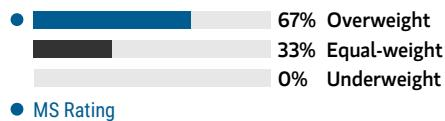

bar

| Category | Value (%) |
|---|---|
| Overweight | 67 |
| Equal-weight | 33 |
| Underweight | 0 |
| MS Rating | - |

Source: Refinitiv, MS

Risk Reward Themes 

<table><tr><td>New Data Era:</td><td>Positive</td></tr><tr><td>Pricing Power:</td><td>Positive</td></tr><tr><td>Secular Growth:</td><td>Positive</td></tr></table>

View descriptions of Risk Rewards Themes here

# BULL CASE

# \$2,334.00

# 36x CY27e EPS of \$64.83

KLA gains more market share than expected on the back of leading edge logic spending accelerating and process control intensity in DRAM increasing greater than expected.

- In this scenario we assume a considerable premium to US SPE peers (AMAT/LAM) as KLA's growth prospects are more appreciated.   
- Revenue grows 36.1% in CY27 as KLAC sees outsized growth due to increased market share.   
- GM expands to 63.3% and EPS grows to \$64.83 in 2027.

# BASE CASE

# 33x CY27e EPS of \$57.58

KLA grows ahead of WFE in 2026-2027 due to increased process control intensity in leading edge logic and DRAM.

- In this scenario we assume a premium to US SPE peers (AMAT/LAM) that is slightly higher than historic due to KLA's growth prospects.   
- Revenue grows 23.7% in CY27 and KLA slightly increases market share.   
- GM expands to 62.6% and EPS grows to \$57.58 in 2027

# \$1,900.00

# [Non-Text]

# BEAR CASE

# \$1,367.00

# 26x CY27e EPS of \$52.57

KLA's market share contracts due to leading edge logic and DRAM investment slowing down. KLA faces increasing competition in mask inspection, pressuring valuation multiple.

- In this scenario we assume multiple in-line with US SPE peers (AMAT/LAM)   
- Revenue growth of 14.4% in CY27 as leading edge logic growth is limited.   
- GM declines to 61.6% and EPS slightly increases to \$52.57 in 2027

# Risk Reward – KLA Corp (KLAC.O)

KEY EARNINGS INPUTS 

<table><tr><td>Drivers</td><td>2025</td><td>2026e</td><td>2027e</td><td>2028e</td></tr><tr><td>GAAP Revenue ($, mm)</td><td>12,156</td><td>13,524</td><td>17,509</td><td>19,809</td></tr><tr><td>MW Gross Margin (%)</td><td>62.3</td><td>62.2</td><td>62.4</td><td>62.7</td></tr><tr><td>MW EPS ($)</td><td>33.29</td><td>36.96</td><td>52.33</td><td>60.60</td></tr><tr><td>Inventory ($, mm)</td><td>3,212</td><td>3,623</td><td>4,589</td><td>4,889</td></tr><tr><td>DOI</td><td>246.7</td><td>251.5</td><td>249.0</td><td>236.7</td></tr></table>

# INVESTMENT DRIVERS

- WFE market growth, specifically in leading edge logic where KLA has outsized exposure.   
- Process control intensity and KLA's market share within process control.

# GLOBAL REVENUE EXPOSURE

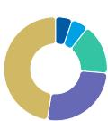

0-10% Europe ex UK   
0-10% North America   
10-20% Japan   
20-30% Mainland China   
40-50% APAC, ex Japan, Mainland China and India

Source: MS Estimate View explanation of regional hierarchies here

MS ALPHA MODELS 

<table><tr><td>5/5BEST</td><td>24 MonthHorizon</td><td>3/5MOST</td><td>3 MonthHorizon</td></tr></table>

Source: Refinitiv, FactSet, MS; 1 is the highest favored Quintile and 5 is the least favored Quintile

# RISKS TO PT/RATING

# RISKS TO UPSIDE

- Foundries (TSMC, Intel, Samsung) pull forward their logic roadmaps   
- Design starts in leading edge nodes increase   
- Process control intensity increases in DRAM due to HBM

# RISKS TO DOWNSIDE

- Certain foundries (Intel, Samsung) scale back their aspirations   
• Market share loss in mask inspection to Lasertec or in e-beam to AMAT or ASML   
- China restrictions

OWNERSHIP POSITIONING   

heatmap

| Category                  | Value   |
| ------------------------- | ------- |
| Inst. Owners, % Active    | 52.5%   |
| HF Sector Long/Short Ratio | 2x      |
| HF Sector Net Exposure    | 25.3%   |

Refinitiv; MSPB Content. Includes certain hedge fund exposures held with MSPB. Information may be inconsistent with or may not reflect broader market trends. Long/Short Ratio = Long Exposure / Short exposure. Sector % of Total Net Exposure = (For a particular sector: Long Exposure - Short Exposure) / (Across all sectors: Long Exposure – Short Exposure).

MS ESTIMATES VS. CONSENSUS 

<table><tr><td colspan="3">FY Jun 2026e</td></tr><tr><td rowspan="2">Sales / Revenue($, mm)</td><td>13,436</td><td>13,524</td></tr><tr><td>13,577</td><td>15,056</td></tr><tr><td rowspan="2">EBITDA($, mm)</td><td>5,920</td><td>6,208</td></tr><tr><td>6,136</td><td>6,410</td></tr><tr><td rowspan="2">Net income($, mm)</td><td>4,729</td><td>4,873</td></tr><tr><td>4,909</td><td>5,780</td></tr><tr><td rowspan="2">EPS($)</td><td>35.87</td><td>36.96</td></tr><tr><td>37.50</td><td>44.09</td></tr></table>

Source: Refinitiv, MS

# Risk Reward – Lam Research Corp (LRCX.O)

WFE outperformance intact with NAND & Logic

# PRICE TARGET \$331.00

34x CY27 non-GAAP EPS of \$9.73, multiple reflects a 20% premium to AMAT (28x) to reflect LAM's market share gains.

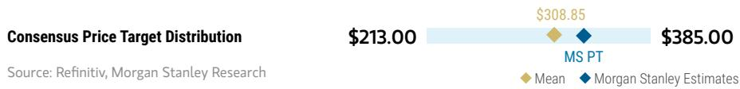

bar_line

| Category | Value    |
| -------- | -------- |
| MS PT    | $308.85  |
| MS PT    | $385.00  |
| Mean     | $213.00  |
| MS Estimates | $385.00 |

RISK REWARD CHART AND OPTIONS IMPLIED PROBABILITIES (12M)   
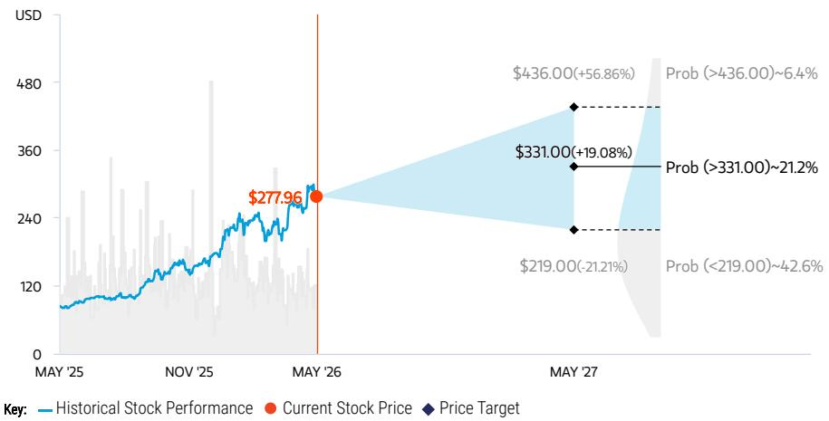

line

| Date     | Historical Stock Performance | Current Stock Price | Price Target |
| -------- | ----------------------------- | ------------------- | ------------ |
| MAY '25  | ~100                          | -                   | -            |
| NOV '25  | ~150                          | -                   | -            |
| MAY '26  | $277.96                       | $277.96             | -            |
| MAY '27  | -                             | $436.00(+56.86%)   | $331.00(-21.21%) |
| Prob (>436.00)~6.4% | -                         | -                   | -            |
| Prob (>331.00)~21.2% | -                        | -                   | -            |
| Prob (<219.00)~42.6% | -                      | -                   | $219.00(-21.21%) |

Source: Refinitiv, MS, MS Institutional Equities Division. The probabilities of our Bull, Base, and Bear case scenarios playing out were estimated with implied volatility data from the options market as of 18 May 2026. All figures are approximate risk-neutral probabilities of the stock reaching beyond the scenario price in either three-months' or one-years' time. View explanation of Options Probabilities methodology here

# OVERWEIGHT THESIS

■ After shipments underperformed WFE by 33ppt in 2023 due to a cyclical decline in NAND and China entity list impact, LAM outperformed WFE by 8ppt in 2024 and we estimate another 27ppt outperformance in 2025 driven by NAND, China, and TSMC. We model LAM's system shipments to outperform WFE in 2026 & 2027 for the 3rd and 4th consecutive year as NAND and non-China foundry logic continues to strengthen.
■ LAM has unique drivers supporting the long-term growth story as the company is seeing gross margin expansion from shifting manufacturing to Malaysia, is positioned well to gain share with the 4F2 transition in DRAM and in advanced packaging.

Consensus Rating Distribution   
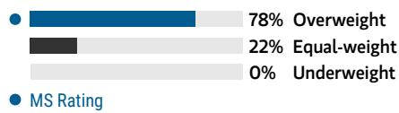

bar

| Category      | Value |
| ------------- | ----- |
| Overweight    | 78%   |
| Equal-weight  | 22%   |
| Underweight   | 0%    |

Source: Refinitiv, MS

# Risk Reward Themes

New Data Era: Positive
Secular Growth: Positive

View descriptions of Risk Rewards Themes here

# BULL CASE

# \$436.00

# \~39x CY27 non-GAAP EPS \$11.18

DRAM and NAND pricing and utilization improve further than expected, and LAM sees record revenue in CY27. The company sees revenue growth exceed WFE on the back of market share gains in leading edge nodes.

\- Revenue growth of 45.6% in CY27 as LAM benefits from NAND WFE growth and market share gains

\- GM expands to 52.4% in CY27

# BASE CASE

# \$331.00

# \~34x CY27 non-GAAP EPS of \$9.73

We expect LAM to outperform in 2026-27 on the back of NAND and foundry logic strength.

– Revenue growth of 31.2% in CY27 driven by NAND and foundry logic

\- CY27 GM of 51.4% as regional mix deterioration is offset by top-line growth

# BEAR CASE

# \$219.00

# \~25x CY27 non-GAAP EPS of \$8.76

Memory markets turn weaker and LAM loses share to competitors.

\- Revenue growth of 21.4% in CY27 as memory recovery more muted than expected

\- GM of 50.6% in CY27

# Risk Reward – Lam Research Corp (LRCX.O)

KEY EARNINGS INPUTS 

<table><tr><td>Drivers</td><td>2025</td><td>2026e</td><td>2027e</td><td>2028e</td></tr><tr><td>GAAP Revenue ($, mm)</td><td>18,436</td><td>23,173</td><td>31,494</td><td>38,491</td></tr><tr><td>MW Gross Margin (%)</td><td>48.8</td><td>50.2</td><td>51.0</td><td>51.6</td></tr><tr><td>Non-GAAP EPS ($)</td><td>4.13</td><td>5.72</td><td>8.39</td><td>10.74</td></tr><tr><td>Inventory ($, mm)</td><td>4,308</td><td>4,548</td><td>5,685</td><td>6,153</td></tr><tr><td>DOI</td><td>164.0</td><td>141.6</td><td>132.6</td><td>118.8</td></tr></table>

CATALYST CALENDAR 

<table><tr><td>Date</td><td>Event</td><td>Source: Refinitiv, MS</td></tr><tr><td>04 Nov 2026 - 08 Nov 2026</td><td>Lam Research Corp Annual Shareholders Meeting</td><td></td></tr></table>

# INVESTMENT DRIVERS

- NAND WFE market trends (LAM has outsized share)   
- Market share gains from new logic architectures (GAA, backside power)

GLOBAL REVENUE EXPOSURE   
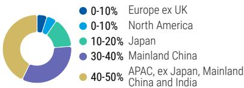

pie

| Region | Percentage (%) |
| :--- | :--- |
| Europe ex UK | 0-10 |
| North America | 0-10 |
| Japan | 10-20 |
| Mainland China | 30-40 |
| APAC, ex Japan, Mainland China and India | 40-50 |

Source: MS Estimate View explanation of regional hierarchies here

MS ALPHA MODELS 

<table><tr><td>5/5BEST</td><td>24 MonthHorizon</td><td>2/5MOST</td><td>3 MonthHorizon</td></tr></table>

Source: Refinitiv, FactSet, MS; 1 is the highest favored Quintile and 5 is the least favored Quintile

# RISKS TO PT/RATING

# RISKS TO UPSIDE

- Market share gains in new logic architectures (GAA, backside power)   
• NAND capex recovers to new highs   
• Continued share gains in China

# RISKS TO DOWNSIDE

• NAND WFE weaker than expected   
- Widespread export restrictions to China   
• Market share loss to competitors in etch

OWNERSHIP POSITIONING 

<table><tr><td>Inst. Owners, % Active</td><td>49.8%</td><td></td><td></td><td></td></tr><tr><td>HF Sector Long/Short Ratio</td><td>2x</td><td></td><td></td><td></td></tr><tr><td>HF Sector Net Exposure</td><td>25.3%</td><td></td><td></td><td></td></tr></table>

Refinitiv; MSPB Content. Includes certain hedge fund exposures held with MSPB. Information may be inconsistent with or may not reflect broader market trends. Long/Short Ratio = Long Exposure / Short exposure. Sector % of Total Net Exposure = (For a particular sector: Long Exposure - Short Exposure) / (Across all sectors: Long Exposure – Short Exposure).

MS ESTIMATES VS. CONSENSUS 

<table><tr><td colspan="3">FY Jun 2026e</td></tr><tr><td rowspan="2">Sales / Revenue ($, mm)</td><td rowspan="2">22,519</td><td>23,173</td></tr><tr><td>23,262</td></tr><tr><td rowspan="2">EBITDA ($, mm)</td><td rowspan="2">7,848</td><td>8,618</td></tr><tr><td>8,539</td></tr><tr><td rowspan="2">Net income ($, mm)</td><td rowspan="2">6,667</td><td>7,210</td></tr><tr><td>7,127</td></tr><tr><td rowspan="2">EPS ($)</td><td rowspan="2">5.59</td><td>5.72</td></tr><tr><td>5.72</td></tr></table>

Source: Refinitiv, MS

# Risk Reward – Micron Technology Inc. (MU.O)

See multiple quarters of upward revisions, with AI driving a higher multiple

# PRICE TARGET \$520.00

\~25x through-cycle earnings of US \$21.00, a premium to history reflecting new opportunities in AI, At the high end of broader semis.

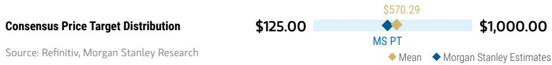

bar_line

| Category | Value     |
| -------- | --------- |
| MS PT    | $570.29   |
| MS Estimates | $1,000.00 |

RISK REWARD CHART AND OPTIONS IMPLIED PROBABILITIES (12M)   
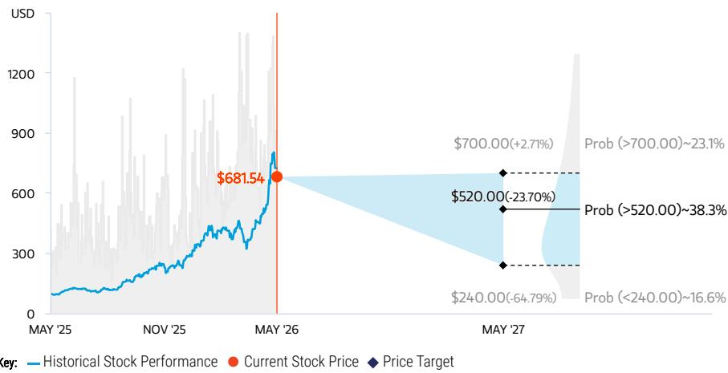

line

| Date       | Current Stock Price | Price Target     |
| ---------- | ------------------- | ---------------- |
| MAY '25    | -                   | -                |
| NOV '25    | -                   | -                |
| MAY '26    | $681.54             | -                |
| MAY '27    | $520.00             | $700.00(+2.71%) |
| MAY '27    | -                   | $520.00(-23.70%) |
| MAY '27    | -                   | $240.00(-64.79%) |
| MAY '27    | -                   | $240.00~16.6%   |

Source: Refinitiv, MS, MS Institutional Equities Division. The probabilities of our Bull, Base, and Bear case scenarios playing out were estimated with implied volatility data from the options market as of 18 May 2026. All figures are approximate risk-neutral probabilities of the stock reaching beyond the scenario price in either three-months' or one-years' time. View explanation of Options Probabilities methodology here

# OVERWEIGHT THESIS

■ DRAM fundamentals are in uncharted territory, and should continue to improve as datacenter/AI continue their upward trajectory   
■ Execution on AI is underappreciated, and we expect Micron to maintain share in CY26 vs the competition. Supporting margins and driving a higher multiple than prior cycles   
■ Cycle longevity will be key, and S/D may stay tight for 2-3 more years

Consensus Rating Distribution   
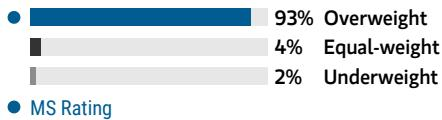

bar

| Category | Value (%) |
|---|---|
| Overweight | 93 |
| Equal-weight | 4 |
| Underweight | 2 |
MS Rating

Source: Refinitiv, MS

# Risk Reward Themes

New Data Era: Positive
Secular Growth: Positive

View descriptions of Risk Rewards Themes here

# BULL CASE

# \$700.00

# 28x through-cycle earnings of US\$25.00

Gross margin improvement continues, driven by scale, AI mix, and cost improvements in new products. Pricing pressure alleviates as demand sustainably moves above supply driven by HBM's wafer intensity, a product category where MU cements performance leadership on future products.

# BASE CASE

# \$520.00

# \~25x through-cycle earnings of US\$21.00

Our through-cycle earnings estimate of US\$21.00 is a premium to average earnings over the last 8 years due mostly to AI. Our 25x multiple reflects the market's enthusiasm for the AI opportunity, and at the midpoint of the semis group

# BEAR CASE

# \$240.00

# 16x through-cycle earnings of US\$15.00

Memory begins to enter a downturn in early 2027. As the strength attributed to demand in the early part of the year ended up being inventory build at customers. Multiple compresses severely after an underwhelming peak

# Risk Reward – Micron Technology Inc. (MU.O)

KEY EARNINGS INPUTS 

<table><tr><td>Drivers</td><td>2025</td><td>2026e</td><td>2027e</td><td>2028e</td></tr><tr><td>GAAP Revenue ($, mm)</td><td>37,378</td><td>110,489</td><td>150,620</td><td>138,790</td></tr><tr><td>Non Gaap Gross Margin (%)</td><td>40.9</td><td>77.8</td><td>82.3</td><td>78.8</td></tr><tr><td>Non-GAAP EPS ($)</td><td>8.29</td><td>59.36</td><td>81.36</td><td>72.32</td></tr><tr><td>Inventory ($, mm)</td><td>8,355</td><td>8,564</td><td>9,100</td><td>10,164</td></tr><tr><td>DOI</td><td>133.7</td><td>123.5</td><td>120.6</td><td>122.4</td></tr></table>

# INVESTMENT DRIVERS

\- Improved pricing and demand strength drive earnings growth

# GLOBAL REVENUE EXPOSURE

0-10% APAC, ex Japan, Mainland China and India   
0-10% India   
0-10% Japan   
0-10% MEA   
0-10% Mainland China   
0-10% UK   
10-20% Europe ex UK   
40-50% North America

Source: MS Estimate View explanation of regional hierarchies here

# MS ALPHA MODELS

5/5 BEST

24 Month Horizon

4/5 MOST

3 Month Horizon

Source: Refinitiv, FactSet, MS; 1 is the highest favored Quintile and 5 is the least favored Quintile

# RISKS TO PT/RATING

# RISKS TO UPSIDE

- Customers continue to demonstrate an appetite to take on inventory around macroeconomic uncertainty   
• Additional wafer intensity of HBM further improves overall supply and demand   
- Micron's HBM share surpasses expectations

# RISKS TO DOWNSIDE

- Pricing can turn quickly; a falter in end demand with inventories elevated could lead to a swift price reduction   
• HBM demand falters and competition intensifies, pressuring pricing

# OWNERSHIP POSITIONING

Inst. Owners, % Active

HF Sector Long/Short Ratio

HF Sector Net Exposure

Refinitiv; MSPB Content. Includes certain hedge fund exposures held with MSPB. Information may be inconsistent with or may not reflect broader market trends. Long/Short Ratio = Long Exposure / Short exposure. Sector % of Total Net Exposure = (For a particular sector: Long Exposure - Short Exposure) / (Across all sectors: Long Exposure – Short Exposure).

# MS ESTIMATES VS. CONSENSUS

<table><tr><td colspan="3">FY Oct 2026e</td></tr><tr><td rowspan="2">Sales / Revenue ($, mm)</td><td rowspan="2">81,813</td><td>110,489</td></tr><tr><td>108,919</td></tr><tr><td rowspan="2">EBITDA ($, mm)</td><td rowspan="2">58,763</td><td>88,885</td></tr><tr><td>87,218</td></tr><tr><td rowspan="2">Net income ($, mm)</td><td rowspan="2">44,520</td><td>68,321</td></tr><tr><td>66,272</td></tr><tr><td rowspan="2">EPS ($)</td><td rowspan="2">37.54</td><td>59.36</td></tr><tr><td>57.64</td></tr></table>

Source: Refinitiv, MS

# Risk Reward – Western Digital (WDC.O)

An Undervalued Special Sit Tied To Once In a Generation Data Center Buildout

# PRICE TARGET \$488.00

Our PT implies 18.0x CY27 EPS of \$27.12, as we expect earnings upward revisions by the Street with shares trading on par with STX at 4.0x turns above the peak multiples (14.0x) in the previous industry upcycle.

Consensus Price Target Distribution

Source: Refinitiv, MS

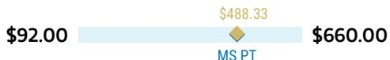

bar_line

| Category | Value    |
| -------- | -------- |
| MS PT    | $488.33  |
|          | $660.00  |

Mean   
◆ M   
organ Stanley Estimates

RISK REWARD CHART AND OPTIONS IMPLIED PROBABILITIES (12M)   
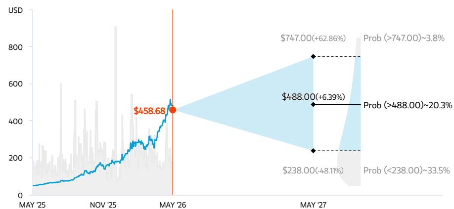

line

| Date     | Value    |
| -------- | -------- |
| MAY '26  | $458.68  |
| MAY '27  | $747.00 (+62.86%) |
| MAY '27  | $488.00 (+6.39%) |
| MAY '27  | $238.00 (-48.11%) |
| MAY '27  | Prob (>747.00)~3.8% |

Key: — Historical Stock Performance ● Current Stock Price ◆ Price Target   
Source: Refinitiv, MS, MS Institutional Equities Division. The probabilities of our Bull, Base, and Bear case scenarios playing out were estimated with implied volatility data from the options market as of 18 May 2026. All figures are approximate risk-neutral probabilities of the stock reaching beyond the scenario price in either three-months' or one-years' time. View explanation of Options Probabilities methodology here

# OVERWEIGHT THESIS

WDC benefits from accelerating data growth, which drives storage demand in the cloud and on-prem. We believe that the HDD cycle is 'Stronger for Longer' – demand outstrips supply with continued upward pressure in HDD pricing – and entering a period of AI-driven storage demand growth, which will benefit both HDDs and SSDs shipments. While WDC is behind STX in HAMR timeline, we believe WDC will retain its leading HDD revenue and profits market share in the near term with its competitive UltraSMR solutions for high-capacity drives before the industry shifts to wider adoption of HAMR. Accelerated mix shift toward higher-capacity drives lowers cost per TB, supporting continued margin expansion.

Consensus Rating Distribution   
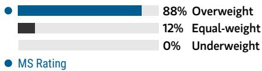

bar

| Category      | Value |
| ------------- | ----- |
| Overweight    | 88%   |
| Equal-weight  | 12%   |
| Underweight   | 0%    |
| MS Rating     | 0%    |

Source: Refinitiv, MS

# Risk Reward Themes

New Data Era: Positive

Pricing Power: Positive

Secular Growth: Positive

View descriptions of Risk Rewards Themes here

# BULL CASE

# \$747.00

# 22.0x CY27 Bull-case EPS of \$33.95

Cloud storage demand surprises positively, gross margins expand more quickly due to much higher high-capacity mix, and WDC sees a greater AI-driven demand uplift. Gross margins approaching 60%+ range in FY27-28. Incremental HDD demand from AI in CY26 is more material than expected. Pricing environment remains healthy into CY27, driving mid-teens % Y/Y price per EB growth. HAMR timeline accelerates, with earlier-than-expected qualification completion and volume shipment timing.

# BASE CASE

# 18.0x CY27 EPS of \$27.12

GMs approach 50% range and AI drives HDD demand, creating a compelling EPS story in FY26-27. The HDD market remains healthy in CY26, and AI drives a HDD demand uplift in FY26-28. Increase in high-capacity drive mix expand GMs to 60% levels, and continued opex discipline supports EPS. Our PT assumes 18.0x - in line with our target multiple for STX - which is 4.0x turns above where STX stock multiples traded up to during the previous HDD industry upcycle in 2021-22.

# \$488.00

# BEAR CASE

# \$238.00

# 14.0x CY27 Bear-case EPS of \$17.00

HDD growth decelerates, gross margins struggle to further expand, and AI-driven demand doesn't materialize. Our bear case assumes the HDD demand growth turns out to be milder than expected. Despite market share leadership in high-capacity drives, headwinds such as underutilization, production charges, and tariffs keep GM depressed and lead to fixed cost deleverage. Our bear case assumes shares trade at 14.0x on our CY27 bear-case EPS of \$17.00.

# Risk Reward – Western Digital (WDC.O)

KEY EARNINGS INPUTS 

<table><tr><td>Drivers</td><td>2025</td><td>2026e</td><td>2027e</td><td>2028e</td></tr><tr><td>Revenue Growth (Y/Y) (%)</td><td>50.7</td><td>35.1</td><td>42.9</td><td>38.7</td></tr><tr><td>HDD Exabyte Growth (Y/Y) (%)</td><td>57.8</td><td>26.2</td><td>28.4</td><td>22.9</td></tr><tr><td>Nearline HDD Exabyte Growth (Y/Y) (%)</td><td>72.2</td><td>29.3</td><td>31.3</td><td>25.0</td></tr><tr><td>Non-GAAP Gross Margin (%)</td><td>39.4</td><td>48.4</td><td>58.6</td><td>67.8</td></tr><tr><td>Non-GAAP Operating Margin (%)</td><td>24.4</td><td>36.4</td><td>49.7</td><td>60.8</td></tr></table>

# INVESTMENT DRIVERS

- Positive EPS revisions as cycle strength surprises to upside   
• Gross margins approaching mid-50s %   
- CSPs qualify on HAMR platform, signaling imminent volume shipments   
• Further de-leveraging   
• Dividend increase / acceleration of buybacks

# GLOBAL REVENUE EXPOSURE

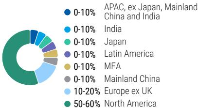

pie

| Region | Percentage (%) |
| :--- | :--- |
| APAC, ex Japan, Mainland China and India | 0-10 |
| India | 0-10 |
| Japan | 0-10 |
| Latin America | 0-10 |
| MEA | 0-10 |
| Mainland China | 0-10 |
| Europe ex UK | 10-20 |
| North America | 50-60 |

Source: MS Estimate View explanation of regional hierarchies here

# MS ALPHA MODELS

5/5 BEST

24 Month Horizon

3/5
MOST

3 Month Horizon

Source: Refinitiv, FactSet, MS; 1 is the highest favored Quintile and 5 is the least favored Quintile

# RISKS TO PT/RATING

# RISKS TO UPSIDE

- Demand accelerates   
• AI drives incremental HDD demand   
- Smoother cloud cycles drive multiple expansion   
• WDC exhibits more pricing power   
- HAMR qualification/volume shipment timeline earlier than expected

# RISKS TO DOWNSIDE

• GM doesn't further expand   
- Pricing normalizes more than expected   
• Geopolitical tensions & tariff impacts   
• Competitive pressures & HAMR timeline delays   
- Dilution from converts more significant than expected

# OWNERSHIP POSITIONING

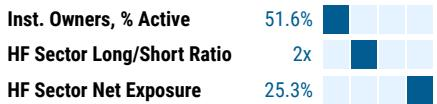

bar

| Category | Value |
| -------- | ----- |
| Inst. Owners, % Active | 51.6% |
| HF Sector Long/Short Ratio | 2x |
| HF Sector Net Exposure | 25.3% |

Refinitiv; MSPB Content. Includes certain hedge fund exposures held with MSPB. Information may be inconsistent with or may not reflect broader market trends. Long/Short Ratio = Long Exposure / Short exposure. Sector % of Total Net Exposure = (For a particular sector: Long Exposure - Short Exposure) / (Across all sectors: Long Exposure – Short Exposure).

# MS ESTIMATES VS. CONSENSUS

FY Jun 2027e

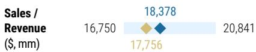

bar

| Sales / Revenue ($, mm) | Value   |
| ------------------------ | ------- |
| 16,750                   | 18,378  |
| 17,756                   | 17,756  |

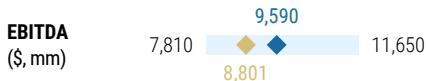

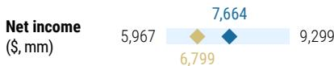

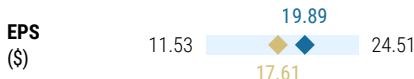  
◆ Mean ◆ MS Estimates
Source: Refinitiv, MS

# Risk Reward – ServiceNow Inc (NOW.N)

Seeing the Forest For the Trees

# PRICE TARGET \$180.00

Discount of 20x Base Case CY30e FCF of \~\$12.2B, discounted back at 11.9% WACC, plus \$11 in CY26 net cash per share. 20x multiple supported by 22% 2-yr FCF CAGR in CY28-CY30.

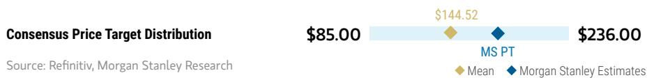

bar_line

| Consensus Price Target Distribution | Mean    | MS Estimates |
| ----------------------------------- | ------- | ------------------------ |
| $85.00                              | $144.52 |                          |
| $236.00                             |         |                          |

RISK REWARD CHART AND OPTIONS IMPLIED PROBABILITIES (12M)   
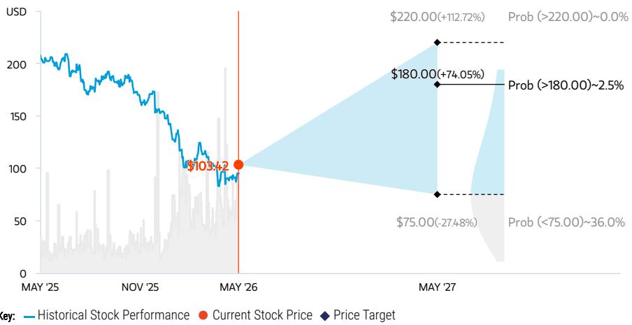

line

| Date       | Historical Stock Performance | Current Stock Price | Price Target Change |
| ---------- | ----------------------------- | ------------------- | --------------------- |
| MAY '25    | ~$200                         | -                   | -                     |
| NOV '25    | ~$180                         | -                   | -                     |
| MAY '26    | $103.42                       | $103.42             | -                     |
| MAY '27    | -                             | -                   | $220.00(+112.72%)     |
| MAY '27    | -                             | -                   | $180.00(+74.05%)      |
| MAY '27    | -                             | -                   | $75.00(-27.48%)       |
| MAY '27    | -                             | -                   | Prob (<75.00)         |
| MAY '27    | -                             | -                   | Prob (>180.00)        |
| MAY '27    | -                             | -                   | Prob (>220.00)        |

Source: Refinitiv, MS, MS Institutional Equities Division. The probabilities of our Bull, Base, and Bear case scenarios playing out were estimated with implied volatility data from the options market as of 18 May 2026. All figures are approximate risk-neutral probabilities of the stock reaching beyond the scenario price in either three-months' or one-years' time. View explanation of Options Probabilities methodology here

# OVERWEIGHT THESIS

ServiceNow's strong network of system integrations and cohesive data fabric position the company well to serve as the go-to workflow automation and agentic orchestration platform. The company has generated 20%+ subscription revenue and free cash flow growth and believe it is well-positioned to achieve a similar growth profile supported by expansion into new workflows and Now Assist/new product adoption.

Consensus Rating Distribution   
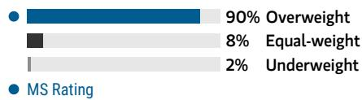

bar

| Category | Value (%) |
|---|---|
| Overweight | 90 |
| Equal-weight | 8 |
| Underweight | 2 |
| MS Rating | |

Source: Refinitiv, MS

# Risk Reward Themes

New Data Era: Positive

View descriptions of Risk Rewards Themes here

# BULL CASE

# \$220.00

Discount of \~22x Bull Case CY30e FCF of \~\$13.7B

New Markets Take Off. Demand for NOW's core ITSM offering holds strong, demand for non-core IT workflows takes off. Sub Revenue grows '25-'30 at a 21% CAGR, while margins expand to 36% in FY30 from 10% in FY15. NOW trades at 22x our CY30 FCFe of \$13.7B discounted back at 11.9% WACC + \$12 in CY26 net cash/share.

# BASE CASE

# \$180.00

Discount of \~20x Base Case CY30e FCF of \~\$12.2B

Steady Investment in Expanding Market Oppty With Premier Unit Economics Drives Durable FCF CAGR. NOW delivers solid growth through a combination of success in core ITSM and an increasing revenue contribution from new product areas like Now Assist. Sub Revenue grows '25-'30 at a 19% CAGR, while margins expand to 35% in FY30 from 10% in FY15. NOW trades at 20x our CY30 FCFe of \$12.2B discounted back at 11.9% WACC + \$11 in CY26 net cash/share.

# BEAR CASE

# \$75.00

Discount of \~8x Bear Case CY30e FCF of \~\$11.7B

TAM Expansion Stalls. NOW continues to see adoption in ITSM, but the revenue generated from new product areas is less than hoped, weighing on forward revenue growth. Sub Revenue grows '25-'30 at a 19% CAGR, while margins expand to 35% in FY30 from 10% in FY15. NOW trades at 8x our CY30 FCFe of \$11.7B discounted back at 11.9% WACC + \$11 in CY26 net cash/share.

# Risk Reward – ServiceNow Inc (NOW.N)

KEY EARNINGS INPUTS 

<table><tr><td>Drivers</td><td>2025</td><td>2026e</td><td>2027e</td><td>2028e</td></tr><tr><td>Con. Duration, CC Subscription Billings YoY Growth (%)</td><td>0.0</td><td>0.0</td><td>0.0</td><td>0.0</td></tr><tr><td>Subscription Revenue YoY Growth (%)</td><td>21.0</td><td>22.3</td><td>19.0</td><td>18.8</td></tr><tr><td>Total Revenue YoY Growth (%)</td><td>20.9</td><td>21.9</td><td>18.8</td><td>18.7</td></tr><tr><td>Operating Margin % (%)</td><td>31.2</td><td>31.5</td><td>32.5</td><td>33.5</td></tr><tr><td>FCF YoY Growth (%)</td><td>34.2</td><td>22.1</td><td>20.7</td><td>20.4</td></tr></table>

# INVESTMENT DRIVERS

- Stable levels of sales productivity with sales headcount growing \~30% annually.   
- Growth in ACV in enterprise customers from seat growth + adoption of new use cases.   
- Growing share in \$6B TAM for ITSM plus \$54B of additional TAM with newer products.

# GLOBAL REVENUE EXPOSURE

0-10% APAC, ex Japan, Mainland China and India   
0-10% India   
0-10% Japan   
0-10% Latin America   
0-10% MEA   
0-10% Mainland China   
0-10% UK   
10-20% Europe ex UK   
60-70% North America

Source: MS Estimate View explanation of regional hierarchies here

# MS ALPHA MODELS

3/5

BEST

24 Month

Horizon

3/5

MOST

3 Month

Horizon

Source: Refinitiv, FactSet, MS; 1 is the highest favored Quintile and 5 is the least favored Quintile

# RISKS TO PT/RATING

# RISKS TO UPSIDE

- Greater than expected share gains in new markets as upsell and cross-sell motion takes hold;   
- Superior unit economics drive faster than expected FCF growth;   
- Improving traction with Federal Government

# RISKS TO DOWNSIDE

- Tougher competition from low-end vendors and SaaS peers;   
- Sales productivity may decline as with growth if new markets prove challenging;   
- Seat-based pricing proves more difficult amidst GenAI disruption

# OWNERSHIP POSITIONING

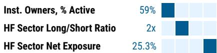

heatmap

| Category                  | Value  |
| ------------------------- | ------ |
| Inst. Owners, % Active    | 59%    |
| HF Sector Long/Short Ratio | 2x     |
| HF Sector Net Exposure    | 25.3%  |

Refinitiv; MSPB Content. Includes certain hedge fund exposures held with MSPB. Information may be inconsistent with or may not reflect broader market trends. Long/Short Ratio = Long Exposure / Short exposure. Sector % of Total Net Exposure = (For a particular sector: Long Exposure - Short Exposure) / (Across all sectors: Long Exposure – Short Exposure).

# MS ESTIMATES VS. CONSENSUS

FY Dec 2026e

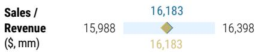

bar_line

| Sales / Revenue ($, mm) | Value     |
| ------------------------ | --------- |
| 15,988                   | 16,183    |
| 16,398                   | 16,183    |

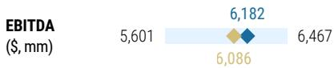

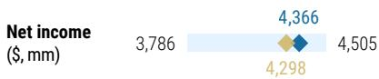

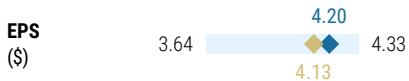

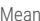

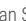

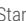

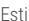

Source: Refinitiv, MS

# Risk Reward – Seagate Technology (STX.O)

Top Pick

Once in a Generation Data Center Buildout and Tech Leadership Supports OW Rating

# PRICE TARGET \$767.00

Our PT implies 18.0x our CY27 EPS of \$42.59, as we expect earnings upward revisions by the Street with shares trading 4.0x turns above the peak multiples in the previous industry upcycle.

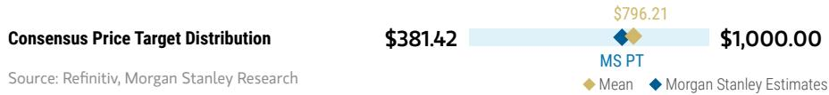

bar_line

| Category | Value     |
| -------- | --------- |
| MS PT    | $796.21   |
| MS Estimates | $1,000.00 |

RISK REWARD CHART AND OPTIONS IMPLIED PROBABILITIES (12M)   
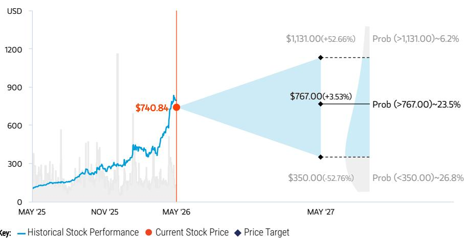

line

| Date     | Historical Stock Performance | Current Stock Price | Price Target Change |
| -------- | ----------------------------- | ------------------- | --------------------- |
| MAY '25  | ~100                          | -                   | -                     |
| NOV '25  | ~200                          | -                   | -                     |
| MAY '26  | $740.84                       | -                   | -                     |
| MAY '27  | $350.00                       | -                   | -                     |
| MAY '27  | $767.00                       | -                   | +3.53%                |
| MAY '27  | $1,131.00 (approx)            | -                   | +52.66%               |
| MAY '27  | $1,131.00 (~6.2%)             | -                   | -                     |
| MAY '27  | $350.00 (~26.8%)              | -                   | -                     |

Source: Refinitiv, MS, MS Institutional Equities Division. The probabilities of our Bull, Base, and Bear case scenarios playing out were estimated with implied volatility data from the options market as of 18 May 2026. All figures are approximate risk-neutral probabilities of the stock reaching beyond the scenario price in either three-months' or one-years' time. View explanation of Options Probabilities methodology here

# OVERWEIGHT THESIS

STX benefits from accelerating data growth, which drives storage demand in the cloud and on-prem. We are entering a period of AI-driven storage demand growth, benefitting both HDDs and flash shipments. We believe the HDD industry supply discipline has made the industry more profitable, and that HAMR and STX's cost/pricing actions will provide a tailwind to the company's gross margin profile in the long term, which continues to be underestimated by the market. Combined with opex discipline, we expect a decent multi-year earnings story ahead. As a result, we are Overweight rated on STX.

Consensus Rating Distribution   
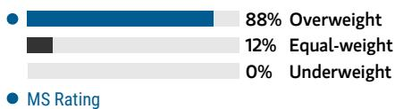

bar

| Category | Value (%) |
|---|---|
| Overweight | 88 |
| Equal-weight | 12 |
| Underweight | 0 |
| MS Rating | (not labeled) |

Source: Refinitiv, MS

# Risk Reward Themes

New Data Era: Positive

Pricing Power: Positive

Technology Diffusion: Positive

View descriptions of Risk Rewards Themes here

# BULL CASE

# \$1,131.00

# 22.0x CY27 Bull-case EPS of \$51.39

Cloud storage demand surprises positively, gross margins expand more quickly due to HAMR mix, and STX sees a greater AI-driven demand uplift. Cloud demand further accelerates into CY26, and HAMR's launch is successful, putting upward pressure on margins amidst market share gain. Gross margins approaching mid-60% levels in FY27-28. STX sees incremental HDD demand from AI in FY26 and it is more material than expected. \$1,131 represents 22.0x P/E on CY27 bull-case EPS of \$51.39.

# BASE CASE

# 18.0x CY27 EPS of \$42.59

Gross margins expand to 60% levels and AI drives HDD demand, creating a compelling EPS story in FY26-28. The HDD market remains healthy in CY26, and AI drives a modest HDD demand uplift in FY26-28. HAMR drives gross margins to 60% levels and continued opex discipline, along with share buybacks, supports EPS. Our PT assumes 18.0x CY27 EPS of \$42.59, with STX stock multiples trading 4.0x turns above the peak of previous HDD industry upcycle in 2021-22.

# \$767.00

# BEAR CASE

# \$350.00

# 14.0x CY27 Bear-case EPS of \$25.00

HDD growth decelerates, gross margins struggle to further expand, and AI-driven demand doesn't materialize. HDD demand growth turns out to be milder than expected, keeping gross margins from further expanding. eSSD starts to replace some of the HDD demand in cloud storage environments for cold data, while the HDD industry becomes less irrational and starts expanding capacity, which weigh on valuation multiples. Our bear case assumes shares trade at 14.0x on CY27 bear-case EPS of \$25.00.

# Risk Reward – Seagate Technology (STX.O)

KEY EARNINGS INPUTS 

<table><tr><td>Drivers</td><td>2025</td><td>2026e</td><td>2027e</td><td>2028e</td></tr><tr><td>Revenue Growth (Y/Y) (%)</td><td>38.9</td><td>32.4</td><td>45.1</td><td>31.5</td></tr><tr><td>HDD Exabyte Growth (Y/Y) (%)</td><td>49.5</td><td>32.0</td><td>28.4</td><td>16.0</td></tr><tr><td>Capacity Optimized Revenue Growth (Y/Y) (%)</td><td>57.4</td><td>0.0</td><td>0.0</td><td>0.0</td></tr><tr><td>Non-GAAP Gross Margin (%)</td><td>35.8</td><td>45.2</td><td>57.1</td><td>67.0</td></tr><tr><td>Non-GAAP Operating Margin (%)</td><td>23.4</td><td>35.4</td><td>50.2</td><td>61.4</td></tr></table>

# INVESTMENT DRIVERS

- Positive EPS revisions as cycle strength persists and margins ramp to high-40%   
• Stronger for longer cloud capex growth   
- New CSP qualifications on HAMR platform   
- Management accelerates buybacks

# GLOBAL REVENUE EXPOSURE

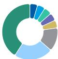

0-10% Europe ex UK   
0-10% India   
0-10% Japan   
0-10% MFA   
0-10% UK   
10-20% Mainland China   
20 20% APAC, ex Japan, Mainland   
China and India   
40-50% North America

Source: MS Estimate View explanation of regional hierarchies here

# MS ALPHA MODELS

5/5

BEST

24 Month

Horizon

2/5

MOST

3 Month

Horizon

Source: Refinitiv, FactSet, MS; 1 is the highest favored Quintile and 5 is the least favored Quintile

# RISKS TO PT/RATING

# RISKS TO UPSIDE

- Demand accelerates   
• AI drives incremental HDD demand   
• GM expands to high-50% range   
- Smoother/stronger cloud cycles drive multiple expansion   
• STX exhibits more pricing power   
• HAMR drives share gains

# RISKS TO DOWNSIDE

- Qualifications for high-capacity drives take longer than expected   
• Steeper declines from cyclical markets   
• GM doesn't further expand   
- Pricing normalizes more than expected   
• Geopolitical tensions & tariff costs

# OWNERSHIP POSITIONING

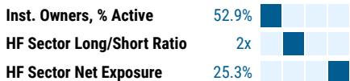

bar

| Category | Value |
| -------- | ----- |
| Inst. Owners, % Active | 52.9% |
| HF Sector Long/Short Ratio | 2x |
| HF Sector Net Exposure | 25.3% |

Refinitiv; MSPB Content. Includes certain hedge fund exposures held with MSPB. Information may be inconsistent with or may not reflect broader market trends. Long/Short Ratio = Long Exposure / Short exposure. Sector % of Total Net Exposure = (For a particular sector: Long Exposure - Short Exposure) / (Across all sectors: Long Exposure – Short Exposure).

# MS ESTIMATES VS. CONSENSUS

FY Jun 2027e

<table><tr><td>Sales / Revenue($, mm)</td><td>15,043</td><td>17,470</td><td>18,667</td></tr><tr><td></td><td colspan="3">16,356</td></tr></table>

<table><tr><td rowspan="2">Net income($, mm)</td><td>3,995</td><td>7,218</td><td>8,294</td></tr><tr><td></td><td>6,083</td><td></td></tr></table>

<table><tr><td rowspan="2">EPS($)</td><td>22.50</td><td>31.75</td><td>36.29</td></tr><tr><td></td><td>26.55</td><td></td></tr></table>

◆ Mean ◆ MS Estimates   
Source: Refinitiv, MS

# Risk Reward – SanDisk Corporation. (SNDK.O)

NAND improving quickly on the back of accelerating cloud demand

# PRICE TARGET \$1,100.00

We assume 23x through-cycle EPS of \$48.00 (vs. our estimate of the trailing 9-year average of \$6.33). As improving industry dynamics as well as eSSD demand lead to higher levels of profitability than we have seen over the last few years, 23x is a discount to our through-cycle multiple target for MU (25x) as the lower AI exposure is offset by historically higher FCF conversion

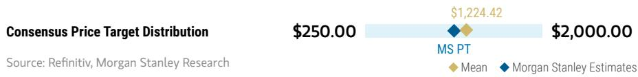

bar_line

| Category | Value     |
| -------- | --------- |
| Mean     | $1,224.42 |
| MS Estimates | $2,000.00 |
Source: Refinitiv, MS

RISK REWARD CHART   
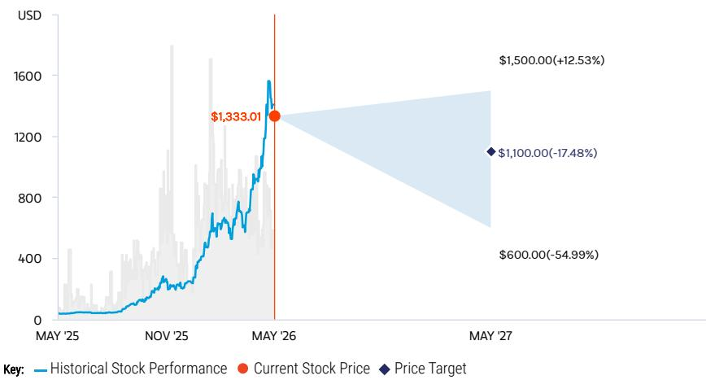

line

| Date     | Historical Stock Performance | Current Stock Price | Price Target |
| -------- | ---------------------------- | ------------------- | ------------ |
| MAY '25  | ~0                           | -                   | -            |
| NOV '25  | ~200                         | -                   | -            |
| MAY '26  | $1,333.01                    | $1,500.00           | -            |
| MAY '27  | -                            | $1,100.00           | -$17.48%    |

Source: Refinitiv, MS

# OVERWEIGHT THESIS

AI demand is in the process of transforming the NAND market, and driving peak cycle EPS to multiples of what we have seen in the past. With still minimal new investment in capacity and evolving AI demand drivers we see a long runway for upward revisions.

Consensus Rating Distribution   
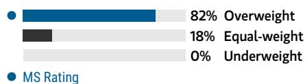

bar

| Category | Value (%) |
|---|---|
| Overweight | 82 |
| Equal-weight | 18 |
| Underweight | 0 |
| MS Rating | - |

Source: Refinitiv, MS

# Risk Reward Themes

New Data Era: Positive
Secular Growth: Positive

View descriptions of Risk Rewards Themes here

# BULL CASE

# \$1,500.00

# 25x through-cycle EPS of \$60

Our bull case of \$1500 per share represents 25x a higher through-cycle EPS of \$60.00. Here future peak earnings look similar to the current environment, with AI demand supporting through cycle EPS about 40% of current cycle peak. As well as with more mild downturns, higher levels of profitability supporting a higher multiple.

# BASE CASE

# 23x through-cycle EPS of \$48.00

Improving industry dynamics as well as eSSD demand lead to higher levels of profitability than we have seen over the last few years, 23x is a discount to our through-cycle multiple target for MU (25x) as the lack of direct AI is offset by historically higher FCF conversion.

# \$1,100.00

# BEAR CASE

# \$600.00

# 20x through-cycle EPS of \$30.

We think Sandisk can avoid much of the pain of the last downturn (\$13 per share loss), and with a better upcycle, with the multiple towards the average of the semiconductor group.

# Risk Reward – SanDisk Corporation. (SNDK.O)

KEY EARNINGS INPUTS 

<table><tr><td>Drivers</td><td>2025</td><td>2026e</td><td>2027e</td><td>2028e</td></tr><tr><td>GAAP Revenue ($, mm)</td><td>7,355</td><td>19,287</td><td>40,860</td><td>38,440</td></tr><tr><td>Non-GAAP Gross Margin (%)</td><td>30.3</td><td>68.9</td><td>84.1</td><td>82.4</td></tr><tr><td>Non-GAAP EPS ($)</td><td>2.74</td><td>63.96</td><td>172.48</td><td>154.25</td></tr><tr><td>Inventory ($, mm)</td><td>2,079</td><td>2,107</td><td>2,451</td><td>2,412</td></tr><tr><td>DOI</td><td>145.5</td><td>126.2</td><td>135.1</td><td>128.0</td></tr></table>

# INVESTMENT DRIVERS

- Improved pricing and demand strength drive earnings growth   
• Position in DC SSD market improves

# GLOBAL REVENUE EXPOSURE

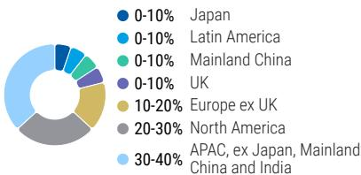  
0-10% Japan   
0-10% Latin America   
0-10% Mainland China   
0-10% UK   
10-20% Europe ex UK   
20-30% North America   
30-40% APAC, ex Japan, Mainland China and India

Source: MS Estimate View explanation of regional hierarchies here

# MS ALPHA MODELS

5/5 BEST

24 Month Horizon

4/5 MOST

3 Month Horizon

Source: Refinitiv, FactSet, MS; 1 is the highest favored Quintile and 5 is the least favored Quintile

# RISKS TO PT/RATING

# RISKS TO UPSIDE

- Quicker eSSD penetration in the datacenter   
- Higher NAND content growth from edge AI applications   
- Sandisk's investments in advanced memory technologies such as HBF (high Bandwidth Flash) pay dividends

# RISKS TO DOWNSIDE

• NAND industry growth disappoints   
- Capex growth returns as industry participants invest to gain share   
- Sandisk loses market share as they fail to gain traction in datacenter   
• China continues to gain share

# OWNERSHIP POSITIONING

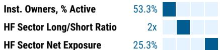

bar

| Category | Value |
| -------- | ----- |
| Inst. Owners, % Active | 53.3% |
| HF Sector Long/Short Ratio | 2x |
| HF Sector Net Exposure | 25.3% |

Refinitiv; MSPB Content. Includes certain hedge fund exposures held with MSPB. Information may be inconsistent with or may not reflect broader market trends. Long/Short Ratio = Long Exposure / Short exposure. Sector % of Total Net Exposure = (For a particular sector: Long Exposure - Short Exposure) / (Across all sectors: Long Exposure – Short Exposure).

# MS ESTIMATES VS. CONSENSUS

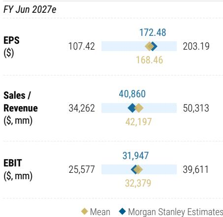  
◆ Mean ◆ MS Estimates   
Source: Refinitiv, MS

# Risk Reward – Qualcomm Inc. (QCOM.O)

Key edge AI enabler, but wide range of outcomes with smartphone share and AI PC

# PRICE TARGET \$146.00

We use a 21x MW PE multiple on \$7.12 in CY2027 earnings (includes stock based compensation). This is roughly 14x Non-GAAP EPS of \$10.32. This is on the lower end of their historical range, but is appropriate for our expectations of a muted smartphone cycle.

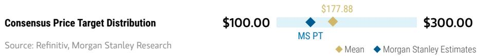

bar_line

| Consensus Price Target Distribution | Mean    | MS Estimates |
| ----------------------------------- | ------- | ------------------------ |
| $100.00                             |         |                          |
| $177.88                             |         |                          |
| $300.00                             |         |                          |

RISK REWARD CHART AND OPTIONS IMPLIED PROBABILITIES (12M)   
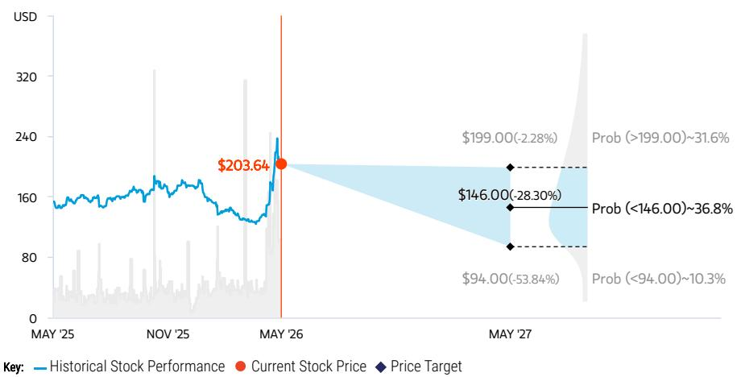

line

| Date     | Historical Stock Performance | Current Stock Price | Price Target |
| -------- | ----------------------------- | ------------------- | ------------ |
| MAY '25  | ~160                          | -                   | -            |
| NOV '25  | ~160                          | -                   | -            |
| MAY '26  | $203.64                       | $203.64             | -            |
| MAY '27  | $199.00 (-2.28%)              | $146.00 (-28.30%)   | $199.00 (-2.28%) |
| MAY '27  | $146.00 (-146.00)              | $146.00 (-146.00)   | $146.00 (-146.00) |
| MAY '27  | $94.00 (-53.84%)               | $94.00 (-53.84%)    | $94.00 (-53.84%) |

Source: Refinitiv, MS, MS Institutional Equities Division. The probabilities of our Bull, Base, and Bear case scenarios playing out were estimated with implied volatility data from the options market as of 18 May 2026. All figures are approximate risk-neutral probabilities of the stock reaching beyond the scenario price in either three-months' or one-years' time. View explanation of Options Probabilities methodology here

# UNDERWEIGHT THESIS

■ Handset volumes seem likely to be pressured by severe memory shortage, starting at the low end and becoming more pervasive as the year goes on   
■ Diversification into automotive has been very strong, but compute and data center initiatives will take time and investment to generate traction   
■ We see the stock in a holding pattern waiting for the diversification to play out, with modest downward pressure in the interim

Consensus Rating Distribution   
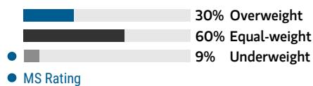

bar

| Category       | Value |
| -------------- | ----- |
| Overweight     | 30%   |
| Equal-weight   | 60%   |
| Underweight    | 9%    |

Source: Refinitiv, MS

# BULL CASE

# \$199.00

# 25X Base Case CY26 MW EPS of \$7.97

Exposure to premium market shields QCOM from most of memory headwinds. Autos, IoT, and Data Center scale quickly to diversify away from the smartphone market.

# BASE CASE

# 21x CY27 MW EPS of \$7.12

We are expecting a muted smartphone cycle from memory constraints and valuing QCOM on the low-end of their PE range.

# \$146.00

# BEAR CASE

# \$94.00

# 20X Bear Case CY26 MW EPS of \$4.69

Memory constraints worse than expected, smartphone is pressured even at the high end. Diversification story fails to develop.

# Risk Reward – Qualcomm Inc. (QCOM.O)

KEY EARNINGS INPUTS 

<table><tr><td>Drivers</td><td>2025</td><td>2026e</td><td>2027e</td><td>2028e</td></tr><tr><td>GAAP Revenue ($, mm)</td><td>44,283</td><td>42,137</td><td>41,101</td><td>44,582</td></tr><tr><td>Non-GAAP Gross Margin (%)</td><td>55.9</td><td>55.3</td><td>55.5</td><td>55.1</td></tr><tr><td>Non-GAAP EPS ($)</td><td>12.05</td><td>10.47</td><td>9.84</td><td>11.45</td></tr><tr><td>Inventory ($, mm)</td><td>6,526</td><td>5,914</td><td>6,251</td><td>7,050</td></tr><tr><td>DOI ($)</td><td>122.3</td><td>114.7</td><td>124.8</td><td>128.7</td></tr></table>

# INVESTMENT DRIVERS

- Smartphone market growth and Qualcomm's share in chipsets   
• Revenue diversification (automotive & IoT) beyond handsets

# GLOBAL REVENUE EXPOSURE

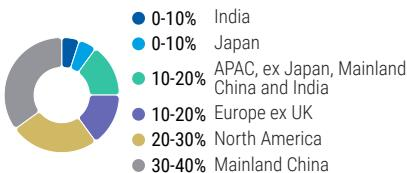

pie

| Region | Percentage (%) |
| :--- | :--- |
| India | 0-10 |
| Japan | 0-10 |
| APAC, ex Japan, Mainland China and India | 10-20 |
| Europe ex UK | 10-20 |
| North America | 20-30 |
| Mainland China | 30-40 |

Source: MS Estimate View explanation of regional hierarchies here

# MS ALPHA MODELS

4/5 BEST

24 Month Horizon

3/5 MOST

3 Month Horizon

Source: Refinitiv, FactSet, MS; 1 is the highest favored Quintile and 5 is the least favored Quintile

# RISKS TO PT/RATING

# RISKS TO UPSIDE

• Memory constraints ease faster than expected   
• Android market is more resilient   
• Apple transition is slow   
• Non-handset business scales faster than expected

# RISKS TO DOWNSIDE

- Smartphone memory headwinds worse than expected   
• Apple internal silicon timeline brought forward   
• Share loss to competitors   
• Diversification story fails to develop

# OWNERSHIP POSITIONING

Inst. Owners, % Active

HF Sector Long/Short Ratio

HF Sector Net Exposure

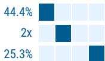

Refinitiv; MSPB Content. Includes certain hedge fund exposures held with MSPB. Information may be inconsistent with or may not reflect broader market trends. Long/Short Ratio = Long Exposure / Short exposure. Sector % of Total Net Exposure = (For a particular sector: Long Exposure - Short Exposure) / (Across all sectors: Long Exposure – Short Exposure).

# MS ESTIMATES VS. CONSENSUS

FY Sep 2026e

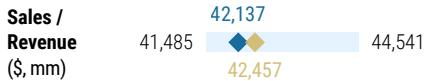

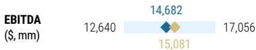

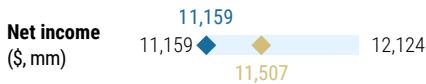

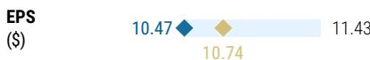

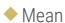

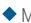

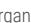

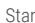

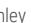

  
Source: Refinitiv, MS

# Risk Reward – Palo Alto Networks Inc (PANW.O)

Risk Reward for Palo Alto Networks Inc (PANW.O) has been updated

# PRICE TARGET \$223.00

Based on 32x Base Case 2027e FCF per share of \$6.31; this multiple is relatively inline with similarly growing large cap software peers.

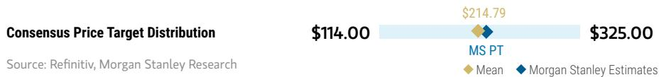

bar_line

| Category | Value    |
| -------- | -------- |
| MS PT    | $214.79  |
| MS Estimates | $325.00   |
| Source: Refinitiv, MS | $114.00  |

RISK REWARD CHART AND OPTIONS IMPLIED PROBABILITIES (12M)   
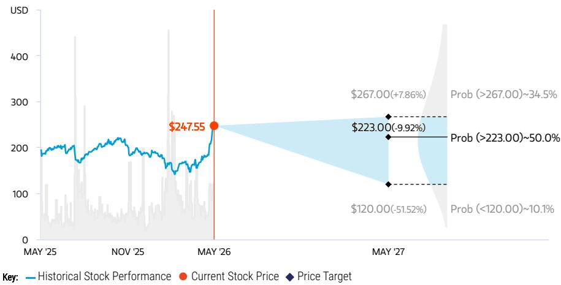

line

| Date     | Historical Stock Performance | Current Stock Price | Price Target |
| -------- | ----------------------------- | ------------------- | ------------ |
| MAY '25  | ~$200                         | -                   | -            |
| NOV '25  | ~$200                         | -                   | -            |
| MAY '26  | $247.55                       | $247.55             | -            |
| MAY '27  | -                             | $267.00 (+7.86%)   | $223.00 (-9.92%) |
| MAY '27  | -                             | $267.00 (~34.5%)    | $120.00 (-51.52%) |

Source: Refinitiv, MS, MS Institutional Equities Division. The probabilities of our Bull, Base, and Bear case scenarios playing out were estimated with implied volatility data from the options market as of 18 May 2026. All figures are approximate risk-neutral probabilities of the stock reaching beyond the scenario price in either three-months' or one-years' time. View explanation of Options Probabilities methodology here

# OVERWEIGHT THESIS

■ Palo Alto Networks offers a disruptive platform, well positioned to address the evolving threat landscape and consolidate a fragmented security market. We believe Palo Alto Networks will continue to differentiate itself from its peers as it proves out a broader TAM around a Next-Gen Security Platform (and executing to that opportunity).

■ With strong secular positioning and the drive towards higher operating margins, we remain confident in the company's ability to sustain durable FCF growth over the next 3 years.

Consensus Rating Distribution   
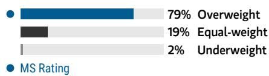

bar

| Category      | Value |
| ------------- | ----- |
| Overweight    | 79%   |
| Equal-weight  | 19%   |
| Underweight   | 2%    |

Source: Refinitiv, MS

# Risk Reward Themes

Secular Growth: Positive

View descriptions of Risk Rewards Themes here

# BULL CASE \$267.00

# 35x Bull Case 2027e FCF per share of \$7.05

Consolidating the Broader Security Market. Total revenue grows at a 22% CAGR over the next 2 years and reaches \~\$15.2B by CY27 on stronger Next-Gen Security sales and firewall refresh. Operating margins move to \~32% by CY27 with FCF margin of \~39.5%. PANW trades at a 35x EV/FCF multiple in CY27.

# BASE CASE \$223.00

# 32x Base Case 2027e FCF per share of \$6.31

Sustaining Above Market Growth. PANW sustains mid-teens topline CAGR, with revenue reaching \~\$14.0B by CY27. Operating margins improve to \~31% by CY27 through higher gross margin and S&M leverage and FCF margin is \~38.5% in CY27. PANW sustains 32x EV/FCF in CY27, a multiple relatively inline with similarly growing large cap software peers.

# BEAR CASE \$120.00

# 17x Bear Case 2027e FCF per share of \$6.01

Slowing Growth. Prolonged macro slowdown and slower firewall demand persists, while new product traction stalls. Total revenue growth slows with limited operating leverage and duration headwinds driving FCF margin down. PANW trades at 17x EV/FCF on CY27.

# Risk Reward – Palo Alto Networks Inc (PANW.O)

KEY EARNINGS INPUTS 

<table><tr><td>Drivers</td><td>2025</td><td>2026e</td><td>2027e</td><td>2028e</td></tr><tr><td>Product &amp; Licensing Revenue YoY Growth (%)</td><td>12.4</td><td>21.5</td><td>8.0</td><td>6.0</td></tr><tr><td>Total Billings YoY Growth (%)</td><td>2.8</td><td>12.1</td><td>10.2</td><td>7.0</td></tr><tr><td>Non Firewall Billings YoY Growth (%)</td><td>23.2</td><td>41.0</td><td>25.0</td><td>14.7</td></tr><tr><td>Free Cash Flow Margin (%)</td><td>37.6</td><td>37.0</td><td>37.0</td><td>20.6</td></tr></table>

# INVESTMENT DRIVERS

• Firewall refresh picks up in 2025/26   
- New product introductions and greater subscription attach   
- Faster adoption of next-gen security offerings (Prisma Cloud, Prisma SASE, Cortex)

# GLOBAL REVENUE EXPOSURE

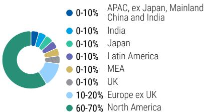

pie

| Region | Percentage (%) |
| :--- | :--- |
| APAC, ex Japan, Mainland China and India | 0-10 |
| India | 0-10 |
| Japan | 0-10 |
| Latin America | 0-10 |
| MEA | 0-10 |
| UK | 0-10 |
| Europe ex UK | 10-20 |
| North America | 60-70 |

Source: MS Estimate View explanation of regional hierarchies here

# MS ALPHA MODELS

4/5

BEST

24 Month

Horizon

4/5

MOST

3 Month

Horizon

Source: Refinitiv, FactSet, MS; 1 is the highest favored Quintile and 5 is the least favored Quintile

# RISKS TO PT/RATING

# RISKS TO UPSIDE

• Stronger firewall refresh cycle and higher subscription attach rates   
- Faster uptake of new Cloud-based Next-Gen Security solutions such as Cortex (AI-Powered Security Analytics) and Prisma SASE   
- Slowing firewall refreshes could drive a greater than expected impact to PANW's top line growth   
- An increasingly competitive environment could necessitate additional S&M spending, limiting margin leverage.

# RISKS TO DOWNSIDE

# OWNERSHIP POSITIONING

Inst. Owners, % Active

HF Sector Long/Short Ratio

HF Sector Net Exposure

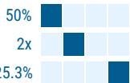

Refinitiv; MSPB Content. Includes certain hedge fund exposures held with MSPB. Information may be inconsistent with or may not reflect broader market trends. Long/Short Ratio = Long Exposure / Short exposure. Sector % of Total Net Exposure = (For a particular sector: Long Exposure - Short Exposure) / (Across all sectors: Long Exposure – Short Exposure).

# MS ESTIMATES VS. CONSENSUS

FY Jul 2026e

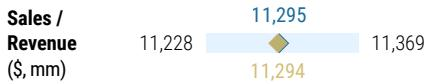

bar

| Sales / Revenue ($, mm) | Value   |
| ------------------------ | ------- |
| 11,228                   | 11,295  |
| 11,369                   | 11,294  |

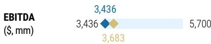

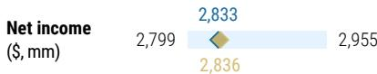

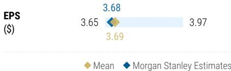

bar_line

|        | EPS ($) |
| ------ | ------- |
| Mean   | 3.65    |
| MS Estimates | 3.69    |
| Median | 3.68    |
| Estimate | 3.97    |

Source: Refinitiv, MS

# Risk Reward – Applied Materials Inc. (AMAT.O)

DRAM/Leading Logic upside & China/ICAPS derisked

# PRICE TARGET \$502.00

\~28x CY27e EPS of \$17.94, a 6-turn discount to LAM and 5-turns to KLA to reflect growth prospects in DRAM but concerns around market share loss in China.

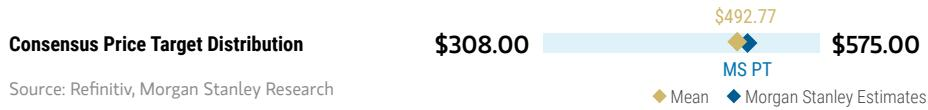

bar_line

| Category | Value     |
| -------- | --------- |
| MS PT    | $492.77   |
| MS PT    | $575.00   |
| Mean     | $308.00   |
| MS Estimates | $575.00  |

RISK REWARD CHART AND OPTIONS IMPLIED PROBABILITIES (12M)   
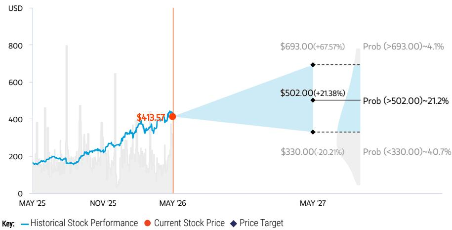

line

| Date       | Historical Stock Performance | Current Stock Price | Price Target |
| ---------- | ----------------------------- | ------------------- | ------------ |
| MAY '26    | $413.57                       | -                   | -            |
| MAY '27    | -                             | $693.00(+67.57%)   | $502.00(+21.38%) |
| MAY '27    | -                             | $502.00(~21.2%)    | $330.00(~-20.21%) |

Source: Refinitiv, MS, MS Institutional Equities Division. The probabilities of our Bull, Base, and Bear case scenarios playing out were estimated with implied volatility data from the options market as of 18 May 2026. All figures are approximate risk-neutral probabilities of the stock reaching beyond the scenario price in either three-months' or one-years' time. View explanation of Options Probabilities methodology here

# EQUAL-WEIGHT THESIS

■ AMAT has traded at a material valuation discount vs LAM & KLA given execution and concerns around market share loss in China. We think AMAT will be a share gainer in 2026 but given our growth forecast is in-line with broader WFE in 2027 we think the valuation discount is unlikely to narrow in the near term.   
■ AMAT has the highest DRAM mix in their portfolio (CY26 31% vs LAM 23%, KLA 28%) and is most levered to greenfield wafer additions. We see DRAM as the fastest growing end-market in 2026 but the slowest growing in 2027.

Consensus Rating Distribution   
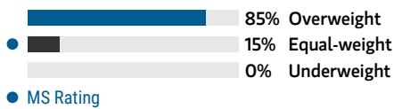

bar

| Category | Value (%) |
|---|---|
| Overweight | 85 |
| Equal-weight | 15 |
| Underweight | 0 |
| MS Rating | |

Source: Refinitiv, MS

# Risk Reward Themes

New Data Era: Positive

View descriptions of Risk Rewards Themes here

# BULL CASE

# \$693.00

# \~33x CY27 EPS of \$20.37

DRAM & ICAPS remain strong and AMAT's margin expansion accelerates.

- Revenue grows 36.9% in CY27 as AMAT outperforms WFE   
- Gross margin expands to 51.3% in CY27   
- Multiples expand to 33x PE, as equipment is perceived as a growth sector within semis

# BASE CASE

# \~28x CY27 EPS of \$17.94

AMAT grows in-line with WFE with DRAM growth slightly offset by China/ICAPS

- Revenue growth of 24.5% in CY27   
- Non-GAAP gross margin slightly increases to 50.8% in CY27   
-Multiple at a premium to AMAT's historical average

# \$502.00

# BEAR CASE

# \$330.00

# \~21x CY27 EPS of \$15.72

DRAM WFE remains weak in 2026 and leading edge logic sees headwinds from foundries scaling back their aspirations.

- Revenue increases 14.5% in CY27 as WFE recovery is subdued.   
- Gross margin slightly increases to 50.1% in CY27   
- Multiple contracts to a 21x PE, 1 standard deviation premium to historical levels

# Risk Reward – Applied Materials Inc. (AMAT.O)

KEY EARNINGS INPUTS 

<table><tr><td>Drivers</td><td>2025</td><td>2026e</td><td>2027e</td><td>2028e</td></tr><tr><td>GAAP Revenue ($, mm)</td><td>28,368</td><td>33,483</td><td>43,373</td><td>48,812</td></tr><tr><td>MW Gross Margin (%)</td><td>48.8</td><td>50.0</td><td>50.8</td><td>50.8</td></tr><tr><td>Non-GAAP EPS ($)</td><td>9.42</td><td>12.31</td><td>17.02</td><td>19.71</td></tr><tr><td>Inventory ($, mm)</td><td>5,915</td><td>7,580</td><td>9,137</td><td>9,786</td></tr><tr><td>DOI</td><td>146.2</td><td>162.8</td><td>154.0</td><td>146.5</td></tr></table>

# INVESTMENT DRIVERS

• DRAM WFE outpaces overall WFE growth   
- AMAT capitalizes on logic growth opportunities (GAA, back-side power)

# GLOBAL REVENUE EXPOSURE

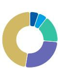

0-10% Europe ex UK   
0-10% Japan   
10-20% North America   
20-30% Mainland China   
40-50% APAC, ex Japan, Mainland China and India

Source: MS Estimate View explanation of regional hierarchies here

# MS ALPHA MODELS

5/5 BEST

24 Month Horizon

3/5
MOST

3 Month Horizon

Source: Refinitiv, FactSet, MS; 1 is the highest favored Quintile and 5 is the least favored Quintile

# RISKS TO PT/RATING

# RISKS TO UPSIDE

• Market share gains as DRAM outpaces WFE   
- AMAT captures market share in logic architecture inflections (backside power)

# RISKS TO DOWNSIDE

- Widespread restrictions on equipment shipments and services to China   
- AMAT loses market share with key customers (Samsung, TSMC)

# OWNERSHIP POSITIONING

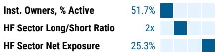

bar

| Category | Value |
| -------- | ----- |
| Inst. Owners, % Active | 51.7% |
| HF Sector Long/Short Ratio | 2x |
| HF Sector Net Exposure | 25.3% |

Refinitiv; MSPB Content. Includes certain hedge fund exposures held with MSPB. Information may be inconsistent with or may not reflect broader market trends. Long/Short Ratio = Long Exposure / Short exposure. Sector % of Total Net Exposure = (For a particular sector: Long Exposure - Short Exposure) / (Across all sectors: Long Exposure – Short Exposure).

# MS ESTIMATES VS. CONSENSUS

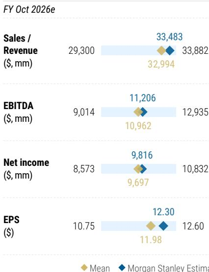

bar_line

FY Oct 2026e
| Metric | Mean ($) | MS Estimate ($) |
| :--- | :--- | :--- |
| Sales / Revenue ($, mm) | 29,300 | 33,483 |
| EBITDA ($, mm) | 9,014 | 11,206 |
| Net income ($, mm) | 8,573 | 9,816 |
| EPS ($) | 10.75 | 12.30 |
| (Note: The actual values for Sales/Revenue and EBITDA are not provided in the image; they are estimated based on the 'MS Estimate' column in the data table).)

Source: Refinitiv, MS

# Risk Reward – Advanced Micro Devices (AMD.O)

Like AMD's position in server, but high AI expectations limit room for upside

# PRICE TARGET \$410.00

Our \$360 PT for AMD equals \~37x base case FY2027e MWEPS of \$11.10, reflecting further share gains at the expense of Intel, and 77% y/y growth in datacenter (\~100% in AI)

bar_line

| Category | Value    |
| -------- | -------- |
| MS PT    | $436.21  |
| MS Estimates | $625.00  |
| Mean     | $134.20  |

RISK REWARD CHART AND OPTIONS IMPLIED PROBABILITIES (12M)   
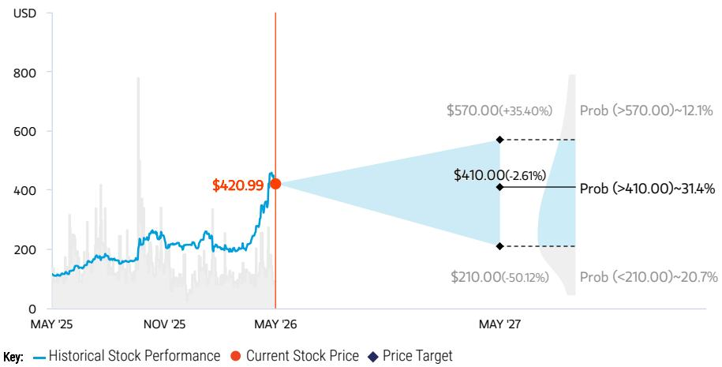

line

| Date     | Historical Stock Performance | Current Stock Price | Price Target |
| -------- | ----------------------------- | ------------------- | ------------ |
| MAY '25  | ~100                          | -                   | -            |
| NOV '25  | ~200                          | -                   | -            |
| MAY '26  | $420.99                       | $420.99             | -            |
| MAY '27  | -                             | $570.00              | $210.00      |
| Prob (>570.00) | -                         | -                   | $410.00      |
| Prob (>410.00) | -                         | -                   | $410.00      |
| Prob (<210.00) | -                         | -                   | $210.00      |
| Prob (>570.00) | -                         | -                   | $570.00      |
| Prob (Prob)   | -                         | -                   | $570.00      |
| Prob (Prob)   | -                         | -                   | $570.00      |
| Prob (Prob)   | -                         | -                   | $570.00      |
| Prob (Prob)   | -                         | -                   | $570.00      |
| Prob (Prob)   | -                         | -                   | $570,000     |
| Prob (Prob)   | -                         | -                   | $570,000     |
| Prob (Prob)   | -                         | -                   | $570,000     |
| Prob (Prob)   | -                         | -                   | $570,000     |
| Prob (Prob)   | -                         | -                   | $570,000     |
| Prob (Prob)   (Prob) | -                      | -                 | $570,000     |
| Prob (Prob)   (Prob) | -                      | -                 | $570,000     |
| Prob (Prob)   (Prob) | -                      | -                 | $570,000     |
| Prob (Prob)   (Prob) | -                      | -                 | $570,000     |
| Prob (Prob)   (Prob) | $410.00 (-2.61%)               | $410.00              | $410,000     |
| Prob (Prob)   (Prob) | $410.00 (~31.4%)              | $410,000             | $410,000     |
| Prob (Prob)   (Prob) | $210.00 (~50.12%)              | $210,000             | $210,000     |
| Prob (Prob)   (Prob) | -                           | -                   | $210,000     |
| Prob (Prob)   (Prob) | -                           | -                   | $210,000     |
| Prob (Prob)   (Prob) | -                           | -                   | $210,000     |
| Prob (Prob)   (Prob) | -                           | -                   | $210,000     |
| Prob (Prob)   (Prob) | $570.00 (+35.4%)              | $570.00              | $570,000     |
| Prob (Prob)   (Prob) | $570.00 (~12.1%)              | $570.00              | $570,000     |
| Prob (Prob)   (Prob) | $570.00 (~31.4%)              | $570.00              | $570,000     |
| Prob (Prob)   (Prob) | $570.00 (~58.4%)              | $570.00              | $570,000     |
| Prob (Prob)   (Prob) | $570.00 (~31.4%)              | $570.00              | $57,688      |
| Prob (Prob)   (Prob) | $57,688                        | $57,688              | $57,688      |
| Prob (Prob)   (Prob) | $57,688                        | $57,688              | $57,688      |
| Prob (Prob)   (Prob) | $57,688                        | $57,688              | $57,688      |
| Prob (Prob)   (Prob) | $57,888                        | $57,888              | $57,888      |
| Prob (Prob)   (Prob) | $58,888                        | $58,888              | $58,888      |
| Prob (Prob)   (Prob) | $59,888                        | $59,888              | $59,888      |
| Prob (Prob)   (Prob) | $61,888                        | $61,888              | $61,888      |
| Prob (Prob)   (Prob) | $63,888                        | $63,888              | $63,888      |
| Prob (Prob)   (Prob) | $65,888                        | $65,888              | $65,888      |
| Prob (Prob)   (Prob) | $67,888                        | $67,888              | $67,888      |
| Prob (Prob)   (Prob) | $69,888                        | $69,888              | $69,888      |
| Prob (Prob)   (Prob) | $71,888                        | $71,888              | $71,888      |
| Prob (Prob)   (Prob) | $73,888                        | $73,888              | $73,888      |
| Prob (Prob)   (Prob) | $75,888                        | $75,888              | $75,888      |
| Prob (Prob)   (Prob) | $77,888                        | $77,888              | $77,888      |
| Prob (Prob)   (Prob) | $79,888                        | $79,888              | $79,888      |
| Prob (Prob)   (Prob) | $81,888                        | $81,888              | $81,888      |
| Prob (Prob)   (Prob) | $83,888                        | $83,888              | $83,888      |
| Prob (Prob)   (Prob) | $85,888                        | $85,888              | $85,888      |
| Prob (Prob)   (Prob) | $87,888                        | $87,888              | $87,888      |
| Prob (Prob)   (Prob) | $89,888                        | $89,888              | $89,888      |
| Prob (Prob)   (Prob) | $91,888                        | $91,888              | $91,888      |
| Prob (Prob)   (Prob) | $93,888                        | $93,888              | $93,888      |
| Prob (Prob)   (Prob) | $95,888                        | $95,888              | $95,88B      |
| Prob (Prob)   (Prob) | $97,88B                        | $97, 31.4%           | $97, 31.4%    |
| Prob (Prob)   (Prob) | $99, 31.4%                     | -                   | -            |
| Prob (Prob)   (Prob)|

Source: Refinitiv, MS, MS Institutional Equities Division. The probabilities of our Bull, Base, and Bear case scenarios playing out were estimated with implied volatility data from the options market as of 18 May 2026. All figures are approximate risk-neutral probabilities of the stock reaching beyond the scenario price in either three-months' or one-years' time. View explanation of Options Probabilities methodology here

# EQUAL-WEIGHT THESIS

We see continued share gains in notebook and server processors in 2026 and 2027 as AMD continues to execute on its product roadmap. AMD's AI story should gain momentum later this year with MI450 products, but performance leadership will be key. An area where AMD will need to prove they can deliver competitive ROI vs incumbents

Consensus Rating Distribution   
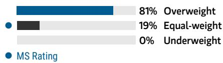

bar

| Category      | Value |
| ------------- | ----- |
| Overweight    | 81%   |
| Equal-weight  | 19%   |
| Underweight   | 0%    |
| MS Rating     | 0%    |

Source: Refinitiv, MS

# Risk Reward Themes

New Data Era: Positive
Secular Growth: Positive

View descriptions of Risk Rewards Themes here

# BULL CASE

# \$570.00

# \~40x bull case FY2027e MW EPS of \$14.27

Bull case assumes further execution for AMD. In computing and graphics, AMD continues to gain material market share, while both CPU and GPU markets remain healthier than forecasted. AMD solidifies a #2 position in the datacenter GPU market

# BASE CASE

# \~37x base case FY2027e MW EPS of \$11.10

Further share gains for AMD in server compute and notebook continue to drive growth, further supported by a strengthening AI GPU story

# \$410.00

# BEAR CASE

# \$210.00

# \~20x bear case FY2027e MW EPS of \$9.45

AMD loses momentum in AI, and Intel shows signs it's beginning to regain its footing in server. The multiple compresses as they are unable to drive meaningful revenues in AI markets beyond one or two customers

# Risk Reward – Advanced Micro Devices (AMD.O)

KEY EARNINGS INPUTS 

<table><tr><td>Drivers</td><td>2025</td><td>2026e</td><td>2027e</td><td>2028e</td></tr><tr><td>GAAP Revenue ($, mm)</td><td>34,639</td><td>48,807</td><td>68,227</td><td>89,972</td></tr><tr><td>Non-GAAP Gross Margin (%)</td><td>52.4</td><td>55.2</td><td>56.9</td><td>57.2</td></tr><tr><td>Non-GAAP EPS ($)</td><td>4.23</td><td>7.22</td><td>12.12</td><td>16.79</td></tr><tr><td>Inventory ($, mm)</td><td>7,920</td><td>13,518</td><td>15,775</td><td>18,263</td></tr><tr><td>DOI</td><td>165.3</td><td>215.2</td><td>189.1</td><td>170.2</td></tr></table>

# INVESTMENT DRIVERS

- AMD continues to execute to its product roadmaps, enabling it to gain share on a smaller R&D budget than INTC   
- AI ecosystem adoption takes time, and we see AMD's early success as more of a testament to the strength of the overall market thus far

# GLOBAL REVENUE EXPOSURE

0-10% Europe ex UK   
0-10% Japan   
0-10% MEA   
10-20% APAC, ex Japan, Mainland China and India   
20-30% Mainland China   
30-40% North America

Source: MS Estimate View explanation of regional hierarchies here

# MS ALPHA MODELS

5/5 BEST

24 Month Horizon

5/5
MOST

3 Month Horizon

Source: Refinitiv, FactSet, MS; 1 is the highest favored Quintile and 5 is the least favored Quintile

# RISKS TO PT/RATING

# RISKS TO UPSIDE

- Datacenter GPU outperforms expectations, closing the gap with Nvidia   
- PC and server share gain accelerates; Intel's competitive response is less impressive than expected   
- Server refresh drives datacenter revenue above expectations

# RISKS TO DOWNSIDE

- Intel's server CPUs in 2027 stifle AMD's momentum and allow it to regain share   
• AMD loses graphics share to NVIDIA   
• Datacenter GPU underperforms expectations

# OWNERSHIP POSITIONING

Inst. Owners, % Active

HF Sector Long/Short Ratio

HF Sector Net Exposure

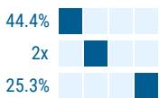

Refinitiv; MSPB Content. Includes certain hedge fund exposures held with MSPB. Information may be inconsistent with or may not reflect broader market trends. Long/Short Ratio = Long Exposure / Short exposure. Sector % of Total Net Exposure = (For a particular sector: Long Exposure - Short Exposure) / (Across all sectors: Long Exposure – Short Exposure).

# MS ESTIMATES VS. CONSENSUS

FY Dec 2026e

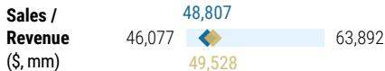

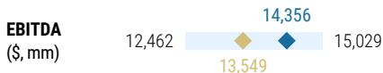

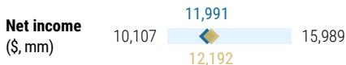

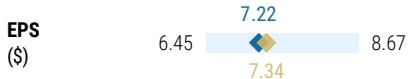  
◆ Mean ◆ MS Estimates   
Source: Refinitiv, MS

MS is acting as financial advisor to Wiz, Inc. ("Wiz") in connection with its definitive agreement to be acquired by Google LLC, as announced on March 18, 2025. The proposed transaction is subject to customary closing conditions including regulatory approvals. Wiz has agreed to pay fees to MS for its financial services, including fees that are contingent upon the consummation of the transaction. Please refer to the notes at the end of this report.

# Risk Reward Reference links

1. View explanation of Options Probabilities methodology - Options\_Probabilities\_Exhibit\_Link.pdf   
2. View descriptions of Risk Rewards Themes - RR\_Themes\_Exhibit\_Link.pdf   
3. View explanation of regional hierarchies - GEG\_Exhibit\_Link.pdf   
4. View explanation of Theme/Exposure methodology - ESG\_Sustainable\_Solutions\_External\_Link.pdf   
5. View explanation of HERS methodology - ESG\_HERS\_External\_Link.pdf

# Disclosure Section

The information and opinions in MS were prepared by MS & Co. LLC, and/or MS C.T.V.M. S.A., and/or MS Mexico, Casa de Bolsa, S.A. de C.V., and/or MS Canada Limited. As used in this disclosure section, "MS" includes MS & Co. LLC, MS C.T.V.M. S.A., MS Mexico, Casa de Bolsa, S.A. de C.V., MS Canada Limited and their affiliates as necessary.

For important disclosures, stock price charts and equity rating histories regarding companies that are the subject of this report, please see the MS Disclosure Website at www.morganstanley.com/eqr/disclosures/webapp/generalresearch, or contact your investment representative or MS at 1585 Broadway, (Attention: Research Management), New York, NY, 10036 USA.

For valuation methodology and risks associated with any recommendation, rating or price target referenced in this research report, please contact the Client Support Team as follows: US/Canada +1 800 303-2495; Hong Kong +852 2848-5999; Latin America +1 718 754-5444 (U.S.); London +44 (0)20-7425-8169; Singapore +65 6834-6860; Sydney +61 (0)2-9770-1505; Tokyo +81 (0)3-6836-9000. Alternatively you may contact your investment representative or MS at 1585 Broadway, (Attention: Research Management), New York, NY 10036 USA.

# Analyst Certification

The following analysts hereby certify that their views about the companies and their securities discussed in this report are accurately expressed and that they have not received and will not receive direct or indirect compensation in exchange for expressing specific recommendations or views in this report: Meta A Marshall; Joseph Moore; Brian Nowak, CFA; Keith Weiss, CFA; Erik W Woodring.

# Global Research Conflict Management Policy

MS has been published in accordance with our conflict management policy, which is available at www.morganstanley.com/institutional/research/conflictpolicies. A Portuguese version of the policy can be found at www.morganstanley.com.br

# Important Regulatory Disclosures on Subject Companies

The analyst or strategist (or a household member) identified below owns the following securities (or related derivatives): Meta A Marshall - Adobe Inc.(common or preferred stock), Advanced Micro Devices(common or preferred stock), Alphabet Inc.(common or preferred stock), Amazon.com Inc(common or preferred stock), Apple, Inc.(common or preferred stock), Broadcom Inc.(common or preferred stock), Corning Inc(common or preferred stock), Intuit(common or preferred stock), Meta Platforms Inc(common or preferred stock), Microsoft(common or preferred stock), NVIDIA Corp.(common or preferred stock), Oracle Corporation(common or preferred stock), Palo Alto Networks Inc(common or preferred stock); Brian Nowak, CFA - Advanced Micro Devices(common or preferred stock), Micron Technology Inc.(common or preferred stock), NVIDIA Corp.(common or preferred stock), ON Semiconductor Corp.(common or preferred stock); Keith Weiss, CFA - IBM(common or preferred stock), Resideo Technologies Inc(common or preferred stock), Uber Technologies Inc(common or preferred stock), Wolfspeed, INC(common or preferred stock); Erik W Woodring - Alphabet Inc.(common or preferred stock), Amazon.com Inc(common or preferred stock), NVIDIA Corp.(common or preferred stock).

As of April 30, 2026, MS beneficially owned 1% or more of a class of common equity securities of the following companies covered in MS: Adobe Inc., Advanced Micro Devices, Aeva Technologies Inc, Airbnb Inc, Akamai Technologies, Inc., Allegro Microsystems Inc, Alphabet Inc., Amazon.com Inc, Ambarella Inc, Amplitude Inc., Analog Devices Inc., Appian Corp, Apple, Inc., Applied Materials Inc., AppLovin Corp, Arista Networks, Arm Holdings plc, Asana Inc, Astera Labs Inc, Atlassian Corporation PLC, Autodesk, Axon Enterprise Inc, BILL Holdings Inc, Blackline Inc, Booking Holdings Inc, Box Inc, Broadcom Inc., C3.ai, Cadence Design Systems Inc, CCC Intelligent Solutions Holdings Inc, CDW Corporation, Check Point Software Technologies Ltd., Chewy Inc, Ciena Corporation, Cisco Systems Inc, Cloudflare Inc, Coherent Corp, CoreWeave, Corning Inc, Coursera, Inc., Cricut Inc, Criteo SA, CrowdStrike Holdings Inc, Datadog, Inc., Dell Technologies Inc., Descartes Systems Group Inc, DigitalOcean Holdings Inc, DocuSign Inc, DoorDash Inc, DoubleVerify Holdings Inc, Duolingo Inc, eBay Inc, Elastic NV, Electronic Arts Inc, Etsy Inc, Everpure, Inc., Expedia Inc., F5Inc, Figma Inc, FIGS, Inc., Five9 Inc, Fortinet Inc., Freshworks Inc, Garmin Ltd, Gen Digital Inc., GitLab Inc, GoDaddy Inc, Hewlett Packard Enterprise, HP Inc., HubSpot, Inc., IBM, Instacart, Intel Corporation, Intuit, IonQ Inc, Keysight Technologies Inc, KLA Corp, Klaviyo, Inc, Kornit Digital Ltd., Lam Research Corp, LegalZoom.com Inc, Lightspeed POS Inc., Liveramp Holdings Inc, Logitech International SA, Lumentum Holdings Inc, Lyft Inc, Manhattan Associates Inc., Marvell Technology Group Ltd, Match Group Inc, Meta Platforms Inc, Microchip Technology Inc., Micron Technology Inc., Microsoft, monday.com Ltd, MongoDB Inc, Motorola Solutions Inc, Nebius Group NV, NetApp Inc, NICE Ltd., NVIDIA Corp., NXP Semiconductor NV, Okta, Inc., ON Semiconductor Corp., Opendoor Technologies Inc, Oracle Corporation, PagerDuty, Inc., Palantir Technologies Inc., Palo Alto Networks Inc, Peloton Interactive, Inc., Pinterest Inc, Qualcomm Inc., Qualys Inc, Rapid7 Inc, Reddit Inc, Resideo Technologies Inc, Revolve Group Inc, RingCentral Inc, Roblox Corporation, Sabre Corp, Salesforce, Inc., Samsara Inc, SanDisk Corporation., Seagate Technology, Semtech Corp., SentinelOne, Inc., ServiceNow Inc, ServiceTitan Inc, Shopify Inc, Shutterstock Inc, Silicon Laboratories Inc., Skyworks Solutions Inc, SmartRent, Inc., Snap Inc., Snowflake Inc., Sonos Inc., Sprinklr Inc, Sprout Social Inc, SPS Commerce Inc, Synopsys Inc., Take-Two Interactive Software, Tenable Holdings Inc, Teradata, Teradyne Inc, Tesla Inc, Texas Instruments, Toast, Inc., Trade Desk Inc, Twilio Inc, Uber Technologies Inc, UiPath Inc, Unity Software Inc, Varonis Systems, Inc., Vertex Inc., Western Digital, Wix.Com Ltd, Wolfspeed, INC, Workday Inc, Yelp Inc, Zebra Technologies Corporation, Zeta Global Holdings Corp, Zillow Group Inc, ZoomInfo Technologies Inc, Zscaler Inc.

Within the last 12 months, MS managed or co-managed a public offering (or 144A offering) of securities of Airbnb Inc, Akamai Technologies, Inc., Alphabet Inc., Amazon.com Inc, Analog Devices Inc., Autodesk, Broadcom Inc., Camtek, Check Point Software Technologies Ltd., Cloudflare Inc, Compass, Inc., CoreWeave, Dell Technologies Inc., DigitalOcean Holdings Inc, DoorDash Inc, eBay Inc, Figma Inc, GlobalFoundries Inc, Ingram Micro, Intel Corporation, Klaviyo, Inc, Lumentum Holdings Inc, Match Group Inc, Meta Platforms Inc, MKS Inc., MNTN Inc, Navan Inc, Nebius Group NV, Netskope, Inc., Nova Ltd, NXP Semiconductor NV, ON Semiconductor Corp., Palo Alto Networks Inc, Qualcomm Inc., Sabre Corp, Salesforce, Inc., Seagate Technology, Semtech Corp., Texas Instruments, Uber Technologies Inc, Via Transportation Inc, Wix.Com Ltd.

Within the last 12 months, MS has received compensation for investment banking services from Advanced Micro Devices, Aeva Technologies Inc, Airbnb Inc, Allegro Microsystems Inc, Alphabet Inc., Amazon.com Inc, Amkor Technology Inc, Analog Devices Inc., Applied Materials Inc., Autodesk, Blackline Inc, Broadcom Inc., Camtek, CCC Intelligent Solutions Holdings Inc, CDW Corporation, Check Point Software Technologies Ltd., Cloudflare Inc, Coherent Corp, CoreWeave, Corning Inc, Dell Technologies Inc., DigitalOcean Holdings Inc, DocuSign Inc, DoorDash Inc, eBay Inc, Figma Inc, HubSpot, Inc., Instacart, Intel Corporation, Intuit, IonQ Inc, Lumentum Holdings Inc, Match Group Inc, Meta Platforms Inc, Micron Technology Inc., Microsoft, MKS Inc., MNTN Inc, Navan Inc, Nebius Group NV, Netskope, Inc., NICE Ltd., Nova Ltd, NXP Semiconductor NV, ON Semiconductor Corp., Palo Alto Networks Inc, Qualcomm Inc., Reddit Inc, RingCentral Inc, Sabre Corp, SailPoint Inc, Salesforce, Inc., Seagate Technology, Semtech Corp., ServiceNow Inc, Texas Instruments, Uber Technologies Inc, Via Transportation Inc, Wix.Com Ltd, Workday Inc, Zebra Technologies Corporation, Zeta Global Holdings Corp.

In the next 3 months, MS expects to receive or intends to seek compensation for investment banking services from Adobe Inc., Advanced Micro Devices, Aeva Technologies Inc, Airbnb Inc, Akamai Technologies, Inc., Allegro Microsystems Inc, Alphabet Inc., Amazon.com Inc, Ambarella Inc, Amkor Technology Inc, Amplitude Inc., Analog Devices Inc., Appian Corp, Apple, Inc., Applied Materials Inc., AppLovin Corp, Arista Networks, Arm Holdings plc, Asana Inc, Astera Labs Inc, Atlassian Corporation PLC, Autodesk, Axon Enterprise Inc, BILL Holdings Inc, Blackline Inc, Booking Holdings Inc, Box Inc, Broadcom Inc., Bumble Inc., C3.ai, Cadence Design Systems Inc, Camtek, CCC Intelligent Solutions Holdings Inc, CDW Corporation, Check Point Software Technologies Ltd., Chewy Inc, Ciena Corporation, Cisco Systems Inc, Cloudflare Inc, Coherent Corp, Commerce.com Inc., CoreWeave, Corning Inc, Coursera, Inc., Criteo SA, CrowdStrike Holdings

Inc, Datadog, Inc., Dell Technologies Inc., Descartes Systems Group Inc, DigitalOcean Holdings Inc, Docebo Inc., DocuSign Inc, DoorDash Inc, DoubleVerify Holdings Inc, Duolingo Inc, eBay Inc, Elastic NV, Electronic Arts Inc, Etsy Inc, Everpure, Inc., Expedia Inc., F5 Inc, Figma Inc, FIGS, Inc., Five9 Inc, Fortinet Inc., Freshworks Inc, Garmin Ltd, Gen Digital Inc., GitLab Inc, GlobalFoundries Inc, GoDaddy Inc, GoPro Inc, Hewlett Packard Enterprise, HP Inc., HubSpot, Inc., IBM, Ingram Micro, Instacart, Intel Corporation, Intuit, IonQ Inc, JFrog Ltd., Keysight Technologies Inc, KLA Corp, Klaviyo, Inc, Kornit Digital Ltd., Lam Research Corp, LegalZoom.com Inc, Lightspeed POS Inc., Liveramp Holdings Inc, Logitech International SA, Lumentum Holdings Inc, Lyft Inc, Marvell Technology Group Ltd, Match Group Inc, Meta Platforms Inc, Microchip Technology Inc., Micron Technology Inc., Microsoft, MKS Inc., MNTN Inc, monday.com Ltd, MongoDB Inc, Motorola Solutions Inc, Navan Inc, Navitas Semiconductor Corp, Nebius Group NV, NetApp Inc, Netskope, Inc., NICE Ltd., Nova Ltd, Nutanix Inc, NVIDIA Corp., NXP Semiconductor NV, Okta, Inc., ON Semiconductor Corp., Opendoor Technologies Inc, Oracle Corporation, PagerDuty, Inc., Palantir Technologies Inc., Palo Alto Networks Inc, Peloton Interactive, Inc., Pinterest Inc, Playtika Holding Corp, Qualcomm Inc., Qualys Inc, Rapid7 Inc, Reddit Inc, Resideo Technologies Inc, Revolve Group Inc, RingCentral Inc, Roblox Corporation, Sabre Corp, SailPoint Inc, Salesforce, Inc., Samsara Inc, SanDisk Corporation., Seagate Technology, Semtech Corp., SentinelOne, Inc., ServiceNow Inc, ServiceTitan Inc, Shopify Inc, Shutterstock Inc, Silicon Laboratories Inc., Skyworks Solutions Inc, SmartRent, Inc., Snap Inc., Snowflake Inc., Sonos Inc., Sprinklr Inc, Sprout Social Inc, SPS Commerce Inc, Synopsys Inc., Take-Two Interactive Software, Tenable Holdings Inc, Teradata, Teradyne Inc, Tesla Inc, Texas Instruments, Toast, Inc., Trade Desk Inc, Twilio Inc, Uber Technologies Inc, UiPath Inc, Unity Software Inc, Varonis Systems, Inc., Vertex Inc., Via Transportation Inc, Webtoon Entertainment Inc, Western Digital, Wix.Com Ltd, Wolfspeed, INC, Workday Inc, Yelp Inc, Zebra Technologies Corporation, Zeta Global Holdings Corp, Zillow Group Inc, Zoom Communications, Zscaler Inc.

Within the last 12 months, MS has received compensation for products and services other than investment banking services from Adobe Inc., Advanced Micro Devices, Airbnb Inc, Alphabet Inc., Amazon.com Inc, Ambarella Inc, Amkor Technology Inc, Amplitude Inc., Analog Devices Inc., Apple, Inc., Applied Materials Inc., Asana Inc, Atlassian Corporation PLC, Autodesk, Blackline Inc, Booking Holdings Inc, Box Inc, Broadcom Inc., Cadence Design Systems Inc, CCC Intelligent Solutions Holdings Inc, CDW Corporation, Check Point Software Technologies Ltd., Cisco Systems Inc, Cloudflare Inc, Coherent Corp, CoreWeave, Corning Inc, CrowdStrike Holdings Inc, Dell Technologies Inc., DocuSign Inc, DoorDash Inc, eBay Inc, Electronic Arts Inc, Expedia Inc., Freshworks Inc, Garmin Ltd, Gen Digital Inc., GitLab Inc, GlobalFoundries Inc, Hewlett Packard Enterprise, HP Inc., HubSpot, Inc., IBM, Ingram Micro, Intel Corporation, Intuit, JFrog Ltd., Klaviyo, Inc, Marvell Technology Group Ltd, Match Group Inc, Meta Platforms Inc, Microchip Technology Inc., Micron Technology Inc., Microsoft, monday.com Ltd, MongoDB Inc, Motorola Solutions Inc, NetApp Inc, NICE Ltd., NVIDIA Corp., NXP Semiconductor NV, ON Semiconductor Corp., Oracle Corporation, Palo Alto Networks Inc, Pinterest Inc, Qualcomm Inc., Reddit Inc, Revolve Group Inc, RingCentral Inc, Sabre Corp, Salesforce, Inc., Seagate Technology, SentinelOne, Inc., ServiceNow Inc, Silicon Laboratories Inc., Snowflake Inc., Synopsys Inc., Take-Two Interactive Software, Tesla Inc, Texas Instruments, Toast, Inc., Uber Technologies Inc, UiPath Inc, Varonis Systems, Inc., Workday Inc, WW International Inc, Zebra Technologies Corporation, Zillow Group Inc, Zoom Communications, Zscaler Inc.

Within the last 12 months, MS has provided or is providing investment banking services to, or has an investment banking client relationship with, the following company: Adobe Inc., Advanced Micro Devices, Aeva Technologies Inc, Airbnb Inc, Akamai Technologies, Inc., Allegro Microsystems Inc, Alphabet Inc., Amazon.com Inc, Ambarella Inc, Amkor Technology Inc, Amplitude Inc., Analog Devices Inc., Appian Corp, Apple, Inc., Applied Materials Inc., AppLovin Corp, Arista Networks, Arm Holdings plc, Asana Inc, Astera Labs Inc, Atlassian Corporation PLC, Autodesk, Axon Enterprise Inc, BILL Holdings Inc, Blackline Inc, Booking Holdings Inc, Box Inc, Broadcom Inc., Bumble Inc., C3.ai, Cadence Design Systems Inc, Camtek, CCC Intelligent Solutions Holdings Inc, CDW Corporation, Check Point Software Technologies Ltd., Chewy Inc, Ciena Corporation, Cisco Systems Inc, Cloudflare Inc, Coherent Corp, Commerce.com Inc., Compass, Inc., CoreWeave, Corning Inc, Coursera, Inc., Criteo SA, CrowdStrike Holdings Inc, Datadog, Inc., Dell Technologies Inc., Descartes Systems Group Inc, DigitalOcean Holdings Inc, Docebo Inc., DocuSign Inc, DoorDash Inc, DoubleVerify Holdings Inc, Duolingo Inc, eBay Inc, Elastic NV, Electronic Arts Inc, Etsy Inc, Everpure, Inc., Expedia Inc., F5 Inc, Figma Inc, FIGS, Inc., Five9 Inc, Fortinet Inc., Freshworks Inc, Garmin Ltd, Gen Digital Inc., GitLab Inc, GlobalFoundries Inc, GoDaddy Inc, GoPro Inc, Hewlett Packard Enterprise, HP Inc., HubSpot, Inc., IBM, Ingram Micro, Instacart, Intel Corporation, Intuit, IonQ Inc, JFrog Ltd., Keysight Technologies Inc, KLA Corp, Klaviyo, Inc, Kornit Digital Ltd., Lam Research Corp, LegalZoom.com Inc, Lightspeed POS Inc., Liveramp Holdings Inc, Logitech International SA, Lumentum Holdings Inc, Lyft Inc, Marvell Technology Group Ltd, Match Group Inc, Meta Platforms Inc, Microchip Technology Inc., Micron Technology Inc., Microsoft, MKS Inc., MNTN Inc, monday.com Ltd, MongoDB Inc, Motorola Solutions Inc, Navan Inc, Navitas Semiconductor Corp, Nebius Group NV, NetApp Inc, Netskope, Inc., NICE Ltd., Nova Ltd, Nutanix Inc, NVIDIA Corp., NXP Semiconductor NV, Okta, Inc., ON Semiconductor Corp., Opendoor Technologies Inc, Oracle Corporation, PagerDuty, Inc., Palantir Technologies Inc., Palo Alto Networks Inc, Peloton Interactive, Inc., Pinterest Inc, Playtika Holding Corp, Qualcomm Inc., Qualys Inc, Rapid7 Inc, Reddit Inc, Resideo Technologies Inc, Revolve Group Inc, RingCentral Inc, Roblox Corporation, Sabre Corp, SailPoint Inc, Salesforce, Inc., Samsara Inc, SanDisk Corporation., Seagate Technology, Semtech Corp., SentinelOne, Inc., ServiceNow Inc, ServiceTitan Inc, Shopify Inc, Shutterstock Inc, Silicon Laboratories Inc., Skyworks Solutions Inc, SmartRent, Inc., Snap Inc., Snowflake Inc., Sonos Inc., Sprinklr Inc, Sprout Social Inc, SPS Commerce Inc, Synopsys Inc., Take-Two Interactive Software, Tenable Holdings Inc, Teradata, Teradyne Inc, Tesla Inc, Texas Instruments, Toast, Inc., Trade Desk Inc, Twilio Inc, Uber Technologies Inc, UiPath Inc, Unity Software Inc, Varonis Systems, Inc., Vertex Inc., Via Transportation Inc, Webtoon Entertainment Inc, Western Digital, Wix.Com Ltd, Wolfspeed, INC, Workday Inc, Yelp Inc, Zebra Technologies Corporation, Zeta Global Holdings Corp, Zillow Group Inc, Zoom Communications, Zscaler Inc.

Within the last 12 months, MS has either provided or is providing non-investment banking, securities-related services to and/or in the past has entered into an agreement to provide services or has a client relationship with the following company: Adobe Inc., Advanced Micro Devices, Airbnb Inc, Akamai Technologies, Inc., Alphabet Inc., Amazon.com Inc, Ambarella Inc, Amkor Technology Inc, Amplitude Inc., Analog Devices Inc., Apple, Inc., Applied Materials Inc., AppLovin Corp, Asana Inc, Atlassian Corporation PLC, Autodesk, Axon Enterprise Inc, Blackline Inc, Booking Holdings Inc, Box Inc, Broadcom Inc., Cadence Design Systems Inc, CCC Intelligent Solutions Holdings Inc, CDW Corporation, Check Point Software Technologies Ltd., Cisco Systems Inc, Cloudflare Inc, Coherent Corp, Commerce.com Inc., CoreWeave, Corning Inc, CrowdStrike Holdings Inc, Datadog, Inc., Dell Technologies Inc., DocuSign Inc, DoorDash Inc, eBay Inc, Electronic Arts Inc, Etsy Inc, Everpure, Inc., Expedia Inc., Five9 Inc, Fortinet Inc., Freshworks Inc, Garmin Ltd, Gen Digital Inc., GitLab Inc, GlobalFoundries Inc, GoDaddy Inc, Hewlett Packard Enterprise, HP Inc., HubSpot, Inc., IBM, Ingram Micro, Intel Corporation, Intuit, IonQ Inc, JFrog Ltd., Klaviyo, Inc, Lyft Inc, Marvell Technology Group Ltd, Match Group Inc, Meta Platforms Inc, Microchip Technology Inc., Micron Technology Inc., Microsoft, MKS Inc., monday.com Ltd, MongoDB Inc, Motorola Solutions Inc, Nebius Group NV, NetApp Inc, NICE Ltd., Nutanix Inc, NVIDIA Corp., NXP Semiconductor NV, ON Semiconductor Corp., Opendoor Technologies Inc, Oracle Corporation, PagerDuty, Inc., Palo Alto Networks Inc, Pinterest Inc, Playtika Holding Corp, Qualcomm Inc., Qualys Inc, Reddit Inc, Resideo Technologies Inc, Revolve Group Inc, RingCentral Inc, Sabre Corp, Salesforce, Inc., Seagate Technology, Semtech Corp., SentinelOne, Inc., ServiceNow Inc, Shopify Inc, Silicon Laboratories Inc., Snap Inc., Snowflake Inc., Sonos Inc., Synopsys Inc., Take-Two Interactive Software, Tesla Inc, Texas Instruments, Toast, Inc., Twilio Inc, Uber Technologies Inc, UiPath Inc, Varonis Systems, Inc., Wix.Com Ltd, Wolfspeed, INC, Workday Inc, WW International Inc, Zebra Technologies Corporation, Zillow Group Inc, Zoom Communications, Zscaler Inc.

An employee, director or consultant of MS is a director of eBay Inc, Elastic NV, HP Inc., Tenable Holdings Inc. This person is not a research analyst or a member of a research analyst's household.

MS & Co. LLC makes a market in the securities of Aeva Technologies Inc, Ambarella Inc, Amplitude Inc., Appian Corp, Asana Inc, Autodesk, Blackline Inc, Box Inc, Bumble Inc., Check Point Software Technologies Ltd., Ciena Corporation, Coursera, Inc., Criteo SA, Docebo Inc., DoubleVerify Holdings Inc, Expedia Inc., F5 Inc, FIGS, Inc., Five9 Inc, Freshworks Inc, Garmin Ltd, Grindr Inc., HubSpot, Inc., Keysight Technologies Inc, LegalZoom.com Inc, Liveramp Holdings Inc, Manhattan Associates Inc., MKS Inc., monday.com Ltd, PagerDuty, Inc., Playtika Holding Corp, Qualys Inc, Rapid7 Inc, Resideo Technologies Inc, Revolve Group Inc, RingCentral Inc, Sabre Corp, Shutterstock Inc, Silicon Laboratories Inc., Sonos Inc., Sprinklr Inc, Sprout Social Inc, SPS Commerce Inc, TD Synnex Corporation, Tenable Holdings Inc, Teradata, Twilio Inc, Varonis Systems, Inc., Vertex Inc., Webtoon Entertainment Inc, Yelp Inc, Zillow Group Inc, ZoomInfo Technologies Inc. The equity research analysts or strategists principally responsible for the preparation of MS have received compensation based upon various factors, including quality of research, investor client feedback, stock picking, competitive factors, firm revenues and overall investment banking revenues. Equity Research analysts' or strategists' compensation is not linked to investment banking or capital markets transactions performed by MS or the profitability or revenues of particular trading desks.

MS and its affiliates do business that relates to companies/instruments covered in MS, including market making, providing liquidity, fund management, commercial banking, extension of credit, investment services and investment banking. MS sells to and buys from customers the securities/instruments of companies covered in MS on a principal basis. MS may have a position in the debt of the Company or instruments discussed in this report. MS trades or may trade as principal in the debt securities (or in related derivatives) that are the subject of the debt research report.

Certain disclosures listed above are also for compliance with applicable regulations in non-US jurisdictions.

# STOCK RATINGS

MS uses a relative rating system using terms such as Overweight, Equal-weight, Not-Rated or Underweight (see definitions below). MS does not assign ratings of Buy, Hold or Sell to the stocks we cover. Overweight, Equal-weight, Not-Rated and Underweight are not the equivalent of buy, hold and sell. Investors should carefully read the definitions of all ratings used in MS. In addition, since MS contains more complete information concerning the analyst's views, investors should carefully read MS, in its entirety, and not infer the contents from the rating alone. In any case, ratings (or research) should not be used or relied upon as investment advice. An investor's decision to buy or sell a stock should depend on individual circumstances (such as the investor's existing holdings) and other considerations.

# Global Stock Ratings Distribution

(as of April 30, 2026)

The Stock Ratings described below apply to MS's Fundamental Equity Research and do not apply to Debt Research produced by the Firm.

For disclosure purposes only (in accordance with FINRA requirements), we include the category headings of Buy, Hold, and Sell alongside our ratings of Overweight, Equal-weight, Not-Rated and Underweight. MS does not assign ratings of Buy, Hold or Sell to the stocks we cover. Overweight, Equal-weight, Not-Rated and Underweight are not the equivalent of buy, hold, and sell but represent recommended relative weightings (see definitions below). To satisfy regulatory requirements, we correspond Overweight, our most positive stock rating, with a buy recommendation; we correspond Equal-weight and Not-Rated to hold and Underweight to sell recommendations, respectively.

<table><tr><td></td><td colspan="2">Coverage Universe</td><td colspan="3">Investment Banking Clients (IBC)</td><td colspan="2">Other Material Investment ServicesClients (MISC)</td></tr><tr><td>Stock RatingCategory</td><td>Count</td><td>% of Total</td><td>Count</td><td>% of Total IBC</td><td>% of RatingCategory</td><td>Count</td><td>% of Total OtherMISC</td></tr><tr><td>Overweight/Buy</td><td>1546</td><td>42%</td><td>467</td><td>51%</td><td>30%</td><td>709</td><td>44%</td></tr><tr><td>Equal-weight/Hold</td><td>1568</td><td>43%</td><td>358</td><td>39%</td><td>23%</td><td>715</td><td>44%</td></tr><tr><td>Not-Rated/Hold</td><td>4</td><td>0%</td><td>0</td><td>0%</td><td>0%</td><td>1</td><td>0%</td></tr><tr><td>Underweight/Sell</td><td>555</td><td>15%</td><td>84</td><td>9%</td><td>15%</td><td>202</td><td>12%</td></tr><tr><td>Total</td><td>3,673</td><td></td><td>909</td><td></td><td></td><td>1627</td><td></td></tr></table>

Data include common stock and ADRs currently assigned ratings. Investment Banking Clients are companies from whom MS received investment banking compensation in the last 12 months. Due to rounding off of decimals, the percentages provided in the "% of total" column may not add up to exactly 100 percent.

# Analyst Stock Ratings

Overweight (O). The stock's total return is expected to exceed the average total return of the analyst's industry (or industry team's) coverage universe, on a risk-adjusted basis, over the next 12-18 months.

Equal-weight (E). The stock's total return is expected to be in line with the average total return of the analyst's industry (or industry team's) coverage universe, on a risk-adjusted basis, over the next 12-18 months.

Not-Rated (NR). Currently the analyst does not have adequate conviction about the stock's total return relative to the average total return of the analyst's industry (or industry team's) coverage universe, on a risk-adjusted basis, over the next 12-18 months.

Underweight (U). The stock's total return is expected to be below the average total return of the analyst's industry (or industry team's) coverage universe, on a risk-adjusted basis, over the next 12-18 months.

Unless otherwise specified, the time frame for price targets included in MS is 12 to 18 months.

# Analyst Industry Views

Attractive (A): The analyst expects the performance of his or her industry coverage universe over the next 12-18 months to be attractive vs. the relevant broad market benchmark, as indicated below.

In-Line (I): The analyst expects the performance of his or her industry coverage universe over the next 12-18 months to be in line with the relevant broad market benchmark, as indicated below. Cautious (C): The analyst views the performance of his or her industry coverage universe over the next 12-18 months with caution vs. the relevant broad market benchmark, as indicated below. Benchmarks for each region are as follows: North America - S&P 500; Latin America - relevant MSCI country index or MSCI Latin America Index; Europe - MSCI Europe; Japan - TOPIX; Asia - relevant MSCI country index or MSCI sub-regional index or MSCI AC Asia Pacific ex Japan Index.

# Important Disclosures for MS Smith Barney LLC Customers

Important disclosures regarding any material conflict of interest that can reasonably be expected to have influenced MS Smith Barney LLC's choice of a third-party research provider or the subject company of a third-party research report, are available on the MS Wealth Management disclosure website at www.morganstanley.com/online/researchdisclosures. For MS specific disclosures, you may refer to https://www.morganstanley.com/eqr/disclosures/webapp/generalresearch.

Each MS report is reviewed and approved on behalf of MS Smith Barney LLC. This review and approval is conducted by the same person who reviews the research report on behalf of MS. This could create a conflict of interest.

# Other Important Disclosures

A member of Research who had or could have had access to the research prior to completion owns securities (or related derivatives) in the Apple, Inc., Atlassian Corporation PLC, Cisco Systems Inc, Micron Technology Inc., Microsoft, NVIDIA Corp., Uber Technologies Inc, Western Digital, Workday Inc. This person is not a research analyst or a member of research analyst's household. MS policy is to update research reports as and when the Research Analyst and Research Management deem appropriate, based on developments with the issuer, the sector, or the market that may have a material impact on the research views or opinions stated therein. In addition, certain Research publications are intended to be updated on a regular periodic basis (weekly/monthly/quarterly/annual) and will ordinarily be updated with that frequency, unless the Research Analyst and Research Management determine that a different publication schedule is appropriate based on current conditions.

MS is not acting as a municipal advisor and the opinions or views contained herein are not intended to be, and do not constitute, advice within the meaning of Section 975 of the Dodd-Frank Wall Street Reform and Consumer Protection Act.

MS produces an equity research product called a "Tactical Idea." Views contained in a "Tactical Idea" on a particular stock may be contrary to the recommendations or views expressed in research on the same stock. This may be the result of differing time horizons, methodologies, market events, or other factors. For all research available on a particular stock, please contact your sales representative or go to Matrix at http://www.morganstanley.com/matrix.

MS is provided to our clients through our proprietary research portal on Matrix and also distributed electronically by MS to clients. Certain, but not all, MS products are also made available to clients through third-party vendors or redistributed to clients through alternate electronic means as a convenience. For access to all available MS, please contact your sales representative or go to Matrix at http://www.morganstanley.com/matrix.

Any access and/or use of MS is subject to MS's Terms of Use (http://www.morganstanley.com/terms.html). By accessing and/or using MS, you are indicating that you have read and agree to be bound by our Terms of Use (http://www.morganstanley.com/terms.html). In addition you consent to MS processing your personal data and using cookies in accordance with our Privacy Policy and our Global Cookies Policy (http://www.morganstanley.com/privacy\_pledge.html), including for the purposes of setting your preferences and to collect readership data so that we can deliver better and more personalized service and products to you. To find out more information about how MS processes personal data, how we use cookies and how to reject cookies see our Privacy Policy and our Global Cookies Policy (http://www.morganstanley.com/privacy\_pledge.html). Please use the provided link to review the Terms and Conditions and Most Important Terms and Conditions for MS India Company Private Limited (https://www.morganstanley.com/assets/pdfs/about-us-global-offices/india/Terms\_and\_conditions.pdf) and the following link to review the audit report (https://ny.matrix.ms.com/eqr/research/webapp/researchdocs/MSICPL\_Morgan\_Stanley\_Research\_Audit\_Report.pdf).

If you do not agree to our Terms of Use and/or if you do not wish to provide your consent to MS processing your personal data or using cookies please do not access our research. MS does not provide individually tailored investment advice. MS has been prepared without regard to the circumstances and objectives of those who receive it. MS recommends that investors independently evaluate particular investments and strategies, and encourages investors to seek the advice of a financial adviser. The appropriateness of an investment or strategy will depend on an investor's circumstances and objectives. The securities, instruments, or strategies discussed in MS may not be suitable for all investors, and certain investors may not be eligible to purchase or participate in some or all of them. MS is not an offer to buy or sell or the solicitation of an offer to buy or sell any security/instrument or to participate in any particular trading strategy. The value of and income from your investments may vary because of changes in interest rates, foreign exchange rates, default rates, prepayment rates, securities/instruments prices, market indexes, operational or financial conditions of companies or other factors. There may be time limitations on the exercise of options or other rights in securities/instruments transactions. Past performance is not necessarily a guide to future performance. Estimates of future performance are based on assumptions that may not be realized. If provided, and unless otherwise stated, the closing price on the cover page is that of the primary exchange for the subject company's securities/instruments.

The fixed income research analysts, strategists or economists principally responsible for the preparation of MS have received compensation based upon various factors, including quality, accuracy and value of research, firm profitability or revenues (which include fixed income trading and capital markets profitability or revenues), client feedback and competitive factors. Fixed Income Research analysts', strategists' or economists' compensation is not linked to investment banking or capital markets transactions performed by MS or the profitability or revenues of particular trading desks.

The "Important Regulatory Disclosures on Subject Companies" section in MS lists all companies mentioned where MS owns 1% or more of a class of common equity securities of the companies. For all other companies mentioned in MS, MS may have an investment of less than 1% in securities/instruments or derivatives of securities/instruments of companies and may trade them in ways different from those discussed in MS. Employees of MS not involved in the preparation of MS may have investments in securities/instruments or derivatives of securities/instruments of companies mentioned and may trade them in ways different from those discussed in MS. Derivatives may be issued by MS or associated persons.

With the exception of information regarding MS, MS is based on public information. MS makes every effort to use reliable, comprehensive information, but we make no representation that it is accurate or complete. We have no obligation to tell you when opinions or information in MS change apart from when we intend to discontinue equity research coverage of a subject company. Facts and views presented in MS have not been reviewed by, and may not reflect information known to, professionals in other MS business areas, including investment banking personnel.

MS personnel may participate in company events such as site visits and are generally prohibited from accepting payment by the company of associated expenses unless pre-approved by authorized members of Research management.

MS may make investment decisions that are inconsistent with the recommendations or views in this report.

To our readers based in Taiwan or trading in Taiwan securities/instruments: Information on securities/instruments that trade in Taiwan is distributed by MS Taiwan Limited ("MSTL"). Such information is for your reference only. The reader should independently evaluate the investment risks and is solely responsible for their investment decisions. MS may not be distributed to the public media or quoted or used by the public media without the express written consent of MS. Any non-customer reader within the scope of Article 7-1 of the Taiwan Stock Exchange Recommendation Regulations accessing and/or receiving MS is not permitted to provide MS to any third party (including but not limited to related parties, affiliated companies and any other third parties) or engage in any activities regarding MS which may create or give the appearance of creating a conflict of interest. Information on securities/instruments that do not trade in Taiwan is for informational purposes only and is not to be construed as a recommendation or a solicitation to trade in such securities/instruments. MSTL may not execute transactions for clients in these securities/instruments.

MS is not incorporated under PRC law and the research in relation to this report is conducted outside the PRC. MS does not constitute an offer to sell or the solicitation of an offer to buy any securities in the PRC. PRC investors shall have the relevant qualifications to invest in such securities and shall be responsible for obtaining all relevant approvals, licenses, verifications and/or registrations from the relevant governmental authorities themselves. Neither this report nor any part of it is intended as, or shall constitute, provision of any consultancy or advisory service of securities investment as defined under PRC law. Such information is provided for your reference only.

MS is disseminated in Brazil by MS C.T.V.M. S.A. located at Av. Brigadeiro Faria Lima, 3600, 6th floor, São Paulo - SP, Brazil; and is regulated by the Comissão de Valores Mobiliários; in Mexico by MS México, Casa de Bolsa, S.A. de C.V which is regulated by Comision Nacional Bancaria y de Valores. Paseo de los Tamarindos 90, Torre 1, Col. Bosques de las Lomas Floor 29, 05120 Mexico City; in Japan by MS MUFG Securities Co., Ltd. and, for Commodities related research reports only, MS Capital Group Japan Co., Ltd; in Hong Kong by MS Asia Limited (which accepts responsibility for its contents) and by MS Bank Asia Limited; in Singapore by MS Asia (Singapore) Pte. (Registration number 199206298Z) and/or MS Asia (Singapore) Securities Pte Ltd (Registration number 200008434H), regulated by the Monetary Authority of Singapore (which accepts legal responsibility for its contents and should be contacted with respect to any matters arising from, or in connection with, MS) and by MS Bank Asia Limited, Singapore Branch (Registration number T14FC0118); in Australia to "wholesale clients" within the meaning of the Australian Corporations Act by MS Australia Limited A.B.N. 67 003 734 576, holder of Australian financial services license No. 233742, which accepts responsibility for its contents; in Australia to "wholesale clients" and "retail clients" within the meaning of the Australian Corporations Act by MS Wealth Management Australia Pty Ltd (A.B.N. 19 009 145 555, holder of Australian financial services license No. 240813, which accepts responsibility for its contents; in Korea by MS & Co International plc, Seoul Branch; in India by MS India Company Private Limited having Corporate Identification No (CIN) U22990MH1998PTC115305, regulated by the Securities and Exchange Board of India ("SEBI") and holder of licenses as a Research Analyst (SEBI Registration No. INH000001105); Stock Broker (SEBI Stock Broker Registration No. INZ000244438), Merchant Banker (SEBI Registration No. INM000011203), and depository participant with National Securities Depository Limited (SEBI Registration No. IN-DP-NSDL-567-2021) having registered office at Altimus, Level 39 & 40, Pandurang Budhkar Marg, Worli, Mumbai 400018, India; Telephone no. +91-22-61181000; Compliance Officer Details: Mr. Tejarshi Hardas, Tel. No.: +91-22-61181000 or Email: tejarshi.hardas@morganstanley.com; Grievance officer details: Mr. Tejarshi Hardas, Tel. No.: +91-22-61181000 or Email: msic-compliance@morganstanley.com. MS India Company Private Limited (MSICPL) may use AI tools in providing research services. All recommendations contained herein are made by the duly qualified research analysts; in Canada by MS Canada Limited; in Germany and the European Economic Area where required by MS Europe S.E., authorised and regulated by Bundesanstalt fuer Finanzdienstleistungsaufsicht (BaFin) under the reference number 149169; in the US by MS & Co. LLC, which accepts responsibility for its contents. MS & Co. International plc, authorized by the Prudential Regulation Authority and regulated by the Financial Conduct Authority and the Prudential Regulation Authority, disseminates in the UK research that it has prepared, and research which has been prepared by any of its affiliates, only to persons who (i) are investment professionals falling within Article 19(5) of the Financial Services and Markets Act 2000 (Financial Promotion) Order 2005 (as amended, the "Order"); (ii) are persons who are high net worth entities falling within Article 49(2)(a) to (d) of the Order; or (iii) are persons to whom an invitation or inducement to engage in investment activity (within the meaning of section 21 of the Financial Services and Markets Act 2000, as amended) may otherwise lawfully be communicated or caused to be communicated. RMB MS Proprietary Limited is a member of the JSE Limited and A2X (Pty) Ltd. RMB MS Proprietary Limited is a joint venture owned equally by MS International Holdings Inc. and RMB Investment Advisory (Proprietary) Limited, which is wholly owned by FirstRand Limited. The information in MS is being disseminated by MS Saudi Arabia, regulated by the Capital Market Authority in the Kingdom of Saudi Arabia, and is directed at Sophisticated investors only.

The information in MS is being communicated by MS & Co. International plc (DIFC Branch), regulated by the Dubai Financial Services Authority (the DFSA) or by MS & Co. International plc (ADGM Branch), regulated by the Financial Services Regulatory Authority Abu Dhabi (the FSRA), and is directed at Professional Clients only, as defined by the DFSA or the FSRA, respectively. The financial products or financial services to which this research relates will only be made available to a customer who we are satisfied meets the regulatory criteria of a Professional Client. A distribution of the different MS Research ratings or recommendations, in percentage terms for Investments in each sector covered, is available upon request from your sales representative.

The information in MS is being communicated by MS & Co. International plc (QFC Branch), regulated by the Qatar Financial Centre Regulatory Authority (the QFCRA), and is directed at business customers and market counterparties only and is not intended for Retail Customers as defined by the QFCRA.

As required by the Capital Markets Board of Turkey, investment information, comments and recommendations stated here, are not within the scope of investment advisory activity. Investment advisory service is provided exclusively to persons based on their risk and income preferences by the authorized firms. Comments and recommendations stated here are general in nature. These opinions may not fit to your financial status, risk and return preferences. For this reason, to make an investment decision by relying solely to this information stated here may not bring about outcomes that fit your expectations.

The trademarks and service marks contained in MS are the property of their respective owners. Third-party data providers make no warranties or representations relating to the accuracy, completeness, or timeliness of the data they provide and shall not have liability for any damages relating to such data. The Global Industry Classification Standard (GICS) was developed by and is the exclusive property of MSCI and S&P.

MS, or any portion thereof may not be reprinted, sold or redistributed without the written consent of MS.

Indicators and trackers referenced in MS may not be used as, or treated as, a benchmark under Regulation EU 2016/1011, or any other similar framework.

The issuers and/or fixed income products recommended or discussed in certain fixed income research reports may not be continuously followed. Accordingly, investors should regard those fixed income research reports as providing stand-alone analysis and should not expect continuing analysis or additional reports relating to such issuers and/or individual fixed income products. MS may hold, from time to time, material financial and commercial interests regarding the company subject to the Research report.

Registration granted by SEBI and certification from the National Institute of Securities Markets (NISM) in no way guarantee performance of the intermediary or provide any assurance of returns to investors. Investment in securities market are subject to market risks. Read all the related documents carefully before investing.

Stock Ratings are subject to change. Please see latest research for each company.   
\* Historical prices are not split adjusted.   
INDUSTRY COVERAGE: IT Hardware 

<table><tr><td>COMPANY (TICKER)</td><td>RATING (AS OF)</td><td>PRICE* (05/18/2026)</td></tr><tr><td colspan="3">Erik W Woodring</td></tr><tr><td>Apple, Inc. (AAPL.O)</td><td>O (05/26/2009)</td><td>$297.84</td></tr><tr><td>CDW Corporation (CDW.O)</td><td>E (01/20/2026)</td><td>$104.04</td></tr><tr><td>Cricut Inc (CRCT.O)</td><td>U (08/12/2021)</td><td>$3.92</td></tr><tr><td>Dell Technologies Inc. (DELL.N)</td><td>U (11/16/2025)</td><td>$238.03</td></tr><tr><td>Everpure, Inc. (P.N)</td><td>E (06/11/2024)</td><td>$77.07</td></tr><tr><td>Garmin Ltd (GRMN.N)</td><td>E (02/18/2026)</td><td>$226.89</td></tr><tr><td>GoPro Inc (GPRO.O)</td><td>U (12/12/2023)</td><td>$1.07</td></tr><tr><td>Hewlett Packard Enterprise (HPE.N)</td><td>E (11/16/2025)</td><td>$33.00</td></tr><tr><td>HP Inc. (HPQ.N)</td><td>U (11/16/2025)</td><td>$20.92</td></tr><tr><td>IBM (IBM.N)</td><td>E (01/18/2023)</td><td>$222.75</td></tr><tr><td>Ingram Micro (INGM.N)</td><td>E (06/11/2025)</td><td>$25.72</td></tr><tr><td>Kornit Digital Ltd. (KRNT.O)</td><td>E (11/06/2025)</td><td>$14.59</td></tr><tr><td>Logitech International SA (LOGI.O)</td><td>U (01/20/2026)</td><td>$105.21</td></tr><tr><td>NetApp Inc (NTAP.O)</td><td>U (01/20/2026)</td><td>$120.60</td></tr><tr><td>Resideo Technologies Inc (REZI.N)</td><td>O (08/11/2025)</td><td>$28.25</td></tr><tr><td>Seagate Technology (STX.O)</td><td>O (03/26/2024)</td><td>$740.84</td></tr><tr><td>SmartRent, Inc. (SMRT.N)</td><td>++</td><td>$1.14</td></tr><tr><td>Sonos Inc. (SONO.O)</td><td>E (11/06/2025)</td><td>$14.76</td></tr><tr><td>TD Synnex Corporation (SNX.N)</td><td>O (06/11/2025)</td><td>$227.88</td></tr><tr><td>Teradata (TDC.N)</td><td>O (04/08/2025)</td><td>$32.77</td></tr><tr><td>Western Digital (WDC.O)</td><td>O (04/16/2025)</td><td>$458.68</td></tr><tr><td colspan="3">Sanjit K Singh</td></tr><tr><td>Nutanix Inc (NTNX.O)</td><td>E (01/12/2026)</td><td>$47.45</td></tr></table>

INDUSTRY COVERAGE: Telecom & Networking Equipment 

<table><tr><td>COMPANY (TICKER)</td><td>RATING (AS OF)</td><td>PRICE* (05/18/2026)</td></tr><tr><td colspan="3">Meta A Marshall</td></tr><tr><td>Arista Networks (ANET.N)</td><td>O (10/31/2023)</td><td>$141.71</td></tr><tr><td>Axon Enterprise Inc (AXON.O)</td><td>O (12/03/2024)</td><td>$399.37</td></tr><tr><td>Ciena Corporation (CIEN.N)</td><td>E (10/10/2025)</td><td>$524.53</td></tr><tr><td>Cisco Systems Inc (CSCO.O)</td><td>O (04/08/2024)</td><td>$118.88</td></tr><tr><td>Coherent Corp (COHR.N)</td><td>E (12/13/2023)</td><td>$362.83</td></tr><tr><td>Corning Inc (GLW.N)</td><td>E (06/13/2024)</td><td>$178.55</td></tr><tr><td>F5 Inc (FFIV.O)</td><td>E (04/12/2022)</td><td>$379.74</td></tr><tr><td>Keysight Technologies Inc (KEYS.N)</td><td>E (10/10/2025)</td><td>$340.48</td></tr><tr><td>Lumentum Holdings Inc (LITE.O)</td><td>E (05/12/2021)</td><td>$884.98</td></tr><tr><td>Motorola Solutions Inc (MSI.N)</td><td>O (12/17/2025)</td><td>$410.27</td></tr><tr><td>Zebra Technologies Corporation (ZBRA.O)</td><td>E (12/02/2024)</td><td>$260.06</td></tr></table>

Stock Ratings are subject to change. Please see latest research for each company.   
\* Historical prices are not split adjusted.

INDUSTRY COVERAGE: Semiconductor Capital Equipment 

<table><tr><td>COMPANY (TICKER)</td><td>RATING (AS OF)</td><td>PRICE* (05/18/2026)</td></tr><tr><td colspan="3">Shane Brett</td></tr><tr><td>Applied Materials Inc. (AMAT.O)</td><td>E (05/18/2026)</td><td>$413.57</td></tr><tr><td>Camtek (CAMT.O)</td><td>E (12/01/2025)</td><td>$155.74</td></tr><tr><td>KLA Corp (KLAC.O)</td><td>O (01/15/2026)</td><td>$1,756.45</td></tr><tr><td>Lam Research Corp (LRCX.O)</td><td>O (05/18/2026)</td><td>$277.96</td></tr><tr><td>MKS Inc. (MKSI.O)</td><td>O (08/04/2024)</td><td>$295.70</td></tr><tr><td>Nova Ltd (NVMI.O)</td><td>E (12/01/2025)</td><td>$486.75</td></tr><tr><td>Teradyne Inc (TER.O)</td><td>E (07/30/2025)</td><td>$321.05</td></tr></table>

Stock Ratings are subject to change. Please see latest research for each company.   
\* Historical prices are not split adjusted.

INDUSTRY COVERAGE: Semiconductors 

<table><tr><td>COMPANY (TICKER)</td><td>RATING (AS OF)</td><td>PRICE* (05/18/2026)</td></tr></table>

Joseph Moore

<table><tr><td>Advanced Micro Devices (AMD.O)</td><td>E (06/09/2024)</td><td>$420.99</td></tr><tr><td>Aeva Technologies Inc (AEVA.O)</td><td>E (07/19/2021)</td><td>$19.45</td></tr><tr><td>Allegro Microsystems Inc (ALGM.O)</td><td>O (02/13/2026)</td><td>$41.35</td></tr><tr><td>Ambarella Inc (AMBA.O)</td><td>O (03/29/2016)</td><td>$78.88</td></tr><tr><td>Amkor Technology Inc (AMKR.O)</td><td>E (11/08/2023)</td><td>$66.04</td></tr><tr><td>Analog Devices Inc. (ADI.O)</td><td>O (11/16/2023)</td><td>$418.58</td></tr><tr><td>Astera Labs Inc (ALAB.O)</td><td>O (05/11/2025)</td><td>$215.58</td></tr><tr><td>Broadcom Inc. (AVGO.O)</td><td>O (06/09/2024)</td><td>$420.71</td></tr><tr><td>GlobalFoundries Inc (GFS.O)</td><td>E (10/28/2024)</td><td>$67.84</td></tr><tr><td>Intel Corporation (INTC.O)</td><td>E (02/22/2023)</td><td>$108.17</td></tr><tr><td>IonQ Inc (IONQ.N)</td><td>E (04/25/2023)</td><td>$49.31</td></tr><tr><td>Marvell Technology Group Ltd (MRVL.O)</td><td>E (09/14/2015)</td><td>$168.93</td></tr><tr><td>Microchip Technology Inc. (MCHP.O)</td><td>E (07/10/2024)</td><td>$92.76</td></tr><tr><td>Micron Technology Inc. (MU.O)</td><td>O (10/06/2025)</td><td>$681.54</td></tr><tr><td>Navitas Semiconductor Corp (NVTS.O)</td><td>U (04/06/2025)</td><td>$19.67</td></tr><tr><td>NVIDIA Corp. (NVDA.O)</td><td>O (03/16/2023)</td><td>$222.32</td></tr><tr><td>NXP Semiconductor NV (NXPI.O)</td><td>O (02/11/2025)</td><td>$291.68</td></tr><tr><td>ON Semiconductor Corp. (ON.O)</td><td>E (05/11/2025)</td><td>$109.43</td></tr><tr><td>Qorvo Inc (QRVO.O)</td><td>E (10/28/2025)</td><td>$94.21</td></tr><tr><td>Qualcomm Inc. (QCOM.O)</td><td>U (02/10/2026)</td><td>$203.64</td></tr><tr><td>SanDisk Corporation. (SNDK.O)</td><td>O (03/03/2025)</td><td>$1,333.01</td></tr><tr><td>Semtech Corp. (SMTC.O)</td><td>E (04/06/2025)</td><td>$132.39</td></tr><tr><td>Silicon Laboratories Inc. (SLAB.O)</td><td>E (01/19/2021)</td><td>$216.60</td></tr><tr><td>Skyworks Solutions Inc (SWKS.O)</td><td>E (11/28/2018)</td><td>$70.35</td></tr><tr><td>Texas Instruments (TXN.O)</td><td>U (04/13/2020)</td><td>$300.60</td></tr><tr><td>Wolfspeed, INC (WOLF.N)</td><td>NR (04/06/2025)</td><td>$59.35</td></tr><tr><td colspan="3">Lee Simpson</td></tr><tr><td>Arm Holdings plc (ARM.O)</td><td>E (04/07/2026)</td><td>$215.12</td></tr><tr><td>Cadence Design Systems Inc (CDNS.O)</td><td>O (02/14/2024)</td><td>$345.99</td></tr><tr><td>Synopsys Inc. (SNPS.O)</td><td>E (02/27/2026)</td><td>$498.43</td></tr></table>

Stock Ratings are subject to change. Please see latest research for each company.   
\* Historical prices are not split adjusted.

Sanjit K Singh   
INDUSTRY COVERAGE: Software 

<table><tr><td>COMPANY (TICKER)</td><td>RATING (AS OF)</td><td>PRICE* (05/18/2026)</td></tr><tr><td colspan="3">Chris Quintero</td></tr><tr><td>BILL Holdings Inc (BILL.N)</td><td>E (06/10/2025)</td><td>$38.52</td></tr><tr><td>Blackline Inc (BL.O)</td><td>O (09/29/2024)</td><td>$29.81</td></tr><tr><td>Descartes Systems Group Inc (DSGX.O)</td><td>O (01/15/2026)</td><td>$70.85</td></tr><tr><td>Manhattan Associates Inc. (MANH.O)</td><td>E (10/21/2025)</td><td>$136.71</td></tr><tr><td>Navan Inc (NAVN.O)</td><td>O (11/24/2025)</td><td>$18.40</td></tr><tr><td>SPS Commerce Inc (SPSC.O)</td><td>E (11/11/2025)</td><td>$53.04</td></tr><tr><td>Vertex Inc. (VERX.O)</td><td>O (01/17/2024)</td><td>$13.26</td></tr><tr><td colspan="3">Elizabeth Porter, CFA</td></tr><tr><td>Amplitude Inc. (AMPL.O)</td><td>O (01/15/2026)</td><td>$6.35</td></tr><tr><td>Autodesk (ADSK.O)</td><td>O (08/23/2024)</td><td>$243.49</td></tr><tr><td>Figma Inc (FIG.N)</td><td>E (08/25/2025)</td><td>$24.36</td></tr><tr><td>Five9 Inc (FIVN.O)</td><td>E (10/10/2022)</td><td>$21.13</td></tr><tr><td>Freshworks Inc (FRSH.O)</td><td>E (10/18/2021)</td><td>$9.05</td></tr><tr><td>GoDaddy Inc (GDDY.N)</td><td>E (07/19/2021)</td><td>$91.39</td></tr><tr><td>HubSpot, Inc. (HUBS.N)</td><td>O (03/21/2023)</td><td>$208.51</td></tr><tr><td>Klaviyo, Inc (KVYO.N)</td><td>O (04/29/2026)</td><td>$14.61</td></tr><tr><td>LegalZoom.com Inc (LZ.O)</td><td>U (07/28/2022)</td><td>$6.58</td></tr><tr><td>Liveramp Holdings Inc (RAMP.N)</td><td>E (01/13/2025)</td><td>$37.77</td></tr><tr><td>NICE Ltd. (NICE.O)</td><td>O (10/16/2023)</td><td>$92.41</td></tr><tr><td>RingCentral Inc (RNG.N)</td><td>E (08/08/2023)</td><td>$40.68</td></tr><tr><td>Sprinklr Inc (CXM.N)</td><td>E (07/19/2021)</td><td>$5.24</td></tr><tr><td>Sprout Social Inc (SPT.O)</td><td>E (11/17/2020)</td><td>$6.52</td></tr><tr><td>Twilio Inc (TWLO.N)</td><td>O (02/24/2025)</td><td>$197.68</td></tr><tr><td>Wix.Com Ltd (WIX.O)</td><td>O (01/13/2025)</td><td>$55.75</td></tr><tr><td>Zeta Global Holdings Corp (ZETA.N)</td><td>E (08/01/2024)</td><td>$19.19</td></tr><tr><td>ZoomInfo Technologies Inc (GTM.O)</td><td>E (02/01/2024)</td><td>$3.92</td></tr><tr><td colspan="3">Josh Baer, CFA</td></tr><tr><td>Asana Inc (ASAN.N)</td><td>U (05/20/2025)</td><td>$6.56</td></tr><tr><td>Box Inc (BOX.N)</td><td>E (05/21/2024)</td><td>$25.77</td></tr><tr><td>CCC Intelligent Solutions Holdings Inc (CCC.O)</td><td>O (11/13/2024)</td><td>$4.52</td></tr><tr><td>Commerce.com Inc. (CMRC.O)</td><td>++</td><td>$2.76</td></tr><tr><td>Coursera, Inc. (COUR.N)</td><td>E (04/22/2026)</td><td>$5.73</td></tr><tr><td>DigitalOcean Holdings Inc (DOCN.N)</td><td>O (01/16/2025)</td><td>$147.43</td></tr><tr><td>Docebo Inc. (DCBO.O)</td><td>E (05/12/2025)</td><td>$17.32</td></tr><tr><td>DocuSign Inc (DOCU.O)</td><td>E (01/16/2024)</td><td>$49.02</td></tr><tr><td>Lightspeed POS Inc. (LSPD.N)</td><td>E (02/18/2021)</td><td>$8.95</td></tr><tr><td>monday.com Ltd (MNDY.O)</td><td>O (08/12/2025)</td><td>$78.04</td></tr><tr><td>Nebius Group NV (NBIS.O)</td><td>E (01/15/2026)</td><td>$199.86</td></tr><tr><td>Sabre Corp (SABR.O)</td><td>E (03/16/2021)</td><td>$1.59</td></tr><tr><td>ServiceTitan Inc (TTAN.O)</td><td>O (01/20/2026)</td><td>$62.52</td></tr><tr><td>Toast, Inc. (TOST.N)</td><td>O (12/16/2021)</td><td>$22.64</td></tr><tr><td>Via Transportation Inc (VIA.N)</td><td>O (01/20/2026)</td><td>$14.91</td></tr><tr><td>Zoom Communications (ZM.O)</td><td>E (10/11/2022)</td><td>$98.87</td></tr><tr><td colspan="3">Keith Weiss, CFA</td></tr><tr><td>Adobe Inc. (ADBE.O)</td><td>E (09/24/2025)</td><td>$255.64</td></tr><tr><td>Atlassian Corporation PLC (TEAM.O)</td><td>O (01/13/2020)</td><td>$89.44</td></tr><tr><td>Cloudflare Inc (NET.N)</td><td>O (12/02/2024)</td><td>$201.75</td></tr><tr><td>CoreWeave (CRWV.O)</td><td>E (04/22/2025)</td><td>$103.77</td></tr><tr><td>Intuit (INTU.O)</td><td>O (02/26/2025)</td><td>$403.16</td></tr><tr><td>Microsoft (MSFT.O)</td><td>O (01/13/2016)</td><td>$423.54</td></tr><tr><td>Oracle Corporation (ORCL.N)</td><td>E (01/15/2019)</td><td>$186.61</td></tr><tr><td>Salesforce, Inc. (CRM.N)</td><td>O (12/21/2023)</td><td>$179.48</td></tr><tr><td>Samsara Inc (IOT.N)</td><td>E (03/23/2023)</td><td>$30.61</td></tr><tr><td>ServiceNow Inc (NOW.N)</td><td>O (09/24/2025)</td><td>$103.42</td></tr><tr><td>Shopify Inc (SHOP.O)</td><td>O (04/19/2024)</td><td>$102.39</td></tr><tr><td>Workday Inc (WDAY.O)</td><td>E (02/19/2025)</td><td>$128.88</td></tr><tr><td colspan="3">Meta A Marshall</td></tr><tr><td>Check Point Software Technologies Ltd. (CHKP.O)</td><td>E (10/16/2023)</td><td>$127.28</td></tr><tr><td>CrowdStrike Holdings Inc (CRWD.O)</td><td>O (03/10/2026)</td><td>$618.83</td></tr><tr><td>Fortinet Inc. (FTNT.O)</td><td>U (09/02/2025)</td><td>$126.50</td></tr><tr><td>Gen Digital Inc. (GEN.O)</td><td>E (06/07/2024)</td><td>$24.34</td></tr><tr><td>Netskope, Inc. (NTSK.O)</td><td>O (10/13/2025)</td><td>$11.37</td></tr><tr><td>Okta, Inc. (OKTA.O)</td><td>O (12/02/2024)</td><td>$87.04</td></tr><tr><td>Palo Alto Networks Inc (PANW.O)</td><td>O (10/10/2017)</td><td>$247.55</td></tr><tr><td>Qualys Inc (QLYS.O)</td><td>U (02/09/2021)</td><td>$97.98</td></tr><tr><td>Rapid7 Inc (RPD.O)</td><td>E (08/11/2015)</td><td>$6.73</td></tr><tr><td>SailPoint Inc (SAIL.O)</td><td>O (09/02/2025)</td><td>$14.59</td></tr><tr><td>SentinelOne, Inc. (S.N)</td><td>E (12/02/2024)</td><td>$17.54</td></tr><tr><td>Tenable Holdings Inc (TENB.O)</td><td>E (12/02/2024)</td><td>$23.12</td></tr><tr><td>Varonis Systems, Inc. (VRNS.O)</td><td>E (01/26/2026)</td><td>$28.78</td></tr><tr><td>Zscaler Inc (ZS.O)</td><td>E (04/22/2026)</td><td>$174.69</td></tr></table>

<table><tr><td>Akamai Technologies, Inc. (AKAM.O)</td><td>O (01/12/2026)</td><td>$150.77</td></tr><tr><td>Appian Corp (APPN.O)</td><td>E (04/30/2026)</td><td>$21.10</td></tr><tr><td>C3.ai (AI.N)</td><td>U (01/04/2021)</td><td>$8.75</td></tr><tr><td>Datadog, Inc. (DDOG.O)</td><td>O (01/12/2026)</td><td>$208.82</td></tr><tr><td>Dynatrace Inc (DT.N)</td><td>E (02/13/2024)</td><td>$39.85</td></tr><tr><td>Elastic NV (ESTC.N)</td><td>O (12/16/2024)</td><td>$53.91</td></tr><tr><td>GitLab Inc (GTLB.O)</td><td>E (01/12/2026)</td><td>$25.09</td></tr><tr><td>JFrog Ltd. (FROG.O)</td><td>O (12/21/2023)</td><td>$67.91</td></tr><tr><td>MongoDB Inc (MDB.O)</td><td>O (04/12/2023)</td><td>$330.00</td></tr><tr><td>PagerDuty, Inc. (PD.N)</td><td>E (01/24/2024)</td><td>$6.95</td></tr><tr><td>Palantir Technologies Inc. (PLTR.O)</td><td>E (02/04/2025)</td><td>$135.14</td></tr><tr><td>Snowflake Inc. (SNOW.N)</td><td>O (06/24/2025)</td><td>$164.24</td></tr><tr><td>UiPath Inc (PATH.N)</td><td>E (09/07/2022)</td><td>$10.64</td></tr></table>

Stock Ratings are subject to change. Please see latest research for each company.   
\* Historical prices are not split adjusted.

Stock Ratings are subject to change. Please see latest research for each company.   
\* Historical prices are not split adjusted.   
INDUSTRY COVERAGE: Internet 

<table><tr><td>COMPANY (TICKER)</td><td>RATING (AS OF)</td><td>PRICE* (05/18/2026)</td></tr><tr><td colspan="3">Brian Nowak, CFA</td></tr><tr><td>Airbnb Inc (ABNB.O)</td><td>U (12/06/2022)</td><td>$134.30</td></tr><tr><td>Alphabet Inc. (GOOGL.O)</td><td>O (08/11/2015)</td><td>$396.94</td></tr><tr><td>Amazon.com Inc (AMZN.O)</td><td>O (04/24/2015)</td><td>$264.86</td></tr><tr><td>Booking Holdings Inc (BKNG.O)</td><td>O (02/23/2026)</td><td>$155.07</td></tr><tr><td>DoorDash Inc (DASH.O)</td><td>O (02/21/2024)</td><td>$162.67</td></tr><tr><td>Expedia Inc. (EXPE.O)</td><td>E (01/09/2019)</td><td>$214.99</td></tr><tr><td>Instacart (CART.O)</td><td>E (01/29/2024)</td><td>$40.99</td></tr><tr><td>Lyft Inc (LYFT.O)</td><td>E (10/24/2019)</td><td>$13.37</td></tr><tr><td>Meta Platforms Inc (META.O)</td><td>O (03/20/2023)</td><td>$611.21</td></tr><tr><td>Pinterest Inc (PINS.N)</td><td>O (07/20/2025)</td><td>$19.93</td></tr><tr><td>Reddit Inc (RDDT.N)</td><td>O (12/08/2024)</td><td>$159.11</td></tr><tr><td>Snap Inc. (SNAP.N)</td><td>E (07/22/2024)</td><td>$5.67</td></tr><tr><td>Uber Technologies Inc (UBER.N)</td><td>O (06/04/2019)</td><td>$75.08</td></tr><tr><td colspan="3">Matthew Cost</td></tr><tr><td>AppLovin Corp (APP.O)</td><td>O (04/10/2025)</td><td>$492.38</td></tr><tr><td>Compass, Inc. (COMP.N)</td><td>E (01/12/2026)</td><td>$7.91</td></tr><tr><td>Criteo SA (CRTO.O)</td><td>E (01/26/2016)</td><td>$16.21</td></tr><tr><td>DoubleVerify Holdings Inc (DV.N)</td><td>E (06/25/2024)</td><td>$9.27</td></tr><tr><td>Electronic Arts Inc (EA.O)</td><td>E (08/04/2021)</td><td>$201.05</td></tr><tr><td>MNTN Inc (MNTN.N)</td><td>E (06/16/2025)</td><td>$8.19</td></tr><tr><td>Opendoor Technologies Inc (OPEN.O)</td><td>E (07/24/2023)</td><td>$4.28</td></tr><tr><td>Playtika Holding Corp (PLTK.O)</td><td>E (11/27/2022)</td><td>$3.73</td></tr><tr><td>Roblox Corporation (RBLX.N)</td><td>O (11/04/2024)</td><td>$46.98</td></tr><tr><td>Shutterstock Inc (SSTK.N)</td><td>E (07/28/2022)</td><td>$16.71</td></tr><tr><td>Take-Two Interactive Software (TTWO.O)</td><td>O (02/01/2018)</td><td>$242.16</td></tr><tr><td>Trade Desk Inc (TTD.O)</td><td>E (09/10/2025)</td><td>$22.27</td></tr><tr><td>Unity Software Inc (U.N)</td><td>O (09/02/2024)</td><td>$26.80</td></tr><tr><td>Webtoon Entertainment Inc (WBTN.O)</td><td>E (07/22/2024)</td><td>$11.44</td></tr><tr><td>Yelp Inc (YELP.N)</td><td>U (01/10/2019)</td><td>$21.79</td></tr><tr><td>Zillow Group Inc (Z.O)</td><td>E (04/18/2018)</td><td>$37.17</td></tr><tr><td colspan="3">Nathan Feather</td></tr><tr><td>Bumble Inc. (BMBL.O)</td><td>E (03/08/2021)</td><td>$3.18</td></tr><tr><td>Chewy Inc (CHWY.N)</td><td>O (10/31/2023)</td><td>$21.63</td></tr><tr><td>Duolingo Inc (DUOL.O)</td><td>E (02/27/2026)</td><td>$113.24</td></tr><tr><td>eBay Inc (EBAY.O)</td><td>O (04/18/2024)</td><td>$114.43</td></tr><tr><td>Etsy Inc (ETSY.N)</td><td>E (07/20/2025)</td><td>$58.83</td></tr><tr><td>FIGS, Inc. (FIGS.N)</td><td>E (02/29/2024)</td><td>$11.50</td></tr><tr><td>Grindr Inc. (GRND.N)</td><td>E (02/24/2026)</td><td>$13.70</td></tr><tr><td>Match Group Inc (MTCH.O)</td><td>E (04/18/2024)</td><td>$35.88</td></tr><tr><td>Peloton Interactive, Inc. (PTON.O)</td><td>E (03/14/2022)</td><td>$5.30</td></tr><tr><td>Revolve Group Inc (RVLV.N)</td><td>E (10/20/2024)</td><td>$18.45</td></tr><tr><td>WW International Inc (WW.O)</td><td>E (08/01/2025)</td><td>$10.03</td></tr></table>

© 2026 MS