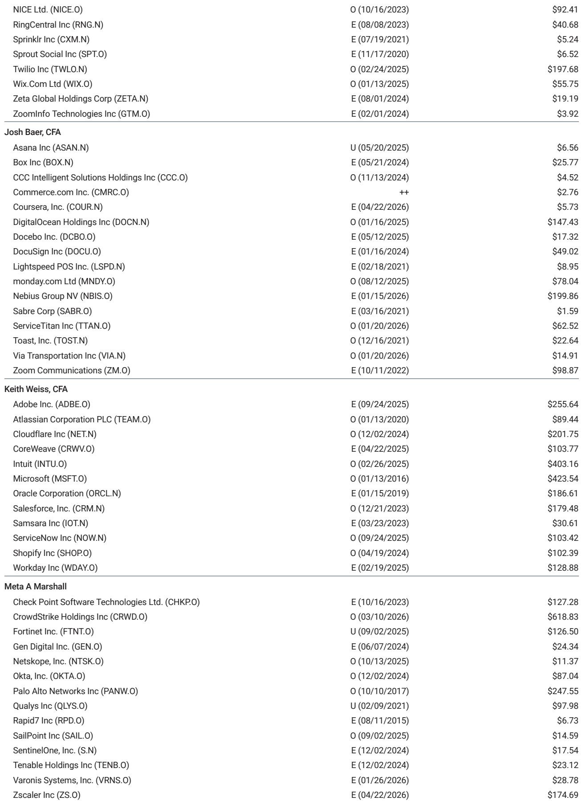
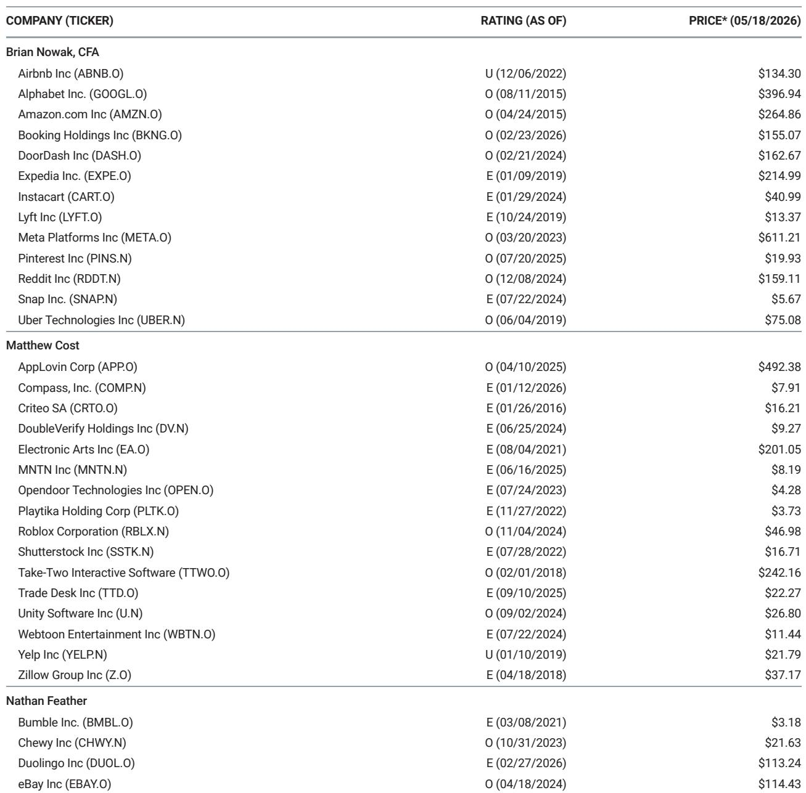
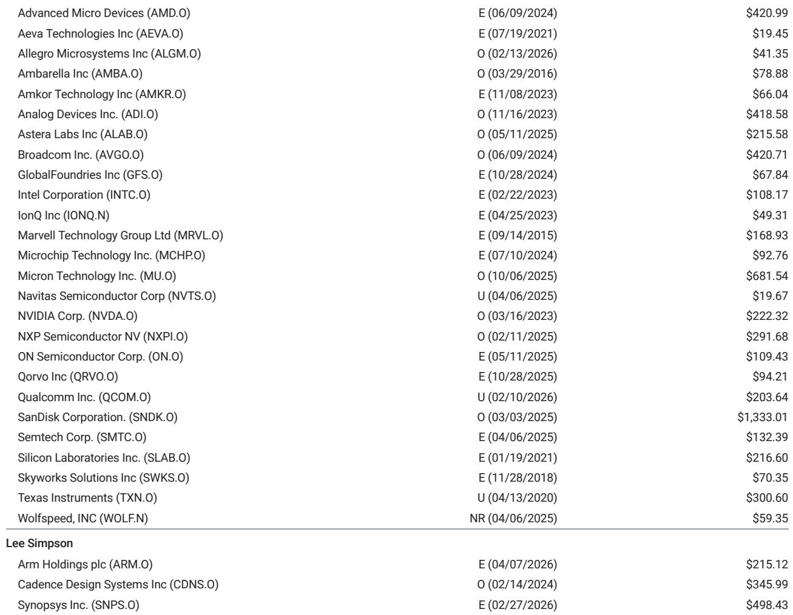

# Mega-Cap Tech Under-Ownership Is Narrowing, But the Real Signal Is in Where Active Managers Are Concentrating

The first quarter of 2026 delivered a modest but meaningful shift in how institutional investors positioned themselves relative to the largest technology companies in the world. For the first time in several quarters, the gap between mega-cap tech weighting in the S&P 500 and active institutional ownership contracted, moving from negative 137 basis points to negative 125 basis points. This 12-basis-point narrowing may appear incremental, but it signals the beginning of a potential rebalancing cycle that has significant implications for portfolio strategy.

The narrative that active managers are systematically underweight the largest tech names has been a persistent theme in market commentary for years. What the first quarter data reveals, however, is that this under-ownership is not uniform, nor is it static. Beneath the aggregate numbers lies a more nuanced story about where conviction is building and where it is fading. The data from 13-F filings for the quarter ending March 2026 shows that institutional positioning increasingly favors infrastructure bottlenecks in the artificial intelligence supply chain, while software stocks continue to suffer from relative neglect.

For investors trying to decode where the next rotation in large-cap tech might occur, the ownership gap is more than a backward-looking curiosity. A quantitative analysis of historical ownership data indicates a statistically significant relationship between low active ownership relative to the S&P 500 and future stock performance. Stocks that are deeply under-owned tend to experience a technical pull higher over time, while those that are heavily over-owned face the opposite dynamic. This means the current positioning data is not just descriptive; it is potentially predictive.

The question is not whether mega-cap tech is under-owned. It is. The real question is which names are most likely to benefit from a closing of that gap, and whether the current concentration in AI infrastructure represents a durable shift or a crowded trade waiting to reverse.

## The Most Under-Owned Names Are Also the Most Widely Held, Creating a Paradox of Conviction

NVIDIA remains the most under-owned large-cap technology stock in actively managed portfolios relative to its S&P 500 weighting, with a gap of negative 2.39 percent as of the end of the first quarter. This represents only an 18-basis-point narrowing from the prior quarter, meaning that despite NVIDIA's continued dominance in the AI semiconductor space, active managers are still significantly underweight relative to the benchmark. The same pattern holds for Apple at negative 2.32 percent, Microsoft at negative 1.86 percent, and Amazon at negative 1.24 percent.

This creates an interesting analytical tension. These are the most widely owned stocks in the market by any measure, yet relative to their index weight, they are under-owned. The paradox is that the very scale of these companies makes it difficult for active managers to achieve meaningful overweight positions without creating extreme portfolio concentration. The narrowing of the gap in the first quarter suggests that some managers are beginning to adjust, but the pace of adjustment remains slow.

What makes this pattern strategically important is the historical tendency for deeply under-owned names to experience mean reversion. If the quantitative relationship holds, the stocks with the largest negative gaps today are the ones most likely to see incremental buying pressure in coming quarters. This is not a call on fundamentals, but on technical flows. The question is whether the fundamental catalysts for these companies are strong enough to sustain the rebalancing, or whether the narrowing is simply a function of index weight changes rather than active conviction.

## Institutional Positioning Reveals a Clear Preference for AI Infrastructure Bottlenecks Over Software

The most striking pattern in the first quarter data is not the under-ownership of mega-cap tech, but the over-ownership of specific segments within the technology universe. The stocks with the highest active ownership relative to their S&P 500 weighting are overwhelmingly concentrated in memory, storage, and semiconductor capital equipment. SanDisk leads the group with an over-ownership gap of positive 2.16 percent, more than double the next most over-owned stock, Seagate Technology at positive 0.84 percent. Lam Research, KLA Corporation, and Western Digital also appear prominently among the most over-owned names.

This is not random. The data reflects a deliberate strategic bet by active managers on what they perceive as the most defensible parts of the AI value chain. Memory and storage represent physical bottlenecks in the AI infrastructure buildout. These are businesses where capacity constraints, pricing power, and technology transitions create visible earnings trajectories. Institutional investors are signaling that they believe the AI opportunity is real, but that the best risk-adjusted exposure comes from the picks-and-shovels providers rather than the end-market beneficiaries.

The contrast with software could not be starker. IBM, Oracle, Palo Alto Networks, ServiceNow, and Adobe all appear among the most under-owned names relative to their S&P 500 weighting. The average active ownership weighting for software stocks outside of Microsoft decreased by 6 basis points quarter over quarter, continuing a trend of relative neglect. This suggests that institutional investors remain skeptical about the near-term monetization potential of AI in software, or that they see greater competitive disruption risk in that segment.

For investors, this divergence creates a potential inflection point. If AI-driven demand begins to materialize more visibly in software revenue and margin profiles, the current under-ownership could create a powerful tailwind for those names. Conversely, if the infrastructure buildout slows or faces capacity constraints, the crowded positioning in memory and storage could become a source of vulnerability.

## The Magnificent Seven Are Not a Monolith, and the Data Shows Increasing Dispersion in Manager Conviction

One of the most useful insights from the first quarter data is that the so-called Magnificent Seven are diverging in terms of institutional positioning. While the aggregate under-ownership for the group narrowed, the movement was not uniform across all seven names. Microsoft saw the largest improvement in relative positioning, with the gap narrowing by 27 basis points quarter over quarter. Meta and NVIDIA also saw meaningful narrowing of their under-ownership gaps.

Apple, however, moved in the opposite direction. The gap between Apple's institutional ownership and its S&P 500 weighting widened by 16 basis points, making it the only mega-cap tech name where active managers reduced their relative exposure during the quarter. This divergence is worth examining because it suggests that institutional conviction is not simply a function of market capitalization or index weight. Managers are making active choices about which mega-cap names they want to own.

The dispersion also matters for portfolio construction. If the historical relationship between under-ownership and future returns holds, then stocks like Microsoft and Meta, which saw the most improvement in positioning, may have less room for technical upside from rebalancing. Conversely, Apple, where the gap widened, may have more potential for a catch-up trade if fundamentals remain intact.

But the data also raises a question that the report does not fully answer: is the widening of Apple's under-ownership gap driven by fundamental concerns about the company's AI strategy and growth trajectory, or is it simply a function of index weight changes and passive flows? The answer matters because it determines whether the gap represents an opportunity or a warning.

## What the Report Does Not Fully Answer: The Role of Passive Flows and the Timing of Mean Reversion

The report establishes a clear statistical relationship between active ownership gaps and future stock performance, but it leaves several important analytical questions unresolved. The most critical is the extent to which the narrowing of the mega-cap under-ownership gap is driven by active manager conviction versus mechanical factors such as index rebalancing and the growth of passive investing.

The S&P 500 weighting of mega-cap tech has been increasing over time, partly because of price appreciation and partly because of index methodology. As these weights increase, the under-ownership gap can narrow even if active managers do not increase their absolute holdings, simply because the denominator in the calculation changes. Disentangling these effects is essential for understanding whether the narrowing represents genuine incremental demand or a statistical artifact.

A second unresolved question is the timing of mean reversion. The report notes that there is a statistically significant relationship between low active ownership and future outperformance, but it does not specify the typical holding period over which this effect materializes. For portfolio managers, knowing whether the rebalancing tends to occur over one quarter, four quarters, or multiple years is critical for position sizing and risk management.

Finally, the report does not address whether the relationship between under-ownership and returns is symmetric. If under-owned stocks tend to outperform, do over-owned stocks necessarily underperform? The data on SanDisk and other memory names suggests that over-ownership can persist for extended periods without immediate negative consequences, particularly when fundamental tailwinds are strong. Understanding the conditions under which over-ownership becomes a contrarian signal would add significant practical value to the analysis.

## A Decision Framework for Using Institutional Ownership Data in Portfolio Construction

For investors who want to incorporate institutional positioning data into their decision-making process, the first quarter data suggests a structured approach. The framework has three components: identification, validation, and timing.

Identification begins with the ownership gap itself. Stocks with large negative gaps relative to their S&P 500 weighting are candidates for potential technical upside, but only if the gap is not explained by structural factors such as index methodology changes or corporate actions. The report identifies NVIDIA, Apple, Microsoft, and Amazon as the most under-owned mega-cap names, but each requires separate analysis to determine whether the gap reflects genuine manager skepticism or simply the mechanical difficulty of achieving index-weight exposure in the largest stocks.

Validation requires examining the fundamental narrative behind the positioning. The data shows that software stocks are broadly under-owned, while memory and storage stocks are over-owned. This pattern is consistent with a fundamental view that AI infrastructure spending is more visible and defensible than AI software monetization. An investor using this framework would want to validate whether their own fundamental view aligns with the positioning signal. If an investor believes that software monetization is about to accelerate, the combination of under-ownership and improving fundamentals would create a powerful setup.

Timing is the most difficult component. The report provides a snapshot as of the end of the first quarter, but the ownership data is inherently lagging. The most recent 13-F filings reflect positions as of March 31, 2026, and the actual buying or selling decisions occurred even earlier. Investors need to assess whether the positioning data is still relevant or whether the market has already moved to close the gaps identified in the report. The narrowing of the mega-cap gap by 12 basis points suggests that some rebalancing has already occurred, but the persistence of large gaps for individual names indicates that the process is incomplete.

## The Open Questions That Make the Full Report Worth Reading

For readers who have followed the analysis this far, several critical questions remain unanswered by the data presented here. The first is whether the narrowing of the mega-cap under-ownership gap will accelerate in the second quarter, or whether it was a one-time adjustment driven by specific events such as earnings reports or guidance changes. The report provides the direction of change but not the velocity, and velocity matters for portfolio positioning.

The second open question is whether the concentration in memory and storage names represents a durable structural bet or a crowded trade that is vulnerable to reversal. The data shows that SanDisk has the highest over-ownership gap of any stock in the coverage universe, and that gap widened by 57 basis points during the quarter. When a stock becomes this over-owned relative to its index weight, the risk of a positioning-driven drawdown increases, particularly if fundamental momentum slows.

The third question is about the software names that are currently under-owned. If the historical relationship holds, stocks like Adobe, ServiceNow, and Palo Alto Networks could benefit from mean reversion in institutional positioning. But the report does not address whether the under-ownership of software is a cyclical phenomenon tied to the AI narrative or a structural shift reflecting permanent changes in the competitive landscape.

These are precisely the kinds of questions that a detailed analysis of the full report, including the original charts and historical trend data, can help answer. The data presented here is a starting point, not a conclusion.

Join the community to read the full report and review the original charts.

*This article is for learning and discussion only and does not constitute investment advice.*

Personal reading notes and learning share only. Not investment advice.

