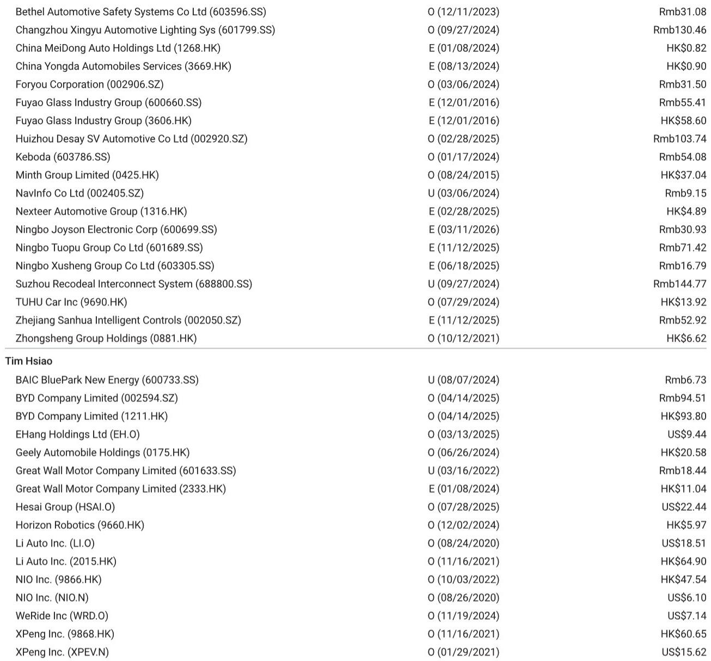
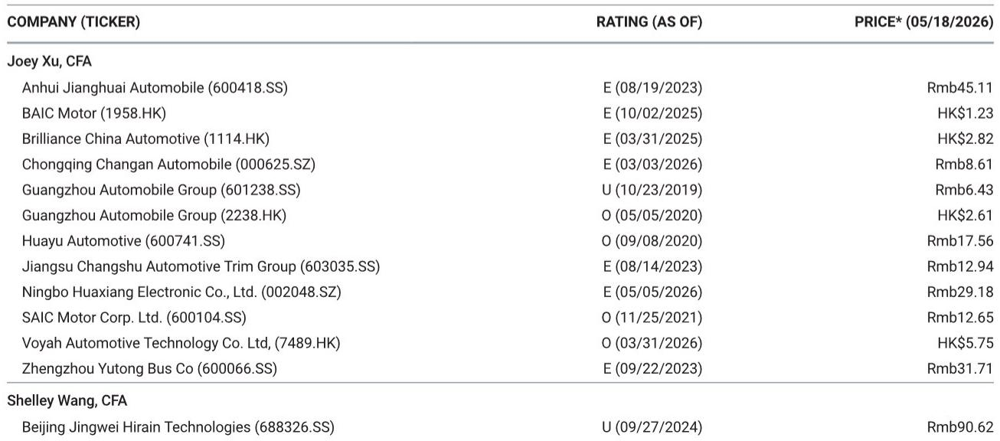
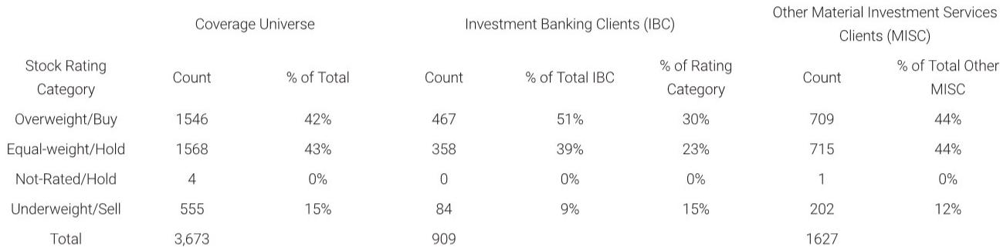

# The Global Auto Revaluation Is Not About Cars Anymore: Why Investors Are Rotating into Export, Autonomy, and Physical AI

The global automotive investment thesis is undergoing a structural break that most market participants have yet to fully price. For decades, auto investing was a cyclical game: bet on volume recovery, manage through capacity utilization, and collect dividends during upcycles. That framework is no longer operative. Based on a recent European marketing tour conducted by a global investment bank's Asia-Pacific auto team, the evidence is clear: investors are not simply cautious on the sector—they are actively reallocating capital away from traditional automotive exposures and toward a narrow set of themes that have little to do with how many cars are sold in China next quarter.

The core insight from this trip is that conviction is bifurcated. On one side, there is deep skepticism about domestic Chinese demand, intensifying competition, and the vulnerability of legacy OEMs globally. On the other, there is growing conviction in three specific structural trades: export-centric execution by Chinese manufacturers, the commercialization of autonomous driving and physical AI, and energy storage systems as a parallel growth vector. The market is not waiting for a cyclical recovery. It is voting on which companies can escape the low-multiple gravity of traditional auto manufacturing and reposition themselves as technology platforms.

This article interprets the findings from that marketing tour, extends the logic into second-order implications, and provides a decision framework for investors navigating this transition. The argument is not that the auto sector is dying. It is that the auto sector is being reborn—and only a subset of companies will survive the metamorphosis.

## The Export Thesis Is the Only Domestic Demand Substitute That Works, but It Comes with Geopolitical Tail Risk That Cannot Be Diversified Away

The data from the report is stark: China's passenger vehicle exports grew roughly 70% year-on-year in the first four months of the year, while new energy vehicle exports surged approximately 120% over the same period. These are not marginal numbers. They represent a fundamental shift in the center of gravity for Chinese automotive production. For any Chinese OEM without a credible overseas pathway, the implication is a double squeeze: declining domestic volumes and contracting margins as competition forces price concessions at home.

European investors are acutely aware of this dynamic, but their response is not uniform. The report notes that European policy toward Chinese auto imports remains fragmented, with no unified stance across national governments. This fragmentation creates both risk and opportunity. Companies that can navigate individual country-level politics—securing local partnerships, acquiring existing European plants, or establishing joint ventures—can gain asymmetric access. Those that rely on a simple export model face the constant threat of tariff escalation or regulatory non-tariff barriers.

The strategic implication is that export success is no longer a logistics question. It is a political economy question. The companies that will win in Europe are not necessarily the ones with the best vehicles or the lowest costs. They are the ones that can embed themselves into the local industrial fabric. The report highlights investor attention on the Stellantis EU plant acquisition as a bellwether for this trend. If Chinese manufacturers can acquire European production capacity, they can bypass tariff barriers and reposition themselves as local players. If not, the export boom may hit a regulatory ceiling sooner than volume projections suggest.

The unanswered question here is whether the current export momentum is sustainable if European governments coordinate a more restrictive response. The data suggests that exports are diversifying across regions—Asia, ASEAN, Africa, Latin America, and Russia all feature prominently—but Europe remains a high-value destination. A coordinated European tariff regime could compress margins significantly. Investors should be asking: which Chinese OEMs have the balance sheet and operational flexibility to absorb tariff shocks, and which are running on export volumes that assume frictionless trade?

## Physical AI and Robotics Are Not a Side Bet; They Are the Primary Vehicle for Auto Equity Re-Rating

One of the most striking findings from the European tour is the degree to which investors are rotating into the physical AI theme, even if European enthusiasm lags behind that of US or Asia-based investors. The logic is straightforward: automotive companies possess core competencies in hardware manufacturing, perception systems, and mobility that are directly transferable to humanoid robotics and autonomous driving platforms. Automakers are not just building cars anymore. They are building the hardware backbone for embodied intelligence.

This is not a speculative narrative. The report explicitly states that automotive cash flows are being recycled into humanoid robotics and autonomous driving as a deliberate strategy for valuation re-rating. In other words, management teams are consciously using their existing revenue streams to fund technology bets that can justify higher multiples. The market is beginning to reward this behavior. Companies like XPeng, which are aligned with the physical AI thesis, are emerging as preferred plays for investors seeking exposure to this theme.

The second-order implication is profound. If the market begins to value auto companies not on vehicle sales but on their robotics optionality, the entire valuation framework for the sector shifts. Traditional auto multiples of 5-8x earnings may give way to technology multiples of 20-30x for companies that can credibly demonstrate a path to commercializing autonomy or robotics. This creates a powerful incentive for every major OEM to claim a robotics strategy, but the market will differentiate between those with genuine technological assets and those with only marketing stories.

The critical open question is whether the robotics thesis can generate standalone revenue and profit within a reasonable investment horizon, or whether it remains a narrative device for multiple expansion. The report does not answer this. It notes that investor enthusiasm is not as high as in the US or Asia, suggesting that European capital is more skeptical of the timeline. For readers, the key debate is: which Chinese auto companies have the engineering talent, the data moat from existing vehicle fleets, and the manufacturing scale to actually win in robotics, and which are simply borrowing the narrative?

## Traditional OEMs Are Structurally Impaired, Not Cyclically Depressed, and the Market Has Already Made That Distinction

The report makes a crucial distinction that many investors still miss: the challenges facing traditional internal combustion engine franchises are structural, not cyclical. This is not a downturn that will reverse when interest rates fall or consumer confidence returns. It is a permanent loss of relevance as the technological frontier shifts to electrification, software, and autonomy.

European investors during the tour framed global mass-market legacy OEMs as "share donors" in the current market context. This is a brutal but accurate characterization. These companies are losing market share to Chinese entrants in their home markets, they lack the software capabilities to compete in autonomous driving, and their cost structures are too high to match Chinese pricing. Meanwhile, premium luxury names like BMW and Mercedes may be better positioned to fend off Chinese competition, but even they face margin pressure as the technology content of vehicles rises without commensurate pricing power.

For investors, the implication is that capital should not be deployed into traditional OEMs on the expectation of a cyclical recovery. The structural headwinds are too strong. The report notes that Chinese ICE franchises are viewed as structurally challenged, and the same logic applies globally. The only traditional OEMs worth owning are those that have clear technology moats—either in premium branding, battery technology, or autonomous driving—or those that are actively transforming into technology platforms.

The decision framework here is binary. If a company's core business is selling internal combustion vehicles in mature markets, the equity is a value trap. If a company is using its automotive cash flows to fund a transition into autonomy, robotics, or energy storage, it may be a re-rating candidate. The market has already begun to make this distinction, and the divergence will only widen.

## The Battery and Energy Storage Opportunity Is Underappreciated as a Parallel Revenue Stream

While much of the investor focus during the European tour was on vehicles and autonomy, the report reveals a quieter but equally important theme: energy storage systems. Batteries are not just a component of electric vehicles. They are a standalone growth business with commercial potential that may exceed the automotive application.

The report specifically notes that investors are constructively inclined toward batteries for energy storage systems, and that the Ford-CATL tie-up has sparked discussion about a potential leadership shake-up in the US battery market. This is significant because it suggests that the battery value chain is decoupling from the automotive value chain. Companies that can produce high-quality batteries at scale have a second revenue stream that is less cyclical than vehicle sales and that benefits from the global build-out of renewable energy infrastructure.

For Chinese battery and auto companies, this creates a diversification option that many investors have not fully priced. A company like BYD, which is both a vehicle manufacturer and a battery producer, can use its battery business to offset margin compression in vehicles. The report acknowledges that BYD remains the default long in the sector, but notes that the near-term setup requires patience because domestic sales are suppressed. The battery and energy storage thesis provides a reason to hold through that patience period.

The unresolved analytical question is whether the energy storage market can grow fast enough to absorb the battery capacity that Chinese manufacturers are building, or whether overcapacity will eventually compress margins in that segment as well. The report does not offer a definitive answer, but it flags the topic as a key area of investor inquiry. For readers, the question is: which companies have the technological differentiation—sodium-ion batteries, for example—to maintain pricing power in energy storage, and which are simply competing on scale?

## How to Build a Decision Framework for the New Auto Investment Landscape

Based on the insights from this European marketing tour, investors need a decision framework that moves beyond traditional automotive metrics. The following four-quadrant matrix captures the key distinctions that the market is already making.

First, assess a company's export capability. Does it have a credible pathway to sell vehicles outside China, and can it navigate tariff and regulatory barriers? Companies that can acquire or build local production capacity in Europe, North America, or ASEAN have a structural advantage. Companies that rely solely on exports face a constant risk of policy disruption.

Second, evaluate the company's technology stack beyond the vehicle. Does it have proprietary capabilities in autonomous driving, lidar, chips, or robotics? The market is increasingly valuing these assets independently of vehicle sales. Companies like XPeng, which are aligned with the physical AI thesis, and parts suppliers like Hesai and Horizon Robotics, are seeing investor interest because they offer exposure to autonomy without the baggage of legacy auto manufacturing.

Third, analyze the battery and energy storage angle. Does the company have a battery business that can generate standalone revenue? Companies with differentiated battery technology—whether in chemistry, manufacturing cost, or scale—have a second growth vector that can smooth out the volatility of vehicle sales.

Fourth, determine whether the company's management team is actively pursuing a re-rating strategy. Are they reinvesting automotive cash flows into autonomy and robotics? Are they communicating a clear narrative about technology transformation? The report suggests that companies doing this are being rewarded with higher multiples, while those that remain focused on vehicle volume are being punished.

The companies that score highly across all four dimensions—export capability, technology stack, battery optionality, and management strategy—are the ones most likely to outperform. Those that score poorly on multiple dimensions are likely to face continued multiple compression, regardless of near-term earnings.

## The Full Picture Requires Reading the Original Charts and Data

The analysis above synthesizes the key themes from a comprehensive research report produced by a global investment bank's Asia-Pacific auto team following a European marketing tour. However, the full analytical value of the report lies in the original charts, the detailed stock-level implications, and the nuanced discussions of specific companies that this article has only summarized.

For example, the report contains a detailed breakdown of China's auto exports by region, showing how the composition of export destinations has shifted over time. It includes specific price targets and rating justifications for companies like XPeng, NIO, Li Auto, Geely, and BYD, as well as for parts suppliers like Hesai and Minth. It also discusses the competitive dynamics within the EV start-up space, including the contrasting trajectories of XPeng's robotics alignment versus Li Auto's vehicle-focused strategy.

These details matter because they allow readers to test the framework presented here against actual data and analyst judgments. The decision framework is only as good as the inputs, and the inputs in this report are both granular and carefully sourced.

Join the community to read the full report and review the original charts.

*This article is for learning and discussion only and does not constitute investment advice.*

Personal reading notes and learning share only. Not investment advice.

