May 19, 2026 07:26 AM GMT

# Investor Presentation | Japan

# Electronic Components: Renewed Focus on Value-Added N. American Smartphone Components Plus AI Computing

In addition to proliferation of devices leveraging AI computing, we expect F3/27 earnings for suppliers of high value-added components in N. American smartphones to top consensus.

# Key Takeaways

■ OW on TDK: Top Pick. Earnings expansion for rechargeable batteries and HDD-related products.   
OW on Murata Mfg: Growing demand and utilization rates for high-value-added MLCCs.   
■ OW on Alps Alpine: High-performance camera actuators to ramp up from Apr-Jun.   
■ OW on Niterra: Continued earnings growth for replacement plugs and SPE electrostatic chucks.   
■ OW on Hirose Electric: Earnings expansion for general industrial machinery/AI server connectors.

MS MUFG SECURITIES CO., LTD.+

# Shoji Sato

Equity Analyst

Shoji.Sato@morganstanleymufg.com +81 3 6836-8404

# Sota Harashima

Equity Analyst

Sota.Harashima@morganstanleymufg.com +81 3 6836-8897

text_image

Japan Summit 2026

# ELECTRONIC COMPONENTS

Japan

Industry View In-Line

MS does and seeks to do business with companies covered in MS. As a result, investors should be aware that the firm may have a conflict of interest that could affect the objectivity of MS. Investors should consider MS as only a single factor in making their investment decision.

# For analyst certification and other important disclosures, refer to the Disclosure Section, located at the end of this report.

+= Analysts employed by non-U.S. affiliates are not registered with FINRA, may not be associated persons of the member and may not be subject to FINRA restrictions on communications with a subject company, public appearances and trading securities held by a research analyst account.

# Renewed Focus on Value-Added N. American Smartphone Components Plus AI Computing

Risk-Reward Snapshot: Ranked in order of preference 

<table><tr><td colspan="2"></td><td>Rating</td><td>Price 26/5/15</td><td>Target Price Base</td><td>% Difference</td></tr><tr><td>TDK</td><td>6762</td><td>Overweight</td><td>2,993</td><td>3,200</td><td>-63%</td></tr><tr><td>MURATA MANUFACTURING</td><td>6981</td><td>Overweight</td><td>6,151</td><td>5,100</td><td>-64%</td></tr><tr><td>ALPS ALPINE</td><td>6770</td><td>Overweight</td><td>2,206</td><td>2,900</td><td>-37%</td></tr><tr><td>NITERRA</td><td>5334</td><td>Overweight</td><td>9,679</td><td>9,100</td><td>-64%</td></tr><tr><td>HIROSE ELECTRIC</td><td>6806</td><td>Overweight</td><td>23,915</td><td>26,300</td><td>-35%</td></tr><tr><td>MEIKO ELECTRONICS</td><td>6787</td><td>Equal-weight</td><td>36,200</td><td>29,200</td><td>-70%</td></tr><tr><td>KYOCERA</td><td>6971</td><td>Equal-weight</td><td>2,884</td><td>2,800</td><td>-55%</td></tr><tr><td>MABUCHI MOTOR</td><td>6592</td><td>Equal-weight</td><td>1,602</td><td>1,750</td><td>-31%</td></tr><tr><td>MINEBEA MITSUMI</td><td>6479</td><td>Equal-weight</td><td>3,944</td><td>3,300</td><td>-47%</td></tr><tr><td>NICHICON</td><td>6996</td><td>Equal-weight</td><td>2,742</td><td>2,100</td><td>-67%</td></tr><tr><td>CMK</td><td>6958</td><td>Equal-weight</td><td>648</td><td>640</td><td>-66%</td></tr><tr><td>JAE</td><td>6807</td><td>Equal-weight</td><td>2,509</td><td>2,600</td><td>-32%</td></tr><tr><td>NIHON DEMPA KOGYO</td><td>6779</td><td>Equal-weight</td><td>2,242</td><td>1,530</td><td>-85%</td></tr><tr><td>TAIYO YUDEN</td><td>6976</td><td>Equal-weight</td><td>6,762</td><td>4,700</td><td>-70%</td></tr><tr><td>DAISHINKU</td><td>6962</td><td>Equal-weight</td><td>764</td><td>610</td><td>-65%</td></tr><tr><td>KOA</td><td>6999</td><td>Underweight</td><td>2,061</td><td>1,540</td><td>-70%</td></tr><tr><td>HAMAMATSU PHOTONICS</td><td>6965</td><td>Underweight</td><td>2,657</td><td>1,250</td><td>-68%</td></tr><tr><td>NIPPON CHEMI-CON</td><td>6997</td><td>Underweight</td><td>2,996</td><td>880</td><td>-87%</td></tr><tr><td>IBIDEN</td><td>4062</td><td>Underweight</td><td>15,660</td><td>6,500</td><td>-87%</td></tr></table>

Note: Not included Iriso Electronics (6908) data in this material as full-year F3/26 results have not yet been announced  
Source: FactSet, MS

# Contents

Electronic Components: Valuation Comparison and Earnings Forecast Comparison

Sales Trends (Quarterly, Semi-annual, Annual)

Operating Profit Trends (Quarterly, Semi-annual, Annual)

Capex

Depreciation

Inventory and Inventory Days

Production & Inventory

Stock Price Performance

FX Sensitivities of Electronic Components Makers/Changes in the Competitiveness of Core

Products Under a Weak Yen Environment

Sales and Production by Region

Preparing for Smartphone Price Compression and Slowdown in Technological Innovation

Memory Price Outlook

End-product Market and Major Components Market (Calendar Year)

End-product Market and Major Components Market (Quarterly)

MLCC Market Data

Capacitor Market: 016008 MLCCs are 75% smaller than 0201 MLCCs

MLCC Sales, Market Share, OP

Supply Chains of MLCC and Aluminum Capacitors

Capex by Hyperscalers has Increased Significantly

We Expect Ibiden Will Maintain Nearly 100% Market Share in FC Packages for NVIDIA

Ibiden: Medium-term Results and Forecasts

Connector Market

Connector Coverage Companies: Medium-term Results and Forecasts

Global Market Share Trend and Split for Spark Plugs / Exhaust Gas Oxygen Sensors

Niterra: Medium-term Results and Forecasts

Small Size LiB Market Overview

TDK: LiB Earnings Expansion, Major Acquisition and Transfer of Business

TDK: Actions for Business Portfolio Improvement

TDK: Mid-term Results and Forecasts

iPhone Sell-in Forecasts / iPhone Camera Actuators by Model

Alps Alpine: We Expect New Smartphone Camera Actuators to Contribute to Earnings

PWB Market

Meiko Electronics: Mid-term Results and Forecasts

HDD Market by Company (Quarterly, Fiscal Year)

HDD Head Market

HDD Motor Market

Supply Chain of HDDs

Electronic Components: Valuation Comparison and Earnings Forecast Comparison 

<table><tr><td rowspan="2" colspan="2"></td><td rowspan="2">Rating</td><td>Price</td><td>Mkt Capt</td><td>Net F. Asset</td><td>EV</td><td colspan="3">P/E</td><td colspan="3">Ex. Cash P/E</td><td colspan="3">EV/EBITDA</td><td colspan="3">P/B</td><td colspan="3">ROE</td></tr><tr><td>26/5/15</td><td>(JPY bn)</td><td>(JPY bn)</td><td>(JPY bn)</td><td>F26e</td><td>F27e</td><td>F28e</td><td>F26e</td><td>F27e</td><td>F28e</td><td>F26e</td><td>F27e</td><td>F28e</td><td>F26e</td><td>F27e</td><td>F28e</td><td>F26e</td><td>F27e</td><td>F28e</td></tr><tr><td>IBIDEN</td><td>4062</td><td>Underweight</td><td>15,660</td><td>4,392.1</td><td>135.5</td><td>4,256.7</td><td>87.0</td><td>61.6</td><td>45.9</td><td>81.7</td><td>57.8</td><td>43.1</td><td>27.2</td><td>21.1</td><td>18.4</td><td>7.9</td><td>7.1</td><td>6.2</td><td>9.5%</td><td>12.3%</td><td>14.6%</td></tr><tr><td>NITERRA</td><td>5334</td><td>Overweight</td><td>9,679</td><td>1,922.0</td><td>26.8</td><td>1,895.2</td><td>16.3</td><td>14.5</td><td>12.4</td><td>16.5</td><td>15.1</td><td>13.2</td><td>9.6</td><td>8.8</td><td>7.9</td><td>2.4</td><td>2.2</td><td>1.9</td><td>15.2%</td><td>15.6%</td><td>16.4%</td></tr><tr><td>MINEBEA MITSUMI</td><td>6479</td><td>Equal-weight</td><td>3,944</td><td>1,597.0</td><td>-227.5</td><td>1,824.6</td><td>18.4</td><td>16.9</td><td>16.1</td><td>21.2</td><td>19.4</td><td>18.5</td><td>9.8</td><td>9.1</td><td>8.7</td><td>1.8</td><td>1.7</td><td>1.6</td><td>10.4%</td><td>10.5%</td><td>10.1%</td></tr><tr><td>MABUCHI MOTOR</td><td>6592</td><td>Equal-weight</td><td>1,602</td><td>412.8</td><td>146.8</td><td>266.0</td><td>17.7</td><td>15.8</td><td>14.7</td><td>11.9</td><td>11.2</td><td>10.5</td><td>6.5</td><td>6.1</td><td>5.8</td><td>1.2</td><td>1.2</td><td>1.2</td><td>6.8%</td><td>7.5%</td><td>8.3%</td></tr><tr><td>TDK</td><td>6762</td><td>Overweight</td><td>2,993</td><td>5,679.8</td><td>525.9</td><td>5,153.9</td><td>24.5</td><td>21.8</td><td>19.8</td><td>22.2</td><td>19.8</td><td>18.0</td><td>9.9</td><td>9.2</td><td>8.5</td><td>2.7</td><td>2.5</td><td>2.3</td><td>11.5%</td><td>11.9%</td><td>12.0%</td></tr><tr><td>ALPS ALPINE</td><td>6770</td><td>Overweight</td><td>2,206</td><td>432.4</td><td>129.0</td><td>303.4</td><td>12.0</td><td>8.8</td><td>7.6</td><td>8.3</td><td>6.2</td><td>5.5</td><td>3.3</td><td>2.8</td><td>2.5</td><td>1.0</td><td>0.9</td><td>0.8</td><td>8.7%</td><td>11.0%</td><td>11.6%</td></tr><tr><td>NIHON DEMPA KOGYO</td><td>6779</td><td>Equal-weight</td><td>2,242</td><td>49.3</td><td>-16.4</td><td>65.7</td><td>22.4</td><td>19.1</td><td>19.1</td><td>28.6</td><td>24.3</td><td>24.3</td><td>8.0</td><td>7.1</td><td>6.8</td><td>1.6</td><td>1.5</td><td>1.4</td><td>7.4%</td><td>8.2%</td><td>7.8%</td></tr><tr><td>MEIKO ELECTRONICS</td><td>6787</td><td>Equal-weight</td><td>36,200</td><td>931.5</td><td>-92.6</td><td>1,024.1</td><td>37.2</td><td>27.1</td><td>21.3</td><td>41.0</td><td>29.9</td><td>23.4</td><td>19.1</td><td>14.3</td><td>11.5</td><td>6.3</td><td>5.2</td><td>4.3</td><td>18.2%</td><td>21.0%</td><td>22.1%</td></tr><tr><td>HIROSE ELECTRIC</td><td>6806</td><td>Overweight</td><td>23,915</td><td>785.9</td><td>225.5</td><td>560.4</td><td>21.8</td><td>20.0</td><td>18.2</td><td>16.1</td><td>15.2</td><td>14.2</td><td>8.2</td><td>7.6</td><td>7.0</td><td>2.0</td><td>1.9</td><td>1.9</td><td>9.5%</td><td>10.0%</td><td>10.5%</td></tr><tr><td>JAE</td><td>6807</td><td>Equal-weight</td><td>2,509</td><td>173.0</td><td>10.1</td><td>163.0</td><td>23.2</td><td>20.6</td><td>19.2</td><td>22.3</td><td>19.9</td><td>18.5</td><td>5.4</td><td>5.1</td><td>4.9</td><td>1.2</td><td>1.2</td><td>1.1</td><td>5.2%</td><td>5.7%</td><td>6.0%</td></tr><tr><td>CMK</td><td>6958</td><td>Equal-weight</td><td>648</td><td>43.7</td><td>-22.8</td><td>66.5</td><td>28.9</td><td>20.1</td><td>15.4</td><td>41.6</td><td>28.9</td><td>22.2</td><td>6.0</td><td>5.4</td><td>4.9</td><td>0.6</td><td>0.6</td><td>0.6</td><td>2.1%</td><td>3.0%</td><td>3.8%</td></tr><tr><td>DAISHINKU</td><td>6962</td><td>Equal-weight</td><td>764</td><td>24.3</td><td>-17.2</td><td>41.5</td><td>40.5</td><td>24.3</td><td>16.2</td><td>69.2</td><td>41.5</td><td>27.7</td><td>6.6</td><td>5.9</td><td>5.3</td><td>0.7</td><td>0.7</td><td>0.7</td><td>1.7%</td><td>2.8%</td><td>4.2%</td></tr><tr><td>HAMAMATSU PHOTONICS</td><td>6965</td><td>Underweight</td><td>2,657</td><td>821.1</td><td>31.0</td><td>790.1</td><td>68.2</td><td>52.4</td><td>43.4</td><td>68.0</td><td>52.1</td><td>43.2</td><td>20.7</td><td>16.6</td><td>15.5</td><td>2.6</td><td>2.6</td><td>2.6</td><td>3.7%</td><td>5.0%</td><td>6.0%</td></tr><tr><td>KYOCERA</td><td>6971</td><td>Equal-weight</td><td>2,884</td><td>4,062.5</td><td>1,797.8</td><td>2,264.8</td><td>40.6</td><td>36.8</td><td>31.1</td><td>24.4</td><td>22.7</td><td>19.8</td><td>9.6</td><td>8.8</td><td>7.9</td><td>1.4</td><td>1.5</td><td>1.6</td><td>3.2%</td><td>3.7%</td><td>4.6%</td></tr><tr><td>TAIYO YUDEN</td><td>6976</td><td>Equal-weight</td><td>6,762</td><td>849.2</td><td>-71.1</td><td>920.3</td><td>37.3</td><td>30.6</td><td>27.2</td><td>37.0</td><td>30.3</td><td>26.9</td><td>11.3</td><td>10.1</td><td>9.6</td><td>2.7</td><td>2.6</td><td>2.5</td><td>7.5%</td><td>8.7%</td><td>9.3%</td></tr><tr><td>MURATA MANUFACTURING</td><td>6981</td><td>Overweight</td><td>6,151</td><td>11,344.7</td><td>663.0</td><td>10,681.7</td><td>38.4</td><td>31.4</td><td>26.9</td><td>36.5</td><td>29.8</td><td>25.6</td><td>19.3</td><td>16.6</td><td>14.7</td><td>4.2</td><td>4.0</td><td>3.8</td><td>11.1%</td><td>13.1%</td><td>14.4%</td></tr><tr><td>NICHICON</td><td>6996</td><td>Equal-weight</td><td>2,742</td><td>185.9</td><td>-0.3</td><td>186.1</td><td>29.7</td><td>25.9</td><td>23.9</td><td>30.0</td><td>26.2</td><td>24.2</td><td>10.5</td><td>9.7</td><td>9.3</td><td>1.5</td><td>1.5</td><td>1.4</td><td>5.2%</td><td>5.7%</td><td>6.0%</td></tr><tr><td>NIPPON CHEMI-CON</td><td>6997</td><td>Underweight</td><td>2,996</td><td>76.9</td><td>-48.7</td><td>125.5</td><td>29.3</td><td>24.1</td><td>21.0</td><td>44.8</td><td>36.9</td><td>32.2</td><td>10.2</td><td>9.5</td><td>8.9</td><td>1.3</td><td>1.2</td><td>1.2</td><td>4.5%</td><td>5.3%</td><td>5.8%</td></tr><tr><td>KOA</td><td>6999</td><td>Underweight</td><td>2,061</td><td>70.0</td><td>-6.6</td><td>76.6</td><td>23.2</td><td>20.7</td><td>17.8</td><td>23.2</td><td>20.7</td><td>17.8</td><td>6.1</td><td>5.7</td><td>5.3</td><td>1.0</td><td>0.9</td><td>0.9</td><td>4.2%</td><td>4.5%</td><td>5.1%</td></tr><tr><td colspan="2">Average (or total)</td><td></td><td></td><td>33,854.4</td><td></td><td>30,666.1</td><td>32.4</td><td>25.9</td><td>22.0</td><td>33.9</td><td>26.7</td><td>22.6</td><td>10.9</td><td>9.5</td><td>8.6</td><td>2.3</td><td>2.2</td><td>2.0</td><td>7.7%</td><td>8.7%</td><td>9.4%</td></tr></table>

<table><tr><td rowspan="2" colspan="2">(JPY bn, JPY/Shares)</td><td colspan="5">Sales</td><td colspan="5">OP</td><td colspan="5">Net Profits</td><td colspan="5">EPS</td><td>BPS</td></tr><tr><td>F26e</td><td>Ce</td><td>FSe</td><td>F27e</td><td>FSe</td><td>F26e</td><td>Ce</td><td>FSe</td><td>F27e</td><td>FSe</td><td>F26e</td><td>Ce</td><td>FSe</td><td>F27e</td><td>FSe</td><td>F26e</td><td>Ce</td><td>FSe</td><td>F27e</td><td>FSe</td><td>F26e</td></tr><tr><td>IBIDEN</td><td>4062</td><td>499.7</td><td>500.0</td><td>501.4</td><td>602.5</td><td>594.0</td><td>77.0</td><td>90.0</td><td>93.7</td><td>106.4</td><td>127.2</td><td>52.1</td><td>58.0</td><td>62.5</td><td>73.6</td><td>86.2</td><td>180.0</td><td>207.7</td><td>221.7</td><td>254.3</td><td>305.7</td><td>1,988.7</td></tr><tr><td>NITERRA</td><td>5334</td><td>754.6</td><td>790.0</td><td>764.4</td><td>788.6</td><td>803.7</td><td>156.6</td><td>150.0</td><td>152.7</td><td>171.7</td><td>168.8</td><td>114.6</td><td>105.0</td><td>109.8</td><td>125.5</td><td>122.5</td><td>592.4</td><td>535.0</td><td>559.4</td><td>665.8</td><td>629.4</td><td>4,013.6</td></tr><tr><td>MINEBEA MITSUMI</td><td>6479</td><td>1,651.1</td><td>1,690.0</td><td>1,664.2</td><td>1,703.3</td><td>1,730.2</td><td>116.9</td><td>120.0</td><td>118.5</td><td>127.5</td><td>130.9</td><td>86.0</td><td>83.0</td><td>84.8</td><td>93.8</td><td>94.1</td><td>214.0</td><td>206.7</td><td>210.5</td><td>233.7</td><td>234.6</td><td>2,143.7</td></tr><tr><td>MABUCHI MOTOR</td><td>6592</td><td>213.4</td><td>213.0</td><td>208.4</td><td>227.3</td><td>218.2</td><td>27.2</td><td>26.0</td><td>24.5</td><td>29.3</td><td>26.8</td><td>22.3</td><td>21.5</td><td>20.3</td><td>23.8</td><td>21.7</td><td>90.7</td><td>89.6</td><td>83.7</td><td>101.5</td><td>90.4</td><td>1,376.4</td></tr><tr><td>TDK</td><td>6762</td><td>2,648.5</td><td>2,580.0</td><td>2,604.1</td><td>2,869.4</td><td>2,764.9</td><td>309.8</td><td>295.0</td><td>298.6</td><td>348.1</td><td>336.9</td><td>231.7</td><td>225.0</td><td>221.8</td><td>260.4</td><td>252.3</td><td>122.1</td><td>118.5</td><td>116.4</td><td>137.2</td><td>132.6</td><td>1,107.6</td></tr><tr><td>ALPS ALPINE</td><td>6770</td><td>1,082.0</td><td>1,045.0</td><td>1,044.0</td><td>1,179.9</td><td>1,090.6</td><td>50.8</td><td>48.5</td><td>43.8</td><td>68.1</td><td>51.6</td><td>36.3</td><td>30.0</td><td>28.3</td><td>48.6</td><td>35.0</td><td>184.5</td><td>150.4</td><td>142.8</td><td>250.3</td><td>178.4</td><td>2,169.4</td></tr><tr><td>NIHON DEMPA KOGYO</td><td>6779</td><td>56.1</td><td>60.6</td><td>56.1</td><td>58.0</td><td>58.0</td><td>3.8</td><td>4.0</td><td>3.8</td><td>4.4</td><td>4.4</td><td>2.3</td><td>2.3</td><td>2.3</td><td>2.7</td><td>2.7</td><td>100.0</td><td>99.9</td><td>100.0</td><td>117.3</td><td>117.3</td><td>1,393.5</td></tr><tr><td>MEIKO ELECTRONICS</td><td>6787</td><td>305.1</td><td>320.0</td><td>285.5</td><td>368.7</td><td>333.9</td><td>33.6</td><td>38.0</td><td>30.7</td><td>45.5</td><td>38.7</td><td>25.0</td><td>27.0</td><td>24.1</td><td>34.3</td><td>31.2</td><td>974.1</td><td>1,039.7</td><td>938.1</td><td>1,336.5</td><td>1,215.6</td><td>5,770.9</td></tr><tr><td>HIROSE ELECTRIC</td><td>6806</td><td>224.2</td><td>230.0</td><td>221.8</td><td>238.6</td><td>235.7</td><td>46.6</td><td>46.0</td><td>47.3</td><td>49.6</td><td>52.6</td><td>34.8</td><td>34.0</td><td>34.7</td><td>36.9</td><td>38.7</td><td>1,096.5</td><td>1,039.1</td><td>1,054.7</td><td>1,198.4</td><td>1,193.7</td><td>11,835.7</td></tr><tr><td>JAE</td><td>6807</td><td>231.4</td><td>240.0</td><td>234.1</td><td>241.4</td><td>243.6</td><td>10.3</td><td>9.5</td><td>14.1</td><td>11.5</td><td>16.6</td><td>7.3</td><td>6.0</td><td>9.6</td><td>8.2</td><td>11.0</td><td>108.3</td><td>89.0</td><td>141.0</td><td>121.6</td><td>163.9</td><td>2,090.3</td></tr><tr><td>CMK</td><td>6958</td><td>104.9</td><td>104.0</td><td>103.5</td><td>109.9</td><td>108.5</td><td>2.9</td><td>3.2</td><td>4.0</td><td>3.9</td><td>4.5</td><td>1.6</td><td>2.0</td><td>1.9</td><td>2.3</td><td>2.4</td><td>22.4</td><td>28.1</td><td>26.7</td><td>32.3</td><td>33.7</td><td>1,086.7</td></tr><tr><td>DAISHINKU</td><td>6962</td><td>41.3</td><td>41.0</td><td>42.5</td><td>43.3</td><td>43.3</td><td>1.3</td><td>1.4</td><td>1.7</td><td>1.8</td><td>1.8</td><td>0.6</td><td>0.1</td><td>0.7</td><td>1.0</td><td>1.0</td><td>18.9</td><td>3.1</td><td>20.7</td><td>31.4</td><td>31.4</td><td>1,117.8</td></tr><tr><td>HAMAMATSU PHOTONICS</td><td>6965</td><td>216.9</td><td>212.8</td><td>212.1</td><td>233.6</td><td>224.7</td><td>14.9</td><td>18.0</td><td>16.2</td><td>19.9</td><td>18.8</td><td>11.6</td><td>14.0</td><td>14.2</td><td>15.2</td><td>15.5</td><td>39.0</td><td>46.9</td><td>47.3</td><td>50.7</td><td>52.4</td><td>1,009.7</td></tr><tr><td>KYOCERA</td><td>6971</td><td>1,895.2</td><td>1,940.0</td><td>1,983.0</td><td>1,981.5</td><td>2,051.4</td><td>121.5</td><td>130.0</td><td>119.7</td><td>138.0</td><td>140.0</td><td>92.9</td><td>141.0</td><td>124.0</td><td>99.7</td><td>135.3</td><td>71.1</td><td>102.7</td><td>95.0</td><td>78.4</td><td>108.8</td><td>2,059.5</td></tr><tr><td>TAIYO YUDEN</td><td>6976</td><td>383.0</td><td>384.0</td><td>382.5</td><td>414.7</td><td>417.3</td><td>31.8</td><td>30.0</td><td>37.3</td><td>39.1</td><td>55.7</td><td>24.9</td><td>18.0</td><td>25.4</td><td>30.3</td><td>37.2</td><td>181.3</td><td>143.9</td><td>196.1</td><td>221.1</td><td>289.9</td><td>2,462.3</td></tr><tr><td>MURATA MANUFACTURING</td><td>6981</td><td>1,944.9</td><td>1,960.0</td><td>1,971.1</td><td>2,195.1</td><td>2,199.2</td><td>372.8</td><td>380.0</td><td>394.3</td><td>459.3</td><td>504.6</td><td>292.5</td><td>293.0</td><td>311.1</td><td>358.2</td><td>389.2</td><td>160.0</td><td>161.0</td><td>170.6</td><td>195.9</td><td>213.6</td><td>1,461.4</td></tr><tr><td>NICHICON</td><td>6996</td><td>182.6</td><td>185.0</td><td>189.5</td><td>187.8</td><td>202.9</td><td>8.4</td><td>8.7</td><td>9.8</td><td>9.7</td><td>12.3</td><td>6.2</td><td>6.7</td><td>7.6</td><td>7.1</td><td>9.3</td><td>92.3</td><td>99.8</td><td>113.0</td><td>105.7</td><td>138.3</td><td>1,806.8</td></tr><tr><td>NIPPON CHEMI-CON</td><td>6997</td><td>147.6</td><td>160.0</td><td>149.4</td><td>153.5</td><td>158.9</td><td>5.6</td><td>8.0</td><td>7.0</td><td>6.4</td><td>9.2</td><td>2.8</td><td>4.0</td><td>3.9</td><td>3.4</td><td>5.1</td><td>102.3</td><td>142.2</td><td>147.1</td><td>124.2</td><td>192.4</td><td>2,322.6</td></tr><tr><td>KOA</td><td>6999</td><td>78.0</td><td>77.4</td><td>78.0</td><td>82.2</td><td>82.1</td><td>5.2</td><td>2.8</td><td>3.0</td><td>5.8</td><td>6.0</td><td>3.3</td><td>4.8</td><td>4.1</td><td>3.7</td><td>4.1</td><td>88.9</td><td>128.7</td><td>110.4</td><td>99.6</td><td>110.4</td><td>2,166.9</td></tr><tr><td colspan="2">Average (or total)</td><td>12,660.6</td><td>12,732.8</td><td>12,695.5</td><td>13,679.3</td><td>13,561.0</td><td>1,396.9</td><td>1,409.1</td><td>1,420.3</td><td>1,645.9</td><td>1,707.4</td><td>1,048.8</td><td>1,075.4</td><td>1,091.1</td><td>1,228.7</td><td>1,294.6</td><td></td><td></td><td></td><td></td><td></td><td></td></tr></table>

Note: For Mabuchi Motor, fiscal year ends in December; For Hamamatsu Photonics, fiscal year ends in Sep; Diluted EPS for our forecasts and basic EPS for company and consensus estimates; e = MS estimates; FSE = FactSet consensus; Net Financial Asset is based on current FY end actuals (Net Financial Asset = Cash & cash equivalents + Short-term marketable securities + Investments in securities – Interest-bearing debt)   
Source: FactSet, Company data, MS

Sales Trends (Quarterly, Semi-annual, Annual) 

<table><tr><td rowspan="2">(JPY bn)</td><td rowspan="2"></td><td colspan="4">F24</td><td colspan="4">F25</td><td colspan="2">F24</td><td colspan="2">F25</td><td rowspan="2">F21</td><td rowspan="2">F22</td><td rowspan="2">F23</td><td rowspan="2">F24</td><td rowspan="2">F25</td><td rowspan="2">F26e</td><td rowspan="2">F27e</td><td rowspan="2">F28e</td><td colspan="2">F26Ce</td><td rowspan="2">F26Ce</td><td>F26e</td><td>F27e</td><td>F28e</td><td rowspan="2">+1Q FSE</td><td></td></tr><tr><td>1Q</td><td>2Q</td><td>3Q</td><td>4Q</td><td>1Q</td><td>2Q</td><td>3Q</td><td>4Q</td><td>1H</td><td>2H</td><td>1H</td><td>2H</td><td>1He</td><td>2He</td><td>FSE</td><td>FSE</td><td>FSE</td><td></td></tr><tr><td colspan="29">Sales</td><td></td></tr><tr><td>USD/JPY:Average Rate</td><td></td><td>155.9</td><td>149.3</td><td>152.4</td><td>152.3</td><td>144.5</td><td>147.5</td><td>154.0</td><td>156.9</td><td>152.6</td><td>152.4</td><td>146.0</td><td>155.5</td><td>112.4</td><td>135.4</td><td>144.5</td><td>152.5</td><td>150.6</td><td>150.0</td><td>150.0</td><td>150.0</td><td></td><td></td><td></td><td></td><td></td><td></td><td></td><td></td></tr><tr><td>IBIDEN</td><td>4062</td><td>88.2</td><td>93.4</td><td>88.8</td><td>99.1</td><td>97.5</td><td>98.0</td><td>106.7</td><td>117.6</td><td>181.6</td><td>187.9</td><td>195.5</td><td>224.3</td><td>401.1</td><td>417.5</td><td>370.5</td><td>369.4</td><td>416.2</td><td>499.7</td><td>602.5</td><td>711.4</td><td>230.0</td><td>270.0</td><td>500.0</td><td>501.4</td><td>594.0</td><td>715.4</td><td>117.4</td><td></td></tr><tr><td>NITERRA</td><td>5334</td><td>165.5</td><td>159.1</td><td>161.1</td><td>167.3</td><td>169.9</td><td>181.2</td><td>179.5</td><td>205.2</td><td>324.6</td><td>328.4</td><td>351.2</td><td>384.6</td><td>491.7</td><td>562.6</td><td>614.5</td><td>653.0</td><td>731.2</td><td>754.6</td><td>788.6</td><td>848.9</td><td>391.0</td><td>399.0</td><td>790.0</td><td>760.8</td><td>825.5</td><td>870.7</td><td>190.5</td><td></td></tr><tr><td>MINEBEA MITSUMI</td><td>6479</td><td>355.5</td><td>422.8</td><td>369.6</td><td>374.8</td><td>366.9</td><td>411.4</td><td>420.1</td><td>432.2</td><td>778.2</td><td>744.5</td><td>778.3</td><td>852.3</td><td>1,124.1</td><td>1,292.2</td><td>1,402.1</td><td>1,522.7</td><td>1,664.4</td><td>1,651.1</td><td>1,703.3</td><td>1,763.6</td><td>846.5</td><td>843.5</td><td>1,690.0</td><td>1,664.2</td><td>1,730.2</td><td>1,804.2</td><td>396.7</td><td></td></tr><tr><td>MABUCHI MOTOR</td><td>6592</td><td>45.1</td><td>50.2</td><td>50.8</td><td>50.1</td><td>47.0</td><td>48.0</td><td>52.1</td><td>47.3</td><td>95.3</td><td>100.9</td><td>94.9</td><td>99.4</td><td>134.6</td><td>156.7</td><td>178.7</td><td>196.2</td><td>200.4</td><td>213.4</td><td>227.3</td><td>242.2</td><td>104.6</td><td>108.4</td><td>213.0</td><td>208.4</td><td>218.2</td><td>228.5</td><td>53.2</td><td></td></tr><tr><td>TDK</td><td>6762</td><td>518.8</td><td>570.7</td><td>581.0</td><td>534.3</td><td>535.8</td><td>647.6</td><td>621.0</td><td>646.3</td><td>1,089.5</td><td>1,115.3</td><td>1,183.4</td><td>1,267.2</td><td>1,902.1</td><td>2,180.8</td><td>2,103.9</td><td>2,204.8</td><td>2,504.8</td><td>2,648.5</td><td>2,869.4</td><td>3,116.3</td><td></td><td></td><td>-</td><td>-</td><td>2,580.0</td><td>2,604.1</td><td>2,764.9</td><td>623.7</td></tr><tr><td>ALPS ALPINE</td><td>6770</td><td>233.6</td><td>256.7</td><td>250.3</td><td>249.8</td><td>238.9</td><td>266.8</td><td>247.5</td><td>258.3</td><td>490.3</td><td>500.1</td><td>505.7</td><td>505.8</td><td>802.9</td><td>933.1</td><td>964.1</td><td>990.4</td><td>1,019.5</td><td>1,082.0</td><td>1,179.9</td><td>1,246.6</td><td>508.0</td><td>537.0</td><td>1,045.0</td><td>1,044.0</td><td>1,090.6</td><td>1,066.8</td><td>246.2</td><td></td></tr><tr><td>NIHON DEMPA KOGYO</td><td>6779</td><td>12.6</td><td>13.7</td><td>13.4</td><td>13.4</td><td>12.7</td><td>14.0</td><td>13.8</td><td>14.8</td><td>26.3</td><td>26.8</td><td>26.7</td><td>28.6</td><td>45.4</td><td>52.5</td><td>50.3</td><td>53.1</td><td>54.6</td><td>56.1</td><td>58.0</td><td>59.8</td><td>29.5</td><td>31.1</td><td>60.6</td><td>56.1</td><td>58.0</td><td>59.8</td><td>12.0</td><td></td></tr><tr><td>MEIKO ELECTRONICS</td><td>6787</td><td>47.0</td><td>51.1</td><td>53.6</td><td>55.0</td><td>53.1</td><td>58.4</td><td>60.6</td><td>68.5</td><td>98.2</td><td>108.6</td><td>111.5</td><td>129.1</td><td>151.3</td><td>167.3</td><td>179.5</td><td>206.8</td><td>240.6</td><td>305.1</td><td>368.7</td><td>429.5</td><td></td><td></td><td>-</td><td>320.0</td><td>285.5</td><td>333.9</td><td>429.5</td><td>58.5</td></tr><tr><td>HIROSE ELECTRIC</td><td>6806</td><td>44.9</td><td>49.6</td><td>49.9</td><td>45.0</td><td>49.0</td><td>53.1</td><td>53.0</td><td>54.7</td><td>94.5</td><td>94.9</td><td>102.0</td><td>107.7</td><td>163.7</td><td>183.2</td><td>165.5</td><td>189.4</td><td>211.3</td><td>224.2</td><td>238.6</td><td>254.2</td><td>115.0</td><td>115.0</td><td>230.0</td><td>221.8</td><td>235.7</td><td>248.8</td><td>52.8</td><td></td></tr><tr><td>JAE</td><td>6807</td><td>55.6</td><td>57.9</td><td>53.0</td><td>55.2</td><td>51.6</td><td>58.8</td><td>55.6</td><td>61.1</td><td>113.5</td><td>108.2</td><td>110.4</td><td>116.7</td><td>225.1</td><td>235.9</td><td>225.8</td><td>221.6</td><td>227.9</td><td>231.4</td><td>241.4</td><td>252.0</td><td>120.0</td><td>120.0</td><td>240.0</td><td>234.1</td><td>243.6</td><td>261.0</td><td>56.5</td><td></td></tr><tr><td>CMK</td><td>6958</td><td>22.9</td><td>23.4</td><td>24.4</td><td>24.8</td><td>22.8</td><td>24.4</td><td>25.1</td><td>27.2</td><td>46.3</td><td>49.2</td><td>47.2</td><td>52.3</td><td>81.5</td><td>83.8</td><td>90.6</td><td>95.5</td><td>100.2</td><td>104.9</td><td>109.9</td><td>115.3</td><td></td><td></td><td>-</td><td>104.0</td><td>103.5</td><td>108.5</td><td>115.3</td><td>25.1</td></tr><tr><td>DAISHINKU</td><td>6962</td><td>9.8</td><td>9.6</td><td>10.1</td><td>9.1</td><td>9.4</td><td>10.2</td><td>10.6</td><td>10.0</td><td>19.4</td><td>19.2</td><td>19.6</td><td>20.6</td><td>41.3</td><td>38.4</td><td>39.3</td><td>38.6</td><td>39.6</td><td>41.3</td><td>43.3</td><td>45.3</td><td></td><td></td><td>-</td><td>41.0</td><td>42.5</td><td>43.3</td><td>45.3</td><td>9.8</td></tr><tr><td>HAMAMATSU PHOTONICS</td><td>6965</td><td>53.5</td><td>50.5</td><td>46.6</td><td>53.4</td><td>50.6</td><td>56.2</td><td>48.7</td><td>56.6</td><td>104.0</td><td>100.0</td><td>108.6</td><td>108.6</td><td>169.0</td><td>208.8</td><td>221.4</td><td>204.0</td><td>212.1</td><td>216.9</td><td>233.6</td><td>252.0</td><td>112.5</td><td>119.5</td><td>232.0</td><td>224.7</td><td>240.2</td><td>254.2</td><td>54.8</td><td></td></tr><tr><td>KYOCERA</td><td>6971</td><td>498.9</td><td>499.7</td><td>493.5</td><td>522.4</td><td>478.0</td><td>513.3</td><td>490.3</td><td>548.2</td><td>998.6</td><td>1,015.9</td><td>991.4</td><td>1,038.5</td><td>1,838.9</td><td>2,025.3</td><td>2,004.2</td><td>2,014.5</td><td>2,070.2</td><td>1,895.2</td><td>1,981.5</td><td>2,107.4</td><td></td><td></td><td>-</td><td>1,940.0</td><td>1,983.0</td><td>2,051.4</td><td>2,184.7</td><td>463.5</td></tr><tr><td>TAIYO YUDEN</td><td>6976</td><td>81.1</td><td>86.7</td><td>86.9</td><td>86.7</td><td>84.8</td><td>92.8</td><td>91.2</td><td>89.2</td><td>167.9</td><td>173.6</td><td>177.6</td><td>180.4</td><td>349.6</td><td>319.5</td><td>322.6</td><td>341.4</td><td>355.3</td><td>383.0</td><td>414.7</td><td>449.3</td><td></td><td></td><td>-</td><td>384.0</td><td>382.5</td><td>417.3</td><td>463.2</td><td>90.0</td></tr><tr><td>MURATA MANUFACTURING</td><td>6981</td><td>421.7</td><td>461.8</td><td>448.0</td><td>411.9</td><td>416.2</td><td>486.6</td><td>444.4</td><td>460.6</td><td>883.5</td><td>859.9</td><td>902.8</td><td>905.0</td><td>1,812.5</td><td>1,686.8</td><td>1,640.2</td><td>1,743.4</td><td>1,830.9</td><td>1,944.9</td><td>2,195.1</td><td>2,485.0</td><td>960.0</td><td>1,000.0</td><td>1,960.0</td><td>1,971.1</td><td>2,199.2</td><td>2,455.7</td><td>459.9</td><td></td></tr><tr><td>NICHICON</td><td>6996</td><td>41.2</td><td>43.4</td><td>48.2</td><td>43.0</td><td>39.6</td><td>41.1</td><td>47.6</td><td>45.5</td><td>84.5</td><td>91.2</td><td>80.7</td><td>93.0</td><td>142.2</td><td>184.7</td><td>181.6</td><td>175.8</td><td>169.7</td><td>182.6</td><td>187.8</td><td>192.7</td><td></td><td></td><td>-</td><td>185.0</td><td>189.5</td><td>202.9</td><td>223.6</td><td>44.9</td></tr><tr><td>NIPPON CHEMI-CON</td><td>6997</td><td>29.3</td><td>30.6</td><td>30.9</td><td>31.9</td><td>30.9</td><td>33.4</td><td>33.1</td><td>36.7</td><td>59.9</td><td>62.8</td><td>64.2</td><td>69.8</td><td>140.3</td><td>161.9</td><td>150.7</td><td>122.7</td><td>136.8</td><td>147.6</td><td>153.5</td><td>157.5</td><td>77.0</td><td>83.0</td><td>160.0</td><td>149.4</td><td>158.9</td><td>157.5</td><td>35.8</td><td></td></tr><tr><td>KOA</td><td>6999</td><td>16.2</td><td>15.7</td><td>15.9</td><td>16.4</td><td>16.8</td><td>17.8</td><td>17.8</td><td>19.2</td><td>31.9</td><td>32.2</td><td>34.6</td><td>37.0</td><td>65.0</td><td>75.1</td><td>64.8</td><td>64.1</td><td>72.3</td><td>78.0</td><td>82.2</td><td>85.0</td><td>38.6</td><td>38.8</td><td>77.4</td><td>78.0</td><td>82.1</td><td>86.0</td><td>19.5</td><td></td></tr><tr><td>Total</td><td></td><td>2,741.2</td><td>2,946.6</td><td>2,876.0</td><td>2,843.5</td><td>2,771.4</td><td>3,113.2</td><td>3,018.6</td><td>3,199.0</td><td>5,687.9</td><td>5,719.5</td><td>5,886.4</td><td>6,220.9</td><td>10,082.4</td><td>10,966.2</td><td>10,970.4</td><td>11,407.4</td><td>12,257.9</td><td>12,660.6</td><td>13,679.3</td><td>14,813.9</td><td></td><td></td><td>-</td><td>12,752.0</td><td>12,704.5</td><td>13,598.3</td><td>14,585.1</td><td>3,010.7</td></tr></table>

<table><tr><td colspan="2">(JPY bn)</td><td>F00</td><td>F01</td><td>F02</td><td>F03</td><td>F04</td><td>F05</td><td>F06</td><td>F07</td><td>F08</td><td>F09</td><td>F10</td><td>F11</td><td>F12</td><td>F13</td><td>F14</td><td>F15</td><td>F16</td><td>F17</td><td>F18</td><td>F19</td><td>F20</td><td>F21</td><td>F22</td><td>F23</td><td>F24</td><td>F25</td><td>F26e</td><td>F27e</td><td>F28e</td></tr><tr><td colspan="31">Sales</td></tr><tr><td>USD/JPY:Average Rate</td><td></td><td>110.5</td><td>124.9</td><td>121.9</td><td>113.1</td><td>107.5</td><td>113.3</td><td>116.9</td><td>114.4</td><td>100.7</td><td>92.9</td><td>85.7</td><td>79.0</td><td>82.9</td><td>100.1</td><td>109.8</td><td>120.1</td><td>108.3</td><td>110.8</td><td>110.9</td><td>108.7</td><td>106.1</td><td>112.4</td><td>135.4</td><td>144.5</td><td>152.5</td><td>150.6</td><td>150.0</td><td>150.0</td><td>150.0</td></tr><tr><td>IBIDEN</td><td>4062</td><td>205.4</td><td>212.0</td><td>210.2</td><td>220.5</td><td>247.6</td><td>319.0</td><td>398.6</td><td>413.5</td><td>309.3</td><td>274.2</td><td>305.0</td><td>300.9</td><td>285.9</td><td>310.3</td><td>318.1</td><td>314.1</td><td>266.5</td><td>300.4</td><td>291.1</td><td>296.0</td><td>323.5</td><td>401.1</td><td>417.5</td><td>370.5</td><td>369.4</td><td>416.2</td><td>499.7</td><td>602.5</td><td>711.4</td></tr><tr><td>NITERRA</td><td>5334</td><td>224.3</td><td>221.4</td><td>228.9</td><td>228.8</td><td>241.2</td><td>284.9</td><td>344.9</td><td>345.6</td><td>292.1</td><td>243.9</td><td>269.2</td><td>284.7</td><td>302.8</td><td>329.8</td><td>347.6</td><td>383.3</td><td>372.9</td><td>409.9</td><td>425.0</td><td>426.1</td><td>427.5</td><td>491.7</td><td>562.6</td><td>614.5</td><td>653.0</td><td>731.2</td><td>754.6</td><td>788.6</td><td>848.9</td></tr><tr><td>MINEBEA MITSUMI</td><td>6479</td><td>287.0</td><td>279.3</td><td>272.2</td><td>268.6</td><td>294.4</td><td>318.4</td><td>331.0</td><td>334.4</td><td>256.2</td><td>228.4</td><td>269.1</td><td>251.4</td><td>282.4</td><td>371.5</td><td>500.7</td><td>609.8</td><td>638.9</td><td>879.1</td><td>884.7</td><td>978.4</td><td>988.4</td><td>1,124.1</td><td>1,292.2</td><td>1,402.1</td><td>1,522.7</td><td>1,664.4</td><td>1,651.1</td><td>1,703.3</td><td>1,763.6</td></tr><tr><td>MABUCHI MOTOR</td><td>6592</td><td>116.2</td><td>105.1</td><td>116.4</td><td>105.7</td><td>99.3</td><td>93.9</td><td>100.5</td><td>107.6</td><td>92.6</td><td>70.4</td><td>82.8</td><td>78.9</td><td>85.3</td><td>108.4</td><td>122.5</td><td>143.1</td><td>140.7</td><td>146.9</td><td>143.1</td><td>131.8</td><td>116.4</td><td>134.6</td><td>156.7</td><td>178.7</td><td>196.2</td><td>200.4</td><td>213.4</td><td>227.3</td><td>242.2</td></tr><tr><td>TDK</td><td>6762</td><td>689.9</td><td>575.0</td><td>608.9</td><td>658.9</td><td>657.9</td><td>795.2</td><td>862.0</td><td>866.3</td><td>727.4</td><td>808.9</td><td>875.7</td><td>814.5</td><td>851.6</td><td>984.5</td><td>1,082.6</td><td>1,152.3</td><td>1,178.3</td><td>1,271.7</td><td>1,381.8</td><td>1,363.0</td><td>1,479.0</td><td>1,902.1</td><td>2,180.8</td><td>2,103.9</td><td>2,204.8</td><td>2,504.8</td><td>2,648.5</td><td>2,869.4</td><td>3,116.3</td></tr><tr><td>ALPS ALPINE</td><td>6770</td><td>573.1</td><td>540.3</td><td>601.8</td><td>619.7</td><td>643.6</td><td>709.6</td><td>708.1</td><td>692.7</td><td>539.0</td><td>493.6</td><td>550.7</td><td>526.5</td><td>546.4</td><td>684.4</td><td>748.6</td><td>774.0</td><td>753.3</td><td>858.3</td><td>851.3</td><td>810.6</td><td>718.0</td><td>802.9</td><td>933.1</td><td>964.1</td><td>990.4</td><td>1,019.5</td><td>1,082.0</td><td>1,179.9</td><td>1,246.6</td></tr><tr><td>NIHON DEMPA KOGYO</td><td>6779</td><td>74.1</td><td>49.3</td><td>49.6</td><td>55.9</td><td>60.7</td><td>63.6</td><td>73.3</td><td>78.1</td><td>59.2</td><td>52.6</td><td>54.9</td><td>50.8</td><td>50.6</td><td>50.8</td><td>47.7</td><td>44.9</td><td>43.8</td><td>44.0</td><td>42.5</td><td>39.5</td><td>39.2</td><td>45.4</td><td>52.5</td><td>50.3</td><td>53.1</td><td>54.6</td><td>56.1</td><td>58.0</td><td>59.8</td></tr><tr><td>MEIKO ELECTRONICS</td><td>6787</td><td>23.0</td><td>17.2</td><td>21.6</td><td>29.2</td><td>40.2</td><td>50.3</td><td>65.3</td><td>78.5</td><td>75.8</td><td>69.8</td><td>74.7</td><td>63.0</td><td>60.7</td><td>79.2</td><td>90.9</td><td>95.3</td><td>95.9</td><td>108.5</td><td>118.9</td><td>115.5</td><td>119.3</td><td>151.3</td><td>167.3</td><td>179.5</td><td>206.8</td><td>240.6</td><td>305.1</td><td>368.7</td><td>429.5</td></tr><tr><td>HIROSE ELECTRIC</td><td>6806</td><td>83.5</td><td>61.1</td><td>67.9</td><td>79.0</td><td>89.6</td><td>104.4</td><td>115.5</td><td>118.0</td><td>89.9</td><td>84.5</td><td>92.4</td><td>94.8</td><td>95.9</td><td>125.0</td><td>125.7</td><td>120.3</td><td>115.1</td><td>125.3</td><td>124.6</td><td>121.8</td><td>133.5</td><td>163.7</td><td>183.2</td><td>165.5</td><td>189.4</td><td>211.3</td><td>224.2</td><td>238.6</td><td>254.2</td></tr><tr><td>JAE</td><td>6807</td><td>120.4</td><td>102.6</td><td>105.6</td><td>113.6</td><td>115.8</td><td>126.3</td><td>137.6</td><td>156.1</td><td>123.0</td><td>104.3</td><td>110.6</td><td>112.4</td><td>129.6</td><td>159.8</td><td>191.2</td><td>179.5</td><td>209.5</td><td>253.9</td><td>222.1</td><td>208.1</td><td>209.7</td><td>225.1</td><td>235.9</td><td>225.8</td><td>221.6</td><td>227.9</td><td>231.4</td><td>241.4</td><td>252.0</td></tr><tr><td>CMK</td><td>6958</td><td>122.3</td><td>104.5</td><td>111.7</td><td>115.4</td><td>116.0</td><td>119.2</td><td>128.2</td><td>138.5</td><td>107.6</td><td>90.1</td><td>87.0</td><td>80.6</td><td>72.7</td><td>71.0</td><td>73.7</td><td>73.1</td><td>75.4</td><td>86.9</td><td>90.2</td><td>82.6</td><td>70.0</td><td>81.5</td><td>83.8</td><td>90.6</td><td>95.5</td><td>100.2</td><td>104.9</td><td>109.9</td><td>115.3</td></tr><tr><td>DAISHINKU</td><td>6962</td><td>48.0</td><td>32.6</td><td>31.5</td><td>30.2</td><td>34.8</td><td>35.9</td><td>40.9</td><td>41.9</td><td>36.5</td><td>32.0</td><td>38.0</td><td>35.2</td><td>32.9</td><td>33.8</td><td>31.1</td><td>32.2</td><td>31.0</td><td>30.3</td><td>28.5</td><td>29.9</td><td>33.2</td><td>41.3</td><td>38.4</td><td>39.3</td><td>38.6</td><td>39.6</td><td>41.3</td><td>43.3</td><td>45.3</td></tr><tr><td>HAMAMATSU PHOTONICS</td><td>6965</td><td>51.6</td><td>62.6</td><td>60.7</td><td>60.9</td><td>70.5</td><td>73.9</td><td>87.0</td><td>96.3</td><td>98.8</td><td>72.0</td><td>91.0</td><td>101.9</td><td>98.1</td><td>102.2</td><td>112.1</td><td>120.7</td><td>121.9</td><td>130.5</td><td>144.3</td><td>145.9</td><td>140.3</td><td>169.0</td><td>208.8</td><td>221.4</td><td>204.0</td><td>212.1</td><td>216.9</td><td>233.6</td><td>252.0</td></tr><tr><td>KYOCERA</td><td>6971</td><td>1,285.1</td><td>1,034.6</td><td>1,069.8</td><td>1,140.8</td><td>1,180.7</td><td>1,181.5</td><td>1,283.9</td><td>1,290.4</td><td>1,128.6</td><td>1,073.8</td><td>1,266.9</td><td>1,190.9</td><td>1,280.1</td><td>1,447.4</td><td>1,526.5</td><td>1,479.6</td><td>1,422.8</td><td>1,577.0</td><td>1,623.7</td><td>1,599.1</td><td>1,526.9</td><td>1,838.9</td><td>2,025.3</td><td>2,004.2</td><td>2,014.5</td><td>2,070.2</td><td>1,895.2</td><td>1,981.5</td><td>2,107.4</td></tr><tr><td>TAIYO YUDEN</td><td>6976</td><td>190.0</td><td>152.1</td><td>153.7</td><td>163.3</td><td>172.3</td><td>186.5</td><td>221.2</td><td>238.3</td><td>185.5</td><td>195.7</td><td>210.4</td><td>183.8</td><td>192.9</td><td>208.2</td><td>227.1</td><td>240.4</td><td>230.7</td><td>244.1</td><td>274.3</td><td>282.3</td><td>300.9</td><td>349.6</td><td>319.5</td><td>322.6</td><td>341.4</td><td>355.3</td><td>383.0</td><td>414.7</td><td>449.3</td></tr><tr><td>MURATA MANUFACTURING</td><td>6981</td><td>584.0</td><td>394.8</td><td>395.0</td><td>414.2</td><td>424.5</td><td>490.8</td><td>566.8</td><td>631.7</td><td>523.9</td><td>530.8</td><td>618.0</td><td>584.7</td><td>681.0</td><td>846.7</td><td>1,043.5</td><td>1,210.8</td><td>1,135.5</td><td>1,371.8</td><td>1,575.0</td><td>1,534.0</td><td>1,630.2</td><td>1,812.5</td><td>1,686.8</td><td>1,640.2</td><td>1,743.4</td><td>1,830.9</td><td>1,944.9</td><td>2,195.1</td><td>2,485.0</td></tr><tr><td>NICHICON</td><td>6996</td><td>121.2</td><td>105.9</td><td>110.1</td><td>100.8</td><td>104.1</td><td>106.9</td><td>118.7</td><td>119.6</td><td>91.5</td><td>84.5</td><td>105.9</td><td>107.7</td><td>90.8</td><td>104.7</td><td>107.3</td><td>109.8</td><td>100.4</td><td>114.8</td><td>122.9</td><td>119.7</td><td>116.1</td><td>142.2</td><td>184.7</td><td>181.6</td><td>175.8</td><td>169.7</td><td>182.6</td><td>187.8</td><td>192.7</td></tr><tr><td>NIPPON CHEMI-CON</td><td>6997</td><td>130.0</td><td>93.7</td><td>98.2</td><td>102.3</td><td>105.7</td><td>120.9</td><td>135.1</td><td>143.2</td><td>114.6</td><td>105.9</td><td>127.8</td><td>100.3</td><td>93.0</td><td>114.0</td><td>123.4</td><td>118.4</td><td>116.3</td><td>133.4</td><td>141.0</td><td>114.6</td><td>110.8</td><td>140.3</td><td>161.9</td><td>150.7</td><td>122.7</td><td>136.8</td><td>147.6</td><td>153.5</td><td>157.5</td></tr><tr><td>KOA</td><td>6999</td><td>73.4</td><td>51.3</td><td>56.8</td><td>55.1</td><td>48.2</td><td>50.6</td><td>56.0</td><td>53.2</td><td>40.9</td><td>36.3</td><td>43.6</td><td>40.5</td><td>39.0</td><td>44.9</td><td>46.6</td><td>45.5</td><td>45.6</td><td>52.5</td><td>55.9</td><td>50.0</td><td>50.4</td><td>65.0</td><td>75.1</td><td>64.8</td><td>64.1</td><td>72.3</td><td>78.0</td><td>82.2</td><td>85.0</td></tr><tr><td>Total</td><td></td><td>5,002.4</td><td>4,195.4</td><td>4,370.5</td><td>4,562.9</td><td>4,747.0</td><td>5,231.9</td><td>5,774.8</td><td>5,944.0</td><td>4,892.3</td><td>4,651.6</td><td>5,273.8</td><td>5,003.2</td><td>5,271.6</td><td>6,176.4</td><td>6,866.9</td><td>7,247.1</td><td>7,094.3</td><td>8,139.5</td><td>8,541.1</td><td>8,448.9</td><td>8,533.2</td><td>10,082.4</td><td>10,966.2</td><td>10,970.4</td><td>11,407.4</td><td>12,257.9</td><td>12,660.6</td><td>13,679.3</td><td>14,813.9</td></tr></table>

Note: For Mabuchi Motor, fiscal year ends in December; for Hamamatsu Photonics, fiscal year ends in September; e = MS estimates; FSE = FactSet consensus;   
Ce=Company estimate   
Source: Company data, FactSet, MS

Operating Profit Trends (Quarterly, Semi-annual, Annual) 

<table><tr><td colspan="2">(JPY bn)</td><td>F241Q</td><td>2Q</td><td>3Q</td><td>4Q</td><td>F251Q</td><td>2Q</td><td>3Q</td><td>4Q</td><td>F241H</td><td>2H</td><td>F251H</td><td>2H</td><td>F21</td><td>F22</td><td>F23</td><td>F24</td><td>F25</td><td>F26e</td><td>F27e</td><td>F28e</td><td>F26Ce1He</td><td>2He</td><td>F26Ce</td><td>F26eFSE</td><td>F27eFSE</td><td>F28eFSE</td><td>+1QFSE</td></tr><tr><td colspan="29">OP</td></tr><tr><td colspan="2">USD/JPY:Average Rate</td><td>155.9</td><td>149.3</td><td>152.4</td><td>152.3</td><td>144.5</td><td>147.5</td><td>154.0</td><td>156.9</td><td>152.6</td><td>152.4</td><td>146.0</td><td>155.5</td><td>112.4</td><td>135.4</td><td>144.5</td><td>152.5</td><td>150.6</td><td>150.0</td><td>150.0</td><td>150.0</td><td></td><td></td><td></td><td></td><td></td><td></td><td></td></tr><tr><td>IBIDEN</td><td>4062</td><td>11.3</td><td>17.2</td><td>6.3</td><td>12.8</td><td>17.6</td><td>14.9</td><td>12.0</td><td>17.5</td><td>28.5</td><td>19.1</td><td>32.6</td><td>29.5</td><td>70.8</td><td>72.4</td><td>47.6</td><td>47.6</td><td>62.0</td><td>77.0</td><td>106.4</td><td>137.0</td><td>38.0</td><td>52.0</td><td>90.0</td><td>93.7</td><td>127.2</td><td>185.7</td><td>19.7</td></tr><tr><td>NITERRA</td><td>5334</td><td>39.1</td><td>33.2</td><td>31.0</td><td>26.3</td><td>33.8</td><td>38.1</td><td>38.9</td><td>27.3</td><td>72.3</td><td>57.4</td><td>72.0</td><td>66.2</td><td>75.5</td><td>89.2</td><td>107.6</td><td>129.7</td><td>138.2</td><td>156.6</td><td>171.7</td><td>196.6</td><td>72.0</td><td>78.0</td><td>150.0</td><td>152.3</td><td>174.2</td><td>196.0</td><td>39.8</td></tr><tr><td>MINEBEA MITSUMI</td><td>6479</td><td>18.9</td><td>27.9</td><td>26.2</td><td>21.5</td><td>17.4</td><td>27.0</td><td>30.8</td><td>28.8</td><td>46.8</td><td>47.7</td><td>44.4</td><td>59.6</td><td>90.3</td><td>76.5</td><td>69.0</td><td>91.6</td><td>102.7</td><td>116.9</td><td>127.5</td><td>134.0</td><td>53.0</td><td>67.0</td><td>120.0</td><td>118.5</td><td>130.9</td><td>133.0</td><td>26.1</td></tr><tr><td>MABUCHI MOTOR</td><td>6592</td><td>3.9</td><td>5.3</td><td>6.8</td><td>5.7</td><td>6.4</td><td>5.7</td><td>7.4</td><td>5.9</td><td>9.2</td><td>12.5</td><td>12.1</td><td>13.4</td><td>13.8</td><td>10.8</td><td>15.5</td><td>21.6</td><td>25.5</td><td>27.2</td><td>29.3</td><td>31.6</td><td>12.8</td><td>13.2</td><td>26.0</td><td>24.5</td><td>26.8</td><td>28.8</td><td>6.4</td></tr><tr><td>TDK</td><td>6762</td><td>57.9</td><td>75.4</td><td>75.8</td><td>15.1</td><td>56.4</td><td>91.2</td><td>83.1</td><td>41.7</td><td>133.3</td><td>90.9</td><td>147.6</td><td>124.8</td><td>166.8</td><td>168.8</td><td>172.9</td><td>224.2</td><td>272.4</td><td>309.8</td><td>348.1</td><td>383.6</td><td>-</td><td>-</td><td>295.0</td><td>298.6</td><td>336.9</td><td>372.5</td><td>61.1</td></tr><tr><td>ALPS ALPINE</td><td>6770</td><td>1.2</td><td>10.0</td><td>14.1</td><td>8.8</td><td>3.7</td><td>17.5</td><td>12.0</td><td>8.8</td><td>11.2</td><td>22.9</td><td>21.2</td><td>20.8</td><td>35.2</td><td>33.6</td><td>19.7</td><td>34.1</td><td>42.0</td><td>50.8</td><td>68.1</td><td>77.8</td><td>9.0</td><td>39.5</td><td>48.5</td><td>43.8</td><td>51.6</td><td>50.3</td><td>8.9</td></tr><tr><td>NIHON DEMPA KOGYO</td><td>6779</td><td>1.2</td><td>1.2</td><td>1.3</td><td>1.0</td><td>0.8</td><td>0.7</td><td>0.8</td><td>1.2</td><td>2.4</td><td>2.3</td><td>1.4</td><td>1.9</td><td>5.2</td><td>8.3</td><td>4.3</td><td>4.6</td><td>3.4</td><td>3.8</td><td>4.4</td><td>4.4</td><td>1.4</td><td>2.6</td><td>4.0</td><td>3.8</td><td>4.4</td><td>4.4</td><td>0.6</td></tr><tr><td>MEIKO ELECTRONICS</td><td>6787</td><td>3.3</td><td>6.0</td><td>5.4</td><td>4.4</td><td>5.6</td><td>5.8</td><td>6.1</td><td>7.1</td><td>9.3</td><td>9.8</td><td>11.4</td><td>13.2</td><td>13.3</td><td>9.6</td><td>11.7</td><td>19.1</td><td>24.6</td><td>33.6</td><td>45.5</td><td>57.4</td><td>-</td><td>-</td><td>38.0</td><td>30.7</td><td>38.7</td><td>57.4</td><td>6.6</td></tr><tr><td>HIROSE ELECTRIC</td><td>6806</td><td>10.3</td><td>12.0</td><td>12.0</td><td>8.5</td><td>9.8</td><td>10.6</td><td>12.0</td><td>10.5</td><td>22.2</td><td>20.5</td><td>20.5</td><td>22.5</td><td>40.8</td><td>46.8</td><td>34.0</td><td>42.7</td><td>43.0</td><td>46.6</td><td>49.6</td><td>53.5</td><td>23.0</td><td>23.0</td><td>46.0</td><td>47.3</td><td>52.6</td><td>57.0</td><td>11.5</td></tr><tr><td>JAE</td><td>6807</td><td>3.8</td><td>5.4</td><td>2.2</td><td>4.2</td><td>1.5</td><td>3.3</td><td>1.2</td><td>3.0</td><td>9.2</td><td>6.4</td><td>4.8</td><td>4.2</td><td>18.0</td><td>17.6</td><td>14.4</td><td>15.6</td><td>8.9</td><td>10.3</td><td>11.5</td><td>12.4</td><td>3.8</td><td>5.7</td><td>9.5</td><td>14.1</td><td>16.6</td><td>20.5</td><td>2.9</td></tr><tr><td>CMK</td><td>6958</td><td>0.7</td><td>1.0</td><td>1.1</td><td>1.0</td><td>0.2</td><td>0.3</td><td>0.9</td><td>1.5</td><td>1.8</td><td>2.0</td><td>0.4</td><td>2.3</td><td>3.0</td><td>2.6</td><td>3.5</td><td>3.8</td><td>2.8</td><td>2.9</td><td>3.9</td><td>4.9</td><td>-</td><td>-</td><td>3.2</td><td>4.0</td><td>4.5</td><td>4.9</td><td>0.9</td></tr><tr><td>DAISHINKU</td><td>6962</td><td>0.4</td><td>0.0</td><td>0.3</td><td>0.2</td><td>0.1</td><td>0.1</td><td>0.3</td><td>0.6</td><td>0.4</td><td>0.5</td><td>0.2</td><td>1.0</td><td>5.2</td><td>4.2</td><td>2.1</td><td>0.9</td><td>1.1</td><td>1.3</td><td>1.8</td><td>2.5</td><td>-</td><td>-</td><td>1.4</td><td>1.7</td><td>1.8</td><td>2.5</td><td>0.1</td></tr><tr><td>HAMAMATSU PHOTONICS</td><td>6965</td><td>11.5</td><td>8.6</td><td>5.2</td><td>6.8</td><td>4.3</td><td>6.5</td><td>1.5</td><td>3.9</td><td>20.1</td><td>12.1</td><td>10.8</td><td>5.4</td><td>34.3</td><td>57.0</td><td>56.7</td><td>32.1</td><td>16.2</td><td>14.9</td><td>19.9</td><td>24.4</td><td>10.0</td><td>10.0</td><td>20.0</td><td>18.8</td><td>22.7</td><td>28.1</td><td>4.5</td></tr><tr><td>KYOCERA</td><td>6971</td><td>21.0</td><td>16.9</td><td>-25.6</td><td>15.0</td><td>18.6</td><td>23.4</td><td>28.7</td><td>47.5</td><td>37.8</td><td>-10.5</td><td>41.9</td><td>76.2</td><td>148.9</td><td>128.5</td><td>92.9</td><td>27.3</td><td>118.1</td><td>121.5</td><td>138.0</td><td>166.8</td><td>-</td><td>-</td><td>130.0</td><td>119.7</td><td>140.0</td><td>145.5</td><td>26.6</td></tr><tr><td>TAIYO YUDEN</td><td>6976</td><td>2.6</td><td>4.9</td><td>0.8</td><td>2.1</td><td>3.1</td><td>5.9</td><td>7.5</td><td>3.5</td><td>7.6</td><td>2.9</td><td>9.0</td><td>11.0</td><td>68.2</td><td>32.0</td><td>9.1</td><td>10.5</td><td>20.0</td><td>31.8</td><td>39.1</td><td>44.2</td><td>-</td><td>-</td><td>30.0</td><td>37.3</td><td>55.7</td><td>76.6</td><td>6.5</td></tr><tr><td>MURATA MANUFACTURING</td><td>6981</td><td>66.4</td><td>91.8</td><td>76.0</td><td>45.5</td><td>61.6</td><td>103.5</td><td>37.9</td><td>78.8</td><td>158.2</td><td>121.5</td><td>165.1</td><td>116.7</td><td>424.1</td><td>297.9</td><td>215.4</td><td>279.7</td><td>281.8</td><td>372.8</td><td>459.3</td><td>537.3</td><td>177.0</td><td>203.0</td><td>380.0</td><td>394.3</td><td>504.6</td><td>609.5</td><td>82.5</td></tr><tr><td>NICHICON</td><td>6996</td><td>0.2</td><td>1.6</td><td>2.0</td><td>1.4</td><td>0.7</td><td>0.8</td><td>2.3</td><td>2.6</td><td>1.8</td><td>3.4</td><td>1.5</td><td>4.9</td><td>6.4</td><td>12.7</td><td>8.9</td><td>5.2</td><td>6.5</td><td>8.4</td><td>9.7</td><td>10.5</td><td>-</td><td>-</td><td>8.7</td><td>9.8</td><td>12.3</td><td>15.1</td><td>2.0</td></tr><tr><td>NIPPON CHEMI-CON</td><td>6997</td><td>0.5</td><td>1.3</td><td>0.4</td><td>1.5</td><td>0.2</td><td>0.8</td><td>1.0</td><td>1.4</td><td>1.9</td><td>1.9</td><td>1.0</td><td>2.4</td><td>8.8</td><td>12.9</td><td>9.4</td><td>3.7</td><td>3.4</td><td>5.6</td><td>6.4</td><td>7.1</td><td>3.0</td><td>5.0</td><td>8.0</td><td>7.0</td><td>9.2</td><td>7.1</td><td>1.2</td></tr><tr><td>KOA</td><td>6999</td><td>0.2</td><td>0.2</td><td>0.1</td><td>0.6</td><td>0.5</td><td>0.8</td><td>1.8</td><td>0.5</td><td>0.5</td><td>0.7</td><td>1.3</td><td>2.3</td><td>5.7</td><td>10.2</td><td>3.3</td><td>1.2</td><td>3.6</td><td>5.2</td><td>5.8</td><td>6.6</td><td>1.1</td><td>1.8</td><td>2.8</td><td>3.0</td><td>6.0</td><td>7.0</td><td>0.5</td></tr><tr><td colspan="2">Total</td><td>254.3</td><td>320.0</td><td>241.4</td><td>182.4</td><td>242.3</td><td>357.0</td><td>286.2</td><td>292.0</td><td>574.3</td><td>423.8</td><td>599.3</td><td>578.2</td><td>1,234.3</td><td>1,091.6</td><td>898.1</td><td>995.2</td><td>1,176.2</td><td>1,396.9</td><td>1,645.9</td><td>1,892.6</td><td>-</td><td>-</td><td>1,411.1</td><td>1,422.6</td><td>1,716.6</td><td>2,001.8</td><td>308.3</td></tr><tr><td colspan="29"></td></tr><tr><td colspan="29"></td></tr><tr><td colspan="29"></td></tr><tr><td colspan="29"></td></tr><tr><td colspan="4"></td><td></td><td></td><td></td><td></td><td></td><td></td><td></td><td></td><td></td><td></td><td></td><td></td><td></td><td></td><td></td><td></td><td></td><td></td><td></td><td></td><td></td><td></td><td></td><td></td><td></td></tr><tr><td colspan="4"></td><td></td><td></td><td></td><td></td><td></td><td></td><td></td><td></td><td></td><td></td><td></td><td></td><td></td><td></td><td></td><td></td><td></td><td></td><td></td><td></td><td></td><td></td><td></td><td></td><td></td></tr><tr><td colspan="4"></td><td></td><td></td><td></td><td></td><td></td><td></td><td></td><td></td><td></td><td></td><td></td><td></td><td></td><td></td><td></td><td></td><td></td><td></td><td></td><td></td><td></td><td></td><td></td><td></td><td></td></tr><tr><td colspan="4"></td><td rowspan="5"></td><td rowspan="5"></td><td rowspan="5"></td><td rowspan="5"></td><td rowspan="5"></td><td rowspan="5"></td><td rowspan="5"></td><td rowspan="5"></td><td rowspan="5"></td><td rowspan="5"></td><td rowspan="5"></td><td rowspan="5"></td><td rowspan="5"></td><td rowspan="5"></td><td rowspan="5"></td><td rowspan="5"></td><td rowspan="5"></td><td rowspan="5"></td><td rowspan="5"></td><td rowspan="5"></td><td rowspan="5"></td><td rowspan="5"></td><td rowspan="5"></td><td rowspan="5"></td><td rowspan="5"></td></tr><tr><td colspan="4"></td></tr><tr><td colspan="4"></td></tr><tr><td colspan="4"></td></tr><tr><td colspan="4"></td></tr><tr><td colspan="4"></td><td rowspan="3"></td><td rowspan="3"></td><td rowspan="3"></td><td rowspan="3"></td><td rowspan="3"></td><td rowspan="3"></td><td rowspan="3"></td><td rowspan="3"></td><td rowspan="3"></td><td rowspan="3"></td><td rowspan="3"></td><td rowspan="3"></td><td rowspan="3"></td><td rowspan="3"></td><td rowspan="3"></td><td rowspan="3"></td><td rowspan="3"></td><td rowspan="3"></td><td rowspan="3"></td><td rowspan="3"></td><td rowspan="3"></td><td rowspan="3"></td><td rowspan="3"></td><td rowspan="3"></td><td rowspan="3"></td></tr><tr><td colspan="4"></td></tr><tr><td colspan="4"></td></tr><tr><td colspan="4"></td><td></td><td></td><td></td><td></td><td></td><td></td><td></td><td></td><td></td><td></td><td></td><td></td><td></td><td></td><td></td><td></td><td></td><td></td><td></td><td></td><td></td><td></td><td></td><td></td><td></td></tr><tr><td colspan="4"></td><td rowspan="2"></td><td rowspan="2"></td><td rowspan="2"></td><td rowspan="2"></td><td rowspan="2"></td><td rowspan="2"></td><td rowspan="2"></td><td rowspan="2"></td><td rowspan="2"></td><td rowspan="2"></td><td rowspan="2"></td><td rowspan="2"></td><td rowspan="2"></td><td rowspan="2"></td><td rowspan="2"></td><td rowspan="2"></td><td rowspan="2"></td><td rowspan="2"></td><td rowspan="2"></td><td rowspan="2"></td><td rowspan="2"></td><td rowspan="2"></td><td rowspan="2"></td><td rowspan="2"></td><td rowspan="2"></td></tr><tr><td colspan="4"></td></tr><tr><td colspan="4"></td><td rowspan="2"></td><td rowspan="2"></td><td rowspan="2"></td><td rowspan="2"></td><td rowspan="2"></td><td rowspan="2"></td><td rowspan="2"></td><td rowspan="2"></td><td rowspan="2"></td><td rowspan="2"></td><td rowspan="2"></td><td rowspan="2"></td><td rowspan="2"></td><td rowspan="2"></td><td rowspan="2"></td><td rowspan="2"></td><td rowspan="2"></td><td rowspan="2"></td><td rowspan="2"></td><td rowspan="2"></td><td rowspan="2"></td><td rowspan="2"></td><td rowspan="2"></td><td rowspan="2"></td><td rowspan="2"></td></tr><tr><td colspan="4"></td></tr><tr><td colspan="4"></td><td></td><td></td><td></td><td></td><td></td><td></td><td></td><td></td><td></td><td></td><td></td><td></td><td></td><td></td><td></td><td></td><td></td><td></td><td></td><td></td><td></td><td></td><td></td><td></td><td></td></tr><tr><td colspan="4"></td><td></td><td></td><td></td><td></td><td></td><td></td><td></td><td></td><td></td><td></td><td></td><td></td><td></td><td></td><td></td><td></td><td></td><td></td><td></td><td></td><td></td><td></td><td></td><td></td><td></td></tr><tr><td colspan="4"></td><td></td><td></td><td></td><td></td><td></td><td></td><td></td><td></td><td></td><td></td><td></td><td></td><td></td><td></td><td></td><td></td><td></td><td></td><td></td><td></td><td></td><td></td><td></td><td></td><td></td></tr><tr><td colspan="4"></td><td></td><td></td><td></td><td></td><td></td><td></td><td></td><td></td><td></td><td></td><td></td><td></td><td></td><td></td><td></td><td></td><td></td><td></td><td></td><td></td><td></td><td></td><td></td><td></td><td></td></tr></table>

Note: For Mabuchi Motor, fiscal year ends in December; for Hamamatsu Photonics, fiscal year ends in September; e = MS estimates; FSE = FactSet consensus;   
Ce=Company estimate   
Source: Company data, FactSet, MS

Capex 

<table><tr><td colspan="2"></td><td>F00</td><td>F01</td><td>F02</td><td>F03</td><td>F04</td><td>F05</td><td>F06</td><td>F07</td><td>F08</td><td>F09</td><td>F10</td><td>F11</td><td>F12</td><td>F13</td><td>F14</td><td>F15</td><td>F16</td><td>F17</td><td>F18</td><td>F19</td><td>F20</td><td>F21</td><td>F22</td><td>F23</td><td>F24</td><td>F25</td><td>F26e</td><td>F27e</td><td>F28e</td><td>F26Ce</td></tr><tr><td colspan="32">(JPY bn)</td></tr><tr><td colspan="32">Capex</td></tr><tr><td>IBIDEN</td><td>4062</td><td>26.2</td><td>19.9</td><td>16.9</td><td>12.5</td><td>23.9</td><td>65.8</td><td>70.4</td><td>42.4</td><td>61.8</td><td>18.7</td><td>60.3</td><td>47.3</td><td>43.3</td><td>37.7</td><td>56.4</td><td>41.0</td><td>21.0</td><td>22.4</td><td>22.9</td><td>58.2</td><td>79.4</td><td>61.7</td><td>131.3</td><td>146.6</td><td>157.3</td><td>64.3</td><td>160.0</td><td>160.0</td><td>210.0</td><td>210.0</td></tr><tr><td>NITERRA</td><td>5334</td><td>23.5</td><td>25.5</td><td>10.8</td><td>10.4</td><td>14.0</td><td>26.9</td><td>29.3</td><td>63.2</td><td>24.2</td><td>11.0</td><td>8.8</td><td>14.0</td><td>24.0</td><td>41.0</td><td>36.4</td><td>45.3</td><td>36.3</td><td>37.6</td><td>56.6</td><td>51.0</td><td>33.4</td><td>29.6</td><td>31.3</td><td>41.2</td><td>37.5</td><td>49.0</td><td>40.0</td><td>45.0</td><td>45.0</td><td>47.3</td></tr><tr><td>MINEBEA MITSUMI</td><td>6479</td><td>39.9</td><td>26.2</td><td>16.4</td><td>18.8</td><td>31.1</td><td>21.9</td><td>17.0</td><td>24.9</td><td>19.6</td><td>10.8</td><td>27.0</td><td>26.9</td><td>42.8</td><td>19.8</td><td>35.0</td><td>41.6</td><td>29.8</td><td>53.2</td><td>53.1</td><td>48.8</td><td>44.2</td><td>71.9</td><td>144.8</td><td>81.4</td><td>88.7</td><td>96.5</td><td>99.1</td><td>102.2</td><td>105.8</td><td>95.0</td></tr><tr><td>MABUCHI MOTOR</td><td>6592</td><td>4.6</td><td>5.1</td><td>6.3</td><td>5.7</td><td>11.6</td><td>5.5</td><td>3.6</td><td>3.7</td><td>3.8</td><td>3.7</td><td>3.2</td><td>6.5</td><td>6.8</td><td>5.8</td><td>9.6</td><td>16.2</td><td>11.2</td><td>12.8</td><td>16.3</td><td>17.9</td><td>7.7</td><td>9.6</td><td>10.6</td><td>12.8</td><td>14.1</td><td>10.3</td><td>12.6</td><td>15.0</td><td>15.0</td><td>10.3</td></tr><tr><td>TDK</td><td>6762</td><td>99.5</td><td>58.8</td><td>41.5</td><td>44.9</td><td>61.0</td><td>73.9</td><td>70.4</td><td>84.3</td><td>98.4</td><td>64.4</td><td>78.6</td><td>99.7</td><td>85.6</td><td>68.6</td><td>102.5</td><td>160.7</td><td>167.6</td><td>178.6</td><td>173.6</td><td>173.4</td><td>212.4</td><td>291.3</td><td>275.7</td><td>218.6</td><td>225.3</td><td>298.6</td><td>290.0</td><td>290.0</td><td>300.0</td><td>370.0</td></tr><tr><td>ALPS ALPINE</td><td>6770</td><td>31.4</td><td>31.8</td><td>34.9</td><td>47.1</td><td>47.1</td><td>50.1</td><td>45.3</td><td>43.2</td><td>47.2</td><td>18.5</td><td>23.5</td><td>34.0</td><td>31.8</td><td>26.6</td><td>31.4</td><td>41.2</td><td>47.7</td><td>76.2</td><td>52.9</td><td>42.4</td><td>40.4</td><td>53.0</td><td>50.8</td><td>55.7</td><td>51.8</td><td>61.6</td><td>70.0</td><td>60.0</td><td>60.0</td><td>75.2</td></tr><tr><td>NIHON DEMPA KOGYO</td><td>6779</td><td>10.8</td><td>3.6</td><td>3.5</td><td>6.8</td><td>11.9</td><td>6.9</td><td>9.8</td><td>13.2</td><td>10.9</td><td>2.0</td><td>3.4</td><td>4.9</td><td>4.7</td><td>2.7</td><td>2.0</td><td>2.1</td><td>6.8</td><td>7.1</td><td>2.4</td><td>3.1</td><td>3.2</td><td>3.2</td><td>4.0</td><td>4.6</td><td>4.6</td><td>3.9</td><td>6.3</td><td>6.3</td><td>6.0</td><td>-</td></tr><tr><td>MEIKO ELECTRONICS</td><td>6787</td><td>3.5</td><td>3.2</td><td>2.0</td><td>4.2</td><td>10.0</td><td>10.1</td><td>16.6</td><td>11.2</td><td>13.7</td><td>7.0</td><td>17.4</td><td>9.6</td><td>6.6</td><td>6.6</td><td>4.1</td><td>3.1</td><td>3.1</td><td>9.6</td><td>15.8</td><td>11.8</td><td>10.7</td><td>14.4</td><td>17.4</td><td>19.9</td><td>29.8</td><td>-</td><td>55.0</td><td>55.0</td><td>55.8</td><td>-</td></tr><tr><td>HIROSE ELECTRIC</td><td>6806</td><td>7.5</td><td>4.3</td><td>3.5</td><td>6.6</td><td>5.5</td><td>9.0</td><td>13.0</td><td>10.2</td><td>7.3</td><td>7.2</td><td>9.0</td><td>11.3</td><td>11.4</td><td>11.3</td><td>14.6</td><td>13.3</td><td>15.2</td><td>19.6</td><td>21.3</td><td>18.2</td><td>14.6</td><td>15.2</td><td>19.6</td><td>32.8</td><td>21.2</td><td>19.9</td><td>28.0</td><td>28.6</td><td>30.5</td><td>25.0</td></tr><tr><td>JAE</td><td>6807</td><td>10.5</td><td>7.6</td><td>9.1</td><td>9.1</td><td>11.5</td><td>15.2</td><td>16.5</td><td>17.8</td><td>13.8</td><td>10.1</td><td>10.7</td><td>13.5</td><td>26.6</td><td>22.0</td><td>22.2</td><td>22.4</td><td>21.7</td><td>17.6</td><td>22.2</td><td>24.5</td><td>18.2</td><td>19.0</td><td>22.6</td><td>20.4</td><td>18.0</td><td>23.7</td><td>20.8</td><td>21.7</td><td>22.7</td><td>21.0</td></tr><tr><td>CMK</td><td>6958</td><td>9.7</td><td>10.1</td><td>8.5</td><td>2.9</td><td>4.6</td><td>6.2</td><td>12.3</td><td>14.7</td><td>8.0</td><td>2.4</td><td>1.9</td><td>1.8</td><td>3.5</td><td>2.6</td><td>5.0</td><td>3.1</td><td>4.6</td><td>7.0</td><td>7.5</td><td>8.3</td><td>3.7</td><td>6.1</td><td>6.7</td><td>16.0</td><td>18.9</td><td>9.2</td><td>6.5</td><td>6.0</td><td>6.3</td><td>8.4</td></tr><tr><td>DAISHINKU</td><td>6962</td><td>3.9</td><td>3.4</td><td>2.3</td><td>1.6</td><td>1.5</td><td>3.4</td><td>4.7</td><td>2.6</td><td>3.3</td><td>2.0</td><td>4.9</td><td>2.9</td><td>1.9</td><td>2.6</td><td>3.5</td><td>3.3</td><td>3.6</td><td>2.9</td><td>2.5</td><td>4.0</td><td>4.4</td><td>7.1</td><td>5.9</td><td>3.6</td><td>7.5</td><td>8.2</td><td>4.0</td><td>4.3</td><td>4.5</td><td>4.8</td></tr><tr><td>HAMAMATSU PHOTONICS</td><td>6965</td><td>9.7</td><td>13.7</td><td>8.3</td><td>6.2</td><td>5.8</td><td>9.8</td><td>11.7</td><td>9.7</td><td>8.6</td><td>9.4</td><td>9.2</td><td>7.3</td><td>8.6</td><td>9.2</td><td>15.5</td><td>14.3</td><td>9.3</td><td>13.6</td><td>14.2</td><td>17.4</td><td>20.3</td><td>13.0</td><td>20.4</td><td>31.2</td><td>30.9</td><td>34.8</td><td>42.3</td><td>15.0</td><td>15.0</td><td>-</td></tr><tr><td>KYOCERA</td><td>6971</td><td>105.9</td><td>54.6</td><td>40.6</td><td>54.9</td><td>63.2</td><td>90.3</td><td>69.9</td><td>85.1</td><td>63.1</td><td>37.9</td><td>70.7</td><td>66.4</td><td>56.7</td><td>56.6</td><td>56.7</td><td>68.9</td><td>67.8</td><td>86.5</td><td>117.0</td><td>106.0</td><td>117.1</td><td>151.8</td><td>173.9</td><td>161.7</td><td>141.9</td><td>149.1</td><td>160.0</td><td>160.0</td><td>160.0</td><td>225.0</td></tr><tr><td>TAIYO YUDEN</td><td>6976</td><td>54.0</td><td>16.8</td><td>7.4</td><td>14.4</td><td>22.5</td><td>15.8</td><td>30.2</td><td>44.6</td><td>27.0</td><td>9.4</td><td>17.5</td><td>29.1</td><td>19.7</td><td>16.9</td><td>18.8</td><td>37.4</td><td>31.6</td><td>26.5</td><td>42.6</td><td>44.1</td><td>43.9</td><td>51.6</td><td>63.3</td><td>79.9</td><td>64.2</td><td>40.4</td><td>50.0</td><td>60.0</td><td>60.0</td><td>40.0</td></tr><tr><td>MURATA MANUFACTURING</td><td>6981</td><td>107.8</td><td>34.6</td><td>18.2</td><td>33.1</td><td>48.0</td><td>51.0</td><td>99.7</td><td>125.6</td><td>65.4</td><td>22.9</td><td>56.8</td><td>68.4</td><td>77.7</td><td>68.2</td><td>101.2</td><td>172.5</td><td>158.6</td><td>306.6</td><td>291.6</td><td>281.6</td><td>196.7</td><td>152.8</td><td>208.1</td><td>219.5</td><td>180.5</td><td>247.8</td><td>220.0</td><td>210.0</td><td>220.0</td><td>250.0</td></tr><tr><td>NICHICON</td><td>6996</td><td>25.9</td><td>16.0</td><td>8.1</td><td>2.6</td><td>12.4</td><td>11.0</td><td>11.9</td><td>9.4</td><td>7.5</td><td>2.2</td><td>6.6</td><td>15.4</td><td>5.4</td><td>2.3</td><td>2.4</td><td>2.6</td><td>7.5</td><td>6.8</td><td>8.6</td><td>7.1</td><td>6.5</td><td>10.1</td><td>11.2</td><td>16.2</td><td>11.1</td><td>7.6</td><td>9.1</td><td>9.4</td><td>12.5</td><td>10.0</td></tr><tr><td>NIPPON CHEMI-CON</td><td>6997</td><td>14.6</td><td>11.0</td><td>9.4</td><td>6.1</td><td>7.6</td><td>8.4</td><td>14.6</td><td>14.6</td><td>11.9</td><td>4.0</td><td>9.6</td><td>13.5</td><td>6.0</td><td>3.1</td><td>5.2</td><td>4.4</td><td>4.6</td><td>7.5</td><td>9.6</td><td>5.6</td><td>3.5</td><td>5.9</td><td>7.7</td><td>11.2</td><td>7.6</td><td>5.9</td><td>7.1</td><td>7.4</td><td>7.6</td><td>5.7</td></tr><tr><td>KOA</td><td>6999</td><td>1.4</td><td>2.8</td><td>1.9</td><td>1.4</td><td>1.3</td><td>2.8</td><td>2.3</td><td>2.9</td><td>2.7</td><td>0.9</td><td>2.7</td><td>2.4</td><td>4.7</td><td>3.1</td><td>2.3</td><td>3.7</td><td>2.3</td><td>5.1</td><td>6.2</td><td>4.0</td><td>2.2</td><td>6.9</td><td>11.9</td><td>19.1</td><td>24.2</td><td>5.9</td><td>7.4</td><td>7.8</td><td>8.1</td><td>4.1</td></tr><tr><td>Total</td><td></td><td>590.1</td><td>349.1</td><td>249.7</td><td>289.3</td><td>394.4</td><td>484.1</td><td>549.1</td><td>623.2</td><td>498.3</td><td>244.3</td><td>421.8</td><td>474.9</td><td>467.8</td><td>406.7</td><td>524.8</td><td>697.1</td><td>650.3</td><td>897.2</td><td>936.7</td><td>927.6</td><td>862.5</td><td>974.1</td><td>1,217.2</td><td>1,192.3</td><td>1,135.1</td><td>1,136.7</td><td>1,288.1</td><td>1,263.7</td><td>1,344.8</td><td></td></tr></table>

<table><tr><td colspan="32">% of sales</td></tr><tr><td>IBIDEN</td><td>4062</td><td>13%</td><td>9%</td><td>8%</td><td>6%</td><td>10%</td><td>21%</td><td>18%</td><td>10%</td><td>20%</td><td>7%</td><td>20%</td><td>16%</td><td>15%</td><td>12%</td><td>18%</td><td>13%</td><td>8%</td><td>7%</td><td>8%</td><td>20%</td><td>25%</td><td>15%</td><td>31%</td><td>40%</td><td>43%</td><td>15%</td><td>32%</td><td>27%</td><td>30%</td><td>50%</td></tr><tr><td>NITERRA</td><td>5334</td><td>10%</td><td>12%</td><td>5%</td><td>5%</td><td>6%</td><td>9%</td><td>8%</td><td>18%</td><td>8%</td><td>5%</td><td>3%</td><td>5%</td><td>8%</td><td>12%</td><td>10%</td><td>12%</td><td>10%</td><td>9%</td><td>13%</td><td>12%</td><td>8%</td><td>6%</td><td>6%</td><td>7%</td><td>6%</td><td>7%</td><td>5%</td><td>6%</td><td>5%</td><td>6%</td></tr><tr><td>MINEBEA MITSUMI</td><td>6479</td><td>14%</td><td>9%</td><td>6%</td><td>7%</td><td>11%</td><td>7%</td><td>5%</td><td>7%</td><td>8%</td><td>5%</td><td>10%</td><td>11%</td><td>15%</td><td>5%</td><td>7%</td><td>7%</td><td>5%</td><td>6%</td><td>6%</td><td>5%</td><td>4%</td><td>6%</td><td>11%</td><td>6%</td><td>6%</td><td>6%</td><td>6%</td><td>6%</td><td>6%</td><td>6%</td></tr><tr><td>MABUCHI MOTOR</td><td>6592</td><td>4%</td><td>5%</td><td>5%</td><td>5%</td><td>12%</td><td>6%</td><td>4%</td><td>3%</td><td>4%</td><td>5%</td><td>4%</td><td>8%</td><td>8%</td><td>5%</td><td>8%</td><td>11%</td><td>8%</td><td>9%</td><td>11%</td><td>14%</td><td>7%</td><td>7%</td><td>7%</td><td>7%</td><td>7%</td><td>5%</td><td>6%</td><td>7%</td><td>6%</td><td>5%</td></tr><tr><td>TDK</td><td>6762</td><td>14%</td><td>10%</td><td>7%</td><td>7%</td><td>9%</td><td>9%</td><td>8%</td><td>10%</td><td>14%</td><td>8%</td><td>9%</td><td>12%</td><td>10%</td><td>7%</td><td>9%</td><td>14%</td><td>14%</td><td>14%</td><td>13%</td><td>13%</td><td>14%</td><td>15%</td><td>13%</td><td>10%</td><td>10%</td><td>12%</td><td>11%</td><td>10%</td><td>10%</td><td>15%</td></tr><tr><td>ALPS ALPINE</td><td>6770</td><td>5%</td><td>6%</td><td>6%</td><td>8%</td><td>7%</td><td>7%</td><td>6%</td><td>6%</td><td>9%</td><td>4%</td><td>4%</td><td>6%</td><td>6%</td><td>4%</td><td>4%</td><td>5%</td><td>6%</td><td>9%</td><td>6%</td><td>5%</td><td>6%</td><td>7%</td><td>5%</td><td>6%</td><td>5%</td><td>6%</td><td>6%</td><td>5%</td><td>5%</td><td>7%</td></tr><tr><td>NIHON DEMPA KOGYO</td><td>6779</td><td>15%</td><td>7%</td><td>7%</td><td>12%</td><td>20%</td><td>11%</td><td>13%</td><td>17%</td><td>18%</td><td>4%</td><td>6%</td><td>10%</td><td>9%</td><td>5%</td><td>4%</td><td>5%</td><td>15%</td><td>16%</td><td>6%</td><td>8%</td><td>8%</td><td>7%</td><td>8%</td><td>9%</td><td>9%</td><td>7%</td><td>11%</td><td>11%</td><td>10%</td><td>-</td></tr><tr><td>MEIKO ELECTRONICS</td><td>6787</td><td>-</td><td>-</td><td>-</td><td>14%</td><td>25%</td><td>20%</td><td>25%</td><td>14%</td><td>18%</td><td>10%</td><td>23%</td><td>15%</td><td>11%</td><td>8%</td><td>5%</td><td>3%</td><td>3%</td><td>9%</td><td>13%</td><td>10%</td><td>9%</td><td>10%</td><td>10%</td><td>11%</td><td>14%</td><td>-</td><td>18%</td><td>15%</td><td>13%</td><td>-</td></tr><tr><td>HIROSE ELECTRIC</td><td>6806</td><td>9%</td><td>7%</td><td>5%</td><td>8%</td><td>6%</td><td>9%</td><td>11%</td><td>9%</td><td>8%</td><td>9%</td><td>10%</td><td>12%</td><td>12%</td><td>9%</td><td>12%</td><td>11%</td><td>13%</td><td>16%</td><td>17%</td><td>15%</td><td>11%</td><td>9%</td><td>11%</td><td>20%</td><td>11%</td><td>9%</td><td>12%</td><td>12%</td><td>12%</td><td>12%</td></tr><tr><td>JAE</td><td>6807</td><td>9%</td><td>7%</td><td>9%</td><td>8%</td><td>10%</td><td>12%</td><td>12%</td><td>11%</td><td>11%</td><td>10%</td><td>10%</td><td>12%</td><td>21%</td><td>14%</td><td>12%</td><td>12%</td><td>10%</td><td>7%</td><td>10%</td><td>12%</td><td>9%</td><td>8%</td><td>10%</td><td>9%</td><td>8%</td><td>10%</td><td>9%</td><td>9%</td><td>9%</td><td>9%</td></tr><tr><td>CMK</td><td>6958</td><td>8%</td><td>10%</td><td>8%</td><td>2%</td><td>4%</td><td>5%</td><td>10%</td><td>11%</td><td>7%</td><td>3%</td><td>2%</td><td>2%</td><td>5%</td><td>4%</td><td>7%</td><td>4%</td><td>6%</td><td>8%</td><td>8%</td><td>10%</td><td>5%</td><td>8%</td><td>8%</td><td>18%</td><td>20%</td><td>9%</td><td>6%</td><td>5%</td><td>5%</td><td>8%</td></tr><tr><td>DAISHINKU</td><td>6962</td><td>8%</td><td>10%</td><td>7%</td><td>5%</td><td>4%</td><td>10%</td><td>11%</td><td>6%</td><td>9%</td><td>6%</td><td>13%</td><td>8%</td><td>6%</td><td>8%</td><td>11%</td><td>10%</td><td>12%</td><td>10%</td><td>9%</td><td>14%</td><td>13%</td><td>17%</td><td>15%</td><td>9%</td><td>19%</td><td>21%</td><td>10%</td><td>10%</td><td>10%</td><td>12%</td></tr><tr><td>HAMAMATSU PHOTONICS</td><td>6965</td><td>19%</td><td>22%</td><td>14%</td><td>10%</td><td>8%</td><td>13%</td><td>13%</td><td>10%</td><td>9%</td><td>13%</td><td>10%</td><td>7%</td><td>9%</td><td>9%</td><td>14%</td><td>12%</td><td>8%</td><td>10%</td><td>10%</td><td>12%</td><td>15%</td><td>8%</td><td>10%</td><td>14%</td><td>15%</td><td>16%</td><td>19%</td><td>6%</td><td>6%</td><td>-</td></tr><tr><td>KYOCERA</td><td>6971</td><td>8%</td><td>5%</td><td>4%</td><td>5%</td><td>5%</td><td>8%</td><td>5%</td><td>7%</td><td>6%</td><td>4%</td><td>6%</td><td>6%</td><td>4%</td><td>4%</td><td>4%</td><td>5%</td><td>5%</td><td>5%</td><td>7%</td><td>7%</td><td>8%</td><td>8%</td><td>9%</td><td>8%</td><td>7%</td><td>7%</td><td>8%</td><td>8%</td><td>8%</td><td>11%</td></tr><tr><td>TAIYO YUDEN</td><td>6976</td><td>28%</td><td>11%</td><td>5%</td><td>9%</td><td>13%</td><td>8%</td><td>14%</td><td>19%</td><td>15%</td><td>5%</td><td>8%</td><td>16%</td><td>10%</td><td>8%</td><td>8%</td><td>16%</td><td>14%</td><td>11%</td><td>16%</td><td>16%</td><td>15%</td><td>15%</td><td>20%</td><td>25%</td><td>19%</td><td>11%</td><td>13%</td><td>14%</td><td>13%</td><td>11%</td></tr><tr><td>MURATA MANUFACTURING</td><td>6981</td><td>18%</td><td>9%</td><td>5%</td><td>8%</td><td>11%</td><td>10%</td><td>18%</td><td>20%</td><td>12%</td><td>4%</td><td>9%</td><td>12%</td><td>11%</td><td>8%</td><td>10%</td><td>14%</td><td>14%</td><td>22%</td><td>19%</td><td>18%</td><td>12%</td><td>8%</td><td>12%</td><td>13%</td><td>10%</td><td>14%</td><td>11%</td><td>10%</td><td>9%</td><td>14%</td></tr><tr><td>NICHICON</td><td>6996</td><td>21%</td><td>15%</td><td>7%</td><td>3%</td><td>12%</td><td>10%</td><td>10%</td><td>8%</td><td>8%</td><td>3%</td><td>6%</td><td>14%</td><td>6%</td><td>2%</td><td>2%</td><td>2%</td><td>7%</td><td>6%</td><td>7%</td><td>6%</td><td>6%</td><td>7%</td><td>6%</td><td>9%</td><td>6%</td><td>4%</td><td>5%</td><td>5%</td><td>6%</td><td>6%</td></tr><tr><td>NIPPON CHEMI-CON</td><td>6997</td><td>11%</td><td>12%</td><td>10%</td><td>6%</td><td>7%</td><td>7%</td><td>11%</td><td>10%</td><td>10%</td><td>4%</td><td>8%</td><td>13%</td><td>6%</td><td>3%</td><td>4%</td><td>4%</td><td>4%</td><td>6%</td><td>7%</td><td>5%</td><td>3%</td><td>4%</td><td>5%</td><td>7%</td><td>6%</td><td>4%</td><td>5%</td><td>5%</td><td>5%</td><td>4%</td></tr><tr><td>KOA</td><td>6999</td><td>2%</td><td>5%</td><td>3%</td><td>2%</td><td>3%</td><td>6%</td><td>4%</td><td>6%</td><td>7%</td><td>3%</td><td>6%</td><td>6%</td><td>12%</td><td>7%</td><td>5%</td><td>8%</td><td>5%</td><td>10%</td><td>11%</td><td>8%</td><td>4%</td><td>11%</td><td>16%</td><td>29%</td><td>38%</td><td>8%</td><td>9%</td><td>9%</td><td>10%</td><td>6%</td></tr><tr><td>Total</td><td></td><td>12%</td><td>8%</td><td>6%</td><td>6%</td><td>8%</td><td>9%</td><td>10%</td><td>10%</td><td>10%</td><td>5%</td><td>8%</td><td>9%</td><td>9%</td><td>7%</td><td>8%</td><td>10%</td><td>9%</td><td>11%</td><td>11%</td><td>11%</td><td>10%</td><td>10%</td><td>11%</td><td>11%</td><td>10%</td><td>9%</td><td>10%</td><td>9%</td><td>9%</td><td>-</td></tr></table>

Note: For Mabuchi Motor, fiscal year ends in December; for Hamamatsu Photonics, fiscal year ends in September; e = MS estimates; Ce=Company estimates  
Source: Company data, MS

Depreciation 

<table><tr><td>(JPY bn)</td><td></td><td>F00</td><td>F01</td><td>F02</td><td>F03</td><td>F04</td><td>F05</td><td>F06</td><td>F07</td><td>F08</td><td>F09</td><td>F10</td><td>F11</td><td>F12</td><td>F13</td><td>F14</td><td>F15</td><td>F16</td><td>F17</td><td>F18</td><td>F19</td><td>F20</td><td>F21</td><td>F22</td><td>F23</td><td>F24</td><td>F25</td><td>F26e</td><td>F27e</td><td>F28e</td><td>F26Ce</td></tr><tr><td colspan="32">Depreciation</td></tr><tr><td>IBIDEN</td><td>4062</td><td>14.6</td><td>17.5</td><td>16.6</td><td>13.8</td><td>14.4</td><td>22.3</td><td>31.5</td><td>39.2</td><td>43.5</td><td>38.8</td><td>40.7</td><td>42.4</td><td>42.7</td><td>35.7</td><td>39.4</td><td>44.1</td><td>33.1</td><td>24.6</td><td>25.1</td><td>24.2</td><td>35.4</td><td>52.7</td><td>54.9</td><td>46.0</td><td>54.2</td><td>66.2</td><td>79.5</td><td>95.0</td><td>94.0</td><td>81.0</td></tr><tr><td>NITERRA</td><td>5334</td><td>18.1</td><td>20.0</td><td>18.5</td><td>15.9</td><td>14.5</td><td>18.0</td><td>18.9</td><td>25.5</td><td>31.8</td><td>18.8</td><td>16.6</td><td>15.4</td><td>12.8</td><td>11.6</td><td>13.3</td><td>16.8</td><td>19.6</td><td>20.9</td><td>24.0</td><td>32.0</td><td>34.7</td><td>37.9</td><td>39.2</td><td>39.8</td><td>39.7</td><td>45.0</td><td>40.0</td><td>43.0</td><td>43.0</td><td>42.1</td></tr><tr><td>MINEBEA MITSUMI</td><td>6479</td><td>22.1</td><td>24.4</td><td>22.8</td><td>21.7</td><td>22.5</td><td>24.0</td><td>24.6</td><td>26.4</td><td>24.0</td><td>21.1</td><td>20.8</td><td>19.6</td><td>20.8</td><td>23.7</td><td>28.8</td><td>34.8</td><td>28.2</td><td>31.6</td><td>36.4</td><td>46.2</td><td>48.6</td><td>45.2</td><td>53.1</td><td>58.4</td><td>66.2</td><td>70.4</td><td>69.9</td><td>72.1</td><td>74.6</td><td>75.0</td></tr><tr><td>MABUCHI MOTOR</td><td>6592</td><td>6.4</td><td>6.6</td><td>6.3</td><td>5.6</td><td>5.2</td><td>5.7</td><td>5.4</td><td>4.9</td><td>4.4</td><td>4.0</td><td>3.6</td><td>3.3</td><td>3.6</td><td>4.6</td><td>5.1</td><td>6.6</td><td>6.4</td><td>7.4</td><td>8.0</td><td>8.6</td><td>8.9</td><td>10.0</td><td>11.9</td><td>12.8</td><td>14.2</td><td>13.5</td><td>13.9</td><td>14.0</td><td>14.0</td><td>13.9</td></tr><tr><td>TDK</td><td>6762</td><td>63.6</td><td>61.9</td><td>57.8</td><td>51.2</td><td>52.8</td><td>58.5</td><td>65.3</td><td>71.3</td><td>89.6</td><td>83.8</td><td>77.6</td><td>80.2</td><td>77.9</td><td>83.1</td><td>80.2</td><td>83.2</td><td>87.5</td><td>92.2</td><td>106.6</td><td>125.0</td><td>140.3</td><td>177.0</td><td>206.3</td><td>190.5</td><td>196.2</td><td>204.2</td><td>210.0</td><td>210.0</td><td>220.0</td><td>240.0</td></tr><tr><td>ALPS ALPINE</td><td>6770</td><td>31.7</td><td>32.5</td><td>30.0</td><td>32.7</td><td>40.9</td><td>36.9</td><td>39.2</td><td>37.8</td><td>29.9</td><td>21.2</td><td>18.7</td><td>19.8</td><td>21.6</td><td>24.5</td><td>28.0</td><td>30.7</td><td>33.1</td><td>36.0</td><td>44.2</td><td>46.1</td><td>41.3</td><td>45.7</td><td>46.8</td><td>41.5</td><td>35.1</td><td>34.0</td><td>40.0</td><td>42.0</td><td>42.0</td><td>44.8</td></tr><tr><td>NIHON DEMPA KOGYO</td><td>6779</td><td>5.7</td><td>5.9</td><td>5.9</td><td>6.2</td><td>6.3</td><td>7.1</td><td>7.5</td><td>7.8</td><td>9.0</td><td>3.1</td><td>3.2</td><td>3.0</td><td>3.4</td><td>3.9</td><td>3.8</td><td>3.6</td><td>3.6</td><td>4.1</td><td>3.5</td><td>3.7</td><td>3.1</td><td>3.0</td><td>3.1</td><td>3.3</td><td>3.4</td><td>3.9</td><td>4.4</td><td>4.8</td><td>5.2</td><td>4.4</td></tr><tr><td>MEIKO ELECTRONICS</td><td>6787</td><td>1.0</td><td>1.0</td><td>1.1</td><td>1.4</td><td>2.1</td><td>3.2</td><td>4.7</td><td>6.0</td><td>7.1</td><td>6.8</td><td>6.5</td><td>6.4</td><td>6.3</td><td>6.2</td><td>7.2</td><td>6.5</td><td>5.5</td><td>5.8</td><td>6.3</td><td>6.6</td><td>7.4</td><td>8.0</td><td>9.8</td><td>11.2</td><td>12.5</td><td>13.7</td><td>20.0</td><td>26.0</td><td>31.5</td><td>-</td></tr><tr><td>HIROSE ELECTRIC</td><td>6806</td><td>5.1</td><td>5.3</td><td>4.3</td><td>5.3</td><td>6.2</td><td>6.9</td><td>8.1</td><td>10.2</td><td>10.7</td><td>8.3</td><td>7.5</td><td>8.9</td><td>8.7</td><td>11.4</td><td>11.4</td><td>11.6</td><td>8.1</td><td>10.8</td><td>13.1</td><td>15.8</td><td>16.8</td><td>16.4</td><td>16.7</td><td>16.8</td><td>17.9</td><td>19.5</td><td>22.0</td><td>24.2</td><td>26.0</td><td>17.0</td></tr><tr><td>JAE</td><td>6807</td><td>6.0</td><td>6.4</td><td>6.0</td><td>6.2</td><td>6.6</td><td>7.7</td><td>8.4</td><td>11.2</td><td>13.0</td><td>10.6</td><td>10.0</td><td>11.6</td><td>14.7</td><td>18.9</td><td>19.9</td><td>17.7</td><td>20.3</td><td>20.8</td><td>19.6</td><td>21.1</td><td>21.2</td><td>20.4</td><td>20.6</td><td>20.6</td><td>20.9</td><td>19.7</td><td>19.7</td><td>20.2</td><td>20.7</td><td>22.0</td></tr><tr><td>CMK</td><td>6958</td><td>10.3</td><td>10.1</td><td>9.5</td><td>8.2</td><td>6.8</td><td>6.3</td><td>6.2</td><td>8.1</td><td>9.2</td><td>6.8</td><td>6.3</td><td>5.3</td><td>4.1</td><td>4.7</td><td>5.0</td><td>4.9</td><td>4.1</td><td>4.1</td><td>4.3</td><td>4.7</td><td>4.5</td><td>4.2</td><td>4.8</td><td>5.3</td><td>5.9</td><td>6.5</td><td>8.2</td><td>8.5</td><td>8.7</td><td>8.5</td></tr><tr><td>DAISHINKU</td><td>6962</td><td>4.0</td><td>3.9</td><td>3.4</td><td>3.1</td><td>2.8</td><td>2.7</td><td>3.1</td><td>3.4</td><td>3.6</td><td>3.2</td><td>3.7</td><td>3.9</td><td>3.6</td><td>3.5</td><td>3.6</td><td>2.5</td><td>2.7</td><td>2.9</td><td>2.9</td><td>2.7</td><td>3.0</td><td>3.6</td><td>4.1</td><td>4.0</td><td>4.1</td><td>4.3</td><td>5.0</td><td>5.2</td><td>5.4</td><td>5.2</td></tr><tr><td>HAMAMATSU PHOTONICS</td><td>6965</td><td>5.2</td><td>6.6</td><td>7.1</td><td>7.1</td><td>7.1</td><td>6.7</td><td>7.1</td><td>8.0</td><td>9.2</td><td>9.7</td><td>8.7</td><td>8.1</td><td>8.7</td><td>8.7</td><td>8.0</td><td>9.5</td><td>10.5</td><td>10.0</td><td>11.3</td><td>12.1</td><td>12.7</td><td>13.6</td><td>13.5</td><td>14.5</td><td>16.7</td><td>18.9</td><td>23.2</td><td>27.7</td><td>26.7</td><td>-</td></tr><tr><td>KYOCERA</td><td>6971</td><td>74.2</td><td>88.5</td><td>75.3</td><td>70.3</td><td>65.9</td><td>73.2</td><td>82.2</td><td>87.0</td><td>97.6</td><td>72.8</td><td>71.5</td><td>73.1</td><td>73.6</td><td>76.2</td><td>73.0</td><td>76.6</td><td>77.4</td><td>82.8</td><td>63.9</td><td>92.7</td><td>109.1</td><td>129.0</td><td>149.6</td><td>157.0</td><td>160.9</td><td>158.2</td><td>115.0</td><td>120.0</td><td>120.0</td><td>120.0</td></tr><tr><td>TAIYO YUDEN</td><td>6976</td><td>17.1</td><td>20.7</td><td>20.3</td><td>18.3</td><td>18.0</td><td>17.1</td><td>18.4</td><td>23.3</td><td>27.9</td><td>23.9</td><td>19.3</td><td>19.3</td><td>19.8</td><td>20.8</td><td>21.8</td><td>23.8</td><td>24.9</td><td>25.6</td><td>26.5</td><td>27.0</td><td>29.3</td><td>31.3</td><td>34.9</td><td>39.4</td><td>46.3</td><td>49.1</td><td>50.0</td><td>52.0</td><td>52.0</td><td>48.0</td></tr><tr><td>MURATA MANUFACTURING</td><td>6981</td><td>54.0</td><td>56.5</td><td>50.8</td><td>44.6</td><td>42.4</td><td>45.1</td><td>49.8</td><td>65.1</td><td>81.0</td><td>69.9</td><td>61.8</td><td>61.0</td><td>72.3</td><td>76.9</td><td>84.9</td><td>99.1</td><td>113.5</td><td>141.6</td><td>124.4</td><td>140.3</td><td>143.1</td><td>155.6</td><td>161.3</td><td>175.9</td><td>173.3</td><td>178.2</td><td>180.0</td><td>185.0</td><td>190.0</td><td>178.0</td></tr><tr><td>NICHICON</td><td>6996</td><td>13.0</td><td>14.6</td><td>13.2</td><td>9.7</td><td>8.8</td><td>8.9</td><td>9.4</td><td>10.5</td><td>11.1</td><td>8.4</td><td>7.7</td><td>9.2</td><td>7.6</td><td>5.1</td><td>4.3</td><td>4.4</td><td>3.4</td><td>3.1</td><td>4.5</td><td>5.3</td><td>5.2</td><td>6.1</td><td>7.5</td><td>6.9</td><td>8.5</td><td>8.1</td><td>9.3</td><td>9.4</td><td>9.6</td><td>8.5</td></tr><tr><td>NIPPON CHEMI-CON</td><td>6997</td><td>8.8</td><td>8.6</td><td>8.8</td><td>8.2</td><td>7.2</td><td>7.5</td><td>8.8</td><td>11.1</td><td>11.6</td><td>9.5</td><td>9.1</td><td>9.2</td><td>9.5</td><td>8.6</td><td>7.9</td><td>7.6</td><td>6.7</td><td>6.6</td><td>7.0</td><td>7.7</td><td>6.0</td><td>6.3</td><td>6.3</td><td>6.8</td><td>7.1</td><td>7.3</td><td>6.7</td><td>6.8</td><td>7.0</td><td>6.6</td></tr><tr><td>KOA</td><td>6999</td><td>2.0</td><td>2.5</td><td>2.8</td><td>2.2</td><td>1.9</td><td>2.0</td><td>2.3</td><td>2.4</td><td>2.6</td><td>2.4</td><td>2.0</td><td>1.9</td><td>1.9</td><td>2.1</td><td>2.2</td><td>2.4</td><td>2.3</td><td>2.5</td><td>2.9</td><td>3.4</td><td>3.6</td><td>3.5</td><td>4.1</td><td>4.9</td><td>5.9</td><td>7.0</td><td>7.4</td><td>7.6</td><td>7.8</td><td>7.2</td></tr><tr><td>Total</td><td></td><td>363.0</td><td>393.6</td><td>360.6</td><td>331.8</td><td>332.5</td><td>360.0</td><td>400.8</td><td>459.4</td><td>516.7</td><td>423.3</td><td>395.5</td><td>401.6</td><td>413.5</td><td>430.1</td><td>447.8</td><td>486.3</td><td>491.0</td><td>533.4</td><td>534.5</td><td>625.2</td><td>674.3</td><td>769.4</td><td>848.5</td><td>855.6</td><td>889.1</td><td>927.9</td><td>924.1</td><td>973.5</td><td>998.2</td><td></td></tr><tr><td colspan="32"></td></tr><tr><td colspan="32">% of sales</td></tr><tr><td>IBIDEN</td><td>4062</td><td>7%</td><td>8%</td><td>8%</td><td>6%</td><td>6%</td><td>7%</td><td>8%</td><td>9%</td><td>14%</td><td>14%</td><td>13%</td><td>14%</td><td>15%</td><td>12%</td><td>12%</td><td>14%</td><td>12%</td><td>8%</td><td>9%</td><td>8%</td><td>11%</td><td>13%</td><td>13%</td><td>12%</td><td>15%</td><td>16%</td><td>16%</td><td>16%</td><td>13%</td><td>19%</td></tr><tr><td>NITERRA</td><td>5334</td><td>8%</td><td>9%</td><td>8%</td><td>7%</td><td>6%</td><td>6%</td><td>5%</td><td>7%</td><td>11%</td><td>8%</td><td>6%</td><td>5%</td><td>4%</td><td>4%</td><td>4%</td><td>4%</td><td>5%</td><td>5%</td><td>6%</td><td>7%</td><td>8%</td><td>8%</td><td>7%</td><td>6%</td><td>6%</td><td>6%</td><td>5%</td><td>5%</td><td>5%</td><td>6%</td></tr><tr><td>MINEBEA MITSUMI</td><td>6479</td><td>8%</td><td>9%</td><td>8%</td><td>8%</td><td>8%</td><td>8%</td><td>7%</td><td>8%</td><td>9%</td><td>9%</td><td>8%</td><td>8%</td><td>7%</td><td>6%</td><td>6%</td><td>6%</td><td>4%</td><td>4%</td><td>4%</td><td>5%</td><td>5%</td><td>4%</td><td>4%</td><td>4%</td><td>4%</td><td>4%</td><td>4%</td><td>4%</td><td>4%</td><td>5%</td></tr><tr><td>MABUCHI MOTOR</td><td>6592</td><td>6%</td><td>6%</td><td>5%</td><td>5%</td><td>5%</td><td>6%</td><td>5%</td><td>5%</td><td>5%</td><td>6%</td><td>4%</td><td>4%</td><td>4%</td><td>4%</td><td>4%</td><td>5%</td><td>5%</td><td>5%</td><td>6%</td><td>7%</td><td>8%</td><td>7%</td><td>8%</td><td>7%</td><td>7%</td><td>7%</td><td>7%</td><td>6%</td><td>6%</td><td>7%</td></tr><tr><td>TDK</td><td>6762</td><td>9%</td><td>11%</td><td>9%</td><td>8%</td><td>8%</td><td>7%</td><td>8%</td><td>8%</td><td>12%</td><td>10%</td><td>9%</td><td>10%</td><td>9%</td><td>8%</td><td>7%</td><td>7%</td><td>7%</td><td>7%</td><td>8%</td><td>9%</td><td>9%</td><td>9%</td><td>9%</td><td>9%</td><td>9%</td><td>8%</td><td>8%</td><td>7%</td><td>7%</td><td>10%</td></tr><tr><td>ALPS ALPINE</td><td>6770</td><td>6%</td><td>6%</td><td>5%</td><td>5%</td><td>6%</td><td>5%</td><td>6%</td><td>5%</td><td>6%</td><td>4%</td><td>3%</td><td>4%</td><td>4%</td><td>4%</td><td>4%</td><td>4%</td><td>4%</td><td>4%</td><td>5%</td><td>6%</td><td>6%</td><td>6%</td><td>5%</td><td>4%</td><td>4%</td><td>3%</td><td>4%</td><td>4%</td><td>3%</td><td>4%</td></tr><tr><td>NIHON DEMPA KOGYO</td><td>6779</td><td>8%</td><td>12%</td><td>12%</td><td>11%</td><td>10%</td><td>11%</td><td>10%</td><td>10%</td><td>15%</td><td>6%</td><td>6%</td><td>6%</td><td>7%</td><td>8%</td><td>8%</td><td>8%</td><td>8%</td><td>9%</td><td>8%</td><td>9%</td><td>8%</td><td>7%</td><td>6%</td><td>7%</td><td>6%</td><td>7%</td><td>8%</td><td>8%</td><td>9%</td><td>8%</td></tr><tr><td>MEIKO ELECTRONICS</td><td>6787</td><td>4%</td><td>6%</td><td>5%</td><td>5%</td><td>5%</td><td>6%</td><td>7%</td><td>8%</td><td>9%</td><td>10%</td><td>9%</td><td>10%</td><td>10%</td><td>8%</td><td>8%</td><td>7%</td><td>6%</td><td>5%</td><td>5%</td><td>6%</td><td>6%</td><td>5%</td><td>6%</td><td>6%</td><td>6%</td><td>6%</td><td>7%</td><td>7%</td><td>7%</td><td></td></tr><tr><td>HIROSE ELECTRIC</td><td>6806</td><td>6%</td><td>9%</td><td>6%</td><td>7%</td><td>7%</td><td>7%</td><td>7%</td><td>9%</td><td>12%</td><td>10%</td><td>8%</td><td>9%</td><td>9%</td><td>9%</td><td>9%</td><td>10%</td><td>7%</td><td>9%</td><td>11%</td><td>13%</td><td>13%</td><td>10%</td><td>9%</td><td>10%</td><td>9%</td><td>9%</td><td>10%</td><td>10%</td><td>10%</td><td></td></tr><tr><td>JAE</td><td>6807</td><td>5%</td><td>6%</td><td>6%</td><td>5%</td><td>6%</td><td>6%</td><td>6%</td><td>7%</td><td>11%</td><td>10%</td><td>9%</td><td>10%</td><td>11%</td><td>12%</td><td>10%</td><td>10%</td><td>10%</td><td>8%</td><td>9%</td><td>10%</td><td>10%</td><td>9%</td><td>9%</td><td>9%</td><td>9%</td><td>9%</td><td>9%</td><td>8%</td><td>8%</td><td></td></tr><tr><td>CMK</td><td>6958</td><td>8%</td><td>10%</td><td>8%</td><td>7%</td><td>6%</td><td>5%</td><td>5%</td><td>6%</td><td>9%</td><td>8%</td><td>7%</td><td>7%</td><td>6%</td><td>7%</td><td>7%</td><td>7%</td><td>5%</td><td>5%</td><td>5%</td><td>6%</td><td>6%</td><td>5%</td><td>6%</td><td>6%</td><td>6%</td><td>7%</td><td>8%</td><td>8%</td><td></td><td></td></tr></table>

Note: For Mabuchi Motor, fiscal year ends in December; for Hamamatsu Photonics, fiscal year ends in September; e = MS estimates; Ce=Company estimates  
Source: Company data, MS

Inventory and Inventory Days 

<table><tr><td colspan="2">(JPY bn)</td><td>F00</td><td>F01</td><td>F02</td><td>F03</td><td>F04</td><td>F05</td><td>F06</td><td>F07</td><td>F08</td><td>F09</td><td>F10</td><td>F11</td><td>F12</td><td>F13</td><td>F14</td><td>F15</td><td>F16</td><td>F17</td><td>F18</td><td>F19</td><td>F20</td><td>F21</td><td>F22</td><td>F23</td><td>F24</td><td>F25</td><td>F26e</td><td>F27e</td><td>F28e</td></tr><tr><td colspan="2">Inventory</td><td></td><td></td><td></td><td></td><td></td><td></td><td></td><td></td><td></td><td></td><td></td><td></td><td></td><td></td><td></td><td></td><td></td><td></td><td></td><td></td><td></td><td></td><td></td><td></td><td></td><td></td><td></td><td></td><td></td></tr><tr><td>IBIDEN</td><td>4062</td><td>20.3</td><td>16.7</td><td>15.4</td><td>20.0</td><td>20.9</td><td>32.0</td><td>37.4</td><td>42.2</td><td>31.8</td><td>25.1</td><td>29.8</td><td>35.8</td><td>38.7</td><td>38.6</td><td>38.0</td><td>37.1</td><td>33.6</td><td>40.0</td><td>48.8</td><td>45.3</td><td>57.0</td><td>74.6</td><td>79.2</td><td>65.3</td><td>67.2</td><td>71.0</td><td>78.2</td><td>90.8</td><td>102.5</td></tr><tr><td>NITERRA</td><td>5334</td><td>51.7</td><td>51.1</td><td>46.0</td><td>42.2</td><td>45.4</td><td>51.1</td><td>65.4</td><td>76.5</td><td>52.7</td><td>59.7</td><td>62.1</td><td>62.1</td><td>67.8</td><td>71.1</td><td>78.4</td><td>82.1</td><td>86.9</td><td>95.0</td><td>113.1</td><td>116.7</td><td>126.8</td><td>156.8</td><td>192.3</td><td>189.6</td><td>183.9</td><td>217.7</td><td>180.5</td><td>174.8</td><td>180.7</td></tr><tr><td>MINEBEA MITSUMI</td><td>6479</td><td>52.8</td><td>49.9</td><td>43.2</td><td>41.5</td><td>47.0</td><td>48.9</td><td>45.9</td><td>42.4</td><td>38.7</td><td>35.9</td><td>44.0</td><td>49.0</td><td>58.2</td><td>63.7</td><td>92.2</td><td>103.0</td><td>120.4</td><td>150.1</td><td>141.4</td><td>169.8</td><td>171.4</td><td>219.3</td><td>263.1</td><td>294.9</td><td>350.9</td><td>391.3</td><td>377.9</td><td>388.8</td><td>403.0</td></tr><tr><td>MABUCHI MOTOR</td><td>6592</td><td>26.5</td><td>23.5</td><td>17.6</td><td>14.7</td><td>16.4</td><td>17.1</td><td>17.8</td><td>18.0</td><td>17.1</td><td>13.5</td><td>16.1</td><td>18.6</td><td>20.5</td><td>24.2</td><td>29.0</td><td>31.0</td><td>26.7</td><td>33.0</td><td>35.7</td><td>33.9</td><td>32.5</td><td>50.9</td><td>61.4</td><td>60.4</td><td>59.8</td><td>57.8</td><td>60.4</td><td>60.6</td><td>60.4</td></tr><tr><td>TDK</td><td>6762</td><td>116.4</td><td>91.1</td><td>73.9</td><td>77.3</td><td>74.9</td><td>89.0</td><td>89.8</td><td>88.8</td><td>105.7</td><td>105.1</td><td>121.7</td><td>137.2</td><td>137.9</td><td>136.4</td><td>151.0</td><td>157.1</td><td>154.5</td><td>207.5</td><td>226.9</td><td>236.5</td><td>288.9</td><td>437.0</td><td>443.0</td><td>406.1</td><td>410.0</td><td>585.4</td><td>429.0</td><td>440.8</td><td>453.0</td></tr><tr><td>ALPS ALPINE</td><td>6770</td><td>93.1</td><td>79.8</td><td>82.3</td><td>78.6</td><td>85.0</td><td>83.7</td><td>77.4</td><td>72.5</td><td>52.1</td><td>48.1</td><td>56.6</td><td>69.1</td><td>74.3</td><td>73.1</td><td>85.4</td><td>87.5</td><td>89.6</td><td>96.1</td><td>95.8</td><td>100.5</td><td>95.8</td><td>133.4</td><td>165.4</td><td>163.7</td><td>138.6</td><td>138.3</td><td>162.5</td><td>174.9</td><td>183.7</td></tr><tr><td>NIHON DEMPA KOGYO</td><td>6779</td><td>11.6</td><td>6.8</td><td>6.9</td><td>6.6</td><td>7.3</td><td>8.6</td><td>8.5</td><td>9.8</td><td>4.8</td><td>9.4</td><td>9.0</td><td>11.7</td><td>11.3</td><td>11.0</td><td>12.5</td><td>10.6</td><td>12.2</td><td>13.7</td><td>14.4</td><td>12.9</td><td>10.1</td><td>11.8</td><td>12.8</td><td>11.1</td><td>10.5</td><td>12.4</td><td>11.5</td><td>11.8</td><td>12.0</td></tr><tr><td>MEIKO ELECTRONICS</td><td>6787</td><td>3.1</td><td>2.8</td><td>4.1</td><td>4.6</td><td>4.3</td><td>5.9</td><td>8.8</td><td>9.8</td><td>8.6</td><td>8.9</td><td>11.3</td><td>9.1</td><td>10.5</td><td>11.6</td><td>13.7</td><td>11.6</td><td>12.5</td><td>14.3</td><td>16.0</td><td>19.0</td><td>22.2</td><td>29.8</td><td>32.6</td><td>35.6</td><td>38.5</td><td>49.5</td><td>60.2</td><td>69.7</td><td>77.7</td></tr><tr><td>HIROSE ELECTRIC</td><td>6806</td><td>7.6</td><td>5.0</td><td>4.7</td><td>5.7</td><td>5.5</td><td>6.6</td><td>6.7</td><td>6.6</td><td>5.6</td><td>6.3</td><td>7.3</td><td>7.2</td><td>7.9</td><td>8.4</td><td>9.1</td><td>8.2</td><td>8.9</td><td>11.7</td><td>13.9</td><td>14.5</td><td>16.9</td><td>21.7</td><td>27.7</td><td>24.4</td><td>25.1</td><td>30.2</td><td>28.3</td><td>29.4</td><td>30.6</td></tr><tr><td>JAE</td><td>6807</td><td>17.6</td><td>14.0</td><td>13.8</td><td>12.5</td><td>11.7</td><td>12.4</td><td>12.4</td><td>12.6</td><td>10.3</td><td>9.1</td><td>9.9</td><td>9.8</td><td>11.3</td><td>12.4</td><td>12.7</td><td>12.9</td><td>16.1</td><td>18.9</td><td>18.0</td><td>20.3</td><td>21.1</td><td>29.0</td><td>28.6</td><td>28.3</td><td>29.2</td><td>32.8</td><td>31.1</td><td>31.7</td><td>32.4</td></tr><tr><td>CMK</td><td>6958</td><td>9.9</td><td>10.3</td><td>9.9</td><td>9.6</td><td>8.5</td><td>9.5</td><td>10.3</td><td>12.4</td><td>7.9</td><td>9.6</td><td>9.0</td><td>8.0</td><td>6.7</td><td>7.9</td><td>9.2</td><td>8.5</td><td>8.5</td><td>9.8</td><td>10.3</td><td>10.6</td><td>10.3</td><td>16.1</td><td>17.3</td><td>17.3</td><td>18.6</td><td>18.4</td><td>19.5</td><td>20.2</td><td>20.8</td></tr><tr><td>DAISHINKU</td><td>6962</td><td>14.0</td><td>12.4</td><td>6.2</td><td>6.7</td><td>7.3</td><td>8.6</td><td>9.2</td><td>8.7</td><td>7.2</td><td>7.4</td><td>8.1</td><td>8.0</td><td>8.3</td><td>9.1</td><td>9.8</td><td>8.4</td><td>9.4</td><td>10.7</td><td>12.8</td><td>13.1</td><td>14.8</td><td>16.5</td><td>17.2</td><td>16.4</td><td>18.0</td><td>24.6</td><td>20.9</td><td>20.8</td><td>20.5</td></tr><tr><td>HAMAMATSU PHOTONICS</td><td>6965</td><td>13.0</td><td>13.0</td><td>12.8</td><td>12.8</td><td>13.3</td><td>13.7</td><td>15.4</td><td>17.8</td><td>20.2</td><td>20.0</td><td>20.7</td><td>22.3</td><td>24.4</td><td>25.1</td><td>26.9</td><td>29.5</td><td>30.0</td><td>31.8</td><td>34.5</td><td>37.5</td><td>43.5</td><td>44.4</td><td>59.1</td><td>75.6</td><td>80.6</td><td>77.0</td><td>75.1</td><td>75.0</td><td>74.9</td></tr><tr><td>KYOCERA</td><td>6971</td><td>252.8</td><td>205.8</td><td>183.2</td><td>197.2</td><td>213.4</td><td>190.6</td><td>209.2</td><td>205.2</td><td>199.6</td><td>177.4</td><td>232.9</td><td>270.3</td><td>296.5</td><td>335.8</td><td>354.5</td><td>327.9</td><td>331.2</td><td>364.9</td><td>343.9</td><td>344.3</td><td>345.4</td><td>452.5</td><td>539.4</td><td>540.2</td><td>521.8</td><td>522.0</td><td>457.7</td><td>468.0</td><td>506.3</td></tr><tr><td>TAIYO YUDEN</td><td>6976</td><td>36.9</td><td>28.3</td><td>25.1</td><td>23.5</td><td>25.5</td><td>27.3</td><td>32.2</td><td>40.5</td><td>30.3</td><td>28.6</td><td>32.5</td><td>30.5</td><td>35.9</td><td>37.6</td><td>44.1</td><td>48.7</td><td>48.8</td><td>52.1</td><td>60.9</td><td>62.6</td><td>67.9</td><td>96.8</td><td>104.8</td><td>102.3</td><td>110.0</td><td>125.8</td><td>109.9</td><td>114.5</td><td>120.2</td></tr><tr><td>MURATA MANUFACTURING</td><td>6981</td><td>92.0</td><td>59.2</td><td>53.3</td><td>54.8</td><td>59.0</td><td>66.4</td><td>86.1</td><td>114.6</td><td>94.1</td><td>89.2</td><td>110.5</td><td>132.0</td><td>160.9</td><td>170.6</td><td>186.3</td><td>217.5</td><td>211.4</td><td>290.3</td><td>349.3</td><td>334.4</td><td>361.3</td><td>464.7</td><td>575.0</td><td>513.0</td><td>482.8</td><td>520.5</td><td>481.8</td><td>535.0</td><td>605.6</td></tr><tr><td>NICHICON</td><td>6996</td><td>21.1</td><td>18.4</td><td>18.9</td><td>16.0</td><td>17.3</td><td>18.2</td><td>20.6</td><td>20.1</td><td>16.0</td><td>14.5</td><td>17.6</td><td>18.6</td><td>16.9</td><td>17.6</td><td>17.7</td><td>17.5</td><td>17.8</td><td>18.8</td><td>22.1</td><td>21.7</td><td>21.6</td><td>31.1</td><td>37.2</td><td>36.7</td><td>33.2</td><td>32.3</td><td>38.0</td><td>38.1</td><td>38.0</td></tr><tr><td>NIPPON CHEMI-CON</td><td>6997</td><td>23.1</td><td>18.2</td><td>18.9</td><td>18.8</td><td>18.7</td><td>21.9</td><td>23.5</td><td>24.4</td><td>22.4</td><td>19.5</td><td>21.0</td><td>27.1</td><td>21.8</td><td>20.9</td><td>22.7</td><td>20.8</td><td>20.9</td><td>23.0</td><td>27.9</td><td>26.5</td><td>25.5</td><td>31.6</td><td>33.0</td><td>29.2</td><td>33.1</td><td>31.2</td><td>36.0</td><td>37.0</td><td>37.5</td></tr><tr><td>KOA</td><td>6999</td><td>9.4</td><td>7.5</td><td>5.7</td><td>5.4</td><td>5.1</td><td>5.4</td><td>5.8</td><td>5.6</td><td>3.8</td><td>3.7</td><td>4.6</td><td>4.4</td><td>4.9</td><td>4.6</td><td>5.2</td><td>4.9</td><td>5.0</td><td>5.9</td><td>7.6</td><td>7.3</td><td>7.8</td><td>10.8</td><td>13.9</td><td>14.0</td><td>13.4</td><td>13.5</td><td>15.2</td><td>15.3</td><td>15.1</td></tr><tr><td>Total</td><td></td><td>873.0</td><td>713.8</td><td>641.8</td><td>648.6</td><td>686.5</td><td>717.0</td><td>782.5</td><td>828.5</td><td>728.9</td><td>690.9</td><td>824.5</td><td>930.9</td><td>1,014.7</td><td>1,079.7</td><td>1,198.6</td><td>1,224.8</td><td>1,244.6</td><td>1,487.5</td><td>1,593.4</td><td>1,627.3</td><td>1,740.8</td><td>2,328.8</td><td>2,703.1</td><td>2,624.1</td><td>2,625.3</td><td>2,951.9</td><td>2,673.5</td><td>2,797.2</td><td>2,975.1</td></tr></table>

<table><tr><td colspan="30">Days in inventory (days)</td><td></td></tr><tr><td>IBIDEN</td><td>4062</td><td>38.6</td><td>38.2</td><td>33.6</td><td>36.1</td><td>38.1</td><td>41.0</td><td>44.7</td><td>49.6</td><td>54.2</td><td>49.8</td><td>45.1</td><td>50.8</td><td>58.0</td><td>59.5</td><td>59.0</td><td>57.5</td><td>61.3</td><td>57.3</td><td>69.6</td><td>75.3</td><td>78.4</td><td>85.4</td><td>96.8</td><td>98.4</td><td>94.4</td><td>88.6</td><td>79.1</td><td>75.3</td><td>74.4</td></tr><tr><td>NITERRA</td><td>5334</td><td>99.9</td><td>106.5</td><td>99.6</td><td>93.9</td><td>89.9</td><td>86.6</td><td>85.6</td><td>98.7</td><td>93.6</td><td>106.4</td><td>113.7</td><td>106.2</td><td>103.3</td><td>114.0</td><td>122.1</td><td>118.7</td><td>123.3</td><td>123.7</td><td>135.1</td><td>143.5</td><td>149.5</td><td>154.3</td><td>174.7</td><td>179.5</td><td>172.6</td><td>162.8</td><td>165.5</td><td>142.3</td><td>132.8</td></tr><tr><td>MINEBEA MITSUMI</td><td>6479</td><td>89.6</td><td>90.9</td><td>83.5</td><td>76.1</td><td>69.6</td><td>70.0</td><td>67.2</td><td>63.5</td><td>75.1</td><td>77.7</td><td>72.1</td><td>85.5</td><td>87.0</td><td>77.8</td><td>74.7</td><td>73.2</td><td>79.5</td><td>70.4</td><td>74.1</td><td>70.0</td><td>75.9</td><td>78.5</td><td>82.2</td><td>87.0</td><td>94.1</td><td>98.8</td><td>104.1</td><td>100.8</td><td>100.5</td></tr><tr><td>MABUCHI MOTOR</td><td>6592</td><td>122.7</td><td>137.7</td><td>107.6</td><td>93.0</td><td>89.6</td><td>91.9</td><td>88.5</td><td>84.8</td><td>93.1</td><td>107.8</td><td>90.0</td><td>105.8</td><td>111.1</td><td>99.9</td><td>111.7</td><td>110.0</td><td>111.4</td><td>109.4</td><td>126.9</td><td>139.9</td><td>148.5</td><td>155.1</td><td>171.9</td><td>165.3</td><td>153.1</td><td>152.6</td><td>144.7</td><td>137.7</td><td>128.1</td></tr><tr><td>TDK</td><td>6762</td><td>74.0</td><td>81.5</td><td>65.5</td><td>58.2</td><td>57.4</td><td>51.1</td><td>52.4</td><td>51.3</td><td>58.6</td><td>62.3</td><td>62.9</td><td>74.5</td><td>74.3</td><td>65.5</td><td>65.4</td><td>67.7</td><td>66.4</td><td>71.0</td><td>80.5</td><td>88.1</td><td>91.8</td><td>99.0</td><td>100.6</td><td>103.2</td><td>98.2</td><td>105.5</td><td>103.2</td><td>81.2</td><td>76.3</td></tr><tr><td>ALPS ALPINE</td><td>6770</td><td>64.6</td><td>69.9</td><td>61.9</td><td>58.4</td><td>56.4</td><td>53.0</td><td>49.3</td><td>46.6</td><td>47.0</td><td>44.1</td><td>43.3</td><td>53.0</td><td>57.1</td><td>48.2</td><td>48.7</td><td>50.7</td><td>53.7</td><td>50.6</td><td>50.8</td><td>53.4</td><td>59.3</td><td>63.0</td><td>71.2</td><td>75.3</td><td>67.7</td><td>60.3</td><td>62.6</td><td>65.3</td><td>66.1</td></tr><tr><td>NIHON DEMPA KOGYO</td><td>6779</td><td>72.9</td><td>82.9</td><td>62.0</td><td>56.3</td><td>55.6</td><td>61.4</td><td>59.6</td><td>58.9</td><td>49.1</td><td>68.1</td><td>78.8</td><td>97.1</td><td>102.4</td><td>99.3</td><td>110.9</td><td>117.0</td><td>120.2</td><td>125.3</td><td>144.7</td><td>139.8</td><td>129.1</td><td>121.6</td><td>124.5</td><td>121.4</td><td>106.3</td><td>107.5</td><td>111.3</td><td>104.2</td><td>102.6</td></tr><tr><td>MEIKO ELECTRONICS</td><td>6787</td><td>55.1</td><td>69.5</td><td>73.3</td><td>71.3</td><td>52.2</td><td>47.5</td><td>49.6</td><td>52.1</td><td>50.0</td><td>54.0</td><td>58.2</td><td>67.9</td><td>67.1</td><td>58.4</td><td>55.5</td><td>56.2</td><td>55.2</td><td>54.3</td><td>55.9</td><td>64.6</td><td>73.8</td><td>76.5</td><td>80.6</td><td>83.6</td><td>80.9</td><td>84.5</td><td>83.7</td><td>83.3</td><td>82.1</td></tr><tr><td>HIROSE ELECTRIC</td><td>6806</td><td>59.5</td><td>65.6</td><td>48.2</td><td>48.4</td><td>46.3</td><td>44.1</td><td>41.7</td><td>37.9</td><td>41.9</td><td>45.4</td><td>47.0</td><td>47.0</td><td>49.7</td><td>43.1</td><td>46.3</td><td>47.9</td><td>50.9</td><td>55.7</td><td>66.9</td><td>73.8</td><td>74.6</td><td>79.4</td><td>94.9</td><td>102.2</td><td>86.7</td><td>82.5</td><td>82.9</td><td>76.7</td><td>75.2</td></tr><tr><td>JAE</td><td>6807</td><td>76.2</td><td>73.6</td><td>63.4</td><td>57.4</td><td>50.5</td><td>46.5</td><td>43.4</td><td>38.1</td><td>39.8</td><td>41.4</td><td>39.6</td><td>40.3</td><td>37.0</td><td>35.0</td><td>31.8</td><td>33.5</td><td>30.1</td><td>30.3</td><td>37.0</td><td>40.8</td><td>42.0</td><td>49.9</td><td>54.2</td><td>55.8</td><td>58.4</td><td>59.1</td><td>60.4</td><td>57.1</td><td>55.9</td></tr><tr><td>CMK</td><td>6958</td><td>36.7</td><td>39.0</td><td>37.0</td><td>37.3</td><td>34.7</td><td>33.1</td><td>32.3</td><td>34.0</td><td>37.1</td><td>39.1</td><td>42.4</td><td>43.2</td><td>41.7</td><td>41.5</td><td>48.0</td><td>49.9</td><td>47.7</td><td>45.2</td><td>47.6</td><td>53.1</td><td>60.4</td><td>69.5</td><td>85.6</td><td>82.9</td><td>81.9</td><td>79.2</td><td>77.7</td><td>78.3</td><td>77.7</td></tr><tr><td>DAISHINKU</td><td>6962</td><td>125.0</td><td>159.5</td><td>119.4</td><td>100.5</td><td>93.1</td><td>107.1</td><td>107.7</td><td>107.6</td><td>96.8</td><td>106.2</td><td>93.0</td><td>102.0</td><td>111.5</td><td>119.1</td><td>129.0</td><td>131.6</td><td>139.1</td><td>155.7</td><td>192.0</td><td>201.2</td><td>204.5</td><td>196.6</td><td>229.6</td><td>207.4</td><td>214.6</td><td>256.2</td><td>263.0</td><td>231.3</td><td>221.4</td></tr><tr><td>HAMAMATSU PHOTONICS</td><td>6965</td><td>144.4</td><td>157.6</td><td>152.4</td><td>150.9</td><td>139.8</td><td>141.2</td><td>128.3</td><td>136.5</td><td>149.8</td><td>186.8</td><td>163.0</td><td>160.2</td><td>178.2</td><td>177.1</td><td>177.5</td><td>178.6</td><td>178.6</td><td>171.7</td><td>171.7</td><td>182.7</td><td>206.1</td><td>187.4</td><td>195.9</td><td>242.2</td><td>284.7</td><td>259.8</td><td>242.8</td><td>219.8</td><td>200.0</td></tr><tr><td>KYOCERA</td><td>6971</td><td>83.8</td><td>105.3</td><td>89.1</td><td>80.7</td><td>87.6</td><td>87.9</td><td>81.0</td><td>85.6</td><td>88.3</td><td>87.3</td><td>84.2</td><td>105.5</td><td>108.6</td><td>108.0</td><td>110.8</td><td>113.9</td><td>114.6</td><td>105.8</td><td>111.5</td><td>108.5</td><td>112.4</td><td>109.9</td><td>124.0</td><td>135.8</td><td>133.2</td><td>130.2</td><td>141.1</td><td>127.4</td><td>121.1</td></tr><tr><td>TAIYO YUDEN</td><td>6976</td><td>96.9</td><td>104.2</td><td>85.2</td><td>73.2</td><td>64.1</td><td>64.7</td><td>65.8</td><td>73.9</td><td>79.0</td><td>67.6</td><td>67.8</td><td>73.2</td><td>78.2</td><td>83.5</td><td>85.5</td><td>95.7</td><td>99.2</td><td>101.1</td><td>107.4</td><td>114.5</td><td>112.4</td><td>133.8</td><td>158.5</td><td>147.0</td><td>143.6</td><td>157.4</td><td>148.9</td><td>131.1</td><td>125.7</td></tr><tr><td>MURATA MANUFACTURING</td><td>6981</td><td>96.1</td><td>108.9</td><td>83.8</td><td>76.6</td><td>81.2</td><td>77.3</td><td>82.9</td><td>94.4</td><td>95.7</td><td>87.4</td><td>87.8</td><td>106.9</td><td>111.7</td><td>109.2</td><td>103.5</td><td>103.5</td><td>111.3</td><td>98.7</td><td>119.7</td><td>131.0</td><td>126.0</td><td>144.4</td><td>187.7</td><td>197.9</td><td>177.2</td><td>173.4</td><td>179.5</td><td>159.3</td><td>153.1</td></tr><tr><td>NICHICON</td><td>6996</td><td>68.5</td><td>81.5</td><td>75.2</td><td>75.5</td><td>70.4</td><td>73.4</td><td>71.8</td><td>73.1</td><td>75.4</td><td>71.1</td><td>65.6</td><td>70.2</td><td>78.1</td><td>71.1</td><td>71.5</td><td>71.3</td><td>77.9</td><td>71.8</td><td>73.8</td><td>78.8</td><td>79.6</td><td>81.7</td><td>82.6</td><td>89.6</td><td>86.5</td><td>85.6</td><td>86.1</td><td>91.4</td><td>89.5</td></tr><tr><td>NIPPON CHEMI-CON</td><td>6997</td><td>77.8</td><td>95.3</td><td>86.4</td><td>83.6</td><td>81.6</td><td>77.3</td><td>78.7</td><td>77.0</td><td>83.2</td><td>83.5</td><td>73.2</td><td>102.6</td><td>107.7</td><td>86.0</td><td>81.2</td><td>82.9</td><td>81.7</td><td>75.6</td><td>81.2</td><td>102.7</td><td>106.0</td><td>95.6</td><td>94.4</td><td>95.4</td><td>114.8</td><td>104.4</td><td>102.8</td><td>107.7</td><td>107.6</td></tr><tr><td>KOA</td><td>6999</td><td>53.6</td><td>73.2</td><td>54.1</td><td>48.3</td><td>53.0</td><td>52.1</td><td>51.5</td><td>52.7</td><td>51.0</td><td>49.4</td><td>48.4</td><td>54.3</td><td>57.7</td><td>53.4</td><td>54.4</td><td>57.2</td><td>57.4</td><td>57.1</td><td>65.0</td><td>73.9</td><td>74.6</td><td>73.1</td><td>91.4</td><td>112.2</td><td>108.8</td><td>97.4</td><td>97.9</td><td>99.0</td><td>96.1</td></tr><tr><td>Total</td><td></td><td>78.7</td><td>89.3</td><td>75.6</td><td>69.5</td><td>69.3</td><td>66.9</td><td>65.3</td><td>67.9</td><td>72.0</td><td>72.4</td><td>71.2</td><td>83.7</td><td>87.1</td><td>82.9</td><td>83.3</td><td>84.7</td><td>86.8</td><td>82.5</td><td>91.1</td><td>95.3</td><td>98.7</td><td>104.1</td><td>115.8</td><td>121.6</td><td>117.4</td><td>117.4</td><td>117.6</td><td>106.1</td><td>102.7</td></tr></table>

Note: For Mabuchi Motor, fiscal year ends in December; for Hamamatsu Photonics, fiscal year ends in September; e = MS estimates  
Source: Company data, MS

# Production & Inventory

■ Industrial production: Production, shipments, inventories for Electronic parts and devices\* (1)   
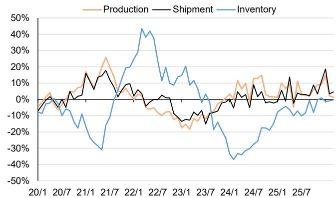

line

| Date   | Production | Shipment | Inventory |
|--------|------------|----------|-----------|
| 20/1   | -5%        | -5%      | -10%      |
| 20/7   | 0%         | 0%       | -10%      |
| 21/1   | 10%        | 10%      | -30%      |
| 21/7   | 25%        | 15%      | 0%        |
| 22/1   | 5%         | 5%       | 40%       |
| 22/7   | -5%        | 0%       | 10%       |
| 23/1   | -10%       | -5%      | 20%       |
| 23/7   | -15%       | -10%     | 0%        |
| 24/1   | 0%         | -5%      | -40%      |
| 24/7   | 10%        | 0%       | -20%      |
| 25/1   | 5%         | 5%       | -10%      |
| 25/7   | 15%        | 10%      | 0%        |

Taiyo Yuden: MLCC production & inventory (1)   
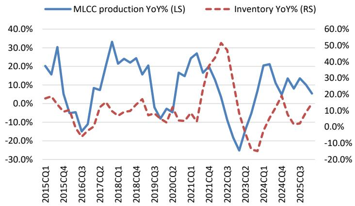

line

| Quarter | MLCC production YoY% (LS) | Inventory YoY% (RS) |
|---------|---------------------------|---------------------|
| 2015CQ1 | ~20.0%                    | ~10.0%              |
| 2015CQ4 | ~30.0%                    | ~5.0%               |
| 2016CQ3 | ~-10.0%                   | ~-15.0%             |
| 2017CQ2 | ~10.0%                    | ~-5.0%              |
| 2018CQ1 | ~35.0%                    | ~-5.0%              |
| 2018CQ4 | ~25.0%                    | ~-5.0%              |
| 2019CQ3 | ~-5.0%                    | ~-5.0%              |
| 2020CQ2 | ~-5.0%                    | ~-10.0%             |
| 2021CQ1 | ~25.0%                    | ~-5.0%              |
| 2021CQ4 | ~25.0%                    | ~-5.0%              |
| 2022CQ3 | ~-25.0%                   | ~50.0%              |
| 2023CQ2 | ~-10.0%                   | ~-15.0%             |
| 2024CQ1 | ~20.0%                    | ~-5.0%              |
| 2024CQ4 | ~15.0%                    | ~-5.0%              |
| 2025CQ3 | ~10.0%                    | ~-5.0%              |

Note: \*3-month average   
Source: METI, Company data, MS

■ Industrial production: Production, shipments, inventories for Electronic parts and devices\* (2)   
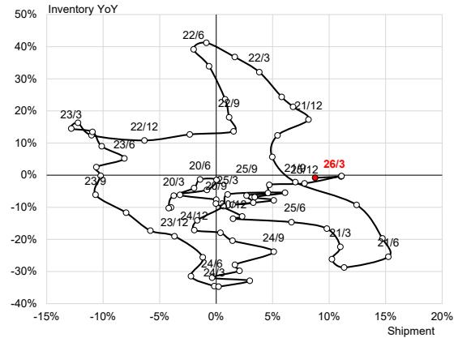

line

| Date   | Shipment | Inventory YoY |
|--------|----------|---------------|
| 23/3   | -12%     | 15%           |
| 22/12  | -8%      | 10%           |
| 22/6   | -2%      | 40%           |
| 22/9   | 0%       | 15%           |
| 22/3   | 5%       | 30%           |
| 21/12  | 10%      | 20%           |
| 26/3   | 10%      | 0%            |
| 25/9   | 5%       | -5%           |
| 25/3   | 0%       | -10%          |
| 24/6   | -5%      | -30%          |
| 24/9   | -10%     | -20%          |
| 24/3   | -15%     | -30%          |
| 23/12  | -10%     | -10%          |
| 23/9   | -15%     | -5%           |
| 24/12  | -5%      | -10%          |
| 24/6   | 0%       | -30%          |
| 24/9   | 5%       | -20%          |
| 24/3   | 10%      | -10%          |
| 23/6   | -10%     | 10%           |
| 23/3   | -15%     | 15%           |
| 24/6   | -10%     | -30%          |
| 24/9   | -5%      | -20%          |
| 24/3   | 0%       | -10%          |
| 23/12  | 5%       | -5%           |
| 24/6   | 10%      | -30%          |
| 24/9   | 15%      | -20%          |
| 24/3   | 10%      | -10%          |
| 23/6   | -10%     | 10%           |
| 24/12  | -5%      | -5%           |
| 24/6   | 0%       | -10%          |
| 24/9   | 5%       | -5%           |
| 24/3   | 10%      | -10%          |
| 23/12  | 15%      | -5%           |
| 24/6   | 10%      | -10%          |
| 24/9   | 5%       | -5%           |
| 24/3   | 0%       | -10%          |
| 23/6   | -5%      | -10%          |
| 24/12  | -10%     | -5%           |
| 24/6   | -15%     | -10%          |
| 24/9   | -10%     | -5%           |
| 24/3   | -5%      | -10%          |
| 23/12  | 0%       | -5%           |
| 24/6   | 5%       | -10%          |
| 24/9   | 10%      | -5%           |
| 24/3   | 15%      | -10%          |
| 23/6   | 10%      | -5%           |
| 24/12  | 5%       | -10%          |
| 24/6   | 0%       | -15%          |
| 24/9   | -5%      | -10%          |
| 24/3   | -10%     | -5%           |
| 23/12  | -5%      | -10%          |
| 24/6   | -10%     | -5%           |
| 24/9   | -5%      | -10%          |
| 24/3   | -10%     | -5%           |
| 23/6   | -5%      | -10%          |
| 24/12  | -10%     | -5%           |
| 24/6   | -5%      | -10%          |
| 24/9   | -10%     | -5%           |
| 24/3   | -5%      | -10%          |
| 23/12  | -10%     | -5%           |
| 24/6   | -5%      | -10%          |
| 24/9   | -10%     | -5%           |
| 24/3   | -5%      | -10%          |
| 23/6   | -10%     | -5%           |
| 24/12  | -5%      | -10%          |
| 24/6   | -10%     | -5%           |
| 24/9   | -5%      | -10%          |
| 24/3   | -10%     | -5%           |
| 23/12  | -5%      | -10%          |
| 24/6   | -10%     | -5%           |
| 24/9   | -5%      | -10%          |
| 31/3   | -10%     | -5%           |
| 31/6   | -5%      | -10%          |
| 31/9   | -10%     | -5%           |
| 31/3   | -5%      | -10%          |
| 31/6   | -10%     | -5%           |
| 31/9   | -5%      | -10%          |
| 31/3   | -10%     | -5%           |
| 31/6   | -5%      | -10%          |
| 31/9   | -10%     | -5%           |
| 31/3   | -5%      | -10%          |
| 31/6   | 0        | -5%           |
| 31/9   | -5%      | -10%          |
| 31/3   | -10%     | -5%           |
| 31/6   | -5%      | -10%          |
| 31/9   | 0        | -5%           |
| 31/3   | -5%      | -10%          |
| 31/6   | -10%     | -5%           |
| 31/9   | -5%      | -10%          |
| 31/3   | 0        | -5%           |
| 31/6   |-5%      | -10%          |
| 31/9   |-10%     | -5%           |
| 31/3   |-5%      | -10%          |
| 31/6   |-10%     | -5%           |
| 31/9   |-5%      | -10%          |
| 31/3   |-10%     | -5%           |
| 31/6   |-5%      | -10%          |
| 31/9   |-10%     | -5%           |
| 31/3   |-5%      | -10%          |
| 31/6   |-10%     | -5%           |
| 31/9   |-5%      | -10%                                                                          |
| 31/3   |-10%     | -5%                                                                           |
| 31/6   |-5%      | -10%                                                                          |
| 31/9   |-10%     | -5%                                                                           |
| 31/3   |-5%      | -10%                                                                          |
| 31/6   |-10%     | -5%                                                                           |
| 31/9   |-5%      | -10%                                                                          |
| 31/3   |-10%     | -5%                                                                           |
| 31/6   |-5%      | -10%                                                                          |
| 31/9   |-10%     | -5%                                                                           |
| 31/3   |-5%      | -10%                                                                          |
| 3<ecel><ecel><nl>

Taiyo Yuden: MLCC Production & inventory (2)   
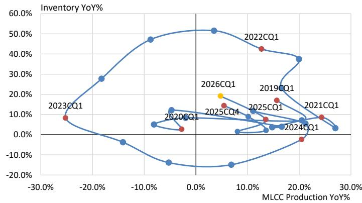

line

| Year/Quarter | MLCC Production YoY% | Inventory YoY% |
| ------------ | --------------------- | -------------- |
| 2023CQ1      | -25.0%                | 8.0%           |
| 2023CQ1      | -15.0%                | 28.0%          |
| 2023CQ1      | -5.0%                 | 47.0%          |
| 2023CQ1      | 0.0%                  | 51.0%          |
| 2023CQ1      | 5.0%                  | 51.0%          |
| 2023CQ1      | 10.0%                 | 43.0%          |
| 2023CQ1      | 15.0%                 | 37.0%          |
| 2023CQ1      | 20.0%                 | 37.0%          |
| 2023CQ1      | 25.0%                 | 10.0%          |
| 2023CQ1      | 30.0%                 | 3.0%           |
| 2024CQ1      | 15.0%                 | 8.0%           |
| 2024CQ1      | 15.0%                 | 8.0%           |
| 2024CQ1      | 15.0%                 | 8.0%           |
| 2024CQ1      | 15.0%                 | 8.0%           |
| 2024CQ1      | 15.0%, 15.0%, 15.0%, 15.0%, 15.0%, 15.0%, 15.0%, 15.0%, 15.0%, 15.0%, 15.0%, 15.0%, 15.0%, 15.0%, 15.0%, 15.0%, 15.0%, 15, 15, 15, 15, 15, 15, 15, 15, 15, 15, 15, 15, 15, 15, 15, 15, 15, 15, 15, 15, 15, 15, 15, 15, 15, 15 | -3.0%                 |
| 2025CQ4      | -3.0%                 | 3.0%           |
| 2025CQ4      | -3.0%                 | 8.0%           |
| 2025CQ4      | -3.0%                 | 8.0%           |
| 2025CQ4      | -3.0%                 | 8.0%           |
| 2025CQ4      | -3.0%                 | 8.0%           |
| 2026CQ1      | -3.0%                 | 8.0%           |
| 2026CQ1      | -3.0%                 | 8.0%           |
| 2026CQ1      | -3.0%                 | 8.0%           |
| 2026CQ1      | -3.0%                 | 8.0%           |
| 2026CQ4      | -3.0%                 | 8.0%           |
| 2026CQ4      | -3.0%                 | 8.0%           |
| 2026CQ4      | -3.0%                 | 8.0%           |
| 2026CQ4      | -3.0%                 | 8.0%           |
| 2026CQ1      | -3.0%                 | 8.0%           |
| 2026CQ1      | -3.0%                 | 8.0%           |
| 2026CQ1      | -3.0%                 | 8.0%           |
| 2027CQ4      | -3.0%                 | 8.0%           |
| 2027CQ4      | -3.0%                 | 8.0%           |
| 2027CQ4      | -3.0%                 | 8.0%           |
| 2027CQ4      | -3.0%                 | 8.0%           |
| 2027CQ1      | -3.0%                 | 8.0%           |
| 2027CQ1      | -3.0%                 | 8.0%           |
| 2027CQ1      | -3.0%                 | 8.0%           |
| 2027CQ1      | -3.0%                 | 8.0%           |
| 2027CQ4      | -3.0%                 | 8.0%           |
| 2027CQ4      | -3.0%                 | 8.0%           |
| 2027CQ4      | -3.0%                 | 8.0%           |
| 2028CQ4      | -3.0%                 | 8.0%           |
| 2028CQ4      | -3.0%                 | 8.0%           |
| 2028CQ4      | -3.0%                 | 8.0%           |
| 2028CQ4      | -3.0%                 | 8.0%           |
| 2029CQ4      | -3.0%                 | 8.0%           |
| 2029CQ4      | -3.0%                 | 8.0%           |
| 2029CQ4      | -3.0%                 | 8.0%           |
| 2039CQ4      | -3.0%                 | 8.0%           |
| 2039CQ4      | -3.0%                 | 8.0%           |
| 2039CQ4      | -3.0%                 | 8.0%           |
| 2049CQ4      | -3.0%                 | 8.0%           |
| 2049CQ4      | -3.0%                 | 8.0%           |
| 2049CQ4      | -3.0%                 | 8.0%           |
| 2049CQ4      | -3.0%                 | 8.0%           |
| Note: The last row is a duplicate of the original data point from the original image to the original image for each year's Q4 and Q1 of the original image.

Stock Price Performance 

<table><tr><td>Rank</td><td colspan="2">2020</td><td colspan="2">2021</td><td colspan="2">2022</td><td colspan="2">2023</td><td colspan="2">2024</td><td colspan="2">2025</td><td colspan="2">2026 Based on 5/15 Closing Price</td></tr><tr><td>1</td><td>IBIDEN</td><td>85%</td><td>NIHON DEMPA KOGYO</td><td>184%</td><td>NITERRA</td><td>22%</td><td>CMK</td><td>80%</td><td>MEIKO ELECTRONICS</td><td>122%</td><td>IBIDEN</td><td>182%</td><td>MEIKO ELECTRONICS</td><td>238%</td></tr><tr><td>2</td><td>NIDEC</td><td>73%</td><td>MEIKO ELECTRONICS</td><td>147%</td><td>KOA</td><td>17%</td><td>MEIKO ELECTRONICS</td><td>73%</td><td>TDK</td><td>54%</td><td>TAIYO YUDEN</td><td>56%</td><td>IBIDEN</td><td>133%</td></tr><tr><td>3</td><td>DAISHINKU</td><td>51%</td><td>DAISHINKU</td><td>135%</td><td>ALPS ALPINE</td><td>10%</td><td>IBIDEN</td><td>63%</td><td>NITERRA</td><td>52%</td><td>NICHICON</td><td>49%</td><td>NIHON DEMPA KOGYO</td><td>119%</td></tr><tr><td>4</td><td>TAIYO YUDEN</td><td>44%</td><td>CMK</td><td>72%</td><td>JAE</td><td>6%</td><td>TDK</td><td>55%</td><td>ALPS ALPINE</td><td>31%</td><td>NIPPON CHEMI-CON</td><td>49%</td><td>NIPPON CHEMI-CON</td><td>107%</td></tr><tr><td>5</td><td>MURATA MANUFACTURING</td><td>38%</td><td>MINEBEA MITSUMI</td><td>59%</td><td>MABUCHI MOTOR</td><td>-2%</td><td>JAE</td><td>53%</td><td>TOPIX</td><td>18%</td><td>KYOCERA</td><td>39%</td><td>TAIYO YUDEN</td><td>91%</td></tr><tr><td>6</td><td>HAMAMATSU PHOTONICS</td><td>31%</td><td>IBIDEN</td><td>42%</td><td>IRISO ELECTRONICS</td><td>-2%</td><td>MINEBEA MITSUMI</td><td>47%</td><td>HIROSE ELECTRIC</td><td>17%</td><td>KOA</td><td>38%</td><td>MURATA MANUFACTURING</td><td>89%</td></tr><tr><td>7</td><td>TDK</td><td>25%</td><td>TAIYO YUDEN</td><td>37%</td><td>NICHICON</td><td>-3%</td><td>NITERRA</td><td>37%</td><td>NIDEC</td><td>0%</td><td>NITERRA</td><td>36%</td><td>NICHICON</td><td>68%</td></tr><tr><td>8</td><td>NIHON DEMPA KOGYO</td><td>19%</td><td>JAE</td><td>26%</td><td>TDK</td><td>-3%</td><td>MURATA MANUFACTURING</td><td>36%</td><td>MABUCHI MOTOR</td><td>-4%</td><td>MABUCHI MOTOR</td><td>28%</td><td>HAMAMATSU PHOTONICS</td><td>60%</td></tr><tr><td>9</td><td>NICHICON</td><td>14%</td><td>HAMAMATSU PHOTONICS</td><td>24%</td><td>TOPIX</td><td>-5%</td><td>KYOCERA</td><td>26%</td><td>JAE</td><td>-8%</td><td>MURATA MANUFACTURING</td><td>27%</td><td>KOA</td><td>50%</td></tr><tr><td>10</td><td>HIROSE ELECTRIC</td><td>12%</td><td>HIROSE ELECTRIC</td><td>24%</td><td>KYOCERA</td><td>-9%</td><td>MABUCHI MOTOR</td><td>25%</td><td>MINEBEA MITSUMI</td><td>-11%</td><td>ALPS ALPINE</td><td>24%</td><td>NITERRA</td><td>40%</td></tr><tr><td>11</td><td>MABUCHI MOTOR</td><td>8%</td><td>NITERRA</td><td>14%</td><td>NIPPON CHEMI-CON</td><td>-13%</td><td>TOPIX</td><td>25%</td><td>MURATA MANUFACTURING</td><td>-14%</td><td>TOPIX</td><td>22%</td><td>HIROSE ELECTRIC</td><td>38%</td></tr><tr><td>12</td><td>KOA</td><td>8%</td><td>KYOCERA</td><td>14%</td><td>NIHON DEMPA KOGYO</td><td>-13%</td><td>DAISHINKU</td><td>24%</td><td>NICHICON</td><td>-15%</td><td>MINEBEA MITSUMI</td><td>22%</td><td>TDK</td><td>35%</td></tr><tr><td>13</td><td>TOPIX</td><td>5%</td><td>TOPIX</td><td>10%</td><td>HAMAMATSU PHOTONICS</td><td>-14%</td><td>NICHICON</td><td>6%</td><td>KYOCERA</td><td>-23%</td><td>CMK</td><td>21%</td><td>DAISHINKU</td><td>32%</td></tr><tr><td>14</td><td>IRISO ELECTRONICS</td><td>-8%</td><td>KOA</td><td>9%</td><td>HIROSE ELECTRIC</td><td>-14%</td><td>ALPS ALPINE</td><td>3%</td><td>NIPPON CHEMI-CON</td><td>-26%</td><td>IRISO ELECTRONICS</td><td>19%</td><td>KYOCERA</td><td>31%</td></tr><tr><td>15</td><td>MINEBEA MITSUMI</td><td>-10%</td><td>NIDEC</td><td>4%</td><td>MURATA MANUFACTURING</td><td>-28%</td><td>TAIYO YUDEN</td><td>-3%</td><td>IRISO ELECTRONICS</td><td>-27%</td><td>NIHON DEMPA KOGYO</td><td>17%</td><td>MINEBEA MITSUMI</td><td>26%</td></tr><tr><td>16</td><td>NIPPON CHEMI-CON</td><td>-13%</td><td>MURATA MANUFACTURING</td><td>-2%</td><td>IBIDEN</td><td>-30%</td><td>HIROSE ELECTRIC</td><td>-4%</td><td>NIHON DEMPA KOGYO</td><td>-31%</td><td>MEIKO ELECTRONICS</td><td>16%</td><td>CMK</td><td>24%</td></tr><tr><td>17</td><td>KYOCERA</td><td>-15%</td><td>NIPPON CHEMI-CON</td><td>-2%</td><td>CMK</td><td>-34%</td><td>HAMAMATSU PHOTONICS</td><td>-8%</td><td>DAISHINKU</td><td>-35%</td><td>TDK</td><td>7%</td><td>NIDEC</td><td>21%</td></tr><tr><td>18</td><td>NITERRA</td><td>-17%</td><td>IRISO ELECTRONICS</td><td>-3%</td><td>MINEBEA MITSUMI</td><td>-40%</td><td>IRISO ELECTRONICS</td><td>-13%</td><td>KOA</td><td>-36%</td><td>DAISHINKU</td><td>3%</td><td>TOPIX</td><td>13%</td></tr><tr><td>19</td><td>MEIKO ELECTRONICS</td><td>-22%</td><td>NICHICON</td><td>-3%</td><td>TAIYO YUDEN</td><td>-42%</td><td>NIPPON CHEMI-CON</td><td>-16%</td><td>IBIDEN</td><td>-39%</td><td>HAMAMATSU PHOTONICS</td><td>-6%</td><td>MABUCHI MOTOR</td><td>11%</td></tr><tr><td>20</td><td>JAE</td><td>-29%</td><td>TDK</td><td>-13%</td><td>NIDEC</td><td>-49%</td><td>NIDEC</td><td>-17%</td><td>HAMAMATSU PHOTONICS</td><td>-39%</td><td>HIROSE ELECTRIC</td><td>-8%</td><td>ALPS ALPINE</td><td>11%</td></tr><tr><td>21</td><td>CMK</td><td>-40%</td><td>MABUCHI MOTOR</td><td>-15%</td><td>MEIKO ELECTRONICS</td><td>-49%</td><td>KOA</td><td>-18%</td><td>TAIYO YUDEN</td><td>-39%</td><td>JAE</td><td>-16%</td><td>IRISO ELECTRONICS</td><td>6%</td></tr><tr><td>22</td><td>ALPS ALPINE</td><td>-46%</td><td>ALPS ALPINE</td><td>-20%</td><td>DAISHINKU</td><td>-55%</td><td>NIHON DEMPA KOGYO</td><td>-19%</td><td>CMK</td><td>-48%</td><td>NIDEC</td><td>-25%</td><td>JAE</td><td>0%</td></tr></table>

■ Stock price performance (CY2025)   
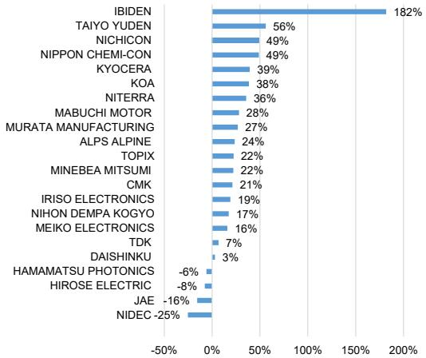

bar

| Company | Value (%) |
| :--- | :--- |
| IBIDEN | 182 |
| TAIYO YUDEN | 56 |
| NICHICON | 49 |
| NIPPON CHEMI-CON | 49 |
| KYOCERA | 39 |
| KOA | 38 |
| NITERRA | 36 |
| MABUCHI MOTOR | 28 |
| MURATA MANUFACTURING | 27 |
| ALPS ALPINE | 24 |
| TOPIX | 22 |
| MINEBEA MITSUMI | 22 |
| CMK | 21 |
| IRISO ELECTRONICS | 19 |
| NIHON DEMPA KOGYO | 17 |
| MEIKO ELECTRONICS | 16 |
| TDK | 7 |
| DAISHINKU | 3 |
| HAMAMATSU PHOTONICS | -6 |
| HIROSE ELECTRIC | -8 |
| JAE | -16 |
| NIDEC | -25 |

■ Stock price performance (CY2026 YTD)   
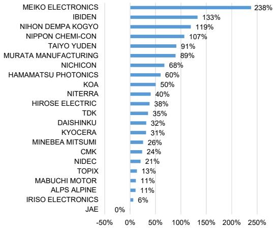

bar

| Company | Value (%) |
| :--- | :--- |
| MEIKO ELECTRONICS | 238 |
| IBIDEN | 133 |
| NIHON DEMP A KOGYO | 119 |
| NIPPON CHEMI-CON | 107 |
| TAIYO YUDEN | 91 |
| MURATA MANUFACTURING | 89 |
| NICHICON | 68 |
| HAMAMATSU PHOTONICS | 60 |
| KOA | 50 |
| NITERRA | 40 |
| HIROSE ELECTRIC | 38 |
| TDK | 35 |
| DAISHINKU | 32 |
| KYOCERA | 31 |
| MINEBEA MITSUMI | 26 |
| CMK | 24 |
| NIDEC | 21 |
| TOPIX | 13 |
| MABUCHI MOTOR | 11 |
| ALPS ALPINE | 11 |
| IRISO ELECTRONICS | 6 |
| JAE | 0 |

Source: FactSet

FX Sensitivities of Electronic Components Makers/Changes in the Competitiveness of Core Products Under a Weak Yen Environment 

<table><tr><td rowspan="2" colspan="2"></td><td>F26e</td><td colspan="2">FX assumption (by company)</td><td>FX sensitivity (JPY bn/year)</td><td colspan="2">Assumption:¥145/USD</td><td colspan="2">Assumption:¥155/USD</td></tr><tr><td>OP (JPY bn)</td><td>USD/JPY</td><td>USD/JPY</td><td>USD/JPY</td><td>OP (JPY bn)</td><td>Change (%)</td><td>OP (JPY bn)</td><td>Change (%)</td></tr><tr><td>IBIDEN</td><td>4062</td><td>77.0</td><td>150.0</td><td>150.0</td><td>0.8</td><td>73.0</td><td>-5%</td><td>81.0</td><td>5%</td></tr><tr><td>NITERRA</td><td>5334</td><td>156.6</td><td>150.0</td><td>150.0</td><td>1.0</td><td>151.6</td><td>-3%</td><td>161.6</td><td>3%</td></tr><tr><td>MINEBEA MITSUMI</td><td>6479</td><td>116.9</td><td>150.0</td><td>155.0</td><td>1.5</td><td>109.4</td><td>-6%</td><td>124.4</td><td>6%</td></tr><tr><td>MABUCHI MOTOR</td><td>6592</td><td>27.2</td><td>150.0</td><td>150.0</td><td>0.3</td><td>25.7</td><td>-6%</td><td>28.7</td><td>6%</td></tr><tr><td>TDK</td><td>6762</td><td>309.8</td><td>150.0</td><td>150.0</td><td>2.0</td><td>299.8</td><td>-3%</td><td>319.8</td><td>3%</td></tr><tr><td>ALPS ALPINE</td><td>6770</td><td>50.8</td><td>150.0</td><td>150.0</td><td>1.2</td><td>44.8</td><td>-12%</td><td>56.8</td><td>12%</td></tr><tr><td>NIHON DEMPA KOGYO</td><td>6779</td><td>3.8</td><td>150.0</td><td>150.0</td><td>0.1</td><td>3.4</td><td>-11%</td><td>4.2</td><td>11%</td></tr><tr><td>MEIKO ELECTRONICS</td><td>6787</td><td>33.6</td><td>150.0</td><td>150.0</td><td>0.1</td><td>33.1</td><td>-1%</td><td>34.1</td><td>1%</td></tr><tr><td>HIROSE ELECTRIC</td><td>6806</td><td>46.6</td><td>150.0</td><td>150.0</td><td>0.3</td><td>45.0</td><td>-4%</td><td>48.3</td><td>4%</td></tr><tr><td>JAE</td><td>6807</td><td>10.3</td><td>150.0</td><td>153.0</td><td>0.3</td><td>8.8</td><td>-15%</td><td>11.8</td><td>15%</td></tr><tr><td>CMK</td><td>6958</td><td>2.9</td><td>150.0</td><td>150.0</td><td>0.0</td><td>2.9</td><td>0%</td><td>2.9</td><td>0%</td></tr><tr><td>DAISHINKU</td><td>6962</td><td>1.3</td><td>150.0</td><td>150.0</td><td>0.1</td><td>1.1</td><td>-19%</td><td>1.6</td><td>19%</td></tr><tr><td>HAMAMATSU PHOTONICS</td><td>6965</td><td>14.9</td><td>150.0</td><td>151.7</td><td>0.3</td><td>13.4</td><td>-10%</td><td>16.4</td><td>10%</td></tr><tr><td>KYOCERA</td><td>6971</td><td>121.5</td><td>150.0</td><td>150.0</td><td>1.0</td><td>116.5</td><td>-4%</td><td>126.5</td><td>4%</td></tr><tr><td>TAIYO YUDEN</td><td>6976</td><td>31.8</td><td>150.0</td><td>149.8</td><td>0.9</td><td>27.3</td><td>-14%</td><td>36.3</td><td>14%</td></tr><tr><td>MURATA MANUFACTURING</td><td>6981</td><td>372.8</td><td>150.0</td><td>149.1</td><td>4.5</td><td>350.3</td><td>-6%</td><td>395.3</td><td>6%</td></tr><tr><td>NICHICON</td><td>6996</td><td>8.4</td><td>150.0</td><td>145.0</td><td>0.1</td><td>8.0</td><td>-5%</td><td>8.9</td><td>5%</td></tr><tr><td>NIPPON CHEMI-CON</td><td>6997</td><td>5.6</td><td>150.0</td><td>153.0</td><td>0.3</td><td>4.3</td><td>-23%</td><td>6.9</td><td>23%</td></tr><tr><td>KOA</td><td>6999</td><td>5.2</td><td>150.0</td><td>157.0</td><td>0.1</td><td>4.6</td><td>-12%</td><td>5.8</td><td>12%</td></tr><tr><td colspan="2">Total</td><td>1,396.9</td><td colspan="2"></td><td>14.8</td><td>1,322.8</td><td>-5%</td><td>1,471.1</td><td>5%</td></tr></table>

<table><tr><td></td><td></td><td></td><td>Changes in the competitiveness of core products under a weak-yen environment</td></tr><tr><td>IBIDEN</td><td>4062</td><td>↑</td><td>Flip-chip package costs rising vs. peers in S. Korea, Taiwan, Austria; profits highly likely to grow</td></tr><tr><td>NITERRA</td><td>5334</td><td>→</td><td>Expecting profit growth from weak yen as core parts for automotive plugs/sensors made in Japan, but likely no change to competitiveness given large number of Japanese peers</td></tr><tr><td>MINEBEA MITSUMI</td><td>6479</td><td>→</td><td>Potential sales decline with over 70% of sales $-denominated, but expecting THB/USD, CNY/USD rates to have big impact on profits</td></tr><tr><td>MABUCHI MOTOR</td><td>6592</td><td>→</td><td>Forecasting profit growth, but expecting no major shift in competitiveness for mainstay products given high overseas production weighting</td></tr><tr><td>TDK</td><td>6762</td><td>↑</td><td>Cost competitiveness for passive components may improve versus foreign peers, but limited impact for rechargeable batteries, HDD heads given lack of ¥-denominated costs</td></tr><tr><td>ALPS ALPINE</td><td>6770</td><td>→</td><td>Forecasting profit growth, but expecting no major shift in product competitiveness given limited rivalry with foreign firms for mainstay products</td></tr><tr><td>NIHON DEMPA KOGYO</td><td>6779</td><td>↑</td><td>Expecting increase in competitiveness on high foreign sales exposure, limited use of imported materials</td></tr><tr><td>MEIKO ELECTRONICS</td><td>6787</td><td>→</td><td>Expecting no major change in product competitiveness given high foreign production exposure, some use of imported materials</td></tr><tr><td>HIROSE ELECTRIC</td><td>6806</td><td>→</td><td>Expecting no major change in product competitiveness as US micro connector peers also undertaking production development/mass production in Japan</td></tr><tr><td>JAE</td><td>6807</td><td>→</td><td>Expecting no major change in product competitiveness as US micro connector peers also undertaking production development/mass production in Japan</td></tr><tr><td>CMK</td><td>6958</td><td>→</td><td>Expecting no major shift in competitiveness given high sales exposure to domestic customers</td></tr><tr><td>DAISHINKU</td><td>6962</td><td>↑</td><td>Expecting increase in competitiveness on high foreign sales exposure, limited use of imported materials</td></tr><tr><td>HAMAMATSU PHOTONICS</td><td>6965</td><td>↑</td><td>Yen weakness positive for earnings as 95% of production in Japan &amp; 75% of sales abroad, although still certain level of ¥-denominated sales overseas</td></tr><tr><td>KYOCERA</td><td>6971</td><td>→</td><td>Forecasting growth in ¥-converted profits, but expecting no major shift in competitiveness of mainstay products</td></tr><tr><td>TAIYO YUDEN</td><td>6976</td><td>↑</td><td>Cost competitiveness of mainstay MLCCs rising vs. peers in S. Korea &amp; Taiwan; potential growth in ¥-converted profits on high foreign sales exposure</td></tr><tr><td>MURATA MANUFACTURING</td><td>6981</td><td>↑</td><td>Cost competitiveness of mainstay MLCCs rising vs. peers in S. Korea &amp; Taiwan; potential growth in ¥-converted profits on high foreign sales exposure</td></tr><tr><td>NICHICON</td><td>6996</td><td>→</td><td>Positive on aluminum electrolytic capacitor earnings, but worries over pressure on NECST product earnings given rising costs of imported parts/materials</td></tr><tr><td>NIPPON CHEMI-CON</td><td>6997</td><td>↑</td><td>Cost competitiveness of mainstay aluminum electrolytic capacitors rising vs. peers in China; potential growth in ¥-converted profits on high foreign sales exposure</td></tr><tr><td>KOA</td><td>6999</td><td>→</td><td>Expecting substantial profit growth but no major change in product competitiveness as domestic peers with high market share also getting same benefits</td></tr></table>

Note: e = MS estimates   
Source: Company data, MS

# Sales and Production by Region

■ Sales by region (FY24) 

<table><tr><td>Code</td><td>Company Name</td><td>Japan</td><td>US/America</td><td>Europe</td><td>China</td><td>Others</td></tr><tr><td>4062</td><td>IBIDEN</td><td>29.3%</td><td>12.9%</td><td>7.3%</td><td>-</td><td>50.5%</td></tr><tr><td>5334</td><td>NITERRA</td><td>18.9%</td><td>25.3%</td><td>19.3%</td><td>10.5%</td><td>26.0%</td></tr><tr><td>6479</td><td>MINEBEA MITSUMI</td><td>24.4%</td><td>27.2%</td><td>11.3%</td><td>17.8%</td><td>19.4%</td></tr><tr><td>6592</td><td>MABUCHI MOTOR</td><td>10.3%</td><td>18.1%</td><td>22.9%</td><td>0.0%</td><td>48.7%</td></tr><tr><td>6594</td><td>NIDEC</td><td>15.4%</td><td>22.8%</td><td>22.8%</td><td>21.1%</td><td>17.8%</td></tr><tr><td>6762</td><td>TDK</td><td>7.9%</td><td>6.4%</td><td>7.9%</td><td>54.1%</td><td>23.7%</td></tr><tr><td>6770</td><td>ALPS ALPINE</td><td>11.2%</td><td>18.0%</td><td>-</td><td>22.1%</td><td>48.7%</td></tr><tr><td>6779</td><td>NIHON DEMPA KOGYO</td><td>15.4%</td><td>13.7%</td><td>8.4%</td><td>35.3%</td><td>27.2%</td></tr><tr><td>6787</td><td>MEIKO ELECTRONICS</td><td>36.1%</td><td>0.0%</td><td>1.8%</td><td>16.7%</td><td>33.3%</td></tr><tr><td>6806</td><td>HIROSE ELECTRIC</td><td>15.7%</td><td>-</td><td>-</td><td>39.6%</td><td>44.7%</td></tr><tr><td>6807</td><td>JAE</td><td>36.6%</td><td>1.0%</td><td>-</td><td>37.0%</td><td>15.1%</td></tr><tr><td>6908</td><td>IRISO ELECTRONICS</td><td>16.0%</td><td>9.1%</td><td>15.5%</td><td>36.7%</td><td>22.6%</td></tr><tr><td>6958</td><td>CMK</td><td>58.2%</td><td>-</td><td>11.2%</td><td>18.2%</td><td>12.4%</td></tr><tr><td>6962</td><td>DAISHINKU</td><td>11.7%</td><td>5.3%</td><td>11.1%</td><td>32.5%</td><td>39.5%</td></tr><tr><td>6965</td><td>HAMAMATSU PHOTONICS</td><td>22.6%</td><td>24.2%</td><td>23.4%</td><td>19.1%</td><td>10.7%</td></tr><tr><td>6971</td><td>KYOCERA</td><td>29.0%</td><td>21.0%</td><td>20.2%</td><td>11.8%</td><td>18.0%</td></tr><tr><td>6976</td><td>TAIYO YUDEN</td><td>7.0%</td><td>-</td><td>-</td><td>32.2%</td><td>47.4%</td></tr><tr><td>6981</td><td>MURATA MANUFACTURING</td><td>7.4%</td><td>13.9%</td><td>9.2%</td><td>47.7%</td><td>21.7%</td></tr><tr><td>6996</td><td>NICHICON</td><td>50.6%</td><td>7.9%</td><td>5.7%</td><td>26.0%</td><td>9.9%</td></tr><tr><td>6997</td><td>NIPPON CHEMI-CON</td><td>21.4%</td><td>11.4%</td><td>10.7%</td><td>32.2%</td><td>24.4%</td></tr><tr><td>6999</td><td>KOA</td><td>31.3%</td><td>17.1%</td><td>18.9%</td><td>-</td><td>32.7%</td></tr><tr><td colspan="2">Total</td><td>17.7%</td><td>16.9%</td><td>13.0%</td><td>27.6%</td><td>24.9%</td></tr></table>

■ Production by region (FY25e) 

<table><tr><td>Code</td><td>Company Name</td><td>Japan</td><td>US/America</td><td>Europe</td><td>China</td><td>Others</td></tr><tr><td>4062</td><td>IBIDEN</td><td>75.0%</td><td>4.0%</td><td>3.0%</td><td>2.0%</td><td>16.0%</td></tr><tr><td>5334</td><td>NITERRA</td><td>60.0%</td><td>10.0%</td><td>8.0%</td><td>8.0%</td><td>14.0%</td></tr><tr><td>6479</td><td>MINEBEA MITSUMI</td><td>22.0%</td><td>26.0%</td><td>11.0%</td><td>19.0%</td><td>22.0%</td></tr><tr><td>6592</td><td>MABUCHI MOTOR</td><td>0.0%</td><td>7.0%</td><td>3.0%</td><td>35.0%</td><td>55.0%</td></tr><tr><td>6762</td><td>TDK</td><td>12.5%</td><td>5.0%</td><td>10.0%</td><td>60.0%</td><td>12.5%</td></tr><tr><td>6770</td><td>ALPS ALPINE</td><td>30.0%</td><td>10.0%</td><td>5.0%</td><td>25.0%</td><td>30.0%</td></tr><tr><td>6779</td><td>NIHON DEMPA KOGYO</td><td>70.0%</td><td>0.0%</td><td>0.0%</td><td>20.0%</td><td>10.0%</td></tr><tr><td>6787</td><td>MEIKO ELECTRONICS</td><td>10.0%</td><td>0.0%</td><td>0.0%</td><td>45.0%</td><td>45.0%</td></tr><tr><td>6806</td><td>HIROSE ELECTRIC</td><td>50.0%</td><td>0.0%</td><td>0.0%</td><td>10.0%</td><td>40.0%</td></tr><tr><td>6807</td><td>JAE</td><td>60.0%</td><td>5.0%</td><td>0.0%</td><td>20.0%</td><td>15.0%</td></tr><tr><td>6908</td><td>IRISO ELECTRONICS</td><td>13.0%</td><td>0.0%</td><td>0.0%</td><td>49.0%</td><td>38.0%</td></tr><tr><td>6958</td><td>CMK</td><td>20.0%</td><td>0.0%</td><td>0.0%</td><td>35.0%</td><td>45.0%</td></tr><tr><td>6962</td><td>DAISHINKU</td><td>60.0%</td><td>0.0%</td><td>0.0%</td><td>30.0%</td><td>10.0%</td></tr><tr><td>6965</td><td>HAMAMATSU PHOTONICS</td><td>80.0%</td><td>5.0%</td><td>10.0%</td><td>5.0%</td><td>0.0%</td></tr><tr><td>6971</td><td>KYOCERA</td><td>60.0%</td><td>10.0%</td><td>10.0%</td><td>10.0%</td><td>10.0%</td></tr><tr><td>6976</td><td>TAIYO YUDEN</td><td>35.0%</td><td>0.0%</td><td>0.0%</td><td>20.0%</td><td>45.0%</td></tr><tr><td>6981</td><td>MURATA MANUFACTURING</td><td>70.0%</td><td>3.0%</td><td>3.0%</td><td>15.0%</td><td>9.0%</td></tr><tr><td>6996</td><td>NICHICON</td><td>75.0%</td><td>0.0%</td><td>0.0%</td><td>15.0%</td><td>10.0%</td></tr><tr><td>6997</td><td>NIPPON CHEMI-CON</td><td>65.0%</td><td>5.0%</td><td>0.0%</td><td>15.0%</td><td>15.0%</td></tr><tr><td>6999</td><td>KOA</td><td>70.0%</td><td>0.0%</td><td>0.0%</td><td>5.0%</td><td>25.0%</td></tr><tr><td colspan="2">Total</td><td>40.9%</td><td>8.7%</td><td>7.9%</td><td>24.2%</td><td>18.3%</td></tr></table>

Note: Production data based on MS estimation   
Source: Company data, MS

# Preparing for Smartphone Price Compression and Slowdown in Technological Innovation

■ Potential for smartphone commoditization to knock down margins, but also greater earnings opportunities from computerization of autos and other areas   
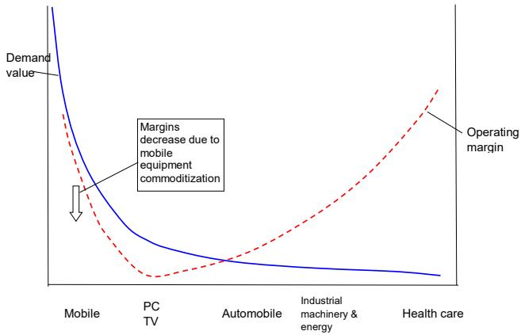

line

| Category                  | Operating margin | Demand value |
| ------------------------- | ---------------- | ------------ |
| Mobile                    | High             | Low          |
| PC TV                     | Medium           | Medium       |
| Automobile                | Low              | Low          |
| Industrial machinery & energy | Medium           | Low          |
| Health care               | High             | Low          |

Global smartphone shipments

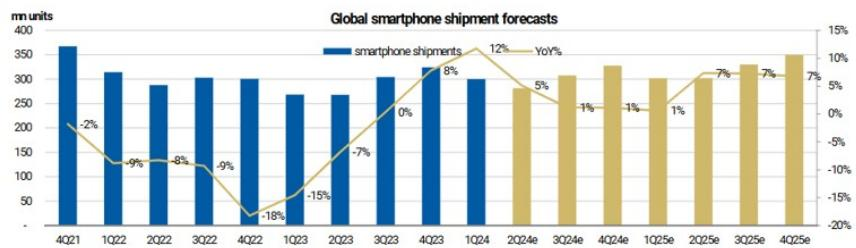

bar_line

Global smartphone shipment forecasts
| Quarter | smartphone shipments (mn units) | YoY (%) |
|---|---|---|
| 4Q21 | 370 | -2 |
| 1Q22 | 315 | -9 |
| 2Q22 | 285 | -8 |
| 3Q22 | 300 | -9 |
| 4Q22 | 300 | -18 |
| 1Q23 | 265 | -15 |
| 2Q23 | 265 | -7 |
| 3Q23 | 300 | 0 |
| 4Q23 | 325 | 8 |
| 1Q24 | 300 | 12 |
| 2Q24e | 275 | 5 |
| 3Q24e | 305 | -1 |
| 4Q24e | 325 | -1 |
| 1Q25e | 300 | 1 |
| 2Q25e | 300 | 7 |
| 3Q25e | 315 | -7 |
| 4Q25e | 345 | 7 |

Note: e = MS estimates   
Source: Company data, MS

Electronic component firms: Sales breakdown by applications (F24) 

<table><tr><td></td><td>Sales in F24(JPY bn)</td><td>Smartphone</td><td>Computers</td><td>AV/Office</td><td>Automotive</td><td>Industrial</td><td>Others</td></tr><tr><td>Ibiden</td><td>369.4</td><td>10.3</td><td>186.9</td><td>0.0</td><td>73.0</td><td>14.6</td><td>84.6</td></tr><tr><td>Nittera</td><td>653.0</td><td>2.4</td><td>0.0</td><td>0.0</td><td>538.9</td><td>32.6</td><td>79.0</td></tr><tr><td>Minebea Mitsumi</td><td>1,522.7</td><td>270.9</td><td>132.8</td><td>345.4</td><td>550.0</td><td>91.4</td><td>132.2</td></tr><tr><td>Mabuchi Motor</td><td>196.2</td><td>0.0</td><td>0.0</td><td>17.3</td><td>152.5</td><td>8.6</td><td>17.8</td></tr><tr><td>Nidec</td><td>2,607.1</td><td>0.0</td><td>178.5</td><td>315.6</td><td>664.6</td><td>1,051.0</td><td>397.4</td></tr><tr><td>TDK</td><td>2,204.8</td><td>866.9</td><td>400.1</td><td>66.7</td><td>453.5</td><td>360.8</td><td>56.7</td></tr><tr><td>Alps Alpine</td><td>990.4</td><td>298.0</td><td>43.8</td><td>53.0</td><td>537.2</td><td>22.0</td><td>36.3</td></tr><tr><td>NDK</td><td>53.1</td><td>10.5</td><td>0.4</td><td>0.4</td><td>29.2</td><td>5.0</td><td>7.6</td></tr><tr><td>Meiko Electronics</td><td>206.8</td><td>22.5</td><td>13.8</td><td>0.0</td><td>96.7</td><td>5.2</td><td>68.6</td></tr><tr><td>Hirose Electric</td><td>189.4</td><td>46.1</td><td>10.4</td><td>9.8</td><td>50.5</td><td>46.4</td><td>26.2</td></tr><tr><td>JAE</td><td>221.6</td><td>66.9</td><td>1.5</td><td>1.5</td><td>112.8</td><td>28.7</td><td>10.4</td></tr><tr><td>IRISO</td><td>56.3</td><td>0.0</td><td>0.6</td><td>4.1</td><td>48.2</td><td>3.2</td><td>0.4</td></tr><tr><td>CMK</td><td>95.5</td><td>0.0</td><td>0.5</td><td>0.6</td><td>81.7</td><td>3.0</td><td>9.7</td></tr><tr><td>Daishinku</td><td>38.6</td><td>10.2</td><td>5.3</td><td>0.0</td><td>13.8</td><td>4.0</td><td>5.3</td></tr><tr><td>Hamamatsu Photoni</td><td>204.0</td><td>0.0</td><td>0.0</td><td>1.0</td><td>5.6</td><td>66.3</td><td>131.0</td></tr><tr><td>Kyocera</td><td>2,014.5</td><td>310.0</td><td>130.6</td><td>472.1</td><td>288.2</td><td>398.1</td><td>415.4</td></tr><tr><td>Taiyo Yuden</td><td>341.4</td><td>84.6</td><td>58.9</td><td>27.3</td><td>102.4</td><td>68.3</td><td>0.0</td></tr><tr><td>Murata Mfg.</td><td>1,743.4</td><td>674.2</td><td>281.9</td><td>150.4</td><td>453.1</td><td>183.7</td><td>0.0</td></tr><tr><td>Nichicon</td><td>175.8</td><td>0.0</td><td>15.4</td><td>18.8</td><td>42.7</td><td>58.1</td><td>40.9</td></tr><tr><td>Nippon Chemi-Con</td><td>122.7</td><td>0.0</td><td>31.7</td><td>8.5</td><td>45.0</td><td>23.1</td><td>14.3</td></tr><tr><td>KOA</td><td>64.1</td><td>0.0</td><td>8.0</td><td>3.5</td><td>35.3</td><td>7.6</td><td>9.8</td></tr><tr><td>Total</td><td>14,070.8</td><td>2,673.5</td><td>1,501.1</td><td>1,495.8</td><td>4,375.0</td><td>2,481.7</td><td>1,543.6</td></tr></table>

<table><tr><td rowspan="2"></td><td colspan="7">Sales in F24</td></tr><tr><td></td><td>Smartphone</td><td>Computers</td><td>AV/Office</td><td>Automotive</td><td>Industrial</td><td>Others</td></tr><tr><td>Ibiden</td><td>100%</td><td>3%</td><td>51%</td><td>0%</td><td>20%</td><td>4%</td><td>23%</td></tr><tr><td>Nittera</td><td>100%</td><td>0%</td><td>0%</td><td>0%</td><td>83%</td><td>5%</td><td>12%</td></tr><tr><td>Minebea Mitsumi</td><td>100%</td><td>18%</td><td>9%</td><td>23%</td><td>36%</td><td>6%</td><td>9%</td></tr><tr><td>Mabuchi Motor</td><td>100%</td><td>0%</td><td>0%</td><td>9%</td><td>78%</td><td>4%</td><td>9%</td></tr><tr><td>Nidec</td><td>100%</td><td>0%</td><td>7%</td><td>12%</td><td>25%</td><td>40%</td><td>15%</td></tr><tr><td>TDK</td><td>100%</td><td>39%</td><td>18%</td><td>3%</td><td>21%</td><td>16%</td><td>3%</td></tr><tr><td>Alps Alpine</td><td>100%</td><td>30%</td><td>4%</td><td>5%</td><td>54%</td><td>2%</td><td>4%</td></tr><tr><td>NDK</td><td>100%</td><td>20%</td><td>1%</td><td>1%</td><td>55%</td><td>9%</td><td>14%</td></tr><tr><td>Meiko Electronics</td><td>100%</td><td>11%</td><td>7%</td><td>0%</td><td>47%</td><td>3%</td><td>33%</td></tr><tr><td>Hirose Electric</td><td>100%</td><td>24%</td><td>5%</td><td>5%</td><td>27%</td><td>25%</td><td>14%</td></tr><tr><td>JAE</td><td>100%</td><td>30%</td><td>1%</td><td>1%</td><td>51%</td><td>13%</td><td>5%</td></tr><tr><td>IRISO</td><td>100%</td><td>0%</td><td>1%</td><td>7%</td><td>86%</td><td>6%</td><td>1%</td></tr><tr><td>CMK</td><td>100%</td><td>0%</td><td>1%</td><td>1%</td><td>86%</td><td>3%</td><td>10%</td></tr><tr><td>Daishinku</td><td>100%</td><td>26%</td><td>14%</td><td>0%</td><td>36%</td><td>10%</td><td>14%</td></tr><tr><td>Hamamatsu Photoni</td><td>100%</td><td>0%</td><td>0%</td><td>1%</td><td>3%</td><td>33%</td><td>64%</td></tr><tr><td>Kyocera</td><td>100%</td><td>15%</td><td>6%</td><td>23%</td><td>14%</td><td>20%</td><td>21%</td></tr><tr><td>Taiyo Yuden</td><td>100%</td><td>25%</td><td>17%</td><td>8%</td><td>30%</td><td>20%</td><td>0%</td></tr><tr><td>Murata Mfg.</td><td>100%</td><td>39%</td><td>16%</td><td>9%</td><td>26%</td><td>11%</td><td>0%</td></tr><tr><td>Nichicon</td><td>100%</td><td>0%</td><td>9%</td><td>11%</td><td>24%</td><td>33%</td><td>23%</td></tr><tr><td>Nippon Chemi-Con</td><td>100%</td><td>0%</td><td>26%</td><td>7%</td><td>37%</td><td>19%</td><td>12%</td></tr><tr><td>KOA</td><td>100%</td><td>0%</td><td>12%</td><td>5%</td><td>55%</td><td>12%</td><td>15%</td></tr><tr><td>Total</td><td>100%</td><td>19%</td><td>11%</td><td>11%</td><td>31%</td><td>18%</td><td>11%</td></tr></table>

Memory Price Outlook 

<table><tr><td></td><td>Mar-25</td><td>Jun-25</td><td>Sep-25</td><td>Dec-25</td><td>Mar-25</td><td>Jan-26</td><td>Mar-25</td><td>Mar-26</td><td>Mar-25</td></tr><tr><td></td><td>1Q25</td><td>2Q25</td><td>3Q25</td><td>4Q25</td><td>1Q26E</td><td>2Q26E</td><td>2Q26E</td><td>3Q26E</td><td>4Q26E</td></tr><tr><td>PC DRAM</td><td>DDR4: down 13-18%DDR5: down 10-15%Blended ASP: down 10-15%</td><td>DDR4: up 13-18%DDR5: up 3-8%Blended ASP: up 3-8%</td><td>DDR4: up 38-43%DDR5: up 3-8%Blended ASP: up 8-13%</td><td>DDR4: up 43-48%DDR5: up 38-43%Blended ASP: up 38-43%</td><td>DDR4: up 120-125%DDR5: up 110-115%Blended ASP: up 110-115%</td><td>DDR4: up 28-33%DDR5: up 20-25%Blended ASP: up 20-25%</td><td>DDR4: up 28-33%DDR5: up 20-25%Blended ASP: up 20-25%</td><td>up 3-8%</td><td>up 0-5%</td></tr><tr><td>Server DRAM</td><td>DDR4: down 10-15%DDR5: down 3-8%Blended ASP: down 5-10%</td><td>DDR4: up 18-23%DDR5: up 3-8%Blended ASP: up 3-8%</td><td>DDR4: up 28-33%DDR5: up 3-8%Blended ASP: up 3-8%</td><td>DDR4: up 60-65%DDR5: up 53-58%Blended ASP: up 53-58%</td><td>DDR4: up 95-100%DDR5: up 93-98%Blended ASP: up 93-98%</td><td>DDR4: up 20-25%DDR5: up 20-25%Blended ASP: up 20-25%</td><td>DDR4: up 28-33%DDR5: up 28-33%Blended ASP: up 28-33%</td><td>up 3-8%</td><td>up 0-5%</td></tr><tr><td>Mobile DRAM</td><td>LPDDR4X: down 8-13%LPDDR5(x): down 3-8%</td><td>LPDDR4X: up 0-5%LPDDR5(x): up 3-8%</td><td>LPDDR4X: up 38-43%LPDDR5(x): up 10-15%</td><td>LPDDR4X: up 48-53%LPDDR5(x): up 43-48%</td><td>LPDDR4X: up 88-93%LPDDR5(x): 88-93%</td><td>LPDDR4X: up 20-25%LPDDR5(x): up 20-25%</td><td>LPDDR4X: up 20-25%LPDDR5(x): up 20-25%</td><td>LPDDR4X: mostly flatLPDDR5(x): up 8-13%</td><td>LPDDR4X: mostly flatLPDDR5(x): up 3-8%</td></tr><tr><td>Graphics DRAM</td><td>GDDR6: down 8-13%GDDR7: down 0-5%</td><td>GDDR6: mostly flatGDDR7: down 0-5%</td><td>GDDR6: up 28-33%GDDR7: 5-10%</td><td>GDDR6: up 25-30%GDDR7: up 30-35%</td><td>GDDR6: up 95-100%GDDR7: up 95-100%</td><td>GDDR6: up 20-25%GDDR7: up 20-25%</td><td>GDDR6: up 20-25%GDDR7: up 20-25%</td><td>GDDR6: up 0-5%GDDR7: up 3-8%</td><td>GDDR6: mostly flatGDDR7: up 0-5%</td></tr><tr><td>Consumer DRAM</td><td>DDR3: down 3-8%DDR4: down 10-15%</td><td>DDR3: mostly flatDDR4: up 18-23%</td><td>DDR3: up 50-60%DDR4: up 85-90%</td><td>DDR3: up 55-60%DDR4: up 45-50%</td><td>DDR3: up 75-80%DDR4: up 75-80%</td><td>DDR3: up 20-25%DDR4: up 20-25%</td><td>DDR3: up 20-25%DDR4: up 20-25%</td><td>DDR3: up 0-5%DDR4: up 0-5%</td><td>DDR3: mostly flatDDR4: mostly flat</td></tr><tr><td>Total DRAM</td><td>Conventional DRAM:down 8-13%HBM Blended: up 0-5%(HBM Penetration: 8%)</td><td>Conventional DRAM:up 5-10%HBM Blended: up 5-10%(HBM Penetration: 9%)</td><td>Conventional DRAM:up 10-15%HBM Blended:up 15-20%(HBM penetration:10%)</td><td>Conventional DRAM:up 45-50%HBM Blended:up 50-55%(HBM penetration:11%)</td><td>Conventional DRAM:up 93-98%HBM Blended: up 83-88%</td><td>Conventional DRAM:up 20-25%HBM Blended: up 18-23%</td><td>Conventional DRAM:up 23-28%HBM Blended: up 20-25%</td><td>Conventional DRAM:up 3-8%</td><td>Conventional DRAM:up 0-5%</td></tr></table>

<table><tr><td></td><td>1Q25</td><td>2Q25</td><td>3Q25</td><td>4Q25</td><td>1Q26E</td><td>2Q26E</td><td>2Q26E</td><td>3Q26E</td><td>4Q26E</td></tr><tr><td>eMMC UFS</td><td>down 15-20%</td><td>up 5-10%</td><td>Mostly flat</td><td>up 20-25%</td><td>up 95-100%</td><td>up 20-25%</td><td>up 30-35%</td><td>up 5-10%</td><td>mostly flat</td></tr><tr><td>Enterprise SSD</td><td>down 18-23%</td><td>mostly flat</td><td>up 3-8%</td><td>up 25-30%</td><td>up 75-80%</td><td>up 15-20%</td><td>up 33-38%</td><td>up 5-10%</td><td>up 0-5%</td></tr><tr><td>Client SSD</td><td>down 18-23%</td><td>up 5-10%</td><td>up 5-10%</td><td>up 20-25%</td><td>up 105-110%</td><td>up 20-25%</td><td>up 30-35%</td><td>up 5-10%</td><td>mostly flat</td></tr><tr><td>3D NAND Wafers (TLC &amp; QLC)</td><td>down 8-13%</td><td>up 15-20%</td><td>up 8-13%</td><td>up 145-150%</td><td>up 75-80%</td><td>up 15-20%</td><td>up 25-30%</td><td>up 5-10%</td><td>up 0-5%</td></tr><tr><td>Total NAND Flash</td><td>down 15-20%</td><td>up 3-8%</td><td>up 3-8%</td><td>up 33-38%</td><td>up 85-90%</td><td>up 18-23%</td><td>up 30-35%</td><td>up 5-10%</td><td>up 0-5%</td></tr></table>

Source: TrendForce, MS

End-product Market and Major Components Market (Calendar Year) 

<table><tr><td>(mn units)</td><td>2012</td><td>2013</td><td>2014</td><td>2015</td><td>2016</td><td>2017</td><td>2018</td><td>2019</td><td>2020</td><td>2021</td><td>2022</td><td>2023</td><td>2024</td><td>2025</td><td>2026e</td><td>2027e</td></tr><tr><td>Server</td><td>8.7</td><td>9.0</td><td>9.2</td><td>9.7</td><td>9.6</td><td>10.2</td><td>11.8</td><td>11.8</td><td>12.7</td><td>13.5</td><td>14.9</td><td>12.4</td><td>14.5</td><td>16.4</td><td>16.7</td><td>16.8</td></tr><tr><td>YoY % Change</td><td>0%</td><td>3%</td><td>3%</td><td>5%</td><td>-2%</td><td>7%</td><td>16%</td><td>0%</td><td>7%</td><td>7%</td><td>10%</td><td>-17%</td><td>17%</td><td>13%</td><td>1%</td><td>1%</td></tr><tr><td>PC</td><td>346.1</td><td>311.8</td><td>304.7</td><td>272.1</td><td>256.2</td><td>261.3</td><td>260.2</td><td>267.5</td><td>306.6</td><td>353.6</td><td>293.8</td><td>253.2</td><td>261.6</td><td>288.5</td><td>250.2</td><td>241.5</td></tr><tr><td>YoY % Change</td><td>-4%</td><td>-10%</td><td>-2%</td><td>-11%</td><td>-6%</td><td>2%</td><td>0%</td><td>3%</td><td>15%</td><td>15%</td><td>-17%</td><td>-14%</td><td>3%</td><td>10%</td><td>-13%</td><td>-3%</td></tr><tr><td>Desktop</td><td>146.0</td><td>134.2</td><td>131.3</td><td>110.7</td><td>100.8</td><td>100.8</td><td>96.0</td><td>95.9</td><td>85.8</td><td>95.8</td><td>85.7</td><td>72.2</td><td>73.0</td><td>83.6</td><td>73.2</td><td>71.5</td></tr><tr><td>YoY % Change</td><td>-4%</td><td>-8%</td><td>-2%</td><td>-16%</td><td>-9%</td><td>0%</td><td>-5%</td><td>0%</td><td>-11%</td><td>12%</td><td>-11%</td><td>-16%</td><td>1%</td><td>15%</td><td>-12%</td><td>-2%</td></tr><tr><td>Notebook</td><td>200.1</td><td>177.5</td><td>173.4</td><td>161.4</td><td>155.4</td><td>160.5</td><td>164.1</td><td>171.6</td><td>220.8</td><td>257.7</td><td>208.1</td><td>181.0</td><td>188.6</td><td>204.9</td><td>176.9</td><td>170.0</td></tr><tr><td>YoY % Change</td><td>-4%</td><td>-11%</td><td>-2%</td><td>-7%</td><td>-4%</td><td>3%</td><td>2%</td><td>5%</td><td>29%</td><td>17%</td><td>-19%</td><td>-13%</td><td>4%</td><td>9%</td><td>-14%</td><td>-4%</td></tr><tr><td>Smartphone</td><td>726.7</td><td>1,018.7</td><td>1,301.5</td><td>1,437.6</td><td>1,469.5</td><td>1,465.3</td><td>1,402.5</td><td>1,372.6</td><td>1,281.2</td><td>1,359.8</td><td>1,206.2</td><td>1,165.5</td><td>1,237.5</td><td>1,264.0</td><td>1,094.0</td><td>1,132.6</td></tr><tr><td>YoY % Change</td><td>47%</td><td>40%</td><td>28%</td><td>10%</td><td>2%</td><td>0%</td><td>-4%</td><td>-2%</td><td>-7%</td><td>6%</td><td>-11%</td><td>-3%</td><td>6%</td><td>2%</td><td>-13%</td><td>4%</td></tr><tr><td>5G smartphone</td><td>0.0</td><td>0.0</td><td>0.0</td><td>0.0</td><td>0.0</td><td>0.0</td><td>0.0</td><td>16.1</td><td>255.3</td><td>559.5</td><td>636.8</td><td>703.4</td><td>814.6</td><td>893.1</td><td>829.6</td><td>901.3</td></tr><tr><td>YoY % Change</td><td>-</td><td>-</td><td>-</td><td>-</td><td>-</td><td>-</td><td>-</td><td>-</td><td>1485%</td><td>119%</td><td>14%</td><td>10%</td><td>16%</td><td>10%</td><td>-5%</td><td>9%</td></tr><tr><td>iPhone</td><td>135.9</td><td>153.5</td><td>192.7</td><td>231.5</td><td>215.4</td><td>215.8</td><td>204.9</td><td>199.3</td><td>203.4</td><td>235.8</td><td>226.7</td><td>235.6</td><td>234.3</td><td>251.7</td><td>252.8</td><td>267.0</td></tr><tr><td>YoY % Change</td><td>46%</td><td>13%</td><td>26%</td><td>20%</td><td>-7%</td><td>0%</td><td>-5%</td><td>-3%</td><td>2%</td><td>16%</td><td>-4%</td><td>4%</td><td>-1%</td><td>7%</td><td>0%</td><td>6%</td></tr><tr><td>HDD</td><td>578.0</td><td>551.9</td><td>564.1</td><td>468.8</td><td>423.9</td><td>403.1</td><td>375.4</td><td>317.7</td><td>260.0</td><td>259.3</td><td>172.2</td><td>122.3</td><td>123.9</td><td>123.8</td><td>126.8</td><td>125.7</td></tr><tr><td>YoY % Change</td><td>-7%</td><td>-5%</td><td>2%</td><td>-17%</td><td>-10%</td><td>-5%</td><td>-7%</td><td>-15%</td><td>-18%</td><td>0%</td><td>-34%</td><td>-29%</td><td>1%</td><td>0%</td><td>2%</td><td>-1%</td></tr><tr><td>Enterprise</td><td>33.2</td><td>31.8</td><td>32.4</td><td>32.1</td><td>24.8</td><td>22.6</td><td>21.5</td><td>17.4</td><td>12.9</td><td>13.4</td><td>8.6</td><td>5.8</td><td>4.4</td><td>3.2</td><td>2.3</td><td>1.5</td></tr><tr><td>NL</td><td>28.1</td><td>35.5</td><td>36.9</td><td>37.2</td><td>41.0</td><td>42.4</td><td>51.3</td><td>52.7</td><td>59.1</td><td>73.5</td><td>61.5</td><td>39.4</td><td>58.6</td><td>67.6</td><td>75.5</td><td>79.6</td></tr><tr><td>3.5&quot;ATA</td><td>216.2</td><td>203.2</td><td>202.6</td><td>161.0</td><td>142.9</td><td>135.4</td><td>120.5</td><td>103.9</td><td>87.0</td><td>89.9</td><td>55.0</td><td>45.2</td><td>35.6</td><td>30.9</td><td>28.8</td><td>27.6</td></tr><tr><td>2.5&quot;</td><td>298.7</td><td>280.7</td><td>291.7</td><td>238.6</td><td>215.1</td><td>202.7</td><td>182.0</td><td>143.6</td><td>101.0</td><td>82.5</td><td>46.3</td><td>32.0</td><td>25.3</td><td>22.0</td><td>20.3</td><td>17.1</td></tr><tr><td>Global Light vehicle sales</td><td>75.0</td><td>78.2</td><td>81.4</td><td>83.5</td><td>92.3</td><td>94.4</td><td>93.9</td><td>89.9</td><td>77.2</td><td>80.3</td><td>79.0</td><td>86.7</td><td>88.7</td><td>91.1</td><td>91.4</td><td>93.2</td></tr><tr><td>YoY % Change</td><td>5%</td><td>4%</td><td>4%</td><td>3%</td><td>11%</td><td>2%</td><td>-1%</td><td>-4%</td><td>-14%</td><td>4%</td><td>-2%</td><td>10%</td><td>2%</td><td>3%</td><td>0%</td><td>2%</td></tr><tr><td>ICE</td><td></td><td></td><td></td><td>83.5</td><td>91.8</td><td>93.7</td><td>92.6</td><td>88.5</td><td>75.1</td><td>75.2</td><td>71.0</td><td>76.2</td><td>77.0</td><td>76.2</td><td>75.4</td><td>75.0</td></tr><tr><td>YoY % Change</td><td></td><td></td><td></td><td></td><td>10%</td><td>2%</td><td>-1%</td><td>-4%</td><td>-15%</td><td>0%</td><td>-6%</td><td>7%</td><td>1%</td><td>-1%</td><td>-1%</td><td>-1%</td></tr><tr><td>EV</td><td></td><td></td><td></td><td></td><td>-0.5</td><td>0.7</td><td>1.3</td><td>1.4</td><td>2.1</td><td>5.1</td><td>8.0</td><td>10.5</td><td>11.7</td><td>14.9</td><td>16.0</td><td>18.2</td></tr><tr><td>YoY % Change</td><td></td><td></td><td></td><td></td><td></td><td>40%</td><td>86%</td><td>8%</td><td>50%</td><td>143%</td><td>57%</td><td>31%</td><td>11%</td><td>27%</td><td>7%</td><td>14%</td></tr></table>

Note: e = MS estimates   
Source: Company data, MS

End-product Market and Major Components Market (Quarterly) 

<table><tr><td rowspan="2">(mn units)</td><td colspan="3">CY2021</td><td colspan="3">CY2022</td><td colspan="5">CY2023</td><td colspan="4">CY2024</td><td colspan="5">CY2025</td><td colspan="2">CY2026</td></tr><tr><td>1Q</td><td>2Q</td><td>3Q</td><td>4Q</td><td>1Q</td><td>2Q</td><td>3Q</td><td>4Q</td><td>1Q</td><td>2Q</td><td>3Q</td><td>4Q</td><td>1Q</td><td>2Q</td><td>3Q</td><td>4Q</td><td>1Q</td><td>2Q</td><td>3Q</td><td>4Q</td><td>1Q</td><td></td></tr><tr><td>Server</td><td>2.9</td><td>3.4</td><td>3.5</td><td>3.7</td><td>3.4</td><td>3.8</td><td>3.9</td><td>3.8</td><td>3.0</td><td>3.1</td><td>3.1</td><td>3.2</td><td>3.2</td><td>3.6</td><td>3.7</td><td>4.0</td><td>3.9</td><td>4.2</td><td>4.2</td><td>4.4</td><td>3.9</td><td></td></tr><tr><td>YoY % Change</td><td>9%</td><td>3%</td><td>8%</td><td>8%</td><td>14%</td><td>13%</td><td>12%</td><td>1%</td><td>-10%</td><td>-19%</td><td>-22%</td><td>-16%</td><td>7%</td><td>17%</td><td>19%</td><td>25%</td><td>23%</td><td>16%</td><td>15%</td><td>11%</td><td>0%</td><td></td></tr><tr><td>Sequential % Change</td><td>-15%</td><td>15%</td><td>4%</td><td>7%</td><td>-10%</td><td>14%</td><td>3%</td><td>-4%</td><td>-20%</td><td>2%</td><td>0%</td><td>3%</td><td>2%</td><td>13%</td><td>1%</td><td>8%</td><td>0%</td><td>7%</td><td>0%</td><td>4%</td><td>-10%</td><td></td></tr><tr><td>PC</td><td>85.7</td><td>85.7</td><td>88.3</td><td>93.8</td><td>80.6</td><td>71.6</td><td>74.4</td><td>67.2</td><td>57.3</td><td>61.4</td><td>68.7</td><td>65.9</td><td>59.5</td><td>63.4</td><td>69.1</td><td>69.6</td><td>64.0</td><td>69.7</td><td>76.5</td><td>78.3</td><td>65.6</td><td></td></tr><tr><td>YoY % Change</td><td>58%</td><td>14%</td><td>5%</td><td>1%</td><td>-6%</td><td>-16%</td><td>-16%</td><td>-28%</td><td>-29%</td><td>-14%</td><td>-8%</td><td>-2%</td><td>4%</td><td>3%</td><td>1%</td><td>6%</td><td>8%</td><td>10%</td><td>11%</td><td>12%</td><td>3%</td><td></td></tr><tr><td>Sequential % Change</td><td>-8%</td><td>0%</td><td>3%</td><td>6%</td><td>-14%</td><td>-11%</td><td>4%</td><td>-10%</td><td>-15%</td><td>7%</td><td>12%</td><td>-4%</td><td>-10%</td><td>7%</td><td>9%</td><td>1%</td><td>-8%</td><td>9%</td><td>10%</td><td>2%</td><td>-16%</td><td></td></tr><tr><td>Desktop</td><td>22.3</td><td>23.6</td><td>24.3</td><td>25.6</td><td>22.7</td><td>21.5</td><td>21.8</td><td>19.7</td><td>17.5</td><td>17.4</td><td>18.6</td><td>18.7</td><td>17.3</td><td>17.3</td><td>18.8</td><td>19.6</td><td>18.5</td><td>19.5</td><td>22.3</td><td>23.4</td><td>18.2</td><td></td></tr><tr><td>YoY % Change</td><td>14%</td><td>19%</td><td>10%</td><td>5%</td><td>2%</td><td>-9%</td><td>-10%</td><td>-23%</td><td>-23%</td><td>-19%</td><td>-15%</td><td>-5%</td><td>-1%</td><td>0%</td><td>1%</td><td>5%</td><td>7%</td><td>12%</td><td>19%</td><td>19%</td><td>-2%</td><td></td></tr><tr><td>Sequential % Change</td><td>-9%</td><td>6%</td><td>3%</td><td>5%</td><td>-11%</td><td>-5%</td><td>2%</td><td>-10%</td><td>-11%</td><td>-1%</td><td>7%</td><td>0%</td><td>-7%</td><td>0%</td><td>8%</td><td>4%</td><td>-6%</td><td>5%</td><td>15%</td><td>5%</td><td>-22%</td><td></td></tr><tr><td>Notebook (incl. Netbook)</td><td>63.5</td><td>62.1</td><td>64.0</td><td>68.1</td><td>57.9</td><td>50.1</td><td>52.6</td><td>47.5</td><td>39.8</td><td>44.0</td><td>50.0</td><td>47.2</td><td>42.2</td><td>46.0</td><td>50.3</td><td>50.0</td><td>45.5</td><td>50.3</td><td>54.2</td><td>54.9</td><td>47.4</td><td></td></tr><tr><td>YoY % Change</td><td>83%</td><td>12%</td><td>3%</td><td>0%</td><td>-9%</td><td>-19%</td><td>-18%</td><td>-30%</td><td>-31%</td><td>-12%</td><td>-5%</td><td>-1%</td><td>6%</td><td>5%</td><td>1%</td><td>6%</td><td>8%</td><td>9%</td><td>8%</td><td>10%</td><td>4%</td><td></td></tr><tr><td>Sequential % Change</td><td>-7%</td><td>-2%</td><td>3%</td><td>6%</td><td>-15%</td><td>-13%</td><td>5%</td><td>-10%</td><td>-16%</td><td>11%</td><td>14%</td><td>-6%</td><td>-11%</td><td>9%</td><td>9%</td><td>-1%</td><td>-9%</td><td>10%</td><td>8%</td><td>1%</td><td>-14%</td><td></td></tr><tr><td>Smartphone</td><td>344.7</td><td>313.4</td><td>334.2</td><td>367.6</td><td>314.5</td><td>287.6</td><td>303.2</td><td>300.6</td><td>268.4</td><td>267.9</td><td>303.7</td><td>324.0</td><td>300.4</td><td>292.3</td><td>314.7</td><td>328.8</td><td>302.6</td><td>297.4</td><td>326.5</td><td>337.5</td><td>293.8</td><td></td></tr><tr><td>YoY % Change</td><td>25%</td><td>13%</td><td>-6%</td><td>-2%</td><td>-9%</td><td>-8%</td><td>-9%</td><td>-18%</td><td>-15%</td><td>-7%</td><td>0%</td><td>8%</td><td>12%</td><td>9%</td><td>4%</td><td>1%</td><td>1%</td><td>2%</td><td>4%</td><td>3%</td><td>-3%</td><td></td></tr><tr><td>Sequential % Change</td><td>-8%</td><td>-9%</td><td>7%</td><td>10%</td><td>-14%</td><td>-9%</td><td>5%</td><td>-1%</td><td>-11%</td><td>0%</td><td>13%</td><td>7%</td><td>-7%</td><td>-3%</td><td>8%</td><td>4%</td><td>-8%</td><td>-2%</td><td>10%</td><td>3%</td><td>-13%</td><td></td></tr><tr><td>5G smartphone</td><td>125.1</td><td>118.1</td><td>136.5</td><td>179.8</td><td>155.5</td><td>146.3</td><td>161.6</td><td>173.4</td><td>160.5</td><td>149.3</td><td>182.6</td><td>211.1</td><td>187.9</td><td>186.0</td><td>211.4</td><td>229.3</td><td>213.6</td><td>203.9</td><td>228.0</td><td>247.6</td><td>219.0</td><td></td></tr><tr><td>YoY % Change</td><td>491%</td><td>139%</td><td>110%</td><td>50%</td><td>24%</td><td>24%</td><td>18%</td><td>-4%</td><td>3%</td><td>2%</td><td>13%</td><td>22%</td><td>17%</td><td>25%</td><td>16%</td><td>9%</td><td>14%</td><td>10%</td><td>8%</td><td>8%</td><td>3%</td><td></td></tr><tr><td>Sequential % Change</td><td>4%</td><td>-6%</td><td>16%</td><td>32%</td><td>-14%</td><td>-6%</td><td>10%</td><td>7%</td><td>-7%</td><td>-7%</td><td>22%</td><td>16%</td><td>-11%</td><td>-1%</td><td>14%</td><td>8%</td><td>-7%</td><td>-5%</td><td>12%</td><td>9%</td><td>-12%</td><td></td></tr><tr><td>iPhone</td><td>55.3</td><td>44.4</td><td>51.1</td><td>85.0</td><td>56.5</td><td>45.4</td><td>52.3</td><td>72.5</td><td>55.8</td><td>44.8</td><td>54.4</td><td>80.6</td><td>53.0</td><td>46.1</td><td>57.4</td><td>77.9</td><td>59.1</td><td>48.4</td><td>59.6</td><td>84.7</td><td>61.8</td><td></td></tr><tr><td>YoY % Change</td><td>50%</td><td>18%</td><td>23%</td><td>-3%</td><td>2%</td><td>2%</td><td>2%</td><td>-15%</td><td>-1%</td><td>-1%</td><td>4%</td><td>11%</td><td>-5%</td><td>3%</td><td>6%</td><td>-3%</td><td>12%</td><td>5%</td><td>4%</td><td>9%</td><td>4%</td><td></td></tr><tr><td>Sequential % Change</td><td>-37%</td><td>-20%</td><td>15%</td><td>66%</td><td>-34%</td><td>-20%</td><td>15%</td><td>39%</td><td>-23%</td><td>-20%</td><td>21%</td><td>48%</td><td>-34%</td><td>-13%</td><td>25%</td><td>36%</td><td>-24%</td><td>-18%</td><td>23%</td><td>42%</td><td>-27%</td><td></td></tr><tr><td>HDD</td><td>64.1</td><td>67.6</td><td>66.3</td><td>61.2</td><td>52.8</td><td>44.6</td><td>38.5</td><td>36.3</td><td>33.5</td><td>31.3</td><td>28.6</td><td>28.9</td><td>29.7</td><td>30.3</td><td>32.1</td><td>31.7</td><td>28.7</td><td>30.4</td><td>31.6</td><td>33.0</td><td>33.0</td><td></td></tr><tr><td>YoY % Change</td><td>-5%</td><td>15%</td><td>4%</td><td>-13%</td><td>-18%</td><td>-34%</td><td>-42%</td><td>-41%</td><td>-37%</td><td>-30%</td><td>-26%</td><td>-20%</td><td>-11%</td><td>-3%</td><td>12%</td><td>10%</td><td>-3%</td><td>0%</td><td>-2%</td><td>4%</td><td>15%</td><td></td></tr><tr><td>Sequential % Change</td><td>-9%</td><td>5%</td><td>-2%</td><td>-8%</td><td>-14%</td><td>-15%</td><td>-14%</td><td>-6%</td><td>-8%</td><td>-7%</td><td>-9%</td><td>1%</td><td>3%</td><td>2%</td><td>6%</td><td>-1%</td><td>-10%</td><td>6%</td><td>4%</td><td>5%</td><td>0%</td><td></td></tr><tr><td>Enterprise</td><td>3.2</td><td>3.5</td><td>3.5</td><td>3.3</td><td>2.7</td><td>2.4</td><td>1.6</td><td>1.7</td><td>1.4</td><td>1.6</td><td>1.4</td><td>1.4</td><td>1.5</td><td>1.0</td><td>1.0</td><td>0.9</td><td>0.8</td><td>0.8</td><td>0.7</td><td>0.8</td><td>0.8</td><td></td></tr><tr><td>NL</td><td>16.0</td><td>19.3</td><td>19.7</td><td>18.5</td><td>18.7</td><td>18.0</td><td>14.2</td><td>10.6</td><td>11.4</td><td>9.2</td><td>9.0</td><td>9.9</td><td>12.3</td><td>13.8</td><td>15.9</td><td>16.5</td><td>14.6</td><td>16.5</td><td>17.3</td><td>19.2</td><td>18.7</td><td></td></tr><tr><td>3.5&quot;ATA</td><td>22.2</td><td>23.6</td><td>23.2</td><td>20.8</td><td>16.5</td><td>14.1</td><td>13.0</td><td>12.8</td><td>11.2</td><td>12.1</td><td>11.2</td><td>10.7</td><td>9.3</td><td>9.4</td><td>9.0</td><td>7.9</td><td>7.6</td><td>7.9</td><td>8.0</td><td>7.6</td><td>8.3</td><td></td></tr><tr><td>2.5&quot;</td><td>22.7</td><td>21.2</td><td>19.9</td><td>18.7</td><td>14.9</td><td>10.0</td><td>9.7</td><td>11.3</td><td>9.5</td><td>8.4</td><td>7.1</td><td>6.9</td><td>6.6</td><td>6.1</td><td>6.2</td><td>6.4</td><td>5.7</td><td>5.3</td><td>5.6</td><td>5.5</td><td>5.3</td><td></td></tr><tr><td>HDD/PC</td><td>0.7</td><td>0.8</td><td>0.8</td><td>0.7</td><td>0.7</td><td>0.6</td><td>0.5</td><td>0.5</td><td>0.6</td><td>0.5</td><td>0.4</td><td>0.4</td><td>0.5</td><td>0.5</td><td>0.5</td><td>0.5</td><td>0.4</td><td>0.4</td><td>0.4</td><td>0.4</td><td>0.5</td><td></td></tr></table>

Source: Company data, MS

# MLCC Market Data

MLCC market forecasts 

<table><tr><td>Base Case</td><td>2007</td><td>2008</td><td>2009</td><td>2010</td><td>2011</td><td>2012</td><td>2013</td><td>2014</td><td>2015</td><td>2016</td><td>2017</td><td>2018</td><td>2019</td><td>2020</td><td>2021</td><td>2022</td><td>2023</td><td>2024</td><td>2025</td><td>2026e</td><td>2027e</td><td>2028e</td></tr><tr><td>Total worldwide shipment quantity (Bil pcs)</td><td>1,504</td><td>1,480</td><td>1,640</td><td>2,050</td><td>2,029</td><td>2,167</td><td>2,293</td><td>2,605</td><td>2,735</td><td>3,080</td><td>3,480</td><td>3,828</td><td>3,254</td><td>3,695</td><td>4,446</td><td>3,572</td><td>3,187</td><td>3,386</td><td>3,773</td><td>4,037</td><td>4,360</td><td>4,709</td></tr><tr><td>YoY (%)</td><td>14.9%</td><td>-1.6%</td><td>10.8%</td><td>24.9%</td><td>-1.0%</td><td>6.8%</td><td>5.8%</td><td>13.6%</td><td>5.0%</td><td>12.6%</td><td>13.0%</td><td>10.0%</td><td>-15.0%</td><td>13.5%</td><td>20.3%</td><td>-19.7%</td><td>-10.8%</td><td>6.2%</td><td>11.4%</td><td>7.0%</td><td>8.0%</td><td>8.0%</td></tr><tr><td>CAGR (1991~)</td><td>14.9%</td><td>13.8%</td><td>13.7%</td><td>14.2%</td><td>13.4%</td><td>13.1%</td><td>12.8%</td><td>12.8%</td><td>12.5%</td><td>12.5%</td><td>12.5%</td><td>12.4%</td><td>11.3%</td><td>11.4%</td><td>11.6%</td><td>10.5%</td><td>9.7%</td><td>9.6%</td><td>9.7%</td><td>9.6%</td><td>9.6%</td><td>9.5%</td></tr><tr><td>ASP in worldwide shipment (Cent)</td><td>0.47</td><td>0.42</td><td>0.36</td><td>0.38</td><td>0.39</td><td>0.36</td><td>0.33</td><td>0.30</td><td>0.29</td><td>0.26</td><td>0.27</td><td>0.37</td><td>0.39</td><td>0.38</td><td>0.39</td><td>0.40</td><td>0.40</td><td>0.39</td><td>0.39</td><td>0.41</td><td>0.42</td><td>0.43</td></tr><tr><td>YoY (%)</td><td>-0.2%</td><td>-10.1%</td><td>-14.0%</td><td>6.8%</td><td>1.2%</td><td>-7.7%</td><td>-7.2%</td><td>-10.6%</td><td>-4.1%</td><td>-7.2%</td><td>3.8%</td><td>34.3%</td><td>4.6%</td><td>-2.8%</td><td>4.7%</td><td>2.0%</td><td>-1.0%</td><td>-1.0%</td><td>-1.0%</td><td>5.0%</td><td>3.0%</td><td>2.5%</td></tr><tr><td>CAGR (1991~)</td><td>-8.6%</td><td>-8.7%</td><td>-9.0%</td><td>-8.2%</td><td>-7.8%</td><td>-7.8%</td><td>-7.7%</td><td>-7.9%</td><td>-7.7%</td><td>-7.7%</td><td>-7.3%</td><td>-6.0%</td><td>-5.6%</td><td>-5.5%</td><td>-5.2%</td><td>-5.0%</td><td>-4.9%</td><td>-4.8%</td><td>-4.6%</td><td>-4.4%</td><td>-4.2%</td><td>-4.0%</td></tr><tr><td>Total worldwide shipment value (Bil $)</td><td>7.00</td><td>6.19</td><td>5.90</td><td>7.87</td><td>7.89</td><td>7.77</td><td>7.63</td><td>7.75</td><td>7.80</td><td>8.15</td><td>9.56</td><td>14.13</td><td>12.56</td><td>13.86</td><td>17.47</td><td>14.32</td><td>12.64</td><td>13.30</td><td>14.67</td><td>16.48</td><td>18.34</td><td>20.30</td></tr><tr><td>YoY (%)</td><td>14.6%</td><td>-11.6%</td><td>-4.7%</td><td>33.4%</td><td>0.2%</td><td>-1.5%</td><td>-1.8%</td><td>1.6%</td><td>0.7%</td><td>4.5%</td><td>17.3%</td><td>47.7%</td><td>-11.1%</td><td>10.3%</td><td>26.0%</td><td>-18.1%</td><td>-11.7%</td><td>5.2%</td><td>10.3%</td><td>12.4%</td><td>11.2%</td><td>10.7%</td></tr><tr><td>CAGR (1991~)</td><td>5.0%</td><td>4.0%</td><td>3.5%</td><td>4.8%</td><td>4.6%</td><td>4.3%</td><td>4.0%</td><td>3.9%</td><td>3.8%</td><td>3.8%</td><td>4.3%</td><td>5.7%</td><td>5.0%</td><td>5.2%</td><td>5.8%</td><td>5.0%</td><td>4.4%</td><td>4.4%</td><td>4.6%</td><td>4.8%</td><td>5.0%</td><td>5.1%</td></tr></table>

Global share of the top 5 ceramic capacitor firms   
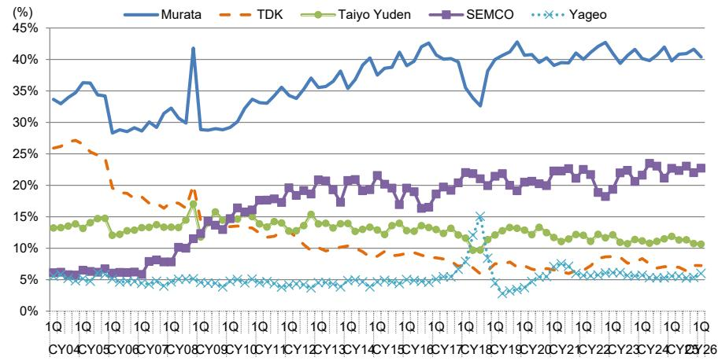

line

| Year | Murata | TDK  | Taiyo Yuden | SEMCO | Yageo |
|------|--------|------|-------------|-------|-------|
| 1Q   | 33%    | 26%  | 13%         | 6%    | 5%    |
| 2Q   | 36%    | 25%  | 13%         | 6%    | 5%    |
| 3Q   | 34%    | 24%  | 13%         | 6%    | 5%    |
| 4Q   | 32%    | 23%  | 13%         | 6%    | 5%    |
| 1Q   | 30%    | 22%  | 13%         | 6%    | 5%    |
| 2Q   | 28%    | 21%  | 13%         | 6%    | 5%    |
| 3Q   | 29%    | 20%  | 13%         | 6%    | 5%    |
| 4Q   | 30%    | 19%  | 13%         | 6%    | 5%    |
| 1Q   | 31%    | 18%  | 13%         | 6%    | 5%    |
| 2Q   | 32%    | 17%  | 13%         | 6%    | 5%    |
| 3Q   | 33%    | 16%  | 13%         | 6%    | 5%    |
| 4Q   | 34%    | 15%  | 13%         | 6%    | 5%    |
| 1Q   | 35%    | 14%  | 13%         | 6%    | 5%    |
| 2Q   | 36%    | 13%  | 13%         | 6%    | 5%    |
| 3Q   | 37%    | 12%  | 13%         | 6%    | 5%    |
| 4Q   | 38%    | 11%  | 13%         | 6%    | 5%    |
| 1Q   | 39%    | 10%  | 13%         | 6%    | 5%    |
| 2Q   | 40%    | 9%   | 13%         | 6%    | 5%    |
| 3Q   | 41%    | 8%   | 13%         | 6%    | 5%    |
| 4Q   | 42%    | 7%   | 13%         | 6%    | 5%    |
| 1Q   | 43%    | 6%   | 13%         | 6%    | 5%    |
| 2Q   | 44%    | 5%   | 13%         | 6%    | 5%    |
| 3Q   | 45%    | 4%   | 13%         | 6%    | 5%    |
| 4Q   | 44%    | 3%   | 13%         | 6%    | 5%    |
| 1Q   | 43%    | 2%   | 13%         | 6%    | 5%    |
| 2Q   | 42%    | 1%   | 13%         | 6%    | 5%    |
| CY04 | -      | -    | -           | -     | -     |
| CY05 | -      | -    | -           | -     | -     |
| CY06 | -      | -    | -           | -     | -     |
| CY07 | -      | -    | -           | -     | -     |
| CY08 | -      | -    | -           | -     | -     |
| CY09 | -      | -    | -           | -     | -     |
| CY10 | -      | -    | -           | -     | -     |
| CY11 | -      | -    | -           | -     | -     |
| CY12 | -      | -    | -           | -     | -     |
| CY13 | -      | -    | -           | -     | -     |
| CY14 | -      | -    | -           | -     | -     |
| CY15 | -      | -    | -           | -     | -     |
| CY16 | -      | -    | -           | -     | -     |
| CY17 | -      | -    | -           | -     | -     |
| CY18*| -      | -    | -           | -     | -     |
| CY19*| -      | -    | -           | -     | -     |
| CY20*| -      | -    | -           | -     | -     |
| CY21*| -      | -    | -           | -     | -     |
| CY22*| -      | -    | -           | -     | -     |
| CY23*| -      | -    | -           | -     | -     |
| CY24*| -      | -    | -           | -     | -     |
| CY25*| -      | -    | -           | -     | -     |
| CY26*| -      | -    | -           | -     | -     |
CY04YCY04YCY05YCY06YCY07YCY08YCY09YCY10YCY11YCY12YCY13YCY14YCY15YCY16YCY17YCY18YCY19YCY20YCY21YCY22YCY23YCY24YCY25YCY26YCY27YCY28YCY29YCY30YCY31YCY32YCY33YCY34YCY35YCY36YCY37YCY38YCY39YCY40YCY41YCY42YCY43YCY44YCY45YCY46YCY47YCY48YCY49YCY50YCY51YCY52YCY53YCY54YCY55YCY56YCY57YCY58YCY59YCY60YCY61YCY62YCY63YCY64YCY65YCY66YCY67YCY68YCY69YCY70YCY71YCY72YCY73YCY74YCY75YCY76YCY77YCY78YCY79YCY80YCY81YCY82YCY83YCY84YCY85YCY86YCY87YCY88YCY89YCY90YCY91YCY92YCY93YCY94YCY95YCY96YCY97YCY98YCY99YCYA00YCYA01 YCYA02 YCYA03 YCYA04 YCYA05 YCYA06 YCYA07 YCYA08 YCYA09 YCYA10 YCYA11 YCYA12 YCYA13 YCYA14 YCYA15 YCYA16 YCYA17 YCYA18 YCYA19 YCYA20 YCYA21 YCYA22 YCYA23 YCYA24 YCYA25 YCYA26 YCYA27 YCYA28 YCYA29 YCYA30 YCYA31 YCYA32 YCYA33 YCYA34 YCYA35 YCYA36 YCYA37 YCYA38 YCYA39 YCYA40 YCYA41 YCYA42 YCYA43 YCYA44 YCYA45 YCYA46 YCYA47 YCYA48 YCYA49 YCYA50 YCYA51 YCYA52 YCYA53 YCYA54 YCYA55 YCYA56 YCYA57 YCYA58 YCYA59 YCYA60 YCYA61 YCYA62 YCYA63 YCYA64 YCYA65 YCYA66 YCYA67 YCYA68 YCYA69 YCYA70 YCYA71 YCYA72 YCYA73 YCYA74 YCYA75 YCYA76 YCYA77 YCYA78 YCYA79 YCYA80 YCYA81 YCYA82 YCYA83 YCYA84 YCYA85 YCYA86 YCYA87 YCYA88 YCYA89 YCYA90 YCYA91 YCYA92 YCYA93 YCYA94 YCYA95 YCYA96 YCYA97 YCYA98 YCYA99 YCYA A00 * (Note: Data is estimated based on visual scale) * (Note: Data is estimated based on visual scale) * (Note: Data is estimated based on visual scale) * (Note: Data is estimated based on visual scale) * (Note: Data is estimated based on visual scale) * (Note: Data is estimated based on visual scale) * (Note: Data is estimated based on visual scale) * (Note: Data is estimated based on visual scale) * (Note: Data is estimated based on visual scale) * (Note : data is estimated based on visual scale) * (Note: data is estimated based on visual scale) * (Note: data is estimated based on visual scale) * (Note: data is estimated based on visual scale) * (Note: data is estimated based on visual scale) * (Note: data is estimated based on visual scale) * (Note: data is estimated based on visual scale) * (Note: data is estimated based on visual scale) * (Note: data is estimated based on visual scale) * (Note: data is estimated by reference point) * (Note: data is estimated based on visual scale) * (Note: data is estimated based on visual scale) * (Note: data is estimated based on visual scale) * (Note: data is estimated based on visual scale) * (Note: data is estimated based on visual scale) * (Note: data is estimated based on visual scale) * (Note: data is estimated based on visual scale) * (Note: data is estimated based on visual scale) * (Not labeled) * (Note: data is estimated based on visual scale) * (Note: data is estimated based on visual scale) * (Note: data is estimated based on visual scale) * (Note: data is estimated based on visual scale) * (Note: data is estimated based on visual scale) * (Note: data is estimated based on visual scale) * (Note: data is estimated based on visual scale) * (Note: data is estimated based on visual scale) * (No label) * (Note: data is estimated based on visual scale) * (Note: data is estimated based on visual scale) * (Note: data is estimated based on visual scale) * (Note: data is estimated based on visual scale) * (Note: data is estimated based on visual scale) * (Note: data is estimated based on visual scale) * (Note: data is estimated based on visual scale) * (Note: data is estimated based on visual scale) * (NOTE: The chart contains only one of the values for each category at each time point). The chart type is a line chart with markers for each category. Legend indicates four distinct lines representing different series. The chart title and axis labels are in English. The legend also includes a legend for three series: TDK, SEMCO, and Yageo. The chart title and axis labels are in English. The legend uses color coding to differentiate series. The chart title and axis labels are in English. The chart title and axis labels are in English. The legend defines symbols for each series. The chart type and axis labels are in English. The chart type and axis labels are in English. The chart type and axis labels are in English. The chart type and axis labels are in English. The chart type and axis labels are in English. The chart type and axis labels are in English. The chart type and axis labels are in English. The chart type and axis labels are in English. The chart type and axis labels are in English. The chart type and axis labels are in English. The chart type and axis labels are in Spanish. The chart type and axis labels are in Spanish. The chart type and axis labels are in Spanish. The chart type and axis labels are in Spanish. The chart type and axis labels are in Spanish. The chart type and axis labels are in Spanish. The chart type and axis labels are in Spanish. The chart type and axis labels are in Spanish. The chart type and axis labels are in Spanish. The chart type and axis labels are in Spanish. The chart type and axis labels are in Spain. The chart type and axis labels are in Spanish. The chart type and axis labels are in Spanish. The chart type and axis labels are in Spanish. The chart type and axis labels are in Spanish. The chart type and axis labels are in Spanish. The chart type and axis labels are in Spanish. The chart type and axis labels are in Spanish. The chart type and axis labels are in Spanish. The chart type and axis labels are in Spanish. The chart type and axis labels are in Chinese. The chart type and axis labels are in Chinese. The chart type and axis labels are in Chinese. The chart type and axis labels are in Chinese. The chart type and axis labels are in Chinese. The chart type and axis labels are in Chinese. The chart type and axis labels are in Chinese. The chart type and axis labels are in Chinese. The chart type and axis labels are in Chinese. The chart type and axis labels are in Chinese. The chart type and axis labels are in Japanese. The chart type and axis labels are in Japanese. The chart type and axis labels are in Japanese. The chart type and axis labels are in Japanese. The chart type and axis labels are in Japanese. The chart type and axis labels are in Japanese. The chart type and axis labels are in Japanese. The chart type and axis labels are in Japanese. The chart type and axis labels are in Japanese. The chart type and axis labels are in Japanese. The chart type and axis labels are in Korean. The chart type and axis labels are in Korean. The chart type and axis labels are in Korean. The chart type and axis labels are in Korean. The chart type and axis labels are in Korean. The chart type and axis labels are in Korean. The chart type and axis labels are in Korean. The chart type and axis labels are in Korean. The chart type and axis labels are in Korean. The chart type and axis labels are in Korean. The chart type and axis labels are in Japanese. The chart type and axis labels are in Japanese. The chart type and axis labels are in Japanese. The chart type and axis labels are in Japanese. The chart type and axis labels are in Japanese. The chart type and axis labels are in Japanese. The chart type and axis labels are in Japanese. The chart type and axis labels are in Japanese. The chart type and axis labels are in Japanese. The chart type and axis labels are in Japan. The chart type and axis labels are in Japan. The chart type and axis labels are in Japan. The chart type and axis labels are in Japan. The chart type and axis labels are in Japan. The chart type and axis labels are in Japan. The chart type and axis labels are in Japan. The chart type and axis labels are in Japan. The chart type and axis labels are in Japan. The chart type and axis labels are in Japan.
The chart type and axis labels are in Japan
The chart type and axis labels are in Japan
The chart type and axis labels are in Japan
The chart type and axis labels are in Japan
The chart type and axis labels are in Japan
The chart type and axis labels are in Japan
The chart type and axis labels are in Japan
The chart type and axis labels are in Japan
The chart type and axis labels are in Japan
The chart type and axis labels are in Japan
The chart type and axis labels are in Japan

MLCC sales   
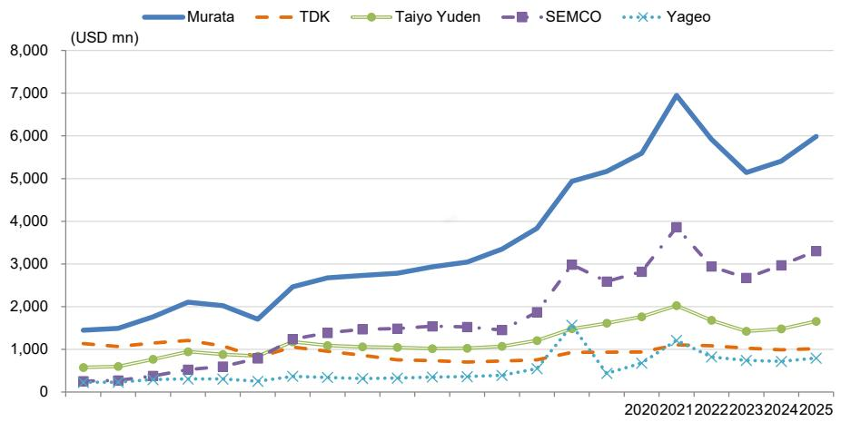

line

| Year | Murata | TDK | Taiyo Yuden | SEMCO | Yageo |
|------|--------|-----|-------------|-------|-------|
| 2019 | 1400   | 1100 | 600         | 300   | 200   |
| 2020 | 1500   | 1000 | 700         | 400   | 300   |
| 2021 | 7000   | 900  | 2000        | 4000  | 1500  |
| 2022 | 6000   | 950  | 1800        | 3500  | 800   |
| 2023 | 5500   | 950  | 1500        | 3000  | 700   |
| 2024 | 6000   | 950  | 1600        | 3300  | 750   |
| 2025 | 6100   | 950  | 1700        | 3400  | 800   |

Note: e = MS estimates   
Source: Company data, MS

# Capacitor Market: 016008 MLCCs are 75% Smaller than 0201 MLCCs

MLCC size comparison 

<table><tr><td></td><td>4532</td><td>3216</td><td>2012</td><td>1608</td><td>1005</td><td>0603</td><td>0402</td><td>0201</td><td>016008</td></tr><tr><td>Length</td><td>4.5mm</td><td>3.2mm</td><td>2.0mm</td><td>1.6mm</td><td>1.0mm</td><td>0.6mm</td><td>0.4mm</td><td>0.25mm</td><td>0.16mm</td></tr><tr><td>Width</td><td>3.2mm</td><td>1.6mm</td><td>1.25mm</td><td>0.8mm</td><td>0.5mm</td><td>0.3mm</td><td>0.2mm</td><td>0.125mm</td><td>0.08mm</td></tr><tr><td>Thickness</td><td>2.0mm</td><td>0.85mm</td><td>0.6mm</td><td>0.8mm</td><td>0.5mm</td><td>0.3mm</td><td>0.2mm</td><td>0.125mm</td><td>0.08mm</td></tr><tr><td>Volume</td><td> $28.8mm^3$ </td><td> $4.35mm^3$ </td><td> $1.5mm^3$ </td><td> $1.024mm^3$ </td><td> $0.25mm^3$ </td><td> $0.054mm^3$ </td><td> $0.016mm^3$ </td><td> $0.004mm^3$ </td><td> $0.001mm^3$ </td></tr><tr><td>Volume ratio</td><td>7,373</td><td>1,114</td><td>384</td><td>262</td><td>64.0</td><td>13.8</td><td>4.1</td><td>1.0</td><td>0.26</td></tr></table>

■ Number of MLCCs per vehicle 

<table><tr><td>(units: pcs)</td><td>GAS</td><td>HV</td><td>BEV</td><td>PHEV</td></tr><tr><td>Power Train</td><td>300-500</td><td>1,000-1,600</td><td>2,000-2,500</td><td>2,500-3,000</td></tr><tr><td>ADAS(Lv2-5)</td><td colspan="4">1,500-5,000</td></tr><tr><td>Safety</td><td colspan="4">300-1,000</td></tr><tr><td>Infotainment</td><td colspan="4">500-2,500</td></tr><tr><td>Other</td><td colspan="4">500-2,500</td></tr></table>

Source: Company data, MS

MLCC Sales, Market Share, OP 

<table><tr><td rowspan="2"></td><td colspan="4">CY23</td><td colspan="4">CY24</td><td colspan="4">CY25</td><td colspan="4">CY26</td><td rowspan="2">2009</td><td rowspan="2">2010</td><td rowspan="2">2011</td><td rowspan="2">2012</td><td rowspan="2">2013</td><td rowspan="2">2014</td><td rowspan="2">2015</td><td rowspan="2">2016</td><td rowspan="2">2017</td><td rowspan="2">2018</td><td rowspan="2">2019</td><td rowspan="2">2020</td><td rowspan="2">2021</td><td rowspan="2">2022</td><td rowspan="2">2023</td><td rowspan="2">2024</td><td rowspan="2">2025</td></tr><tr><td>1Q</td><td>2Q</td><td>3Q</td><td>4Q</td><td>1Q</td><td>2Q</td><td>3Q</td><td>4Q</td><td>1Q</td><td>2Q</td><td>3Q</td><td>4Q</td><td>1Q</td><td></td><td></td><td></td></tr><tr><td>Total (USD mn)</td><td>2,940</td><td>3,131</td><td>3,354</td><td>3,221</td><td>3,171</td><td>3,276</td><td>3,518</td><td>3,334</td><td>3,321</td><td>3,682</td><td>3,937</td><td>3,731</td><td>3,825</td><td>5,917</td><td>7,868</td><td>7,885</td><td>7,769</td><td>7,626</td><td>7,731</td><td>7,802</td><td>8,167</td><td>9,564</td><td>14,129</td><td>12,562</td><td>13,861</td><td>17,311</td><td>14,316</td><td>12,645</td><td>13,299</td><td>14,672</td><td></td><td></td><td></td></tr><tr><td>Major 5</td><td>2,567</td><td>2,724</td><td>2,918</td><td>2,802</td><td>2,759</td><td>2,850</td><td>3,061</td><td>2,900</td><td>2,889</td><td>3,203</td><td>3,426</td><td>3,246</td><td>3,328</td><td>4,411</td><td>6,308</td><td>6,462</td><td>6,444</td><td>6,405</td><td>6,586</td><td>6,660</td><td>7,000</td><td>8,215</td><td>11,903</td><td>10,744</td><td>11,798</td><td>15,013</td><td>12,467</td><td>11,010</td><td>11,571</td><td>12,764</td><td></td><td></td><td></td></tr><tr><td>Murata</td><td>1,205</td><td>1,233</td><td>1,362</td><td>1,340</td><td>1,273</td><td>1,305</td><td>1,432</td><td>1,399</td><td>1,320</td><td>1,504</td><td>1,611</td><td>1,553</td><td>1,545</td><td>1,708</td><td>2,467</td><td>2,677</td><td>2,730</td><td>2,784</td><td>2,933</td><td>3,043</td><td>3,349</td><td>3,834</td><td>4,934</td><td>5,168</td><td>5,591</td><td>6,945</td><td>5,921</td><td>5,140</td><td>5,409</td><td>5,988</td><td></td><td></td><td></td></tr><tr><td>TDK</td><td>256</td><td>268</td><td>256</td><td>251</td><td>265</td><td>247</td><td>241</td><td>236</td><td>234</td><td>256</td><td>253</td><td>271</td><td>277</td><td>816</td><td>1,053</td><td>957</td><td>864</td><td>757</td><td>738</td><td>701</td><td>730</td><td>753</td><td>931</td><td>934</td><td>939</td><td>1,105</td><td>1,095</td><td>1,031</td><td>988</td><td>1,015</td><td></td><td></td><td></td></tr><tr><td>Taiyo Yuden</td><td>357</td><td>343</td><td>359</td><td>367</td><td>354</td><td>354</td><td>390</td><td>383</td><td>395</td><td>416</td><td>447</td><td>401</td><td>408</td><td>843</td><td>1,177</td><td>1,093</td><td>1,061</td><td>1,047</td><td>1,020</td><td>1,028</td><td>1,073</td><td>1,209</td><td>1,484</td><td>1,613</td><td>1,767</td><td>2,026</td><td>1,683</td><td>1,425</td><td>1,481</td><td>1,659</td><td></td><td></td><td></td></tr><tr><td>SEMCO</td><td>569</td><td>689</td><td>750</td><td>664</td><td>685</td><td>770</td><td>811</td><td>705</td><td>754</td><td>823</td><td>907</td><td>821</td><td>869</td><td>791</td><td>1,241</td><td>1,389</td><td>1,471</td><td>1,488</td><td>1,542</td><td>1,525</td><td>1,455</td><td>1,871</td><td>2,987</td><td>2,590</td><td>2,820</td><td>3,860</td><td>2,943</td><td>2,672</td><td>2,972</td><td>3,305</td><td></td><td></td><td></td></tr><tr><td>Yageo</td><td>180</td><td>191</td><td>190</td><td>180</td><td>181</td><td>175</td><td>187</td><td>177</td><td>185</td><td>204</td><td>207</td><td>200</td><td>229</td><td>254</td><td>370</td><td>345</td><td>318</td><td>329</td><td>353</td><td>363</td><td>393</td><td>549</td><td>1,567</td><td>439</td><td>681</td><td>1,077</td><td>825</td><td>742</td><td>720</td><td>797</td><td></td><td></td><td></td></tr><tr><td>Other</td><td>373</td><td>407</td><td>436</td><td>419</td><td>412</td><td>426</td><td>457</td><td>433</td><td>432</td><td>479</td><td>512</td><td>485</td><td>497</td><td>1,505</td><td>1,548</td><td>1,423</td><td>1,326</td><td>1,222</td><td>1,145</td><td>1,142</td><td>1,162</td><td>1,438</td><td>2,400</td><td>1,815</td><td>2,063</td><td>2,298</td><td>1,848</td><td>1,635</td><td>1,729</td><td>1,907</td><td></td><td></td><td></td></tr><tr><td>Market Share</td><td></td><td></td><td></td><td></td><td></td><td></td><td></td><td></td><td></td><td></td><td></td><td></td><td></td><td></td><td></td><td></td><td></td><td></td><td></td><td></td><td></td><td></td><td></td><td></td><td></td><td></td><td></td><td></td><td></td><td></td><td></td><td></td><td></td></tr><tr><td>Major 5</td><td>87.3%</td><td>87.0%</td><td>87.0%</td><td>87.0%</td><td>87.0%</td><td>87.0%</td><td>87.0%</td><td>87.0%</td><td>87.0%</td><td>87.0%</td><td>87.0%</td><td>87.0%</td><td>87.0%</td><td>74.6%</td><td>80.2%</td><td>81.9%</td><td>82.9%</td><td>84.0%</td><td>85.2%</td><td>85.4%</td><td>85.7%</td><td>85.9%</td><td>84.2%</td><td>85.5%</td><td>85.1%</td><td>86.7%</td><td>87.1%</td><td>87.1%</td><td>87.0%</td><td>87.0%</td><td></td><td></td><td></td></tr><tr><td>Murata</td><td>41.0%</td><td>39.4%</td><td>40.6%</td><td>41.7%</td><td>40.2%</td><td>39.8%</td><td>40.7%</td><td>42.0%</td><td>39.8%</td><td>40.8%</td><td>40.9%</td><td>41.6%</td><td>40.4%</td><td>28.9%</td><td>31.4%</td><td>33.9%</td><td>35.1%</td><td>36.5%</td><td>37.9%</td><td>39.0%</td><td>41.0%</td><td>40.1%</td><td>34.9%</td><td>41.1%</td><td>40.3%</td><td>40.1%</td><td>41.4%</td><td>40.6%</td><td>40.7%</td><td>40.8%</td><td></td><td></td><td></td></tr><tr><td>TDK</td><td>8.7%</td><td>8.6%</td><td>7.6%</td><td>7.8%</td><td>8.4%</td><td>7.5%</td><td>6.8%</td><td>7.1%</td><td>7.1%</td><td>7.0%</td><td>6.4%</td><td>7.3%</td><td>7.2%</td><td>13.8%</td><td>13.4%</td><td>12.1%</td><td>11.1%</td><td>9.9%</td><td>9.5%</td><td>9.0%</td><td>8.9%</td><td>7.9%</td><td>6.6%</td><td>7.4%</td><td>6.8%</td><td>6.4%</td><td>7.6%</td><td>8.1%</td><td>7.4%</td><td>6.9%</td><td></td><td></td><td></td></tr><tr><td>Taiyo Yuden</td><td>12.1%</td><td>10.9%</td><td>10.7%</td><td>11.4%</td><td>11.2%</td><td>10.8%</td><td>11.1%</td><td>11.5%</td><td>11.9%</td><td>11.3%</td><td>11.4%</td><td>10.7%</td><td>10.7%</td><td>14.2%</td><td>15.0%</td><td>13.9%</td><td>13.7%</td><td>13.7%</td><td>13.2%</td><td>13.2%</td><td>13.1%</td><td>12.6%</td><td>10.5%</td><td>12.8%</td><td>12.7%</td><td>11.7%</td><td>11.8%</td><td>11.3%</td><td>11.1%</td><td>11.3%</td><td></td><td></td><td></td></tr><tr><td>SEMCO</td><td>19.4%</td><td>22.0%</td><td>22.4%</td><td>20.7%</td><td>21.6%</td><td>23.5%</td><td>23.1%</td><td>21.2%</td><td>22.7%</td><td>22.3%</td><td>23.0%</td><td>22.0%</td><td>22.7%</td><td>13.4%</td><td>15.8%</td><td>17.6%</td><td>18.9%</td><td>19.5%</td><td>19.9%</td><td>19.5%</td><td>17.8%</td><td>19.6%</td><td>21.1%</td><td>20.6%</td><td>20.3%</td><td>22.3%</td><td>20.6%</td><td>21.1%</td><td>22.3%</td><td>22.5%</td><td></td><td></td><td></td></tr><tr><td>Yageo</td><td>6.1%</td><td>6.1%</td><td>5.7%</td><td>5.3%</td><td>5.7%</td><td>5.3%</td><td>5.3%</td><td>5.3%</td><td>5.6%</td><td>5.5%</td><td>5.3%</td><td>5.4%</td><td>6.0%</td><td>4.3%</td><td>4.7%</td><td>4.4%</td><td>4.1%</td><td>4.3%</td><td>4.6%</td><td>4.7%</td><td>4.8%</td><td>5.7%</td><td>11.1%</td><td>3.5%</td><td>4.9%</td><td>6.2%</td><td>5.8%</td><td>5.9%</td><td>5.4%</td><td>5.4%</td><td></td><td></td><td></td></tr><tr><td>Other</td><td>12.7%</td><td>13.0%</td><td>13.0%</td><td>13.0%</td><td>13.0%</td><td>13.0%</td><td>13.0%</td><td>13.0%</td><td>13.0%</td><td>13.0%</td><td>13.0%</td><td>13.0%</td><td>13.0%</td><td>25.4%</td><td>19.7%</td><td>18.1%</td><td>17.1%</td><td>16.0%</td><td>14.8%</td><td>14.6%</td><td>14.2%</td><td>15.0%</td><td>17.0%</td><td>14.4%</td><td>14.9%</td><td>13.3%</td><td>12.9%</td><td>12.9%</td><td>13.0%</td><td>13.0%</td><td></td><td></td><td></td></tr><tr><td>Market Share in Major 5</td><td></td><td></td><td></td><td></td><td></td><td></td><td></td><td></td><td></td><td></td><td></td><td></td><td></td><td></td><td></td><td></td><td></td><td></td><td></td><td></td><td></td><td></td><td></td><td></td><td></td><td></td><td></td><td></td><td></td><td></td><td></td><td></td><td></td></tr><tr><td>Murata</td><td>47.0%</td><td>45.3%</td><td>46.7%</td><td>47.8%</td><td>46.2%</td><td>45.8%</td><td>46.8%</td><td>48.2%</td><td>45.7%</td><td>46.9%</td><td>47.0%</td><td>47.8%</td><td>46.4%</td><td>38.7%</td><td>39.1%</td><td>41.4%</td><td>42.4%</td><td>43.5%</td><td>44.5%</td><td>45.7%</td><td>47.8%</td><td>46.7%</td><td>41.5%</td><td>48.1%</td><td>47.4%</td><td>46.3%</td><td>47.5%</td><td>46.7%</td><td>46.8%</td><td>46.9%</td><td></td><td></td><td></td></tr><tr><td>TDK</td><td>10.0%</td><td>9.9%</td><td>8.8%</td><td>9.0%</td><td>9.6%</td><td>8.7%</td><td>7.9%</td><td>8.1%</td><td>8.1%</td><td>8.0%</td><td>7.4%</td><td>8.4%</td><td>8.3%</td><td>18.5%</td><td>16.7%</td><td>14.8%</td><td>13.4%</td><td>11.8%</td><td>11.2%</td><td>10.5%</td><td>10.4%</td><td>9.2%</td><td>7.8%</td><td>8.7%</td><td>8.0%</td><td>7.4%</td><td>8.8%</td><td>9.4%</td><td>8.5%</td><td>7.9%</td><td></td><td></td><td></td></tr><tr><td>Taiyo Yuden</td><td>13.9%</td><td>12.6%</td><td>12.3%</td><td>13.1%</td><td>12.8%</td><td>12.4%</td><td>12.7%</td><td>13.2%</td><td>13.7%</td><td>13.0%</td><td>13.1%</td><td>12.3%</td><td>12.3%</td><td>19.1%</td><td>18.7%</td><td>16.9%</td><td>16.5%</td><td>16.4%</td><td>15.5%</td><td>15.4%</td><td>15.3%</td><td>14.7%</td><td>12.5%</td><td>15.0%</td><td>15.0%</td><td>13.5%</td><td>13.5%</td><td>12.9%</td><td>12.8%</td><td>13.0%</td><td></td><td></td><td></td></tr><tr><td>SEMCO</td><td>22.2%</td><td>25.3%</td><td>25.7%</td><td>23.7%</td><td>24.8%</td><td>27.0%</td><td>26.5%</td><td>24.3%</td><td>26.1%</td><td>25.7%</td><td>26.5%</td><td>25.3%</td><td>26.1%</td><td>17.9%</td><td>19.7%</td><td>21.5%</td><td>22.8%</td><td>23.2%</td><td>23.4%</td><td>22.9%</td><td>20.8%</td><td>22.8%</td><td>25.1%</td><td>24.1%</td><td>23.9%</td><td>25.7%</td><td>23.6%</td><td>24.3%</td><td>25.7%</td><td>25.9%</td><td></td><td></td><td></td></tr><tr><td>Yageo</td><td>7.0%</td><td>7.0%</td><td>6.5%</td><td>6.4%</td><td>6.6%</td><td>6.1%</td><td>6.1%</td><td>6.1%</td><td>6.4%</td><td>6.4%</td><td>6.1%</td><td>6.2%</td><td>6.9%</td><td>5.7%</td><td>5.9%</td><td>5.3%</td><td>4.9%</td><td>5.1%</td><td>5.4%</td><td>5.5%</td><td>5.6%</td><td>6.7%</td><td>13.2%</td><td>4.1%</td><td>5.8%</td><td>7.2%</td><td>6.6%</td><td>6.7%</td><td>6.2%</td><td>6.2%</td><td></td><td></td><td></td></tr><tr><td>YoY Growth</td><td>-29.4%</td><td>-17.1%</td><td>0.3%</td><td>6.2%</td><td>7.9%</td><td>4.7%</td><td>4.9%</td><td>3.5%</td><td>4.7%</td><td>12.4%</td><td>11.9%</td><td>11.9%</td><td>15.2%</td><td></td><td></td><td></td><td></td><td></td><td></td><td></td><td></td><td></td><td></td><td></td><td></td><td></td><td></td><td></td><td></td><td></td><td></td><td></td><td></td></tr><tr><td>Major 5</td><td>-28.9%</td><td>-17.2%</td><td>-0.1%</td><td>5.9%</td><td>7.5%</td><td>4.7%</td><td>4.9%</td><td>3.5%</td><td>4.7%</td><td>12.4%</td><td>11.9%</td><td>11.9%</td><td>15.2%</td><td></td><td></td><td></td><td></td><td></td><td></td><td></td><td></td><td></td><td></td><td></td><td></td><td></td><td></td><td></td><td></td><td></td><td></td><td></td><td></td></tr><tr><td>Murata</td><td>-27.6%</td><td>-20.8%</td><td>-3.0%</td><td>3.6%</td><td>5.6%</td><td>5.9%</td><td>5.1%</td><td>4.4%</td><td>3.7%</td><td>15.2%</td><td>12.5%</td><td>11.0%</td><td>17.0%</td><td></td><td></td><td></td><td></td><td></td><td></td><td></td><td></td><td></td><td></td><td></td><td></td><td></td><td></td><td></td><td></td><td></td><td></td><td></td><td></td></tr><tr><td>TDK</td><td>-5.6%</td><td>-3.1%</td><td>-9.9%</td><td>-4.9%</td><td>3.7%</td><td>-8.1%</td><td>-5.8%</td><td>-6.0%</td><td>-11.5%</td><td>4.0%</td><td>4.9%</td><td>14.9%</td><td>18.1%</td><td></td><td></td><td></td><td></td><td></td><td></td><td></td><td></td><td></td><td></td><td></td><td></td><td></td><td></td><td></td><td></td><td></td><td></td><td></td><td></td></tr><tr><td>Taiyo Yuden</td><td>-28.9%</td><td>-18.5%</td><td>-11.9%</td><td>3.8%</td><td>-0.7%</td><td>3.3%</td><td>8.6%</td><td>4.5%</td><td>11.6%</td><td>17.6%</td><td>14.6%</td><td>4.6%</td><td>3.2%</td><td></td><td></td><td></td><td></td><td></td><td></td><td></td><td></td><td></td><td></td><td></td><td></td><td></td><td></td><td></td><td></td><td></td><td></td><td></td><td></td></tr><tr><td>SEMCO</td><td>-39.3%</td><td>-16.3%</td><td>19.0%</td><td>20.3%</td><td>20.4%</td><td>11.9%</td><td>8.1%</td><td>6.2%</td><td>10.0%</td><td>6.8%</td><td>11.9%</td><td>16.4%</td><td>15.3%</td><td></td><td></td><td></td><td></td><td></td><td></td><td></td><td></td><td></td><td></td><td></td><td></td><td></td><td></td><td></td><td></td><td></td><td></td><td></td><td></td></tr><tr><td>Yageo</td><td>-23.9%</td><td>-9.9%</td><td>-1.2%</td><td>-1.9%</td><td>0.7%</td><td>-8.7%</td><td>-1.8%</td><td>-1.8%</td><td>2.2%</td><td>16.7%</td><td>11.2%</td><td>13.1%</td><td>23.7%</td><td></td><td></td><td></td><td></td><td></td><td></td><td></td><td></td><td></td><td></td><td></td><td></td><td></td><td></td><td></td><td></td><td></td><td></td><td></td><td></td></tr><tr><td>Other</td><td>-32.0%</td><td>-16.8%</td><td>2.7%</td><td>8.7%</td><td>10.4%</td><td>4.7%</td><td>4.9%</td><td>3.5%</td><td>4.7%</td><td>12.4%</td><td>11.9%</td><td>11.9%</td><td>15.2%</td><td></td><td></td><td></td><td></td><td></td><td></td><td></td><td></td><td></td><td></td><td></td><td></td><td></td><td></td><td></td><td></td><td></td><td></td><td></td><td></td></tr><tr><td>QoQ Growth</td><td>-3.0%</td><td>6.5%</td><td>7.1%</td><td>-4.0%</td><td>-1.5%</td><td>3.3%</td><td>7.4%</td><td>-5.2%</td><td>-0.4%</td><td>10.9%</td><td>6.9%</td><td>-5.2%</td><td>2.5%</td><td></td><td></td><td></td><td></td><td></td><td></td><td></td><td></td><td></td><td></td><td></td><td></td><td></td><td></td><td></td><td></td><td></td><td></td><td></td><td></td></tr><tr><td>Major 5</td><td>-3.0%</td><td>6.1%</td><td>7.1%</td><td>-4.0%</td><td>-1.5%</td><td>3.3%</td><td>7.4%</td><td>-5.2%</td><td>-0.4%</td><td>10.9%</td><td>6.9%</td><td>-5.2%</td><td>2.5%</td><td></td><td></td><td></td><td></td><td></td><td></td><td></td><td></td><td></td><td></td><td></td><td></td><td></td><td></td><td></td><td></td><td></td><td></td><td></td><td></td></tr><tr><td>Murata</td><td>-6.8%</td><td>2.3%</td><td>10.5%</td><td>-1.7%</td><td>-5.0%</td><td>2.5%</td><td>9.8%</td><td>-2.3%</td><td>-5.6%</td><td>13.9%</td><td>7.2%</td><td>-3.6%</td><td>-0.5%</td><td></td><td></td><td></td><td></td><td></td><td></td><td></td><td></td><td></td><td></td><td></td><td></td><td></td><td></td><td></td><td></td><td></td><td></td><td></td><td></td></tr><tr><td>TDK</td><td>-3.2%</td><td>5.0%</td><td>-4.7%</td><td>-1.7%</td><td>5.5%</td><td>-6.9%</td><td>-2.4%</td><td>-1.9%</td><td>-0.7%</td><td>9.4%</td><td>-1.5%</td><td>7.4%</td><td>2.1%</td><td></td><td></td><td></td><td></td><td></td><td></td><td></td><td></td><td></td><td></td><td></td><td></td><td></td><td></td><td></td><td></td><td></td><td></td><td></td><td></td></tr><tr><td>Taiyo Yuden</td><td>1.1%</td><td>-3.9%</td><td>4.8%</td><td>2.0%</td><td>-3.4%</td><td>0.0%</td><td>10.1%</td><td>-1.8%</td><td>3.2%</td><td>5.4%</td><td>7.3%</td><td>-10.4%</td><td>1.8%</td><td></td><td></td><td></td><td></td><td></td><td></td><td></td><td></td><td></td><td></td><td></td><td></td><td></td><td></td><td></td><td></td><td></td><td></td><td></td><td></td></tr><tr><td>SEMCO</td><td>3.1%</td><td>21.0%</td><td>9.0%</td><td>-11.5%</td><td>3.2%</td><td>12.4%</td><td>5.3%</td><td>-13.0%</td><td>6.9%</td><td>9.2%</td><td>10.3%</td><td>-9.5%</td><td>5.8%</td><td></td><td></td><td></td><td></td><td></td><td></td><td></td><td></td><td></td><td></td><td></td><td></td><td></td><td></td><td></td><td></td><td></td><td></td><td></td><td></td></tr><tr><td>Yageo</td><td>-2.1%</td><td>6.3%</td><td>-0.8%</td><td>-5.1%</td><td>0.5%</td><td>-3.6%</td><td>6.7%</td><td>-5.0%</td><td>4.6%</td><td>10.0%</td><td>1.7%</td><td>-3.4%</td><td>14.4%</td><td></td><td></td><td></td><td></td><td></td><td></td><td></td><td></td><td></td><td></td><td></td><td></td><td></td><td></td><td></td><td></td><td></td><td></td><td></td><td></td></tr><tr><td>Other</td><td>-3.0%</td><td>9.0%</td><td>7.1%</td><td>-4.0%</td><td>-1.5%</td><td>3.3%</td><td>7.4%</td><td>-5.2%</td><td>-0.4%</td><td>10.9%</td><td>6.9%</td><td>-5.2%</td><td>2.5%</td><td></td><td></td><td></td><td></td><td></td><td></td><td></td><td></td><td></td><td></td><td></td><td></td><td></td><td></td><td></td><td></td><td></td><td></td><td></td><td></td></tr><tr><td>OP</td><td></td><td></td><td></td><td></td><td></td><td></td><td></td><td></td><td></td><td></td><td></td><td></td><td></td><td></td><td></td><td></td><td></td><td></td><td></td><td></td><td></td><td></td><td></td><td></td><td></td><td></td><td></td><td></td><td></td><td></td><td></td><td></td><td></td></tr><tr><td>Murata</td><td>35.8</td><td>42.8</td><td>52.0</td><td>50.8</td><td>47.4</td><td>63.7</td><td>64.8</td><td>58.8</td><td>47.9</td><td>61.2</td><td>73.0</td><td>66.4</td><td>70.1</td><td>-8.8</td><td>31.9</td><td>22.3</td><td>19.3</td><td>50.6</td><td>72.2</td><td>115.6</td><td>73.3</td><td>105.8</td><td>176.1</td><td>190.5</td><td>196.6</td><td>312.1</td><td>270.5</td><td>181.4</td><td>234.7</td><td>248.4</td><td></td><td></td><td></td></tr><tr><td>TDK</td><td>7.9</td><td>9.7</td><td>8.2</td><td>10.7</td><td>8.8</td><td>8.1</td><td>6.4</td><td>4.7</td><td>2.4</td><td>1.8</td><td>3.0</td><td>6.6</td><td>6.0</td><td>-20.3</td><td>-3.9</td><td>-9.4</td><td>-15.4</td><td>-0.2</td><td>3.4</td><td>5.9</td><td>3.3</td><td>7.4</td><td>19.0</td><td>20.4</td><td>16.1</td><td>27.6</td><td>43.3</td><td>36.5</td><td>27.9</td><td>13.8</td><td></td><td></td><td></td></tr><tr><td>Taiyo Yuden</td><td>-2.9</td><td>0.0</td><td>0.8</td><td>2.0</td><td>1.3</td><td>1.6</td><td>2.4</td><td>0.5</td><td>2.9</td><td>3.5</td><td>4.5</td><td>5.8</td><td>3.1</td><td>-0.2</td><td>14.7</td><td>-0.6</td><td>0.4</td><td>9.1</td><td>6.7</td><td>15.9</td><td>6.9</td><td>15.4</td><td>33.0</td><td>41.8</td><td>37.5</td><td>55.4</td><td>43.4</td><td>-0.1</td><td>5.8</td><td>16.7</td><td></td><td></td><td></td></tr><tr><td>SEMCO</td><td>7.5</td><td>12.3</td><td>10.8</td><td>7.9</td><td>8.9</td><td>14.5</td><td>17.0</td><td>14.0</td><td>11.5</td><td>14.3</td><td>18.1</td><td>15.2</td><td>22.6</td><td>12.2</td><td>19.1</td><td>12.3</td><td>8.6</td><td>11.1</td><td>8.1</td><td>20.5</td><td>11.9</td><td>26.1</td><td>46.1</td><td>44.5</td><td>48.7</td><td>96.4</td><td>58.9</td><td>38.5</td><td>54.4</td><td>59.0</td><td></td><td></td><td></td></tr><tr><td>- SEMCO (KRW bn)</td><td>72.6</td><td>117.8</td><td>98.6</td><td>70.2</td><td>80.1</td><td>127.9</td><td>154.2</td><td>128.0</td><td>109.5</td><td>138.3</td><td>169.7</td><td>142.5</td><td>211.0</td><td>160.2</td><td>252.5</td><td>168.8</td><td>146.9</td><td>126.3</td><td>78.0</td><td>190.4</td><td>126.7</td><td>261.2</td><td>459.7</td><td>470.3</td><td>536.0</td><td>1,005.3</td><td>585.8</td><td></td><td></td><td></td><td></td><td></td><td></td></tr></table>

Source: Company data, MS

# Supply Chains of MLCC and Aluminium Capacitors

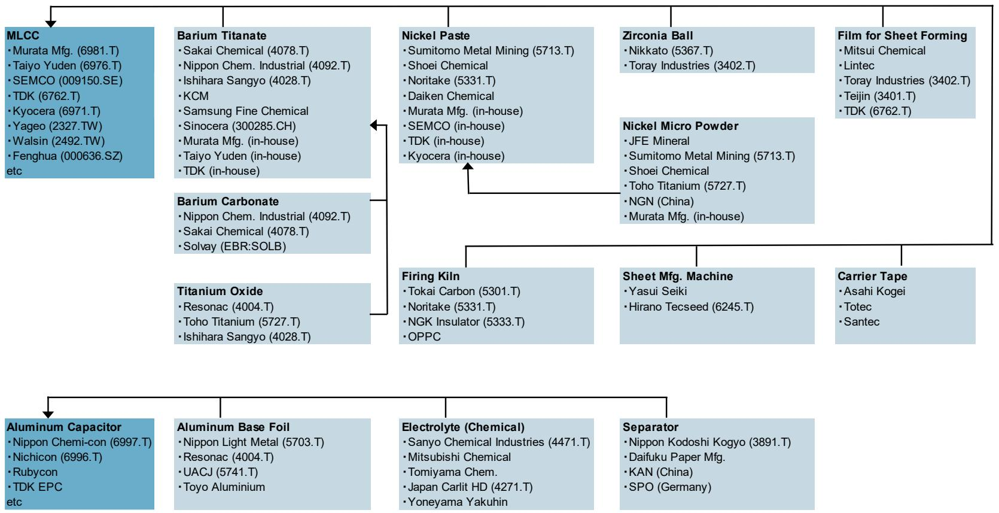

flowchart

```mermaid
graph TD
    A["MLCC"] --> B["Barium Titanate"]
    A --> C["Nickel Paste"]
    A --> D["Firing Kiln"]
    A --> E["Sheet Mfg. Machine"]
    A --> F["Carrier Tape"]
    
    B --> B1["Murata Mfg. (6981.T)"]
    B --> B2["Taiyo Yuden (6976.T)"]
    B --> B3["SEMCO (009150.SE)"]
    B --> B4["TDK (6762.T)"]
    B --> B5["Kyocera (6971.T)"]
    B --> B6["Yageo (2327.TW)"]
    B --> B7["Walsin (2492.TW)"]
    B --> B8["Fenghua (000636.SZ) etc"]
    
    C --> C1["Sakai Chemical (4078.T)"]
    C --> C2["Nippon Chem. Industrial (4092.T)"]
    C --> C3["Ishihara Sangyo (4028.T)"]
    C --> C4["KCM"]
    C --> C5["Samsung Fine Chemical"]
    C --> C6["Sinocera (300285.CH)"]
    C --> C7["Murata Mfg. (in-house)"]
    C --> C8["Taiyo Yuden (in-house)"]
    C --> C9["TDK (in-house)"]
    
    D --> D1["Zirconia Ball"]
    D --> D2["Nikkato (5367.T)"]
    D --> D3["Toray Industries (3402.T)"]
    
    E --> E1["Film for Sheet Forming"]
    E --> E2["Mitsui Chemical"]
    E --> E3["Lintec"]
    E --> E4["Toray Industries (3402.T)"]
    E --> E5["Teijin (3401.T)"]
    E --> E6["TDK (6762.T)"]
    
    F --> F1["Titanium Carbonate"]
    F --> F2["Nippon Chem. Industrial (4092.T)"]
    F --> F3["Sakai Chemical (4078.T)"]
    F --> F4["Solvay (EBR:SOLB)"]
    
    G["Aluminum Capacitor"] --> G1["Nippon Chemi-con (6997.T)"]
    G --> G2["Nichicon (6996.T)"]
    G --> G3["Rubycon"]
    G --> G4["TDK EPC etc"]
    
    H["Aluminum Base Foil"] --> H1["Nippon Light Metal (5703.T)"]
    H --> H2["Resonac (4004.T)"]
    H --> H3["UACJ (5741.T)"]
    H --> H4["Toyo Aluminium"]
    
    I["Electrolyte (Chemical)"] --> I1["Sanyo Chemical Industries (4471.T)"]
    I --> I2["Mitsubishi Chemical"]
    I --> I3["Tomiyama Chem."]
    I --> I4["Japan Carlit HD (4271.T)"]
    I --> I5["Yoneyama Yakuhin"]
    
    J["Separator"] --> J1["Nippon Kodoshi Kogyo (3891.T)"]
    J --> J2["Daifuku Paper Mfg."]
    J --> J3["KAN (China)"]
    J --> J4["SPO (Germany)"]
```

Source: Company data, MS

# Capex by Hyperscalers Has Increased Significantly

■ Total cash capex by 11 cloud suppliers and QoQ change   
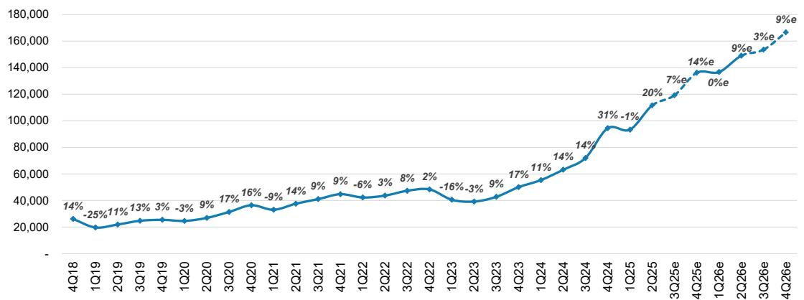

line

| Quarter | Value |
| :--- | :--- |
| 4Q18 | 14% |
| 1Q19 | -25% |
| 2Q19 | 11% |
| 3Q19 | 13% |
| 4Q19 | 3% |
| 1Q20 | -3% |
| 2Q20 | 9% |
| 3Q20 | 17% |
| 4Q20 | 16% |
| 1Q21 | -9% |
| 2Q21 | 14% |
| 3Q21 | 9% |
| 4Q21 | 9% |
| 1Q22 | -6% |
| 2Q22 | 3% |
| 3Q22 | 8% |
| 4Q22 | 2% |
| 1Q23 | -16% |
| 2Q23 | -3% |
| 3Q23 | 9% |
| 4Q23 | 17% |
| 1Q24 | 11% |
| 2Q24 | 14% |
| 3Q24 | 14% |
| 4Q24 | 31% |
| 1Q25 | -1% |
| 2Q25 | 20% |
| 3Q25e | 7% |
| 4Q25e | 14% |
| 1Q26e | 0% |
| 2Q26e | 9% |
| 3Q26e | 3% |
| 4Q26e | 9% |

■ Total cash capex by 11 cloud suppliers and YoY change

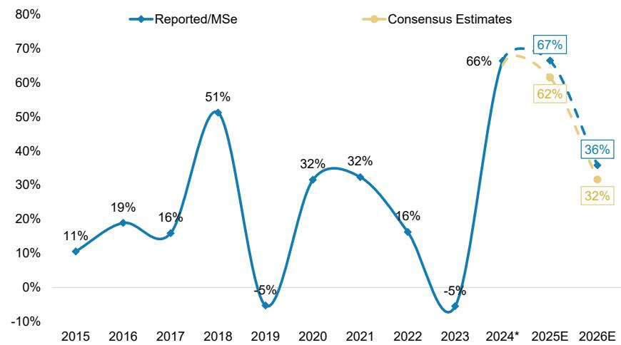

line

| Year   | Reported/MSe | Consensus Estimates |
| ------ | ------------ | ------------------- |
| 2015   | 11%          | -                   |
| 2016   | 19%          | -                   |
| 2017   | 16%          | -                   |
| 2018   | 51%          | -                   |
| 2019   | -5%          | -                   |
| 2020   | 32%          | -                   |
| 2021   | 32%          | -                   |
| 2022   | 16%          | -                   |
| 2023   | -5%          | -                   |
| 2024*  | 66%          | 67%                 |
| 2025E  | 62%          | 67%                 |
| 2026E  | 36%          | 32%                 |

Note: E = FactSet consensus, MS'26E and e = MS estimates  
Source: Company data, MS

■ Total cash capex by 11 cloud suppliers
700   
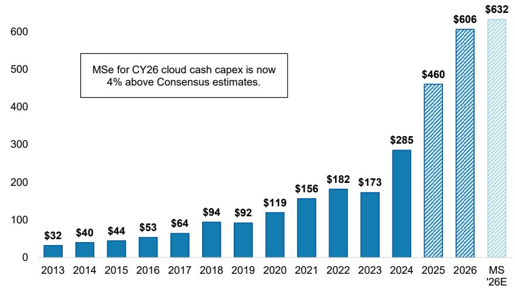

bar

| Year | MSe (US$) |
| :--- | :--- |
| 2013 | 32 |
| 2014 | 40 |
| 2015 | 44 |
| 2016 | 53 |
| 2017 | 64 |
| 2018 | 94 |
| 2019 | 92 |
| 2020 | 119 |
| 2021 | 156 |
| 2022 | 182 |
| 2023 | 173 |
| 2024 | 285 |
| 2025 | 460 |
| 2026 | 606 |
| MS '26E | 632 |
MSe for CY26 cloud cash capex is now 4% above Consensus estimates.

# We Expect Ibiden Will Maintain Nearly 100% Market Share in FC Packages for NVIDIA

■ ABF package substrate sales by customers\*   
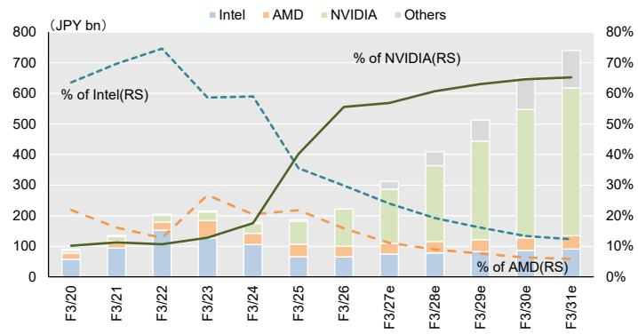

bar_line

| Period | Intel (JPY bn) | AMD (JPY bn) | NVIDIA (JPY bn) | Others (%) |
| :--- | :--- | :--- | :--- | :--- |
| F3/20 | 70 | 40 | 10 | 10 |
| F3/21 | 80 | 50 | 120 | 15 |
| F3/22 | 90 | 60 | 150 | 20 |
| F3/23 | 100 | 70 | 180 | 15 |
| F3/24 | 110 | 80 | 200 | 15 |
| F3/25 | 120 | 90 | 220 | 25 |
| F3/26 | 130 | 100 | 250 | 35 |
| F3/27e | 140 | 110 | 280 | 45 |
| F3/28e | 150 | 120 | 320 | 55 |
| F3/29e | 160 | 130 | 360 | 60 |
| F3/30e | 170 | 140 | 400 | 65 |
| F3/31e | 180 | 150 | 440 | 70 |

■ Size and # of layers for NVIDIA ABF packages

<table><tr><td></td><td>Package Size</td><td>Surface Area</td><td># of BU Layers</td><td>SAP Demand Size</td></tr><tr><td>Hopper</td><td>55 x 60mm</td><td>3,300</td><td>10</td><td>100</td></tr><tr><td>Blackwell</td><td>70 x 80mm</td><td>5,600</td><td>12</td><td>204</td></tr><tr><td>Rubin</td><td>80 x 100mm</td><td>8,000</td><td>16</td><td>388</td></tr></table>

■ OP by segment and total OP   
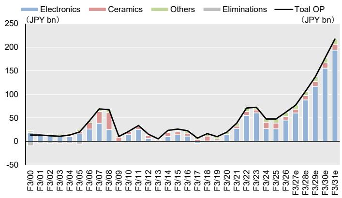

■ AI ecosystem capital flows   
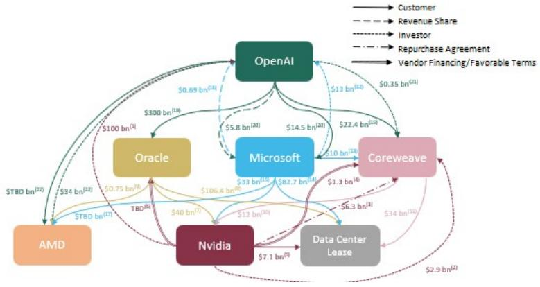

flowchart

```mermaid
graph TD
    A["OpenAI"] -->|Customer| B["Oracle"]
    A -->|Revenue Share| C["Microsoft"]
    A -->|Investor| D["Coreweave"]
    A -->|Repurchase Agreement| E["Data Center Lease"]
    A -->|Vendor Financing/Favorable Terms| F["Nvidia"]
    A -->|TBD bn^(1)| G["AMD"]
    A -->|TBD bn^(2)| H["Oracle"]
    A -->|TBD bn^(3)| I["Nvidia"]
    A -->|TBD bn^(4)| J["Coreweave"]
    A -->|TBD bn^(5)| K["Data Center Lease"]
    A -->|TBD bn^(6)| L["Oracle"]
    A -->|TBD bn^(7)| M["Nvidia"]
    A -->|TBD bn^(8)| N["Coreweave"]
    A -->|TBD bn^(9)| O["Data Center Lease"]
    A -->|TBD bn^(10)| P["Oracle"]
    A -->|TBD bn^(11)| Q["Nvidia"]
    A -->|TBD bn^(12)| R["Coreweave"]
    A -->|TBD bn^(13)| S["Data Center Lease"]
    A -->|TBD bn^(14)| T["Oracle"]
    A -->|TBD bn^(15)| U["Nvidia"]
    A -->|TBD bn^(16)| V["Coreweave"]
    A -->|TBD bn^(17)| W["Data Center Lease"]
    A -->|TBD bn^(18)| X["Oracle"]
    A -->|TBD bn^(19)| Y["Nvidia"]
    A -->|TBD bn^(20)| Z["Coreweave"]
    A -->|TBD bn^(21)| AA["Data Center Lease"]
    A -->|TBD bn^(22)| AB["Oracle"]
    A -->|TBD bn^(23)| AC["Nvidia"]
    A -->|TBD bn^(24)| AD["Coreweave"]
    A -->|TBD bn^(25)| AE["Data Center Lease"]
    A -->|TBD bn^(26)| AF["Oracle"]
    A -->|TBD bn^(27)| AG["Nvidia"]
    A -->|TBD bn^(28)| AH["Coreweave"]
    A -->|TBD bn^(29)| AI["Data Center Lease"]
    A -->|TBD bn^(30)| AJ["Oracle"]
    A -->|TBD bn^(31)| AK["Nvidia"]
    A -->|TBD bn^(32)| AL["Coreweave"]
    A -->|TBD bn^(33)| AM["Data Center Lease"]
    A -->|TBD bn^(34)| AN["Oracle"]
    A -->|TBD bn^(35)| AO["Nvidia"]
    A -->|TBD bn^(36)| AP["Coreweave"]
    A -->|TBD bn^(37)| AQ["Data Center Lease"]
    A -->|TBD bn^(38)| AR["Oracle"]
    A -->|TBD bn^(39)| AS["Nvidia"]
    A -->|TBD bn^(40)| AT["Coreweave"]
    A -->|TBD bn^(41)| AU["Data Center Lease"]
    A -->|TBD bn^(42)| AV["Oracle"]
    A -->|TBD bn^(43)| AW["Nvidia"]
    A -->|TBD bn^(44)| AX["Coreweave"]
    A -->|TBD bn^(45)| AY["Data Center Lease"]
    A -->|TBD bn^(46)| AZ["Oracle"]
    A -->|TBD bn^(47)| BA["Nvidia"]
    A -->|TBD bn^(48)| BB["Coreweave"]
    A -->|TBD bn^(49)| BC["Data Center Lease"]
    A -->|TBD bn^(50)| BD["Oracle"]
    A -->|TBD bn^(51)| BE["Nvidia"]
    A -->|TBD bn^(52)| BF["Coreweave"]
    A -->|TBD bn^(53)| BG["Data Center Lease"]
    A -->|TBD bn^(54)| BH["Oracle"]
    A -->|TBD bn^(55)| BI["Nvidia"]
    A -->|TBD bn^(56)| BJ["Coreweave"]
    A -->|TBD bn^(57)| BK["Data Center Lease"]
    A -->|TBD bn^(58)| BL["Oracle"]
    A -->|TBD bn^(59)| BM["Nvidia"]
    A -->|TBD bn^(60)| BN["Coreweave"]
    A -->|TBD bn^(61)| BO["Data Center Lease"]
    A -->|TBD bn^(62)| BP["Oracle"]
    A -->|TBD bn^(63)| BQ["Nvidia"]
    A -->|TBD bn^(64)| BR["Coreweave"]
    A -->|TBD bn^(65)| BS["Data Center Lease"]
    A -->|TBD bn^(66)| BT["Oracle"]
    A -->|TBD bn^(67)| BU["Nvidia"]
    A -->|TBD bn^(68)| BV["Coreweave"]
    A -->|TBD bn^(69)| BW["Data Center Lease"]
    A -->|TBD bn^(70)| BX["Oracle"]
    A -->|TBD bn^(71)| BY["Nvidia"]
```

Note: \*MS assumption based on company data, e = MS estimates  
Source: Company data, MS

# Ibiden: Medium-term Results and Forecasts

<table><tr><td>(bn JPY, %)</td><td>F3/07</td><td>F3/19</td><td>F3/20</td><td>F3/21</td><td>F3/22</td><td>F3/23</td><td>F3/24</td><td>F3/25</td><td>F3/26</td><td>F3/27 MSe</td><td>F3/28 MSe</td><td>F3/29 MSe</td><td>F3/30 MSe</td><td>F3/31 MSe</td><td>CAGR F3/25-F3/31e</td></tr><tr><td>Sales</td><td>398.6</td><td>291.1</td><td>296.0</td><td>323.5</td><td>401.1</td><td>417.5</td><td>370.5</td><td>369.4</td><td>416.2</td><td>499.7</td><td>602.5</td><td>711.4</td><td>854.5</td><td>950.8</td><td>17.1%</td></tr><tr><td>Electronics</td><td>205.0</td><td>116.0</td><td>132.2</td><td>166.1</td><td>237.0</td><td>250.7</td><td>190.7</td><td>197.2</td><td>243.3</td><td>322.1</td><td>419.1</td><td>522.4</td><td>659.7</td><td>749.9</td><td>24.9%</td></tr><tr><td>Ceramics</td><td>96.2</td><td>102.5</td><td>88.4</td><td>87.4</td><td>90.7</td><td>89.9</td><td>96.5</td><td>84.1</td><td>82.6</td><td>83.8</td><td>86.3</td><td>88.9</td><td>91.8</td><td>94.8</td><td>2.0%</td></tr><tr><td>Others</td><td>97.4</td><td>72.7</td><td>75.4</td><td>70.0</td><td>73.5</td><td>76.9</td><td>83.3</td><td>88.1</td><td>90.3</td><td>93.9</td><td>97.1</td><td>100.1</td><td>103.1</td><td>106.1</td><td>3.1%</td></tr><tr><td>OP</td><td>69.0</td><td>10.1</td><td>19.7</td><td>38.6</td><td>70.8</td><td>72.4</td><td>47.6</td><td>47.6</td><td>62.0</td><td>77.0</td><td>106.4</td><td>137.0</td><td>177.1</td><td>217.2</td><td>28.8%</td></tr><tr><td>Electronics</td><td>38.6</td><td>2.5</td><td>14.9</td><td>27.8</td><td>55.1</td><td>60.6</td><td>27.3</td><td>26.8</td><td>45.2</td><td>60.5</td><td>88.2</td><td>117.2</td><td>155.5</td><td>193.8</td><td>39.0%</td></tr><tr><td>Ceramics</td><td>24.9</td><td>3.0</td><td>-1.0</td><td>4.6</td><td>8.7</td><td>6.1</td><td>13.4</td><td>12.2</td><td>7.6</td><td>7.9</td><td>9.0</td><td>10.0</td><td>11.2</td><td>12.4</td><td>0.2%</td></tr><tr><td>Others</td><td>5.9</td><td>4.7</td><td>5.8</td><td>6.6</td><td>7.1</td><td>6.1</td><td>7.1</td><td>8.7</td><td>9.0</td><td>8.5</td><td>9.2</td><td>9.8</td><td>10.4</td><td>11.0</td><td>3.6%</td></tr><tr><td>Eliminations</td><td>-0.4</td><td>-0.0</td><td>-0.1</td><td>-0.4</td><td>-0.1</td><td>-0.6</td><td>-0.1</td><td>-0.2</td><td>0.2</td><td>0.0</td><td>0.0</td><td>0.0</td><td>0.0</td><td>0.0</td><td></td></tr><tr><td>OPM</td><td>17.3%</td><td>3.5%</td><td>6.7%</td><td>11.9%</td><td>17.7%</td><td>17.3%</td><td>12.8%</td><td>12.9%</td><td>14.9%</td><td>15.4%</td><td>17.7%</td><td>19.3%</td><td>20.7%</td><td>22.8%</td><td></td></tr><tr><td>ROE</td><td>19.0%</td><td>1.2%</td><td>4.2%</td><td>8.8%</td><td>12.1%</td><td>13.3%</td><td>6.9%</td><td>6.8%</td><td>12.2%</td><td>9.5%</td><td>12.3%</td><td>14.6%</td><td>16.5%</td><td>17.3%</td><td></td></tr><tr><td>CapEx</td><td>70.4</td><td>22.9</td><td>57.1</td><td>78.2</td><td>60.6</td><td>131.3</td><td>146.6</td><td>157.3</td><td>64.3</td><td>160.0</td><td>160.0</td><td>210.0</td><td>110.0</td><td>110.0</td><td></td></tr><tr><td>Electronics</td><td>54.1</td><td>14.2</td><td>48.7</td><td>70.4</td><td>54.6</td><td>121.5</td><td>136.9</td><td>146.8</td><td>45.2</td><td>150.0</td><td>150.0</td><td>200.0</td><td>100.0</td><td>100.0</td><td></td></tr><tr><td>Ceramics</td><td>9.3</td><td>5.4</td><td>6.1</td><td>3.1</td><td>3.0</td><td>3.1</td><td>5.2</td><td>7.1</td><td>7.6</td><td>5.0</td><td>5.0</td><td>5.0</td><td>5.0</td><td>5.0</td><td></td></tr><tr><td>Others</td><td>6.9</td><td>3.4</td><td>2.3</td><td>4.7</td><td>3.0</td><td>6.6</td><td>4.5</td><td>3.4</td><td>9.0</td><td>5.0</td><td>5.0</td><td>5.0</td><td>5.0</td><td>5.0</td><td></td></tr><tr><td>Depreciation</td><td>31.5</td><td>25.1</td><td>24.2</td><td>35.4</td><td>52.7</td><td>54.9</td><td>46.0</td><td>54.2</td><td>66.2</td><td>79.5</td><td>95.0</td><td>94.0</td><td>94.0</td><td>94.0</td><td></td></tr><tr><td>Electronics</td><td>16.6</td><td>13.8</td><td>12.3</td><td>25.5</td><td>43.1</td><td>45.4</td><td>36.7</td><td>44.2</td><td>55.8</td><td>71.0</td><td>86.0</td><td>85.0</td><td>85.0</td><td>85.0</td><td></td></tr><tr><td>Ceramics</td><td>12.5</td><td>9.6</td><td>8.4</td><td>6.8</td><td>6.1</td><td>5.6</td><td>5.0</td><td>5.6</td><td>6.0</td><td>4.5</td><td>5.0</td><td>5.0</td><td>5.0</td><td>5.0</td><td></td></tr><tr><td>Others</td><td>2.4</td><td>3.0</td><td>3.5</td><td>3.1</td><td>3.5</td><td>3.9</td><td>4.3</td><td>4.4</td><td>4.4</td><td>4.0</td><td>4.0</td><td>4.0</td><td>4.0</td><td>4.0</td><td></td></tr></table>

Note: MSe = MS estimates

Source: Company data, MS

# Connector Market

■ Global connector market value   
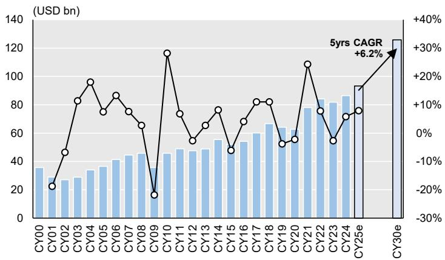

bar_line

| Year | Value (USD bn) | CAGR (%) |
| :--- | :--- | :--- |
| CY00 | 36 | -12.7 |
| CY01 | 26 | -18.4 |
| CY02 | 28 | -11.9 |
| CY03 | 30 | -10.4 |
| CY04 | 34 | -6.8 |
| CY05 | 38 | -11.4 |
| CY06 | 42 | -10.4 |
| CY07 | 45 | -6.8 |
| CY08 | 46 | -11.4 |
| CY09 | 18 | -23.6 |
| CY10 | 46 | -11.4 |
| CY11 | 50 | -7.6 |
| CY12 | 49 | -10.4 |
| CY13 | 50 | -6.8 |
| CY14 | 56 | -10.4 |
| CY15 | 49 | -13.6 |
| CY16 | 54 | -6.8 |
| CY17 | 60 | -10.4 |
| CY18 | 67 | -7.6 |
| CY19 | 64 | -10.4 |
| CY20 | 57 | -6.8 |
| CY21 | 78 | -12.7 |
| CY22 | 85 | -7.6 |
| CY23 | 82 | -5.6 |
| CY24 | 87 | -10.4 |
| CY25e | 93 | -6.2 |
| CY30e | 127 | +6.2 |

■ Global connector market value CAGR by applications

<table><tr><td></td><td>CY04-09</td><td>CY09-14</td><td>CY14-19</td><td>CY19-24</td><td>CY24-30e</td></tr><tr><td>Computers &amp; Peripherals</td><td>3.0%</td><td>5.9%</td><td>-0.3%</td><td>5.7%</td><td>6.9%</td></tr><tr><td>Business / Office Equipment</td><td>4.1%</td><td>5.1%</td><td>-0.7%</td><td>3.1%</td><td>3.5%</td></tr><tr><td>Medical Equipment</td><td>8.2%</td><td>6.4%</td><td>2.6%</td><td>6.5%</td><td>4.4%</td></tr><tr><td>Industrial</td><td>-0.6%</td><td>9.0%</td><td>4.6%</td><td>7.0%</td><td>6.1%</td></tr><tr><td>Automotive</td><td>-5.7%</td><td>12.0%</td><td>4.6%</td><td>4.7%</td><td>6.4%</td></tr><tr><td>Transportation (non-auto)</td><td>1.4%</td><td>9.4%</td><td>7.4%</td><td>6.1%</td><td>5.4%</td></tr><tr><td>Military / Aerospace</td><td>4.4%</td><td>2.1%</td><td>3.4%</td><td>6.9%</td><td>5.9%</td></tr><tr><td>Telecom / Datacom</td><td>5.1%</td><td>10.2%</td><td>5.8%</td><td>7.9%</td><td>8.0%</td></tr><tr><td>Consumer</td><td>3.6%</td><td>6.4%</td><td>3.0%</td><td>4.6%</td><td>5.1%</td></tr><tr><td>Others</td><td>2.3%</td><td>15.5%</td><td>-6.9%</td><td>5.3%</td><td>4.3%</td></tr><tr><td>Market total</td><td>1.0%</td><td>9.2%</td><td>3.0%</td><td>6.1%</td><td>6.5%</td></tr></table>

■ Global connector market value by applications   
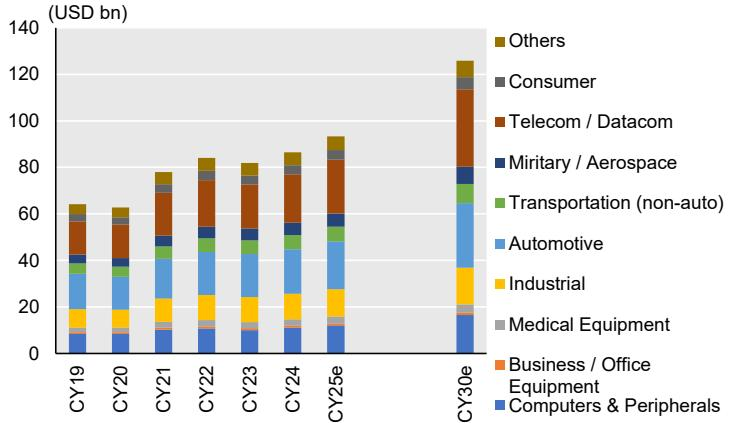  
■ Global connector sales by major suppliers

<table><tr><td rowspan="2" colspan="2">(USD bn)</td><td colspan="2">CY13</td><td rowspan="2" colspan="2">(USD bn)</td><td colspan="2">CY23</td></tr><tr><td>Sales</td><td>Share</td><td>Sales</td><td>Share</td></tr><tr><td>1</td><td>TE Connectivity</td><td>8.7</td><td>17.8%</td><td>1</td><td>TE Connectivity</td><td>12.7</td><td>15.6%</td></tr><tr><td>2</td><td>Amphenol</td><td>4.3</td><td>8.8%</td><td>2</td><td>Amphenol</td><td>7.0</td><td>8.5%</td></tr><tr><td>3</td><td>Molex</td><td>3.6</td><td>7.4%</td><td>3</td><td>Aptiv(Delphi)</td><td>4.7</td><td>5.8%</td></tr><tr><td>4</td><td>Aptiv(Delphi)</td><td>3.0</td><td>6.0%</td><td>4</td><td>Molex</td><td>4.6</td><td>5.7%</td></tr><tr><td>5</td><td>Foxconn</td><td>2.7</td><td>5.5%</td><td>5</td><td>Foxconn</td><td>2.5</td><td>3.1%</td></tr><tr><td>6</td><td>Yazaki</td><td>2.4</td><td>4.9%</td><td>6</td><td>Luxshare Precision</td><td>2.3</td><td>2.9%</td></tr><tr><td>7</td><td>JST</td><td>1.5</td><td>3.1%</td><td>7</td><td>Yazaki</td><td>2.2</td><td>2.7%</td></tr><tr><td>8</td><td>JAE</td><td>1.3</td><td>2.7%</td><td>8</td><td>JAE</td><td>1.7</td><td>2.1%</td></tr><tr><td>9</td><td>Sumitomo Wiring Systems</td><td>1.0</td><td>2.1%</td><td>9</td><td>Rosenberger</td><td>1.4</td><td>1.7%</td></tr><tr><td>10</td><td>Hirose Electric</td><td>1.0</td><td>2.0%</td><td>10</td><td>Hirose Electric</td><td>1.1</td><td>1.4%</td></tr><tr><td colspan="2">Top 10</td><td>29.5</td><td>60.4%</td><td colspan="2">Top 10</td><td>40.3</td><td>49.3%</td></tr><tr><td colspan="2">Total</td><td>48.9</td><td>100.0%</td><td colspan="2">Total</td><td>81.9</td><td>100.0%</td></tr></table>

# Connector Coverage Companies: Medium-term Results and Forecasts

■ Hirose Electric (6806) 

<table><tr><td>(JPY bn, %)</td><td>F3/20</td><td>F3/21</td><td>F3/22</td><td>F3/23</td><td>F3/24</td><td>F3/25</td><td>F3/26</td><td>F3/27e</td><td>F3/28e</td><td>F3/29e</td></tr><tr><td>Sales</td><td>121.8</td><td>133.5</td><td>163.7</td><td>183.2</td><td>165.5</td><td>189.4</td><td>211.3</td><td>224.2</td><td>238.6</td><td>254.2</td></tr><tr><td>General Industrial</td><td>37.3</td><td>40.4</td><td>56.4</td><td>69.1</td><td>50.5</td><td>46.9</td><td>62.0</td><td>68.4</td><td>73.9</td><td>79.8</td></tr><tr><td>Smartphone</td><td>30.0</td><td>31.7</td><td>33.9</td><td>34.0</td><td>35.5</td><td>46.4</td><td>44.3</td><td>43.8</td><td>45.2</td><td>46.5</td></tr><tr><td>Consumer/Mobile equipment</td><td>19.3</td><td>26.3</td><td>31.3</td><td>30.0</td><td>25.3</td><td>34.7</td><td>34.7</td><td>33.3</td><td>34.0</td><td>34.7</td></tr><tr><td>Automotive/Mobility related</td><td>23.1</td><td>23.8</td><td>29.2</td><td>36.0</td><td>42.9</td><td>49.2</td><td>54.3</td><td>60.1</td><td>66.1</td><td>72.7</td></tr><tr><td>Telecommunications infrastructure equipment</td><td>5.4</td><td>5.2</td><td>6.2</td><td>6.0</td><td>4.5</td><td>5.4</td><td>6.7</td><td>9.3</td><td>10.3</td><td>11.3</td></tr><tr><td>OA equipment and Others</td><td>6.7</td><td>6.1</td><td>6.7</td><td>8.1</td><td>6.8</td><td>6.8</td><td>9.3</td><td>9.2</td><td>9.2</td><td>9.2</td></tr><tr><td>OP</td><td>20.4</td><td>27.9</td><td>40.8</td><td>46.8</td><td>34.0</td><td>42.7</td><td>43.0</td><td>46.6</td><td>49.6</td><td>53.5</td></tr><tr><td>OPM</td><td>16.7%</td><td>20.9%</td><td>24.9%</td><td>25.5%</td><td>20.6%</td><td>22.5%</td><td>20.4%</td><td>20.8%</td><td>20.8%</td><td>21.0%</td></tr><tr><td>ROE</td><td>5.0%</td><td>6.3%</td><td>9.4%</td><td>10.0%</td><td>7.4%</td><td>9.0%</td><td>8.9%</td><td>9.5%</td><td>10.0%</td><td>10.5%</td></tr></table>

JAE (6807) 

<table><tr><td>(JPY bn, %)</td><td>F3/20</td><td>F3/21</td><td>F3/22</td><td>F3/23</td><td>F3/24</td><td>F3/25</td><td>F3/26</td><td>F3/27e</td><td>F3/28e</td><td>F3/29e</td></tr><tr><td>Sales</td><td>208.1</td><td>209.7</td><td>225.1</td><td>235.9</td><td>225.8</td><td>221.6</td><td>227.9</td><td>231.4</td><td>241.4</td><td>252.0</td></tr><tr><td>Connector</td><td>183.6</td><td>185.7</td><td>198.3</td><td>204.2</td><td>194.8</td><td>192.8</td><td>199.2</td><td>203.0</td><td>211.1</td><td>219.8</td></tr><tr><td>Handhelds</td><td>100.2</td><td>99.7</td><td>88.9</td><td>86.8</td><td>75.5</td><td>66.9</td><td>65.2</td><td>65.2</td><td>66.6</td><td>68.1</td></tr><tr><td>Automotive</td><td>63.7</td><td>64.0</td><td>76.8</td><td>85.6</td><td>100.2</td><td>107.1</td><td>111.0</td><td>113.8</td><td>119.4</td><td>125.4</td></tr><tr><td>Industrial &amp; Infrastructure</td><td>14.9</td><td>16.9</td><td>25.7</td><td>26.3</td><td>14.8</td><td>14.5</td><td>17.6</td><td>18.7</td><td>19.9</td><td>21.0</td></tr><tr><td>Others</td><td>4.8</td><td>5.1</td><td>6.9</td><td>5.5</td><td>4.4</td><td>4.3</td><td>5.4</td><td>5.3</td><td>5.3</td><td>5.3</td></tr><tr><td>Aerospace</td><td>14.9</td><td>13.3</td><td>15.3</td><td>19.1</td><td>20.1</td><td>19.3</td><td>20.5</td><td>20.5</td><td>22.2</td><td>24.1</td></tr><tr><td>Automotive</td><td>0.8</td><td>1.3</td><td>1.1</td><td>1.1</td><td>1.0</td><td>0.2</td><td>0.1</td><td>0.1</td><td>0.1</td><td>0.1</td></tr><tr><td>Industrial &amp; Infrastructure</td><td>9.6</td><td>8.0</td><td>9.1</td><td>13.6</td><td>13.7</td><td>10.7</td><td>9.3</td><td>9.5</td><td>10.1</td><td>10.7</td></tr><tr><td>Aviation &amp; Space (Defence)</td><td>4.5</td><td>4.0</td><td>5.0</td><td>4.4</td><td>5.4</td><td>8.4</td><td>11.1</td><td>10.9</td><td>12.0</td><td>13.2</td></tr><tr><td>UIS</td><td>9.0</td><td>10.1</td><td>10.8</td><td>11.7</td><td>10.1</td><td>9.0</td><td>7.7</td><td>7.4</td><td>7.6</td><td>7.7</td></tr><tr><td>Automotive</td><td>5.9</td><td>6.5</td><td>6.3</td><td>5.4</td><td>5.1</td><td>5.5</td><td>4.6</td><td>4.5</td><td>4.5</td><td>4.5</td></tr><tr><td>Industrial &amp; Infrastructure</td><td>3.1</td><td>3.6</td><td>4.5</td><td>6.3</td><td>5.0</td><td>3.5</td><td>3.0</td><td>2.9</td><td>3.0</td><td>3.1</td></tr><tr><td>Others</td><td>0.7</td><td>0.6</td><td>0.8</td><td>0.9</td><td>0.7</td><td>0.5</td><td>0.5</td><td>0.5</td><td>0.5</td><td>0.5</td></tr><tr><td>OP</td><td>14.2</td><td>8.7</td><td>18.0</td><td>17.6</td><td>14.4</td><td>15.6</td><td>8.9</td><td>10.3</td><td>11.5</td><td>12.4</td></tr><tr><td>Connector</td><td>17.4</td><td>12.2</td><td>20.4</td><td>17.6</td><td>15.4</td><td>17.7</td><td>11.9</td><td>14.2</td><td>15.2</td><td>16.0</td></tr><tr><td>Aerospace</td><td>1.4</td><td>0.3</td><td>1.6</td><td>4.1</td><td>3.6</td><td>2.6</td><td>2.2</td><td>1.4</td><td>1.6</td><td>1.7</td></tr><tr><td>UIS</td><td>-0.4</td><td>0.2</td><td>0.4</td><td>0.5</td><td>0.4</td><td>0.3</td><td>0.1</td><td>0.0</td><td>0.1</td><td>0.1</td></tr><tr><td>Others</td><td>0.2</td><td>0.3</td><td>0.3</td><td>0.3</td><td>0.1</td><td>0.1</td><td>0.1</td><td>0.1</td><td>0.1</td><td>0.1</td></tr><tr><td>Adjustment</td><td>-4.4</td><td>-4.2</td><td>-4.6</td><td>-4.8</td><td>-5.1</td><td>-5.0</td><td>-5.4</td><td>-5.5</td><td>-5.5</td><td>-5.5</td></tr><tr><td>OPM</td><td>6.8%</td><td>4.2%</td><td>8.0%</td><td>7.4%</td><td>6.4%</td><td>7.0%</td><td>3.9%</td><td>4.5%</td><td>4.8%</td><td>4.9%</td></tr><tr><td>ROE</td><td>8.3%</td><td>4.1%</td><td>9.6%</td><td>8.9%</td><td>8.2%</td><td>8.9%</td><td>5.1%</td><td>5.2%</td><td>5.7%</td><td>6.0%</td></tr></table>

Note: e = MS estimates   
Source: Company data, MS

# Global Market Share Trend and Split for Spark Plugs / Exhaust Gas Oxygen Sensors

- Spark plug global market share trend   
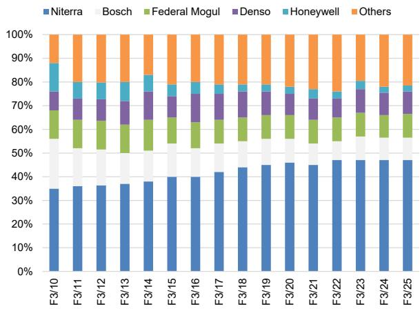

bar_stacked

| Date | Niterra (%) | Bosch (%) | Federal Mogul (%) | Denso (%) | Honeywell (%) | Others (%) |
|---|---|---|---|---|---|---|
| F3/10 | 35 | 48 | 20 | 10 | 17 | 16 |
| F3/11 | 36 | 49 | 18 | 10 | 17 | 20 |
| F3/12 | 36 | 50 | 18 | 10 | 17 | 20 |
| F3/13 | 37 | 51 | 18 | 10 | 17 | 20 |
| F3/14 | 38 | 52 | 18 | 10 | 17 | 20 |
| F3/15 | 39 | 53 | 18 | 10 | 17 | 20 |
| F3/16 | 40 | 54 | 18 | 10 | 17 | 20 |
| F3/17 | 42 | 55 | 18 | 10 | 17 | 20 |
| F3/18 | 44 | 56 | 18 | 10 | 17 | 20 |
| F3/19 | 45 | 57 | 18 | 10 | 17 | 20 |
| F3/20 | 46 | 58 | 18 | 10 | 17 | 20 |
| F3/21 | 45 | 59 | 18 | 10 | 17 | 20 |
| F3/22 | 47 | 60 | 18 | 10 | 17 | 20 |
| F3/23 | 47 | 60 | 18 | 10 | 17 | 20 |
| F3/24 | 47 | 60 | 18 | 10 | 17 | 20 |
| F3/25 | 47 | 60 | 18 | 10 | 17 | 20 |

■ Exhaust gas oxygen sensor global market share

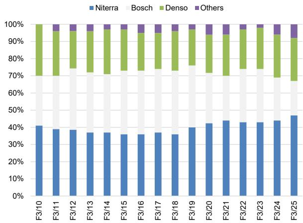

bar_stacked

| Period | Niterra (%) | Bosch (%) | Denso (%) | Others (%) |
| :--- | :--- | :--- | :--- | :--- |
| F3/10 | 41 | 47 | 49 | 0 |
| F3/11 | 39 | 48 | 46 | 5 |
| F3/12 | 39 | 52 | 37 | 5 |
| F3/13 | 37 | 51 | 40 | 5 |
| F3/14 | 37 | 51 | 40 | 5 |
| F3/15 | 36 | 51 | 40 | 5 |
| F3/16 | 36 | 51 | 40 | 5 |
| F3/17 | 37 | 50 | 40 | 5 |
| F3/18 | 36 | 51 | 40 | 5 |
| F3/19 | 40 | 48 | 38 | 5 |
| F3/20 | 42 | 48 | 36 | 5 |
| F3/21 | 44 | 42 | 38 | 5 |
| F3/22 | 43 | 47 | 37 | 5 |
| F3/23 | 43 | 47 | 38 | 5 |
| F3/24 | 44 | 42 | 38 | 5 |
| F3/25 | 47 | 39 | 40 | 5 |

Source: Company data, MS

- Spark plug global market share split in F3/25   
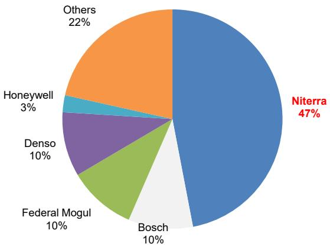

pie

| Company | Percentage (%) |
| :--- | :--- |
| Niterra | 47 |
| Bosch | 10 |
| Federal Mogul | 10 |
| Denso | 10 |
| Honeywell | 3 |
| Others | 22 |

Exhaust gas oxygen sensor global market share split in F3/25

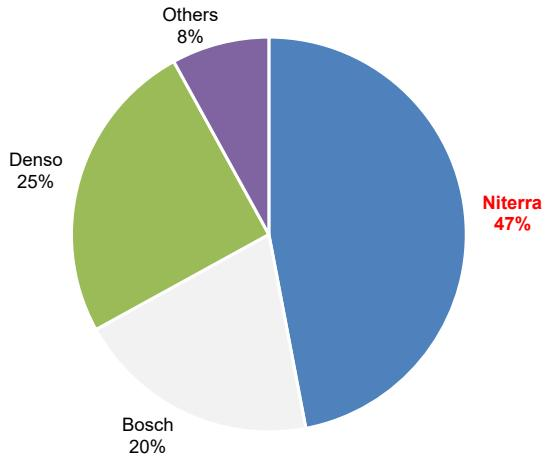

pie

| Category | Percentage (%) |
| :--- | :--- |
| Niterra | 47 |
| Bosch | 20 |
| Denso | 25 |
| Others | 8 |

# Niterra: Medium-term Results and Forecasts

<table><tr><td>(bn JPY, %)</td><td>F3/20</td><td>F3/21</td><td>F3/22</td><td>F3/23</td><td>F3/24</td><td>F3/25</td><td>F3/26</td><td>F3/27 MSe</td><td>F3/28 MSe</td><td>F3/29 MSe</td><td>F3/30 MSe</td><td>CAGR F3/22-F3/28MSe</td></tr><tr><td>Sales</td><td>562.6</td><td>427.5</td><td>491.7</td><td>562.6</td><td>614.5</td><td>653.0</td><td>731.2</td><td>754.6</td><td>788.6</td><td>848.9</td><td>914.9</td><td>8.2%</td></tr><tr><td>Spark &amp; Glow Plugs</td><td>203.5</td><td>205.3</td><td>250.0</td><td>285.1</td><td>335.3</td><td>362.6</td><td>390.7</td><td>414.4</td><td>438.0</td><td>479.6</td><td>525.4</td><td>9.8%</td></tr><tr><td>Automotive Sensors</td><td>140.9</td><td>133.4</td><td>137.8</td><td>158.9</td><td>170.0</td><td>180.2</td><td>196.8</td><td>197.0</td><td>200.9</td><td>206.9</td><td>213.1</td><td>6.5%</td></tr><tr><td>Component Solutions</td><td>36.3</td><td>80.0</td><td>95.5</td><td>110.8</td><td>96.5</td><td>103.1</td><td>130.7</td><td>135.3</td><td>143.7</td><td>156.4</td><td>170.4</td><td>7.1%</td></tr><tr><td>New Business</td><td>0.0</td><td>4.5</td><td>4.6</td><td>4.5</td><td>5.1</td><td>0.0</td><td>0.0</td><td>0.0</td><td>0.0</td><td>0.0</td><td>0.0</td><td>-</td></tr><tr><td>Others/Elimination</td><td>4.1</td><td>4.4</td><td>3.9</td><td>3.3</td><td>7.4</td><td>7.1</td><td>13.0</td><td>8.0</td><td>6.0</td><td>6.0</td><td>6.0</td><td>7.5%</td></tr><tr><td>OP</td><td>48.4</td><td>47.4</td><td>75.5</td><td>89.2</td><td>107.6</td><td>129.7</td><td>138.2</td><td>156.6</td><td>171.7</td><td>196.6</td><td>222.0</td><td>14.7%</td></tr><tr><td>Spark &amp; Glow Plugs</td><td>36.2</td><td>40.4</td><td>55.0</td><td>67.4</td><td>95.8</td><td>109.8</td><td>109.2</td><td>122.4</td><td>132.7</td><td>148.1</td><td>165.0</td><td>15.8%</td></tr><tr><td>Automotive Sensors</td><td>16.6</td><td>16.2</td><td>19.3</td><td>25.9</td><td>25.4</td><td>24.4</td><td>26.1</td><td>27.1</td><td>28.5</td><td>30.6</td><td>32.8</td><td>6.7%</td></tr><tr><td>Component Solutions</td><td>-1.1</td><td>-0.2</td><td>14.7</td><td>11.0</td><td>-0.6</td><td>-6.3</td><td>-4.6</td><td>6.6</td><td>10.1</td><td>17.5</td><td>23.8</td><td></td></tr><tr><td>New Business</td><td>0.0</td><td>-9.4</td><td>-13.6</td><td>-17.1</td><td>-13.2</td><td>0.0</td><td>0.0</td><td>0.0</td><td>0.0</td><td>0.0</td><td>0.0</td><td></td></tr><tr><td>Others/Elimination</td><td>-0.6</td><td>0.4</td><td>0.1</td><td>2.0</td><td>0.2</td><td>1.8</td><td>7.4</td><td>0.4</td><td>0.4</td><td>0.4</td><td>0.4</td><td></td></tr><tr><td>OPM</td><td>8.6%</td><td>11.1%</td><td>15.4%</td><td>15.9%</td><td>17.5%</td><td>19.9%</td><td>18.9%</td><td>20.7%</td><td>21.8%</td><td>23.2%</td><td>24.3%</td><td></td></tr><tr><td>ROE</td><td>8.5%</td><td>9.1%</td><td>12.5%</td><td>12.3%</td><td>13.8%</td><td>14.1%</td><td>15.7%</td><td>15.2%</td><td>15.6%</td><td>16.4%</td><td>16.8%</td><td></td></tr></table>

Note: MSe = MS estimates   
Source: Company data, MS

# Small Size LiB Market Overview

■ Small size LiB shipment volume by supplier   
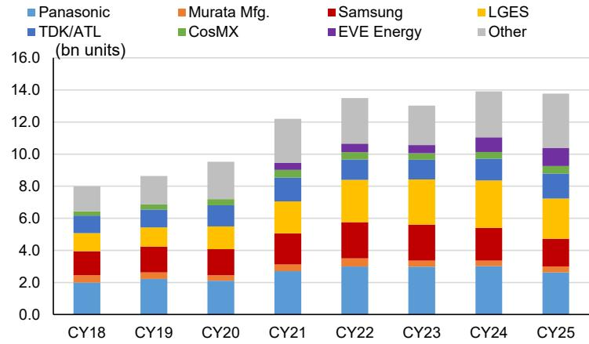

bar_stacked

| Year | Panasonic (bn units) | Murata Mfg. (bn units) | TDK/ATL (bn units) | Samsung (bn units) | LGES (bn units) | CosMX (bn units) | EVE Energy (bn units) | Other (bn units) |
| :--- | :--- | :--- | :--- | :--- | :--- | :--- | :--- | :--- |
| CY18 | 2.0 | 0.3 | 1.4 | 2.0 | 1.6 | 0.3 | 0.0 | 1.4 |
| CY19 | 2.2 | 0.4 | 1.5 | 2.1 | 1.7 | 0.4 | 0.0 | 1.7 |
| CY20 | 2.1 | 0.4 | 1.7 | 2.2 | 1.8 | 0.5 | 0.0 | 2.3 |
| CY21 | 2.8 | 0.5 | 1.9 | 2.5 | 2.6 | 0.6 | 0.4 | 3.0 |
| CY22 | 3.0 | 0.5 | 2.0 | 2.8 | 3.0 | 0.7 | 0.6 | 3.5 |
| CY23 | 3.0 | 0.5 | 2.1 | 2.8 | 3.2 | 0.7 | 0.7 | 3.3 |
| CY24 | 3.0 | 0.5 | 2.2 | 2.7 | 3.4 | 0.8 | 1.1 | 3.6 |
| CY25 | 2.7 | 0.5 | 2.3 | 2.5 | 3.6 | 0.8 | 1.3 | 3.7 |

■ Small size LiB market share by supplier (CY25)   
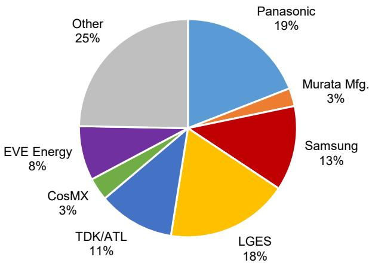

pie

| Company | Share (%) |
| :--- | :--- |
| Panasonic | 19 |
| Murata Mfg. | 3 |
| Samsung | 13 |
| LGES | 18 |
| TDK/ATL | 11 |
| CosMX | 3 |
| EVE Energy | 8 |
| Other | 25 |

Source: TSR, MS

Laminated small size LiB shipment volume by supplier   
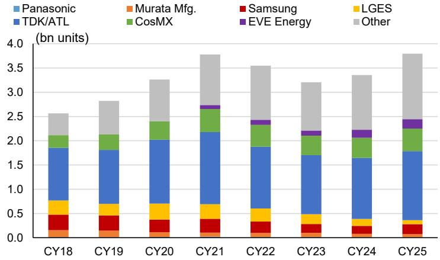

bar_stacked

| Year | Panasonic (bn units) | TDK/ATL (bn units) | CosMX (bn units) | Samsung (bn units) | LGES (bn units) | EVE Energy (bn units) | Other (bn units) |
| :--- | :--- | :--- | :--- | :--- | :--- | :--- | :--- |
| CY18 | 0.1 | 1.3 | 0.2 | 0.4 | 0.3 | 0.0 | 0.4 |
| CY19 | 0.1 | 1.4 | 0.2 | 0.3 | 0.2 | 0.0 | 0.6 |
| CY20 | 0.1 | 1.5 | 0.3 | 0.3 | 0.3 | 0.0 | 0.7 |
| CY21 | 0.1 | 1.7 | 0.4 | 0.3 | 0.2 | 0.1 | 0.8 |
| CY22 | 0.1 | 1.6 | 0.4 | 0.3 | 0.2 | 0.1 | 0.8 |
| CY23 | 0.1 | 1.5 | 0.4 | 0.2 | 0.2 | 0.1 | 0.8 |
| CY24 | 0.1 | 1.5 | 0.4 | 0.2 | 0.2 | 0.2 | 0.8 |
| CY25 | 0.1 | 1.7 | 0.4 | 0.2 | 0.1 | 0.2 | 0.9 |

Laminated small size LiB market share by supplier (CY25)   
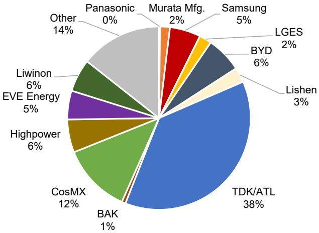

pie

| Company | Share (%) |
| :--- | :--- |
| TDK/ATL | 38 |
| CosMX | 12 |
| BAK | 1 |
| Highpower | 6 |
| EVE Energy | 5 |
| Liwinon | 6 |
| Other | 14 |
| Panasonic | 0 |
| Lighen | 3 |
| BYD | 6 |
| LGES | 2 |
| Samsung | 5 |
| Murata Mfg. | 2 |

# TDK: LiB Earnings Expansion, Major Acquisition and Transfer of Business

■ TDK: Sales and OP for rechargeable battery business   
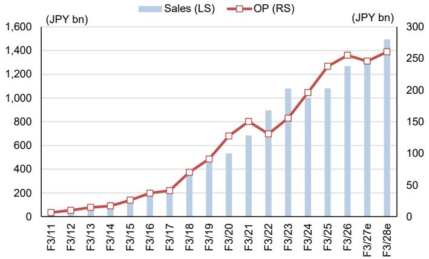

bar_line

| Fiscal Year | Sales (JPY bn) | OP (JPY bn) |
|-------------|----------------|-------------|
| F3/11       | ~50            | ~50         |
| F3/12       | ~70            | ~70         |
| F3/13       | ~90            | ~90         |
| F3/14       | ~120           | ~120        |
| F3/15       | ~160           | ~160        |
| F3/16       | ~200           | ~200        |
| F3/17       | ~240           | ~240        |
| F3/18       | ~380           | ~380        |
| F3/19       | ~500           | ~500        |
| F3/20       | ~680           | ~680        |
| F3/21       | ~800           | ~800        |
| F3/22       | ~700           | ~700        |
| F3/23       | ~1,100         | ~1,100      |
| F3/24       | ~1,000         | ~1,000      |
| F3/25       | ~1,100         | ~1,100      |
| F3/26       | ~1,280         | ~1,280      |
| F3/27e      | ~1,300         | ~1,300      |
| F3/28e      | ~1,480         | ~1,480      |

■ TDK/ATL: Small size battery shipment volume composition by application (CY25)   
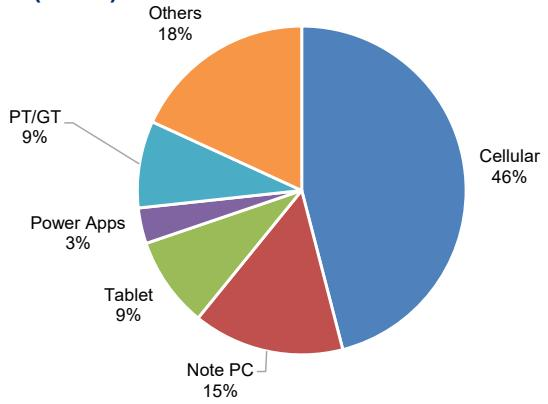

pie

| Category | Percentage (%) |
| :--- | :--- |
| Cellular | 46 |
| Note PC | 15 |
| Tablet | 9 |
| Power Apps | 3 |
| PT/GT | 9 |
| Others | 18 |

■ TDK: Major acquisition and transfer of business 

<table><tr><td></td><td>Acquisition and Transfer of Business</td><td>Business</td><td>Acquisition/Sales value (JPY mn)</td></tr><tr><td>Aug-1986</td><td>Acquisition of SAE Magnetics</td><td>HDD Heads</td><td>unknown</td></tr><tr><td>May-1989</td><td>Acquisition of Silicon Systems</td><td>Mixed-signal Semiconductors</td><td>28,000</td></tr><tr><td>Jun-1996</td><td>Transfer of Silicon Systems to Texas Instruments</td><td>Mixed-signal Semiconductors</td><td>62,700</td></tr><tr><td>Mar-2000</td><td>Acquisition of Headway Technologies</td><td>HDD Heads</td><td>26,410</td></tr><tr><td>May-2005</td><td>Acquisition of Amperex Technology(ATL)</td><td>Lithium Polymer Batteries</td><td>8,700</td></tr><tr><td>Oct-2005</td><td>Acquisition of Lambda Power Group</td><td>Power</td><td>25,500</td></tr><tr><td>Aug-2007</td><td>Transfer of Recording Media business to Imation</td><td>Recording Media</td><td>31,400</td></tr><tr><td>Sep-2007</td><td>Acquisition of HDD head business from Alps</td><td>HDD Heads</td><td>34,400</td></tr><tr><td>Nov-2007</td><td>Acquisition of Magnecomp International</td><td>HDD Head Suspensions</td><td>20,900</td></tr><tr><td>Oct-2008</td><td>Acquisition of Epcos</td><td>Passive Components</td><td>170,600</td></tr><tr><td>Mar-2016</td><td>Acquisition of Micronas</td><td>MEMS Magnetic Sensors</td><td>22,500</td></tr><tr><td>Oct-2016</td><td>Acquisition of Hutchinson Technology</td><td>HDD Head Suspensions</td><td>14,262</td></tr><tr><td>Dec-2016</td><td>Acquisition of Tronics</td><td>MEMS Inertial Sensors</td><td>4,107</td></tr><tr><td>Feb-2017</td><td>Transfer of Epcos High Frequency Components business to Qualcomm</td><td>High Frequency Components</td><td>339,000</td></tr><tr><td>Mar-2017</td><td>Acquisition of ICsense</td><td>Gyroscope Sensors</td><td>2,396</td></tr><tr><td>May-2017</td><td>Acquisition of InvenSense</td><td>MEMS Inertial Sensors</td><td>142,758</td></tr><tr><td>Feb-2018</td><td>Acquisition of Chirp Microsystems</td><td>Ultrasonic 3D Sensors</td><td>3,015</td></tr><tr><td>May-2018</td><td>Acquisition of Faraday Semi LLC</td><td>Power Management IC</td><td>unknown</td></tr><tr><td>Apr-2025</td><td>Transfer of Micro Actuator Solution Business to QT Investment</td><td>Micro Actuator</td><td>unknown</td></tr><tr><td>Jun-2025</td><td>Acquisition of SoftEye</td><td>Smart glasses</td><td>unknown</td></tr><tr><td>Jun-2025</td><td>Acquisition of RF power business from QEI Corporation</td><td>RF power business</td><td>unknown</td></tr></table>

Note: e = MS estimates   
Source: TSR, Company data, MS

# TDK: Actions for Business Portfolio Improvement

Chart for growth and capital efficiency by segment   
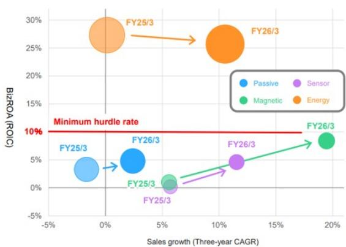

Net sales, BizROA by segment 

<table><tr><td>(¥bn)</td><td>FY3/25</td><td>FY3/26</td></tr><tr><td>Net sales</td><td>2,204.8</td><td>2,504.8</td></tr><tr><td>Passive Components</td><td>559.6</td><td>593.2</td></tr><tr><td>Sensor Application Products</td><td>189.5</td><td>224.7</td></tr><tr><td>Magnetic Application Products</td><td>223.6</td><td>262.9</td></tr><tr><td>Energy Application Products</td><td>1,176.5</td><td>1,370.3</td></tr><tr><td>OP margin</td><td>10.2%</td><td>10.9%</td></tr><tr><td>BizROA (ROIC)</td><td>6.7%</td><td>7.5%</td></tr><tr><td>Passive Components</td><td>3.3%</td><td>4.8%</td></tr><tr><td>Sensor Application Products</td><td>0.2%</td><td>4.7%</td></tr><tr><td>Magnetic Application Products</td><td>1.0%</td><td>8.4%</td></tr><tr><td>Energy Application Products</td><td>27.3%</td><td>25.7%</td></tr></table>

Progress of proactive business portfolio management   
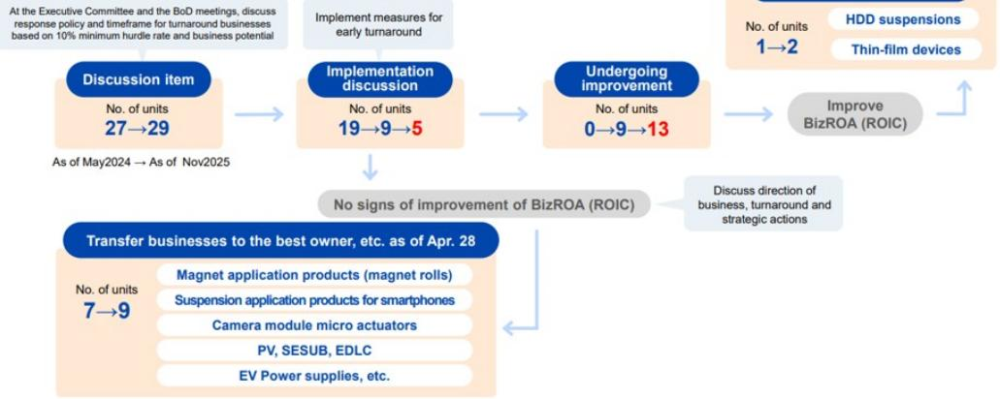

flowchart

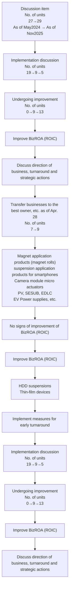
```mermaid
graph TD
    A["Discussion item\nNo. of units\n27→29\nAs of May2024 → As of Nov2025"] --> B["Implementation discussion\nNo. of units\n19→9→5"]
    B --> C["Undergoing improvement\nNo. of units\n0→9→13"]
    C --> D["Improve BizROA (ROIC)"]
    D --> E["Discuss direction of business, turnaround and strategic actions"]
    E --> F["Transfer businesses to the best owner, etc. as of Apr. 28\nNo. of units\n7→9"]
    F --> G["Magnet application products (magnet rolls)\nsuspension application products for smartphones\nCamera module micro actuators\nPV, SESUB, EDLC\nEV Power supplies, etc."]
    G --> H["No signs of improvement of BizROA (ROIC)"]
    H --> I["Improve BizROA (ROIC)"]
    I --> J["HDD suspensions\nThin-film devices"]
    J --> K["Implement measures for early turnaround"]
    K --> L["Implementation discussion\nNo. of units\n19→9→5"]
    L --> M["Undergoing improvement\nNo. of units\n0→9→13"]
    M --> N["Improve BizROA (ROIC)"]
    N --> O["Discuss direction of business, turnaround and strategic actions"]
```

Source: Company data

TDK: Medium-term Results and Forecasts 

<table><tr><td>(bn JPY, %)</td><td>F3/18</td><td>F3/19</td><td>F3/20</td><td>F3/21</td><td>F3/22</td><td>F3/23</td><td>F3/24</td><td>F3/25</td><td>F3/26</td><td>F3/27 MSe</td><td>F3/28 MSe</td><td>F3/29 MSe</td><td>CAGR F3/24-F3/27e MSe</td></tr><tr><td>Sales</td><td>1,271.7</td><td>1,381.8</td><td>1,363.0</td><td>1,479.0</td><td>1,902.1</td><td>2,180.8</td><td>2,103.9</td><td>2,204.8</td><td>2,504.8</td><td>2,648.5</td><td>2,869.4</td><td>3,116.3</td><td>8.0%</td></tr><tr><td>Passive Components</td><td>417.6</td><td>433.4</td><td>395.5</td><td>407.1</td><td>507.8</td><td>578.8</td><td>565.6</td><td>559.6</td><td>593.2</td><td>625.3</td><td>650.7</td><td>677.6</td><td>3.4%</td></tr><tr><td>Sensor Application Products</td><td>77.4</td><td>76.5</td><td>77.9</td><td>81.3</td><td>130.8</td><td>169.5</td><td>180.5</td><td>189.5</td><td>224.6</td><td>236.7</td><td>252.7</td><td>269.9</td><td>9.4%</td></tr><tr><td>Magnetic Application Products</td><td>277.5</td><td>272.8</td><td>219.7</td><td>199.3</td><td>248.4</td><td>200.6</td><td>184.2</td><td>223.6</td><td>262.9</td><td>301.9</td><td>311.5</td><td>321.6</td><td>17.9%</td></tr><tr><td>Energy Application Products</td><td>442.8</td><td>537.5</td><td>597.7</td><td>740.2</td><td>965.3</td><td>1,173.4</td><td>1,121.7</td><td>1,176.5</td><td>1,370.3</td><td>1,432.7</td><td>1,604.6</td><td>1,797.2</td><td>8.5%</td></tr><tr><td>Other</td><td>56.4</td><td>61.6</td><td>72.3</td><td>51.1</td><td>49.7</td><td>58.6</td><td>51.8</td><td>55.6</td><td>53.8</td><td>52.0</td><td>50.0</td><td>50.0</td><td>0.1%</td></tr><tr><td>OP</td><td>85.6</td><td>107.8</td><td>97.9</td><td>111.5</td><td>166.8</td><td>168.8</td><td>172.9</td><td>224.2</td><td>272.4</td><td>309.8</td><td>348.1</td><td>383.6</td><td>21.5%</td></tr><tr><td>Passive Components</td><td>46.0</td><td>58.4</td><td>39.1</td><td>40.2</td><td>76.8</td><td>95.5</td><td>53.9</td><td>34.1</td><td>41.8</td><td>52.9</td><td>63.9</td><td>72.1</td><td>-0.6%</td></tr><tr><td>Sensor Application Products</td><td>-19.4</td><td>-22.1</td><td>-25.0</td><td>-24.9</td><td>-0.3</td><td>10.7</td><td>6.0</td><td>5.0</td><td>20.7</td><td>24.3</td><td>30.4</td><td>33.6</td><td></td></tr><tr><td>Magnetic Application Products</td><td>16.1</td><td>17.0</td><td>0.4</td><td>-2.4</td><td>4.6</td><td>-56.4</td><td>-35.6</td><td>3.4</td><td>27.0</td><td>42.9</td><td>49.2</td><td>56.0</td><td></td></tr><tr><td>Energy Application Products</td><td>72.9</td><td>91.0</td><td>124.1</td><td>147.4</td><td>123.2</td><td>147.4</td><td>195.7</td><td>234.4</td><td>246.7</td><td>243.7</td><td>258.5</td><td>275.9</td><td>7.6%</td></tr><tr><td>Other</td><td>0.6</td><td>-6.7</td><td>-8.6</td><td>-16.1</td><td>-1.4</td><td>-0.4</td><td>-1.8</td><td>-4.4</td><td>-10.2</td><td>-4.0</td><td>-4.0</td><td>-4.0</td><td></td></tr><tr><td>Intersegment Elimination</td><td>-30.5</td><td>-29.8</td><td>-32.2</td><td>-32.7</td><td>-36.1</td><td>-28.0</td><td>-45.3</td><td>-48.3</td><td>-53.6</td><td>-50.0</td><td>-50.0</td><td>-50.0</td><td></td></tr><tr><td>OPM</td><td>6.7%</td><td>7.8%</td><td>7.2%</td><td>7.5%</td><td>8.8%</td><td>7.7%</td><td>8.2%</td><td>10.2%</td><td>10.9%</td><td>11.7%</td><td>12.1%</td><td>12.3%</td><td></td></tr><tr><td>ROE</td><td>7.8%</td><td>9.7%</td><td>6.7%</td><td>8.6%</td><td>11.4%</td><td>8.3%</td><td>7.9%</td><td>9.5%</td><td>9.7%</td><td>11.5%</td><td>11.9%</td><td>12.0%</td><td></td></tr></table>

<table><tr><td>(JPY bn)</td><td>F3/18</td><td>F3/19</td><td>F3/20</td><td>F3/21</td><td>F3/22</td><td>F3/23</td><td>F3/24</td><td>F3/25</td><td>F3/26</td><td>F3/27 MSe</td><td>F3/28 MSe</td><td>F3/29 MSe</td><td>CAGR F3/18-F3/25</td><td>CAGR F3/25-F3/28 MSe</td></tr><tr><td>Total Sales</td><td>1,271.7</td><td>1,381.8</td><td>1,363.0</td><td>1,479.0</td><td>1,902.1</td><td>2,180.8</td><td>2,103.9</td><td>2,204.8</td><td>2,504.8</td><td>2,648.5</td><td>2,869.4</td><td>3,116.3</td><td>8.2%</td><td>9.2%</td></tr><tr><td>Group A Sales</td><td>633.2</td><td>727.5</td><td>752.1</td><td>889.5</td><td>1,165.4</td><td>1,309.7</td><td>1,237.6</td><td>1,375.7</td><td>1,613.6</td><td>1,718.6</td><td>1,904.3</td><td>2,111.5</td><td>11.7%</td><td>11.4%</td></tr><tr><td>HDD Head</td><td>175.5</td><td>181.4</td><td>136.4</td><td>116.5</td><td>148.5</td><td>104.1</td><td>100.1</td><td>134.5</td><td>142.5</td><td>168.9</td><td>171.4</td><td>174.0</td><td></td><td></td></tr><tr><td>HDD Suspension</td><td>60.5</td><td>56.0</td><td>54.3</td><td>57.5</td><td>66.3</td><td>49.7</td><td>43.7</td><td>56.2</td><td>81.0</td><td>100.6</td><td>107.6</td><td>115.2</td><td></td><td></td></tr><tr><td>Magnetic Sensor</td><td>26.2</td><td>28.1</td><td>27.5</td><td>30.5</td><td>54.6</td><td>76.6</td><td>91.9</td><td>104.3</td><td>120.3</td><td>124.1</td><td>131.5</td><td>139.4</td><td></td><td></td></tr><tr><td>LiB</td><td>371.0</td><td>461.9</td><td>533.8</td><td>685.0</td><td>896.0</td><td>1,079.3</td><td>1,001.9</td><td>1,080.7</td><td>1,269.9</td><td>1,325.0</td><td>1,493.7</td><td>1,682.9</td><td></td><td></td></tr><tr><td>Group B Sales</td><td>638.6</td><td>654.3</td><td>611.0</td><td>589.5</td><td>736.7</td><td>871.1</td><td>866.3</td><td>829.1</td><td>891.2</td><td>930.0</td><td>965.1</td><td>1,004.7</td><td>3.8%</td><td>5.2%</td></tr><tr><td>Capacitors</td><td>157.0</td><td>173.3</td><td>153.9</td><td>158.2</td><td>198.1</td><td>242.5</td><td>245.0</td><td>234.3</td><td>257.5</td><td>276.1</td><td>292.6</td><td>310.2</td><td></td><td></td></tr><tr><td>Inductive Devices</td><td>157.5</td><td>150.0</td><td>137.6</td><td>140.0</td><td>180.2</td><td>198.5</td><td>192.0</td><td>204.3</td><td>216.2</td><td>226.2</td><td>235.3</td><td>244.7</td><td></td><td></td></tr><tr><td>Other Passive Components</td><td>103.1</td><td>110.1</td><td>104.0</td><td>109.0</td><td>129.4</td><td>137.8</td><td>128.7</td><td>121.1</td><td>119.5</td><td>123.0</td><td>122.8</td><td>122.8</td><td></td><td></td></tr><tr><td>Temperature/Pressure Sensor</td><td>24.9</td><td>26.4</td><td>26.8</td><td>27.2</td><td>33.0</td><td>36.9</td><td>40.4</td><td>41.6</td><td>42.3</td><td>45.1</td><td>46.9</td><td>48.7</td><td></td><td></td></tr><tr><td>MEMS Sensor</td><td>25.5</td><td>22.0</td><td>23.7</td><td>23.6</td><td>43.2</td><td>56.0</td><td>48.3</td><td>43.5</td><td>62.0</td><td>67.5</td><td>74.3</td><td>81.7</td><td></td><td></td></tr><tr><td>Magnet</td><td>41.5</td><td>35.4</td><td>28.9</td><td>25.2</td><td>33.6</td><td>46.8</td><td>40.7</td><td>32.9</td><td>39.5</td><td>32.4</td><td>32.4</td><td>32.4</td><td></td><td></td></tr><tr><td>Power Supply</td><td>71.8</td><td>75.6</td><td>63.9</td><td>55.2</td><td>69.3</td><td>94.0</td><td>119.7</td><td>95.8</td><td>100.4</td><td>107.7</td><td>110.9</td><td>114.2</td><td></td><td></td></tr><tr><td>Others</td><td>57.2</td><td>61.6</td><td>72.3</td><td>51.1</td><td>49.8</td><td>58.6</td><td>51.6</td><td>55.6</td><td>53.8</td><td>52.0</td><td>50.0</td><td>50.0</td><td></td><td></td></tr><tr><td>Total OP</td><td>85.6</td><td>107.8</td><td>97.9</td><td>111.5</td><td>166.8</td><td>168.8</td><td>172.9</td><td>224.2</td><td>272.4</td><td>309.8</td><td>348.1</td><td>383.6</td><td></td><td></td></tr><tr><td>Group A OP</td><td>86.2</td><td>118.1</td><td>145.1</td><td>154.3</td><td>153.4</td><td>126.7</td><td>193.7</td><td>273.0</td><td>309.9</td><td>318.3</td><td>342.4</td><td>369.7</td><td></td><td></td></tr><tr><td>Group B OP</td><td>30.0</td><td>20.0</td><td>-15.1</td><td>-10.0</td><td>53.3</td><td>70.1</td><td>24.5</td><td>-0.6</td><td>16.1</td><td>41.5</td><td>55.7</td><td>63.9</td><td></td><td></td></tr><tr><td>Intersegment elimination</td><td>-30.5</td><td>-30.3</td><td>-32.2</td><td>-32.7</td><td>-39.8</td><td>-28.0</td><td>-45.3</td><td>-48.3</td><td>-53.6</td><td>-50.0</td><td>-50.0</td><td>-50.0</td><td></td><td></td></tr><tr><td>OPM</td><td>6.7%</td><td>7.8%</td><td>7.2%</td><td>7.5%</td><td>8.8%</td><td>7.7%</td><td>8.2%</td><td>10.2%</td><td>10.9%</td><td>11.7%</td><td>12.1%</td><td>12.3%</td><td></td><td></td></tr><tr><td>ROE</td><td>7.8%</td><td>9.7%</td><td>6.7%</td><td>8.6%</td><td>11.4%</td><td>8.3%</td><td>7.9%</td><td>9.5%</td><td>9.7%</td><td>11.5%</td><td>11.9%</td><td>12.0%</td><td></td><td></td></tr></table>

Note: MSe = MS estimates   
Source: Company data, MS

iPhone Sell-in Forecasts / iPhone Camera Actuators by Model 

<table><tr><td>mn units</td><td>1Q22</td><td>2Q22</td><td>3Q22</td><td>4Q22</td><td>2022</td><td>1Q23</td><td>2Q23</td><td>3Q23</td><td>4Q23</td><td>2023</td><td>1Q24</td><td>2Q24</td><td>3Q24</td><td>4Q24</td><td>2024</td><td>1Q25</td><td>2Q25</td><td>3Q25</td><td>4Q25e</td><td>2025</td><td>1Q26e</td><td>2Q26e</td></tr><tr><td>iPhone Sell-in</td><td></td><td></td><td></td><td></td><td></td><td></td><td></td><td></td><td></td><td></td><td></td><td></td><td></td><td></td><td></td><td></td><td></td><td></td><td></td><td></td><td></td><td></td></tr><tr><td>iPhone SE3 / SE 5G / 16e / 17e</td><td>3.0</td><td>13.0</td><td>6.0</td><td>2.0</td><td>24.0</td><td>1.0</td><td>2.5</td><td>5.0</td><td>3.0</td><td>11.5</td><td>1.0</td><td>2.0</td><td>5.0</td><td>3.0</td><td>11.0</td><td>4.0</td><td>9.0</td><td>4.0</td><td>1.0</td><td>18.0</td><td>2.0</td><td>10.0</td></tr><tr><td>iPhone XR</td><td>-</td><td>-</td><td>-</td><td>-</td><td>-</td><td>-</td><td>-</td><td>-</td><td>-</td><td>-</td><td>-</td><td>-</td><td>-</td><td>-</td><td>-</td><td>-</td><td>-</td><td>-</td><td>-</td><td>-</td><td>-</td><td>-</td></tr><tr><td>iPhone 11</td><td>1.0</td><td>1.0</td><td>0.5</td><td>0.5</td><td>3.0</td><td>-</td><td>-</td><td>-</td><td>-</td><td>-</td><td>-</td><td>-</td><td>-</td><td>-</td><td>-</td><td>-</td><td>-</td><td>-</td><td>-</td><td>-</td><td>-</td><td>-</td></tr><tr><td>iPhone 12 mini (5.4&quot;)</td><td>-</td><td>-</td><td>-</td><td>-</td><td>-</td><td>-</td><td>-</td><td>-</td><td>-</td><td>-</td><td>-</td><td>-</td><td>-</td><td>-</td><td>-</td><td>-</td><td>-</td><td>-</td><td>-</td><td>-</td><td>-</td><td>-</td></tr><tr><td>iPhone 12 (6.1&quot;)</td><td>2.0</td><td>1.0</td><td>1.0</td><td>0.5</td><td>4.5</td><td>0.5</td><td>0.5</td><td>-</td><td>-</td><td>1.0</td><td>-</td><td>-</td><td>-</td><td>-</td><td>-</td><td>-</td><td>-</td><td>-</td><td>-</td><td>-</td><td>-</td><td>-</td></tr><tr><td>iPhone 12 Pro (6.1&quot;)</td><td>1.0</td><td>0.5</td><td>0.5</td><td>0.5</td><td>2.5</td><td>0.5</td><td>-</td><td>-</td><td>-</td><td>0.5</td><td>-</td><td>-</td><td>-</td><td>-</td><td>-</td><td>-</td><td>-</td><td>-</td><td>-</td><td>-</td><td>-</td><td>-</td></tr><tr><td>iPhone 12 Pro Max (6.7&quot;)</td><td>1.0</td><td>0.5</td><td>0.5</td><td>0.5</td><td>2.5</td><td>0.5</td><td>-</td><td>-</td><td>-</td><td>0.5</td><td>-</td><td>-</td><td>-</td><td>-</td><td>-</td><td>-</td><td>-</td><td>-</td><td>-</td><td>-</td><td>-</td><td>-</td></tr><tr><td>iPhone 13 mini (5.4&quot;)</td><td>5.0</td><td>2.0</td><td>2.0</td><td>1.0</td><td>10.0</td><td>1.0</td><td>0.5</td><td>-</td><td>-</td><td>1.5</td><td>-</td><td>-</td><td>-</td><td>-</td><td>-</td><td>-</td><td>-</td><td>-</td><td>-</td><td>-</td><td>-</td><td>-</td></tr><tr><td>iPhone 13 (6.1&quot;)</td><td>16.0</td><td>11.5</td><td>8.0</td><td>3.0</td><td>38.5</td><td>1.0</td><td>0.5</td><td>-</td><td>-</td><td>1.5</td><td>-</td><td>-</td><td>-</td><td>-</td><td>-</td><td>-</td><td>-</td><td>-</td><td>-</td><td>-</td><td>-</td><td>-</td></tr><tr><td>iPhone 13 Pro (6.1&quot;)</td><td>13.0</td><td>8.0</td><td>6.0</td><td>3.5</td><td>30.5</td><td>1.0</td><td>2.0</td><td>1.0</td><td>-</td><td>4.0</td><td>0.5</td><td>0.5</td><td>-</td><td>-</td><td>1.0</td><td>-</td><td>-</td><td>-</td><td>-</td><td>-</td><td>-</td><td>-</td></tr><tr><td>iPhone 13 Pro Max (6.7&quot;)</td><td>12.0</td><td>7.5</td><td>5.0</td><td>4.0</td><td>28.5</td><td>2.0</td><td>2.0</td><td>1.0</td><td>-</td><td>5.0</td><td>0.5</td><td>0.5</td><td>-</td><td>-</td><td>1.0</td><td>-</td><td>-</td><td>-</td><td>-</td><td>-</td><td>-</td><td>-</td></tr><tr><td>iPhone 14 (6.1&quot;)</td><td></td><td></td><td>6.5</td><td>13.0</td><td>19.5</td><td>7.0</td><td>4.0</td><td>5.0</td><td>2.0</td><td>18.0</td><td>1.0</td><td>0.5</td><td>-</td><td>-</td><td>1.5</td><td>-</td><td>-</td><td>-</td><td>-</td><td>-</td><td>-</td><td>-</td></tr><tr><td>iPhone 14 Plus (6.7&quot;)</td><td></td><td></td><td>2.0</td><td>13.5</td><td>15.5</td><td>5.0</td><td>3.0</td><td>1.0</td><td>1.0</td><td>10.0</td><td>1.0</td><td>0.5</td><td>-</td><td>-</td><td>1.5</td><td>-</td><td>-</td><td>-</td><td>-</td><td>-</td><td>-</td><td>-</td></tr><tr><td>iPhone 14 Pro (6.1&quot;)</td><td></td><td></td><td>6.0</td><td>16.0</td><td>22.0</td><td>15.0</td><td>12.0</td><td>7.0</td><td>3.0</td><td>37.0</td><td>2.0</td><td>2.0</td><td>1.0</td><td>1.0</td><td>6.0</td><td>1.0</td><td>1.0</td><td>1.0</td><td>-</td><td>3.0</td><td>-</td><td>-</td></tr><tr><td>iPhone 14 Pro Max (6.7&quot;)</td><td></td><td></td><td>6.0</td><td>19.0</td><td>25.0</td><td>19.5</td><td>14.0</td><td>9.0</td><td>4.0</td><td>46.5</td><td>2.0</td><td>2.0</td><td>1.0</td><td>1.0</td><td>6.0</td><td>1.0</td><td>1.0</td><td>1.0</td><td>-</td><td>3.0</td><td>-</td><td>-</td></tr><tr><td>iPhone 15 (6.1&quot;)</td><td></td><td></td><td></td><td></td><td></td><td></td><td></td><td>6.0</td><td>12.0</td><td>18.0</td><td>6.0</td><td>5.0</td><td>4.0</td><td>1.0</td><td>16.0</td><td>1.0</td><td>0.5</td><td>0.5</td><td>0.5</td><td>2.5</td><td>-</td><td>-</td></tr><tr><td>iPhone 15 Plus (6.7&quot;)</td><td></td><td></td><td></td><td></td><td></td><td></td><td></td><td>5.0</td><td>10.0</td><td>15.0</td><td>4.0</td><td>3.0</td><td>1.0</td><td>1.0</td><td>9.0</td><td>1.0</td><td>0.5</td><td>0.5</td><td>0.5</td><td>2.5</td><td>-</td><td>-</td></tr><tr><td>iPhone 15 Pro (6.1&quot;)</td><td></td><td></td><td></td><td></td><td></td><td></td><td></td><td>8.0</td><td>16.0</td><td>24.0</td><td>12.0</td><td>10.0</td><td>8.5</td><td>2.0</td><td>32.5</td><td>2.0</td><td>2.0</td><td>2.0</td><td>1.0</td><td>7.0</td><td>1.0</td><td>1.0</td></tr><tr><td>iPhone 15 Pro Max (6.7&quot;)</td><td></td><td></td><td></td><td></td><td></td><td></td><td></td><td>2.0</td><td>24.0</td><td>26.0</td><td>18.0</td><td>13.0</td><td>10.5</td><td>3.0</td><td>44.5</td><td>3.0</td><td>3.0</td><td>2.0</td><td>1.0</td><td>9.0</td><td>1.0</td><td>1.0</td></tr><tr><td>iPhone 16 (6.1&quot;)</td><td></td><td></td><td></td><td></td><td></td><td></td><td></td><td></td><td></td><td></td><td>-</td><td>-</td><td>6.0</td><td>12.0</td><td>18.0</td><td>5.0</td><td>4.0</td><td>4.0</td><td>1.0</td><td>14.0</td><td>2.0</td><td>2.0</td></tr><tr><td>iPhone 16 Plus (6.7&quot;)</td><td></td><td></td><td></td><td></td><td></td><td></td><td></td><td></td><td></td><td></td><td>-</td><td>-</td><td>5.0</td><td>6.0</td><td>11.0</td><td>4.0</td><td>3.0</td><td>1.0</td><td>-</td><td>8.0</td><td>-</td><td>-</td></tr><tr><td>iPhone 16 Pro (6.3&quot;)</td><td></td><td></td><td></td><td></td><td></td><td></td><td></td><td></td><td></td><td></td><td>-</td><td>-</td><td>8.0</td><td>17.0</td><td>25.0</td><td>11.5</td><td>9.5</td><td>4.0</td><td>2.0</td><td>27.0</td><td>2.0</td><td>2.0</td></tr><tr><td>iPhone 16 Pro Max (6.9&quot;)</td><td></td><td></td><td></td><td></td><td></td><td></td><td></td><td></td><td></td><td></td><td>-</td><td>-</td><td>4.0</td><td>26.0</td><td>30.0</td><td>16.5</td><td>13.0</td><td>10.0</td><td>4.0</td><td>43.5</td><td>5.0</td><td>3.0</td></tr><tr><td>iPhone 17 (6.1&quot;)</td><td></td><td></td><td></td><td></td><td></td><td></td><td></td><td></td><td></td><td></td><td>-</td><td>-</td><td>-</td><td>-</td><td>-</td><td>-</td><td>-</td><td>6.0</td><td>16.0</td><td>22.0</td><td>10.0</td><td>8.0</td></tr><tr><td>iPhone Air (6.7&quot;)</td><td></td><td></td><td></td><td></td><td></td><td></td><td></td><td></td><td></td><td></td><td>-</td><td>-</td><td>-</td><td>-</td><td>-</td><td>-</td><td>-</td><td>4.0</td><td>4.0</td><td>8.0</td><td>-</td><td>-</td></tr><tr><td>iPhone 17 Pro (6.3&quot;)</td><td></td><td></td><td></td><td></td><td></td><td></td><td></td><td></td><td></td><td></td><td>-</td><td>-</td><td>-</td><td>-</td><td>-</td><td>-</td><td>-</td><td>8.0</td><td>22.0</td><td>30.0</td><td>18.0</td><td>13.0</td></tr><tr><td>iPhone 17 Pro Max (6.9&quot;)</td><td></td><td></td><td></td><td></td><td></td><td></td><td></td><td></td><td></td><td></td><td>-</td><td>-</td><td>-</td><td>-</td><td>-</td><td>-</td><td>-</td><td>7.0</td><td>23.0</td><td>30.0</td><td>15.0</td><td>12.0</td></tr><tr><td>Total</td><td>54.0</td><td>45.0</td><td>50.0</td><td>77.0</td><td>226.0</td><td>54.0</td><td>41.0</td><td>50.0</td><td>75.0</td><td>220.0</td><td>48.0</td><td>39.0</td><td>54.0</td><td>73.0</td><td>214.0</td><td>50.0</td><td>46.5</td><td>55.0</td><td>76.0</td><td>227.5</td><td>56.0</td><td>52.0</td></tr><tr><td>YoY</td><td>7%</td><td>1%</td><td>0%</td><td>-9%</td><td>-2%</td><td>0%</td><td>-9%</td><td>0%</td><td>-3%</td><td>-3%</td><td>-11%</td><td>-5%</td><td>8%</td><td>-3%</td><td>-3%</td><td>4%</td><td>19%</td><td>2%</td><td>4%</td><td>6%</td><td>12%</td><td>12%</td></tr><tr><td>QoQ</td><td>-36%</td><td>-17%</td><td>11%</td><td>54%</td><td></td><td>-30%</td><td>-24%</td><td>22%</td><td>50%</td><td></td><td>-36%</td><td>-19%</td><td>38%</td><td>35%</td><td></td><td>-32%</td><td>-7%</td><td>18%</td><td>38%</td><td></td><td>-26%</td><td>-7%</td></tr></table>

<table><tr><td colspan="2"></td><td colspan="9">Rear cam</td><td>Front cam</td></tr><tr><td colspan="2">Type</td><td>FF</td><td>OIS</td><td>VCM+OIS</td><td>OIS+FF</td><td>OIS x 2</td><td>SS+FF</td><td>OIS x 2 + FF</td><td>SS + OIS + FF</td><td>SS + periscope + FF</td><td>F Camera VCM</td></tr><tr><td colspan="2">number of cameras</td><td>Single</td><td>Single</td><td>Dual</td><td>Dual</td><td>Dual</td><td>Dual</td><td>Triple</td><td>Triple</td><td>Triple</td><td>Single</td></tr><tr><td rowspan="4">2022</td><td>iPhone 14 (6.1&quot;)</td><td></td><td></td><td></td><td></td><td></td><td>○</td><td></td><td></td><td></td><td>○</td></tr><tr><td>iPhone 14 Plus (6.7&quot;)</td><td></td><td></td><td></td><td></td><td></td><td>○</td><td></td><td></td><td></td><td>○</td></tr><tr><td>iPhone 14 Pro (6.1&quot;)</td><td></td><td></td><td></td><td></td><td></td><td></td><td></td><td>○</td><td></td><td>○</td></tr><tr><td>iPhone 14 Pro Max(6.7&quot;)</td><td></td><td></td><td></td><td></td><td></td><td></td><td></td><td>○</td><td></td><td>○</td></tr><tr><td rowspan="4">2023</td><td>iPhone 15 (6.1&quot;)</td><td></td><td></td><td></td><td></td><td></td><td>○</td><td></td><td></td><td></td><td>○</td></tr><tr><td>iPhone 15 Plus (6.7&quot;)</td><td></td><td></td><td></td><td></td><td></td><td>○</td><td></td><td></td><td></td><td>○</td></tr><tr><td>iPhone 15 Pro (6.1&quot;)</td><td></td><td></td><td></td><td></td><td></td><td></td><td></td><td>○</td><td></td><td>○</td></tr><tr><td>iPhone 15 Pro Max(6.7&quot;)</td><td></td><td></td><td></td><td></td><td></td><td></td><td></td><td></td><td>○</td><td>○</td></tr><tr><td rowspan="5">2024/25</td><td>iPhone 16 (6.1&quot;)</td><td></td><td></td><td></td><td></td><td></td><td>○</td><td></td><td></td><td></td><td>○</td></tr><tr><td>iPhone 16 Plus (6.7&quot;)</td><td></td><td></td><td></td><td></td><td></td><td>○</td><td></td><td></td><td></td><td>○</td></tr><tr><td>iPhone 16 Pro (6.3&quot;)</td><td></td><td></td><td></td><td></td><td></td><td></td><td></td><td></td><td>○</td><td>○</td></tr><tr><td>iPhone 16 Pro Max(6.9&quot;)</td><td></td><td></td><td></td><td></td><td></td><td></td><td></td><td></td><td>○</td><td>○</td></tr><tr><td>iPhone 16e (6.1&quot;)</td><td></td><td>○</td><td></td><td></td><td></td><td></td><td></td><td></td><td></td><td>○</td></tr><tr><td rowspan="5">2025/26</td><td>iPhone 17 (6.3&quot;)</td><td></td><td></td><td></td><td></td><td></td><td>○</td><td></td><td></td><td></td><td>○</td></tr><tr><td>iPhone Air (6.5&quot;)</td><td></td><td>○</td><td></td><td></td><td></td><td></td><td></td><td></td><td></td><td>○</td></tr><tr><td>iPhone 17 Pro (6.3&quot;)</td><td></td><td></td><td></td><td></td><td></td><td></td><td></td><td></td><td>○</td><td>○</td></tr><tr><td>iPhone 17 Pro Max (6.9&quot;)</td><td></td><td></td><td></td><td></td><td></td><td></td><td></td><td></td><td>○</td><td>○</td></tr><tr><td>iPhone 17e (6.1&quot;)</td><td></td><td>○</td><td></td><td></td><td></td><td></td><td></td><td></td><td></td><td>○</td></tr></table>

Note: e = MS estimates   
Source: MS

# Alps Alpine: We Expect New Smartphone Camera Actuators to Contribute to Earnings

■ Alps Alpine: Medium-term results and forecasts 

<table><tr><td>(bn JPY, %)</td><td>F3/17</td><td>F3/18</td><td>F3/19</td><td>F3/20</td><td>F3/21</td><td>F3/22</td><td>F3/23</td><td>F3/24</td><td>F3/25</td><td>F3/26</td><td>F3/27 MSe</td><td>F3/28 MSe</td><td>F3/29 MSe</td><td>F3/27 Ce</td><td>F3/28 Ce</td></tr><tr><td>Sales</td><td>753.3</td><td>858.3</td><td>851.3</td><td>810.6</td><td>718.0</td><td>802.9</td><td>933.1</td><td>964.1</td><td>990.4</td><td>1,019.5</td><td>1,082.0</td><td>1,179.9</td><td>1,246.6</td><td>1,045.0</td><td>1,075.0</td></tr><tr><td>Components</td><td>162.8</td><td>200.3</td><td>178.9</td><td>173.6</td><td>180.1</td><td>268.5</td><td>329.0</td><td>305.3</td><td>348.0</td><td>358.4</td><td>422.6</td><td>479.9</td><td>502.1</td><td>398.0</td><td>350.0</td></tr><tr><td>Sensor &amp; Communication</td><td>50.1</td><td>52.1</td><td>48.1</td><td>46.7</td><td>44.3</td><td>76.7</td><td>85.5</td><td>84.1</td><td>84.2</td><td>85.3</td><td>90.5</td><td>95.0</td><td>99.8</td><td>87.0</td><td>105.0</td></tr><tr><td>Mobility</td><td>408.3</td><td>458.6</td><td>484.4</td><td>461.1</td><td>376.3</td><td>369.4</td><td>481.4</td><td>554.4</td><td>537.2</td><td>555.1</td><td>548.9</td><td>584.9</td><td>624.6</td><td>540.0</td><td>600.0</td></tr><tr><td>Other</td><td>132.1</td><td>147.4</td><td>139.9</td><td>129.2</td><td>117.3</td><td>88.2</td><td>37.2</td><td>20.3</td><td>21.0</td><td>20.8</td><td>20.0</td><td>20.0</td><td>20.0</td><td>20.0</td><td>20.0</td></tr><tr><td>OP</td><td>44.4</td><td>71.9</td><td>49.6</td><td>26.8</td><td>13.1</td><td>35.2</td><td>33.6</td><td>19.7</td><td>34.1</td><td>42.0</td><td>50.8</td><td>68.1</td><td>77.8</td><td>48.5</td><td>71.0</td></tr><tr><td>Components</td><td>20.9</td><td>41.5</td><td>19.5</td><td>14.8</td><td>10.3</td><td>32.6</td><td>38.3</td><td>20.5</td><td>30.4</td><td>30.2</td><td>41.8</td><td>56.1</td><td>64.8</td><td>28.0</td><td>35.0</td></tr><tr><td>Sensor &amp; Communication</td><td>9.6</td><td>7.9</td><td>6.0</td><td>3.0</td><td>1.7</td><td>3.0</td><td>-1.6</td><td>-1.5</td><td>-3.4</td><td>-3.5</td><td>-2.0</td><td>0.0</td><td>1.0</td><td>5.0</td><td>5.0</td></tr><tr><td>Mobility</td><td>7.9</td><td>15.9</td><td>18.0</td><td>3.7</td><td>-4.6</td><td>-8.0</td><td>-6.6</td><td>-1.1</td><td>5.6</td><td>14.2</td><td>10.0</td><td>11.0</td><td>11.0</td><td>19.0</td><td>30.0</td></tr><tr><td>Other/Elimination</td><td>6.0</td><td>6.6</td><td>6.2</td><td>5.3</td><td>5.8</td><td>7.6</td><td>3.5</td><td>1.9</td><td>1.5</td><td>1.3</td><td>1.0</td><td>1.0</td><td>1.0</td><td>1.0</td><td>1.0</td></tr><tr><td>OPM</td><td>5.9%</td><td>8.4%</td><td>5.8%</td><td>3.3%</td><td>1.8%</td><td>4.4%</td><td>3.6%</td><td>2.0%</td><td>3.4%</td><td>4.1%</td><td>4.7%</td><td>5.8%</td><td>6.2%</td><td>4.6%</td><td>6.6%</td></tr><tr><td>ROE</td><td>14.4%</td><td>17.0%</td><td>6.6%</td><td>-1.2%</td><td>-1.1%</td><td>6.2%</td><td>2.9%</td><td>-7.6%</td><td>9.4%</td><td>6.2%</td><td>8.7%</td><td>11.0%</td><td>11.6%</td><td>-</td><td>10.0%</td></tr></table>

■ Alps Alpine: Sales by segment and consolidated OP   
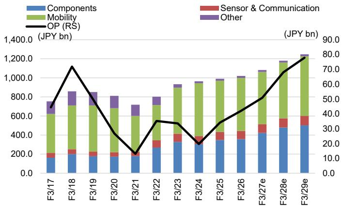  
Note: MSe/e = MS estimates, Ce = Company estimates  
Source: Company data, MS

■ Alps Alpine: Consolidated OP and OP for camera actuators   
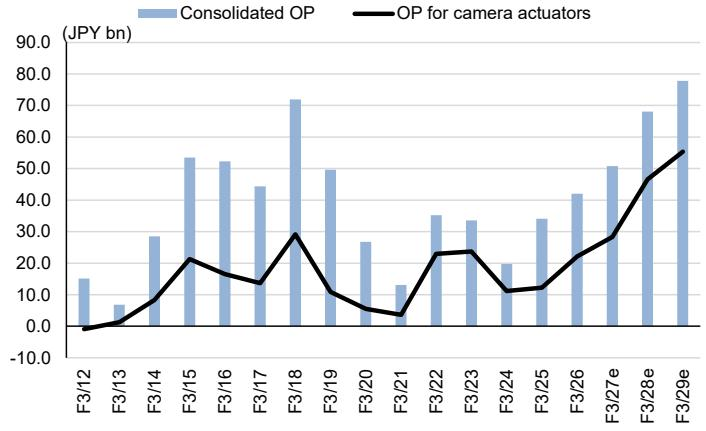

bar_line

| Fiscal Year | Consolidated OP (JPY bn) | OP for camera actuators (JPY bn) |
|-------------|---------------------------|----------------------------------|
| F3/12       | 15                        | -                                |
| F3/13       | 5                         | -                                |
| F3/14       | 28                        | 10                               |
| F3/15       | 53                        | 20                               |
| F3/16       | 52                        | 15                               |
| F3/17       | 44                        | 12                               |
| F3/18       | 72                        | 28                               |
| F3/19       | 50                        | 10                               |
| F3/20       | 27                        | 5                                |
| F3/21       | 12                        | 2                                |
| F3/22       | 35                        | 22                               |
| F3/23       | 33                        | 23                               |
| F3/24       | 20                        | 10                               |
| F3/25       | 34                        | 12                               |
| F3/26       | 42                        | 20                               |
| F3/27e      | 50                        | 28                               |
| F3/28e      | 68                        | 45                               |
| F3/29e      | 78                        | 55                               |

# PWB Market

Global PWB market value   
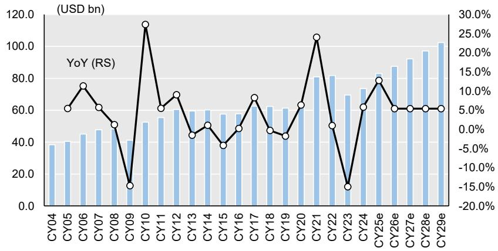

bar_line

| Year | Value (USD bn) | YoY (%) |
| :--- | :--- | :--- |
| CY04 | 38.0 | - |
| CY05 | 40.0 | 6.0 |
| CY06 | 45.0 | 12.0 |
| CY07 | 47.0 | 8.0 |
| CY08 | 50.0 | 5.0 |
| CY09 | 40.0 | -12.0 |
| CY10 | 52.0 | 28.0 |
| CY11 | 55.0 | 6.0 |
| CY12 | 60.0 | 10.0 |
| CY13 | 58.0 | 4.0 |
| CY14 | 60.0 | 5.0 |
| CY15 | 57.0 | -3.0 |
| CY16 | 56.0 | 4.0 |
| CY17 | 68.0 | 9.0 |
| CY18 | 62.0 | 3.0 |
| CY19 | 62.0 | 4.0 |
| CY20 | 82.0 | 7.0 |
| CY21 | 82.0 | 25.0 |
| CY22 | 70.0 | -15.0 |
| CY23 | 72.0 | 6.0 |
| CY24e | 82.0 | 12.0 |
| CY26e | 88.0 | 6.0 |
| CY27e | 92.0 | 6.0 |
| CY28e | 98.0 | 6.0 |
| CY29e | 102.0 | 6.0 |

■ Global PWB market value by composition   
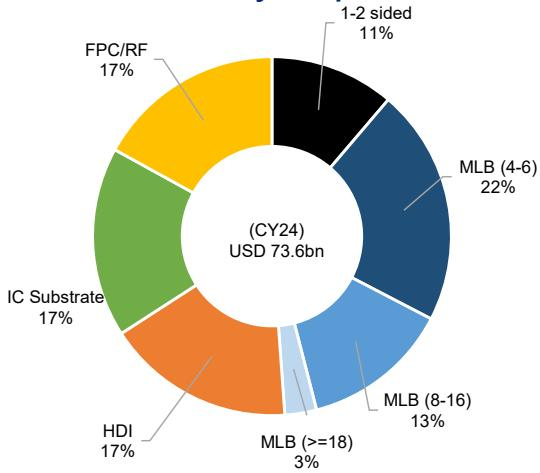

pie

(CY24) USD 73.6bn
| Category | Value (%) |
|---|---|
| 1-2 sided | 11 |
| MLB (4-6) | 22 |
| MLB (8-16) | 13 |
| MLB (>=18) | 3 |
| HDI | 17 |
| IC Substrate | 17 |
| FPC/RF | 17 |

Note: e = MS estimates   
Source: Prismark, MS

Global PWB market value by applications   
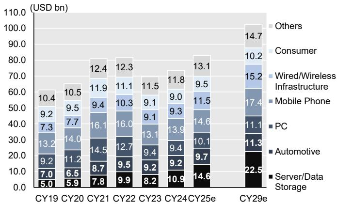

bar_stacked

| Year | PC (USD bn) | Automotive (USD bn) | Server/Data Storage (USD bn) | Mobile Phone (USD bn) | Wired/Wireless Infrastructure (USD bn) | Consumer (USD bn) | Others (USD bn) |
| :--- | :--- | :--- | :--- | :--- | :--- | :--- | :--- |
| CY19 | 7.0 | 5.0 | 5.0 | 9.2 | 7.3 | 9.2 | 10.4 |
| CY20 | 6.5 | 5.9 | 6.5 | 11.2 | 7.7 | 9.5 | 10.5 |
| CY21 | 7.8 | 8.7 | 7.8 | 14.5 | 9.4 | 11.9 | 12.4 |
| CY22 | 9.9 | 9.5 | 9.9 | 12.7 | 16.0 | 10.3 | 12.3 |
| CY23 | 8.2 | 9.2 | 8.2 | 9.4 | 9.1 | 9.1 | 11.5 |
| CY24 | 10.9 | 9.2 | 10.9 | 9.4 | 9.3 | 9.0 | 11.8 |
| CY25e | 14.6 | 9.7 | 14.6 | 10.1 | 11.5 | 9.5 | 13.1 |
| CY29e | 22.5 | 11.3 | 22.5 | 11.1 | 17.4 | 10.2 | 14.7 |
Others: PC, Automotive, Server/Data Storage; Wired/Wireless Infrastructure; Mobile Phone; Consumer; Others.

■ Major composition by application

<table><tr><td>Usage/Product</td><td>1-2 sided</td><td>MLB</td><td>HDI</td><td>Flexible/Rigid-flex</td><td>IC Substrate</td></tr><tr><td>Server/Computer</td><td>○</td><td>○ (4-16)</td><td>○</td><td>○</td><td>○</td></tr><tr><td>Automotive</td><td>○</td><td>○ (4-8)</td><td>○</td><td></td><td></td></tr><tr><td>Mobile</td><td></td><td>○ (4-12)</td><td>○</td><td>○</td><td>○</td></tr><tr><td>Consumer electronics</td><td>○</td><td>○ (4-6)</td><td>○</td><td></td><td></td></tr><tr><td>5G</td><td></td><td>○ (20-26)</td><td></td><td></td><td></td></tr><tr><td>Industrial</td><td>○</td><td>○ (4-16)</td><td>○</td><td></td><td></td></tr><tr><td>Medical</td><td>○</td><td>○ (-20)</td><td>○</td><td></td><td></td></tr><tr><td>Aerospace/Military</td><td>○</td><td>○ (4-6)</td><td></td><td></td><td></td></tr><tr><td>IC Packaging</td><td></td><td></td><td></td><td></td><td>○</td></tr></table>

# Meiko Electronics: Medium-term Results and Forecasts

<table><tr><td>(JPY bn)</td><td>F3/21</td><td>F3/22</td><td>F3/23</td><td>F3/24</td><td>F3/25</td><td>F3/26</td><td>F3/27e</td><td>(F3/27Ce)</td><td>F3/28e</td><td>F3/29e</td></tr><tr><td>Sales</td><td>119.3</td><td>151.3</td><td>167.3</td><td>179.5</td><td>206.8</td><td>240.6</td><td>305.1</td><td>320.0</td><td>368.7</td><td>429.5</td></tr><tr><td>Automotive</td><td>52.3</td><td>73.2</td><td>84.5</td><td>94.7</td><td>90.4</td><td>97.5</td><td>99.8</td><td>97.5</td><td>102.9</td><td>106.2</td></tr><tr><td>Smartphone/Tablet</td><td>28.8</td><td>33.2</td><td>26.6</td><td>23.6</td><td>25.5</td><td>29.4</td><td>30.6</td><td>37.0</td><td>54.3</td><td>70.6</td></tr><tr><td>Satellite communications</td><td>-</td><td>-</td><td>-</td><td>7.6</td><td>16.6</td><td>28.2</td><td>57.9</td><td>55.0</td><td>72.4</td><td>82.9</td></tr><tr><td>Module/AI server*</td><td>5.0</td><td>6.8</td><td>9.9</td><td>8.5</td><td>13.4</td><td>16.5</td><td>22.0</td><td>30.0</td><td>25.2</td><td>28.9</td></tr><tr><td>Amusement/Smart appliance/Others</td><td>-</td><td>-</td><td>-</td><td>14.1</td><td>23.7</td><td>24.4</td><td>30.2</td><td>29.0</td><td>44.6</td><td>66.7</td></tr><tr><td>Electronic equipment</td><td>11.6</td><td>12.6</td><td>20.3</td><td>30.3</td><td>36.2</td><td>42.6</td><td>60.1</td><td>66.0</td><td>63.7</td><td>67.5</td></tr><tr><td>Semi Package</td><td>0.0</td><td>0.0</td><td>0.4</td><td>0.7</td><td>1.0</td><td>2.0</td><td>3.0</td><td>3.0</td><td>4.0</td><td>5.0</td></tr><tr><td>OP</td><td>6.7</td><td>13.3</td><td>9.6</td><td>11.7</td><td>19.1</td><td>24.6</td><td>33.6</td><td>38.0</td><td>45.5</td><td>57.4</td></tr><tr><td>OPM</td><td>5.6%</td><td>8.8%</td><td>5.7%</td><td>6.5%</td><td>9.2%</td><td>10.2%</td><td>11.0%</td><td>11.9%</td><td>12.3%</td><td>13.4%</td></tr><tr><td>ROE</td><td>12.8%</td><td>23.2%</td><td>13.0%</td><td>12.9%</td><td>14.5%</td><td>16.2%</td><td>18.2%</td><td>-</td><td>21.0%</td><td>22.1%</td></tr></table>

Note: Ce=Company guidance, e=MS estimates; \*SSD/IoT segment until F3/23
Source: Company data, MS

HDD Market by Company (Quarterly, Fiscal Year) 

<table><tr><td rowspan="2">(mn units)</td><td colspan="3">CY23</td><td colspan="3">CY24</td><td colspan="3">CY25</td><td colspan="3">CY26</td><td>CY14</td><td rowspan="2">CY15</td><td rowspan="2">CY16</td><td rowspan="2">CY17</td><td rowspan="2">CY18</td><td rowspan="2">CY19</td><td rowspan="2">CY20</td><td rowspan="2">CY21</td><td rowspan="2">CY22</td><td rowspan="2">CY23</td><td rowspan="2">CY24</td><td rowspan="2">CY25</td><td rowspan="2">CY26e</td><td rowspan="2">CY27e</td><td rowspan="2">CY28e</td></tr><tr><td>1Q</td><td>2Q</td><td>3Q</td><td>4Q</td><td>1Q</td><td>2Q</td><td>3Q</td><td>4Q</td><td>1Q</td><td>2Q</td><td>3Q</td><td>4Q</td><td>1Q</td></tr><tr><td colspan="28">HDD Shipment (by Size)</td></tr><tr><td>Total</td><td>33.5</td><td>31.3</td><td>28.6</td><td>28.9</td><td>29.7</td><td>30.3</td><td>32.1</td><td>31.7</td><td>28.7</td><td>30.4</td><td>31.6</td><td>33.0</td><td>33.0</td><td>564.1</td><td>468.8</td><td>423.9</td><td>403.1</td><td>375.4</td><td>317.7</td><td>260.0</td><td>259.3</td><td>172.2</td><td>122.3</td><td>123.9</td><td>123.8</td><td>126.8</td><td>125.7</td></tr><tr><td>Enterprise</td><td>1.4</td><td>1.6</td><td>1.4</td><td>1.4</td><td>1.5</td><td>1.0</td><td>1.0</td><td>0.9</td><td>0.8</td><td>0.8</td><td>0.7</td><td>0.8</td><td>0.8</td><td>32.4</td><td>32.1</td><td>24.8</td><td>22.6</td><td>21.5</td><td>17.4</td><td>12.9</td><td>13.4</td><td>8.4</td><td>5.8</td><td>4.4</td><td>3.2</td><td>2.3</td><td>1.5</td></tr><tr><td>NL</td><td>11.4</td><td>9.2</td><td>9.0</td><td>9.9</td><td>12.3</td><td>13.8</td><td>15.9</td><td>16.5</td><td>14.6</td><td>16.5</td><td>17.3</td><td>19.20</td><td>18.7</td><td>36.9</td><td>37.2</td><td>41.0</td><td>42.4</td><td>51.3</td><td>52.7</td><td>59.1</td><td>73.5</td><td>61.5</td><td>39.4</td><td>58.6</td><td>67.6</td><td>75.5</td><td>79.6</td></tr><tr><td>3.5&quot;ATA</td><td>11.2</td><td>12.1</td><td>11.2</td><td>10.7</td><td>9.3</td><td>9.4</td><td>9.0</td><td>7.9</td><td>7.6</td><td>7.9</td><td>8.0</td><td>7.6</td><td>8.3</td><td>202.6</td><td>161.0</td><td>142.9</td><td>135.4</td><td>120.5</td><td>103.9</td><td>87.0</td><td>89.9</td><td>55.0</td><td>45.2</td><td>35.6</td><td>30.9</td><td>28.8</td><td>27.6</td></tr><tr><td>2.5&quot;</td><td>9.5</td><td>8.4</td><td>7.1</td><td>6.9</td><td>6.6</td><td>6.1</td><td>6.2</td><td>6.4</td><td>5.7</td><td>5.3</td><td>5.6</td><td>5.5</td><td>5.3</td><td>291.7</td><td>238.6</td><td>215.1</td><td>202.7</td><td>182.0</td><td>143.6</td><td>101.0</td><td>82.5</td><td>46.3</td><td>32.0</td><td>25.3</td><td>22.0</td><td>20.3</td><td>17.1</td></tr><tr><td>1.8&quot;</td><td>0.0</td><td>0.0</td><td>0.0</td><td>0.0</td><td>0.0</td><td>0.0</td><td>0.0</td><td>0.0</td><td>0.0</td><td>0.0</td><td>0.0</td><td>0.0</td><td>0.0</td><td>0.6</td><td>0.0</td><td>0.0</td><td>0.0</td><td>0.0</td><td>0.0</td><td>0.0</td><td>0.0</td><td>0.0</td><td>0.0</td><td>0.0</td><td>0.0</td><td>0.0</td><td>0.0</td></tr><tr><td>YoY % Change</td><td>-37%</td><td>-30%</td><td>-26%</td><td>-20%</td><td>-11%</td><td>-3%</td><td>12%</td><td>10%</td><td>-3%</td><td>0%</td><td>-2%</td><td>4%</td><td>15%</td><td>2%</td><td>-17%</td><td>-10%</td><td>-5%</td><td>-7%</td><td>-15%</td><td>-18%</td><td>0%</td><td>-33.6%</td><td>-29%</td><td>1%</td><td>0%</td><td>2%</td><td>-1%</td></tr><tr><td>Enterprise</td><td>-48%</td><td>-34%</td><td>-15%</td><td>-16%</td><td>6%</td><td>-36%</td><td>-30%</td><td>-33%</td><td>-45%</td><td>-21%</td><td>-23%</td><td>-16%</td><td>-7%</td><td>2%</td><td>-1%</td><td>-23%</td><td>-9%</td><td>-5%</td><td>-19%</td><td>-26%</td><td>3%</td><td>-37%</td><td>-32%</td><td>-23%</td><td>-29%</td><td>-28%</td><td>-36%</td></tr><tr><td>NL</td><td>-39%</td><td>-49%</td><td>-37%</td><td>-7%</td><td>8%</td><td>51%</td><td>78%</td><td>67%</td><td>19%</td><td>19%</td><td>9%</td><td>16%</td><td>28%</td><td>4%</td><td>1%</td><td>10%</td><td>3%</td><td>21%</td><td>3%</td><td>12%</td><td>24%</td><td>-16.3%</td><td>-36%</td><td>49%</td><td>15.5%</td><td>11.6%</td><td>5.4%</td></tr><tr><td>3.5&quot;ATA</td><td>-33%</td><td>-4%</td><td>-14%</td><td>-16%</td><td>-16%</td><td>-22%</td><td>-19%</td><td>-26%</td><td>-19%</td><td>-17%</td><td>-12%</td><td>-4%</td><td>9%</td><td>0%</td><td>-21%</td><td>-11%</td><td>-5%</td><td>-11%</td><td>-14%</td><td>-16%</td><td>3%</td><td>-39%</td><td>-18%</td><td>-21%</td><td>-13%</td><td>-7%</td><td>-4%</td></tr><tr><td>2.5&quot;</td><td>-36%</td><td>-20%</td><td>-26%</td><td>-39%</td><td>-30%</td><td>-28%</td><td>-13%</td><td>-7%</td><td>-14%</td><td>-13%</td><td>-10%</td><td>-14%</td><td>-7%</td><td>4%</td><td>-18%</td><td>-10%</td><td>-6%</td><td>-10%</td><td>-21%</td><td>-30%</td><td>-18%</td><td>-44%</td><td>-31%</td><td>-21%</td><td>-13%</td><td>-8%</td><td>-16%</td></tr><tr><td>1.8&quot;</td><td></td><td></td><td></td><td></td><td></td><td></td><td></td><td></td><td></td><td></td><td></td><td></td><td></td><td>-6%</td><td>-98%</td><td></td><td></td><td></td><td></td><td></td><td></td><td></td><td></td><td></td><td></td><td></td><td></td></tr><tr><td>Sequential % Change</td><td>-8%</td><td>-7%</td><td>-9%</td><td>1%</td><td>3%</td><td>2%</td><td>6%</td><td>-1%</td><td>-10%</td><td>6%</td><td>4%</td><td>5%</td><td>0%</td><td></td><td></td><td></td><td></td><td></td><td></td><td></td><td></td><td></td><td></td><td></td><td></td><td></td><td></td></tr><tr><td>Enterprise</td><td>-16%</td><td>13%</td><td>-16%</td><td>4%</td><td>7%</td><td>-32%</td><td>-7%</td><td>-1%</td><td>-13%</td><td>-1%</td><td>-10%</td><td>8%</td><td>-4%</td><td></td><td></td><td></td><td></td><td></td><td></td><td></td><td></td><td></td><td></td><td></td><td></td><td></td><td></td></tr><tr><td>NL</td><td>8%</td><td>-20%</td><td>-2%</td><td>11%</td><td>24%</td><td>12%</td><td>15%</td><td>4%</td><td>-12%</td><td>13%</td><td>5%</td><td>11%</td><td>-3%</td><td></td><td></td><td></td><td></td><td></td><td></td><td></td><td></td><td></td><td></td><td></td><td></td><td></td><td></td></tr><tr><td>3.5&quot;ATA</td><td>-13%</td><td>9%</td><td>-7%</td><td>-4%</td><td>-13%</td><td>1%</td><td>-4%</td><td>-13%</td><td>-4%</td><td>4%</td><td>2%</td><td>-5%</td><td>10%</td><td></td><td></td><td></td><td></td><td></td><td></td><td></td><td></td><td></td><td></td><td></td><td></td><td></td><td></td></tr><tr><td>2.5&quot;</td><td>-16%</td><td>-11%</td><td>-16%</td><td>-3%</td><td>-4%</td><td>-8%</td><td>2%</td><td>3%</td><td>-11%</td><td>-8%</td><td>6%</td><td>-1%</td><td>-3%</td><td></td><td></td><td></td><td></td><td></td><td></td><td></td><td></td><td></td><td></td><td></td><td></td><td></td><td></td></tr><tr><td>1.8&quot;</td><td></td><td></td><td></td><td></td><td></td><td></td><td></td><td></td><td></td><td></td><td></td><td></td><td></td><td></td><td></td><td></td><td></td><td></td><td></td><td></td><td></td><td></td><td></td><td></td><td></td><td></td><td></td></tr><tr><td>Enterprise</td><td>4%</td><td>5%</td><td>5%</td><td>5%</td><td>5%</td><td>3%</td><td>3%</td><td>3%</td><td>3%</td><td>3%</td><td>2%</td><td>2%</td><td>2%</td><td>6%</td><td>7%</td><td>6%</td><td>6%</td><td>6%</td><td>5%</td><td>5%</td><td>5%</td><td>5%</td><td>5%</td><td>4%</td><td>3%</td><td>2%</td><td>1%</td></tr><tr><td>NL</td><td>34%</td><td>29%</td><td>31%</td><td>34%</td><td>41%</td><td>46%</td><td>50%</td><td>52%</td><td>51%</td><td>54%</td><td>55%</td><td>58%</td><td>57%</td><td>7%</td><td>8%</td><td>10%</td><td>11%</td><td>14%</td><td>17%</td><td>23%</td><td>28%</td><td>36%</td><td>32%</td><td>47%</td><td>55%</td><td>60%</td><td>63%</td></tr><tr><td>3.5&quot;ATA</td><td>33%</td><td>39%</td><td>39%</td><td>37%</td><td>31%</td><td>31%</td><td>28%</td><td>25%</td><td>26%</td><td>26%</td><td>25%</td><td>23%</td><td>25%</td><td>36%</td><td>34%</td><td>34%</td><td>34%</td><td>32%</td><td>33%</td><td>33%</td><td>35%</td><td>32%</td><td>37%</td><td>29%</td><td>25%</td><td>23%</td><td>22%</td></tr><tr><td>2.5&quot;</td><td>28%</td><td>27%</td><td>25%</td><td>24%</td><td>22%</td><td>20%</td><td>19%</td><td>20%</td><td>20%</td><td>17%</td><td>18%</td><td>17%</td><td>16%</td><td>52%</td><td>51%</td><td>51%</td><td>50%</td><td>48%</td><td>45%</td><td>39%</td><td>32%</td><td>27%</td><td>26%</td><td>20%</td><td>18%</td><td>16%</td><td>14%</td></tr><tr><td>1.8&quot;</td><td>0%</td><td>0%</td><td>0%</td><td>0%</td><td>0%</td><td>0%</td><td>0%</td><td>0%</td><td>0%</td><td>0%</td><td>0%</td><td>0%</td><td>0%</td><td>0%</td><td>0%</td><td>0%</td><td>0%</td><td>0%</td><td>0%</td><td>0%</td><td>0%</td><td>0%</td><td>0%</td><td>0%</td><td>0%</td><td>0%</td><td>0%</td></tr></table>

Note: e = MS estimates   
Source: TSR, MS

HDD Head Market 

<table><tr><td rowspan="2">(mn units)</td><td colspan="3">CY23</td><td colspan="3">CY24</td><td colspan="5">CY25</td><td colspan="2">CY26</td></tr><tr><td>1Q</td><td>2Q</td><td>3Q</td><td>4Q</td><td>1Q</td><td>2Q</td><td>3Q</td><td>4Q</td><td>1Q</td><td>2Q</td><td>3Q</td><td>4Q</td><td>1Q</td></tr><tr><td colspan="14">HDD Head Shipment</td></tr><tr><td>Total</td><td>262.2</td><td>202.9</td><td>217.1</td><td>237.7</td><td>262.5</td><td>297.1</td><td>327.3</td><td>332.4</td><td>330.0</td><td>348.7</td><td>377.6</td><td>397.8</td><td>401.9</td></tr><tr><td>TDK</td><td>39.6</td><td>26.4</td><td>35.0</td><td>40.3</td><td>43.3</td><td>47.4</td><td>49.3</td><td>43.4</td><td>47.9</td><td>45.2</td><td>49.7</td><td>51.0</td><td>52.8</td></tr><tr><td>Seagate</td><td>118.8</td><td>92.1</td><td>86.9</td><td>101.7</td><td>103.3</td><td>116.1</td><td>132.8</td><td>140.7</td><td>128.3</td><td>140.8</td><td>155.1</td><td>165.2</td><td>165.4</td></tr><tr><td>Western Digital</td><td>103.8</td><td>84.4</td><td>95.2</td><td>95.7</td><td>115.9</td><td>133.6</td><td>145.2</td><td>148.3</td><td>153.8</td><td>162.7</td><td>172.8</td><td>181.6</td><td>183.7</td></tr><tr><td colspan="14">Market Share</td></tr><tr><td>TDK</td><td>15%</td><td>13%</td><td>16%</td><td>17%</td><td>16%</td><td>16%</td><td>15%</td><td>13%</td><td>15%</td><td>13%</td><td>13%</td><td>13%</td><td>13%</td></tr><tr><td>Seagate</td><td>45%</td><td>45%</td><td>40%</td><td>43%</td><td>39%</td><td>39%</td><td>41%</td><td>42%</td><td>39%</td><td>40%</td><td>41%</td><td>42%</td><td>41%</td></tr><tr><td>Western Digital</td><td>40%</td><td>42%</td><td>44%</td><td>40%</td><td>44%</td><td>45%</td><td>44%</td><td>45%</td><td>47%</td><td>47%</td><td>46%</td><td>46%</td><td>46%</td></tr><tr><td>YoY % Change</td><td>-38%</td><td>-47%</td><td>-33%</td><td>9%</td><td>0%</td><td>46%</td><td>51%</td><td>40%</td><td>26%</td><td>17%</td><td>15%</td><td>20%</td><td>22%</td></tr><tr><td>TDK</td><td>-45%</td><td>-53%</td><td>-41%</td><td>-5%</td><td>9%</td><td>80%</td><td>41%</td><td>8%</td><td>11%</td><td>-5%</td><td>1%</td><td>18%</td><td>10%</td></tr><tr><td>Seagate</td><td>-40%</td><td>-47%</td><td>-32%</td><td>26%</td><td>-13%</td><td>26%</td><td>53%</td><td>38%</td><td>24%</td><td>21%</td><td>17%</td><td>17%</td><td>29%</td></tr><tr><td>Western Digital</td><td>-33%</td><td>-44%</td><td>-31%</td><td>2%</td><td>12%</td><td>58%</td><td>53%</td><td>55%</td><td>33%</td><td>22%</td><td>19%</td><td>22%</td><td>19%</td></tr><tr><td>HDD Head/HDD</td><td>7.84</td><td>6.49</td><td>7.59</td><td>8.22</td><td>8.83</td><td>9.80</td><td>10.20</td><td>10.47</td><td>11.50</td><td>11.47</td><td>11.95</td><td>12.04</td><td>12.18</td></tr><tr><td colspan="14">TDK&#x27;s Head Shipment by Customer</td></tr><tr><td>Total</td><td>39.6</td><td>26.4</td><td>35.0</td><td>40.3</td><td>43.3</td><td>47.4</td><td>49.3</td><td>43.4</td><td>47.9</td><td>45.2</td><td>49.7</td><td>51.0</td><td>52.8</td></tr><tr><td>Seagate</td><td>4.3</td><td>3.7</td><td>1.0</td><td>0.3</td><td>0.1</td><td>0.1</td><td>0.1</td><td>0.0</td><td>0.0</td><td>0.0</td><td>0.0</td><td>0.0</td><td>0.2</td></tr><tr><td>Maxtor</td><td>0.0</td><td>0.0</td><td>0.0</td><td>0.0</td><td>0.0</td><td>0.0</td><td>0.0</td><td>0.0</td><td>0.0</td><td>0.0</td><td>0.0</td><td>0.0</td><td>0.0</td></tr><tr><td>HGST</td><td>2.9</td><td>2.0</td><td>0.2</td><td>0.0</td><td>0.0</td><td>0.0</td><td>0.0</td><td>0.0</td><td>0.0</td><td>0.0</td><td>0.0</td><td>0.0</td><td>0.7</td></tr><tr><td>Western Digital</td><td>0.0</td><td>0.0</td><td>0.0</td><td>0.0</td><td>0.0</td><td>0.0</td><td>0.0</td><td>0.0</td><td>0.0</td><td>0.0</td><td>0.0</td><td>0.0</td><td>0.0</td></tr><tr><td>Samsung</td><td>0.0</td><td>0.0</td><td>0.0</td><td>0.0</td><td>0.0</td><td>0.0</td><td>0.0</td><td>0.0</td><td>0.0</td><td>0.0</td><td>0.0</td><td>0.0</td><td>0.0</td></tr><tr><td>Toshiba</td><td>32.4</td><td>20.7</td><td>33.8</td><td>40.0</td><td>43.2</td><td>47.3</td><td>49.2</td><td>43.4</td><td>47.9</td><td>45.2</td><td>49.7</td><td>51.0</td><td>51.9</td></tr><tr><td>Fujitsu</td><td>0.0</td><td>0.0</td><td>0.0</td><td>0.0</td><td>0.0</td><td>0.0</td><td>0.0</td><td>0.0</td><td>0.0</td><td>0.0</td><td>0.0</td><td>0.0</td><td>0.0</td></tr><tr><td>Others</td><td>0.0</td><td>0.0</td><td>0.0</td><td>0.0</td><td>0.0</td><td>0.0</td><td>0.0</td><td>0.0</td><td>0.0</td><td>0.0</td><td>0.0</td><td>0.0</td><td>0.0</td></tr><tr><td colspan="14">TDK&#x27;s Shipment Share by Customer</td></tr><tr><td>Seagate</td><td>4%</td><td>4%</td><td>1%</td><td>0%</td><td>0%</td><td>0%</td><td>0%</td><td>0%</td><td>0%</td><td>0%</td><td>0%</td><td>0%</td><td>0%</td></tr><tr><td>Maxtor</td><td></td><td></td><td></td><td></td><td></td><td></td><td></td><td></td><td></td><td></td><td></td><td></td><td></td></tr><tr><td>HGST</td><td>3%</td><td>3%</td><td>0%</td><td>0%</td><td>0%</td><td>0%</td><td>0%</td><td>0%</td><td>0%</td><td>0%</td><td>0%</td><td>0%</td><td>0%</td></tr><tr><td>Western Digital</td><td>0%</td><td>0%</td><td>0%</td><td>0%</td><td>0%</td><td>0%</td><td>0%</td><td>0%</td><td>0%</td><td>0%</td><td>0%</td><td>0%</td><td>0%</td></tr><tr><td>Samsung</td><td></td><td></td><td></td><td></td><td></td><td></td><td></td><td></td><td></td><td></td><td></td><td></td><td></td></tr><tr><td>Toshiba</td><td>100%</td><td>100%</td><td>100%</td><td>100%</td><td>100%</td><td>100%</td><td>100%</td><td>100%</td><td>100%</td><td>100%</td><td>100%</td><td>100%</td><td>100%</td></tr><tr><td>Fujitsu</td><td>-</td><td>-</td><td>-</td><td>-</td><td>-</td><td>-</td><td>-</td><td>-</td><td>-</td><td>-</td><td>-</td><td>-</td><td>-</td></tr><tr><td>Others</td><td>-</td><td>-</td><td>-</td><td>-</td><td>-</td><td>-</td><td>-</td><td>-</td><td>-</td><td>-</td><td>-</td><td>-</td><td>-</td></tr><tr><td>YoY % Change</td><td>-45%</td><td>-53%</td><td>-41%</td><td>-5%</td><td>9%</td><td>80%</td><td>41%</td><td>8%</td><td>11%</td><td>-5%</td><td>1%</td><td>18%</td><td>10%</td></tr><tr><td>Sequential % Change</td><td>-7%</td><td>-33%</td><td>33%</td><td>15%</td><td>7%</td><td>9%</td><td>4%</td><td>-12%</td><td>10%</td><td>-6%</td><td>10%</td><td>3%</td><td>4%</td></tr></table>

<table><tr><td>CY14</td><td>CY15</td><td>CY16</td><td>CY17</td><td>CY18</td><td>CY19</td><td>CY20</td><td>CY21</td><td>CY22</td><td>CY23</td><td>CY24</td><td>CY25</td></tr><tr><td>1,931.6</td><td>1,756.1</td><td>1,702.8</td><td>1,714.4</td><td>1,715.4</td><td>1,496.2</td><td>1,517.9</td><td>1,747.9</td><td>1,349.0</td><td>919.9</td><td>1,219.3</td><td>1,454.1</td></tr><tr><td>471.6</td><td>376.0</td><td>375.0</td><td>361.9</td><td>330.2</td><td>299.6</td><td>254.4</td><td>338.2</td><td>230.8</td><td>141.3</td><td>183.4</td><td>193.8</td></tr><tr><td>634.0</td><td>616.2</td><td>617.1</td><td>636.6</td><td>683.5</td><td>594.1</td><td>652.2</td><td>755.2</td><td>579.1</td><td>399.5</td><td>492.9</td><td>589.4</td></tr><tr><td>826.0</td><td>763.9</td><td>710.7</td><td>715.9</td><td>701.7</td><td>602.5</td><td>611.3</td><td>654.5</td><td>539.1</td><td>379.1</td><td>543.0</td><td>670.9</td></tr><tr><td colspan="12"></td></tr><tr><td>24%</td><td>21%</td><td>22%</td><td>21%</td><td>19%</td><td>20%</td><td>17%</td><td>19%</td><td>17%</td><td>15%</td><td>15%</td><td>13%</td></tr><tr><td>33%</td><td>35%</td><td>36%</td><td>37%</td><td>40%</td><td>40%</td><td>43%</td><td>43%</td><td>43%</td><td>43%</td><td>40%</td><td>41%</td></tr><tr><td>43%</td><td>43%</td><td>42%</td><td>42%</td><td>41%</td><td>40%</td><td>40%</td><td>37%</td><td>40%</td><td>41%</td><td>45%</td><td>46%</td></tr><tr><td colspan="12"></td></tr><tr><td>0%</td><td>-9%</td><td>-3%</td><td>1%</td><td>0%</td><td>-13%</td><td>1%</td><td>15%</td><td>-23%</td><td>-32%</td><td>33%</td><td>19%</td></tr><tr><td>-3%</td><td>-20%</td><td>0%</td><td>-3%</td><td>-9%</td><td>-9%</td><td>-15%</td><td>33%</td><td>-32%</td><td>-39%</td><td>30%</td><td>6%</td></tr><tr><td>1%</td><td>-3%</td><td>0%</td><td>3%</td><td>7%</td><td>-13%</td><td>10%</td><td>16%</td><td>-23%</td><td>-31%</td><td>23%</td><td>20%</td></tr><tr><td>2%</td><td>-8%</td><td>-7%</td><td>1%</td><td>-2%</td><td>-14%</td><td>1%</td><td>7%</td><td>-18%</td><td>-30%</td><td>43%</td><td>24%</td></tr><tr><td colspan="12"></td></tr><tr><td>3.42</td><td>3.75</td><td>4.02</td><td>4.25</td><td>4.57</td><td>4.71</td><td>5.84</td><td>6.74</td><td>7.83</td><td>7.52</td><td>9.84</td><td>11.75</td></tr><tr><td colspan="12"></td></tr><tr><td>471.6</td><td>376.0</td><td>375.0</td><td>361.9</td><td>330.2</td><td>299.6</td><td>254.4</td><td>338.2</td><td>230.8</td><td>141.3</td><td>183.4</td><td>193.8</td></tr><tr><td>17.4</td><td>14.0</td><td>25.7</td><td>24.0</td><td>41.3</td><td>51.7</td><td>43.1</td><td>45.5</td><td>28.1</td><td>9.3</td><td>0.3</td><td>0.0</td></tr><tr><td>0.0</td><td>0.0</td><td>0.0</td><td>0.0</td><td>0.0</td><td>0.0</td><td>0.0</td><td>0.0</td><td>0.0</td><td>0.0</td><td>0.0</td><td>0.0</td></tr><tr><td>13.1</td><td>16.0</td><td>11.9</td><td>21.5</td><td>22.6</td><td>1.4</td><td>0.0</td><td>4.8</td><td>7.6</td><td>5.1</td><td>0.0</td><td>0.0</td></tr><tr><td>43.7</td><td>17.5</td><td>16.2</td><td>12.2</td><td>5.7</td><td>1.4</td><td>0.0</td><td>0.0</td><td>0.0</td><td>0.0</td><td>0.0</td><td>0.0</td></tr><tr><td>130.2</td><td>86.0</td><td>21.4</td><td>0.0</td><td>0.0</td><td>0.0</td><td>0.0</td><td>0.0</td><td>0.0</td><td>0.0</td><td>0.0</td><td>0.0</td></tr><tr><td>267.2</td><td>242.5</td><td>299.8</td><td>304.2</td><td>260.6</td><td>245.1</td><td>211.3</td><td>287.9</td><td>195.1</td><td>126.9</td><td>183.1</td><td>193.8</td></tr><tr><td>0.0</td><td>0.0</td><td>0.0</td><td>0.0</td><td>0.0</td><td>0.0</td><td>0.0</td><td>0.0</td><td>0.0</td><td>0.0</td><td>0.0</td><td>0.0</td></tr><tr><td>0.0</td><td>0.0</td><td>0.0</td><td>0.0</td><td>0.0</td><td>0.0</td><td>0.0</td><td>0.0</td><td>0.0</td><td>0.0</td><td>0.0</td><td>0.0</td></tr><tr><td colspan="12"></td></tr><tr><td>3%</td><td>2%</td><td>4%</td><td>4%</td><td>6%</td><td>8%</td><td>6%</td><td>6%</td><td>5%</td><td>2%</td><td>0%</td><td>0%</td></tr><tr><td>-</td><td>-</td><td>-</td><td>-</td><td>-</td><td>-</td><td>-</td><td>-</td><td>-</td><td>-</td><td>-</td><td>-</td></tr><tr><td>4%</td><td>5%</td><td>3%</td><td>6%</td><td>6%</td><td>0%</td><td>0%</td><td>1%</td><td>2%</td><td>2%</td><td>0%</td><td>0%</td></tr><tr><td>8%</td><td>4%</td><td>4%</td><td>3%</td><td>2%</td><td>1%</td><td>0%</td><td>0%</td><td>0%</td><td>0%</td><td>0%</td><td>0%</td></tr><tr><td>-</td><td>-</td><td>-</td><td>-</td><td>-</td><td>-</td><td>-</td><td>-</td><td>-</td><td>-</td><td>-</td><td>-</td></tr><tr><td>100%</td><td>100%</td><td>100%</td><td>100%</td><td>100%</td><td>100%</td><td>100%</td><td>100%</td><td>100%</td><td>100%</td><td>100%</td><td>100%</td></tr><tr><td>-</td><td>-</td><td>-</td><td>-</td><td>-</td><td>-</td><td>-</td><td>-</td><td>-</td><td>-</td><td>-</td><td>-</td></tr><tr><td>-</td><td>-</td><td>-</td><td>-</td><td>-</td><td>-</td><td>-</td><td>-</td><td>-</td><td>-</td><td>-</td><td>-</td></tr><tr><td>-3%</td><td>-20%</td><td>0%</td><td>-3%</td><td>-9%</td><td>-9%</td><td>-15%</td><td>33%</td><td>-32%</td><td>-39%</td><td>30%</td><td>6%</td></tr></table>

Note: e = MS estimates

Source: TSR, MS

HDD Motor Market 

<table><tr><td rowspan="2">(mn units)</td><td colspan="3">CY23</td><td colspan="3">CY24</td><td colspan="5">CY25</td><td colspan="2">CY25</td></tr><tr><td>1Q</td><td>2Q</td><td>3Q</td><td>4Q</td><td>1Q</td><td>2Q</td><td>3Q</td><td>4Q</td><td>1Q</td><td>2Q</td><td>3Q</td><td>4Q</td><td>1Q</td></tr><tr><td colspan="14">HDD Motor Shipment</td></tr><tr><td>Total</td><td>34.2</td><td>27.2</td><td>31.6</td><td>29.5</td><td>30.5</td><td>32.7</td><td>33.2</td><td>32.6</td><td>30.8</td><td>31.7</td><td>32.5</td><td>34.3</td><td>34.0</td></tr><tr><td>Nidec</td><td>19.2</td><td>13.2</td><td>19.1</td><td>17.4</td><td>18.6</td><td>18.9</td><td>19.3</td><td>19.2</td><td>18.8</td><td>18.8</td><td>20.0</td><td>20.2</td><td>20.4</td></tr><tr><td>Minebea Mitsumi</td><td>15.0</td><td>14.0</td><td>12.5</td><td>12.1</td><td>11.9</td><td>13.8</td><td>13.9</td><td>13.4</td><td>12.0</td><td>12.9</td><td>12.5</td><td>14.1</td><td>13.6</td></tr><tr><td colspan="14">Market Share</td></tr><tr><td>Nidec</td><td>56%</td><td>49%</td><td>60%</td><td>59%</td><td>61%</td><td>58%</td><td>58%</td><td>59%</td><td>61%</td><td>59%</td><td>62%</td><td>59%</td><td>60%</td></tr><tr><td>Minebea Mitsumi</td><td>44%</td><td>51%</td><td>40%</td><td>41%</td><td>39%</td><td>42%</td><td>42%</td><td>41%</td><td>39%</td><td>41%</td><td>38%</td><td>41%</td><td>40%</td></tr><tr><td>YoY % Change</td><td>-32%</td><td>-27%</td><td>2%</td><td>8%</td><td>-11%</td><td>20%</td><td>5%</td><td>11%</td><td>1%</td><td>-3%</td><td>-2%</td><td>5%</td><td>10%</td></tr><tr><td>Nidec</td><td>-25%</td><td>-30%</td><td>3%</td><td>-9%</td><td>-3%</td><td>43%</td><td>1%</td><td>10%</td><td>1%</td><td>-1%</td><td>4%</td><td>5%</td><td>9%</td></tr><tr><td>Minebea Mitsumi</td><td>-40%</td><td>-25%</td><td>1%</td><td>49%</td><td>-21%</td><td>-1%</td><td>11%</td><td>11%</td><td>1%</td><td>-7%</td><td>-10%</td><td>5%</td><td>13%</td></tr><tr><td>Sequential % Change</td><td>25%</td><td>-20%</td><td>16%</td><td>-7%</td><td>3%</td><td>7%</td><td>2%</td><td>-2%</td><td>-6%</td><td>3%</td><td>3%</td><td>6%</td><td>-1%</td></tr><tr><td>Nidec</td><td>0%</td><td>-31%</td><td>45%</td><td>-9%</td><td>7%</td><td>2%</td><td>2%</td><td>-1%</td><td>-2%</td><td>0%</td><td>6%</td><td>1%</td><td>1%</td></tr><tr><td>Minebea Mitsumi</td><td>85%</td><td>-7%</td><td>-11%</td><td>-3%</td><td>-2%</td><td>16%</td><td>1%</td><td>-4%</td><td>-10%</td><td>8%</td><td>-3%</td><td>13%</td><td>-4%</td></tr><tr><td>HDD Motor/HDD</td><td>1.02</td><td>0.87</td><td>1.10</td><td>1.02</td><td>1.03</td><td>1.08</td><td>1.03</td><td>1.03</td><td>1.07</td><td>1.04</td><td>1.03</td><td>1.04</td><td>1.03</td></tr><tr><td colspan="14">Nidec&#x27;s Motor Shipment by Size</td></tr><tr><td>Total</td><td>19.2</td><td>13.2</td><td>19.1</td><td>17.4</td><td>18.6</td><td>18.9</td><td>19.3</td><td>19.2</td><td>18.8</td><td>18.8</td><td>20.0</td><td>20.2</td><td>20.4</td></tr><tr><td>Enterprise</td><td>0.6</td><td>0.5</td><td>0.7</td><td>0.8</td><td>0.8</td><td>0.4</td><td>0.3</td><td>0.4</td><td>0.4</td><td>0.4</td><td>0.4</td><td>0.4</td><td>0.4</td></tr><tr><td>NL</td><td>7.0</td><td>4.0</td><td>7.1</td><td>6.3</td><td>8.6</td><td>9.5</td><td>10.4</td><td>10.9</td><td>11.1</td><td>11.4</td><td>11.3</td><td>11.8</td><td>12.1</td></tr><tr><td>3.5&quot;ATA</td><td>5.9</td><td>4.6</td><td>6.0</td><td>5.4</td><td>5.2</td><td>4.7</td><td>4.3</td><td>3.7</td><td>3.4</td><td>3.6</td><td>4.3</td><td>4.3</td><td>4.5</td></tr><tr><td>2.5&quot;</td><td>5.7</td><td>4.1</td><td>5.3</td><td>4.9</td><td>4.0</td><td>4.3</td><td>4.3</td><td>4.2</td><td>3.9</td><td>3.4</td><td>4.0</td><td>3.7</td><td>3.5</td></tr><tr><td>1.8&quot;</td><td>0.0</td><td>0.0</td><td>0.0</td><td>0.0</td><td>0.0</td><td>0.0</td><td>0.0</td><td>0.0</td><td>0.0</td><td>0.0</td><td>0.0</td><td>0.0</td><td>0.0</td></tr><tr><td>1&quot;</td><td>0.0</td><td>0.0</td><td>0.0</td><td>0.0</td><td>0.0</td><td>0.0</td><td>0.0</td><td>0.0</td><td>0.0</td><td>0.0</td><td>0.0</td><td>0.0</td><td>0.0</td></tr><tr><td colspan="14">As % of Total</td></tr><tr><td>Enterprise</td><td>3%</td><td>4%</td><td>4%</td><td>5%</td><td>4%</td><td>2%</td><td>2%</td><td>2%</td><td>2%</td><td>2%</td><td>2%</td><td>2%</td><td>2%</td></tr><tr><td>NL</td><td>36%</td><td>30%</td><td>37%</td><td>36%</td><td>46%</td><td>50%</td><td>54%</td><td>57%</td><td>59%</td><td>61%</td><td>57%</td><td>58%</td><td>59%</td></tr><tr><td>3.5&quot;ATA</td><td>31%</td><td>35%</td><td>31%</td><td>31%</td><td>28%</td><td>25%</td><td>22%</td><td>19%</td><td>18%</td><td>19%</td><td>22%</td><td>21%</td><td>22%</td></tr><tr><td>2.5&quot;</td><td>30%</td><td>31%</td><td>28%</td><td>28%</td><td>22%</td><td>23%</td><td>22%</td><td>22%</td><td>21%</td><td>18%</td><td>20%</td><td>18%</td><td>17%</td></tr><tr><td>1.8&quot;</td><td>0%</td><td>0%</td><td>0%</td><td>0%</td><td>0%</td><td>0%</td><td>0%</td><td>0%</td><td>0%</td><td>0%</td><td>0%</td><td>0%</td><td>0%</td></tr><tr><td>1&quot;</td><td>0%</td><td>0%</td><td>0%</td><td>0%</td><td>0%</td><td>0%</td><td>0%</td><td>0%</td><td>0%</td><td>0%</td><td>0%</td><td>0%</td><td>0%</td></tr><tr><td>YoY % Change</td><td>-25%</td><td>-30%</td><td>3%</td><td>-9%</td><td>-3%</td><td>43%</td><td>1%</td><td>10%</td><td>1%</td><td>-1%</td><td>4%</td><td>5%</td><td>9%</td></tr><tr><td>Enterprise</td><td>-33%</td><td>0%</td><td>40%</td><td>-20%</td><td>33%</td><td>-20%</td><td>-57%</td><td>-50%</td><td>-50%</td><td>0%</td><td>33%</td><td>0%</td><td>0%</td></tr><tr><td>NL</td><td>-24%</td><td>-57%</td><td>6%</td><td>9%</td><td>23%</td><td>138%</td><td>46%</td><td>73%</td><td>29%</td><td>20%</td><td>9%</td><td>8%</td><td>9%</td></tr><tr><td>3.5&quot;ATA</td><td>-24%</td><td>-57%</td><td>6%</td><td>9%</td><td>23%</td><td>138%</td><td>46%</td><td>73%</td><td>29%</td><td>20%</td><td>9%</td><td>8%</td><td>9%</td></tr><tr><td>2.5&quot;</td><td>-34%</td><td>-10%</td><td>3%</td><td>-14%</td><td>-12%</td><td>2%</td><td>-28%</td><td>-31%</td><td>-35%</td><td>-23%</td><td>0%</td><td>16%</td><td>32%</td></tr><tr><td>Sequential % Change</td><td>0%</td><td>-31%</td><td>45%</td><td>-9%</td><td>7%</td><td>2%</td><td>2%</td><td>-1%</td><td>-2%</td><td>0%</td><td>6%</td><td>1%</td><td>1%</td></tr><tr><td>Enterprise</td><td>-40%</td><td>-17%</td><td>40%</td><td>14%</td><td>0%</td><td>-50%</td><td>-25%</td><td>33%</td><td>0%</td><td>0%</td><td>0%</td><td>0%</td><td>0%</td></tr><tr><td>NL</td><td>21%</td><td>-43%</td><td>78%</td><td>-11%</td><td>37%</td><td>10%</td><td>9%</td><td>5%</td><td>2%</td><td>3%</td><td>-1%</td><td>4%</td><td>3%</td></tr><tr><td>3.5&quot;ATA</td><td>21%</td><td>-43%</td><td>78%</td><td>-11%</td><td>37%</td><td>10%</td><td>9%</td><td>5%</td><td>2%</td><td>3%</td><td>-1%</td><td>4%</td><td>3%</td></tr><tr><td>2.5&quot;</td><td>-6%</td><td>-22%</td><td>30%</td><td>-10%</td><td>-4%</td><td>-10%</td><td>-9%</td><td>-14%</td><td>-8%</td><td>6%</td><td>19%</td><td>0%</td><td>5%</td></tr></table>

<table><tr><td>CY14</td><td>CY15</td><td>CY16</td><td>CY17</td><td>CY18</td><td>CY19</td><td>CY20</td><td>CY21</td><td>CY22</td><td>CY23</td><td>CY24</td><td>CY25</td></tr><tr><td>575.2</td><td>476.5</td><td>431.7</td><td>407.3</td><td>381.6</td><td>307.7</td><td>271.8</td><td>248.8</td><td>146.1</td><td>122.5</td><td>129.0</td><td>129.3</td></tr><tr><td>408.6</td><td>380.3</td><td>362.6</td><td>341.9</td><td>317.6</td><td>250.1</td><td>210.9</td><td>133.7</td><td>82.1</td><td>68.9</td><td>76.0</td><td>77.8</td></tr><tr><td>70.9</td><td>67.7</td><td>69.1</td><td>65.4</td><td>63.8</td><td>57.5</td><td>60.9</td><td>115.1</td><td>64.0</td><td>53.6</td><td>53.0</td><td>51.5</td></tr><tr><td>71%</td><td>80%</td><td>84%</td><td>84%</td><td>83%</td><td>81%</td><td>78%</td><td>54%</td><td>56%</td><td>56%</td><td>59%</td><td>60%</td></tr><tr><td>12%</td><td>14%</td><td>16%</td><td>16%</td><td>17%</td><td>19%</td><td>22%</td><td>46%</td><td>44%</td><td>44%</td><td>41%</td><td>40%</td></tr><tr><td>3%</td><td>-17%</td><td>-9%</td><td>-6%</td><td>-6%</td><td>-19%</td><td>-12%</td><td>-8%</td><td>-41%</td><td>-16%</td><td>5%</td><td>0%</td></tr><tr><td>4%</td><td>-7%</td><td>-5%</td><td>-6%</td><td>-7%</td><td>-21%</td><td>-16%</td><td>-37%</td><td>-39%</td><td>-16%</td><td>10%</td><td>2%</td></tr><tr><td>-4%</td><td>-5%</td><td>2%</td><td>-5%</td><td>-2%</td><td>-10%</td><td>6%</td><td>89%</td><td>-44%</td><td>-16%</td><td>-1%</td><td>-3%</td></tr><tr><td>-</td><td>-</td><td>-</td><td>-</td><td>-</td><td>-</td><td>-</td><td>-</td><td>-</td><td>-</td><td>-</td><td>-</td></tr><tr><td>-</td><td>-</td><td>-</td><td>-</td><td>-</td><td>-</td><td>-</td><td>-</td><td>-</td><td>-</td><td>-</td><td>-</td></tr><tr><td>-</td><td>-</td><td>-</td><td>-</td><td>-</td><td>-</td><td>-</td><td>-</td><td>-</td><td>-</td><td>-</td><td>-</td></tr><tr><td>1.02</td><td>1.02</td><td>1.02</td><td>1.01</td><td>1.02</td><td>0.97</td><td>1.05</td><td>0.96</td><td>0.85</td><td>1.00</td><td>1.04</td><td>1.04</td></tr><tr><td>408.6</td><td>380.3</td><td>362.6</td><td>341.9</td><td>317.6</td><td>250.1</td><td>210.9</td><td>133.7</td><td>82.1</td><td>68.9</td><td>76.0</td><td>77.8</td></tr><tr><td>23.1</td><td>22.4</td><td>15.0</td><td>14.9</td><td>13.0</td><td>7.3</td><td>4.6</td><td>3.4</td><td>2.9</td><td>2.6</td><td>1.9</td><td>1.6</td></tr><tr><td>28.6</td><td>31.9</td><td>32.5</td><td>39.2</td><td>50.0</td><td>48.6</td><td>59.7</td><td>41.8</td><td>31.0</td><td>24.4</td><td>39.4</td><td>45.6</td></tr><tr><td>146.4</td><td>143.1</td><td>134.2</td><td>124.6</td><td>108.2</td><td>87.6</td><td>76.7</td><td>45.2</td><td>26.2</td><td>21.9</td><td>17.9</td><td>15.6</td></tr><tr><td>210.2</td><td>209.2</td><td>180.9</td><td>163.2</td><td>146.5</td><td>106.9</td><td>69.9</td><td>43.5</td><td>22.2</td><td>20.0</td><td>16.8</td><td>15.0</td></tr><tr><td>0.6</td><td>0.4</td><td>-</td><td>-</td><td>-</td><td>-</td><td>-</td><td>-</td><td>-</td><td>-</td><td>-</td><td>-</td></tr><tr><td>0.0</td><td>0.0</td><td>-</td><td>-</td><td>-</td><td>-</td><td>-</td><td>-</td><td>-</td><td>-</td><td>-</td><td>-</td></tr><tr><td>6%</td><td>6%</td><td>4%</td><td>4%</td><td>4%</td><td>3%</td><td>2%</td><td>3%</td><td>4%</td><td>4%</td><td>3%</td><td>2%</td></tr><tr><td>7%</td><td>8%</td><td>9%</td><td>11%</td><td>16%</td><td>19%</td><td>28%</td><td>31%</td><td>38%</td><td>35%</td><td>52%</td><td>59%</td></tr><tr><td>36%</td><td>38%</td><td>37%</td><td>36%</td><td>34%</td><td>35%</td><td>36%</td><td>34%</td><td>32%</td><td>32%</td><td>24%</td><td>20%</td></tr><tr><td>51%</td><td>55%</td><td>50%</td><td>48%</td><td>46%</td><td>43%</td><td>33%</td><td>33%</td><td>27%</td><td>29%</td><td>22%</td><td>19%</td></tr><tr><td>0%</td><td>0%</td><td>-</td><td>-</td><td>-</td><td>-</td><td>-</td><td>-</td><td>-</td><td>-</td><td>-</td><td>-</td></tr><tr><td>0%</td><td>0%</td><td>-</td><td>-</td><td>-</td><td>-</td><td>-</td><td>-</td><td>-</td><td>-</td><td>-</td><td>-</td></tr><tr><td>4%</td><td>-7%</td><td>-5%</td><td>-6%</td><td>-7%</td><td>-21%</td><td>-16%</td><td>-37%</td><td>-39%</td><td>-16%</td><td>10%</td><td>2%</td></tr><tr><td>-3%</td><td>-3%</td><td>-33%</td><td>-1%</td><td>-13%</td><td>-44%</td><td>-37%</td><td>-26%</td><td>-15%</td><td>-10%</td><td>-27%</td><td>-16%</td></tr><tr><td>20%</td><td>12%</td><td>2%</td><td>21%</td><td>28%</td><td>-3%</td><td>23%</td><td>-30%</td><td>-26%</td><td>-21%</td><td>61%</td><td>16%</td></tr><tr><td>0%</td><td>-2%</td><td>-6%</td><td>-7%</td><td>-13%</td><td>-19%</td><td>-12%</td><td>-41%</td><td>-42%</td><td>-16%</td><td>-18%</td><td>-13%</td></tr><tr><td>6%</td><td>0%</td><td>-14%</td><td>-10%</td><td>-10%</td><td>-27%</td><td>-35%</td><td>-38%</td><td>-49%</td><td>-10%</td><td>-16%</td><td>-11%</td></tr><tr><td>-</td><td>-</td><td>-</td><td>-</td><td>-</td><td>-</td><td>-</td><td>-</td><td>-</td><td>-</td><td>-</td><td>-</td></tr><tr><td>-</td><td>-</td><td>-</td><td>-</td><td>-</td><td>-</td><td>-</td><td>-</td><td>-</td><td>-</td><td>-</td><td>-</td></tr><tr><td>-</td><td>-</td><td>-</td><td>-</td><td>-</td><td>-</td><td>-</td><td>-</td><td>-</td><td>-</td><td>-</td><td>-</td></tr></table>

Note: e = MS estimates   
Source: TSR, MS

Supply Chain of HDDs   
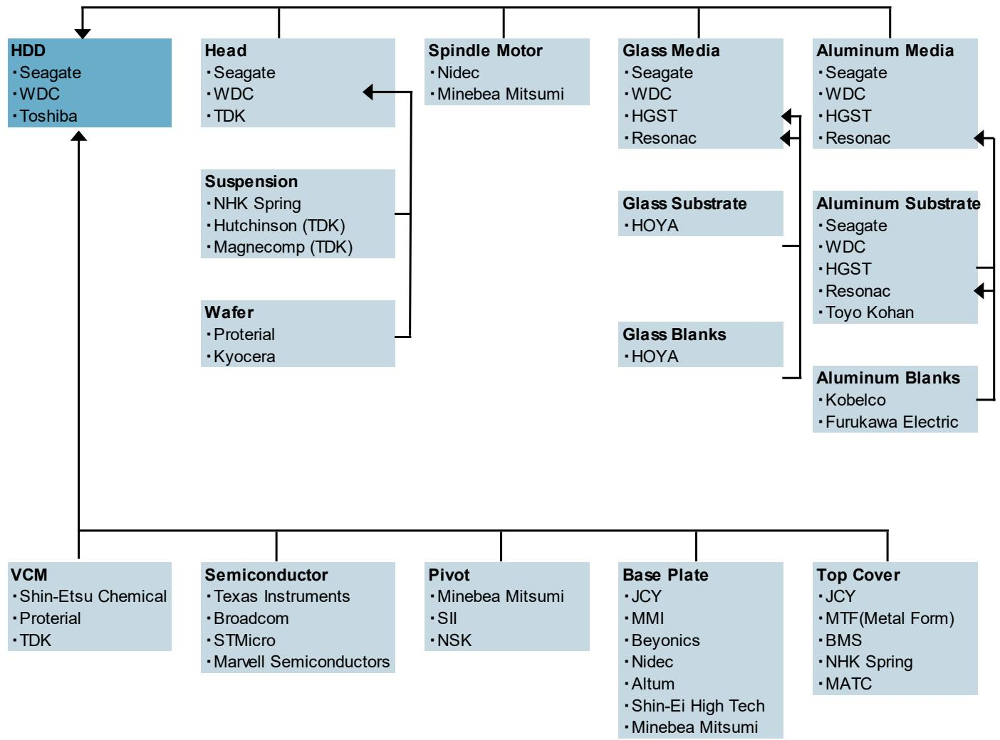

flowchart

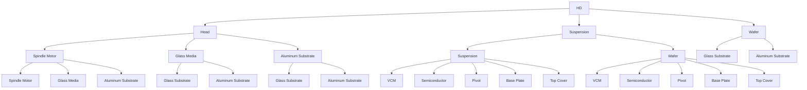
```mermaid
graph TD
    A["HD"] --> B["Head"]
    A --> C["Suspension"]
    A --> D["Wafer"]
    B --> E["Spindle Motor"]
    B --> F["Glass Media"]
    B --> G["Aluminum Substrate"]
    C --> H["Suspension"]
    C --> I["Wafer"]
    D --> J["Glass Substrate"]
    D --> K["Aluminum Substrate"]
    E --> L["Spindle Motor"]
    E --> M["Glass Media"]
    E --> N["Aluminum Substrate"]
    F --> O["Glass Substrate"]
    F --> P["Aluminum Substrate"]
    G --> Q["Glass Substrate"]
    G --> R["Aluminum Substrate"]
    H --> S["VCM"]
    H --> T["Semiconductor"]
    H --> U["Pivot"]
    H --> V["Base Plate"]
    H --> W["Top Cover"]
    I --> X["VCM"]
    I --> Y["Semiconductor"]
    I --> Z["Pivot"]
    I --> AA["Base Plate"]
    I --> AB["Top Cover"]
```

Source: TSR, MS

# Ibiden: Key Financial Data and Risk Reward

Income Statement 

<table><tr><td>(¥ bn)</td><td>F3/24</td><td>F3/25</td><td>F3/26e</td><td>F3/27e</td><td>F3/28e</td></tr><tr><td>Net Sales</td><td>370.5</td><td>369.4</td><td>418.1</td><td>499.7</td><td>602.5</td></tr><tr><td>COGS</td><td>268.0</td><td>256.1</td><td>288.1</td><td>343.9</td><td>409.6</td></tr><tr><td>Gross profit</td><td>102.5</td><td>113.3</td><td>130.0</td><td>155.8</td><td>192.9</td></tr><tr><td>SG&amp;A</td><td>54.9</td><td>65.7</td><td>68.2</td><td>78.8</td><td>86.5</td></tr><tr><td>Operating Profit</td><td>47.6</td><td>47.6</td><td>61.8</td><td>77.0</td><td>106.4</td></tr><tr><td>OP incl. depreciation of inactive noncurrent assets</td><td>47.6</td><td>45.9</td><td>57.9</td><td>73.0</td><td>102.4</td></tr><tr><td>Non-operating Income/Loss</td><td>3.6</td><td>0.3</td><td>-2.1</td><td>-3.3</td><td>-3.3</td></tr><tr><td>Recurring Profit</td><td>51.1</td><td>47.9</td><td>59.7</td><td>73.7</td><td>103.1</td></tr><tr><td>Extraordinary Income/Loss</td><td>-3.7</td><td>3.6</td><td>-0.9</td><td>-2.0</td><td>-2.0</td></tr><tr><td>Pretax Profit</td><td>47.4</td><td>51.5</td><td>58.8</td><td>71.7</td><td>101.1</td></tr><tr><td>Income Tax</td><td>15.7</td><td>17.4</td><td>16.1</td><td>19.4</td><td>27.3</td></tr><tr><td>(Effective Tax Rate)</td><td>33%</td><td>34%</td><td>27%</td><td>27%</td><td>27%</td></tr><tr><td>Minority Interest</td><td>0.3</td><td>0.3</td><td>0.4</td><td>0.2</td><td>0.2</td></tr><tr><td>Net Profit</td><td>31.5</td><td>33.7</td><td>42.3</td><td>52.1</td><td>73.6</td></tr><tr><td>Capex</td><td>146.6</td><td>157.3</td><td>67.0</td><td>160.0</td><td>160.0</td></tr><tr><td>Depreciation and Amortization</td><td>46.0</td><td>54.2</td><td>65.5</td><td>79.5</td><td>95.0</td></tr><tr><td>R&amp;D Expenses</td><td>20.0</td><td>27.5</td><td>29.6</td><td>34.5</td><td>35.0</td></tr><tr><td>EBITDA</td><td>93.6</td><td>101.8</td><td>127.3</td><td>156.5</td><td>201.4</td></tr><tr><td>ROE</td><td>6.9%</td><td>6.8%</td><td>8.3%</td><td>9.5%</td><td>12.3%</td></tr><tr><td>Average Share Outstanding (Diluted)</td><td>279.4</td><td>279.4</td><td>289.5</td><td>289.5</td><td>289.5</td></tr><tr><td>EPS (Diluted, Yen)</td><td>112.7</td><td>120.7</td><td>146.2</td><td>180.0</td><td>254.3</td></tr><tr><td>BPS (Yen)</td><td>1,796.1</td><td>1,780.0</td><td>1,840.0</td><td>1,988.7</td><td>2,206.8</td></tr><tr><td>DPS (Yen)</td><td>20.0</td><td>20.0</td><td>30.0</td><td>35.0</td><td>40.0</td></tr><tr><td>USD/JPY: Average Exchange Rate</td><td>142.0</td><td>152.0</td><td>147.5</td><td>150.0</td><td>150.0</td></tr><tr><td>EUR/JPY: Average Exchange Rate</td><td>154.0</td><td>162.0</td><td>167.5</td><td>170.0</td><td>170.0</td></tr><tr><td>YoY % Change</td><td></td><td></td><td></td><td></td><td></td></tr><tr><td>Net Sales</td><td>-11%</td><td>0%</td><td>13%</td><td>20%</td><td>21%</td></tr><tr><td>Operating Profit</td><td>-34%</td><td>0%</td><td>30%</td><td>25%</td><td>38%</td></tr><tr><td>Net Profit</td><td>-40%</td><td>7%</td><td>26%</td><td>23%</td><td>41%</td></tr><tr><td>As % of Sales</td><td></td><td></td><td></td><td></td><td></td></tr><tr><td>Gross profit</td><td>27.7%</td><td>30.7%</td><td>31.1%</td><td>31.2%</td><td>32.0%</td></tr><tr><td>Operating Profit</td><td>12.8%</td><td>12.9%</td><td>14.8%</td><td>15.4%</td><td>17.7%</td></tr><tr><td>Net Profit</td><td>8.5%</td><td>9.1%</td><td>10.1%</td><td>10.4%</td><td>12.2%</td></tr><tr><td>Capex</td><td>39.6%</td><td>42.6%</td><td>16.0%</td><td>32.0%</td><td>26.6%</td></tr><tr><td>Depreciation and Amortization</td><td>12.4%</td><td>14.7%</td><td>15.7%</td><td>15.9%</td><td>15.8%</td></tr></table>

Balance Sheet 

<table><tr><td>(¥ bn)</td><td>F3/24</td><td>F3/25</td><td>F3/26e</td><td>F3/27e</td><td>F3/28e</td></tr><tr><td>Total Assets</td><td>1,130.0</td><td>1,081.7</td><td>1,125.4</td><td>1,177.6</td><td>1,251.5</td></tr><tr><td>Total Current Assets</td><td>600.8</td><td>549.6</td><td>591.8</td><td>563.5</td><td>572.4</td></tr><tr><td>Cash and Cash Equivalents</td><td>443.6</td><td>390.7</td><td>427.4</td><td>373.6</td><td>351.7</td></tr><tr><td>Marketable Securities</td><td>0.0</td><td>0.0</td><td>0.0</td><td>0.0</td><td>0.0</td></tr><tr><td>Account Receivables</td><td>65.4</td><td>68.2</td><td>73.8</td><td>88.2</td><td>106.4</td></tr><tr><td>Inventory</td><td>65.3</td><td>67.2</td><td>67.1</td><td>78.2</td><td>90.8</td></tr><tr><td>Other Current Assets</td><td>26.5</td><td>23.5</td><td>23.5</td><td>23.5</td><td>23.5</td></tr><tr><td>Total Long Term Assets</td><td>529.2</td><td>532.1</td><td>533.6</td><td>614.1</td><td>679.1</td></tr><tr><td>Net PP&amp;E</td><td>408.8</td><td>460.1</td><td>461.6</td><td>542.1</td><td>607.1</td></tr><tr><td>Investments in Securities</td><td>110.2</td><td>58.8</td><td>58.8</td><td>58.8</td><td>58.8</td></tr><tr><td>Other Assets</td><td>10.2</td><td>13.3</td><td>13.3</td><td>13.3</td><td>13.3</td></tr><tr><td>Total Current Liabilities</td><td>358.4</td><td>327.7</td><td>336.1</td><td>345.3</td><td>356.0</td></tr><tr><td>ST Debt &amp; Current Portion of LT Debt</td><td>90.0</td><td>90.0</td><td>90.0</td><td>90.0</td><td>90.0</td></tr><tr><td>Accounts Payable</td><td>43.9</td><td>38.8</td><td>47.2</td><td>56.3</td><td>67.0</td></tr><tr><td>Other Current Liabilities</td><td>144.4</td><td>106.9</td><td>106.9</td><td>106.9</td><td>106.9</td></tr><tr><td>Total Long Term Liabilities</td><td>269.8</td><td>256.7</td><td>256.7</td><td>256.7</td><td>256.7</td></tr><tr><td>Long Term Debt</td><td>253.5</td><td>253.0</td><td>253.0</td><td>253.0</td><td>253.0</td></tr><tr><td>Other Long Term Liabilities</td><td>16.4</td><td>3.7</td><td>3.7</td><td>3.7</td><td>3.7</td></tr><tr><td>Net Assets</td><td>501.8</td><td>497.3</td><td>432.6</td><td>575.7</td><td>638.8</td></tr><tr><td>Minority Interests</td><td>6.9</td><td>6.8</td><td>6.8</td><td>6.8</td><td>6.8</td></tr><tr><td>Stock Acquisition Rights</td><td>0.0</td><td>0.0</td><td>0.0</td><td>0.0</td><td>0.0</td></tr><tr><td>Net Debt</td><td>-210.3</td><td>-106.5</td><td>-143.2</td><td>-89.4</td><td>-67.5</td></tr></table>

Cash Flow Statement 

<table><tr><td>(¥ bn)</td><td>F3/24</td><td>F3/25</td><td>F3/26e</td><td>F3/27e</td><td>F3/28e</td></tr><tr><td>Net Cash from Operations</td><td>145.2</td><td>118.9</td><td>110.7</td><td>115.2</td><td>148.5</td></tr><tr><td>Net Income</td><td>31.5</td><td>33.7</td><td>42.3</td><td>52.1</td><td>73.6</td></tr><tr><td>Depreciation and Amortization</td><td>46.0</td><td>54.2</td><td>65.5</td><td>79.5</td><td>95.0</td></tr><tr><td>Changes in Working Capital</td><td>33.5</td><td>-9.8</td><td>2.9</td><td>-16.4</td><td>-20.1</td></tr><tr><td>Other-net</td><td>34.2</td><td>40.7</td><td>0.0</td><td>0.0</td><td>0.0</td></tr><tr><td>Net Cash from Investing Activities</td><td>-77.3</td><td>-164.2</td><td>-67.0</td><td>-160.0</td><td>-160.0</td></tr><tr><td>Purchase of PP&amp;E</td><td>-85.3</td><td>-197.5</td><td>-67.0</td><td>-160.0</td><td>-160.0</td></tr><tr><td>Sale/Purchase of Investments</td><td>0.1</td><td>34.6</td><td>0.0</td><td>0.0</td><td>0.0</td></tr><tr><td>Other-net</td><td>7.9</td><td>-1.3</td><td>0.0</td><td>0.0</td><td>0.0</td></tr><tr><td>Free Cash Flow</td><td>68.0</td><td>-45.3</td><td>43.7</td><td>-44.8</td><td>-11.5</td></tr><tr><td>Net Cash from Financing Activities</td><td>67.5</td><td>-7.1</td><td>-7.0</td><td>-9.1</td><td>-10.5</td></tr><tr><td>Change in Interest-bearing Debt</td><td>73.5</td><td>0.0</td><td>0.0</td><td>0.0</td><td>0.0</td></tr><tr><td>Change in Treasury Stock</td><td>0.1</td><td>-0.5</td><td>0.0</td><td>0.0</td><td>0.0</td></tr><tr><td>Payment of Cash Dividends</td><td>-5.6</td><td>-5.6</td><td>-7.0</td><td>-9.1</td><td>-10.5</td></tr><tr><td>Other-net</td><td>-0.5</td><td>-1.0</td><td>0.0</td><td>0.0</td><td>0.0</td></tr><tr><td>Net Effect of Exchange Rate Changes</td><td>5.7</td><td>-0.5</td><td>0.0</td><td>0.0</td><td>0.0</td></tr><tr><td>Net Change in Cash</td><td>141.2</td><td>-52.9</td><td>36.8</td><td>-53.8</td><td>-21.9</td></tr><tr><td>Cash at End of Period</td><td>443.6</td><td>390.7</td><td>427.4</td><td>373.6</td><td>351.7</td></tr></table>

Segment Information 

<table><tr><td>(¥ bn)</td><td>F3/24</td><td>F3/25</td><td>F3/26e</td><td>F3/27e</td><td>F3/28e</td></tr><tr><td>Net Sales</td><td>370.5</td><td>369.4</td><td>418.1</td><td>499.7</td><td>602.5</td></tr><tr><td>Electronics</td><td>190.7</td><td>197.2</td><td>245.9</td><td>322.1</td><td>419.1</td></tr><tr><td>FC Package</td><td>179.5</td><td>186.9</td><td>235.9</td><td>312.1</td><td>409.1</td></tr><tr><td>Print Circuit Board</td><td>11.2</td><td>10.3</td><td>10.0</td><td>10.0</td><td>10.0</td></tr><tr><td>FC CSP</td><td>0.0</td><td>0.0</td><td>0.0</td><td>0.0</td><td>0.0</td></tr><tr><td>Ceramics</td><td>96.5</td><td>84.1</td><td>81.1</td><td>83.8</td><td>86.3</td></tr><tr><td>DPF</td><td>43.6</td><td>34.6</td><td>31.0</td><td>29.7</td><td>29.7</td></tr><tr><td>Sealing Materials</td><td>32.8</td><td>30.4</td><td>29.3</td><td>30.4</td><td>31.3</td></tr><tr><td>Graphite Specialty Products</td><td>16.3</td><td>16.2</td><td>14.1</td><td>15.1</td><td>15.9</td></tr><tr><td>Others</td><td>3.8</td><td>3.0</td><td>6.7</td><td>8.5</td><td>9.4</td></tr><tr><td>Others</td><td>83.3</td><td>88.1</td><td>91.1</td><td>93.9</td><td>97.1</td></tr><tr><td>Total Operating Profit</td><td>47.6</td><td>47.6</td><td>61.8</td><td>77.0</td><td>106.4</td></tr><tr><td>Electronics</td><td>27.3</td><td>26.8</td><td>45.8</td><td>60.5</td><td>88.2</td></tr><tr><td>Ceramics</td><td>13.4</td><td>12.2</td><td>7.9</td><td>7.9</td><td>9.0</td></tr><tr><td>Others</td><td>6.9</td><td>8.6</td><td>8.1</td><td>8.5</td><td>9.2</td></tr><tr><td>Operating Profit Margin</td><td>12.8%</td><td>12.9%</td><td>14.8%</td><td>15.4%</td><td>17.7%</td></tr><tr><td>Electronics</td><td>14.3%</td><td>13.6%</td><td>18.6%</td><td>18.8%</td><td>21.1%</td></tr><tr><td>Ceramics</td><td>13.8%</td><td>14.5%</td><td>9.7%</td><td>9.5%</td><td>10.4%</td></tr><tr><td>Others</td><td>8.3%</td><td>9.7%</td><td>8.9%</td><td>9.1%</td><td>9.5%</td></tr></table>

# Risk Reward - Ibiden (4062.T)

Market's excessively high expectations likely to correct

# PRICE TARGET ¥6,500

Derived from the base case. DCF assumptions: 2.2% risk-free rate, 1.31 beta, 3.7% risk premium, for 6.5% WACC. Terminal growth of 0% from F3/36.

Consensus Price Target Distribution

Source: Refinitiv, MS

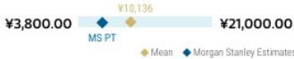

RISK REWARD CHART   
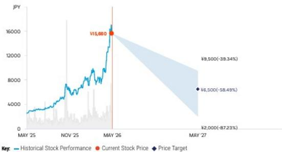

line

| Date     | Historical Stock Performance | Current Stock Price | Price Target |
| -------- | ---------------------------- | ------------------- | ------------ |
| MAY '25  | ~3000                        | -                   | -            |
| NOV '25  | ~4000                        | -                   | -            |
| MAY '26  | ~16000                       | ¥15,860             | -            |
| MAY '27  | -                            | ¥9,500              | -58.49%      |
| MAY '27  | -                            | ¥2,000              | -87.23%      |

Source: Refinitiv, MS

# UNDERWEIGHT THESIS

■ We expect ABF packages for AI servers sales to increase and earnings growth to continue.   
■ We see Ibiden sustaining a competitive advantage in ABF package technology and keeping dominant market share in GPU ABF packages for AI servers.   
■ We expect earnings growth to continue due to customer and product mix improvement, even though costs increase due mainly to new lines being activated in F3/26.   
Glass cloth shortages seem likely to continue until 3Q F3/27 and F3/27 earnings to fall short of the market's overly high expectations.   
■ We see a high risk that market consensus will come down and the stock price will fall.

Consensus Rating Distribution   
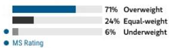  
Source: Refinitiv, MS

# Risk Reward Themes

Contrarian: Positive  
New Data Era: Positive

View descriptions of Risk Rewards Themes here

# BULL CASE

# Derived from DCF

Earnings ahead of the base case on stronger sales of value-added ABF packages for AI servers: OP of ¥73.0bn in F3/26, ¥103.4bn in F3/27, ¥142.9bn in F3/28 and ¥277.0bn in F3/31.

Same FX and DCF assumptions as the base case. Fair value equates to 38.5x F3/27 diluted EPS of ¥246.7 and 27.5x F3/28 diluted EPS of ¥346.3.

# ¥9,500

# BASE CASE

# Derived from DCF

Earnings expansion to continue due to value-added ABF package sales growth: OP ¥61.8bn in F3/26, ¥77.0bn in F3/27, ¥106.4bn in F3/28, ¥217.2bn in F3/31.

FX assumptions ¥150/\$, ¥170/€. Fair value is based on DCF as explained in the valuation methodology section. Base case fair value equates to 36.1x our F3/27e diluted EPS of ¥180.0, 25.6x our F3/28e diluted EPS of ¥175.0

# ¥6,500

# ¥6,500

# ¥6,500

# ¥6,500

# ¥6,500

# ¥6,500

# ¥6,500

# ¥6,500

# 005'9夫

# ¥6,500

# ¥6,500

# ¥6,500

# ¥6,500

# ¥6,50

# ¥6,50

# ¥6,50

# ¥6,50

# ¥6,50

# Niterra: Key Financial Data and Risk Reward

Income Statement 

<table><tr><td>(¥ bn)</td><td>F3/24</td><td>F3/25</td><td>F3/26e</td><td>F3/27e</td><td>F3/28e</td></tr><tr><td>Sales</td><td>614.5</td><td>653.0</td><td>694.3</td><td>754.6</td><td>788.6</td></tr><tr><td>COGS</td><td>388.3</td><td>394.9</td><td>422.2</td><td>439.3</td><td>455.7</td></tr><tr><td>Gross profit</td><td>226.2</td><td>258.1</td><td>272.0</td><td>315.3</td><td>332.9</td></tr><tr><td>SG&amp;A</td><td>118.6</td><td>128.4</td><td>133.0</td><td>158.8</td><td>161.2</td></tr><tr><td>Operating Profit</td><td>107.6</td><td>129.7</td><td>139.1</td><td>156.6</td><td>171.7</td></tr><tr><td>Non-operating Income/Loss</td><td>9.6</td><td>3.7</td><td>7.3</td><td>7.3</td><td>7.3</td></tr><tr><td>Recurring Profit</td><td>117.2</td><td>133.3</td><td>146.3</td><td>163.8</td><td>178.9</td></tr><tr><td>Extraordinaries Income/Loss</td><td>0.0</td><td>0.0</td><td>0.0</td><td>0.0</td><td>0.0</td></tr><tr><td>Pretax Profit</td><td>117.2</td><td>133.3</td><td>146.3</td><td>163.8</td><td>178.9</td></tr><tr><td>Income Tax</td><td>34.8</td><td>40.5</td><td>39.2</td><td>45.9</td><td>50.1</td></tr><tr><td>(Effective Tax Rate)</td><td>30%</td><td>30%</td><td>27%</td><td>28%</td><td>28%</td></tr><tr><td>Minority Interest</td><td>-0.3</td><td>0.2</td><td>3.4</td><td>3.4</td><td>3.4</td></tr><tr><td>Net Profit</td><td>82.6</td><td>92.6</td><td>103.8</td><td>114.6</td><td>125.5</td></tr><tr><td>Capex</td><td>41.2</td><td>37.5</td><td>37.6</td><td>40.0</td><td>45.0</td></tr><tr><td>Depreciation and Amortization</td><td>39.8</td><td>39.7</td><td>41.4</td><td>40.0</td><td>43.0</td></tr><tr><td>R&amp;D</td><td>27.8</td><td>0.0</td><td>6.5</td><td>30.0</td><td>31.0</td></tr><tr><td>EBITDA</td><td>147.4</td><td>169.4</td><td>180.5</td><td>196.6</td><td>214.7</td></tr><tr><td>ROE</td><td>13.8%</td><td>14.1%</td><td>14.8%</td><td>15.2%</td><td>15.6%</td></tr><tr><td>Average Share Outstanding (Diluted)</td><td>201.8</td><td>198.6</td><td>198.4</td><td>193.4</td><td>188.4</td></tr><tr><td>EPS (Diluted, Yen)</td><td>409.5</td><td>466.3</td><td>523.1</td><td>592.4</td><td>665.8</td></tr><tr><td>BPS (Yen)</td><td>3,175.6</td><td>3,399.4</td><td>3,666.8</td><td>4,013.6</td><td>4,435.2</td></tr><tr><td>DPS (Yen)</td><td>164.0</td><td>178.0</td><td>180.0</td><td>186.0</td><td>192.0</td></tr><tr><td>USD/JPY: Average Exchange Rate</td><td>145.0</td><td>153.0</td><td>148.0</td><td>150.0</td><td>150.0</td></tr><tr><td>EUR/JPY: Average Exchange Rate</td><td>157.0</td><td>164.0</td><td>169.0</td><td>170.0</td><td>170.0</td></tr><tr><td colspan="6">YoY % Change</td></tr><tr><td>Sales</td><td>9%</td><td>6%</td><td>6%</td><td>9%</td><td>5%</td></tr><tr><td>Operating Profit</td><td>21%</td><td>21%</td><td>7%</td><td>13%</td><td>10%</td></tr><tr><td>Net Profit</td><td>25%</td><td>12%</td><td>12%</td><td>10%</td><td>9%</td></tr><tr><td colspan="6">As % of Sales</td></tr><tr><td>Gross profit</td><td>36.8%</td><td>39.5%</td><td>39.2%</td><td>41.8%</td><td>42.2%</td></tr><tr><td>Operating Profit</td><td>17.5%</td><td>19.9%</td><td>20.0%</td><td>20.7%</td><td>21.8%</td></tr><tr><td>Net Profit</td><td>13.4%</td><td>14.2%</td><td>14.9%</td><td>15.2%</td><td>15.9%</td></tr><tr><td>Capex</td><td>6.7%</td><td>5.7%</td><td>5.4%</td><td>5.3%</td><td>5.7%</td></tr><tr><td>Depreciation and Amortization</td><td>6.5%</td><td>6.1%</td><td>6.0%</td><td>5.3%</td><td>5.5%</td></tr></table>

Balance Sheet 

<table><tr><td>(¥ bn)</td><td>F3/24</td><td>F3/25</td><td>F3/26e</td><td>F3/27e</td><td>F3/28e</td></tr><tr><td>Total Assets</td><td>975.7</td><td>991.0</td><td>1,178.0</td><td>1,199.3</td><td>1,231.0</td></tr><tr><td>Total Current Assets</td><td>564.2</td><td>588.5</td><td>629.4</td><td>650.6</td><td>680.4</td></tr><tr><td>Cash and Cash Equivalents</td><td>180.7</td><td>208.2</td><td>238.6</td><td>250.7</td><td>278.5</td></tr><tr><td>Marketable Securities</td><td>27.2</td><td>0.0</td><td>0.0</td><td>0.0</td><td>0.0</td></tr><tr><td>Account Receivables</td><td>141.4</td><td>147.6</td><td>156.9</td><td>170.5</td><td>178.2</td></tr><tr><td>Inventory</td><td>189.6</td><td>183.9</td><td>185.1</td><td>180.5</td><td>174.8</td></tr><tr><td>Other Current Assets</td><td>25.2</td><td>48.8</td><td>48.8</td><td>48.8</td><td>48.8</td></tr><tr><td>Total Long Term Assets</td><td>411.6</td><td>402.4</td><td>548.7</td><td>548.7</td><td>550.7</td></tr><tr><td>Net PP&amp;E</td><td>224.3</td><td>220.0</td><td>226.2</td><td>226.2</td><td>228.2</td></tr><tr><td>Investments in Securities</td><td>96.0</td><td>93.1</td><td>93.1</td><td>93.1</td><td>93.1</td></tr><tr><td>Other Assets</td><td>91.3</td><td>89.4</td><td>229.4</td><td>229.4</td><td>229.4</td></tr><tr><td>Total Current Liabilities</td><td>172.9</td><td>153.6</td><td>157.6</td><td>160.1</td><td>162.5</td></tr><tr><td>ST Debt &amp; Current Portion of LT Debt</td><td>42.4</td><td>16.7</td><td>16.7</td><td>16.7</td><td>16.7</td></tr><tr><td>Accounts Payable</td><td>58.8</td><td>57.7</td><td>61.7</td><td>64.1</td><td>66.5</td></tr><tr><td>Other Current Liabilities</td><td>71.8</td><td>79.3</td><td>79.3</td><td>79.3</td><td>79.3</td></tr><tr><td>Total Long Term Liabilities</td><td>164.5</td><td>162.6</td><td>292.6</td><td>262.6</td><td>232.6</td></tr><tr><td>Long Term Debt</td><td>135.7</td><td>140.0</td><td>270.0</td><td>240.0</td><td>210.0</td></tr><tr><td>Other Long Term Liabilities</td><td>28.8</td><td>22.6</td><td>22.6</td><td>22.6</td><td>22.6</td></tr><tr><td>Net Assets</td><td>638.3</td><td>674.7</td><td>727.8</td><td>776.5</td><td>835.9</td></tr><tr><td>Minority Interests</td><td>0.6</td><td>0.1</td><td>0.1</td><td>0.1</td><td>0.1</td></tr><tr><td>Net Debt</td><td>-125.8</td><td>-144.6</td><td>-45.0</td><td>-87.1</td><td>-144.9</td></tr></table>

Cash Flow Statement 

<table><tr><td>(¥ bn)</td><td>F3/24</td><td>F3/25</td><td>F3/26e</td><td>F3/27e</td><td>F3/28e</td></tr><tr><td>Net Cash from Operations</td><td>118.2</td><td>132.9</td><td>138.7</td><td>148.0</td><td>168.9</td></tr><tr><td>Net Income</td><td>82.6</td><td>92.6</td><td>103.8</td><td>114.6</td><td>125.5</td></tr><tr><td>Depreciation and Amortization</td><td>39.8</td><td>39.7</td><td>41.4</td><td>40.0</td><td>43.0</td></tr><tr><td>Changes in Working Capital</td><td>11.7</td><td>-6.2</td><td>-6.5</td><td>-6.6</td><td>0.5</td></tr><tr><td>Other-net</td><td>-15.9</td><td>6.8</td><td>0.0</td><td>0.0</td><td>0.0</td></tr><tr><td>Net Cash from Investing Activities</td><td>-92.2</td><td>-34.2</td><td>-187.6</td><td>-40.0</td><td>-45.0</td></tr><tr><td>Purchase of PP&amp;E</td><td>-31.1</td><td>-27.8</td><td>-37.6</td><td>-40.0</td><td>-45.0</td></tr><tr><td>Sale/Purchase of Investments</td><td>-51.3</td><td>-3.4</td><td>-150.0</td><td>0.0</td><td>0.0</td></tr><tr><td>Other-net</td><td>-9.7</td><td>-3.0</td><td>0.0</td><td>0.0</td><td>0.0</td></tr><tr><td>Free Cash Flow</td><td>26.0</td><td>98.7</td><td>-48.9</td><td>108.0</td><td>123.9</td></tr><tr><td>Net Cash from Financing Activities</td><td>-57.5</td><td>-71.0</td><td>79.3</td><td>-95.8</td><td>-96.1</td></tr><tr><td>Change in Interest-bearing Debt</td><td>-14.9</td><td>-25.9</td><td>130.0</td><td>-30.0</td><td>-30.0</td></tr><tr><td>Change in Treasury Stock</td><td>-10.0</td><td>-10.0</td><td>-15.0</td><td>-30.0</td><td>-30.0</td></tr><tr><td>Payment of Cash Dividends</td><td>-33.1</td><td>-34.4</td><td>-35.7</td><td>-35.8</td><td>-36.1</td></tr><tr><td>Other-net</td><td>0.6</td><td>-0.7</td><td>0.0</td><td>0.0</td><td>0.0</td></tr><tr><td>Net EEVect of Exchange Rate Changes</td><td>10.5</td><td>-0.2</td><td>0.0</td><td>0.0</td><td>0.0</td></tr><tr><td>Net Change in Cash</td><td>-20.9</td><td>27.5</td><td>30.4</td><td>12.2</td><td>27.8</td></tr><tr><td>Cash at End of Period</td><td>180.7</td><td>208.2</td><td>238.6</td><td>250.7</td><td>278.5</td></tr><tr><td colspan="6">Segment Information</td></tr><tr><td>(¥ bn)</td><td>F3/24</td><td>F3/25</td><td>F3/26e</td><td>F3/27e</td><td>F3/28e</td></tr><tr><td>Net sales</td><td>614.5</td><td>653.0</td><td>694.3</td><td>754.6</td><td>788.6</td></tr><tr><td>Automotive Components</td><td>505.4</td><td>542.8</td><td>556.7</td><td>611.4</td><td>638.8</td></tr><tr><td>Spark &amp; Glow Plugs</td><td>335.3</td><td>362.6</td><td>364.9</td><td>414.4</td><td>438.0</td></tr><tr><td>Automotive Sensors</td><td>170.0</td><td>180.2</td><td>191.8</td><td>197.0</td><td>200.9</td></tr><tr><td>Ceramics</td><td>96.5</td><td>103.1</td><td>127.0</td><td>135.3</td><td>143.7</td></tr><tr><td>New Business</td><td>5.1</td><td>0.0</td><td>0.0</td><td>0.0</td><td>0.0</td></tr><tr><td>Others/Elimination</td><td>7.4</td><td>7.1</td><td>11.2</td><td>8.0</td><td>6.0</td></tr><tr><td>Total Operating Profit</td><td>107.6</td><td>129.7</td><td>139.1</td><td>156.6</td><td>171.7</td></tr><tr><td>Automotive Components</td><td>121.2</td><td>134.2</td><td>135.8</td><td>149.6</td><td>161.2</td></tr><tr><td>Ceramics</td><td>-0.6</td><td>-6.3</td><td>1.8</td><td>6.6</td><td>10.1</td></tr><tr><td>New Business</td><td>-13.2</td><td>0.0</td><td>0.0</td><td>0.0</td><td>0.0</td></tr><tr><td>Others/Eliminatio</td><td>0.2</td><td>1.8</td><td>1.4</td><td>0.4</td><td>0.4</td></tr><tr><td>Operating Profit Margin</td><td>17.5%</td><td>19.9%</td><td>20.0%</td><td>20.7%</td><td>21.8%</td></tr><tr><td>Automotive Components</td><td>24.0%</td><td>24.7%</td><td>24.4%</td><td>24.5%</td><td>25.2%</td></tr><tr><td>Ceramics</td><td>-0.6%</td><td>-6.1%</td><td>1.5%</td><td>4.9%</td><td>7.0%</td></tr></table>

# Risk Reward - Niterra (5334.T)

Expect earnings growth in auto components with volume & unit price going up

# PRICE TARGET ¥9,100

Calculated from our DCF model derived from our base case. Our DCF model assumes a 2.2% risk-free rate, 1.08 equity beta, and 3.7% risk premium, yielding a 5.4% WACC. We assume a 0% perpetual growth rate from F3/36.

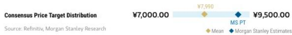

bar_line

| Category | Value     |
| -------- | --------- |
| Mean     | ¥7,990    |
| MS Estimates | ¥9,500.00 |

RISK REWARD CHART   
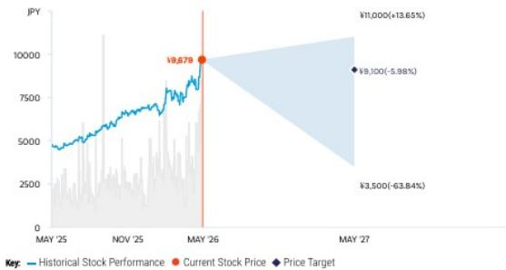

line

| Date   | Historical Stock Performance | Current Stock Price | Price Target |
|--------|-------------------------------|---------------------|--------------|
| MAY '26 | 10,000                        | 10,878              | -            |
| MAY '27 | -                             | 9,100               | -5.98%       |
|        | -                             | 3,500               | -63.84%      |

Source: Refinitiv, MS

# OVERWEIGHT THESIS

■ We expect the firm to maintain competitiveness in automotive plugs and exhaust gas sensors, and market share to keep gradually expanding.   
Although demand for plugs is unlikely to grow substantially (Niterra boasts the top global share at 47%), we expect Niterra's market share to increase gradually and the firm to book large profits on aftermarket products.   
In automotive sensors, we expect Niterra to gradually increase its 44% global market share, and earnings to keep growing until F3/28 alongside the tightening of environmental regulations.   
In non-auto business, we believe earnings from electrostatic chucks for SPE will continue growing having bottomed in F3/24

Consensus Rating Distribution   
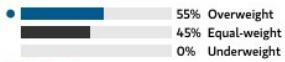  
MS Rating   
Source: Refinitiv, MS

# Risk Reward Themes

Contrarian:

Positive

View descriptions of Risk Rewards Themes here

# BULL CASE

Derived from DCF

Automotive plug & exhaust gas sensor sales exceed the base case by 4% and earnings continue to grow further. This scenario assumes OP of ¥150.6bn in F3/26, ¥179.3bn in F3/27, ¥196.5bn in F3/28, ¥225.6bn in F3/29, and uses the same FX & DCF assumptions as the base case. Bull case fair value equates to P/E of 16.7x on F3/27e diluted EPS of ¥659.4 and 15.2x on F3/28e diluted EPS of ¥721.6.

# ¥11,000

# BASE CASE

Derived from DCF

Expect profit to continue to reach new heights, driven by increased sales of automobile plugs and SPE electro static chuck: We forecast OP of ¥139.1bn in F3/26, ¥155.6bn in F3/27, ¥171.7bn in F3/28, ¥196.6bn in F3/29, assuming FX rates of ¥150/US\$, ¥170/€. Our PT is calculated from our DCF model, the conditions for which are outlined in our valuation methodology. Our base case PT equates to P/E of 15.4x on F3/27e diluted EPS of ¥592.4 and 13.7x on F3/28e diluted EPS of ¥655.8.

# ¥9,100

# BEAR CASE

# ¥3,500

F3/27e diluted BPS ¥3,713 x P/B 0.9

Lack of growth in autos-related volumes, limited improvement in SPE-related earnings: This scenario assumes OP of ¥123.9bn in F3/26, ¥107.7bn in F3/27, ¥97.3bn in F3/28, ¥89.0bn in F3/29, and uses the same FX assumptions as the base case. In this case, the market consensus moves lower and the share price drops to P/B 0.9x.

Note: e = MS estimates; Stock price as of the May 15 close for Risk Reward Chart  
Source: Company data, MS

# Minebea Mitsumi: Key Financial Data and Risk Reward

Income Statement 

<table><tr><td>(¥ bil)</td><td>F3/25</td><td>F3/26</td><td>F3/27e</td><td>F3/28e</td><td>F3/29e</td></tr><tr><td>Net Sales</td><td>1,522.7</td><td>1,664.4</td><td>1,651.1</td><td>1,703.3</td><td>1,763.6</td></tr><tr><td>Cost of Goods Sold</td><td>1,252.3</td><td>1,371.4</td><td>1,348.7</td><td>1,387.6</td><td>1,438.4</td></tr><tr><td>Gross Profit</td><td>270.4</td><td>293.0</td><td>302.4</td><td>315.7</td><td>325.2</td></tr><tr><td>SG&amp;A Expenses</td><td>175.9</td><td>189.0</td><td>185.5</td><td>188.2</td><td>191.2</td></tr><tr><td>Operating Profit</td><td>94.5</td><td>104.0</td><td>116.9</td><td>127.5</td><td>134.0</td></tr><tr><td>Interest/Dividend income</td><td>6.9</td><td>40.9</td><td>1.8</td><td>1.8</td><td>1.8</td></tr><tr><td>Interest Expense</td><td>18.8</td><td>11.1</td><td>2.5</td><td>2.5</td><td>2.5</td></tr><tr><td>Other Non-Operating Income/Loss</td><td>0.0</td><td>0.0</td><td>0.0</td><td>0.0</td><td>0.0</td></tr><tr><td>Recurring Profit</td><td>82.6</td><td>133.8</td><td>116.2</td><td>126.8</td><td>133.3</td></tr><tr><td>Extraordinary Income/Loss</td><td>0.0</td><td>0.0</td><td>0.0</td><td>0.0</td><td>0.0</td></tr><tr><td>Pretax profit</td><td>82.6</td><td>133.8</td><td>116.2</td><td>126.8</td><td>133.3</td></tr><tr><td>Income Tax</td><td>22.8</td><td>34.5</td><td>30.2</td><td>33.0</td><td>34.7</td></tr><tr><td>(Effective Tax Rate)</td><td>28%</td><td>26%</td><td>26%</td><td>26%</td><td>26%</td></tr><tr><td>Minority Interest</td><td>0.4</td><td>0.2</td><td>0.0</td><td>0.0</td><td>0.0</td></tr><tr><td>Net Profit</td><td>59.5</td><td>99.0</td><td>86.0</td><td>93.8</td><td>98.7</td></tr></table>

<table><tr><td>Capex</td><td>94.8</td><td>96.5</td><td>99.1</td><td>102.2</td><td>105.8</td></tr><tr><td>Depreciation and Amortization</td><td>66.2</td><td>70.4</td><td>69.9</td><td>72.1</td><td>74.6</td></tr><tr><td>R&amp;D</td><td>45.5</td><td>49.8</td><td>49.5</td><td>51.1</td><td>52.9</td></tr><tr><td>EBITDA</td><td>160.7</td><td>174.4</td><td>186.7</td><td>199.6</td><td>208.7</td></tr><tr><td>ROE</td><td>8.2%</td><td>12.5%</td><td>10.4%</td><td>10.5%</td><td>10.1%</td></tr></table>

<table><tr><td>Average Share Outstanding (mil, Diluted)</td><td>406.3</td><td>401.6</td><td>401.6</td><td>401.6</td><td>401.6</td></tr><tr><td>EPS (Diluted, Yen)</td><td>147.7</td><td>246.6</td><td>214.0</td><td>233.7</td><td>245.7</td></tr><tr><td>BPS (Yen)</td><td>1,830.0</td><td>2,102.8</td><td>2,143.7</td><td>2,326.4</td><td>2,518.0</td></tr><tr><td>DPS (Yen)</td><td>45.0</td><td>50.0</td><td>48.0</td><td>51.0</td><td>54.0</td></tr></table>

<table><tr><td>USD/JPY: Average Exchange Rate</td><td>152.6</td><td>150.0</td><td>150.0</td><td>150.0</td><td>150.0</td></tr></table>

<table><tr><td>YoY % Change</td><td>0%</td><td>0%</td><td></td><td></td><td></td></tr><tr><td>Net Sales</td><td>9%</td><td>9%</td><td>2%</td><td>3%</td><td>4%</td></tr><tr><td>Operating Profit</td><td>28%</td><td>10%</td><td>14%</td><td>9%</td><td>5%</td></tr><tr><td>Net Profit</td><td>10%</td><td>67%</td><td>25%</td><td>9%</td><td>5%</td></tr></table>

<table><tr><td>As % of Sales</td><td>0%</td><td>0%</td><td></td><td></td><td></td></tr><tr><td>Gross Profit</td><td>17.8%</td><td>17.6%</td><td>18.3%</td><td>18.5%</td><td>18.4%</td></tr><tr><td>Operating Profit</td><td>6.2%</td><td>6.2%</td><td>7.1%</td><td>7.5%</td><td>7.6%</td></tr><tr><td>Net Profit</td><td>3.9%</td><td>6.0%</td><td>5.2%</td><td>5.5%</td><td>5.6%</td></tr></table>

Balance Sheet 

<table><tr><td>(¥ bil)</td><td>F3/25</td><td>F3/26</td><td>F3/27e</td><td>F3/28e</td><td>F3/29e</td></tr><tr><td>Total Assets</td><td>1,584.8</td><td>1,782.3</td><td>1,724.1</td><td>1,806.7</td><td>1,895.6</td></tr><tr><td>Total Current Assets</td><td>904.1</td><td>1,041.2</td><td>992.9</td><td>1,045.3</td><td>1,103.1</td></tr><tr><td>Cash and Cash Equivalents</td><td>214.3</td><td>220.0</td><td>202.1</td><td>232.1</td><td>262.1</td></tr><tr><td>Marketable Securities</td><td>0.0</td><td>0.0</td><td>0.0</td><td>0.0</td><td>0.0</td></tr><tr><td>Account Receivables</td><td>293.3</td><td>344.6</td><td>367.2</td><td>378.8</td><td>392.2</td></tr><tr><td>Inventory</td><td>350.9</td><td>411.7</td><td>377.9</td><td>388.8</td><td>403.0</td></tr><tr><td>Other Current Assets</td><td>170.3</td><td>197.4</td><td>170.3</td><td>170.3</td><td>170.3</td></tr><tr><td>Total Long Term Assets</td><td>680.7</td><td>741.1</td><td>731.2</td><td>761.3</td><td>792.5</td></tr><tr><td>Net PP&amp;E</td><td>529.0</td><td>576.6</td><td>579.5</td><td>609.6</td><td>640.8</td></tr><tr><td>Investments in Securities</td><td>27.1</td><td>32.0</td><td>27.1</td><td>27.1</td><td>27.1</td></tr><tr><td>Other assets</td><td>0.0</td><td>0.0</td><td>0.0</td><td>0.0</td><td>0.0</td></tr><tr><td>Total Current Liabilities</td><td>477.2</td><td>618.1</td><td>499.4</td><td>508.6</td><td>520.5</td></tr><tr><td>ST Debt &amp; Current Portion of LT Debt</td><td>175.1</td><td>271.6</td><td>175.1</td><td>175.1</td><td>175.1</td></tr><tr><td>Accounts Payable</td><td>213.6</td><td>251.5</td><td>216.5</td><td>222.7</td><td>230.9</td></tr><tr><td>Other Current Liabilities</td><td>88.5</td><td>94.9</td><td>107.9</td><td>110.8</td><td>114.6</td></tr><tr><td>Total Long Term Liabilities</td><td>353.0</td><td>308.2</td><td>353.0</td><td>353.0</td><td>353.0</td></tr><tr><td>Long Term Debt</td><td>288.5</td><td>235.3</td><td>288.5</td><td>288.5</td><td>288.5</td></tr><tr><td>Other Long Term Liabilities</td><td>64.4</td><td>73.0</td><td>64.4</td><td>64.4</td><td>64.4</td></tr><tr><td>Accrued pension cost</td><td>0.0</td><td>0.0</td><td></td><td></td><td></td></tr><tr><td>Minority Interests</td><td>11.2</td><td>11.5</td><td>10.9</td><td>10.9</td><td>10.9</td></tr><tr><td>Total Equity</td><td>754.6</td><td>856.0</td><td>871.7</td><td>945.1</td><td>1,022.1</td></tr></table>

<table><tr><td>Net Debt</td><td>249.3</td><td>286.9</td><td>261.5</td><td>231.5</td><td>201.4</td></tr></table>

Cash Flow Statement 

<table><tr><td>(¥ bil)</td><td>F3/25</td><td>F3/26</td><td>F3/27e</td><td>F3/28e</td><td>F3/29e</td></tr><tr><td>Net Cash from Operations</td><td>133.7</td><td>94.9</td><td>146.1</td><td>149.7</td><td>153.8</td></tr><tr><td>Net Income After Tax</td><td>59.5</td><td>99.0</td><td>86.0</td><td>93.8</td><td>98.7</td></tr><tr><td>Depreciation and Amortization</td><td>66.2</td><td>70.4</td><td>69.9</td><td>72.1</td><td>74.6</td></tr><tr><td>Changes in Working Capital:</td><td>9.7</td><td>-53.9</td><td>-9.7</td><td>-16.3</td><td>-19.5</td></tr><tr><td>Other-net</td><td>-1.7</td><td>-20.7</td><td>0.0</td><td>0.0</td><td>0.0</td></tr><tr><td>Net Cash from Investing Activities</td><td>-125.8</td><td>-82.8</td><td>-97.7</td><td>-99.3</td><td>-102.0</td></tr><tr><td>Purchase of PP&amp;E</td><td>-77.4</td><td>-77.1</td><td>-99.1</td><td>-102.2</td><td>-105.8</td></tr><tr><td>Sale/Purchase of Investments</td><td>-0.4</td><td>-0.2</td><td>0.0</td><td>0.0</td><td>0.0</td></tr><tr><td>Other-net</td><td>-48.0</td><td>-5.5</td><td>1.3</td><td>2.9</td><td>3.8</td></tr><tr><td>Free cash flow</td><td>7.9</td><td>12.1</td><td>48.3</td><td>50.4</td><td>51.8</td></tr><tr><td>Net Cash from Financing Activities</td><td>64.0</td><td>-16.1</td><td>-19.3</td><td>-20.5</td><td>-21.7</td></tr><tr><td>Change in Interest-bearing Debt</td><td>96.4</td><td>13.0</td><td>0.0</td><td>0.0</td><td>0.0</td></tr><tr><td>Change in Treasury Stock</td><td>-8.7</td><td>0.0</td><td>0.0</td><td>0.0</td><td>0.0</td></tr><tr><td>Payment of Cash Dividends</td><td>-16.1</td><td>-20.1</td><td>-19.3</td><td>-20.5</td><td>-21.7</td></tr><tr><td>Other-net</td><td>-7.6</td><td>-9.1</td><td>0.0</td><td>0.0</td><td>0.0</td></tr><tr><td>Net Effect of Exchange Rate Changes</td><td>-4.3</td><td>17.3</td><td>0.0</td><td>0.0</td><td>0.0</td></tr><tr><td>Cash at End of Period</td><td>189.3</td><td>222.0</td><td>177.2</td><td>207.1</td><td>237.2</td></tr></table>

Segment Information 

<table><tr><td>(Y bil)</td><td>F3/25</td><td>F3/26</td><td>F3/27e</td><td>F3/28e</td><td>F3/27e</td></tr><tr><td colspan="6">Sales by Segment</td></tr><tr><td>Total Sales</td><td>1,522.7</td><td>1,664.4</td><td>1,651.1</td><td>1,703.3</td><td>1,763.6</td></tr><tr><td>Precision Technologies</td><td>255.7</td><td>281.2</td><td>287.3</td><td>298.4</td><td>315.5</td></tr><tr><td>Ball bearings</td><td>171.8</td><td>186.4</td><td>198.2</td><td>206.1</td><td>219.9</td></tr><tr><td>Rod-ends/Fasteners</td><td>59.1</td><td>66.0</td><td>64.0</td><td>67.2</td><td>70.6</td></tr><tr><td>Pivot assemblies</td><td>24.8</td><td>28.7</td><td>25.0</td><td>25.0</td><td>25.0</td></tr><tr><td>Motor, Lighting &amp; Sensing</td><td>407.7</td><td>456.5</td><td>448.8</td><td>460.2</td><td>472.0</td></tr><tr><td>Motors</td><td>322.4</td><td>340.3</td><td>342.7</td><td>353.0</td><td>363.6</td></tr><tr><td>Electronic devices</td><td>41.1</td><td>68.0</td><td>64.6</td><td>64.6</td><td>64.6</td></tr><tr><td>Measuring components</td><td>36.9</td><td>38.5</td><td>37.5</td><td>38.6</td><td>39.8</td></tr><tr><td>Other</td><td>7.4</td><td>9.8</td><td>4.0</td><td>4.0</td><td>4.0</td></tr><tr><td>Semiconductors &amp; Electronics</td><td>527.6</td><td>590.3</td><td>576.3</td><td>589.0</td><td>602.7</td></tr><tr><td>Access Solutions</td><td>328.1</td><td>332.2</td><td>337.8</td><td>354.7</td><td>372.5</td></tr><tr><td>Others</td><td>3.5</td><td>4.2</td><td>1.0</td><td>1.0</td><td>1.0</td></tr></table>

Operating Profit by Segment 

<table><tr><td>Total Operating Profit</td><td>94.5</td><td>104.0</td><td>116.9</td><td>127.5</td><td>134.0</td></tr><tr><td>Machined Components Business</td><td>55.7</td><td>62.2</td><td>63.6</td><td>66.0</td><td>68.6</td></tr><tr><td>Electronic Devices &amp; Components Business</td><td>23.0</td><td>26.9</td><td>27.7</td><td>28.5</td><td>28.3</td></tr><tr><td>Semiconductors &amp; Electronics</td><td>22.0</td><td>26.7</td><td>28.7</td><td>34.5</td><td>37.7</td></tr><tr><td>Access Solutions</td><td>15.9</td><td>17.1</td><td>17.9</td><td>19.5</td><td>20.5</td></tr><tr><td>Others</td><td>-1.2</td><td>-2.7</td><td>-1.0</td><td>-1.0</td><td>-1.0</td></tr><tr><td>Adjustments</td><td>-20.9</td><td>-26.3</td><td>-20.0</td><td>-20.0</td><td>-20.0</td></tr></table>

Operating Profit Margin 

<table><tr><td>Machined Components Business</td><td>21.8%</td><td>22.1%</td><td>22.1%</td><td>22.1%</td><td>21.7%</td></tr><tr><td>Electronic Devices &amp; Components Business</td><td>5.6%</td><td>5.9%</td><td>6.2%</td><td>6.2%</td><td>6.0%</td></tr><tr><td>Semiconductors &amp; Electronics</td><td>4.2%</td><td>4.5%</td><td>5.0%</td><td>5.9%</td><td>6.3%</td></tr><tr><td>Access Solutions</td><td>4.9%</td><td>5.1%</td><td>5.3%</td><td>5.5%</td><td>5.5%</td></tr><tr><td>Others</td><td>-33.8%</td><td>-63.2%</td><td>-100.0%</td><td>-100.0%</td><td>-100.0%</td></tr></table>

# Risk Reward – Minebea Mitsumi (6479.T)

Earnings should recover gradually, but this is mostly priced into the stock

# PRICE TARGET ¥3,300

Derived from the base case. DCF assumptions: 2.2% risk-free rate, 1.21 equity beta, 3.7% risk premium, yielding 5.2% WACC; zero growth from F3/36.

Consensus Price Target Distribution

Source: Refinitiv, MS

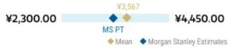

RISK REWARD CHART   
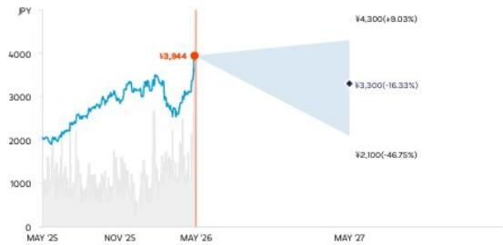

line

| Date   | Value     |
|--------|-----------|
| MAY '26 | €3,944    |
| MAY '27 | €3,300    |
| MAY '27 | €2,100    |

Key: — Historical Stock Performance ● Current Stock Price ◆ Price Target   
Source: Refinitiv, MS

# EQUAL-WEIGHT THESIS

■ Earnings should continue to recover having bottomed in F3/24, but this is mostly priced into the stock.   
■ We expect earnings growth of Minebea's more-than-60% share of the global market for miniature ball bearings to continue in mid/long term.   
■ We expect it will be difficult for the semiconductor & electronics segment to post a new record high in the near term.   
■ Access Solution earnings should improve thanks to cost cuts and market share gains.

Consensus Rating Distribution   
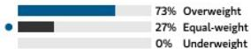  
MS Rating   
Source: Refinitiv, MS

# BULL CASE

# Derived from DCF

Semiconductor & Electronics and Precision Technology sales higher than in our base case: OP ¥112.2bn in F3/26, ¥129.7bn in F3/27, ¥142.5bn in F3/28, ¥154.9bn in F3/29. Same FX and DCF model assumptions as the base case. Fair value for the shares equates to 18.1x F3/27e diluted EPS of ¥237.7, 16.5x F3/28e diluted EPS of ¥261.2.

# ¥4,300

# BASE CASE

# Derived from DCF

Earnings continue to grow, driven by rising sales of core products, as the market

expects: OP ¥102.1bn in F3/26, ¥116.9bn in F3/27, ¥127.5bn in F3/28, ¥134.0bn in F3/29. FX assumption of ¥150/\$, ¥170/€. DCF model assumptions: 2.2% risk-free rate, 1.21 equity beta, 3.7% risk premium, yielding 5.2% WACC. Base case fair value equates to 15.4x F3/27e diluted EPS of ¥214.0, 14.1x F3/28e diluted EPS of ¥233.7.

# ¥3,300

# BEAR CASE

# F3/27e BPS ¥2,078 x P/B 1.0

Earnings especially in Semiconductor & Electronics and Motor, Lighting & Sensing

will be weaker than base case: OP ¥89.6bn in F3/26, ¥81.5bn in F3/27, ¥85.5bn in F3/28, ¥92.1bn in F3/29. 7.1% ROE in F3/27 is higher than cost of capital of 6.7%, but earnings are lower than market consensus and the share price declines to 1.0 x P/B.

# Mabuchi Motor: Key Financial Data and Risk Reward

Income Statement 

<table><tr><td>(¥ bn)</td><td>F12/24</td><td>F12/25</td><td>F12/26e</td><td>F12/27e</td><td>F12/28e</td></tr><tr><td>Net Sales</td><td>196.2</td><td>200.4</td><td>213.4</td><td>227.3</td><td>242.2</td></tr><tr><td>COGS</td><td>143.3</td><td>140.6</td><td>149.0</td><td>160.3</td><td>172.2</td></tr><tr><td>Gross Profit</td><td>52.9</td><td>59.8</td><td>64.3</td><td>67.0</td><td>70.0</td></tr><tr><td>SG&amp;A Expenses</td><td>31.2</td><td>34.3</td><td>37.2</td><td>37.8</td><td>38.4</td></tr><tr><td>Operating Profit</td><td>21.6</td><td>25.5</td><td>27.2</td><td>29.3</td><td>31.6</td></tr><tr><td>Non-operating Income/Loss</td><td>10.8</td><td>9.6</td><td>4.4</td><td>4.4</td><td>4.4</td></tr><tr><td>Recurring Profit</td><td>32.4</td><td>35.1</td><td>31.6</td><td>33.7</td><td>36.0</td></tr><tr><td>Extraordinary Income/Loss</td><td>-8.7</td><td>-0.1</td><td>-0.2</td><td>-0.2</td><td>-0.2</td></tr><tr><td>Pretax Profit</td><td>23.7</td><td>35.0</td><td>31.4</td><td>33.5</td><td>35.8</td></tr><tr><td>Income Tax</td><td>10.9</td><td>8.7</td><td>9.1</td><td>9.7</td><td>10.4</td></tr><tr><td>(Effective Tax Rate)</td><td>46%</td><td>25%</td><td>29%</td><td>29%</td><td>29%</td></tr><tr><td>Minority Interest</td><td>0.0</td><td>0.0</td><td>0.0</td><td>0.0</td><td>0.0</td></tr><tr><td>Net Profit</td><td>12.8</td><td>26.3</td><td>22.3</td><td>23.8</td><td>25.4</td></tr><tr><td>Capex</td><td>14.1</td><td>10.3</td><td>12.6</td><td>15.0</td><td>15.0</td></tr><tr><td>Depreciation and Amortization</td><td>14.2</td><td>13.3</td><td>13.9</td><td>14.0</td><td>14.0</td></tr><tr><td>R&amp;D Expenses</td><td>7.0</td><td>7.8</td><td>8.8</td><td>9.0</td><td>9.0</td></tr><tr><td>EBITDA</td><td>35.8</td><td>38.8</td><td>41.1</td><td>43.3</td><td>45.6</td></tr><tr><td>ROE</td><td>4.1%</td><td>8.0%</td><td>6.8%</td><td>7.5%</td><td>8.3%</td></tr><tr><td>Average Share Outstanding (Diluted)</td><td>254.1</td><td>248.1</td><td>234.1</td><td>234.1</td><td>234.1</td></tr><tr><td>EPS (Diluted, Yen)</td><td>50.5</td><td>105.9</td><td>90.7</td><td>101.5</td><td>108.6</td></tr><tr><td>BPS (Yen)</td><td>1,257.7</td><td>1,347.0</td><td>1,376.4</td><td>1,332.5</td><td>1,289.6</td></tr><tr><td>DPS (Yen)</td><td>38.0</td><td>53.0</td><td>56.0</td><td>64.0</td><td>68.0</td></tr><tr><td>USD/JPY: Average Exchange Rate</td><td>151.6</td><td>149.7</td><td>150.0</td><td>150.0</td><td>150.0</td></tr><tr><td>YoY % Change</td><td></td><td></td><td></td><td></td><td></td></tr><tr><td>Net Sales</td><td>10%</td><td>2%</td><td>6%</td><td>7%</td><td>7%</td></tr><tr><td>Operating Profit</td><td>39%</td><td>18%</td><td>7%</td><td>8%</td><td>8%</td></tr><tr><td>Net Profit</td><td>-34%</td><td>105%</td><td>-15%</td><td>7%</td><td>7%</td></tr><tr><td>As % of Sales</td><td></td><td></td><td></td><td></td><td></td></tr><tr><td>Gross Profit</td><td>26.9%</td><td>29.8%</td><td>30.2%</td><td>29.5%</td><td>28.9%</td></tr><tr><td>Operating Profit</td><td>11.0%</td><td>12.7%</td><td>12.7%</td><td>12.9%</td><td>13.0%</td></tr><tr><td>Net Profit</td><td>6.5%</td><td>13.1%</td><td>10.4%</td><td>10.4%</td><td>10.5%</td></tr><tr><td>Capex</td><td>7.2%</td><td>5.1%</td><td>5.9%</td><td>6.6%</td><td>6.2%</td></tr><tr><td>Depreciation and Amortization</td><td>7.2%</td><td>6.6%</td><td>6.5%</td><td>6.2%</td><td>5.8%</td></tr></table>

Balance Sheet 

<table><tr><td>(¥ bn)</td><td>F12/24</td><td>F12/25</td><td>F12/26e</td><td>F12/27e</td><td>F12/28e</td></tr><tr><td>Total Assets</td><td>355.0</td><td>370.2</td><td>357.8</td><td>348.2</td><td>339.0</td></tr><tr><td>Total Current Assets</td><td>238.5</td><td>247.7</td><td>236.6</td><td>226.1</td><td>215.9</td></tr><tr><td>Cash and Cash Equivalents</td><td>134.9</td><td>143.4</td><td>131.4</td><td>118.9</td><td>107.0</td></tr><tr><td>Marketable Securities</td><td>0.0</td><td>0.0</td><td>0.0</td><td>0.0</td><td>0.0</td></tr><tr><td>Account Receivables</td><td>37.3</td><td>38.7</td><td>37.1</td><td>38.9</td><td>40.8</td></tr><tr><td>Inventory</td><td>59.8</td><td>57.8</td><td>60.4</td><td>60.6</td><td>60.4</td></tr><tr><td>Other Current Assets</td><td>6.4</td><td>7.8</td><td>7.8</td><td>7.8</td><td>7.8</td></tr><tr><td>Total Long Term Assets</td><td>116.5</td><td>122.4</td><td>121.1</td><td>122.1</td><td>123.1</td></tr><tr><td>Net PP&amp;E</td><td>95.5</td><td>95.9</td><td>94.6</td><td>95.6</td><td>96.6</td></tr><tr><td>Investments in Securities</td><td>12.4</td><td>16.4</td><td>16.4</td><td>16.4</td><td>16.4</td></tr><tr><td>Other Assets</td><td>8.6</td><td>10.2</td><td>10.2</td><td>10.2</td><td>10.2</td></tr><tr><td>Total Current Liabilities</td><td>28.8</td><td>28.3</td><td>27.9</td><td>28.7</td><td>29.5</td></tr><tr><td>ST Debt and Current Portion of LT Debt</td><td>0.0</td><td>0.0</td><td>0.0</td><td>0.0</td><td>0.0</td></tr><tr><td>Accounts Payable</td><td>7.7</td><td>10.4</td><td>10.0</td><td>10.7</td><td>11.5</td></tr><tr><td>Other Current Liabilities</td><td>21.1</td><td>17.9</td><td>17.9</td><td>17.9</td><td>17.9</td></tr><tr><td>Total Long Term Liabilities</td><td>6.5</td><td>7.6</td><td>7.6</td><td>7.6</td><td>7.6</td></tr><tr><td>Long Term Debt</td><td>0.5</td><td>1.3</td><td>1.3</td><td>1.3</td><td>1.3</td></tr><tr><td>Other Long Term Liabilities</td><td>6.0</td><td>6.3</td><td>6.3</td><td>6.3</td><td>6.3</td></tr><tr><td>Net Assets</td><td>319.6</td><td>334.2</td><td>322.2</td><td>311.9</td><td>301.9</td></tr><tr><td>Minority Interests</td><td>0.0</td><td>0.0</td><td>0.0</td><td>0.0</td><td>0.0</td></tr><tr><td>Net Debt</td><td>-146.8</td><td>-158.5</td><td>-146.4</td><td>-133.9</td><td>-122.0</td></tr></table>

Cash Flow Statement 

<table><tr><td>(¥ bn)</td><td>F12/24</td><td>F12/25</td><td>F12/26e</td><td>F12/27e</td><td>F12/28e</td></tr><tr><td>Net Cash from Operations</td><td>40.1</td><td>35.4</td><td>34.9</td><td>36.5</td><td>38.5</td></tr><tr><td>Net Income</td><td>12.8</td><td>26.3</td><td>22.3</td><td>23.8</td><td>25.4</td></tr><tr><td>Depreciation and Amortization</td><td>14.2</td><td>13.5</td><td>13.9</td><td>14.0</td><td>14.0</td></tr><tr><td>Changes in Working Capital</td><td>2.2</td><td>8.1</td><td>-1.3</td><td>-1.2</td><td>-0.9</td></tr><tr><td>Other-net</td><td>10.9</td><td>-12.5</td><td>0.0</td><td>0.0</td><td>0.0</td></tr><tr><td>Net Cash from Investing Activities</td><td>-15.8</td><td>-10.5</td><td>-12.6</td><td>-15.0</td><td>-15.0</td></tr><tr><td>Purchase of PP&amp;E</td><td>-14.0</td><td>-10.2</td><td>-12.6</td><td>-15.0</td><td>-15.0</td></tr><tr><td></td><td>-0.5</td><td>0.0</td><td>0.0</td><td>0.0</td><td>0.0</td></tr><tr><td>Other-net</td><td>-1.2</td><td>-0.3</td><td>0.0</td><td>0.0</td><td>0.0</td></tr><tr><td>Free Cash Flow</td><td>24.4</td><td>24.8</td><td>22.3</td><td>21.5</td><td>23.5</td></tr><tr><td>Net Cash from Financing Activities</td><td>-16.2</td><td>-17.4</td><td>-34.3</td><td>-34.0</td><td>-35.4</td></tr><tr><td>Change in Interest-bearing Debt</td><td>0.0</td><td>0.0</td><td>0.0</td><td>0.0</td><td>0.0</td></tr><tr><td>Change in Treasury Stock</td><td>-5.7</td><td>-6.7</td><td>-19.0</td><td>-20.0</td><td>-20.0</td></tr><tr><td>Payment of Cash Dividends</td><td>-10.2</td><td>-9.7</td><td>-15.3</td><td>-14.0</td><td>-15.4</td></tr><tr><td>Other-net</td><td>-0.3</td><td>-1.0</td><td>0.0</td><td>0.0</td><td>0.0</td></tr><tr><td>Net Effect of Exchange Rate Changes</td><td>10.1</td><td>1.9</td><td>0.0</td><td>0.0</td><td>0.0</td></tr><tr><td>Net Change in Cash</td><td>18.3</td><td>9.4</td><td>-12.0</td><td>-12.5</td><td>-11.9</td></tr><tr><td>Cash at End of Period</td><td>130.6</td><td>139.9</td><td>127.9</td><td>115.4</td><td>103.5</td></tr></table>

Sales by Application 

<table><tr><td>(¥ bn)</td><td>F12/24</td><td>F12/25</td><td>F12/26e</td><td>F12/27e</td><td>F12/28e</td></tr><tr><td>Net Sales</td><td>196.2</td><td>200.4</td><td>213.4</td><td>227.3</td><td>242.2</td></tr><tr><td>Automotive Products</td><td>152.5</td><td>154.5</td><td>161.1</td><td>172.5</td><td>184.6</td></tr><tr><td>Life &amp; Industrial Products</td><td>43.7</td><td>45.9</td><td>52.3</td><td>54.9</td><td>57.6</td></tr><tr><td colspan="6">YoY % Change</td></tr><tr><td>Net Sales</td><td>10%</td><td>2%</td><td>6%</td><td>7%</td><td>7%</td></tr><tr><td>Automotive Products</td><td>9%</td><td>1%</td><td>4%</td><td>7%</td><td>7%</td></tr><tr><td>Life &amp; Industrial Products</td><td>13%</td><td>5%</td><td>14%</td><td>5%</td><td>5%</td></tr><tr><td colspan="6">As % of Sales</td></tr><tr><td>Automotive Products</td><td>78%</td><td>77%</td><td>76%</td><td>76%</td><td>76%</td></tr><tr><td>Life &amp; Industrial Products</td><td>22%</td><td>23%</td><td>24%</td><td>24%</td><td>24%</td></tr></table>

Shipment Volume by Application 

<table><tr><td>(mn units)</td><td>F12/24</td><td>F12/25</td><td>F12/26e</td><td>F12/27e</td><td>F12/28e</td></tr><tr><td>Total Sales Quantity</td><td>1,348</td><td>1,340</td><td>1,342</td><td>1,420</td><td>1,502</td></tr><tr><td>Automotive Products</td><td>1,055</td><td>1,071</td><td>1,074</td><td>1,138</td><td>1,207</td></tr><tr><td>Life &amp; Industrial Products</td><td>293</td><td>269</td><td>268</td><td>281</td><td>295</td></tr><tr><td colspan="6">Precision &amp; Office Equipment</td></tr><tr><td>Total Sales Quantity</td><td>2%</td><td>-1%</td><td>0%</td><td>6%</td><td>6%</td></tr><tr><td>Automotive Products</td><td>2%</td><td>2%</td><td>0%</td><td>6%</td><td>6%</td></tr><tr><td>Life &amp; Industrial Products</td><td>-1%</td><td>-8%</td><td>0%</td><td>5%</td><td>5%</td></tr><tr><td colspan="6">As % of Sales</td></tr><tr><td>Automotive Products</td><td>78%</td><td>80%</td><td>80%</td><td>80%</td><td>80%</td></tr><tr><td>Life &amp; Industrial Products</td><td>22%</td><td>20%</td><td>20%</td><td>20%</td><td>20%</td></tr></table>

# Risk Reward - Mabuchi Motor (6592.T)

Gradual profit growth on auto output recovery, headcount increases

# PRICE TARGET ¥1,750

Our PT is calculated from our DCF model derived from our base case, and assumes a risk-free rate of 2.2%, equity beta of 0.81, and risk premium of 3.7%, yielding WACC of 5.2%. We assume a 0% perpetual growth rate for F12/36 onwards.

Consensus Price Target Distribution

Source: Refinitiv, MS

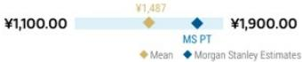

RISK REWARD CHART   
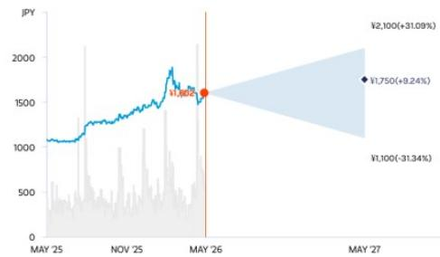

line

| Date   | Value     |
|--------|-----------|
| MAY '25| 1,100     |
| NOV '25| 1,962     |
| MAY '26| 1,750     |
| MAY '27| 1,750     |

Key: — Historical Stock Performance ● Current Stock Price ◆ Price Target   
Source: Refinitiv, MS

# EQUAL-WEIGHT THESIS

■ ROE improves gradually due to moderate recovery in profit, driven by global auto production recovery and headcount increases.   
■ Higher automotive motor volumes drive earnings growth over the longer term.

Consensus Rating Distribution   
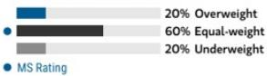  
Source: Refinitiv, MS

# Risk Reward Themes

Secular Growth: Positive

View descriptions of Risk Rewards Themes here

# BULL CASE

# Derived from DCF

Automotive motor output exceeds our base case by 8% thanks to demand growth and market share gains: This scenario assumes OP of ¥33.2bn in F12/26, ¥35.7bn in F12/27 and ¥38.5bn in F12/28 using the same FX and DCF assumptions as the base case. Our bull case fair value estimate equates to P/E of 18.5x (13.0x excluding net financial assets) on F12/26e diluted EPS of ¥113.5.

# ¥2,100

# BASE CASE

# Derived from DCF

Earnings recover gradually due mainly to global auto production recovery: We forecast OP of ¥27.2bn in F12/26, ¥29.3bn in F12/27 and ¥31.6bn in F12/28, assuming an FX rate of ¥150/\$. Our PT is derived from our DCF model, the conditions for which are outlined in our Valuation Methodology. Our PT equates to P/E of 19.3x (12.4x excluding net financial assets) on F12/26e diluted EPS of ¥90.7 and 17.2x on F12/27e diluted EPS of ¥101.5.

# ¥1,750

# BEAR CASE

# End-F12/26e diluted BPS ¥1,369 x P/B 0.8

Profit drops in F12/26 due to rising costs and automobile production decline: This scenario is for OP of ¥21.5bn in F12/26, ¥214bn in F12/27 and ¥19.8bn in F12/28, assuming ROE is expected to decline to 5.6% in FY12/26, remaining above the cost of capital of 5.2%; however, the market consensus has been revised down sharply, and the share price is expected to fall to a P/B of 0.8x, but end-F12/25 net financial assets/share of ¥645 and shareholder returns underpin the share price.

# TDK: Key Financial Data and Risk Reward

Income Statement 

<table><tr><td>(¥ bn)</td><td>F3/25</td><td>F3/26</td><td>F3/27e</td><td>F3/28e</td><td>F3/29e</td></tr><tr><td>Net Sales</td><td>2,204.8</td><td>2,504.8</td><td>2,648.5</td><td>2,869.4</td><td>3,116.3</td></tr><tr><td>Cost of Goods Sold</td><td>1,516.8</td><td>1,721.4</td><td>1,793.6</td><td>1,955.1</td><td>2,139.1</td></tr><tr><td>Gross Profit</td><td>688.0</td><td>783.4</td><td>855.0</td><td>914.3</td><td>977.2</td></tr><tr><td>SG&amp;A Expenses</td><td>494.0</td><td>511.0</td><td>545.2</td><td>566.2</td><td>593.6</td></tr><tr><td>Others*</td><td>30.2</td><td>33.0</td><td>0.0</td><td>0.0</td><td>0.0</td></tr><tr><td>Operating Profit</td><td>224.2</td><td>272.4</td><td>309.8</td><td>348.1</td><td>383.6</td></tr><tr><td>Non-operating Income/Loss</td><td>13.6</td><td>4.4</td><td>4.5</td><td>4.5</td><td>4.5</td></tr><tr><td>Pretax Profit</td><td>237.8</td><td>276.8</td><td>314.3</td><td>352.6</td><td>388.1</td></tr><tr><td>Income Tax</td><td>67.4</td><td>77.6</td><td>78.6</td><td>88.1</td><td>97.0</td></tr><tr><td>(Effective Tax Rate)</td><td>28%</td><td>28%</td><td>25%</td><td>25%</td><td>25%</td></tr><tr><td>Minority Interest</td><td>3.2</td><td>3.5</td><td>4.0</td><td>4.0</td><td>4.0</td></tr><tr><td>Net Profit</td><td>167.2</td><td>195.7</td><td>231.7</td><td>260.4</td><td>287.1</td></tr><tr><td>Capex</td><td>225.3</td><td>298.6</td><td>290.0</td><td>290.0</td><td>300.0</td></tr><tr><td>Depreciation and Amortization</td><td>196.2</td><td>204.2</td><td>210.0</td><td>210.0</td><td>220.0</td></tr><tr><td>R&amp;D Expenses</td><td>253.6</td><td>289.7</td><td>290.0</td><td>300.0</td><td>315.0</td></tr><tr><td>EBITDA</td><td>420.4</td><td>476.6</td><td>519.8</td><td>558.1</td><td>603.6</td></tr><tr><td>ROE</td><td>9.5%</td><td>9.7%</td><td>11.5%</td><td>11.9%</td><td>12.0%</td></tr></table>

<table><tr><td>Average Share Outstanding (Diluted)</td><td>1,900.0</td><td>1,900.2</td><td>1,896.7</td><td>1,897.6</td><td>1,897.6</td></tr><tr><td>EPS (Diluted, Yen)</td><td>88.0</td><td>103.0</td><td>122.1</td><td>137.2</td><td>151.3</td></tr><tr><td>BPS (Yen)</td><td>953.3</td><td>1,159.6</td><td>1,107.6</td><td>1,206.4</td><td>1,317.7</td></tr><tr><td>DPS (Yen)</td><td>30.0</td><td>36.0</td><td>36.0</td><td>40.0</td><td>40.0</td></tr></table>

<table><tr><td>USD/JPY: Average Exchange Rate</td><td>152.7</td><td>150.8</td><td>150.0</td><td>150.0</td><td>150.0</td></tr><tr><td>EUR/JPY: Average Exchange Rate</td><td>163.9</td><td>174.8</td><td>170.0</td><td>170.0</td><td>170.0</td></tr></table>

<table><tr><td colspan="6">YoY % Change</td></tr><tr><td>Net Sales</td><td>5%</td><td>14%</td><td>7%</td><td>8%</td><td>9%</td></tr><tr><td>Operating Profit</td><td>30%</td><td>22%</td><td>16%</td><td>12%</td><td>10%</td></tr><tr><td>Net Profit</td><td>34%</td><td>17%</td><td>20%</td><td>12%</td><td>10%</td></tr></table>

<table><tr><td colspan="6">As % of Sales</td></tr><tr><td>Gross Profit</td><td>31.2%</td><td>31.3%</td><td>32.3%</td><td>31.9%</td><td>31.4%</td></tr><tr><td>Operating Profit</td><td>10.2%</td><td>10.9%</td><td>11.7%</td><td>12.1%</td><td>12.3%</td></tr><tr><td>Net Profit</td><td>7.6%</td><td>7.8%</td><td>8.7%</td><td>9.1%</td><td>9.2%</td></tr><tr><td>Capex</td><td>10.2%</td><td>11.9%</td><td>10.9%</td><td>10.1%</td><td>9.6%</td></tr><tr><td>Depreciation and Amortization</td><td>8.9%</td><td>8.2%</td><td>7.9%</td><td>7.3%</td><td>7.1%</td></tr></table>

Balance Sheet 

<table><tr><td>(¥ bn)</td><td>F3/25</td><td>F3/26</td><td>F3/27e</td><td>F3/28e</td><td>F3/29e</td></tr><tr><td>Total Assets</td><td>3,541.4</td><td>4,415.2</td><td>3,852.4</td><td>4,080.4</td><td>4,336.0</td></tr><tr><td>Total Current Assets</td><td>1,836.9</td><td>2,455.2</td><td>1,972.6</td><td>2,120.5</td><td>2,296.2</td></tr><tr><td>Cash and Cash Equivalents</td><td>697.3</td><td>842.8</td><td>820.8</td><td>932.3</td><td>1,069.7</td></tr><tr><td>Marketable Securities</td><td>0.0</td><td>0.0</td><td>0.0</td><td>0.0</td><td>0.0</td></tr><tr><td>Account Receivables</td><td>583.1</td><td>780.6</td><td>576.5</td><td>601.0</td><td>627.1</td></tr><tr><td>Inventory</td><td>410.0</td><td>585.4</td><td>429.0</td><td>440.8</td><td>453.0</td></tr><tr><td>Other Current Assets</td><td>146.4</td><td>246.4</td><td>146.4</td><td>146.4</td><td>146.4</td></tr><tr><td>Total Long Term Assets</td><td>1,704.6</td><td>1,959.9</td><td>1,879.9</td><td>1,959.9</td><td>2,039.9</td></tr><tr><td>Net PP&amp;E</td><td>1,030.1</td><td>1,225.8</td><td>1,205.4</td><td>1,285.4</td><td>1,365.4</td></tr><tr><td>Investments in Securities</td><td>183.8</td><td>226.8</td><td>183.8</td><td>183.8</td><td>183.8</td></tr><tr><td>Other Assets</td><td>276.6</td><td>269.2</td><td>276.6</td><td>276.6</td><td>276.6</td></tr><tr><td>Total Current Liabilities</td><td>1,098.5</td><td>1,574.5</td><td>1,100.8</td><td>1,136.4</td><td>1,176.9</td></tr><tr><td>ST Debt and Current Portion of LT Debt</td><td>187.1</td><td>211.0</td><td>187.1</td><td>187.1</td><td>187.1</td></tr><tr><td>Accounts Payable</td><td>392.5</td><td>706.7</td><td>394.9</td><td>430.4</td><td>470.9</td></tr><tr><td>Other Current Liabilities</td><td>518.8</td><td>656.9</td><td>518.8</td><td>518.8</td><td>518.8</td></tr><tr><td>Total Long Term Liabilities</td><td>631.7</td><td>637.1</td><td>631.7</td><td>631.7</td><td>631.7</td></tr><tr><td>Long Term Debt</td><td>346.0</td><td>332.7</td><td>346.0</td><td>346.0</td><td>346.0</td></tr><tr><td>Other Long Term Liabilities</td><td>285.7</td><td>304.4</td><td>285.7</td><td>285.7</td><td>285.7</td></tr><tr><td>Minority Interests</td><td>11.2</td><td>16.3</td><td>19.1</td><td>23.1</td><td>27.1</td></tr><tr><td>Total Equity</td><td>1,811.3</td><td>2,203.5</td><td>2,100.8</td><td>2,289.2</td><td>2,500.3</td></tr></table>

<table><tr><td>Net Debt</td><td>-348.0</td><td>-525.9</td><td>-471.4</td><td>-583.0</td><td>-720.4</td></tr></table>

Cash Flow Statement 

<table><tr><td>(¥ bn)</td><td>F3/25</td><td>F3/26</td><td>F3/27e</td><td>F3/28e</td><td>F3/29e</td></tr><tr><td>Net Cash from Operations</td><td>445.8</td><td>507.7</td><td>448.7</td><td>473.7</td><td>513.3</td></tr><tr><td>Net Income</td><td>167.2</td><td>195.7</td><td>231.7</td><td>260.4</td><td>287.1</td></tr><tr><td>Depreciation and Amortization</td><td>196.2</td><td>204.2</td><td>210.0</td><td>210.0</td><td>220.0</td></tr><tr><td>Changes in Working Capital</td><td>2.5</td><td>-8.9</td><td>2.9</td><td>-0.8</td><td>2.2</td></tr><tr><td>Other-net</td><td>80.0</td><td>116.7</td><td>4.0</td><td>4.0</td><td>4.0</td></tr><tr><td>Net Cash from Investing Activities</td><td>-244.8</td><td>-377.8</td><td>-290.0</td><td>-290.0</td><td>-300.0</td></tr><tr><td>Purchase of PP&amp;E</td><td>-225.3</td><td>-298.6</td><td>-290.0</td><td>-290.0</td><td>-300.0</td></tr><tr><td>Sale/Purchase of Investments</td><td>9.9</td><td>-4.3</td><td>0.0</td><td>0.0</td><td>0.0</td></tr><tr><td>Other-net</td><td>-29.5</td><td>-74.9</td><td>0.0</td><td>0.0</td><td>0.0</td></tr><tr><td>Free Cash Flow</td><td>201.0</td><td>129.9</td><td>158.7</td><td>183.7</td><td>213.3</td></tr><tr><td>Net Cash from Financing Activities</td><td>-143.3</td><td>-64.7</td><td>-64.5</td><td>-72.1</td><td>-75.9</td></tr><tr><td>Change in Interest-bearing Debt</td><td>-81.3</td><td>9.9</td><td>0.0</td><td>0.0</td><td>0.0</td></tr><tr><td>Change in Treasury Stock</td><td>0.0</td><td>0.0</td><td>0.0</td><td>0.0</td><td>0.0</td></tr><tr><td>Payment of Cash Dividends</td><td>-48.5</td><td>-60.7</td><td>-64.5</td><td>-72.1</td><td>-75.9</td></tr><tr><td>Other-net</td><td>-13.5</td><td>-13.9</td><td>0.0</td><td>0.0</td><td>0.0</td></tr><tr><td>Net Effect of Exchange Rate Changes</td><td>-10.4</td><td>80.3</td><td>0.0</td><td>0.0</td><td>0.0</td></tr><tr><td>Net Change in Cash</td><td>47.3</td><td>145.5</td><td>94.2</td><td>111.6</td><td>137.4</td></tr><tr><td>Cash at End of Period</td><td>697.3</td><td>842.8</td><td>820.8</td><td>932.3</td><td>1,069.7</td></tr></table>

Segment Information 

<table><tr><td>(¥ bn)</td><td>F3/25</td><td>F3/26</td><td>F3/27e</td><td>F3/28e</td><td>F3/29e</td></tr><tr><td>Net Sales</td><td>2,204.8</td><td>2,504.8</td><td>2,648.5</td><td>2,869.4</td><td>3,116.3</td></tr><tr><td>Passive Components</td><td>559.6</td><td>593.2</td><td>625.3</td><td>650.7</td><td>677.6</td></tr><tr><td>Capacitors</td><td>234.3</td><td>257.5</td><td>276.1</td><td>292.6</td><td>310.2</td></tr><tr><td>Inductive Devices</td><td>204.3</td><td>216.2</td><td>226.2</td><td>235.3</td><td>244.7</td></tr><tr><td>Other Passive Components</td><td>121.1</td><td>119.5</td><td>123.0</td><td>122.8</td><td>122.8</td></tr><tr><td>Sensor Application Products</td><td>189.5</td><td>224.6</td><td>236.7</td><td>252.7</td><td>269.9</td></tr><tr><td>Magnetic Application Products</td><td>223.6</td><td>262.9</td><td>301.9</td><td>311.5</td><td>321.6</td></tr><tr><td>Energy Application Products</td><td>1,176.5</td><td>1,370.3</td><td>1,432.7</td><td>1,604.6</td><td>1,797.2</td></tr><tr><td>Other</td><td>55.6</td><td>53.8</td><td>52.0</td><td>50.0</td><td>50.0</td></tr><tr><td>Total Operating Profit</td><td>224.2</td><td>272.4</td><td>309.8</td><td>348.1</td><td>383.6</td></tr><tr><td>Passive Components</td><td>34.1</td><td>41.8</td><td>52.9</td><td>63.9</td><td>72.1</td></tr><tr><td>Sensor Application Products</td><td>5.0</td><td>20.7</td><td>24.3</td><td>30.4</td><td>33.6</td></tr><tr><td>Magnetic Application Products</td><td>3.4</td><td>27.0</td><td>42.9</td><td>49.2</td><td>56.0</td></tr><tr><td>Energy Application Products</td><td>234.4</td><td>246.7</td><td>243.7</td><td>258.5</td><td>275.0</td></tr><tr><td>Other</td><td>-4.4</td><td>-10.2</td><td>-4.0</td><td>-4.0</td><td>-4.0</td></tr><tr><td>Corporate and Eliminations</td><td>-48.3</td><td>-53.6</td><td>-50.0</td><td>-50.0</td><td>-50.0</td></tr><tr><td>Profit Margin</td><td>10.2%</td><td>10.9%</td><td>11.7%</td><td>12.1%</td><td>12.3%</td></tr><tr><td>Passive Components</td><td>6.1%</td><td>7.1%</td><td>8.5%</td><td>9.8%</td><td>10.6%</td></tr><tr><td>Sensor Application Products</td><td>2.6%</td><td>9.2%</td><td>10.3%</td><td>12.0%</td><td>12.4%</td></tr><tr><td>Magnetic Application Products</td><td>1.5%</td><td>10.3%</td><td>14.2%</td><td>15.8%</td><td>17.4%</td></tr><tr><td>Energy Application Products</td><td>19.9%</td><td>18.0%</td><td>17.0%</td><td>16.1%</td><td>15.4%</td></tr><tr><td>Other</td><td>-8.0%</td><td>-19.0%</td><td>-7.7%</td><td>-8.0%</td><td>-8.0%</td></tr></table>

# Risk Reward – TDK (6762.T) Top Pick

We expect LiB profit growth and continued improvement beyond LiB

# PRICE TARGET ¥3,200

Derived from the base case. DCF assumptions: risk-free rate 2.2%, equity beta 1.27, risk premium 3.7%, yielding WACC 6.3%. Zero growth from F3/36.

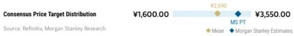

bar

Consensus Price Target Distribution
| Category | Value ($) |
|---|---|
| MS PT | 2,690 |
| MS Estimates | 3,550 |
Source: Refinitiv, MS

RISK REWARD CHART

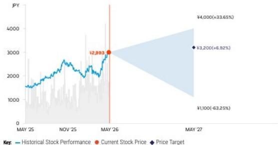

line

| Date   | Historical Stock Performance | Current Stock Price | Price Target |
|--------|-------------------------------|---------------------|--------------|
| MAY '25| ~1,500                        | -                   | -            |
| NOV '25| ~2,500                        | -                   | -            |
| MAY '26| 12,983                        | -                   | -            |
| MAY '27| -                             | 3,200               | 4,000        |

Source: Refinitiv, MS

# OVERWEIGHT THESIS

■ We expect Passive Components and Sensor Application earnings to improve from F3/26 after the bottom in F3/25.   
■ We envision only modest LiB profit in F3/27, but sustained LiB profit growth in the mid-long term as value-added silicon cathode sales expand.   
■ HDD related business earnings recovery to continue after turning to the black in F3/25.

Consensus Rating Distribution   
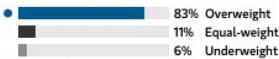  
MS Rating   
Source: Refinitiv, MS

# Risk Reward Themes

New Data Era: Positive View descriptions of Risk Rewards Themes here

# BULL CASE

# Derived from DCF

Earnings from rechargeable batteries, passive components, sensors, and HDD heads ahead of base case. OP ¥294.3bn in

F3/26, ¥350.9bn in F3/27, ¥409.0bn in F3/28. Same currency and DCF model assumptions as base case. Fair value equates to P/E 29.0x on F3/27e diluted EPS ¥138.0, P/E 24.8x on F3/28e diluted EPS ¥161.0.

# ¥4,000

# BASE CASE

# Derived from DCF

Only moderate LIB profit growth in F3/27, but in mid-long term, profit expansion not only for LIB, but also for HDDs, sensors and passive components. OP ¥267.9bn in F3/26, ¥309.8bn in F3/27, ¥348.1bn in F3/28. Assumes ¥150/USD, ¥170/EUR; DCF model assumptions: risk-free rate 2.2%, equity beta 1.27, risk premium 3.7%, yielding WACC 6.3%. Zero growth from F3/36. Fair value equates to P/E 26.2x F3/27e diluted EPS ¥122.1, 23.3x F3/28 diluted EPS ¥137.2.

# ¥3,200

# BEAR CASE

# End-F3/27 diluted BPS ¥1,091 x P/B 1.0x

Limited profit growth due to rechargeable battery slowdown. OP ¥168.2bn in F3/26, ¥186.6bn in F3/27, ¥215.5bn in F3/27. Same currency assumptions as base case. ROE 6.4% in F3/26 and 7.0% in F3/27, almost same as the cost of capital of 6.9%, and P/B equates to 1.0x.

Note: e = MS estimates; Stock price as of the May 15 close for Risk Reward Chart  
Source: Company data, MS

# Alps Alpine: Key Financial Data and Risk Reward

Income Statement 

<table><tr><td>(¥ bn)</td><td>F3/25</td><td>F3/26e</td><td>F3/27e</td><td>F3/28e</td><td>F3/29e</td></tr><tr><td>Net Sales</td><td>990.4</td><td>1,019.5</td><td>1,082.0</td><td>1,179.9</td><td>1,246.6</td></tr><tr><td>Cost of Goods Sold</td><td>815.2</td><td>837.6</td><td>876.5</td><td>943.1</td><td>990.5</td></tr><tr><td>Gross Profit</td><td>175.2</td><td>181.9</td><td>205.5</td><td>236.8</td><td>256.1</td></tr><tr><td>SG&amp;A Expenses</td><td>141.1</td><td>139.8</td><td>154.7</td><td>168.7</td><td>178.3</td></tr><tr><td>Operating Profit</td><td>34.1</td><td>42.0</td><td>50.8</td><td>68.1</td><td>77.8</td></tr><tr><td>Non-Operating Income/Loss</td><td>-3.6</td><td>7.1</td><td>2.4</td><td>2.4</td><td>2.4</td></tr><tr><td>Pretax profit</td><td>57.9</td><td>43.9</td><td>51.2</td><td>68.4</td><td>78.2</td></tr><tr><td>Income Tax</td><td>19.8</td><td>11.1</td><td>14.8</td><td>19.8</td><td>22.7</td></tr><tr><td>(Effective Tax Rate)</td><td>34%</td><td>25%</td><td>29%</td><td>29%</td><td>29%</td></tr><tr><td>Minority Interest</td><td>0.2</td><td>0.4</td><td>0.0</td><td>0.0</td><td>0.0</td></tr><tr><td>Net Profit</td><td>37.8</td><td>26.9</td><td>36.3</td><td>48.6</td><td>55.5</td></tr><tr><td>Capex</td><td>51.8</td><td>61.6</td><td>70.0</td><td>60.0</td><td>60.0</td></tr><tr><td>Depreciation and Amortization</td><td>35.1</td><td>34.0</td><td>40.0</td><td>42.0</td><td>42.0</td></tr><tr><td>R&amp;D</td><td>24.3</td><td>21.9</td><td>30.0</td><td>33.0</td><td>35.0</td></tr><tr><td>EBITDA</td><td>69.2</td><td>76.0</td><td>90.8</td><td>110.1</td><td>119.8</td></tr><tr><td>ROE</td><td>9.4%</td><td>6.2%</td><td>8.7%</td><td>11.0%</td><td>11.6%</td></tr><tr><td>Average Share Outstanding (Diluted)</td><td>205.7</td><td>199.5</td><td>197.0</td><td>194.2</td><td>191.3</td></tr><tr><td>EPS (Diluted, Yen)</td><td>184.0</td><td>134.8</td><td>184.47</td><td>250.27</td><td>290.23</td></tr><tr><td>BPS (Yen)</td><td>2,013.1</td><td>2,293.7</td><td>2,169.4</td><td>2,365.8</td><td>2,605.2</td></tr><tr><td>DPS (Yen)</td><td>60.0</td><td>62.0</td><td>60.0</td><td>60.0</td><td>60.0</td></tr></table>

<table><tr><td>USD/JPY: Average Exchange Rate</td><td>151.3</td><td>150.8</td><td>150.0</td><td>150.0</td><td>150.0</td></tr><tr><td colspan="6">YoY % Change</td></tr><tr><td>Net Sales</td><td>3%</td><td>3%</td><td>7%</td><td>9%</td><td>6%</td></tr><tr><td>Operating Profit</td><td>73%</td><td>23%</td><td>36%</td><td>34%</td><td>14%</td></tr><tr><td>Net Profit</td><td>-</td><td>-29%</td><td>41%</td><td>34%</td><td>14%</td></tr><tr><td colspan="6">As % of Sales</td></tr><tr><td>Gross Profit</td><td>17.7%</td><td>17.8%</td><td>19.0%</td><td>20.1%</td><td>20.5%</td></tr><tr><td>Operating Profit</td><td>3.4%</td><td>4.1%</td><td>4.7%</td><td>5.8%</td><td>6.2%</td></tr><tr><td>Net Profit</td><td>3.8%</td><td>2.6%</td><td>3.4%</td><td>4.1%</td><td>4.5%</td></tr><tr><td>Capex</td><td>5.2%</td><td>6.0%</td><td>6.5%</td><td>5.1%</td><td>4.8%</td></tr><tr><td>Depreciation and Amortization</td><td>3.5%</td><td>3.3%</td><td>3.7%</td><td>3.6%</td><td>3.4%</td></tr></table>

<table><tr><td colspan="6">Balance Sheet</td></tr><tr><td>(¥ bn)</td><td>F3/25</td><td>F3/26e</td><td>F3/27e</td><td>F3/28e</td><td>F3/29e</td></tr><tr><td>Total Assets</td><td>740.7</td><td>783.2</td><td>762.8</td><td>802.3</td><td>846.7</td></tr><tr><td>Total Current Assets</td><td>494.9</td><td>500.7</td><td>455.8</td><td>477.3</td><td>503.7</td></tr><tr><td>Cash and Cash Equivalents</td><td>147.9</td><td>153.6</td><td>74.0</td><td>67.1</td><td>73.7</td></tr><tr><td>Marketable Securities</td><td>0.0</td><td>0.0</td><td>0.0</td><td>0.0</td><td>0.0</td></tr><tr><td>Account Receivables</td><td>166.8</td><td>169.4</td><td>177.8</td><td>193.8</td><td>204.8</td></tr><tr><td>Inventory</td><td>138.6</td><td>138.3</td><td>162.5</td><td>174.9</td><td>183.7</td></tr><tr><td>Other Current Assets</td><td>41.5</td><td>41.5</td><td>41.5</td><td>41.5</td><td>41.5</td></tr><tr><td>Total Long Term Assets</td><td>245.8</td><td>282.4</td><td>307.0</td><td>325.0</td><td>343.0</td></tr><tr><td>Net PP&amp;E</td><td>136.7</td><td>158.0</td><td>197.9</td><td>215.9</td><td>233.9</td></tr><tr><td>Investments in Securities</td><td>60.0</td><td>67.7</td><td>60.0</td><td>60.0</td><td>60.0</td></tr><tr><td>Other assets</td><td>49.1</td><td>56.8</td><td>49.1</td><td>49.1</td><td>49.1</td></tr><tr><td>Total Current Liabilities</td><td>226.9</td><td>240.7</td><td>235.6</td><td>243.1</td><td>248.5</td></tr><tr><td>ST Debt &amp; Current Portion of LT Debt</td><td>44.3</td><td>37.1</td><td>44.3</td><td>44.3</td><td>44.3</td></tr><tr><td>Accounts Payable</td><td>90.4</td><td>93.2</td><td>99.1</td><td>106.6</td><td>112.0</td></tr><tr><td>Other Current Liabilities</td><td>92.2</td><td>92.2</td><td>92.2</td><td>92.2</td><td>92.2</td></tr><tr><td>Total Long Term Liabilities</td><td>98.3</td><td>93.0</td><td>98.3</td><td>98.3</td><td>98.3</td></tr><tr><td>Long Term Debt</td><td>56.5</td><td>55.2</td><td>56.5</td><td>56.5</td><td>56.5</td></tr><tr><td>Other Long Term Liabilities</td><td>41.8</td><td>41.8</td><td>41.8</td><td>41.8</td><td>41.8</td></tr><tr><td>Minority Interests</td><td>1.5</td><td>1.9</td><td>1.5</td><td>1.5</td><td>1.5</td></tr><tr><td>Total Equity</td><td>415.5</td><td>449.4</td><td>428.9</td><td>460.8</td><td>499.9</td></tr><tr><td>Net Debt</td><td>-107.2</td><td>-129.0</td><td>-33.3</td><td>-26.3</td><td>0.0</td></tr></table>

Cash Flow Statement 

<table><tr><td>(¥ bn)</td><td>F3/25</td><td>F3/26e</td><td>F3/27e</td><td>F3/28e</td><td>F3/29e</td></tr><tr><td>Net Cash from Operations</td><td>65.8</td><td>95.9</td><td>61.3</td><td>69.7</td><td>83.1</td></tr><tr><td>Net Income</td><td>37.8</td><td>26.9</td><td>36.3</td><td>48.6</td><td>55.5</td></tr><tr><td>Depreciation and Amortization</td><td>35.1</td><td>34.0</td><td>40.0</td><td>42.0</td><td>42.0</td></tr><tr><td>Changes in Working Capital:</td><td>9.0</td><td>16.0</td><td>-15.0</td><td>-20.9</td><td>-14.4</td></tr><tr><td>Other-net</td><td>-16.2</td><td>19.1</td><td>0.0</td><td>0.0</td><td>0.0</td></tr><tr><td>Net Cash from Investing Activities</td><td>-1.7</td><td>-58.4</td><td>-70.0</td><td>-60.0</td><td>-60.0</td></tr><tr><td>Purchase of PP&amp;E</td><td>-43.0</td><td>-43.6</td><td>-70.0</td><td>-60.0</td><td>-60.0</td></tr><tr><td>Sale/Purchase of Investments</td><td>0.0</td><td>0.0</td><td>0.0</td><td>0.0</td><td>0.0</td></tr><tr><td>Other-net</td><td>41.4</td><td>-14.8</td><td>0.0</td><td>0.0</td><td>0.0</td></tr><tr><td>Free cash flow</td><td>64.1</td><td>37.5</td><td>-8.7</td><td>9.7</td><td>23.1</td></tr><tr><td>Net Cash from Financing Activities</td><td>-37.3</td><td>-41.1</td><td>-16.8</td><td>-16.6</td><td>-16.5</td></tr><tr><td>Change in Interest-bearing Debt</td><td>-28.5</td><td>-9.5</td><td>0.0</td><td>0.0</td><td>0.0</td></tr><tr><td>Change in Treasury Stock</td><td>0.0</td><td>0.0</td><td>-5.0</td><td>-5.0</td><td>-5.0</td></tr><tr><td>Payment of Cash Dividends</td><td>-8.2</td><td>-12.2</td><td>-11.8</td><td>-11.6</td><td>-11.5</td></tr><tr><td>Other-net</td><td>-0.5</td><td>-19.4</td><td>0.0</td><td>0.0</td><td>0.0</td></tr><tr><td>Net Effect of Exchange Rate Changes</td><td>-1.7</td><td>9.5</td><td>0.0</td><td>0.0</td><td>0.0</td></tr><tr><td>Net Change in Cash</td><td>25.2</td><td>5.9</td><td>-25.5</td><td>-7.0</td><td>6.7</td></tr></table>

Segment Information 

<table><tr><td>(¥ bn)</td><td>F3/25</td><td>F3/26e</td><td>F3/27e</td><td>F3/28e</td><td>F3/29e</td></tr><tr><td>Net Sales</td><td>990.4</td><td>1,019.5</td><td>1,082.0</td><td>1,179.9</td><td>1,246.6</td></tr><tr><td>Components</td><td>348.0</td><td>358.4</td><td>422.6</td><td>479.9</td><td>502.1</td></tr><tr><td>Sensor &amp; Communication</td><td>84.2</td><td>85.3</td><td>90.5</td><td>95.0</td><td>99.8</td></tr><tr><td>Mobility</td><td>537.2</td><td>555.1</td><td>548.9</td><td>584.9</td><td>624.6</td></tr><tr><td>Logistics/Others</td><td>21.0</td><td>20.8</td><td>20.0</td><td>20.0</td><td>20.0</td></tr><tr><td>Total Operating Profit</td><td>34.1</td><td>42.0</td><td>50.8</td><td>68.1</td><td>77.8</td></tr><tr><td>Components</td><td>30.4</td><td>30.2</td><td>41.8</td><td>56.1</td><td>64.8</td></tr><tr><td>Sensor &amp; Communication</td><td>-3.4</td><td>-3.5</td><td>-2.0</td><td>0.0</td><td>1.0</td></tr><tr><td>Mobility</td><td>5.6</td><td>14.2</td><td>10.0</td><td>11.0</td><td>11.0</td></tr><tr><td>Logistics/Others</td><td>1.5</td><td>1.3</td><td>1.0</td><td>1.0</td><td>1.0</td></tr><tr><td>Operating Profit Margin</td><td>3.4%</td><td>4.1%</td><td>4.7%</td><td>5.8%</td><td>6.2%</td></tr><tr><td>Components</td><td>8.7%</td><td>8.4%</td><td>9.9%</td><td>11.7%</td><td>12.9%</td></tr><tr><td>Sensor &amp; Communication</td><td>-4.0%</td><td>-4.1%</td><td>-2.2%</td><td>0.0%</td><td>1.0%</td></tr><tr><td>Mobility</td><td>1.0%</td><td>2.6%</td><td>1.8%</td><td>1.9%</td><td>1.8%</td></tr><tr><td>Logistics/Others</td><td>7.0%</td><td>6.0%</td><td>5.0%</td><td>5.0%</td><td>5.0%</td></tr></table>

# Risk Reward - ALPS ALPINE (6770.T)

We forecast strong earnings growth above market consensus, but below the plan

# PRICE TARGET ¥2,900

Derived from the base case. DCF model assumptions: risk-free rate 2.2%, equity beta 0.89, risk premium 3.7%, yielding WACC 5.0%. Zero growth from F3/36.

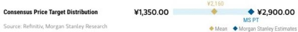

bar_line

Consensus Price Target Distribution
| Category | Value ($) |
|---|---|
| Mean | 2,160 |
| MS Estimates | 2,900 |
Source: Refinitiv, MS

RISK REWARD CHART   
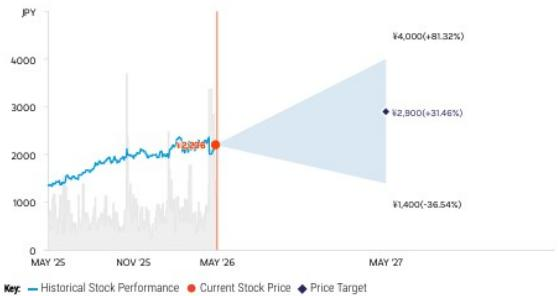

line

| Date    | Historical Stock Performance | Current Stock Price | Price Target |
|---------|-------------------------------|---------------------|--------------|
| MAY '25 | ~1,500                        | -                   | -            |
| NOV '25 | ~2,000                        | -                   | -            |
| MAY '26 | ~2,200                        | 12.966              | -            |
| MAY '27 | -                             | 2,800               | 2,800        |
|       | -                             | -                   | 1,400        |

Source: Refinitiv, MS

# OVERWEIGHT THESIS

■ We expect a significant expansion in profits from smartphone camera actuators and components starting in F3/27.   
■ We expect only limited improvement in performance for the Module & System and Mobility segments.   
We expect continued earnings expansion that falls short of the mid-term plan's final-year (F3/28) OP target of ¥71.0bn, but significantly exceeds market consensus.

Consensus Rating Distribution   
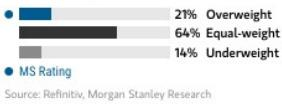

# Risk Reward Themes

Contrarian: Positive View descriptions of Risk Rewards Themes here

# BULL CASE

# Derived from DCF

Earnings improve at a pace exceeding the mid-term management plan. OP ¥41.9bn in F3/26, ¥69.3bn in F3/27, ¥91.6bn in F3/28, ¥101.3bn in F3/29. Same currency and DCF model assumptions as base case. Fair value equates to P/E 16.6x F3/27 diluted EPS ¥240.6, and 12.5x F3/28 diluted EPS ¥320.3, P/B 1.8x end-F3/27e diluted BPS of ¥2,273.

# ¥4,000

# BASE CASE

# Derived from DCF

Although below the mid-term plan, we expect continued strong profit growth driven by camera actuators. We forecast OP ¥37.3bn in F3/26, ¥50.8bn in F3/27, ¥68.1bn in F3/28, ¥77.8bn in F3/29 Base case assumes ¥150/USD. Fair value equates to P/E 15.7 x F3/27e diluted EPS ¥184.5 and 11.6x F3/28e EPS ¥250.3.

# ¥2,900

# BEAR CASE

# F3/27e diluted BPS ¥1,995 x P/B 07x

Sluggish output of high-end smartphones and declining market share cause smartphone camera actuator sales to fall 10% short of our base case. OP ¥314bn in F3/26, ¥25.7bn in F3/27, ¥25.7bn in F3/28, ¥27.7bn in F3/29. ROE 4.5% in F3/27, lower than the 5.5% cost of capital we assume, and the share drops to 0.7x of F3/27e diluted BPS.

# Nihon Dempa Kogyo: Key Financial Data and Risk Reward

Income Statement 

<table><tr><td>(JPY bn)</td><td>F3/25</td><td>F3/26</td><td>F3/27e</td><td>F3/28e</td><td>F3/29e</td></tr><tr><td>Sales</td><td>53.1</td><td>54.6</td><td>56.1</td><td>58.0</td><td>59.8</td></tr><tr><td>Costs of Sales</td><td>37.0</td><td>38.9</td><td>39.3</td><td>40.8</td><td>42.2</td></tr><tr><td>Gross Profit</td><td>16.1</td><td>15.7</td><td>16.8</td><td>17.2</td><td>17.6</td></tr><tr><td>SG&amp;A (incl. other income/losses)</td><td>11.4</td><td>12.4</td><td>13.0</td><td>12.8</td><td>13.2</td></tr><tr><td>Operating Income</td><td>4.6</td><td>3.4</td><td>3.8</td><td>4.4</td><td>4.4</td></tr><tr><td>Financial income/losses</td><td>-1.7</td><td>-0.8</td><td>-0.5</td><td>-0.5</td><td>-0.5</td></tr><tr><td>Profit before income taxes</td><td>3.0</td><td>2.6</td><td>3.3</td><td>3.9</td><td>3.9</td></tr><tr><td>Income taxes</td><td>1.2</td><td>0.6</td><td>1.0</td><td>1.2</td><td>1.2</td></tr><tr><td>(Effective tax rate)</td><td>39%</td><td>24%</td><td>30%</td><td>31%</td><td>31%</td></tr><tr><td>Profit attributable to non-controlling interests</td><td>0.0</td><td>0.0</td><td>0.0</td><td>0.0</td><td>0.0</td></tr><tr><td>Net Profit</td><td>1.8</td><td>2.1</td><td>2.3</td><td>2.7</td><td>2.7</td></tr><tr><td>Capex</td><td>4.6</td><td>7.4</td><td>6.3</td><td>6.3</td><td>6.0</td></tr><tr><td>Depreciation &amp; amortization</td><td>3.4</td><td>3.9</td><td>4.4</td><td>4.8</td><td>5.2</td></tr><tr><td>R&amp;D</td><td>2.1</td><td>2.9</td><td>2.9</td><td>2.4</td><td>2.5</td></tr><tr><td>EPS (JPY)</td><td>77.8</td><td>89.7</td><td>100.0</td><td>117.3</td><td>117.3</td></tr><tr><td>USD/JPY (Average)</td><td>152.5</td><td>151.0</td><td>150.0</td><td>150.0</td><td>150.0</td></tr></table>

Cashflow Statement 

<table><tr><td>(JPY bn)</td><td>F3/25</td><td>F3/26</td><td>F3/27e</td><td>F3/28e</td><td>F3/29e</td></tr><tr><td>Cash flow from operating activities</td><td>6.1</td><td>4.2</td><td>6.4</td><td>7.4</td><td>7.9</td></tr><tr><td>EBIT</td><td>3.0</td><td>2.6</td><td>3.3</td><td>3.9</td><td>3.9</td></tr><tr><td>Depreciation</td><td>3.4</td><td>3.9</td><td>4.4</td><td>4.8</td><td>5.2</td></tr><tr><td>Changes in Receivables</td><td>0.2</td><td>-0.5</td><td>-0.6</td><td>-0.5</td><td>-0.4</td></tr><tr><td>Change in inventory</td><td>0.6</td><td>-1.5</td><td>-0.4</td><td>-0.2</td><td>-0.2</td></tr><tr><td>Changes in Payables</td><td>0.0</td><td>1.2</td><td>0.5</td><td>0.3</td><td>0.3</td></tr><tr><td>Other</td><td>-1.1</td><td>-1.5</td><td>-0.7</td><td>-0.9</td><td>-0.9</td></tr><tr><td>Cash flow from investing activities</td><td>-4.5</td><td>-7.4</td><td>-6.8</td><td>-6.8</td><td>-6.5</td></tr><tr><td>Purchase of PP&amp;E</td><td>-3.7</td><td>-5.7</td><td>-6.5</td><td>-6.5</td><td>-6.2</td></tr><tr><td>Sales of PP&amp;E</td><td>0.1</td><td>0.0</td><td>0.0</td><td>0.0</td><td>0.0</td></tr><tr><td>Other</td><td>-0.9</td><td>-1.7</td><td>-0.3</td><td>-0.3</td><td>-0.3</td></tr><tr><td>Cash flow from financing activities</td><td>1.9</td><td>-2.4</td><td>-0.2</td><td>-2.3</td><td>-1.5</td></tr><tr><td>Net Change In Borrowings</td><td>3.3</td><td>-0.7</td><td>0.5</td><td>-1.4</td><td>-0.6</td></tr><tr><td>Purchase of treasury shares</td><td>0.0</td><td>-0.2</td><td>0.0</td><td>0.0</td><td>0.0</td></tr><tr><td>Cash dividend paid</td><td>-0.7</td><td>-0.7</td><td>-0.7</td><td>-0.9</td><td>-0.9</td></tr><tr><td>Other</td><td>-0.7</td><td>-0.9</td><td>0.0</td><td>0.0</td><td>0.0</td></tr><tr><td>Effect of exchange rate change</td><td>0.0</td><td>0.5</td><td>0.0</td><td>0.0</td><td>0.0</td></tr><tr><td>Changes in cash and cash equivalents</td><td>3.6</td><td>-5.1</td><td>-0.6</td><td>-1.8</td><td>-0.2</td></tr><tr><td>Cash and cash equivalents at end of the period</td><td>15.9</td><td>10.8</td><td>12.3</td><td>10.6</td><td>10.4</td></tr></table>

# Risk Reward – Nihon Dempa Kogyo (6779.T)

Ensuring profitability of DC, server products is key

# PRICE TARGET ¥1,530

-6.5 Our price target is ¥1,530, based on a DCF valuation (risk-free rate 2.2%; beta 1.2; risk premium 3.7%; WACC 4.6%); beyond our 3-year base earnings models, we also build forecasts for F3/29–30 into our DCF-based valuation, and our assumptions for F3/31 onward are that the firm maintains FCF/share of ¥125; our price target equates to 15.3x our F3/27E EPS of ¥100.0, and our forex rate assumption for the next quarter and thereafter is ¥150/\$

RISK REWARD CHART   
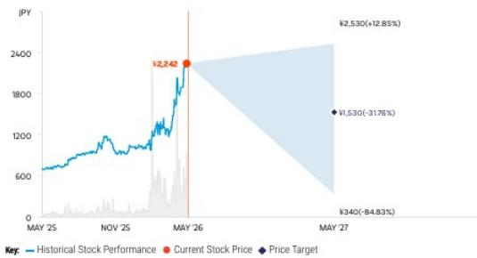

line

| Date   | Historical Stock Performance | Current Stock Price | Price Target |
|--------|-------------------------------|---------------------|--------------|
| MAY '26| 12.42                         | 12.42               |              |
| MAY '27| -                             | -                   | 11.530       |

Source: Refinitiv, MS

# EQUAL-WEIGHT THESIS

We forecast an increase in use of photolithography products in industrial machinery and mobility markets. The firm has high global market share for auto products, for which it is increasing personnel for liquid crystal devices. There is also growth potential in optical transceivers and AI server receivers. However, competition is intensifying in the profitable high-end smartphone field, including for MEMS silicon devices.

Balance Sheet 

<table><tr><td>(JPY bn)</td><td>F3/25</td><td>F3/26</td><td>F3/27e</td><td>F3/28e</td><td>F3/29e</td></tr><tr><td>Total assets</td><td>71.5</td><td>76.3</td><td>75.3</td><td>76.0</td><td>77.5</td></tr><tr><td>Current assets</td><td>43.5</td><td>44.0</td><td>41.9</td><td>40.8</td><td>41.3</td></tr><tr><td>Cash and cash equivalents</td><td>15.9</td><td>10.8</td><td>12.3</td><td>10.6</td><td>10.4</td></tr><tr><td>Accounts receivable</td><td>12.7</td><td>13.8</td><td>13.7</td><td>14.1</td><td>14.6</td></tr><tr><td>Inventories</td><td>10.5</td><td>12.4</td><td>11.5</td><td>11.8</td><td>12.0</td></tr><tr><td>Other financial assets</td><td>4.4</td><td>6.9</td><td>4.4</td><td>4.4</td><td>4.4</td></tr><tr><td>Fixed assets</td><td>28.0</td><td>32.3</td><td>33.3</td><td>35.1</td><td>36.2</td></tr><tr><td>Tangible fixed assets</td><td>19.7</td><td>23.2</td><td>24.8</td><td>26.5</td><td>27.5</td></tr><tr><td>Intangible fixed assets</td><td>2.3</td><td>3.2</td><td>2.5</td><td>2.6</td><td>2.7</td></tr><tr><td>Other non-current assets</td><td>6.0</td><td>5.9</td><td>6.0</td><td>6.0</td><td>6.0</td></tr><tr><td>Current liabilities</td><td>12.2</td><td>14.0</td><td>12.8</td><td>13.2</td><td>13.5</td></tr><tr><td>Short term borrowings</td><td>0.8</td><td>1.3</td><td>0.9</td><td>0.9</td><td>0.9</td></tr><tr><td>Accounts payable</td><td>9.5</td><td>10.3</td><td>10.0</td><td>10.3</td><td>10.7</td></tr><tr><td>Other current liabilities</td><td>1.9</td><td>2.3</td><td>1.9</td><td>1.9</td><td>1.9</td></tr><tr><td>Fixed liabilities</td><td>30.2</td><td>30.4</td><td>30.4</td><td>29.0</td><td>28.4</td></tr><tr><td>Long term borrowings</td><td>25.8</td><td>24.8</td><td>26.0</td><td>24.6</td><td>24.0</td></tr><tr><td>Other fixed liabilities</td><td>4.4</td><td>5.6</td><td>4.4</td><td>4.4</td><td>4.4</td></tr><tr><td>Net assets</td><td>29.2</td><td>31.9</td><td>32.1</td><td>33.8</td><td>35.6</td></tr><tr><td>Total liabilities and equity</td><td>71.5</td><td>76.3</td><td>75.3</td><td>76.0</td><td>77.5</td></tr></table>

# BULL CASE

# Accelerated sales growth for industrials/defence

OP and EPS forecasts of ¥3.2bn/¥85.4 in F3/26, ¥4.0bn/¥104.3 in F3/27, ¥4.8bn/¥130.4 in F3/28, ¥5.6bn/¥152.1 in F3/29, and ¥6.6bn/¥182.5 in F3/30. Our calculations also assume that from F3/31 onward the firm can maintain FCF/share at ¥185. The fair value equates to 24.3x our F3/27E EPS of ¥104.3 and 1.8x BPS of ¥1,403.2.

# ¥2,530

# Machinery/de competition

OP and EPS forecasts of ¥3.2bn/¥85.4 in F3/26, ¥3.8bn/¥100.0 in F3/27, ¥4.4bn/¥117.3 in F3/28, ¥4.4bn/¥117.3 in F3/29, and ¥4.5bn/¥121.7 in F3/30. Our calculations also assume that from F3/31 onward the firm can maintain FCF/share at ¥125. Our PT equates to 15.3x our F3/27E EPS of ¥100.0 and 1.1x BPS of ¥1,398.8.

# ¥1,530

# b comm Weak demand for automotive, NA smartphones

# BEAR CASE

# Weak demand for automotive, NA smartphones

OP and EPS forecasts of ¥3.2bn/¥85.4 in F3/26, ¥2.9bn/¥73.9 in F3/27, ¥2.7bn/¥65.2 in F3/28, ¥2.3bn/¥56.5 in F3/29, and ¥2.3bn/¥56.5 in F3/30. Our calculations also assume that from F3/31 onward the firm can maintain FCF/share at ¥55. The fair value equates to 4.6x our F3/27E EPS of ¥73.9 and 0.2x BPS of ¥1,372.8.

Note: e = MS estimates; Stock price as of the May 15 close for Risk Reward Chart  
Source: Company data, MS

# Meiko Electronics: Key Financial Data and Risk Reward

<table><tr><td>(JPY bn)</td><td>F3/25</td><td>F3/26</td><td>F3/27e</td><td>F3/28e</td><td>F3/29e</td></tr><tr><td>Sales</td><td>206.8</td><td>240.6</td><td>305.1</td><td>368.7</td><td>429.5</td></tr><tr><td>Costs of Sales</td><td>167.0</td><td>190.1</td><td>239.2</td><td>284.6</td><td>327.6</td></tr><tr><td>Gross Profit</td><td>39.8</td><td>50.4</td><td>65.9</td><td>84.1</td><td>101.9</td></tr><tr><td>SG&amp;A</td><td>20.7</td><td>25.9</td><td>32.3</td><td>38.6</td><td>44.5</td></tr><tr><td>Operating Income</td><td>19.1</td><td>24.6</td><td>33.6</td><td>45.5</td><td>57.4</td></tr><tr><td>Non-operating income/expenses</td><td>-0.3</td><td>1.9</td><td>-2.1</td><td>-2.4</td><td>-2.5</td></tr><tr><td>Recurring Profit</td><td>18.8</td><td>26.5</td><td>31.5</td><td>43.1</td><td>54.9</td></tr><tr><td>Extraordinary income</td><td>-0.2</td><td>0.9</td><td>0.0</td><td>0.0</td><td>0.0</td></tr><tr><td>Profit before income taxes</td><td>18.5</td><td>27.4</td><td>31.5</td><td>43.1</td><td>54.9</td></tr><tr><td>Income taxes</td><td>3.4</td><td>7.5</td><td>6.3</td><td>8.6</td><td>11.0</td></tr><tr><td>(Effective tax rate)</td><td>19%</td><td>27%</td><td>20.0%</td><td>20.0%</td><td>20.0%</td></tr><tr><td>Profit attributable to non-controlling interests</td><td>0.2</td><td>0.2</td><td>0.2</td><td>0.2</td><td>0.2</td></tr><tr><td>Net Profit</td><td>14.9</td><td>19.8</td><td>25.0</td><td>34.3</td><td>43.7</td></tr><tr><td>Capex</td><td>29.8</td><td>51.0</td><td>55.0</td><td>55.0</td><td>55.8</td></tr><tr><td>Depreciation &amp; amortization</td><td>12.5</td><td>13.7</td><td>20.0</td><td>26.0</td><td>31.5</td></tr><tr><td>R&amp;D</td><td>6.3</td><td>7.2</td><td>9.2</td><td>11.1</td><td>12.9</td></tr><tr><td>EPS (JPY)</td><td>569.5</td><td>758.6</td><td>974.1</td><td>1,336.5</td><td>1,702.8</td></tr><tr><td>USD/JPY (Average)</td><td>152.6</td><td>151.1</td><td>150.0</td><td>150.0</td><td>150.0</td></tr></table>

<table><tr><td>(JPY bn)</td><td>F3/25</td><td>F3/26</td><td>F3/27e</td><td>F3/28e</td><td>F3/29e</td></tr><tr><td>Cash flow from operating activities</td><td>21.7</td><td>27.5</td><td>29.2</td><td>46.4</td><td>63.0</td></tr><tr><td>EBIT</td><td>18.5</td><td>27.4</td><td>31.5</td><td>43.1</td><td>54.9</td></tr><tr><td>Depreciation</td><td>12.5</td><td>13.7</td><td>20.0</td><td>26.0</td><td>31.5</td></tr><tr><td>Changes in Receivables</td><td>-3.3</td><td>-8.3</td><td>-11.2</td><td>-9.5</td><td>-8.0</td></tr><tr><td>Change in inventory</td><td>2.9</td><td>6.5</td><td>9.5</td><td>9.1</td><td>8.7</td></tr><tr><td>Changes in Payables</td><td>-3.4</td><td>-3.3</td><td>-6.3</td><td>-8.6</td><td>-11.0</td></tr><tr><td>Other</td><td>-5.5</td><td>-8.5</td><td>-14.3</td><td>-13.7</td><td>-13.1</td></tr><tr><td>Cash flow from investing activities</td><td>-24.3</td><td>-55.5</td><td>-55.0</td><td>-55.0</td><td>-55.8</td></tr><tr><td>Purchase of PP&amp;E</td><td>-24.4</td><td>-49.8</td><td>-54.6</td><td>-54.6</td><td>-55.4</td></tr><tr><td>Sales of PP&amp;E</td><td>0.2</td><td>0.0</td><td>0.0</td><td>0.0</td><td>0.0</td></tr><tr><td>Other</td><td>-0.1</td><td>-5.7</td><td>-0.4</td><td>-0.4</td><td>-0.4</td></tr><tr><td>Cash flow from financing activities</td><td>4.1</td><td>30.1</td><td>22.7</td><td>11.2</td><td>-2.6</td></tr><tr><td>Net Change In Borrowings</td><td>7.4</td><td>33.1</td><td>25.8</td><td>15.3</td><td>2.5</td></tr><tr><td>Purchase of treasury shares</td><td>0.0</td><td>0.0</td><td>0.0</td><td>0.0</td><td>0.0</td></tr><tr><td>Cash dividend paid</td><td>-2.4</td><td>-2.7</td><td>-3.1</td><td>-4.1</td><td>-5.1</td></tr><tr><td>Other</td><td>-0.8</td><td>-0.3</td><td>0.0</td><td>0.0</td><td>0.0</td></tr><tr><td>Effect of exchange rate changes</td><td>0.1</td><td>1.4</td><td>0.0</td><td>0.0</td><td>0.0</td></tr><tr><td>Changes in cash and cash equivalents</td><td>1.6</td><td>3.6</td><td>-3.1</td><td>2.6</td><td>4.6</td></tr><tr><td>Cash and cash equivalents at end of the period</td><td>22.9</td><td>26.5</td><td>28.3</td><td>30.9</td><td>35.5</td></tr></table>

Balance Sheet 

<table><tr><td>(JPY bn)</td><td>F3/25</td><td>F3/26e</td><td>F3/27e</td><td>F3/28e</td><td>F3/29e</td></tr><tr><td>Total assets</td><td>256.4</td><td>335.3</td><td>376.2</td><td>431.1</td><td>481.2</td></tr><tr><td>Current assets</td><td>114.1</td><td>142.5</td><td>162.9</td><td>189.2</td><td>215.4</td></tr><tr><td>Cash and cash equivalents</td><td>23.2</td><td>27.5</td><td>28.3</td><td>30.9</td><td>35.5</td></tr><tr><td>Accounts receivable</td><td>46.2</td><td>56.6</td><td>68.1</td><td>82.3</td><td>95.9</td></tr><tr><td>Inventories</td><td>38.5</td><td>49.5</td><td>60.2</td><td>69.7</td><td>77.7</td></tr><tr><td>Other financial assets</td><td>6.3</td><td>8.9</td><td>6.3</td><td>6.3</td><td>6.3</td></tr><tr><td>Fixed assets</td><td>142.3</td><td>192.8</td><td>213.3</td><td>241.9</td><td>265.8</td></tr><tr><td>Tangible fixed assets</td><td>129.6</td><td>174.9</td><td>200.8</td><td>229.4</td><td>253.3</td></tr><tr><td>Intangible fixed assets</td><td>5.7</td><td>5.0</td><td>5.5</td><td>5.5</td><td>5.5</td></tr><tr><td>Other non-current assets</td><td>7.0</td><td>12.8</td><td>7.0</td><td>7.0</td><td>7.0</td></tr><tr><td>Current liabilities</td><td>100.3</td><td>128.3</td><td>134.7</td><td>151.5</td><td>159.6</td></tr><tr><td>Short term borrowings</td><td>52.1</td><td>63.7</td><td>72.0</td><td>79.4</td><td>78.5</td></tr><tr><td>Accounts payable</td><td>29.6</td><td>39.0</td><td>43.7</td><td>52.8</td><td>61.5</td></tr><tr><td>Other current liabilities</td><td>18.6</td><td>25.6</td><td>19.0</td><td>19.3</td><td>19.6</td></tr><tr><td>Fixed liabilities</td><td>40.5</td><td>63.2</td><td>86.1</td><td>93.9</td><td>97.4</td></tr><tr><td>Long term borrowings</td><td>34.7</td><td>57.6</td><td>80.3</td><td>88.1</td><td>91.6</td></tr><tr><td>Other fixed liabilities</td><td>5.8</td><td>5.5</td><td>5.8</td><td>5.8</td><td>5.8</td></tr><tr><td>Net assets</td><td>115.6</td><td>143.8</td><td>155.5</td><td>185.7</td><td>224.2</td></tr><tr><td>Total liabilities and equity</td><td>256.4</td><td>335.3</td><td>376.2</td><td>431.1</td><td>481.2</td></tr></table>

# Risk Reward – Meiko Electronics (6787.T)

Rapid Earnings Growth Driven by Aggressive Investment Largely Priced in

# PRICE TARGET ¥29,200

Our price target is ¥29,200, based on a DCF valuation (risk-free rate 2.2%; beta 1.5; risk premium 3.7%; WACC 4.9%). Beyond our 3-year base earnings models, we also build forecasts for F3/29–30 into our DCF-based valuation. Our assumption from F3/31 onward is that the firm maintains FCF/share of ¥2,300.
Our price target equates to 30.0x our F3/27e EPS of ¥974.1. Our forex rate assumption for the next quarter and thereafter is ¥150/\$

RISK REWARD CHART   
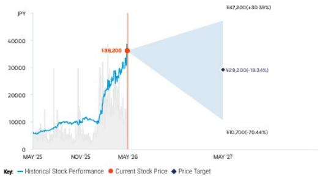

line

| Date       | Historical Stock Performance (JPY) | Current Stock Price (JPY) | Price Target (JPY) |
| ---------- | ----------------------------------- | ------------------------- | ------------------ |
| MAY '26    | 136,200                             | 136,200                   | -                  |
| MAY '27    | -                                   | 129,200                   | -                  |
| MAY '27    | -                                   | -                         | 147,200(+30.38%)   |
| MAY '27    | -                                   | -                         | 129,200(-18.34%)   |
| MAY '27    | -                                   | -                         | 10,700(-70.44%)    |

Source: Refinitiv, MS

# EQUAL-WEIGHT THESIS

Our scenario has the firm benefitting from production capacity enhancements undertaken to meet growing demand. We evaluate positively its proactive stance on expanding production capacity for build-up substrates, including those for satellite communications and high-end smartphones. In our view, Meiko's expertise in producing build-up substrates in Vietnam will enable it to benefit from growing demand for high layer/density buildup PCBs, as well as from efforts to move supply chains out of Greater China.

# Risk Reward Themes

Secular Growth: Positive

View descriptions of Risk Rewards Themes here

# BULL CASE

# ¥47,200

# BASE CASE

# ¥29,200

# BEAR CASE

# ¥10,700

Faster demand growth in buildup/semi PKG substrate

OP and EPS forecasts of ¥25.1bn/¥728.8 in F3/26, ¥37.2bn/¥1,079.4 in F3/27, ¥57.3bn/¥1,691.1 in F3/28, ¥77.1bn/¥2,299.0 in F3/29, and ¥98.1bn/¥2,953.6 in F3/30. Our calculations also assume that from F3/31 onward the firm can maintain FCF/share at ¥3,500.

The fair value equates to 43.7x our F3/27E EPS of ¥1,079.4 and 8.1x BPS of ¥5,844.9.

Continued growth in high layer/density buildup PCB

OP and EPS forecasts of ¥25.1bn/¥760.0 in F3/26, ¥33.6bn/¥974.1 in F3/27, ¥45.5bn/¥1,336.5 in F3/28, ¥57.4bn/¥1,702.8 in F3/29, and ¥68.1bn/¥2,041.8 in F3/30. Our calculations also assume that from F3/31 onward the firm can maintain FCF/share at ¥2,300.

Our PT equates to 30.0x our F3/27E EPS of ¥974.1 and 5.1x BPS of ¥5,770.9.

N. Am handset project stop, slowing sales for auto

OP and EPS forecasts of ¥25.1bn/¥728.8 in F3/26, ¥27.6bn/¥794.9 in F3/27, ¥29.1bn/¥841.7 in F3/28, ¥30.1bn/¥884.5 in F3/29, and ¥32.1bn/¥950.8 in F3/30. Our calculations also assume that from F3/31 onward the firm can maintain FCF/share at ¥1,050.

The fair value equates to 13.5x our F3/27E EPS of ¥794.9 and 1.9x BPS of ¥5,560.5.

Note: e = MS estimates; Stock price as of the May 15 close for Risk Reward Chart  
Source: Company data, MS

# Hirose Electric: Key Financial Data and Risk Reward

Income Statement 

<table><tr><td>(JPY bn)</td><td>F3/25</td><td>F3/26</td><td>F3/27e</td><td>F3/28e</td><td>F3/29e</td></tr><tr><td>Sales</td><td>189.4</td><td>211.3</td><td>224.2</td><td>238.6</td><td>254.2</td></tr><tr><td>Costs of Sales</td><td>104.0</td><td>122.3</td><td>128.6</td><td>137.3</td><td>145.8</td></tr><tr><td>Gross Profit</td><td>85.4</td><td>89.0</td><td>95.6</td><td>101.3</td><td>108.4</td></tr><tr><td>SG&amp;A (incl. other income/losses)</td><td>42.7</td><td>46.0</td><td>49.0</td><td>51.7</td><td>54.9</td></tr><tr><td>Operating Income</td><td>42.7</td><td>43.0</td><td>46.6</td><td>49.6</td><td>53.5</td></tr><tr><td>Financial income/losses</td><td>3.5</td><td>3.6</td><td>3.6</td><td>3.6</td><td>3.6</td></tr><tr><td>Profit before income taxes</td><td>46.2</td><td>46.6</td><td>50.2</td><td>53.2</td><td>57.1</td></tr><tr><td>Income taxes</td><td>13.2</td><td>13.5</td><td>15.4</td><td>16.3</td><td>17.5</td></tr><tr><td>(Effective tax rate)</td><td>29%</td><td>29%</td><td>31%</td><td>31%</td><td>31%</td></tr><tr><td>Profit attributable to non-controlling interests</td><td>0.0</td><td>0.0</td><td>0.0</td><td>0.0</td><td>0.0</td></tr><tr><td>Net Profit</td><td>33.0</td><td>33.1</td><td>34.8</td><td>36.9</td><td>39.6</td></tr><tr><td>Capex</td><td>26.7</td><td>20.0</td><td>28.0</td><td>28.6</td><td>30.5</td></tr><tr><td>Depreciation &amp; amortization</td><td>17.9</td><td>19.5</td><td>22.0</td><td>24.2</td><td>26.0</td></tr><tr><td>R&amp;D</td><td>13.5</td><td>13.5</td><td>15.9</td><td>16.9</td><td>18.1</td></tr><tr><td>EPS (JPY)</td><td>976.3</td><td>991.9</td><td>1,096.5</td><td>1,198.4</td><td>1,315.5</td></tr><tr><td>USD/JPY (Average)</td><td>152.6</td><td>-</td><td>150.0</td><td>150.0</td><td>150.0</td></tr></table>

Cashflow Statement 

<table><tr><td>(JPY bn)</td><td>F3/25</td><td>F3/26</td><td>F3/27e</td><td>F3/28e</td><td>F3/29e</td></tr><tr><td>Cash flow from operating activities</td><td>55.7</td><td>45.9</td><td>53.7</td><td>57.8</td><td>62.0</td></tr><tr><td>EBIT</td><td>46.2</td><td>46.6</td><td>50.2</td><td>53.2</td><td>57.1</td></tr><tr><td>Depreciation</td><td>17.9</td><td>19.5</td><td>22.0</td><td>24.2</td><td>26.0</td></tr><tr><td>Changes in Receivables</td><td>-1.9</td><td>-7.2</td><td>-3.2</td><td>-3.1</td><td>-3.3</td></tr><tr><td>Change in inventory</td><td>-1.4</td><td>-3.5</td><td>-1.3</td><td>-1.2</td><td>-1.2</td></tr><tr><td>Changes in Payables</td><td>2.0</td><td>3.5</td><td>1.0</td><td>1.0</td><td>1.1</td></tr><tr><td>Other</td><td>-7.2</td><td>-13.0</td><td>-15.0</td><td>-16.3</td><td>-17.6</td></tr><tr><td>Cash flow from investing activities</td><td>-42.9</td><td>-9.2</td><td>-28.0</td><td>-28.6</td><td>-30.5</td></tr><tr><td>Purchase of PP&amp;E</td><td>-26.7</td><td>-20.0</td><td>-28.0</td><td>-28.6</td><td>-30.5</td></tr><tr><td>Sales of PP&amp;E</td><td>0.0</td><td>0.0</td><td>0.0</td><td>0.0</td><td>0.0</td></tr><tr><td>Other</td><td>-16.3</td><td>10.8</td><td>0.0</td><td>0.0</td><td>0.0</td></tr><tr><td>Cash flow from financing activities</td><td>-16.7</td><td>-37.9</td><td>-38.1</td><td>-31.2</td><td>-31.7</td></tr><tr><td>Net Change In Borrowings</td><td>0.0</td><td>0.0</td><td>0.0</td><td>0.0</td><td>0.0</td></tr><tr><td>Purchase of treasury shares</td><td>0.0</td><td>-20.4</td><td>-22.5</td><td>-15.0</td><td>-15.0</td></tr><tr><td>Cash dividend paid</td><td>-15.7</td><td>-16.5</td><td>-15.6</td><td>-16.2</td><td>-16.7</td></tr><tr><td>Other</td><td>-0.9</td><td>-1.1</td><td>0.0</td><td>0.0</td><td>0.0</td></tr><tr><td>Effect of exchange rate change</td><td>-0.7</td><td>3.0</td><td>0.1</td><td>0.0</td><td>0.0</td></tr><tr><td>Changes in cash and cash equivalents</td><td>-4.7</td><td>1.7</td><td>-12.3</td><td>-2.0</td><td>-0.2</td></tr><tr><td>Cash and cash equivalents at end of the period</td><td>85.7</td><td>87.3</td><td>58.4</td><td>56.5</td><td>56.2</td></tr></table>

Balance Sheet 

<table><tr><td>(JPY bn)</td><td>F3/25</td><td>F3/26</td><td>F3/27e</td><td>F3/28e</td><td>F3/29e</td></tr><tr><td>Total assets</td><td>416.9</td><td>431.2</td><td>412.8</td><td>419.5</td><td>428.3</td></tr><tr><td>Current assets</td><td>248.8</td><td>233.8</td><td>232.1</td><td>234.4</td><td>238.7</td></tr><tr><td>Cash and cash equivalents</td><td>85.7</td><td>87.3</td><td>58.4</td><td>56.5</td><td>56.2</td></tr><tr><td>Marketable securities</td><td>87.6</td><td>57.6</td><td>87.6</td><td>87.6</td><td>87.6</td></tr><tr><td>Accounts receivable</td><td>40.4</td><td>49.9</td><td>47.8</td><td>50.9</td><td>54.2</td></tr><tr><td>Inventories</td><td>25.1</td><td>30.2</td><td>28.3</td><td>29.4</td><td>30.6</td></tr><tr><td>Other financial assets</td><td>97.6</td><td>66.4</td><td>97.6</td><td>97.6</td><td>97.6</td></tr><tr><td>Fixed assets</td><td>168.1</td><td>197.4</td><td>180.7</td><td>185.1</td><td>189.6</td></tr><tr><td>Tangible fixed assets</td><td>91.3</td><td>96.3</td><td>103.9</td><td>108.3</td><td>112.8</td></tr><tr><td>Intangible fixed assets</td><td>6.6</td><td>7.7</td><td>6.6</td><td>6.6</td><td>6.6</td></tr><tr><td>Other non-current assets</td><td>70.2</td><td>93.4</td><td>70.2</td><td>70.2</td><td>70.2</td></tr><tr><td>Current liabilities</td><td>29.1</td><td>32.8</td><td>28.7</td><td>29.6</td><td>30.6</td></tr><tr><td>Short term borrowings</td><td>0.0</td><td>0.0</td><td>0.0</td><td>0.0</td><td>0.0</td></tr><tr><td>Accounts payable</td><td>12.9</td><td>16.7</td><td>15.3</td><td>16.2</td><td>17.3</td></tr><tr><td>Other current liabilities</td><td>16.2</td><td>16.1</td><td>13.4</td><td>13.4</td><td>13.3</td></tr><tr><td>Fixed liabilities</td><td>17.7</td><td>20.3</td><td>17.7</td><td>17.7</td><td>17.7</td></tr><tr><td>Long term borrowings</td><td>0.0</td><td>0.0</td><td>0.0</td><td>0.0</td><td>0.0</td></tr><tr><td>Other fixed liabilities</td><td>17.7</td><td>20.3</td><td>17.7</td><td>17.7</td><td>17.7</td></tr><tr><td>Net assets</td><td>370.1</td><td>378.1</td><td>366.5</td><td>372.2</td><td>380.1</td></tr><tr><td>Total liabilities and equity</td><td>416.9</td><td>431.2</td><td>412.8</td><td>419.5</td><td>428.3</td></tr></table>

Sales by Applications 

<table><tr><td>(JPY bn)</td><td>F3/25</td><td>F3/26</td><td>F3/27e</td><td>F3/28e</td><td>F3/29e</td></tr><tr><td>General Industrial</td><td>46.9</td><td>62.0</td><td>68.4</td><td>73.9</td><td>79.8</td></tr><tr><td>Smartphone</td><td>46.4</td><td>44.3</td><td>43.8</td><td>45.2</td><td>46.5</td></tr><tr><td>Consumer/Mobile equipment</td><td>34.7</td><td>34.7</td><td>33.3</td><td>34.0</td><td>34.7</td></tr><tr><td>Automotive/Mobility related</td><td>49.2</td><td>54.3</td><td>60.1</td><td>66.1</td><td>72.7</td></tr><tr><td>Telecommunications infrastructure equipment</td><td>5.4</td><td>6.7</td><td>9.3</td><td>10.3</td><td>11.3</td></tr><tr><td>OA equipment and Others</td><td>6.8</td><td>9.3</td><td>9.2</td><td>9.2</td><td>9.2</td></tr><tr><td>(YoY)</td><td></td><td></td><td></td><td></td><td></td></tr><tr><td>General Industrial</td><td>-7%</td><td>32%</td><td>11%</td><td>8%</td><td>8%</td></tr><tr><td>Smartphone</td><td>31%</td><td>-5%</td><td>2%</td><td>3%</td><td>3%</td></tr><tr><td>Consumer/Mobile equipment</td><td>37%</td><td>0%</td><td>-3%</td><td>2%</td><td>2%</td></tr><tr><td>Automotive/Mobility related</td><td>15%</td><td>10%</td><td>10%</td><td>10%</td><td>10%</td></tr><tr><td>Telecommunications infrastructure equipment</td><td>20%</td><td>24%</td><td>43%</td><td>10%</td><td>10%</td></tr><tr><td>OA equipment and Others</td><td>0%</td><td>36%</td><td>0%</td><td>0%</td><td>0%</td></tr></table>

# Risk Reward – Hirose Electric (6806.T)

Sustained high profitability and strong sales growth

# PRICE TARGET ¥26,300

Our price target is ¥26,300, based on a DCF valuation (risk-free rate 2.2%; beta 0.9; risk premium 3.7%; WACC 5.2%). Beyond our three-year forecasts, we also build forecasts for F3/29–30 into our DCF-based valuation. Our assumptions for F3/31 onward are that the firm maintains FCF/share of ¥1,450. Our price target equates to 24.0x our F3/27e EPS of ¥1,096.5. Our forex rate assumption for the next quarter and thereafter is ¥150/\$.

Consensus Price Target Distribution

Source: Refinitiv, MS

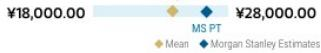

RISK REWARD CHART   
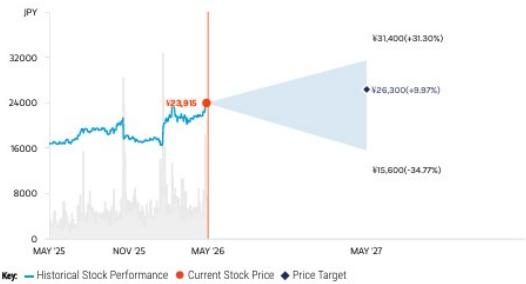

line

| Date   | Historical Stock Performance | Current Stock Price | Price Target |
|--------|-------------------------------|---------------------|--------------|
| MAY '25| ~16000                        | -                   | -            |
| NOV '25| ~18000                        | -                   | -            |
| MAY '26| 23,815                        | 23,815              | -            |
| MAY '27| -                             | 26,300              | -            |
|       | -                             | 31,400(+31.30%)    | 15,600(-34.77%) |

Source: Refinitiv, MS

# OVERWEIGHT THESIS

The equity story is the continued top-line growth across applications through the acquisition of high-margin projects. We like the continued high level of sales growth relative to historical levels, while maintaining a high-profitability structure enabled by its semi-fabless production model. We believe that if the equity market comes to view profit growth as a mid-term trend, there is further upside to valuations.

Consensus Rating Distribution   
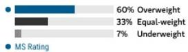  
Source: Refinitiv, MS

# Risk Reward Themes

Secular Growth: Positive Technology Diffusion: Positive

View descriptions of Risk Rewards Themes here

# BULL CASE

Accelerated profit growth through new project wins

OP and EPS forecasts of ¥42.5bn/¥952.1 in F3/26, ¥50.0bn/¥1,172.1 in F3/27, ¥56.4bn/¥1,351.0 in F3/28, ¥63.9bn/¥1,554.7 in F3/29, and ¥72.8bn/¥1,801.8 in F3/30. Our calculations also assume that from F3/31 onward the firm can maintain FCF/share at ¥1,800. The fair value equates to 26.8x our F3/27E EPS of ¥1,172.1 and 2.6x BPS of ¥11,913.2.

# ¥31,400

# BASE CASE

Sales growth continues for industrial/automotive

OP and EPS forecasts of ¥42.5bn/¥952.1 in F3/26, ¥46.6bn/¥1,096.5 in F3/27, ¥49.6bn/¥1,198.4 in F3/28, ¥53.5bn/¥1,315.5 in F3/29, and ¥58.0bn/¥1,455.1 in F3/30. Our calculations also assume that from F3/31 onward the firm can maintain FCF/share at ¥1,450. Our PT equates to 24.0x our F3/27E EPS of ¥1,096.5 and 2.2x BPS of ¥11,835.7.

# ¥26,300

# [Non-Text]

# BEAR CASE

Lower NA phone share, slower growth of ind. sales

OP and EPS forecasts of ¥42.5bn/¥952.1 in F3/26, ¥40.6bn/¥967.3 in F3/27, ¥38.4bn/¥945.1 in F3/28, ¥36.9bn/¥933.5 in F3/29, and ¥35.6bn/¥924.7 in F3/30. Our calculations also assume that from F3/31 onward the firm can maintain FCF/share at ¥700. The fair value equates to 16.1x our F3/27E EPS of ¥967.3 and 1.3x BPS of ¥11,703.3.

Note: e = MS estimates; Stock price as of the May 15 close for Risk Reward Chart  
Source: Company data, MS

# Japan Aviation Electronics: Key Financial Data and Risk Reward

Income Statement 

<table><tr><td>(JPY bn)</td><td>F3/25</td><td>F3/26</td><td>F3/27e</td><td>F3/28e</td><td>F3/29e</td></tr><tr><td>Sales</td><td>221.6</td><td>227.9</td><td>231.4</td><td>241.4</td><td>252.0</td></tr><tr><td>Costs of Sales</td><td>179.6</td><td>191.4</td><td>193.0</td><td>200.9</td><td>209.6</td></tr><tr><td>Gross Profit</td><td>42.1</td><td>36.4</td><td>38.4</td><td>40.5</td><td>42.4</td></tr><tr><td>SG&amp;A</td><td>26.4</td><td>27.5</td><td>28.1</td><td>29.0</td><td>30.0</td></tr><tr><td>Operating Income</td><td>15.6</td><td>8.9</td><td>10.3</td><td>11.5</td><td>12.4</td></tr><tr><td>Non-operating income/expenses</td><td>-0.8</td><td>-0.7</td><td>0.2</td><td>0.3</td><td>0.3</td></tr><tr><td>Recurring Profit</td><td>14.8</td><td>8.2</td><td>10.5</td><td>11.8</td><td>12.7</td></tr><tr><td>Extraordinary income</td><td>0.3</td><td>1.9</td><td>0.0</td><td>0.0</td><td>0.0</td></tr><tr><td>Profit before income taxes</td><td>15.2</td><td>10.2</td><td>10.5</td><td>11.8</td><td>12.7</td></tr><tr><td>Income taxes</td><td>3.6</td><td>3.1</td><td>3.2</td><td>3.6</td><td>3.9</td></tr><tr><td>(Effective tax rate)</td><td>24%</td><td>30%</td><td>30%</td><td>31%</td><td>31%</td></tr><tr><td>Profit attributable to non-controlling interests</td><td>0.0</td><td>0.0</td><td>0.0</td><td>0.0</td><td>0.0</td></tr><tr><td>Net Profit</td><td>11.6</td><td>7.1</td><td>7.3</td><td>8.2</td><td>8.8</td></tr><tr><td>Capex</td><td>18.0</td><td>23.7</td><td>20.8</td><td>21.7</td><td>22.7</td></tr><tr><td>Depreciation &amp; amortization</td><td>20.9</td><td>19.7</td><td>19.7</td><td>20.2</td><td>20.7</td></tr><tr><td>R&amp;D</td><td>11.3</td><td>12.1</td><td>11.8</td><td>12.3</td><td>12.9</td></tr><tr><td>EPS (JPY)</td><td>172.0</td><td>104.9</td><td>108.3</td><td>121.6</td><td>130.5</td></tr><tr><td>USD/JPY (Average)</td><td>152.6</td><td>150.7</td><td>150.0</td><td>150.0</td><td>150.0</td></tr></table>

Cashflow Statement 

<table><tr><td>(JPY bn)</td><td>F3/25</td><td>F3/26</td><td>F3/27e</td><td>F3/28e</td><td>F3/29e</td></tr><tr><td>Cash flow from operating activities</td><td>36.3</td><td>17.0</td><td>26.8</td><td>27.8</td><td>28.8</td></tr><tr><td>EBIT</td><td>15.2</td><td>10.2</td><td>10.5</td><td>11.8</td><td>12.7</td></tr><tr><td>Depreciation</td><td>20.9</td><td>19.7</td><td>19.7</td><td>20.2</td><td>20.7</td></tr><tr><td>Changes in Receivables</td><td>3.8</td><td>-0.1</td><td>-1.2</td><td>-1.7</td><td>-1.8</td></tr><tr><td>Change in inventory</td><td>-1.0</td><td>-2.6</td><td>-0.3</td><td>-0.7</td><td>-0.7</td></tr><tr><td>Changes in Payables</td><td>1.6</td><td>-2.9</td><td>0.9</td><td>1.3</td><td>1.4</td></tr><tr><td>Other</td><td>-4.0</td><td>-7.2</td><td>-2.7</td><td>-3.1</td><td>-3.4</td></tr><tr><td>Cash flow from investing activities</td><td>-19.2</td><td>-24.4</td><td>-21.0</td><td>-21.9</td><td>-22.9</td></tr><tr><td>Purchase of PP&amp;E</td><td>-18.0</td><td>-23.7</td><td>-20.8</td><td>-21.7</td><td>-22.7</td></tr><tr><td>Sales of PP&amp;E</td><td>0.4</td><td>0.0</td><td>0.0</td><td>0.0</td><td>0.0</td></tr><tr><td>Other</td><td>-1.5</td><td>-0.7</td><td>-0.2</td><td>-0.2</td><td>-0.2</td></tr><tr><td>Cash flow from financing activities</td><td>-31.6</td><td>0.5</td><td>-7.3</td><td>-5.7</td><td>-5.2</td></tr><tr><td>Net Change In Borrowings</td><td>-27.5</td><td>4.8</td><td>-3.3</td><td>-1.6</td><td>-1.1</td></tr><tr><td>Purchase of treasury shares</td><td>0.0</td><td>0.0</td><td>0.0</td><td>0.0</td><td>0.0</td></tr><tr><td>Cash dividend paid</td><td>-4.0</td><td>-4.0</td><td>-4.0</td><td>-4.0</td><td>-4.0</td></tr><tr><td>Other</td><td>0.0</td><td>-0.3</td><td>0.0</td><td>0.0</td><td>0.0</td></tr><tr><td>Effect of exchange rate changes</td><td>-1.0</td><td>2.6</td><td>0.2</td><td>0.0</td><td>0.0</td></tr><tr><td>Changes in cash and cash equivalents</td><td>-15.4</td><td>-4.4</td><td>-1.2</td><td>0.2</td><td>0.7</td></tr><tr><td>Cash and cash equivalents at end of the period</td><td>52.9</td><td>48.5</td><td>50.7</td><td>50.9</td><td>51.6</td></tr></table>

# Risk Reward – Japan Aviation Electronics Industry (6807.T)

Key to profitability recovery is regaining North American smartphone share

# PRICE TARGET ¥2,600

Our price target is ¥2,600, based on a DCF valuation (risk-free rate 2.2%; beta 1.0; risk premium 3.7%; WACC 4.8%). Beyond our three-year forecasts, we also build forecasts for F3/29–30 into our DCF-based valuation. Our assumptions for F3/31 onward are that the firm maintains FCF/share of ¥130. Our price target equates to 24.0x our F3/27e EPS of ¥108.3. Our forex rate assumption for the next quarter and thereafter is ¥150/\$.

Consensus Price Target Distribution

Source: Refinitiv, MS

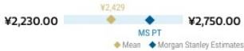

# EQUAL-WEIGHT THESIS

The equity story centers on margin improvement driven by a recovery in North American smartphone connector share. Top-line growth is expected to continue, driven not only by increased sales of wire harnesses for ADAS cameras but also by connectors for BEV chargers and expanded connector sales in India. However, for the stock to rise, we believe profitability must improve through a rebound in North American B-to-B connector market share and expansion of the relatively high-margin aerospace business.

Balance Sheet 

<table><tr><td>(JPY bn)</td><td>F3/25</td><td>F3/26e</td><td>F3/27e</td><td>F3/28e</td><td>F3/29e</td></tr><tr><td>Total assets</td><td>215.4</td><td>232.1</td><td>219.4</td><td>223.3</td><td>228.3</td></tr><tr><td>Current assets</td><td>125.3</td><td>130.7</td><td>126.7</td><td>129.2</td><td>132.5</td></tr><tr><td>Cash and cash equivalents</td><td>52.9</td><td>48.5</td><td>50.7</td><td>50.9</td><td>51.6</td></tr><tr><td>Marketable securities</td><td>0.0</td><td>0.0</td><td>0.0</td><td>0.0</td><td>0.0</td></tr><tr><td>Accounts receivable</td><td>37.7</td><td>38.9</td><td>39.3</td><td>41.0</td><td>42.8</td></tr><tr><td>Inventories</td><td>29.2</td><td>32.8</td><td>31.1</td><td>31.7</td><td>32.4</td></tr><tr><td>Other financial assets</td><td>5.6</td><td>10.4</td><td>5.6</td><td>5.6</td><td>5.6</td></tr><tr><td>Fixed assets</td><td>90.2</td><td>101.5</td><td>92.8</td><td>94.0</td><td>95.9</td></tr><tr><td>Tangible fixed assets</td><td>70.3</td><td>77.6</td><td>73.4</td><td>74.9</td><td>76.9</td></tr><tr><td>Intangible fixed assets</td><td>2.7</td><td>3.1</td><td>2.2</td><td>1.9</td><td>1.7</td></tr><tr><td>Other non-current assets</td><td>17.2</td><td>20.8</td><td>17.2</td><td>17.2</td><td>17.2</td></tr><tr><td>Current liabilities</td><td>48.9</td><td>52.9</td><td>50.6</td><td>52.1</td><td>53.7</td></tr><tr><td>Short term borrowings</td><td>6.0</td><td>11.0</td><td>6.4</td><td>6.5</td><td>6.7</td></tr><tr><td>Accounts payable</td><td>28.4</td><td>25.5</td><td>29.6</td><td>30.9</td><td>32.3</td></tr><tr><td>Other current liabilities</td><td>14.6</td><td>16.4</td><td>14.6</td><td>14.7</td><td>14.7</td></tr><tr><td>Fixed liabilities</td><td>32.8</td><td>34.9</td><td>27.9</td><td>26.1</td><td>24.8</td></tr><tr><td>Long term borrowings</td><td>31.0</td><td>30.8</td><td>26.1</td><td>24.3</td><td>23.0</td></tr><tr><td>Other fixed liabilities</td><td>1.8</td><td>4.1</td><td>1.8</td><td>1.8</td><td>1.8</td></tr><tr><td>Net assets</td><td>133.7</td><td>144.4</td><td>140.9</td><td>145.1</td><td>149.8</td></tr><tr><td>Total liabilities and equity</td><td>215.4</td><td>232.1</td><td>219.4</td><td>223.3</td><td>228.3</td></tr></table>

Sales by Application/Product 

<table><tr><td>(JPY bn)</td><td>F3/25</td><td>F3/26</td><td>F3/27e</td><td>F3/28e</td><td>F3/29e</td></tr><tr><td>Connector</td><td>192.8</td><td>199.2</td><td>203.0</td><td>211.1</td><td>219.8</td></tr><tr><td>Handhelds</td><td>66.9</td><td>65.2</td><td>65.2</td><td>66.6</td><td>68.1</td></tr><tr><td>Automotive</td><td>107.1</td><td>111.0</td><td>113.8</td><td>119.4</td><td>125.4</td></tr><tr><td>Industrial &amp; Infrastructure</td><td>14.5</td><td>17.6</td><td>18.7</td><td>19.9</td><td>21.0</td></tr><tr><td>Others</td><td>4.3</td><td>5.4</td><td>5.3</td><td>5.3</td><td>5.3</td></tr><tr><td>Aerospace</td><td>19.3</td><td>20.5</td><td>20.5</td><td>22.2</td><td>24.1</td></tr><tr><td>Automotive</td><td>0.2</td><td>0.1</td><td>0.1</td><td>0.1</td><td>0.1</td></tr><tr><td>Industrial &amp; Infrastructure</td><td>10.7</td><td>9.3</td><td>9.5</td><td>10.1</td><td>10.7</td></tr><tr><td>Aviation &amp; Space (Defence)</td><td>8.4</td><td>11.1</td><td>10.9</td><td>12.0</td><td>13.2</td></tr><tr><td>UIS</td><td>9.0</td><td>7.7</td><td>7.4</td><td>7.6</td><td>7.7</td></tr><tr><td>Automotive</td><td>5.5</td><td>4.6</td><td>4.5</td><td>4.5</td><td>4.5</td></tr><tr><td>Industrial &amp; Infrastructure</td><td>3.5</td><td>3.0</td><td>2.9</td><td>3.0</td><td>3.1</td></tr><tr><td>Others</td><td>0.5</td><td>0.5</td><td>0.5</td><td>0.5</td><td>0.5</td></tr><tr><td>(YoY)</td><td></td><td></td><td></td><td></td><td></td></tr><tr><td>Connector</td><td>-1%</td><td>3%</td><td>3%</td><td>4%</td><td>4%</td></tr><tr><td>Handhelds</td><td>-11%</td><td>-2%</td><td>0%</td><td>2%</td><td>2%</td></tr><tr><td>Automotive</td><td>7%</td><td>4%</td><td>3%</td><td>5%</td><td>5%</td></tr><tr><td>Industrial &amp; Infrastructure</td><td>-2%</td><td>21%</td><td>8%</td><td>6%</td><td>6%</td></tr><tr><td>Others</td><td>-1%</td><td>24%</td><td>0%</td><td>0%</td><td>0%</td></tr><tr><td>Aerospace</td><td>-4%</td><td>6%</td><td>9%</td><td>8%</td><td>8%</td></tr><tr><td>Automotive</td><td>-79%</td><td>-56%</td><td>1%</td><td>0%</td><td>0%</td></tr><tr><td>Industrial &amp; Infrastructure</td><td>-22%</td><td>-13%</td><td>8%</td><td>6%</td><td>6%</td></tr><tr><td>Aviation &amp; Space (Defence)</td><td>55%</td><td>31%</td><td>10%</td><td>10%</td><td>10%</td></tr><tr><td>UIS</td><td>-11%</td><td>-14%</td><td>3%</td><td>2%</td><td>2%</td></tr><tr><td>Automotive</td><td>7%</td><td>-15%</td><td>1%</td><td>0%</td><td>0%</td></tr><tr><td>Industrial &amp; Infrastructure</td><td>-30%</td><td>-14%</td><td>8%</td><td>4%</td><td>4%</td></tr><tr><td>Others</td><td>-29%</td><td>-2%</td><td>0%</td><td>0%</td><td>0%</td></tr></table>

RISK REWARD CHART

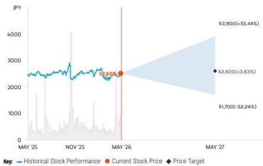

line

| Date   | Historical Stock Performance | Current Stock Price | Price Target |
|--------|-------------------------------|---------------------|--------------|
| MAY '25| -                             | -                   | -            |
| NOV '25| -                             | -                   | -            |
| MAY '26| -                             | ¥2,800              | -            |
| MAY '27| -                             | -                   | ¥1,700       |

Source: Refinitiv, MS

Consensus Rating Distribution   
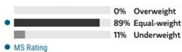  
Source: Refinitiv, MS

# Risk Reward Themes

Secular Growth: Negative

View descriptions of Risk Rewards Themes here

# BULL CASE

Growth accelerates led by auto/phone connectors

OP and EPS forecasts of ¥9.0bn/¥78.8 in F3/26, ¥11.9bn/¥124.6 in F3/27, ¥14.2bn/¥14.8.3 in F3/28, ¥16.1bn/¥169.1 in F3/29, and ¥18.4bn/¥192.8 in F3/30. Our calculations also assume that from F3/31 onward the firm can maintain FCF/share at ¥210. The fair value equates to 31.3x our F3/27E EPS of ¥124.6 and 1.9x BPS of ¥2,106.6.

# ¥3,900

# BASE CASE

Sales grow, but midterm margin flat

OP and EPS forecasts of ¥9.0bn/¥78.8 in F3/26, ¥10.3bn/¥108.3 in F3/27, ¥11.5bn/¥121.6 in F3/28, ¥12.4bn/¥130.5 in F3/29, and ¥12.7bn/¥133.5 in F3/30. Our calculations also assume that from F3/31 onward the firm can maintain FCF/share at ¥130. Our PT equates to 24.0x our F3/27E EPS of ¥108.3 and 1.2x BPS of ¥2,090.3.

# ¥2,600

# BEAR CASE

OP down on weak auto and smartphone sales

OP and EPS forecasts of ¥9.0bn/¥78.8 in F3/26, ¥8.3bn/¥89.0 in F3/27, ¥7.9bn/¥84.5 in F3/28, ¥7.6bn/¥81.6 in F3/29, and ¥7.0bn/¥75.6 in F3/30. Our calculations also assume that from F3/31 onward the firm can maintain FCF/share at ¥75. The fair value equates to 19.1x our F3/27E EPS of ¥89.0 and 0.8x BPS of ¥2,071.0.

Note: e = MS estimates; Stock price as of the May 15 close for Risk Reward Chart  
Source: Company data, MS

# CMK: Key Financial Data and Risk Reward

Income Statement 

<table><tr><td>(JPY bn)</td><td>F3/25</td><td>F3/26</td><td>F3/27e</td><td>F3/28e</td><td>F3/29e</td></tr><tr><td>Sales</td><td>95.5</td><td>100.2</td><td>104.9</td><td>109.9</td><td>115.3</td></tr><tr><td>Costs of Sales</td><td>79.9</td><td>85.3</td><td>89.2</td><td>92.6</td><td>96.3</td></tr><tr><td>Gross Profit</td><td>15.6</td><td>14.9</td><td>15.7</td><td>17.3</td><td>19.0</td></tr><tr><td>SG&amp;A</td><td>11.8</td><td>12.1</td><td>12.8</td><td>13.4</td><td>14.1</td></tr><tr><td>Operating Income</td><td>3.8</td><td>2.8</td><td>2.9</td><td>3.9</td><td>4.9</td></tr><tr><td>Non-operating income/expenses</td><td>1.7</td><td>1.3</td><td>-0.5</td><td>-0.4</td><td>-0.5</td></tr><tr><td>Recurring Profit</td><td>5.5</td><td>4.1</td><td>2.4</td><td>3.5</td><td>4.4</td></tr><tr><td>Extraordinary income</td><td>-0.2</td><td>1.2</td><td>0.0</td><td>0.0</td><td>0.0</td></tr><tr><td>Profit before income taxes</td><td>5.3</td><td>5.3</td><td>2.4</td><td>3.5</td><td>4.4</td></tr><tr><td>Income taxes</td><td>1.4</td><td>1.9</td><td>0.7</td><td>1.1</td><td>1.3</td></tr><tr><td>(Effective tax rate)</td><td>27%</td><td>36%</td><td>29%</td><td>31%</td><td>30%</td></tr><tr><td>Profit attributable to non-controlling interests</td><td>0.1</td><td>0.7</td><td>0.1</td><td>0.1</td><td>0.1</td></tr><tr><td>Net Profit</td><td>3.8</td><td>4.0</td><td>1.6</td><td>2.3</td><td>3.0</td></tr><tr><td>Capex</td><td>18.9</td><td>9.2</td><td>6.5</td><td>6.0</td><td>6.3</td></tr><tr><td>Depreciation &amp; amortization</td><td>5.9</td><td>6.5</td><td>8.2</td><td>8.5</td><td>8.7</td></tr><tr><td>R&amp;D</td><td>0.6</td><td>0.5</td><td>0.5</td><td>0.5</td><td>0.6</td></tr><tr><td>EPS (JPY)</td><td>53.2</td><td>56.5</td><td>22.4</td><td>32.3</td><td>42.1</td></tr><tr><td>USD/JPY (Average)</td><td>151.8</td><td>149.8</td><td>150.0</td><td>150.0</td><td>150.0</td></tr></table>

Cashflow Statement 

<table><tr><td>(JPY bn)</td><td>F3/25</td><td>F3/26</td><td>F3/27e</td><td>F3/28e</td><td>F3/29e</td></tr><tr><td>Cash flow from operating activities</td><td>9.1</td><td>7.8</td><td>9.3</td><td>10.5</td><td>11.3</td></tr><tr><td>EBIT</td><td>5.3</td><td>5.3</td><td>2.4</td><td>3.5</td><td>4.4</td></tr><tr><td>Depreciation</td><td>5.9</td><td>6.5</td><td>8.2</td><td>8.5</td><td>8.7</td></tr><tr><td>Changes in Receivables</td><td>-0.2</td><td>0.5</td><td>-0.7</td><td>-0.6</td><td>-0.7</td></tr><tr><td>Change in inventory</td><td>0.7</td><td>0.3</td><td>0.8</td><td>0.7</td><td>0.8</td></tr><tr><td>Changes in Payables</td><td>-0.8</td><td>-1.0</td><td>-0.7</td><td>-1.1</td><td>-1.3</td></tr><tr><td>Other</td><td>-2.0</td><td>-3.8</td><td>-0.6</td><td>-0.5</td><td>-0.6</td></tr><tr><td>Cash flow from investing activities</td><td>-18.8</td><td>-6.9</td><td>-6.5</td><td>-6.0</td><td>-6.3</td></tr><tr><td>Purchase of PP&amp;E</td><td>-18.3</td><td>-8.6</td><td>-6.3</td><td>-5.8</td><td>-6.1</td></tr><tr><td>Sales of PP&amp;E</td><td>0.3</td><td>0.0</td><td>0.0</td><td>0.0</td><td>0.0</td></tr><tr><td>Other</td><td>-0.8</td><td>1.8</td><td>-0.2</td><td>-0.2</td><td>-0.2</td></tr><tr><td>Cash flow from financing activities</td><td>4.7</td><td>-4.1</td><td>-5.2</td><td>-3.3</td><td>0.3</td></tr><tr><td>Net Change In Borrowings</td><td>8.2</td><td>-1.8</td><td>-3.7</td><td>-1.8</td><td>1.8</td></tr><tr><td>Purchase of treasury shares</td><td>0.0</td><td>0.0</td><td>0.0</td><td>0.0</td><td>0.0</td></tr><tr><td>Cash dividend paid</td><td>-1.4</td><td>-1.4</td><td>-1.4</td><td>-1.4</td><td>-1.4</td></tr><tr><td>Other</td><td>-2.2</td><td>-0.9</td><td>-0.1</td><td>-0.1</td><td>-0.1</td></tr><tr><td>Effect of exchange rate changes</td><td>1.8</td><td>0.4</td><td>0.4</td><td>0.0</td><td>0.0</td></tr><tr><td>Changes in cash and cash equivalents</td><td>-3.1</td><td>-2.8</td><td>-2.0</td><td>1.1</td><td>5.3</td></tr><tr><td>Cash and cash equivalents at end of the period</td><td>22.2</td><td>19.4</td><td>17.3</td><td>18.5</td><td>23.8</td></tr></table>

Balance Sheet 

<table><tr><td>(JPY bn)</td><td>F3/25</td><td>F3/26</td><td>F3/27e</td><td>F3/28e</td><td>F3/29e</td></tr><tr><td>Total assets</td><td>148.5</td><td>151.5</td><td>146.3</td><td>146.4</td><td>151.0</td></tr><tr><td>Current assets</td><td>62.4</td><td>61.7</td><td>60.7</td><td>63.5</td><td>70.5</td></tr><tr><td>Cash and cash equivalents</td><td>22.2</td><td>19.5</td><td>17.3</td><td>18.5</td><td>23.8</td></tr><tr><td>Accounts receivable</td><td>17.8</td><td>19.9</td><td>20.1</td><td>21.1</td><td>22.1</td></tr><tr><td>Inventories</td><td>18.6</td><td>18.4</td><td>19.5</td><td>20.2</td><td>20.8</td></tr><tr><td>Other financial assets</td><td>3.8</td><td>3.8</td><td>3.8</td><td>3.8</td><td>3.8</td></tr><tr><td>Fixed assets</td><td>86.1</td><td>89.8</td><td>85.5</td><td>83.0</td><td>80.5</td></tr><tr><td>Tangible fixed assets</td><td>76.5</td><td>80.3</td><td>75.6</td><td>72.9</td><td>70.4</td></tr><tr><td>Intangible fixed assets</td><td>1.0</td><td>1.5</td><td>1.3</td><td>1.3</td><td>1.4</td></tr><tr><td>Other non-current assets</td><td>8.6</td><td>8.1</td><td>8.7</td><td>8.7</td><td>8.7</td></tr><tr><td>Current liabilities</td><td>33.7</td><td>38.0</td><td>36.1</td><td>37.3</td><td>38.6</td></tr><tr><td>Short term borrowings</td><td>12.8</td><td>10.3</td><td>13.4</td><td>13.6</td><td>13.9</td></tr><tr><td>Accounts payable</td><td>14.0</td><td>12.5</td><td>15.4</td><td>16.1</td><td>16.9</td></tr><tr><td>Other current liabilities</td><td>6.9</td><td>15.3</td><td>7.3</td><td>7.6</td><td>7.9</td></tr><tr><td>Fixed liabilities</td><td>33.4</td><td>27.4</td><td>30.1</td><td>28.1</td><td>29.7</td></tr><tr><td>Long term borrowings</td><td>31.3</td><td>25.3</td><td>28.0</td><td>26.0</td><td>27.6</td></tr><tr><td>Other fixed liabilities</td><td>2.1</td><td>2.2</td><td>2.1</td><td>2.1</td><td>2.1</td></tr><tr><td>Net assets</td><td>81.4</td><td>86.0</td><td>80.0</td><td>81.0</td><td>82.6</td></tr><tr><td>Total liabilities and equity</td><td>148.5</td><td>151.5</td><td>146.3</td><td>146.4</td><td>151.0</td></tr></table>

Sales by Product 

<table><tr><td>(JPY bn)</td><td>F3/25</td><td>F3/26</td><td>F3/27e</td><td>F3/28e</td><td>F3/29e</td></tr><tr><td>Double-sided/Multi-layer</td><td>61.1</td><td>63.4</td><td>63.7</td><td>64.9</td><td>66.1</td></tr><tr><td>Double-sided</td><td>10.0</td><td>9.5</td><td>9.7</td><td>9.7</td><td>9.7</td></tr><tr><td>Multi-layer</td><td>51.0</td><td>53.9</td><td>54.0</td><td>55.2</td><td>56.4</td></tr><tr><td>HDI</td><td>30.2</td><td>33.0</td><td>37.4</td><td>41.2</td><td>45.4</td></tr><tr><td>Others</td><td>4.2</td><td>3.8</td><td>3.8</td><td>3.8</td><td>3.8</td></tr><tr><td>(YoY)</td><td></td><td></td><td></td><td></td><td></td></tr><tr><td>Double-sided/Multi-layer</td><td>2%</td><td>4%</td><td>2%</td><td>2%</td><td>2%</td></tr><tr><td>Double-sided</td><td>0%</td><td>-5%</td><td>-2%</td><td>0%</td><td>0%</td></tr><tr><td>Multi-layer</td><td>2%</td><td>6%</td><td>2%</td><td>2%</td><td>2%</td></tr><tr><td>HDI</td><td>16%</td><td>9%</td><td>14%</td><td>10%</td><td>10%</td></tr><tr><td>Others</td><td>-8%</td><td>-10%</td><td>-1%</td><td>0%</td><td>0%</td></tr></table>

# Risk Reward - CMK (6958.T)

Further vehicle electronification and growth in new business areas awaited

# PRICE TARGET ¥640

-6.3 Our price target is ¥640, based on a DCF valuation (risk-free rate 2.2%; beta 1.3; risk premium 3.7%; WACC 5.1%). Beyond our 3-year base earnings models, we also build forecasts for F3/29–30 into our DCF-based valuation, and our assumptions for F3/31 onward are that the firm maintains FCF/share of ¥55. Our price target equates to 28.5x our F3/27e EPS of ¥22.4.
-0.2 Our forex rate assumption for the next quarter and thereafter is ¥150/\$.

RISK REWARD CHART   
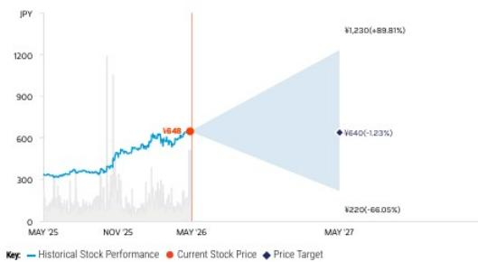

line

| Date   | Historical Stock Performance | Current Stock Price | Price Target |
|--------|-------------------------------|---------------------|--------------|
| MAY '25| ~300                          | -                   | -            |
| NOV '25| ~400                          | -                   | -            |
| MAY '26| ~600                          | ¥48                 | -            |
| MAY '27| -                             | -                   | ¥640         |
|        | -                             | -                   | ¥220         |

Source: Refinitiv, MS

# EQUAL-WEIGHT THESIS

Our scenario calls for earnings growth driven by automotive PCBs. We maintain the view that earnings will resume growing after bottoming in F3/26 1H, driven by recovery in production mainly at J-OEM automakers. However, we assign an EW rating as the ramp-up in demand for Japanese Tier-1 suppliers' integrated ECUs appears to be delayed, and the negative impact from sluggish car demand in Europe due to the economic slowdown is likely to persist. That said, the high quality and reliability of CMK's buildup PCBs honed across many years, and its supply system which allows the same boards to be produced globally (including in new facilities in Thailand), continue to be well regarded.

# BULL CASE

Improves productivity to meet rising demand

OP and EPS forecasts of ¥2.8bn/¥33.8 in F3/26, ¥3.5bn/¥28.1 in F3/27, ¥5.3bn/¥46.3 in F3/28, ¥7.7bn/¥68.7 in F3/29, and ¥10.5bn/¥95.4 in F3/30. Our calculations also assume that from F3/31 onward the firm can maintain FCF/share at ¥95. The fair value equates to 4.38x our F3/27E EPS of ¥28.1 and 1.1x BPS of ¥1,092.3.

# ¥1,230

# BASE CASE

BU sales for Integretad ECU in earnest from F3/27

OP and EPS forecasts of ¥2.8bn/¥33.8 in F3/26, ¥2.9bn/¥22.4 in F3/27, ¥3.9bn/¥32.3 in F3/28, ¥4.9bn/¥42.1 in F3/29, and ¥5.7bn/¥49.1 in F3/30. Our calculations also assume that from F3/31 onward the firm can maintain FCF/share at ¥55. Our PT equates to 28.5x our F3/27E EPS of ¥22.4 and 0.6x BPS of ¥1,086.7.

# ¥640

# ¥640

# BEAR CASE

Weak automotive production, slow uptake for ADAS

OP and EPS forecasts of ¥2.8bn/¥33.8 in F3/26, ¥1.6bn/¥9.8 in F3/27, ¥2.1bn/¥15.4 in F3/28, ¥2.4bn/¥18.2 in F3/29, and ¥2.8bn/¥22.4 in F3/30. Our calculations also assume that from F3/31 onward the firm can maintain FCF/share at ¥25. The fair value equates to 22.4x our F3/27E EPS of ¥9.8 and 0.2x BPS of ¥1,074.1.

Note: e = MS estimates; Stock price as of the May 15 close for Risk Reward Chart  
Source: Company data, MS

# Daishinku: Key Financial Data and Risk Reward

Income Statement 

<table><tr><td>(JPY bn)</td><td>F3/25</td><td>F3/26</td><td>F3/27e</td><td>F3/28e</td><td>F3/29e</td></tr><tr><td>Sales</td><td>38.6</td><td>39.6</td><td>41.3</td><td>43.3</td><td>45.3</td></tr><tr><td>Costs of Sales</td><td>29.3</td><td>30.4</td><td>31.6</td><td>32.9</td><td>34.0</td></tr><tr><td>Gross Profit</td><td>9.3</td><td>9.2</td><td>9.7</td><td>10.4</td><td>11.3</td></tr><tr><td>SG&amp;A</td><td>8.4</td><td>8.1</td><td>8.4</td><td>8.6</td><td>8.8</td></tr><tr><td>Operating Income</td><td>0.9</td><td>1.1</td><td>1.3</td><td>1.8</td><td>2.5</td></tr><tr><td>Non-operating income/expenses</td><td>-0.5</td><td>-0.4</td><td>-0.4</td><td>-0.4</td><td>-0.3</td></tr><tr><td>Recurring Profit</td><td>0.4</td><td>0.7</td><td>0.9</td><td>1.4</td><td>2.2</td></tr><tr><td>Extraordinary income</td><td>1.2</td><td>0.3</td><td>0.0</td><td>0.0</td><td>0.0</td></tr><tr><td>Profit before income taxes</td><td>1.6</td><td>1.1</td><td>0.9</td><td>1.4</td><td>2.2</td></tr><tr><td>Income taxes</td><td>0.6</td><td>0.5</td><td>0.3</td><td>0.4</td><td>0.7</td></tr><tr><td>(Effective tax rate)</td><td>39%</td><td>42%</td><td>33%</td><td>29%</td><td>32%</td></tr><tr><td>Profit attributable to non-controlling interests</td><td>0.7</td><td>0.2</td><td>0.0</td><td>0.0</td><td>0.0</td></tr><tr><td>Net Profit</td><td>0.3</td><td>0.4</td><td>0.6</td><td>1.0</td><td>1.5</td></tr><tr><td>Capex</td><td>1.0</td><td>8.2</td><td>4.0</td><td>4.3</td><td>4.5</td></tr><tr><td>Depreciation &amp; amortization</td><td>4.0</td><td>4.2</td><td>5.0</td><td>5.2</td><td>5.4</td></tr><tr><td>R&amp;D</td><td>0.6</td><td>2.3</td><td>2.4</td><td>2.5</td><td>2.6</td></tr><tr><td>EPS (JPY)</td><td>8.9</td><td>13.2</td><td>18.9</td><td>31.4</td><td>47.2</td></tr><tr><td>USD/JPY (Average)</td><td>152.2</td><td>150.7</td><td>150.0</td><td>150.0</td><td>150.0</td></tr></table>

Cashflow Statement 

<table><tr><td>(JPY bn)</td><td>F3/25</td><td>F3/26</td><td>F3/27e</td><td>F3/28e</td><td>F3/29e</td></tr><tr><td>Cash flow from operating activities</td><td>2.3</td><td>-1.8</td><td>6.6</td><td>6.5</td><td>7.3</td></tr><tr><td>EBIT</td><td>1.6</td><td>1.1</td><td>0.9</td><td>1.4</td><td>2.2</td></tr><tr><td>Depreciation</td><td>4.0</td><td>4.2</td><td>5.0</td><td>5.2</td><td>5.4</td></tr><tr><td>Changes in Receivables</td><td>0.5</td><td>-0.2</td><td>-0.5</td><td>-0.5</td><td>-0.5</td></tr><tr><td>Change in inventory</td><td>-1.9</td><td>-5.6</td><td>0.1</td><td>0.2</td><td>0.3</td></tr><tr><td>Changes in Payables</td><td>1.0</td><td>0.1</td><td>0.2</td><td>0.2</td><td>0.2</td></tr><tr><td>Other</td><td>-2.8</td><td>-1.5</td><td>0.9</td><td>0.0</td><td>-0.3</td></tr><tr><td>Cash flow from investing activities</td><td>-6.3</td><td>-3.1</td><td>-4.0</td><td>-4.3</td><td>-4.5</td></tr><tr><td>Purchase of PP&amp;E</td><td>-6.9</td><td>-3.0</td><td>-4.0</td><td>-4.3</td><td>-4.5</td></tr><tr><td>Sales of PP&amp;E</td><td>0.0</td><td>0.1</td><td>0.0</td><td>0.0</td><td>0.0</td></tr><tr><td>Other</td><td>0.5</td><td>-0.2</td><td>0.0</td><td>0.0</td><td>0.0</td></tr><tr><td>Cash flow from financing activities</td><td>-1.7</td><td>1.2</td><td>-1.7</td><td>-3.8</td><td>-3.9</td></tr><tr><td>Net Change In Borrowings</td><td>-0.1</td><td>2.7</td><td>-0.4</td><td>-2.6</td><td>-2.6</td></tr><tr><td>Purchase of treasury shares</td><td>-0.3</td><td>-0.2</td><td>0.0</td><td>0.0</td><td>0.0</td></tr><tr><td>Cash dividend paid</td><td>-0.9</td><td>-0.9</td><td>-0.9</td><td>-1.0</td><td>-1.0</td></tr><tr><td>Other</td><td>-0.5</td><td>-0.4</td><td>-0.3</td><td>-0.3</td><td>-0.3</td></tr><tr><td>Effect of exchange rate changes</td><td>-0.1</td><td>1.2</td><td>0.1</td><td>0.0</td><td>0.0</td></tr><tr><td>Changes in cash and cash equivalents</td><td>-5.9</td><td>-2.5</td><td>1.0</td><td>-1.7</td><td>-1.2</td></tr><tr><td>Cash and cash equivalents at end of the period</td><td>18.5</td><td>16.0</td><td>16.3</td><td>14.6</td><td>13.5</td></tr></table>

Balance Sheet 

<table><tr><td>(JPY bn)</td><td>F3/25</td><td>F3/26</td><td>F3/27e</td><td>F3/28e</td><td>F3/29e</td></tr><tr><td>Total assets</td><td>89.9</td><td>98.8</td><td>91.4</td><td>89.2</td><td>87.3</td></tr><tr><td>Current assets</td><td>48.9</td><td>53.4</td><td>50.5</td><td>49.2</td><td>48.3</td></tr><tr><td>Cash and cash equivalents</td><td>18.7</td><td>16.3</td><td>16.3</td><td>14.6</td><td>13.5</td></tr><tr><td>Accounts receivable</td><td>9.1</td><td>10.2</td><td>10.2</td><td>10.7</td><td>11.2</td></tr><tr><td>Inventories</td><td>18.0</td><td>24.6</td><td>20.9</td><td>20.8</td><td>20.5</td></tr><tr><td>Other financial assets</td><td>3.1</td><td>2.3</td><td>3.1</td><td>3.1</td><td>3.1</td></tr><tr><td>Fixed assets</td><td>41.0</td><td>45.4</td><td>40.9</td><td>40.0</td><td>39.1</td></tr><tr><td>Tangible fixed assets</td><td>34.9</td><td>38.4</td><td>34.8</td><td>33.9</td><td>33.0</td></tr><tr><td>Intangible fixed assets</td><td>1.0</td><td>0.8</td><td>1.0</td><td>1.0</td><td>1.0</td></tr><tr><td>Other non-current assets</td><td>5.1</td><td>6.2</td><td>5.1</td><td>5.1</td><td>5.1</td></tr><tr><td>Current liabilities</td><td>24.9</td><td>32.9</td><td>25.9</td><td>24.9</td><td>23.9</td></tr><tr><td>Short term borrowings</td><td>16.9</td><td>22.6</td><td>17.9</td><td>16.6</td><td>15.2</td></tr><tr><td>Accounts payable</td><td>3.4</td><td>4.1</td><td>3.6</td><td>3.8</td><td>4.0</td></tr><tr><td>Other current liabilities</td><td>4.6</td><td>6.3</td><td>4.4</td><td>4.6</td><td>4.7</td></tr><tr><td>Fixed liabilities</td><td>19.8</td><td>17.9</td><td>21.7</td><td>20.5</td><td>19.2</td></tr><tr><td>Long term borrowings</td><td>16.3</td><td>14.1</td><td>18.3</td><td>17.0</td><td>15.8</td></tr><tr><td>Other fixed liabilities</td><td>3.5</td><td>3.8</td><td>3.5</td><td>3.5</td><td>3.5</td></tr><tr><td>Net assets</td><td>45.2</td><td>48.0</td><td>43.7</td><td>43.8</td><td>44.2</td></tr><tr><td>Total liabilities and equity</td><td>89.9</td><td>98.8</td><td>91.4</td><td>89.2</td><td>87.3</td></tr></table>

# Risk Reward – Daishinku (6962.T)

Demand for new devices accelerating and production system upgrades awaited

# PRICE TARGET ¥610

Our price target is ¥610, based on a DCF valuation (risk-free rate 2.2%; beta 1.2; risk premium 3.7%; WACC 4.8%). Beyond our 3-year base earnings models, we also build forecasts for F3/29–30 into our DCF-based valuation, and our assumptions for F3/31 onward are that the firm maintains FCF/share of ¥70. Our price target equates to 32.3x our F3/27e EPS of ¥18.9. Our forex rate assumption for the next quarter and thereafter is ¥150/\$.

RISK REWARD CHART   
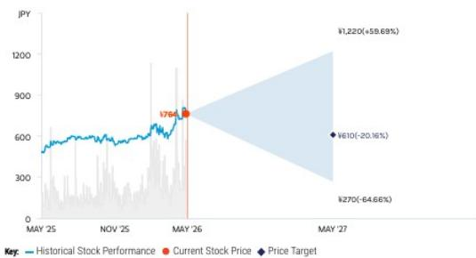

line

| Date    | Historical Stock Performance | Current Stock Price | Price Target |
|---------|-------------------------------|---------------------|--------------|
| MAY '25 | ~600                          | -                   | -            |
| NOV '25 | ~600                          | -                   | -            |
| MAY '26 | 1764                          | 1764                | -            |
| MAY '27 | -                             | 1610                | -            |
|       | -                             | 1270                | -            |

Source: Refinitiv, MS

# EQUAL-WEIGHT THESIS

Sales weighting for photolithographic products has risen as demand for high-frequency products from clients has increased. We give the firm high marks for progressively ramping up capacity of TCXO, demand for which has been rising for use in communication modules or GPS applications. However, we believe Daishinku still needs time to build a network to expand sales of the Arkh. Series, which has technological advantages in terms of both cost and productivity. We also think the firm will continue facing downward pressure on prices, esp. for consumer applications. Ongoing production issues could also become a bottleneck in the demand upcycle, and countermeasures should be closely monitored.

# BULL CASE

# Telecom/auto growth speeds up

OP and EPS forecasts of ¥0.9bn/¥7.1 in F3/26, ¥1.8bn/¥31.4 in F3/27, ¥2.8bn/¥53.5 in F3/28, ¥4.2bn/¥81.8 in F3/29, and ¥5.3bn/¥110.0 in F3/30. Our calculations also assume that from F3/31 onward the firm can maintain FCF/share at ¥110. The fair value equates to 38.8x our F3/27E EPS of ¥31.4 and 1.1x BPS of ¥1,124.8.

# ¥1,220

# BASE CASE

# Earnings steadily recover but miss MTP target

OP and EPS forecasts of ¥0.9bn/¥7.1 in F3/26, ¥1.3bn/¥18.9 in F3/27, ¥1.8bn/¥31.4 in F3/28, ¥2.5bn/¥47.2 in F3/29, and ¥2.9bn/¥56.6 in F3/30. Our calculations also assume that from F3/31 onward the firm can maintain FCF/share at ¥70. Our PT equates to 32.3x our F3/27E EPS of ¥18.9 and 0.5x BPS of ¥1,124.8.

# ¥610

# ¥610

# BEAR CASE

Investment burden, slowing topline growth OP and EPS forecasts of ¥0.9bn/¥7.1 in F3/26, ¥0.6bn/¥3.1 in F3/27, ¥0.4bn/¥3.1 in F3/28, ¥0.4bn/¥3.1 in F3/29, and ¥0.4bn/¥3.1 in F3/30. Our calculations also assume that from F3/31 onward the firm can maintain FCF/share at ¥50. The fair value equates to 85.9x our F3/27E EPS of ¥3.1 and 0.2x BPS of ¥1,124.8.

# Hamamatsu Photonics: Key Financial Data and Risk Reward

Income Statement 

<table><tr><td>(¥ bn)</td><td>F9/24</td><td>F9/25</td><td>F9/26e</td><td>F9/27e</td><td>F9/28e</td></tr><tr><td>Net Sales</td><td>204.0</td><td>212.1</td><td>216.9</td><td>233.6</td><td>252.0</td></tr><tr><td>COGS</td><td>100.1</td><td>110.7</td><td>114.3</td><td>124.6</td><td>136.8</td></tr><tr><td>Gross Profit</td><td>103.9</td><td>101.4</td><td>102.6</td><td>109.0</td><td>115.2</td></tr><tr><td>SG&amp;A Expenses</td><td>71.8</td><td>85.2</td><td>87.7</td><td>89.1</td><td>90.8</td></tr><tr><td>Operating Profit</td><td>32.1</td><td>16.2</td><td>14.9</td><td>19.9</td><td>24.4</td></tr><tr><td>Non-operating Income/Loss</td><td>2.4</td><td>2.6</td><td>1.4</td><td>1.4</td><td>1.4</td></tr><tr><td>Recurring Profit</td><td>34.5</td><td>18.8</td><td>16.3</td><td>21.3</td><td>25.8</td></tr><tr><td>Extraordinary Income/Loss</td><td>0.9</td><td>1.9</td><td>0.4</td><td>0.4</td><td>0.4</td></tr><tr><td>Pretax Profit</td><td>35.4</td><td>20.7</td><td>16.7</td><td>21.7</td><td>26.2</td></tr><tr><td>Income Tax</td><td>10.0</td><td>6.2</td><td>4.9</td><td>6.5</td><td>7.9</td></tr><tr><td>(Effective Tax Rate)</td><td>35%</td><td>35%</td><td>30%</td><td>30%</td><td>30%</td></tr><tr><td>Minority Interest</td><td>0.3</td><td>0.4</td><td>0.1</td><td>0.0</td><td>0.0</td></tr><tr><td>Net Profit</td><td>25.1</td><td>14.2</td><td>11.6</td><td>15.2</td><td>18.3</td></tr></table>

<table><tr><td>Capex</td><td>32.2</td><td>39.1</td><td>42.3</td><td>15.0</td><td>15.0</td></tr><tr><td>Depreciation and Amortization</td><td>17.7</td><td>22.3</td><td>23.2</td><td>27.7</td><td>26.7</td></tr><tr><td>R&amp;D Expenses</td><td>13.6</td><td>18.4</td><td>18.4</td><td>19.4</td><td>20.8</td></tr><tr><td>EBITDA</td><td>49.8</td><td>38.5</td><td>38.1</td><td>47.6</td><td>51.1</td></tr><tr><td>ROE</td><td>7.7%</td><td>4.4%</td><td>3.7%</td><td>5.0%</td><td>6.0%</td></tr></table>

<table><tr><td>Average Share Outstanding (Diluted)</td><td>309.7</td><td>298.7</td><td>298.8</td><td>298.7</td><td>298.7</td></tr><tr><td>EPS (Diluted, Yen)</td><td>81.2</td><td>47.4</td><td>39.0</td><td>50.7</td><td>61.2</td></tr><tr><td>BPS (Yen)</td><td>1,075.3</td><td>1,082.9</td><td>1,009.7</td><td>1,017.5</td><td>1,035.6</td></tr><tr><td>DPS (Yen)</td><td>38.0</td><td>38.0</td><td>40.0</td><td>45.0</td><td>45.0</td></tr></table>

<table><tr><td>USD/JPY: Average Exchange Rate</td><td>149.4</td><td>149.2</td><td>150.0</td><td>150.0</td><td>150.0</td></tr><tr><td>YoY % Change</td><td></td><td></td><td></td><td></td><td></td></tr><tr><td>Net Sales</td><td>-8%</td><td>4%</td><td>2%</td><td>8%</td><td>8%</td></tr><tr><td>Operating Profit</td><td>-43%</td><td>-50%</td><td>-8%</td><td>33%</td><td>22%</td></tr><tr><td>Net Profit</td><td>-41%</td><td>-44%</td><td>-18%</td><td>30%</td><td>21%</td></tr><tr><td>As % of Sales</td><td></td><td></td><td></td><td></td><td></td></tr><tr><td>Gross Profit</td><td>50.9%</td><td>47.8%</td><td>47.3%</td><td>46.7%</td><td>45.7%</td></tr><tr><td>Operating Profit</td><td>15.7%</td><td>7.6%</td><td>6.9%</td><td>8.5%</td><td>9.7%</td></tr><tr><td>Net Profit</td><td>12.3%</td><td>6.7%</td><td>5.4%</td><td>6.5%</td><td>7.3%</td></tr><tr><td>Capex</td><td>15.8%</td><td>18.4%</td><td>19.5%</td><td>6.4%</td><td>6.0%</td></tr><tr><td>Depreciation and Amortization</td><td>8.7%</td><td>10.5%</td><td>10.7%</td><td>11.9%</td><td>10.6%</td></tr></table>

Balance Sheet 

<table><tr><td>(¥ bn)</td><td>F9/24</td><td>F9/25</td><td>F9/26e</td><td>F9/27e</td><td>F9/28e</td></tr><tr><td>Total Assets</td><td>434.6</td><td>455.0</td><td>433.3</td><td>436.4</td><td>442.0</td></tr><tr><td>Total Current Assets</td><td>239.0</td><td>236.4</td><td>195.7</td><td>211.4</td><td>228.7</td></tr><tr><td>Cash and Cash Equivalents</td><td>97.0</td><td>90.6</td><td>51.6</td><td>64.5</td><td>78.8</td></tr><tr><td>Marketable Securities</td><td>2.9</td><td>6.5</td><td>6.5</td><td>6.5</td><td>6.5</td></tr><tr><td>Account Receivables</td><td>45.7</td><td>46.6</td><td>46.6</td><td>49.6</td><td>52.8</td></tr><tr><td>Inventory</td><td>80.6</td><td>77.0</td><td>75.1</td><td>75.0</td><td>74.9</td></tr><tr><td>Other Current Assets</td><td>12.8</td><td>15.8</td><td>15.8</td><td>15.8</td><td>15.8</td></tr><tr><td>Total Long Term Assets</td><td>195.6</td><td>218.6</td><td>237.6</td><td>224.9</td><td>213.2</td></tr><tr><td>Net PP&amp;E</td><td>132.9</td><td>150.7</td><td>169.7</td><td>157.0</td><td>145.3</td></tr><tr><td>Investments in Securities</td><td>35.7</td><td>34.6</td><td>34.6</td><td>34.6</td><td>34.6</td></tr><tr><td>Other Assets</td><td>27.0</td><td>33.3</td><td>33.3</td><td>33.3</td><td>33.3</td></tr><tr><td>Total Current Liabilities</td><td>80.7</td><td>108.5</td><td>108.6</td><td>109.2</td><td>110.0</td></tr><tr><td>ST Debt and Current Portion of LT I</td><td>28.4</td><td>55.5</td><td>55.5</td><td>55.5</td><td>55.5</td></tr><tr><td>Accounts Payable</td><td>6.6</td><td>6.8</td><td>6.9</td><td>7.5</td><td>8.3</td></tr><tr><td>Other Current Liabilities</td><td>45.8</td><td>46.2</td><td>46.2</td><td>46.2</td><td>46.2</td></tr><tr><td>Total Long Term Liabilities</td><td>20.9</td><td>23.0</td><td>23.0</td><td>23.0</td><td>23.0</td></tr><tr><td>Long Term Debt</td><td>8.5</td><td>10.6</td><td>10.6</td><td>10.6</td><td>10.6</td></tr><tr><td>Other Long Term Liabilities</td><td>12.4</td><td>12.5</td><td>12.5</td><td>12.5</td><td>12.5</td></tr><tr><td>Net Assets</td><td>333.0</td><td>323.5</td><td>301.7</td><td>303.9</td><td>309.3</td></tr><tr><td>Net Debt</td><td>-63.0</td><td>-31.0</td><td>7.9</td><td>-5.0</td><td>-19.2</td></tr></table>

Cash Flow Statement 

<table><tr><td>(¥ bn)</td><td>F9/24</td><td>F9/25</td><td>F9/26e</td><td>F9/27e</td><td>F9/28e</td></tr><tr><td>Net Cash from Operations</td><td>38.1</td><td>37.8</td><td>37.8</td><td>41.6</td><td>43.7</td></tr><tr><td>Net Income</td><td>25.1</td><td>14.2</td><td>11.6</td><td>15.2</td><td>18.3</td></tr><tr><td>Depreciation and Amortization</td><td>16.7</td><td>18.9</td><td>23.2</td><td>27.7</td><td>26.7</td></tr><tr><td>Changes in Working Capital</td><td>-3.9</td><td>3.7</td><td>2.0</td><td>-2.3</td><td>-2.3</td></tr><tr><td>Other-net</td><td>0.0</td><td>1.0</td><td>1.0</td><td>1.0</td><td>1.0</td></tr><tr><td>Net Cash from Investing Activities</td><td>-73.7</td><td>-42.2</td><td>-45.0</td><td>-16.0</td><td>-16.0</td></tr><tr><td>Purchase of PP&amp;E</td><td>-28.1</td><td>-35.8</td><td>-42.3</td><td>-15.0</td><td>-15.0</td></tr><tr><td>Sale/Purchase of Investments</td><td>-0.5</td><td>-4.1</td><td>0.0</td><td>0.0</td><td>0.0</td></tr><tr><td>Other-net</td><td>-45.1</td><td>-2.2</td><td>-2.8</td><td>-1.0</td><td>-1.0</td></tr><tr><td>Free Cash Flow</td><td>-35.6</td><td>-4.4</td><td>-7.3</td><td>25.6</td><td>27.7</td></tr><tr><td>Net Cash from Financing Activities</td><td>12.6</td><td>-2.8</td><td>-31.7</td><td>-12.7</td><td>-13.4</td></tr><tr><td>Change in Interest-bearing Debt</td><td>24.5</td><td>29.0</td><td>0.0</td><td>0.0</td><td>0.0</td></tr><tr><td>Change in Treasury Stock</td><td>0.0</td><td>-20.0</td><td>-20.0</td><td>0.0</td><td>0.0</td></tr><tr><td>Payment of Cash Dividends</td><td>-11.8</td><td>-11.6</td><td>-11.7</td><td>-12.7</td><td>-13.4</td></tr><tr><td>Other-net</td><td>-0.2</td><td>-0.3</td><td>0.0</td><td>0.0</td><td>0.0</td></tr><tr><td>Net Effect of Exchange Rate Changes</td><td>1.2</td><td>0.7</td><td>0.0</td><td>0.0</td><td>0.0</td></tr><tr><td>Net Change in Cash</td><td>-21.8</td><td>-6.5</td><td>-38.9</td><td>12.9</td><td>14.2</td></tr><tr><td>Cash at End of Period</td><td>92.6</td><td>86.0</td><td>47.1</td><td>60.0</td><td>74.2</td></tr></table>

Segment Information 

<table><tr><td>( Y bn)</td><td>F9/24</td><td>F9/25</td><td>F9/26e</td><td>F9/27e</td><td>F9/28e</td></tr><tr><td>Net Sales</td><td>204.0</td><td>212.1</td><td>216.9</td><td>233.6</td><td>252.0</td></tr><tr><td>Electron Tube</td><td>78.5</td><td>71.9</td><td>77.9</td><td>81.0</td><td>85.9</td></tr><tr><td>Opto-semiconductor</td><td>78.9</td><td>79.5</td><td>83.9</td><td>91.5</td><td>97.9</td></tr><tr><td>Imaging and Measurement Instruments</td><td>32.8</td><td>32.7</td><td>30.8</td><td>32.7</td><td>35.3</td></tr><tr><td>Others</td><td>3.0</td><td>5.7</td><td>4.7</td><td>7.3</td><td>9.5</td></tr><tr><td>YoY % Change</td><td>-8%</td><td>4%</td><td>2%</td><td>8%</td><td>8%</td></tr><tr><td>Electron Tube</td><td>-6%</td><td>-8%</td><td>8%</td><td>4%</td><td>6%</td></tr><tr><td>Opto-semiconductor</td><td>-21%</td><td>1%</td><td>6%</td><td>9%</td><td>7%</td></tr><tr><td>Imaging and Measurement Instruments</td><td>3%</td><td>0%</td><td>-6%</td><td>6%</td><td>8%</td></tr><tr><td>Others</td><td>180%</td><td>89%</td><td>-18%</td><td>56%</td><td>30%</td></tr></table>

Operating Profit by Segment 

<table><tr><td>Total Operating Profit</td><td>32.1</td><td>16.2</td><td>14.9</td><td>19.9</td><td>24.4</td></tr><tr><td>Electron Tube</td><td>23.8</td><td>19.0</td><td>22.4</td><td>24.7</td><td>26.8</td></tr><tr><td>Opto-semiconductor</td><td>17.9</td><td>12.6</td><td>12.8</td><td>12.5</td><td>15.3</td></tr><tr><td>Imaging and Measurement Instruments</td><td>10.4</td><td>9.7</td><td>8.1</td><td>9.3</td><td>10.1</td></tr><tr><td>Others</td><td>0.7</td><td>0.9</td><td>0.0</td><td>0.7</td><td>0.7</td></tr><tr><td>Adjustments</td><td>-23.3</td><td>-21.6</td><td>-21.8</td><td>-22.0</td><td>-23.8</td></tr><tr><td>Operating Margin</td><td>16%</td><td>8%</td><td>7%</td><td>9%</td><td>10%</td></tr><tr><td>Electron Tube</td><td>30%</td><td>26%</td><td>29%</td><td>31%</td><td>31%</td></tr><tr><td>Opto-semiconductor</td><td>23%</td><td>16%</td><td>15%</td><td>14%</td><td>16%</td></tr><tr><td>Imaging and Measurement Instruments</td><td>32%</td><td>30%</td><td>26%</td><td>28%</td><td>29%</td></tr><tr><td>Others</td><td>24%</td><td>15%</td><td>0%</td><td>10%</td><td>7%</td></tr></table>

# Risk Reward – Hamamatsu Photonics (6965.T)

Earnings recovery needs more time although major potential in Applied Optics.

# PRICE TARGET ¥1,250

DCF model assumptions: 2.2% risk-free rate, 0.91 equity beta, 3.7% risk premium, yielding 5.1% WACC; zero growth from F9/36.

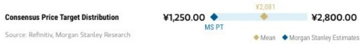

bar_line

| Category | Value     |
| -------- | --------- |
| Consensus Price Target Distribution | ¥1,250.00 |
| MS PT    | ¥2,081.00 |
| MS Estimates | ¥2,800.00 |

RISK REWARD CHART

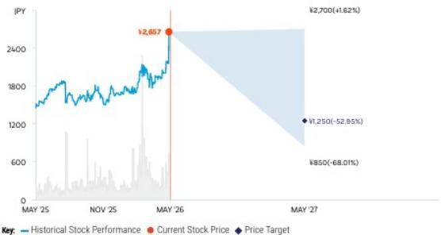

line

| Date   | Historical Stock Performance | Current Stock Price | Price Target |
|--------|-------------------------------|---------------------|--------------|
| MAY '25| ~1300                         | -                   | -            |
| NOV '25| ~1800                         | -                   | -            |
| MAY '26| $2,857                        | -                   | -            |
| MAY '27| -                             | $1,250(-52.95%)    | $1,250(-68.01%) |

Source: Refinitiv, MS

# UNDERWEIGHT THESIS

■ A decline in profits in F9/26 appears unavoidable, and even if earnings begin to recover from F9/27, it is likely to take some time before a full-fledged recovery materializes.

■ With inventory levels high, it will take time for utilization rates to rise and profit to recover fully.

■ We see major potential for applied optical technologies.

Consensus Rating Distribution   
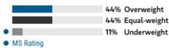  
Source: Refinitiv, MS

# BULL CASE

Derived from DCF

Earnings from SPE, FA, and automobile markets ahead of base case. OP ¥19.3bn in F9/26, ¥29.7bn in F9/27, and ¥40.1bn in F9/28. Same currency and DCF model assumptions as base case. Fair value equates to P/E 56.0 x F9/26e diluted EPS ¥48.2 and 35.2 x F9/27e diluted EPS ¥76.6.

# ¥2,700

# BASE CASE

Derived from DCF

Earnings bottom in F9/25 but improvement is gradual OP ¥14.9bn in F9/26, ¥19.9bn in F9/27, and ¥24.4bn in F9/28. Assumes ¥150/USD; DCF model assumptions: risk-free rate 2.2%, equity beta 0.91, risk premium 3.7%, yielding WACC 5.1%. Zero growth from F9/36. Base case fair value equates to P/E 32.1x F9/26e diluted EPS ¥39.0 and 24.6x F9/27e diluted EPS ¥50.7

# ¥1,250

# BEAR CASE

0.8x diluted book value ¥1,092 for F9/26 end

After large earnings drop in F9/26, limited earnings growth from F9/27. OP ¥8.5bn in F9/26, ¥12.6bn in F9/27, and ¥13.5bn in F9/28. Same currency assumptions as base case. ROE 2.0% in F9/26 and 2.9% in F9/27, lower than the 5.6% cost of capital; trades at 0.8x diluted book value for F9/26-end.

# Kyocera: Key Financial Data and Risk Reward

Income Statement 

<table><tr><td>(¥ bn)</td><td>F3/25</td><td>F3/26</td><td>F3/27e</td><td>F3/28e</td><td>F3/29e</td></tr><tr><td>Sales</td><td>2,014.5</td><td>2,070.2</td><td>1,895.2</td><td>1,981.5</td><td>2,107.4</td></tr><tr><td>COGS</td><td>1,455.3</td><td>1,462.6</td><td>1,267.2</td><td>1,326.1</td><td>1,468.8</td></tr><tr><td>Gross Profit</td><td>559.2</td><td>607.6</td><td>628.0</td><td>655.4</td><td>638.6</td></tr><tr><td>SG&amp;A</td><td>531.9</td><td>489.5</td><td>506.5</td><td>517.4</td><td>471.8</td></tr><tr><td>Operating Profit</td><td>27.3</td><td>118.1</td><td>121.5</td><td>138.0</td><td>166.8</td></tr><tr><td>Non-operating Income/Loss</td><td>36.3</td><td>50.9</td><td>9.0</td><td>1.7</td><td>-7.2</td></tr><tr><td>Pretax Profit</td><td>63.6</td><td>169.0</td><td>130.5</td><td>139.7</td><td>159.6</td></tr><tr><td>Income Tax</td><td>36.2</td><td>24.1</td><td>33.9</td><td>36.3</td><td>41.5</td></tr><tr><td>(Effective Tax Rate)</td><td>1%</td><td>0%</td><td>0%</td><td>0%</td><td>0%</td></tr><tr><td>Minority Interest</td><td>3.4</td><td>4.0</td><td>3.6</td><td>3.6</td><td>3.6</td></tr><tr><td>Net Profit</td><td>24.1</td><td>141.0</td><td>92.9</td><td>99.7</td><td>114.5</td></tr><tr><td>Capex</td><td>161.7</td><td>149.1</td><td>160.0</td><td>160.0</td><td>160.0</td></tr><tr><td>Depreciation and Amortization</td><td>111.7</td><td>110.9</td><td>115.0</td><td>120.0</td><td>120.0</td></tr><tr><td>R&amp;D</td><td>104.3</td><td>115.7</td><td>120.0</td><td>125.0</td><td>125.0</td></tr><tr><td>EBITDA</td><td>139.0</td><td>229.1</td><td>236.5</td><td>258.0</td><td>286.8</td></tr><tr><td>ROE</td><td>0.7%</td><td>4.4%</td><td>3.2%</td><td>3.7%</td><td>4.6%</td></tr><tr><td>Average Share Outstanding (Diluted)</td><td>1,412.4</td><td>1,372.6</td><td>1,307.0</td><td>1,272.0</td><td>1,237.0</td></tr><tr><td>EPS (Diluted, Yen)</td><td>17.1</td><td>102.7</td><td>71.1</td><td>78.4</td><td>92.6</td></tr><tr><td>BPS (Yen)</td><td>2,149.4</td><td>2,264.8</td><td>2,059.5</td><td>1,928.8</td><td>1,843.1</td></tr><tr><td>DPS (Yen)</td><td>50.0</td><td>52.0</td><td>65.0</td><td>70.0</td><td>70.0</td></tr><tr><td>USD/JPY: Average Exchange Rate</td><td>151.8</td><td>150.8</td><td>150.0</td><td>150.0</td><td>150.0</td></tr><tr><td>EUR/JPY: Average Exchange Rate</td><td>163.8</td><td>174.8</td><td>170.0</td><td>170.0</td><td>170.0</td></tr><tr><td colspan="6">YoY % Change</td></tr><tr><td>Sales</td><td>1%</td><td>3%</td><td>-6%</td><td>5%</td><td>6%</td></tr><tr><td>Operating Profit</td><td>-71%</td><td>333%</td><td>19%</td><td>14%</td><td>21%</td></tr><tr><td>Net Profit</td><td>-76%</td><td>485%</td><td>-23%</td><td>7%</td><td>15%</td></tr><tr><td colspan="6">As % of Sales</td></tr><tr><td>Gross Profit</td><td>27.8%</td><td>29.4%</td><td>33.1%</td><td>33.1%</td><td>30.3%</td></tr><tr><td>Operating Profit</td><td>1.4%</td><td>5.7%</td><td>6.4%</td><td>7.0%</td><td>7.9%</td></tr><tr><td>Net Profit</td><td>1.2%</td><td>6.8%</td><td>4.9%</td><td>5.0%</td><td>5.4%</td></tr><tr><td>Capex</td><td>8.0%</td><td>7.2%</td><td>8.4%</td><td>8.1%</td><td>7.6%</td></tr><tr><td>Depreciation and Amortization</td><td>5.5%</td><td>5.4%</td><td>6.1%</td><td>6.1%</td><td>5.7%</td></tr></table>

Balance Sheet 

<table><tr><td>(¥ bn)</td><td>F3/25</td><td>F3/26</td><td>F3/27e</td><td>F3/28e</td><td>F3/29e</td></tr><tr><td>Total Assets</td><td>4,406.5</td><td>4,476.3</td><td>3,992.8</td><td>3,761.4</td><td>3,605.6</td></tr><tr><td>Total Current Assets</td><td>1,330.5</td><td>1,362.1</td><td>1,243.8</td><td>1,182.4</td><td>1,196.6</td></tr><tr><td>Cash and Cash Equivalents</td><td>331.9</td><td>310.3</td><td>347.5</td><td>259.5</td><td>211.8</td></tr><tr><td>Marketable Securities</td><td>0.0</td><td>0.0</td><td>0.0</td><td>0.0</td><td>0.0</td></tr><tr><td>Account Receivables</td><td>378.9</td><td>389.4</td><td>356.5</td><td>372.7</td><td>396.4</td></tr><tr><td>Inventory</td><td>537.6</td><td>580.3</td><td>457.7</td><td>468.0</td><td>506.3</td></tr><tr><td>Other Current Assets</td><td>82.1</td><td>82.1</td><td>82.1</td><td>82.1</td><td>82.1</td></tr><tr><td>Total Long Term Assets</td><td>3,076.0</td><td>3,114.2</td><td>2,749.0</td><td>2,579.0</td><td>2,409.0</td></tr><tr><td>Net PP&amp;E</td><td>716.0</td><td>754.1</td><td>809.0</td><td>849.0</td><td>889.0</td></tr><tr><td>Investments and Advances</td><td>1,702.6</td><td>1,702.6</td><td>1,282.6</td><td>1,072.6</td><td>862.6</td></tr><tr><td>Goodwill</td><td>282.9</td><td>282.9</td><td>282.9</td><td>282.9</td><td>282.9</td></tr><tr><td>Intangible Assets</td><td>152.2</td><td>152.2</td><td>152.2</td><td>152.2</td><td>152.2</td></tr><tr><td>Other Assets</td><td>222.4</td><td>222.4</td><td>222.4</td><td>222.4</td><td>222.4</td></tr><tr><td>Total Current Liabilities</td><td>461.2</td><td>462.2</td><td>435.0</td><td>443.2</td><td>463.1</td></tr><tr><td>ST Debt and Current Portion of LT Debt</td><td>15.3</td><td>15.3</td><td>15.3</td><td>15.3</td><td>15.3</td></tr><tr><td>Accounts Payable</td><td>203.2</td><td>204.2</td><td>176.9</td><td>185.1</td><td>205.0</td></tr><tr><td>Other Current Liabilities</td><td>242.7</td><td>242.7</td><td>242.7</td><td>242.7</td><td>242.7</td></tr><tr><td>Total Long Term Liabilities</td><td>742.3</td><td>742.3</td><td>742.3</td><td>742.3</td><td>742.3</td></tr><tr><td>Long Term Debt</td><td>199.8</td><td>199.8</td><td>199.8</td><td>199.8</td><td>199.8</td></tr><tr><td>Other Long Term Liabilities</td><td>542.6</td><td>542.6</td><td>542.6</td><td>542.6</td><td>542.6</td></tr><tr><td>Minority Interests</td><td>23.9</td><td>20.0</td><td>16.7</td><td>13.1</td><td>9.5</td></tr><tr><td>Total Equity</td><td>3,179.1</td><td>3,251.8</td><td>2,798.8</td><td>2,562.7</td><td>2,390.7</td></tr><tr><td>Net Debt (excl. KDDI Shares)</td><td>-129.8</td><td>-216.4</td><td>-983.6</td><td>-821.0</td><td>-834.2</td></tr></table>

Cash Flow Statement 

<table><tr><td>(¥ bn)</td><td>F3/25</td><td>F3/26</td><td>F3/27e</td><td>F3/28e</td><td>F3/29e</td></tr><tr><td>Net Cash from Operations</td><td>139.4</td><td>195.7</td><td>266.7</td><td>197.8</td><td>188.9</td></tr><tr><td>Net Income</td><td>24.1</td><td>141.0</td><td>92.9</td><td>99.7</td><td>114.5</td></tr><tr><td>Depreciation and Amortization</td><td>111.7</td><td>110.9</td><td>115.0</td><td>120.0</td><td>120.0</td></tr><tr><td>Changes in Working Capital:</td><td>7.0</td><td>-52.2</td><td>62.4</td><td>-18.4</td><td>-42.1</td></tr><tr><td>Other-net</td><td>-3.4</td><td>-4.0</td><td>-3.6</td><td>-3.6</td><td>-3.6</td></tr><tr><td>Net Cash from Financing Activities</td><td>-161.7</td><td>-149.1</td><td>50.0</td><td>50.0</td><td>50.0</td></tr><tr><td>Purchase of PP&amp;E</td><td>-161.7</td><td>-149.1</td><td>-160.0</td><td>-160.0</td><td>-160.0</td></tr><tr><td>Sale/Purchase of Investments</td><td>0.0</td><td>0.0</td><td>210.0</td><td>210.0</td><td>210.0</td></tr><tr><td>Other-net</td><td>0.0</td><td>0.0</td><td>0.0</td><td>0.0</td><td>0.0</td></tr><tr><td>Free cash flow</td><td>-22.2</td><td>46.6</td><td>316.7</td><td>247.8</td><td>238.9</td></tr><tr><td>Net Cash from Financing Activities</td><td>-70.6</td><td>-68.2</td><td>-325.0</td><td>-335.8</td><td>-286.6</td></tr><tr><td>Change in Interest-bearing Debt</td><td>0.0</td><td>0.0</td><td>0.0</td><td>0.0</td><td>0.0</td></tr><tr><td>Change in Treasury Stock</td><td>0.0</td><td>0.0</td><td>-250.0</td><td>-250.0</td><td>-200.0</td></tr><tr><td>Payment of Cash Dividends</td><td>-70.6</td><td>-68.2</td><td>-75.0</td><td>-85.8</td><td>-86.6</td></tr><tr><td>Other-net</td><td>0.0</td><td>0.0</td><td>0.0</td><td>0.0</td><td>0.0</td></tr><tr><td>Net Effect of Exchange Rate Changes</td><td>0.0</td><td>0.0</td><td>0.0</td><td>0.0</td><td>0.0</td></tr><tr><td>Net Change in Cash</td><td>-92.9</td><td>-21.6</td><td>-8.3</td><td>-88.1</td><td>-47.7</td></tr><tr><td>Cash at End of Period</td><td>331.9</td><td>310.3</td><td>347.5</td><td>259.5</td><td>211.8</td></tr><tr><td colspan="6">Segment Information</td></tr><tr><td>(¥ bn)</td><td>F3/25</td><td>F3/26</td><td>F3/27e</td><td>F3/28e</td><td>F3/29e</td></tr><tr><td>Net Sales</td><td>2,014.5</td><td>2,070.2</td><td>1,895.2</td><td>1,981.5</td><td>2,107.4</td></tr><tr><td>Core Components Business</td><td>567.1</td><td>653.4</td><td>651.3</td><td>693.9</td><td>742.5</td></tr><tr><td>Industrial &amp; Automotive Components Unit</td><td>233.1</td><td>250.1</td><td>265.5</td><td>278.7</td><td>298.3</td></tr><tr><td>Semiconductor Components Unit</td><td>300.8</td><td>379.4</td><td>365.9</td><td>395.1</td><td>422.8</td></tr><tr><td>Others</td><td>33.3</td><td>23.9</td><td>20.0</td><td>20.0</td><td>21.4</td></tr><tr><td>Electronic Components Business</td><td>354.6</td><td>363.5</td><td>373.8</td><td>396.2</td><td>421.1</td></tr><tr><td>Solutions Business</td><td>1,111.0</td><td>1,070.9</td><td>892.1</td><td>913.4</td><td>967.5</td></tr><tr><td>Industrial Tools Unit</td><td>305.9</td><td>285.9</td><td>148.3</td><td>152.0</td><td>162.7</td></tr><tr><td>Document Solutions Unit(Information Eq.)</td><td>480.0</td><td>478.5</td><td>482.4</td><td>494.5</td><td>519.2</td></tr><tr><td>Communications Unit</td><td>225.5</td><td>219.2</td><td>221.4</td><td>226.9</td><td>242.8</td></tr><tr><td>Others</td><td>99.7</td><td>87.3</td><td>40.0</td><td>40.0</td><td>42.8</td></tr><tr><td>Others</td><td>17.7</td><td>17.7</td><td>17.7</td><td>17.7</td><td>17.7</td></tr><tr><td>Elimination</td><td>-35.4</td><td>-31.8</td><td>-38.0</td><td>-38.0</td><td>-40.7</td></tr><tr><td>Net OP</td><td>24.0</td><td>133.2</td><td>130.5</td><td>147.0</td><td>175.8</td></tr><tr><td>Core Components Business</td><td>-1.1</td><td>63.1</td><td>78.0</td><td>86.5</td><td>99.7</td></tr><tr><td>Industrial &amp; Automotive Components Unit</td><td>25.0</td><td>18.7</td><td>30.0</td><td>35.0</td><td>40.4</td></tr><tr><td>Semiconductor Components Unit</td><td>-27.8</td><td>46.9</td><td>47.5</td><td>51.0</td><td>58.8</td></tr><tr><td>Others</td><td>1.7</td><td>-2.6</td><td>0.5</td><td>0.5</td><td>0.5</td></tr><tr><td>Electronic Components Business</td><td>-0.8</td><td>7.3</td><td>15.0</td><td>18.0</td><td>23.1</td></tr><tr><td>Solutions Business</td><td>72.9</td><td>103.9</td><td>80.5</td><td>85.5</td><td>96.0</td></tr><tr><td>Others</td><td>0.0</td><td>0.0</td><td>0.0</td><td>0.0</td><td>0.0</td></tr><tr><td>Segment Margin</td><td>1.2%</td><td>6.4%</td><td>6.9%</td><td>7.4%</td><td>8.3%</td></tr><tr><td>Core Components Business</td><td>-0.2%</td><td>9.7%</td><td>12.0%</td><td>12.5%</td><td>13.4%</td></tr><tr><td>Industrial &amp; Automotive Components Unit</td><td>10.7%</td><td>7.5%</td><td>11.3%</td><td>12.6%</td><td>13.6%</td></tr><tr><td>Semiconductor Components Unit</td><td>-9.3%</td><td>12.4%</td><td>13.0%</td><td>12.9%</td><td>13.9%</td></tr><tr><td>Electronic Components Business</td><td>-0.2%</td><td>2.0%</td><td>4.0%</td><td>4.5%</td><td>5.5%</td></tr><tr><td>Solutions Business</td><td>6.6%</td><td>9.7%</td><td>9.0%</td><td>9.4%</td><td>9.9%</td></tr></table>

# Risk Reward – Kyocera (6971.T)

Growth areas still uncertain, but prospects of balance sheet reform

# PRICE TARGET ¥2,800

Derived from the base case. DCF model assumptions: 2.2% risk-free rate, 0.88 equity beta, 3.7% risk premium, for WACC of 5.2%; zero growth from F3/36.

Consensus Price Target Distribution

Source: Refinitiv, MS

¥1,500.00

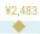  
MS PT

◆ Mean ◆ MS Estimates

RISK REWARD CHART   
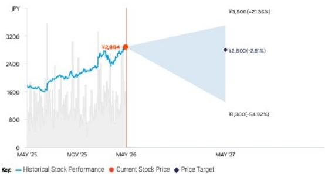  
Source: Refinitiv, MS

# EQUAL-WEIGHT THESIS

\- Needs to further strengthen core components business and restructure solution business.
- Sale of KDDI shares and improve shareholder return should improve ROE. However, it is not clear which businesses will be the earnings drivers and whether or not earnings improvement will continue in the mid/longer term.
- We expect ROE to improve to $4.6\%$ in F3/29 from $0.7\%$ in F3/25, which is still lower than cost of capital of $5.4\%$ and management's target of $7.0\%$ .

Consensus Rating Distribution   
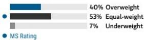  
Source: Refinitiv, MS

# BULL CASE

# Derived from DCF

Sales top the base case by 5% as parts demand recovers: OP ¥131.4bn in F3/26, ¥160.5bn in F3/27, ¥197.0bn in F3/28, ¥225.9bn in F3/29. Same FX & DCF model assumptions as the base case. Bull case fair value equates to P/E of 35.4x on F3/27 diluted EPS of ¥98.9.

# ¥3,500

# BASE CASE

# Derived from DCF

Expect BS structure change by sales of KDDI shares and improvement of return to shareholders. However, it is not clear which business will be earnings drivers. OP ¥102.4bn in F3/26, ¥121.5bn in F3/27, ¥138.0bn in F3/28, ¥166.9bn in F3/29. FX assumptions: ¥150/US\$, ¥170/€. Base case fair value equates to 39.4 x F3/27e diluted EPS of ¥71.1, 35.7x F3/28e diluted EPS of ¥78.4.

# ¥2,800

# BEAR CASE

# F3/27e diluted BPS ¥2,050 x P/B 0.65

Limited improvement in components business earnings. Improvement of capital efficiency limited, although shareholder return improvement continues. OP ¥77.4bn in F3/26, OP ¥96.5bn in F3/27, OP ¥103.0bn in F3/28, OP ¥118.5bn in F3/29. Same FX assumptions as the base case. ROE of 2.5% in F3/27 and 2.5% in F3/28 remains below capital costs of 5.4%, prompting the stock to trade on P/B of 0.65x.

Note: e = MS estimates; Stock price as of the May 15 close for Risk Reward Chart  
Source: Company data, MS

# Taiyo Yuden: Key Financial Data and Risk Reward

Income Statement 

<table><tr><td>(¥ bn)</td><td>F3/25</td><td>F3/26</td><td>F3/27e</td><td>F3/28e</td><td>F3/29e</td></tr><tr><td>Net Sales</td><td>341.4</td><td>355.3</td><td>383.0</td><td>414.7</td><td>449.3</td></tr><tr><td>COGS</td><td>269.9</td><td>273.4</td><td>288.9</td><td>312.2</td><td>340.7</td></tr><tr><td>Gross Profit</td><td>71.6</td><td>81.9</td><td>94.2</td><td>102.4</td><td>108.6</td></tr><tr><td>SG&amp;A Expenses</td><td>61.1</td><td>61.9</td><td>62.4</td><td>63.4</td><td>64.4</td></tr><tr><td>Operating Profit</td><td>10.5</td><td>20.0</td><td>31.8</td><td>39.1</td><td>44.2</td></tr><tr><td>Non-operating Income/Loss</td><td>0.1</td><td>4.1</td><td>3.4</td><td>3.4</td><td>3.4</td></tr><tr><td>Recurring Profit</td><td>10.5</td><td>24.1</td><td>35.2</td><td>42.4</td><td>47.6</td></tr><tr><td>Extraordinary Income/Loss</td><td>-2.2</td><td>-4.1</td><td>-2.0</td><td>-2.0</td><td>-2.0</td></tr><tr><td>Pretax Profit</td><td>8.4</td><td>20.1</td><td>33.2</td><td>40.4</td><td>45.6</td></tr><tr><td>Income Tax</td><td>6.0</td><td>5.1</td><td>8.3</td><td>10.1</td><td>11.4</td></tr><tr><td>(Effective Tax Rate)</td><td>72%</td><td>25%</td><td>25%</td><td>25%</td><td>25%</td></tr><tr><td>Minority Interest</td><td>0.0</td><td>0.0</td><td>0.0</td><td>0.0</td><td>0.0</td></tr><tr><td>Net Profit</td><td>2.3</td><td>14.8</td><td>24.9</td><td>30.3</td><td>34.2</td></tr><tr><td>Capex</td><td>64.2</td><td>40.4</td><td>50.0</td><td>60.0</td><td>60.0</td></tr><tr><td>Depreciation and Amortization</td><td>46.3</td><td>49.1</td><td>50.0</td><td>52.0</td><td>52.0</td></tr><tr><td>R&amp;D Expenses</td><td>15.0</td><td>14.5</td><td>16.5</td><td>17.0</td><td>17.0</td></tr><tr><td>EBITDA</td><td>56.7</td><td>69.1</td><td>81.8</td><td>91.1</td><td>96.2</td></tr><tr><td>ROE</td><td>0.7%</td><td>4.5%</td><td>7.5%</td><td>8.8%</td><td>9.4%</td></tr><tr><td>Average Share Outstanding (Diluted)</td><td>144.3</td><td>137.7</td><td>137.2</td><td>137.2</td><td>137.2</td></tr><tr><td>EPS (Diluted, Yen)</td><td>16.1</td><td>107.6</td><td>181.3</td><td>221.1</td><td>249.1</td></tr><tr><td>BPS (Yen)</td><td>2,206.4</td><td>2,501.8</td><td>2,462.3</td><td>2,588.0</td><td>2,732.6</td></tr><tr><td>DPS (Yen)</td><td>90.0</td><td>90.0</td><td>100.0</td><td>110.0</td><td>120.0</td></tr><tr><td>USD/JPY: Average Exchange Rate</td><td>152.6</td><td>150.0</td><td>150.0</td><td>150.0</td><td>150.0</td></tr><tr><td>YoY % Change</td><td></td><td></td><td></td><td></td><td></td></tr><tr><td>Net Sales</td><td>6%</td><td>4%</td><td>8%</td><td>8%</td><td>8%</td></tr><tr><td>Operating Profit</td><td>15%</td><td>91%</td><td>41%</td><td>23%</td><td>13%</td></tr><tr><td>Net Profit</td><td>-72%</td><td>536%</td><td>46%</td><td>22%</td><td>13%</td></tr><tr><td>As % of Sales</td><td></td><td></td><td></td><td></td><td></td></tr><tr><td>Gross Profit</td><td>21.0%</td><td>23.1%</td><td>24.6%</td><td>24.7%</td><td>24.2%</td></tr><tr><td>Operating Profit</td><td>3.1%</td><td>5.6%</td><td>8.3%</td><td>9.4%</td><td>9.8%</td></tr><tr><td>Net Profit</td><td>0.7%</td><td>4.2%</td><td>6.5%</td><td>7.3%</td><td>7.6%</td></tr><tr><td>Capex</td><td>18.8%</td><td>11.4%</td><td>13.1%</td><td>14.5%</td><td>13.4%</td></tr><tr><td>Depreciation and Amortization</td><td>13.5%</td><td>13.8%</td><td>13.1%</td><td>12.5%</td><td>11.6%</td></tr></table>

Balance Sheet 

<table><tr><td>(¥ bn)</td><td>F3/25</td><td>F3/26</td><td>F3/27e</td><td>F3/28e</td><td>F3/29e</td></tr><tr><td>Total Assets</td><td>573.2</td><td>615.5</td><td>594.4</td><td>614.0</td><td>636.7</td></tr><tr><td>Total Current Assets</td><td>279.3</td><td>318.3</td><td>305.9</td><td>317.5</td><td>332.2</td></tr><tr><td>Cash and Cash Equivalents</td><td>78.2</td><td>100.1</td><td>97.2</td><td>98.0</td><td>100.3</td></tr><tr><td>Marketable Securities</td><td>0.0</td><td>0.0</td><td>0.0</td><td>0.0</td><td>0.0</td></tr><tr><td>Account Receivables</td><td>80.5</td><td>86.4</td><td>88.3</td><td>94.4</td><td>101.1</td></tr><tr><td>Inventory</td><td>110.0</td><td>125.8</td><td>109.9</td><td>114.5</td><td>120.2</td></tr><tr><td>Other Current Assets</td><td>10.5</td><td>6.0</td><td>10.5</td><td>10.5</td><td>10.5</td></tr><tr><td>Total Long Term Assets</td><td>293.9</td><td>297.2</td><td>288.6</td><td>296.6</td><td>304.6</td></tr><tr><td>Net PP&amp;E</td><td>286.8</td><td>290.0</td><td>281.5</td><td>289.5</td><td>297.5</td></tr><tr><td>Investments in Securities</td><td>0.0</td><td>0.0</td><td>0.0</td><td>0.0</td><td>0.0</td></tr><tr><td>Other Assets</td><td>7.0</td><td>7.3</td><td>7.0</td><td>7.0</td><td>7.0</td></tr><tr><td>Total Current Liabilities</td><td>79.6</td><td>93.8</td><td>81.6</td><td>83.9</td><td>86.8</td></tr><tr><td>ST Debt and Current Portion of LT Debt</td><td>19.7</td><td>35.2</td><td>19.7</td><td>19.7</td><td>19.7</td></tr><tr><td>Accounts Payable</td><td>27.2</td><td>26.5</td><td>29.1</td><td>31.4</td><td>34.3</td></tr><tr><td>Other Current Liabilities</td><td>32.8</td><td>32.1</td><td>32.8</td><td>32.8</td><td>32.8</td></tr><tr><td>Total Long Term Liabilities</td><td>174.4</td><td>177.4</td><td>174.4</td><td>174.4</td><td>174.4</td></tr><tr><td>Long Term Debt</td><td>144.7</td><td>136.0</td><td>144.7</td><td>144.7</td><td>144.7</td></tr><tr><td>Other Long Term Liabilities</td><td>29.7</td><td>41.4</td><td>29.7</td><td>29.7</td><td>29.7</td></tr><tr><td>Net Assets</td><td>319.2</td><td>344.4</td><td>338.5</td><td>355.8</td><td>375.6</td></tr><tr><td>Minority Interests</td><td>0.0</td><td>0.0</td><td>0.0</td><td>0.0</td><td>0.0</td></tr><tr><td>Stock Acquisition Rights</td><td>0.7</td><td>0.0</td><td>0.7</td><td>0.7</td><td>0.7</td></tr><tr><td>Net Debt</td><td>86.2</td><td>71.1</td><td>67.2</td><td>66.4</td><td>64.1</td></tr></table>

Cash Flow Statement 

<table><tr><td>(¥ bn)</td><td>F3/25</td><td>F3/26</td><td>F3/27e</td><td>F3/28e</td><td>F3/29e</td></tr><tr><td>Net Cash from Operations</td><td>33.9</td><td>58.1</td><td>67.3</td><td>73.9</td><td>76.6</td></tr><tr><td>Net Income</td><td>2.3</td><td>14.8</td><td>24.9</td><td>30.3</td><td>34.2</td></tr><tr><td>Depreciation and Amortization</td><td>46.3</td><td>49.1</td><td>50.0</td><td>52.0</td><td>52.0</td></tr><tr><td>Changes in Working Capital</td><td>-13.5</td><td>-9.0</td><td>-7.6</td><td>-8.4</td><td>-9.6</td></tr><tr><td>Other-net</td><td>-1.2</td><td>3.2</td><td>0.0</td><td>0.0</td><td>0.0</td></tr><tr><td>Net Cash from Investing Activities</td><td>-63.5</td><td>-25.7</td><td>-50.0</td><td>-60.0</td><td>-60.0</td></tr><tr><td>Purchase of PP&amp;E</td><td>-62.6</td><td>-40.4</td><td>-50.0</td><td>-60.0</td><td>-60.0</td></tr><tr><td>Sale/Purchase of Investments</td><td>1.3</td><td>0.0</td><td>0.0</td><td>0.0</td><td>0.0</td></tr><tr><td>Other-net</td><td>-2.2</td><td>14.7</td><td>0.0</td><td>0.0</td><td>0.0</td></tr><tr><td>Free Cash Flow</td><td>-29.6</td><td>32.4</td><td>17.3</td><td>13.9</td><td>16.6</td></tr><tr><td>Net Cash from Financing Activities</td><td>3.0</td><td>-6.8</td><td>-11.8</td><td>-13.1</td><td>-14.3</td></tr><tr><td>Change in Interest-bearing Debt</td><td>15.7</td><td>6.5</td><td>0.0</td><td>0.0</td><td>0.0</td></tr><tr><td>Change in Treasury Stock</td><td>0.0</td><td>0.0</td><td>0.0</td><td>0.0</td><td>0.0</td></tr><tr><td>Payment of Cash Dividends</td><td>-11.2</td><td>-11.2</td><td>-11.8</td><td>-13.1</td><td>-14.3</td></tr><tr><td>Other-net</td><td>-1.5</td><td>-2.1</td><td>0.0</td><td>0.0</td><td>0.0</td></tr><tr><td>Net Effect of Exchange Rate Changes</td><td>-0.9</td><td>4.9</td><td>0.0</td><td>0.0</td><td>0.0</td></tr><tr><td>Net Change in Cash</td><td>-27.4</td><td>30.5</td><td>5.5</td><td>0.8</td><td>2.3</td></tr><tr><td>Cash at End of Period</td><td>67.5</td><td>98.1</td><td>87.2</td><td>88.1</td><td>90.3</td></tr></table>

Segment Information 

<table><tr><td>(¥ bn)</td><td>F3/25</td><td>F3/26</td><td>F3/27e</td><td>F3/28e</td><td>F3/29e</td></tr><tr><td>Net Sales</td><td>341.4</td><td>355.3</td><td>383.0</td><td>414.7</td><td>449.3</td></tr><tr><td>Capacitors</td><td>232.1</td><td>251.8</td><td>275.4</td><td>303.0</td><td>333.3</td></tr><tr><td>Elna</td><td>0.0</td><td>0.0</td><td>0.0</td><td>0.0</td><td>0.0</td></tr><tr><td>Ferrite and Applied Products</td><td>61.5</td><td>64.3</td><td>68.1</td><td>72.2</td><td>76.5</td></tr><tr><td>Complex Devices</td><td>23.0</td><td>14.8</td><td>14.5</td><td>14.5</td><td>14.5</td></tr><tr><td>Others</td><td>24.8</td><td>24.5</td><td>25.0</td><td>25.0</td><td>25.0</td></tr><tr><td>Total Operating Profit</td><td>10.5</td><td>20.0</td><td>31.8</td><td>39.1</td><td>44.2</td></tr><tr><td>Operating Profit Margin</td><td>3.1%</td><td>5.6%</td><td>8.3%</td><td>9.4%</td><td>9.8%</td></tr></table>

# Risk Reward – Taiyo Yuden (6976.T)

While earnings are improving, a new record high is unlikely.

# PRICE TARGET ¥4,700

Derived from the base case. DCF assumptions: 2.2% risk-free rate, 1.22 equity beta, 3.7% risk premium, for 5.6% WACC; zero growth from F3/35.

Consensus Price Target Distribution

Source: Refinitiv, MS

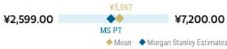

RISK REWARD CHART   
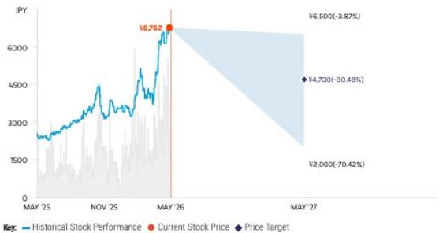

line

| Date   | Value     |
|--------|-----------|
| MAY '26 | 6,762     |
| MAY '27 | 4,700     |

Source: Refinitiv, MS

# EQUAL-WEIGHT THESIS

■ Earnings continue to recover, but surpassing the F3/22 record high will likely take considerable time.   
■ We expect continued earnings recovery in the core MLCC business..   
■ We expect the firm to maintain its tech competitiveness in mainstay MLCCs.   
■ We expect sales growth for power inductors used in 5G smartphones and base stations to continue.

Consensus Rating Distribution   
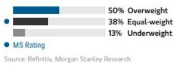

# BULL CASE

# ¥6,500

# BASE CASE

# ¥4,700

# BEAR CASE

# ¥2,000

# Derived from DCF

MLCC sales exceed the base case. OP ¥25.1bn in F3/26, ¥44.0bn in F3/27, ¥56.1bn in F3/28. Same FX & DCF model assumptions as the base case. Fair value equates to P/E 26.2x on F3/27e diluted EPS of ¥248.0 and 20.7x on F3/28e diluted EPS of ¥314.3.

# Derived from DCF

While higher MLCC utilization is driving earnings improvement, a full recovery will take time: OP ¥22.5bn in F3/26, ¥31.8bn in F3/27, ¥39.1bn in F3/28. FX assumption: ¥150/US\$. Base case fair value equates to P/E 25.9x on F3/27e diluted EPS of ¥181.3, and 21.3x on F3/28e diluted EPS of ¥221.1.

# F3/27e diluted BPS ¥2,403 x P/B 0.83

Stays competitive in core products, but slowing end demand drags profits down. OP ¥18.4bn in F3/26, OP ¥23.0bn in F3/27, ¥25.0bn in F3/28. Same FX and DCF assumptions as in the base case. ROE 4.4% in F3/26, 5.8% in F3/27, below capital costs of 6.7% and with earnings lower than market expectation, P/B falls to 0.83x.

Note: e = MS estimates; Stock price as of the May 15 close for Risk Reward Chart  
Source: Company data, MS

# Murata Manufacturing: Key Financial Data and Risk Reward

Income Statement 

<table><tr><td>(¥ bn)</td><td>F3/25</td><td>F3/26</td><td>F3/27e</td><td>F3/28e</td><td>F3/29e</td></tr><tr><td>Net Sales</td><td>1,743.4</td><td>1,830.9</td><td>1,944.9</td><td>2,195.1</td><td>2,485.0</td></tr><tr><td>Cost of Goods Sold</td><td>1,025.7</td><td>1,056.0</td><td>1,018.8</td><td>1,165.0</td><td>1,359.4</td></tr><tr><td>Gross Profit</td><td>717.7</td><td>774.8</td><td>926.2</td><td>1,030.2</td><td>1,125.6</td></tr><tr><td>SG&amp;A Expenses</td><td>438.0</td><td>493.0</td><td>553.3</td><td>570.8</td><td>588.3</td></tr><tr><td>Operating Profit</td><td>279.7</td><td>281.8</td><td>372.8</td><td>459.3</td><td>537.3</td></tr><tr><td>Non-Operating Income/Loss</td><td>24.7</td><td>30.0</td><td>12.0</td><td>12.0</td><td>12.0</td></tr><tr><td>Pretax profit</td><td>304.4</td><td>308.6</td><td>384.8</td><td>471.3</td><td>549.3</td></tr><tr><td>Income Tax</td><td>71.4</td><td>74.9</td><td>92.4</td><td>113.1</td><td>131.8</td></tr><tr><td>(Effective Tax Rate)</td><td>23%</td><td>24%</td><td>24%</td><td>24%</td><td>24%</td></tr><tr><td>Minority Interest</td><td>-0.8</td><td>-0.1</td><td>0.0</td><td>0.0</td><td>0.0</td></tr><tr><td>Net Profit</td><td>233.8</td><td>233.8</td><td>292.5</td><td>358.2</td><td>417.5</td></tr><tr><td>Capex</td><td>180.5</td><td>247.8</td><td>220.0</td><td>210.0</td><td>220.0</td></tr><tr><td>Depreciation and Amortization</td><td>173.3</td><td>178.2</td><td>180.0</td><td>185.0</td><td>190.0</td></tr><tr><td>R&amp;D</td><td>149.3</td><td>158.9</td><td>165.0</td><td>170.0</td><td>173.0</td></tr><tr><td>EBITDA</td><td>453.0</td><td>460.0</td><td>552.8</td><td>644.3</td><td>727.3</td></tr><tr><td>ROE</td><td>9.1%</td><td>8.8%</td><td>11.1%</td><td>13.1%</td><td>14.4%</td></tr><tr><td>Average Share Outstanding (Diluted)</td><td>1,869.3</td><td>1,831.4</td><td>1,828.3</td><td>1,828.3</td><td>1,828.3</td></tr><tr><td>EPS (Diluted, Yen)</td><td>125.08</td><td>127.65</td><td>159.98</td><td>195.92</td><td>228.34</td></tr><tr><td>BPS (Yen)</td><td>1,380.1</td><td>1,484.0</td><td>1,461.4</td><td>1,532.6</td><td>1,636.3</td></tr><tr><td>DPS (Yen)</td><td>57.0</td><td>70.0</td><td>65.0</td><td>70.0</td><td>75.0</td></tr></table>

<table><tr><td>USD/JPY: Average Exchange Rate</td><td>152.6</td><td>150.8</td><td>150.0</td><td>150.0</td><td>150.0</td></tr><tr><td colspan="6">YoY % Change</td></tr><tr><td>Net Sales</td><td>6%</td><td>5%</td><td>8%</td><td>13%</td><td>13%</td></tr><tr><td>Operating Profit</td><td>30%</td><td>1%</td><td>38%</td><td>23%</td><td>17%</td></tr><tr><td>Net Profit</td><td>29%</td><td>0%</td><td>33%</td><td>22%</td><td>17%</td></tr><tr><td colspan="6">As % of Sales</td></tr><tr><td>Gross Profit</td><td>41.2%</td><td>42.3%</td><td>47.6%</td><td>46.9%</td><td>45.3%</td></tr><tr><td>Operating Profit</td><td>16.0%</td><td>15.4%</td><td>19.2%</td><td>20.9%</td><td>21.6%</td></tr><tr><td>Net Profit</td><td>13.4%</td><td>12.8%</td><td>15.0%</td><td>16.3%</td><td>16.8%</td></tr><tr><td>Capex</td><td>10.4%</td><td>13.5%</td><td>11.3%</td><td>9.6%</td><td>8.9%</td></tr><tr><td>Depreciation and Amortization</td><td>9.9%</td><td>9.7%</td><td>9.3%</td><td>8.4%</td><td>7.6%</td></tr></table>

Balance Sheet 

<table><tr><td>(¥ bn)</td><td>F3/25</td><td>F3/26</td><td>F3/27e</td><td>F3/28e</td><td>F3/29e</td></tr><tr><td>Total Assets</td><td>3,028.2</td><td>3,199.1</td><td>3,132.4</td><td>3,274.6</td><td>3,479.9</td></tr><tr><td>Total Current Assets</td><td>1,497.9</td><td>1,581.4</td><td>1,486.9</td><td>1,604.0</td><td>1,779.3</td></tr><tr><td>Cash and Cash Equivalents</td><td>625.1</td><td>653.7</td><td>515.0</td><td>528.1</td><td>574.0</td></tr><tr><td>Marketable Securities</td><td>0.0</td><td>0.0</td><td>0.0</td><td>0.0</td><td>0.0</td></tr><tr><td>Account Receivables</td><td>294.4</td><td>328.2</td><td>394.6</td><td>445.3</td><td>504.1</td></tr><tr><td>Inventory</td><td>482.8</td><td>520.5</td><td>481.8</td><td>535.0</td><td>605.6</td></tr><tr><td>Other Current Assets</td><td>95.5</td><td>79.1</td><td>95.5</td><td>95.5</td><td>95.5</td></tr><tr><td>Total Long Term Assets</td><td>1,530.3</td><td>1,617.7</td><td>1,645.6</td><td>1,670.6</td><td>1,700.6</td></tr><tr><td>Net PP&amp;E</td><td>1,183.7</td><td>1,300.9</td><td>1,299.0</td><td>1,324.0</td><td>1,354.0</td></tr><tr><td>Investments in Securities</td><td>40.3</td><td>50.4</td><td>40.3</td><td>40.3</td><td>40.3</td></tr><tr><td>Other assets</td><td>306.3</td><td>266.4</td><td>306.3</td><td>306.3</td><td>306.3</td></tr><tr><td>Total Current Liabilities</td><td>276.5</td><td>316.5</td><td>289.8</td><td>301.6</td><td>317.4</td></tr><tr><td>ST Debt &amp; Current Portion of LT Debt</td><td>0.8</td><td>1.7</td><td>0.8</td><td>0.8</td><td>0.8</td></tr><tr><td>Accounts Payable</td><td>69.6</td><td>79.8</td><td>82.9</td><td>94.7</td><td>110.5</td></tr><tr><td>Other Current Liabilities</td><td>206.1</td><td>234.9</td><td>206.1</td><td>206.1</td><td>206.1</td></tr><tr><td>Total Long Term Liabilities</td><td>171.7</td><td>164.8</td><td>171.7</td><td>171.7</td><td>171.7</td></tr><tr><td>Long Term Debt</td><td>1.7</td><td>1.5</td><td>1.7</td><td>1.7</td><td>1.7</td></tr><tr><td>Other Long Term Liabilities</td><td>170.0</td><td>163.3</td><td>170.0</td><td>170.0</td><td>170.0</td></tr><tr><td>Minority Interests</td><td>-0.8</td><td>-0.9</td><td>-0.8</td><td>-0.8</td><td>-0.8</td></tr><tr><td>Total Equity</td><td>2,580.0</td><td>2,717.8</td><td>2,671.8</td><td>2,802.1</td><td>2,991.5</td></tr></table>

<table><tr><td>Net Debt</td><td>-663.0</td><td>-700.8</td><td>-552.8</td><td>-566.0</td><td>-611.8</td></tr></table>

Cash Flow Statement 

<table><tr><td>(¥ bn)</td><td>F3/25</td><td>F3/26</td><td>F3/27e</td><td>F3/28e</td><td>F3/29e</td></tr><tr><td>Net Cash from Operations</td><td>451.9</td><td>425.2</td><td>450.1</td><td>451.1</td><td>493.8</td></tr><tr><td>Net Income</td><td>233.8</td><td>233.8</td><td>292.5</td><td>358.2</td><td>417.5</td></tr><tr><td>Depreciation and Amortization</td><td>173.3</td><td>178.2</td><td>180.0</td><td>185.0</td><td>190.0</td></tr><tr><td>Changes in Working Capital:</td><td>24.4</td><td>-18.0</td><td>-22.4</td><td>-92.1</td><td>-113.6</td></tr><tr><td>Other-net</td><td>20.3</td><td>31.3</td><td>0.0</td><td>0.0</td><td>0.0</td></tr><tr><td>Net Cash from Investing Activities</td><td>-208.1</td><td>-193.8</td><td>-220.0</td><td>-210.0</td><td>-220.0</td></tr><tr><td>Purchase of PP&amp;E</td><td>-179.4</td><td>-243.0</td><td>-220.0</td><td>-210.0</td><td>-220.0</td></tr><tr><td>Sale/Purchase of Investments</td><td>3.4</td><td>2.2</td><td>0.0</td><td>0.0</td><td>0.0</td></tr><tr><td>Other-net</td><td>-32.1</td><td>46.9</td><td>0.0</td><td>0.0</td><td>0.0</td></tr><tr><td>Free cash flow</td><td>243.8</td><td>231.4</td><td>230.1</td><td>241.1</td><td>273.8</td></tr><tr><td>Net Cash from Financing Activities</td><td>-242.7</td><td>-221.8</td><td>-210.2</td><td>-228.0</td><td>-228.0</td></tr><tr><td>Change in Interest-bearing Debt</td><td>-50.4</td><td>0.8</td><td>0.0</td><td>0.0</td><td>0.0</td></tr><tr><td>Change in Treasury Stock</td><td>-80.0</td><td>-100.0</td><td>-100.0</td><td>-100.0</td><td>-100.0</td></tr><tr><td>Payment of Cash Dividends</td><td>-101.6</td><td>-110.7</td><td>-110.2</td><td>-128.0</td><td>-128.0</td></tr><tr><td>Other-net</td><td>-10.7</td><td>-11.9</td><td>0.0</td><td>0.0</td><td>0.0</td></tr><tr><td>Net Effect of Exchange Rate Changes</td><td>2.0</td><td>19.0</td><td>0.0</td><td>0.0</td><td>0.0</td></tr><tr><td>Net Change in Cash</td><td>3.1</td><td>28.6</td><td>19.9</td><td>13.2</td><td>45.9</td></tr></table>

Segment Information 

<table><tr><td>(¥ bn)</td><td>F3/25</td><td>F3/26</td><td>F3/27e</td><td>F3/28e</td><td>F3/29e</td></tr><tr><td>Net Sales</td><td>1,793.3</td><td>1,830.9</td><td>1,944.9</td><td>2,195.1</td><td>2,485.0</td></tr><tr><td>Components Total</td><td>1,033.1</td><td>1,159.7</td><td>1,245.3</td><td>1,371.4</td><td>1,505.6</td></tr><tr><td>Capacitors</td><td>831.8</td><td>936.4</td><td>1,016.7</td><td>1,133.6</td><td>1,258.3</td></tr><tr><td>Inductors and EMI Filters</td><td>201.3</td><td>223.3</td><td>228.6</td><td>237.8</td><td>247.3</td></tr><tr><td>Devices/Modules</td><td>697.2</td><td>656.0</td><td>686.6</td><td>810.7</td><td>966.4</td></tr><tr><td>High Frequency Devices/Communications Module</td><td>443.6</td><td>394.8</td><td>415.7</td><td>498.8</td><td>598.6</td></tr><tr><td>Battery/Power supply</td><td>155.7</td><td>154.1</td><td>159.3</td><td>193.6</td><td>242.4</td></tr><tr><td>Functional Devices</td><td>97.8</td><td>107.1</td><td>111.6</td><td>118.3</td><td>125.4</td></tr><tr><td>Others</td><td>13.1</td><td>15.2</td><td>13.0</td><td>13.0</td><td>13.0</td></tr><tr><td>Total Operating Profit</td><td>279.7</td><td>281.8</td><td>372.8</td><td>459.3</td><td>537.3</td></tr><tr><td>Components Total</td><td>275.2</td><td>44.5</td><td>329.8</td><td>388.1</td><td>441.1</td></tr><tr><td>Devices/Modules</td><td>10.0</td><td>-26.5</td><td>49.0</td><td>77.3</td><td>102.2</td></tr><tr><td>Others</td><td>-5.4</td><td>-6.8</td><td>-6.0</td><td>-6.0</td><td>-6.0</td></tr><tr><td>Operating Profit Margin</td><td>15.6%</td><td>15.4%</td><td>19.2%</td><td>20.9%</td><td>21.6%</td></tr><tr><td>Components Total</td><td>26.6%</td><td>3.8%</td><td>26.5%</td><td>28.3%</td><td>29.3%</td></tr><tr><td>Devices/Modules</td><td>2.3%</td><td>-6.7%</td><td>11.8%</td><td>15.5%</td><td>17.1%</td></tr></table>

Sales by Application 

<table><tr><td>(¥ bn)</td><td>F3/25</td><td>F3/26</td><td>F3/27e</td><td>F3/28e</td><td>F3/29e</td></tr><tr><td>Net Sales (excl. Non-product Sales)</td><td>1,793.3</td><td>1,830.9</td><td>1,944.9</td><td>2,195.1</td><td>2,485.0</td></tr><tr><td>AV</td><td>674.2</td><td>-</td><td>-</td><td>-</td><td>-</td></tr><tr><td>Communication</td><td>453.1</td><td>-</td><td>-</td><td>-</td><td>-</td></tr><tr><td>Computer and Peripheral</td><td>281.9</td><td>-</td><td>-</td><td>-</td><td>-</td></tr><tr><td>Automobile Electronics</td><td>150.4</td><td>-</td><td>-</td><td>-</td><td>-</td></tr><tr><td>Home Appliances and Others</td><td>183.7</td><td>-</td><td>-</td><td>-</td><td>-</td></tr><tr><td colspan="6">As % of Total</td></tr><tr><td>AV</td><td>38.7%</td><td>-</td><td>-</td><td>-</td><td>-</td></tr><tr><td>Communication</td><td>26.0%</td><td>-</td><td>-</td><td>-</td><td>-</td></tr><tr><td>Computer and Peripheral</td><td>16.2%</td><td>-</td><td>-</td><td>-</td><td>-</td></tr><tr><td>Automobile Electronics</td><td>8.6%</td><td>-</td><td>-</td><td>-</td><td>-</td></tr><tr><td>Home Appliances and Others</td><td>10.5%</td><td>-</td><td>-</td><td>-</td><td>-</td></tr></table>

# Risk Reward – Murata Manufacturing (6981.T)

Expect MLCC utilization rates to remain high and earnings to continue to expand

# PRICE TARGET ¥5,100

Derived from our base case and a DCF model, with the following assumptions: 2.2% risk-free rate, 1.09 equity beta, 3.7% risk premium, yielding 6.2% WACC; zero growth from F3/36.

Consensus Price Target Distribution

Source: Refinitiv, MS

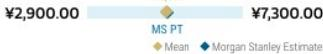

RISK REWARD CHART   
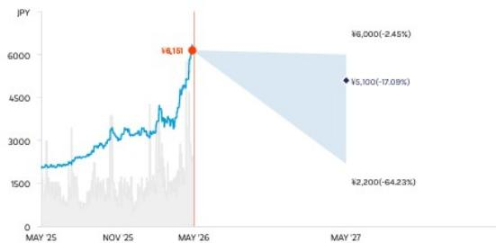

line

| Date   | Value     |
|--------|-----------|
| MAY '25| 1500      |
| NOV '25| 3000      |
| MAY '26| 6000      |
| MAY '27| 6000      |

Key: — Historical Stock Performance ● Current Stock Price ◆ Price Target   
Source: Refinitiv, MS

# OVERWEIGHT THESIS

In F3/26, we expect MLCC sales to increase and LiB losses to shrink.   
■ Utilization rates in the MLCC space are likely to remain high as demand for use in AI servers continues to rise, and we thus expect currently high profits to expand further.   
■ We expect Murata to remain competitive in MLCCs and other products over the long term.   
In F3/27 onward, we expect module earnings to improve as sales of RF modules rise.

Consensus Rating Distribution   
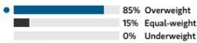  
MS Rating   
Source: Refinitiv, MS

# Risk Reward Themes

New Data Era: Positive Secular Growth: Positive

View descriptions of Risk Rewards Themes here

# BULL CASE

Derived from DCF

Demand for end products such as smartphones and autos is stronger than in the base case. OP assumptions: ¥318.5bn in F3/26, ¥430.2bn in F3/27, ¥526.7bn in F3/28. Same FX & DCF model assumptions as the base case. Bull case fair value equates to P/E of 34.3x on F3/27 diluted EPS of ¥175.1 and 28.1x on F3/28 diluted EPS of ¥213.3.

# ¥6,000

# BASE CASE

Derived from DCF

Earnings continue to grow and beat consensus over the medium/long-term due to technological advantages & competitiveness, especially in MLCCs.

Assumptions: OP ¥270.6bn in F3/26, ¥372.8bn in F3/27, ¥459.3bn in F3/28; FX ¥150/US\$, ¥170/€; DCF model (same as valuation methodology): 2.2% risk-free rate, 1.09 equity beta, 3.7% risk premium, yielding 6.2% WACC; zero growth from F3/36. Base case fair value equates to P/E 31.9x on F3/27e diluted EPS of ¥160.0 and 26.0x on F3/28e diluted EPS of ¥195.9.

# ¥5,100

# BEAR CASE

# ¥2,200

F3/27e BPS ¥1,448x P/B 1.5

Murata remains competitive, but final demand for its components is lower than we envision. OP assumptions: ¥240.7bn in F3/26, ¥279.1bn in F3/27, ¥310.2bn in F3/28. Same FX assumptions as the base case. Assumes ROE moves from 9.1% in F3/25 to 7.5% in F3/26 and 8.2% in F3/27, higher than our capital cost estimate of 6.2%, but with earnings missing market expectations, P/B drops to 1.5x.

# Nichicon: Key Financial Data and Risk Reward

Income Statement 

<table><tr><td>(JPY bn)</td><td>F3/25</td><td>F3/26</td><td>F3/27e</td><td>F3/28e</td><td>F3/29e</td></tr><tr><td>Sales</td><td>175.8</td><td>169.7</td><td>182.6</td><td>187.8</td><td>192.7</td></tr><tr><td>Costs of Sales</td><td>147.4</td><td>139.7</td><td>149.0</td><td>152.0</td><td>155.2</td></tr><tr><td>Gross Profit</td><td>28.3</td><td>30.0</td><td>33.6</td><td>35.8</td><td>37.5</td></tr><tr><td>SG&amp;A</td><td>23.1</td><td>23.5</td><td>25.2</td><td>26.1</td><td>27.0</td></tr><tr><td>Operating Income</td><td>5.2</td><td>6.5</td><td>8.4</td><td>9.7</td><td>10.5</td></tr><tr><td>Non-operating income/expenses</td><td>2.3</td><td>1.9</td><td>0.6</td><td>0.6</td><td>0.6</td></tr><tr><td>Recurring Profit</td><td>7.5</td><td>8.3</td><td>9.0</td><td>10.3</td><td>11.1</td></tr><tr><td>Extraordinary income</td><td>1.0</td><td>-1.1</td><td>0.0</td><td>0.0</td><td>0.0</td></tr><tr><td>Profit before income taxes</td><td>8.5</td><td>7.2</td><td>9.0</td><td>10.3</td><td>11.1</td></tr><tr><td>Income taxes</td><td>2.1</td><td>6.3</td><td>2.8</td><td>3.2</td><td>3.4</td></tr><tr><td>(Effective tax rate)</td><td>25%</td><td>88%</td><td>31%</td><td>31%</td><td>31%</td></tr><tr><td>Profit attributable to non-controlling interests</td><td>0.5</td><td>0.0</td><td>0.0</td><td>0.0</td><td>0.0</td></tr><tr><td>Net Profit</td><td>5.9</td><td>6.3</td><td>6.2</td><td>7.1</td><td>7.7</td></tr><tr><td>Capex</td><td>11.1</td><td>7.6</td><td>9.1</td><td>9.4</td><td>12.5</td></tr><tr><td>Depreciation &amp; amortization</td><td>8.5</td><td>8.1</td><td>9.3</td><td>9.4</td><td>9.6</td></tr><tr><td>R&amp;D</td><td>7.2</td><td>7.3</td><td>9.3</td><td>9.6</td><td>9.8</td></tr><tr><td>EPS (JPY)</td><td>86.0</td><td>94.0</td><td>92.3</td><td>105.7</td><td>114.7</td></tr><tr><td>USD/JPY</td><td>151.6</td><td>150.0</td><td>150.0</td><td>150.0</td><td>150.0</td></tr></table>

Cashflow Statement 

<table><tr><td>(JPY bn)</td><td>F3/25</td><td>F3/26</td><td>F3/27e</td><td>F3/28e</td><td>F3/29e</td></tr><tr><td>Cash flow from operating activities</td><td>18.3</td><td>8.2</td><td>14.1</td><td>16.2</td><td>17.1</td></tr><tr><td>EBIT</td><td>8.5</td><td>7.2</td><td>9.0</td><td>10.3</td><td>11.1</td></tr><tr><td>Depreciation</td><td>8.5</td><td>8.1</td><td>9.3</td><td>9.4</td><td>9.6</td></tr><tr><td>Changes in Receivables</td><td>3.2</td><td>-1.2</td><td>-2.2</td><td>-1.3</td><td>-1.3</td></tr><tr><td>Change in inventory</td><td>3.7</td><td>1.8</td><td>-0.8</td><td>-0.1</td><td>0.1</td></tr><tr><td>Changes in Payables</td><td>-2.2</td><td>-6.0</td><td>1.4</td><td>0.8</td><td>0.8</td></tr><tr><td>Other</td><td>-3.3</td><td>-1.7</td><td>-2.6</td><td>-3.0</td><td>-3.2</td></tr><tr><td>Cash flow from investing activities</td><td>-8.4</td><td>-6.6</td><td>-9.1</td><td>-9.4</td><td>-12.5</td></tr><tr><td>Purchase of PP&amp;E</td><td>-10.7</td><td>-7.1</td><td>-9.1</td><td>-9.4</td><td>-12.5</td></tr><tr><td>Sales of PP&amp;E</td><td>0.0</td><td>0.0</td><td>0.0</td><td>0.0</td><td>0.0</td></tr><tr><td>Other</td><td>2.3</td><td>0.5</td><td>0.0</td><td>0.0</td><td>0.0</td></tr><tr><td>Cash flow from financing activities</td><td>-14.3</td><td>-3.8</td><td>-3.1</td><td>-4.0</td><td>-2.4</td></tr><tr><td>Net Change In Borrowings</td><td>2.2</td><td>-0.8</td><td>-0.7</td><td>-1.4</td><td>0.4</td></tr><tr><td>Purchase of treasury shares</td><td>-1.6</td><td>0.0</td><td>0.0</td><td>0.0</td><td>0.0</td></tr><tr><td>Cash dividend paid</td><td>-2.5</td><td>-2.4</td><td>-2.4</td><td>-2.6</td><td>-2.8</td></tr><tr><td>Other</td><td>-12.5</td><td>-0.6</td><td>0.0</td><td>0.0</td><td>0.0</td></tr><tr><td>Effect of exchange rate changes</td><td>0.5</td><td>1.2</td><td>0.3</td><td>0.0</td><td>0.0</td></tr><tr><td>Changes in cash and cash equivalents</td><td>-3.9</td><td>-1.1</td><td>2.2</td><td>2.8</td><td>2.2</td></tr><tr><td>Cash and cash equivalents at end of the period</td><td>25.5</td><td>24.4</td><td>31.5</td><td>34.3</td><td>36.5</td></tr></table>

Balance Sheet 

<table><tr><td>(JPY bn)</td><td>F3/25</td><td>F3/26</td><td>F3/27e</td><td>F3/28e</td><td>F3/29e</td></tr><tr><td>Total assets</td><td>192.6</td><td>195.6</td><td>203.0</td><td>207.0</td><td>213.1</td></tr><tr><td>Current assets</td><td>108.3</td><td>107.7</td><td>120.7</td><td>124.9</td><td>128.3</td></tr><tr><td>Cash and cash equivalents</td><td>25.5</td><td>24.5</td><td>31.5</td><td>34.3</td><td>36.5</td></tr><tr><td>Accounts receivable</td><td>44.8</td><td>47.4</td><td>46.6</td><td>47.9</td><td>49.2</td></tr><tr><td>Inventories</td><td>33.2</td><td>32.3</td><td>38.0</td><td>38.1</td><td>38.0</td></tr><tr><td>Other financial assets</td><td>4.7</td><td>3.5</td><td>4.6</td><td>4.6</td><td>4.6</td></tr><tr><td>Fixed assets</td><td>84.3</td><td>87.9</td><td>82.3</td><td>82.1</td><td>84.9</td></tr><tr><td>Tangible fixed assets</td><td>53.1</td><td>52.5</td><td>51.4</td><td>51.4</td><td>54.3</td></tr><tr><td>Intangible fixed assets</td><td>1.9</td><td>2.1</td><td>1.6</td><td>1.4</td><td>1.3</td></tr><tr><td>Other non-current assets</td><td>29.3</td><td>33.2</td><td>29.3</td><td>29.3</td><td>29.3</td></tr><tr><td>Current liabilities</td><td>51.6</td><td>47.2</td><td>53.2</td><td>53.6</td><td>53.9</td></tr><tr><td>Short term borrowings</td><td>9.2</td><td>10.9</td><td>9.7</td><td>9.2</td><td>8.7</td></tr><tr><td>Accounts payable</td><td>28.5</td><td>23.3</td><td>29.6</td><td>30.4</td><td>31.2</td></tr><tr><td>Other current liabilities</td><td>13.9</td><td>13.0</td><td>13.9</td><td>14.0</td><td>14.0</td></tr><tr><td>Fixed liabilities</td><td>27.2</td><td>24.8</td><td>25.1</td><td>24.1</td><td>25.0</td></tr><tr><td>Long term borrowings</td><td>15.8</td><td>13.3</td><td>13.6</td><td>12.7</td><td>13.5</td></tr><tr><td>Other fixed liabilities</td><td>11.5</td><td>11.6</td><td>11.5</td><td>11.5</td><td>11.5</td></tr><tr><td>Net assets</td><td>113.8</td><td>123.5</td><td>124.7</td><td>129.3</td><td>134.2</td></tr><tr><td>Total liabilities and equity</td><td>192.6</td><td>195.6</td><td>203.0</td><td>207.0</td><td>213.1</td></tr></table>

Sales by Product 

<table><tr><td>(JPY bn)</td><td>F3/25</td><td>F3/26</td><td>F3/27e</td><td>F3/28e</td><td>F3/29e</td></tr><tr><td>Capacitor</td><td>99.2</td><td>102.7</td><td>109.9</td><td>113.0</td><td>115.7</td></tr><tr><td>Aluminum capacitor</td><td>79.3</td><td>82.0</td><td>85.8</td><td>87.7</td><td>88.8</td></tr><tr><td>Film capacitor</td><td>19.8</td><td>20.7</td><td>24.1</td><td>25.3</td><td>26.9</td></tr><tr><td>NECST</td><td>76.6</td><td>67.0</td><td>72.7</td><td>74.8</td><td>77.0</td></tr><tr><td>Applied system and equipment</td><td>7.3</td><td>7.2</td><td>7.2</td><td>7.4</td><td>7.5</td></tr><tr><td>EV</td><td>5.6</td><td>3.5</td><td>3.6</td><td>3.6</td><td>3.6</td></tr><tr><td>Power source</td><td>26.3</td><td>21.7</td><td>23.9</td><td>24.4</td><td>24.9</td></tr><tr><td>Storage</td><td>35.6</td><td>32.4</td><td>35.8</td><td>37.2</td><td>38.8</td></tr><tr><td>Others</td><td>1.9</td><td>2.2</td><td>2.2</td><td>2.2</td><td>2.2</td></tr><tr><td>(YoY)</td><td></td><td></td><td></td><td></td><td></td></tr><tr><td>Capacitor</td><td>-7%</td><td>4%</td><td>6%</td><td>3%</td><td>2%</td></tr><tr><td>Aluminum capacitor</td><td>-9%</td><td>3%</td><td>4%</td><td>2%</td><td>1%</td></tr><tr><td>Film capacitor</td><td>-19%</td><td>6%</td><td>11%</td><td>8%</td><td>5%</td></tr><tr><td>NECST</td><td>2%</td><td>-13%</td><td>3%</td><td>3%</td><td>3%</td></tr><tr><td>Applied system and equipment</td><td>6%</td><td>-1%</td><td>2%</td><td>2%</td><td>2%</td></tr><tr><td>EV</td><td>-31%</td><td>-37%</td><td>0%</td><td>0%</td><td>0%</td></tr><tr><td>Power source</td><td>11%</td><td>-17%</td><td>2%</td><td>2%</td><td>2%</td></tr><tr><td>Storage</td><td>4%</td><td>-9%</td><td>4%</td><td>4%</td><td>4%</td></tr><tr><td>Others</td><td>-20%</td><td>15%</td><td>0%</td><td>0%</td><td>0%</td></tr></table>

OP by Product 

<table><tr><td>(JPY bn)</td><td>F3/25</td><td>F3/26</td><td>F3/27e</td><td>F3/28e</td><td>F3/29e</td></tr><tr><td>Capacitor</td><td>1.6</td><td>4.6</td><td>5.2</td><td>6.0</td><td>6.4</td></tr><tr><td>Aluminum capacitor</td><td>0.5</td><td>3.1</td><td>2.9</td><td>3.5</td><td>3.7</td></tr><tr><td>Film capacitor</td><td>1.0</td><td>1.5</td><td>2.2</td><td>2.5</td><td>2.7</td></tr><tr><td>NECST</td><td>3.7</td><td>1.9</td><td>3.2</td><td>3.7</td><td>4.1</td></tr><tr><td>Applied system and equipment</td><td>1.1</td><td>0.8</td><td>0.7</td><td>0.7</td><td>0.8</td></tr><tr><td>EV</td><td>-0.3</td><td>-0.8</td><td>-0.2</td><td>-0.2</td><td>-0.2</td></tr><tr><td>Power source</td><td>0.5</td><td>0.1</td><td>-0.2</td><td>-0.1</td><td>0.0</td></tr><tr><td>Storage</td><td>2.2</td><td>1.5</td><td>2.9</td><td>3.2</td><td>3.5</td></tr><tr><td>Others/Adjustment</td><td>0.2</td><td>0.2</td><td>0.0</td><td>0.0</td><td>0.0</td></tr><tr><td>(GPM)</td><td></td><td></td><td></td><td></td><td></td></tr><tr><td>Capacitor</td><td>1.6%</td><td>4.5%</td><td>4.7%</td><td>5.3%</td><td>5.5%</td></tr><tr><td>Aluminum capacitor</td><td>0.7%</td><td>3.8%</td><td>3.4%</td><td>4.0%</td><td>4.1%</td></tr><tr><td>Film capacitor</td><td>5.1%</td><td>7.2%</td><td>9.3%</td><td>9.8%</td><td>10.1%</td></tr><tr><td>NECST</td><td>4.8%</td><td>2.8%</td><td>4.4%</td><td>5.0%</td><td>5.4%</td></tr><tr><td>Applied system and equipment</td><td>14.4%</td><td>11.3%</td><td>9.5%</td><td>9.9%</td><td>10.3%</td></tr><tr><td>EV</td><td>-5.4%</td><td>-21.3%</td><td>-5.5%</td><td>-5.1%</td><td>-4.7%</td></tr><tr><td>Power source</td><td>1.9%</td><td>0.3%</td><td>-0.8%</td><td>-0.3%</td><td>0.0%</td></tr><tr><td>Storage</td><td>6.2%</td><td>4.7%</td><td>8.2%</td><td>8.7%</td><td>9.0%</td></tr></table>

# Risk Reward – Nichicon (6996.T)

AEC earnings to recover gradually

# PRICE TARGET ¥2,100

Our price target is ¥2,100, based on a DCF valuation (risk-free rate 2.2%; beta 1.0; risk premium 3.7%; WACC 4.7%). Beyond our 3-year base earnings models, we also build forecasts for F3/29–30 into our DCF-based valuation, and our assumptions for F3/31 onward are that the firm maintains FCF/share of ¥105. Our price target equates to 22.7x our F3/27E EPS of ¥92.3. Our forex rate assumption for the next quarter and thereafter is ¥150/\$.

# Consensus Price Target Distribution

Source: Refinitiv, MS

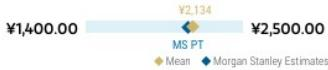

RISK REWARD CHART   
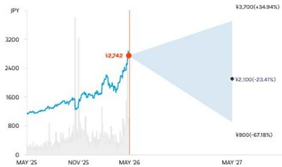

line

| Date   | Value     |
|--------|-----------|
| MAY '26 | ¥2,742    |
| MAY '27 | ¥3,700    |
| MAY '27 | ¥2,100    |
| MAY '27 | ¥900      |

Key: — Historical Stock Performance ● Current Stock Price ◆ Price Target   
Source: Refinitiv, MS

# BULL CASE

Strong sales growth continues in AEC/NECST

OP and EPS forecasts of ¥6.2bn/¥91.6 in F3/26, ¥10.2bn/¥111.7 in F3/27, ¥13.2bn/¥141.5 in F3/28, ¥16.1bn/¥171.2 in F3/29, and ¥18.4bn/¥195.1 in F3/30. Our calculations also assume that from F3/31 onward the firm can maintain FCF/share at ¥200. The fair value equates to 33.1x our F3/27E EPS of ¥111.7 and 2.0x BPS of ¥1,826.2.

# ¥3,700

# BASE CASE

High-value aluminum electrolytics drive recovery

OP and EPS forecasts of ¥6.2bn/¥91.6 in F3/26, ¥8.4bn/¥92.3 in F3/27, ¥9.7bn/¥105.7 in F3/28, ¥10.5bn/¥114.7 in F3/29, and ¥10.6bn/¥116.1 in F3/30. Our calculations also assume that from F3/31 onward the firm can maintain FCF/share at ¥105. Our PT equates to 22.7x our F3/27E EPS of ¥92.3 and 1.2x BPS of ¥1,806.8.

# EQUAL-WEIGHT THESIS

The equity story is centered on increased sales of high value-added, high-capacity capacitors and the stable growth of the NECST business. From F3/27, we expect the capacitor business to expand, driven primarily by large-size products for AI servers and film capacitors for xEV applications, while competition in general-purpose products is likely to remain intense amid rivalry with Chinese players. We expect NECST business to deliver stable growth, supported by the wider adoption of residential energy storage systems.

Consensus Rating Distribution   
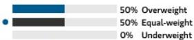  
MS Rating   
Source: Refinitiv, MS

# Risk Reward Themes

Electric Vehicles: Positive

View descriptions of Risk Rewards Themes here

Note: e = MS estimates; Stock price as of the May 15 close for Risk Reward Chart  
Source: Company data, MS

# Nippon Chemi-con: Key Financial Data and Risk Reward

Income Statement 

<table><tr><td>(JPY bn)</td><td>F3/25</td><td>F3/26</td><td>F3/27e</td><td>F3/28e</td><td>F3/29e</td></tr><tr><td>Sales</td><td>122.7</td><td>136.8</td><td>147.6</td><td>153.5</td><td>157.5</td></tr><tr><td>Costs of Sales</td><td>99.0</td><td>112.4</td><td>119.3</td><td>123.7</td><td>126.4</td></tr><tr><td>Gross Profit</td><td>23.7</td><td>24.4</td><td>28.3</td><td>29.8</td><td>31.1</td></tr><tr><td>SG&amp;A</td><td>20.0</td><td>21.1</td><td>22.7</td><td>23.4</td><td>24.0</td></tr><tr><td>Operating Income</td><td>3.7</td><td>3.4</td><td>5.6</td><td>6.4</td><td>7.1</td></tr><tr><td>Non-operating income/expenses</td><td>-2.2</td><td>-1.3</td><td>-1.5</td><td>-1.5</td><td>-1.5</td></tr><tr><td>Recurring Profit</td><td>1.6</td><td>2.1</td><td>4.1</td><td>4.9</td><td>5.6</td></tr><tr><td>Extraordinary income</td><td>-1.0</td><td>1.4</td><td>0.0</td><td>0.0</td><td>0.0</td></tr><tr><td>Profit before income taxes</td><td>0.6</td><td>3.5</td><td>4.1</td><td>4.9</td><td>5.6</td></tr><tr><td>Income taxes</td><td>0.5</td><td>1.1</td><td>1.3</td><td>1.5</td><td>1.7</td></tr><tr><td>(Effective tax rate)</td><td>88%</td><td>31%</td><td>32%</td><td>31%</td><td>30%</td></tr><tr><td>Profit attributable to non-controlling interests</td><td>0.0</td><td>0.1</td><td>0.0</td><td>0.0</td><td>0.0</td></tr><tr><td>Net Profit</td><td>0.0</td><td>2.4</td><td>2.8</td><td>3.4</td><td>3.9</td></tr><tr><td>Capex</td><td>7.6</td><td>5.9</td><td>7.4</td><td>7.7</td><td>7.9</td></tr><tr><td>Depreciation &amp; amortization</td><td>7.1</td><td>7.3</td><td>6.7</td><td>6.8</td><td>7.0</td></tr><tr><td>R&amp;D</td><td>4.2</td><td>3.9</td><td>4.6</td><td>4.8</td><td>4.9</td></tr><tr><td>EPS (JPY)</td><td>1.0</td><td>68.8</td><td>102.3</td><td>124.2</td><td>142.4</td></tr><tr><td>USD/JPY</td><td>152.6</td><td>150.8</td><td>150.0</td><td>150.0</td><td>150.0</td></tr></table>

Cashflow Statement 

<table><tr><td>(JPY bn)</td><td>F3/25</td><td>F3/26</td><td>F3/27e</td><td>F3/28e</td><td>F3/29e</td></tr><tr><td>Cash flow from operating activities</td><td>-0.5</td><td>7.6</td><td>6.4</td><td>8.9</td><td>10.3</td></tr><tr><td>EBIT</td><td>0.6</td><td>3.5</td><td>4.1</td><td>4.9</td><td>5.6</td></tr><tr><td>Depreciation</td><td>7.1</td><td>7.3</td><td>6.7</td><td>6.8</td><td>7.0</td></tr><tr><td>Changes in Receivables</td><td>2.7</td><td>-4.3</td><td>-2.6</td><td>-1.4</td><td>-0.9</td></tr><tr><td>Change in inventory</td><td>-3.8</td><td>3.1</td><td>-2.3</td><td>-1.0</td><td>-0.5</td></tr><tr><td>Changes in Payables</td><td>-1.0</td><td>-0.5</td><td>1.2</td><td>0.6</td><td>0.4</td></tr><tr><td>Other</td><td>-6.1</td><td>-1.5</td><td>-0.8</td><td>-1.0</td><td>-1.3</td></tr><tr><td>Cash flow from investing activities</td><td>-9.8</td><td>-5.3</td><td>-7.4</td><td>-7.7</td><td>-7.9</td></tr><tr><td>Purchase of PP&amp;E</td><td>-9.3</td><td>-4.4</td><td>-7.1</td><td>-7.4</td><td>-7.6</td></tr><tr><td>Sales of PP&amp;E</td><td>0.0</td><td>0.0</td><td>0.0</td><td>0.0</td><td>0.0</td></tr><tr><td>Other</td><td>-0.4</td><td>-0.9</td><td>-0.3</td><td>-0.3</td><td>-0.3</td></tr><tr><td>Cash flow from financing activities</td><td>-11.9</td><td>-6.2</td><td>5.3</td><td>-1.8</td><td>-2.4</td></tr><tr><td>Net Change In Borrowings</td><td>-10.6</td><td>-2.7</td><td>6.4</td><td>-0.5</td><td>-1.1</td></tr><tr><td>Purchase of treasury shares</td><td>0.0</td><td>0.0</td><td>0.0</td><td>0.0</td><td>0.0</td></tr><tr><td>Cash dividend paid</td><td>-0.2</td><td>-0.6</td><td>-1.1</td><td>-1.3</td><td>-1.3</td></tr><tr><td>Other</td><td>-1.2</td><td>-3.0</td><td>0.0</td><td>0.0</td><td>0.0</td></tr><tr><td>Effect of exchange rate changes</td><td>0.7</td><td>1.3</td><td>0.3</td><td>0.0</td><td>0.0</td></tr><tr><td>Changes in cash and cash equivalents</td><td>-21.4</td><td>-2.6</td><td>4.5</td><td>-0.6</td><td>-0.1</td></tr><tr><td>Cash and cash equivalents at end of the period</td><td>23.9</td><td>21.3</td><td>25.3</td><td>24.7</td><td>24.7</td></tr></table>

Balance Sheet 

<table><tr><td>(JPY bn)</td><td>F3/25</td><td>F3/26</td><td>F3/27e</td><td>F3/28e</td><td>F3/29e</td></tr><tr><td>Total assets</td><td>162.7</td><td>166.0</td><td>171.0</td><td>173.3</td><td>175.2</td></tr><tr><td>Current assets</td><td>86.6</td><td>87.6</td><td>96.9</td><td>98.7</td><td>100.1</td></tr><tr><td>Cash and cash equivalents</td><td>23.9</td><td>21.3</td><td>25.3</td><td>24.7</td><td>24.7</td></tr><tr><td>Accounts receivable</td><td>28.9</td><td>29.2</td><td>34.8</td><td>36.2</td><td>37.1</td></tr><tr><td>Inventories</td><td>33.1</td><td>31.2</td><td>36.0</td><td>37.0</td><td>37.5</td></tr><tr><td>Other financial assets</td><td>0.8</td><td>5.8</td><td>0.8</td><td>0.8</td><td>0.8</td></tr><tr><td>Fixed assets</td><td>76.1</td><td>78.4</td><td>74.2</td><td>74.6</td><td>75.2</td></tr><tr><td>Tangible fixed assets</td><td>48.3</td><td>47.5</td><td>47.3</td><td>48.2</td><td>49.1</td></tr><tr><td>Intangible fixed assets</td><td>2.3</td><td>2.6</td><td>1.4</td><td>1.0</td><td>0.6</td></tr><tr><td>Other non-current assets</td><td>25.4</td><td>28.3</td><td>25.4</td><td>25.4</td><td>25.4</td></tr><tr><td>Current liabilities</td><td>60.6</td><td>58.5</td><td>68.0</td><td>70.0</td><td>71.3</td></tr><tr><td>Short term borrowings</td><td>36.7</td><td>34.6</td><td>41.3</td><td>42.7</td><td>43.5</td></tr><tr><td>Accounts payable</td><td>13.1</td><td>8.7</td><td>15.7</td><td>16.4</td><td>16.8</td></tr><tr><td>Other current liabilities</td><td>10.8</td><td>15.1</td><td>10.9</td><td>11.0</td><td>11.0</td></tr><tr><td>Fixed liabilities</td><td>45.4</td><td>44.4</td><td>38.9</td><td>37.1</td><td>35.1</td></tr><tr><td>Long term borrowings</td><td>38.1</td><td>35.9</td><td>31.6</td><td>29.8</td><td>27.8</td></tr><tr><td>Other fixed liabilities</td><td>7.3</td><td>8.5</td><td>7.3</td><td>7.3</td><td>7.3</td></tr><tr><td>Net assets</td><td>56.7</td><td>63.1</td><td>64.1</td><td>66.2</td><td>68.8</td></tr><tr><td>Total liabilities and equity</td><td>162.7</td><td>166.0</td><td>171.0</td><td>173.3</td><td>175.2</td></tr></table>

Sales by Product 

<table><tr><td>(JPY bn)</td><td>F3/25</td><td>F3/26</td><td>F3/27e</td><td>F3/28e</td><td>F3/29e</td></tr><tr><td>Capacitor</td><td>118.0</td><td>132.5</td><td>142.8</td><td>148.7</td><td>152.7</td></tr><tr><td>Aluminum capacitor</td><td>106.1</td><td>122.0</td><td>131.3</td><td>137.1</td><td>141.0</td></tr><tr><td>DLCAP</td><td>3.8</td><td>3.3</td><td>3.7</td><td>3.8</td><td>3.9</td></tr><tr><td>Other capacitor</td><td>2.5</td><td>2.3</td><td>2.6</td><td>2.6</td><td>2.6</td></tr><tr><td>Capacitor material</td><td>5.7</td><td>4.8</td><td>5.3</td><td>5.3</td><td>5.3</td></tr><tr><td>Mechanical part</td><td>3.4</td><td>2.7</td><td>2.9</td><td>3.0</td><td>2.9</td></tr><tr><td>Other</td><td>1.2</td><td>1.6</td><td>1.8</td><td>1.8</td><td>1.8</td></tr><tr><td>(YoY)</td><td></td><td></td><td></td><td></td><td></td></tr><tr><td>Capacitor</td><td>-19%</td><td>12%</td><td>8%</td><td>4%</td><td>3%</td></tr><tr><td>Aluminum capacitor</td><td>-20%</td><td>15%</td><td>9%</td><td>4%</td><td>3%</td></tr><tr><td>DLCAP</td><td>-28%</td><td>-12%</td><td>3%</td><td>3%</td><td>3%</td></tr><tr><td>Other capacitor</td><td>-28%</td><td>-4%</td><td>0%</td><td>0%</td><td>0%</td></tr><tr><td>Capacitor material</td><td>24%</td><td>-16%</td><td>0%</td><td>0%</td><td>0%</td></tr><tr><td>Mechanical part</td><td>-2%</td><td>-21%</td><td>0%</td><td>0%</td><td>0%</td></tr><tr><td>Other</td><td>-21%</td><td>34%</td><td>0%</td><td>0%</td><td>0%</td></tr></table>

# Risk Reward – Nippon Chemi-Con (6997.T)

Earnings to recover gradually, but be careful about risk of share dilution

# PRICE TARGET ¥880

Our price target is ¥880, based on a DCF valuation (risk-free rate 2.2%; beta 1:1; risk premium 3.7%; WACC 4.2%). Beyond our 3-year base earnings models, we also build forecasts for F3/29–30 into our DCF-based valuation, and our assumptions for F3/31 onward are that the firm maintains FCF/share of ¥130. Our price target equates to 8.6x our F3/27E EPS of ¥102.3. Our forex rate assumption for the next quarter and thereafter is ¥150/\$.

RISK REWARD CHART   
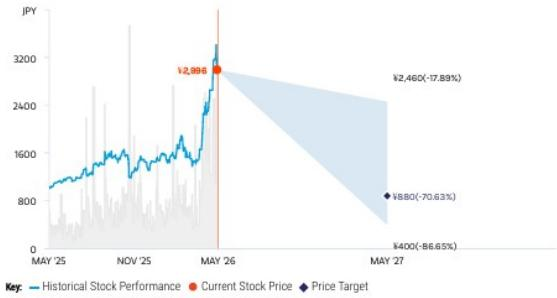

line

| Date       | Value     |
| ---------- | --------- |
| MAY '25    | 1,000     |
| NOV '25    | 1,500     |
| MAY '26    | 3,000     |
| MAY '27    | 2,460     |
| MAY '27    | 400      |

Source: Refinitiv, MS

# UNDERWEIGHT THESIS

The equity story centers on earnings growth from higher sales of aluminum electrolytic capacitors for industrial and xEV applications. Although demand for high value-added capacitors for AI servers and xEVs is driving an earnings upturn, we think earnings are unlikely to return to the F3/23 peak in the near term, and profitability improvement will remain limited amid stronger overseas and MLCC competition. There is also a risk that Class B shares may be converted on favorable terms, or that Class A shares may need to be redeemed in cash with a premium added to the ¥10bn investment amount, as OP fell short of ¥8.8bn in F3/25.

# Risk Reward Themes

Pricing Power: Negative
Secular Growth: Negative

View descriptions of Risk Rewards Themes here

# BULL CASE

# ¥2,460

# BASE CASE

# ¥880

# BEAR CASE

# ¥400

# Significant demand growth in AEC

OP and EPS forecasts of ¥3.6bn/¥56.3 in F3/26, ¥5.8bn/¥105.9 in F3/27, ¥7.8bn/¥157.1 in F3/28, ¥9.8bn/¥204.5 in F3/29, and ¥12.0bn/¥259.3 in F3/30. Our calculations also assume that from F3/31 onward the firm can maintain FCF/share at ¥230. The fair value equates to 23.2x our F3/27E EPS of ¥105.9 and 1.0x BPS of ¥2,346.3.

# Earnings recover but factoring in dilution

OP and EPS forecasts of ¥3.6bn/¥56.3 in F3/26, ¥5.6bn/¥102.3 in F3/27, ¥6.4bn/¥124.2 in F3/28, ¥7.1bn/¥142.4 in F3/29, and ¥7.4bn/¥149.7 in F3/30. Our calculations also assume that from F3/31 onward the firm can maintain FCF/share at ¥130. Our PT equates to 8.6x our F3/27E EPS of ¥102.3 and 0.4x BPS of ¥2,322.6.

# Earnings remain subdued at the trough

OP and EPS forecasts of ¥3.6bn/¥56.3 in F3/26, ¥4.3bn/¥73.0 in F3/27, ¥4.4bn/¥76.7 in F3/28, ¥4.4bn/¥76.7 in F3/29, and ¥4.3bn/¥73.0 in F3/30. Our calculations also assume that from F3/31 onward the firm can maintain FCF/share at ¥100. The fair value equates to 5.5x our F3/27E EPS of ¥73.0 and 0.2x BPS of ¥2,313.4.

# KOA: Key Financial Data and Risk Reward

Income Statement 

<table><tr><td>(JPY bn)</td><td>F3/25</td><td>F3/26</td><td>F3/27e</td><td>F3/28e</td><td>F3/29e</td></tr><tr><td>Sales</td><td>64.1</td><td>72.3</td><td>78.0</td><td>82.2</td><td>85.0</td></tr><tr><td>Costs of Sales</td><td>46.0</td><td>50.4</td><td>53.4</td><td>56.2</td><td>57.8</td></tr><tr><td>Gross Profit</td><td>18.2</td><td>21.9</td><td>24.6</td><td>26.0</td><td>27.2</td></tr><tr><td>SG&amp;A</td><td>17.0</td><td>18.2</td><td>19.4</td><td>20.2</td><td>20.6</td></tr><tr><td>Operating Income</td><td>1.2</td><td>3.6</td><td>5.2</td><td>5.8</td><td>6.6</td></tr><tr><td>Non-operating income/expenses</td><td>0.1</td><td>1.6</td><td>-0.5</td><td>-0.4</td><td>-0.4</td></tr><tr><td>Recurring Profit</td><td>1.2</td><td>5.2</td><td>4.7</td><td>5.4</td><td>6.2</td></tr><tr><td>Extraordinary income</td><td>0.0</td><td>0.0</td><td>0.0</td><td>0.0</td><td>0.0</td></tr><tr><td>Profit before income taxes</td><td>1.3</td><td>5.3</td><td>4.7</td><td>5.4</td><td>6.2</td></tr><tr><td>Income taxes</td><td>1.0</td><td>1.3</td><td>1.4</td><td>1.7</td><td>1.9</td></tr><tr><td>(Effective tax rate)</td><td>79%</td><td>25%</td><td>30%</td><td>31%</td><td>31%</td></tr><tr><td>Profit attributable to non-controlling interests</td><td>0.0</td><td>0.0</td><td>0.0</td><td>0.0</td><td>0.0</td></tr><tr><td>Net Profit</td><td>0.3</td><td>4.0</td><td>3.3</td><td>3.7</td><td>4.3</td></tr><tr><td>Capex</td><td>24.2</td><td>5.9</td><td>7.4</td><td>7.8</td><td>8.1</td></tr><tr><td>Depreciation &amp; amortization</td><td>5.9</td><td>7.0</td><td>7.4</td><td>7.6</td><td>7.8</td></tr><tr><td>R&amp;D</td><td>3.6</td><td>3.6</td><td>3.9</td><td>4.1</td><td>4.3</td></tr><tr><td>EPS (JPY)</td><td>7.0</td><td>106.4</td><td>88.9</td><td>99.6</td><td>115.8</td></tr><tr><td>USD/JPY (Average)</td><td>152.6</td><td>151.1</td><td>150.0</td><td>150.0</td><td>150.0</td></tr></table>

Cashflow Statement 

<table><tr><td>(JPY bn)</td><td>F3/25</td><td>F3/26</td><td>F3/27e</td><td>F3/28e</td><td>F3/29e</td></tr><tr><td>Cash flow from operating activities</td><td>8.1</td><td>8.8</td><td>9.8</td><td>11.0</td><td>12.2</td></tr><tr><td>EBIT</td><td>1.3</td><td>5.3</td><td>4.7</td><td>5.4</td><td>6.2</td></tr><tr><td>Depreciation</td><td>5.9</td><td>7.0</td><td>7.4</td><td>7.6</td><td>7.8</td></tr><tr><td>Changes in Receivables</td><td>0.3</td><td>-1.6</td><td>-1.3</td><td>-0.9</td><td>-0.6</td></tr><tr><td>Change in inventory</td><td>0.7</td><td>0.5</td><td>-0.6</td><td>-0.1</td><td>0.2</td></tr><tr><td>Changes in Payables</td><td>-0.5</td><td>-0.9</td><td>0.5</td><td>0.3</td><td>0.2</td></tr><tr><td>Other</td><td>0.5</td><td>-1.4</td><td>-0.8</td><td>-1.2</td><td>-1.5</td></tr><tr><td>Cash flow from investing activities</td><td>-23.9</td><td>-6.8</td><td>-7.4</td><td>-7.8</td><td>-8.1</td></tr><tr><td>Purchase of PP&amp;E</td><td>-25.1</td><td>-7.4</td><td>-7.3</td><td>-7.7</td><td>-8.0</td></tr><tr><td>Sales of PP&amp;E</td><td>0.0</td><td>0.0</td><td>0.0</td><td>0.0</td><td>0.0</td></tr><tr><td>Other</td><td>1.1</td><td>0.6</td><td>-0.1</td><td>-0.1</td><td>-0.1</td></tr><tr><td>Cash flow from financing activities</td><td>11.3</td><td>-0.5</td><td>3.0</td><td>-4.2</td><td>-3.1</td></tr><tr><td>Net Change In Borrowings</td><td>13.2</td><td>0.7</td><td>4.1</td><td>-3.0</td><td>-1.8</td></tr><tr><td>Purchase of treasury shares</td><td>0.0</td><td>0.0</td><td>0.0</td><td>0.0</td><td>0.0</td></tr><tr><td>Cash dividend paid</td><td>-1.8</td><td>-1.1</td><td>-1.1</td><td>-1.1</td><td>-1.3</td></tr><tr><td>Other</td><td>-0.1</td><td>-0.1</td><td>0.0</td><td>0.0</td><td>0.0</td></tr><tr><td>Effect of exchange rate changes</td><td>0.2</td><td>1.1</td><td>0.1</td><td>0.0</td><td>0.0</td></tr><tr><td>Changes in cash and cash equivalents</td><td>-4.4</td><td>2.6</td><td>5.5</td><td>-0.9</td><td>1.0</td></tr><tr><td>Cash and cash equivalents at end of the period</td><td>26.6</td><td>29.0</td><td>33.5</td><td>32.5</td><td>33.6</td></tr></table>

Balance Sheet 

<table><tr><td>(JPY bn)</td><td>F3/25</td><td>F3/26</td><td>F3/27e</td><td>F3/28e</td><td>F3/29e</td></tr><tr><td>Total assets</td><td>141.4</td><td>151.6</td><td>154.0</td><td>154.1</td><td>155.8</td></tr><tr><td>Current assets</td><td>57.5</td><td>62.7</td><td>69.0</td><td>69.2</td><td>70.6</td></tr><tr><td>Cash and cash equivalents</td><td>26.6</td><td>29.0</td><td>33.5</td><td>32.5</td><td>33.6</td></tr><tr><td>Accounts receivable</td><td>13.8</td><td>16.0</td><td>16.8</td><td>17.7</td><td>18.3</td></tr><tr><td>Inventories</td><td>13.4</td><td>13.5</td><td>15.2</td><td>15.3</td><td>15.1</td></tr><tr><td>Other financial assets</td><td>3.6</td><td>4.3</td><td>3.6</td><td>3.6</td><td>3.6</td></tr><tr><td>Fixed assets</td><td>83.9</td><td>88.8</td><td>84.9</td><td>85.0</td><td>85.1</td></tr><tr><td>Tangible fixed assets</td><td>71.5</td><td>74.5</td><td>72.6</td><td>72.7</td><td>72.8</td></tr><tr><td>Intangible fixed assets</td><td>3.2</td><td>3.0</td><td>3.1</td><td>3.1</td><td>3.1</td></tr><tr><td>Other non-current assets</td><td>9.2</td><td>11.3</td><td>9.2</td><td>9.2</td><td>9.2</td></tr><tr><td>Current liabilities</td><td>15.9</td><td>24.8</td><td>22.2</td><td>21.7</td><td>20.8</td></tr><tr><td>Short term borrowings</td><td>3.3</td><td>9.9</td><td>7.8</td><td>6.7</td><td>5.4</td></tr><tr><td>Accounts payable</td><td>5.0</td><td>3.2</td><td>6.0</td><td>6.4</td><td>6.6</td></tr><tr><td>Other current liabilities</td><td>7.6</td><td>11.7</td><td>8.3</td><td>8.7</td><td>8.9</td></tr><tr><td>Fixed liabilities</td><td>47.3</td><td>38.1</td><td>51.3</td><td>49.4</td><td>48.9</td></tr><tr><td>Long term borrowings</td><td>41.2</td><td>35.5</td><td>45.2</td><td>43.3</td><td>42.8</td></tr><tr><td>Other fixed liabilities</td><td>6.1</td><td>2.6</td><td>6.1</td><td>6.1</td><td>6.1</td></tr><tr><td>Net assets</td><td>78.1</td><td>88.6</td><td>80.5</td><td>83.1</td><td>86.1</td></tr><tr><td>Total liabilities and equity</td><td>141.4</td><td>151.6</td><td>154.0</td><td>154.1</td><td>155.8</td></tr></table>

# Risk Reward - KOA (6999.T)

Medium-term plan earnings targets set a high bar

# PRICE TARGET ¥1,540

Our DCF-based price target is ¥1,540 (risk-free rate 2.2%, beta 1.2, risk premium 3.7%, WACC 5.0%). In addition to our three-year forecasts, we reference our forecasts for F3/29-30. For F3/31 onward, we assume FCF per share of ¥120. Our PT is equivalent to 17.3x our F3/27 EPS estimate of ¥88.9. Our forex rate assumption for the next quarter and thereafter is ¥150/\$

RISK REWARD CHART   
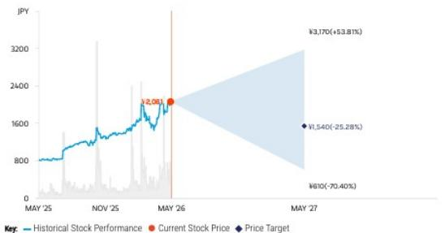

line

| Date   | Historical Stock Performance | Current Stock Price |
|--------|-------------------------------|---------------------|
| MAY '25| ~800                          | -                   |
| NOV '25| ~1600                         | -                   |
| MAY '26| 2,091                         | ¥3,170              |
| MAY '27| -                             | ¥610                |

Source: Refinitiv, MS

# UNDERWEIGHT THESIS

The equity story is that the negative impact of higher fixed costs associated with building up production capacity is set to continue. In the automotive resistor market, we think the rise of competing Taiwanese manufacturers is being watched. We expect KOA to enter an earnings recovery phase from F3/26, but given the impact of increased fixed costs from capacity expansion, we think the current medium-term management plan's earnings targets will be a stretch.

# Risk Reward Themes

Pricing Power: Negative

View descriptions of Risk Rewards Themes here

# BULL CASE

Achieves medium-term earnings targets

OP and EPS forecasts of ¥3.7bn/¥86.2 in F3/26, ¥6.0bn/¥102.3 in F3/27, ¥8.2bn/¥142.7 in F3/28, ¥10.5bn/¥188.5 in F3/29, and ¥12.4bn/¥223.5 in F3/30. Our calculations also assume that from F3/31 onward the firm can maintain FCF/share at ¥225. The fair value equates to 31.0x our F3/27E EPS of ¥102.3 and 1.5x BPS of ¥2,180.4.

# ¥3,170

# BASE CASE

Earnings recovery is only gradual

OP and EPS forecasts of ¥3.7bn/¥86.2 in F3/26, ¥5.2bn/¥88.9 in F3/27, ¥5.8bn/¥99.6 in F3/28, ¥6.6bn/¥115.8 in F3/29, and ¥6.8bn/¥121.2 in F3/30. Our calculations also assume that from F3/31 onward the firm can maintain FCF/share at ¥120. Our PT equates to 17.3x our F3/27E EPS of ¥88.9 and 0.7x BPS of ¥2,166.9.

# ¥1,540

Earnings remain sluggish as sales growth slows

OP and EPS forecasts of ¥3.7bn/¥86.2 in F3/26, ¥4.1bn/¥67.3 in F3/27, ¥4.1bn/¥70.0 in F3/28, ¥4.1bn/¥70.0 in F3/29, and ¥4.1bn/¥70.0 in F3/30. Our calculations also assume that from F3/31 onward the firm can maintain FCF/share at ¥70. The fair value equates to 9.1x our F3/27E EPS of ¥67.3 and 0.3x BPS of ¥2,145.4.

Note: e = MS estimates; Stock price as of the May 15 close for Risk Reward Chart  
Source: Company data, MS

# Disclosure Section

The information and opinions in MS were prepared by MS MUFG Securities Co., Ltd. and its affiliates (collectively, "MS").

For important disclosures, stock price charts and equity rating histories regarding companies that are the subject of this report, please see the MS Disclosure Website at www.morganstanley.com/eqr/disclosures/webapp/generalresearch, or contact your investment representative or MS at 1585 Broadway, (Attention: Research Management), New York, NY, 10036 USA.

For valuation methodology and risks associated with any recommendation, rating or price target referenced in this research report, please contact the Client Support Team as follows: US/Canada +1800 303-2495; Hong Kong +852 2848-5999; Latin America +1718 754-5444 (U.S.); London +44 (0)20-7425-8169; Singapore +65 6834-6860; Sydney +61(0)2-9770-1505; Tokyo +81(0)3-6836-9000. Alternatively you may contact your investment representative or MS at 1585 Broadway, (Attention: Research Management), New York, NY 10036 USA.

# Analyst Certification

The following analysts hereby certify that their views about the companies and their securities discussed in this report are accurately expressed and that they have not received and will not receive direct or indirect compensation in exchange for expressing specific recommendations or views in this report: Sota Harashima; Shoji Sato.

# Global Research Conflict Management Policy

MS has been published in accordance with our conflict management policy, which is available at www.morganstanley.com/institutional/research/conflictpolicies. A Portuguese version of the policy can be found at www.morganstanley.com.br

# Important Regulatory Disclosures on Subject Companies

As of April 30, 2026, MS beneficially owned 1% or more of a class of common equity securities of the following companies covered in MS: ALPS ALPINE, CMK, Hamamatsu Photonics, Hirose Electric, Ibiden, IRISO Electronics, Japan Aviation Electronics Industry, KOA, Meiko Electronics, Minebea Mitsumi, Nidec, Nihon Dempa Kogyo, Nippon Chemi-Con, Taiyo Yuden, TDK.

Within the last 12 months, MS has received compensation for investment banking services from IRISO Electronics, Kyocera, Mabuchi Motor.

In the next 3 months, MS expects to receive or intends to seek compensation for investment banking services from ALPS ALPINE, CMK, Daishinku, Hamamatsu Photonics, Hirose Electric, Ibiden, IRISO Electronics, Japan Aviation Electronics Industry, KOA, Kyocera, Mabuchi Motor, Meiko Electronics, Minebea Mitsumi, Murata Manufacturing, Nichicon, Nidec, Nihon Dempa Kogyo, Nippon Chemi-Con, Niterra, Taiyo Yuden, TDK.

Within the last 12 months, MS has received compensation for products and services other than investment banking services from Nihon Dempa Kogyo.

Within the last 12 months, MS has provided or is providing investment banking services to, or has an investment banking client relationship with, the following company: Ibiden, Kyocera, Meiko Electronics, Minebea Mitsumi, Murata Manufacturing, Nidec, Niterra, TDK.

Within the last 12 months, MS has either provided or is providing non-investment banking, securities-related services to and/or in the past has entered into an agreement to provide services or has a client relationship with the following company: Japan Aviation Electronics Industry, Kyocera, Nihon Dempa Kogyo.

The equity research analysts or strategists principally responsible for the preparation of MS have received compensation based upon various factors, including quality of research, investor client feedback, stock picking, competitive factors, firm revenues and overall investment banking revenues. Equity Research analysts' or strategists' compensation is not linked to investment banking or capital markets transactions performed by MS or the profitability or revenues of particular trading desks.

MS and its affiliates do business that relates to companies/instruments covered in MS, including market making, providing liquidity, fund management, commercial banking, extension of credit, investment services and investment banking. MS sells to and buys from customers the securities/instruments of companies covered in MS on a principal basis. MS may have a position in the debt of the Company or instruments discussed in this report. MS trades or may trade as principal in the debt securities (or in related derivatives) that are the subject of the debt research report.

Certain disclosures listed above are also for compliance with applicable regulations in non-US jurisdictions.

# STOCK RATINGS

MS uses a relative rating system using terms such as Overweight, Equal-weight, Not-Rated or Underweight (see definitions below). MS does not assign ratings of Buy, Hold or Sell to the stocks we cover. Overweight, Equal-weight, Not-Rated and Underweight are not the equivalent of buy, hold and sell. Investors should carefully read the definitions of all ratings used in MS. In addition, since MS contains more complete information concerning the analyst's views, investors should carefully read MS, in its entirety, and not infer the contents from the rating alone. In any case, ratings (or research) should not be used or relied upon as investment advice. An investor's decision to buy or sell a stock should depend on individual circumstances (such as the investor's existing holdings) and other considerations.

# Global Stock Ratings Distribution

(as of April 30, 2026)

The Stock Ratings described below apply to MS's Fundamental Equity Research and do not apply to Debt Research produced by the Firm.

For disclosure purposes only (in accordance with FINRA requirements), we include the category headings of Buy, Hold, and Sell alongside our ratings of Overweight, Equal-weight, Not-Rated and Underweight. MS does not assign ratings of Buy,

Hold or Sell to the stocks we cover. Overweight, Equal-weight, Not-Rated and Underweight are not the equivalent of buy, hold, and sell but represent recommended relative weightings (see definitions below). To satisfy regulatory requirements, we correspond Overweight, our most positive stock rating, with a buy recommendation; we correspond Equal-weight and Not-Rated to hold and Underweight to sell recommendations, respectively.

<table><tr><td></td><td colspan="2">Coverage Universe</td><td colspan="3">Investment Banking Clients (IBC)</td><td colspan="2">Other Material Investment Services Clients (MISC)</td></tr><tr><td>Stock Rating Category</td><td>Count</td><td>% of Total</td><td>Count</td><td>% of Total IBC</td><td>% of Rating Category</td><td>Count</td><td>% of Total Other MISC</td></tr><tr><td>Overweight/Buy</td><td>1546</td><td>42%</td><td>467</td><td>51%</td><td>30%</td><td>709</td><td>44%</td></tr><tr><td>Equal-weight/Hold</td><td>1568</td><td>43%</td><td>358</td><td>39%</td><td>23%</td><td>715</td><td>44%</td></tr><tr><td>Not-Rated/Hold</td><td>4</td><td>0%</td><td>0</td><td>0%</td><td>0%</td><td>1</td><td>0%</td></tr><tr><td>Underweight/Sell</td><td>555</td><td>15%</td><td>84</td><td>9%</td><td>15%</td><td>202</td><td>12%</td></tr><tr><td>Total</td><td>3,673</td><td></td><td>909</td><td></td><td></td><td>1627</td><td></td></tr></table>

Data include common stock and ADRs currently assigned ratings. Investment Banking Clients are companies from whom MS received investment banking compensation in the last 12 months. Due to rounding off of decimals, the percentages provided in the "% of total" column may not add up to exactly 100 percent.

# Analyst Stock Ratings

Overweight (O). The stock's total return is expected to exceed the average total return of the analyst's industry (or industry team's) coverage universe, on a risk-adjusted basis, over the next 12-18 months.

Equal-weight (E). The stock's total return is expected to be in line with the average total return of the analyst's industry (or industry team's) coverage universe, on a risk-adjusted basis, over the next 12-18 months.

Not-Rated (NR). Currently the analyst does not have adequate conviction about the stock's total return relative to the average total return of the analyst's industry (or industry team's) coverage universe, on a risk-adjusted basis, over the next 12-18 months.

Underweight (U). The stock's total return is expected to be below the average total return of the analyst's industry (or industry team's) coverage universe, on a risk-adjusted basis, over the next 12-18 months.

Unless otherwise specified, the time frame for price targets included in MS is 12 to 18 months.

# Analyst Industry Views

Attractive (A): The analyst expects the performance of his or her industry coverage universe over the next 12-18 months to be attractive vs. the relevant broad market benchmark, as indicated below.

In-Line (I): The analyst expects the performance of his or her industry coverage universe over the next 12-18 months to be in line with the relevant broad market benchmark, as indicated below.

Cautious (C): The analyst views the performance of his or her industry coverage universe over the next 12-18 months with caution vs. the relevant broad market benchmark, as indicated below.

Benchmarks for each region are as follows: North America - S&P 500; Latin America - relevant MSCI country index or MSCI Latin America Index; Europe - MSCI Europe; Japan - TOPIX; Asia - relevant MSCI country index or MSCI sub-regional index or MSCI AC Asia Pacific ex Japan Index.

# Important Disclosures for MS Smith Barney LLC Customers

Important disclosures regarding any material conflict of interest that can reasonably be expected to have influenced MS Smith Barney LLC's choice of a third-party research provider or the subject company of a third-party research report, are available on the MS Wealth Management disclosure website at www.morganstanley.com/online/researchdisclosures. For MS specific disclosures, you may refer to https://www.morganstanley.com/eqr/disclosures/webapp/generalresearch.

Each MS report is reviewed and approved on behalf of MS Smith Barney LLC. This review and approval is conducted by the same person who reviews the research report on behalf of MS. This could create a conflict of interest.

# Other Important Disclosures

MS policy is to update research reports as and when the Research Analyst and Research Management deem appropriate, based on developments with the issuer, the sector, or the market that may have a material impact on the research views or opinions stated therein. In addition, certain Research publications are intended to be updated on a regular periodic basis (weekly/monthly/quarterly/annual) and will ordinarily be updated with that frequency, unless the Research Analyst and Research Management determine that a different publication schedule is appropriate based on current conditions.

MS is not acting as a municipal advisor and the opinions or views contained herein are not intended to be, and do not constitute, advice within the meaning of Section 975 of the Dodd-Frank Wall Street Reform and Consumer Protection Act. MS produces an equity research product called a "Tactical Idea." Views contained in a "Tactical Idea" on a particular stock may be contrary to the recommendations or views expressed in research on the same stock. This may be the result of differing time horizons, methodologies, market events, or other factors. For all research available on a particular stock, please contact your sales representative or go to Matrix at http://www.morganstanley.com/matrix.

MS is provided to our clients through our proprietary research portal on Matrix and also distributed electronically by MS to clients. Certain, but not all, MS products are also made available to clients through third-party vendors or redistributed to clients through alternate electronic means as a convenience. For access to all available MS, please contact your sales representative or go to Matrix at http://www.morganstanley.com/matrix.

Any access and/or use of MS is subject to MS's Terms of Use (http://www.morganstanley.com/terms.html). By accessing and/or using MS, you are indicating that you have read and agree to be bound by our Terms of Use (http://www.morganstanley.com/terms.html). In addition you consent to MS processing your personal data and using cookies in accordance with our Privacy Policy and our Global Cookies Policy (http://www.morganstanley.com/privacy\_pledge.html), including for the purposes of setting your preferences and to collect readership data so that we can deliver better and more personalized service and products to you. To find out more information about how MS processes personal data, how we use cookies and how to reject cookies see our Privacy Policy and our Global Cookies Policy (http://www.morganstanley.com/privacy\_pledge.html). Please use the provided link to review the Terms and Conditions and Most Important Terms and Conditions for MS India Company Private Limited (https://www.morganstanley.com/assets/pdfs/about-us-global-offices/india/Terms\_and\_conditions.pdf) and the following link to review the audit report (https://ny.matrix.ms.com/eqr/research/webapp/researchdocs/MSICPL\_Morgan\_Stanley\_Research\_Audit\_Report.pdf).

If you do not agree to our Terms of Use and/or if you do not wish to provide your consent to MS processing your personal data or using cookies please do not access our research.

MS does not provide individually tailored investment advice. MS has been prepared without regard to the circumstances and objectives of those who receive it. MS recommends that investors independently evaluate particular investments and strategies, and encourages investors to seek the advice of a financial adviser. The appropriateness of an investment or strategy will depend on an investor's circumstances and objectives. The securities, instruments, or strategies discussed in MS may not be suitable for all investors, and certain investors may not be eligible to purchase or participate in some or all of them. MS is not an offer to buy or sell or the solicitation of an offer to buy or sell any security/instrument or to participate in any particular trading strategy. The value of and income from your investments may vary because of changes in interest rates, foreign exchange rates, default rates, prepayment rates, securities/instruments prices, market indexes, operational or financial conditions of companies or other factors. There may be time limitations on the exercise of options or other rights in securities/instruments transactions. Past performance is not necessarily a guide to future performance. Estimates of future performance are based on assumptions that may not be realized. If provided, and unless otherwise stated, the closing price on the cover page is that of the primary exchange for the subject company's securities/instruments.

The fixed income research analysts, strategists or economists principally responsible for the preparation of MS have received compensation based upon various factors, including quality, accuracy and value of research, firm profitability or revenues (which include fixed income trading and capital markets profitability or revenues), client feedback and competitive factors. Fixed Income Research analysts', strategists' or economists' compensation is not linked to investment banking or capital markets transactions performed by MS or the profitability or revenues of particular trading desks.

The "Important Regulatory Disclosures on Subject Companies" section in MS lists all companies mentioned where MS owns 1% or more of a class of common equity securities of the companies. For all other companies mentioned in MS, MS may have an investment of less than 1% in securities/instruments or derivatives of securities/instruments of companies and may trade them in ways different from those discussed in MS. Employees of MS not involved in the preparation of MS may have investments in securities/instruments or derivatives of securities/instruments of companies mentioned and may trade them in ways different from those discussed in MS. Derivatives may be issued by MS or associated persons.

With the exception of information regarding MS, MS is based on public information. MS makes every effort to use reliable, comprehensive information, but we make no representation that it is accurate or complete. We have no obligation to tell you when opinions or information in MS change apart from when we intend to discontinue equity research coverage of a subject company. Facts and views presented in MS have not been reviewed by, and may not reflect information known to, professionals in other MS business areas, including investment banking personnel.

MS personnel may participate in company events such as site visits and are generally prohibited from accepting payment by the company of associated expenses unless pre-approved by authorized members of Research management. MS may make investment decisions that are inconsistent with the recommendations or views in this report.

To our readers based in Taiwan or trading in Taiwan securities/instruments: Information on securities/instruments that trade in Taiwan is distributed by MS Taiwan Limited ("MSTL"). Such information is for your reference only. The reader should independently evaluate the investment risks and is solely responsible for their investment decisions. MS may not be distributed to the public media or quoted or used by the public media without the express written consent of MS. Any non-customer reader within the scope of Article 7-1 of the Taiwan Stock Exchange Recommendation Regulations accessing and/or receiving MS is not permitted to provide MS to any third party (including but not limited to related parties, affiliated companies and any other third parties) or engage in any activities regarding MS which may create or give the appearance of creating a conflict of interest. Information on securities/instruments that do not trade in Taiwan is for informational purposes only and is not to be construed as a recommendation or a solicitation to trade in such securities/instruments. MSTL may not execute transactions for clients in these securities/instruments.

MS is not incorporated under PRC law and the research in relation to this report is conducted outside the PRC. MS does not constitute an offer to sell or the solicitation of an offer to buy any securities in the PRC. PRC investors shall have the relevant qualifications to invest in such securities and shall be responsible for obtaining all relevant approvals, licenses, verifications and/or registrations from the relevant governmental authorities themselves. Neither this report nor any part of it is intended as, or shall constitute, provision of any consultancy or advisory service of securities investment as defined under PRC law. Such information is provided for your reference only.

MS is disseminated in Brazil by MS C.T.V.M. S.A. located at Av. Brigadeiro Faria Lima, 3600, 6th floor, São Paulo - SP, Brazil; and is regulated by the Comissão de Valores Mobiliários; in Mexico by MS México, Casa de Bolsa, S.A. de C.V which is regulated by Comision Nacional Bancaria y de Valores. Paseo de los Tamarindos 90, Torre 1, Col. Bosques de las Lomas Floor 29, 05120 Mexico City; in Japan by MS MUFG Securities Co., Ltd. and, for Commodities related research reports only, MS Capital Group Japan Co., Ltd; in Hong Kong by MS Asia Limited (which accepts responsibility for its contents) and by MS Bank Asia Limited; in Singapore by MS Asia (Singapore) Pte. (Registration number 199206298Z) and/or MS Asia (Singapore) Securities Pte Ltd (Registration number 200008434H), regulated by the Monetary Authority of Singapore (which accepts legal responsibility for its contents and should be contacted with respect to any matters arising from, or in connection with, MS) and by MS Bank Asia Limited, Singapore Branch (Registration number T14FC0118); in Australia to "wholesale clients" within the meaning of the Australian Corporations Act by MS Australia Limited A.B.N. 67 003 734 576, holder of Australian financial services license No. 23374-2, which accepts responsibility for its contents; in Australia to "wholesale clients" and "retail clients" within the meaning of the Australian Corporations Act by MS Wealth Management Australia Pty Ltd (A.B.N. 19 009 145 555, holder of Australian financial services license No. 240813, which accepts responsibility for its contents; in Korea by MS & Co International plc, Seoul Branch; in India by MS India Company Private Limited having Corporate Identification No (CIN) U22990MH1998PTC115305, regulated by the Securities and Exchange Board of India ("SEBI") and holder of licenses as a Research Analyst (SEBI Registration No. INH000001105); Stock Broker (SEBI Stock Broker Registration No. INZ000244438), Merchant Banker (SEBI Registration No. INM000011203), and depository participant with National Securities Depository Limited (SEBI Registration No. IN-DP-NSDL-567-2021) having registered office at Altimus, Level 39 & 40, Pandurang Budhkar Marg, Worli, Mumbai 400018, India; Telephone no. +91-22-61181000; Compliance Officer Details: Mr. Tejarshi Hardas, Tel. No.: +91-22-61181000 or Email: tejarshi.hardas@morganstanley.com; Grievance officer details: Mr. Tejarshi Hardas, Tel. No.: +91-22-61181000 or Email: msic-compliance@morganstanley.com. MS India Company Private Limited (MSICPL) may use AI tools in providing research services. All recommendations contained herein are made by the duly qualified research analysts; in Canada by MS Canada Limited; in Germany and the European Economic Area where required by MS Europe S.E., authorised and regulated by Bundesanstalt fuer Finanzdienstleistungsaufsicht (BaFin) under the reference number 149169; in the US by MS & Co. LLC, which accepts responsibility for its contents. MS & Co. International plc, authorized by the Prudential Regulation Authority and regulated by the Financial Conduct Authority and the Prudential Regulation Authority, disseminates in the UK research that it has prepared, and research which has been prepared by any of its affiliates, only to persons who (i) are investment professionals falling within Article 19(5) of the Financial Services and Markets Act 2000 (Financial Promotion) Order 2005 (as amended, the "Order"); (ii) are persons who are high net worth entities falling within Article 49(2)(a) to (d) of the Order; or (iii) are persons to whom an invitation or inducement to engage in investment activity (within the meaning of section 21 of the Financial Services and Markets Act 2000, as amended) may otherwise lawfully be communicated or caused to be communicated. RMB MS Proprietary Limited is a member of the JSE Limited and A2X (Pty) Ltd. RMB MS Proprietary Limited is a joint venture owned equally by MS International Holdings Inc. and RMB Investment Advisory (Proprietary) Limited, which is wholly owned by FirstRand Limited. The information in MS is being disseminated by MS Saudi Arabia, regulated by the Capital Market Authority in the Kingdom of Saudi Arabia, and is directed at Sophisticated investors only.

The information in MS is being communicated by MS & Co. International plc (DIFC Branch), regulated by the Dubai Financial Services Authority (the DFSA) or by MS & Co. International plc (ADGM Branch), regulated by the Financial Services Regulatory Authority Abu Dhabi (the FSRA), and is directed at Professional Clients only, as defined by the DFSA or the FSRA, respectively. The financial products or financial services to which this research relates will only be made available to a customer who we are satisfied meets the regulatory criteria of a Professional Client. A distribution of the different MS Research ratings or recommendations, in percentage terms for Investments in each sector covered, is available upon request from your sales representative.

The information in MS is being communicated by MS & Co. International plc (QFC Branch), regulated by the Qatar Financial Centre Regulatory Authority (the QFCRA), and is directed at business customers and market counterparties only and is not intended for Retail Customers as defined by the QFCRA.

As required by the Capital Markets Board of Turkey, investment information, comments and recommendations stated here, are not within the scope of investment advisory activity. Investment advisory service is provided exclusively to persons based on their risk and income preferences by the authorized firms. Comments and recommendations stated here are general in nature. These opinions may not fit to your financial status, risk and return preferences. For this reason, to make an investment decision by relying solely to this information stated here may not bring about outcomes that fit your expectations.

The trademarks and service marks contained in MS are the property of their respective owners. Third-party data providers make no warranties or representations relating to the accuracy, completeness, or timeliness of the data they provide and shall not have liability for any damages relating to such data. The Global Industry Classification Standard (GICS) was developed by and is the exclusive property of MSCI and S&P.

MS, or any portion thereof may not be reprinted, sold or redistributed without the written consent of MS.

Indicators and trackers referenced in MS may not be used as, or treated as, a benchmark under Regulation EU 2016/1011, or any other similar framework.

The issuers and/or fixed income products recommended or discussed in certain fixed income research reports may not be continuously followed. Accordingly, investors should regard those fixed income research reports as providing stand-alone analysis and should not expect continuing analysis or additional reports relating to such issuers and/or individual fixed income products.

MS may hold, from time to time, material financial and commercial interests regarding the company subject to the Research report.

Registration granted by SEBI and certification from the National Institute of Securities Markets (NISM) in no way guarantee performance of the intermediary or provide any assurance of returns to investors. Investment in securities market are subject to market risks. Read all the related documents carefully before investing.

Stock Ratings are subject to change. Please see latest research for each company.   
\* Historical prices are not split adjusted.   
INDUSTRY COVERAGE: Electronic Components 

<table><tr><td>COMPANY (TICKER)</td><td>RATING (AS OF)</td><td>PRICE* (05/18/2026)</td></tr><tr><td>Shoji Sato</td><td></td><td></td></tr><tr><td>ALPS ALPINE (6770.T)</td><td>O (03/17/2026)</td><td>¥2,204</td></tr><tr><td>Hamamatsu Photonics (6965.T)</td><td>U (09/17/2025)</td><td>¥2,867</td></tr><tr><td>Ibiden (4062.T)</td><td>U (02/04/2026)</td><td>¥15,635</td></tr><tr><td>Kyocera (6971.T)</td><td>E (06/25/2020)</td><td>¥2,834</td></tr><tr><td>Mabuchi Motor (6592.T)</td><td>E (11/03/2022)</td><td>¥1,566</td></tr><tr><td>Minebea Mitsumi (6479.T)</td><td>E (10/23/2025)</td><td>¥3,815</td></tr><tr><td>Murata Manufacturing (6981.T)</td><td>O (11/26/2025)</td><td>¥6,171</td></tr><tr><td>Nidec (6594.T)</td><td>NR (09/05/2025)</td><td>¥2,527</td></tr><tr><td>Niterra (5334.T)</td><td>O (01/17/2024)</td><td>¥9,855</td></tr><tr><td>Taiyo Yuden (6976.T)</td><td>E (10/19/2023)</td><td>¥7,194</td></tr><tr><td>TDK (6762.T)</td><td>O (08/02/2022)</td><td>¥2,978</td></tr><tr><td colspan="3">Sota Harashima</td></tr><tr><td>CMK (6958.T)</td><td>E (02/28/2025)</td><td>¥671</td></tr><tr><td>Daishinku (6962.T)</td><td>E (03/07/2024)</td><td>¥779</td></tr><tr><td>Hirose Electric (6806.T)</td><td>O (07/10/2024)</td><td>¥23,840</td></tr><tr><td>IRISO Electronics (6908.T)</td><td>E (08/02/2022)</td><td>¥3,375</td></tr><tr><td>Japan Aviation Electronics Industry (6807.T)</td><td>E (01/17/2024)</td><td>¥2,560</td></tr><tr><td>KOA (6999.T)</td><td>U (11/04/2025)</td><td>¥2,115</td></tr><tr><td>Meiko Electronics (6787.T)</td><td>E (04/03/2026)</td><td>¥39,800</td></tr><tr><td>Nichicon (6996.T)</td><td>E (11/10/2021)</td><td>¥2,872</td></tr><tr><td>Nihon Dempa Kogyo (6779.T)</td><td>E (03/07/2024)</td><td>¥2,342</td></tr><tr><td>Nippon Chemi-Con (6997.T)</td><td>U (09/20/2024)</td><td>¥2,944</td></tr></table>

© 2026 MS MUFG