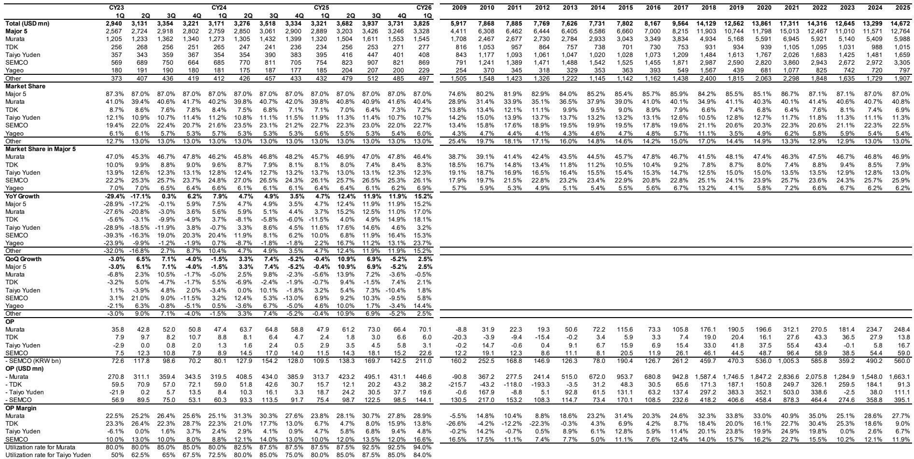
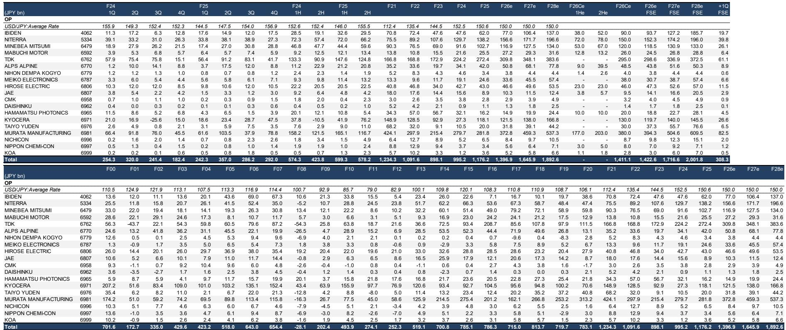
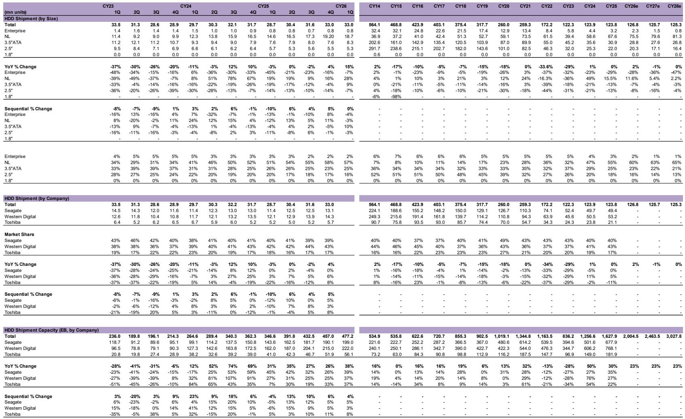

# The Japanese Component Supply Chain Is Pivoting Toward Value-Intensive Smartphone Content and AI Infrastructure, Not Volume-Driven Growth

The dominant narrative surrounding Japanese electronic components has long been tied to cyclical demand swings in smartphones and consumer electronics. That framing is becoming obsolete. According to a detailed May 2026 investor presentation from a leading global investment bank, the next phase of earnings expansion for suppliers in this sector will not come from shipping more units. It will come from shipping higher-value components into North American smartphones and from the structural buildout of AI computing infrastructure. The report identifies a clear bifurcation: companies that have positioned themselves to capture value per device, rather than volume per market, are the ones that will deliver earnings above consensus in fiscal year ending March 2027. This is not a cyclical call. It is a structural re-rating of which product categories and end-markets matter most.

The implication for investors is straightforward but uncomfortable. The old playbook of buying Japanese component stocks when smartphone volumes recover is no longer reliable. The new playbook requires identifying which components are becoming more sophisticated, more miniaturized, and more essential to the performance of flagship devices and AI servers. The report makes a concentrated set of overweight calls on five names: TDK, Murata Manufacturing, Alps Alpine, Niterra, and Hirose Electric. Each of these companies is exposed to a specific value-add technology that the report expects to ramp meaningfully over the next twelve to eighteen months. The common thread is not end-market size. It is component irreplaceability.

The timing matters. The presentation was published in May 2026, a point at which many investors are still digesting the implications of AI-driven demand for data center hardware and the next generation of smartphone hardware cycles. The report argues that the market is underestimating the earnings power of these high-value components precisely because it is still focused on aggregate smartphone shipment forecasts rather than the composition of content per device. If the report is correct, the next twelve months will reveal a divergence between companies that are structurally upgrading their product mix and those that are still dependent on volume recovery.

---

## The Most Compelling Earnings Upside Comes from High-Value MLCCs and Rechargeable Batteries, Not Commodity Passive Components

The report places its strongest conviction behind TDK and Murata Manufacturing, and the reasoning reveals a clear analytical hierarchy. For TDK, the earnings expansion story is driven by rechargeable batteries and HDD-related products. This is not about the broad battery market. It is about the specific segment of small-size lithium-ion batteries that go into premium smartphones and wearable devices, where energy density and form factor constraints create pricing power. For Murata, the driver is high-value-added multilayer ceramic capacitors, particularly the ultra-small 016008 size MLCCs that are 75 percent smaller than the previous generation 0201 MLCCs. These components are not interchangeable commodities. They require advanced manufacturing precision and are used in the most space-constrained areas of flagship smartphones and AI-enabled devices.

The strategic insight here is that miniaturization is a form of pricing power. As devices become thinner and more functionally dense, the components inside them must shrink while maintaining or improving performance. The suppliers that can deliver that miniaturization at scale capture a premium that is not available to producers of standard-size components. The report explicitly notes that Murata is benefiting from growing demand and utilization rates for these high-value MLCCs, which implies that capacity utilization is not just a volume story but a mix story. When a factory is running at high utilization producing premium components, the operating leverage is significantly stronger than when it is running at the same utilization producing standard parts.

For investors, the so-what is clear. The earnings sensitivity of these companies to smartphone volume fluctuations is declining because the value per component is rising. Even if total smartphone shipments grow modestly, the revenue and profit contribution from high-value components can grow at a much faster rate. The report implicitly argues that consensus estimates are not fully capturing this mix shift, which is why it expects F3/27 earnings to top consensus for the overweight names.

---

## Camera Actuators and Connectors Represent Underappreciated Growth Vectors Within the Smartphone Supply Chain

Two of the overweight calls in the report are less obvious than TDK and Murata, and they illustrate the depth of the value-add thesis. Alps Alpine is expected to see a ramp in high-performance camera actuators beginning in the April-to-June quarter. Camera actuators are the tiny motors that enable autofocus and optical image stabilization in smartphone cameras. As smartphone cameras become more sophisticated, with larger sensors and multiple lenses, the actuators required become more complex and more expensive. This is a classic example of content per device increasing even if the number of devices remains flat.

Hirose Electric presents a different but equally compelling case. The report highlights earnings expansion driven by connectors for general industrial machinery and AI servers. Connectors are often overlooked in the AI narrative, which tends to focus on GPUs and memory, but they are essential to the physical architecture of data centers. As hyperscalers increase capital expenditure, the demand for high-speed, high-reliability connectors grows in lockstep. Hirose Electric is not a pure AI play, but it has positioned itself to capture demand from both industrial automation and AI infrastructure.

The analytical thread connecting Alps Alpine and Hirose Electric is that both are exposed to secular trends that are not captured by traditional smartphone or PC shipment data. For Alps Alpine, the trend is computational photography and the increasing complexity of camera modules. For Hirose Electric, the trend is the physical expansion of data center capacity. Both trends are likely to persist regardless of whether consumer electronics demand softens in any given quarter. The report is effectively arguing that these companies have structural tailwinds that are underappreciated by the market.

---

## Niterra Demonstrates That Even Mature Product Categories Can Deliver Earnings Growth When They Are Tied to Recurring Replacement Demand

Niterra, formerly known as NGK Spark Plug, is the most counterintuitive overweight call in the report. Spark plugs and exhaust gas oxygen sensors are mature products with well-established markets. The report, however, identifies continued earnings growth driven by replacement plugs and SPE electrostatic chucks. The replacement plug business benefits from a large installed base of vehicles, which creates recurring demand that is less cyclical than original equipment manufacturing. The electrostatic chuck business, which is used in semiconductor manufacturing equipment, is tied to wafer fab equipment spending, which is being boosted by AI-driven demand for advanced chips.

This is a reminder that not all growth in the component space comes from cutting-edge technology. Sometimes it comes from having a dominant market share in a product that must be replaced regularly. The report notes that Niterra has a strong global market share in spark plugs and oxygen sensors, and that this installed base provides a natural floor for earnings. The upside comes from the semiconductor-related business, which is more cyclical but also more levered to the AI investment cycle.

The strategic lesson for investors is that diversification across end-markets can be a source of resilience, but only if the company has a clear competitive advantage in each of those markets. Niterra has that advantage in both automotive aftermarket and semiconductor equipment components. The report is essentially saying that the market is undervaluing the combination of stable replacement revenue and cyclical AI exposure.

---

## The Report Leaves Open the Question of How Quickly AI Computing Demand Will Translate Into Component Revenue for Non-Semiconductor Suppliers

The report is clear about its conviction on AI computing as a driver for connectors and certain passive components, but it does not fully resolve the question of timing and magnitude. Hyperscaler capital expenditure has increased significantly, as noted in the report, but the translation of that capex into revenue for Japanese component suppliers is not instantaneous. There is a lag between when a data center is built and when the connectors, capacitors, and other components inside it are replaced or upgraded. The report implies that this lag is shortening, but it does not provide a precise timeline.

Another open question is whether the AI computing opportunity is large enough to offset potential weakness in other end-markets. The report maintains an in-line industry view, which suggests that the sector as a whole is not expected to outperform. The overweight calls are stock-specific, not sector-wide. This implies that the AI tailwind is real but concentrated, and that many companies in the sector will not benefit from it. Investors who want to bet on AI infrastructure through Japanese components need to be highly selective.

A third unresolved question is the impact of a weak yen on competitiveness. The report includes a section on FX sensitivities and changes in competitiveness under a weak yen environment, but it does not draw a definitive conclusion. A weak yen helps Japanese exporters in the short term by boosting the yen value of overseas earnings, but it can also mask underlying competitive weakness. The report seems to suggest that the overweight names have genuine product advantages that would persist even if the yen strengthened, but this is an inference, not a stated conclusion.

---

## A Decision Framework for Investors: Focus on Component Irreplaceability, End-Market Diversification, and Capacity Utilization Mix

The report can be translated into a practical decision framework for investors evaluating Japanese electronic component stocks. The first filter is component irreplaceability. Can the component be easily substituted by a competitor, or does it require proprietary manufacturing technology, miniaturization capabilities, or long-term customer qualification? The overweight names in the report all score high on this metric. MLCCs in 016008 size, high-performance camera actuators, and AI server connectors are not commodity products.

The second filter is end-market diversification. Is the company dependent on a single end-market such as smartphones, or does it have exposure to multiple growth vectors including automotive, industrial, and AI infrastructure? Niterra and Hirose Electric score well here because they have exposure to both replacement demand and capital spending cycles. Companies that are overly dependent on smartphone volume, such as some of the equal-weight and underweight names in the report, face higher risk if the smartphone upgrade cycle disappoints.

The third filter is capacity utilization mix. Is the company using its capacity to produce high-value components or standard components? The report emphasizes that Murata and TDK are benefiting from high utilization rates for their premium products. This is a more nuanced metric than simply looking at overall factory utilization. Investors should examine the product mix within each company's capacity and assess whether the trend is toward higher-value or lower-value products.

Applying this framework would lead an investor to favor companies that are increasing their exposure to premium components, have multiple end-market drivers, and possess technologies that are difficult to replicate. The report provides a starting point for that analysis, but it also leaves room for independent judgment on timing and valuation.

---

## Join the Community to Read the Full Report and Review the Original Charts

The analysis summarized here is drawn from a comprehensive investor presentation that includes detailed valuation comparisons, earnings forecasts, market share data, and supply chain mapping. The full report contains charts on MLCC market data, connector market trends, HDD supply chains, and hyperscaler capital expenditure that are essential for understanding the granularity of the investment thesis. It also includes the risk-reward snapshot for all twenty companies covered, which provides context for why certain names are rated overweight, equal-weight, or underweight. To access the complete document and the supporting data, join the community to read the full report and review the original charts.

*This article is for learning and discussion only and does not constitute investment advice.*

Personal reading notes and learning share only. Not investment advice.

