May 18, 2026 01:59 PM GMT

# Tech Bytes

# LTAs – How They Are Affecting Memory

WHAT'S CHANGED 

<table><tr><td>SK hynix (000660.KS)</td><td>From</td><td>To</td></tr><tr><td>Price Target</td><td>W1,700,000</td><td>W2,600,000</td></tr></table>

Memory has become a critical bottleneck in AI infrastructure. LTAs with customers to secure supply are transforming a traditionally cyclical business into a secured, high-margin, long-term revenue stream. However, they also create a "memory tax" on the rest of the industry.

# The memory market is undergoing a structural transformation in how its products are being contracted through long-term agreements (LTA) of 3-5 years:

These have existed during semiconductor booms, but recent LTAs differ from past ones with weak binding power. They may include receiving large up-front payments that could dictate volume commitments by producers and be deducted as unfulfilled promised volumes are shipped. These are likely non-cancellable, non-refundable (NCNR) contracts, in our view; effectively, they are insurance or binding power in case the customer cancels existing LTAs in the future.

The cyclical impact may become less cyclical: LTAs can instill stability, improve earnings predictability, and reduce the risk of overbuilding capacity with better supply management for memory companies. Even if there is excess supply from capacity expansion, long-term contracted volumes buffer both pricing and margin, reducing the severity of memory downturns. With volumes already determined, capex increases are aimed at confirmed demand from hyperscalers rather than speculative forecasts, helping to eliminate inventory risk and enhancing mass production efficiency.

Raising SK hynix EPS estimates and price target: We raise our SK hynix EPS estimates 6% for 2026, 3% for 2027, and 14% for 2028 to reflect downside protection from LTAs to 2028, stronger commodity pricing assumptions, and stronger HBM pricing reset in 2027. We now assume flat commodity pricing into 1H28 and HBM ASP growth of +15% YoY over 2026-28e, vs. prior expectations for HBM pricing declines. This also lifts our long-term HBM revenue and EPS contribution because of a higher base. Our residual income model-based price target rises to W2.6mn, implying 38% upside.

Stock implications: LTAs lock in future supply and pricing, providing long-term earnings/FCF visibility and causing re-rating. LTAs improve risk management and predictability, in a way similar to hedging long-term price volatility. Fixed volume, agreed prices, and prepayments as insurance can improve the P/E multiple discount that entails a maximum margin of safety to compensate for future cyclical price erosion.

MS & CO. INTERNATIONAL PLC+

# Shawn Kim

Equity Analyst

Shawn.Kim@morganstanley.com +44 20 7677-1018

MS & CO. INTERNATIONAL PLC, SEOUL BRANCH+

# Ryan Kim

Equity Analyst

Ryan.G.Kim@morganstanley.com +82 2 399-4939

MS ASIA LIMITED+

# Duan Liu

Equity Analyst

Duan.Liu@morganstanley.com +852 2239-7357

MS & CO. INTERNATIONAL PLC+

# Cindy Huang

Equity Analyst

Cindy.Huang@morganstanley.com +44 20 7425-2915

MS does and seeks to do business with companies covered in MS. As a result, investors should be aware that the firm may have a conflict of interest that could affect the objectivity of MS. Investors should consider MS as only a single factor in making their investment decision.

# For analyst certification and other important disclosures, refer to the Disclosure Section, located at the end of this report.

+= Analysts employed by non-U.S. affiliates are not registered with FINRA, may not be associated persons of the member and may not be subject to FINRA restrictions on communications with a subject company, public appearances and trading securities held by a research analyst account.

# Breaking the Memory Cycle with LTAs

Shifting away from volatile boom-and-bust commodity cycles: Traditional demand drivers (PC, mobile, consumer) have been displaced by data centers as the primary customers – this is a structural realignment that will only intensify. Given long lead times and persistence of supply shortage mismatch, LTAs are now absolute necessities to secure capacity. A strategic supply chain partnership is being established in which suppliers and customers collaborate closely from the technology development stage to ensure stable supply and transactions. The aim for memory producers is to lock in long-term orders and prices, establish a stable high-margin model, and mitigate industry cyclical volatility.

These are all likely to drive a re-rating that has yet to be priced in.

LTAs – a structural shift in memory cycle dynamics: LTAs in the current memory cycle have evolved into structured, multi-year commercial frameworks rather than simple volume commitments. Leading CSPs are now locking in supply through agreements that incorporate prepayments, pricing mechanisms, and margin protection. According to TrendForce, most of the LTA negotiations are targeting a pricing range with a ceiling price tracking above 2Q26 contract price. In terms of down payment, some suppliers have secured as much as 50% for 2027 demand and 100% for 2028. Although specific terms vary among different suppliers and customers (some only set floor pricing, or minimum margin protections), those terms have provided substantial buffer to memory suppliers entering 2028.

Despite negotiations that are still ongoing, we expect more than 50% of the supplies over the next 2-3 years will be bound through LTAs, with additional upside potential likely from non-AI customers.

Memory scarcity is driving a shift in long-term agreements: We estimate the AI semiconductor market to grow 50-60% through 2030, per TSMC's recent increased semiconductor TAM forecast of USD\$1.5tr (raised from USD\$1tr). This compares to DRAM supply growth during the same period that may be capped at around 30% in bit shipments per annum, given significant EUV tool bottleneck from 2027 – we see risk of sold-out conditions at ASML in view of unprecedented capacity shortages for both advanced logic and DRAM.

These agreements highlight a clear shift in customer behavior. Hyperscalers are no longer procuring memory opportunistically but are instead securing long-term supply to support AI infrastructure build-outs. At the same time, suppliers are leveraging LTAs to stabilize pricing, secure upfront capital, and protect profitability

It's different this time: Korean memory companies are incorporating binding conditions into LTA negotiations to provide maximum insurance and profitability. Companies are unlikely to disclose much detail of LTAs because of NDAs (non-disclosure agreements). However, we expect to see clear evidence over the course of this year of material cash inflows on producers' balance sheets, offset by deferred revenue obligations. This should make it clear that these agreements are playing out, and that they are not the "take or pay" penalties of the past. Prepaid revenue deals would be much harder to renegotiate than penalties. Our view is not based on the contracts themselves, but based on evidence that hyperscaler customers are thinking differently.

Exhibit 1: LTAs framework estimates – old vs. new 

<table><tr><td>Feature</td><td>Traditional LTAs</td><td>Current LTA Frameworks</td></tr><tr><td>Duration</td><td>Quarterly, annual, or soft multi-year</td><td>Typically 3-5 years</td></tr><tr><td>Volume commitment</td><td>Often flexible / best-effort</td><td>Pre-agreed supply allocation or volume commitment</td></tr><tr><td>Pricing</td><td>Frequently renegotiated with the cycle</td><td>Pricing formula, range, floor, collar, or fixed mechanism</td></tr><tr><td>Customer commitment</td><td>Limited penalty / weak binding power</td><td>Prepayment, collateral, financial guarantee, or stronger binding terms in some agreements</td></tr><tr><td>Supplier benefit</td><td>Some demand visibility</td><td>Revenue visibility, margin protection, upfront capital, improved capacity planning</td></tr><tr><td>Customer benefit</td><td>Allocation during shortage</td><td>Strategic supply security for AI infrastructure buildout</td></tr><tr><td>Investor relevance</td><td>Limited valuation impact</td><td>Potential P/E re-rating if earnings become more contracted and less cyclical</td></tr></table>

Source: Company data, TrendForce, MS estimates.

# What companies are saying

The memory market is undergoing a structural transformation in how its products are being contracted: Long-term agreements have existed in past semiconductor booms, but recent LTAs differ from past ones with weak binding power. They span nearly 3–5 years and specify exact pricing as well as quantities.

Micron (covered by Joseph Moore): Micron announced in its March 18 earnings report: "For the first time in its history, it has signed a five-year Strategic Customer Agreement (SCA)..." which includes multi-year supply volumes and price commitments.

SK hynix: "We are signing LTAs considering demand visibility, customer relationships, product mix, and strategic importance." (March 25 annual shareholders' meeting, President Kwak Noh-jung). During its most recent 1Q26 earnings call (April 23), SK hynix elaborated: "As the memory shortage persists, customer requests to secure medium- to long-term supply volumes have significantly increased. Memory today has become so critical that customers now see memory price and supply uncertainties as key business risks...A multiyear LTA must provide business stability for both parties by ensuring supply stability to the customer and demand visibility and stable revenue structure to the seller. Accordingly, unlike past LTAs, we are comprehensively reviewing various approaches and structural options."

Samsung Electronics: SEC indicated demand for LTAs from US hyperscalers during its March 18 annual shareholders' meeting. "We are pushing to convert quarterly and annual supply contracts into multi-year agreements spanning 3–5 years." Samsung confirmed during its 1Q26 earnings call (April 30) that it has already signed some multi-year contracts. EVP Jaejune Kim stated: "Due to our NDAs with customers, we are not able to go into too much detail on our multiyear contracts with customers...major customers are quite confident in future AI and AI-related demand, and they have been approaching us, seeking supply volume commitments for the medium to longer term. Based on these requests, we have been pursuing multiyear supply agreements...and have already signed finalized contracts with some customers. Unlike existing supply contracts which are based on mutual trust, these multiyear contracts present a higher level of binding commitments."

SanDisk (covered by Joseph Moore): SanDisk has re-branded its LTA strategy as "New Business Models" (NBMs) – a term it uses to distinguish these agreements from traditional, weaker LTAs. During its 3QF26 earnings call (April 30), CEO David Goeckeler stated: "I am pleased to share that we have successfully advanced those conversations with five multiyear partnerships signed so far. These partnerships are structured to lock in committed supply for our customers and committed financials for SanDisk. Our customers' commitments are backed by firm financial guarantees." "We have customers that are literally putting up billions of dollars of collateral through various financial instruments that will survive for the life of these contracts. And if they don't meet their obligations on consistent purchasing every quarter, then that financial commitment immediately comes to us as a compensation for that contract not being concluded."

Kioxia (covered by Kazuo Yoshikawa): Management has indicated that long-term supply agreements with hyperscale customers are expanding into fiscal years 2028–2029, improving revenue visibility and creating a de facto backlog in the memory market.

# LTAs drive sustained FCF – and hence shareholder returns and re-rating

# We believe three- to five-year LTAs could mark a structural shift for memory

companies: They may do so by reducing price/cycle volatility and improving through-cycle FCF visibility. As the industry moves past the heavy upfront capex phase, higher utilization, more predictable demand, and better pricing discipline should allow FCF yields to expand materially over 2026-28E (Exhibit 5). This matters because sustained FCF generation can increasingly be translated into per-share value through buybacks.

Apple stock provides a useful playbook of what's to come: AAPL has been one of the best performing technology stocks of the past decade. This was driven via consistent share buy-backs and share-count reduction as a major driver of long-term excess return. Our value attribution analysis suggests that buybacks and dividends together accounted for \~70% of AAPL's excess compounded return vs. the S&P 500 proxy. We are not arguing that memory stocks become Apple-like on share price performance, but that as LTAs reduce cyclicality and FCF yields rise, Hynix and Samsung could have a more durable capital return story, supporting both higher shareholder returns and potential re-rating.

Exhibit 2: Apple: sustained buybacks coincided with material long-term outperformance   
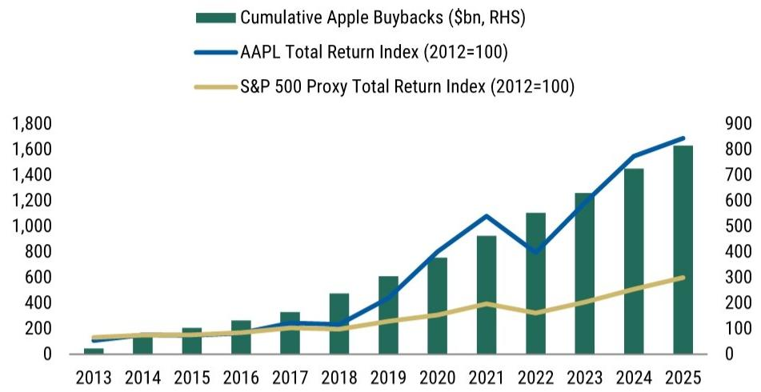

bar_line

| Year | Cumulative Apple Buybacks ($bn, RHS) | AAPL Total Return Index (2012=100) | S&P 500 Proxy Total Return Index (2012=100) |
|------|----------------------------------------|-------------------------------------|---------------------------------------------|
| 2013 | ~50                                    | ~50                                 | ~100                                        |
| 2014 | ~150                                   | ~100                                | ~120                                        |
| 2015 | ~200                                   | ~120                                | ~130                                        |
| 2016 | ~250                                   | ~150                                | ~140                                        |
| 2017 | ~300                                   | ~200                                | ~150                                        |
| 2018 | ~450                                   | ~250                                | ~160                                        |
| 2019 | ~600                                   | ~400                                | ~180                                        |
| 2020 | ~750                                   | ~600                                | ~200                                        |
| 2021 | ~900                                   | ~800                                | ~220                                        |
| 2022 | ~1100                                  | ~450                                | ~180                                        |
| 2023 | ~1300                                  | ~700                                | ~250                                        |
| 2024 | ~1450                                  | ~850                                | ~300                                        |
| 2025 | ~1650                                  | ~950                                | ~350                                        |

Source: Factset, MS.

Exhibit 3: Apple: buybacks and dividends drove $\sim 70\%$ of excess compounded return vs. S&P proxy   
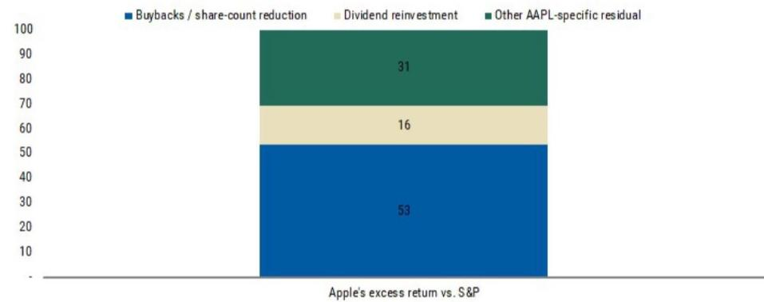

bar_stacked

Apple's excess return vs. S&P
| Category | Value |
|---|---|
| Buybacks / share-count reduction | 53 |
| Dividend reinvestment | 16 |
| Other AAPL-specific residual | 31 |

Source: Factset, MS.

Japanese shipping companies are another example of how memory valuation can re-rate: The Japanese shipping industry during Covid (2021) showed pricing dynamics similar to DRAM – shipping rates increased more than three-fold and stocks were trading on 2x P/E multiples given the market's view of a mean reversion of shipping rates. However, despite freight costs falling back 90% from peak and forward EPS down almost 80%, these stocks re-rated after Covid in response to much higher and more sustainable dividend payout ratios following significant cash generation during COVID-induced shipping price inflation. (Exhibit 4).

Exhibit 4: Continued outperformance from enhanced dividend payout ratio after Covid   
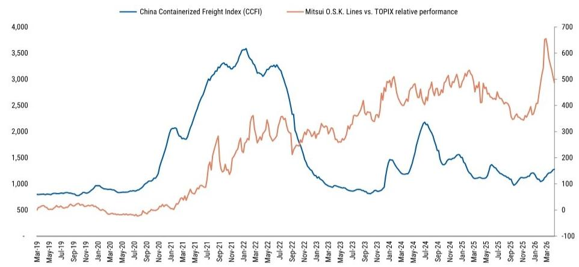

line

| Date | China Containerized Freight Index (CCFI) | Mitsui O.S.K. Lines vs. TOPIX relative performance |
|---|---|---|
| Mar-19 | 800 | 50 |
| May-19 | 850 | 55 |
| Jul-19 | 870 | 60 |
| Sep-19 | 900 | 65 |
| Nov-19 | 950 | 70 |
| Jan-20 | 900 | 65 |
| Mar-20 | 950 | 60 |
| May-20 | 1000 | 55 |
| Jul-20 | 1100 | 50 |
| Sep-20 | 1300 | 60 |
| Nov-20 | 1600 | 70 |
| Jan-21 | 2000 | 90 |
| Mar-21 | 2100 | 120 |
| May-21 | 2400 | 150 |
| Jul-21 | 2800 | 200 |
| Sep-21 | 3200 | 250 |
| Nov-21 | 3400 | 300 |
| Jan-22 | 3600 | 350 |
| Mar-22 | 3300 | 400 |
| May-22 | 3200 | 450 |
| Jul-22 | 3100 | 480 |
| Sep-22 | 2500 | 450 |
| Nov-22 | 1800 | 480 |
| Jan-23 | 1300 | 450 |
| Mar-23 | 1100 | 480 |
| May-23 | 1000 | 500 |
| Jul-23 | 950 | 520 |
| Sep-23 | 900 | 550 |
| Nov-23 | 850 | 580 |
| Jan-24 | 1400 | 650 |
| Mar-24 | 1300 | 680 |
| May-24 | 2200 | 750 |
| Jul-24 | 1800 | 780 |
| Sep-24 | 1500 | 750 |
| Nov-24 | 1400 | 780 |
| Jan-25 | 1300 | 750 |
| Mar-25 | 1200 | 780 |
| May-25 | 1100 | 750 |
| Jul-25 | 1200 | 780 |
| Sep-25 | 1100 | 750 |
| Nov-25 | 1150 | 780 |
| Jan-26 | 1250 | 850 |
| Mar-26 | 1350 | 750 |

Source: FactSet, MS

Exhibit 5: Samsung's FCF and FCF yield   
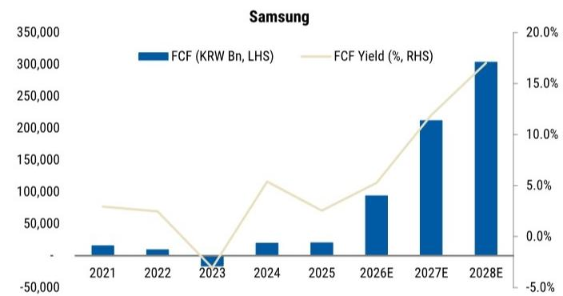

bar_line

Samsung
| Year | FCF (KRW Bn, LHS) | FCF Yield (%, RHS) |
|---|---|---|
| 2021 | 25,000 | 7.5 |
| 2022 | 15,000 | 6.5 |
| 2023 | -50,000 | -4.5 |
| 2024 | 30,000 | 11.5 |
| 2025 | 30,000 | 6.5 |
| 2026E | 95,000 | 8.5 |
| 2027E | 210,000 | 11.5 |
| 2028E | 305,000 | 17.5 |

Source: Factset, MS. Note: Historical FCF yield is calculated based on the year end share price, forecast period is based on last close

Exhibit 6: Hynix's FCF and FCF yield   
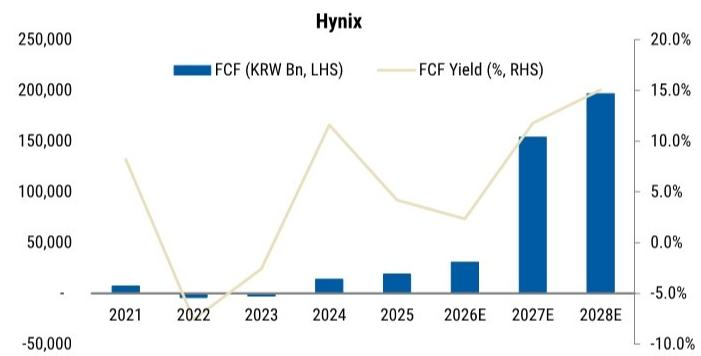

bar_line

Hynix
| Year | FCF (KRW Bn, LHS) | FCF Yield (%, RHS) |
|---|---|---|
| 2021 | -15,000 | 13.0 |
| 2022 | -18,000 | -7.0 |
| 2023 | -10,000 | 2.0 |
| 2024 | 20,000 | 16.5 |
| 2025 | 25,000 | 9.0 |
| 2026E | 35,000 | 7.0 |
| 2027E | 155,000 | 11.5 |
| 2028E | 195,000 | 15.0 |

Source: Factset, MS. Note: Historical FCF yield is calculated based on the year end share price, forecast period is based on last close

# Quantifying LTAs

Our sensitivity analysis (Exhibit 7) suggests that the market is not yet assigning any meaningful P/E premium to Samsung's and Hynix's LTA-backed memory earnings and FCF. We assume HBM is effectively $100\%$ LTA-backed, while commodity memory LTA coverage ranges from $50\%$ to $80\%$ . We then apply a 6-12x P/E range to the LTA-backed portion of earnings, while valuing the remaining non-LTA commodity memory earnings at 5x.

- Even under the most conservative case – assuming only 50% of commodity memory is covered by LTAs and applying just a 6x P/E to the LTA portion while valuing the remaining non-LTA business at 5x – implied group P/E is \~5.5x for both Samsung and SK hynix.   
- This is already above Samsung's current F27e P/E of 5.3x and SK hynix's current F27e P/E of 5x. At 70% commodity LTA coverage and a 10x LTA multiple, implied group P/E rises to \~8.5x for Samsung and \~8.6x for SK hynix. In the 80%/12x upside case, implied group P/E reaches \~10.5x for Samsung and \~10.7x for SK hynix.   
- This suggests that the market is effectively valuing LTA-backed earnings almost the same as traditional cyclical commodity memory earnings. In our view, that is too conservative if these agreements prove to be binding, cash-backed, and durable through the cycle.

Exhibit 7: LTA scenarios – Samsung's and Hynix's implied group P/E sensitivity 

<table><tr><td colspan="9">Samsung - implied group P/E sensitivity</td></tr><tr><td colspan="9">Commodity LTA % down; LTA P/E across</td></tr><tr><td></td><td>6.0x</td><td>7.0x</td><td>8.0x</td><td>9.0x</td><td>10.0x</td><td>11.0x</td><td>12.0x</td><td></td></tr><tr><td>50%</td><td>5.5x</td><td>6.0x</td><td>6.5x</td><td>7.0x</td><td>7.6x</td><td>8.1x</td><td>8.6x</td><td></td></tr><tr><td>60%</td><td>5.6x</td><td>6.2x</td><td>6.8x</td><td>7.4x</td><td>8.0x</td><td>8.6x</td><td>9.2x</td><td></td></tr><tr><td>70%</td><td>5.7x</td><td>6.4x</td><td>7.1x</td><td>7.8x</td><td>8.5x</td><td>9.2x</td><td>9.9x</td><td></td></tr><tr><td>80%</td><td>5.8x</td><td>6.6x</td><td>7.4x</td><td>8.1x</td><td>8.9x</td><td>9.7x</td><td>10.5x</td><td></td></tr><tr><td>Samsung current FY27 P/E</td><td>5.3x</td><td></td><td></td><td></td><td></td><td></td><td></td><td></td></tr></table>

<table><tr><td colspan="8">SK hynix - implied group P/E sensitivity</td></tr><tr><td colspan="8">Commodity LTA % down; LTA P/E across</td></tr><tr><td></td><td>6.0x</td><td>7.0x</td><td>8.0x</td><td>9.0x</td><td>10.0x</td><td>11.0x</td><td>12.0x</td></tr><tr><td>50%</td><td>5.5x</td><td>6.1x</td><td>6.6x</td><td>7.2x</td><td>7.7x</td><td>8.3x</td><td>8.8x</td></tr><tr><td>60%</td><td>5.6x</td><td>6.3x</td><td>6.9x</td><td>7.5x</td><td>8.2x</td><td>8.8x</td><td>9.5x</td></tr><tr><td>70%</td><td>5.7x</td><td>6.5x</td><td>7.2x</td><td>7.9x</td><td>8.6x</td><td>9.4x</td><td>10.1x</td></tr><tr><td>80%</td><td>5.8x</td><td>6.6x</td><td>7.5x</td><td>8.3x</td><td>9.1x</td><td>9.9x</td><td>10.7x</td></tr></table>

SK hynix current FY27 P/E 5.0x   
Source: MS estimates.

# SK hynix – Earnings Estimate Revisions and Price Target Change

We have updated for 1Q26 actuals and reflect our latest industry checks and the impact of LTA on 2026-28e financials, similar to changes made for Samsung (Samsung Electronics: Labor Overhang – A Clearing Event (6 May 2026).

\- On commodity pricing, we previously forecasted a muted pricing trend in 2H27 and a down-cycle starting in 2028. We raise our 1H28 pricing forecast to flat to reflect downside protection from LTAs.

\- We raise HBM pricing. Previously, we expected down 5-10% YoY during 2026-28e owing to market competition. We now project +15% YoY throughout 2026-28e via product migration as the previous assumptions of pricing competition (news) no longer hold. There have been reports of potential HBM price hikes (news), but this is not in our base case assumptions – we await confirmation from SK hynix. However, our increased 2028e base price is already significantly higher than previous assumptions, resulting in ikncreased longer-term revenue and earnings contribution from HBM.

• Our other assumptions remain largely unchanged.

As an result, our 2026e, 2027e and 2028e EPS are raised by 6%, 3%, and 14%, respectively.

Our new price target, based on our residual income, is raised to W2.6mn, implying 38% upside from here. Our price target rises more than our 2026-28 EPS estimate revisions because of the higher base that affects long-term earnings.

We raise our bull case scenario value to W3.0mn, implying 60% upside and 6.7x 2027e P/E. This reflects potential doubling in HBM prices, to US\$3/Gb, with pricing sustained at an even high level of around US\$4/Gb in the longer term.

Exhibit 8: Earnings Estimate Revisions 

<table><tr><td rowspan="2">(W bn)</td><td colspan="3">FY26E</td><td colspan="3">FY27E</td><td colspan="3">FY28E</td></tr><tr><td>Previous</td><td>Revised</td><td>Change</td><td>Previous</td><td>Revised</td><td>Change</td><td>Previous</td><td>Revised</td><td>Change</td></tr><tr><td>Sales</td><td>335,034</td><td>347,635</td><td>4%</td><td>487,189</td><td>515,354</td><td>6%</td><td>505,430</td><td>586,029</td><td>16%</td></tr><tr><td>DRAM (&amp; HBM)</td><td>249,923</td><td>260,943</td><td>4%</td><td>370,194</td><td>393,041</td><td>6%</td><td>387,771</td><td>454,660</td><td>17%</td></tr><tr><td>NAND</td><td>83,797</td><td>84,588</td><td>1%</td><td>115,682</td><td>120,209</td><td>4%</td><td>116,346</td><td>129,264</td><td>11%</td></tr><tr><td>Operating Profit</td><td>276,791</td><td>277,967</td><td>0%</td><td>407,567</td><td>419,983</td><td>3%</td><td>403,298</td><td>460,987</td><td>14%</td></tr><tr><td>DRAM (&amp; HBM)</td><td>214,203</td><td>218,807</td><td>2%</td><td>319,658</td><td>333,514</td><td>4%</td><td>323,164</td><td>375,715</td><td>16%</td></tr><tr><td>NAND</td><td>62,588</td><td>59,161</td><td>-5%</td><td>87,909</td><td>86,469</td><td>-2%</td><td>80,134</td><td>85,271</td><td>6%</td></tr><tr><td>OP Margin</td><td>83%</td><td>80%</td><td>-3pp</td><td>84%</td><td>81%</td><td>-2pp</td><td>80%</td><td>79%</td><td>-1pp</td></tr><tr><td>DRAM (&amp; HBM)</td><td>86%</td><td>84%</td><td>-2pp</td><td>86%</td><td>85%</td><td>-1pp</td><td>83%</td><td>83%</td><td>-1pp</td></tr><tr><td>HBM</td><td>72%</td><td>70%</td><td>-2pp</td><td>69%</td><td>69%</td><td>1pp</td><td>64%</td><td>70%</td><td>6pp</td></tr><tr><td>NAND</td><td>75%</td><td>70%</td><td>-5pp</td><td>76%</td><td>72%</td><td>-4pp</td><td>69%</td><td>66%</td><td>-3pp</td></tr><tr><td>Net Profit</td><td>214,166</td><td>226,427</td><td>6%</td><td>316,738</td><td>326,334</td><td>3%</td><td>310,625</td><td>354,688</td><td>14%</td></tr><tr><td>EPS for consensus</td><td>300,498</td><td>318,486</td><td>6%</td><td>444,418</td><td>459,012</td><td>3%</td><td>435,841</td><td>498,894</td><td>14%</td></tr></table>

Source: Company data, MS estimates

Exhibit 9: Key Assumptions 

<table><tr><td></td><td colspan="3">FY26E</td><td colspan="3">FY27E</td><td colspan="3">FY28E</td></tr><tr><td></td><td>Previous</td><td>Revised</td><td>Change</td><td>Previous</td><td>Revised</td><td>Change</td><td>Previous</td><td>Revised</td><td>Change</td></tr><tr><td>DRAM Bit (1Gb Eq, mn)</td><td>115,331</td><td>115,331</td><td>0.0%</td><td>144,606</td><td>144,606</td><td>0.0%</td><td>176,997</td><td>179,663</td><td>1.5%</td></tr><tr><td>DRAM Bit Growth</td><td>21.7%</td><td>21.7%</td><td>0.0pp</td><td>25.4%</td><td>25.4%</td><td>0.0pp</td><td>22.4%</td><td>24.2%</td><td>0.1pp</td></tr><tr><td>DRAM ASP (1Gb eq; US$)</td><td>1.8</td><td>1.8</td><td>0%</td><td>1.96</td><td>2.00</td><td>2%</td><td>1.62</td><td>1.8</td><td>13%</td></tr><tr><td>DRAM OPM</td><td>83.8%</td><td>83.9%</td><td>0.0pp</td><td>84.6%</td><td>84.9%</td><td>0.2pp</td><td>81.2%</td><td>82.6%</td><td>1.4pp</td></tr><tr><td>HBM Bit (1Gb Eq, mn)</td><td>13,922</td><td>13,922</td><td>0%</td><td>18,496</td><td>18,496</td><td>0%</td><td>21,173</td><td>23,838</td><td>13%</td></tr><tr><td>HBM ASP (1Gb eq; US$)</td><td>1.9</td><td>1.96</td><td>3%</td><td>1.97</td><td>2.28</td><td>16%</td><td>1.87</td><td>2.63</td><td>41%</td></tr><tr><td>HBM OPM</td><td>69.4%</td><td>69.7%</td><td>0.3pp</td><td>65.9%</td><td>69.3%</td><td>3.4pp</td><td>60.8%</td><td>69.8%</td><td>9.0pp</td></tr><tr><td>Conv.DRAM ASP</td><td>1.8</td><td>1.8</td><td>0%</td><td>2.0</td><td>2.0</td><td>0%</td><td>1.6</td><td>1.7</td><td>7%</td></tr><tr><td>Growth YoY</td><td>251.4%</td><td>251.4%</td><td>0%</td><td>8.2%</td><td>8.2%</td><td>0%</td><td>(18.5%)</td><td>(12.5%)</td><td>nm</td></tr><tr><td>NAND Bit (1GB, mn)</td><td>209,102</td><td>213,397</td><td>2.1%</td><td>261,065</td><td>260,702</td><td>(0.1%)</td><td>317,075</td><td>316,635</td><td>(0.1%)</td></tr><tr><td>NAND Bit Growth</td><td>12.4%</td><td>14.7%</td><td>0.2pp</td><td>24.9%</td><td>22.2%</td><td>-0.1pp</td><td>21.5%</td><td>21.5%</td><td>0.0pp</td></tr><tr><td>NAND ASP (1GB eq; US$)</td><td>0.3</td><td>0.3</td><td>7%</td><td>0.31</td><td>0.3</td><td>7%</td><td>0.24</td><td>0.3</td><td>15%</td></tr><tr><td>NAND OPM</td><td>68.8%</td><td>69.9%</td><td>1.1pp</td><td>70.0%</td><td>71.9%</td><td>1.9pp</td><td>61.1%</td><td>66.0%</td><td>4.8pp</td></tr><tr><td>USD/KRW rate</td><td>1,450</td><td>1,450</td><td>0.0%</td><td>1,341</td><td>1,341</td><td>0.0%</td><td>1,312</td><td>1,312</td><td>0.0%</td></tr><tr><td>Number of Shares (mn)</td><td>710,950</td><td>710,950</td><td>0.0%</td><td>710,950</td><td>710,950</td><td>0.0%</td><td>710,950</td><td>710,950</td><td>0.0%</td></tr></table>

Source: Company data, MS estimates

Exhibit 10: Residual Income Model 

<table><tr><td colspan="14">RIM</td></tr><tr><td>Fiscal period</td><td>FY24A</td><td>FY25A</td><td>FY26E</td><td>FY27E</td><td>FY28E</td><td>FY29E</td><td>FY30E</td><td>FY31E</td><td>FY32E</td><td>FY33E</td><td>FY34E</td><td>FY35E</td><td rowspan="2">Terminal value</td></tr><tr><td>Forecast year</td><td></td><td>0</td><td>1</td><td>2</td><td>3</td><td>4</td><td>5</td><td>6</td><td>7</td><td>8</td><td>9</td><td>10</td></tr><tr><td>Total Shareholder Equity</td><td>73,916</td><td>113,916</td><td>337,731</td><td>662,105</td><td>1,020,097</td><td>1,320,683</td><td>1,584,534</td><td>1,837,906</td><td>2,103,066</td><td>2,434,444</td><td>2,830,972</td><td>3,305,489</td><td>3,404,654</td></tr><tr><td>Core Net Profit</td><td>19,797</td><td>42,948</td><td>225,948</td><td>325,440</td><td>359,148</td><td>301,741</td><td>265,007</td><td>254,643</td><td>266,430</td><td>332,649</td><td>397,799</td><td>475,787</td><td>490,061</td></tr><tr><td>Residual income</td><td></td><td>32,148</td><td>199,978</td><td>267,950</td><td>262,422</td><td>167,146</td><td>97,957</td><td>57,852</td><td>39,825</td><td>71,742</td><td>95,037</td><td>122,941</td><td>126,629</td></tr><tr><td>ROE</td><td></td><td>45.73%</td><td>100.06%</td><td>65.10%</td><td>42.70%</td><td>25.78%</td><td>18.24%</td><td>14.88%</td><td>13.52%</td><td>14.66%</td><td>15.11%</td><td>15.51%</td><td>14.61%</td></tr><tr><td>Discount period</td><td></td><td>0.00</td><td>0.50</td><td>1.50</td><td>2.50</td><td>3.50</td><td>4.50</td><td>5.50</td><td>6.50</td><td>7.50</td><td>8.50</td><td>9.50</td><td>10.50</td></tr><tr><td>Discount factor</td><td></td><td>1.00</td><td>0.95</td><td>0.85</td><td>0.76</td><td>0.68</td><td>0.61</td><td>0.55</td><td>0.49</td><td>0.44</td><td>0.40</td><td>0.36</td><td>0.36</td></tr><tr><td>PV of Equity Capital</td><td></td><td>32,147.6</td><td>189,384.8</td><td>227,583.4</td><td>199,899.8</td><td>114,191.5</td><td>60,020.2</td><td>31,791.3</td><td>19,627.5</td><td>31,711.3</td><td>37,675.5</td><td>43,710.4</td><td>45,021.7</td></tr></table>

<table><tr><td>Beginning Equity Capital</td><td>337,731</td></tr><tr><td>PV of Equity Capital</td><td>1,000,617</td></tr><tr><td>PV of Continuing Value</td><td>545,558</td></tr><tr><td>Total Equity Value</td><td>1,883,906</td></tr><tr><td>FD shares outstanding (&#x27;000)</td><td>728,002</td></tr><tr><td>Per share value</td><td>2,600,000</td></tr><tr><td>Current Price</td><td>1,880,000</td></tr><tr><td>Upside Potential</td><td>38%</td></tr></table>

Source: Company data, MS estimates

Exhibit 11: Financial Summary   
Income Statement 

<table><tr><td>(W bn)</td><td>FY24A</td><td>FY25A</td><td>FY26E</td><td>FY27E</td><td>FY28E</td></tr><tr><td>Revenue</td><td>66,193</td><td>97,147</td><td>347,635</td><td>515,354</td><td>586,029</td></tr><tr><td>Gross Profit</td><td>31,828</td><td>58,692</td><td>317,459</td><td>481,825</td><td>541,597</td></tr><tr><td>SG&amp;A</td><td>-8,361</td><td>-11,485</td><td>-39,491</td><td>-61,842</td><td>-80,610</td></tr><tr><td>EBITDA</td><td>36,049</td><td>61,121</td><td>296,571</td><td>448,533</td><td>499,645</td></tr><tr><td>Operating profit/loss</td><td>23,467</td><td>47,207</td><td>277,967</td><td>419,983</td><td>460,987</td></tr><tr><td>Financial Income</td><td>-853</td><td>4,699</td><td>2,280</td><td>2,667</td><td>5,440</td></tr><tr><td>Pretax profit</td><td>23,885</td><td>50,466</td><td>292,658</td><td>422,649</td><td>466,426</td></tr><tr><td>Net Profit</td><td>19,797</td><td>42,948</td><td>225,948</td><td>325,440</td><td>359,148</td></tr><tr><td colspan="6">Margins</td></tr><tr><td>Gross Margin</td><td>48.1%</td><td>60.4%</td><td>91.3%</td><td>93.5%</td><td>92.4%</td></tr><tr><td>EBITDA Margin</td><td>54.5%</td><td>62.9%</td><td>85.3%</td><td>87.0%</td><td>85.3%</td></tr><tr><td>Operating Margin</td><td>35.5%</td><td>48.6%</td><td>80.0%</td><td>81.5%</td><td>78.7%</td></tr><tr><td>Net Income</td><td>29.9%</td><td>44.2%</td><td>65.0%</td><td>63.1%</td><td>61.3%</td></tr><tr><td colspan="6">Growth Rates</td></tr><tr><td>Sales</td><td></td><td>46.8%</td><td>257.8%</td><td>48.2%</td><td>13.7%</td></tr><tr><td>EBITDA</td><td></td><td>69.5%</td><td>385.2%</td><td>51.2%</td><td>11.4%</td></tr><tr><td>Operating Income</td><td></td><td>101.2%</td><td>488.8%</td><td>51.1%</td><td>9.8%</td></tr><tr><td>Net Income</td><td></td><td>116.9%</td><td>426.1%</td><td>44.0%</td><td>10.4%</td></tr></table>

Balance Sheet 

<table><tr><td>(W bn)</td><td>FY24A</td><td>FY25A</td><td>FY26E</td><td>FY27E</td><td>FY28E</td></tr><tr><td>Cash &amp; Cash Equivalents</td><td>11,205</td><td>11,644</td><td>40,267</td><td>193,359</td><td>389,143</td></tr><tr><td>Trade and other receivables</td><td>14,360</td><td>21,409</td><td>77,446</td><td>99,596</td><td>102,104</td></tr><tr><td>Inventory</td><td>13,314</td><td>13,657</td><td>21,605</td><td>30,402</td><td>36,399</td></tr><tr><td>Other current assets</td><td>1,017</td><td>4,378</td><td>4,378</td><td>4,378</td><td>4,378</td></tr><tr><td>Current Assets</td><td>42,279</td><td>64,414</td><td>157,023</td><td>341,061</td><td>545,350</td></tr><tr><td>Tangible Assets</td><td>60,157</td><td>76,947</td><td>118,506</td><td>164,585</td><td>211,130</td></tr><tr><td>Intangible Assets</td><td>4,019</td><td>4,465</td><td>6,876</td><td>9,550</td><td>12,250</td></tr><tr><td>Other non-current assets</td><td>5,493</td><td>3,852</td><td>16,290</td><td>16,290</td><td>16,290</td></tr><tr><td>Total Assets</td><td>119,855</td><td>166,171</td><td>381,898</td><td>711,899</td><td>1,072,711</td></tr><tr><td>Trade and other payables</td><td>15,716</td><td>18,939</td><td>11,692</td><td>18,023</td><td>21,611</td></tr><tr><td>Short term Borrowings</td><td>5,252</td><td>9,022</td><td>8,181</td><td>7,478</td><td>6,708</td></tr><tr><td>Other current liabilities</td><td>3,689</td><td>5,352</td><td>5,352</td><td>5,352</td><td>5,352</td></tr><tr><td>Current Liabilities</td><td>24,965</td><td>33,596</td><td>25,508</td><td>31,135</td><td>33,954</td></tr><tr><td>Borrowings</td><td>5,038</td><td>3,804</td><td>3,804</td><td>3,804</td><td>3,804</td></tr><tr><td>Long-term other payables</td><td>529</td><td>442</td><td>442</td><td>442</td><td>442</td></tr><tr><td>Other Nont-current liabilities</td><td>15,190</td><td>13,933</td><td>13,933</td><td>13,933</td><td>13,933</td></tr><tr><td>Total Liabilities</td><td>45,940</td><td>52,255</td><td>44,167</td><td>49,795</td><td>52,614</td></tr><tr><td>Capital Stock</td><td>3,658</td><td>3,658</td><td>3,658</td><td>3,658</td><td>3,658</td></tr><tr><td>Retained Earnings</td><td>65,418</td><td>105,599</td><td>329,893</td><td>655,161</td><td>1,008,694</td></tr><tr><td>Total Shareholders&#x27; Equity</td><td>73,916</td><td>113,916</td><td>337,731</td><td>662,105</td><td>1,020,097</td></tr><tr><td>Total Liabilities &amp; SE</td><td>119,855</td><td>166,171</td><td>381,898</td><td>711,899</td><td>1,072,711</td></tr><tr><td>Net Debt</td><td>6,993</td><td>681</td><td>(29,623)</td><td>(184,121)</td><td>(381,444)</td></tr></table>

Cash Flow Statement 

<table><tr><td>(W bn)</td><td>FY24A</td><td>FY25A</td><td>FY26E</td><td>FY27E</td><td>FY28E</td></tr><tr><td>Net Income (Loss)</td><td>19,797</td><td>42,948</td><td>225,948</td><td>325,440</td><td>359,148</td></tr><tr><td>Add: Depreciation &amp; Amortization</td><td>12,582</td><td>13,914</td><td>18,604</td><td>28,550</td><td>38,659</td></tr><tr><td>Less: Changes in Working Capital</td><td>5,600</td><td>(624)</td><td>(83,671)</td><td>(24,616)</td><td>(4,916)</td></tr><tr><td>Less: Net tax expense</td><td>(20,014)</td><td>(11,437)</td><td>(66,710)</td><td>(97,209)</td><td>(107,278)</td></tr><tr><td>Less: Net interest expense</td><td>(4,332)</td><td>(1,389)</td><td>(841)</td><td>(703)</td><td>(769)</td></tr><tr><td>Cash flows from operating activities</td><td>29,796</td><td>47,544</td><td>93,330</td><td>231,461</td><td>284,844</td></tr><tr><td>Acquisition of PP&amp;E</td><td>(15,898)</td><td>(28,409)</td><td>(62,574)</td><td>(77,303)</td><td>(87,904)</td></tr><tr><td>Other Operating cashflows</td><td>16,163</td><td>4,133</td><td>0</td><td>0</td><td>0</td></tr><tr><td>Cash flows from Investing activities</td><td>(18,005)</td><td>(45,782)</td><td>(62,574)</td><td>(77,303)</td><td>(87,904)</td></tr><tr><td>Changes in LT Borrowings</td><td>(7,376)</td><td>1,918</td><td>0</td><td>0</td><td>0</td></tr><tr><td>Changes in Short term Borrowing</td><td>0</td><td>0</td><td>0</td><td>0</td><td>0</td></tr><tr><td>Dividend Payout</td><td>0</td><td>0</td><td>0</td><td>0</td><td>0</td></tr><tr><td>Other Investing Cashflows</td><td>(602)</td><td>(447)</td><td>0</td><td>0</td><td>0</td></tr><tr><td>Cash flows from Financing activities</td><td>(8,704)</td><td>(1,232)</td><td>(2,133)</td><td>(1,066)</td><td>(1,155)</td></tr><tr><td>Cash and cash equivalents - closing</td><td>11,205</td><td>11,644</td><td>40,267</td><td>193,359</td><td>389,143</td></tr><tr><td>Increase(decrease) in cash &amp; cash equivalents</td><td>3,087</td><td>531</td><td>28,623</td><td>153,092</td><td>195,784</td></tr><tr><td>FX impact</td><td>530</td><td>(91)</td><td>0</td><td>0</td><td>0</td></tr></table>

Ratio Analysis 

<table><tr><td>(W bn)</td><td>FY24A</td><td>FY25A</td><td>FY26E</td><td>FY27E</td><td>FY28E</td></tr><tr><td>ROE (AOY)</td><td>31.1%</td><td>45.7%</td><td>100.3%</td><td>65.3%</td><td>42.2%</td></tr><tr><td>ROE (EOY)</td><td>26.8%</td><td>37.7%</td><td>67.0%</td><td>49.3%</td><td>34.8%</td></tr><tr><td>ROA</td><td>18.0%</td><td>30.0%</td><td>82.6%</td><td>59.7%</td><td>39.7%</td></tr><tr><td>ROIC (AOY)</td><td>16.9%</td><td>28.9%</td><td>86.0%</td><td>74.9%</td><td>58.9%</td></tr><tr><td>Asset Turnover</td><td>0.6</td><td>0.6</td><td>0.9</td><td>0.7</td><td>0.5</td></tr><tr><td>Days sales outstanding</td><td>79</td><td>80</td><td>81</td><td>71</td><td>64</td></tr><tr><td>Days inventory outstanding</td><td>114</td><td>100</td><td>113</td><td>116</td><td>107</td></tr><tr><td>Days payable outstanding</td><td>180</td><td>204</td><td>104</td><td>98</td><td>83</td></tr><tr><td>Current Ratio</td><td>1.7</td><td>1.9</td><td>6.2</td><td>11.0</td><td>16.1</td></tr><tr><td>Debt to Equity</td><td>0.6</td><td>0.5</td><td>0.1</td><td>0.1</td><td>0.1</td></tr><tr><td>Net Debt to Equity</td><td>0.1</td><td>0.0</td><td>(0.1)</td><td>(0.3)</td><td>(0.4)</td></tr><tr><td>EPS, for consensus</td><td>27,182</td><td>59,300</td><td>318,486</td><td>459,012</td><td>498,894</td></tr><tr><td>BVPS (MW)</td><td>101,515</td><td>157,273</td><td>475,685</td><td>933,197</td><td>1,430,466</td></tr><tr><td>DPS</td><td>2,204</td><td>3,000</td><td>3,000</td><td>1,500</td><td>1,625</td></tr><tr><td>EBITDA</td><td>36,049</td><td>61,121</td><td>296,571</td><td>448,533</td><td>499,645</td></tr><tr><td>P/E</td><td>9</td><td>10</td><td>2</td><td>1</td><td>1</td></tr><tr><td>P/BV</td><td>2.33</td><td>3.94</td><td>1.30</td><td>0.66</td><td>0.43</td></tr><tr><td>EV/EBITDA</td><td>5</td><td>7</td><td>1</td><td>1</td><td>0</td></tr><tr><td>EV/Sales</td><td>2.71</td><td>4.63</td><td>1.18</td><td>0.50</td><td>0.10</td></tr><tr><td>Dividend Yield (%)</td><td>0.93</td><td>0.48</td><td>0.48</td><td>0.24</td><td>0.26</td></tr><tr><td>FCF</td><td>17,568</td><td>23,394</td><td>82,775</td><td>248,701</td><td>298,778</td></tr><tr><td>Share Price (KRW)</td><td>236,500</td><td>620,000</td><td>620,000</td><td>620,000</td><td>620,000</td></tr><tr><td>Shares Outstanding (000 AOY)</td><td>728,002</td><td>724,177</td><td>710,950</td><td>710,950</td><td>710,950</td></tr></table>

Source: Company data, MS estimates

# Risk Reward – SK hynix (000660.KS)

Robust commodity super-cycle supported by AI in 2026

# PRICE TARGET W2,600,000

Base case, residual income valuation model. We assume a cost of equity of 11.5% (5% risk-free rate, 6.5% risk premium, 1.0 beta) and a terminal growth rate of 3%.

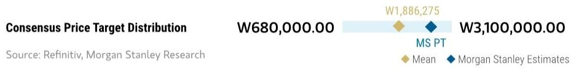

bar_line

| Consensus Price Target Distribution | W680,000.00 | W3,100,000.00 |
| ----------------------------------- | ----------- | ------------- |
| MS PT                               | 1,886,275   | 3,100,000.00 |
| Mean                                |             |               |
| MS Estimates           |             |               |

RISK REWARD CHART   
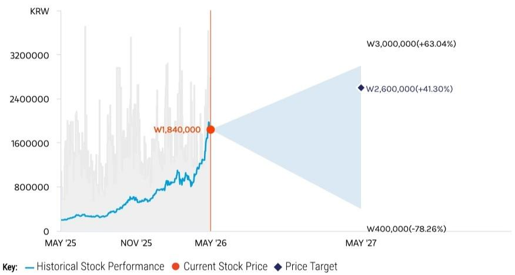

line

| Date       | Value     |
| ---------- | --------- |
| MAY '26    | 1,840,000 |
| MAY '27    | 2,600,000 |
| W3,000,000 | 2,600,000 (+41.30%) |
| W400,000   | -78.26%   |

Source: Refinitiv, MS

# OVERWEIGHT THESIS

■ We believe the commodity cycle is likely to stay robust in 2026 and into 2027, thanks to AI inference demand growth.   
- Our earnings estimates reflect downside protection from LTAs nto 2028, stronger commodity pricing assumptions, and stronger HBM pricing reset in 2027.   
■ We do not think this is the time to rotate out of outperformers such as SK hynix.   
- Our sensitivity analysis suggests that the market is not yet assigning any meaningful P/E premium to the company's LTA-backed memory earnings and FCF.

Consensus Rating Distribution   
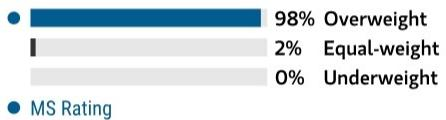

bar

| Category     | Value |
| ------------ | ----- |
| Overweight   | 98%   |
| Equal-weight | 2%    |
| Underweight  | 0%    |

Source: Refinitiv, MS

Risk Reward Themes 

<table><tr><td>Pricing Power:</td><td>Positive</td></tr><tr><td>Secular Growth:</td><td>Positive</td></tr><tr><td>Self-help:</td><td>Positive</td></tr></table>

View descriptions of Risk Rewards Themes here

# BULL CASE

# W3,000,000

Memory TAM grows; AI HBM leadership is extended

We see a stronger-than-expected commodity cycle for DRAM and NAND, supported by AI inference demand moving into 2027. Our bull scenario valuation implies 6.7x 2027e P/E.

# BASE CASE

# W2,600,000

Commodity up-cycle

We see a stronger-than-expected commodity cycle for DRAM and NAND, supported by AI inference demand in 2026 and into 2027. HBM competition risks remain but are being increasingly recognized by the market. Our price target implies 5.7x 2027e P/E, underpinned by Hynix's leadership in HBM and a sharp rebound in commodity memory pricing.

# BEAR CASE

# W400,000

Weaker macro climate, HBM competition intensifies

We assume a period of AI computing digestion in 2026, leading to more aggressive margin erosion for the HBM segment owing to competitors' aggressive capacity expansion and pricing competition, as well as faster DRAM pricing drops with muted demand recovery. In our long-term assumptions for the bear case, we assume margin erosion for the HBM segment amid rising competition. Our bear case valuation implies 1.3x 2026e P/B.

# Risk Reward – SK hynix (000660.KS)

KEY EARNINGS INPUTS 

<table><tr><td>Drivers</td><td>2025</td><td>2026e</td><td>2027e</td><td>2028e</td></tr><tr><td>Revenue Growth (%)</td><td>125.9</td><td>679.1</td><td>1,472.8</td><td>785.3</td></tr><tr><td>OPM (%)</td><td>48.6</td><td>80.0</td><td>81.5</td><td>78.7</td></tr><tr><td>CAPEX (%)</td><td>(2,840,890.0)</td><td>(6,257,430.9)</td><td>(7,730,302.6)</td><td>(8,790,428.5)</td></tr></table>

# INVESTMENT DRIVERS

• Supply and demand outlook for DRAM, NAND, and HBM   
- Global demand for data center products (server DRAM, enterprise SSD)

# GLOBAL REVENUE EXPOSURE

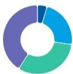

0-10% Europe ex UK   
20-30% Mainland China   
30-40% APAC, ex Japan, Mainland China and India   
40-50% North America

Source: MS Estimate View explanation of regional hierarchies here

# MS ALPHA MODELS

1/5

MOST

3 Month

Horizon

Source: Refinitiv, FactSet, MS; 1 is the highest favored Quintile and 5 is the least favored Quintile

# RISKS TO PT/RATING

# RISKS TO UPSIDE

- ASP growth re-acceleration   
• Preemptive production cuts or disruption   
- Sharp demand improvements   
• Significant increase in capital returns

# RISKS TO DOWNSIDE

• End demand turning weaker than expected   
- Rising competition for DDR5, causing overspending on the supply side.   
- Inventories remaining elevated at cloud and Chinese smartphone customers.

# OWNERSHIP POSITIONING

Inst. Owners, % Active

73.8%

Source: Refinitiv, MS

# MS ESTIMATES VS. CONSENSUS

FY Dec 2026e

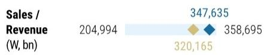

bar

| Sales / Revenue (W, bn) | Value   |
| ------------------------ | ------- |
| 204,994                  | 347,635 |
| 320,165                  | 358,695 |

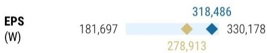

bar

| EPS (W)   | Value   |
| --------- | ------- |
|          | 181,697 |
|          | 318,486 |
|          | 278,913 |
|          | 330,178 |

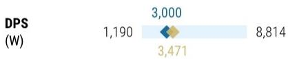

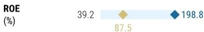

◆ MS Estimates

Source: Refinitiv, MS

# Risk Reward Reference links

1. View explanation of Options Probabilities methodology - Options\_Probabilities\_Exhibit\_Link.pdf   
2. View descriptions of Risk Rewards Themes - RR\_Themes\_Exhibit\_Link.pdf   
3. View explanation of regional hierarchies - GEG\_Exhibit\_Link.pdf   
4. View explanation of Theme/Exposure methodology - ESG\_Sustainable\_Solutions\_External\_Link.pdf   
5. View explanation of HERS methodology - ESG\_HERS\_External\_Link.pdf

# Disclosure Section

The information and opinions in MS were prepared or are disseminated by MS & Co. LLC and/or MS C.T.V.M. S.A. and/or MS México, Casa de Bolsa, S.A. de C.V. and/or MS Canada Limited and/or MS & Co. International plc and/or MS Europe S.E. and/or RMB MS Proprietary Limited and/or MS MUFG Securities Co., Ltd. and/or MS Capital Group Japan Co., Ltd. and/or MS Asia Limited and/or MS Asia (Singapore) Pte. (Registration number 199206298Z) and/or MS Asia (Singapore) Securities Pte Ltd (Registration number 200008434H), regulated by the Monetary Authority of Singapore (which accepts legal responsibility for its contents and should be contacted with respect to any matters arising from, or in connection with, MS) and/or MS Taiwan Limited and/or MS & Co International plc, Seoul Branch, and/or MS Australia Limited (A.B.N. 67 003 734 576, holder of Australian financial services license No. 233742, which accepts responsibility for its contents), and/or MS Wealth Management Australia Pty Ltd (A.B.N. 19 009 145 555, holder of Australian financial services license No. 240813, which accepts responsibility for its contents), and/or MS India Company Private Limited having Corporate Identification No (CIN) U22990MH1998PTC115305, regulated by the Securities and Exchange Board of India ("SEBI") and holder of licenses as a Research Analyst (SEBI Registration No. INH000001105), Stock Broker (SEBI Stock Broker Registration No. INZ000244438), Merchant Banker (SEBI Registration No. INM000011203), and depository participant with National Securities Depository Limited (SEBI Registration No. IN-DP-NSDL-567-2021) having registered office at Altimus, Level 39 & 40, Pandurang Budhkar Marg, Worli, Mumbai 400018, India; Telephone no. +91-22-61181000; Compliance Officer Details: Mr. Tejarshi Hardas, Tel. No.: +91-22-61181000 or Email: tejarshi.hardas@morganstanley.com; Grievance officer details: Mr. Tejarshi Hardas, Tel. No.: +91-22-61181000 or Email: msic-compliance@morganstanley.com which accepts the responsibility for its contents and should be contacted with respect to any matters arising from, or in connection with, MS, and their affiliates (collectively, "MS"). MS India Company Private Limited (MSICPL) may use AI tools in providing research services. All recommendations contained herein are made by the duly qualified research analysts.

For important disclosures, stock price charts and equity rating histories regarding companies that are the subject of this report, please see the MS Disclosure Website at www.morganstanley.com/eqr/disclosures/webapp/generalresearch, or contact your investment representative or MS at 1585 Broadway, (Attention: Research Management), New York, NY, 10036 USA.

For valuation methodology and risks associated with any recommendation, rating or price target referenced in this research report, please contact the Client Support Team as follows: US/Canada +1 800 303-2495; Hong Kong +852 2848-5999; Latin America +1 718 754-5444 (U.S.); London +44 (0)20-7425-8169; Singapore +65 6834-6860; Sydney +61 (0)2-9770-1505; Tokyo +81 (0)3-6836-9000. Alternatively you may contact your investment representative or MS at 1585 Broadway, (Attention: Research Management), New York, NY 10036 USA.

# Analyst Certification

The following analysts hereby certify that their views about the companies and their securities discussed in this report are accurately expressed and that they have not received and will not receive direct or indirect compensation in exchange for expressing specific recommendations or views in this report: Cindy Huang; Ryan Kim; Shawn Kim; Duan Liu.

# Global Research Conflict Management Policy

MS has been published in accordance with our conflict management policy, which is available at www.morganstanley.com/institutional/research/conflictpolicies. A Portuguese version of the policy can be found at www.morganstanley.com.br

# Important Regulatory Disclosures on Subject Companies

As of April 30, 2026, MS beneficially owned $1\%$ or more of a class of common equity securities of the following companies covered in MS: SK hynix. Within the last 12 months, MS managed or co-managed a public offering (or 144A offering) of securities of SK hynix.

Within the last 12 months, MS has received compensation for investment banking services from SK hynix.

In the next 3 months, MS expects to receive or intends to seek compensation for investment banking services from SK hynix.

Within the last 12 months, MS has provided or is providing investment banking services to, or has an investment banking client relationship with, the following company: SK hynix. The equity research analysts or strategists principally responsible for the preparation of MS have received compensation based upon various factors, including quality of research, investor client feedback, stock picking, competitive factors, firm revenues and overall investment banking revenues. Equity Research analysts' or strategists' compensation is not linked to investment banking or capital markets transactions performed by MS or the profitability or revenues of particular trading desks.

MS and its affiliates do business that relates to companies/instruments covered in MS, including market making, providing liquidity, fund management, commercial banking, extension of credit, investment services and investment banking. MS sells to and buys from customers the securities/instruments of companies covered in MS on a principal basis. MS may have a position in the debt of the Company or instruments discussed in this report. MS trades or may trade as principal in the debt securities (or in related derivatives) that are the subject of the debt research report.

Certain disclosures listed above are also for compliance with applicable regulations in non-US jurisdictions.

# STOCK RATINGS

MS uses a relative rating system using terms such as Overweight, Equal-weight, Not-Rated or Underweight (see definitions below). MS does not assign ratings of Buy, Hold or Sell to the stocks we cover. Overweight, Equal-weight, Not-Rated and Underweight are not the equivalent of buy, hold and sell. Investors should carefully read the definitions of all ratings used in MS. In addition, since MS contains more complete information concerning the analyst's views, investors should carefully read MS, in its entirety, and not infer the contents from the rating alone. In any case, ratings (or research) should not be used or relied upon as investment advice. An investor's decision to buy or sell a stock should depend on individual circumstances (such as the investor's existing holdings) and other considerations.

# Global Stock Ratings Distribution

(as of April 30, 2026)

The Stock Ratings described below apply to MS's Fundamental Equity Research and do not apply to Debt Research produced by the Firm.

For disclosure purposes only (in accordance with FINRA requirements), we include the category headings of Buy, Hold, and Sell alongside our ratings of Overweight, Equal-weight, Not-Rated and Underweight. MS does not assign ratings of Buy, Hold or Sell to the stocks we cover. Overweight, Equal-weight, Not-Rated and Underweight are not the equivalent of buy, hold, and sell but represent recommended relative weightings (see definitions below). To satisfy regulatory requirements, we correspond Overweight, our most positive stock rating, with a buy recommendation; we correspond Equal-weight and Not-Rated to hold and Underweight to sell recommendations, respectively.

<table><tr><td></td><td colspan="2">Coverage Universe</td><td colspan="3">Investment Banking Clients (IBC)</td><td colspan="2">Other Material Investment Services Clients (MISC)</td></tr><tr><td>Stock Rating Category</td><td>Count</td><td>% of Total</td><td>Count</td><td>% of Total IBC</td><td>% of Rating Category</td><td>Count</td><td>% of Total Other MISC</td></tr><tr><td>Overweight/Buy</td><td>1546</td><td>42%</td><td>467</td><td>51%</td><td>30%</td><td>709</td><td>44%</td></tr><tr><td>Equal-weight/Hold</td><td>1568</td><td>43%</td><td>358</td><td>39%</td><td>23%</td><td>715</td><td>44%</td></tr><tr><td>Not-Rated/Hold</td><td>4</td><td>0%</td><td>0</td><td>0%</td><td>0%</td><td>1</td><td>0%</td></tr><tr><td>Underweight/Sell</td><td>555</td><td>15%</td><td>84</td><td>9%</td><td>15%</td><td>202</td><td>12%</td></tr><tr><td>Total</td><td>3,673</td><td></td><td>909</td><td></td><td></td><td>1627</td><td></td></tr></table>

Data include common stock and ADRs currently assigned ratings. Investment Banking Clients are companies from whom MS received investment banking compensation in the last 12 months. Due to rounding off of decimals, the percentages provided in the "% of total" column may not add up to exactly 100 percent.

# Analyst Stock Ratings

Overweight (O or Over) - The stock's total return is expected to exceed the total return of the relevant country MSCI Index or the average total return of the analyst's industry (or industry team's) coverage universe, on a risk-adjusted basis over the next 12-18 months.

Equal-weight (E or Equal) - The stock's total return is expected to be in line with the total return of the relevant country MSCI Index or the average total return of the analyst's industry (or industry team's) coverage universe, on a risk-adjusted basis over the next 12-18 months.

Not-Rated (NR) - Currently the analyst does not have adequate conviction about the stock's total return relative to the relevant country MSCI Index or the average total return of the analyst's industry (or industry team's) coverage universe, on a risk-adjusted basis, over the next 12-18 months.

Underweight (U or Under) - The stock's total return is expected to be below the total return of the relevant country MSCI Index or the average total return of the analyst's industry (or industry team's) coverage universe, on a risk-adjusted basis, over the next 12-18 months.

Unless otherwise specified, the time frame for price targets included in MS is 12 to 18 months.

# Analyst Industry Views

Attractive (A): The analyst expects the performance of his or her industry coverage universe over the next 12-18 months to be attractive vs. the relevant broad market benchmark, as indicated below.

In-Line (I): The analyst expects the performance of his or her industry coverage universe over the next 12-18 months to be in line with the relevant broad market benchmark, as indicated below. Cautious (C): The analyst views the performance of his or her industry coverage universe over the next 12-18 months with caution vs. the relevant broad market benchmark, as indicated below. Benchmarks for each region are as follows: North America - S&P 500; Latin America - relevant MSCI country index or MSCI Latin America Index; Europe - MSCI Europe; Japan - TOPIX; Asia - relevant MSCI country index or MSCI sub-regional index or MSCI AC Asia Pacific ex Japan Index.

Stock Price, Price Target and Rating History (See Rating Definitions)

SK hynix (000660.KS) - As of 05/18/26 GMT in KRW Industry : S. Korea Technology   
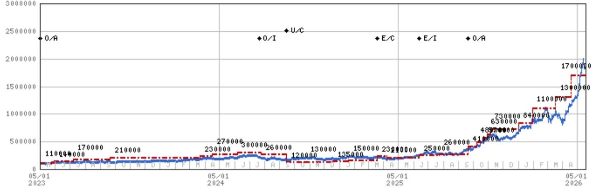

line

| Date | Value |
|---|---|
| 05/01 2023 | 110000 |
| 05/01 2024 | 170000 |
| 05/01 2024 | 210000 |
| 05/01 2024 | 230000 |
| 05/01 2024 | 270000 |
| 05/01 2024 | 300000 |
| 05/01 2024 | 260000 |
| 05/01 2024 | 120000 |
| 05/01 2024 | 135000 |
| 05/01 2024 | 150000 |
| 05/01 2024 | 231900 |
| 05/01 2024 | 250000 |
| 05/01 2024 | 260000 |
| 05/01 2024 | 418777 |
| 05/01 2024 | 633000 |
| 05/01 2024 | 733000 |
| 05/01 2024 | 849899 |
| 05/01 2024 | 1111888 |
| 05/01 2024 | 1318888 |
| 05/01 2024 | 1777888 |
| 05/01 2024 | 1378888 |
| 05/01 2024 | U/C |
| 05/01 2024 | E/C |
| 05/01 2024 | E/I |
| 05/01 2024 | O/A |
The chart displays a single data series with two series: 'Value' (blue line) and 'Value' (red dashed line). The x-axis is labeled with 'Month' and 'Year', and the y-axis is labeled with 'Value'. The data points are annotated above the chart at specific time points. There is no explicit title or legend provided in the image.

Stock Rating History: 5/1/21 : 0/A; 7/19/21 : 0/I; 8/12/21 : U/C; 12/3/21 : E/C; 2/11/22 : 0/C; 7/22/22 : E/C; 10/4/22 : 0/A; 7/21/24 : 0/I; 9/15/24 : U/C; 3/19/25 : E/C; 6/13/25 : E/I; 9/21/25 : 0/A   
Price Target History: 2/25/21 : 174000; 5/18/21 : 146000; 6/8/21 : 156000; 8/12/21 : 80000; 9/15/21 : 88000; 12/3/21 : 110000;   
12/23/21: 125000; 1/24/22: 130000; 1/28/22: 136000; 2/11/22: 155000; 3/18/22: 150000; 4/27/22: 130000; 6/10/22: 120000;   
7/5/22:110000;7/22/22:105000;10/4/22:130000;12/7/22:120000;3/21/23:110000;5/30/23:140000;7/7/23:170000;   
9/21/23 : 210000; 3/22/24 : 230000; 4/16/24 : 270000; 6/6/24 : 300000; 7/25/24 : 260000; 9/15/24 : 120000; 10/24/24 : 130000;   
12/18/24:135000;1/20/25:150000;3/19/25:230000;4/7/25:210000;6/13/25:250000;7/24/25:260000;9/21/25:410000;   
10/8/25:480000;10/23/25:570000;10/29/25:630000;11/5/25:730000;1/2/26:840000;1/30/26:1100000;3/18/26:1300000;   
4/19/26:1700000   
Source: MS Date Format : MM/DD/YY Price Target No Price Target Assigned (NA)   
Stock Price (Not Covered by Current Analyst) — Stock Price (Covered by Current Analyst)   
Stock and Industry Ratings (abbreviations below) appear as ♦ Stock Rating/Industry View   
Stock Ratings: Overweight (O) Equal-weight (E) Underweight (U) Not-Rated (NR) No Rating Available (NA)   
Industry View: Attractive (A) In-line (I) Cautious (C) No Rating (NR)   
Effective January 13, 2014, the stocks covered by MS Asia Pacific will be rated relative to the analyst's industry (or industry team's) coverage.   
Effective January 13, 2014, the industry view benchmarks for MS Asia Pacific are as follows: relevant MSCI country index or MSCI sub-regional index or MSCI AC Asia Pacific ex Japan Index.

# Important Disclosures for MS Smith Barney LLC Customers

Important disclosures regarding any material conflict of interest that can reasonably be expected to have influenced MS Smith Barney LLC's choice of a third-party research provider or the subject company of a third-party research report, are available on the MS Wealth Management disclosure website at www.morganstanley.com/online/researchdisclosures. For MS specific disclosures, you may refer to https://www.morganstanley.com/eqr/disclosures/webapp/generalresearch.

Each MS report is reviewed and approved on behalf of MS Smith Barney LLC. This review and approval is conducted by the same person who reviews the research report on behalf of MS. This could create a conflict of interest.

# Other Important Disclosures

MS policy is to update research reports as and when the Research Analyst and Research Management deem appropriate, based on developments with the issuer, the sector, or the market that may have a material impact on the research views or opinions stated therein. In addition, certain Research publications are intended to be updated on a regular periodic basis (weekly/monthly/quarterly/annual) and will ordinarily be updated with that frequency, unless the Research Analyst and Research Management determine that a different publication schedule is appropriate based on current conditions.

MS is not acting as a municipal advisor and the opinions or views contained herein are not intended to be, and do not constitute, advice within the meaning of Section 975 of the Dodd-Frank Wall Street Reform and Consumer Protection Act.

MS produces an equity research product called a "Tactical Idea." Views contained in a "Tactical Idea" on a particular stock may be contrary to the recommendations or views expressed in research on the same stock. This may be the result of differing time horizons, methodologies, market events, or other factors. For all research available on a particular stock, please contact your sales representative or go to Matrix at http://www.morganstanley.com/matrix.

MS is provided to our clients through our proprietary research portal on Matrix and also distributed electronically by MS to clients. Certain, but not all, MS products are also made available to clients through third-party vendors or redistributed to clients through alternate electronic means as a convenience. For access to all available MS, please contact your sales representative or go to Matrix at http://www.morganstanley.com/matrix.

Any access and/or use of MS is subject to MS's Terms of Use (http://www.morganstanley.com/terms.html). By accessing and/or using MS, you are indicating that you have read and agree to be bound by our Terms of Use (http://www.morganstanley.com/terms.html). In addition you consent to MS processing your personal data and using cookies in accordance with our Privacy Policy and our Global Cookies Policy (http://www.morganstanley.com/privacy\_pledge.html), including for the purposes of setting your preferences and to collect readership data so that we can deliver better and more personalized service and products to you. To find out more information about how MS processes personal data, how we use cookies and how to reject cookies see our Privacy Policy and our Global Cookies Policy (http://www.morganstanley.com/privacy\_pledge.html). Please use the provided link to review the Terms and Conditions and Most Important Terms and Conditions for MS India Company Private Limited (https://www.morganstanley.com/assets/ pdfs/about-us-global-offices/india/Terms\_and\_conditions.pdf) and the following link to review the audit report (https://ny.matrix.ms.com/eqr/research/webapp/researchdocs/MSICPL\_Morgan\_Stanley\_Research\_Audit\_Report.pdf).

If you do not agree to our Terms of Use and/or if you do not wish to provide your consent to MS processing your personal data or using cookies please do not access our research. MS does not provide individually tailored investment advice. MS has been prepared without regard to the circumstances and objectives of those who receive it. MS recommends that investors independently evaluate particular investments and strategies, and encourages investors to seek the advice of a financial adviser. The appropriateness of an investment or strategy will depend on an investor's circumstances and objectives. The securities, instruments, or strategies discussed in MS may not be suitable for all investors, and certain investors may not be eligible to purchase or participate in some or all of them. MS is not an offer to buy or sell or the solicitation of an offer to buy or sell any security/instrument or to participate in any particular trading strategy. The value of and income from your investments may vary because of changes in interest rates, foreign exchange rates, default rates, prepayment rates, securities/instruments prices, market indexes, operational or financial conditions of companies or other factors. There may be time limitations on the exercise of options or other rights in securities/instruments transactions. Past performance is not necessarily a guide to future performance. Estimates of future performance are based on assumptions that may not be realized. If provided, and unless otherwise stated, the closing price on the cover page is that of the primary exchange for the subject company's securities/instruments.

The fixed income research analysts, strategists or economists principally responsible for the preparation of MS have received compensation based upon various factors, including quality, accuracy and value of research, firm profitability or revenues (which include fixed income trading and capital markets profitability or revenues), client feedback and competitive factors. Fixed Income Research analysts', strategists' or economists' compensation is not linked to investment banking or capital markets transactions performed by MS or the profitability or revenues of particular trading desks.

The "Important Regulatory Disclosures on Subject Companies" section in MS lists all companies mentioned where MS owns $1\%$ or more of a class of common equity securities of the companies. For all other companies mentioned in MS, MS may have an investment of less than $1\%$ in securities/instruments or derivatives of securities/instruments of companies and may trade them in ways different from those discussed in MS. Employees of MS not involved in the preparation of MS may have investments in securities/instruments or derivatives of securities/instruments of companies mentioned and may trade them in ways different from those discussed in MS. Derivatives may be issued by MS or associated persons.

With the exception of information regarding MS, MS is based on public information. MS makes every effort to use reliable, comprehensive information, but we make no representation that it is accurate or complete. We have no obligation to tell you when opinions or information in MS change apart from when we intend to discontinue equity research coverage of a subject company. Facts and views presented in MS have not been reviewed by, and may not reflect information known to, professionals in other MS business areas, including investment banking personnel.

MS personnel may participate in company events such as site visits and are generally prohibited from accepting payment by the company of associated expenses unless pre-approved by authorized members of Research management.

MS may make investment decisions that are inconsistent with the recommendations or views in this report.

To our readers based in Taiwan or trading in Taiwan securities/instruments: Information on securities/instruments that trade in Taiwan is distributed by MS Taiwan Limited ("MSTL"). Such information is for your reference only. The reader should independently evaluate the investment risks and is solely responsible for their investment decisions. MS may not be distributed to the public media or quoted or used by the public media without the express written consent of MS. Any non-customer reader within the scope of Article 7-1 of the Taiwan Stock Exchange Recommendation Regulations accessing and/or receiving MS is not permitted to provide MS to any third party (including but not limited to related parties, affiliated companies and any other third parties) or engage in any activities regarding MS which may create or give the appearance of creating a conflict of interest. Information on securities/instruments that do not trade in Taiwan is for informational purposes only and is not to be construed as a recommendation or a solicitation to trade in such securities/instruments. MSTL may not execute transactions for clients in these securities/instruments.

Certain information in MS was sourced by employees of the Shanghai Representative Office of MS Asia Limited for the use of MS Asia Limited. MS is not incorporated under PRC law and the research in relation to this report is conducted outside the PRC. MS does not constitute an offer to sell or the solicitation of an offer to buy any securities in the PRC. PRC investors shall have the relevant qualifications to invest in such securities and shall be responsible for obtaining all relevant approvals, licenses, verifications and/or registrations from the relevant governmental authorities themselves. Neither this report nor any part of it is intended as, or shall constitute, provision of any consultancy or advisory service of securities investment as defined under PRC law. Such information is provided for your reference only.

MS is disseminated in Brazil by MS C.T.V.M. S.A. located at Av. Brigadeiro Faria Lima, 3600, 6th floor, São Paulo - SP, Brazil; and is regulated by the Comissão de Valores Mobiliários; in Mexico by MS México, Casa de Bolsa, S.A. de C.V which is regulated by Comision Nacional Bancaria y de Valores. Paseo de los Tamarindos 90, Torre 1, Col. Bosques de las Lomas Floor 29, 05120 Mexico City; in Japan by MS MUFG Securities Co., Ltd. and, for Commodities related research reports only, MS Capital Group Japan Co., Ltd; in Hong Kong by MS Asia Limited (which accepts responsibility for its contents) and by MS Bank Asia Limited; in Singapore by MS Asia (Singapore) Pte. (Registration number 199206298Z) and/or MS Asia (Singapore) Securities Pte Ltd (Registration number 200008434H), regulated by the Monetary Authority of Singapore (which accepts legal responsibility for its contents and should be contacted with respect to any matters arising from, or in connection with, MS) and by MS Bank Asia Limited, Singapore Branch (Registration number T14FC0118); in Australia to "wholesale clients" within the meaning of the Australian Corporations Act by MS Australia Limited A.B.N. 67 003 734 576, holder of Australian financial services license No. 233742, which accepts responsibility for its contents; in Australia to "wholesale clients" and "retail clients" within the meaning of the Australian Corporations Act by MS Wealth Management Australia Pty Ltd (A.B.N. 19 009 145 555, holder of Australian financial services license No. 240813, which accepts responsibility for its contents; in Korea by MS & Co International plc, Seoul Branch; in India by MS India Company Private Limited having Corporate Identification No (CIN) U22990MH1998PTC115305, regulated by the Securities and Exchange Board of India ("SEBI") and holder of licenses as a Research Analyst (SEBI Registration No. INH000001105); Stock Broker (SEBI Stock Broker Registration No. INZ000244438), Merchant Banker (SEBI Registration No. INM000011203), and depository participant with National Securities Depository Limited (SEBI Registration No. IN-DP-NSDL-567-2021) having registered office at Altimus, Level 39 & 40, Pandurang Budhkar Marg, Worli, Mumbai 400018, India; Telephone no. +91-22-61181000; Compliance Officer Details: Mr. Tejarshi Hardas, Tel. No.: +91-22-61181000 or Email: tejarshi.hardas@morganstanley.com; Grievance officer details: Mr. Tejarshi Hardas, Tel. No.: +91-22-61181000 or Email: msic-compliance@morganstanley.com. MS India Company Private Limited (MSICPL) may use AI tools in providing research services. All recommendations contained herein are made by the duly qualified research analysts; in Canada by MS Canada Limited; in Germany and the European Economic Area where required by MS Europe S.E., authorised and regulated by Bundesanstalt fuer Finanzdienstleistungsaufsicht (BaFin) under the reference number 149169; in the US by MS & Co. LLC, which accepts responsibility for its contents. MS & Co. International plc, authorized by the Prudential Regulation Authority and regulated by the Financial Conduct Authority and the Prudential Regulation Authority, disseminates in the UK research that it has prepared, and research which has been prepared by any of its affiliates, only to persons who (i) are investment professionals falling within Article 19(5) of the Financial Services and Markets Act 2000 (Financial Promotion) Order 2005 (as amended, the "Order"); (ii) are persons who are high net worth entities falling within Article 49(2)(a) to (d) of the Order; or (iii) are persons to whom an invitation or inducement to engage in investment activity (within the meaning of section

21 of the Financial Services and Markets Act 2000, as amended) may otherwise lawfully be communicated or caused to be communicated. RMB MS Proprietary Limited is a member of the JSE Limited and A2X (Pty) Ltd. RMB MS Proprietary Limited is a joint venture owned equally by MS International Holdings Inc. and RMB Investment Advisory (Proprietary) Limited, which is wholly owned by FirstRand Limited. The information in MS is being disseminated by MS Saudi Arabia, regulated by the Capital Market Authority in the Kingdom of Saudi Arabia, and is directed at Sophisticated investors only.

The information in MS is being communicated by MS & Co. International plc (DIFC Branch), regulated by the Dubai Financial Services Authority (the DFSA) or by MS & Co. International plc (ADGM Branch), regulated by the Financial Services Regulatory Authority Abu Dhabi (the FSRA), and is directed at Professional Clients only, as defined by the DFSA or the FSRA, respectively. The financial products or financial services to which this research relates will only be made available to a customer who we are satisfied meets the regulatory criteria of a Professional Client. A distribution of the different MS Research ratings or recommendations, in percentage terms for Investments in each sector covered, is available upon request from your sales representative.

The information in MS is being communicated by MS & Co. International plc (QFC Branch), regulated by the Qatar Financial Centre Regulatory Authority (the QFCRA), and is directed at business customers and market counterparties only and is not intended for Retail Customers as defined by the QFCRA.

As required by the Capital Markets Board of Turkey, investment information, comments and recommendations stated here, are not within the scope of investment advisory activity. Investment advisory service is provided exclusively to persons based on their risk and income preferences by the authorized firms. Comments and recommendations stated here are general in nature. These opinions may not fit to your financial status, risk and return preferences. For this reason, to make an investment decision by relying solely to this information stated here may not bring about outcomes that fit your expectations.

The trademarks and service marks contained in MS are the property of their respective owners. Third-party data providers make no warranties or representations relating to the accuracy, completeness, or timeliness of the data they provide and shall not have liability for any damages relating to such data. The Global Industry Classification Standard (GICS) was developed by and is the exclusive property of MSCI and S&P.

MS, or any portion thereof may not be reprinted, sold or redistributed without the written consent of MS.

Indicators and trackers referenced in MS may not be used as, or treated as, a benchmark under Regulation EU 2016/1011, or any other similar framework.

The issuers and/or fixed income products recommended or discussed in certain fixed income research reports may not be continuously followed. Accordingly, investors should regard those fixed income research reports as providing stand-alone analysis and should not expect continuing analysis or additional reports relating to such issuers and/or individual fixed income products. MS may hold, from time to time, material financial and commercial interests regarding the company subject to the Research report.

Registration granted by SEBI and certification from the National Institute of Securities Markets (NISM) in no way guarantee performance of the intermediary or provide any assurance of returns to investors. Investment in securities market are subject to market risks. Read all the related documents carefully before investing.

© 2026 MS