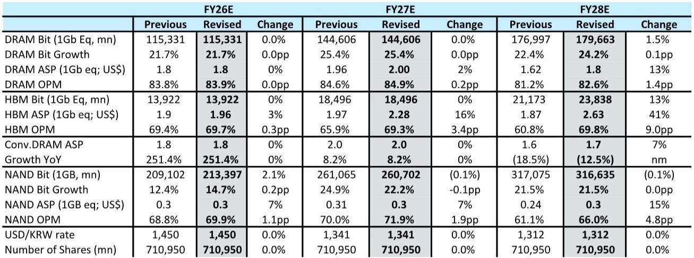
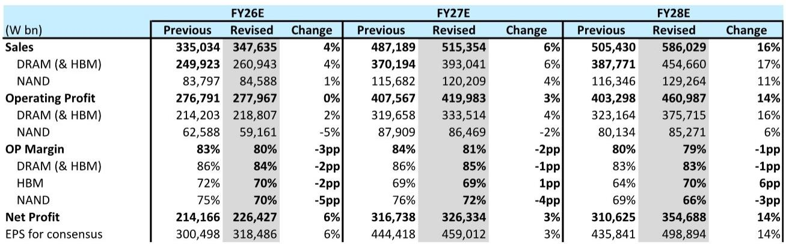
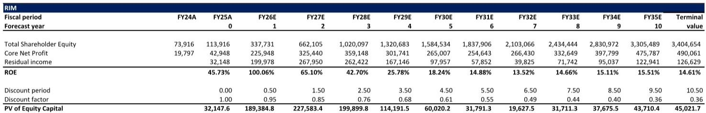

# 记忆体行业的“结构性契约”正在改写周期的定价逻辑

市场对AI基础设施的讨论，大多集中在GPU算力、网络带宽和电力消耗上。但一个更深层的结构性变化正在发生，它可能比任何单一芯片的迭代都更能重塑半导体投资的底层逻辑：记忆体（Memory）的合约模式正在从“随行就市的现货博弈”转向“锁定3-5年的长期战略联盟”。

这份来自某外资投行的研报，核心判断并非记忆体需求有多强劲——这已是共识——而是供给侧的合约结构发生了不可逆的质变。这种质变的结果是，记忆体公司的盈利可见性、现金流质量和估值倍数，都可能经历一次系统性的重估。市场目前对此的定价，可能仍停留在“周期股”的旧框架里。

## 1. 长期协议不再是“君子协定”，而是带有财务担保的硬约束

过去半导体景气周期中，长期协议（LTA）并不罕见。但那些协议往往约束力薄弱，更像是基于信任的意向书，一旦市场转弱，客户可以轻易推迟或取消订单，供应商几乎没有追索权。

当前这一轮LTA，性质完全不同。根据研报中引用的产业链信息，新协议的期限普遍拉长至3-5年，且包含了预付款、价格区间、利润保护等机制。更关键的是，这些协议很可能是“不可取消、不可退款”的。有供应商在财报电话会上透露，客户通过“数十亿美元的金融工具”作为抵押，一旦未能履行每季度的采购承诺，这些抵押将直接转为对供应商的补偿。

这意味着什么？过去记忆体公司的产能扩张，很大程度上是在赌未来的市场需求。现在，扩张的资本开支直接对应的是已被确认的、不可撤销的客户订单。这消除了库存风险，也让供应商的产能规划从“猜测”变成了“执行”。

## 2. 一个被低估的结构性变化：记忆体正从“大宗商品”变为“定制化基础设施”

传统上，DRAM和NAND Flash被视为标准化的大宗商品，价格由供需的边际变化决定，周期波动剧烈。但AI时代的到来，尤其是HBM（高带宽内存）的崛起，彻底改变了这一局面。

HBM的生产工艺复杂，良率爬坡慢，且需要与客户的AI芯片进行深度协同设计。这意味着，记忆体供应商与客户之间的关系，从“你买我卖”变成了“联合研发、长期绑定”。研报指出，领先的超大规模云服务商已不再机会性地采购记忆体，而是在为未来数年的AI基础设施建设锁定长期供应。

这种转变的深层含义在于：记忆体的定价权，正在从“市场供需”向“合约条款”转移。供应商可以利用LTA锁定稳定的价格和利润，而客户则获得了稀缺产能的优先分配权。这是一种双赢的结构性安排，但它的代价是——所有未能参与这种锁定、只能依赖现货市场的下游客户，将不得不支付更高的“记忆体税”。

## 3. 现金流可见性提升，将驱动估值逻辑从“周期PE”向“成长+分红PE”切换

周期股之所以长期享有估值折价，核心原因在于其盈利和现金流的不可预测性。投资者需要为一个可能随时消失的利润，要求更高的安全边际。

LTA的普及，正在消除这种不确定性。当未来3-5年的销量和价格被部分锁定，记忆体公司的自由现金流（FCF）将变得可预测、可持续。研报以苹果公司为例，指出其过去十年的超额回报中，约70%来自持续的股票回购和分红。记忆体公司虽然难以完全复制苹果的故事，但一旦盈利波动性降低、FCF收益率提升，它们完全有可能开启更可持续的资本回报计划，从而推动估值倍数系统性上移。

研报中展示的SK海力士和三星电子的FCF预测，清晰地指向了这一点：两家公司的FCF收益率预计将在2026-2028年间大幅扩张。如果这一趋势得以实现，市场对它们的定价，将从“周期底部买入、顶部卖出”的交易逻辑，转向“持有并分享现金流增长”的投资逻辑。

## 4. 但有一个关键问题，报告尚未完全回答：这种“锁定”是否意味着下游需求被高估？

LTA的本质，是客户对未来需求的一种保险。但保险的购买，并不等同于保险标的必然出现。如果AI投资的回报率低于预期，或者技术路线发生重大变化（例如，某种新型计算架构大幅降低了对HBM的依赖），那么这些被锁定的合约，就可能从“资产”变成“负债”。

研报对此有所提及，但并未深入展开。它承认，这些LTA的细节因NDA而不透明，且预付款和抵押机制的具体执行情况仍需观察。一个潜在的风险是：如果需求增速放缓，客户虽然无法取消合约，但可能会要求重新谈判条款，或者通过降低产能利用率来变相施压。届时，供应商账面上那些被记为“递延收入”的预付款，将面临减值风险。

这并非否定LTA的结构性意义，而是提醒：任何看似完美的商业模式创新，其长期有效性都取决于它是否经得起一轮完整周期的考验。记忆体行业真正“告别周期”的证据，需要等到下一轮需求放缓时才能获得。

## 5. 投资者的观察框架：从“价格信号”转向“合约信号”

对于希望跟踪这一结构性变化的投资者而言，传统的DRAM现货价格和合约价格已经不够用了。需要关注的新信号包括：

- **资产负债表上的递延收入科目**：这是LTA预付款的直接证据。如果主要记忆体公司的递延收入持续增长，说明合约的“锁定”程度在加深。
- **资本开支指引与LTA覆盖率的关联**：供应商在宣布大规模扩产时，是否同时披露了相应的长期合约覆盖比例？这是判断产能扩张是否理性的关键。
- **客户财报中的“供应保障”表述**：超大规模云服务商在资本开支指引中，是否开始明确提及“已通过长期协议锁定关键记忆体供应”？这将是需求侧确认的重要信号。
- **非AI客户的LTA渗透率**：研报指出，未来可能有更多非AI客户加入LTA。这一趋势如果兑现，将意味着记忆体“合约化”的范围正在从AI基础设施向更广泛的IT支出扩散。

这些信号，比任何短期价格波动都更能揭示记忆体行业估值中枢是否正在永久性上移。

---

关于LTA对HBM定价重置的具体影响、SK海力士和三星电子在2027-2028年的盈利弹性差异、以及NAND Flash领域是否会出现类似的合约化趋势，研报中还有更多细节和情景分析。这些内容因篇幅所限未能在此展开，但它们是理解这一轮记忆体重估完整逻辑的关键拼图。

欢迎来星球微信群里继续讨论，我们将基于这份研报的完整图表和测算，一起拆解那些尚未被市场充分定价的二阶影响。

Personal reading notes and learning share only. Not investment advice.

