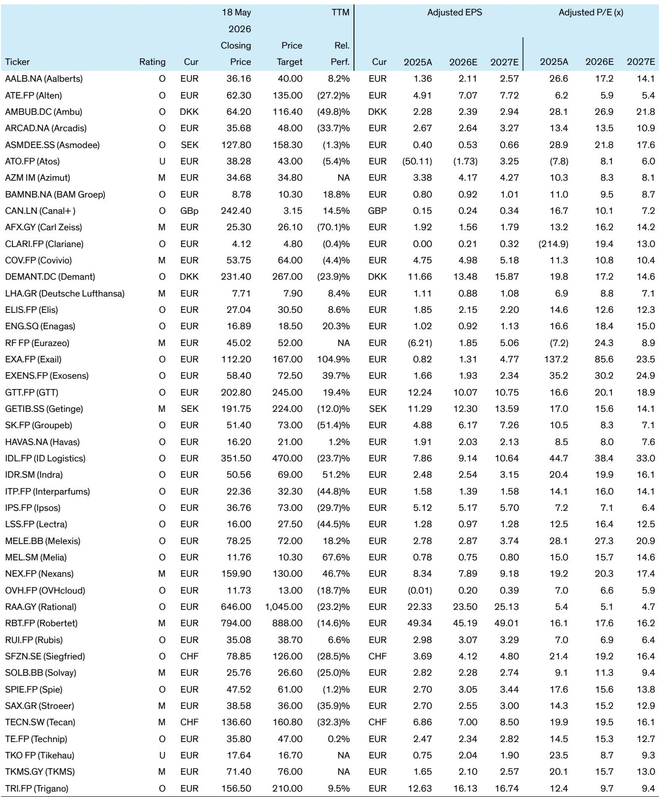
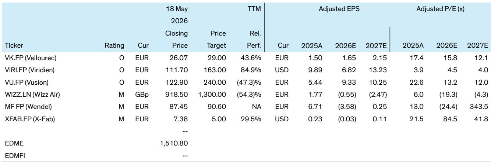

# 欧洲中小盘股的真正机会，藏在管理层问答的缝隙里

市场对欧洲中小盘股的关注，往往集中在宏观叙事和行业轮动上。但一份来自某外资投行的研报，提供了一个截然不同的视角：它不急于给出结论，而是精心准备了10个问题，让投资者带着这些框架去与管理层对话。这份报告的核心判断是——**当前欧洲中小盘股的价值重估，并不取决于宏观数据的回暖，而取决于企业能否在细分赛道上证明自己的议价能力和战略执行力。**

为什么这个判断现在重要？因为过去两年，欧洲中小盘股经历了估值压缩和盈利下修的双重打击。市场已经充分定价了宏观逆风。但正如这份报告所暗示的，真正区分“赢家”和“输家”的，不再是行业贝塔，而是企业自身的阿尔法。报告通过对45家覆盖公司的管理层提问，揭示了一个尚未被市场充分定价的结构性变化：在半导体设备、国防、能源转型和医疗科技等特定领域，一批中小盘公司正在建立难以复制的竞争壁垒，而它们的估值却仍停留在周期股的水平。

这份报告提供的不是一份简单的“买入清单”，而是一套用来识别这种结构变化的提问框架。以下是我们从报告中提炼出的五个关键洞察，以及它们对投资决策的含意。

## 1. 半导体设备复苏的“二阶效应”被低估，但需验证其可持续性

报告中对Aalberts、Melexis、X-Fab等半导体相关公司的提问，指向了一个共同的关切：市场是否低估了半导体设备复苏带来的“二阶效应”。例如，对Aalberts的提问明确聚焦于“半导体设备后端和东南亚市场的商业与运营协同效应”，以及对Melexis的提问则关注“汽车半导体内容增长是否正在加速”。这些问题的潜台词是：半导体设备的复苏不仅仅是周期性的补库存，而是由AI、电动汽车和工业自动化驱动的结构性需求扩张。

但报告也留下了关键悬疑。对X-Fab的提问显示，分析师对2026年的盈利预测已经出现分歧，部分公司2026年的P/E估值仍在20倍以上，市场尚未完全定价这一轮复苏的强度和持续性。这里仍需验证：半导体设备订单的可见度到底有多高？2H26的复苏是否已经被提前透支？对投资者而言，这意味着需要密切关注这些公司季度订单数据的变化，而不是仅仅依赖宏观预测。

## 2. 国防与安全领域的“隐形冠军”正在重塑估值逻辑

报告中一个引人注目的主题是国防与安全领域的投资机会。对Exail、Indra、TKMS等公司的提问，均涉及国防支出的结构性增长。例如，对Exail的提问直接指向“国防订单的可预见性和利润率趋势”，而对Indra的提问则关注“国防业务增长能否抵消其他部门的疲软”。这些问题的共同点是：国防支出不再是周期性的财政刺激，而是地缘政治紧张局势下的长期结构性需求。

值得注意的是，这些公司中许多并非传统的大型国防承包商，而是在水下系统、电子战、网络安全等细分领域具有技术优势的“隐形冠军”。报告对Exail和Exosens的评级均为“跑赢大盘”，且目标价隐含较大上涨空间。这暗示，市场可能尚未充分认识到这些中小型国防供应商的盈利增长潜力和估值重估空间。然而，报告也提示了风险：国防订单的执行周期和利润率透明度仍然是需要持续跟踪的关键变量。

## 3. 医疗科技领域的“创新溢价”正在回归，但分化加剧

报告中对Ambu、Demant、Getinge、Siegfried、Tecan等医疗科技公司的提问，揭示了该领域正在发生的深刻分化。对Ambu的提问关注“一次性内窥镜的市场份额增长和利润率爬坡”，对Demant的提问则聚焦“助听器市场的份额变化和AI赋能”。这些问题的共同指向是：拥有真正创新产品的公司，正在获得市场份额和定价权，而依赖传统产品的公司则面临增长放缓。

但分化同样明显。对Getinge的提问显示，其“医院设备业务的增长前景”仍面临不确定性，而对Carl Zeiss Meditec的提问则关注“眼科设备市场的竞争格局”。报告的评级也反映了这种分化：Ambu和Demant获得“跑赢大盘”评级，而Carl Zeiss Meditec和Getinge仅为“市场表现”。这意味着，在医疗科技领域，投资者需要具备更强的个股选择能力，不能简单地押注整个行业。

## 4. 消费与工业领域的“韧性”并非普适，结构性赢家正在浮现

报告中对消费和工业类公司的提问，揭示了“韧性”背后的结构性差异。对Trigano（休闲车）和Melia（酒店）的提问，关注的是“需求是否已经触底”以及“定价能力是否可持续”。而对Groupe SEB（小家电）和Interparfums（香水）的提问，则更关注“市场份额增长”和“品牌组合优化”。这些问题的差异表明，即使在宏观逆风中，一些公司通过强大的品牌、产品组合优化和成本控制，正在实现超越同行的增长。

但报告也提示了风险。对Rational（商用厨房设备）的提问显示，其“高端市场的增长潜力”可能已经面临瓶颈，而对Solvay（特种化学品）的提问则关注“成本转嫁能力是否可持续”。这意味着，在消费和工业领域，投资者需要区分哪些公司拥有真正的结构性竞争优势，哪些只是受益于短期周期。

## 5. 报告尚未完全回答的关键问题：管理层执行力与资本配置的“黑箱”

尽管这份报告提供了极具洞察力的提问框架，但它并未完全回答一个核心问题：管理层能否将这些战略愿景转化为实际的财务表现？报告中对许多公司的提问都涉及“资本配置策略”和“并购整合计划”，例如对Aalberts和Eurazeo的提问。这些问题的存在本身就表明，管理层的执行力是投资成败的关键变量。

另一个未被充分讨论的问题是“资本配置纪律”。报告中对Wendel和Tikehau等投资控股公司的提问，暗示了市场对这些公司资本配置能力的担忧。例如，对Tikehau的提问关注“资产估值和退出时机”，而对Wendel的提问则关注“投资组合的优化进度”。这些问题的背后，是投资者对管理层能否在正确的时间做出正确的资本配置决策的疑虑。这恰恰是深入研读完整报告和与管理层直接对话才能获得的关键洞察。

---

这份报告的价值，不在于它给出了多少具体的买卖建议，而在于它提供了一套系统性的提问框架。它告诉我们，在投资欧洲中小盘股时，真正需要关注的是：公司的竞争优势是否可持续？管理层的战略执行力如何？资本配置是否审慎？这些问题，远比宏观预测更能决定投资的成败。

对于希望进一步深入研究的投资者，我们建议带着这份报告的提问框架，去阅读完整报告中对每家公司管理层的具体问答。你会发现，那些真正有价值的洞察，往往藏在管理层对细节问题的回答中。欢迎来星球微信群里继续讨论，我们将分享完整报告的解读和更多独家分析。

Personal reading notes and learning share only. Not investment advice.

