# Technology - European Semiconductors | Europe

# Framing the CPO opportunity for Soitec and Besi

WHAT'S CHANGED 

<table><tr><td>Soitec SA (SOIT.PA)</td><td>From</td><td>To</td></tr><tr><td>Price Target</td><td>€70.00</td><td>€200.00</td></tr><tr><td colspan="3">BE Semiconductor Industries NV (BESI.AS)</td></tr><tr><td>Price Target</td><td>€200.00</td><td>€300.00</td></tr></table>

Larger, more tightly coupled AI rack clusters should push optics deeper into the datacenter, lifting Soitec's Photonics SOI wafer content and Besi's hybrid bonding demand. Detailed modelling raises our conviction, resulting in material PT increases for both.

# Key Takeaways

■ Agentic systems increase the need for high bandwidth, low latency communication in the AI datacenter which may accelerate the penetration of photonics.   
The attach rate of optical engines per GPU may increase sharply, from c.2-4 in a single rack domain to >35 in a multi-rack architecture leveraging CPO.   
We built a detailed model to size the implications for Soitec and Besi and expect a material increase in addressable demand towards 2028.   
Soitec is the more direct beneficiary through Photonics SOI wafers. We raise CY28 revenue estimates as well as our PT, which moves to €200.   
- Besi benefits from CPO adoption as TSMC's COUPE leverages hybrid bonding. In addition, we expect increased use in future GPU and HBM generations. PT to €300.

Upcoming architectural changes in NVIDIA's rack-scale infrastructure, introduced with NVL576 and beyond, will create a material, multi-year benefit for both Soitec and Besi, in our view. We've been modelling the networking opportunity through growth of transceivers, but we now identify a much larger opportunity when co-packaged optics (CPO) starts to be used in the scale-up domain that is still dominated by copper connections. Using insights from Corning's recent investor meeting, we model a meaningful increase in the addressable market for Soitec's Photonic SOI technology. Besi should also benefit, as we expect a large proportion of this market, and especially NVIDIA, to use TSMC's COUPE architecture, which is enabled by Besi's hybrid bonding tools. In addition to networking, we see opportunities for adoption within GPU and HBM memory, where we had been more cautious previously. As a result, we raise our estimates for Soitec and Besi meaningfully and increase our price targets to €200 and €300, respectively, as we stay Overweight on both names.

MS & CO. INTERNATIONAL PLC+

# Nigel van Putten

Equity Analyst
Nigel.Putten@morganstanley.com +44 20 7425-2803

# Shawn Kim

Equity Analyst
Shawn.Kim@morganstanley.com +44 20 7677-1018

# Lee Simpson

Equity Analyst
Lee.Simpson@morganstanley.com +44 20 7425-3378

# Amelia M Scicluna

Research Associate
Amelia.Scicluna@morganstanley.com +44 20 7425-6694

# Terence Tsui

Equity Analyst
Terence.Tsui@morganstanley.com +44 20 7425-3095

# TECHNOLOGY - EUROPEAN SEMICONDUCTORS

Europe
Industry View In-Line

MS does and seeks to do business with companies covered in MS. As a result, investors should be aware that the firm may have a conflict of interest that could affect the objectivity of MS. Investors should consider MS as only a single factor in making their investment decision.

# For analyst certification and other important disclosures, refer to the Disclosure Section, located at the end of this report.

+= Analysts employed by non-U.S. affiliates are not registered with FINRA, may not be associated persons of the member and may not be subject to FINRA restrictions on communications with a subject company, public appearances and trading securities held by a research analyst account.

Corning's Investor Day points to a 10x increase in fiber content per GPU as data centres move to co-packaged optics. In photonic networking, fibers carry the light, but at each end sits an optical engine (OE), a package of an electronic and photonics chip, which converts electrical signals to light and electrical signals. The photonics chips are built on photonic integrated circuits (PIC) using Soitec's engineered photonics SOI wafers. Meanwhile, Besi's hybrid bonding tools are often (depending on the assembly process) used to package the electrical IC (EIC) on top of the PIC. Corning presented the opportunity in fibers (160 per GPU in a fully optical architecture versus 16 today), and in doing so, disclosed enough about the underlying switch architecture, lane counts and SerDes rates for us to calculate the number of optical engines required. That count maps closely on a near one-to-one basis to Soitec's addressable market for AI datacenter Photonics wafers and gives a useful indication of Besi's hybrid bonding opportunity.

Exhibit 1: We expect the optical engines attach rate per GPU to increase 10x in future configurations   
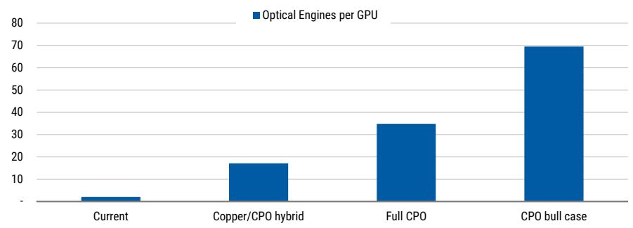

bar

| Category | Optical Engines per GPU |
|---|---|
| Current | 2 |
| Copper/CPO hybrid | 17 |
| Full CPO | 35 |
| CPO bull case | 70 |

Source: MS

# We estimate optical engines per GPU rise from c.2 to 4 today to 17 in NVL576 and potentially >35 in a fully optical configuration. Today's pre-CPO setup uses 2-

4 pluggable transceivers (two for the leaf, two for spine with oversubscription potentially reducing this number) per GPU, all in the scale-out network. NVL576 introduces co-packaged optics (CPO) for inter-rack scale-up traffic, lifting optical engine attach rate to c.17 per GPU, on our estimates. A fully optical variant, where the connection between GPU and the networking switch also moves to photonics, roughly doubles that to c.35. Looking ahead to Feynman architectures and Keyber rack architectures, OEs per-GPU could remain at that level if SerDes speeds move to 400G, but could double again if SerDes stays at 200G, which Corning CEO Wendell Weeks flagged as closer to the historical pattern.

Soitec benefits directly from rising silicon photonics content. Today, the company's exposure is largely limited to pluggable optics used in the inter-rack networking infrastructure. This is already contributing to growth within Soitec's photonics-related revenue, expected to have reached >\$100m (MSe: \$112m) in fiscal year '26 (March year-end), but remains modest relative to what we believe is about to emerge. With the introduction of CPO for scale-up, first in a hybrid and later in full CPO architectures, photonic SOI content is expected to significantly increase, driving an acceleration of growth in calendar years '27 and '28. As a result, we raise our Soitec estimates on the photonics upgrade, even as we leave the remainder of our assumptions broadly unchanged. We now model Photonics SOI revenue of

\$468m in CY28, up from \$387m previously, lifting our CY28 EPS forecast to €6.09 from €5.40. Our new PT of €200 applies a 35x multiple to CY28 earnings power, discounted by one year. The increase in our price target from €70 to €200 is a result of a combination of higher estimates, moving the base year to CY28 from CY27 and raising the multiple to 35x from 30x. We think the higher multiple is warranted due to our higher conviction on Soitec's growth trajectory into CY30e. The transition towards scale-up CPO architectures may start with early NVL576 hybrid racks in late '26 but we expect this design to move into mainstream adoption towards '28. In order to capture this development, which is supported by our detailed wafer model, we move to CY28 (fiscal '29 March end) as the base year for Soitec and discount by one year. For Besi, and other equipment companies in our coverage, we continue to use CY27 as our base year. Here, visibility on capex investment beyond '28, although directionally positive, remains somewhat limited.

Besi represents a second route into the CPO ramp. CPO should become an incremental growth driver for Besi's hybrid bonders because optical engines need advanced assembly. We expect TSMC's COUPE to become a leading integration route for the optical engine, especially at NVIDIA, which supports additional tool demand for Besi's hybrid bonders. From the Feynman GPU onwards, the opportunity broadens into stacked GPU dies, which we expect to use hybrid bonding, and into (custom) HBM, where we expect hybrid bonding to start in CY27 and widen thereafter. Applying a 37x (previously 35x) multiple to c.€8 CY27 earnings power gives our revised PT of €300. Our target multiple moves up slightly on higher valuation across the semiconductor sector as well as increased visibility of the hybrid bonding opportunity for HBM.

How to position for upcoming catalysts. Both companies have catalyst events in the coming weeks. Soitec will report its FY26 (March '26 year-end) on 27 May after close followed by an investor meeting on May 28 in Paris. Besides the print this event matters because it will be the first opportunity for new CEO Laurent Rémont to present to the market. We expect Mr Rémont to lay out an optimistic view but numbers are likely to be conservative and expressed in medium-term CAGRs. Against high expectations in the market we would position tactically cautious into this event. Besi will host its annual investor day on June 18 in Amsterdam. Here we expect the company to provide more detail on optical interconnect as a driver for its mainstream, hybrid bonding, and potentially thermo-compression bonding (TCB) tools. We also expect more colour on expectations around the introduction of hybrid bonding for HBM.

Inside the note, we provide insight into our detailed model that bridges GPU/ASIC and transceiver assumptions into Photonics SOI wafers and hybrid bonding tool capacity.

# Transceiver growth and increased CPO penetration bodes well for Soitec and Besi

Meaningful update to Transceiver forecasts. Our colleague covering Greater China Technology Hardware, Andy Meng, updated his transceiver forecasts last week Friday – see Global AI Transceivers: Industry Demand Likely to be Even Stronger. The team raised its AI transceiver shipment forecasts to 73m units from 53m in '26, to 141m units from 71m in '27, and to 150m from 80m for '28. The larger '27-'28 revisions mainly reflect a more positive view on 1.6T demand, and now forecasts the AI transceiver TAM to grow from US \$18 bn in 2025 to US\$102 bn in 2028, or >4x in three years. In the near term, we expect transceivers to be the main driver of growth for Silicon Photonics, benefiting Soitec's photonics SOI revenue line and Besi's mainstream business. However, from '27e onwards we expect the main contribution for each to shift to Co-Packaged Optics (CPO).

Exhibit 2: AI Transceivers global volume - Global market volume ('000 units)   
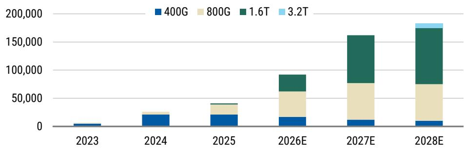

bar_stacked

| Year | 400G | 800G | 1.6T | 3.2T |
|---|---|---|---|---|
| 2023 | ~5,00 | 0 | 0 | 0 |
| 2024 | ~20,00 | ~5,00 | 0 | 0 |
| 2025 | ~20,00 | ~10,00 | 0 | 0 |
| 2026E | ~15,00 | ~45,00 | ~30,00 | 0 |
| 2027E | ~10,00 | ~75,00 | ~95,00 | 0 |
| 2028E | ~10,00 | ~75,00 | ~115,00 | ~15,00 |

Source: Companyy data, MS estimates (E)

# Insights from Corning's Investor Day

France's Soitec, a leader in manufacturing engineered substrates; Netherlands-based Besi, which develops leading edge assembly equipment; and Corning, the American multi-technology company (covered by Meta Marshall) seem mostly unrelated at first glance, but they overlap in Silicon Photonics. Corning's fibre discussion gives us a way to estimate optical engine demand, which then maps into Soitec's photonics SOI wafers. For Besi, the more relevant issue is the optical engine package, especially where the EIC is bonded directly on top of the PIC. Here the company's hybrid bonders are required when integration uses die to wafer hybrid bonding, which is the case for TSMC's COUPE, which we expect to emerge as one of the main CPO integration routes.

The scale-up opportunity starts when NVLink moves beyond one rack. Scale-up is the part of the AI cluster where GPUs work as one tightly connected system. NVL72 keeps that domain inside one rack, and NVL144 can still be managed through copper over relatively short distances. As model sizes, context windows and inference workloads grow, NVIDIA (and other providers of AI accelerators) needs larger pools of compute to share data at high bandwidth and low latency. That pushes the scale-up domain across racks, where copper reaches its distance limit and optical links become the practical answer.

Exhibit 3: NVL72 single rack platform at 100G within-rack links < 2m works with copper while multi-rack platform at 200G with links between racks >10m requires optical   
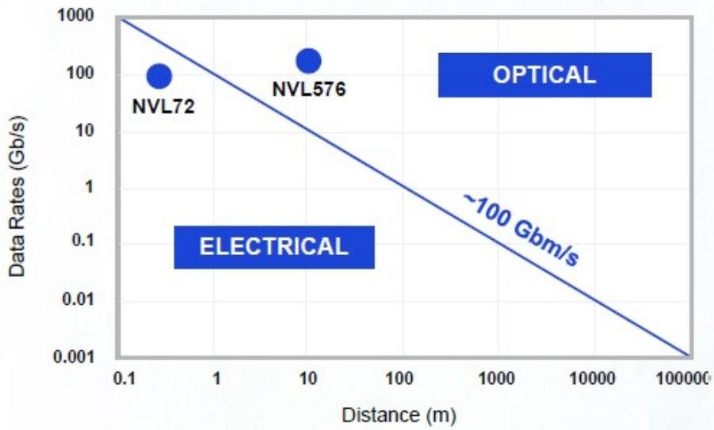

scatter

| Method     | Distance (m) | Data Rates (Gb/s) |
| ---------- | ------------ | ----------------- |
| NVL72      | 0.3          | 100               |
| NVL576     | 10           | 200               |
| ELECTRICAL | 0.3          | 0.1               |

Source: Corning

Corning laid out three drivers for optical content growth per GPU, each additive. The first is cluster size. As GPU clusters grow beyond roughly 130,000 GPUs, a third switching layer, the superspine, is required, adding approximately 50% more optical connections. The second is bandwidth growth. GPU and switch ASIC bandwidth doubles roughly every two years, and Corning links this to fiber demand through lane rate and lane count. The third, and largest, is the optical scale-up network. NVL576 introduces optical links between racks for the first time, creating a new category of fiber and photonics demand that did not exist in NVL72. Corning estimates that the combination of these three factors will grow optical content 1.3x to 1.5x per GPU through 2028. That is content growth per GPU, on top of GPU unit growth.

Exhibit 4: Corning estimates that optical content will increase 1.3x to 1.5x per GPU by 2028 

<table><tr><td>Technical Driver</td><td>Logic</td><td>Impact</td></tr><tr><td>Cluster Size Growth</td><td>Cluster size &gt;130k GPUs will require an additional optical layer</td><td>+</td></tr><tr><td>Bandwidth (BW) Growth</td><td>GPU and ASIC BW doubles every ~2 years... we link them through lane rate and number of lanes</td><td>= +</td></tr><tr><td>Scale Up Network</td><td>This is a whole new optical opportunity</td><td>+ + +</td></tr></table>

Source: Corning

# Framing the opportunity for Soitec and Besi

Fibers carry the signal, while photonic ICs, or PICs, sit within the optical engines at each end. This allows us to model Soitec content and Besi's hybrid bonding opportunity, at least directionally, through Corning's views on fiber expansion. Before diving deeper into the model drivers, we first recap how Soitec and Besi are exposed to the theme.

Soitec's Photonics SOI wafers are used for the fabrication of silicon photonics IC's (SiPho PICs) that, together with an Electric Integrated Circuit (EIC) form the optical engine (OE). An optical engine is the core functional unit that converts electrical signals into optical signals and vice versa. It is the fundamental building block of any optical transceiver, whether that transceiver takes the form of a pluggable module, on-board optics, or co-packaged optics. The PIC handles the optical functions: modulation (encoding data onto light), detection (reading incoming light), waveguiding (routing light on-chip), and coupling to external fiber. The EIC drives the laser, amplifies signals from the photodetector and interfaces electrically with the host ASIC or SerDes. Soitec's Photonics SOI are the material of choice for foundries like Global Foundries, Tower Semiconductor and TSMC to create the PICs. Soitec has a dominant share, especially on the larger wafer sizes (300mm) that are increasingly preferred by the industry.

Exhibit 5: How Soitec's Photonics SOI enables PIC   

flowchart

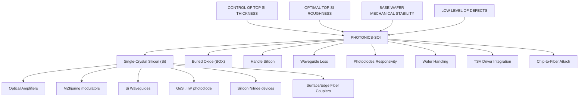

Source: Soitec

Besi's hybrid bonders are often used for the packaging process that integrates the EIC and PIC into a an optical engine. The OE itself is essentially the same functional block regardless of where it sits. What changes is how close it is to the switch ASIC and how it is packaged. In a pluggable transceiver, the OE sits in a front-panel module and relatively long electrical traces connect it to the networking chip or ASIC.

In CPO, the OE is co-packaged on the same substrate as the ASIC resulting in ultra-short electrical interconnects, often resulting 20-30% lower power per bit and lower latency. This requires tighter integration and is where TSMC's COUPE shines. COUPE is TSMC's Compact Universal Photonic Engine: a silicon-photonics platform for co-packaged optics, intended to move optical I/O closer to compute. It combines a silicon photonics wafer/PIC and EIC with advanced packaging, aiming for a smaller-footprint and high(est) performance. COUPE on substrate can deliver 4x better power efficiency and 90% lower latency, rising to 10x and 95% lower latency when integrated on an interposer. Hybrid bonding enters through TSMC SolC. COUPE uses SolC, or 3D stacking/hybrid bonding, to place the high-speed electronic IC directly onto a photonic IC, creating a compact “sandwich” of electronics and optics. Today, Besi is the sole provider of hybrid bonding tools to TSMC.

Exhibit 6: TSMC Coupe increases power efficiency and reduces latency through hybrid bonding   
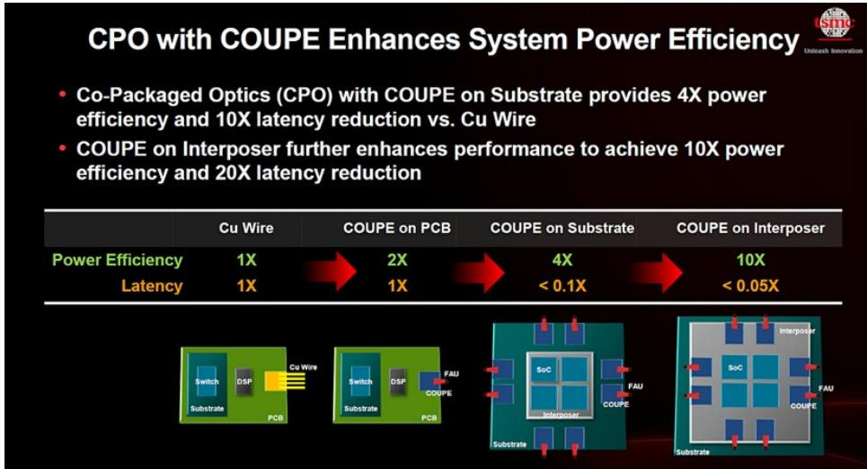

flowchart

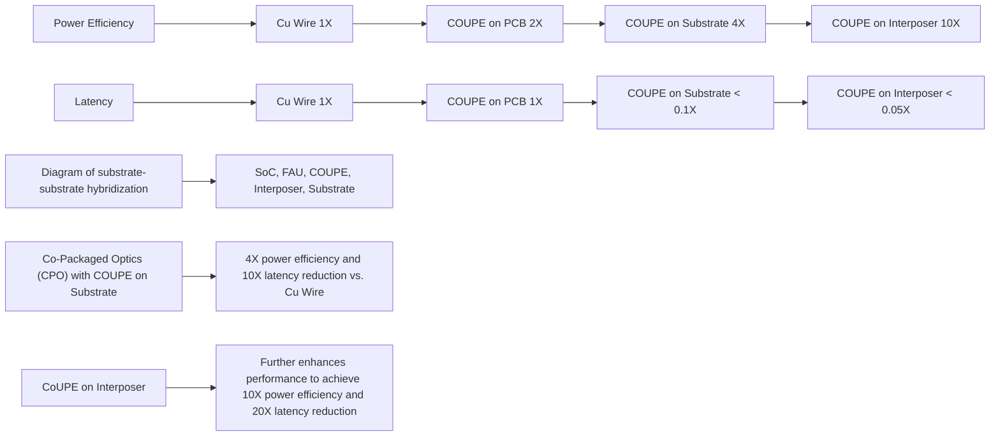

Source: TSMC

# We built a bottom-up model to calculate the addressable market for Soitec and Besi as the industry moves to co-packaged optics. The model leverages GPU and ASIC

assumptions from our sector teams, the AI transceiver model and our own read of NVIDIA and Corning architecture detail. The result is a bottom-up view of two revenue pools. For Soitec, the relevant measure is PIC demand on photonics SOI. For Besi, the relevant measure is hybrid bonding demand. We conclude that the number of Silicon Photonics based OE's rises sharply when the architecture moves from pluggable scale-out optics to CPO in both scale-out and scale-up. It is the cleanest bridge into Soitec because each optical engine contains a PIC. It is also relevant for Besi, although the read-across is less mechanical because bonding intensity depends on the packaging route.

# Developing a bottom-up model to size the opportunity

The main building blocks of our model are market growth assumptions around transceivers and GPU/XPU shipments. However, more important are the (mix of) architectures that are used in future AI datacenters as the number of OE's per AI accelerator varies sharply. Here is where most of our work has concentrated and is what is laid out in the paragraphs below.

Transceivers drive the near term, while CPO drives the bigger change from CY28. So far, pluggable, optical transceivers, used for rack-to-rack communications, have been the main source of demand and we expect that to continue in CY26/27. Although we forecast meaningful growth to continue we expect the shift to (hybrid) scale-up topologies to start to materially skew towards CPO by CY28e.

Exhibit 7: Although transceivers are expected to show healthy growth...   
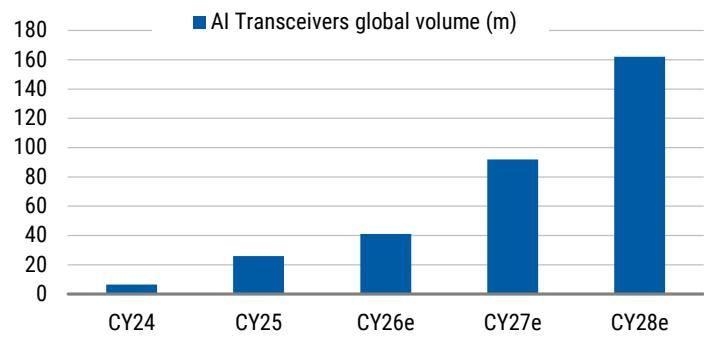

bar

AI Transceivers global volume (m)
| Year | AI Transceivers global volume (m) |
| :--- | :--- |
| CY24 | 6 |
| CY25 | 25 |
| CY26e | 40 |
| CY27e | 90 |
| CY28e | 160 |

Source: MS estimates (e)

Exhibit 8: ...the larger opportunity lies in the adoption of CPO   
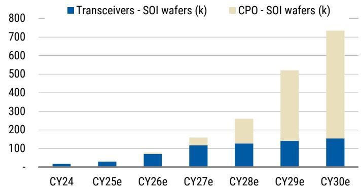

bar_stacked

| Year | Transceivers - SOI wafers (k) | CPO - SOI wafers (k) |
| :--- | :--- | :--- |
| CY24 | 15 | 0 |
| CY25e | 30 | 0 |
| CY26e | 70 | 0 |
| CY27e | 110 | 40 |
| CY28e | 120 | 130 |
| CY29e | 135 | 380 |
| CY30e | 150 | 550 |

Source: MS estimates (e)

Attach rate of optical engines per GPU moves sharply higher in CPO scale-up configurations. The sharp increase of OE's used in CPO is primarily driven by the much higher need of connections (OE's) per GPU in (hybrid) scale-up architectures as illustrated in the table below.

Today, the NVL72 (72 GPUs per rack) topology uses optical pluggable transceivers for inter-rack communications. Based on our assumptions this results in c.144 OE's per rack, or 2 (to 4) optical engines per GPU.

For Vera Rubin Ultra GPU's, NVIDIA introduces a NVL576 "hybrid" rack, which combines eight separate MGX NVL racks, each with 72 Rubin Ultra GPUs, all in a single 576-GPU NVLink domain with copper and direct optical connections. The two layer all-to-all NVLink topology will keep copper for communications inside the rack, but uses optical switches for high bandwidth communications across the domain (pod). The number of OE's per GPU moves sharply higher as a result, here we calculate an attach rate of c.17 OE's per GPU.

To scale beyond NVL576, a new MGX rack, NVIDIA Kyber, will be introduced. NVIDIA Kyber is the next-generation MGX NVL rack design that will double the NVLink domain per rack to fit 144 GPUs. NVIDIA Kyber will scale up into a massive all-to-all NVL1152 supercomputer using similar direct optical interconnects for rack-to-rack scale-up. We expect a "full CPO" option to become available, which will also use fibers to connect the GPU to the networking switch, resulting in a total of c.35 OE's per GPU.

We have assumed that SerDes speeds will again double in the years ahead, increasing the bandwidth per fiber/OE and resulting in an equivalent reduction in the need for connections. However, we note that in a scenario where Feynman uses full CPO (intra-rack, inter-rack and scale-out) on 200G SerDes, the number of OE's could double to 70 per GPU.

Exhibit 9: Assumptions and calculations of optical engines (OE's) per rack architecture 

<table><tr><td>Metric</td><td>NVL72 Optical Scale-Out</td><td>NVL576 Hybrid</td><td>NVL576 Full CPO</td><td>Feynman Hybrid 200G</td><td>Feynman Full CPO 400G</td><td>Feynman Full CPO 200G</td></tr><tr><td>Configuration</td><td>NVL72</td><td>NVL576</td><td>NVL576</td><td>NVL1152</td><td>NVL1152</td><td>NVL1152</td></tr><tr><td>Total GPUs</td><td>72</td><td>576</td><td>576</td><td>1,152</td><td>1,152</td><td>1,152</td></tr><tr><td>Racks</td><td>1</td><td>8</td><td>8</td><td>8</td><td>8</td><td>8</td></tr><tr><td>GPUs per rack</td><td>72</td><td>72</td><td>72</td><td>144</td><td>144</td><td>144</td></tr><tr><td>Low-latency domain</td><td>72</td><td>576</td><td>576</td><td>1,152</td><td>1,152</td><td>1,152</td></tr><tr><td>Scale-up BW/GPU (Tb/s)</td><td>N/A</td><td>14.4</td><td>14.4</td><td>28.8</td><td>28.8</td><td>28.8</td></tr><tr><td>Scale-out BW/GPU (Tb/s)</td><td>1.6T</td><td>1.6T</td><td>1.6T</td><td>3.2T</td><td>3.2T</td><td>3.2T</td></tr><tr><td>Scale-out oversubscription</td><td>2:1</td><td>1.5:1</td><td>1.5:1</td><td>1:1</td><td>1:1</td><td>1:1</td></tr><tr><td>SerDes (Gb/s)</td><td>100</td><td>200</td><td>200</td><td>200</td><td>400</td><td>200</td></tr><tr><td>Scale-up medium</td><td>Copper</td><td>Hybrid</td><td>CPO</td><td>Hybrid</td><td>CPO</td><td>CPO</td></tr><tr><td>Scale-out medium</td><td>Plug/CPO</td><td>Plug/CPO</td><td>Plug/CPO</td><td>CPO</td><td>CPO</td><td>CPO</td></tr><tr><td>Intra-rack OEs (A)</td><td>-</td><td>-</td><td>10,368</td><td>-</td><td>20,736</td><td>41,472</td></tr><tr><td>Inter-pod OEs (B)</td><td>-</td><td>9,072</td><td>9,072</td><td>36,288</td><td>18,144</td><td>36,288</td></tr><tr><td>Scale-out OEs (C)</td><td>144</td><td>768</td><td>768</td><td>2,304</td><td>1,152</td><td>2,304</td></tr><tr><td>Total OEs (pod)</td><td>144</td><td>9,840</td><td>20,208</td><td>38,592</td><td>40,032</td><td>80,064</td></tr><tr><td>OEs per rack</td><td>144</td><td>1,230</td><td>2,526</td><td>4,824</td><td>5,004</td><td>10,008</td></tr><tr><td>OEs per GPU</td><td>2</td><td>17</td><td>35</td><td>34</td><td>35</td><td>70</td></tr></table>

Source: NVIDIA, MS

The most important driver of the model is not the number of racks build, but rather the mix towards architectures with higher attach rates. As illustrated below, we assume that "Scale-out only" is pretty much the only architecture used in the market today. However, from CY27e, but especially in CY28e, we expect to see an accelerating shift towards hybrid and full CPO topologies, resulting in a sharp rise in demand for OE's.

Exhibit 10: We expect the networking mix to move towards higher attach rates due to increasing CPO adoption   
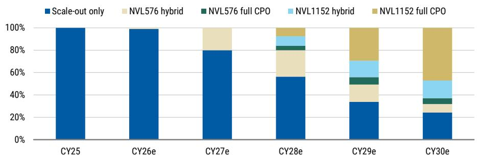

bar_stacked

| Year | Scale-out only (%) | NVL576 hybrid (%) | NVL576 full CPO (%) | NVL1152 hybrid (%) | NVL1152 full CPO (%) |
| :--- | :--- | :--- | :--- | :--- | :--- |
| CY25 | 100 | 0 | 0 | 0 | 0 |
| CY26e | 100 | 0 | 0 | 0 | 0 |
| CY27e | 80 | 20 | 0 | 0 | 0 |
| CY28e | 55 | 25 | 5 | 5 | 5 |
| CY29e | 33 | 15 | 5 | 15 | 30 |
| CY30e | 24 | 0 | 5 | 15 | 45 |

Source: MS estimates ()

As with all models, the devil is in the detail. In semis the direction of travel is often clear but the details are not and can have significant effects, especially when stacking assumptions. Besides the key drivers laid out above we have tried to factor in many more moving parts in our model, although we admit we likely still fall short. Examples of underlying assumption include an increase in SiPho penetration from c.32% in CY24 to c.80% by CY29, which we believe is broadly in-line with industry consensus. Other assumptions that are less easy to verify include those around process yield, die size, wafer price and, in the case of Besi process throughput for hybrid bonding.

Soitec Photonics revenue growth ties directly into increased need for low bandwidth networking. To a large extent our forecasts for Soitec's Photonic SOI revenues are the result of our modelling for optical engines laid out above. Although existing alternatives like EMLs and VCSEL will remain available and also new networking methodologies like OCS and MicroLED will likely take share we expect silicon photonics to grow into the

mainstream platform for datacenter communications. We expect to see continued growth in the near term with notable acceleration into CY27 and CY28 especially, which ties into CPO proliferation. By CY28 we model revenue of \$468m, or 44% of Soitec's revenue, and expect strong growth to continue towards CY29/30.

Exhibit 11: Soitec Photonic SOI revenue to accelerate towards CY28e and maintain strong growth thereafter   
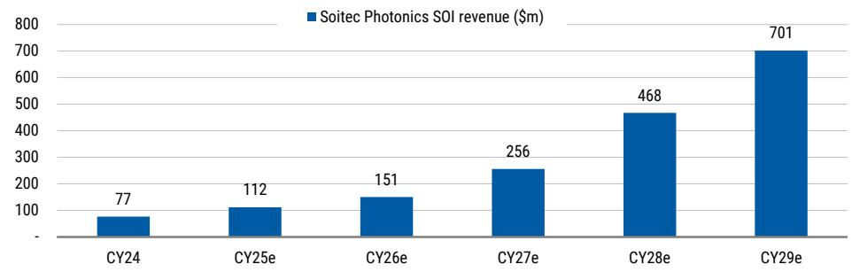

bar

Soitec Photonics SOI revenue ($m)
| Year | Soitec Photonics SOI revenue ($m) |
| :--- | :--- |
| CY24 | 77 |
| CY25e | 112 |
| CY26e | 151 |
| CY27e | 256 |
| CY28e | 468 |
| CY29e | 701 |

Source: Company data, MS estimates (e)

Besi's hybrid bonding opportunity is broader but less linear than Soitec's. CPO creates demand through optical engine assembly, but the output depends on whether suppliers use hybrid bonding and process throughput when they do. Here we believe our assumptions are at best in the right ballpark but are difficult to pin down with certainty. However, Besi's opportunity is not limited to CPO. NVIDIA has also announced that Feynman will use stacked die, which we believe will be using Besi's hybrid bonders. With increased conviction that NVIDIA is pushing the envelope on both GPU and switch, and supply chain checks that suggest increased confidence that hybrid bonding will start to be used for HBM4e 16-hi, we raise our estimates for hybrid bonding revenue for Besi to €633m by CY28, representing 40% of revenue in that year.

Exhibit 12: Besi hybrid bonding revenue   
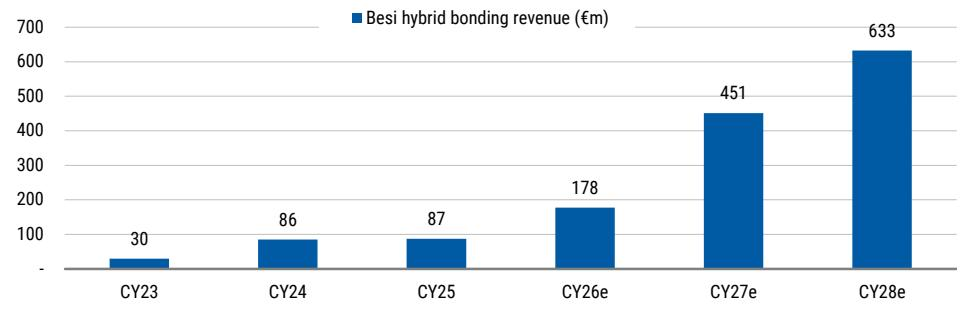

bar

Besi hybrid bonding revenue (€m)
| Year | Besi hybrid bonding revenue (€m) |
| :--- | :--- |
| CY23 | 30 |
| CY24 | 86 |
| CY25 | 87 |
| CY26e | 178 |
| CY27e | 451 |
| CY28e | 633 |

Source: MS

# Soitec - PT to €200, stay OW

Updating estimates on Photonics growth acceleration. We raise our Soitec estimates on higher photonics content, while leaving the rest of our assumptions broadly unchanged. Our CY28 revenue estimate increases to €1,066m from €998m, while our EPS estimate increases to €6.09 from €5.40 or 7% and 13%, respectively. The trajectory of the Photonics ramp is somewhat slower in the near term than we previously assumed and as a result or CY27 revenue/EPS come down by 5% and 13%, respectively. After our update our estimates are 25% and 55% above Visible Alpha consensus for CY27/28 respectively.

Exhibit 13: Soitec: Updated MSe estimates 

<table><tr><td rowspan="3"></td><td colspan="3">New</td><td colspan="3">Old</td><td colspan="3">New vs. Old</td></tr><tr><td>FY27e</td><td>FY28e</td><td>FY29e</td><td>FY27e</td><td>FY28e</td><td>FY29e</td><td>FY27e</td><td>FY28e</td><td>FY29e</td></tr><tr><td>CY26e</td><td>CY27e</td><td>CY28e</td><td>CY26e</td><td>CY27e</td><td>CY28e</td><td>CY26e</td><td>CY27e</td><td>CY28e</td></tr><tr><td>Revenue</td><td>597</td><td>767</td><td>1,066</td><td>611</td><td>784</td><td>998</td><td>-2.3%</td><td>-2.2%</td><td>6.9%</td></tr><tr><td>Revenue y/y</td><td>-37.6%</td><td>28.5%</td><td>39.0%</td><td>-36.1%</td><td>28.3%</td><td>27.2%</td><td>-1.5 ppt</td><td>0.2 ppt</td><td>11.7 ppt</td></tr><tr><td>Gross profit</td><td>133</td><td>242</td><td>426</td><td>143</td><td>255</td><td>377</td><td>-7%</td><td>-5%</td><td>13%</td></tr><tr><td>Gross margin</td><td>22.3%</td><td>31.6%</td><td>39.9%</td><td>23.4%</td><td>32.5%</td><td>37.7%</td><td>-115bps</td><td>-86bps</td><td>217bps</td></tr><tr><td>EBITDA</td><td>143</td><td>240</td><td>415</td><td>154</td><td>253</td><td>362</td><td>-7%</td><td>-5%</td><td>15%</td></tr><tr><td>EBITDA margin</td><td>24.0%</td><td>31.3%</td><td>38.9%</td><td>25.1%</td><td>32.2%</td><td>36.3%</td><td>-111bps</td><td>-87bps</td><td>261bps</td></tr><tr><td>EBIT</td><td>(1)</td><td>95</td><td>268</td><td>10</td><td>108</td><td>215</td><td>N/A</td><td>-11%</td><td>25%</td></tr><tr><td>EBIT margin</td><td>-0.1%</td><td>12.4%</td><td>25.1%</td><td>1.6%</td><td>13.7%</td><td>21.5%</td><td>-167bps</td><td>-128bps</td><td>356bps</td></tr><tr><td>EPS</td><td>(0.25)</td><td>2.01</td><td>6.09</td><td>(0.01)</td><td>2.30</td><td>5.40</td><td>N/A</td><td>-12.5%</td><td>12.9%</td></tr></table>

Source: MS estimates

Our price target moves to €200, stay OW. Our price target moves to €200, from €70 on a combination of drivers. The largest delta is the adjustment of the base year to CY28 from CY27 previously. We think this is warranted due to our higher conviction on Soitec' growth trajectory into CY30e and this allows us to better capture the future upside, without resorting to higher multiples. We discount our new 35x multiple by one year (effective multiple 32x). We believe that a higher multiple is warranted as we expect growth to persist at >20% beyond CY28. Our 13% higher estimates for CY28 account for the remainder. We stay OW.

Exhibit 14: Soitec bridge from previous to new PT   
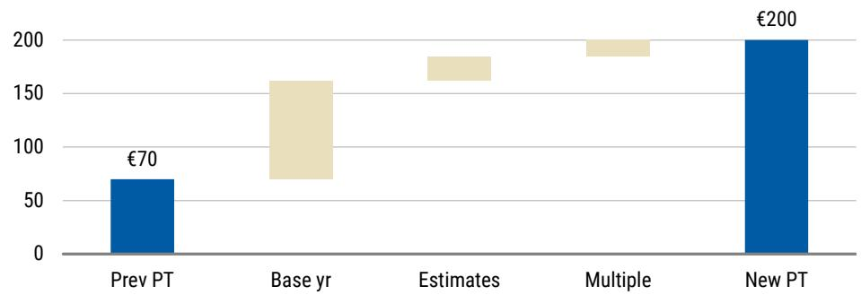

waterfall

| Category | Value (€) |
|---|---|
| Prev PT | 70 |
| Base yr | 160 |
| Estimates | 180 |
| Multiple | 190 |
| New PT | 200 |

Source: MS estimates

Our bull and bear cases move in tandem with our base case price target adjustment and move to €300 and €70 respectively.

# Besi - PT to €300, OW

We update our estimates post earnings and as we take a more optimistic view on CPO and HBM. We make material changes to our forecast for Besi. The 1Q26 beat and raise came off the back of record hybrid bonding orders that provides confidence in a much sharper trajectory going forward. This is supported by our work in this note that implies a cumulative need for >100 hybrid bonders in the CY26-CY30 period. Furthermore, our checks suggest that demand for hybrid bonding for HBM memory is increasingly certain to start with (low volume) production for HBM4e 16 high. As we remain optimistic on the company's mainstream business and see adoption of TCB accelerating (as underlined by results from peers) we move our revenue estimates higher by 11-30% over the '26-'28e period. Driving earnings higher by 21%-47%. Our updated estimates are 7% and 26% ahead of the Street for 2026 and 2027, respectively.

Exhibit 15: Besi: Updated MSe estimates 

<table><tr><td rowspan="2"></td><td colspan="3">New</td><td colspan="3">Old</td><td colspan="3">New vs. Old</td></tr><tr><td>FY26e</td><td>FY27e</td><td>FY28e</td><td>FY26e</td><td>FY27e</td><td>FY28e</td><td>FY26e</td><td>FY27e</td><td>FY28e</td></tr><tr><td>Hybrid Bonding</td><td>178</td><td>451</td><td>633</td><td>107</td><td>211</td><td>360</td><td>67%</td><td>114%</td><td>76%</td></tr><tr><td>TCB</td><td>10</td><td>110</td><td>120</td><td>10</td><td>51</td><td>68</td><td>0%</td><td>115%</td><td>76%</td></tr><tr><td>Core business</td><td>806</td><td>966</td><td>829</td><td>776</td><td>928</td><td>788</td><td>4%</td><td>4%</td><td>5%</td></tr><tr><td>Revenue</td><td>994</td><td>1,527</td><td>1,581</td><td>893</td><td>1,191</td><td>1,216</td><td>11%</td><td>28%</td><td>30%</td></tr><tr><td>Revenue y/y</td><td>68.1%</td><td>53.6%</td><td>3.5%</td><td>53.0%</td><td>37.7%</td><td>-2.6%</td><td>15.1 ppt</td><td>16 ppt</td><td>6.1 ppt</td></tr><tr><td>Gross profit</td><td>643</td><td>993</td><td>1,028</td><td>571</td><td>763</td><td>778</td><td>13%</td><td>30%</td><td>32%</td></tr><tr><td>Gross margin</td><td>64.7%</td><td>65.0%</td><td>65.0%</td><td>64.0%</td><td>64.5%</td><td>64.5%</td><td>72bps</td><td>50bps</td><td>50bps</td></tr><tr><td>Operating income</td><td>423</td><td>742</td><td>773</td><td>349</td><td>525</td><td>526</td><td>21%</td><td>41%</td><td>47%</td></tr><tr><td>Operating margin</td><td>42.6%</td><td>48.6%</td><td>48.9%</td><td>39.4%</td><td>45.3%</td><td>43.7%</td><td>315bps</td><td>335bps</td><td>516bps</td></tr><tr><td>EPS (diluted)</td><td>4.47</td><td>8.00</td><td>8.36</td><td>3.68</td><td>5.66</td><td>5.70</td><td>21%</td><td>42%</td><td>47%</td></tr></table>

Source: MS estimates

Raising our target to €300, stay OW. Our price target moves to €300 as we apply a 37x (from 35x) multiple to earnings power of €8 per share. Our target multiple moves up slightly on higher valuation across the semiconductor sector as well as increased visibility of the hybrid bonding opportunity for HBM. Our bull and bear case move in tandem to €400 and €135.

# Risk Reward – Soitec SA (SOIT.PA)

Providing the shovels for the PICs

# PRICE TARGET €200.00

We derive our €200 price target by applying a 35x multiple to our CY28e (fiscal '29 - March '29 year end) EPS estimate. We value Soitec on CY28e given increased visibility on the trajectory of growth for Photonics SOI, which we believe will be a multi-year growth story. We think the multiple is warranted due to our higher conviction on Soitec' growth trajectory into CY30e. We discount the 35x multiple by one year (effective multiple 32x).

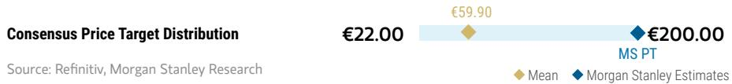

bar_line

| Category | Value     |
| -------- | --------- |
| Mean     | €59.90    |
| MS Estimates | €200.00   |

RISK REWARD CHART   
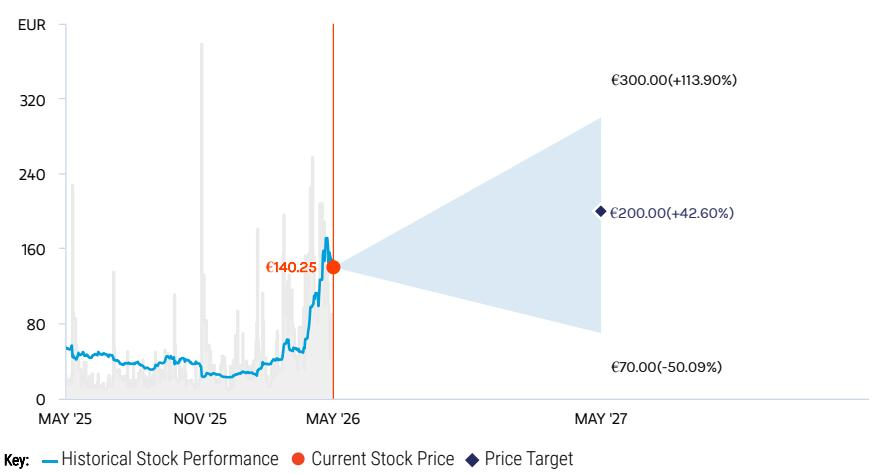

line

| Date       | Historical Stock Performance | Current Stock Price | Price Target |
| ---------- | ----------------------------- | ------------------- | ------------ |
| MAY '26    | €140.25                       | €140.25             | €140.25      |
| MAY '27    | €300.00 (+113.90%)           | €200.00 (+42.60%)   | €200.00 (-50.09%) |

Source: Refinitiv, MS

# OVERWEIGHT THESIS

Soitec is leveraged to silicon photonics through its near-monopoly in photonics SOI substrates, a critical input for PICs. As SiPh adoption scales in AI datacenters, substrate volumes and content rise. We see acceleration of demand with the introduction of CPO. With limited competition and strong pricing power, Soitec offers upstream, high-margin exposure to structural optical growth.

Consensus Rating Distribution   
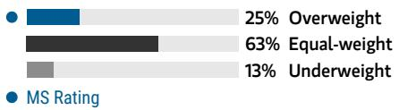

bar

| Category | Value (%) |
|---|---|
| Overweight | 25 |
| Equal-weight | 63 |
| Underweight | 13 |
| MS Rating | - |

Source: Refinitiv, MS

# Risk Reward Themes

Technology Diffusion: Positive

View descriptions of Risk Rewards Themes here

# BULL CASE

# €300.00

# BASE CASE

# €200.00

# BEAR CASE

# €70.00

# 40x CY28e (March end 2029) bull case EPS

Our bull case fair value is derived by applying a 40x target P/E multiple to our bull case CY28 (FY29) earnings estimates (discounted back by one year). For our bull case we assume a stronger recovery in RFSOI and more aggressive growth in Photonics SOI.

# 35x CY28e EPS (March end 2029)

We model a meaningful, multi-year growth trajectory in Photonics SOI as well as a normalisation in RFSOI. We apply a 35x P/E multiple to CY28 (FY29) (discounted back by one year) earnings given increased visibility on the Photonics SOI growth trajectory.

# 25x CY28e (March end 2029) bear-case EPS

Our bear case fair value is derived by applying a 25x (trough) target P/E multiple to our c.50% lower bear case CY28 (FY29) (discounted back by one year) EPS estimate. For our bear case we assume a slower recovery in RFSOI and more less growth in Photonics SOI.

# Risk Reward – Soitec SA (SOIT.PA)

KEY EARNINGS INPUTS 

<table><tr><td>Drivers</td><td>2025</td><td>2026e</td><td>2027e</td><td>2028e</td></tr><tr><td>Revenue growth (%)</td><td>(9)</td><td>(35)</td><td>3</td><td>28</td></tr><tr><td>EBIT margin (%)</td><td>13</td><td>(8)</td><td>(0)</td><td>12</td></tr><tr><td>FCF</td><td>(12)</td><td>(8)</td><td>125</td><td>116</td></tr></table>

# INVESTMENT DRIVERS

\- Execution on key KPIs: RF-SOI channel inventory reduction, Photonics growth and positive FCF by improved working capital management.

# GLOBAL REVENUE EXPOSURE

0-10% North America   
20-30% Europe ex UK   
60.70% APAC, ex Japan, Mainland   
60-70% China and India

Source: MS Estimate

View explanation of regional hierarchies here

# MS ALPHA MODELS

5/5

MOST

3 Month

Horizon

Source: Refinitiv, FactSet, MS; 1 is the highest favored Quintile and 5 is the least favored Quintile

# RISKS TO PT/RATING

# RISKS TO UPSIDE

• Further evidence of RF-SOI channel inventory reduction   
• Accelerating growth for Photonics SOI   
- Meaningful operating leverage on a largely fixed cost base

# RISKS TO DOWNSIDE

• Further expectations misses on RF-SOI in particular   
• Inconsistent messaging around KPI's   
- Growth drivers (photonics and POI) contributing less

# OWNERSHIP POSITIONING

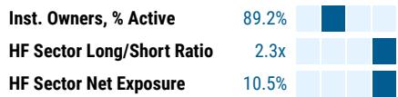

heatmap

| Category                  | Value  |
| ------------------------- | ------ |
| Inst. Owners, % Active    | 89.2%  |
| HF Sector Long/Short Ratio | 2.3x   |
| HF Sector Net Exposure    | 10.5%  |

Refinitiv; MSPB Content. Includes certain hedge fund exposures held with MSPB. Information may be inconsistent with or may not reflect broader market trends. Long/Short Ratio = Long Exposure / Short exposure. Sector % of Total Net Exposure = (For a particular sector: Long Exposure - Short Exposure) / (Across all sectors: Long Exposure – Short Exposure).

# MS ESTIMATES VS. CONSENSUS

FY Mar 2026e

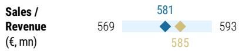

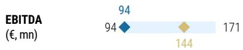

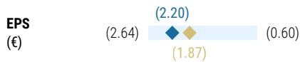

Mean

♦ MS Estimates

Source: Refinitiv, MS

# Risk Reward – BE Semiconductor Industries NV (BESI.AS)

Meaningful optics exposure underestimated by market

# PRICE TARGET €300.00

We apply a 37x multiple to FY27 earnings power of €8 per share. The multiple sits slightly ahead of the 5-year average P/E of 35x. We believe this is fair, given upside risk to hybrid bonding forecasts and against a backdrop of elevated valuations across the sector.

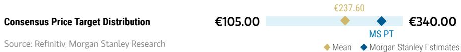

bar_line

| Category | Value     |
| -------- | --------- |
| Mean     | €237.60   |
| MS Estimates | €340.00   |

RISK REWARD CHART AND OPTIONS IMPLIED PROBABILITIES (12M)   
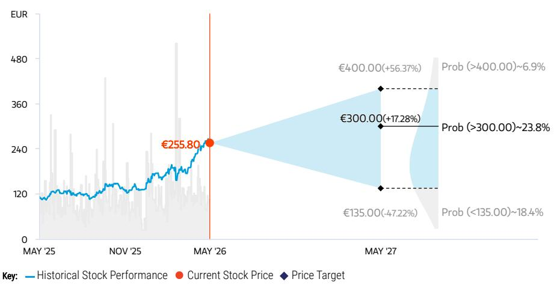

line

| Date     | Historical Stock Performance | Current Stock Price | Price Target Change |
| -------- | ----------------------------- | ------------------- | --------------------- |
| MAY '26  | €255.80                       | €255.80             | -                     |
| MAY '27  | -                             | -                   | €135.00 (-47.22%)    |
| MAY '27  | -                             | -                   | €300.00 (+17.28%)    |
| MAY '27  | -                             | -                   | €400.00 (+56.37%)   |
| MAY '27  | -                             | -                   | Prob (>400.00)      |
| MAY '27  | -                             | -                   | Prob (>300.00)      |
| MAY '27  | -                             | -                   | Prob (<135.00)      |
| MAY '27  | -                             | -                   | Prob (~18.4%)        |

Source: Refinitiv, MS, MS Institutional Equities Division. The probabilities of our Bull, Base, and Bear case scenarios playing out were estimated with implied volatility data from the options market as of 18 May 2026. All figures are approximate risk-neutral probabilities of the stock reaching beyond the scenario price in either three-months' or one-years' time. View explanation of Options Probabilities methodology here

# OVERWEIGHT THESIS

The set-up for Besi's core business has improved materially, evidenced by peers and customers guiding well ahead of expectations this earnings season.   
■ Accelerating hybrid bonding adoption has started to result in meaningful orders   
■ We have become more optimistic around adoption of hybrid bonding for HBM   
■ A valuation premium is warranted during periods of revenue acceleration.

Consensus Rating Distribution   
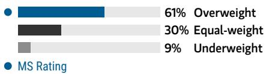

bar

| Category | Value (%) |
|---|---|
| Overweight | 61 |
| Equal-weight | 30 |
| Underweight | 9 |
MS Rating (implied by context)

Source: Refinitiv, MS

Risk Reward Themes 

<table><tr><td>Disruption:</td><td>Positive</td></tr><tr><td>New Data Era:</td><td>Positive</td></tr><tr><td>Secular Growth:</td><td>Positive</td></tr></table>

View descriptions of Risk Rewards Themes here

# BULL CASE

# Broad strength on 40x P/E

Our bull case reflects more optimism across the board. For the mainstream business we expect growth to be higher for longer. For TCB we expect Besi to gain a meaningful foothold while for HB we expect further upside from accelerated adoption. As a result our bull case EPS estimate is c. €10, 25% ahead of our base case, to which we apply a 40x multiple to derive a €400 fair value estimate

# €400.00

# BASE CASE

# €300.00

# Expect the (un)expected as we enter the upcycle

Our base case of €300 (37x estimated FY27 EPS) reflects strengthening momentum in the core business and acceleration in the adoption of hybrid bonding. Given Besi's industry-leading margin profile, we expect that the company should be able to generate strong earnings power of €8 per share. The 37x multiple we apply is slightly ahead of the 5yr average (c.35x) which we deem fair given elevated valuation across the sector.

# BEAR CASE

# €135.00

# Slower growth across the board

Our bear case reflects slower growth in the mainstream business and relatively lacklustre HB/TCB growth compared to our base case estimate resulting in c.30% lower estimates. We apply a 25x multiple to our FY27 EPS estimate to calculate a fair value of €135 in this scenario.

# Risk Reward – BE Semiconductor Industries NV (BESI.AS)

KEY EARNINGS INPUTS 

<table><tr><td>Drivers</td><td>2025</td><td>2026e</td><td>2027e</td><td>2028e</td></tr><tr><td>Revenue growth (%)</td><td>(3)</td><td>68</td><td>54</td><td>4</td></tr><tr><td>EBIT margin (%)</td><td>29</td><td>43</td><td>49</td><td>49</td></tr><tr><td>FCF</td><td>133</td><td>308</td><td>513</td><td>734</td></tr></table>

# INVESTMENT DRIVERS

- Observed strength by Besi and peers in packaging applications   
- Announcements by companies adopting hybrid bonding   
- Adoption of TCB by customers

# GLOBAL REVENUE EXPOSURE

0-10% MEA   
10-20% Europe ex UK   
10-20% North America   
• 30-40% APAC, ex Japan, Mainland   
- 50 - 40% China and India   
30-40% Mainland China

Source: MS Estimate View explanation of regional hierarchies here

# MS ALPHA MODELS

4/5

MOST

3 Month

Horizon

Source: Refinitiv, FactSet, MS; 1 is the highest favored Quintile and 5 is the least favored Quintile

# RISKS TO PT/RATING

# RISKS TO UPSIDE

- Faster adoption of hybrid bonding in HBM memory applications   
- Faster and stronger acceleration of Besi's core business   
- Higher multiple due to (perceived) structural elements

# RISKS TO DOWNSIDE

- Hybrid bonding adoption more limited than expected   
• Strength in core business fades   
• FX headwinds pressure margins

# OWNERSHIP POSITIONING

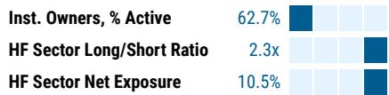

bar

| Category                  | Value  |
| ------------------------- | ------ |
| Inst. Owners, % Active    | 62.7%  |
| HF Sector Long/Short Ratio | 2.3x   |
| HF Sector Net Exposure    | 10.5%  |

Refinitiv; MSPB Content. Includes certain hedge fund exposures held with MSPB. Information may be inconsistent with or may not reflect broader market trends. Long/Short Ratio = Long Exposure / Short exposure. Sector % of Total Net Exposure = (For a particular sector: Long Exposure - Short Exposure) / (Across all sectors: Long Exposure – Short Exposure).

# MS ESTIMATES VS. CONSENSUS

FY Dec 2027e

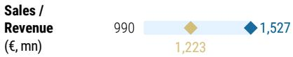

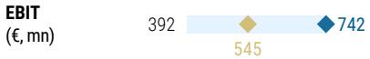

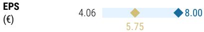  
◆ Mean ◆ MS Estimates   
Source: Refinitiv, MS

# Risk Reward Reference links

1. View explanation of Options Probabilities methodology -   
Options\_Probabilities\_Exhibit\_Link.pdf   
2. View descriptions of Risk Rewards Themes - RR\_Themes\_Exhibit\_Link.pdf   
3. View explanation of regional hierarchies - GEG\_Exhibit\_Link.pdf   
4. View explanation of Theme/Exposure methodology -   
ESG\_Sustainable\_Solutions\_External\_Link.pdf   
5. View explanation of HERS methodology - ESG\_HERS\_External\_Link.pdf

# Disclosure Section

The information and opinions in MS were prepared or are disseminated by MS Europe S.E., regulated by Bundesanstalt fuer Finanzdienstleistungsaufsicht (BaFin) and/or MS & Co. International plc, authorized by the Prudential Regulation Authority and regulated by the Financial Conduct Authority and the Prudential Regulation Authority. MS & Co. International plc disseminates in the UK research that it has prepared, and which has been prepared by any of its affiliates, only to persons who (i) are investment professionals falling within Article 19(5) of the Financial Services and Markets Act 2000 (Financial Promotion) Order 2005 (as amended, the "Order"); (ii) are persons who are high net worth entities falling within Article 49(2)(a) to (d) of the Order; or (iii) are persons to whom an invitation or inducement to engage in investment activity (within the meaning of section 21 of the Financial Services and Markets Act 2000, as amended) may otherwise lawfully be communicated or caused to be communicated. As used in this disclosure section, MS includes RMB MS Proprietary Limited, MS Europe S.E., MS & Co International plc and its affiliates.

For important disclosures, stock price charts and equity rating histories regarding companies that are the subject of this report, please see the MS Disclosure Website at www.morganstanley.com/eqr/disclosures/webapp/generalresearch, or contact your investment representative or MS at 1585 Broadway, (Attention: Research Management), New York, NY, 10036 USA.

For valuation methodology and risks associated with any recommendation, rating or price target referenced in this research report, please contact the Client Support Team as follows: US/Canada +1 800 303-2495; Hong Kong +852 2848-5999; Latin America +1 718 754-5444 (U.S.); London +44 (0)20-7425-8169; Singapore +65 6834-6860; Sydney +61 (0)2-9770-1505; Tokyo +81 (0)3-6836-9000. Alternatively you may contact your investment representative or MS at 1585 Broadway, (Attention: Research Management), New York, NY 10036 USA.

# Analyst Certification

The following analysts hereby certify that their views about the companies and their securities discussed in this report are accurately expressed and that they have not received and will not receive direct or indirect compensation in exchange for expressing specific recommendations or views in this report: Shawn Kim; Nigel van Putten; Lee Simpson; Terence Tsui.

# Global Research Conflict Management Policy

MS has been published in accordance with our conflict management policy, which is available at www.morganstanley.com/institutional/research/conflictpolicies. A Portuguese version of the policy can be found at www.morganstanley.com.br

# Important Regulatory Disclosures on Subject Companies

As of April 30, 2026, MS beneficially owned 1% or more of a class of common equity securities of the following companies covered in MS: Aixtron SE, ASML Holding NV, Infineon Technologies AG, Nordic Semiconductor ASA, Soitec SA, STMicroelectronics NV.

Within the last 12 months, MS managed or co-managed a public offering (or 144A offering) of securities of Aixtron SE.

Within the last 12 months, MS has received compensation for investment banking services from Aixtron SE, ASM International NV, BE Semiconductor Industries NV, STMicroelectronics NV.

In the next 3 months, MS expects to receive or intends to seek compensation for investment banking services from Aixtron SE, ASM International NV, ASML Holding NV, BE Semiconductor Industries NV, Infineon Technologies AG, Nordic Semiconductor ASA, Soitec SA, STMicroelectronics NV, VAT Group AG.

Within the last 12 months, MS has received compensation for products and services other than investment banking services from ASM International NV, BE Semiconductor Industries NV, Infineon Technologies AG.

Within the last 12 months, MS has provided or is providing investment banking services to, or has an investment banking client relationship with, the following company: Aixtron SE, ASM International NV, ASML Holding NV, BE Semiconductor Industries NV, Infineon Technologies AG, Nordic Semiconductor ASA, Soitec SA, STMicroelectronics NV, VAT Group AG.

Within the last 12 months, MS has either provided or is providing non-investment banking, securities-related services to and/or in the past has entered into an agreement to provide services or has a client relationship with the following company: Aixtron SE, ASM International NV, BE Semiconductor Industries NV, Infineon Technologies AG.

The equity research analysts or strategists principally responsible for the preparation of MS have received compensation based upon various factors, including quality of research, investor client feedback, stock picking, competitive factors, firm revenues and overall investment banking revenues. Equity Research analysts' or strategists' compensation is not linked to investment banking or capital markets transactions performed by MS or the profitability or revenues of particular trading desks.

MS and its affiliates do business that relates to companies/instruments covered in MS, including market making, providing liquidity, fund management, commercial banking, extension of credit, investment services and investment banking. MS sells to and buys from customers the securities/instruments of companies covered in MS on a principal basis. MS may have a position in the debt of the Company or instruments discussed in this report. MS trades or may trade as principal in the debt securities (or in related derivatives) that are the subject of the debt research report.

Certain disclosures listed above are also for compliance with applicable regulations in non-US jurisdictions.

# STOCK RATINGS

MS uses a relative rating system using terms such as Overweight, Equal-weight, Not-Rated or Underweight (see definitions below). MS does not assign ratings of Buy, Hold or Sell to the stocks we cover. Overweight, Equal-weight, Not-Rated and Underweight are not the equivalent of buy, hold and sell. Investors should carefully read the definitions of all ratings used in MS. In addition, since MS contains more complete information concerning the analyst's views, investors should carefully read MS, in its entirety, and not infer the contents from the rating alone. In any case, ratings (or research) should not be used or relied upon as investment advice. An investor's decision to buy or sell a stock should depend on individual circumstances (such as the investor's existing holdings) and other considerations.

# Global Stock Ratings Distribution

(as of April 30, 2026)

The Stock Ratings described below apply to MS's Fundamental Equity Research and do not apply to Debt Research produced by the Firm.

For disclosure purposes only (in accordance with FINRA requirements), we include the category headings of Buy, Hold, and Sell alongside our ratings of Overweight, Equal-weight, Not-Rated and Underweight. MS does not assign ratings of Buy, Hold or Sell to the stocks we cover. Overweight, Equal-weight, Not-Rated and Underweight are not the equivalent of buy, hold, and sell but represent recommended relative weightings (see definitions below). To satisfy regulatory requirements, we correspond Overweight, our most positive stock rating, with a buy recommendation; we correspond Equal-weight and Not-Rated to hold and Underweight to sell recommendations, respectively.

<table><tr><td></td><td colspan="2">Coverage Universe</td><td colspan="3">Investment Banking Clients (IBC)</td><td colspan="2">Other Material Investment ServicesClients (MISC)</td></tr><tr><td>Stock RatingCategory</td><td>Count</td><td>% of Total</td><td>Count</td><td>% of Total IBC</td><td>% of RatingCategory</td><td>Count</td><td>% of Total OtherMISC</td></tr><tr><td>Overweight/Buy</td><td>1546</td><td>42%</td><td>467</td><td>51%</td><td>30%</td><td>709</td><td>44%</td></tr><tr><td>Equal-weight/Hold</td><td>1568</td><td>43%</td><td>358</td><td>39%</td><td>23%</td><td>715</td><td>44%</td></tr><tr><td>Not-Rated/Hold</td><td>4</td><td>0%</td><td>0</td><td>0%</td><td>0%</td><td>1</td><td>0%</td></tr><tr><td>Underweight/Sell</td><td>555</td><td>15%</td><td>84</td><td>9%</td><td>15%</td><td>202</td><td>12%</td></tr><tr><td>Total</td><td>3,673</td><td></td><td>909</td><td></td><td></td><td>1627</td><td></td></tr></table>

Data include common stock and ADRs currently assigned ratings. Investment Banking Clients are companies from whom MS received investment banking compensation in the last 12 months. Due to rounding off of decimals, the percentages provided in the "% of total" column may not add up to exactly 100 percent.

# Analyst Stock Ratings

Overweight (O). The stock's total return is expected to exceed the average total return of the analyst's industry (or industry team's) coverage universe, on a risk-adjusted basis, over the next 12-18 months.

Equal-weight (E). The stock's total return is expected to be in line with the average total return of the analyst's industry (or industry team's) coverage universe, on a risk-adjusted basis, over the next 12-18 months.

Not-Rated (NR). Currently the analyst does not have adequate conviction about the stock's total return relative to the average total return of the analyst's industry (or industry team's) coverage universe, on a risk-adjusted basis, over the next 12-18 months.

Underweight (U). The stock's total return is expected to be below the average total return of the analyst's industry (or industry team's) coverage universe, on a risk-adjusted basis, over the next 12-18 months.

Unless otherwise specified, the time frame for price targets included in MS is 12 to 18 months.

# Analyst Industry Views

Attractive (A): The analyst expects the performance of his or her industry coverage universe over the next 12-18 months to be attractive vs. the relevant broad market benchmark, as indicated below.

In-Line (I): The analyst expects the performance of his or her industry coverage universe over the next 12-18 months to be in line with the relevant broad market benchmark, as indicated below. Cautious (C): The analyst views the performance of his or her industry coverage universe over the next 12-18 months with caution vs. the relevant broad market benchmark, as indicated below. Benchmarks for each region are as follows: North America - S&P 500; Latin America - relevant MSCI country index or MSCI Latin America Index; Europe - MSCI Europe; Japan - TOPIX; Asia - relevant MSCI country index or MSCI sub-regional index or MSCI AC Asia Pacific ex Japan Index.

Stock Price, Price Target and Rating History (See Rating Definitions)

BE Semiconductor Industries NV (BESI.AS) - As of 05/18/26 GMT in EUR
Industry : Technology - European Semiconductors   
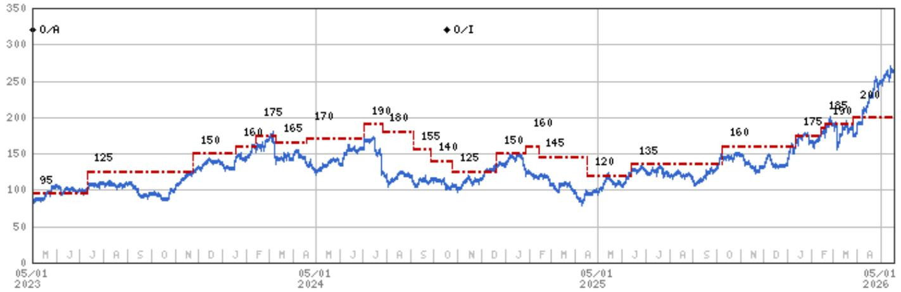

line

| Date       | Value |
| ---------- | ----- |
| 05/01 2023 | 95    |
|            | 125   |
|            | 150   |
|            | 160   |
|            | 175   |
|            | 165   |
|            | 170   |
|            | 190   |
|            | 180   |
|            | 155   |
|            | 140   |
|            | 125   |
|            | 150   |
|            | 160   |
|            | 145   |
|            | 120   |
|            | 135   |
|            | 160   |
|            | 175   |
|            | 185   |
|            | 190   |
|            | 200   |

Stock Rating History: 5/1/21 : NA/I; 12/15/21 : U/I; 2/8/22 : NA/I; 11/1/22 : NA/NR; 11/7/22 : O/A; 10/17/24 : O/I   
Price Target History: 12/15/21 : 70; 2/8/22 : NA; 11/7/22 : 75; 2/3/23 : 80; 2/23/23 : 85; 4/27/23 : 95; 7/10/23 : 125;   
11/24/23 : 150; 1/19/24 : 160; 2/13/24 : 175; 3/11/24 : 165; 4/19/24 : 170; 7/2/24 : 190; 7/26/24 : 180; 9/5/24 : 155; 9/27/24 : 140;   
10/25/24 : 125; 12/20/24 : 150; 1/27/25 : 160; 2/13/25 : 145; 4/17/25 : 120; 6/13/25 : 135; 10/9/25 : 160; 1/12/26 : 175;   
2/13/26 : 185; 2/19/26 : 190; 3/26/26 : 200   
Source: MS Date Format : MM/DD/YY Price Target = No Price Target Assigned (NA)   
Stock Price (Not Covered by Current Analyst) — Stock Price (Covered by Current Analyst)   
Stock and Industry Ratings (abbreviations below) appear as ♦ Stock Rating/Industry View   
Stock Ratings: Overweight (O) Equal-weight (E) Underweight (U) Not-Rated (NR) No Rating Available (NA)   
Industry View: Attractive (A) In-line (I) Cautious (C) No Rating (NR)   
Effective January 13, 2014, the stocks covered by MS Asia Pacific will be rated relative to the analyst's industry (or industry team's) coverage.   
Effective January 13, 2014, the industry view benchmarks for MS Asia Pacific are as follows: relevant MSCI country index or MSCI sub-regional index or MSCI AC Asia Pacific ex Japan Index.

Soitec SA (SOIT.PA) - As of 05/18/26 GMT in EUR
Industry : Technology - European Semiconductors   
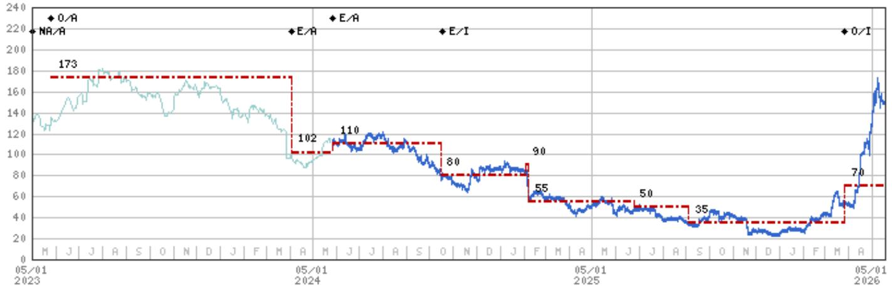

line

| Date       | Value |
| ---------- | ----- |
| 05/01      | 173   |
| 05/01      | 102   |
| 05/01      | 110   |
| 05/01      | 80    |
| 05/01      | 90    |
| 05/01      | 55    |
| 05/01      | 50    |
| 05/01      | 35    |
| 05/01      | 70    |
| 05/01      | NA/A  |

Stock Rating History: 5/1/21 : E/I; 12/6/21 : U/I; 2/6/22 : NA/I; 11/1/22 : NA/NR; 11/7/22 : NA/A; 5/25/23 : 0/A; 4/3/24 : E/A; 5/27/24 : E/A; 10/17/24 : E/I; 3/26/26 : 0/I   
Price Target History: 3/12/21 : 180; 6/14/21 : 195; 12/8/21 : 205; 2/8/22 : NA; 5/25/23 : 173; 4/3/24 : 102; 5/27/24 : 110; 10/15/24 : 80; 2/4/25 : 90; 2/7/25 : 55; 6/24/25 : 50; 9/4/25 : 35; 3/26/26 : 70   
Source: MS Date Format : MM/DD/YY Price Target = No Price Target Assigned (NA)   
Stock Price (Not Covered by Current Analyst) — Stock Price (Covered by Current Analyst)   
Stock and Industry Ratings (abbreviations below) appear as ♦ Stock Rating/Industry View   
Stock Ratings: Overweight (O) Equal-weight (E) Underweight (U) Not-Rated (NR) No Rating Available (NA)   
Industry View: Attractive (A) In-line (I) Cautious (C) No Rating (NR)   
Effective January 13, 2014, the stocks covered by MS Asia Pacific will be rated relative to the analyst's industry (or industry team's) coverage.   
Effective January 13, 2014, the industry view benchmarks for MS Asia Pacific are as follows: relevant MSCI country index or MSCI sub-regional index or MSCI AC Asia Pacific ex Japan Index.

# Important Disclosures for MS Smith Barney LLC Customers

Important disclosures regarding any material conflict of interest that can reasonably be expected to have influenced MS Smith Barney LLC's choice of a third-party research provider or the subject company of a third-party research report, are available on the MS Wealth Management disclosure website at www.morganstanley.com/online/researchdisclosures. For MS specific disclosures, you may refer to https://www.morganstanley.com/eqr/disclosures/webapp/generalresearch.

Each MS report is reviewed and approved on behalf of MS Smith Barney LLC. This review and approval is conducted by the same person who reviews the research report on behalf of MS. This could create a conflict of interest.

# Other Important Disclosures

MS policy is to update research reports as and when the Research Analyst and Research Management deem appropriate, based on developments with the issuer, the sector, or the market that may have a material impact on the research views or opinions stated therein. In addition, certain Research publications are intended to be updated on a regular periodic basis (weekly/monthly/quarterly/annual) and will ordinarily be updated with that frequency, unless the Research Analyst and Research Management determine that a different publication schedule is appropriate based on current conditions.

MS is not acting as a municipal advisor and the opinions or views contained herein are not intended to be, and do not constitute, advice within the meaning of Section 975 of the Dodd-Frank Wall Street Reform and Consumer Protection Act.

MS produces an equity research product called a "Tactical Idea." Views contained in a "Tactical Idea" on a particular stock may be contrary to the recommendations or views expressed in research on the same stock. This may be the result of differing time horizons, methodologies, market events, or other factors. For all research available on a particular stock, please contact your sales representative or go to Matrix at http://www.morganstanley.com/matrix.

MS is provided to our clients through our proprietary research portal on Matrix and also distributed electronically by MS to clients. Certain, but not all, MS products are also made available to clients through third-party vendors or redistributed to clients through alternate electronic means as a convenience. For access to all available MS, please contact your sales representative or go to Matrix at http://www.morganstanley.com/matrix.

Any access and/or use of MS is subject to MS's Terms of Use (http://www.morganstanley.com/terms.html). By accessing and/or using MS, you are indicating that you have read and agree to be bound by our Terms of Use (http://www.morganstanley.com/terms.html). In addition you consent to MS processing your personal data and using cookies in accordance with our Privacy Policy and our Global Cookies Policy (http://www.morganstanley.com/privacy\_pledge.html), including for the purposes of setting your preferences and to collect readership data so that we can deliver better and more personalized service and products to you. To find out more information about how MS processes personal data, how we use cookies and how to reject cookies see our Privacy Policy and our Global Cookies Policy (http://www.morganstanley.com/privacy\_pledge.html). Please use the provided link to review the Terms and Conditions and Most Important Terms and Conditions for MS India Company Private Limited (https://www.morganstanley.com/assets/pdfs/about-us-global-offices/india/Terms\_and\_conditions.pdf) and the following link to review the audit report (https://ny.matrix.ms.com/eqr/research/webapp/researchdocs/MSICPL\_Morgan\_Stanley\_Research\_Audit\_Report.pdf).

If you do not agree to our Terms of Use and/or if you do not wish to provide your consent to MS processing your personal data or using cookies please do not access our research. MS does not provide individually tailored investment advice. MS has been prepared without regard to the circumstances and objectives of those who receive it. MS recommends that investors independently evaluate particular investments and strategies, and encourages investors to seek the advice of a financial adviser. The appropriateness of an investment or strategy will depend on an investor's circumstances and objectives. The securities, instruments, or strategies discussed in MS may not be suitable for all investors, and certain investors may not be eligible to purchase or participate in some or all of them. MS is not an offer to buy or sell or the solicitation of an offer to buy or sell any security/instrument or to participate in any particular trading strategy. The value of and income from your investments may vary because of changes in interest rates, foreign exchange rates, default rates, prepayment rates, securities/instruments prices, market indexes, operational or financial conditions of companies or other factors. There may be time limitations on the exercise of options or other rights in securities/instruments transactions. Past performance is not necessarily a guide to future performance. Estimates of future performance are based on assumptions that may not be realized. If provided, and unless otherwise stated, the closing price on the cover page is that of the primary exchange for the subject company's securities/instruments.

The fixed income research analysts, strategists or economists principally responsible for the preparation of MS have received compensation based upon various factors, including quality, accuracy and value of research, firm profitability or revenues (which include fixed income trading and capital markets profitability or revenues), client feedback and competitive factors. Fixed Income Research analysts', strategists' or economists' compensation is not linked to investment banking or capital markets transactions performed by MS or the profitability or revenues of particular trading desks.

The "Important Regulatory Disclosures on Subject Companies" section in MS lists all companies mentioned where MS owns 1% or more of a class of common equity securities of the companies. For all other companies mentioned in MS, MS may have an investment of less than 1% in securities/instruments or derivatives of securities/instruments of companies and may trade them in ways different from those discussed in MS. Employees of MS not involved in the preparation of MS may have investments in securities/instruments or derivatives of securities/instruments of companies mentioned and may trade them in ways different from those discussed in MS. Derivatives may be issued by MS or associated persons.

With the exception of information regarding MS, MS is based on public information. MS makes every effort to use reliable, comprehensive information, but we make no representation that it is accurate or complete. We have no obligation to tell you when opinions or information in MS change apart from when we intend to discontinue equity research coverage of a subject company. Facts and views presented in MS have not been reviewed by, and may not reflect information known to, professionals in other MS business areas, including investment banking personnel.

MS personnel may participate in company events such as site visits and are generally prohibited from accepting payment by the company of associated expenses unless pre-approved by authorized members of Research management.

MS may make investment decisions that are inconsistent with the recommendations or views in this report.

To our readers based in Taiwan or trading in Taiwan securities/instruments: Information on securities/instruments that trade in Taiwan is distributed by MS Taiwan Limited ("MSTL"). Such information is for your reference only. The reader should independently evaluate the investment risks and is solely responsible for their investment decisions. MS may not be distributed to the public media or quoted or used by the public media without the express written consent of MS. Any non-customer reader within the scope of Article 7-1 of the Taiwan Stock Exchange Recommendation Regulations accessing and/or receiving MS is not permitted to provide MS to any third party (including but not limited to related parties, affiliated companies and any other third parties) or engage in any activities regarding MS which may create or give the appearance of creating a conflict of interest. Information on securities/instruments that do not trade in Taiwan is for informational purposes only and is not to be construed as a recommendation or a solicitation to trade in such securities/instruments. MSTL may not execute transactions for clients in these securities/instruments.

MS is not incorporated under PRC law and the research in relation to this report is conducted outside the PRC. MS does not constitute an offer to sell or the solicitation of an offer to buy any securities in the PRC. PRC investors shall have the relevant qualifications to invest in such securities and shall be responsible for obtaining all relevant approvals, licenses, verifications and/or registrations from the relevant governmental authorities themselves. Neither this report nor any part of it is intended as, or shall constitute, provision of any consultancy or advisory service of securities investment as defined under PRC law. Such information is provided for your reference only.

MS is disseminated in Brazil by MS C.T.V.M. S.A. located at Av. Brigadeiro Faria Lima, 3600, 6th floor, São Paulo - SP, Brazil; and is regulated by the Comissão de Valores Mobiliários; in Mexico by MS México, Casa de Bolsa, S.A. de C.V which is regulated by Comision Nacional Bancaria y de Valores. Paseo de los Tamarindos 90, Torre 1, Col. Bosques de las Lomas Floor 29, 05120 Mexico City; in Japan by MS MUFG Securities Co., Ltd. and, for Commodities related research reports only, MS Capital Group Japan Co., Ltd; in Hong Kong by MS Asia Limited (which accepts responsibility for its contents) and by MS Bank Asia Limited; in Singapore by MS Asia (Singapore) Pte. (Registration number 199206298Z) and/or MS Asia (Singapore) Securities Pte Ltd (Registration number 200008434H), regulated by the Monetary Authority of Singapore (which accepts legal responsibility for its contents and should be contacted with respect to any matters arising from, or in connection with, MS) and by MS Bank Asia Limited, Singapore Branch (Registration number T14FC0118); in Australia to "wholesale clients" within the meaning of the Australian Corporations Act by MS Australia Limited A.B.N. 67 003 734 576, holder of Australian financial services license No. 233742, which accepts responsibility for its contents; in Australia to "wholesale clients" and "retail clients" within the meaning of the Australian Corporations Act by MS Wealth Management Australia Pty Ltd (A.B.N. 19 009 145 555, holder of Australian financial services license No. 240813, which accepts responsibility for its contents; in Korea by MS & Co International plc, Seoul Branch; in India by MS India Company Private Limited having Corporate Identification No (CIN) U22990MH1998PTC115305, regulated by the Securities and Exchange Board of India ("SEBI") and holder of licenses as a Research Analyst (SEBI Registration No. INH000001105); Stock Broker (SEBI Stock Broker Registration No. INZ000244438), Merchant Banker (SEBI Registration No. INM000011203), and depository participant with National Securities Depository Limited (SEBI Registration No. IN-DP-NSDL-567-2021) having registered office at Altimus, Level 39 & 40, Pandurang Budhkar Marg, Worli, Mumbai 400018, India; Telephone no. +91-22-61181000; Compliance Officer Details: Mr. Tejarshi Hardas, Tel. No.: +91-22-61181000 or Email: tejarshi.hardas@morganstanley.com; Grievance officer details: Mr. Tejarshi Hardas, Tel. No.: +91-22-61181000 or Email: msic-compliance@morganstanley.com. MS India Company Private Limited (MSICPL) may use AI tools in providing research services. All recommendations contained herein are made by the duly qualified research analysts; in Canada by MS Canada Limited; in Germany and the European Economic Area where required by MS Europe S.E., authorised and regulated by Bundesanstalt fuer Finanzdienstleistungsaufsicht (BaFin) under the reference number 149169; in the US by MS & Co. LLC, which accepts responsibility for its contents. MS & Co. International plc, authorized by the Prudential Regulation Authority and regulated by the Financial Conduct Authority and the Prudential Regulation Authority, disseminates in the UK research that it has prepared, and research which has been prepared by any of its affiliates, only to persons who (i) are investment professionals falling within Article 19(5) of the Financial Services and Markets Act 2000 (Financial Promotion) Order 2005 (as amended, the "Order"); (ii) are persons who are high net worth entities falling within Article 49(2)(a) to (d) of the Order; or (iii) are persons to whom an invitation or inducement to engage in investment activity (within the meaning of section 21 of the Financial Services and Markets Act 2000, as amended) may otherwise lawfully be communicated or caused to be communicated. RMB MS Proprietary Limited is a member of the JSE Limited and A2X (Pty) Ltd. RMB MS Proprietary Limited is a joint venture owned equally by MS International Holdings Inc. and RMB Investment Advisory (Proprietary) Limited, which is wholly owned by FirstRand Limited. The information in MS is being disseminated by MS Saudi Arabia, regulated by the Capital Market Authority in the Kingdom of Saudi Arabia, and is directed at Sophisticated investors only.

MS Hong Kong Securities Limited is the liquidity provider/market maker for securities of ASM International NV listed on the Stock Exchange of Hong Kong Limited. An updated list can be found on HKEx website: http://www.hkex.com.hk.

The information in MS is being communicated by MS & Co. International plc (DIFC Branch), regulated by the Dubai Financial Services Authority (the DFSA) or by MS & Co. International plc (ADGM Branch), regulated by the Financial Services Regulatory Authority Abu Dhabi (the FSRA), and is directed at Professional Clients only, as defined by the DFSA or the FSRA, respectively. The financial products or financial services to which this research relates will only be made available to a customer who we are satisfied meets the regulatory criteria of a Professional Client. A distribution of the different MS Research ratings or recommendations, in percentage terms for Investments in each sector covered, is available upon request from your sales representative.

The information in MS is being communicated by MS & Co. International plc (QFC Branch), regulated by the Qatar Financial Centre Regulatory Authority (the QFCRA), and is directed at business customers and market counterparties only and is not intended for Retail Customers as defined by the QFCRA.

As required by the Capital Markets Board of Turkey, investment information, comments and recommendations stated here, are not within the scope of investment advisory activity. Investment advisory service is provided exclusively to persons based on their risk and income preferences by the authorized firms. Comments and recommendations stated here are general in nature. These opinions may not fit to your financial status, risk and return preferences. For this reason, to make an investment decision by relying solely to this information stated here may not bring about outcomes that fit your expectations.

The trademarks and service marks contained in MS are the property of their respective owners. Third-party data providers make no warranties or representations relating to the accuracy, completeness, or timeliness of the data they provide and shall not have liability for any damages relating to such data. The Global Industry Classification Standard (GICS) was developed by and is the exclusive property of MSCI and S&P.

MS, or any portion thereof may not be reprinted, sold or redistributed without the written consent of MS.

Indicators and trackers referenced in MS may not be used as, or treated as, a benchmark under Regulation EU 2016/1011, or any other similar framework.

The issuers and/or fixed income products recommended or discussed in certain fixed income research reports may not be continuously followed. Accordingly, investors should regard those fixed income research reports as providing stand-alone analysis and should not expect continuing analysis or additional reports relating to such issuers and/or individual fixed income products. MS may hold, from time to time, material financial and commercial interests regarding the company subject to the Research report.

Registration granted by SEBI and certification from the National Institute of Securities Markets (NISM) in no way guarantee performance of the intermediary or provide any assurance of returns to investors. Investment in securities market are subject to market risks. Read all the related documents carefully before investing.

Stock Ratings are subject to change. Please see latest research for each company.   
\* Historical prices are not split adjusted.   
INDUSTRY COVERAGE: Technology - European Semiconductors 

<table><tr><td>COMPANY (TICKER)</td><td>RATING (AS OF)</td><td>PRICE* (05/18/2026)</td></tr><tr><td>Lee Simpson</td><td></td><td></td></tr><tr><td>ASML Holding NV (ASML.AS)</td><td>O (09/22/2025)</td><td>€1,264.40</td></tr><tr><td>Infineon Technologies AG (IFXGn.DE)</td><td>O (02/06/2025)</td><td>€66.33</td></tr><tr><td>STMicroelectronics NV (STMPA.PA)</td><td>O (03/26/2026)</td><td>€52.42</td></tr><tr><td colspan="3">Nigel van Putten</td></tr><tr><td>Aixtron SE (AIXGn.DE)</td><td>E (05/25/2023)</td><td>€50.36</td></tr><tr><td>ASM International NV (ASMI.AS)</td><td>O (06/19/2024)</td><td>€844.60</td></tr><tr><td>BE Semiconductor Industries NV (BESI.AS)</td><td>O (11/07/2022)</td><td>€255.80</td></tr><tr><td>Melexis N.V. (MLXS.BR)</td><td>E (02/05/2026)</td><td>€78.25</td></tr><tr><td>Nordic Semiconductor ASA (NOD.OL)</td><td>E (02/10/2025)</td><td>NKr 201.20</td></tr><tr><td>Soitec SA (SOIT.PA)</td><td>O (03/26/2026)</td><td>€140.25</td></tr><tr><td>VAT Group AG (VACN.S)</td><td>E (03/21/2025)</td><td>SFr 586.80</td></tr></table>

© 2026 MS