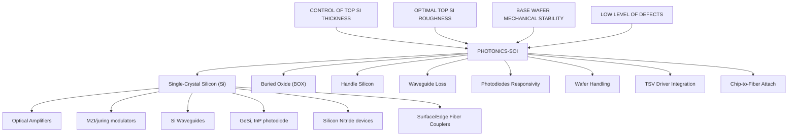

你是资深小红书内容策划 + 投研翻译官，擅长把英文/中文研报改写成高互动、可收藏、可转发的中文小红书笔记。

【目标】
- 把下面的研报解析内容，改写成一篇中文小红书笔记。
- 风格：投研博主风：信息密度高，但像给朋友讲逻辑
- 长度：约 850 字，允许上下浮动 15%。
- emoji 密度：中

【必须输出的结构】
1. 第一行：标题，20 字以内，不要像论文标题，也不要用夸张极限词。
2. 第二行：封面短标题，10 字以内，适合放在图中间。
3. 第三行：封面副标题，10-18 字，短句。
4. 正文分段清晰，每段不超过 3 行，可以用编号、小标题或加粗。
5. 正文要自然呈现观点，但不要暴露写作框架或思考过程。
6. 末尾可以保留 2-4 个相关标签，只允许从这些标签里选择：`#学习笔记`、`#研究笔记`、`#学习研究`、`#研报解读`。

【严禁输出】
- 不要出现这些栏目名或类似栏目名：`一句话结论`、`我最想提醒的一点`、`配图建议`、`免责声明`、`非投资建议`、`仅做学习交流`、`仅作学习交流`。
- 不要在正文最后追加配图建议，不要告诉我第 2/3/4 张图怎么配文。
- 不要输出任何包含“投资”的免责声明，也不要输出“非投资建议”这种表述。
- 不要输出财经敏感标签：`#投资学习`、`#财经`、`#金融`、`#股票`、`#基金`、`#理财`。
- 不要输出无关标签：`#小红书笔记`、`#笔记分享`、`#干货分享`。
- 不要写“关注”“点赞”“求关注”“评论区见”“评论区留言”等直接互动诱导；可以写“欢迎一起讨论”“可以继续交流”。

【平台发布合规要求】
- 不要写“爆款”“震惊”“必看”“必读”“最强”“最全”“唯一”“全网首发”等极限词或夸张词。
- 不要写“投资建议”“买入”“卖出”“强烈推荐”“稳赚”“保本”“必涨”“抄底”“上车”“内幕”“翻倍”等金融操作或收益承诺表达。
- “投资”相关词尽量改成“投研”“研究”“观察”“学习参考”；如果必须保留，也要放在中性语境里。
- 不要承诺收益，不要引导交易，不要暗示确定性结果。

【内容要求】
- 只能基于研报原文和解析结果推导，不要编造数据、公司动作、引用。
- 可以把专业表达翻成人话，但不能扭曲意思。
- 遇到不确定或缺失信息：用“研报未给出”或“这里是推测”明确标注。
- 默认避免出现具体投行品牌名，比如“GS”“GS”，统一写作“投行研报”。
- 不要解释你的思考过程，不要输出多余说明。

【推荐写法】
- 开头直接给一个自然判断，不要加“结论：”标签。
- 中间用 1/2/3 拆逻辑，但小标题要像正常内容标题，不要像写作模板。
- 结尾可以留下一个自然讨论问题，但不要引导关注、点赞或评论。
- 最后一行输出 2-4 个标签，优先：`#学习笔记 #研究笔记 #学习研究 #研报解读`。

【研报解析内容】
"""
# Technology - European Semiconductors | Europe

# Framing the CPO opportunity for Soitec and Besi

WHAT'S CHANGED 

<table><tr><td>Soitec SA (SOIT.PA)</td><td>From</td><td>To</td></tr><tr><td>Price Target</td><td>€70.00</td><td>€200.00</td></tr><tr><td colspan="3">BE Semiconductor Industries NV (BESI.AS)</td></tr><tr><td>Price Target</td><td>€200.00</td><td>€300.00</td></tr></table>

Larger, more tightly coupled AI rack clusters should push optics deeper into the datacenter, lifting Soitec's Photonics SOI wafer content and Besi's hybrid bonding demand. Detailed modelling raises our conviction, resulting in material PT increases for both.

# Key Takeaways

■ Agentic systems increase the need for high bandwidth, low latency communication in the AI datacenter which may accelerate the penetration of photonics.   
The attach rate of optical engines per GPU may increase sharply, from c.2-4 in a single rack domain to >35 in a multi-rack architecture leveraging CPO.   
We built a detailed model to size the implications for Soitec and Besi and expect a material increase in addressable demand towards 2028.   
Soitec is the more direct beneficiary through Photonics SOI wafers. We raise CY28 revenue estimates as well as our PT, which moves to €200.   
- Besi benefits from CPO adoption as TSMC's COUPE leverages hybrid bonding. In addition, we expect increased use in future GPU and HBM generations. PT to €300.

Upcoming architectural changes in NVIDIA's rack-scale infrastructure, introduced with NVL576 and beyond, will create a material, multi-year benefit for both Soitec and Besi, in our view. We've been modelling the networking opportunity through growth of transceivers, but we now identify a much larger opportunity when co-packaged optics (CPO) starts to be used in the scale-up domain that is still dominated by copper connections. Using insights from Corning's recent investor meeting, we model a meaningful increase in the addressable market for Soitec's Photonic SOI technology. Besi should also benefit, as we expect a large proportion of this market, and especially NVIDIA, to use TSMC's COUPE architecture, which is enabled by Besi's hybrid bonding tools. In addition to networking, we see opportunities for adoption within GPU and HBM memory, where we had been more cautious previously. As a result, we raise our estimates for Soitec and Besi meaningfully and increase our price targets to €200 and €300, respectively, as we stay Overweight on both names.

MS & CO. INTERNATIONAL PLC+

# Nigel van Putten

Equity Analyst
Nigel.Putten@morganstanley.com +44 20 7425-2803

# Shawn Kim

Equity Analyst
Shawn.Kim@morganstanley.com +44 20 7677-1018

# Lee Simpson

Equity Analyst
Lee.Simpson@morganstanley.com +44 20 7425-3378

# Amelia M Scicluna

Research Associate
Amelia.Scicluna@morganstanley.com +44 20 7425-6694

# Terence Tsui

Equity Analyst
Terence.Tsui@morganstanley.com +44 20 7425-3095

# TECHNOLOGY - EUROPEAN SEMICONDUCTORS

Europe
Industry View In-Line

MS does and seeks to do business with companies covered in MS. As a result, investors should be aware that the firm may have a conflict of interest that could affect the objectivity of MS. Investors should consider MS as only a single factor in making their investment decision.

# For analyst certification and other important disclosures, refer to the Disclosure Section, located at the end of this report.

+= Analysts employed by non-U.S. affiliates are not registered with FINRA, may not be associated persons of the member and may not be subject to FINRA restrictions on communications with a subject company, public appearances and trading securities held by a research analyst account.

Corning's Investor Day points to a 10x increase in fiber content per GPU as data centres move to co-packaged optics. In photonic networking, fibers carry the light, but at each end sits an optical engine (OE), a package of an electronic and photonics chip, which converts electrical signals to light and electrical signals. The photonics chips are built on photonic integrated circuits (PIC) using Soitec's engineered photonics SOI wafers. Meanwhile, Besi's hybrid bonding tools are often (depending on the assembly process) used to package the electrical IC (EIC) on top of the PIC. Corning presented the opportunity in fibers (160 per GPU in a fully optical architecture versus 16 today), and in doing so, disclosed enough about the underlying switch architecture, lane counts and SerDes rates for us to calculate the number of optical engines required. That count maps closely on a near one-to-one basis to Soitec's addressable market for AI datacenter Photonics wafers and gives a useful indication of Besi's hybrid bonding opportunity.

Exhibit 1: We expect the optical engines attach rate per GPU to increase 10x in future configurations   

bar

| Category | Optical Engines per GPU |
|---|---|
| Current | 2 |
| Copper/CPO hybrid | 17 |
| Full CPO | 35 |
| CPO bull case | 70 |

Source: MS

# We estimate optical engines per GPU rise from c.2 to 4 today to 17 in NVL576 and potentially >35 in a fully optical configuration. Today's pre-CPO setup uses 2-

4 pluggable transceivers (two for the leaf, two for spine with oversubscription potentially reducing this number) per GPU, all in the scale-out network. NVL576 introduces co-packaged optics (CPO) for inter-rack scale-up traffic, lifting optical engine attach rate to c.17 per GPU, on our estimates. A fully optical variant, where the connection between GPU and the networking switch also moves to photonics, roughly doubles that to c.35. Looking ahead to Feynman architectures and Keyber rack architectures, OEs per-GPU could remain at that level if SerDes speeds move to 400G, but could double again if SerDes stays at 200G, which Corning CEO Wendell Weeks flagged as closer to the historical pattern.

Soitec benefits directly from rising silicon photonics content. Today, the company's exposure is largely limited to pluggable optics used in the inter-rack networking infrastructure. This is already contributing to growth within Soitec's photonics-related revenue, expected to have reached >\$100m (MSe: \$112m) in fiscal year '26 (March year-end), but remains modest relative to what we believe is about to emerge. With the introduction of CPO for scale-up, first in a hybrid and later in full CPO architectures, photonic SOI content is expected to significantly increase, driving an acceleration of growth in calendar years '27 and '28. As a result, we raise our Soitec estimates on the photonics upgrade, even as we leave the remainder of our assumptions broadly unchanged. We now model Photonics SOI revenue of

\$468m in CY28, up from \$387m previously, lifting our CY28 EPS forecast to €6.09 from €5.40. Our new PT of €200 applies a 35x multiple to CY28 earnings power, discounted by one year. The increase in our price target from €70 to €200 is a result of a combination of higher estimates, moving the base year to CY28 from CY27 and raising the multiple to 35x from 30x. We think the higher multiple is warranted due to our higher conviction on Soitec's growth trajectory into CY30e. The transition towards scale-up CPO architectures may start with early NVL576 hybrid racks in late '26 but we expect this design to move into mainstream adoption towards '28. In order to capture this development, which is supported by our detailed wafer model, we move to CY28 (fiscal '29 March end) as the base year for Soitec and discount by one year. For Besi, and other equipment companies in our coverage, we continue to use CY27 as our base year. Here, visibility on capex investment beyond '28, although directionally positive, remains somewhat limited.

Besi represents a second route into the CPO ramp. CPO should become an incremental growth driver for Besi's hybrid bonders because optical engines need advanced assembly. We expect TSMC's COUPE to become a leading integration route for the optical engine, especially at NVIDIA, which supports additional tool demand for Besi's hybrid bonders. From the Feynman GPU onwards, the opportunity broadens into stacked GPU dies, which we expect to use hybrid bonding, and into (custom) HBM, where we expect hybrid bonding to start in CY27 and widen thereafter. Applying a 37x (previously 35x) multiple to c.€8 CY27 earnings power gives our revised PT of €300. Our target multiple moves up slightly on higher valuation across the semiconductor sector as well as increased visibility of the hybrid bonding opportunity for HBM.

How to position for upcoming catalysts. Both companies have catalyst events in the coming weeks. Soitec will report its FY26 (March '26 year-end) on 27 May after close followed by an investor meeting on May 28 in Paris. Besides the print this event matters because it will be the first opportunity for new CEO Laurent Rémont to present to the market. We expect Mr Rémont to lay out an optimistic view but numbers are likely to be conservative and expressed in medium-term CAGRs. Against high expectations in the market we would position tactically cautious into this event. Besi will host its annual investor day on June 18 in Amsterdam. Here we expect the company to provide more detail on optical interconnect as a driver for its mainstream, hybrid bonding, and potentially thermo-compression bonding (TCB) tools. We also expect more colour on expectations around the introduction of hybrid bonding for HBM.

Inside the note, we provide insight into our detailed model that bridges GPU/ASIC and transceiver assumptions into Photonics SOI wafers and hybrid bonding tool capacity.

# Transceiver growth and increased CPO penetration bodes well for Soitec and Besi

Meaningful update to Transceiver forecasts. Our colleague covering Greater China Technology Hardware, Andy Meng, updated his transceiver forecasts last week Friday – see Global AI Transceivers: Industry Demand Likely to be Even Stronger. The team raised its AI transceiver shipment forecasts to 73m units from 53m in '26, to 141m units from 71m in '27, and to 150m from 80m for '28. The larger '27-'28 revisions mainly reflect a more positive view on 1.6T demand, and now forecasts the AI transceiver TAM to grow from US \$18 bn in 2025 to US\$102 bn in 2028, or >4x in three years. In the near term, we expect transceivers to be the main driver of growth for Silicon Photonics, benefiting Soitec's photonics SOI revenue line and Besi's mainstream business. However, from '27e onwards we expect the main contribution for each to shift to Co-Packaged Optics (CPO).

Exhibit 2: AI Transceivers global volume - Global market volume ('000 units)   

bar_stacked

| Year | 400G | 800G | 1.6T | 3.2T |
|---|---|---|---|---|
| 2023 | ~5,00 | 0 | 0 | 0 |
| 2024 | ~20,00 | ~5,00 | 0 | 0 |
| 2025 | ~20,00 | ~10,00 | 0 | 0 |
| 2026E | ~15,00 | ~45,00 | ~30,00 | 0 |
| 2027E | ~10,00 | ~75,00 | ~95,00 | 0 |
| 2028E | ~10,00 | ~75,00 | ~115,00 | ~15,00 |

Source: Companyy data, MS estimates (E)

# Insights from Corning's Investor Day

France's Soitec, a leader in manufacturing engineered substrates; Netherlands-based Besi, which develops leading edge assembly equipment; and Corning, the American multi-technology company (covered by Meta Marshall) seem mostly unrelated at first glance, but they overlap in Silicon Photonics. Corning's fibre discussion gives us a way to estimate optical engine demand, which then maps into Soitec's photonics SOI wafers. For Besi, the more relevant issue is the optical engine package, especially where the EIC is bonded directly on top of the PIC. Here the company's hybrid bonders are required when integration uses die to wafer hybrid bonding, which is the case for TSMC's COUPE, which we expect to emerge as one of the main CPO integration routes.

The scale-up opportunity starts when NVLink moves beyond one rack. Scale-up is the part of the AI cluster where GPUs work as one tightly connected system. NVL72 keeps that domain inside one rack, and NVL144 can still be managed through copper over relatively short distances. As model sizes, context windows and inference workloads grow, NVIDIA (and other providers of AI accelerators) needs larger pools of compute to share data at high bandwidth and low latency. That pushes the scale-up domain across racks, where copper reaches its distance limit and optical links become the practical answer.

Exhibit 3: NVL72 single rack platform at 100G within-rack links < 2m works with copper while multi-rack platform at 200G with links between racks >10m requires optical   

scatter

| Method     | Distance (m) | Data Rates (Gb/s) |
| ---------- | ------------ | ----------------- |
| NVL72      | 0.3          | 100               |
| NVL576     | 10           | 200               |
| ELECTRICAL | 0.3          | 0.1               |

Source: Corning

Corning laid out three drivers for optical content growth per GPU, each additive. The first is cluster size. As GPU clusters grow beyond roughly 130,000 GPUs, a third switching layer, the superspine, is required, adding approximately 50% more optical connections. The second is bandwidth growth. GPU and switch ASIC bandwidth doubles roughly every two years, and Corning links this to fiber demand through lane rate and lane count. The third, and largest, is the optical scale-up network. NVL576 introduces optical links between racks for the first time, creating a new category of fiber and photonics demand that did not exist in NVL72. Corning estimates that the combination of these three factors will grow optical content 1.3x to 1.5x per GPU through 2028. That is content growth per GPU, on top of GPU unit growth.

Exhibit 4: Corning estimates that optical content will increase 1.3x to 1.5x per GPU by 2028 

<table><tr><td>Technical Driver</td><td>Logic</td><td>Impact</td></tr><tr><td>Cluster Size Growth</td><td>Cluster size &gt;130k GPUs will require an additional optical layer</td><td>+</td></tr><tr><td>Bandwidth (BW) Growth</td><td>GPU and ASIC BW doubles every ~2 years... we link them through lane rate and number of lanes</td><td>= +</td></tr><tr><td>Scale Up Network</td><td>This is a whole new optical opportunity</td><td>+ + +</td></tr></table>

Source: Corning

# Framing the opportunity for Soitec and Besi

Fibers carry the signal, while photonic ICs, or PICs, sit within the optical engines at each end. This allows us to model Soitec content and Besi's hybrid bonding opportunity, at least directionally, through Corning's views on fiber expansion. Before diving deeper into the model drivers, we first recap how Soitec and Besi are exposed to the theme.

Soitec's Photonics SOI wafers are used for the fabrication of silicon photonics IC's (SiPho PICs) that, together with an Electric Integrated Circuit (EIC) form the optical engine (OE). An optical engine is the core functional unit that converts electrical signals into optical signals and vice versa. It is the fundamental building block of any optical transceiver, whether that transceiver takes the form of a pluggable module, on-board optics, or co-packaged optics. The PIC handles the optical functions: modulation (encoding data onto light), detection (reading incoming light), waveguiding (routing light on-chip), and coupling to external fiber. The EIC drives the laser, amplifies signals from the photodetector and interfaces electrically with the host ASIC or SerDes. Soitec's Photonics SOI are the material of choice for foundries like Global Foundries, Tower Semiconductor and TSMC to create the PICs. Soitec has a dominant share, especially on the larger wafer sizes (300mm) that are increasingly preferred by the industry.

Exhibit 5: How Soitec's Photonics SOI enables PIC   

flowchart

Source: Soitec

Besi's hybrid bonders are often used for the packaging process that integrates the EIC and PIC into a an optical engine. The OE itself is essentially the same functional block regardless of where it sits. What changes is how close it is 

[中间内容因长度限制已省略]

gan Stanley Proprietary Limited is a joint venture owned equally by MS International Holdings Inc. and RMB Investment Advisory (Proprietary) Limited, which is wholly owned by FirstRand Limited. The information in MS is being disseminated by MS Saudi Arabia, regulated by the Capital Market Authority in the Kingdom of Saudi Arabia, and is directed at Sophisticated investors only.

MS Hong Kong Securities Limited is the liquidity provider/market maker for securities of ASM International NV listed on the Stock Exchange of Hong Kong Limited. An updated list can be found on HKEx website: http://www.hkex.com.hk.

The information in MS is being communicated by MS & Co. International plc (DIFC Branch), regulated by the Dubai Financial Services Authority (the DFSA) or by MS & Co. International plc (ADGM Branch), regulated by the Financial Services Regulatory Authority Abu Dhabi (the FSRA), and is directed at Professional Clients only, as defined by the DFSA or the FSRA, respectively. The financial products or financial services to which this research relates will only be made available to a customer who we are satisfied meets the regulatory criteria of a Professional Client. A distribution of the different MS Research ratings or recommendations, in percentage terms for Investments in each sector covered, is available upon request from your sales representative.

The information in MS is being communicated by MS & Co. International plc (QFC Branch), regulated by the Qatar Financial Centre Regulatory Authority (the QFCRA), and is directed at business customers and market counterparties only and is not intended for Retail Customers as defined by the QFCRA.

As required by the Capital Markets Board of Turkey, investment information, comments and recommendations stated here, are not within the scope of investment advisory activity. Investment advisory service is provided exclusively to persons based on their risk and income preferences by the authorized firms. Comments and recommendations stated here are general in nature. These opinions may not fit to your financial status, risk and return preferences. For this reason, to make an investment decision by relying solely to this information stated here may not bring about outcomes that fit your expectations.

The trademarks and service marks contained in MS are the property of their respective owners. Third-party data providers make no warranties or representations relating to the accuracy, completeness, or timeliness of the data they provide and shall not have liability for any damages relating to such data. The Global Industry Classification Standard (GICS) was developed by and is the exclusive property of MSCI and S&P.

MS, or any portion thereof may not be reprinted, sold or redistributed without the written consent of MS.

Indicators and trackers referenced in MS may not be used as, or treated as, a benchmark under Regulation EU 2016/1011, or any other similar framework.

The issuers and/or fixed income products recommended or discussed in certain fixed income research reports may not be continuously followed. Accordingly, investors should regard those fixed income research reports as providing stand-alone analysis and should not expect continuing analysis or additional reports relating to such issuers and/or individual fixed income products. MS may hold, from time to time, material financial and commercial interests regarding the company subject to the Research report.

Registration granted by SEBI and certification from the National Institute of Securities Markets (NISM) in no way guarantee performance of the intermediary or provide any assurance of returns to investors. Investment in securities market are subject to market risks. Read all the related documents carefully before investing.

Stock Ratings are subject to change. Please see latest research for each company.   
\* Historical prices are not split adjusted.   
INDUSTRY COVERAGE: Technology - European Semiconductors 

<table><tr><td>COMPANY (TICKER)</td><td>RATING (AS OF)</td><td>PRICE* (05/18/2026)</td></tr><tr><td>Lee Simpson</td><td></td><td></td></tr><tr><td>ASML Holding NV (ASML.AS)</td><td>O (09/22/2025)</td><td>€1,264.40</td></tr><tr><td>Infineon Technologies AG (IFXGn.DE)</td><td>O (02/06/2025)</td><td>€66.33</td></tr><tr><td>STMicroelectronics NV (STMPA.PA)</td><td>O (03/26/2026)</td><td>€52.42</td></tr><tr><td colspan="3">Nigel van Putten</td></tr><tr><td>Aixtron SE (AIXGn.DE)</td><td>E (05/25/2023)</td><td>€50.36</td></tr><tr><td>ASM International NV (ASMI.AS)</td><td>O (06/19/2024)</td><td>€844.60</td></tr><tr><td>BE Semiconductor Industries NV (BESI.AS)</td><td>O (11/07/2022)</td><td>€255.80</td></tr><tr><td>Melexis N.V. (MLXS.BR)</td><td>E (02/05/2026)</td><td>€78.25</td></tr><tr><td>Nordic Semiconductor ASA (NOD.OL)</td><td>E (02/10/2025)</td><td>NKr 201.20</td></tr><tr><td>Soitec SA (SOIT.PA)</td><td>O (03/26/2026)</td><td>€140.25</td></tr><tr><td>VAT Group AG (VACN.S)</td><td>E (03/21/2025)</td><td>SFr 586.80</td></tr></table>

© 2026 MS
"""
