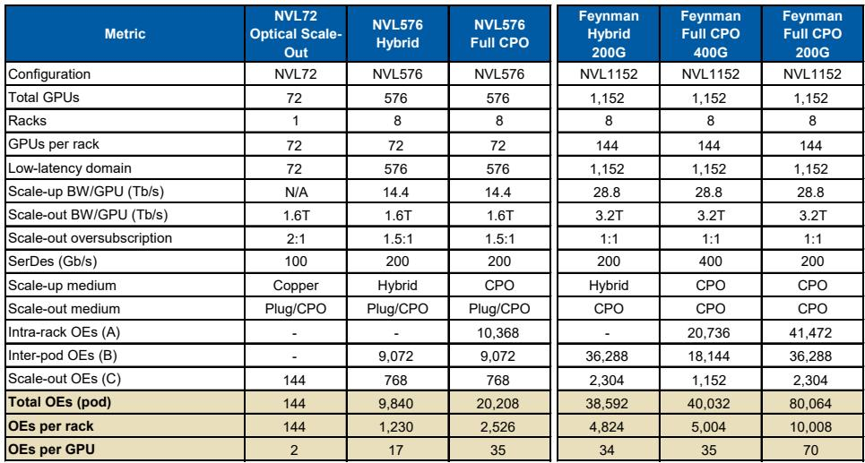
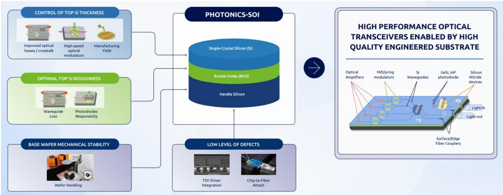

# The Co-Packaged Optics Revolution Is Not Just About Speed: It Will Rewrite the Semiconductor Supply Chain for Soitec and Besi

The AI data center is undergoing a structural shift that goes far beyond the familiar narrative of faster transceivers. As GPU clusters scale from single-rack systems like NVL72 to multi-rack architectures such as NVL576, the physical limits of copper interconnects are forcing a transition to photonics in the scale-up domain. This is not an incremental upgrade. It is a fundamental change in how compute is connected, and it creates a multi-year, asymmetric opportunity for two European semiconductor companies that most investors still associate with legacy end markets. Soitec and Besi are not merely beneficiaries of a trend; they are structural leverage points in a supply chain that is about to be reconfigured by co-packaged optics.

The controlling insight is this: the attach rate of optical engines per GPU is set to rise from roughly two to four today to over 35 in a fully optical architecture. That is a tenfold increase in photonics content per unit of compute. And because both Soitec and Besi sit at critical, hard-to-replicate nodes in the production of those optical engines, their addressable markets are expanding faster than the underlying GPU unit growth. The report from a global investment bank, which raised its price targets on Soitec from EUR 70 to EUR 200 and on Besi from EUR 200 to EUR 300, is not a call on near-term earnings momentum. It is a structural re-rating based on a new demand function that has not yet been priced into consensus.

Why now matters. The scale-up domain—the internal network that connects GPUs within a tightly coupled compute cluster—has until now been the preserve of copper. NVL72 demonstrated that a single rack could be managed with electrical interconnects. But as model sizes grow and inference workloads demand lower latency across larger pools of compute, the industry is being forced to move the scale-up network across racks. At distances beyond two meters and data rates above 200G, copper reaches its physical limit. Optical links become not just a performance advantage but a necessity. The introduction of co-packaged optics in the scale-up domain, starting with hybrid architectures in late 2026 and moving toward full CPO by 2028, creates a new category of photonics demand that simply did not exist in prior GPU generations.

## The Optical Engine Attach Rate Is the Single Most Important Variable for Photonics Content, and It Is About to Inflect

The current architecture uses two to four pluggable transceivers per GPU, all deployed in the scale-out network that connects different clusters. These transceivers are the primary driver of silicon photonics demand today, and they have already contributed to Soitec's photonics-related revenue reaching an estimated USD 112 million in fiscal year 2026. But the real leverage comes from the scale-up domain. In the NVL576 architecture, which introduces co-packaged optics for inter-rack scale-up traffic, the optical engine attach rate jumps to approximately 17 per GPU. In a fully optical configuration, where the connection between the GPU and the networking switch also moves to photonics, that number roughly doubles to 35. And if SerDes speeds remain at 200G rather than moving to 400G—a scenario that Corning's CEO flagged as closer to historical patterns—the attach rate could double again to 70 optical engines per GPU.

This is not a speculative extrapolation. The investment bank's model builds directly on disclosures from Corning's investor day, where the fiber optics company laid out a framework for optical content growth per GPU driven by three additive factors: cluster size growth requiring an additional switching layer, bandwidth growth doubling every two years, and the entirely new category of optical scale-up networks. Corning's estimate that optical content per GPU will grow 1.3x to 1.5x through 2028, on top of GPU unit growth, provides a conservative anchor for the opportunity. The investment bank's own modeling, which maps fiber demand to optical engine counts and then to Soitec's photonics SOI wafers, suggests that the actual outcome could be significantly higher if adoption accelerates.

The so-what for investors is that Soitec's photonics SOI revenue is no longer a small, niche line item. The report raises its CY28 estimate to USD 468 million, up from USD 387 million, and that revision is driven entirely by CPO adoption in the scale-up domain. The rest of Soitec's business assumptions remain unchanged. This is a pure upside add-on, not a reallocation of existing demand. And because Soitec holds a dominant share in 300mm photonics SOI wafers, particularly for the foundries that serve NVIDIA and other AI accelerator providers, the company is effectively a toll collector on the transition to optical interconnects.

## Besi's Hybrid Bonding Opportunity Extends Beyond CPO into GPU and HBM Stacking, Creating a Multi-Product Demand Driver

Besi's exposure to the CPO theme is less direct than Soitec's, but potentially broader. The company's hybrid bonding tools are used in the packaging of optical engines, particularly through TSMC's COUPE architecture, which integrates the electronic IC directly onto the photonic IC using die-to-wafer hybrid bonding. TSMC's COUPE is expected to become a leading integration route for co-packaged optics, especially at NVIDIA, and Besi is currently the sole provider of hybrid bonding tools to TSMC. That gives Besi a captive position in the highest-volume CPO production node.

But the CPO opportunity is only one leg of the thesis. The report identifies two additional demand drivers for Besi's hybrid bonders that are not dependent on photonics adoption. Starting with the Feynman GPU generation, the industry is expected to move toward stacked GPU dies that require hybrid bonding for interconnection. This is a structural shift in how GPUs are built, driven by the need to increase compute density without expanding die size. Similarly, custom HBM memory is expected to begin using hybrid bonding in 2027, with wider adoption thereafter. These are independent of the CPO narrative, but they compound the demand for Besi's tools in the same timeframe.

The investment bank's revised price target of EUR 300 applies a 37x multiple to approximately EUR 8 of CY27 earnings power. That multiple is up from 35x previously, reflecting higher sector valuations and increased visibility on the hybrid bonding opportunity for HBM. The key judgment here is that Besi is not just a packaging equipment company; it is becoming a critical enabler of the industry's roadmap for higher-bandwidth, lower-power interconnects at multiple levels of the AI stack. The CPO opportunity alone would justify a re-rating, but the additional tailwinds from GPU and HBM stacking make the earnings trajectory more durable.

## The Report Leaves Unanswered Questions About Adoption Timing and Competitive Dynamics That Will Determine the Magnitude of the Outcome

For all its analytical rigor, the report does not fully resolve several critical uncertainties. The first is the adoption timeline for full CPO architectures. The model assumes that hybrid CPO racks begin shipping in late 2026 and that mainstream adoption of full CPO occurs toward 2028. But this depends on NVIDIA's architectural decisions, which are not public, and on the readiness of the supply chain to produce high-volume optical engines at scale. If SerDes speeds move to 400G faster than expected, the optical engine attach rate could plateau at 35 rather than doubling to 70. Conversely, if the industry struggles with the yield or cost of CPO modules, adoption could be delayed by one to two years, pushing the revenue inflection for Soitec and Besi into 2029 or beyond.

The second uncertainty is competitive risk. Soitec's dominance in photonics SOI wafers is well-established, but the report does not address the possibility that foundries could develop alternative substrate technologies or that new entrants could emerge in the 300mm photonics SOI market. For Besi, the sole-supplier relationship with TSMC is a source of strength, but it also creates concentration risk. If TSMC were to qualify a second hybrid bonding tool supplier, or if NVIDIA were to adopt an alternative packaging architecture that does not rely on COUPE, Besi's addressable market could narrow.

The third question is about the magnitude of the HBM hybrid bonding opportunity. The report notes that hybrid bonding for HBM is expected to start in 2027, but it does not provide a detailed model of how many tools will be required or what the revenue contribution could be. This is a meaningful gap, because HBM production volumes are enormous, and even a small penetration of hybrid bonding could generate significant tool demand. But the adoption path depends on memory manufacturers' willingness to absorb the higher cost and complexity of hybrid bonding versus traditional wire bonding or microbump technologies.

## A Decision Framework for Positioning in Soitec and Besi: Distinguish Between Structural Leverage and Execution Risk

For readers who want to translate the report's analysis into actionable positioning, the following framework may be useful. The first dimension is conviction on the CPO adoption curve. If you believe that NVIDIA and other AI accelerator providers will move aggressively to multi-rack scale-up architectures starting in 2027, then Soitec is the purer play. The company's photonics SOI revenue is directly proportional to the number of optical engines deployed, and the report's model suggests that a 10x increase in attach rate translates into a roughly 4x increase in photonics revenue over the next three years. Soitec's exposure to the theme is also more concentrated, meaning that any upside from faster adoption flows directly to earnings.

If you are more cautious on the timing of CPO adoption but still want exposure to the broader trend toward advanced packaging, Besi offers a more diversified thesis. The CPO opportunity is real, but it is complemented by the GPU stacking and HBM drivers, which are less dependent on photonics adoption and more tied to the industry's roadmap for higher-bandwidth memory and compute. Besi's earnings visibility is also supported by its installed base and recurring service revenue, which provide a floor even if the CPO ramp is delayed.

The second dimension is valuation. Soitec's new price target of EUR 200 implies a 35x multiple on CY28 earnings, discounted by one year. That is a premium to its historical multiple, but the report argues that it is warranted by higher conviction on the growth trajectory into CY30. Besi's target of EUR 300 at 37x CY27 earnings is similarly elevated. For both stocks, the valuation already embeds a significant portion of the CPO opportunity. The upside from here depends on whether adoption accelerates beyond the base case, or whether the HBM and GPU stacking drivers prove larger than modeled.

The third dimension is catalyst timing. Soitec reports its FY26 results on May 27 and will host an investor meeting on May 28, where the new CEO Laurent Remont will present for the first time. The report advises a tactically cautious position into this event, noting that expectations are high and that management may express its outlook in conservative medium-term CAGRs rather than specific numbers. Besi's investor day on June 18 is likely to be the more significant catalyst, as the company is expected to provide detailed guidance on optical interconnect as a driver for its mainstream, hybrid bonding, and potentially thermo-compression bonding tools. The HBM hybrid bonding timeline may also be addressed, which would reduce one of the key uncertainties in the thesis.

The overarching strategic question for investors is whether the CPO transition is a one-time step-change or the beginning of a sustained increase in photonics content per GPU. The report's modeling suggests that it is the latter. The optical engine attach rate in a fully optical architecture is 35 per GPU, and that number could double if SerDes speeds remain at 200G. But even if the attach rate stabilizes at 35, the cumulative effect of GPU unit growth and the transition to CPO across the entire installed base would still generate a multi-year growth runway for both Soitec and Besi. The risk is that the market front-loads this growth into current valuations, leaving limited upside even if the thesis plays out as modeled.

The report's most valuable contribution is not its price targets but its framework for connecting architectural decisions at the rack level to wafer and tool demand at the component level. That framework allows investors to monitor the thesis through observable signals: NVIDIA's GPU architecture releases, TSMC's COUPE qualification timelines, and Corning's fiber deployment data. The unanswered questions about adoption timing and competitive dynamics are not weaknesses in the analysis; they are the natural boundaries of what can be known before the transition begins. For investors who want to position ahead of the inflection, the decision framework above provides a way to calibrate conviction and manage risk.

Join the community to read the full report and review the original charts.

*This article is for learning and discussion only and does not constitute investment advice.*

Personal reading notes and learning share only. Not investment advice.

