AI gets physical

# The decade of the robot belongs to China

China's robotics roll-out is unmatched, accounting for 50% of global industrial robots and 85% of humanoids in 2025. Backed by coordinated industrial policy and tight supply chain control, humanoids could reach 3.8% of labour capacity by 2035, offsetting c.60% of China's projected workforce decline.

natural_image

Front view of a futuristic white humanoid robot with glowing blue eyes against a solid blue background (no text or symbols visible)

- China is the world's robotics powerhouse and innovation lab, installing around half of all industrial robots globally (nearly 300k versus just 34k in the US), lifting robot density by $600\%$ to nearly 500 robots per 10k workers since 2016. It also now dominates the production and deployment of humanoid robots, accounting for $85\%$ of global installations in 2025.   
- This leadership reflects a decade-long, state-guided push. Our analysis of over 300k robotics patents since 2000 reveals that China's innovation has scaled at a remarkable pace, accounting for around $70\%$ of global filings, versus $4\%$ in the US. China's robotics engine is anchored in public research, with universities and state institutes accounting for $30\%$ of inventions, compared with $10\%$ in the US.   
- In China, robotics is industrial policy. Policy spans the full stack – from critical inputs and energy through components and deployment – simultaneously shaping supply and creating domestic demand. China now dominates the humanoid supply chain end-to-end, with over

SIGNATURE

# Thematic FICC Research

Zornitsa Todorova $^{(i)}$

+44 (0) 20 3134 4561

zornitsa.todorova@BARC.com

BARC, UK

Carlos Eduardo Garcia Martinez $^{(i)}$

+1 212 523 7426

carlosed.garciamartinez@BARC.com

BCI, US

90% of global refined rare earths. It also leads in key components, such as batteries, where it holds the largest global export share at 45%.

- This is the decade of the robot – and it belongs to China. Large-scale humanoid deployment began in 2025 with 15k units, rising to 60k in 2026 based on announced projects. Drawing on the roll-out of comparable technologies – most notably EVs in China – we project that by 2035 annual deployments could reach up to 13mn units as an upper bound, with roughly 11mn in China and 2mn elsewhere, primarily in the US.   
- China's rapidly aging population is driving strong domestic demand for robots. A 37mn labour shortfall this decade is straining its \$4.7trn manufacturing base, while creating a vast domestic market to absorb millions of robots. If current trends hold, humanoid robots could add up to 3.8% to China's effective labour force by 2035 – roughly a stock of 24mn units – helping to offset up to 60% of the projected workforce decline by filling demographic gaps.   
- China has the edge – but the US and Europe are still in the race. Adoption in Western markets is likely to come later, reflecting a more consumer-led model. However, security concerns around Chinese humanoids – such as risks to data and intellectual property – are likely to impose guardrails on their deployment. This creates scope for Western producers to scale through consolidation and industrial policy support.   
- Autonomy meets geopolitics and industrial policy. Roughly one-fifth of robotics patents are linked to the defence industry, with further spillovers into aerospace, mobility and energy – underpinned by shared foundational technologies such as sensing and navigation. The takeaway for investors and policymakers is clear: strategic value lies in the technology stack, not just the end product, elevating the robotics supply chain to critical infrastructure.

# The year of the robot

# Automation in China started with industrial robots

Robotics integration in China has advanced steadily since the early 2000s, unfolding in successive adoption waves. Under sustained state guidance, the first major automation push centered on industrial robots, with uptake accelerating sharply in the mid-2010s and scaling rapidly thereafter. Today, China accounts for roughly half of global annual industrial-robot installations, deploying nearly 300k units in 2024, with Japan and the US trailing far behind at 44k and 34k units (Figure 1). $^{1}$

FIGURE 1. One in every two industrial robots is installed in China   

bar_stacked

| Year | China (thousand units) | Japan (thousand units) | US (thousand units) | Germany (thousand units) | India (thousand units) | Other (thousand units) |
| :--- | :--- | :--- | :--- | :--- | :--- | :--- |
| 2014 | 55 | 35 | 30 | 15 | 0 | 80 |
| 2015 | 65 | 35 | 30 | 15 | 0 | 95 |
| 2016 | 95 | 40 | 30 | 15 | 0 | 110 |
| 2017 | 155 | 45 | 35 | 15 | 0 | 130 |
| 2018 | 155 | 50 | 40 | 15 | 0 | 140 |
| 2019 | 145 | 45 | 35 | 15 | 0 | 130 |
| 2020 | 175 | 40 | 35 | 15 | 0 | 120 |
| 2021 | 275 | 45 | 40 | 20 | 0 | 130 |
| 2022 | 290 | 45 | 45 | 20 | 0 | 135 |
| 2023 | 275 | 45 | 45 | 20 | 0 | 135 |
| 2024 | 295 | 45 | 45 | 20 | 0 | 135 |

Source: International Federation of Robotics, BARC

The scale of growth is most pronounced in manufacturing. Between 2016 and 2023, China lifted robot density by more than 600%: from around 70 to nearly 500 robots per 10k workers, the fastest growth rate globally (Figure 2). $^{2}$

FIGURE 2. China's manufacturing robot density is up 6x in a decade   
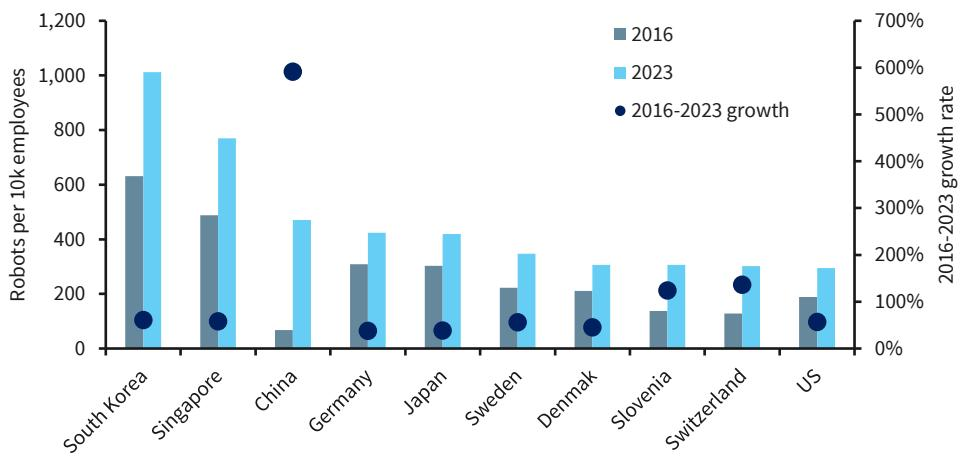

bar_line

| Country | 2016 (Robots per 10k employees) | 2023 (Robots per 10k employees) | 2016-2023 growth (%) |
| :--- | :--- | :--- | :--- |
| South Korea | 630 | 1015 | 75 |
| Singapore | 490 | 775 | 85 |
| China | 70 | 475 | 600 |
| Germany | 310 | 425 | 65 |
| Japan | 305 | 420 | 65 |
| Sweden | 225 | 355 | 85 |
| Denmark | 210 | 310 | 75 |
| Slovenia | 140 | 315 | 130 |
| Switzerland | 125 | 310 | 145 |
| US | 185 | 300 | 65 |

Source: International Federation of Robotics, BARC

# Automation's next act will be humanoids

In our view, AI-enabled robotics – humanoids in particular – will be automation's next act, shifting automation from task-specific, factory-bound machines to systems designed to operate within human-built environments, using the same tools, layouts and workflows as people, and in doing so widening the automation frontier.

Although humanoid robots have existed for nearly a decade, 2025 marked a clear inflection point in deployment. Based on our analysis of company announcements and press releases from leading humanoid manufacturers, we estimate that around 15k humanoid units were installed globally in 2025, a sharp jump from just 2k in 2024, and pointing to as many as 60k deployments in 2026, according to current company guidance (Figure 3).

FIGURE 3. The humanoid deployment era started in 2025   
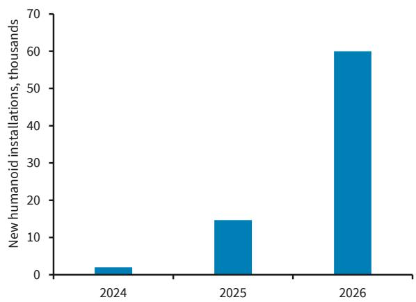

bar

| Year | New humanoid installations, thousands |
| :--- | :--- |
| 2024 | 2 |
| 2025 | 15 |
| 2026 | 60 |

Note: 2026 data shows the consensus estimate.
Source: Company Reports, AlphaSense, BARC

FIGURE 4. Chinese companies delivered 85% of global humanoid installations   
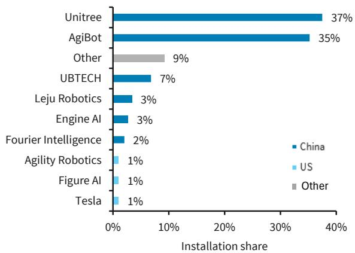

bar

| Company | China (%) | US (%) | Other (%) |
| :--- | :--- | :--- | :--- |
| Unitree | 37 | - | - |
| AgiBot | 35 | - | - |
| Other | - | - | 9 |
| UBTECH | 7 | - | - |
| Leju Robotics | 3 | - | - |
| Engine AI | 3 | - | - |
| Fourier Intelligence | 2 | - | - |
| Agility Robotics | - | 1 | - |
| Figure AI | - | 1 | - |
| Tesla | - | 1 | - |

Note: Based on 2025 data.
Source: Company Reports, BARC

To date, deployment has been dominated by China and the US – with China clearly in the lead, accounting for nearly 85% of global installations in 2025. While installations in China have so far been concentrated among a small number of manufacturers, notably Unitree and AgiBot (Figure 4), this reflects the early scale-up phase rather than a narrow ecosystem.

In fact, China now hosts a rapidly expanding humanoid ecosystem, with roughly 140 active domestic manufacturers and around 330 humanoid models unveiled in 2025 alone. $^{3}$ Crucially, this leadership did not emerge overnight. Our analysis in the next section shows that it is the result of more than a decade of sustained state-guided investment in technology, innovation, and talent, with a clear turning point around 2016.

# China is the world's robotics powerhouse

# Insights from 300k robotics patents

We use patent data to compare innovation trends in robotics across countries. Patents are inherently forward-looking signals of technological intent, revealing where firms expect future value to emerge, even if not all inventions ultimately reach commercial scale. Firms typically patent ideas they believe are both novel and economically viable, which means patenting activity tends to track the underlying R&D effort closely. This link is particularly strong in robotics, where innovation is incremental, highly technical and capital-intensive, and where patents often appear years before large-scale deployment.

Our analysis draws on PATSTAT, the global patents database compiled by the European Patent Office (EPO). PATSTAT is one of the most comprehensive patent sources worldwide, covering close to 140mn patent filings. It provides detailed information on filing dates, technology classifications, applicants and geographic attribution, and is widely used in academic and policy research.

The key advantage of PATSTAT is that it harmonises patent information across jurisdictions and links related filings to a single underlying invention, avoiding double counting across countries. For example, a robotics invention may be filed first in the US and later extended to Europe and China as part of an international protection strategy. Treating these as separate filings would count the same invention multiple times, whereas an invention-based approach records it only once.

In our analysis, we date each invention using the earliest filing year, which captures when it first entered the patent system, and assign geographic origin based on the authority of the initial application. $^{4}$ We focus on filings rather than grants, as grant timing varies widely across patent offices and often reflects procedural delays rather than the timing of the inventive activity.

Our patents sample covers the broader robotics ecosystem, not just humanoids. Therefore, it captures both full-robot inventions and core component technologies – such as actuators, batteries, and motion systems – that are used across multiple physical AI robot types and can be integrated into humanoids. This broader framing helps avoid missing important sources of innovation that would be overlooked by focusing only on full humanoid patents. In PATSTAT, we identify robotics patents by selecting categories that include industrial robots, humanoids and drones. This yields a sample of over 300k robotics patents since 2000. $^{5}$

Invention counts after 2023 are affected by reporting and classification lags that tend to understate recent activity. This is because patents generally appear in PATSTAT 1–3 years after filing, once patent applications are published, leaving the most recent years structurally incomplete – a limitation that is well recognised in the literature. $^{6}$ To address this effect, we combine available post-2023 data with the average growth rate observed over 2015–2023 to estimate invention activity in the most recent years.

# Robotics innovation has shifted to China

# Our analysis reveals that China accounts for 70% of global robotics inventions since 2000

(Figure 5). For example, in 2023 – the latest year with largely complete data – China recorded over 30k robotics patent inventions, almost thirty times higher than the number recorded in the US, which registered just over 1k inventions.

FIGURE 5. China accounts for nearly 70% of robotics inventions   

area

| Year | China | US | Europe | Japan | Korea | Other |
|------|-------|----|--------|-------|-------|-------|
| 2000 | 0     | 0  | 0      | 0     | 0     | 0     |
| 2001 | 0     | 0  | 0      | 0     | 0     | 0     |
| 2002 | 0     | 0  | 0      | 0     | 0     | 0     |
| 2003 | 0     | 0  | 0      | 0     | 0     | 0     |
| 2004 | 0     | 0  | 0      | 0     | 0     | 0     |
| 2005 | 0     | 0  | 0      | 0     | 0     | 0     |
| 2006 | 0     | 0  | 0      | 0     | 0     | 0     |
| 2007 | 0     | 0  | 0      | 0     | 0     | 0     |
| 2008 | 0     | 0  | 0      | 0     | 0     | 0     |
| 2009 | 0     | 0  | 0      | 0     | 0     | 0     |
| 2010 | 0     | 0  | 0      | 0     | 0     | 0     |
| 2011 | 0     | 0  | 0      | 0     | 0     | 0     |
| 2012 | 0     | 0  | 0      | 0     | 0     | 0     |
| 2013 | 0     | 0  | 0      | 0     | 0     | 0     |
| 2014 | 0     | 0  | 0      | 0     | 0     | 0     |
| 2015 | 5     | 3  | 3      | 3     | 3     | 3     |
| 2016 | 15    | 8  | 8      | 8     | 8     | 8     |
| 2017 | 25    | 12 | 12     | 12    | 12    | 12    |
| 2018 | 35    | 15 | 15     | 15    | 15    | 15    |
| 2019 | 45    | 18 | 18     | 18    | 18    | 18    |
| 2020 | 55    | 22 | 22     | 22    | 22    | 22    |
| 2021 | -     | -    | -      | -     | -     | -     |
| 2022 | -     | -    | -      | -     | -     | -     |
| Estimated (Estimates) from ~2023 to ~25 (approx) → ~65 (approx) — note: The chart includes a dashed vertical line at ~23 (estimated). The legend indicates five categories: China, US, Europe, Japan, Korea, and Other. The data is presented in a table format.

Source: PATSTAT Autumn 2025, BARC

This accelerating pace of innovation is also reflected in China's expanded domestic production of both components and finished robots. China now produces around 57% of the industrial

robots installed domestically (Figure 6), marking a clear shift from the past, when installations relied far more heavily on imports, particularly from Japan. $^{7}$

FIGURE 6. Today, most industrial robots in China are locally produced   
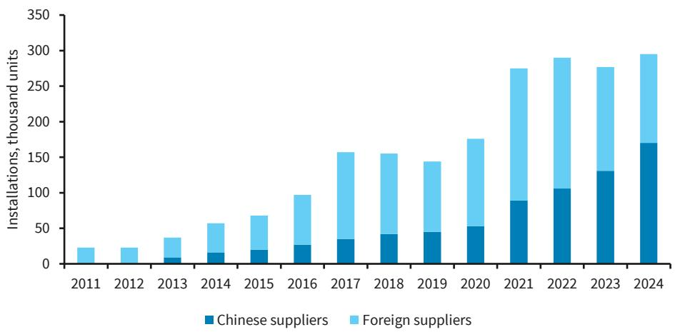

bar_stacked

| Year | Chinese suppliers (thousand units) | Foreign suppliers (thousand units) |
| :--- | :--- | :--- |
| 2011 | 0 | 23 |
| 2012 | 0 | 22 |
| 2013 | 8 | 35 |
| 2014 | 16 | 49 |
| 2015 | 20 | 57 |
| 2016 | 27 | 83 |
| 2017 | 35 | 145 |
| 2018 | 43 | 139 |
| 2019 | 46 | 119 |
| 2020 | 53 | 157 |
| 2021 | 89 | 219 |
| 2022 | 106 | 195 |
| 2023 | 131 | 146 |
| 2024 | 170 | 138 |

Source: International Federation of Robotics

While we view the broader robotics ecosystem as more informative, the results are very similar when the analysis is narrowed to humanoid-related patents – with China accounting for about 75% of humanoid patents since 2010. These results are based on patents filed by leading humanoid-robot manufacturers identified in our previous report (The future of work: AI gets physical, 14 January 2026), which form the basis of our humanoid invention sub-sample. The sub-sample covers more than 20 firms behind the most advanced humanoid models as of late 2025 and, while excluding newer entrants yet to deploy, captures the companies responsible for the vast majority of humanoid units deployed globally to date.

Our analysis of humanoid patents shows that innovation in this space began to accelerate around 2015, with China already pulling ahead by 2018 (Figure 7). Much of this innovation momentum has been driven by a small group of firms, with UBTECH leading in China in terms of patenting activity and Boston Dynamics occupying a similar position in the US (Figure 8).

FIGURE 7. China accounts for 75% of humanoid inventions   
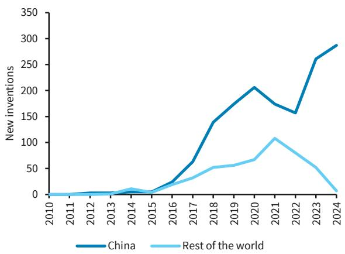

line

| Year | China | Rest of the world |
| ---- | ----- | ----------------- |
| 2010 | 0     | 0                 |
| 2011 | 0     | 0                 |
| 2012 | 0     | 0                 |
| 2013 | 0     | 0                 |
| 2014 | 0     | 10                |
| 2015 | 0     | 5                 |
| 2016 | 20    | 20                |
| 2017 | 60    | 30                |
| 2018 | 140   | 50                |
| 2019 | 180   | 60                |
| 2020 | 210   | 70                |
| 2021 | 170   | 110               |
| 2022 | 160   | 80                |
| 2023 | 260   | 50                |
| 2024 | 290   | 10                |

Source: PATSTAT Autumn 2025, BARC

FIGURE 8. Leading innovators in humanoid robotics are based in China 

<table><tr><td>Company</td><td>Country</td><td>Inventions</td></tr><tr><td>UBTECH</td><td>China</td><td>812</td></tr><tr><td>Xiaomi</td><td>China</td><td>239</td></tr><tr><td>Naver Labs</td><td>South Korea</td><td>134</td></tr><tr><td>Efort</td><td>China</td><td>155</td></tr><tr><td>Fourier Intelligence</td><td>China</td><td>132</td></tr><tr><td>Boston Dynamics</td><td>USA</td><td>119</td></tr><tr><td>AgiBot</td><td>China</td><td>101</td></tr><tr><td>Shanghai Electric</td><td>China</td><td>63</td></tr><tr><td>Sanctuary AI</td><td>Canada</td><td>56</td></tr><tr><td>Leju Robotics</td><td>China</td><td>55</td></tr></table>

Note: Inventions column shows cumulative invention filings since 2010. We show data for the top 10 innovators.   
Source: PATSTAT, BARC

# China leads robotics innovation via a university-government model

China's robotics machine is anchored in public research. Our analysis shows that universities and state research institutes account for over 30% of robotics patent inventions, versus around 10% in the US – reflecting an industrial policy strategy, formalised in initiatives such as Made in China 2025, that places academia at the core of technology development (Figure 9).

FIGURE 9. One-third of China's robotic inventions come from universities and public entities   
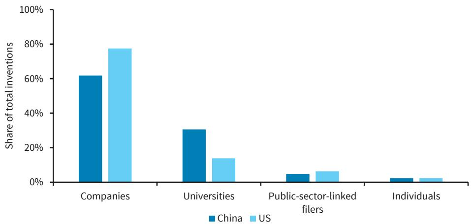

bar

| Category | China (%) | US (%) |
| :--- | :--- | :--- |
| Companies | 62 | 78 |
| Universities | 31 | 14 |
| Public-sector-linked filers | 5 | 6 |
| Individuals | 2 | 2 |

Note: Based on 2023 data.   
Source: PATSTAT Autumn 2025, BARC

# Software vs hardware: the US-China divide

Using PATSTAT data, we find a clear divide in robotics patenting – China's patents focus on robot kinematics, or the core physical structure, while US patents are more concentrated on control and autonomy, which govern how robots sense, decide and act.

We derive these results from detailed PATSTAT IPC classifications within our robotics patent sample. Because a single patent can span several technological applications, we allow each patent to contribute to multiple categories, reflecting the fact that many inventions are inherently multi-use. We then identify the top 10 application areas for China and the US, group them into four broad use cases, and assess their relative importance within each country's

patent portfolio. Based on this breakdown, we construct a patent use-case index, where a value of one corresponds to the dominant use case and other use cases are scaled proportionally. This approach shows a clear divergence: robot kinematics is the dominant use case of patents in China, with roughly twice the weight of control and autonomy applications, whereas the US profile is more tilted towards software-driven capabilities (Figure 10).

FIGURE 10. Robotics patent use-case index 

<table><tr><td>Use case</td><td>China</td><td>US</td></tr><tr><td>Robot kinematic components</td><td>1.00</td><td>0.66</td></tr><tr><td>Safety &amp; operational assurance</td><td>0.54</td><td>0.17</td></tr><tr><td>Control &amp; autonomy</td><td>0.51</td><td>1.00</td></tr><tr><td>Manipulation &amp; grasping</td><td>0.64</td><td>0.27</td></tr></table>

Source: PATSTAT Autumn 2025, BARC

# In China, robotics is industrial policy

# State policy has underpinned China's robotics lead

The expansion of robotics deployment and innovation in China is not surprising. In our view, China's robotics expansion stems from a long-running, government-coordinated industrial policy framework, which began to accelerate in the mid-2010s. These policies are embedded in a series of national planning documents, beginning with Made in China 2025, issued in 2015, and followed by industrial strategies under the 14th and 15th Five-Year Plans (Figure 11). Together, they designated robotics and embodied intelligence as strategic-infrastructure industries and shaped their development by enabling the coordinated use of policy tools, including subsidies, grants, tax incentives, and state-backed financing at both central and local levels.

FIGURE 11. China's core robotics policy framework   
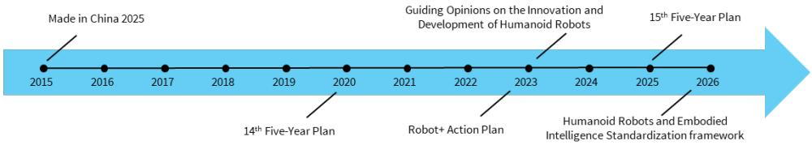

flowchart

Source: BARC

More recently, the 2023 Robot+ Action Plan set out guidelines for the adoption and integration of robotics across the broader economy, identifying 10 priority industries for deployment (Figure 12), $^{8}$ signaling a second phase of policy focused on extending robotics into under-penetrated areas.

FIGURE 12. China's 10 key robotics application industries 

<table><tr><td colspan="2">Deployment industries</td></tr><tr><td>Manufacturing</td><td>Healthcare</td></tr><tr><td>Agriculture</td><td>Elderly services</td></tr><tr><td>Architecture</td><td>Education</td></tr><tr><td>Energy</td><td>Business community services</td></tr><tr><td>Commercial logistics</td><td>Emergency applications</td></tr><tr><td colspan="2">Source: BARC</td></tr></table>

# Ahead of schedule

These policies are already paying off, with several targets reached ahead of schedule.

According to the Center for Strategic and International Studies (CSIS), the Made in China 2025 strategy set a target of reaching 1.8mn industrial robots in operational stock by 2025. This level was reached in 2023, with total stock exceeding 2mn in 2024. Likewise, key objectives under the 14th Five-Year Plan, including average annual growth of 20% in robotics revenues and a doubling of robot density per 10k workers by 2025, were also achieved earlier than initially envisaged. $^{9}$

# China is building the entire humanoid robotics stack

Meanwhile, Chinese state policy on humanoid robots treats them as a system, rather than a standalone project, with a focus on building the entire ecosystem. This approach addresses both supply and demand: from raw materials and components to humanoid producers, while simultaneously encouraging deployment to create domestic demand.

# Vertically integrated supply chain

China's key advantage in deploying humanoid robots is its control over the full supply chain. From upstream raw inputs such as critical minerals to intermediate goods and final components, China has secured a tightly integrated and reliable production base. Crucially, the West remains highly dependent on this supply chain to meet their own robotics demand.

Our previous research shows that more than 90% of global refined magnetic rare earths come from China – materials that are essential for electric-based locomotion in robots (Figure 13). China is also the world's leading processor of refined cobalt, lithium and copper, and ranks second in nickel, all of which are critical inputs into robotic electronic systems, including batteries and wiring.

Beyond raw materials, China also dominates the midstream and downstream

manufacturing of humanoid components. Our analysis of the UN Comtrade database – the most comprehensive source of detailed international trade flows – shows that China is the world's largest exporter of key intermediate inputs used in robotics and humanoid robots. Specifically, China accounts for more than 22% of global actuator exports (rare-earth-powered devices that convert electrical energy into controlled mechanical motion), 45% of battery exports, and is the second-largest exporter of semiconductors (Figure 14).

FIGURE 13. China is the top supplier of refined critical minerals   
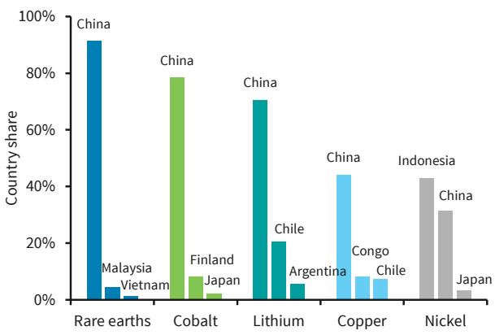

bar

| Resource | Country | Share (%) |
| :--- | :--- | :--- |
| Rare earths | China | 92 |
| Malaysia | Vietnam | 4 |
| Cobalt | China | 78 |
| Finland | Japan | 3 |
| Lithium | China | 70 |
| Argentina | Chile | 5 |
| Copper | China | 44 |
| Congo | Chile | 8 |
| Indonesia | China | 42 |
| Nickel | Japan | 3 |
The chart displays a single bar for each resource. The labels above the bars indicate the country names and their corresponding shares. There is no additional data series in this image.

Note: 2024 data. Shares reflect each country's share of global supply.
Source: International Energy Agency Licence: CC BY 4.0, BARC

FIGURE 14. China also leads global exports of critical components   
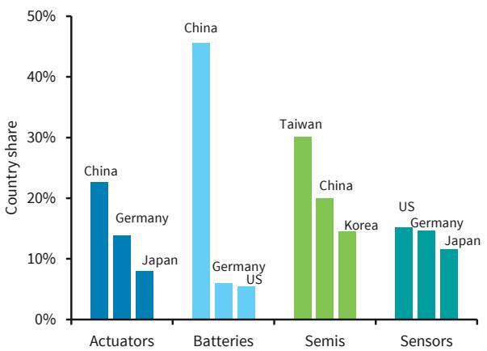

bar

| Category | Country Share (%) |
| :--- | :--- |
| Actuators | 23 |
| Germany | 14 |
| Japan | 8 |
| Batteries | 46 |
| Germany | 6 |
| US | 6 |
| Semis | 30 |
| Korea | 15 |
| China | 20 |
| US | 15 |
| Germany | 15 |
| Japan | 12 |

Note: 2024 data. Shares reflect each country's share of global exports.
Source: UN Comtrade, BARC

# More robots → more data → better robots → more robots

With nearly 13k humanoid robots deployed in China by end-2025, early scaling is already generating powerful second-order effects. Larger deployments are producing growing volumes of real-world operating data, which directly improve humanoid robot models – helping close the training gap left by simulations and data drawn from images or video alone. Data sharing and standardisation amplify these gains.

Social acceptance provides an additional tailwind: surveys by the Mitsubishi Research Institute indicate that close to 60% of Chinese respondents view robots favourably in consumer services, a much higher acceptance rate than in the US and the UK (Figure 15). $^{10}$

While deployment is likely to remain predominantly industrial over the next 5-10 years, this openness lowers adoption frictions and creates a self-reinforcing loop: deployment generates data, data improve performance, and improved performance accelerates further deployment.

FIGURE 15. China shows the highest public acceptance of robots   
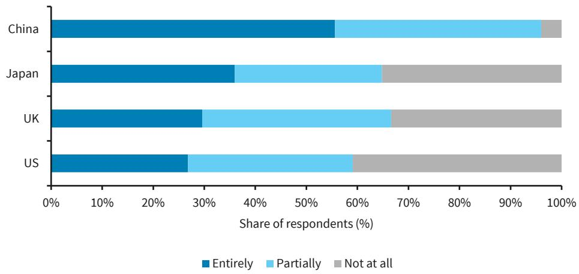

bar_stacked

| Country | Entirely (%) | Partially (%) | Not at all (%) |
| :--- | :--- | :--- | :--- |
| China | 55 | 42 | 3 |
| Japan | 36 | 34 | 41 |
| UK | 30 | 37 | 38 |
| US | 27 | 40 | 43 |

Note: Data shows desired degree of robot involvement in consumer services. Source: Mitsubishi Research Institute

Against this backdrop, the policy objective of cultivating 2-3 globally influential enterprises by 2025 appears aligned with industry progress, with AgiBot and Unitree already emerging as leading global producers – pointing to meaningful advances toward a competitive industrial ecosystem by 2027. $^{11}$

# Robots, made in China

Under an upper-bound scenario, global humanoid robot production could reach up to 13mn units a year by 2035, with around 85% – concentrated in China (Figure 16). Early deployment is expected to be largely shaped by supply-side constraints, as manufacturing capacity ramps up, which is why we first focus on production before examining demand considerations in the following chapter.

FIGURE 16. China is poised to lead global humanoid robot deployment through 2035   
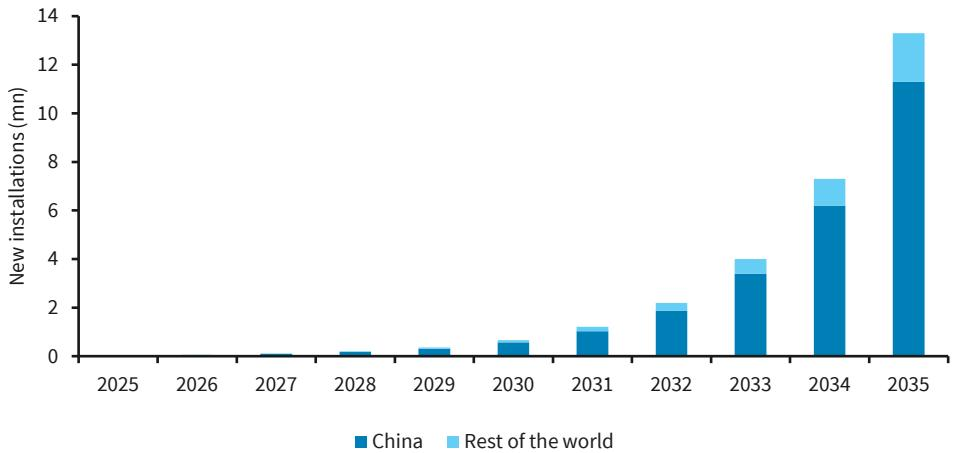

bar_stacked

| Year | China (mm) | Rest of the world (mm) |
| :--- | :--- | :--- |
| 2025 | 0 | 0 |
| 2026 | 0 | 0 |
| 2027 | 0.1 | 0.1 |
| 2028 | 0.2 | 0.1 |
| 2029 | 0.4 | 0.1 |
| 2030 | 0.6 | 0.2 |
| 2031 | 1.0 | 0.1 |
| 2032 | 1.8 | 0.3 |
| 2033 | 3.3 | 0.5 |
| 2034 | 6.2 | 0.8 |
| 2035 | 11.2 | 1.5 |

Source: BARC

# Humanoids are (electric) cars in miniature

At this early stage, most bottom-up forecasts for humanoid robots rest on highly uncertain assumptions around unit costs, utilisation, returns on investment and regulatory acceptance. We assess humanoid manufacturing potential in China by benchmarking it against the roll-out of China's electric vehicles (EV) expansion in the 2010s, which we view as the most comparable technology (Figure 17). The EV experience offers a relevant, real-world example of how quickly a complex, capital-intensive technology can scale once adoption inflects. While humanoids and EVs clearly serve different end-markets, EVs provide a relevant analogue for manufacturing scale, as both face very similar industrialisation challenges. In particular, both are built on the same core components – semiconductors, actuators, gears and bearings, and batteries (Figure 13 and Figure 14) – and similarly reliant on large-scale systems integration and learning-by-doing. As with EVs in their early years, the humanoid industry is currently heavily concentrated in China and supported by active government backing, making the EV adoption curve a particularly relevant and realistic reference point. We stress that this analysis should be interpreted as an upper bound scenario rather than a precise forecast.

FIGURE 17. China's EV sales have seen exponential growth   
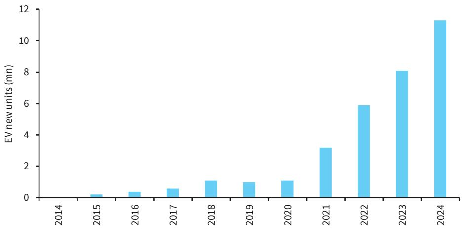

bar

| Year | EV new units (mn) |
| :--- | :--- |
| 2014 | 0 |
| 2015 | 0.2 |
| 2016 | 0.4 |
| 2017 | 0.6 |
| 2018 | 1.1 |
| 2019 | 1.0 |
| 2020 | 1.1 |
| 2021 | 3.2 |
| 2022 | 5.9 |
| 2023 | 8.1 |
| 2024 | 11.3 |

Source: International Energy Agency Licence: CC BY 4.0

Based on these similarities, we project China's humanoid deployments by mapping adoption onto China's historical EV roll-out following its inflection point. We treat 2025, with roughly 15k humanoid deployments, as year one. Then, we anchor 2035 annual humanoid deployments in China at around 11mn units – the level of EV new sales reached roughly 10 years after EV adoption began to accelerate (Figure 17). Finally, we align 2026 humanoid deployments with the industry consensus estimate of 60k units, and interpolate deployment volumes over 2027–35 using the implied compound annual growth rate consistent with this endpoint for tractability, acknowledging that realised adoption is likely to be uneven rather than smooth.

We then translate this China-level projection into a global estimate by assuming China retains an 85% share of worldwide humanoid deployments, reflecting its current leadership in manufacturing and concentration of early adoption in industrial use cases, while recognising that this share could decline over time as production and deployment diversify geographically. Under this assumption, total global deployments would reach up to 13mn units by 2035 – roughly up to 11mn in China and up to 2mn outside China.

If current trends continue to hold, we expect the majority of these non-China deployments to be produced by Tesla, Figure AI, Boston Dynamics and Agility (in the US) and by Sweden's Hexagon AB. Of course, at face value, producing up to 2mn units outside of China appears very ambitious. That said, this scale is broadly consistent with the production targets articulated by several of the most prominent industry leaders in the space.

In its fourth-quarter earnings call in late January, Tesla announced plans to end production of its flagship Model S and Model X vehicles as it shifts towards lower-cost models, while converting the Fremont plant – previously used to manufacture these vehicles – into a humanoid robot production site. Notably, under the terms of Elon Musk's recently approved compensation package, which is tied to ambitious valuation and product roll-out milestones, Tesla's CEO would need to deliver roughly 1mn humanoid robots by 2035.

Boston Dynamics targets manufacturing 30k Atlas humanoid units annually by 2028 $^{12}$ . Figure AI has publicly targeted mass production of 100k humanoid robots within a similar time frame $^{13}$ and Agility's existing RoboFab facility could scale up to 10k robots annually at peak production $^{14}$ . Hexagon AB, albeit taking a more cautious approach to explicit targets, has

indicated plans to produce at least a few thousand units by early 2030. Including smaller volumes from other producers, this points to aggregate production of roughly 200k units by 2028-29. If production inflects exponentially from around 2030, as many industry participants expect, output could then ramp up materially.

# Why smartphones and industrial robots are less appropriate analogues

Smartphones are a mass-market consumer good, whereas humanoid robots are likely to remain predominantly industrial assets over at least the next decade, with adoption driven by enterprise deployment rather than personal ownership.

Industrial robots would also be a poor analogue because they automate processes whereas humanoids automate labour. Put differently, one scales with tasks, the other scales with workers. Industrial robot demand is ultimately bounded by the number of discrete, automatable processes within a factory – once each task is automated, incremental demand slows sharply. Humanoids, by contrast, are designed to substitute for or augment human workers across a wide range of tasks, environments and sectors. Their deployment therefore scales with the size of the labour force, not with the number of production processes. This distinction materially expands the addressable market and implies much higher potential unit volumes than those observed for traditional industrial robotics.

# Robots against demographics

# China is aging, fast

China's demand for robots is rising as demographic pressures build from a shrinking and aging population. The demographic shift is already underway, China's population peaked at just over 1.42bn in 2021 and is now declining, with projections pointing to around 1.2bn by 2050 (Figure 18). These pressures will be felt acutely in the labour market, with working-age population in China projected to fall by 6% between 2026 and 2035, and by 25% by 2050.

Our analysis of demographics data suggest that this would equate to roughly 57mn fewer working-age people, which, if the participation rate remains at 65%, would translate into a 37mn decline in the labour force within the next decade alone. At the same time, the share of elderly in the population is projected to rise from about 15% to over 30%, intensifying demand for healthcare and elderly care workers.

FIGURE 18. China's population has already peaked   
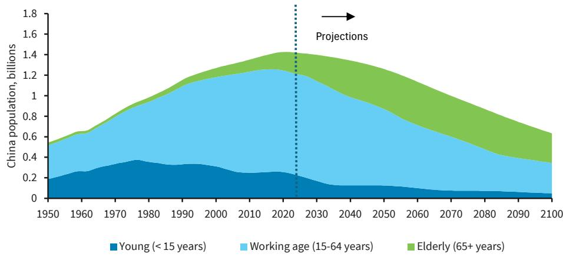

bar_stacked

| Year | Young (< 15 years) | Working age (15-64 years) | Elderly (65+ years) |
|------|---------------------|----------------------------|----------------------|
| 1950 | 0.2                 | 0.3                        | 0.1                  |
| 1960 | 0.3                 | 0.4                        | 0.1                  |
| 1970 | 0.3                 | 0.5                        | 0.1                  |
| 1980 | 0.3                 | 0.6                        | 0.1                  |
| 1990 | 0.3                 | 0.7                        | 0.1                  |
| 2000 | 0.3                 | 0.8                        | 0.1                  |
| 2010 | 0.2                 | 0.9                        | 0.1                  |
| 2020 | 0.2                 | 1.0                        | 0.1                  |
| 2030 | 0.1                 | 0.9                        | 0.2                  |
| 2040 | 0.1                 | 0.8                        | 0.3                  |
| 2050 | 0.1                 | 0.7                        | 0.4                  |
| 2060 | 0.1                 | 0.6                        | 0.5                  |
| 2070 | 0.1                 | 0.5                        | 0.6                  |
| 2080 | 0.1                 | 0.4                        | 0.7                  |
| 2090 | 0.1                 | 0.3                        | 0.8                  |
| 2100 | 0.1                 | 0.2                        | 0.9                  |

Source: United Nations' World Population Prospects 2024, BARC

Against this backdrop, shifts in population dynamics pose growing challenges for China's labour-intensive manufacturing model. As work preferences continue to tilt from industry toward services, labour constraints are likely to become more binding for sustaining the world's largest industrial base – valued at around 4.7trn as of 2024 $^{15}$ and accounting for roughly 25% of China's GDP. Manufacturing still employs about 245mn workers, or roughly 32% of the workforce (Figure 19), far higher than in most large economies that have already transitioned further toward services.

As China's population shrinks, part of the potential output loss could, in principle, be offset by gains in total factor productivity (TFP). However, despite strong historical performance, projections from the UN suggest that productivity growth is likely slow to around 1% a year, implying only around 11% cumulative TFP growth between 2026 and 2035. $^{16}$ At this pace, efficiency gains would offset only a small share of the projected labour force decline, and are unlikely to fully counter China's demographic headwinds – thereby strengthening the economic case for automation and robotics as a partial offset to tightening labour supply.

FIGURE 19. Workforce share in manufacturing   
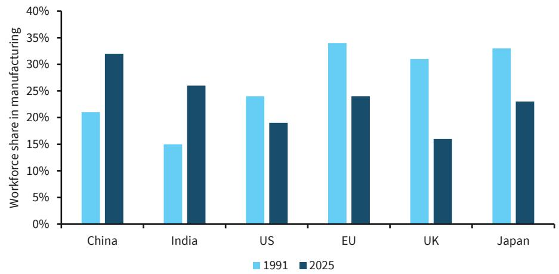

bar

| Region | 1991 (%) | 2025 (%) |
| :--- | :--- | :--- |
| China | 21 | 32 |
| India | 15 | 26 |
| US | 24 | 19 |
| EU | 34 | 24 |
| UK | 31 | 16 |
| Japan | 33 | 23 |

Source: World Bank, BARC

# Can robots offset demographic tailwinds in China?

Humanoid deployment in China could plausibly complement productivity gains in mitigating labour force losses over the coming decade. Under optimistic scenarios, and if current exponential scale of innovation and deployment continue to hold, the cumulative installed stock of humanoid robots in China could approach around 24mn units by 2035. This estimate reflects the cumulative sum of projected annual deployments between 2031 and 2035 (Figure 16), assuming that robots installed prior to 2031 are fully depreciated by then, and that domestic production is fully deployed within China (see next section for a more robust discussion). This appears plausible, as workers retiring in China over the 2030s are likely, on average, to have lower educational attainment and greater exposure to manual tasks – categories in which humanoid robots may offer the greatest scope for substitution.

At this scale, humanoid robots could be equivalent to up to $3.8\%$ of China's labour force by 2035, corresponding to an additional labour input on the order of up to 24mn workers, or roughly $60\%$ of the projected demographic shortfall. We stress that this estimate should be viewed as an upper bound, reflecting relatively optimistic assumptions around utilisation, depreciation and domestic absorption.

# The US and Europe are still in the race

Applying the same upper-bound scenario analysis as for China suggests the US could have a stock of up to 3.7mn humanoid robots by 2035, equivalent to up to 2.5% of the labour force. At face value, this points to weaker adoption in the US, but we do not view this as an apples-to-apples comparison. Rather, it reflects differences in deployment profile, timing and use-case mix.

# In the US, humanoids go consumer – but much later

Our analysis suggests that humanoid deployment over the next five to seven years is likely to be concentrated predominantly in industrial applications, particularly manufacturing. China's manufacturing sector accounts for around 25% of GDP, underscoring the scale of its industrial base. By contrast, the US is primarily a services-oriented economy, with manufacturing accounting for roughly 9% of GDP. As a result, near-term demand for humanoid robots in China is likely to be materially larger in absolute terms than in the US, reflecting the much greater scale of its manufacturing sector. We expect deployment in the US to be driven more by service-oriented applications, with adoption accelerating in the 2030s as these use cases mature. Moreover, the US faces no immediate pressure to offset labour-force decline, as UN projections indicate continued labour-force growth, reaching around 141mn by 2035, up from 139mn in 2024.

# Safety and security create a window for Western producers

To be clear, we are not arguing that the US or Europe are currently ahead – China's advantage at this stage is sizable. However, we do see a meaningful opportunity for the West to narrow the gap over time. While Chinese manufacturers are likely to retain a cost and pricing advantage, we expect safety, security and cybersecurity considerations to remain central for companies looking to deploy humanoid robots. These systems are highly sensor-rich, and the risks around data leakage, intellectual property loss, or embedded spyware are nontrivial.

As a result, we expect regulators in both the US and Europe to introduce robust guardrails governing which Chinese technologies can be imported and deployed, particularly from a national security perspective. This informs our baseline assumption that a significant share of China's humanoid robot production will ultimately be deployed domestically. Against this backdrop, with renewed emphasis on industrial policy in the West, we see an opening for humanoid producers outside China to step in and scale.

# A wave of M&A activity

In the West, our analysis suggests that Tesla, Figure AI and Agility in the US, alongside Sweden's Hexagon AB and South Korea's Boston Dynamics, are currently among the leaders. At the same time, the Western humanoid robotics ecosystem is still unfolding, with a growing number of companies entering the space and experimenting with different technologies, form factors and use cases. We argue, however, that scale will be critical. Many of these firms are small, software-first, and constrained by limited manufacturing capacity. As a result, we expect consolidation to play a key role, with increased M&A activity in the next three to five years likely across Europe and the wider West as the ecosystem matures.

# Autonomy meets geopolitics and industrial policy

# One stack, many frontiers

Current deployment and invention activity in robotics is likely to generate important second-order effects beyond its initial use cases, most notably in defence, energy and other frontier systems such as space technology. These spillovers are driven less by the end products

themselves than by shared foundational technologies – including autonomy and control, navigation, sensing and perception, actuation and mobility, and power systems.

Our patent analysis identifies three industries where robotics spillovers are becoming increasingly significant: defence, aerospace, and automotive. We identify these spillovers by tracking patents that sit at the intersection of robotics and industry-specific technological classifications. Because patents can be assigned to multiple classifications rather than a single end use, this approach allows us to observe growing application overlap across sectors.

The strongest convergence is between robotics and defence. Nearly 20% of robotics patents filed between 2020 and 2025 are also classified under defence-related technologies, up from around 7% in the early 2000s (Figure 20). Spillovers into aerospace are smaller but rising, with roughly 9% of robotics patents also linked to aerospace applications. Overlap with the automotive industry has historically been high, but we observe a further increase even there.

FIGURE 20. Robotic patents overlap with defence, aerospace and automotive has grown in recent years   
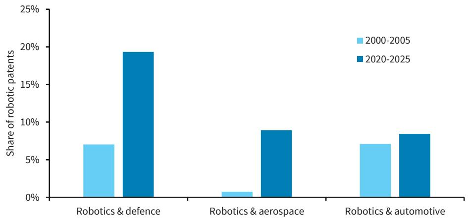

bar

| Category | 2000-2005 (%) | 2020-2025 (%) |
| :--- | :--- | :--- |
| Robotics & defence | 7.1 | 19.3 |
| Robotics & aerospace | 0.8 | 9.0 |
| Robotics & automotive | 7.2 | 8.6 |

Source: PATSTAT Autumn 2025, BARC

# Implications for investors and lessons from China

1. Opportunities among the technology stack, not just the end product. Our analysis suggests that returns will likely concentrate in five foundational technologies: autonomy software, sensing, actuation, batteries and edge controls. These capabilities are reusable across robotics, defence, energy and space, expanding the addressable market. For example, solid-state batteries extend humanoid run-time, underpin grid-scale power storage, enable longer-range drones and extend satellite life due to their lighter weight and radiation tolerance. Suppliers of components and enabling technologies therefore benefit from multiple, overlapping adoption waves, reducing reliance on any single end market or deployment timeline.

2. Defence and frontier demand provide downside protection. Spillovers into defence energy and even potentially space tech introduce non-cyclical demand sources. This can stabilise revenues and accelerate scale, especially where public procurement underwrites early adoption.

3. Many-use, not dual-use. As AI becomes more deeply embedded in modern economies, we are likely to see a shift in how investment themes are framed – away from allocating capital purely by industry (such as technology, healthcare, or defence) and towards investing across the technology stack. This cuts across how markets and governments are organised today – investors allocate capital by sector, and public spending is likewise structured along sectoral lines. Physical AI does not sit neatly within this framework. We argue that scale is unlikely to come from a single, viral application, but rather from the aggregation of multiple use cases deployed across a wide range of industries.

# Implications for policy

1. Industrial policy shifts from backing strategic industries to securing control over strategic technologies. Rather than treating robotics as a standalone sector, policy focus is increasingly turning to control over the underlying technology stack. Looking ahead, strategic autonomy is likely to mean treating the robotics supply chain as critical infrastructure.   
2. Supply-chain security now matters more than final assembly. Strategic vulnerability increasingly sits in components, inputs and software, not finished products. From a resilience perspective, our analysis identifies key choke points – most notably critical minerals, batteries and actuators (Figure 13 and Figure 14) – which are emerging as a new source of geopolitical leverage.   
3. Demand resilience matters as much as supply resilience. China already deploys a large number of robots domestically and, in our view, is likely to continue doing so. Deployment creates domestic demand not only for the end product, but for the entire upstream robotics ecosystem. This supports the development of end-to-end solutions that span every stage of the supply chain – a dynamic that the US and other Western economies will need to factor into their own industrial and technology strategies.

# Analyst(s) Certification(s):

We, Zornitsa Todorova and Carlos Eduardo Garcia Martinez, hereby certify (1) that the views expressed in this research report accurately reflect our personal views about any or all of the subject securities or issuers referred to in this research report and (2) no part of our compensation was, is or will be directly or indirectly related to the specific recommendations or views expressed in this research report.

# Important Disclosures:

BARC is produced by the Investment Bank of BARC Bank PLC and its affiliates (collectively and each individually, "BARC").

All authors contributing to this research report are Research Analysts unless otherwise indicated. The publication date at the top of the report reflects the local time where the report was produced and may differ from the release date provided in GMT.

# Availability of Disclosures:

For current important disclosures regarding any issuers which are the subject of this research report please refer to https://publicresearch.BARC.com or alternatively send a written request to: BARC Compliance, 745 Seventh Avenue, 13th Floor, New York, NY 10019 or call +1-212-526-1072.

BARC Capital Inc. and/or one of its affiliates does and seeks to do business with companies covered in its research reports. As a result, investors should be aware that BARC may have a conflict of interest that could affect the objectivity of this report. BARC Capital Inc. and/or one of its affiliates regularly trades, generally deals as principal and generally provides liquidity (as market maker or otherwise) in the debt securities that are the subject of this research report (and related derivatives thereof). BARC trading desks may have either a long and / or short position in such securities, other financial instruments and / or derivatives, which may pose a conflict with the interests of investing customers. Where permitted and subject to appropriate information barrier restrictions, BARC fixed income research analysts regularly interact with its trading desk personnel regarding current market conditions and prices. BARC fixed income research analysts receive compensation based on various factors including, but not limited to, the quality of their work, the overall performance of the firm (including the profitability of the Investment Banking Department), the profitability and revenues of the Markets business and the potential interest of the firm's investing clients in research with respect to the asset class covered by the analyst. To the extent that any historical pricing information was obtained from BARC trading desks, the firm makes no representation that it is accurate or complete. All levels, prices and spreads are historical and do not necessarily represent current market levels, prices or spreads, some or all of which may have changed since the publication of this document. BARC Department produces various types of research including, but not limited to, fundamental analysis, equity-linked analysis, quantitative analysis, and trade ideas. Recommendations and trade ideas contained in one type of BARC may differ from those contained in other types of BARC, whether as a result of differing time horizons, methodologies, or otherwise.

In order to access BARC Statement regarding Research Dissemination Policies and Procedures, please refer to https://publicresearch.BARC.com/S/RD.htm. In order to access BARC Conflict Management Policy Statement, please refer to: https://publicresearch.BARC.com/S/CM.htm.

# Disclosure(s) regarding Information Sources

Bloomberg® is a trademark and service mark of Bloomberg Finance L.P. and its affiliates (collectively “Bloomberg”) and the Bloomberg Indices are trademarks of Bloomberg. Bloomberg or Bloomberg’s licensors own all proprietary rights in the Bloomberg Indices. Bloomberg does not approve or endorse this material, or guarantee the accuracy or completeness of any information herein, or make any warranty, express or implied, as to the results to be obtained therefrom and, to the maximum extent allowed by law, Bloomberg shall have no liability or responsibility for injury or damages arising in connection therewith.

All pricing information is indicative only. Unless otherwise indicated, prices are sourced from LSEG Data & Analytics and reflect the closing price in the relevant trading market, which may not be the last available price at the time of publication.

# Types of investment recommendations produced by BARC FICC Research:

In addition to any ratings assigned under BARC' formal rating systems, this publication may contain investment recommendations in the form of trade ideas, thematic screens, scorecards or portfolio recommendations that have been produced by analysts in FICC Research. Any such investment recommendations produced by non-Credit Research teams shall remain open until they are subsequently amended, rebalanced or closed in a future research report. Any such investment recommendations produced by the Credit Research teams are valid at current market conditions and may not be otherwise relied upon.

# Disclosure of other investment recommendations produced by BARC FICC Research:

BARC FICC Research may have published other investment recommendations in respect of the same securities/instruments recommended in this research report during the preceding 12 months. To view all investment recommendations published by BARC FICC Research in the preceding 12 months please refer to https://live.barcap.com/go/research/Recommendations.

BARC does not assign ratings to asset backed securities. BARC Capital Inc. and/or one of its affiliates may have acted as an underwriter for public offerings of any asset backed securities that are otherwise recommended in trade ideas contained within its securitised research reports.

# Legal entities involved in producing BARC:

BARC Bank PLC (BARC, UK)

BARC Capital Inc. (BCI, US)

BARC Bank Ireland PLC, Frankfurt Branch (BBI, Frankfurt)

BARC Bank Ireland PLC, Paris Branch (BBI, Paris)

BARC Bank Ireland PLC, Milan Branch (BBI, Milan)

BARC Securities Japan Limited (BSJL, Japan)

BARC Bank PLC, Hong Kong Branch (BARC Bank, Hong Kong)

BARC Bank Mexico, S.A. (BBMX, Mexico)

BARC Capital Casa de Bolsa, S.A. de C.V. (BCCB, Mexico)

BARC Securities (India) Private Limited (BSIPL, India)

BARC Bank PLC, Singapore Branch (BARC Bank, Singapore)

BARC Bank PLC, DIFC Branch (BARC Bank, DIFC)

# Disclaimer:

This publication has been produced by BARC Department in the Investment Bank of BARC Bank PLC and/or one or more of its affiliates (collectively and each individually, "BARC").

It has been prepared for institutional investors and not for retail investors. It has been distributed by one or more BARC affiliated legal entities listed below or by an independent and non-affiliated third-party entity (as may be communicated to you by such third-party entity in its communications with you). It is provided for information purposes only, and BARC makes no express or implied warranties, and expressly disclaims all warranties of merchantability or fitness for a particular purpose or use with respect to any data included in this publication. To the extent that this publication states on the front page that it is intended for institutional investors and is not subject to all of the independence and disclosure standards applicable to debt research reports prepared for retail investors under U.S. FINRA Rule 2242, it is an “institutional debt research report” and distribution to retail investors is strictly prohibited. BARC also distributes such institutional debt research reports to various issuers, media, regulatory and academic organisations for their own internal informational news gathering, regulatory or academic purposes and not for the purpose of making investment decisions regarding any debt securities. Media organisations are prohibited from re-publishing any opinion or recommendation concerning a debt issuer or debt security contained in any BARC institutional debt research report. Any such recipients that do not want to continue receiving BARC institutional debt research reports should contact debtresearch@BARC.com. Unless clients have agreed to receive “institutional debt research reports” as required by US FINRA Rule 2242, they will not receive any such reports that may be co-authored by non-debt research analysts. Eligible clients may get access to such cross asset reports by contacting debtresearch@BARC.com. BARC will not treat unauthorized recipients of this report as its clients and accepts no liability for use by them of the contents which may not be suitable for their personal use. Prices shown are indicative and BARC is not offering to buy or sell or soliciting offers to buy or sell any financial instrument.

Without limiting any of the foregoing and to the extent permitted by law, in no event shall BARC, nor any affiliate, nor any of their respective officers, directors, partners, or employees have any liability for (a) any special, punitive, indirect, or consequential damages; or (b) any lost profits, lost revenue, loss of anticipated savings or loss of opportunity or other financial loss, even if notified of the possibility of such damages, arising from any use of this publication or its contents.

Other than disclosures relating to BARC, the information contained in this publication (including third-party data) has been obtained from sources that BARC believes to be reliable, but BARC does not represent or warrant that it is accurate or complete. Third-party data, including third-party forecasts and predictions, is provided for information purposes only, has not been adopted or endorsed by BARC, and does not represent the views or opinions of BARC. Presentations by Third-Party Speakers: Any views or opinions expressed by third-party speakers during a BARC-hosted event are solely those of the speaker and do not represent the views or opinions of BARC. BARC is not responsible for, and makes no warranties whatsoever as to, the information or opinions contained in any written, electronic, audio or video presentations by any third-party speakers, and such presentations have not been adopted or endorsed by BARC and do not represent the views or opinions of BARC. Content from third-party presentations is provided for information purposes only and has not been independently verified by BARC for its accuracy or completeness.

The views in this publication are solely and exclusively those of the authoring analyst(s) and are subject to change, and BARC has no obligation to update its opinions or the information in this publication. Unless otherwise disclosed herein, the analysts who authored this report have not received any compensation from the subject companies in the past 12 months. If this publication contains recommendations, they are general recommendations that were prepared independently of any other interests, including those of BARC and/or its affiliates, and/or the subject companies. This publication does not contain personal investment recommendations or investment advice or take into account the individual financial circumstances or investment objectives of the clients who receive it. BARC is not a fiduciary to any recipient of this publication. The securities and other investments discussed herein may not be suitable for all investors and may not be available for purchase in all jurisdictions. The United States imposed sanctions on certain Chinese companies (https://ofac.treasury.gov/sanctions-programs-and-country-information/chinese-military-companies-sanctions), which may restrict U.S. persons from purchasing securities issued by those companies. Investors must independently evaluate the merits and risks of the investments discussed herein, including any sanctions restrictions that may apply, consult any independent advisors they believe necessary, and exercise independent judgment with regard to any investment decision. The value of and income from any investment may fluctuate from day to day as a result of changes in relevant economic markets (including changes in market liquidity). The information herein is not intended to predict actual results, which may differ substantially from those reflected. Past performance is not necessarily indicative of future results. The information provided does not constitute a financial benchmark and should not be used as a submission or contribution of input data for the purposes of determining a financial benchmark.

This publication is not investment company sales literature as defined by Section 270.24(b) of the US Investment Company Act of 1940, nor is it intended to constitute an offer, promotion or recommendation of, and should not be viewed as marketing (including, without limitation, for the purposes of the UK Alternative Investment Fund Managers Regulations 2013 (SI 2013/1773) or AIFMD (Directive 2011/61)) or pre-marketing (including, without limitation, for the purposes of Directive (EU) 2019/1160) of the securities, products or issuers that are the subject of this report.

Third Party Distribution: Any views expressed in this communication are solely those of BARC and have not been adopted or endorsed by any third party distributor.

United Kingdom: This document is being distributed (1) only by or with the approval of an authorised person (BARC Bank PLC) or (2) to, and is directed at (a) persons in the United Kingdom having professional experience in matters relating to investments and who fall within the definition of "investment professionals" in Article 19(5) of the Financial Services and Markets Act 2000 (Financial Promotion) Order 2005 (the "Order"); or (b) high net worth companies, unincorporated associations and partnerships and trustees of high value trusts as described in Article 49(2) of the Order; or (c) other persons to whom it may otherwise lawfully be communicated (all such persons being "Relevant Persons"). Any investment or investment activity to which this communication relates is only available to and will only be engaged in with Relevant Persons. Any other persons who receive this

communication should not rely on or act upon it. BARC Bank PLC is authorised by the Prudential Regulation Authority and regulated by the Financial Conduct Authority and the Prudential Regulation Authority and is a member of the London Stock Exchange.

European Economic Area (“EEA”): This material is being distributed to any “Authorised User” located in a Restricted EEA Country by BARC Bank Ireland PLC. The Restricted EEA Countries are Austria, Bulgaria, Estonia, Finland, Hungary, Iceland, Liechtenstein, Lithuania, Luxembourg, Malta, Portugal, Romania, Slovakia and Slovenia. For any other “Authorised User” located in a country of the European Economic Area, this material is being distributed by BARC Bank PLC. BARC Bank Ireland PLC is a bank authorised by the Central Bank of Ireland whose registered office is at 1 Molesworth Street, Dublin 2, Ireland. BARC Bank PLC is not registered in France with the Autorité des marchés financiers or the Autorité de contrôle prudentiel. Authorised User means each individual associated with the Client who is notified by the Client to BARC and authorised to use the Research Services. The Restricted EEA Countries will be amended if required.

Finland: Notwithstanding Finland's status as a Restricted EEA Country, Research Services may also be provided by BARC Bank PLC where permitted by the terms of its cross-border license.

Americas: The Investment Bank of BARC Bank PLC undertakes U.S. securities business in the name of its wholly owned subsidiary BARC Capital Inc., a FINRA and SIPC member. BARC Capital Inc., a U.S. registered broker/dealer, is distributing this material in the United States and, in connection therewith accepts responsibility for its contents. Any U.S. person wishing to effect a transaction in any security discussed herein should do so only by contacting a representative of BARC Capital Inc. in the U.S. at 745 Seventh Avenue, New York, New York 10019.

Non-U.S. persons should contact and execute transactions through a BARC Bank PLC branch or affiliate in their home jurisdiction unless local regulations permit otherwise.

This material is distributed in Canada by BARC Capital Canada Inc., a registered investment dealer, a Dealer Member of Canadian Investment Regulatory Organization (www.ciro.ca), and a Member of the Canadian Investor Protection Fund (CIPF).

This material is distributed in Mexico by BARC Bank Mexico, S.A. and/or BARC Capital Casa de Bolsa, S.A. de C.V. This material is distributed in the Cayman Islands and in the Bahamas by BARC Capital Inc., which it is not licensed or registered to conduct and does not conduct business in, from or within those jurisdictions and has not filed this material with any regulatory body in those jurisdictions.

Japan: This material is being distributed to institutional investors in Japan by BARC Securities Japan Limited. BARC Securities Japan Limited is a joint-stock company incorporated in Japan with registered office of 6-10-1 Roppongi, Minato-ku, Tokyo 106-6131, Japan. It is a subsidiary of BARC Bank PLC and a registered financial instruments firm regulated by the Financial Services Agency of Japan. Registered Number: Kanto Zaimukyokucho (kinsho) No. 143.

Asia Pacific (excluding Japan): BARC Bank PLC, Hong Kong Branch is distributing this material in Hong Kong as an authorised institution regulated by the Hong Kong Monetary Authority. Registered Office: 41/F, Cheung Kong Center, 2 Queen's Road Central, Hong Kong.

All Indian securities-related research and other equity research produced by BARC' Investment Bank are distributed in India by BARC Securities (India) Private Limited (BSIPL). BSIPL is a company incorporated under the Companies Act, 1956 having CIN U67120MH2006PTC161063. BSIPL is registered and regulated by the Securities and Exchange Board of India (SEBI) as a Research Analyst: INH000001519; Portfolio Manager INP000002585; Stock Broker INZ000269539 (member of NSE and BSE); Depository Participant with the National Securities & Depositories Limited (NSDL): DP ID: IN-DP-NSDL-478-2020; Investment Adviser: INA000000391. BSIPL is also registered as a Mutual Fund Advisor having AMFI ARN No. 53308. The registered office of BSIPL is at Nirlon Knowledge Park, 9th floor, Block B-6, Off. Western Express Highway, Goregaon (East), Mumbai – 400063, India. Telephone No: +91 22 61754000 Fax number: +91 22 61754099. Any other reports produced by BARC' Investment Bank are distributed in India by BARC Bank PLC, India Branch, an associate of BSIPL in India that is registered with Reserve Bank of India (RBI) as a Banking Company under the provisions of The Banking Regulation Act, 1949 (Regn No BOM43) and registered with SEBI as Merchant Banker (Regn No INM000002129) and also as Banker to the Issue (Regn No INBI00000950). BARC Investments and Loans (India) Limited, registered with RBI as Non Banking Financial Company (Regn No RBI CoR-07-00258), and BARC Wealth Trustees (India) Private Limited, registered with Registrar of Companies (CIN U93000MH2008PTC188438), are associates of BSIPL in India that are not authorised to distribute any reports produced by BARC' Investment Bank.

This material is distributed in Singapore by the Singapore Branch of BARC Bank PLC, a bank licensed in Singapore by the Monetary Authority of Singapore. For matters in connection with this material, recipients in Singapore may contact the Singapore branch of BARC Bank PLC, whose registered address is 10 Marina Boulevard, #23-01 Marina Bay Financial Centre Tower 2, Singapore 018983.

This material, where distributed to persons in Australia, is produced or provided by BARC Bank PLC.

This communication is directed at persons who are a “Wholesale Client” as defined by the Australian Corporations Act 2001.

Please note that the Australian Securities and Investments Commission (ASIC) has provided certain exemptions to BARC Bank PLC (BBPLC) under paragraph 911A(2)(I) of the Corporations Act 2001 from the requirement to hold an Australian financial services licence (AFSL) in respect of financial services provided to Australian Wholesale Clients, on the basis that BBPLC is authorised by the Prudential Regulation Authority of the United Kingdom (PRA) and regulated by the Financial Conduct Authority (FCA) of the United Kingdom and the PRA under United Kingdom laws. The United Kingdom has laws which differ from Australian laws. To the extent that this communication involves the provision of financial services by BBPLC to Australian Wholesale Clients, BBPLC relies on the relevant exemption from the requirement to hold an AFSL. Accordingly, BBPLC does not hold an AFSL.

This communication may be distributed to you by either: (i) BARC Bank PLC directly, (ii) Barrenjoey Markets Pty Limited (ACN 636 976 059, "Barrenjoey"), the holder of Australian Financial Services Licence (AFSL) 521800, a non-affiliated third party distributor, where clearly identified to you by Barrenjoey. Barrenjoey is not an agent of BARC Bank PLC or (iii) such other non-affiliated third-party distributor(s) as may be clearly identified to you. Such non-affiliated third-party distributor(s) are not agents of BARC Bank PLC.

This material, where distributed in New Zealand, is produced or provided by BARC Bank PLC. BARC Bank PLC is not registered, filed with or approved by any New Zealand regulatory authority. This material is not provided under or in accordance with the Financial Markets Conduct Act of 2013 (“FMCA”), and is not a disclosure document or “financial advice” under the FMCA. This material is distributed to you by either: (i) BARC Bank PLC directly or (ii) Barrenjoey Markets Pty Limited (“Barrenjoey”), a non-affiliated third party distributor, where clearly identified to you by Barrenjoey. Barrenjoey is not an agent of BARC Bank PLC. This material may only be distributed to “wholesale investors” that meet the “investment business”, “investment activity”, “large”, or “government agency” criteria specified in Schedule 1 of the FMCA.

Middle East: Nothing herein should be considered investment advice as defined in the Israeli Regulation of Investment Advisory, Investment Marketing and Portfolio Management Law, 1995 (“Advisory Law”). This document is being made to eligible clients (as defined under the Advisory Law) only. BARC Israeli branch previously held an investment marketing license with the Israel Securities Authority but it cancelled such license on 30/11/2014 as it solely provides its services to eligible clients pursuant to available exemptions under the Advisory Law, therefore a license with the Israel Securities Authority is not required. Accordingly, BARC does not maintain an insurance coverage pursuant to the Advisory Law.

This material is distributed in the United Arab Emirates (including the Dubai International Financial Centre) and Qatar by BARC Bank PLC. BARC Bank PLC in the Dubai International Financial Centre (Registered No. 0060) is regulated by the Dubai Financial Services Authority (DFSA). Principal place of business in the Dubai International Financial Centre: The Gate Village, Building 4, Level 4, PO Box 506504, Dubai, United Arab Emirates. BARC Bank PLC-DIFC Branch, may only undertake the financial services activities that fall within the scope of its existing DFSA licence. Related financial products or services are only available to Professional Clients, as defined by the Dubai Financial Services Authority. BARC Bank PLC in the UAE is regulated by the Central Bank of the UAE and is licensed to conduct business activities as a branch of a commercial bank incorporated outside the UAE in Dubai (Licence No.: 13/1844/2008, Registered Office: Building No. 6, Burj Dubai Business Hub, Sheikh Zayed Road, Dubai City) and Abu Dhabi (Licence No.: 13/952/2008, Registered Office: Al Jazira Towers, Hamdan Street, PO Box 2734, Abu Dhabi). This material does not constitute or form part of any offer to issue or sell, or any solicitation of any offer to subscribe for or purchase, any securities or investment products in the UAE (including the Dubai International Financial Centre) and accordingly should not be construed as such. Furthermore, this information is being made available on the basis that the recipient acknowledges and understands that the entities and securities to which it may relate have not been approved, licensed by or registered with the UAE Central Bank, the Dubai Financial Services Authority or any other relevant licensing authority or governmental agency in the UAE. The content of this report has not been approved by or filed with the UAE Central Bank or Dubai Financial Services Authority. BARC Bank PLC in the Qatar Financial Centre (Registered No. 00018) is authorised by the Qatar Financial Centre Regulatory Authority (QFCRA). BARC Bank PLC-QFC Branch may only undertake the regulated activities that fall within the scope of its existing QFCRA licence. Principal place of business in Qatar: Qatar Financial Centre, Office 1002, 10th Floor, QFC Tower, Diplomatic Area, West Bay, PO Box 15891, Doha, Qatar. Related financial products or services are only available to Business Customers as defined by the Qatar Financial Centre Regulatory Authority.

Russia: This material is not intended for investors who are not Qualified Investors according to the laws of the Russian Federation as it might contain information about or description of the features of financial instruments not admitted for public offering and/or circulation in the Russian Federation and thus not eligible for non-Qualified Investors. If you are not a Qualified Investor according to the laws of the Russian Federation, please dispose of any copy of this material in your possession.

Sustainable Investing Related Research: There is currently no globally accepted framework or definition (legal, regulatory or otherwise) of, nor market consensus as to what constitutes a ‘sustainable’, ‘ESG’, ‘green’, ‘climate-friendly’ or an equivalent company, investment, strategy or consideration or what precise attributes are required to be eligible to be categorised by such terms. This means there are different ways to evaluate a company or an investment and so different values may be placed on certain sustainability credentials as well as adverse ESG-related impacts of companies and ESG controversies. The evolving nature of sustainable investing considerations, models and methodologies means it can be challenging to definitively and universally classify a company or investment under a sustainable investing label and there may be areas where such companies and investments could improve or where adverse ESG-related impacts or ESG controversies exist. The evolving nature of sustainable finance related regulations and the development of jurisdiction-specific regulatory criteria also means that there is likely to be a degree of divergence as to the interpretation of such terms in the market. We expect industry guidance, market practice, and regulations in this field to continue to evolve.

Any information, data, image, or other content including from a third party source contained, referred to herein or used for whatsoever purpose by BARC or a third party (“Information”), in relation to any actual or potential ‘ESG’, ‘sustainable’ or equivalent objective, issue, factor or consideration is not intended to be relied upon for ESG or sustainability classification, regulatory regime or industry initiative purposes (“ESG Regimes”), unless otherwise stated. Nothing in these materials, including any images included therein, is intended to convey, suggest or indicate that BARC considers or represents any product, service, person or body mentioned in these materials as meeting or qualifying for any ESG or sustainability classification, label or similar standards that may exist under ESG Regimes. BARC has not conducted any assessment of compliance with ESG Regimes. Parties are reminded to make their own assessments for these purposes.

IRS Circular 230 Prepared Materials Disclaimer: BARC does not provide tax advice and nothing contained herein should be construed to be tax advice. Please be advised that any discussion of U.S. tax matters contained herein (including any attachments) (i) is not intended or written to be used, and cannot be used, by you for the purpose of avoiding U.S. tax-related penalties; and (ii) was written to support the promotion or marketing of the transactions or other matters addressed herein. Accordingly, you should seek advice based on your particular circumstances from an independent tax advisor.

© Copyright BARC Bank PLC (2026). All rights reserved. No part of this publication may be reproduced or redistributed in any manner without the prior written permission of BARC. BARC Bank PLC is registered in England No. 1026167. Registered office 1 Churchill Place, London, E14 5HP. Additional information regarding this publication will be furnished upon request.