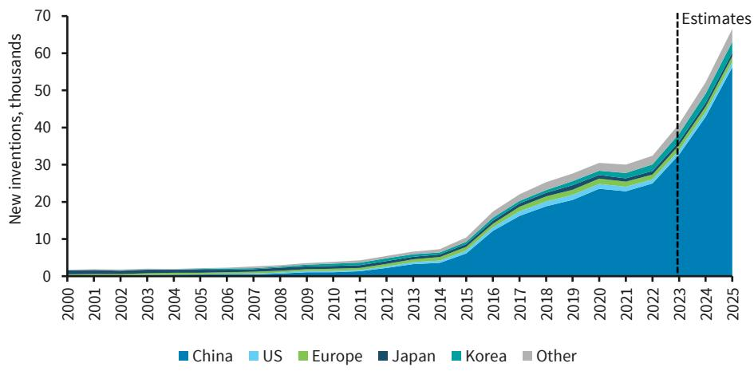
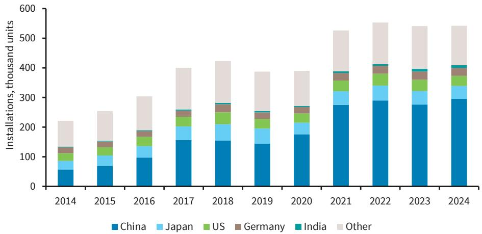

# The Decade of the Robot Belongs to China: How State-Guided Innovation Is Reshaping the Global Labor Market

The defining economic shift of the next decade will not be artificial intelligence in software, but artificial intelligence in hardware. While the world has been fixated on large language models and generative AI, a quieter and more consequential transformation has been underway in factories, supply chains, and research laboratories. The physical manifestation of AI—robotics, and specifically humanoid robots—has reached an inflection point that demands the attention of every serious investor and policymaker.

China has already won the first phase of this race. The numbers are stark and undeniable. In 2024, China installed nearly 300,000 industrial robots, compared to just 34,000 in the United States. By 2025, Chinese companies accounted for approximately 85% of global humanoid robot installations. This is not a future projection or a speculative forecast. It is the current reality. The question is no longer whether robotics will transform labor markets, but who controls the technology stack that will enable that transformation.

The implications extend far beyond manufacturing competitiveness. Humanoid robots are projected to reach 3.8% of China's effective labor capacity by 2035, offsetting roughly 60% of the country's projected workforce decline. For a nation facing a 37-million worker shortfall this decade, this is not merely an industrial strategy—it is a demographic survival plan. The rest of the world must now grapple with what it means to be a generation behind in a technology that will define the next era of productivity.

## China's robotics dominance is not accidental but engineered through a decade of coordinated industrial policy spanning the full technology stack

The conventional narrative suggests that China's manufacturing advantage stems from low labor costs. This is now dangerously outdated. China's robotics leadership is the product of a deliberate, state-guided strategy that has been in motion since the early 2010s. The results are visible across every layer of the robotics ecosystem.

Consider the patent data, which serves as a forward-looking signal of technological intent. Analysis of over 300,000 robotics patents since 2000 reveals that China now accounts for approximately 70% of global robotics inventions. In 2023 alone, China recorded over 30,000 robotics patent inventions—nearly thirty times the number in the United States. This is not a narrow lead in a single subfield. It is comprehensive dominance across industrial robots, humanoids, drones, and the component technologies that underpin them all.

The structure of China's innovation engine is distinct from the Western model. Universities and state research institutes account for over 30% of China's robotics patent inventions, compared to roughly 10% in the United States. This reflects an industrial policy framework, formalized through initiatives such as Made in China 2025, that places public research institutions at the core of technology development. The result is a pipeline that moves from academic discovery to commercial deployment with unusual speed and coordination.

China's supply chain control is equally comprehensive. The country now accounts for over 90% of global refined rare earths, which are essential for the motors and actuators that give robots movement. It holds the largest global export share in batteries at 45%. Domestic production of industrial robots installed in China has risen from near zero in 2011 to approximately 57% in 2024. This is not import substitution in the traditional sense. It is the construction of a self-contained ecosystem that is increasingly independent of foreign suppliers.

## The humanoid deployment curve is following the same trajectory as electric vehicles, suggesting exponential growth that most investors are underestimating

The most instructive parallel for understanding humanoid adoption is not previous robotics cycles but the electric vehicle revolution in China. The pattern is remarkably similar: state subsidies create initial demand, domestic manufacturers scale production rapidly, costs fall, and deployment accelerates as the technology becomes economically viable for broader applications.

The data already shows this pattern emerging. Global humanoid installations jumped from approximately 2,000 units in 2024 to an estimated 15,000 in 2025. Based on announced projects and company guidance, 2026 deployments could reach 60,000 units. If the EV adoption curve is any guide, these numbers could compound far faster than linear projections suggest. The upper-bound estimate from our analysis suggests annual deployments could reach up to 13 million units by 2035, with roughly 11 million of those in China.

The demographic imperative provides the demand driver that makes this trajectory plausible. China's working-age population is shrinking rapidly, creating a 37-million labor shortfall that threatens the country's $4.7 trillion manufacturing base. Humanoid robots are not a luxury or an experiment in this context. They are an economic necessity. The cost of deploying a humanoid robot must be compared not to the cost of a human worker at current wages, but to the cost of not having a worker at all.

This creates a domestic market large enough to absorb millions of units, which in turn drives the scale economies that reduce costs for everyone. By 2035, humanoid robots could add the equivalent of 3.8% to China's effective labor force—roughly 24 million units in stock. This would offset up to 60% of the projected workforce decline, effectively buying China a demographic buffer that no other aging economy possesses.

## The Western response remains fragmented, creating a strategic vulnerability that will take years to address

The United States and Europe are not absent from the robotics race, but they are structurally disadvantaged in ways that cannot be remedied by private sector initiative alone. The American robotics ecosystem is more consumer-led and venture-capital-funded, which produces innovative prototypes but struggles with the manufacturing scale that China achieves as a matter of routine.

Security concerns are likely to impose additional constraints on Western adoption of Chinese humanoids. Data security, intellectual property risks, and the potential for surveillance capabilities embedded in physical robots are not theoretical concerns. They are likely to result in regulatory guardrails that limit the deployment of Chinese-made humanoids in sensitive Western industries and government applications. This creates a window for Western producers, but it is a narrow one.

The Western path to competitiveness requires consolidation and industrial policy support on a scale that has not yet materialized. The US currently installs roughly 34,000 industrial robots annually, compared to China's 295,000. The patent gap is even wider. Closing this gap will require more than tax incentives or research grants. It will require a coordinated strategy that spans basic research, component manufacturing, and deployment infrastructure.

The challenge is compounded by the fact that robotics innovation is cumulative and path-dependent. China's head start in patenting means that subsequent innovations will build on a foundation of Chinese intellectual property. Western firms may find themselves paying licensing fees or developing workarounds for technologies that Chinese firms already own. This is the same dynamic that played out in telecommunications and is now playing out in batteries.

## One-fifth of robotics patents are linked to defense applications, elevating the entire supply chain to critical infrastructure status

The strategic significance of robotics extends beyond commercial competition into national security. Our analysis reveals that roughly one-fifth of robotics patents have direct linkages to the defense industry. The foundational technologies—sensing, navigation, actuation, and autonomous decision-making—are shared across civilian and military applications.

This overlap means that the robotics supply chain is not merely an industrial policy concern. It is a national security concern. Countries that depend on foreign suppliers for critical robotics components expose themselves to supply disruptions, technology denial, and embedded vulnerabilities. The same actuators that give a humanoid robot dexterity can be repurposed for military applications. The same navigation systems that guide a warehouse robot can guide an unmanned vehicle.

The implications for investors are clear: strategic value lies in the technology stack, not just the end product. Companies that control key components—motors, batteries, sensors, control software—occupy positions of structural advantage that are likely to persist regardless of shifts in final product market share. Policymakers face a similar calculus: investments in robotics are investments in national competitiveness and security, and they should be treated accordingly.

## What the report does not fully answer: the economics of humanoid replacement and the timeline for Western catch-up

For all of the data and analysis presented, several critical questions remain unresolved. The first concerns the unit economics of humanoid deployment at scale. While the report projects deployment numbers, the cost trajectory that would make those numbers economically rational is less certain. At what price point does a humanoid robot become cheaper than a human worker in a Chinese factory? How does that calculus change when maintenance, energy, software updates, and depreciation are factored in? The EV analogy suggests costs will fall rapidly, but the components of a humanoid robot are more complex and less standardized than those of an electric vehicle.

The second open question is the timeline for Western catch-up. The report notes that the US and Europe remain in the race, but it does not specify the conditions under which they could close the gap. Is it possible for the West to leapfrog Chinese robotics with next-generation technologies, or is the Chinese advantage in manufacturing scale insurmountable within this decade? The answer likely depends on policy choices that have not yet been made.

The third question is geopolitical: will Western markets accept Chinese humanoids in non-sensitive applications, or will security concerns create a bifurcated global market with separate Chinese and Western robotics ecosystems? The answer to this question will determine whether Chinese robotics companies can access global markets beyond their domestic base, and whether Western companies can achieve the scale necessary to compete.

## A decision framework for investors and policymakers navigating the robotics transformation

For investors, the robotics opportunity is real but requires a differentiated approach. The temptation is to focus on the most visible humanoid manufacturers, but the structural value may lie elsewhere. Consider the following framework:

First, map the supply chain from raw materials to final assembly. The companies that control bottleneck components—rare earth magnets, precision actuators, high-density batteries, real-time control software—are likely to capture disproportionate value regardless of which manufacturer wins the final assembly competition.

Second, distinguish between technology readiness and deployment readiness. China leads in deployment because it has the manufacturing infrastructure and policy support to produce at scale. But Western companies may lead in certain foundational technologies, particularly in AI software and sensor systems. Identify which technologies are truly scarce and which are commoditized.

Third, assess regulatory risk as a factor in competitive dynamics. Chinese humanoids face headwinds in Western markets due to security concerns. This creates protected market space for Western producers, but only if they can achieve competitive cost structures. The regulatory environment is not a static backdrop; it is a dynamic variable that can accelerate or retard adoption.

For policymakers, the framework is more urgent. The window for building domestic robotics capacity is closing. The investments required are long-term and patient, which means they are unlikely to be made by venture capital alone. Industrial policy, research funding, and procurement programs must be coordinated and sustained. The countries that treat robotics as critical infrastructure rather than a commercial sector will be the ones that build the most resilient economies.

## Join the community to read the full report and review the original charts

The data presented here represents only a fraction of the analysis available in the full report. The patent-level breakdowns, the company-specific deployment projections, the comparative analysis of innovation models across countries—these details matter for anyone making investment or policy decisions in this space. The original charts provide visual context that is essential for understanding the scale and trajectory of the robotics transformation. Join the community to read the full report and review the original charts.

*This article is for learning and discussion only and does not constitute investment advice.*

Personal reading notes and learning share only. Not investment advice.

