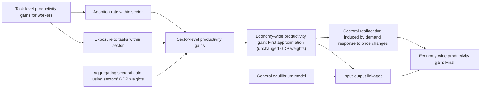

你是闲鱼资料类商品文案编辑，擅长把一份投研/行业/公司研报改写成适合闲鱼发布的商品说明。

【目标】
- 基于下面研报解析内容，生成一份可以复制到闲鱼商品详情里的中文文案。
- 风格参考用户提供的闲鱼对标笔记：标题直给、信息密度高、用途明确、适合人群明确、交付方式清楚。
- 语言要自然，像真实卖家发布，不要像公众号文章、小红书笔记或 AI 摘要。
- 不要使用太夸张的营销词，不要承诺收益，不要说“稳赚”“内幕”“必涨”。
- 可以适度口语化，但不要低俗。

【必须输出结构】
1. `闲鱼标题：` 一行，控制在 30 字以内，适合商品标题。
2. `商品描述：` 正文，适合直接粘贴到闲鱼详情页。
3. `Hashtag：` 一行，给 6-10 个平台可用标签，用 `#` 开头，空格分隔。

【严禁输出】
- 不要输出 `建议价格：`。
- 不要输出 `搜索关键词：`。
- 不要输出“搜索词”“关键词”“搜索关键词”等栏目。
- 不要给具体价格区间、成交承诺或价格建议。

【商品描述写法】
- 第一段：直接说明这是什么报告，页数/语言/主题/公司或行业。如果页数、日期、语言不确定，就不要编。
- 第二段：说明适合谁，比如投研、券商面试、PE/VC、行业研究、学习参考、写报告等。
- 第三段：用 3-5 个亮点 bullet，风格参考：
  ✅ 三大情景框架：DCF、P/ARR、EV/Sales
  ✅ 关键变量分析
  ✅ 估值逻辑、假设、终值占比等核心内容覆盖
  ✅ 适合准备 AI 相关面试、研究 AI 估值的同学
- 第四段：交付说明，参考：`资料为电子版 PDF，拍下后 24 小时内发网盘链接或邮箱。`
- 第五段：虚拟商品说明，参考：`电子类资料一经发货不退不换，有问题可以提前咨询。`
- 可以补一句：`需要其他报告也可以私聊，支持一站式咨询。`

【Hashtag 写法】
- 只输出平台相对安全、偏学习和资料属性的标签。
- 推荐从这些里选择：`#学习资料` `#研究笔记` `#学习笔记` `#行业研究` `#研报资料` `#资料整理` `#报告学习` `#案例研究`。
- 不要输出 `#财经` `#投资` `#股票` `#基金` `#理财` `#暴富` `#内幕` 等敏感标签。

【平台发布合规要求】
- 不要出现“投资建议”“买入”“卖出”“强烈推荐”“稳赚”“保本”“必涨”“抄底”“上车”“内幕”“翻倍”等金融操作或收益承诺表达。
- “投资”相关词尽量改成“投研”“研究”“观察”“学习参考”；如果必须保留，也要保持中性。
- 不要出现“独家”“原版”“内部”“无水印”“全网最低”“最全”“最强”“必看”等高风险或极限词。
- 不要写“关注”“点赞”“求关注”“评论区留言”等直接互动诱导。
- 不要承诺资料一定可用于获利、就业、通过面试或获得收益。

【合规与避坑】
- 默认避免出现具体投行品牌名，比如“GS”“GS”“MS”，统一写作“投行研报”或“投行研报”。
- 不要承诺研究或交易结果。
- 不要伪造页数、日期、作者、公司覆盖范围。研报未给出时就不写。
- 不要输出解释说明，只输出闲鱼文案本身。

【研报解析内容】
"""
Global economic drivers

# How humanoid robotics matters for macro

Humanoid robotics have expanded automation to physical services; together with AI cognitive advances, this should boost productivity on a macro level. A jobless future is unlikely, but income could further shift from labour to capital and make access to electricity more important than demographics.

natural_image

Human robot inspecting car body on assembly line in a factory (no visible text or symbols)

# Humanoid robotics: Advances continue

# Long tradition of task automation

Machines that resemble humans in size and shape, can seamlessly move, communicate with humans and, thus, integrate into environments designed for humans have long captured imaginations. Such humanoid robots are no longer just in the realm of science fiction but are becoming reality. Recent progress on artificial intelligence allows for the fusing of the mechanical ability of existing robotics with artificial intelligence: humanoid robotics can be seen as 'embodied AI', bringing AI from the digital world of ideas on screens into the physical world.

But does that make them conceptually different from the automation of the past? Automation has a long history. It started with the industrial revolution and in recent decades has occurred mainly through industrial robots and personal computing in combination with the internet.

There is a rich body of research into how this automation has affected productivity, employment and wages, both with regard to the aggregate share of labour versus capital income and how it has affected different skill sets and region. $^{1}$

Please see analyst certifications and important disclosures beginning on page 16.

SIGNATURE

# Christian Keller

+44 (0) 20 7773 2031

christian.keller@BARC.com

BARC, UK

# Akash Utsav

+91 (0) 22 6175 1543

akash.utsav@BARC.com

BARC, UK

More recently, generative AI, predominantly in the form of large language models (LLMs), has dramatically expanded automation to cognitive tasks and has exposed services considered 'high-skill' (ie, requiring higher education), which thus far had been less affected by automation. Such high-skill cognitive work had in past decades typically also seen better trends in remuneration than 'mid-skill' work, which experienced downward pressure on their wages (eg, manufacturing, accounting). Given the potentially huge effect of gen AI, much research is has been directed in the last few year towards estimating AI's automation potential and effect on productivity, but also its distributional consequences. $^{2}$

FIGURE 1. Estimates for the economy-wide productivity gains from AI vary widely   

bar

| Study | Predicted Macro-Level Productivity Gain (pp) |
| --- | --- |
| Baily, Brynjolfsson and Korinek (2023, USA) | 2.6 |
| Mckinsey (2023, Global) | 3.4 |
| IMF (2024, UK) | 0.7 |
| Commission of France (2024, FRA) | 1.4 |
| Aghion and Bunel (2024, USA) | 1.0 |
| Bergeaud (2024, EA) | 0.5 |
| Acemoglu (2024, USA) | 0.3 |
| Anthropic Economic Research (2025, US) | 1.8 |
| OECD (G7, 2025) | 1.3 |

Note: When the source presents a range of estimates as the main result, the lower bound is the dark blue column and upper bound is shown by the light blue column. The estimates refer to the countries shown in brackets.   
Source: OECD Artificial Intelligence Papers (November 2024), Various articles and papers.

# Cognitive meets physical: From tasks to occupations

However, even this new automation through gen AI has something in common with the previous forms: it remains largely task specific. Current automation through LLMs still focuses on cognitive micro-tasks (eg, coding), the way software helped with word processing or accounting tasks and large factor robots performed certain task in auto manufacturing.

Humanoid robots join the cognitive with the physical. They could introduce an AI-enabled physical generality, exposing not only more individual physical tasks to automation, but also being able to perform various heterogeneous tasks combined. They could be broadly adaptable across a wide range of functions, instead of just optimising single tasks (as traditional robots), thus serving in many industries. Being able to move between environments designed for humans, they could replace bundles of low- and mid-skill tasks. In addition to assembling parts on production lines and transporting goods in warehouses, they could operate in less-structured environments, performing services in hospitality, maintenance, household work and healthcare, including as nurses in hospitals or assisting with eldercare.

In sum, humanoid robots might not only broaden the universe of tasks that can be automated but also be able to collapse previous task boundaries. This could enable a shift from from task to occupation-wide substitution. Put in the terms of economic theory: by merging cognitive and physical tasks, humanoid robots would increase the elasticity of substitution between labour and capital, especially in services thus far protected form automation due to their 'physical messiness'.

FIGURE 2. Humanoid robotics increases automation exposure to areas where AI does not reach   
Sectoral exposure to Generative AI and robotics technologies   

bar

| Sector | Exposure to GenAI (expanded capabilities, LLMs + software) | Robot exposure |
| :--- | :--- | :--- |
| Agric. | 0.21 | 0.85 |
| Accom. & food | 0.24 | 0.76 |
| Fishing | 0.25 | 0.82 |
| Food & tob. | 0.26 | 0.78 |
| Non-energ. min | 0.27 | 0.82 |
| Wood prod. | 0.28 | 0.78 |
| Construct. | 0.30 | 0.66 |
| Basic metals | 0.31 | 0.77 |
| Warehouse | 0.32 | 0.60 |
| Rubber/plast. | 0.32 | 0.76 |
| Non-met. min | 0.33 | 0.71 |
| Textiles | 0.35 | 0.66 |
| Mining sup. | 0.35 | 0.67 |
| Fab. metals | 0.36 | 0.71 |
| Manuf./rep. | 0.37 | 0.58 |
| Land trans. | 0.38 | 0.65 |
| Paper/print. | 0.38 | 0.68 |
| Water/waste | 0.38 | 0.68 |
| Motor veh. | 0.39 | 0.62 |
| Postal | 0.40 | 0.41 |
| Air trans. | 0.41 | 0.61 |
| Coke/petrol. | 0.41 | 0.65 |
| Other trans. | 0.41 | 0.61 |
| Water trans. | 0.41 | 0.64 |
| Chemicals | 0.42 | 0.60 |
| Pharma. | 0.42 | 0.59 |
| Machinery | 0.42 | 0.59 |
| Admin/sup. | 0.42 | 0.61 |
| Energy min. | 0.43 | 0.34 |
| Arts/rec. | 0.44 | 0.53 |
| Other serv. | 0.44 | 0.26 |
| Utilities | 0.45 | 0.31 |
| Elec equip. | 0.45 | 0.49 |
| Health/soc. | 0.47 | 0.52 |
| Whole/retail | 0.48 | 0.18 |
| Education | 0.48 | 0.38 |
| Real estate | 0.53 | 0.07 |
| Telecom. | 0.54 | 0.25 |
| Comp./elec. | 0.62 | 0.14 |
| Prof./tech | 0.63 | 0.27 |
| Publish/AV | 0.74 | 0.06 |
| IT/info serv. | 0.75 | 0.09 |
| Finance/ins. | 0.77 | 0.05 |

Source: OECD Artificial Intelligence Papers (November 2024)

# Hello productivity, bye bye Baumol and bottlenecks

# From micro- to macro-level productivity gains

Exposure, adoption and diffusion: From task, to sector, to economy

Paul Krugman famously stated that 'productivity isn't everything, but in the long run, it is almost everything'. Hence, the fundamental question with every new technology is how to estimate its potential macro-level (ie, economy-wide) productivity gains. Initially, a new technology typically shows large productivity gains in certain tasks, but it is far from clear that these micro-level gains will translate into comparable improvements on an aggregate macro level.

Approaching this task, the first set of question is: what are the observed productivity gains from the new technology in certain tasks; how many tasks in a sector are exposed to the new technology; and to what extent and how quickly will the technology be adopted in the relevant sectors so that potential gains are actually realised? Expressed as a formula:

task-specific productivity gains \* exposure \* adoption rate = sector's productivity gain

As a next step, the economy-wide productivity gains should be the sum of the sectoral gains weighted by the share each sector has in the economy's output (ie, its share in GDP):

sectoral productivity gains \* sectoral weights in GDP = GDP-wide productivity gain

This provides a first-order approximation of a positive microeconomic productivity shock on the aggregate economy, known as the Hulten's theorem (ie, formulated by economist Charles R. Hulten in 1978). It shows that under perfect competition and efficient allocation of resources, the effect of a shock to a firm's total factor productivity (TFP) on the economy's output can be approximated by the firm's sales share in the economy. $^{3}$

FIGURE 3. Micro-level productivity gains in specific task do not automatically result in macro-level productivity gains for the aggregate economy.   
Technology-driven productivity gains: from micro task-level to economy-wide macro-level   

flowchart

Source: Inspired by OECD Artificial Intelligence Papers (November 2024), BARC

# In-elasticities, frictions, reallocation: How growth is lost

Such estimates of productivity gains based on Hulten's theorem provide a first approximation. However, they depend on several crucial conditions, including no frictions and perfect competition that allows efficient resource allocation. These often do not reflect the economic reality, complicating any extrapolation from sectoral productivity gains to economy-wide gains.

As an entire economy adjusts to sectoral productivity shocks (ie, a 'general equilibrium mechanism'), the demand response, the related reallocation of resources across sectors and changes in the input-output linkages play an important role in shaping the aggregate productivity change. Inelastic demand and adjustment frictions in the factor reallocation can lower the aggregate gains.

The so-called 'Baumol's growth disease' explained an important part of this phenomenon. Baumol (1967) observed that sectors with rapid productivity growth (eg, agriculture and manufacturing in history), often had their share of GDP decline, while those with relatively slow productivity growth experienced increases: technologically stagnant sectors (eg, mostly services not exposed to automation, such as health care, certain maintenance work, etc.) would experience above-average cost and price increases, but because demand for them would be price-inelastic, their share of nominal GDP would increase. This, in turn, slows an economy's aggregate productivity growth. 'Baumol's growth disease' has been estimated to have lowered annual productivity growth for the US economy by slightly more than 0.5pp in the second half of the 20th century (Nordhaus, 2008).

An example for illustrative purpose: the services sectors 'legal services' and 'finance and insurance' contribute about 1.5% and 8%, respectively to US GDP. Together, that is roughly the same as the sector 'Educational services, health care, and social assistance' with 9% of GDP. Assuming that AI radically improves the productivity in the first two sectors but does not affect the latter, market prices for 'legal services' and 'finance and insurance' would likely fall: eg, advice on legal matters or on, say, the construction of an investment portfolio could be obtained via a few clicks on the mobile phone at minimal cost. If, at the same time, the demand for these services was relatively inelastic, eg, assuming the appetite for starting additional law suits would be saturated at some point regardless, demand in response to the lower price for these services would remain limited. Their share in GDP would decline relative to 'Educational services, health care, and social assistance', where productivity is unaffected by AI and demand remains steady or may even rise from the additional available income from cheaper legal and financial services.

Empirical studies on generative AI typically find that sectors are unevenly 'exposed' (ie, the share of tasks performed in a sector that benefits from gen AI). Knowledge-intensive services with strong reliance on cognitive tasks are typically most highly exposed versus low exposure of sectors dominated by manual tasks (eg, Eloundou et al, 2024; Felten et al, 2021). Hence, differences in sectoral productivity gains from AI and the related effect on sectoral output and prices could be quite large.

In line with this, a comprehensive analysis by the OECD (2024) on the potential macroeconomic productivity gains from AI finds that applying the historically observed dispersion in sectoral productivity performance would generate significant negative Baumol effects reducing the estimated aggregate productivity gains from AI by nearly a third.

FIGURE 4. Combining AI with robotics eliminates the negative Baumol's disease effect   

bar

| Scenario | Direct effect | Input-Output multiplier | Baumol effect | Total effect |
| --- | --- | --- | --- | --- |
| Scenario: Low adoption | 0.15 | 0.05 | - | 0.25 |
| Scenario: Large and concentrated gains in most exposed sectors | 0.55 | 0.35 | -0.25 | 0.65 |
| Scenario: AI combined with robotics technology | 0.55 | 0.45 | - | 0.95 |

Source: OECD Artificial Intelligence Papers (November 2024), BARC

# 'Weak links' as the bottlenecks to a growth explosion

In a recent paper on the question of whether AI can lead to a growth explosion, Jones and Tonetti 2026, NBER) focus on the role of 'weak links': the limitation of gains by tasks where performance remains weak. Their argument starts with the observation that historically, total factor productivity (TFP) growth was driven primarily by improvements in capital productivity, with the latter outgrowing labour productivity on a task level by several percentage points, on average. Thereby, the key benefit of automation is not the switching from humans to capital by itself (as that switch occurs when the costs of using labour vs. using capital are equal). The gain comes from shifting the production of an increasing share of task from slowly improving human labour to rapidly improving machines.

In a model in which AI allows for endogenously automated production of goods and ideas, automation leads to an acceleration of economic growth. This happens because the automation process endogenously speeds up, due to a flywheel effect: automation leads to more new ideas, which lead to more automation.

However, even in this optimistic scenario, the acceleration is relatively slow, due to the prominence of weak links (ie, an elasticity of substitution among tasks substantially less than one). Put differently: even when most tasks are automated by rapidly improving capital, output is constrained by those tasks still performed by slowly improving labour and that are di

[中间内容因长度限制已省略]

 and accordingly should not be construed as such. Furthermore, this information is being made available on the basis that the recipient acknowledges and understands that the entities and securities to which it may relate have not been approved, licensed by or registered with the UAE Central Bank, the Dubai Financial Services Authority or any other relevant licensing authority or governmental agency in the UAE. The content of this report has not been approved by or filed with the UAE Central Bank or Dubai Financial Services Authority. BARC Bank PLC in the Qatar Financial Centre (Registered No. 00018) is authorised by the Qatar Financial Centre Regulatory Authority (QFCRA). BARC Bank PLC-QFC Branch may only undertake the regulated activities that fall within the scope of its existing QFCRA licence. Principal place of business in Qatar: Qatar Financial Centre, Office 1002, 10th Floor, QFC Tower, Diplomatic Area, West Bay, PO Box 15891, Doha, Qatar. Related financial products or services are only available to Business Customers as defined by the Qatar Financial Centre Regulatory Authority.

Russia: This material is not intended for investors who are not Qualified Investors according to the laws of the Russian Federation as it might contain information about or description of the features of financial instruments not admitted for public offering and/or circulation in the Russian Federation and thus not eligible for non-Qualified Investors. If you are not a Qualified Investor according to the laws of the Russian Federation, please dispose of any copy of this material in your possession.

Sustainable Investing Related Research: There is currently no globally accepted framework or definition (legal, regulatory or otherwise) of, nor market consensus as to what constitutes a ‘sustainable’, ‘ESG’, ‘green’, ‘climate-friendly’ or an equivalent company, investment, strategy or consideration or what precise attributes are required to be eligible to be categorised by such terms. This means there are different ways to evaluate a company or an investment and so different values may be placed on certain sustainability credentials as well as adverse ESG-related impacts of companies and ESG controversies. The evolving nature of sustainable investing considerations, models and methodologies means it can be challenging to definitively and universally classify a company or investment under a sustainable investing label and there may be areas where such companies and investments could improve or where adverse ESG-related impacts or ESG controversies exist. The evolving nature of sustainable finance related regulations and the development of jurisdiction-specific regulatory criteria also means that there is likely to be a degree of divergence as to the interpretation of such terms in the market. We expect industry guidance, market practice, and regulations in this field to continue to evolve.

Any information, data, image, or other content including from a third party source contained, referred to herein or used for whatsoever purpose by BARC or a third party (“Information”), in relation to any actual or potential ‘ESG’, ‘sustainable’ or equivalent objective, issue, factor or consideration is not intended to be relied upon for ESG or sustainability classification, regulatory regime or industry initiative purposes (“ESG Regimes”), unless otherwise stated. Nothing in these materials, including any images included therein, is intended to convey, suggest or indicate that BARC considers or represents any product, service, person or body mentioned in these materials as meeting or qualifying for any ESG or sustainability classification, label or similar standards that may exist under ESG Regimes. BARC has not conducted any assessment of compliance with ESG Regimes. Parties are reminded to make their own assessments for these purposes.

IRS Circular 230 Prepared Materials Disclaimer: BARC does not provide tax advice and nothing contained herein should be construed to be tax advice. Please be advised that any discussion of U.S. tax matters contained herein (including any attachments) (i) is not intended or written to be used, and cannot be used, by you for the purpose of avoiding U.S. tax-related penalties; and (ii) was written to support the promotion or marketing of the transactions or other matters addressed herein. Accordingly, you should seek advice based on your particular circumstances from an independent tax advisor.

© Copyright BARC Bank PLC (2026). All rights reserved. No part of this publication may be reproduced or redistributed in any manner without the prior written permission of BARC. BARC Bank PLC is registered in England No. 1026167. Registered office 1 Churchill Place, London, E14 5HP. Additional information regarding this publication will be furnished upon request.
"""
