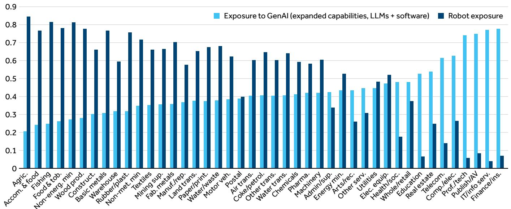
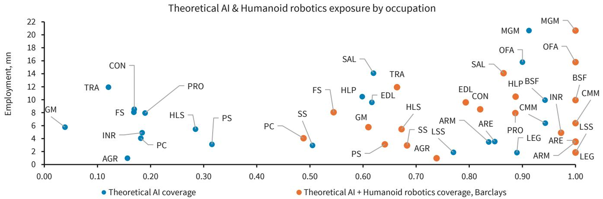

# 人形机器人真正改变的不是就业，而是宏观增长方程式的分母

宏观经济学界正在发生一个被低估的转向。过去三年，关于生成式AI的讨论几乎全部集中在“哪些白领工作会被替代”、“代码生成效率提升多少倍”这些微观问题上。但一份来自某外资投行的最新宏观研报，提出了一个更根本的判断：人形机器人（Humanoid Robotics）的意义，不在于替代某个工种，而在于它解决了困扰宏观经济学半个世纪的“鲍莫尔病”——即服务业生产率停滞拖累整体经济增长的结构性难题。

这份报告的核心洞察可以浓缩为一句话：**如果生成式AI只改变认知任务，那么经济增长反而可能因“弱环节”效应而加速有限；只有当AI从认知扩展到物理任务，即通过人形机器人实现“认知+物理”的全任务覆盖，宏观生产率的提升才可能真正突破瓶颈。**

这不是科幻叙事，而是一个可建模、可量化、有历史参照的宏观经济学命题。报告的贡献在于，它用一套清晰的“从任务到部门再到整体经济”的传导框架，解释了为什么人形机器人不是工业机器人的简单升级，而是可能改变增长方程式的结构性变量。

## 1. 人形机器人不是“更聪明的机器人”，而是“AI的物理化”

理解这份报告的逻辑起点，是区分“自动化”的三个层次。

第一层是工业机器人。它们擅长在高度结构化的环境中重复执行单一任务，比如焊接、喷涂、搬运。它们的局限在于“任务特异性”——换一个环境、换一个任务，就需要重新编程和部署。

第二层是生成式AI。它以大语言模型为代表，将自动化从物理世界带入了认知世界。但它仍然是“任务特异性”的——擅长代码生成、文本总结、图像识别，却无法拿起一个杯子、整理一张床铺、更换一个零件。

第三层才是人形机器人。报告将其定义为“具身AI”（Embodied AI）：它把AI的认知能力与机器人的物理执行能力融合在一起。关键不在于它像人，而在于它能够**在人类设计的非结构化环境中，连续执行多个异构的物理任务**。这意味着，它不仅能替代生产线上的装配工，还能替代酒店客房服务、医院护理、家庭保洁、仓储物流中那些由“低技能到中等技能”任务组合而成的完整岗位。

报告用一个经济学概念点明了这一跃迁的本质：人形机器人将**提高劳动与资本之间的替代弹性**。在传统服务业中，由于“物理上的杂乱无章”（physical messiness），资本替代劳动的弹性很低——你无法用一台机器去照顾一个老人。但如果人形机器人能够胜任这一任务，那么服务业中原本受保护的岗位，将首次暴露在自动化之下。

## 2. 真正被低估的是“鲍莫尔病”的缓解效应

为什么这个判断对宏观经济如此重要？这需要回到一个经典的经济学难题：鲍莫尔病。

1967年，经济学家威廉·鲍莫尔观察到，经济中存在两类部门：进步部门（生产率快速提升，如制造业）和停滞部门（生产率提升缓慢，如现场演出、医疗服务）。由于停滞部门的需求价格弹性低（你不可能因为医疗费便宜就多生几次病），其在整个经济中的名义份额反而会上升，从而拖累整体生产率的增速。据估算，鲍莫尔病在20世纪下半叶使美国年均生产率增速降低了约0.5个百分点。

生成式AI的普及，可能会加剧这一病症。原因在于，AI的生产率提升高度集中在认知密集型部门（金融、法律、信息技术），而物理密集型部门（医疗、餐饮、住宿、建筑）几乎不受影响。报告引用OECD的建模结果：如果AI的生产率增益集中在少数高度暴露部门，鲍莫尔效应将削弱约三分之一的净生产率提升。

但人形机器人的加入改变了这一格局。报告中的图4显示了三种情景下的净效果：

- 低采纳情景：总生产率增益仅为0.25个百分点；
- 高但集中的AI增益（不含人形机器人）：直接增益0.55，但鲍莫尔效应抵消0.25，净效果降至0.65；
- AI与人形机器人结合：直接增益0.55，无鲍莫尔效应，加上投入产出乘数0.45，总效果达到0.95个百分点。

关键差异在于：当AI的生产率增益从“集中在少数认知部门”变为“广泛分布在认知和物理部门”时，鲍莫尔效应消失了。因为物理部门的停滞不再拖后腿，所有部门的生产率都在同步提升。

## 3. “弱环节”才是增长加速的真正瓶颈

报告引用了一篇2026年的NBER工作论文（Jones和Tonetti），提出了一个更深刻的问题：为什么历史上一系列自动化技术都没能引发“增长大爆炸”？

答案是“弱环节”（Weak Links）。经济增长的瓶颈，从来不是“我们做得最好的事情”，而是“那些必不可少却难以改善的事情”。在任何一个生产过程中，最终产出是由最慢的环节决定的。即使99%的任务都由快速进步的资本完成，只要剩下1%的任务仍然依赖缓慢改善的劳动，整体产出就会被那1%所约束。

这解释了为什么过去几十年的自动化（工业机器人+电脑+互联网）虽然显著提升了部分环节的效率，但整体TFP增速并没有出现指数级跃升。因为总有那些难以自动化的物理任务在拖后腿。

人形机器人的战略意义正在于此：它提高了任务之间的替代弹性，减少了“弱环节”的数量。虽然报告谨慎地指出，这“尚未带来理论上完全自动化所对应的增长大爆炸”，但它确实打开了通向更快速增长的通道。

## 4. 报告尚未完全回答的三个关键问题

这份报告的框架清晰、逻辑自洽，但作为一篇研报导读，有必要指出其中尚未充分展开的层面。

**第一，采纳速度的不确定性被低估了。** 报告中的模型假设了“AI与人形机器人结合”的场景，但人形机器人的商业化部署时间线、单位经济成本、工厂产能爬坡速度，都是高度不确定的变量。历史上，工业机器人的普及用了30年以上。即便人形机器人技术成熟，其渗透率曲线的形状仍然未知。

**第二，劳动力再分配的社会成本没有被建模。** 报告在宏观层面论证了生产率增益，但没有讨论“从劳动向资本的收入转移”对总需求的潜在抑制。如果大量中低技能劳动者的收入下降，消费需求可能萎缩，进而抵消部分供给端的效率提升。这是一个典型的“总供给-总需求”互动问题，需要在一般均衡框架下进一步分析。

**第三，地缘政治对供应链的约束没有被纳入。** 人形机器人的核心零部件（高精度电机、传感器、AI芯片）目前集中在少数国家和地区。如果供应链出现断裂或出口管制，全球的采纳速度将出现显著分化，进而影响不同经济体的生产率收敛路径。

## 5. 一个可供读者持续跟踪的观察框架

基于这份报告的分析逻辑，我们可以建立一个简单的三阶段观察框架，用以判断人形机器人对宏观经济的实际影响是否正在兑现。

**第一阶段信号：单位经济成本的拐点。** 人形机器人的全生命周期成本（含采购、部署、维护、能耗）何时能够低于同等劳动力的年工资？这是微观采纳的经济门槛。目前行业共识指向2028-2030年，但需要持续跟踪头部企业的定价策略和订单数据。

**第二阶段信号：服务业生产率的宏观数据变化。** 如果人形机器人开始大规模部署，我们应当看到美国、日本、德国等发达经济体的服务业TFP增速出现系统性抬升。鲍莫尔病的核心假设是“服务业生产率停滞”，如果这一假设被数据证伪，宏观增长预期需要重新定价。

**第三阶段信号：资本-劳动收入份额的持续偏离。** 如果人形机器人确实提高了资本对劳动的替代弹性，那么国民收入中资本所得的份额将持续上升，劳动份额持续下降。这一趋势已经在过去20年出现，但人形机器人可能加速这一过程。对资产定价而言，这意味着“资本密集型行业”和“拥有机器人的公司”可能获得持续的估值溢价。

---

这份报告的价值，不在于它给出了一个确定的数字（0.95个百分点的生产率增益），而在于它提供了一个完整的、可检验的因果链条：人形机器人 -> 提高替代弹性 -> 减少弱环节 -> 缓解鲍莫尔病 -> 提升整体生产率。对于产业决策者和资产配置者而言，比预测数字更重要的是理解这个链条中的每一个环节是否在现实中成立。

报告中还有大量关于部门层面的暴露度数据、任务级别的替代弹性估计、以及不同采纳情景下的敏感性分析，因篇幅所限无法一一展开。欢迎来星球微信群里继续讨论，获取完整研报解读与原始图表。

Personal reading notes and learning share only. Not investment advice.

