# The W&W Indicator further signals “Very Bullish” sign for A-share market

Equity Strategy

# Indicator reiterates "very bullish" sign for A-share

Monthly average of the BofA China A-share Wax & Wane Indicator improved to 29 in May, with weekly average also at 29 – firmly in the bullish zone. Daily reading hit 13 (“very bullish”) on May 11 $^{th}$ , the strongest level since Sep-2024, following another “very bullish” signal on Apr 16 $^{th}$ . Earnings revision is positive, liquidity is ample, fund flow is supportive, albeit with elevated leverage and positioning and rich valuation. Global markets delivered mixed returns in the past one month amid lingering geopolitical tensions yet still-strong AI trades. Within China, Star 50, ChiNext and CSI1000 outperformed while NASDAQ Golden Dragon, MSCI China and HSCEI lagged. Sentiment is bullish, with strong interest in China’s tech and industrials. Market is trading in an “A share style”: thematic-driven, fast rotation, and favoring mid/small caps. Reiterate our view that A-share’s outperformance over H may continue (see China Conference feedback).

Leverage: 75%, high. Margin trading as a % of A-share daily turnover edged lower to 9.9% in May-26, but still higher than its long-term average of 9.0%.

Valuation: $84\%$ , high. P/E at 24.3x is above its long-term average of 21.2x.

Positioning: 64%, high. 86.9% of stock mutual funds' position is currently invested, higher than its long-term average of 84.7%.

Liquidity: 21%, loose. The 10-year government bond yield has risen to 1.76% in May-26 from its record lows of 1.6% in Jan-25.

Fund flow: 34%, supportive. Turnover/market cap stands at 2.8% in May-26, well above its long-term average of 1.1% since 2007.

Earnings: 26%, positive. CSI 300 earnings revision has recovered from -12% YoY in Sep-24 to 10.1% YoY in May-26.

# Exhibit 1: BofA China A-share W&W Indicator in May 2026

The latest daily reading at 37 is "marginally bullish". The monthly average at 29 is bullish

BofA China A-share Wax & Wane Indicator   
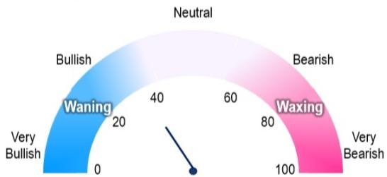

gauge

| Rating | Value |
|---|---|
| Waning | 20 |
| Bullish | 40 |
| Neutral | 60 |
| Bearish | 80 |
| Very Bearish | 100 |

Source: Wind, CEIC, Bloomberg; Disclaimer: The BofA China A-share W&W Indicator identified as an indicator above is intended to be an indicative metric only and may not be used for reference purposes or as a measure of performance for any financial instrument or contract, or otherwise relied upon by third parties for any other purpose, without the prior written consent of BofA Global Research. This BofA China A-share W&W Indicator was not created to act as a benchmark

BofA GLOBAL RESEARCH

Trading ideas and investment strategies discussed herein may give rise to significant risk and are not suitable for all investors. Investors should have experience in relevant markets and the financial resources to absorb any losses arising from applying these ideas or strategies.

>> Employed by a non-US affiliate of BofAS and is not registered/qualified as a research analyst under the FINRA rules.

Refer to "Other Important Disclosures" for information on certain BofA entities that take responsibility for the information herein in particular jurisdictions.

BofA does and seeks to do business with issuers covered in its research reports. As a result, investors should be aware that the firm may have a conflict of interest that could affect the objectivity of this report. Investors should consider this report as only a single factor in making their investment decision.

19 May 2026

Equity Strategy China

BofA

# Data Analytics

Winnie Wu >>

Research Analyst

BofA (Hong Kong)

+852 3508 3058

winnie.wu@bofa.com

Gina Wu >>

Strategist

BofA (Hong Kong)

+852 3508 8008

gina.wu@bofa.com

# W&W Indicator vs CSI300 performance

The exhibits below show the historical correlation between the W&W Indicator and the CSI300 Index forward performance for the following 1/2/3 month(s) since 2015.

Exhibit 2: W&W Indicator vs percentage change in CSI300 in the following 1mth (Back-tested) since Jan-2015   
W&W Indicator has been fairly good in predicting the CSI300 1mth performance   
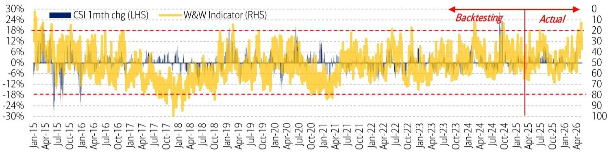

line

| Date    | CSI 1mth chg (LHS) | W&W Indicator (RHS) |
|---------|--------------------|---------------------|
| Jan-15  | ~0%                | ~30%                |
| Apr-15  | ~-24%              | ~24%                |
| Jul-15  | ~-30%              | ~28%                |
| Oct-15  | ~-24%              | ~24%                |
| Jan-16  | ~-24%              | ~24%                |
| Apr-16  | ~-24%              | ~24%                |
| Jul-16  | ~-24%              | ~24%                |
| Oct-16  | ~-24%              | ~24%                |
| Jan-17  | ~-24%              | ~24%                |
| Apr-17  | ~-24%              | ~24%                |
| Jul-17  | ~-24%              | ~24%                |
| Oct-17  | ~-24%              | ~24%                |
| Jan-18  | ~-24%              | ~24%                |
| Apr-18  | ~-24%              | ~24%                |
| Jul-18  | ~-24%              | ~24%                |
| Oct-18  | ~-24%              | ~24%                |
| Jan-19  | ~-24%              | ~24%                |
| Apr-19  | ~-24%              | ~24%                |
| Jul-19  | ~-24%              | ~24%                |
| Oct-19  | ~-24%              | ~24%                |
| Jan-20  | ~-24%              | ~24%                |
| Apr-20  | ~-24%              | ~24%                |
| Jul-20  | ~-24%              | ~24%                |
| Oct-20  | ~-24%              | ~24%                |
| Jan-21  | ~-24%              | ~24%                |
| Apr-21  | ~-24%              | ~24%                |
| Jul-21  | ~-24%              | ~24%                |
| Oct-21  | ~-24%              | ~24%                |
| Jan-22  | ~-24%              | ~24%                |
| Apr-22  | ~-24%              | ~24%                |
| Jul-22  | ~-24%              | ~24%                |
| Oct-22  | ~-24%              | ~24%                |
| Jan-23  | ~-24%              | ~24%                |
| Apr-23  | ~-24%              | ~24%                |
| Jul-23  | ~-24%              | ~24%                |
| Oct-23  | ~-24%              | ~24%                |
| Jan-24  | ~-24%              | ~24%                |
| Apr-24  | ~-24%              | ~24%                |
| Jul-24  | ~-24%              | ~24%                |
| Oct-24  | ~-24%              | ~24%                |
| Jan-25  | ~-24%              | ~24%                |
| Apr-25  | ~-24%              | ~24%                |
| Jul-25  | ~-24%              | ~24%                |
| Oct-25  | ~-24%              | ~24%                |
| Jan-26  | ~-24%              | ~24%                |
| Apr-26  | ~-24%              | ~24%                |

Source: Wind, Bloomberg ^Note: Backtesting for Jan-2010 to Jun-2021, actual starts Jul-2021. #W&W Indicator's input factors rose from six to ten from Jan-2010 to Apr-2015, due to data availability, thus the historical reading before and after Apr-15 may not be fully comparable. This performance is back-tested and does not represent the actual performance of any account or fund. Back-tested performance depicts the theoretical (not actual) performance of a particular strategy over the time period indicated. No representation is being made that any actual portfolio is likely to have achieved returns similar to those shown herein.

BofA GLOBAL RESEARCH

Exhibit 3: W&W Indicator vs percentage change in CSI300 in the following 2mths (Back-tested) since Jan-2015   
W&W Indicator has been fairly good in predicting the CSI300 2mth performance   
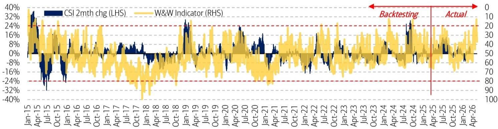

line

| Date    | CSI 2mth chg (LHS) | W&W Indicator (RHS) |
|---------|--------------------|---------------------|
| Jan-15  | ~38%               | ~35%                |
| Apr-15  | ~-32%              | ~-24%               |
| Jul-15  | ~-16%              | ~-24%               |
| Oct-15  | ~-8%               | ~-24%               |
| Jan-16  | ~-16%              | ~-24%               |
| Apr-16  | ~-8%               | ~-24%               |
| Jul-16  | ~-8%               | ~-24%               |
| Oct-16  | ~-8%               | ~-24%               |
| Jan-17  | ~-8%               | ~-24%               |
| Apr-17  | ~-8%               | ~-24%               |
| Jul-17  | ~-8%               | ~-24%               |
| Oct-17  | ~-8%               | ~-24%               |
| Jan-18  | ~-8%               | ~-24%               |
| Apr-18  | ~-8%               | ~-24%               |
| Jul-18  | ~-8%               | ~-24%               |
| Oct-18  | ~-8%               | ~-24%               |
| Jan-19  | ~24%               | ~20%                |
| Apr-19  | ~24%               | ~20%                |
| Jul-19  | ~24%               | ~20%                |
| Oct-19  | ~24%               | ~20%                |
| Jan-20  | ~24%               | ~20%                |
| Apr-20  | ~24%               | ~20%                |
| Jul-20  | ~24%               | ~20%                |
| Oct-20  | ~24%               | ~20%                |
| Jan-21  | ~24%               | ~20%                |
| Apr-21  | ~24%               | ~20%                |
| Jul-21  | ~24%               | ~20%                |
| Oct-21  | ~24%               | ~20%                |
| Jan-22  | ~24%               | ~20%                |
| Apr-22  | ~24%               | ~20%                |
| Jul-22  | ~24%               | ~20%                |
| Oct-22  | ~24%               | ~20%                |
| Jan-23  | ~24%               | ~20%                |
| Apr-23  | ~24%               | ~20%                |
| Jul-23  | ~24%               | ~20%                |
| Oct-23  | ~24%               | ~20%                |
| Jan-24  | ~24%               | ~20%                |
| Apr-24  | ~24%               | ~20%                |
| Jul-24  | ~24%               | ~20%                |
| Oct-24  | ~24%               | ~20%                |
| Jan-25  | ~24%               | ~20%                |
| Apr-25  | ~24%               | ~20%                |
| Jul-25  | ~24%               | ~20%                |
| Oct-25  | ~24%               | ~20%                |
| Jan-26  | ~24%               | ~20%                |
| Apr-26  | ~24%               | ~20%                |

Source: Wind, Bloomberg ^Note: Backtesting for Jan-2010 to Jun-2021, actual starts Jul-2021. #W&W Indicator's input factors rose from six to ten from Jan-2010 to Apr-2015, due to data availability, thus the historical reading before and after Apr-15 may not be fully comparable. This performance is back-tested and does not represent the actual performance of any account or fund. Back-tested performance depicts the theoretical (not actual) performance of a particular strategy over the time period indicated. No representation is being made that any actual portfolio is likely to have achieved returns similar to those shown herein.

BofA GLOBAL RESEARCH

Exhibit 4: W&W Indicator vs percentage change in CSI300 in the following 3mths (Back-tested) since Jan-2015   
W&W Indicator has been fairly good in predicting the CSI300 3mth performance   
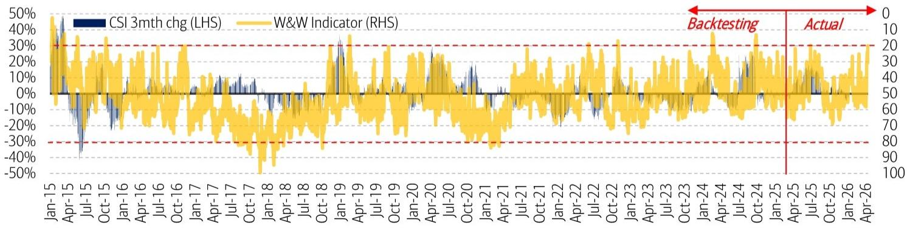

line

| Date    | CSI 3mth chg (LHS) | W&W Indicator (RHS) |
|---------|--------------------|---------------------|
| Jan-15  | ~45%               | ~45%                |
| Apr-15  | ~-40%              | ~35%                |
| Jul-15  | ~-20%              | ~30%                |
| Oct-15  | ~-10%              | ~25%                |
| Jan-16  | ~0%                | ~20%                |
| Apr-16  | ~0%                | ~25%                |
| Jul-16  | ~0%                | ~30%                |
| Oct-16  | ~0%                | ~35%                |
| Jan-17  | ~0%                | ~20%                |
| Apr-17  | ~0%                | ~25%                |
| Jul-17  | ~0%                | ~30%                |
| Oct-17  | ~0%                | ~35%                |
| Jan-18  | ~0%                | ~40%                |
| Apr-18  | ~0%                | ~35%                |
| Jul-18  | ~0%                | ~30%                |
| Oct-18  | ~0%                | ~25%                |
| Jan-19  | ~0%                | ~30%                |
| Apr-19  | ~0%                | ~35%                |
| Jul-19  | ~0%                | ~40%                |
| Oct-19  | ~0%                | ~35%                |
| Jan-20  | ~0%                | ~30%                |
| Apr-20  | ~0%                | ~25%                |
| Jul-20  | ~0%                | ~20%                |
| Oct-20  | ~0%                | ~15%                |
| Jan-21  | ~0%                | ~10%                |
| Apr-21  | ~0%                | ~5%                 |
| Jul-21  | ~0%                | ~0%                 |
| Oct-21  | ~0%                | ~5%                 |
| Jan-22  | ~0%                | ~10%                |
| Apr-22  | ~0%                | ~15%                |
| Jul-22  | ~0%                | ~20%                |
| Oct-22  | ~0%                | ~25%                |
| Jan-23  | ~0%                | ~30%                |
| Apr-23  | ~0%                | ~35%                |
| Jul-23  | ~0%                | ~40%                |
| Oct-23  | ~0%                | ~45%                |
| Jan-24  | ~0%                | ~50%                |
| Apr-24  | ~0%                | ~55%                |
| Jul-24  | ~0%                | ~60%                |
| Oct-24  | ~0%                | ~65%                |
| Jan-25  | ~0%                | ~70%                |
| Apr-25  | ~0%                | ~75%                |
| Jul-25  | ~0%                | ~80%                |
| Oct-25  | ~0%                | ~85%                |
| Jan-26  | ~0%                | ~90%                |
| Apr-26  | ~0%                | ~95%                |

Source: Wind, Bloomberg ^Note: Backtesting for Jan-2010 to Jun-2021, actual starts Jul-2021. #W&W Indicator's input factors rose from six to ten from Jan-2010 to Apr-2015, due to data availability, thus the historical reading before and after Apr-15 may not be fully comparable. This performance is back-tested and does not represent the actual performance of any account or fund. Back-tested performance depicts the theoretical (not actual) performance of a particular strategy over the time period indicated. No representation is being made that any actual portfolio is likely to have achieved returns similar to those shown herein.

BofA GLOBAL RESEARCH

# Market performance

Exhibit 5: Global markets delivered mixed returns amid lingering geopolitical tensions yet still-strong AI momentum. Within China, Star 50, ChiNext and CSI1000 outperformed the most while NASDAQ Golden Dragon, MSCI China and HSCEI lagged

Performance of major indices

<table><tr><td rowspan="2"></td><td rowspan="2">Current level</td><td colspan="8">Performance (%)</td><td colspan="8">Ranking</td></tr><tr><td>1M</td><td>3M</td><td>6M</td><td>12M</td><td>YTD</td><td>3yr</td><td>5yr</td><td>10yr</td><td>1M</td><td>3M</td><td>6M</td><td>12M</td><td>YTD</td><td>3yr</td><td>5yr</td><td>10yr</td></tr><tr><td colspan="18">Major indices</td></tr><tr><td>S&amp;P 500</td><td>7,403</td><td>3.9</td><td>7.6</td><td>11.9</td><td>24.2</td><td>8.1</td><td>76.3</td><td>79.3</td><td>261.5</td><td>6</td><td>5</td><td>8</td><td>10</td><td>8</td><td>3</td><td>2</td><td>2</td></tr><tr><td>Dow Jones</td><td>49,686</td><td>0.5</td><td>0.0</td><td>7.8</td><td>16.5</td><td>3.4</td><td>48.2</td><td>45.9</td><td>183.5</td><td>10</td><td>11</td><td>12</td><td>12</td><td>12</td><td>7</td><td>4</td><td>3</td></tr><tr><td>NASDAQ</td><td>26,091</td><td>6.6</td><td>14.7</td><td>16.3</td><td>35.8</td><td>12.3</td><td>105.6</td><td>96.1</td><td>450.5</td><td>3</td><td>3</td><td>7</td><td>6</td><td>6</td><td>1</td><td>1</td><td>1</td></tr><tr><td>Euro Stoxx 50</td><td>5,849</td><td>-4.6</td><td>-5.4</td><td>6.4</td><td>12.7</td><td>0.3</td><td>45.0</td><td>39.3</td><td>104.3</td><td>16</td><td>15</td><td>13</td><td>13</td><td>13</td><td>8</td><td>5</td><td>6</td></tr><tr><td>FTSE 100</td><td>10,324</td><td>-4.1</td><td>-4.1</td><td>10.4</td><td>20.3</td><td>3.8</td><td>44.5</td><td>38.9</td><td>53.9</td><td>15</td><td>12</td><td>10</td><td>11</td><td>11</td><td>10</td><td>6</td><td>8</td></tr><tr><td>Nikkei 225</td><td>60,816</td><td>3.4</td><td>3.5</td><td>22.3</td><td>47.9</td><td>18.8</td><td>73.4</td><td>46.7</td><td>152.3</td><td>7</td><td>9</td><td>5</td><td>5</td><td>3</td><td>4</td><td>3</td><td>4</td></tr><tr><td>Russell 2000</td><td>2,775</td><td>-0.1</td><td>4.4</td><td>18.2</td><td>31.3</td><td>11.8</td><td>55.5</td><td>25.5</td><td>151.6</td><td>11</td><td>8</td><td>6</td><td>8</td><td>7</td><td>6</td><td>8</td><td>5</td></tr><tr><td>MSCI China</td><td>78</td><td>-4.0</td><td>-7.1</td><td>-8.5</td><td>4.6</td><td>-6.4</td><td>23.0</td><td>-27.4</td><td>44.6</td><td>14</td><td>16</td><td>16</td><td>15</td><td>16</td><td>16</td><td>16</td><td>11</td></tr><tr><td>NASDAQ Golden Dragon</td><td>6,791</td><td>-6.1</td><td>-10.4</td><td>-12.9</td><td>-8.1</td><td>-9.8</td><td>6.5</td><td>-52.5</td><td>2.5</td><td>17</td><td>17</td><td>17</td><td>17</td><td>17</td><td>17</td><td>17</td><td>17</td></tr><tr><td>HSI</td><td>25,675</td><td>-1.9</td><td>-4.1</td><td>-1.6</td><td>9.7</td><td>-0.4</td><td>30.1</td><td>-11.0</td><td>28.4</td><td>12</td><td>13</td><td>14</td><td>14</td><td>14</td><td>12</td><td>13</td><td>13</td></tr><tr><td>HSCEI</td><td>8,598</td><td>-2.8</td><td>-5.4</td><td>-6.9</td><td>1.3</td><td>-4.1</td><td>28.0</td><td>-20.0</td><td>2.7</td><td>13</td><td>14</td><td>15</td><td>16</td><td>15</td><td>14</td><td>15</td><td>16</td></tr><tr><td>SHCOMP</td><td>4,132</td><td>2.2</td><td>2.8</td><td>9.6</td><td>30.1</td><td>7.0</td><td>29.7</td><td>10.6</td><td>41.5</td><td>9</td><td>10</td><td>11</td><td>9</td><td>10</td><td>13</td><td>12</td><td>12</td></tr><tr><td>CSI300</td><td>4,834</td><td>2.5</td><td>5.3</td><td>10.6</td><td>31.8</td><td>7.3</td><td>26.4</td><td>-12.0</td><td>51.5</td><td>8</td><td>6</td><td>9</td><td>7</td><td>9</td><td>15</td><td>14</td><td>9</td></tr><tr><td>CSI500</td><td>8,554</td><td>4.4</td><td>4.7</td><td>25.1</td><td>58.7</td><td>17.8</td><td>44.5</td><td>22.5</td><td>46.1</td><td>5</td><td>7</td><td>3</td><td>3</td><td>5</td><td>9</td><td>9</td><td>10</td></tr><tr><td>CSI1000</td><td>8,720</td><td>5.2</td><td>7.9</td><td>22.4</td><td>52.4</td><td>18.0</td><td>37.1</td><td>27.0</td><td>8.8</td><td>4</td><td>4</td><td>4</td><td>4</td><td>4</td><td>11</td><td>7</td><td>15</td></tr><tr><td>ChiNext</td><td>3,915</td><td>6.7</td><td>21.3</td><td>33.4</td><td>103.5</td><td>25.6</td><td>77.9</td><td>19.7</td><td>86.4</td><td>2</td><td>1</td><td>1</td><td>1</td><td>2</td><td>2</td><td>11</td><td>7</td></tr><tr><td>Star 50</td><td>1,710</td><td>20.4</td><td>18.1</td><td>31.7</td><td>82.2</td><td>30.7</td><td>71.0</td><td>22.3</td><td>17.6</td><td>1</td><td>2</td><td>2</td><td>2</td><td>1</td><td>5</td><td>10</td><td>14</td></tr></table>

Source: Bloomberg, MSCI, data as of May 18, 2026, in USD terms   
BofA GLOBAL RESEARCH

# Performance of key input factors

Leverage: 75%, high

Margin trading as a % of A-share daily turnover edged lower to 9.9% in May-26, but still higher than its long-term average of 9.0%.

Exhibit 6: Margin financing as % of daily turnover since May 2015

The current margin financing as \% of A-share daily turnover is above its long-term average

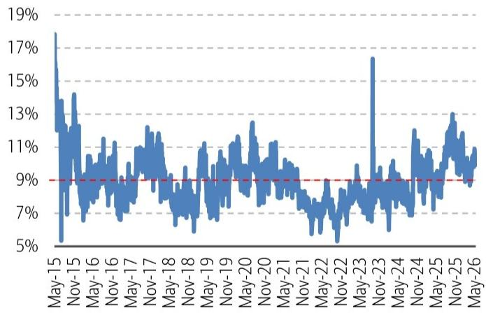

line

| Date    | Value |
|---------|-------|
| May-15  | 18%   |
| Nov-15  | 14%   |
| May-16  | 12%   |
| Nov-16  | 11%   |
| May-17  | 10%   |
| Nov-17  | 12%   |
| May-18  | 9%    |
| Nov-18  | 8%    |
| May-19  | 10%   |
| Nov-19  | 11%   |
| May-20  | 13%   |
| Nov-20  | 10%   |
| May-21  | 9%    |
| Nov-21  | 8%    |
| May-22  | 9%    |
| Nov-22  | 5%    |
| May-23  | 17%   |
| Nov-23  | 9%    |
| May-24  | 10%   |
| Nov-24  | 9%    |
| May-25  | 13%   |
| Nov-25  | 10%   |
| May-26  | 9%    |

Source: BofA Global Research, Wind, CEIC   
BofA GLOBAL RESEARCH

Exhibit 7: Margin financing as % of daily turnover since 2025

Margin financing reached 9.9% of daily turnover in May-26

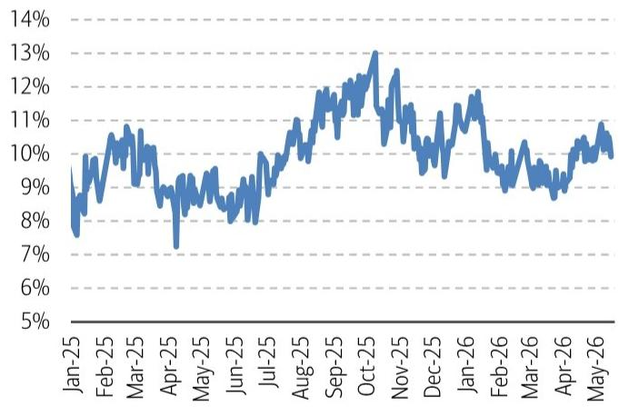

line

| Month   | Value |
|---------|-------|
| Jan-25  | 8%    |
| Feb-25  | 9%    |
| Mar-25  | 10%   |
| Apr-25  | 7%    |
| May-25  | 9%    |
| Jun-25  | 8%    |
| Jul-25  | 10%   |
| Aug-25  | 11%   |
| Sep-25  | 12%   |
| Oct-25  | 13%   |
| Nov-25  | 12%   |
| Dec-25  | 11%   |
| Jan-26  | 10%   |
| Feb-26  | 9%    |
| Mar-26  | 10%   |
| Apr-26  | 9%    |
| May-26  | 10%   |

Source: BofA Global Research, Wind, CEIC   
BofA GLOBAL RESEARCH

Valuation: $84\%$ , high

Currently, A-share P/E valuation is at 24.3x, higher than its long-term average of 21.2x since 2007.

Exhibit 8: A-share P/E valuation since Jan-2007   
The current 24.3x P/E of A-share is above its long-term average   
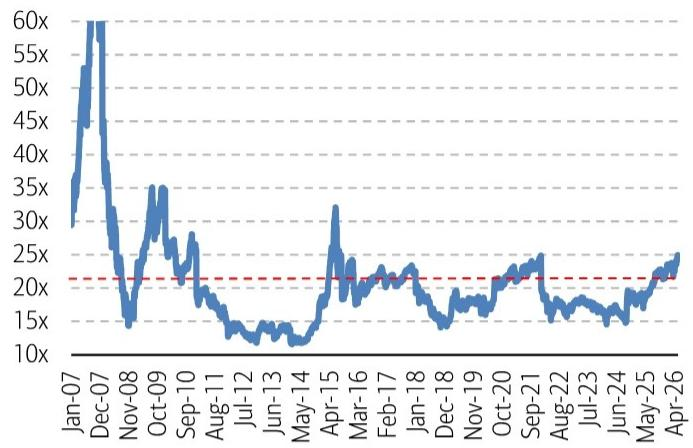

line

| Date    | Value |
|---------|-------|
| Jan-07  | 30x   |
| Dec-07  | 60x   |
| Nov-08  | 15x   |
| Oct-09  | 35x   |
| Sep-10  | 25x   |
| Aug-11  | 20x   |
| Jul-12  | 15x   |
| Jun-13  | 15x   |
| May-14  | 15x   |
| Apr-15  | 30x   |
| Mar-16  | 25x   |
| Feb-17  | 25x   |
| Jan-18  | 20x   |
| Dec-18  | 15x   |
| Nov-19  | 20x   |
| Oct-20  | 25x   |
| Sep-21  | 25x   |
| Aug-22  | 20x   |
| Jul-23  | 15x   |
| Jun-24  | 15x   |
| May-25  | 20x   |
| Apr-26  | 25x   |

Source: BofA Global Research, Wind   
BofA GLOBAL RESEARCH

Exhibit 9: A-share P/E valuation since 2025   
A-share P/E rose further from 23.7x to 24.3x in the past one month   
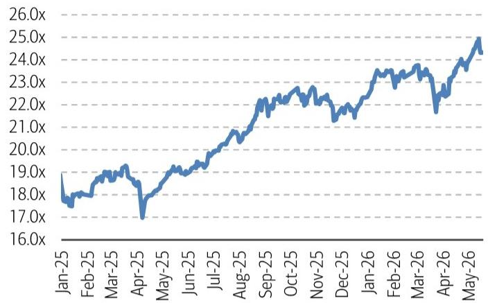

line

| Month   | Value |
|---------|-------|
| Jan-25  | 18.0x |
| Feb-25  | 19.0x |
| Mar-25  | 19.5x |
| Apr-25  | 17.0x |
| May-25  | 19.0x |
| Jun-25  | 19.5x |
| Jul-25  | 20.0x |
| Aug-25  | 21.0x |
| Sep-25  | 22.0x |
| Oct-25  | 23.0x |
| Nov-25  | 22.5x |
| Dec-25  | 21.5x |
| Jan-26  | 23.0x |
| Feb-26  | 23.5x |
| Mar-26  | 24.0x |
| Apr-26  | 23.0x |
| May-26  | 25.0x |

Source: BofA Global Research, Wind   
BofA GLOBAL RESEARCH

Flow: 34%, supportive

Turnover/market cap stands at 2.8% in May-26, well above its long-term average of 1.1% since 2007. A-share main funds continued to be net sellers in the past month.

Exhibit 10: A-share turnover/market cap since Jan-2007   
The current A-share turnover/market cap is well above its long-term average   
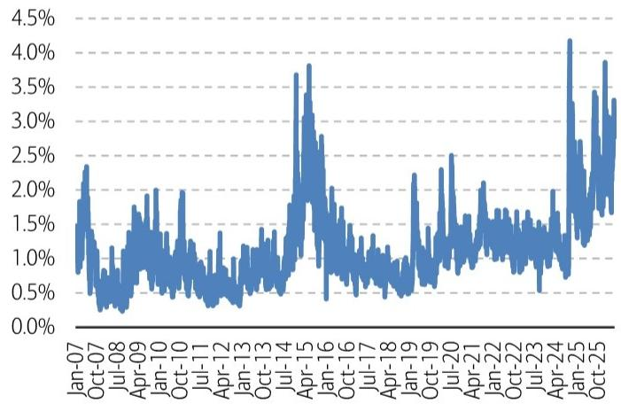

line

| Date    | Value |
|---------|-------|
| Jan-07  | 1.5%  |
| Oct-07  | 2.3%  |
| Jul-08  | 0.5%  |
| Apr-09  | 1.8%  |
| Jan-10  | 2.0%  |
| Oct-10  | 1.2%  |
| Jul-11  | 0.8%  |
| Apr-12  | 1.0%  |
| Jan-13  | 1.2%  |
| Oct-13  | 1.5%  |
| Jul-14  | 3.7%  |
| Apr-15  | 3.8%  |
| Jan-16  | 2.8%  |
| Oct-16  | 1.5%  |
| Jul-17  | 1.2%  |
| Apr-18  | 0.8%  |
| Jan-19  | 2.2%  |
| Oct-19  | 1.5%  |
| Jul-20  | 2.5%  |
| Apr-21  | 2.0%  |
| Jan-22  | 1.8%  |
| Oct-22  | 1.5%  |
| Jul-23  | 1.8%  |
| Apr-24  | 4.2%  |
| Jan-25  | 3.5%  |
| Oct-25  | 3.8%  |

Source: BofA Global Research, Wind, CEIC   
BofA GLOBAL RESEARCH

Exhibit 11: A-share turnover/market cap since 2025   
Turnover/market cap reached 2.8% in May-26   
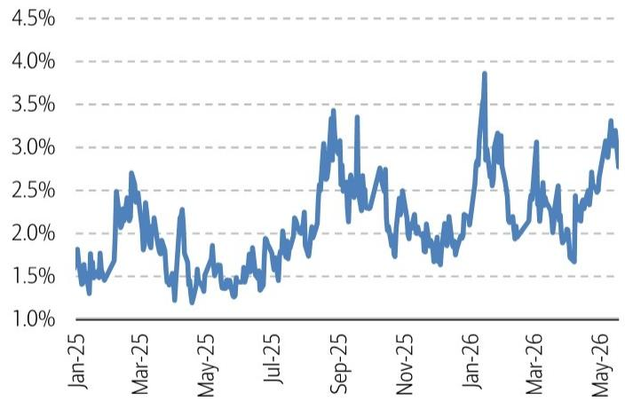

line

| Date   | Value |
|--------|-------|
| Jan-25 | 1.8%  |
| Mar-25 | 2.7%  |
| May-25 | 1.3%  |
| Jul-25 | 1.9%  |
| Sep-25 | 3.4%  |
| Nov-25 | 2.5%  |
| Jan-26 | 3.9%  |
| Mar-26 | 2.0%  |
| May-26 | 3.3%  |

Source: BofA Global Research, Wind, CEIC   
BofA GLOBAL RESEARCH

Positioning: 64%, high

86.9% of stock mutual funds' position is invested currently, higher than its long-term average of 84.7%.

Exhibit 12: % of position invested by stock mutual funds since May-2007   
Stock fund positioning is at $86.9\%$ , higher than its long-term average   
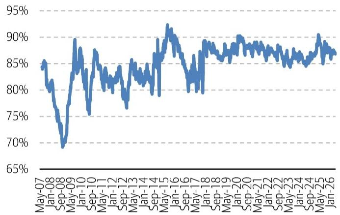

line

| Date    | Value |
|---------|-------|
| May-07  | 85%   |
| Jan-08  | 80%   |
| Sep-08  | 70%   |
| May-09  | 90%   |
| Jan-10  | 75%   |
| Sep-10  | 85%   |
| May-11  | 80%   |
| Jan-12  | 85%   |
| Sep-12  | 75%   |
| May-13  | 85%   |
| Jan-14  | 80%   |
| Sep-14  | 90%   |
| May-15  | 95%   |
| Jan-16  | 90%   |
| Sep-16  | 85%   |
| May-17  | 80%   |
| Jan-18  | 85%   |
| Sep-18  | 85%   |
| May-19  | 85%   |
| Jan-20  | 90%   |
| Sep-20  | 85%   |
| May-21  | 85%   |
| Jan-22  | 85%   |
| Sep-22  | 85%   |
| May-23  | 85%   |
| Jan-24  | 85%   |
| Sep-24  | 90%   |
| May-25  | 85%   |
| Jan-26  | 85%   |

Source: BofA Global Research, Wind   
BofA GLOBAL RESEARCH

Exhibit 13: % of position invested by stock mutual funds since 2025  
Stock fund positioning declined further to $86.9\%$ in May-26   
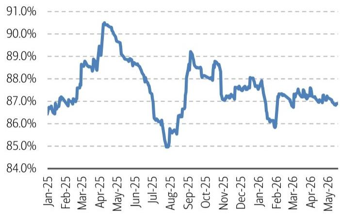

line

| Month   | Value  |
|---------|--------|
| Jan-25  | 86.5%  |
| Feb-25  | 87.0%  |
| Mar-25  | 88.5%  |
| Apr-25  | 90.5%  |
| May-25  | 89.0%  |
| Jun-25  | 88.0%  |
| Jul-25  | 86.0%  |
| Aug-25  | 85.0%  |
| Sep-25  | 89.0%  |
| Oct-25  | 88.0%  |
| Nov-25  | 87.5%  |
| Dec-25  | 87.0%  |
| Jan-26  | 86.0%  |
| Feb-26  | 87.0%  |
| Mar-26  | 87.5%  |
| Apr-26  | 87.0%  |
| May-26  | 87.0%  |

Source: BofA Global Research, Wind   
BofA GLOBAL RESEARCH

# Liquidity: $21\%$ , loose

The 10-year government bond yield has risen to $1.76\%$ in May-26 from its record lows of $1.6\%$ in Jan-25.

Exhibit 14: China 10yr government bond yield since Jan-2007   
The current 10yr CGB yield remains at low levels   
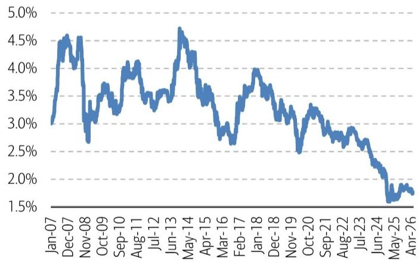

line

| Date    | Value |
|---------|-------|
| Jan-07  | 3.0%  |
| Dec-07  | 4.5%  |
| Nov-08  | 2.7%  |
| Oct-09  | 3.5%  |
| Sep-10  | 3.2%  |
| Aug-11  | 4.0%  |
| Jul-12  | 3.3%  |
| Jun-13  | 4.7%  |
| May-14  | 4.2%  |
| Apr-15  | 3.5%  |
| Mar-16  | 2.8%  |
| Feb-17  | 3.5%  |
| Jan-18  | 4.0%  |
| Dec-18  | 3.5%  |
| Nov-19  | 2.5%  |
| Oct-20  | 3.2%  |
| Sep-21  | 2.8%  |
| Aug-22  | 2.9%  |
| Jul-23  | 2.7%  |
| Jun-24  | 2.0%  |
| May-25  | 1.6%  |
| Apr-26  | 1.8%  |

Source: BofA Global Research, Wind   
BofA GLOBAL RESEARCH

Exhibit 15: China 10yr government bond yield since 2025   
10yr CGB yield stayed low at 1.76% in May-26   
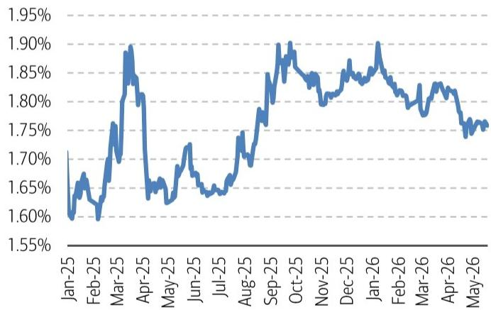

line

| Month   | Value  |
|---------|--------|
| Jan-25  | 1.60%  |
| Feb-25  | 1.65%  |
| Mar-25  | 1.75%  |
| Apr-25  | 1.80%  |
| May-25  | 1.65%  |
| Jun-25  | 1.70%  |
| Jul-25  | 1.65%  |
| Aug-25  | 1.75%  |
| Sep-25  | 1.85%  |
| Oct-25  | 1.90%  |
| Nov-25  | 1.80%  |
| Dec-25  | 1.85%  |
| Jan-26  | 1.90%  |
| Feb-26  | 1.80%  |
| Mar-26  | 1.85%  |
| Apr-26  | 1.80%  |
| May-26  | 1.75%  |

Source: BofA Global Research, Wind   
BofA GLOBAL RESEARCH

Earnings: 26%, positive

CSI 300 earnings revision has recovered to $10.1\%$ YoY in May-26 amid an uptrend since

Sep-24.

Exhibit 16: CSI 300 earnings revision since Jan-2007   
CSI 300 earnings revision has been positive since Sep-25   
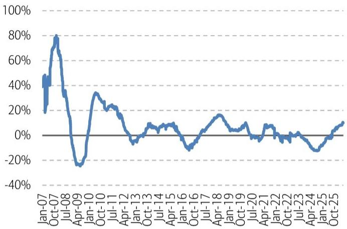

line

| Date    | Value |
|---------|-------|
| Jan-07  | 40%   |
| Oct-07  | 80%   |
| Jul-08  | 60%   |
| Apr-09  | -20%  |
| Jan-10  | 30%   |
| Oct-10  | 20%   |
| Jul-11  | 10%   |
| Apr-12  | -5%   |
| Jan-13  | 5%    |
| Oct-13  | 10%   |
| Jul-14  | 5%    |
| Apr-15  | 10%   |
| Jan-16  | -10%  |
| Oct-16  | 5%    |
| Jul-17  | 15%   |
| Apr-18  | 10%   |
| Jan-19  | 5%    |
| Oct-19  | 10%   |
| Jul-20  | 5%    |
| Apr-21  | 10%   |
| Jan-22  | 5%    |
| Oct-22  | 0%    |
| Jul-23  | -5%   |
| Apr-24  | -10%  |
| Jan-25  | -5%   |
| Oct-25  | 10%   |

Source: BofA Global Research, Bloomberg   
BofA GLOBAL RESEARCH

Exhibit 17: CSI 300 earnings revision since 2025   
CSI 300 earnings revision has recovered to $10.1\%$ YoY in May-26   
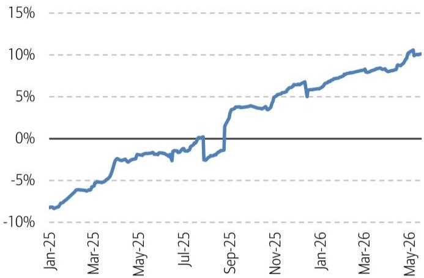

line

| Date   | Value |
|--------|-------|
| Jan-25 | -8%   |
| Mar-25 | -5%   |
| May-25 | -3%   |
| Jul-25 | -2%   |
| Sep-25 | 4%    |
| Nov-25 | 6%    |
| Jan-26 | 7%    |
| Mar-26 | 8%    |
| May-26 | 10%   |

Source: BofA Global Research, Bloomberg   
BofA GLOBAL RESEARCH

# Appendix

# BofA China A-share W&W indicator

The BofA China A-share Wax & Wane (W&W) Indicator is a contrarian sentiment indicator, using fund flows, liquidity, positioning, leverage, earnings and valuation data. While the China Investment Compass guides us phases in the cycle and sectors to select, our W&W Indicator helps to gauge the short-term market sentiment and technical drivers. We believe the Indicator can offer predictive value on how the A-share market (ie. CSI300 Index) is likely to perform in the following 6 months – when the Indicator wanes, it usually creates buying opportunities, whereas when the Indicator waxes, it tends to become selling opportunities.

The Wax & Wane Indicator has a reading between 0 and 100: When the Indicator exceeds the threshold of 80, sentiment is extremely strong, and it makes a "Very Bearish" signal. When the Indicator falls between 60 and 80, it is a "Bearish" signal.

When the Indicator drops below the threshold of 20, sentiment is extremely weak, and it makes a "Very Bullish" signal. When the Indicator falls between 20 and 40, it is a "Bullish" signal.

Please refer to our Relaunching the China A-share Wax & Wane Indicator report for details of the methodology.

# Back-testing disclaimer

The analysis of the BofA China A-share Wax & Wane (W&W) Indicator in this report is back-tested and does not represent the actual performance of any account or fund. Back-tested performance depicts the hypothetical back-tested performance of a particular strategy over the time period indicated. In future periods, market and economic conditions will differ and the same strategy will not necessarily produce the same results. No representation is being made that any actual portfolio is likely to have achieved returns similar to those shown herein. In fact, there are frequently sharp differences between back-tested returns and the actual results realized in the actual management of a portfolio. Back-tested performance results are created by applying an investment strategy or methodology to historical data and attempts to give an indication as to how a strategy might have performed during a certain period in the past if the product had been in existence during such time. Back-tested results have inherent limitations including the fact that they are calculated with the full benefit of hindsight, which allows the security selection methodology to be adjusted to maximize the returns. Further, the results shown do not reflect actual trading or the impact that material economic and market factors might have had on a portfolio manager's decision-making under actual circumstances. Back-tested returns do not reflect advisory fees, trading costs, or other fees or expenses.

# Disclosures

# Important Disclosures

FUNDAMENTAL EQUITY OPINION KEY: Opinions include a Volatility Risk Rating, an Investment Rating and an Income Rating. VOLATILITY RISK RATINGS, indicators of potential price fluctuation, are: A - Low, B - Medium and C - High. INVESTMENT RATINGS reflect the analyst's assessment of both a stock's absolute total return potential as well as its attractiveness for investment relative to other stocks within its Coverage Cluster (defined below). Our investment ratings are: 1 - Buy stocks are expected to have a total return of at least 10% and are the most attractive stocks in the coverage cluster; 2 - Neutral stocks are expected to remain flat or increase in value and are less attractive than Buy rated stocks and 3 - Underperform stocks are the least attractive stocks in a coverage cluster. An investment rating of 6 (No Rating) indicates that a stock is no longer trading on the basis of fundamentals. Analysts assign investment ratings considering, among other things, the 0-12 month total return expectation for a stock and the firm's guidelines for ratings dispersions (shown in the table below). The current price objective for a stock should be referenced to better understand the total return expectation at any given time. The price objective reflects the analyst's view of the potential price appreciation (depreciation).

<table><tr><td>Investment rating</td><td>Total return expectation (within 12-month period of date of initial rating)</td><td>Ratings dispersion guidelines for coverage cluster $^{R1}$ </td></tr><tr><td>Buy</td><td>≥ 10%</td><td>≤ 70%</td></tr><tr><td>Neutral</td><td>≥ 0%</td><td>≤ 30%</td></tr><tr><td>Underperform</td><td>N/A</td><td>≥ 20%</td></tr></table>

$^{R1}$ Ratings dispersions may vary from time to time where BofA Global Research believes it better reflects the investment prospects of stocks in a Coverage Cluster.

INCOME RATINGS, indicators of potential cash dividends, are: 7 - same/higher (dividend considered to be secure), 8 - same/lower (dividend not considered to be secure) and 9 - pays no cash dividend. Coverage Cluster is comprised of stocks covered by a single analyst or two or more analysts sharing a common industry, sector, region or other classification(s). A stock's coverage cluster is included in the most recent BofA Global Research report referencing the stock.

Due to the nature of strategic analysis, the issuers or securities recommended or discussed in this report are not continuously followed. Accordingly, investors must regard this report as providing stand-alone analysis and should not expect continuing analysis or additional reports relating to such issuers and/or securities.

BofA Global Research personnel (including the analyst(s) responsible for this report) receive compensation based upon, among other factors, the overall profitability of BofA Corporation, including profits derived from investment banking. The analyst(s) responsible for this report may also receive compensation based upon, among other factors, the overall profitability of the Bank's sales and trading businesses relating to the class of securities or financial instruments for which such analyst is responsible.

# Other Important Disclosures

From time to time research analysts conduct site visits of covered issuers. BofA Global Research policies prohibit research analysts from accepting payment or reimbursement for travel expenses from the issuer for such visits.

Prices are indicative and for information purposes only. Except as otherwise stated in the report, for any recommendation in relation to an equity security, the price referenced is the publicly traded price of the security as of close of business on the day prior to the date of the report or, if the report is published during intraday trading, the price referenced is indicative of the traded price as of the date and time of the report and in relation to a debt security (including equity preferred and CDS), prices are indicative as of the date and time of the report and are from various sources including BofA trading desks.

The date and time of completion of the production of any recommendation in this report shall be the date and time of dissemination of this report as recorded in the report timestamp.

Recipients who are not institutional investors or market professionals should seek the advice of their independent financial advisor before considering information in this report in connection with any investment decision, or for a necessary explanation of its contents.

Officers of BofAS or one or more of its affiliates (other than research analysts) may have a financial interest in securities of the issuer(s) or in related investments.

Refer to BofA Global Research policies relating to conflicts of interest.

"BofA" includes BofA, Inc. ("BofAS") and its affiliates. Investors should contact their BofA representative or Merrill Global Wealth Management financial advisor if they have questions concerning this report or concerning the appropriateness of any investment idea described herein for such investor. "BofA" is a global brand for BofA Global Research.

Information relating to Non-US affiliates of BofA and Distribution of Affiliate Research Reports:

BofAS and/or BofA, Pierce, Fenner & Smith Incorporated ("MLPF&S") may in the future distribute, information of the following non-US affiliates in the US (short name: legal name, regulator): BofA (South Africa): BofA South Africa (Pty) Ltd., regulated by the Financial Sector Conduct Authority; MLI (UK): BofA International, regulated by the Financial Conduct Authority (FCA) and the Prudential Regulation Authority (PRA); BofASE (France): BofA Europe SA is authorized by the Autorité de Contrôle Prudentiel et de Résolution (ACPR) and regulated by the ACPR and the Autorité des Marchés Financiers (AMF). BofA Europe SA ("BofASE") with registered address at 51, rue La Boétie, 75008 Paris is registered under no 842 602 690 RCS Paris. In accordance with the provisions of French Code Monétaire et Financier (Monetary and Financial Code), BofASE is an établissement de crédit et d'investissement (credit and investment institution) that is authorised and supervised by the European Central Bank and the Autorité de Contrôle Prudentiel et de Résolution (ACPR) and regulated by the ACPR and the Autorité des Marchés Financiers. BofASE's share capital can be found at www.bofaml.com/BofASEdisclaimer; BofA Europe (Milan): BofA Europe Designated Activity Company, Milan Branch, regulated by the Bank of Italy, the European Central Bank (ECB) and the Central Bank of Ireland (CBI); BofA Europe (Frankfurt): BofA Europe Designated Activity Company, Frankfurt Branch regulated by BaFin, the ECB and the CBI; BofA Europe (Zurich): BofA Europe Designated Activity Company, Zurich Branch, regulated by the Swiss Financial Market Supervisory Authority FINMA, the ECB and CBI; BofA Europe (Madrid): BofA Europe Designated Activity Company, Sucursal en España, regulated by the Bank of Spain, the ECB and the CBI; BofA (Australia): BofA Equities (Australia) Limited, regulated by the Australian Securities and Investments Commission; BofA (Hong Kong): BofA (Asia Pacific) Limited, regulated by the Hong Kong Securities and Futures Commission (HKSFC); BofA (Singapore): BofA (Singapore) Pte Ltd, regulated by the Monetary Authority of Singapore (MAS); BofA (Canada): BofA Canada Inc, regulated by the Canadian Investment Regulatory Organization; BofA (Mexico): BofA Mexico, SA de CV, Casa de Bolsa, regulated by the Comisión Nacional Bancaria y de Valores; BofAS Japan: BofA Japan Co., Ltd., regulated by the Financial Services Agency; BofA (Seoul): BofA International, LLC Seoul Branch, regulated by the Financial Supervisory Service; BofA (Taiwan): BofA (Taiwan) Ltd., regulated by the Securities and Futures Bureau; BofAS India: BofA India Limited, regulated by the Securities and Exchange Board of India (SEBI); BofA (Israel): BofA Israel Limited, regulated by Israel Securities Authority; BofA (DIFC): BofA International (DIFC Branch), regulated by the Dubai Financial Services Authority (DFSA); BofA (Brazil): BofA S.A. Corretora de Títulos e Valores Mobiliários, regulated by Comissão de Valores Mobiliários; BofA KSA Company: BofA Kingdom of Saudi Arabia Company, regulated by the Capital Market Authority. This information: has been approved for publication and is distributed in the United Kingdom (UK) to professional clients and eligible counterparties (as each is defined in the rules of the FCA and the PRA) by MLI (UK), which is authorized by the PRA and regulated by the FCA and the PRA - details about the extent of our regulation by the FCA and PRA are available from us on request; has been approved for publication and is distributed in the European Economic Area (EEA) by BofASE (France), which is authorized by the ACPR and regulated by the ACPR and the AMF; has been considered and distributed in Japan by BofAS Japan, a registered securities dealer under the Financial Instruments and Exchange Act in Japan, or its permitted affiliates; is issued and distributed in Hong Kong by BofA (Hong Kong) which is regulated by HKSFC; is issued and distributed in Taiwan by BofA (Taiwan); is issued and distributed in India by BofAS India; and is issued and distributed in Singapore to institutional investors and/or accredited investors (each as defined under the Financial Advisers Regulations) by BofA (Singapore)

(Company Registration No 198602883D). BofA (Singapore) is regulated by MAS. BofA Equities (Australia) Limited (ABN 65 006 276 795), AFS License 235132 (MLEA) distributes this information in Australia only to 'Wholesale' clients as defined by s.761G of the Corporations Act 2001. With the exception of BofA N.A., Australia Branch, neither MLEA nor any of its affiliates involved in preparing this information is an Authorised Deposit-Taking Institution under the Banking Act 1959 nor regulated by the Australian Prudential Regulation Authority. No approval is required for publication or distribution of this information in Brazil and its local distribution is by BofA (Brazil) in accordance with applicable regulations. BofA (DIFC) is authorized and regulated by the DFSA. Information prepared and issued by BofA (DIFC) is done so in accordance with the requirements of the DFSA conduct of business rules. BofA Europe (Frankfurt) distributes this information in Germany and is regulated by BaFin, the ECB and the CBI. BofA entities, including BofA Europe and BofASE (France), may outsource/delegate the marketing and/or provision of certain research services or aspects of research services to other branches or members of the BofA group. You may be contacted by a different BofA entity acting for and on behalf of your service provider where permitted by applicable law. This does not change your service provider. Please refer to the Electronic Communications Disclaimers for further information.

This information has been prepared and issued by BofAS and/or one or more of its non-US affiliates. The author(s) of this information may not be licensed to carry on regulated activities in your jurisdiction and, if not licensed, do not hold themselves out as being able to do so. BofAS and/or MLPF&S is the distributor of this information in the US and accepts full responsibility for information distributed to BofAS and/or MLPF&S clients in the US by its non-US affiliates. Any US person receiving this information and wishing to effect any transaction in any security discussed herein should do so through BofAS and/or MLPF&S and not such foreign affiliates. Hong Kong recipients of this information should contact BofA (Asia Pacific) Limited in respect of any matters relating to dealing in securities or provision of specific advice on securities or any other matters arising from, or in connection with, this information. Singapore recipients of this information should contact BofA (Singapore) Pte Ltd in respect of any matters arising from, or in connection with, this information. For clients that are not accredited investors, expert investors or institutional investors BofA (Singapore) Pte Ltd accepts full responsibility for the contents of this information distributed to such clients in Singapore.

# General Investment Related Disclosures:

Taiwan Readers: Neither the information nor any opinion expressed herein constitutes an offer or a solicitation of an offer to transact in any securities or other financial instrument. No part of this report may be used or reproduced or quoted in any manner whatsoever in Taiwan by the press or any other person without the express written consent of BofA. This document provides general information only, and has been prepared for, and is intended for general distribution to, BofA clients. Neither the information nor any opinion expressed constitutes an offer or an invitation to make an offer, to buy or sell any securities or other financial instrument or any derivative related to such securities or instruments (e.g., options, futures, warrants, and contracts for differences). This document is not intended to provide personal investment advice and it does not take into account the specific investment objectives, financial situation and the particular needs of, and is not directed to, any specific person(s). This document and its content do not constitute, and should not be considered to constitute, investment advice for purposes of ERISA, the US tax code, the Investment Advisers Act or otherwise. Investors should seek financial advice regarding the appropriateness of investing in financial instruments and implementing investment strategies discussed or recommended in this document and should understand that statements regarding future prospects may not be realized. Any decision to purchase or subscribe for securities in any offering must be based solely on existing public information on such security or the information in the prospectus or other offering document issued in connection with such offering, and not on this document.

Securities and other financial instruments referred to herein, or recommended, offered or sold by BofA, are not insured by the Federal Deposit Insurance Corporation and are not deposits or other obligations of any insured depository institution (including, BofA, N.A.). Investments in general and, derivatives, in particular, involve numerous risks, including, among others, market risk, counterparty default risk and liquidity risk. No security, financial instrument or derivative is suitable for all investors. Digital assets are extremely speculative, volatile and are largely unregulated. In some cases, securities and other financial instruments may be difficult to value or sell and reliable information about the value or risks related to the security or financial instrument may be difficult to obtain. Investors should note that income from such securities and other financial instruments, if any, may fluctuate and that price or value of such securities and instruments may rise or fall and, in some cases, investors may lose their entire principal investment. Past performance is not necessarily a guide to future performance. Levels and basis for taxation may change.

This report may contain a short-term trading idea or recommendation, which highlights a specific near-term catalyst or event impacting the issuer or the market that is anticipated to have a short-term price impact on the equity securities of the issuer. Short-term trading ideas and recommendations are different from and do not affect a stock's fundamental equity rating, which reflects both a longer term total return expectation and attractiveness for investment relative to other stocks within its Coverage Cluster. Short-term trading ideas and recommendations may be more or less positive than a stock's fundamental equity rating.

BofA is aware that the implementation of the ideas expressed in this report may depend upon an investor's ability to "short" securities or other financial instruments and that such action may be limited by regulations prohibiting or restricting "shortselling" in many jurisdictions. Investors are urged to seek advice regarding the applicability of such regulations prior to executing any short idea contained in this report.

Foreign currency rates of exchange may adversely affect the value, price or income of any security or financial instrument mentioned herein. Investors in such securities and instruments, including ADRs, effectively assume currency risk.

BofAS or one of its affiliates is a regular issuer of traded financial instruments linked to securities that may have been recommended in this report. BofAS or one of its affiliates may, at any time, hold a trading position (long or short) in the securities and financial instruments discussed in this report.

BofA, through business units other than BofA Global Research, may have issued and may in the future issue trading ideas or recommendations that are inconsistent with, and reach different conclusions from, the information presented herein. Such ideas or recommendations may reflect different time frames, assumptions, views and analytical methods of the persons who prepared them, and BofA is under no obligation to ensure that such other trading ideas or recommendations are brought to the attention of any recipient of this information. In the event that the recipient received this information pursuant to a contract between the recipient and BofAS for the provision of research services for a separate fee, and in connection therewith BofAS may be deemed to be acting as an investment adviser, such status relates, if at all, solely to the person with whom BofAS has contracted directly and does not extend beyond the delivery of this report (unless otherwise agreed specifically in writing by BofAS). If such recipient uses the services of BofAS in connection with the sale or purchase of a security referred to herein, BofAS may act as principal for its own account or as agent for another person. BofAS is and continues to act solely as a broker-dealer in connection with the execution of any transactions, including transactions in any securities referred to herein.

# Copyright and General Information:

Copyright 2026 BofA Corporation. All rights reserved. iQdatabase® is a registered service mark of BofA Corporation. This information is prepared for the use of BofA clients and may not be redistributed, retransmitted or disclosed, in whole or in part, or in any form or manner, without the express written consent of BofA. This document and its content is provided solely for informational purposes and cannot be used for training or developing artificial intelligence (AI) models or as an input in any AI application (collectively, an AI tool). Any attempt to utilize this document or any of its content in connection with an AI tool without explicit written permission from BofA Global Research is strictly prohibited. BofA Global Research utilizes AI, including machine learning and other technologies, to enhance the services we provide to our clients. These technologies assist our analysts in various aspects of their work, including but not limited to data analysis, content extraction, content creation, data aggregation and summarization and identifying relevant information from diverse sources. All AI-driven processes are subject to review by BofA Global Research employees. BofA Global Research information is distributed simultaneously to internal and client websites and other portals by BofA and is not publicly-available material. Any unauthorized use or disclosure is prohibited. Receipt and review of this information constitutes your agreement not to redistribute, retransmit, or disclose to others the contents, opinions, conclusion, or information contained herein (including any investment recommendations, estimates or price targets) without first obtaining express permission from an authorized officer of BofA.

Materials prepared by BofA Global Research personnel are based on public information. Facts and views presented in this material have not been reviewed by, and may not reflect information known to, professionals in other business areas of BofA, including investment banking personnel. BofA has established information barriers between BofA Global Research and certain business groups. As a result, BofA does not disclose certain client relationships with, or compensation received from, such issuers. To the extent this material discusses any legal proceeding or issues, it has not been prepared as nor is it intended to express any legal conclusion, opinion or advice. Investors should consult their own legal advisers as to issues of law relating to the subject matter of this material. BofA Global Research personnel's knowledge of legal proceedings in which any BofA entity and/or its directors, officers and employees may be plaintiffs, defendants, co-defendants or co-plaintiffs with or involving issuers mentioned in this material is based on public information. Facts and views presented in this material that relate to any such proceedings have not been reviewed by, discussed with, and may not reflect information known to, professionals in other business areas of BofA in connection with the legal proceedings or matters relevant to such proceedings.

This information has been prepared independently of any issuer of securities mentioned herein and not in connection with any proposed offering of securities or as agent of any issuer of any securities. None of BofAS any of its affiliates or their research analysts has any authority whatsoever to make any representation or warranty on behalf of the issuer(s). BofA Global Research policy prohibits research personnel from disclosing a recommendation, investment rating, or investment thesis for review by an issuer prior to the publication of a research report containing such rating, recommendation or investment thesis.

Any information relating to sustainability in this material is limited as discussed herein and is not intended to provide a comprehensive view on any sustainability claim with respect to any issuer or security.

Any information relating to the tax status of financial instruments discussed herein is not intended to provide tax advice or to be used by anyone to provide tax advice. Investors are urged to seek tax advice based on their particular circumstances from an independent tax professional.

The information herein (other than disclosure information relating to BofA and its affiliates) was obtained from various sources and we do not guarantee its accuracy. This information may contain links to third-party websites. BofA is not responsible for the content of any third-party website or any linked content contained in a third-party website. Content contained on such third-party websites is not part of this information and is not incorporated by reference. The inclusion of a link does not imply any endorsement by or any affiliation with BofA. Access to any third-party website is at your own risk, and you should always review the terms and privacy policies at third-party websites before submitting any personal information to them. BofA is not responsible for such terms and privacy policies and expressly disclaims any liability for them.

All opinions, projections and estimates constitute the judgment of the author as of the date of publication and are subject to change without notice. Prices also are subject to change without notice. BofA is under no obligation to update this information and BofA ability to publish information on the subject issuer(s) in the future is subject to applicable quiet periods. You should therefore assume that BofA will not update any fact, circumstance or opinion contained herein.

Certain outstanding reports or investment opinions relating to securities, financial instruments and/or issuers may no longer be current. Always refer to the most recent research report relating to an issuer prior to making an investment decision.

In some cases, an issuer may be classified as Restricted or may be Under Review or Extended Review. In each case, investors should consider any investment opinion relating to such issuer (or its security and/or financial instruments) to be suspended or withdrawn and should not rely on the analyses and investment opinion(s) pertaining to such issuer (or its securities and/or financial instruments) nor should the analyses or opinion(s) be considered a solicitation of any kind. Sales persons and financial advisors affiliated with BofAS or any of its affiliates may not solicit purchases of securities or financial instruments that are Restricted or Under Review and may only solicit securities under Extended Review in accordance with firm policies.

Neither BofA nor any officer or employee of BofA accepts any liability whatsoever for any direct, indirect or consequential damages or losses arising from any use of this information.