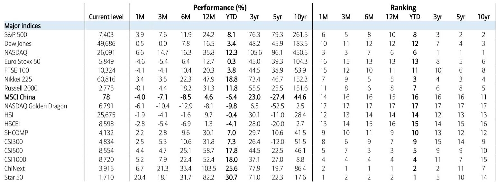

# The A-Share Bullish Signal Is Real, But the Market's Internal Logic Has Shifted

The latest iteration of a widely-followed composite indicator for China's A-share market has flashed a "very bullish" reading for the second time in two months, a signal that historically has preceded meaningful near-term gains in the CSI 300. The monthly average of the Wax & Wane Indicator sits at 29, firmly in bullish territory, while the daily reading touched 13 on May 11 -- the strongest level since September 2024. This is not a marginal flicker of optimism. It is a structural call on direction. But the signal arrives at a moment when the internal mechanics of the market are shifting in ways that make a simple "buy the index" trade insufficient. The bull case is intact, but it now requires a more surgical understanding of which parts of the market are being rewarded and why.

The composite signal is being driven by three supportive pillars: a positive earnings revision cycle, ample liquidity, and supportive fund flows. The CSI 300 earnings revision has recovered from a year-over-year decline of 12% in September 2024 to a positive 10.1% as of May 2026. That is a dramatic swing in corporate fundamentals. The 10-year government bond yield has risen from its record low of 1.6% in January to 1.76%, which signals that the liquidity environment, while still loose, is normalizing rather than tightening. Turnover relative to market capitalization stands at 2.8%, well above the long-term average of 1.1% since 2007, indicating that participation is broad and active. These are not speculative froth metrics. They are the building blocks of a sustained recovery.

Yet there are three warning flags that complicate the picture. Leverage, valuation, and positioning are all elevated. Margin trading as a share of daily turnover, while down from recent peaks, remains above its long-term average. The P/E ratio of the CSI 300 at 24.3x is above the historical average of 21.2x. And equity fund positioning at 86.9% is above the long-term average of 84.7%. This is the central tension of the current setup: the market is being propelled by genuine fundamental improvement, but it is already pricing in a significant portion of that improvement. The question is not whether the bull case is real. It is how much of it is already in the price.

## The Composite Signal Has Been a Reliable Predictor of Near-Term Returns, But Its Precision Varies by Time Horizon

The back-tested performance of the Wax & Wane Indicator against the CSI 300 reveals a pattern that is useful for strategy but dangerous for tactical precision. Over a one-month horizon, the indicator has been a reasonably good directional guide, but the relationship is noisy. Over a two-month horizon, the predictive power improves noticeably. Over a three-month horizon, the correlation becomes materially stronger. This is not a timing tool for day traders. It is a strategic compass for investors who can hold through the volatility that typically accompanies the early stages of a re-rating.

The implication is clear: investors should not interpret the "very bullish" signal as a call to buy at any price on any day. Rather, it suggests that the probability distribution of returns over the next two to three months is skewed to the upside. The signal is telling you to be positioned, not to be aggressive. The difference matters because the elevated valuation and leverage readings suggest that the market is vulnerable to pullbacks. The indicator's strength lies in its ability to identify environments where pullbacks are likely to be buying opportunities rather than the start of a downtrend.

## Earnings Revision Momentum Has Become the Most Powerful Driver of the Signal, Replacing Pure Liquidity

What has changed from previous cycles is the relative weight of the components driving the composite reading. In the past, the Wax & Wane Indicator was frequently dominated by liquidity and fund flow dynamics, with earnings playing a secondary role. That pattern has inverted. The earnings revision component is now the strongest positive contributor, while liquidity, though supportive, is no longer the primary engine. This shift has profound implications for sector and stock selection.

When earnings revisions are the dominant force, the market tends to reward companies that are demonstrating genuine operational improvement rather than those that are simply benefiting from a rising tide. This explains why the Star 50, ChiNext, and CSI 1000 have outperformed in recent weeks, while the NASDAQ Golden Dragon, MSCI China, and HSCEI have lagged. The domestic A-share market is rotating toward sectors where earnings momentum is accelerating, particularly in technology and industrials. The offshore China market, by contrast, remains more exposed to macro headwinds and regulatory overhangs that have not yet been resolved.

The strategic takeaway is that passive exposure to broad China indices is no longer sufficient. The dispersion between the best and worst performing segments of the market is widening. Investors need to be selective, and selectivity must be anchored to earnings trajectory rather than valuation alone.

## The Market Is Trading in an "A-Share Style" That Favors Thematic Rotation and Mid-Cap Exposure

One of the most revealing observations in the current data is that the market is exhibiting what analysts describe as an "A-share style" of trading: thematic-driven, fast rotation, and a preference for mid and small-cap stocks. This is not a market where blue-chip stability is being rewarded. It is a market where narrative and momentum are the dominant forces.

This style has historically been associated with periods of strong liquidity and improving risk appetite, but it also carries higher volatility and lower predictability. The rotation is happening at a pace that makes it difficult for long-only institutional investors to maintain consistent exposure. The outperformance of the CSI 1000 relative to the CSI 300 is a signal that capital is flowing down the market cap spectrum, seeking growth wherever it can be found.

For investors accustomed to the relative stability of large-cap indices, this environment requires a different playbook. Position sizing needs to be more dynamic. Stop-loss levels need to be tighter. And thematic conviction needs to be backed by a willingness to rotate quickly when the narrative shifts. The current environment rewards active management and punishes passive patience.

## What the Report Does Not Fully Answer: The Sustainability of the Earnings Recovery and the Risk of a Positioning Exhaustion

The report provides a clear and data-rich argument for why the market is bullish in the near term. But it leaves several critical questions unresolved, and these questions should give investors pause before committing fully to the thesis.

The first open question is the sustainability of the earnings revision cycle. The recovery from -12% to +10.1% year-over-year is impressive, but it is not yet clear whether this is a cyclical rebound or the beginning of a structural upswing. If the earnings improvement is driven primarily by base effects and cost-cutting rather than revenue growth, the momentum may fade faster than the indicator anticipates. The report does not provide a breakdown of the earnings revisions by sector or by source, leaving investors to infer the quality of the recovery.

The second unresolved question is the risk of positioning exhaustion. With equity fund positioning already above its long-term average, the marginal buyer is becoming harder to find. The market has already absorbed a significant amount of capital. If the next wave of inflows does not materialize, the market could stall even if fundamentals remain supportive. The indicator captures current positioning but does not model the elasticity of demand at current levels.

The third question is whether the "A-share style" of thematic rotation can persist in the face of rising bond yields. The 10-year yield has moved from 1.6% to 1.76%. If this trend continues, it could start to compress valuation multiples, particularly for the mid and small-cap names that have been leading the rally. The report flags the valuation risk but does not stress-test the scenario of a sustained yield increase.

These are not reasons to dismiss the bullish signal. They are reasons to approach it with a risk-aware framework rather than blind conviction.

## A Decision Framework for Investors: Three Questions to Answer Before Acting on the Signal

For readers who want to translate the report's analysis into actionable decisions, the following framework can help structure the thinking. It is not a recommendation to buy or sell. It is a set of diagnostic questions that every investor should answer before adjusting their portfolio.

First, what is your time horizon? If you are investing for one month, the signal is less reliable and the noise is higher. If you are investing for three to six months, the signal provides a stronger foundation. Align your position sizing with your holding period.

Second, what is your exposure to the parts of the market that are being rewarded? If your portfolio is overweight offshore China names or large-cap defensives, you are likely underperforming the current rotation. Consider whether you need to increase exposure to domestic A-share technology and industrial names, or to mid-cap indices.

Third, what is your risk budget for a pullback? The elevated leverage and valuation readings mean that the market is vulnerable to a 5-10% correction even within an overall bullish trend. Ensure that your position sizing allows you to hold through that volatility without being forced to sell at the bottom.

This framework does not replace the deeper analysis in the full report. It provides a starting point for disciplined decision-making.

## Join the Community to Read the Full Report and Review the Original Charts

The data and analysis presented here are drawn from a detailed research report that includes the full historical back-testing of the Wax & Wane Indicator, sector-level performance breakdowns, and proprietary fund flow analysis. The charts in the original report provide a richer understanding of how the current signal compares to previous cycles and what the probability distributions look like for different time horizons. Join the community to read the full report and review the original charts.

*This article is for learning and discussion only and does not constitute investment advice.*

Personal reading notes and learning share only. Not investment advice.

