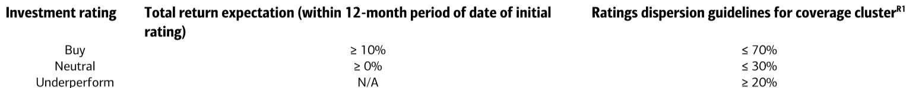

# AI Will Reshape Work, Not Eliminate It—And That Distinction Is the Real Investment Signal

The dominant narrative around artificial intelligence and employment has been one of mass displacement: algorithms replacing analysts, chatbots replacing customer service, and automation hollowing out the white-collar workforce. This narrative is not just incomplete—it is strategically misleading. A detailed analysis from a global investment bank's economics team argues that AI will transform tasks far more than it will eliminate entire occupations, and that the real economic story is about productivity expansion, not job destruction. For investors, policymakers, and business leaders, the critical insight is not whether jobs will disappear, but how the composition of work, the distribution of wages, and the geography of adaptability will shift. The difference between exposure and automation is the difference between disruption and opportunity, and understanding that gap is the single most important analytical task for anyone positioning capital or strategy in the next decade.

The timing of this argument matters because the evidence is now arriving in real time. Youth unemployment in advanced economies has been cited as proof of AI-driven job destruction, yet recent data shows that pressure on that cohort may have already peaked. The share of global jobs exposed to generative AI stands at roughly one-quarter, but the share with high automation potential is only about 2.3 percent, while the share with augmentation potential is closer to 13 percent. These numbers do not support an apocalypse narrative. They support a redesign narrative—one in which routine, codifiable, and information-heavy tasks are absorbed by machines, while human judgment, accountability, creativity, and contextual understanding become more, not less, valuable.

The historical record reinforces this view. Agriculture accounted for roughly 40 percent of US employment in the early 1900s; today it is around 1 percent. That sectoral collapse did not produce mass unemployment—it produced a migration of labor into manufacturing and services, sectors that were unimaginable at the time. The IT revolution did not eliminate analysts; it increased demand for them as the cost of data gathering collapsed. E-commerce did not eliminate retail employment; the United States still has roughly 15 to 16 million retail workers, comparable to levels before e-commerce became mainstream. The pattern across these technological shifts is consistent: automation displaces tasks, productivity expands demand, and new roles emerge endogenously. AI may move faster and affect a broader range of cognitive tasks, but the underlying logic remains intact.

## The Distinction Between Task Exposure and Job Automation Determines Which Economies Win and Which Lose

The most important analytical distinction in the report is between exposure and automation. Exposure means AI can enter the workflow; automation means AI can replace the worker. These are not the same thing, and conflating them leads to systematically wrong conclusions about risk and opportunity. Most jobs are bundles of tasks. Some tasks—data entry, routine analysis, summarization, document review—are highly susceptible to AI. But most jobs also involve judgment, client interaction, coordination, creativity, and accountability. These human elements are far harder to automate, even with agentic AI.

This distinction has direct implications for how investors should evaluate companies and countries. A firm with high AI exposure is not necessarily a firm at risk of labor cost disruption; it may be a firm with significant productivity upside. The key question is whether the organization has the complementary assets—data infrastructure, training systems, management capability—to convert exposure into augmentation rather than displacement. Companies that invest in these complementary assets will see their labor costs become more variable and their output per worker rise. Companies that do not will find themselves with overstaffed routine functions and underdeveloped strategic capabilities.

The same logic applies at the country level. Advanced economies have the highest share of jobs exposed to AI—roughly 33 percent in high-income economies compared with 11 percent in low-income ones. Europe and Central Asia have the highest regional exposure rate, followed by the Americas. But exposure is only one side of the story. The other side is adaptation capacity. Advanced economies generally have higher human capital, more advanced education systems, deeper digital infrastructure, and more flexible labor markets. These factors mean they are better positioned to convert exposure into productivity gains rather than suffer only the disruption. Ageing economies face shrinking workforces and rising care needs, which means AI can help offset labor shortages by boosting output per worker. For investors, high AI exposure in a country with strong adaptation capacity is a positive signal. High exposure in a country with weak institutions and rigid labor markets is a warning.

## The New Jobs Will Not Look Like the Old Jobs, and That Creates a Visibility Problem for Markets

One of the most challenging aspects of the AI transition is that many of the new roles are difficult to predict in advance. The report identifies three broad categories of emerging employment. The first is AI-specific roles: prompt engineers, AI trainers, model evaluators, and other positions that exist because AI systems themselves require human oversight, quality control, and ethical judgment. These roles are already visible in hiring data, but they represent a small fraction of total employment.

The second category is hybrid roles within existing occupations. A research analyst may spend less time on mechanical data collection and more time interpreting AI-generated analysis, challenging assumptions, and communicating conclusions to clients. A lawyer may use AI for document review but spend more time on legal strategy and negotiation. These hybrid roles do not appear in occupational classifications as new categories, which means they are systematically undercounted in employment statistics. The transformation is happening inside existing job titles, not outside them.

The third category is jobs that expand because AI raises overall income and productivity elsewhere in the economy. If AI makes parts of the economy more productive, real income rises, and demand shifts toward services that remain human-intensive: healthcare, nursing, elderly care, education, personal services. These sectors are not directly exposed to AI, but they benefit indirectly from higher income and changing consumption patterns. There is also the rise of the one-person company, where agentic AI allows individuals to perform functions that previously required a small team, lowering barriers to entrepreneurship and small business formation.

The visibility problem is real and consequential. If investors and policymakers rely only on headline employment numbers, they will miss the structural shift. The new jobs are not being created in neatly labeled categories. They are being created inside existing roles, in service sectors that are difficult to automate, and in new business formations that are hard to track in real time. This means that traditional labor market indicators may look weak even as the underlying economy is adapting. The signal is not in the aggregate unemployment rate; it is in the composition of hiring, the dispersion of wages, and the rate of new business formation.

## The Distribution Between Capital and Labor Is the Unresolved Question That Will Define the Next Cycle

The report does not fully resolve one critical question: whether the productivity gains from AI will accrue disproportionately to capital or to labor. Early evidence suggests that productivity gains are flowing disproportionately to capital owners and firms with strong complementary assets—data infrastructure, organizational capability, and digital platforms. If this trend continues, it could mean that even as output rises, labor's share of income declines, and wage dispersion within occupations widens.

This is not a prediction of mass unemployment, but it is a prediction of structural inequality. Experienced workers who know how to use AI effectively may see their productivity and wages rise, while entry-level workers performing routine tasks may face substitution pressure. The report notes that wages have risen faster in AI-exposed industries even as employment growth has lagged, particularly for younger workers. This suggests a combination of augmentation for experienced workers and substitution pressure at the job entry level. The net effect on aggregate wages is ambiguous, but the distributional effect is clear: the gains are concentrated among those who already have the skills and assets to leverage AI.

The policy response matters enormously here. If governments step in early with active redistribution, retraining, and social safety nets, the transition can be managed. The report points to examples in Europe, China, and the United States where governments are already taking steps to ensure that productivity gains are more evenly distributed. But if policy lags behind technology, the risk is that capital owners capture an outsized share of the gains, demand for human-intensive services fails to materialize at scale, and the new job creation that the report anticipates falls short of expectations.

This is the open analytical question that the report leaves for readers to explore further. The historical pattern is reassuring, but AI is different in speed and scope. The adjustment could be faster, more uneven, and more concentrated among white-collar and early-career roles than any previous technological shift. The report provides a framework for thinking about the transition, but it does not—and cannot—provide certainty about the outcome.

## A Decision Framework for Investors: Three Questions to Ask About Any Company or Country

The report's analysis can be translated into a practical decision framework. For any company or country under consideration, investors should ask three questions.

First, what is the exposure profile? What share of tasks in the organization or economy are routine, codifiable, and information-heavy? This is not the same as asking what share of jobs are at risk. It is asking where AI can enter the workflow. High exposure is not inherently negative; it is a measure of potential disruption and potential productivity gain.

Second, what is the adaptation capacity? Does the organization or country have the complementary assets—human capital, digital infrastructure, flexible labor markets, training systems—to convert exposure into augmentation rather than displacement? This is the critical differentiator. Two entities with identical exposure profiles can have dramatically different outcomes based on their adaptation capacity.

Third, what is the distribution mechanism? How are the productivity gains from AI being shared between capital and labor? Are wages rising in AI-exposed roles, or is employment simply being reduced? Is the government actively redistributing gains through policy, or is the market allowed to concentrate them? This question determines whether the transition produces broad-based prosperity or structural inequality.

These three questions—exposure, adaptation, distribution—form a coherent analytical framework. They allow investors to move beyond the simplistic debate about whether AI will destroy jobs and toward a more nuanced assessment of which organizations and economies are positioned to benefit.

## The Full Report Contains the Charts and Data That Make These Arguments Actionable

The analysis presented here is drawn from a detailed research report that includes original data, historical comparisons, and country-level exposure estimates. The report's charts on sectoral employment shifts, wage dispersion trends, and country-level adaptation capacity are essential for understanding the magnitude and timing of the transition. The full report also includes the podcast transcript with the economists who authored the research, providing additional context on client feedback, policy debates, and the unresolved questions that will shape the next phase of the AI cycle.

Join the community to read the full report and review the original charts.

*This article is for learning and discussion only and does not constitute investment advice.*

Personal reading notes and learning share only. Not investment advice.

