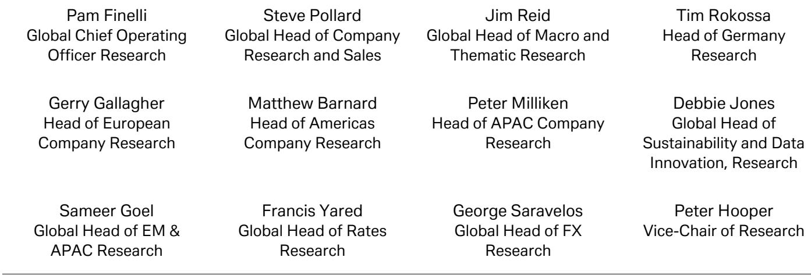
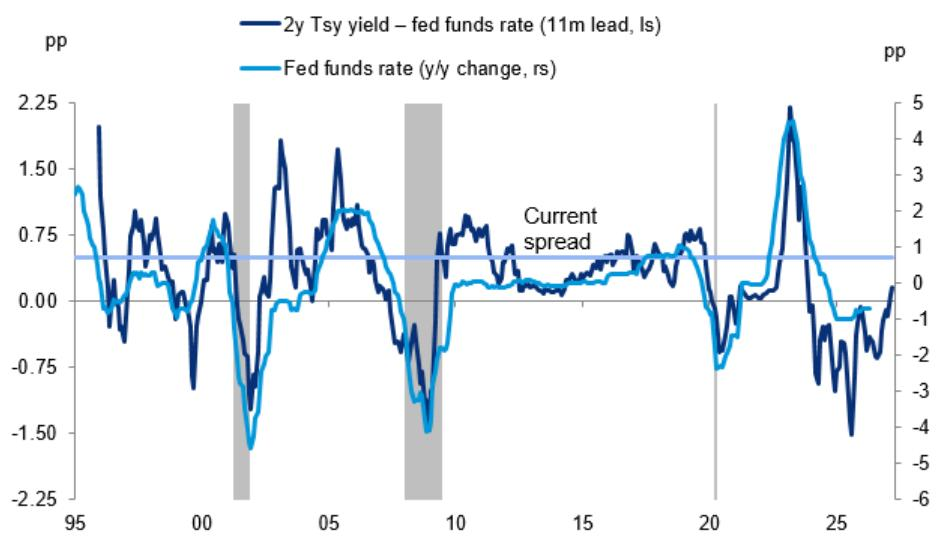

# 市场真正低估的不是通胀，而是美联储加息风险的重现

过去两年，全球资产定价的核心叙事是“通胀见顶、降息在望”。无论是利率期货的曲线，还是权益市场的估值扩张，都建立在一个共同假设之上：美联储的下一步动作是宽松。但一份来自某外资投行的最新研报，给出了一个正在被市场忽视却日益清晰的信号——加息风险正在回归。

这不是一个边缘观点。这份研报的核心判断基于两个独立且相互印证的数据来源：家庭调查中的利率预期和国债市场的定价信号。当“大众的智慧”与“市场的智慧”指向同一方向时，其含义往往比单一指标更值得重视。

报告指出，美国消费者信心调查中的净利率预期指标已经明确转向“未来一年利率将更高”的方向。与此同时，两年期美债收益率与有效联邦基金利率之间的利差，在近期升至约45个基点，一度突破50个基点。这一利差在历史上是联邦基金利率未来变化的领先指标——过去三十年间，它领先联邦基金利率同比变化约十一个月，峰值相关性达到66%。

换句话说，如果这一利差信号维持在当前水平，美联储在未来一年内加息的可能性正在从“小概率事件”变为“需要严肃定价的情景”。对于习惯了降息叙事的市场参与者而言，这可能是2026年最被低估的宏观风险。

---

## 1. 两年期美债利差正在重复1995年、2005年的模式，而非2020年的故事

理解这份研报的核心，在于理解一个看似简单的数字：两年期美债收益率减去联邦基金利率。这个利差，在绝大多数市场参与者的日常关注中，可能只是一个技术指标。但在宏观经济学家的工具箱里，它是预测利率路径最简洁、最有效的先行指标之一。

报告中的图1清晰地展示了这一关系。从1995年到2025年的三十年间，这一利差的波动几乎完美预测了联邦基金利率的同比变化，领先时间约为十一个月。当利差上升时，联邦基金利率在一年后大概率会上升；反之亦然。

当前，这一利差已升至45个基点，接近2022年底以来的最高水平。2022年底是什么概念？那是美联储本轮加息周期最激进的阶段。而现在，市场正在重复这一模式。

值得注意的是，这一关系在2008年全球金融危机后的零利率环境中一度失效——当联邦基金利率长期被钉在零下限时，利差的信号功能自然丧失。但当前环境并非如此。联邦基金利率处于限制性区间，经济仍在增长，通胀回落速度放缓。在这种背景下，利差的信号价值反而更高。

报告使用这一关系进行回归分析，得出的结论是：未来一年联邦基金利率可能上升约30个基点。这不是一个灾难性的数字，但它意味着市场需要重新定价整个利率路径的斜率。

## 2. 家庭调查与市场定价的共振，是过去两年从未出现过的信号

单一指标可能出错，但多个独立指标指向同一方向时，可信度显著上升。这份研报的特殊价值，在于它展示了两种完全不同来源的信号正在形成共振。

第一个信号来自家庭调查。报告提到两周前曾发文指出，世界大型企业联合会的消费者调查中，净利率预期指标已明显转向“未来一年利率将更高”的方向。家庭调查的优点是直接反映经济主体的真实预期，缺点是可能存在噪音和滞后。但它的转向至少说明，普通消费者——那些在现实中面对房贷、车贷、信用卡利率的人——已经开始感受到利率上行的压力。

第二个信号来自国债市场。除了上述利差指标，报告还提到市场对美联储利率路径的定价已经隐含了接近20个基点的加息预期。债券市场是全球最深度、最聪明的市场之一，它的定价往往领先于央行的政策行动。

当家庭调查和债券市场同时发出加息信号时，这不再是噪音，而是趋势。过去两年，这两个信号从未同时指向加息方向。市场一直在讨论“软着陆”“不着陆”和“衰退”，但从未真正定价“再次加息”。现在，这一叙事正在被打破。

## 3. 一个尚未被充分讨论的关键问题：加息的触发条件是什么

报告给出了清晰的信号，但没有完全回答一个关键问题：美联储在什么条件下会真正启动加息？

这是研读这份报告时最需要思考的缺口。报告提供了信号，但没有提供决策框架。从逻辑上推断，可能的触发条件包括：

第一，通胀回落进程停滞甚至逆转。如果核心PCE在3%附近徘徊，而经济仍在增长，美联储可能被迫采取行动。这不是当前市场的主流预期，但并非不可能。

第二，金融条件过度宽松。如果市场持续定价降息，导致金融条件放松，反而会刺激需求和通胀，迫使美联储反向操作。这是一个经典的“美联储悖论”。

第三，财政扩张带来的需求压力。2026年是美国中期选举年，财政政策的不确定性依然存在。如果财政赤字继续扩大，可能推高中性利率，从而迫使美联储上调政策利率。

报告没有对这些问题展开讨论，这恰恰是它最有价值的地方——它提出了一个亟待验证的假设，留给读者自己去判断和跟踪。

## 4. 对投资者的观察框架：从“降息交易”转向“加息避险”需要关注的三条线索

基于这份报告的逻辑，投资者可以建立一个更系统的观察框架，而不是被动等待市场波动。

第一条线索：两年期美债收益率与联邦基金利率的利差是否继续扩大。如果利差持续稳定在50个基点以上，那么加息概率将显著上升。这是一个可以实时跟踪的指标。

第二条线索：消费者信心调查中的利率预期是否进一步恶化。家庭部门的预期变化往往领先于实际消费行为，如果更多人预期利率将上升，消费和投资决策会提前调整，从而影响经济数据。

第三条线索：美联储官员的公开讲话和点阵图变化。目前美联储的官方叙事仍是“保持耐心”，但如果更多官员开始讨论“加息选项”，市场将不得不重新定价。

这三条线索共同构成一个“加息预警系统”。当其中两条同时亮起时，资产配置的逻辑就需要从“降息受益”转向“加息防御”。

## 5. 报告尚未完全回答的问题：这一轮加息周期会是什么形态

即使接受加息风险上升的判断，市场仍然面临一个更深层的问题：如果美联储真的加息，这一轮加息周期的形态会是什么？

历史上的加息周期通常有两种形态。一种是“预防式加息”，在经济过热之前提前收紧，幅度小、时间短。另一种是“追涨式加息”，在通胀失控后被迫大幅加息，幅度大、时间长。

当前的环境更接近哪一种？报告没有给出明确答案，但可以从逻辑上推断。如果加息是由通胀反弹或金融条件过度宽松触发，那么可能更接近“追涨式加息”，对资产价格的冲击会更大。如果是由经济持续增长和中性利率上移触发，那么可能更接近“预防式加息”，市场调整的幅度相对有限。

这个问题的答案，取决于未来几个月的经济数据。而这也正是持续跟踪这份报告逻辑的价值所在。

---

这份研报提供的不是一个确定的结论，而是一个需要被认真对待的风险场景。当家庭调查和市场定价同时指向加息时，最危险的做法不是选择方向，而是忽视信号。

如果你对利率路径的演变、美联储决策的底层逻辑以及如何调整资产配置感兴趣，欢迎来星球微信群里继续讨论。我们会定期分享对这类关键报告的深度解读，以及基于最新数据的动态跟踪。完整的研报原文和原始图表，也会在社群内同步提供。

Personal reading notes and learning share only. Not investment advice.

