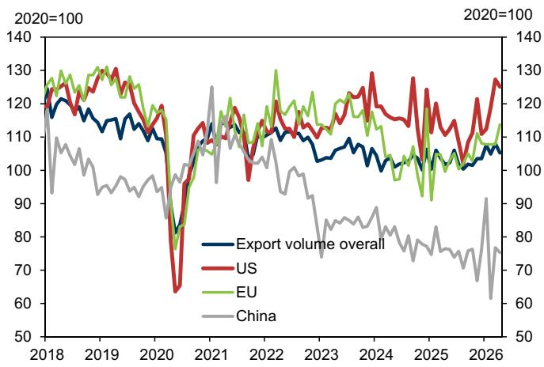
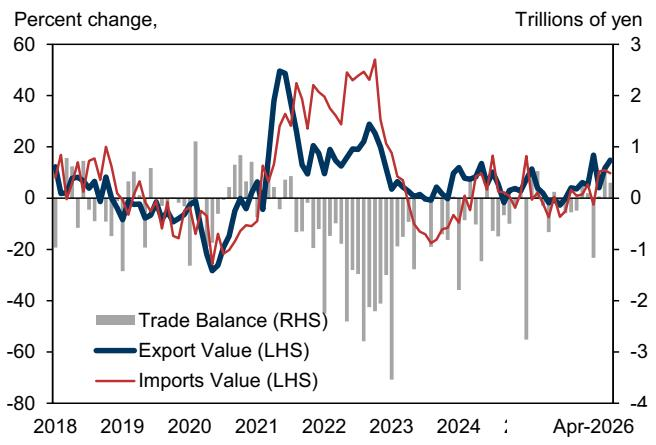
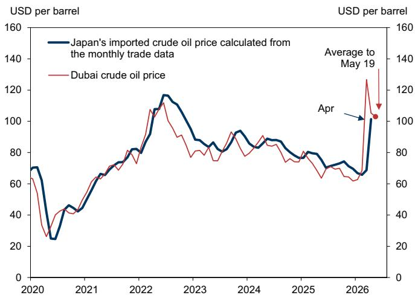

# Japan’s April Trade Data Reveals a Strategic Energy Divergence That Markets Are Underpricing

The headline numbers from Japan’s April trade release tell a story of recovery: a trade surplus of 301.9 billion yen, double-digit export growth for a second consecutive month, and a modest import value increase of 9.7 percent year-on-year. But beneath these aggregate figures lies a far more consequential pattern. Japan is experiencing a profound divergence in its energy import dynamics that carries significant implications for corporate planning, fiscal forecasting, and sector-level risk allocation. The data show that crude oil import unit prices surged 57 percent between February and April, while liquefied natural gas prices rose only 4 percent over the same period. This is not a random fluctuation. It reflects structural shifts in sourcing, contract structures, and geopolitical exposure that will persist beyond any single month’s data release.

The timing matters. April was the first full month reflecting the escalation of Middle East tensions, and the trade data now offer the clearest window yet into how Japan’s energy supply chains are adjusting. The magnitude of the crude oil price shock relative to LNG is striking, but the more important insight is what it reveals about Japan’s asymmetric vulnerability. Crude oil import volumes collapsed 63.7 percent year-on-year, while LNG volumes fell 20.6 percent. These are not parallel adjustments. They represent two different strategic responses to the same geopolitical shock, and investors who treat energy as a single risk factor are missing the critical nuance.

The argument of this article is straightforward: Japan’s April trade data expose a structural decoupling between crude oil and natural gas markets that will reshape corporate cost structures, trade balances, and energy policy debates for the remainder of 2026. The implications extend far beyond energy traders. They affect anyone with exposure to Japanese manufacturing, shipping, petrochemicals, or utility equities. The data also raise unanswered questions about the sustainability of Japan’s export recovery, particularly as Asia-bound shipments show signs of softening. The full report from which this analysis draws contains the detailed exhibits and model outputs that support these conclusions. This article synthesizes the pattern, interprets its meaning, and identifies the strategic decisions it demands.

## The Crude Oil Shock Is Not a Price Story Alone; It Is a Volume and Sourcing Crisis That Will Reshape Japan’s Industrial Cost Base

The most arresting number in the April trade release is the crude oil import unit price: 16,121 yen per barrel, or 101.4 US dollars. That represents a 57 percent increase from February, before the Middle East conflict intensified. In US dollar terms, the increase is 54 percent. Year-on-year, crude oil import prices turned from a 10 percent decline in March to a 38 percent increase in April. This is not a gradual trend. It is a step-change.

The conventional interpretation would focus on the price spike as a temporary cost shock that will reverse once geopolitical tensions ease. That view is dangerously complacent. The data show that Japan’s crude oil import volume plunged 63.7 percent year-on-year. A price surge of this magnitude combined with a volume collapse of this scale signals that Japan is not simply paying more for the same barrels. It is struggling to secure supply at any price. The combination of higher unit costs and lower volumes implies that Japanese refineries and petrochemical plants are operating under severe feedstock constraints. This will cascade into higher costs for gasoline, diesel, jet fuel, and industrial feedstocks, compressing margins across the downstream energy value chain.

The strategic implication is that Japan’s manufacturing competitiveness, particularly in energy-intensive sectors such as chemicals, ceramics, and metals, will face a structural headwind that is not captured in headline inflation or GDP forecasts. These sectors typically hedge energy costs with a lag, and the current spot market dislocation will take one to two quarters to fully feed through into earnings. Investors who are not adjusting their cost assumptions for Japan-exposed industrial companies are likely underestimating the margin pressure that will emerge in the second half of 2026.

## Natural Gas Markets Tell a Completely Different Story, and That Divergence Reveals the Real Strategic Picture

The contrast with LNG could not be starker. Japan’s natural gas import unit price rose only 4 percent from February to 1,829 yen per million British thermal units. In US dollar terms, the increase was a mere 2 percent, from 11.3 to 11.5 dollars per mmbtu. LNG import volumes fell 20.6 percent year-on-year, but this decline is far less severe than crude oil’s 63.7 percent plunge, and the price impact is negligible by comparison.

Why the divergence? The answer lies in contract structures and sourcing diversification. Japan’s LNG imports are largely governed by long-term contracts linked to oil prices with a lag, or to alternative benchmarks such as the Japan Korea Marker. These contracts provide a buffer against spot market volatility. More importantly, Japan has actively diversified its LNG sources. The April data show that LNG imports from the Middle East fell 76 percent year-on-year to just 139,000 tons, while imports from Russia increased 30 percent to 456,000 tons. This is a deliberate strategic pivot. Japan is substituting Middle Eastern LNG with Russian supply, even as Western sanctions complicate the geopolitical optics.

The implication for investors is that Japan’s natural gas supply chain is more resilient than its crude oil counterpart, but this resilience comes with its own risks. Increased reliance on Russian LNG exposes Japan to sanctions risk, pipeline disruption, and political pressure from allies. The stability of LNG prices in April may be a temporary artifact of contract lags rather than a sustainable equilibrium. If the Middle East conflict persists or expands, the LNG market could experience its own price shock as contracts roll over and spot purchases become necessary. For now, however, the data suggest that Japan’s utility sector and gas-dependent industries face a manageable cost environment, while the crude oil shock concentrates risk in transportation fuels and petrochemicals.

## The Export Recovery Is Real but Fragile, and the Regional Divergence Points to a Coming Slowdown

Export volume growth in April was 3.4 percent year-on-year, nearly identical to the January-March average of 3.6 percent. On the surface, this suggests that Japan’s export engine is humming along despite the energy shock. But the seasonally adjusted month-on-month calculation tells a different story: export volumes fell 2.9 percent in April, compared to a 3.9 percent quarter-on-quarter gain in the first quarter. This monthly decline is not yet a trend, but it is a warning signal.

The regional breakdown is even more revealing. Exports to the United States and Europe increased sharply year-on-year, while exports to Asia slowed. This divergence matters because Asia, and particularly China, is Japan’s largest export market. If Asian demand is softening, the overall export trajectory will decelerate even if Western demand holds up. The April data may reflect a temporary pullback after a strong first quarter, or it may be the first sign that global trade volumes are peaking. The report does not resolve this question, and it is the single most important uncertainty for Japan’s macroeconomic outlook in the second half of 2026.

The strategic takeaway is that Japan’s trade surplus, which swung from a deficit of 149.5 billion yen in April 2025 to a surplus of 301.9 billion yen this year, is heavily dependent on the energy import channel. If crude oil volumes remain depressed and prices stay elevated, the surplus will widen mechanically, but this is not a sign of economic strength. It is a distortion created by collapsing energy imports. The real measure of Japan’s trade health is export volumes, and the monthly decline in April demands close monitoring.

## What the Report Does Not Fully Answer Yet: The Sustainability of the LNG Sourcing Strategy and the Second-Order Effects on Corporate Earnings

The April trade data raise several questions that the report acknowledges but does not fully resolve. The most pressing is whether Japan’s increased reliance on Russian LNG is a temporary tactical adjustment or a permanent strategic shift. The 30 percent year-on-year increase in Russian LNG imports is striking, but the absolute volume remains modest at 456,000 tons. If Middle Eastern supply remains constrained, Japan will need to secure additional volumes from Russia, the United States, Australia, or Qatar. Each option carries different price, political, and logistical risks. The report does not model these scenarios, and investors must do their own work to assess which path is most likely.

A second unresolved question is the transmission mechanism from higher crude oil costs to corporate earnings. The report provides the price and volume data but does not estimate the impact on specific sectors. Japanese airlines, shipping companies, chemical manufacturers, and logistics providers will all be affected differently depending on their hedging policies, contract structures, and ability to pass through costs. The aggregate trade data cannot capture this granularity, but the implications for equity selection are significant.

Finally, the report does not address the monetary policy implications of the energy price divergence. The Bank of Japan is normalizing policy in an environment where one key energy input is surging while another is stable. This asymmetry complicates inflation forecasting and policy communication. If crude oil costs feed into core inflation while LNG costs remain contained, the BOJ will face difficult choices about how to interpret the inflation data. The report leaves this question open, and it is a natural entry point for deeper analysis.

## A Decision Framework for Investors: How to Interpret Japan’s Trade Data for Portfolio Positioning

For readers who want to translate this analysis into actionable decisions, the following framework organizes the key variables into a structured assessment. First, assess your exposure to crude oil-dependent sectors. If your portfolio includes Japanese refining, petrochemical, or transportation equities, assume that the April cost shock will take two to three quarters to fully flow through into earnings. Stress-test your assumptions using a scenario where crude oil unit prices remain above 90 dollars per barrel through year-end.

Second, evaluate your natural gas exposure separately. The LNG price stability in April is reassuring, but do not assume it will persist. Monitor the contract roll schedule for major Japanese utilities and the geopolitical developments affecting Russian LNG supply. If sanctions on Russian energy tighten, the LNG price divergence could close quickly.

Third, watch the export volume data on a month-on-month basis. The April decline is a yellow flag, not a red one, but if May data confirm a softening trend, the implications for Japanese GDP growth and equity market performance will be negative. Focus on the Asia export channel as the leading indicator.

Fourth, consider the trade surplus as a misleading signal. A wider surplus driven by collapsing energy imports is not a positive for Japan’s economic health. It reflects a supply problem, not a demand solution. Use the surplus data as a context variable, not a decision input.

Finally, engage with the unresolved questions. The report’s value lies not only in what it confirms but in what it leaves open. The sustainability of Japan’s LNG sourcing strategy, the corporate earnings transmission mechanism, and the BOJ’s policy response are all areas where independent analysis can generate differentiated insights.

Join the community to read the full report and review the original charts.

*This article is for learning and discussion only and does not constitute investment advice.*

Personal reading notes and learning share only. Not investment advice.

