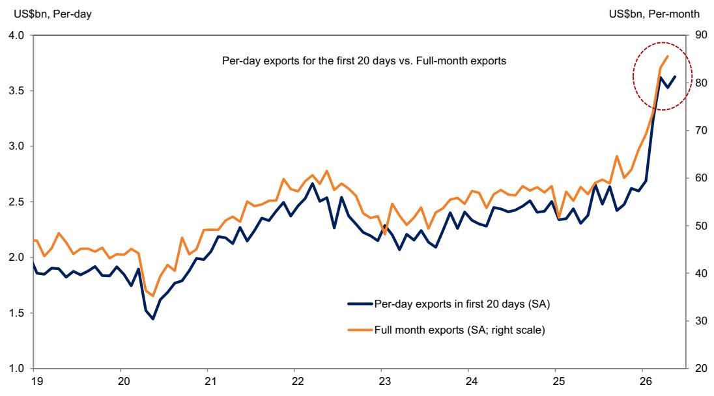

# South Korea’s Export Rebound Is Not Just a Recovery—It Is a Structural Shift in Global Tech Supply Chains

The first 20 days of May delivered a signal that investors should not dismiss as a mere seasonal bounce. South Korea’s per-workday exports rose 2.8% month-on-month on a seasonally adjusted basis, reversing the prior month’s decline of 2.5%. Total exports during the period surged 8.7% month-on-month, and on a year-on-year basis, they posted a record 64.8% growth. These numbers are striking, but the real story lies beneath the headline: the composition of this rebound reveals a fundamental reordering of global trade flows, not a temporary upswing.

Semiconductor exports extended an eight-month streak of increase, accelerating to 11.9% growth and accounting for roughly half of the sequential headline gain. This is not merely a cyclical recovery in memory chips. The pattern of demand, the geographic concentration of buyers, and the simultaneous surge in imports of semiconductor production equipment point to a deeper structural dynamic. The world is not just buying more Korean chips; it is investing in the infrastructure to produce more of them, and the epicenter of that demand is shifting unmistakably toward Asia.

The data demands a strategic interpretation. What appears at first glance to be a routine export report is, in fact, a window into the reshaping of the global electronics supply chain. The implications for currency markets, sector allocation, and geopolitical risk assessment are profound. Investors who treat this as a standard macro data point risk missing the larger tectonic shift underway.

## Semiconductor Strength Is No Longer Cyclical—It Reflects a Permanent Reconfiguration of Global Tech Production

The 11.9% sequential increase in semiconductor exports is the most important number in this report. For eight consecutive months, Korean chip exports have risen. But the acceleration in May is qualitatively different from earlier months. It is occurring against a backdrop of aggressive capacity expansion by major chipmakers and a rapid buildout of fabrication facilities in Asia.

The import data provides the corroborating evidence. Imports of semiconductor production equipment surged 21.3% month-on-month in the first 20 days of May, the strongest pace since September of the previous year. This is not a restocking cycle. This is capital expenditure in motion. Equipment imports are a leading indicator of future production capacity, and their acceleration tells us that the current demand for Korean semiconductors is being met with a deliberate expansion of supply capabilities.

The strategic question is whether this investment is being driven by end-user demand or by geopolitical hedging. The answer is likely both. Companies are not only responding to robust demand for AI-related chips and advanced logic devices; they are also pre-positioning capacity to mitigate supply chain fragmentation risks. South Korea, as a dominant producer of memory and logic chips, is the primary beneficiary of this dual dynamic. The result is a self-reinforcing cycle: rising chip exports fund capacity expansion, which in turn positions Korea to capture even more export share as global tech production relocates.

## The Geographic Concentration of Export Gains Signals a New Center of Gravity in Global Trade

Exports to Taiwan and mainland China together rose 20.6% and 10.4% month-on-month, respectively, accounting for roughly 40% of the headline gains. Exports to the United States also showed robust momentum at 7.0%, but the real story is the Asia-to-Asia trade corridor. This is not a recovery in Western consumer demand pulling Asian exports. It is Asian supply chains feeding each other.

Taiwan’s 20.6% jump is particularly telling. Taiwan is a major producer of advanced logic chips and semiconductor packaging services. When Korean chip exports to Taiwan surge, it is because Taiwanese foundries and packaging houses are buying Korean memory and intermediate components to feed their own production lines. The data suggests that the Asian tech ecosystem is deepening its internal linkages, reducing its reliance on final demand from the United States or Europe as the primary driver of export cycles.

The contrast with Japan is stark. Exports to Japan fell 10.6% month-on-month, extending a decline. This divergence is not random. Japan and South Korea compete directly in several semiconductor and display segments. The data may reflect a shift in competitive positioning, with Korean products gaining share in third markets at the expense of Japanese alternatives. Alternatively, it could signal that Japan’s own industrial output is slowing, reducing its demand for Korean intermediate goods. Either interpretation has significant implications for sector allocation and currency strategies in the region.

## Non-Tech Exports Are Stabilizing, but the Real Story Is the Asymmetry Between Tech and Everything Else

Non-tech exports rebounded modestly to 3.1% month-on-month, recovering from a 10.8% decline in the prior period. This improvement was led by steel, autos, and auto parts. But the scale of the rebound is underwhelming compared to tech. Non-tech exports are recovering, not accelerating. They are returning to trend, not breaking out.

This asymmetry matters for the macro narrative. A trade surplus that is driven overwhelmingly by one sector—semiconductors—is inherently more fragile than a broad-based surplus. If semiconductor demand were to falter, the entire trade balance would swing sharply. The May trade surplus of USD 11 billion, the second largest on record, is impressive, but it is built on a narrow foundation.

The policy implication is clear: South Korea’s economic resilience is increasingly tied to the health of its semiconductor ecosystem. Any shock to that ecosystem—whether from geopolitical tensions, technology sanctions, or a cyclical downturn in memory prices—would have outsized macroeconomic consequences. Diversification of the export base is a strategic imperative, but the data suggests it is not yet happening at a meaningful scale.

## What the Report Does Not Fully Answer: Is This Demand Real or Is It Inventory Pre-Building?

The report provides a compelling snapshot, but it leaves a critical question unresolved. Is the current surge in semiconductor exports driven by genuine end-user demand, or is it a function of inventory pre-building by customers who fear supply disruptions? The distinction is crucial for assessing the sustainability of the trend.

The surge in equipment imports suggests that customers are betting on long-term demand. But equipment orders can also be a form of hedging. If companies are building fabrication capacity not because they expect demand to grow indefinitely, but because they want to secure supply in a fragmented world, then the current export levels may be inflated by a one-time restructuring of supply chains rather than by organic demand growth.

The report does not provide granular data on where the chips are going—whether into data centers, consumer electronics, automotive applications, or simply into warehouses. Without this breakdown, it is impossible to distinguish between a genuine demand cycle and a precautionary stocking cycle. Investors should watch for leading indicators such as memory chip spot prices, lead times, and inventory days at major tech companies. If prices begin to soften or lead times shorten, the current export surge may prove to be a front-loaded phenomenon rather than a sustained trend.

## A Decision Framework for Investors: How to Interpret the Korea Export Signal

This report can be used as a diagnostic tool for three distinct investment decisions: currency positioning, sector allocation, and regional exposure.

First, for currency markets, the persistent trade surplus supports a structural case for the Korean won. But the narrowness of the surplus—driven by one sector and two trading partners—means that the won is increasingly correlated with semiconductor cycles. Investors should monitor global chip demand indicators, not just trade data, to anticipate currency moves. A sharp decline in memory prices would likely lead to a rapid depreciation of the won, even if the headline trade surplus remains positive.

Second, for sector allocation, the data reinforces the case for overweighting semiconductor equipment and materials stocks globally. The acceleration in Korean equipment imports is a leading indicator that other Asian manufacturing hubs—Taiwan, Singapore, Malaysia—are likely to follow suit. Investors should look for companies that supply the tools and chemicals used in advanced chip fabrication, as the current capex cycle appears to have further to run.

Third, for regional exposure, the divergence between Asia-bound and Japan-bound exports is a signal to overweight Korean and Taiwanese equities relative to Japanese equities, particularly in the tech sector. The data suggests that the center of gravity in global electronics manufacturing is shifting away from Japan and toward the Korea-Taiwan-China triangle. This is not a short-term trade; it is a multi-year structural trend.

The open question remains whether this trend will persist if geopolitical tensions escalate, particularly between China and Taiwan. The current export data assumes a stable operating environment. Any disruption to that assumption would invalidate the framework. Investors should stress-test their positions against a scenario in which the Asia-to-Asia trade corridor is disrupted by sanctions or conflict.

## Join the Community to Read the Full Report and Review the Original Charts

The analysis above is based on the early May trade data, but the full report contains additional exhibits that break down the data by product category, trading partner, and workday adjustment. These charts reveal nuances that cannot be captured in a summary—such as the precise contribution of each product group to the sequential change and the historical context of the current trade surplus relative to previous cycles. Join the community to read the full report and review the original charts. The data tells a story that is richer and more complex than any single paragraph can convey.

*This article is for learning and discussion only and does not constitute investment advice.*

Personal reading notes and learning share only. Not investment advice.

