# Rising AI tide lifts all equity markets

Highlights from the Paris Global Markets Conference

JPM hosted its 21st annual Global Markets Conference in Paris on May 12-13 with \~540 investors from 44 countries attending 10 macro and market sessions and 8 breakout asset allocation sessions featuring nearly 50 speakers who assessed the current state of the global economy and markets. We provide the investor survey results, which received 283 responses, and our top 10 takeaways from the conference as well as highlights from the panel discussions.

Nothing matches the beauty of springtime in Paris, and the key message from this year's conference was “buy equities.” This year's conference was noteworthy for the bullish sentiment on equity markets, with AI capex seen as a much bigger driver of market performance than geopolitical or stagflation risks. The existential threat has moved away from geopolitics to the fear of missing out on AI. Markets are moving at the speed of technology. Last year's key risks – higher tariffs and de-dollarization – are in the rear view relative to the dominance of the AI trade.

# Top 10 Takeaways: The existential threat has shifted from geopolitics to fear of missing out on AI

1. Key message was “buy equities,” with AI as the dominant force driving earnings higher.   
2. Markets may be underpricing an Iran conflict that extends beyond June and escalates militarily, with the greatest impact on Asia and Europe.   
3. Equity and bond investors are not reading from the same script despite consensus that the rise in G-4 sovereign debt trajectories is unsustainable.   
4. Private credit “noise” will continue but is not viewed as a systemic risk or public problem.   
5. De-dollarization fears have faded; EUR/USD views are more bearish, and European equities are expected to lag the US.   
6. Duration is a less reliable hedge; allocators should prioritize volatility, sector dispersion, and optionality instead of relying on bonds to do the work.   
7. Tech sovereignty is emerging as the next regulatory battleground, spanning AI semiconductors, data, and digital infrastructure, and will require stronger public-private partnerships, particularly on cybersecurity.   
8. The US operates on a shorter time horizon in gauging geopolitical risks, while China, Russia, and Iran play a longer game.   
9. US-China strategic competition is entering a more pragmatic phase of transactions, compromise, and selective accommodation.   
10. Transatlantic alliance remains foundational; the US needs NATO allies, and the relationship transcends any single administration.

# Chair of Global Research

# Joyce Chang AC

(1-212) 834-4203

joyce.chang@JPM.com

JPM Securities LLC

# Global FX Strategy

# Octavia Popescu

(44-20) 3493-5654

octavia.popescu@JPM.com

JPM Securities plc

Note that the meetings were conducted under Chatham House rule, and some of the views in this note represent the perspectives of guest speakers and market participants who attended the conference and are not necessarily the opinions of JPM analysts.

# Audience live polling: S&P 500 seen as delivering the highest returns for 2026 by a wide margin

By a wide margin (47%), US equities were favored as the top-performing market in 2026, followed by EM equities (24%). Higher-for-longer is becoming a universal view, with 43% expecting 10-year US Treasury yields to end the year in the 4.0%-4.5% range, 31% predicting yields above 4.5%, and another 6% predicting that US Treasury yields will climb above 5.0%. Only 20% see US Treasury yields at 4.0% or lower at year-end. Expectations are for tariffs to settle in the current range, with 78% predicting that the average effective US tariff rate will settle in the 10%-20% range, while 15% see tariffs below 10% and only 6% expect tariffs above 20%.

In a separate audience survey at the quantitative strategies breakout session, inflation was identified as the top macro concern (61%), with a wide gap to an AI bubble bursting (22%) and geopolitics (17%), while zero respondents indicated that growth/unemployment was a top concern. Risk takers highlighted that central banks will have to battle inflation much more than expected, given the multitude of inflationary pressures, from defense spending and reshoring to fiscal deficits, easy monetary policy, a booming US economy, and higher fuel prices.

The audience clearly preferred US equities over European equities, with only 7% identifying European equities as likely to be the best-performing asset class. This is a sharp contrast to last year's conference, when European equities were overwhelmingly seen as outperforming US equities in the aftermath of Liberation Day (see Highlights from the Paris Global Markets Conference: Cautiously pessimistic globally, cautiously optimistic locally, Joyce Chang, 21 May 2025). The optimism about European defense spending reshaping the investment landscape has faded, with 55% indicating that “Execution is key — the direction is right, but the pace will determine the payoff.” Only 4% see European defense as the trade of the decade, and only 11% think it accelerates EU integration, while 26% worry more about the impact on fiscal expansion.

Rising defaults were identified as the greatest risk to private credit (36%), closely followed by a liquidity crunch (33%). Regulatory tightening and retail investor inflows with lower underwriting standards were each seen as risks by $\sim$ 10% of respondents.

Nearly half (48%) of respondents indicated that the AI platform most likely to dominate would be the safety-first platform, favoring Anthropic/Claude.

Meanwhile, the embedded enterprise model of Microsoft Copilot and the Google/Gemini data moat were each seen as likely to dominate by 11% of respondents, and OpenAI/ChatGPT trailed at just 2% as its first-mover advantage has faded.

Figure 1: What will be the best performing asset class for the remainder of 2026?   
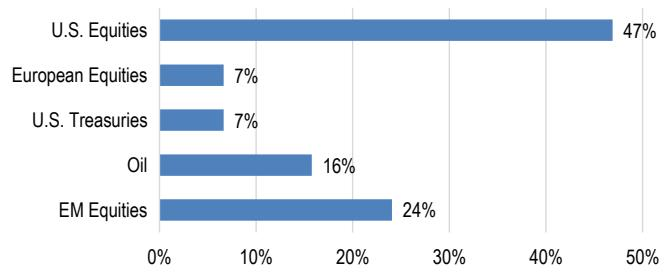

bar

| Category | Value (%) |
|---|---|
| U.S. Equities | 47 |
| European Equities | 7 |
| U.S. Treasuries | 7 |
| Oil | 16 |
| EM Equities | 24 |

Source: JPM

Figure 3: How will Europe's defense spending surge reshape the investment landscape?   
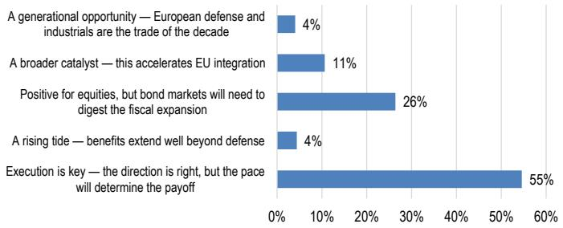

bar

| Category | Value |
| --- | --- |
| A generational opportunity — European defense and industrials are the trade of the decade | 4% |
| A broader catalyst — this accelerates EU integration | 11% |
| Positive for equities, but bond markets will need to digest the fiscal expansion | 26% |
| A rising tide — benefits extend well beyond defense | 4% |
| Execution is key — the direction is right, but the pace will determine the payoff | 55% |

Source: JPM

Figure 5: Which AI platform will dominate enterprise adoption over the next 3 years?   
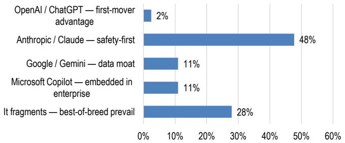

bar

| Category | Value (%) |
|---|---|
| OpenAI / ChatGPT — first-mover advantage | 2 |
| Anthropic / Claude — safety-first | 48 |
| Google / Gemini — data moat | 11 |
| Microsoft Copilot — embedded in enterprise | 11 |
| It fragments — best-of-breed prevail | 28 |

Source: JPM

Figure 7: Who will win the 2026 FIFA World Cup?   
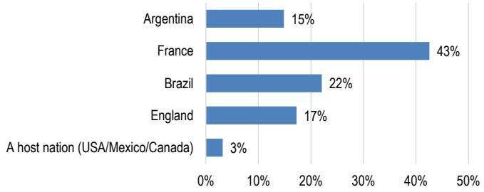

bar

| Country | Percentage (%) |
| :--- | :--- |
| Argentina | 15 |
| France | 43 |
| Brazil | 22 |
| England | 17 |
| A host nation (USA/Mexico/Canada) | 3 |

Source: JPM

Figure 2: Where will 10Y USTs end the year?   
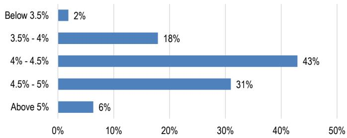

bar

| Category | Value (%) |
|---|---|
| Below 3.5% | 2 |
| 3.5% - 4% | 18 |
| 4% - 4.5% | 43 |
| 4.5% - 5% | 31 |
| Above 5% | 6 |

Source: JPM

Figure 4: Where will the average effective US tariff rate on imports settle by year end?   
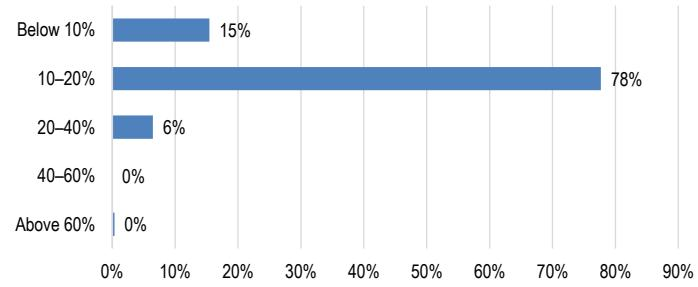

bar

| Category | Value (%) |
|---|---|
| Below 10% | 15 |
| 10-20% | 78 |
| 20-40% | 6 |
| 40-60% | 0 |
| Above 60% | 0 |

Source: JPM

Figure 6: What is the biggest risk to private credit over the next 12 months?   
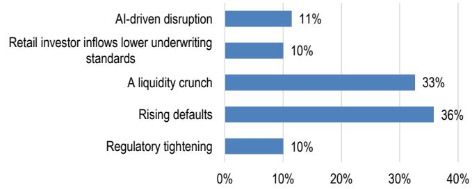

bar

| Category | Value (%) |
|---|---|
| AI-driven disruption | 11 |
| Retail investor inflows lower underwriting standards | 10 |
| A liquidity crunch | 33 |
| Rising defaults | 36 |
| Regulatory tightening | 10 |

Source: JPM

# Top 10 takeaways: Back to US financial exceptionalism

We highlight the latest views and charts from Global Research that support our Top 10 Takeaways from the 2026 Paris Global Markets Conference.

# 1. Key message was “buy equities,” with AI as the dominant force driving earnings higher.

Regardless of whether AI delivers on its promises, the past two years have generated a stunning surge in tech investments with capex broadly based but concentrated in the US, fueling wealth gains. However, in terms of support to GDP, what matters is who is producing. This falls primarily to Asia, with some benefits to the US.

Figure 8: Effective contribution of equity markets wealth   
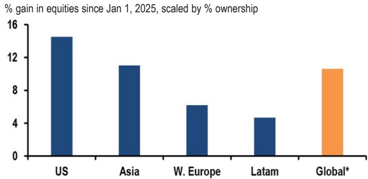

bar

% gain in equities since Jan 1, 2025, scaled by % ownership
| Region | % gain in equities since Jan 1, 2025 |
| :--- | :--- |
| US | 14.5 |
| Asia | 11.5 |
| W. Europe | 6.5 |
| Latam | 4.5 |
| Global* | 11.5 |

\*Global is GDP-wt'd average
Source: Bloomberg Finance L.P., JPM.

Figure 9: Tech IP   
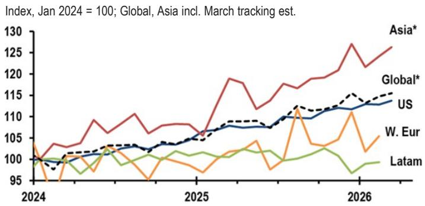

line

| Year | Asia* | Global* | US   | W. Eur | Latam |
|------|-------|---------|------|--------|-------|
| 2024 | 100   | 100     | 100  | 100    | 100   |
| 2025 | 118   | 108     | 108  | 105    | 102   |
| 2026 | 130   | 115     | 113  | 105    | 98    |

\*Excluding China
Source: National sources. JPM. Details on request.

# 2. Markets may be underpricing an Iran conflict that extends beyond June and escalates militarily, with the greatest impact on Asia and Europe

Energy prices boosted both March and April consumer prices, which are on track to deliver a 5.8%ar rise in current-quarter headline CPI. If the Middle East conflict is extended, it weighs most on Asia and Europe, which are net importers of energy and depend on the Persian Gulf for much of their energy products. As net oil exporters, the US and Latam are more insulated from the shock—though not entirely since oil and its products are sold on the global market.

Figure 10: Global\* core CPI   
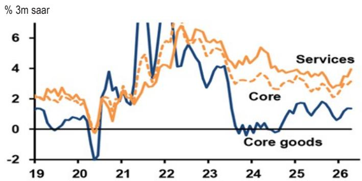

line

| Year | Services | Core | Core goods |
|------|----------|------|------------|
| 19   | 2.0      | 2.0  | 1.5        |
| 20   | 1.5      | 1.0  | -2.0       |
| 21   | 3.0      | 2.5  | 3.5        |
| 22   | 6.0      | 5.0  | 6.5        |
| 23   | 4.0      | 4.5  | 4.0        |
| 24   | 0.0      | 0.0  | -1.0       |
| 25   | 2.0      | 1.5  | 1.0        |
| 26   | 3.0      | 2.0  | 1.5        |

\*Excluding China/Turkey
Source: National sources. JPM. Details on request.

Figure 11: Exposure to energy shock   
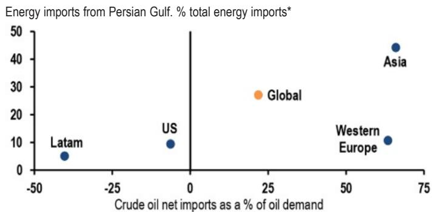

scatter

Energy imports from Persian Gulf. % total energy imports*
| Region | Crude oil net imports as a % of oil demand (%) | Energy imports from Persian Gulf. % total energy imports* |
| :--- | :--- | :--- |
| Latam | -40 | 5 |
| US | -5 | 10 |
| Global | 25 | 28 |
| Western Europe | 65 | 10 |
| Asia | 70 | 45 |

\*Imports of crude, refined oil, and LNG.
Source: Kpler, S&P Global Platts, UN Comtrade. JPM.

# 3. Equity and bond investors are not reading from the same script despite consensus that the rise in G-4 sovereign debt trajectories is unsustainable.

Term premium remains elevated across the G-4 due to high fiscal spending and rising debt levels. DM bond markets experienced a synchronized sell-off last week as both headline (6%yoy) and core (5.2%yoy) PPI readings reached cycle highs, the opening of the Strait of Hormuz remains unresolved and political uncertainty mounted in the UK. Yields for 30Y Gilts reached 5.8%, 30Y yields for Japan topped 4% and the 10Y Treasury yield ended the week at 4.6%.

Figure 12: Fiscal balance 

<table><tr><td colspan="8">% of GDP</td></tr><tr><td></td><td>US</td><td>Japan</td><td>Germany</td><td>Italy</td><td>Spain</td><td>France</td><td>UK</td></tr><tr><td>23</td><td>-6.5%</td><td>-3.7%</td><td>-2.5%</td><td>-7.2%</td><td>-3.5%</td><td>-5.4%</td><td>-5.3%</td></tr><tr><td>24</td><td>-6.9%</td><td>-2.2%</td><td>-2.8%</td><td>-3.4%</td><td>-3.2%</td><td>-5.8%</td><td>-5.2%</td></tr><tr><td>25e</td><td>-6.9%</td><td>-3.4%</td><td>-3.0%</td><td>-3.2%</td><td>-2.9%</td><td>-5.4%</td><td>-4.4%</td></tr><tr><td>26e</td><td>-6.9%</td><td>-3.3%</td><td>-3.5%</td><td>-3.0%</td><td>-2.6%</td><td>-5.3%</td><td>-3.7%</td></tr></table>

Source: Bloomberg Finance L.P., JPM.

Figure 13: 10-year sovereign yields   
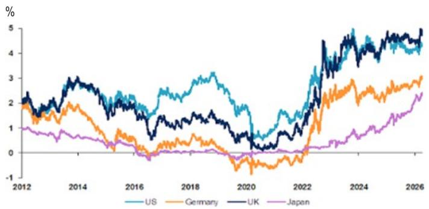

line

| Year | US   | Germany | UK   | Japan |
|------|------|---------|------|-------|
| 2012 | 2.0  | 1.8     | 2.2  | 1.0   |
| 2014 | 2.5  | 1.5     | 2.8  | 0.8   |
| 2016 | 2.0  | 0.5     | 1.5  | 0.3   |
| 2018 | 3.0  | 0.8     | 1.8  | 0.2   |
| 2020 | 1.0  | -0.5    | 0.5  | 0.1   |
| 2022 | 3.5  | 1.5     | 3.0  | 0.5   |
| 2024 | 4.5  | 2.5     | 4.0  | 1.0   |
| 2026 | 4.0  | 3.0     | 4.5  | 2.0   |

Source: Bloomberg Finance L.P., JPM.

# 4. Private credit “noise” will continue but is not viewed as a systemic risk or public problem.

Our US credit strategy team expects default rates across private credit and leveraged loans to be reasonably consistent, forecasting the 2027 leveraged loan default rates of 4.5% and direct lending default rate at 5.10%. The aggregate private credit portfolio has more than 20% invested in AI dislocation-exposed software, which has widened by more than 233bp YTD to reach 751bp. However, software companies will likely not default as the regulatory and data moats are real, and companies largely have until 2028 to work through potential dislocations (see Credit Watch: Private Credit Uncovered – Time can heal a lot of wounds, Stephen Dulake et al., 28 Apr).

Figure 14: Loan software spreads are more than 233bp wider year-to-date to 751bp   
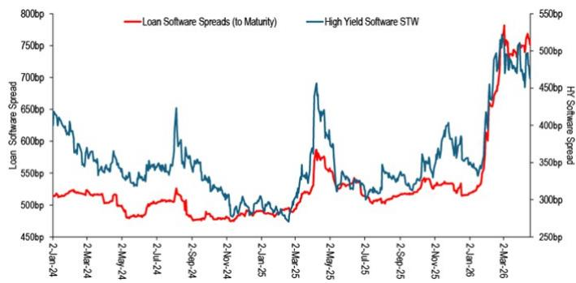

line

| Date     | Loan Software Spreads (to Maturity) | High Yield Software STW |
|----------|-------------------------------------|--------------------------|
| 2-Jan-24 | 520bp                               | 650bp                    |
| 2-Mar-24 | 510bp                               | 630bp                    |
| 2-May-24 | 500bp                               | 610bp                    |
| 2-Jul-24 | 490bp                               | 590bp                    |
| 2-Sep-24 | 480bp                               | 570bp                    |
| 2-Nov-24 | 470bp                               | 550bp                    |
| 2-Jan-25 | 460bp                               | 530bp                    |
| 2-Mar-25 | 470bp                               | 550bp                    |
| 2-May-25 | 480bp                               | 570bp                    |
| 2-Jul-25 | 490bp                               | 590bp                    |
| 2-Sep-25 | 500bp                               | 610bp                    |
| 2-Nov-25 | 510bp                               | 630bp                    |
| 2-Jan-26 | 520bp                               | 650bp                    |
| 2-Mar-26 | 530bp                               | 670bp                    |
| 2-May-26 | 540bp                               | 690bp                    |
| 2-Jul-26 | 550bp                               | 710bp                    |
| 2-Sep-26 | 560bp                               | 730bp                    |
| 3-Jan-27 | 570bp                               | 750bp                    |
| 3-Mar-27 | 580bp                               | 770bp                    |
| 3-May-27 | 590bp                               | 790bp                    |
| 3-Aug-27 | 600bp                               | 810bp                    |
| 3-Oct-27 | 610bp                               | 830bp                    |
| 3-Dec-27 | 620bp                               | 850bp                    |
| 3-Jan-28 | 630bp                               | 870bp                    |
| 3-Mar-28 | 640bp                               | 890bp                    |
| 3-May-28 | 650bp                               | 910bp                    |
| 3-Aug-28 | 660bp                               | 930bp                    |
| 3-Oct-28 | 670bp                               | 950bp                    |
| 3-Dec-28 | 680bp                               | 970bp                    |
| 3-Jan-29 | 690bp                               | 990bp                    |
| 3-Mar-29 | 700bp                               | 1010bp                   |
| 3-May-29 | 710bp                               | 1030bp                   |
| 3-Aug-29 | 720bp                               | 1050bp                   |
| 3-Oct-29 | 730bp                               | 1070bp                   |
| 3-Dec-29 | 740bp                               | 1090bp                   |
| 3-Jan-30 | 750bp                               | 1110bp                   |
| 3-Mar-30 | 760bp                               | 1130bp                   |
| 3-May-30 | 770bp                               | 1150bp                   |
| 3-Aug-30 | 780bp                               | 1170bp                   |
| 3-Oct-30 | 790bp                               | 1190bp                   |
| 3-Dec-30 | 800bp                               | 1210bp                   |
| 3-Jan-31 | -                                   | -                        |
| -          | -                                   | -                        |
| -          | -                                   | -                        |
| -          | -                                   | -                        |
| -          | -                                   | -                        |
| -          | -                                   | -                        |
| -          | -                                   | -                        |
| -          | -                                   | -                        |
| -          | -                                   | -                        |
| -          | -                                   | -                        |
| -          | -                                   | -                        |
| -           | -                                   | -                        |
| -           | -                                   | -                        |
| -           | -                                   | -                        |
| -           | -                                   | -                        |
| -           | -                                   | -                        |
| -           | -                                   | -                        |
| -           | -                                   | -                        |
| -           | -                                   | -                        |
| -           | -                                   | -                        |
| -           | -                                   | -                        |
| -            | -                                   | -                        |
| -            | -                                   | -                        |
| -            | -                                   | -                        |
| -            | -                                   | -                        |
| -            | -                                   | -                        |
| -            | -                                   | -                        |
| -            | -                                   | -                        |
| -            | -                                   | -                        |
| -            | -                                   | -                        |
| -            | -                                   | -                        |
| -           | -                                   | -                        |
| -           | -                                   | -                        |
| -           | -                                   | -                        |
| -           | -                                   | -                        |
| -           | -                                   | -                        |
| -           | -                                   | -                        |
| -           | -                                   | -                        |
| -           | -                                   | -                        |
| -           | -                                   | -                        |
| -          | -                                   | -                        |
| -          | -                                   | -                        |
| -          | -                                   | -                        |
| -          | -                                   | -                        |
| -          | -                                   | -                        |
| -          | -                                   | -                        |
| -          | -                                   | -                        |
| -          | -                                   | -                        |
| -          | -                                   | -                        |
| -            | -                                   | -                        |
| -            | -                                   | -                        |
| -            | -                                   | -                        |
| -            | -                                   | -                        |
| -            | -                                   | -                        |
| -            | -                                   | -                        |
| -            | -                                   | -                        |
| -            | -                                   | -                        |
| -            | -                                   | -                        |
| -          | -                                   | -                        |
| -            | -                                   | -                        |
| -            | -                                   | -                        |
| -            | -                                   | -                        |
| -            | -                                   | -                        |
| -            | -                                   | -                        |
| ...      | ...                                 | ...                      |
| ...      | ...                                 | ...                      |
| ...      | ...                                 | ...                      |
| ...      | ...                                 | ...                      |
| ...      | ...                                 | ...                      |
| ...      | ...                                 | ...                      |
| ...      | ...                                 | ...                      |
| ...      | ...                                 | ...                      |
| ...      | ...                                 | ...                      |
| ...      | ...                                 | ...                      |
| ...      | ...                                 | ...                                      |
| ...      | ...                                 | ...                      |
| ...      | ...                                 | ...                      |
| ...      | ...                                 | ...                      |
| ...      | ...                                 | ...                      |
| ...      | ...                                 | ...                      |
| ...      | ...                                 | ...                      |
| ...      | ...                                 | ...                      |
| ...      | ...                                 | ...                      |
| ...      | ...                                 | ...                      |
| ...      | ...                                 | ...<nl>

Source: JPM; S&P/IHS Markit.

Figure 15: Direct lending default rates resemble those for syndicated loans 

<table><tr><td rowspan="2"></td><td colspan="2">Par-weighted default rate</td><td colspan="2">Issuer-weighted default rate</td></tr><tr><td>Excluding dist. exch.</td><td>Including dist. exch.</td><td>Excluding dist. exch.</td><td>Including dist. exch.</td></tr><tr><td>High-Yield Bond</td><td>1.19%</td><td>2.07%</td><td>1.87%</td><td>3.63%</td></tr><tr><td>Leveraged Loan</td><td>1.46%</td><td>3.04%</td><td>1.82%</td><td>3.55%</td></tr><tr><td>Combined Leveraged</td><td>1.33%</td><td>2.58%</td><td>1.73%</td><td>3.40%</td></tr><tr><td>Direct Lending</td><td></td><td>1.40%</td><td></td><td>1.80%</td></tr><tr><td>Direct Lending - Sponsored</td><td></td><td>1.30%</td><td></td><td>1.70%</td></tr><tr><td>Direct Lending - Non-Sponsored</td><td></td><td>4.30%</td><td></td><td>n/a</td></tr><tr><td>Direct Lending + Non-Accuals</td><td></td><td>2.90%</td><td></td><td>5.10%</td></tr></table>

Source: JPM; KBRA DLD

# 5. De-dollarization fears have faded; EUR/USD views are more bearish, and European equities are expected to lag the US.

The macro landscape has turned more dollar positive, and our FX Strategy team is long-USD again following inflation surprises and signs of entrenched EUR

weakness. USD benefits from 1) carry and terms of trade; 2) a more balanced Fed; 3) firmer domestic data; and 4) US equity strength. The conditions to be long USD now reflect low-grade US exceptionalism vs their tactical bullish-USD stance in March to hedge risk (see Key Currency Views: The macro landscape turns more dollar-positive, Meera Chandan, May 15).

Figure 16: US equity outperformance is boosting USD   
Contributions to USD TWI vs two factor equity model (outright global equities and relative US-GL equity differential). 3m % chg   
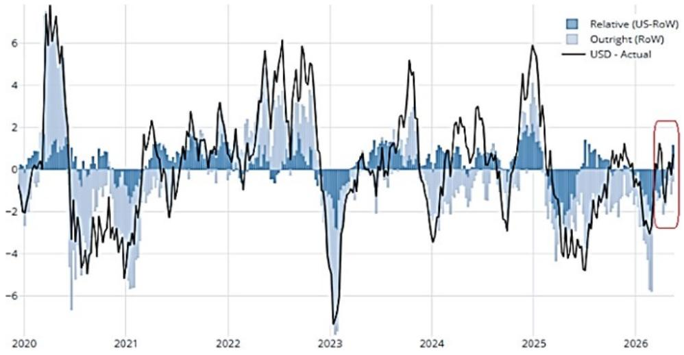

line

| Year | USD - Actual | Relative (US-RoW) | Outright (RoW) |
|------|--------------|-------------------|----------------|
| 2020 | ~7           | ~0.5              | ~-3            |
| 2021 | ~-4          | ~-1               | ~-5            |
| 2022 | ~3           | ~0.5              | ~-2            |
| 2023 | ~-8          | ~-3               | ~-6            |
| 2024 | ~5           | ~1                | ~-3            |
| 2025 | ~6           | ~1                | ~-4            |
| 2026 | ~-3          | ~0.5              | ~-6            |

Source: JPM

# 6. Duration is a less reliable hedge; allocators should prioritize volatility, sector dispersion, and optionality instead of relying on bonds to do the work.

The shift in stock-bond correlation since 2020 presents a structural challenge for portfolio construction that investors have not yet fully adapted to. Bonds are no longer providing the traditional hedge in an equity sell-off. Two main drivers explain this shift, the repricing of term premium driven by sovereign debt supply and a half decade of repeated adverse supply shocks, which produce sell-offs in both stocks and bonds. For investors, this raises two questions: whether the positive price correlation between stocks and bonds will last, and how to diversify when the traditional hedge is no longer working (see Top 10 Macro Takeaways: 2026 IMF/World Bank Spring Meetings: The Great Disconnect: Paradoxes prevail and risk appetite is strong despite geopolitical risks, Joyce Chang, 21 Apr).

Figure 17: Bonds have been less effective equity hedges since the pandemic   
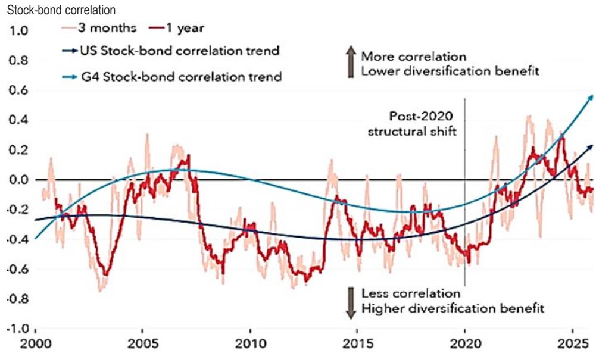

line

| Year | 3 months | 1 year | US Stock-bond correlation trend | G4 Stock-bond correlation trend |
|------|----------|--------|----------------------------------|--------------------------------|
| 2000 | -0.2     | -0.2   | -0.2                             | -0.4                           |
| 2005 | 0.2      | 0.1    | -0.3                             | 0.1                            |
| 2010 | -0.3     | -0.4   | -0.4                             | -0.1                           |
| 2015 | -0.1     | -0.6   | -0.5                             | -0.2                           |
| 2020 | -0.5     | -0.3   | -0.3                             | -0.1                           |
| 2025 | 0.3      | 0.2    | 0.2                              | 0.6                            |

Note: Lines show rolling 12-month correlations at monthly frequency, 2000–2025. United States uses S&P 500 and 1–3-year Treasury returns. G4 aggregates equity and sovereign bond returns for the United States, Euro Area, Great Britain, and Japan using market capitalization weights. Lower diversification benefits correspond to correlations shifting from negative to positive values.
Source: Bloomberg Finance L.P., and IMF staff calculations.

# 7. Tech sovereignty is emerging as the next regulatory battleground, spanning AI semiconductors, data, and digital infrastructure, and will require stronger public-private partnerships, particularly on cybersecurity.

Cybersecurity risks have been on the rise for years, fueled by the relentless pace of digital transformation and the expanding array of potential attack surfaces. The emergence of frontier AI has accelerated this trend, making it easier and cheaper for bad actors to conduct reconnaissance, launch social engineering campaigns, and develop sophisticated malware. As a result, organizations are facing a potential surge in both the volume and complexity of cyberattacks (see In the garden of good and evil: Frontier AI escalates security costs, Jahangir Aziz, 29 Apr).

Figure 18: Cybersecurity spending   
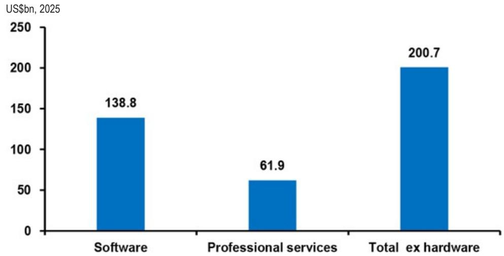

bar

| Category | Value (US$bn, 2025) |
| :--- | :--- |
| Software | 138.8 |
| Professional services | 61.9 |
| Total ex hardware | 200.7 |

Source: JPM with data from IDC

# 8. The US operates on a shorter time horizon in gauging geopolitical risks, while China, Russia, and Iran play a longer game.

There is a local saying in Chinese that “fortune is coming,” where the view is that China can absorb pressure and execute multi-year strategies (e.g., automation and self-sufficiency) while US policymakers operate on a shorter political clock, particularly as the midterm elections approach. In a similar vein, high pain tolerance is central to Iran’s strategy, with the goal to “outlast” rather than “outgun” (see What to Watch for at the Trump-Xi Summit: All into Account Podcast, May 12 and Geopolitical Perspectives: Iran’s strategy: Positioning to “outlast” rather than “outgun”, Joyce Chang, 6 Apr).

# 9. US-China strategic competition is entering a more pragmatic phase of transactions, compromise, and selective accommodation.

The read-out of the Trump-Xi summit sends a clear message that both sides want sustainability and stability in the relationship, building a “constructive relationship of strategic stability.” This new branding provides guidance for the next three years or more. The goal is to achieve “active stability based on cooperation, benign stability with restrained competition, normalized stability with manageable differences, and enduring stability with expectations of peace.” In an interview, Trump again rebranded bilateral relations as “G2”, a high-stakes, direct-deal partnership between the two (see Trump-Xi summit: “Make it work and never mess it up”, Feng Zhu, 15 May).

# 10. Transatlantic alliance remains foundational; the US needs NATO allies, and the relationship transcends any single administration.

The transatlantic alliance is likely to endure, with NATO to remain intact even though some perceive the US as an unreliable partner. The alliance is bound by shared interests for a free and democratic Western bloc that holds together militarily and economically. In the aftermath of the Iran conflict, the most recent survey by Politico shows that European allies broadly support building closer ties to China and see China as more technologically advanced. A weaker Europe drifting between the US and China would be damaging for the Western alliance and, by extension, Europe's economic leverage (see The New World Disorder and the Price of Fragmentation: 2026 Spring IMF / World Bank Macro Preview, Joyce Chang, 13 Apr).

Figure 19: Only the US thinks it will beat China as the dominant world power in ten years   
Share of respondents, split by country, who say China or the U.S. will be the dominant power in the world in 10 years' time   
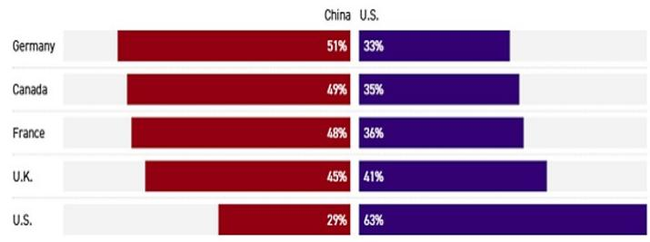

bar

| Country | China (%) | U.S. (%) |
| :--- | :--- | :--- |
| Germany | 51 | 33 |
| Canada | 49 | 35 |
| France | 48 | 36 |
| U.K. | 45 | 41 |
| U.S. | 29 | 63 |

Note: “The EU” was also an option, but 16% or less chose it as their answer. The poll was conducted from Feb. 6 to Feb. 9, surveying more than 2,000 respondents each from the U.S., Canada, U.K., France and Germany, and has an overall margin of error of $\pm2$ percentage points. Smaller subgroups have higher margins of error.
Source: The POLITICO Poll with Public FirstAnna Wiederkehr/POLITICO.

Figure 20: Historic allies of the US want to move closer to China   
Net support among respondents, split by country, who say their country should get closer to (positive) or more distant from (negative) the U.S. and China   
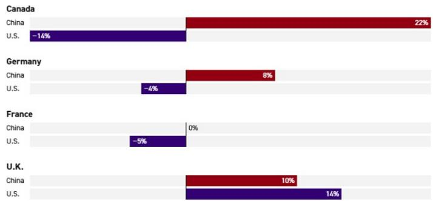

bar

| Country | Region | Value (%) |
| :--- | :--- | :--- |
| Canada | China | 22 |
| Canada | U.S. | -14 |
| Germany | China | 8 |
| Germany | U.S. | -4 |
| France | China | 0 |
| France | U.S. | -5 |
| U.K. | China | 10 |
| U.K. | U.S. | 14 |

The poll was conducted from Feb. 6 to Feb. 9, surveying more than 2,000 respondents each from the U.S., Canada, UK, France and Germany, and has an overall margin of error of $\pm2$ percentage points. Smaller subgroups have higher margins of error.
Source: The POLITICO Poll with Public FirstAnna Wiederkehr/POLITICO.

# Highlights from the 2026 Paris Global Markets Conference

# JPM Views

# Perspectives from JPMChase & Co. Chairman and CEO

The US economy looks strong overall across jobs, consumer spending, and investment, particularly in AI, but markets appear more exuberant than fundamentals alone would justify. Credit is near its tightest spread levels and equities remain near record highs, while the geopolitical environment is the most challenging in years, reflecting a stack of unresolved risks rather than a single identifiable shock with “a lot of straws on the camel’s back.”

The world is more resilient, but the combination of momentum, confidence, and crowded positioning can persist longer than expected—until it doesn’t. Today’s momentum-driven “exuberance” could be likened to previous episodes such as 1982, 1990, 2000, 2007, or periods where optimism preceded abrupt regime shifts. Risk is less about pinpointing the catalyst and more about acknowledging that risk is embedded in the system, with the expectation that credit spreads can gap wider in a genuine risk-off moment.

Private credit risk is not large enough to be a systemic risk, but performance could be worse than anticipated. Household and corporate leverage does not appear to be the core vulnerability, and consumer and corporate debt are not unusually high in aggregate. Sovereign debt is the central structural issue. There is too much complacency about inflation risks given the persistence of deficit spending, the scale of AI-related investment, and higher fuel prices. The US is operating with very high peacetime deficits and a high debt-to-GDP burden, and while the timing of a bond-market dislocation is unknowable (i.e., it could be years away), AI effects on the labor market and associated government responses may be a great lesson to society of “how much you can borrow and spend” and the next Fed move is more likely to be a hike.

There is a bifurcated reality between higher income and lower income cohorts.

Higher-income cohorts are benefiting from low unemployment and wealth effects from rising asset prices, while the lower income cohort—roughly the bottom 20–30%—are facing a long-running affordability squeeze, limited savings buffers, and a sense of falling behind as the wealthy get wealthier. Economic and social stability issues are intersecting with concerns around income, education, crime, and immigration policy. Deficit spending can temporarily support incomes and demand and drive spending, profits, and wages, but cannot be sustained indefinitely, and the focus should be on creating better jobs. However, there is long-run optimism grounded in historical progress in living standards and medical progress that extends longevity.

AI presents a societal adjustment challenge—firms will deploy it to improve services and controls (e.g., risk, fraud, AML, operations), while the harder question is how quickly labor markets can absorb displacement through retraining, redeployment, and transition support. Capitalism often adjusts faster than governments, but if that change arrives too quickly, policy and private sector coordination may be needed to smooth the transition (e.g., reskilling, income assistance, and other shock absorbers). As AI expands the cyber threat surface, it must be treated as part of day-to-day business management, rather than a one-off “ethics” debate.

Turning to geopolitics, the transatlantic alliance is likely to endure, with NATO to remain intact even as allies are reassessing dependencies and trade arrangements. It is not a simple executive action for the US to withdraw from NATO as it requires congressional approval, making an abrupt exit structurally difficult. Europe is facing a secular decline in relative GDP weight. While some perceive the US as an unreliable partner, the alliance remains intact with shared interests with a free and democratic Western bloc that holds together militarily and economically. A weaker Europe drifting between the US and China would be damaging for the Western alliance and, by extension, Europe's economic leverage.

China-US relations are critical to the whole world, and there are areas of shared interest such as nuclear proliferation, counterterrorism, and systemic cyber threats. However, US-China tensions will remain a fundamental competitive dynamic that extends beyond trade, with particular concern around supply chain leverage and critical inputs. Near-term summits are unlikely to deliver structural breakthroughs. Tariffs have prompted retaliation, prompting further escalation, especially with rare earths, a key pressure point where China could squeeze supply. “Industrial policy” has become a reluctant necessity for strategic inputs where the US otherwise cannot achieve scale economics. Long-term takeout agreements and selective tariffs to make domestic production viable without companies going bankrupt within months will be difficult. China has a long history of subsidization of trade and industrial capacity, with shipbuilding as a key example. In the US, private-sector productive capability can be rapidly mobilized in national security contexts, taking a page from Freedom’s Forge. $^{1}$ The US remains the “best investment destination” but on the current trajectory, global trade, commodities, and food security could face extreme downside.

# Global Research Views on Market Outlook

The US economy looks strong across services and consumer data, Europe remains structurally weaker on the consumer side, and China is “in between,” spending but not enough to offset broader drags. Higher oil prices are the central tail risk, as the

market is facing a “physical molecules” constraint with inventory buffers being drawn down. The current energy shock has echoes of COVID, but with an important distinction, earlier disruptions were often framed as pricing and distribution problems, today’s stress was described more as a quantity problem—a constraint on physical supply with “pipeline pressure” effectively declining.

Our commodity strategy team forecasts Brent should remain in the low \$100s for the rest of the year, averaging \$97 for 2026, contingent on the Strait of Hormuz reopening in June. Inventories have depleted roughly half of the effective buffer; if the Strait remains closed, levels drop towards operational stress (\~7,500mb), and even after reopening, restocking keeps prices elevated (rule of thumb: 1 day closed = 3 days restocking). The “stress floor” is somewhat theoretical. Historically, inventories have tended not to fall below roughly \~35 days of demand, a boundary approached in 2022. Product-level pressure points include petrochemical feedstocks and jet fuel alongside higher gasoline prices as the market moves deeper into the summer driving season. China was also described as comparatively better positioned than many assume given earlier inventory build, more diversified energy sourcing, and flexibility to adjust via coal.

AI is the dominant driver of equity markets, and the AI capex story has further room to run. This is a catch up, not a rally given the pace of earnings. Earnings growth has been exceptionally strong even as oil uncertainty persists and prices have been “sticky.” With a large share of the quarter reported, \~27% YoY earnings growth for the broader market, \~60% for AI-adjacent stocks, and an earnings surprise rate around 19% versus a \~6% historical average. This “real” earnings momentum is the basis for confidence and valuations at new highs. However, the longer energy uncertainty persists, the more the market risks sliding into complacency. S&P 500 has upside to \~7,600 in the context of strong earnings momentum rather than a one-way macro call.

Credit is in decent shape, as default rates remain low, maturity walls are not until 2028–29, and high all-in yields sustain institutional demand even as issuers raise record volumes. However, positioning risk is extreme with momentum crowding at the 100th percentile on a 40-year basis. For private credit, there are mutual incentives for borrowers and creditors to find extend-and-amend solutions rather than force outcomes, supporting a “stressed but manageable” framing. Flash crash risk is very high but likely short-lived as the market buys dips.

The diversification narrative is overstated, and foreign ownership of US equities actually rose over the past year. However, the US share of global benchmarks has come off its peak (referenced as peaking around late 2024 at 68% vs 63% at present in the MSCI ACWI Index). Emerging markets outperformance reflects pronounced bifurcation; Korea and Taiwan benefiting from AI-linked exposure versus a much more mixed picture in other regions. Tech was cited as contributing an outsized share of earnings growth in the US, with 54% of earnings growth coming from the Tech and Communication Services sectors.

# Defense spending is a political and fiscal priority, but the intent to spend is running ahead of actual outlays, particularly where governments face real budget tradeoffs and populations are reluctant to sacrifice consumption for defense procurement.

The nature of defense capability is also shifting to lower-cost drone warfare and rapid iteration, raising questions about whether large incumbent manufacturers can pivot fast enough. A notable trend is the scale and decentralization of production in active conflict zones (many small producers) versus slower industrial capacity buildouts elsewhere, reinforcing the view that private capital and entrepreneurial ecosystems are likely to play a larger role going forward.

# Key risks to monitor:

1. Momentum crowding leading to a flash crash.   
2. Fed tightening with easing bias removed.   
3. AI monetization gap/TMT bubble risk; if downstream revenue fails to offset AI investment before capex decelerates.   
4. Next earnings recession could hit harder without fiscal backstop.

# JPM Trading Views

Near-term risks skew toward higher rates globally—including in parts of EM—until the energy shock is meaningfully resolved. Renewed momentum in growth is evident in US labor market prints, while AI-related infrastructure investment remains strong. Against this backdrop, the bar for the Fed is very high, particularly given the uncertainty around how quickly core inflation will decelerate. Risks are skewed toward a hike if jobs re-accelerate.

In Europe, the policy debate is framed less around growth fragility and more around inflation and fiscal follow-through. The market is pricing in three hikes for both the ECB and the Bank of England, and the third hike should not be faded as long as the oil outcome remains unresolved. If the Iran conflict is resolved, fading that third hike is the first trade. The BoJ is expected to hike twice. Despite a large current account surplus and substantial prior intervention to defend the currency, the central pressure point for JPY is rate differentials, implying a continued need for policy normalization. EM rates risk is higher across the board.

De-dollarization themes have abated; the dollar is difficult to short. The US is a large energy exporter, and terms-of-trade dynamics improve when energy prices are high, US data resilience has generally exceeded Europe's, and the rotation out of US equities has reversed. If the key energy chokepoint normalizes, the view was that commodity prices may take time to fully retrace. The actionable FX trades are shorting USD against markets with large positive yields where the carry is “real” after inflation, such as BRL, MXN, and ZAR.

The correction in gold was framed as a healthy reset. A shift in the composition of demand, rather than a decline, was highlighted. ETF flows were muted versus last year, but retail demand via coins and bars has been stronger, alongside continued (and in some cases less transparent) central bank demand, particularly from China. While still constructive on gold, there is less conviction than during the peak “dollar debasement” narrative, with a target of 5,300–5,400, not 6,000.

Energy remains the key transmission channel for volatility across markets, with a distinction between financial pricing and physical product spreads. Inventories are expected to draw down materially into late June. Looking ahead, even when the Iran conflict is resolved, crude is expected to normalize faster than refined products because of logistical bottlenecks, such as tankers and shipping constraints. Tighter conditions are likely to prevail in specific product markets – especially jet fuel and fertilizers – where physical shortages can cause spreads versus crude to widen sharply.

Equity strength is an earnings story, supported by broad-based growth, with AI an outsized contributor but not the only source of strength. Revisions to forward earnings reinforce the market's ability to absorb higher energy and rate volatility—up to a point. US energy intensity has fallen significantly versus prior decades, so moderate increases in oil prices do not automatically derail the earnings narrative, but more

extreme oil scenarios of \$150–\$200 would change it. Valuations are less “bubbly” than headlines imply, as the Mag 7 was at its cheapest valuation in 10 years before the Iran conflict, and the rally is really a catch-up when viewed through the lens of forward earnings growth and dispersion. However, leadership remains concentrated in AI-linked areas, and market positioning is particularly crowded in semis and tech hardware.

Positioning was flagged as a real risk factor. Crowding is most extreme for Japan at the 95th percentile, compared with 65% for the US and 25% for China and Europe. Compared with prior rebounds, this one is more US and technology-led and is occurring at a faster pace. The risk is less about a slow grind lower and more about the possibility of sharp, air-pocket moves if crowded exposures are forced to unwind—though the base case remains that the earnings impulse is the dominant anchor.

In credit, the AI investment cycle is showing increased debt issuance, but hyperscaler capex is largely self-funded, with only limited incremental borrowing. Software maturities don’t pick up until 2028. For software and broader leveraged credit, near-term maturities are manageable, with the heavier maturity volumes pushed out to 2028, which buys time for issuers to refinance, extend or de-lever if needed. Issuance has been absorbed comfortably, supported by high nominal yields and earnings.

# JPM Views on Tokenization and Stablecoin

The breakout session on digital assets focused on where tokenization and stablecoins are moving from concept to utility and explored how quickly market structure can change once adoption reaches scale. Speakers argued that bonds are the “Goldilocks” asset class for tokenization—standardized, high-quality collateral with deep markets and clear legal frameworks—making fixed income the most natural starting point for real-world deployment. A standout near-term use case highlighted was intraday repo, where the practical prize is compressing settlement and funding frictions; market consensus referenced settlement times of around four hours, a meaningful shift versus traditional rails.

Stablecoins were framed as the clearest “killer app” in crypto: moving money—payments, settlement, and collateral transfer—faster and cheaper than legacy systems. Speakers described stablecoins as increasingly close to instantaneous and near-costless for certain flows, and noted that adoption has already reached mass-market scale, with hundreds of millions of users globally. Speakers also pointed to a post-legislative acceleration in activity, including a sharp increase in stablecoin market capitalization off a large base. The broader point was that this is not simply a new wrapper; it is a new settlement layer that can materially change the speed at which liquidity moves through markets.

The gravitational pull of stablecoin reserves into short-dated US Treasuries was highlighted as a non-trivial source of demand for bills, with second-order effects on funding markets and the broader ecosystem of liquidity supporting US borrowing. Speakers emphasized that the more stablecoins scale, the more this link between digital money and short-duration Treasury demand becomes relevant to how market plumbing functions. Client demand was described as widening and becoming more segmented by investor type and objective. Institutional activity was characterized as increasingly tied to ETFs and basis-style activity (including volatility and cash-and-carry dynamics), alongside financing solutions (including ETF financing and bitcoin-backed lending) and a growing set of derivatives use cases. In wealth channels, demand was described as more straightforward—buy-and-hold exposure, covered-call style overlays, and financing against ETF or bitcoin positions—reflecting a preference for simple structures with familiar risk framing. Across channels, the discussion grouped activity into three buckets: (1) buy/sell/hold exposure, (2) financing, and (3) derivatives—with the message that the market is maturing from spot interest to a fuller “capital markets stack” around digital assets.

# JPM Views on Quantitative Investment Strategies

The QIS breakout session framed systematic strategies as a practical response to an environment where point forecasts are fragile and regime shifts are frequent, making it necessary to forecast a distribution rather than a single outcome. This is precisely where QIS and non-traditional betas can add value: liquid, transparent exposures with explicit risk controls that can be held through cycles rather than traded tactically. Use cases emphasized included convex volatility strategies and tail-risk hedging (described as most effective in larger drawdowns), “equity replacement” frameworks that broaden exposures across premia and styles, and strategic allocations designed to harvest returns systematically over time.

The highest-conviction QIS strategy favored over the next six months is cross-asset trend and rates long volatility, with smaller support for commodity carry and equity short-vol strategies. The case was made for rates long vol as a geopolitical hedge, while noting practical constraints such as lower convexity and capacity limits. Cross-asset trend was described as comparatively well-positioned for choppy macro regimes, and commodity carry was framed as potentially resilient given how much it has already been pressured, with mean reversion benefits when constructed as a disciplined strategic premia program.

Speakers argued that today's pricing can underweight certain tails because markets become desensitized to growth risk when the consensus narrative is dominated by inflation or AI. One idea highlighted was expressing growth-risk asymmetry through tools like dispersion, volatility, and skew—ways to position for a broader distribution of outcomes without needing to be precisely right about timing. The throughline across the session was that, in a market defined by fat tails and unstable correlations, systematic strategies offer a way to stay invested while explicitly budgeting for uncertainty.

# Investor Views on Markets

# The CIO View: Allocating Capital in Uncertain Times

The CIO panelists described sentiment as cautiously optimistic but fragmented at the macro level, with a clear preference for equities over credit. The dominant force shaping allocation was AI, and the risk of missing out on the opportunity can feel existential for allocators benchmarked to indices increasingly driven by a small set of leaders. In that framing, equity multiples around \~20x were characterized as not demanding, with meaningful upside still plausible, even as market crowding in hyperscalers and chipmakers was repeatedly flagged.

Positioning reflects overweight equities and underweight credit, alongside a preference to underweight market-cap-weighted indices versus equal-weighted exposure as a way to manage concentration risk. Regionally, the US has the strongest advantages, with solid jobs and consumer data, and the AI infrastructure cycle still supporting activity. Emerging Asia is more exposed to the energy shock, while Europe is a near-term loser from higher energy costs, with pressure on growth, consumers, and states. Yet Europe tends to respond well in emergencies; there was cautious long-term optimism for a renewed push on energy resilience (including renewables and nuclear).

A central theme was that the old diversification playbook is less reliable. “Risk-free” is being re-priced, and correlations can shift quickly. Since the height of the Middle East conflict, the US dollar hasn’t performed well and neither has gold while equities and credit have. Equities are becoming a scarce resource (more buybacks than issuance), bonds can be printed, safe havens can disappoint, and investors should be cautious about leaning on historical relationships without accounting for today’s policy, supply, and geopolitical regime.

# The stock–bond correlation has been positive in recent years, challenging the assumption that duration will consistently hedge equity and credit drawdowns.

Stock-bond correlation has been +0.5% over the last 5 years. Bonds were described as a strong hedge for interest rate risk, but a weaker hedge for credit risk, especially in scenarios where bonds sell off and spreads widen simultaneously, a combination that was particularly corrosive in 2023. The assertion that bonds are a great diversifier should be challenged.

Hedging must become a first-order tool rather than an afterthought. Volatility hedges are favored for their attractive pricing relative to the range of possible outcomes, a point that was reinforced in the QIS breakout session, which recommended convex vol strategies and hedging tail risks when drawdowns $>10\%$ . It’s easier to forecast a distribution than a point and makes sense to expand to QIS and non-traditional betas. Another approach emphasized internal dispersion rather than cross-asset hedges. Within equities, sector relationships (defensive vs. growth) were presented as more practical hedges than assuming bonds will offset risk in all regimes. For example, healthcare has been 80% anti-correlated with tech; staples 70% – this is the way to trade very long-term trends. For benchmark-constrained portfolios, especially in Asia, where concentration is high, upside call options were recommended on dominant index constituents, such as buying 5–10% upside call options to avoid losing too much performance.

Credit was the clearest area of caution. With spreads tight, the panel questioned the logic that spreads should remain compressed simply because yields are high and argued that retail inflows into credit “for yield” are not a durable thesis through a full cycle. While bespoke opportunities exist, the overall message was to be selective and avoid confusing high carry with low risk.

Retail behavior is increasingly important for daily market direction. Two dynamics were highlighted: the potential for meme-style episodes and the steady rise of retail as a meaningful share of daily flows. Retail was characterized as buying on dips and buying when volatility is elevated, and as more narrative-driven than fundamentals-driven—meaning allocators may need to understand the narrative to manage timing, even if institutions still set long-run prices.

There remains no scalable alternative to investing in the dollar. Currencies follow capital and capital follows currency, and last year's dollar-diversification narrative is proving to be short-lived at around 12 months. A pointed observation was that economies under the most existential stress tend to dollarize, such as Somalia, Turkiye and Ukraine, reinforcing the dollar's role in severe stress regimes through self-reinforcing capital flows.

The practical message was to stay invested in the AI-led equity cycle but acknowledge concentration and tail risks. One could pair equity exposure with deliberate hedges, using volatility where pricing is favorable and using internal equity dispersion to offset regime shifts in correlations. In fixed income, the message was to treat duration and credit as different risks, and to avoid relying on bonds as a universal diversifier. Overall, portfolios should be built for multiple outcomes, not a single benign path. Risks that “keep you up at night” centered on frontier AI safety/regulatory shock, and cyber/infrastructure vulnerability, framed as more “when” than “if” to a greater degree than geopolitical risks.

# Private Credit in the Spotlight: Risk, Returns and the Road Ahead

Private credit is getting a painful, but probably necessary, shakeout. While “noise” will continue, there are no signs of systemic risk and the size of the direct lending market is estimated at \$1.75trn with another \$315bn of institutional dry powder. This compares to \$1.44trn and \$1.50trn for the US high yield and leveraged loan markets, respectively. The best analogy for the current private credit shakeout is the post-GFC CLO shakeout and both dispersion and returns to scale are likely to increase. This is likely to drive higher industry concentration into the largest and most successful managers on the other side of the downturn.

Retail represents about 23% of the asset class at \$400bn, of which \$306bn is in non-traded BDCs and \$100bn in interval funds focused on direct lending. While headlines have focused on retail investor-focused private credit vehicles that offer limited quarterly liquidity, JPM's credit strategy team estimates that only \~8.3% of the market is susceptible to these redemption requests. Non-traded structures and interval funds are subject to quarterly redemptions and the majority of them have limited redemptions to 5% in Q4; redemption limits are expected to remain at around 5% for the foreseeable future. Daily pricing for private assets remains challenging, particularly for infrastructure, and this will impede rapid growth in the retail investing market and 401(k) plans.

Software exposure should drive higher, but manageable default rates. Software accounts for about 14% of the public loan market, and about 20% of the direct lending market. The aggregate private credit portfolio is 20.8% invested in AI dislocation-exposed software, and our credit strategy team expects default rates across private credit and leveraged loans to be reasonably consistent, forecasting the 2027 Leveraged Loan default rates of 4.5%. Most software companies will likely not default as the regulatory and data moats are real, and companies largely have until 2028 to work through potential dislocations. The market is currently pricing in a default environment similar to Healthcare in 2022-2024 as opposed to more draconian Telecom and Energy experiences.

Panelists offered perspectives on the European and Australian private credit markets, portraying the European private credit market as offering better and more diversified opportunities than the US. European lenders are relatively shielded by more diversified portfolios, including more infrastructure holdings. European private credit has lower exposure to software and less disruption from AI, as investors favor established cloud-based software firms over AI-native companies due to AI-driven disruption risks, especially after SaaS stocks fell \~30% between late 2025 and Feb 2026.

Real estate is a big part of Australia's private credit market due to high immigration. The middle market business is growing in Australia but private credit into retail is still at a nascent stage of development and working through disclosures to enter the retail market. The regulatory framework is still evolving, including insolvency laws to protect secured creditors.

# Disclosures

Analyst Certification: The Research Analyst(s) denoted by an “AC” on the cover of this report certifies (or, where multiple Research Analysts are primarily responsible for this report, the Research Analyst denoted by an “AC” on the cover or within the document individually certifies, with respect to each security or issuer that the Research Analyst covers in this research) that: (1) all of the views expressed in this report accurately reflect the Research Analyst’s personal views about any and all of the subject securities or issuers; and (2) no part of any of the Research Analyst's compensation was, is, or will be directly or indirectly related to the specific recommendations or views expressed by the Research Analyst(s) in this report. For all Korea-based Research Analysts listed on the front cover, if applicable, they also certify, as per KOFIA requirements, that the Research Analyst’s analysis was made in good faith and that the views reflect the Research Analyst’s own opinion, without undue influence or intervention.

All authors named within this report are Research Analysts who produce independent research unless otherwise specified. In Europe, Sector Specialists (Sales and Trading) may be shown on this report as contacts but are not authors of the report or part of the Research Department.

Company-Specific Disclosures: Important disclosures, including price charts and credit opinion history tables (if applicable), are available for compendium reports and all JPM-covered companies, and certain non-covered companies, by visiting https://www.jpmm.com/research/disclosures, calling 1-800-477-0406, or e-mailing research.disclosure.inquiries@JPM.com with your request.

# History of Investment Recommendations:

A history of JPM investment recommendations disseminated during the preceding 12 months can be accessed on the Research & Commentary page of http://www.JPMmarkets.com where you can also search by analyst name, sector or financial instrument.

Analysts' Compensation: The research analysts responsible for the preparation of this report receive compensation based upon various factors, including the quality and accuracy of research, client feedback, competitive factors, and overall firm revenues.

# Other Disclosures

JPM is a marketing name for investment banking businesses of JPM Chase & Co. and its subsidiaries and affiliates worldwide.

UK MIFID FICC research unbundling exemption: UK clients should refer to UK MIFID Research Unbundling exemption for details of JPM's implementation of the FICC research exemption and guidance on relevant FICC research categorisation.

Any long form nomenclature for references to China; Hong Kong; Taiwan; and Macau within this research material are Mainland China; Hong Kong SAR (China); Taiwan (China); and Macau SAR (China).

JPM may, from time to time, write on issuers or securities targeted by economic or financial sanctions imposed or administered by the governmental authorities of the U.S., EU, UK or other relevant jurisdictions (Sanctioned Securities). Nothing in this report is intended to be read or construed as encouraging, facilitating, promoting or otherwise approving investment or dealing in such Sanctioned Securities. Clients should be aware of their own legal and compliance obligations when making investment decisions.

Any digital or crypto assets discussed in this research report are subject to a rapidly changing regulatory landscape. For relevant regulatory advisories on crypto assets, including bitcoin and ether, please see https://www.JPM.com/disclosures/cryptoasset-disclosure.

The author(s) of this research report may not be licensed to carry on regulated activities in your jurisdiction and, if not licensed, do not hold themselves out as being able to do so.

Exchange-Traded Funds (ETFs): JPM Securities LLC (“JPMS”) acts as authorized participant for substantially all U.S.-listed ETFs. To the extent that any ETFs are mentioned in this report, JPMS may earn commissions and transaction-based compensation in connection with the distribution of those ETF shares and may earn fees for performing other trade-related services, such as securities lending to short sellers of the ETF shares. JPMS may also perform services for the ETFs themselves, including acting as a broker or dealer to the ETFs. In addition, affiliates of JPMS may perform services for the ETFs, including trust, custodial, administration, lending, index calculation and/or maintenance and other services.

Options and Futures related research: If the information contained herein regards options- or futures-related research, such information is available only to persons who have received the proper options or futures risk disclosure documents. Please contact your JPM Representative or visit https://www.theocc.com/components/docs/riskstoc.pdf for a copy of the Option Clearing Corporation's Characteristics and Risks of Standardized Options or https://www.finra.org/sites/default/files/2020-08/Security\_Futures\_Risk\_Disclosure\_Statement\_2020.pdf for a copy of the Security Futures Risk Disclosure Statement.

Changes to Interbank Offered Rates (IBORs) and other benchmark rates: Certain interest rate benchmarks are, or may in the future become, subject to ongoing international, national and other regulatory guidance, reform and proposals for reform. For more information, please consult: https://www.JPM.com/global/disclosures/interbank\_offered\_rates

Private Bank Clients: Where you are receiving research as a client of the private banking businesses offered by JPM Chase & Co. and its subsidiaries (“JPM Private Bank”), research is provided to you by JPM Private Bank and not by any other division of JPM, including, but not limited to, the JPM Corporate and Investment Bank and its Global Research division.

Legal entity responsible for the production and distribution of research: The legal entity identified below the name of the Reg AC Research Analyst who authored this material is the legal entity responsible for the production of this research. Where multiple Reg AC Research Analysts authored this material with different legal entities identified below their names, these legal entities are jointly responsible for the production of this research. Where more than one legal entity is listed under an analyst's name, the first legal entity is responsible for the production unless stated otherwise. Research Analysts from various JPM affiliates may have contributed to the production of this material but may not be licensed to carry out regulated activities in your jurisdiction (and do not hold themselves out as being able to do so). Unless otherwise stated below in the legal entity disclosures, this material has been distributed by the legal entity responsible for production, or where more than one legal entity is listed under the analyst's name, the first legal entity will be responsible for distribution. If you have any queries, please contact the relevant Research Analyst in your jurisdiction or the entity in your jurisdiction that has distributed this research material.

# Legal Entities Disclosures and Country-/Region-Specific Disclosures:

Argentina: JPM Chase Bank N.A Sucursal Buenos Aires is regulated by Banco Central de la República Argentina (“BCRA”- Central Bank of Argentina) and Comisión Nacional de Valores (“CNV”- Argentinian Securities Commission - ALYC y AN Integral N°51).

Australia: JPM Securities Australia Limited (“JPMSAL”) (ABN 61 003 245 234/AFS Licence No: 238066) is regulated by the Australian Securities and Investments Commission and is a Market Participant of ASX Limited, a Clearing and Settlement Participant of ASX Clear Pty Limited and a Clearing Participant of ASX Clear (Futures) Pty Limited. This material is issued and distributed in Australia by or on behalf of JPMSAL only to "wholesale clients" (as defined in section 761G of the Corporations Act 2001). A list of all financial products covered can be found by visiting https://www.jpmm.com/research/disclosures. JPM seeks to cover companies of relevance to the domestic and international investor base across all Global Industry Classification Standard (GICS) sectors, as well as across a range of market capitalisation sizes. If applicable, in the course of conducting public side due diligence on the subject company(ies), the Research Analyst team may at times perform such diligence through corporate engagements such as site visits, discussions with company representatives, management presentations, etc. Research issued by JPMSAL has been prepared in accordance with JPM Australia’s Research Independence Policy which can be found at the following link: JPM Australia - Research Independence Policy.

Brazil: Banco JPM S.A. is regulated by the Comissao de Valores Mobiliarios (CVM) and by the Central Bank of Brazil. Ombudsman JPM: 0800-7700847 / 0800-7700810 (For Hearing Impaired) / ouvidoria.jp.morgan@jpmchase.com.

Canada: JPM Securities Canada Inc. is a registered investment dealer, regulated by the Canadian Investment Regulatory Organization and the Ontario Securities Commission and is the participating member on Canadian exchanges. This material is distributed in Canada by or on behalf of JPM Securities Canada Inc.

Chile: Inversiones JPM Limitada is an unregulated entity incorporated in Chile.

China: JPM Securities (China) Company Limited has been approved by CSRC to conduct the securities investment consultancy business.

Colombia: Banco JPM Colombia S.A. is supervised by the Superintendencia Financiera de Colombia (SFC). Any reference in this material to products or services offered abroad by entities other than the Bank in Colombia is included exclusively for descriptive purposes. Such references do not constitute, and should not be construed as, promotional activity or the provision of financial products or services within Colombian territory, as defined under applicable Colombian regulation.

Dubai International Financial Centre (DIFC): JPM Chase Bank, N.A., Dubai Branch is regulated by the Dubai Financial Services Authority (DFSA) and its registered address is Dubai International Financial Centre - The Gate, West Wing, Level 3 and 9 PO Box 506551, Dubai, UAE. This material has been distributed by JPM Chase Bank, N.A., Dubai Branch to persons regarded as professional clients or market counterparties as defined under the DFSA rules.

European Economic Area (EEA): Unless specified to the contrary, research is distributed in the EEA by JPM SE (“JPM SE”), which is authorised as a credit institution by the Federal Financial Supervisory Authority (Bundesanstalt für Finanzdienstleistungsaufsicht, BaFin) and jointly supervised by the BaFin, the German Central Bank (Deutsche Bundesbank) and the European Central Bank (ECB). JPM SE is a company headquartered in Frankfurt with registered address at TaunusTurm, Taunustor 1, Frankfurt am Main, 60310, Germany. The material has been distributed in the EEA to persons regarded as professional investors (or equivalent) pursuant to Art. 4 para. 1 no. 10 and Annex II of MiFID II and its respective implementation in their home jurisdictions (“EEA professional investors”). This material must not be acted on or relied on by persons who are not EEA professional investors. Any investment or investment activity to which this material relates is only available to EEA relevant persons and will be engaged in only with EEA relevant persons.

Hong Kong: JPM Securities (Asia Pacific) Limited (CE number AAJ321) is regulated by the Hong Kong Monetary Authority and the Securities and Futures Commission in Hong Kong, and JPM Broking (Hong Kong) Limited (CE number AAB027) is regulated by the Securities and Futures Commission in Hong Kong. JPM Chase Bank, N.A., Hong Kong Branch (CE Number AAL996) is regulated by the Hong Kong Monetary Authority and the Securities and Futures Commission, is organized under the laws of the United States with limited liability. Where the distribution of this material is a regulated activity in Hong Kong, the material is distributed in Hong Kong by or through JPM Securities (Asia Pacific) Limited and/or JPM Broking (Hong Kong) Limited.

India: JPM India Private Limited (Corporate Identity Number - U67120MH1992FTC068724), having its registered office at JPM Tower, Off. C.S.T. Road, Kalina, Santacruz - East, Mumbai – 400098, is registered with the Securities and Exchange Board of India (SEBI) as a 'Research Analyst' having registration number INH000001873. JPM India Private Limited is also registered with SEBI as a member of the National Stock Exchange of India Limited and the Bombay Stock Exchange Limited (SEBI Registration Number – INZ000239730) and as a Merchant Banker (SEBI Registration Number - MB/INM000002970). Telephone: 91-22-6157 3000, Facsimile: 91-22-6157 3990 and Website: http://www.jpmipl.com. JPM Chase Bank, N.A. - Mumbai Branch is licensed by the Reserve Bank of India (RBI) (Licence No. 53/Licence No. BY.4/94; SEBI - IN/CUS/014/ CDSL : IN-DP-CDSL-444-2008/ IN-DP-NSDL-285-2008/ INBI00000984/ INE231311239) as a Scheduled Commercial Bank in India, which is its primary license allowing it to carry on Banking business in India and other activities, which a Bank branch in India are permitted to undertake. For non-local research material, this material is not distributed in India by JPM India Private Limited. Compliance Officer: Ashutosh Sharma; ashutosh.j.sharma@jpmchase.com; +912261575002. Grievance Officer: Ramprasadh K, jpmipl.research.feedback@JPM.com; +912261573000. Registration granted by SEBI and certification from NISM in no way guarantee performance of the intermediary or provide any assurance of returns to investors. Please visit Terms and Conditions and Most Important Terms and Conditions (MITC). The annual Compliance audit report is available at http://www.jpmipl.com/#research.

Indonesia: PT JPM Sekuritas Indonesia is a member of the Indonesia Stock Exchange and is registered and supervised by the Otoritas Jasa Keuangan (OJK).

Korea: JPM Securities (Far East) Limited, Seoul Branch, is a member of the Korea Exchange (KRX). JPM Chase Bank, N.A., Seoul Branch, is licensed as a branch office of foreign bank (JPM Chase Bank, N.A.) in Korea. Both entities are regulated by the Financial Services Commission (FSC) and the Financial Supervisory Service (FSS). For non-macro research material, the material is distributed in Korea by or through JPM Securities (Far East) Limited, Seoul Branch.

Japan: JPM Securities Japan Co., Ltd. and JPM Chase Bank, N.A., Tokyo Branch are regulated by the Financial Services Agency in Japan.

Malaysia: This material is issued and distributed in Malaysia by JPM Securities (Malaysia) Sdn Bhd (18146-X), which is a Participating Organization of Bursa Malaysia Berhad and holds a Capital Markets Services License issued by the Securities Commission in Malaysia.

Mexico: JPM Casa de Bolsa, S.A. de C.V., JPM Grupo Financiero is member of the Mexican Stock Exchange (“Bolsa Mexicana de Valores”) and the Institutional Stock Exchange (“Bolsa Institucional de Valores”), and it is authorized to act as a broker dealer by the National Banking and Securities Exchange Commission (“Comisión Nacional Bancaria y de Valores”).

New Zealand: This material is issued and distributed by JPMSAL in New Zealand only to "wholesale clients" (as defined in the Financial Markets Conduct Act 2013). JPMSAL is registered as a Financial Service Provider under the Financial Service providers (Registration and Dispute Resolution) Act of 2008.

Philippines: JPM Securities Philippines Inc. is a Trading Participant of the Philippine Stock Exchange and a member of the Securities Clearing Corporation of the Philippines and the Securities Investor Protection Fund. It is regulated by the Securities and Exchange Commission.

Singapore: This material is issued and distributed in Singapore by or through JPM Securities Singapore Private Limited (JPMSS) [MDDI (P) 057/08/2025 and Co. Reg. No.: 199405335R], which is a member of the Singapore Exchange Securities Trading Limited, and/or JPM Chase Bank, N.A., Singapore branch (JPMCB Singapore), both of which are regulated by the Monetary Authority of Singapore. This material is issued and distributed in Singapore only to accredited investors, expert investors and institutional investors, as defined in Section 4A of the Securities and Futures Act, Cap. 289 (SFA). This material is not intended to be issued or distributed to any retail investors or any other investors that do not fall into the classes of “accredited investors,” “expert investors” or “institutional investors,” as defined under Section 4A of the SFA. Recipients of this material in Singapore are to contact JPMSS or JPMCB Singapore in respect of any matters arising from, or in connection with, the material.

South Africa: JPM Equities South Africa Proprietary Limited and JPM Chase Bank, N.A., Johannesburg Branch are members of the Johannesburg Securities Exchange and are regulated by the Financial Services Conduct Authority (FSCA).

Taiwan: JPM Securities (Taiwan) Limited is a participant of the Taiwan Stock Exchange (company-type) and regulated by the Taiwan Securities and Futures Bureau. Material relating to equity securities is issued and distributed in Taiwan by JPM Securities (Taiwan) Limited, subject to the license scope and the applicable laws and the regulations in Taiwan. To the extent that JPM Securities (Taiwan) Limited produces research materials on securities not listed on the Taiwan Stock Exchange or Taipei Exchange (“Non-Taiwan Listed Securities”), these materials shall not constitute securities recommendations for the purpose of applicable Taiwan regulations, and, for the avoidance of doubt, JPM Securities (Taiwan) Limited does not act as broker for Non-Taiwan Listed Securities. According to Paragraph 2, Article 7-1 of Operational Regulations Governing Securities Firms Recommending Trades in Securities to Customers (as amended or supplemented) and/or other applicable laws or regulations, please note that the recipient of this material is not permitted to engage in any activities in connection with the material that may give rise to conflicts of interests, unless otherwise disclosed in the “Important Disclosures” in this material.

Thailand: This material is issued and distributed in Thailand by JPM Securities (Thailand) Ltd., which is a member of the Stock Exchange of Thailand and is regulated by the Ministry of Finance and the Securities and Exchange Commission. The registered address is 548 One City Center Building, 50th Floor, Ploenchit Road, Lymphini, Pathum Wan, Bangkok 10330.

UK: Research is produced in the UK by JPM Securities plc (“JPMS plc”) which is a member of the London Stock Exchange and is authorised by the Prudential Regulation Authority and regulated by the Financial Conduct Authority and the Prudential Regulation Authority or JPM Markets Limited (“JPMML Ltd”) which is authorised and regulated by the Financial Conduct Authority. Unless specified to the contrary, this material is distributed in the UK by JPMS plc and is directed in the UK only to: (a) persons having professional experience in matters relating to investments falling within article 19(5) of the Financial Services and Markets Act 2000 (Financial Promotion) (Order) 2005 (“the FPO”); (b) persons outlined in article 49 of the FPO (high net worth companies, unincorporated associations or partnerships, the trustees of high value trusts, etc.); or (c) any persons to whom this communication may otherwise lawfully be made; all such persons being referred to as "UK relevant persons". This material must not be acted on or relied on by persons who are not UK relevant persons. Any investment or investment activity to which this material relates is only available to UK relevant persons and will be engaged in only with UK relevant persons. A description of JPM EMEA’s policy for prevention and avoidance of conflicts of interest related to the production of Research can be found at the following link: JPM EMEA - Research Independence Policy.

U.S.: JPM Securities LLC (“JPMS”) is a member of the NYSE, FINRA, SIPC, and the NFA. JPM Chase Bank, N.A. is a member of the FDIC. Material published by non-U.S. affiliates is distributed in the U.S. by JPMS who accepts responsibility for its content.

General: Additional information is available upon request. The information in this material has been obtained from sources believed to be reliable. While all reasonable care has been taken to ensure that the facts stated in this material are accurate and that the forecasts, opinions and expectations contained herein are fair and reasonable, JPM Chase & Co. or its affiliates and/or subsidiaries (collectively JPM) make no representations or warranties whatsoever to the completeness or accuracy of the material provided, except with respect to any disclosures relative to JPM and the Research Analyst's involvement with the issuer that is the subject of the material. Accordingly, no reliance should be placed on the accuracy, fairness or completeness of the information contained in this material. There may be certain discrepancies with data and/or limited content in this material as a result of calculations, adjustments, translations to different languages, and/or local regulatory restrictions, as applicable. These discrepancies should not impact the overall investment analysis, views and/or recommendations of the subject company(ies) that may be discussed in the material. Artificial intelligence tools may have been used in the preparation of this material, including assisting in data analysis, pattern recognition, and content drafting for research material. JPM accepts no liability whatsoever for any loss arising from any use of this material or its contents, and neither JPM nor any of its respective directors, officers or employees, shall be in any way responsible for the contents hereof, apart from the liabilities and responsibilities that may be imposed on them by the relevant regulatory authority in the jurisdiction in question, or the regulatory regime thereunder. Opinions, forecasts or projections contained in this material represent JPM's current opinions or judgment as of the date of the material only and are therefore subject to change without notice. Periodic updates may be provided on companies/industries based on company-specific developments or announcements, market conditions or any other publicly available information. There can be no assurance that future results or events will be consistent with any such opinions, forecasts or projections, which represent only one possible outcome. Furthermore, such opinions, forecasts or projections are subject to certain risks, uncertainties and assumptions that have not been verified, and future actual results or events could differ materially. The value of, or income from, any investments referred to in this material may fluctuate and/or be affected by changes in exchange rates. All pricing is indicative as of the close of market for the securities discussed, unless otherwise stated. Past performance is not indicative of future results. Accordingly, investors may receive back less than originally invested. This material is not intended as an offer or solicitation for the purchase or sale of any financial instrument. The opinions and recommendations herein do not take into account individual client circumstances, objectives, or needs and are not intended as recommendations of particular securities, financial instruments or strategies to particular clients. This material may include views on structured securities, options, futures and other derivatives. These are complex instruments, may involve a high degree of risk and may be appropriate investments only for sophisticated investors who are capable of understanding and assuming the risks involved. The recipients of this material must make their own independent decisions regarding any securities or financial instruments mentioned herein and should seek advice from such independent financial, legal, tax or other adviser as they deem necessary. JPM may trade as a principal on the basis of the Research Analysts' views and research, and it may also engage in transactions for its own account or for its clients' accounts in a manner inconsistent with the views taken in this material, and JPM is under no obligation to ensure that such other communication is brought to the attention of any recipient of this material. Others within JPM, including Strategists, Sales staff and other Research Analysts, may take views that are inconsistent with those taken in this material. Employees of JPM not involved in the preparation of this material may have investments in the securities (or derivatives of such securities) mentioned in this material and may trade them in ways different from those discussed in this material. This material is not an advertisement for or marketing of any issuer, its products or services, or its securities in any jurisdiction.

Confidentiality and Security Notice: This transmission may contain information that is privileged, confidential, legally privileged, and/or exempt from disclosure under applicable law. If you are not the intended recipient, you are hereby notified that any disclosure, copying, distribution, or use of the information contained herein (including any reliance thereon) is STRICTLY PROHIBITED. Although this transmission and any attachments are believed to be free of any virus or other defect that might affect any computer system into which it is received and opened, it is the responsibility of the recipient to ensure that it is virus free and no responsibility is accepted by JPM Chase & Co., its subsidiaries and affiliates, as applicable, for any loss or damage arising in any way from its use. If you received this transmission in error, please immediately contact the sender and destroy the material in its entirety, whether in electronic or hard copy format. This message is subject to electronic monitoring: https://www.JPM.com/disclosures/email

MSCI: Certain information herein (“Information”) is reproduced by permission of MSCI Inc., its affiliates and information providers (“MSCI”) ©2026. No reproduction or dissemination of the Information is permitted without an appropriate license. MSCI MAKES NO EXPRESS OR IMPLIED WARRANTIES (INCLUDING MERCHANTABILITY OR FITNESS) AS TO THE INFORMATION AND DISCLAIMS ALL LIABILITY TO THE EXTENT PERMITTED BY LAW. No Information constitutes investment advice, except for any applicable Information from MSCI ESG Research. Subject also to msci.com/disclaimer

Sustainalytics: Certain information, data, analyses and opinions contained herein are reproduced by permission of Sustainalytics and: (1) includes the proprietary information of Sustainalytics; (2) may not be copied or redistributed except as specifically authorized; (3) do not constitute investment advice nor an endorsement of any product or project; (4) are provided solely for informational purposes; and (5) are not warranted to be complete, accurate or timely. Sustainalytics is not responsible for any trading decisions, damages or other losses related to it or its use. The use of the data is subject to conditions available at https://www.sustainalytics.com/legal-disclaimers. ©2026 Sustainalytics. All Rights Reserved.

"Other Disclosures" last revised May 16, 2026.

Copyright 2026 JPM Chase & Co. All rights reserved. This material or any portion hereof may not be reprinted, sold or redistributed without the written consent of JPM. It is strictly prohibited to use or share without prior written consent from JPM any research material received from JPM or an authorized third-party (“JPM Data”) in any third-party artificial intelligence (“AI”) systems or models when such JPM Data is accessible by a third-party.

Completed 19 May 2026 08:57 AM EDT

Disseminated 19 May 2026 08:58 AM EDT