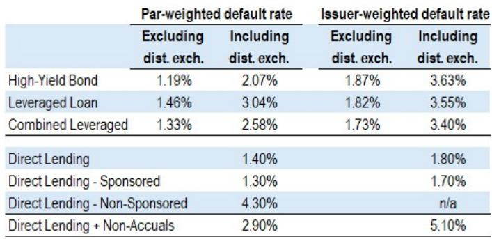

# The Fear of Missing Out on AI Has Replaced Geopolitics as the Dominant Market Driver, and Investors Should Act Accordingly

The existential threat that keeps institutional investors awake at night has shifted. It is no longer the risk of tariff escalation, de-dollarization, or a geopolitical flashpoint that dominates capital allocation decisions. It is the fear of missing out on artificial intelligence. This was the central message from a major global markets conference held in Paris this spring, where nearly 540 investors from 44 countries gathered to assess the state of the global economy and markets. The conclusion was unambiguous: buy equities, with AI as the dominant force driving earnings higher.

This shift in sentiment is not merely a tactical adjustment. It represents a structural change in how institutional investors perceive risk and opportunity. The conference's live polling revealed that 47% of respondents expect US equities to be the best-performing asset class for the remainder of 2026, far outpacing emerging market equities at 24% and European equities at a mere 7%. This is a stark reversal from the previous year, when European equities were overwhelmingly favored in the aftermath of trade policy disruptions. The market's attention has moved on, and it has moved on decisively.

The implications for portfolio construction are profound. When the primary risk is no longer a negative event but the possibility of being left behind, traditional hedging frameworks break down. Duration is becoming a less reliable hedge, and investors are being forced to prioritize volatility, sector dispersion, and optionality instead of relying on bonds to do the work. The speed of technological change is now the clock by which markets are moving, and that clock does not pause for geopolitics.

## The AI Investment Wave Is Broadening Beyond US Tech, But the Wealth Effect Remains Concentrated

The most striking insight from the conference data is that the AI capex cycle is having a much larger impact on market performance than any other single factor, including stagflation risks or geopolitical tensions. Regardless of whether AI ultimately delivers on its most ambitious promises, the past two years have generated a stunning surge in technology investments. This capex is broadly based in terms of sector participation, but it remains heavily concentrated in the United States in terms of where the wealth is being created.

This creates a critical distinction that investors must understand. When it comes to support for GDP growth, what matters is not where the capital is deployed but who is producing the goods and services that capital buys. The production side of the AI investment equation falls primarily to Asia, with some benefits flowing to the US. Yet the equity market wealth effect remains overwhelmingly American. Since the start of 2025, US equities have gained approximately 14.5%, compared to 11.5% for Asia and just 6.5% for Western Europe.

The implication is that the AI trade is not a simple narrative about technology stocks. It is a complex story about supply chains, capital flows, and the geography of production. Investors who treat AI as a single-sector bet risk missing the second-order effects that will determine which regions and industries capture the economic value. The question is not whether AI will transform the economy, but who will own the transformation.

## The Bullish Consensus on Equities Contains a Dangerous Blind Spot on Geopolitical Risk

For all the optimism about AI-driven earnings growth, the conference revealed a troubling complacency about geopolitical risks that could disrupt the very conditions supporting the bull case. The audience polling showed that inflation was identified as the top macro concern by 61% of respondents, followed by an AI bubble bursting at 22%, and geopolitics at just 17%. Zero respondents indicated that growth or unemployment was a top concern.

This ordering is revealing, but it may also be dangerous. The conference analysis explicitly warned that markets may be underpricing the risk of an Iran conflict that extends beyond June and escalates militarily. Such a scenario would have its greatest impact on Asia and Europe, which are net energy importers heavily dependent on the Persian Gulf. As net oil exporters, the US and Latin America are more insulated from the shock, but not entirely, since oil and its products trade on global markets.

The disconnect between bullish equity sentiment and geopolitical risk is reminiscent of the pre-Global Financial Crisis period, when markets dismissed tail risks until they materialized. The key difference today is that the AI narrative provides a powerful psychological anchor that makes it easy to discount negative scenarios. Investors should ask themselves whether the current valuation of AI-exposed equities adequately prices in the possibility of a major energy supply disruption. The conference data suggests the answer is no.

## Equity and Bond Markets Are Reading from Completely Different Scripts, and That Divergence Will Not Last

One of the most analytically important observations from the conference was that equity and bond investors are not reading from the same script, despite widespread agreement that the rise in G-4 sovereign debt trajectories is unsustainable. Term premium remains elevated across the US, Germany, the UK, and Japan due to high fiscal spending and rising debt levels. Bond markets experienced a synchronized sell-off as both headline and core producer price index readings reached cycle highs, while the opening of the Strait of Hormuz remains unresolved.

The disconnect is stark. Equities are pricing in a future of robust earnings growth driven by AI investment. Bonds are pricing in persistent inflation, fiscal strain, and the end of the low-yield era. Both cannot be fully correct, and the resolution of this tension will determine the next major market move. The conference's own analysis suggests that duration is becoming a less reliable hedge, and that allocators should prioritize volatility and sector dispersion instead of relying on bonds to provide portfolio protection.

This creates a strategic dilemma for institutional investors. If the bond market is right about inflation and fiscal stress, then equity valuations that depend on low discount rates are vulnerable. If the equity market is right about AI-driven productivity gains, then bond yields may be overestimating the inflationary impact of fiscal spending. The truth likely lies somewhere in between, but the path to that truth will be volatile. Investors who ignore this divergence are effectively betting that the equity market's optimism will prove correct, a bet that carries significant asymmetric risk.

## Private Credit Faces a Hidden Risk from AI Dislocation That the Market Is Not Yet Pricing

The conference provided a useful reality check on private credit, an asset class that has grown rapidly in recent years. The audience survey identified rising defaults as the greatest risk to private credit, cited by 36% of respondents, closely followed by a liquidity crunch at 33%. Only 10% saw regulatory tightening as a primary concern, and another 10% worried about retail investor inflows lowering underwriting standards.

However, the conference's own credit analysis reveals a more nuanced picture that the consensus may be missing. The aggregate private credit portfolio has more than 20% invested in software companies that are exposed to AI dislocation. Loan software spreads have widened by more than 233 basis points year-to-date to reach 751 basis points. This is a significant move that reflects genuine stress in a key segment of the private credit market.

The conventional wisdom at the conference was that software companies will likely not default because their regulatory and data moats are real, and because most companies have until 2028 to work through potential dislocations. This may be correct, but it assumes that the AI disruption will unfold slowly enough for companies to adapt. If the pace of technological change accelerates, the timeline for adjustment could compress dramatically. The private credit market is effectively betting that time heals all wounds, but time is not a guaranteed friend when technology is moving at an exponential rate.

## The Decision Framework for Investors: Three Questions That Will Determine Your Relative Performance

The conference material, when synthesized into a strategic framework, suggests that investors need to answer three questions to navigate the current environment successfully.

First, how do you weight the AI growth narrative against the inflation and fiscal risk narrative? This is not a binary choice but a spectrum. The most defensible position is to overweight equities in portfolios while maintaining a flexible approach to duration, using volatility and options rather than bonds as the primary hedge. The conference data strongly supports this approach, but it requires active management and a willingness to adjust as new information arrives.

Second, which AI platform will dominate enterprise adoption over the next three years? The audience survey produced a surprising result: 48% of respondents identified Anthropic's Claude as the most likely winner on a safety-first platform, while only 2% chose OpenAI's ChatGPT, whose first-mover advantage has clearly faded. Another 28% believe the market will fragment with best-of-breed solutions prevailing. This is not merely a technology question. It has direct implications for which companies and sectors will capture the economic value of AI adoption. Investors who treat AI as a monolithic theme are missing the critical differentiation that will drive relative returns.

Third, how do you position for the geographic divergence between where AI capital is deployed and where AI production occurs? The US will continue to capture the wealth effect, but Asia is the primary production beneficiary. European equities are likely to lag, as the conference's 7% preference for European equities suggests. The defense spending narrative that briefly excited European markets has faded, with 55% of respondents saying execution is key and the pace will determine the payoff. Only 4% see European defense as the trade of the decade.

## What the Report Does Not Fully Answer: The Sustainability of the AI Capex Cycle

For all the valuable data and analysis in the conference materials, one critical question remains unresolved. The report documents that AI capex is surging and that this is driving equity markets higher. But it does not fully address the sustainability of this investment cycle. How much of the current capex is driven by genuine productivity-enhancing applications, and how much is driven by competitive dynamics that force companies to invest simply to avoid being left behind?

The distinction matters because it determines whether the current investment wave is self-reinforcing or self-limiting. If AI investments are generating real returns, the cycle can continue for years. If they are primarily defensive expenditures driven by fear of missing out, the marginal return on investment will eventually decline, and the capex cycle will peak. The conference data does not provide a clear answer, and investors should be cautious about assuming that the current pace of investment can be sustained indefinitely.

There is also an open question about the interaction between AI investment and the fiscal environment. If bond yields continue to rise due to fiscal strain, the cost of capital for AI investments will increase, potentially slowing the pace of deployment. The conference noted that equity and bond investors are not reading from the same script, but it did not explore how this divergence might be resolved. The answer will likely determine whether the current bull market has further to run or is approaching a significant inflection point.

## Join the Community to Read the Full Report and Review the Original Charts

The conference materials contain a wealth of additional data and analysis that could not be fully covered in this article, including detailed breakdowns of tariff expectations, sovereign yield trajectories, and the implications of technology sovereignty as the next regulatory battleground. The original report also includes the complete investor survey results and the visual charts that bring these insights to life. For serious investors who want to build a complete picture of the current market environment, reading the full report is essential. Join the community to read the full report and review the original charts.

*This article is for learning and discussion only and does not constitute investment advice.*

Personal reading notes and learning share only. Not investment advice.

