This material is neither intended to be distributed to Mainland China investors nor to provide securities investment consultancy services within the territory of Mainland China. This material or any portion hereof may not be reprinted, sold or redistributed without the written consent of JPM.

# Flows & Liquidity

Are bond yields becoming a problem for equities?

- The gap between the equity discount rate of the S&P500 index and the real 10y UST yield, i.e. a proxy for the Equity Risk Premium, has declined to only 2.2% on our estimates, a new low for the post-financial crisis period, breaching the previous low of 2007.   
- The current Equity Risk Premium of 2.2% stands 90bp below its long-run historical average of 3.1%.   
- While it is still some way above its 2000 trough, this implies that there is currently more limited room before a further rise in bond yields starts becoming a problem for the equity market and that from a long-term asset allocation point of view, bonds should command a higher weight relative to equities compared to the norms of the post financial crisis period.   
- Which investor categories have been making bonds trading long in recent weeks?   
- Tokenized money market funds still represent a relatively small 5% proportion of the stablecoin universe.

Cross Asset Fund Flow Monitor   
Current level shows the latest percentile of weekly flows; Min is denoted by 0 and Max by 1. As of 13 $^{th}$ May 26. 

<table><tr><td>MF &amp; ETF Flows</td><td>Min</td><td>Max</td><td>4 wk avg ($bn)</td><td>2025 avg ($bn)</td></tr><tr><td>All Equities</td><td></td><td></td><td>14.8</td><td>8.1</td></tr><tr><td>All Bonds</td><td></td><td></td><td>16.4</td><td>11.3</td></tr><tr><td>US Equities</td><td></td><td></td><td>10.1</td><td>3.5</td></tr><tr><td>US Bonds</td><td></td><td></td><td>7.6</td><td>4.3</td></tr><tr><td>Non-US Equities</td><td></td><td></td><td>4.7</td><td>4.6</td></tr><tr><td>Non-US Bonds</td><td></td><td></td><td>8.8</td><td>7.0</td></tr><tr><td>US HG Bonds</td><td></td><td></td><td>4.1</td><td>3.4</td></tr><tr><td>US HY Bonds</td><td></td><td></td><td>0.8</td><td>0.4</td></tr><tr><td>US Lev. Loans *</td><td></td><td></td><td>0.3</td><td>0.0</td></tr><tr><td>US MMFs</td><td></td><td></td><td>-0.2</td><td>4.0</td></tr><tr><td>EM Equities</td><td></td><td></td><td>-1.5</td><td>0.9</td></tr><tr><td>EM Bonds</td><td></td><td></td><td>1.80</td><td>0.50</td></tr><tr><td>Japan Equities</td><td></td><td></td><td>2.5</td><td>-0.1</td></tr><tr><td>China Equities</td><td></td><td></td><td>-0.16</td><td>-0.15</td></tr><tr><td colspan="5">Europe</td></tr><tr><td>Europe Equities</td><td></td><td></td><td>-1.5</td><td>0.9</td></tr><tr><td>Europe Bonds</td><td></td><td></td><td>4.8</td><td>4.3</td></tr><tr><td>Europe HG Bonds</td><td></td><td></td><td>-0.1</td><td>0.9</td></tr><tr><td>Europe HY Bonds</td><td></td><td></td><td>0.47</td><td>0.17</td></tr><tr><td>Europe MMFs</td><td></td><td></td><td>-1.5</td><td>3.8</td></tr><tr><td>Other Equities</td><td></td><td></td><td>5.30</td><td>3.00</td></tr></table>

Source: Lipper, ICI, Bloomberg Finance L.P. and JPM Flows & Liquidity.   
\* US LL historical flows are monthly averages converted to weekly for comparison. China onshore A-share ETFs have been excluded.

# Global Markets Strategy

# Nikolaos Panigirtzoglou AC

(44-20) 7134-7815

nikolaos.panigirtzoglou@JPM.com

JPM Securities plc

# Mika Inkinen

(44-20) 7742 6565

mika.j.inkinen@JPM.com

JPM Securities plc

# Mayur Yeole

(91 22) 6157 3872

mayur.yeole@jpmchase.com

JPM India Private Limited

# Krutik P Mehta

(91-22) 6157-5016

krutik.mehta@jpmchase.com

JPM India Private Limited

# Cross Asset Positioning Monitor

Current level shows the latest percentile, Min is denoted by 0 and Max by 1. 

<table><tr><td>As of 19-May-26</td><td>MIN</td><td>MAX</td><td>Current percentile</td></tr><tr><td>Equities</td><td></td><td></td><td>0.70</td></tr><tr><td>Govt Bonds</td><td></td><td></td><td>0.48</td></tr><tr><td>Credit</td><td></td><td></td><td>0.32</td></tr><tr><td>Dollar</td><td></td><td></td><td>0.56</td></tr><tr><td>Commodities ex Gold</td><td></td><td></td><td>0.83</td></tr><tr><td>Gold</td><td></td><td></td><td>0.52</td></tr><tr><td>Bitcoin</td><td></td><td></td><td>0.61</td></tr><tr><td>EM Equities</td><td></td><td></td><td>0.66</td></tr><tr><td>EM Bonds/FX</td><td></td><td></td><td>0.35</td></tr><tr><td>Japan Equities</td><td></td><td></td><td>0.90</td></tr><tr><td>Europe Equities</td><td></td><td></td><td>0.71</td></tr><tr><td colspan="4">US Equity Sectors:</td></tr><tr><td>Energy</td><td></td><td></td><td>0.75</td></tr><tr><td>Materials</td><td></td><td></td><td>0.51</td></tr><tr><td>Industrials</td><td></td><td></td><td>0.36</td></tr><tr><td>Discretionary</td><td></td><td></td><td>0.73</td></tr><tr><td>Staples</td><td></td><td></td><td>0.16</td></tr><tr><td>Health Care</td><td></td><td></td><td>0.38</td></tr><tr><td>Financials</td><td></td><td></td><td>0.28</td></tr><tr><td>Technology</td><td></td><td></td><td>0.79</td></tr><tr><td>Communication Services</td><td></td><td></td><td>0.54</td></tr><tr><td>Utilities</td><td></td><td></td><td>0.38</td></tr></table>

Source: JPM Flows & Liquidity.
Cross Asset Positioning Monitor aggregates across the various position indicators of Appendix ranging from positioning proxies across various futures contracts, momentum signals as proxies of how trend-following funds/CTAs are positioned, mutual fund betas as proxies of how mutual fund managers are positioned, risk parity fund positioning and leverage proxies, hedge fund betas as proxies of how hedge fund managers are positioned, client surveys, asset allocation estimates of private non-bank investors at global level, short interest indicators, etc.

\- The steep rise in bond yields over the past weeks is raising questions about its impact on equity markets and whether we have reached a level of interest rates that could induce a more significant equity market correction.

\- In this note, we try to answer this question by looking at the historical evolution of equity yields over time in relation to bond yields. The obvious challenge with this comparison is that equity yields are less straightforward to calculate than bond yields as one needs to make assumptions about the future path of dividends or equity cash flows to be able to derive the equity discount rate as the residual in an equity valuation model. To address this issue, we resort to our long-term fair value framework for the S&P500 index for which we have historical data since 1957 (see A fair value model for US Bonds, Credit and Equities, Panigirtzoglou and Loeys, June 2005). The starting point of this valuation model is the Dividend Discount Model (DDM). Equity valuation is more complicated than bond valuation because of the difficulty in measuring expectations of future cash flows, but ultimately equities also need to be analysed in a discounted cash flow model. That is, the equity price is equal to the expected future cash flows (i.e. dividends) discounted to the present using an Equity Discount Rate (EDR). The equation below illustrates the discounted cash flow model:

$$
P = \sum_ {i} \frac {k \cdot E _ {0} (1 + g) ^ {i}}{(1 + E D R) ^ {i}}
$$

- where P denotes the equity price, E0 is current earnings, k is the payout ratio, g is the growth rate of dividends, and EDR is the Equity Discount Rate.   
- In brief, we take as the starting point for current earnings the four-quarter rolling sum of earnings per share. For the growth rate of dividends, we assume a two-stage DDM, where the first five years are modelled in a recursive model that depends on lagged 5-year earnings and the previous period's P/E ratio. In the second stage, we assume that real earnings growth reverts to a long run average. And the EDR or equity yield is then derived as the residual by inserting the current price of the S&P500 in the above equation.   
- This model-based real Equity Discount Rate or real equity yield of the S&P500 index is depicted along with the real UST yield in Figure 1. The latter is proxied by the nominal yield minus the Philly Fed 10y ahead inflation expectation as index linked yields are only available since late 1990s.

Figure 1: Our model based S&P500 Equity Discount Rate vs. the real 10y UST yield   
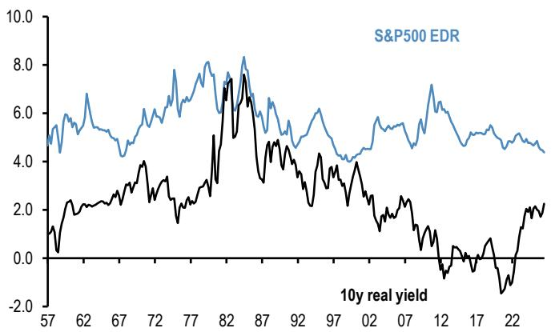

line

| Year | S&P500 EDR | 10y real yield |
|------|------------|----------------|
| 57   | ~4.5       | ~1.0           |
| 62   | ~5.0       | ~2.0           |
| 67   | ~4.5       | ~2.5           |
| 72   | ~5.5       | ~3.0           |
| 77   | ~6.0       | ~3.5           |
| 82   | ~7.0       | ~4.0           |
| 87   | ~8.0       | ~3.0           |
| 92   | ~6.5       | ~2.5           |
| 97   | ~5.5       | ~2.0           |
| 02   | ~4.5       | ~1.5           |
| 07   | ~5.0       | ~1.0           |
| 12   | ~6.0       | ~0.5           |
| 17   | ~5.0       | ~0.0           |
| 22   | ~4.5       | ~-1.0          |

Source: JPM Flows & Liquidity.

- Figure 1 implies relative insensitivity of equity yields to bond yields outside the high macro/policy uncertainty regime seen between 1967 and 1981. It was mostly during that period of macro instability that the equity yield of the S&P500 exhibited high sensitivity to interest rates and had increased almost in tandem with interest rates. Better macro policies after 1981 contributed to normalization in both bond and equity yields.   
- This normalization process lasted for about 15 years until 1996. Since 1996 the real equity yield of the S&P500 has been hovering around 5% even as real bond and cash yields trended lower for more than two decades approaching zero by March 2020. In other words, the steady and large decline in interest rates over the previous two decades had little impact on real equity yields which have been hovering around the 5% mark. As a result, Equity Risk Premia, i.e. the gap between equity and bond yields kept widening reaching a peak of almost 700bp in 2020. Hefty equity risk premia had underpinned the equity bull market that emerged after the financial crisis of 2008.   
- However, Equity Risk Premia have been declining rapidly in recent years with a sharp drop during 2022/2023 as bond yields spiked and another drop more recently as the Iran conflict caused another repricing in bond yields. At the same time an AI driven equity rally since 2023 has pushed equity yields to significantly lower levels. At the moment, on our model, the real equity yield of the S&P500 index stands at 4.4% on our long-term fair value model which is 60bp below the 5% average since mid 1990s. In other words equities look rather expensive (60bp multiplied by duration of around 30 years is equivalent to 18% expensiveness in price terms) on an outright basis relative to the norms of the past thirty years.   
• This expensiveness becomes more pronounced if one

compares equity yields to bond yields. Indeed, as a result of the equity rally and the rise in bond yield in recent months, the gap between the two yields ie the Equity Risk Premium has declined to only 2.2% a new low for the post Lehman crisis period, breaching the previous low of 2007 (Figure 2). In addition, the current Equity Risk Premium of 2.2% is 90bp below its long-run historical average of 3.1%. In other words, equities currently look even more expensive relative to bonds from a long-term investor's perspective.

Figure 2: Equity Risk Premium proxied by the difference between the S&P500 Equity Discount Rate and the real 10y UST yield   
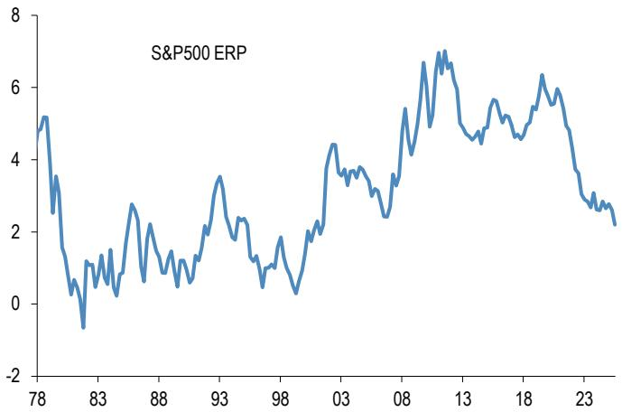

line

| Year | S&P500 ERP |
| ---- | ---------- |
| 78   | 5.0        |
| 83   | -1.0       |
| 88   | 2.5        |
| 93   | 3.5        |
| 98   | 1.0        |
| 03   | 4.5        |
| 08   | 5.5        |
| 13   | 7.0        |
| 18   | 6.0        |
| 23   | 2.5        |

Source: JPM Flows & Liquidity.

\- Admittedly, the Equity Risk Premium had reached a historical low of close to zero at the peak of the tech bubble in 2000, so there is some way to go until we reach the exuberant territory of the late 1990s. Whether markets eventually reach this exuberant territory is an open question. But what is clear from our exercise is that there is currently more limited room before a further rise in real bond yields starts becoming a problem for the equity market, and that from a long-term asset allocation point of view bonds should command a higher weight relative to equities compared to the norms of the post Lehman period.

# Which investor categories have been making bonds trading long in recent weeks?

\- The bond selloff that started with the Iran conflict accelerated in May pushing the Global Agg Bond Index yield to close to 4% (Figure 3). And our implied bond positioning metric based on the reaction of bond markets to economic news shifted towards more positive territory over the past month, suggesting that bond markets have been trading long since late April (Figure 4). Which investor categories have been making bond markets trading long?

Figure 3: Global Agg Bond Index yield   
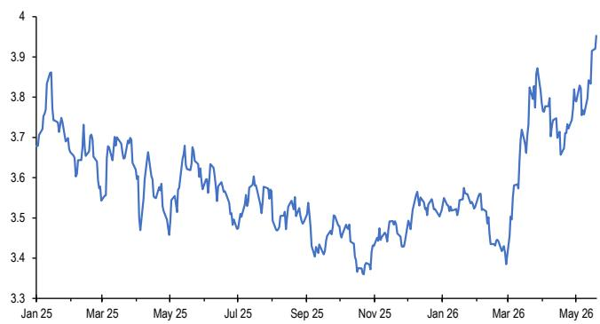

line

| Date   | Value |
|--------|-------|
| Jan 25 | 3.7   |
| Mar 25 | 3.6   |
| May 25 | 3.5   |
| Jul 25 | 3.6   |
| Sep 25 | 3.4   |
| Nov 25 | 3.35  |
| Jan 26 | 3.55  |
| Mar 26 | 3.4   |
| May 26 | 3.9   |

Source: Bloomberg Finance L.P., JPM Flows & Liquidity.

Figure 4: Reaction of bond markets to economic news, a positive number implies that bonds are “trading long”   
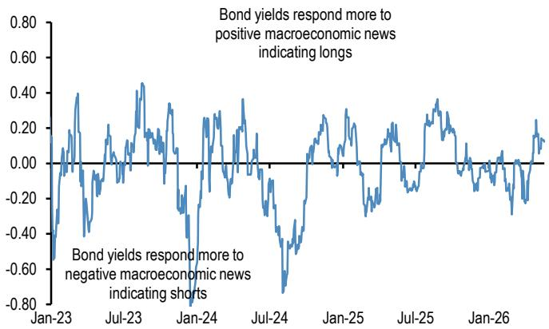

line

| Date   | Bond Yield |
|--------|------------|
| Jan-23 | -0.60      |
| Jul-23 | 0.40       |
| Jan-24 | -0.80      |
| Jul-24 | -0.70      |
| Jan-25 | 0.30       |
| Jul-25 | 0.35       |
| Jan-26 | 0.10       |

Source: Bloomberg Finance L.P., JPM Flows & Liquidity.

\- As a reminder to our readers, the we take as our starting point the economic releases incorporated in our USD and EUR EASI indices, complement them with inflation releases, and then calculate for each release the z-score of surprises (actual – survey median) / (std. dev. of past surprises) and the z-score of changes in UST and Bund yields for that day. We calculate separately the average beta (or the ratio of the z-score of UST and Bund yield

changes over the z-score of economic surprises) for positive and negative news over rolling two-month windows, and take the difference between the two. This indicator represents an indirect positioning metric, and positive (negative) values suggest bond investors have found themselves longer (shorter) duration than they would like to be given the surprises in the economic data flow, rather than necessarily long (short) relative to the benchmark.

\- The largest active US bond mutual fund managers are one investor category that appears to be long duration. This is shown by Figure 5 that depicts the 21-day rolling beta of the 20 largest active US bond mutual fund managers with respect to the US Agg Bond Index. It suggests that the largest active US bond mutual fund managers are long total duration, i.e. government and spread duration together.

Figure 5: 21-day rolling beta of the 20 largest active US bond mutual fund managers with respect to the US Agg Bond Index   
The dotted line shows the average beta since 2013.   
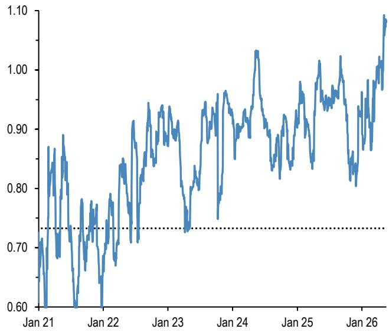

line

| Date   | Value |
|--------|-------|
| Jan 21 | 0.70  |
| Jan 22 | 0.85  |
| Jan 23 | 0.90  |
| Jan 24 | 1.05  |
| Jan 25 | 0.95  |
| Jan 26 | 1.10  |

Source: Bloomberg Finance L.P., JPM Flows & Liquidity.

\- There appears to be less of a long duration overhang with active Euro bond mutual fund managers, as Figure 6 suggests that these managers are closer to neutral.

Figure 6: 21-day rolling beta of the 20 largest active Euro bond mutual fund managers with respect to the Euro Agg Bond Index   
The dotted line shows the average beta since 2013.   
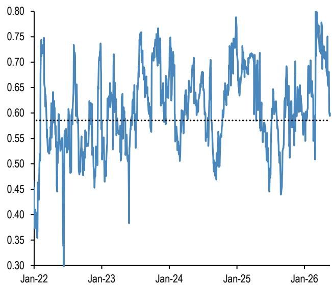

line

| Date   | Value |
|--------|-------|
| Jan-22 | 0.45  |
| Jan-22 | 0.75  |
| Jan-22 | 0.30  |
| Jan-23 | 0.60  |
| Jan-23 | 0.70  |
| Jan-23 | 0.55  |
| Jan-23 | 0.65  |
| Jan-23 | 0.50  |
| Jan-23 | 0.60  |
| Jan-23 | 0.55  |
| Jan-23 | 0.65  |
| Jan-23 | 0.50  |
| Jan-23 | 0.60  |
| Jan-23 | 0.55  |
| Jan-23 | 0.65  |
| Jan-23 | 0.50  |
| Jan-23<fcel>0.60  |
| Jan-23 | 0.55  |
| Jan-23 | 0.60  |
| Jan-23 | 0.55  |
| Jan-23 | 0.65  |
| Jan-23 | 0.50  |
| Jan-23 | 0.60  |
| Jan-23 | 0.55  |
| Jan-23 | 0.65  |
| Jan-23 | -0.35 |
| Jan-24 | 0.75  |
| Jan-24 | 0.70  |
| Jan-24 | 0.65  |
| Jan-24 | 0.60  |
| Jan-24 | 0.65  |
| Jan-24 | 0.55  |
| Jan-24 | 0.60  |
| Jan-24 | 0.55  |
| Jan-24 | 0.60  |
| Jan-24 | 0.55  |
| Jan-24 | 0.65  |
| Jan-24 | 0.50  |
| Jan-24 | 0.60  |
| Jan-24 | 0.55  |
| Jan-24 | 0.60  |
| Jan-24 | -0.45 |
| Jan-24 | -0.50 |
| Jan-24 | -0.45 |
| Jan-24 | -0.50 |
| Jan-24 | -0.45 |
| Jan-24 | -0.50 |
| Jan-24 | -0.45 |
| Jan-24 | -0.50 |
| Jan-24 | -0.45 |
| Jan-24 | -0.50 |
| Jan/25 | -      |
| Jan/25 | -      |
| Jan/25 | -      |
| Jan/25 | -      |
| Jan/25 | -      |
| Jan/25 | -      |
| Jan/25 | -      |
| Jan/25 | -      |
| Jan/25 | -      |
| Jan/25 | -      |
| Jan/25 | -      |
| Jan/25 | -      |

Source: Bloomberg Finance L.P., JPM Flows & Liquidity.

\- Another investor category that is making bond market trading long is balanced mutual fund managers that invest in both equities and bonds. These managers appear to have raised their bond betas since the start of the Iran conflict to significantly above long-term historical averages, as shown in Figure 7.

Figure 7: Bond beta of US Balanced Mutual funds and risk parity funds   
Rolling 21-day bond beta based on a bivariate regression of the daily returns of our Balanced Mutual fund and risk parity fund return index to the daily returns of the S&P 500 and Bloomberg US Agg indices.   
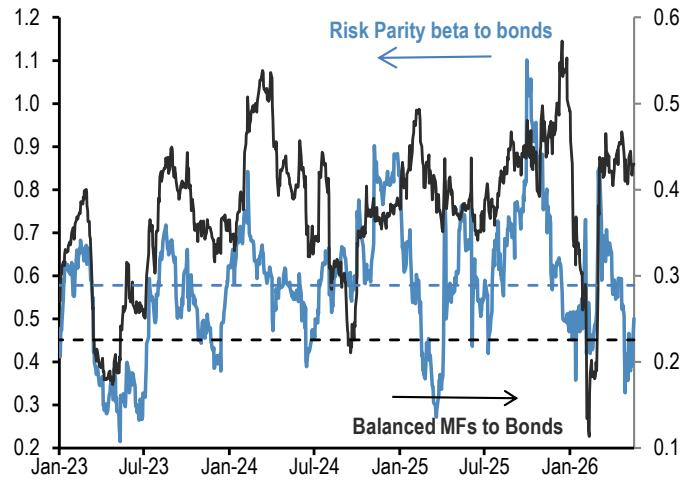

line

| Date   | Risk Parity beta to bonds | Balanced MFs to Bonds |
|--------|---------------------------|------------------------|
| Jan-23 | 0.8                       | 0.6                    |
| Jul-23 | 0.7                       | 0.5                    |
| Jan-24 | 1.0                       | 0.6                    |
| Jul-24 | 0.9                       | 0.5                    |
| Jan-25 | 1.0                       | 0.6                    |
| Jul-25 | 0.9                       | 0.5                    |
| Jan-26 | 1.1                       | 0.6                    |

Source: Bloomberg Finance L.P., JPM Flows & Liquidity.

\- If the above investor categories have been holding elevated bond exposures, who has been responsible for the bond selloff since the Iran conflict erupted?

- Risk parity funds are one culprit. As shown in Figure 7, in contrast to balanced mutual funds, risk parity funds appear to have lowered their bond beta since the start of the Iran conflict, contributing to the bond selloff.   
- Another culprit is systematic momentum-driven hedge funds such as CTAs which according to our signals (Figure 8) have been building up short duration positions, amplifying the bond selloff. Their current positioning is far from extreme territory, suggesting that they have room to further amplify the negative trend in bond markets.

Figure 8: Momentum signals for 10y USTs, Bunds, gilts and JGBs   
Average z-score of short- and long-term momentum signal in our trend following strategy framework, adjusted for the ratio of volatilities of the past 10 years and the past 6 months.   
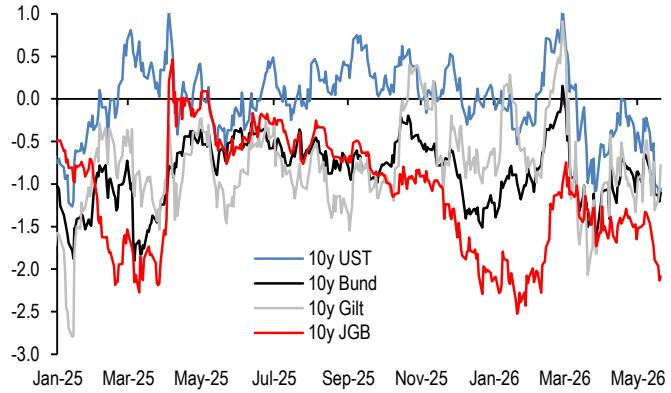

line

| Date   | 10y UST | 10y Bund | 10y Gilt | 10y JGB |
|--------|---------|----------|----------|---------|
| Jan-25 | -0.5    | -1.5     | -2.5     | -0.5    |
| Mar-25 | 0.5     | -1.0     | -1.5     | -2.0    |
| May-25 | 0.0     | -0.5     | -1.0     | -0.5    |
| Jul-25 | 0.5     | -0.5     | -1.0     | -0.5    |
| Sep-25 | 0.5     | -0.5     | -1.0     | -0.5    |
| Nov-25 | 0.5     | -0.5     | -1.0     | -0.5    |
| Jan-26 | 0.5     | -0.5     | -1.0     | -2.5    |
| Mar-26 | 0.5     | -0.5     | -1.0     | -2.0    |
| May-26 | 0.5     | -0.5     | -1.0     | -2.0    |

Source: Bloomberg Finance L.P., JPM Flows & Liquidity.

\- What about discretionary bond managers? Discretionary macro hedge fund managers play a multitude of asset classes so it is harder to infer their bond positioning from their performance. One hedge fund category that more narrowly focuses on bond markets is Relative Value Fixed Income Sovereign funds, which have exhibited a decent beta to government bond markets since the Iran conflict erupted thus implying a long duration bias (Figure 9). In other words, Relative Value Fixed Income Sovereign hedge funds appear to have been making bond markets trading long in recent months.

Figure 9: Beta of monthly returns on Relative Value Fixed Income Sovereign funds to Global Agg Treasury index   
Ratio. We filter out months where absolute returns on the Global Agg Treasury index are low as this can result in extreme readings.   
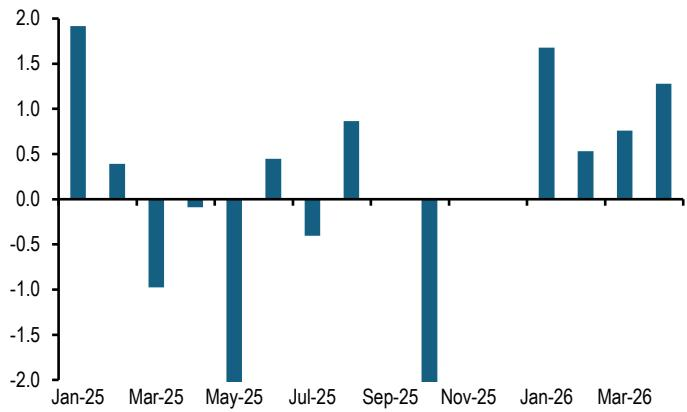

bar

| Month | Value |
|---|---|
| Jan-25 | 1.9 |
| Feb-25 | 0.4 |
| Mar-25 | -0.9 |
| Apr-25 | -0.1 |
| May-25 | -2.0 |
| Jun-25 | 0.45 |
| Jul-25 | -0.35 |
| Aug-25 | 0.85 |
| Sep-25 | -2.0 |
| Oct-25 | -0.0 |
| Nov-25 | 0.0 |
| Dec-25 | 1.7 |
| Jan-26 | 0.5 |
| Feb-26 | 0.75 |
| Mar-26 | 1.3 |

Source: HFRI, Bloomberg Finance L.P., JPM Flows & Liquidity.

\- In addition, we noted last month (F&L, Apr 15th) that there are some curve steepening risks for bonds from a global bond supply-demand balance perspective. These arose from a combination of less pending de-risking from pension funds than we had previously expected, given the strength of bond buying in 2024 and 2025 (Figure 10), bond demand from commercial banks that tends to provide less support from the long-end given their preferred habitat tends to be at the shorter end of the curve, as well as a continued negative duration impulse from retail flows. While flow of funds data for 1Q26 are not yet available, the retail impulse is still negative. Figure 11 shows our duration impulse estimate, where we adjust daily bond ETF flows by the empirical duration of each bond ETF using the average sensitivity of price returns to the US Agg index over 1-year rolling periods. We then multiply the flow of each ETF by its empirical duration and convert the aggregated flows across ETFs to US Agg duration equivalents. Finally, we calculate the difference between this duration-adjusted bond ETF flow and the nominal daily bond ETF flow to estimate the duration impulse. A positive difference indicates bond ETF flows have a longer-than-average duration, and negative numbers suggest a shorter-than-average duration. As Figure 11 shows, the negative duration impulse, which had shown some signs of stabilisation in late April, has resumed in recent weeks, likely exerting some steepening pressure on the curve.

Figure 10: Net bond demand by G4 pension funds and insurance companies   
\$bn per year.   
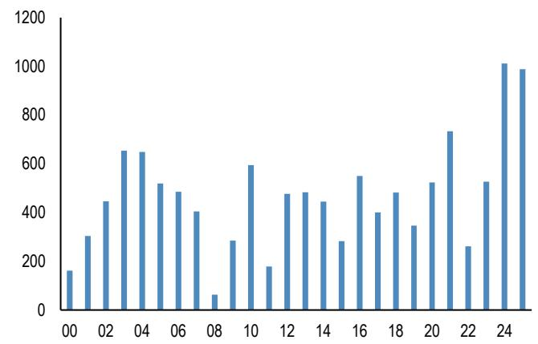

bar

| X-Axis | Value |
|---|---|
| 00 | 160 |
| 01 | 300 |
| 02 | 440 |
| 03 | 650 |
| 04 | 640 |
| 05 | 510 |
| 06 | 480 |
| 07 | 400 |
| 08 | 60 |
| 09 | 280 |
| 10 | 590 |
| 11 | 180 |
| 12 | 470 |
| 13 | 480 |
| 14 | 440 |
| 15 | 280 |
| 16 | 550 |
| 17 | 390 |
| 18 | 480 |
| 19 | 340 |
| 20 | 520 |
| 21 | 730 |
| 22 | 260 |
| 23 | 520 |
| 24 | 1010 |
| 25 | 990 |

Source: Federal Reserve, ECB, BoE, BoJ, JPM Flows & Liquidity.   
In \$bn. Measured as the cumulative difference between daily net daily bond ETF flows adjusted to Bloomberg US Agg index duration equivalents and the bond ETF flows in dollar terms. Weighted average maturity of bonds in US and Euro Agg corporate indices in years.

Figure 11: Duration impulse from net inflows into bond ETFs

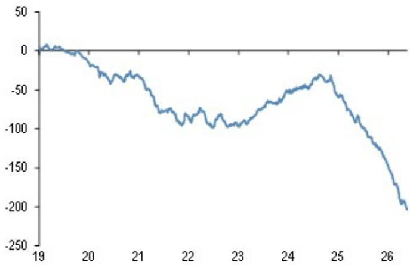

line

| Year | Value |
| ---- | ----- |
| 19   | 0     |
| 20   | -20   |
| 21   | -40   |
| 22   | -80   |
| 23   | -100  |
| 24   | -60   |
| 25   | -30   |
| 26   | -200  |

Source: Bloomberg Finance L.P., JPM Flows & Liquidity.

# Tokenized money market funds still represent a relatively small 5% proportion of the stablecoin universe

\- Despite their interest advantage, tokenized money market funds still represent a relatively small 5% proportion of the stablecoin universe (Figure 12 to Figure 14).

Figure 12: Marketcap of stablecoin and tokenized MMF at each year end   
\$bn, YTD for 2026   
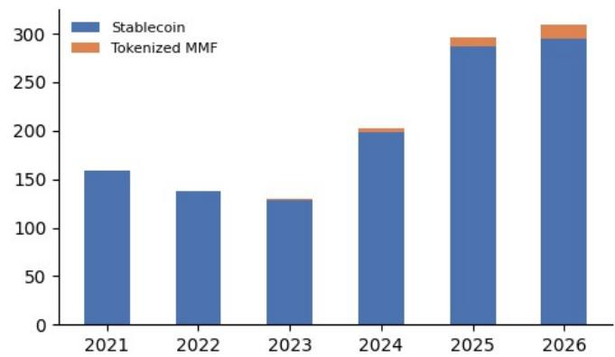

bar_stacked

| Year | Stablecoin | Tokenized MMF |
|---|---|---|
| 2021 | 160 | 0 |
| 2022 | 140 | 0 |
| 2023 | 130 | 0 |
| 2024 | 200 | 10 |
| 2025 | 285 | 20 |
| 2026 | 295 | 25 |

Source: CoinMarketcap, Messari, rwa.xyz, JPM Flows & Liquidity.

Figure 13: Ratio of tokenized MMF to stablecoin marketcap at each year end   
YTD for 2026   
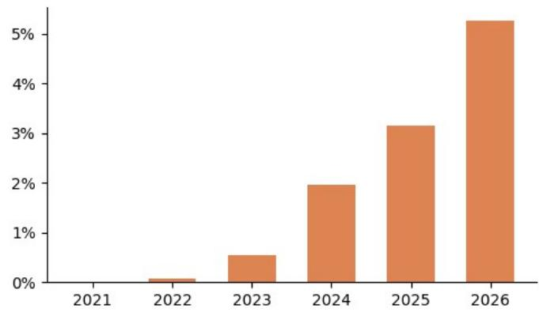

bar

| Year | Value (%) |
|---|---|
| 2021 | 0 |
| 2022 | 0.1 |
| 2023 | 0.5 |
| 2024 | 2 |
| 2025 | 3.1 |
| 2026 | 5.2 |

Source: CoinMarketcap, Messari, rwa.xyz, , JPM Flows & Liquidity.

Figure 14: Breakdown of tokenized treasury marketcap at each year end   
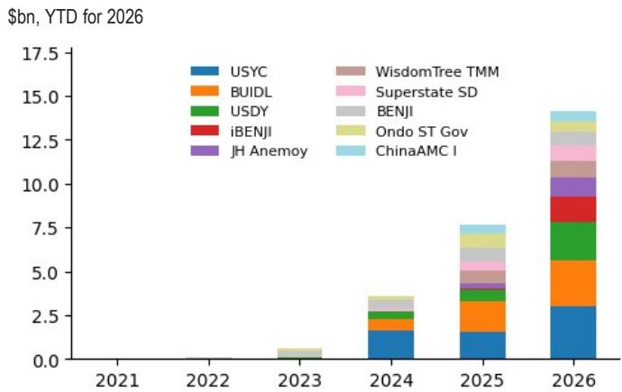

bar_stacked

| Year | USYC ($bn) | BUIDL ($bn) | USDY ($bn) | iBENJI ($bn) | JH Anemoy ($bn) | WisdomTree TMM ($bn) | Superstate SD ($bn) | BENJI ($bn) | Ondo ST Gov ($bn) | ChinaAMC I ($bn) |
|---|---|---|---|---|---|---|---|---|---|---|
| 2021 | 0.0 | 0.0 | 0.0 | 0.0 | 0.0 | 0.0 | 0.0 | 0.0 | 0.0 | 0.0 |
| 2022 | 0.0 | 0.0 | 0.0 | 0.0 | 0.0 | 0.0 | 0.0 | 0.0 | 0.0 | 0.0 |
| 2023 | 0.0 | 0.0 | 0.0 | 0.0 | 0.0 | 0.0 | 0.0 | 0.5 | 0.5 | 0.5 |
| 2024 | 1.5 | 0.5 | 0.5 | 0.5 | 0.5 | 0.5 | 0.5 | 1.5 | 1.5 | 1.5 |
| 2025 | 1.5 | 1.5 | 1.5 | 1.5 | 1.5 | 1.5 | 1.5 | 2.5 | 2.5 | 2.5 |
| 2026 | 3.0 | 2.5 | 2.5 | 2.5 | 2.5 | 2.5 | 2.5 | 3.5 | 3.5 | 3.5 |
The chart displays a stacked bar chart with each bar representing a different company's annual revenue from 2021 to 2026, where each bar is segmented by company name and labeled with its corresponding revenue in billions of dollars.

Source: rwa.xyz, , JPM Flows & Liquidity.

- Crypto market participants generally prefer stablecoins because they have become the ecosystem's default cash instrument used seamlessly for collateral management, trading, settlement, cross-border payments and day-to-day liquidity management across centralized exchanges and decentralized protocols.   
- Tokenized money market funds face a structural regulatory disadvantage because they are treated as securities and as a result they are subjected to securities law requirements such as registration, disclosure, reporting and transfer limitations, which reduces their ability to circulate seamlessly within the crypto ecosystem.   
- This means that the use of tokenized money market funds is confined to crypto-native investors seeking to park their idle cash by earning interest, or to non-native institutional investors which combine the operational benefits from tokenization, such as faster settlement and programmability, with established investor protection frameworks in a similar way to traditional money market funds.   
- Going forward, although we expect that tokenized money market funds will continue to grow faster than stablecoins given their interest advantage, we doubt that tokenized money market funds would grow beyond 10%-15% or so of the stablecoin universe, unless there is a regulatory change that reduces the structural disadvantage arising from tokenized money market funds classified as securities.   
- So far, regulatory support for tokenized money market funds has been marginal. For example, last January, the SEC introduced a streamlined process for issuing on-chain money market funds that aims to simplify redemptions and reduce operational friction for funds using blockchain-based record keeping.

- There have also been some marginal changes in market structure, where traditional firms are partnering with crypto-native firms to launch programs that let institutional clients use tokenized money market funds as off-exchange trading collateral. In these structures, clients post tokenized fund shares issued through a regulated platform, the assets remain in regulated off-exchange custody, and their value is represented within the trading venue's system or crypto exchange. This setup can allow institutions to earn yield on collateral while simultaneously using it for trading.   
- But again, all the above improvements are marginal and unlikely to change the big picture, which puts tokenized money market funds at a structural regulatory disadvantage relative to stablecoins, preventing their seamless circulation and use across the crypto ecosystem.

Nikolaos Panigirtzoglou AC (44-20) 7134-7815   
nikolaos.panigirtzoglou@JPM.com   
JPM Securities plc   
Mika Inkinen (44-20) 7742 6565   
mika.j.inkinen@JPM.com   
JPM Securities plc   
Mayur Yeole (91 22) 6157 3872   
mayur.yeole@jpmchase.com  
JPM India Private Limited   
Krutik P Mehta (91-22) 6157-5016   
krutik.mehta@jpmchase.com  
JPM India Private Limited

# Appendix

# Chart A1a: Global equity & bond fund flows

\$bn per year of Net Sales, i.e. includes net new sales + reinvested dividends for Mutual Funds and ETFs globally, i.e. for funds domiciled both inside and outside the US. Flows come from ICI (worldwide data up to Q4'25). Data since then are a combination of monthly and weekly data from Lipper and Bloomberg.

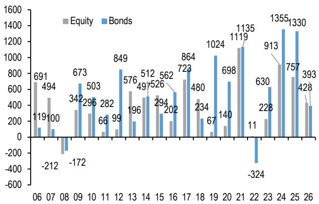

bar

| Year | Equity | Bonds |
| :--- | :--- | :--- |
| 06 | 691 | 119 |
| 07 | 494 | 100 |
| 08 | -212 | -172 |
| 09 | 342 | 673 |
| 10 | 296 | 503 |
| 11 | 66 | 282 |
| 12 | 99 | 849 |
| 13 | 576 | 196 |
| 14 | 497 | 512 |
| 15 | 526 | 294 |
| 16 | 202 | 562 |
| 17 | 723 | 864 |
| 18 | 480 | 234 |
| 19 | 67 | 1024 |
| 20 | 140 | 698 |
| 21 | 1119 | 1135 |
| 22 | 11 | -324 |
| 23 | 228 | 630 |
| 24 | 913 | 1355 |
| 25 | 757 | 1330 |
| 26 | 428 | 393 |

Source: ICI, LSEG Lipper, Bloomberg Finance L.P., JPM Flows & Liquidity.

# Chart A1b: Quarterly Balanced/Mixed funds & MMFs flows worldwide

\$bn per quarter of Net Sales, i.e. includes net new sales + reinvested dividends for Mutual Funds and ETFs globally, i.e. for funds domiciled both inside and outside the US. Data come from ICI (worldwide data) and are till Q4'25.

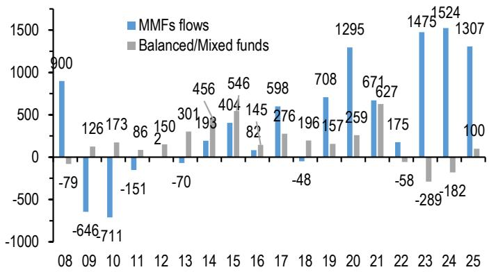

bar

| Year | MMFs flows | Balanced/Mixed funds |
| :--- | :--- | :--- |
| 08 | 900 | -79 |
| 09 | -646 | 126 |
| 10 | -711 | 173 |
| 11 | -151 | 86 |
| 12 | 2 | 150 |
| 13 | -70 | 301 |
| 14 | 193 | 456 |
| 15 | 404 | 546 |
| 16 | 82 | 145 |
| 17 | 598 | 276 |
| 18 | -48 | 196 |
| 19 | 708 | 157 |
| 20 | 1295 | 259 |
| 21 | 671 | 627 |
| 22 | 175 | -58 |
| 23 | 1475 | -289 |
| 24 | 1524 | -182 |
| 25 | 1307 | 100 |

Source: ICI, JPM Flows & Liquidity.

# Global Markets Strategy

# Flows & Liquidity

20 May 2026

# Chart A2: Fund flow indicator

Difference between flows into Equity and Bond funds: \$bn per week. Difference between flows into Equity vs. Bond funds in \$bn per week. Flows include Mutual Fund and ETF flows globally, i.e. funds domiciled both inside and outside the US (source: Lipper). The thin blue line shows the 4-week average of difference between Equity and Bond fund flows. Dotted lines depict ±1 StDev of the blue line since 2009. The thick black line shows a smoothed version of the same series. The smoothing is done using a Hodrick-Prescott filter with a Lambda parameter of 100. China onshore A-share ETFs have been excluded.

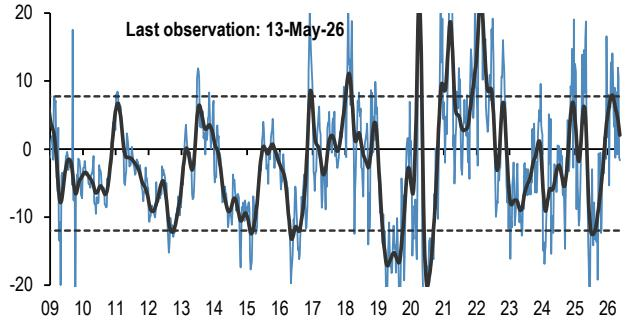

line

| Date       | Value |
| ---------- | ----- |
| 13-May-26  | 13    |

Source: LSEG Lipper, JPM Flows & Liquidity.

# Table A2: Trading turnover monitor

Volumes are monthly and Turnover ratio is annualised (monthly trading volume annualised divided by the amount outstanding). UST Cash is primary dealer transactions in all US government securities. UST futures are from Bloomberg Finance L.P. JGBs are OTC volumes in all Japanese government securities. Bunds, Gold, Oil and Copper are futures. Gold includes Gold ETFs. Min-Max chart is based on Turnover ratio. For Bunds and Commodities, futures trading volumes are used while the outstanding amount is proxied by open interest. The diamond reflects the latest turnover observation. The thin blue line marks the distance between the min and max for the complete time series since Jan-2005 onwards. Y/Y change is change in YTD notional volumes over the same period last year.

<table><tr><td>As of Mar-26</td><td>MIN</td><td>MAX</td><td>Turnover ratio</td><td>Vol (tr)</td><td>y/y chng</td></tr><tr><td colspan="6">Equities</td></tr><tr><td>EM Equity</td><td></td><td>1.1</td><td></td><td>$1.6</td><td>104%</td></tr><tr><td>DM Equity</td><td></td><td>1.5</td><td></td><td>$14.5</td><td>52%</td></tr><tr><td colspan="6">Govt Bonds</td></tr><tr><td>UST cash</td><td></td><td>12.3</td><td></td><td>$20.3</td><td>7%</td></tr><tr><td>UST futures</td><td></td><td>0.9</td><td></td><td>$23.6</td><td>18%</td></tr><tr><td>JGBs</td><td></td><td>44.5</td><td></td><td>¥4,727</td><td>5%</td></tr><tr><td>Bund futures</td><td></td><td>1.6</td><td></td><td>€14.9</td><td>18%</td></tr><tr><td colspan="6">Credit</td></tr><tr><td>US HG</td><td></td><td>1.2</td><td></td><td>$1.0</td><td>17%</td></tr><tr><td>US HY</td><td></td><td>0.6</td><td></td><td>$0.2</td><td>3%</td></tr><tr><td>US Convertibles</td><td></td><td>3.8</td><td></td><td>$0.04</td><td>18%</td></tr><tr><td colspan="6">Commodities</td></tr><tr><td>Gold</td><td></td><td>88.7</td><td></td><td>$2.9</td><td>109%</td></tr><tr><td>Oil</td><td></td><td>99.7</td><td></td><td>$6.1</td><td>-3%</td></tr><tr><td>Copper</td><td></td><td>3.0</td><td></td><td>$0.9</td><td>106%</td></tr><tr><td colspan="6">Digital Assets</td></tr><tr><td>CME Bitcoin</td><td></td><td>112.3</td><td></td><td>$0.074</td><td>-33%</td></tr><tr><td>CME Ethereum</td><td></td><td>103.1</td><td></td><td>$0.033</td><td>60%</td></tr></table>

\* Data with one month lag   
Source: Bloomberg Finance L.P., Federal Reserve, Trace, Japan Securities Dealer Association, WFE, JPM Flows & Liquidity.

Nikolaos Panigirtzoglou AC (44-20) 7134-7815   
Mayur Yeole (91 22) 6157 3872   
nikolaos.panigirtzoglou@JPM.com   
mayur.yeole@jpmchase.com  
JPM Securities plc   
JPM India Private Limited   
Mika Inkinen (44-20) 7742 6565   
Krutik P Mehta (91-22) 6157-5016   
mika.j.inkinen@JPM.com   
krutik.mehta@jpmchase.com  
JPM Securities plc   
JPM India Private Limited

# ETF Flow Monitor (as of 20 $^{th}$ May)

Chart A3: Global Cross Asset ETF Flows   
Cumulative flows into ETFs as a % of AUM   
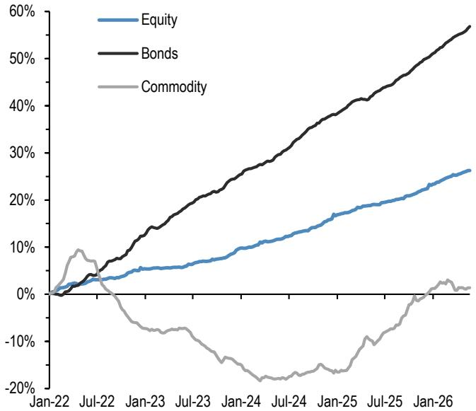

line

| Date   | Equity | Bonds | Commodity |
|--------|--------|-------|-----------|
| Jan-22 | 0%     | 0%    | 0%        |
| Jul-22 | ~5%    | ~5%   | ~10%      |
| Jan-23 | ~7%    | ~15%  | ~-5%      |
| Jul-23 | ~10%   | ~25%  | ~-10%     |
| Jan-24 | ~12%   | ~30%  | ~-15%     |
| Jul-24 | ~15%   | ~35%  | ~-18%     |
| Jan-25 | ~18%   | ~40%  | ~-15%     |
| Jul-25 | ~20%   | ~45%  | ~-5%      |
| Jan-26 | ~25%   | ~55%  | ~0%       |

Source: Bloomberg Finance L.P., JPM Flows & Liquidity. China onshore A-share ETFs have been excluded.

Chart A5: Global Equity ETF Flows   
Cumulative flows into global equity ETFs as a \% of AUM   
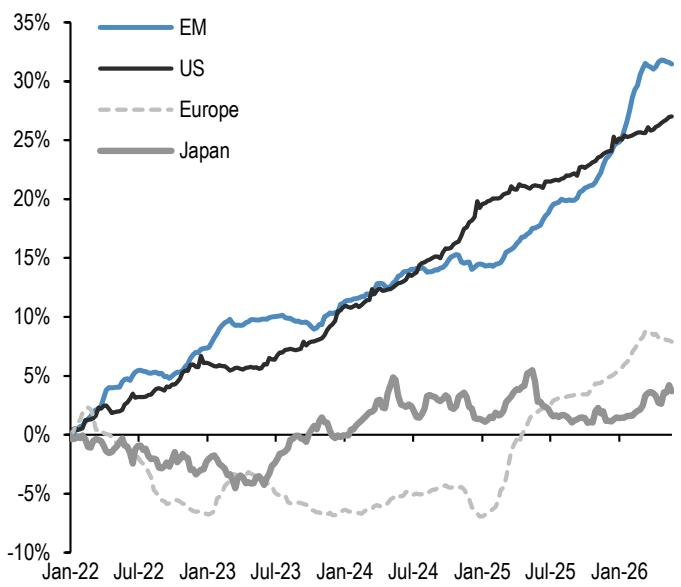

line

| Date   | EM    | US    | Europe | Japan |
|--------|-------|-------|--------|-------|
| Jan-22 | 0%    | 0%    | 0%     | 0%    |
| Jul-22 | ~5%   | ~5%   | ~-5%   | ~-5%  |
| Jan-23 | ~10%  | ~10%  | ~-10%  | ~-10% |
| Jul-23 | ~10%  | ~10%  | ~-10%  | ~-10% |
| Jan-24 | ~15%  | ~15%  | ~-10%  | ~0%    |
| Jul-24 | ~20%  | ~20%  | ~-10%  | ~5%    |
| Jan-25 | ~25%  | ~25%  | ~-10%  | ~0%    |
| Jul-25 | ~30%  | ~30%  | ~5%    | ~5%    |
| Jan-26 | ~35%  | ~35%  | ~10%   | ~5%    |

Source: Bloomberg Finance L.P., JPM Flows & Liquidity.   
Note: We include ETFs with AUM > \$200mn in all the flow monitor charts. In Chart A5 for Japan, we subtract the BoJ buying of ETFs. China onshore A-share ETFs have been excluded.

# Global Markets Strategy

20 May 2026

Chart A4: Bond ETF Flows   
Cumulative flows into bond ETFs as a % of AUM   
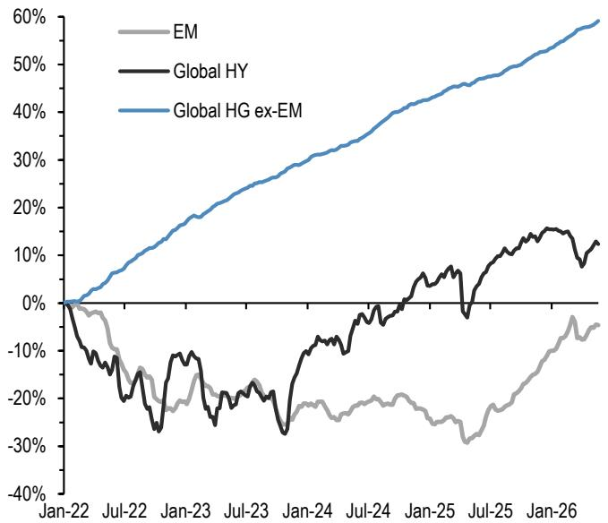

line

| Date   | EM    | Global HY | Global HG ex-EM |
|--------|-------|-----------|-----------------|
| Jan-22 | 0%    | 0%        | 0%              |
| Jul-22 | -10%  | -15%      | 10%             |
| Jan-23 | -20%  | -25%      | 20%             |
| Jul-23 | -15%  | -10%      | 30%             |
| Jan-24 | -25%  | -30%      | 40%             |
| Jul-24 | -20%  | 0%        | 50%             |
| Jan-25 | -30%  | 5%        | 60%             |
| Jul-25 | -25%  | 10%       | 55%             |
| Jan-26 | -10%  | 15%       | 60%             |

Source: Bloomberg Finance L.P., JPM Flows & Liquidity.

Chart A6a: Equity Sectoral and Regional ETF Flows   
Rolling 3-month and 12-month change in cumulative flows as a % of AUM. Both sorted by 12-month change   
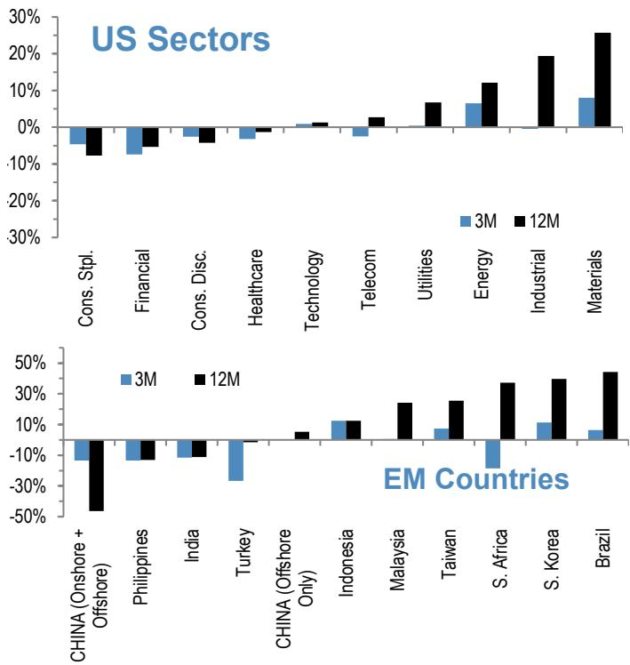

bar

| Sector | 3M (%) | 12M (%) |
| :--- | :--- | :--- |
| Cons. Stpl. | -5 | -10 |
| Financial | -8 | -6 |
| Cons. Disc. | -3 | -5 |
| Healthcare | -4 | -2 |
| Technology | 1 | 1 |
| Telecom | -2 | 3 |
| Utilities | 0 | 7 |
| Energy | 7 | 12 |
| Industrial | -1 | 20 |
| Materials | 9 | 26 |
| CHINA (Onshore + Offshore) | -10 | -45 |
| Philippines | -10 | -10 |
| India | -10 | -10 |
| Turkey | -30 | -8 |
| CHINA (Offshore Only) | 0 | 8 |
| Indonesia | 0 | 11 |
| Malaysia | 0 | 27 |
| Taiwan | 9 | 28 |
| S. Africa | -10 | 33 |
| S. Korea | 10 | 35 |
| Brazil | 9 | 40 |
US Sectors: US; EM Countries: US; EM Countries: EM

Source: Bloomberg Finance L.P., JPM Flows & Liquidity.

<table><tr><td>Nikolaos Panigirtzoglou  $^{AC}$  (44-20) 7134-7815</td><td>Mayur Yeole (91 22) 6157 3872</td></tr><tr><td>nikolaos.panigirtzoglou@JPM.com</td><td>mayur.yeole@jpmchase.com</td></tr><tr><td>JPM Securities plc</td><td>JPM India Private Limited</td></tr><tr><td>Mika Inkinen (44-20) 7742 6565</td><td>Krutik P Mehta (91-22) 6157-5016</td></tr><tr><td>mika.j.inkinen@JPM.com</td><td>krutik.mehta@jpmchase.com</td></tr><tr><td>JPM Securities plc</td><td>JPM India Private Limited</td></tr></table>

Chart A6b: Regional Equity Allocation Monitor Implied by ETFs   
In %.

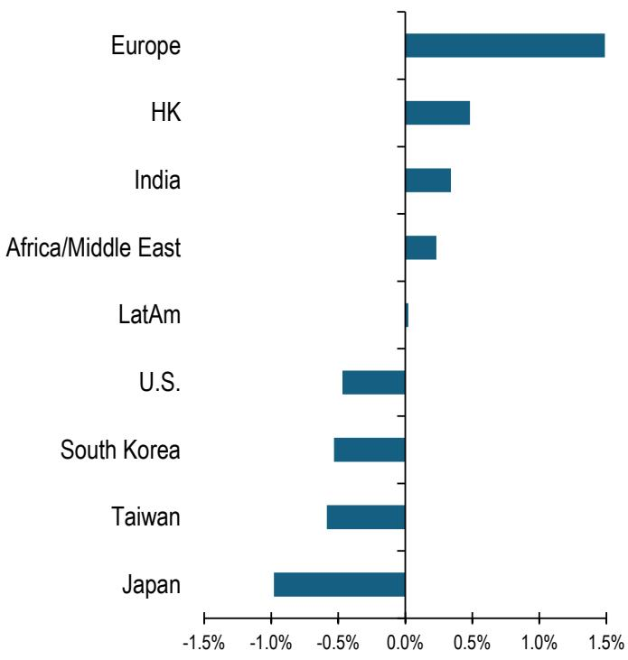

bar

| Region | Value (%) |
| :--- | :--- |
| Europe | 1.45 |
| HK | 0.45 |
| India | 0.35 |
| Africa/Middle East | 0.25 |
| LatAm | 0.05 |
| U.S. | -0.35 |
| South Korea | -0.45 |
| Taiwan | -0.55 |
| Japan | -0.85 |

Source: Bloomberg Finance L.P., MSCI and JPM Flows & Liquidity.   
Note: Our regional equity allocation monitor implied by ETFs is based on a comparison of the share of each region in the equity ETF space relative to their corresponding shares in global equity indices.

# Global Markets Strategy

# Flows & Liquidity

20 May 2026

Nikolaos Panigirtzoglou AC (44-20) 7134-7815   
Mayur Yeole (91 22) 6157 3872   
nikolaos.panigirtzoglou@JPM.com   
mayur.yeole@jpmchase.com  
JPM Securities plc   
JPM India Private Limited   
Mika Inkinen (44-20) 7742 6565   
Krutik P Mehta (91-22) 6157-5016   
mika.j.inkinen@JPM.com   
krutik.mehta@jpmchase.com  
JPM Securities plc   
JPM India Private Limited

# Short Interest Monitor

# Chart A7: Short interest on the EEM and EMB US ETF

Short Interest as a \% share of shares outstanding.

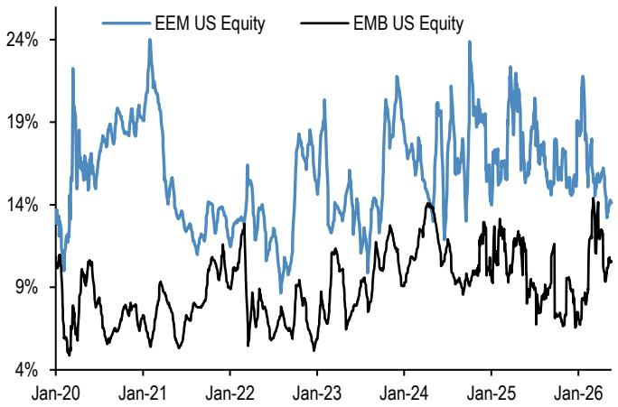

line

| Date   | EEM US Equity | EMB US Equity |
|--------|---------------|---------------|
| Jan-20 | ~13%          | ~9%           |
| Jan-21 | ~24%          | ~9%           |
| Jan-22 | ~14%          | ~9%           |
| Jan-23 | ~18%          | ~9%           |
| Jan-24 | ~19%          | ~14%          |
| Jan-25 | ~24%          | ~14%          |
| Jan-26 | ~14%          | ~14%          |

Source: S3, JPM Flows & Liquidity.

# Chart A8: Short interest on the LQD and HYG US ETF

Short Interest as a \% share of shares outstanding.

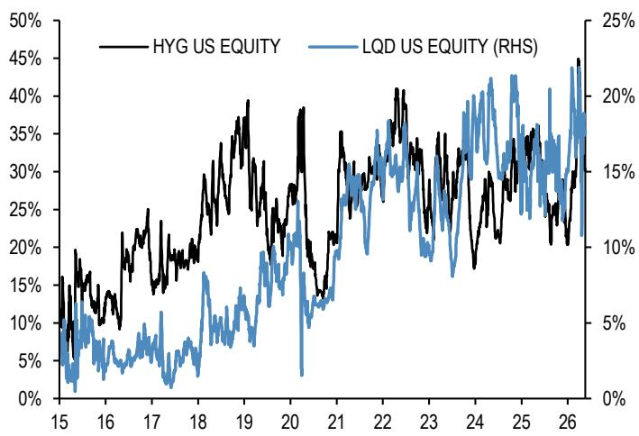

line

| Year | HYG US EQUITY | LQD US EQUITY (RHS) |
|------|---------------|---------------------|
| 15   | ~10%          | ~5%                 |
| 16   | ~15%          | ~7%                 |
| 17   | ~20%          | ~8%                 |
| 18   | ~25%          | ~10%                |
| 19   | ~30%          | ~12%                |
| 20   | ~35%          | ~15%                |
| 21   | ~30%          | ~10%                |
| 22   | ~35%          | ~15%                |
| 23   | ~30%          | ~10%                |
| 24   | ~35%          | ~15%                |
| 25   | ~30%          | ~10%                |
| 26   | ~35%          | ~15%                |

Source: S3, JPM Flows & Liquidity.

# Global Markets Strategy

20 May 2026

# Chart A9: Short interest on the SPY and QQQ US ETF

Short Interest as a \% share of shares outstanding. Last obs is for 19 $^{th}$ May 2026.

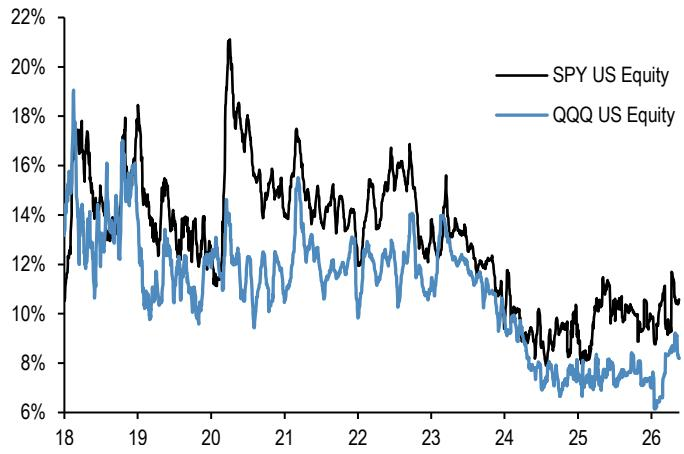

line

| Year | SPY US Equity | QQQ US Equity |
|------|---------------|---------------|
| 18   | ~17%          | ~19%          |
| 19   | ~14%          | ~13%          |
| 20   | ~21%          | ~14%          |
| 21   | ~15%          | ~12%          |
| 22   | ~14%          | ~10%          |
| 23   | ~13%          | ~12%          |
| 24   | ~10%          | ~8%           |
| 25   | ~9%           | ~7%           |
| 26   | ~10%          | ~6%           |

Source: S3, JPM Flows & Liquidity.

# Chart A10: S&P500 sector short interest

Short interest as a % of shares outstanding based on z-scores. A strategy which overweights the S&P500 sectors with the highest short interest z-score (as % of shares o/s) vs. those with the lowest, produced an information ratio of 0.7 with a success rate of 56% (see F&L, Jun 28,2013 for more details).

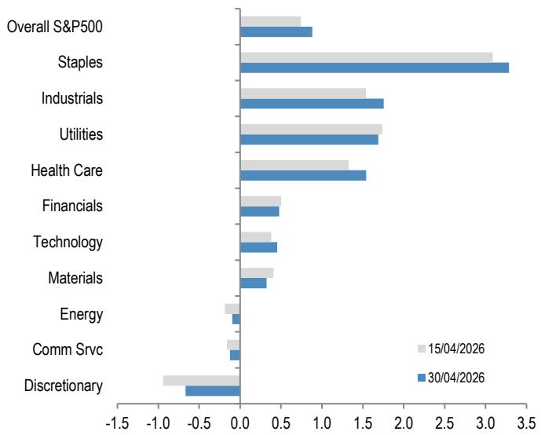

bar

| Sector | 15/04/2026 | 30/04/2026 |
| :--- | :--- | :--- |
| Overall S&P500 | 0.75 | 0.85 |
| Staples | 3.05 | 3.25 |
| Industrials | 1.5 | 1.75 |
| Utilities | 1.75 | 1.7 |
| Health Care | 1.3 | 1.45 |
| Financials | 0.5 | 0.55 |
| Technology | 0.4 | 0.5 |
| Materials | 0.4 | 0.3 |
| Energy | -0.15 | -0.1 |
| Comm Srvc | -0.1 | -0.15 |
| Discretionary | -0.85 | -0.65 |

Source: NYSE, Bloomberg Finance L.P., JPM Flows & Liquidity.

# Chart A11a: Cross Asset Volatility Monitor 3m ATM Implied Volatility (1y history), as of $18^{\text{th}}$ May-2026

This table shows the richness/cheapness of current three-month implied volatility levels (red dot) against their one-year historical range (thin blue bar) and the ratio to current realised volatility. Assets with implied volatility outside their 25th/75th percentile range (thick blue bar) are highlighted. The implied-to-realised volatility ratio uses 3-month implied volatilities and 1-month (around 21 trading days) realised volatilities for each asset.

<table><tr><td>Asset</td><td>Current</td><td>Low</td><td>Low date</td><td>High</td><td>High date</td><td></td><td>Upside</td><td>Downside</td><td>Implied/realized volatility</td></tr><tr><td>S&amp;P 500</td><td>16%</td><td>13%</td><td>28-Aug-25</td><td>24%</td><td>27-Mar-26</td><td></td><td>8%</td><td>3%</td><td>1.44x</td></tr><tr><td>EuroSTOXX</td><td>19%</td><td>13%</td><td>18-Sep-25</td><td>26%</td><td>27-Mar-26</td><td></td><td>8%</td><td>5%</td><td>0.96x</td></tr><tr><td>Nikkei 225</td><td>28%</td><td>18%</td><td>22-Jul-25</td><td>33%</td><td>31-Mar-26</td><td></td><td>6%</td><td>10%</td><td>1.07x</td></tr><tr><td>Hang Seng</td><td>19%</td><td>17%</td><td>23-Dec-25</td><td>24%</td><td>26-Mar-26</td><td></td><td>5%</td><td>2%</td><td>1.18x</td></tr><tr><td>MSCI EM</td><td>26%</td><td>12%</td><td>15-Aug-25</td><td>35%</td><td>27-Mar-26</td><td></td><td>9%</td><td>14%</td><td>0.88x</td></tr><tr><td>Gold</td><td>23%</td><td>14%</td><td>19-Aug-25</td><td>33%</td><td>26-Mar-26</td><td></td><td>11%</td><td>9%</td><td>1.09x</td></tr><tr><td>Oil (brent)</td><td>65%</td><td>27%</td><td>19-Sep-25</td><td>89%</td><td>30-Mar-26</td><td></td><td>24%</td><td>38%</td><td>1.06x</td></tr><tr><td>Copper</td><td>26%</td><td>14%</td><td>18-Aug-25</td><td>37%</td><td>03-Feb-26</td><td></td><td>11%</td><td>12%</td><td>0.80x</td></tr><tr><td>BB commodity index</td><td>23%</td><td>13%</td><td>10-Dec-25</td><td>25%</td><td>30-Mar-26</td><td></td><td>2%</td><td>10%</td><td>1.32x</td></tr><tr><td>EUR/USD</td><td>9%</td><td>9%</td><td>13-May-26</td><td>13%</td><td>26-May-25</td><td></td><td>4%</td><td>0%</td><td>2.13x</td></tr><tr><td>USD/NOK</td><td>9%</td><td>8%</td><td>17-Dec-25</td><td>11%</td><td>30-Mar-26</td><td></td><td>2%</td><td>1%</td><td>1.40x</td></tr><tr><td>USD/JPY</td><td>8%</td><td>8%</td><td>13-May-26</td><td>12%</td><td>23-May-25</td><td></td><td>4%</td><td>0%</td><td>0.82x</td></tr><tr><td>GBP/USD</td><td>7%</td><td>6%</td><td>12-Dec-25</td><td>8%</td><td>02-Jul-25</td><td></td><td>1%</td><td>1%</td><td>1.16x</td></tr><tr><td>USD/CHF</td><td>7%</td><td>6%</td><td>09-Jan-26</td><td>10%</td><td>21-May-25</td><td></td><td>3%</td><td>0%</td><td>1.10x</td></tr><tr><td>10y US swaps</td><td>6%</td><td>6%</td><td>16-Jan-26</td><td>10%</td><td>27-Mar-26</td><td></td><td>3%</td><td>0%</td><td>1.02x</td></tr><tr><td>10y Eur swaps</td><td>69%</td><td>43%</td><td>26-Feb-26</td><td>97%</td><td>27-Mar-26</td><td></td><td>28%</td><td>26%</td><td>0.93x</td></tr><tr><td>CDX IG</td><td>46%</td><td>38%</td><td>29-Jul-25</td><td>66%</td><td>27-Mar-26</td><td></td><td>20%</td><td>7%</td><td>1.02x</td></tr><tr><td>CDX HY</td><td>42%</td><td>31%</td><td>09-Jan-26</td><td>57%</td><td>30-Mar-26</td><td></td><td>15%</td><td>10%</td><td>1.08x</td></tr><tr><td>iTraxx</td><td>48%</td><td>37%</td><td>09-Jan-26</td><td>70%</td><td>27-Mar-26</td><td></td><td>22%</td><td>11%</td><td>0.91x</td></tr><tr><td>iTraxx X/O</td><td>21%</td><td>19%</td><td>23-Dec-25</td><td>26%</td><td>17-Oct-25</td><td></td><td>5%</td><td>1%</td><td>0.41x</td></tr></table>

Source: Bloomberg Finance L.P., JPM Flows & Liquidity.   
Note: Swaps volatility is 3m 10y payer ATMF implied annualized BP vol and credit volatility is 3m 5y on-the-run ATM spread volatility. MSCI EM, Gold, Oil, Copper, BB Commodity Index and Treasury futures are 3m implied vol from Bloomberg.

Definitions: 

<table><tr><td>Current:</td><td>Latest available closing level (18-May-26)</td></tr><tr><td>Low:</td><td>Lowest closing level in the last 1y</td></tr><tr><td>Low date:</td><td>Date the lowest closing level was reached (or the first time it was reached in the case of several identical low closing levels)</td></tr><tr><td>High:</td><td>Highest closing level in the last 1y</td></tr><tr><td>High date:</td><td>Date the highest closing level was reached (or the first time it was reached in the case of several identical high closing levels)</td></tr><tr><td>Graph:</td><td>Shows the current level and the 25th/75th percentile relative to the 1y high/low</td></tr><tr><td>Upside:</td><td>Implied return/volatility percentage points from current level up to the High (note: return is calculated as simple difference for spread products)</td></tr><tr><td>Upside ( $\sigma$ ):</td><td>Upside in terms of standard deviations (Upside / Current 1y realized volatility)</td></tr><tr><td>Downside:</td><td>Implied return/volatility percentage points from current level down to the Low (note: return calculated as simple difference for spread products)</td></tr><tr><td>Downside ( $\sigma$ ):</td><td>Downside in terms of standard deviations (Downside / Current 1y realized volatility)</td></tr><tr><td>Implied/realized volatility:</td><td>Current 3m implied volatility / current realized 3m volatility</td></tr></table>

<table><tr><td>Nikolaos Panigirtzoglou  $^{AC}$  (44-20) 7134-7815</td><td>Mayur Yeole (91 22) 6157 3872</td></tr><tr><td>nikolaos.panigirtzoglou@JPM.com</td><td>mayur.yeole@jpmchase.com</td></tr><tr><td>JPM Securities plc</td><td>JPM India Private Limited</td></tr><tr><td>Mika Inkinen (44-20) 7742 6565</td><td>Krutik P Mehta (91-22) 6157-5016</td></tr><tr><td>mika.j.inkinen@JPM.com</td><td>krutik.mehta@jpmchase.com</td></tr><tr><td>JPM Securities plc</td><td>JPM India Private Limited</td></tr></table>

# Chart A11b: Option skew monitor

Skew is the difference between the implied volatility of out-of-the-money (OTM) call options and put options. A positive skew implies more demand for calls than puts and a negative skew, higher demand for puts than calls. It can therefore be seen as an indicator of risk perception in that a highly negative skew in equities is indicative of a bearish view. The chart shows z-score of the skew, i.e. the skew minus a rolling 2-year avg skew divided by a rolling two-year standard deviation of the skew. A negative skew on iTraxx Main means investors favour buying protection, i.e. a short risk position. A positive skew for the Bund reflects a long duration view, also a short risk position.

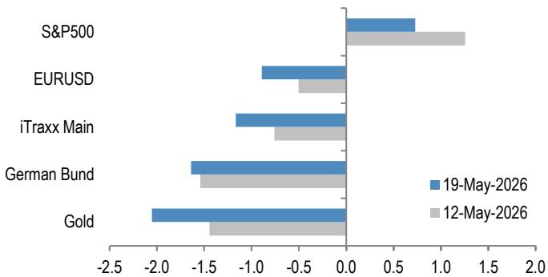

bar

| Index | 19-May-2026 | 12-May-2026 |
| :--- | :--- | :--- |
| S&P500 | 0.7 | 1.2 |
| EURUSD | -0.8 | -0.4 |
| iTraxx Main | -1.1 | -0.6 |
| German Bund | -1.5 | -1.3 |
| Gold | -2.0 | -1.3 |

Source: JPM Flows & Liquidity.

# Global Markets Strategy

20 May 2026

# Chart A11c: Equity market health map

Each of the six axes corresponds to a key indicator for markets. The position of the blue line on each axis shows how far the current observation is from the extremes at either end of the scale. Overall, the larger the blue area within the hexagon, the better the outlook for the S&P500. All variables are expressed as the percentile of the distribution that the observation falls into. I.e. a reading in the middle of the axis means that the observation falls exactly at the median of all historical observations. Turnover: Percentile rank of the 21-day rolling S&P500 turnover since 2007. Value: Inverse of percentile rank of our quarterly S&P 500 Equity Risk Premium (ERP) estimate since 1957 as described in "A fair value model for US Bonds, Credit and Equities", Panigirtzoglou and Loeys, Jun 2005. Positions: Percentile rank of the difference between government bonds and equity positioning from the cross-asset positioning monitor on the front page of our publication since 2016. Flows: Inverse of percentile rank of the difference between equity and bond fund flows from the cross-asset fund flow monitor on the front page of our publication since 2007. Economic momentum: Percentile rank of the 2-month change in the global manufacturing PMI since 1998, see "REVISITING: Using the Global PMI as trading signal", Nikolaos Panigirtzoglou, Jan 2012). Price momentum: Inverse of the percentile rank of the z-score of the difference in the momentum signal of S&P500 vs. 10y USTs since 2016 (based on the average z-score of Short- and Long-term momentum signal in our Trend Following Strategy framework shown in Tables A3 and A4 in the Appendix). China onshore A-share ETFs have been excluded. Last obs. as of $15^{\text{th}}$ May.

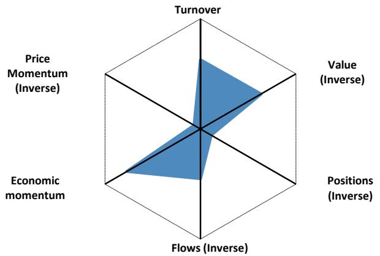

radar

| Metric               | Value |
| -------------------- | ----- |
| Turnover             | 100   |
| Value (Inverse)      | 80    |
| Positions (Inverse)  | 60    |
| Flows (Inverse)      | 70    |
| Economic momentum    | 90    |

Source: Bloomberg Finance L.P., JPM Flows & Liquidity.

Nikolaos Panigirtzoglou AC (44-20) 7134-7815 Mayur Yeole (91 22) 6157 3872   
nikolaos.panigirtzoglou@JPM.com   
JPM Securities plc   
Mika Inkinen (44-20) 7742 6565   
mika.j.inkinen@JPM.com   
JPM Securities plc   
Mayur Yeole (91 22) 6157 3872   
mayur.yeole@jpmchase.com  
JPM India Private Limited   
Krutik P Mehta (91-22) 6157-5016   
krutik.mehta@jpmchase.com  
JPM India Private Limited

Chart A11d: Implied probability of the S&P500 rising over the next six months with a cutoff set at 75%   
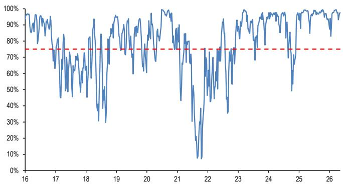

line

| Year | Value |
| ---- | ----- |
| 16   | 95%   |
| 17   | 80%   |
| 18   | 90%   |
| 19   | 85%   |
| 20   | 95%   |
| 21   | 80%   |
| 22   | 10%   |
| 23   | 90%   |
| 24   | 95%   |
| 25   | 90%   |
| 26   | 95%   |

Source: JPM Flows & Liquidity.

# Global Markets Strategy

# Flows & Liquidity

20 May 2026

Chart A11e: Logistic regression model for direction of the S&P 500 over a 6 month horizon & Ex-ante probability of an up-move from the logistic regression algorithm vs. the ex-post realised 6-month return in the S&P 500

In %.

Dependent Variable: S&500 UP (1) or DOWN (0) over the next six months

Method: ML - Binary Logit (Newton-Raphson / Marquardt steps)

Sample (adjusted): 1/08/2016 12/20/2024

Included observations: 468 after adjustments

Coefficient covariance computed using observed Hessian 

<table><tr><td>Variable</td><td>Coefficient</td><td>Std. Error</td><td>z-Statistic</td><td>Prob.</td></tr><tr><td>C</td><td>3.42</td><td>0.84</td><td>4.08</td><td>0.00</td></tr><tr><td>TURNOVER</td><td>2.97</td><td>0.72</td><td>4.15</td><td>0.00</td></tr><tr><td>VALUE</td><td>-3.47</td><td>0.90</td><td>-3.88</td><td>0.00</td></tr><tr><td>POSITIONS</td><td>-0.77</td><td>0.55</td><td>-1.39</td><td>0.16</td></tr><tr><td>FLOWS</td><td>-1.79</td><td>0.53</td><td>-3.38</td><td>0.00</td></tr><tr><td>ECON_MOMENTUM</td><td>3.35</td><td>0.62</td><td>5.42</td><td>0.00</td></tr><tr><td>MOMENTUM</td><td>-1.36</td><td>0.62</td><td>-2.19</td><td>0.03</td></tr></table>

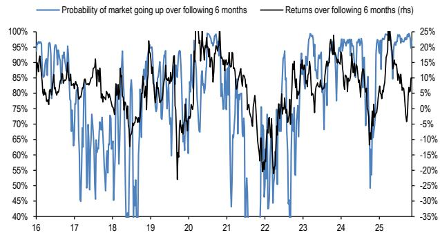

line

| Year | Probability of market going up over following 6 months | Returns over following 6 months (rhs) |
|------|--------------------------------------------------------|----------------------------------------|
| 16   | ~95%                                                   | ~20%                                   |
| 17   | ~70%                                                   | ~10%                                   |
| 18   | ~90%                                                   | ~5%                                    |
| 19   | ~85%                                                   | ~0%                                    |
| 20   | ~95%                                                   | ~25%                                   |
| 21   | ~80%                                                   | ~15%                                   |
| 22   | ~70%                                                   | ~-10%                                  |
| 23   | ~90%                                                   | ~10%                                   |
| 24   | ~95%                                                   | ~20%                                   |
| 25   | ~90%                                                   | ~-35%                                  |

Source: JPM Flows & Liquidity.

Nikolaos Panigirtzoglou AC (44-20) 7134-7815   
Mayur Yeole (91 22) 6157 3872   
nikolaos.panigirtzoglou@JPM.com   
mayur.yeole@jpmchase.com  
JPM Securities plc   
JPM India Private Limited   
Mika Inkinen (44-20) 7742 6565   
Krutik P Mehta (91-22) 6157-5016   
mika.j.inkinen@JPM.com   
krutik.mehta@jpmchase.com  
JPM Securities plc   
JPM India Private Limited

# Spec position monitor

# Chart A12: Weekly Spec Position Monitor

Net spec positions are proxied by the number of long contracts minus the number of short contracts using the speculative category of the Commitments of Traders reports (as reported by CFTC). To proxy for speculative investors for equity and US Treasury bond futures positions we use Asset managers and leveraged funds (see Chart A13), whereas for other assets we use the legacy Non-Commercial category. This net position is then converted to a dollar amount by multiplying by the contract size and then the corresponding futures price. We then scale the net positions by open interest. The chart shows the z-score of these net positions. US rates is a duration-weighted composite of the individual UST futures contracts excluding the Eurodollar contract.

Standard deviations from mean weekly position   
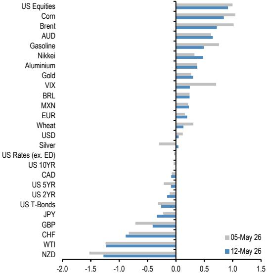

bar

| Entity | 05-May 26 | 12-May 26 |
| :--- | :--- | :--- |
| US Equities | 1.0 | 0.9 |
| Corn | 1.0 | 0.8 |
| Brent | 1.0 | 0.7 |
| AUD | 0.7 | 0.6 |
| Gasoline | 0.8 | 0.5 |
| Nikkei | 0.3 | 0.4 |
| Aluminium | 0.3 | 0.4 |
| Gold | 0.3 | 0.3 |
| VIX | 0.9 | 0.2 |
| BRL | 0.3 | 0.3 |
| MXN | 0.3 | 0.2 |
| EUR | 0.2 | 0.2 |
| Wheat | 0.3 | 0.1 |
| USD | -0.1 | -0.1 |
| Silver | -0.2 | -0.1 |
| US Rates (ex. ED) | -0.1 | -0.1 |
| US 10YR | -0.1 | -0.1 |
| CAD | -0.1 | -0.1 |
| US 5YR | -0.2 | -0.1 |
| US 2YR | -0.1 | -0.1 |
| US T-Bonds | -0.2 | -0.1 |
| JPY | -0.3 | -0.2 |
| GBP | -0.6 | -0.4 |
| CHF | -0.8 | -0.7 |
| WTI | -1.2 | -1.1 |
| NZD | -1.5 | -1.3 |

Source: Bloomberg Finance L.P., CFTC, JPM Flows & Liquidity.

# Chart A13: Positions in US equity futures by Asset managers and Leveraged funds

CFTC positions in US equity futures by Leveraged funds and Asset managers (as a % of open interest). It is an aggregate of the S&P500, DowJones, NASDAQ and their Mini futures contracts.

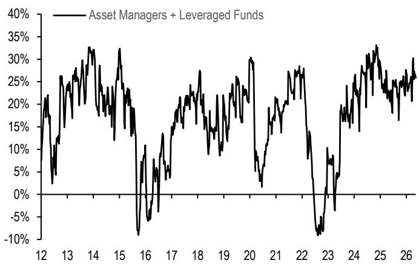

line

| Year | Asset Managers + Leveraged Funds |
| ---- | --------------------------------- |
| 12   | ~20%                              |
| 13   | ~25%                              |
| 14   | ~30%                              |
| 15   | ~25%                              |
| 16   | ~-10%                             |
| 17   | ~10%                              |
| 18   | ~20%                              |
| 19   | ~25%                              |
| 20   | ~30%                              |
| 21   | ~20%                              |
| 22   | ~-10%                             |
| 23   | ~-5%                              |
| 24   | ~25%                              |
| 25   | ~30%                              |
| 26   | ~25%                              |

Source: CFTC, Bloomberg Finance L.P. and JPM Flows & Liquidity.

# Global Markets Strategy

20 May 2026

# Chart A14: Spec position indicator on Risky vs. Safe currencies

Difference between net spec positions on risky & safe currencies. Net spec position is calculated in USD across 5 ‘risky’ and 3 ‘safe’ currencies (safe currencies also include Gold). These positions are then scaled by open interest and we take an average of ‘risky’ and ‘safe’ assets to create two series. The chart is then simply the difference between the “risky” and “safe” series. The final series shown in the chart below is demeaned using data since 2006. The risky currencies are: AUD, NZD, CAD, MXN and BRL. The safe currencies are: JPY, CHF and Gold.

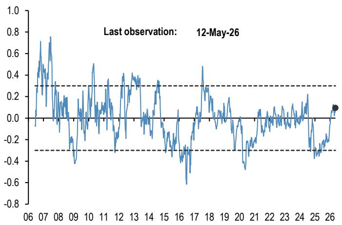

line

| Date       | Value |
| ---------- | ----- |
| 12-May-26  | 0.1   |

Source: Bloomberg Finance L.P., CFTC, JPM Flows & Liquidity.

# Chart A15: Spec position indicator on US equity futures vs. intermediate sector UST futures

Difference between net spec positions on US equity futures vs. intermediate sector UST futures. This indicator is derived by the difference between total CFTC positions in US equity futures by Asset managers + Leveraged Funds scaled by open interest minus the Asset managers + Leveraged Funds spec position on intermediate sector UST futures (i.e. all UST futures duration weighted ex ED and ex 2Y UST futures) also scaled by open interest.

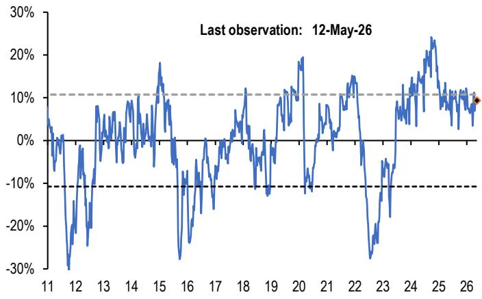

line

| Date       | Value  |
| ---------- | ------ |
| 12-May-26  | 10%    |

Source: CFTC, Bloomberg Finance L.P. and JPM Flows & Liquidity.

Nikolaos Panigirtzoglou AC (44-20) 7134-7815   
nikolaos.panigirtzoglou@JPM.com   
JPM Securities plc   
Mika Inkinen (44-20) 7742 6565   
mika.j.inkinen@JPM.com   
JPM Securities plc   
Mayur Yeole (91 22) 6157 3872   
mayur.yeole@jpmchase.com  
JPM India Private Limited   
Krutik P Mehta (91-22) 6157-5016   
krutik.mehta@jpmchase.com  
JPM India Private Limited

# Mutual fund and hedge fund betas

# Chart A16: 21-day rolling beta of 20 biggest active US bond mutual fund managers with respect to the US Agg Bond Index

The dotted line shows the average beta since 2013.

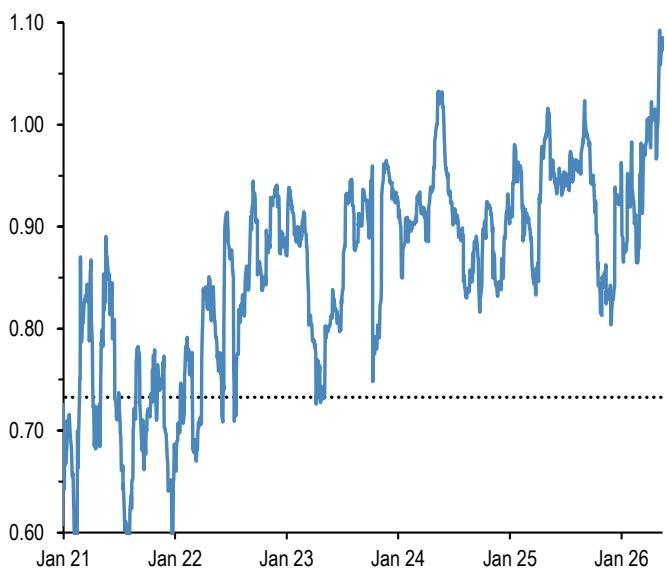

line

| Date   | Value |
|--------|-------|
| Jan 21 | 0.70  |
| Jan 22 | 0.85  |
| Jan 23 | 0.90  |
| Jan 24 | 1.05  |
| Jan 25 | 0.95  |
| Jan 26 | 1.10  |

Source: Bloomberg Finance L.P., JPM Flows & Liquidity.

# Chart A18: Performance of various types of investors

The table depicts the performance of various types of investors in % as of 19 $^{th}$ May 2025.

<table><tr><td>Date</td><td>2020</td><td>2021</td><td>2022</td><td>2023</td><td>2024</td><td>2025</td><td>2026</td></tr><tr><td colspan="8">Investors</td></tr><tr><td>Equity L/S</td><td>13.4%</td><td>9.3%</td><td>-7.0%</td><td>11.3%</td><td>13.0%</td><td>15.5%</td><td>5.4%</td></tr><tr><td>Macro ex-CTAs</td><td>4.9%</td><td>4.3%</td><td>11.5%</td><td>1.3%</td><td>6.0%</td><td>10.2%</td><td>4.3%</td></tr><tr><td>CTAs</td><td>1.2%</td><td>8.8%</td><td>14.7%</td><td>-2.5%</td><td>2.9%</td><td>-1.1%</td><td>8.6%</td></tr><tr><td>Risk Parity Funds</td><td>3.5%</td><td>4.7%</td><td>-18.6%</td><td>6.0%</td><td>5.0%</td><td>17.3%</td><td>5.5%</td></tr><tr><td>US Balanced MFs</td><td>13.2%</td><td>14.4%</td><td>-13.0%</td><td>13.8%</td><td>11.4%</td><td>14.4%</td><td>4.2%</td></tr><tr><td colspan="8">Benchmark</td></tr><tr><td>MSCI AC World</td><td>16.3%</td><td>16.4%</td><td>-18.4%</td><td>22.2%</td><td>17.5%</td><td>22.3%</td><td>8.2%</td></tr><tr><td>BARC Global Agg</td><td>5.6%</td><td>-2.5%</td><td>-11.2%</td><td>7.1%</td><td>3.4%</td><td>4.9%</td><td>-0.6%</td></tr><tr><td>S&amp;P Riskparity Vol 10</td><td>11.5%</td><td>12.8%</td><td>-16.2%</td><td>15.0%</td><td>5.4%</td><td>15.9%</td><td>12.2%</td></tr><tr><td>60 US Equity : 40 US Bonds</td><td>13.3%</td><td>14.8%</td><td>-15.4%</td><td>18.6%</td><td>16.4%</td><td>12.7%</td><td>4.6%</td></tr></table>

Source: Bloomberg Finance L.P., HFR, Pivotal Path, JPM Flows & Liquidity.

# Global Markets Strategy

# Flows & Liquidity

20 May 2026

# Chart A17: 21-day rolling beta of 20 biggest active Euro bond mutual fund managers with respect to the Euro Agg Bond Index

The dotted line shows the average beta since 2013.

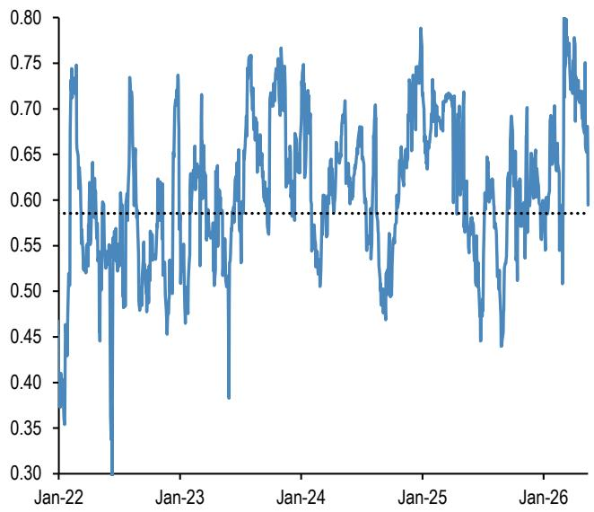

line

| Date   | Value |
|--------|-------|
| Jan-22 | 0.40  |
| Jan-22 | 0.35  |
| Jan-22 | 0.50  |
| Jan-22 | 0.75  |
| Jan-23 | 0.55  |
| Jan-23 | 0.60  |
| Jan-23 | 0.70  |
| Jan-23 | 0.65  |
| Jan-23 | 0.55  |
| Jan-23 | 0.45  |
| Jan-23 | 0.30  |
| Jan-24 | 0.60  |
| Jan-24 | 0.75  |
| Jan-24 | 0.65  |
| Jan-24 | 0.55  |
| Jan-24 | 0.45  |
| Jan-24 | 0.35  |
| Jan-25 | 0.65  |
| Jan-25 | 0.70  |
| Jan-25 | 0.60  |
| Jan-25 | 0.50  |
| Jan-25 | 0.45  |
| Jan-25 | 0.35  |
| Jan-26 | 0.70  |
| Jan-26 | 0.65  |
| Jan-26 | 0.55  |
| Jan-26 | 0.45  |
| Jan-26 | 0.35  |

Source: Bloomberg Finance L.P., JPM Flows & Liquidity.

# Chart A19: Momentum signals for 10Y UST and 10Y Bunds

Average z-score of Short- and Long-term momentum signal in our Trend Following Strategy framework shown in Tables A3 and A4 below in the Appendix.

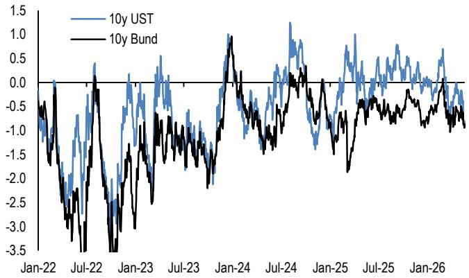

line

| Date   | 10y UST | 10y Bund |
|--------|---------|----------|
| Jan-22 | -0.5    | -0.7     |
| Jul-22 | -2.5    | -3.0     |
| Jan-23 | -0.5    | -1.0     |
| Jul-23 | 0.5     | -0.5     |
| Jan-24 | 1.0     | 0.5      |
| Jul-24 | 0.5     | -0.5     |
| Jan-25 | 0.0     | -1.0     |
| Jul-25 | 0.5     | -0.5     |
| Jan-26 | 0.0     | -1.0     |

Source: Bloomberg Finance L.P., JPM Flows & Liquidity.

<table><tr><td>Nikolaos Panigirtzoglou  $^{AC}$  (44-20) 7134-7815</td><td>Mayur Yeole (91 22) 6157 3872</td></tr><tr><td>nikolaos.panigirtzoglou@JPM.com</td><td>mayur.yeole@jpmchase.com</td></tr><tr><td>JPM Securities plc</td><td>JPM India Private Limited</td></tr><tr><td>Mika Inkinen (44-20) 7742 6565</td><td>Krutik P Mehta (91-22) 6157-5016</td></tr><tr><td>mika.j.inkinen@JPM.com</td><td>krutik.mehta@jpmchase.com</td></tr><tr><td>JPM Securities plc</td><td>JPM India Private Limited</td></tr></table>

# Chart A20: Momentum signals for S&P500

Average z-score of Short- and Long-term momentum signal in our Trend Following Strategy framework shown in Tables A3 and A4 below in the Appendix.

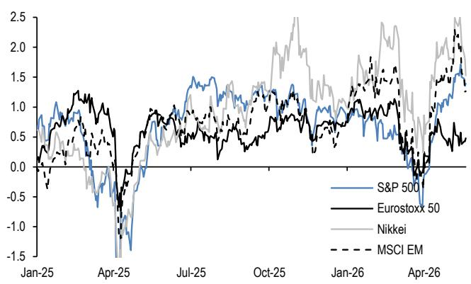

line

| Date   | S&P 500 | Eurostoxx 50 | Nikkei | MSCI EM |
|--------|---------|--------------|--------|---------|
| Jan-25 | 0.8     | 0.7          | 0.6    | 0.5     |
| Apr-25 | -1.2    | -1.0         | -0.8   | -0.6    |
| Jul-25 | 1.4     | 1.3          | 1.2    | 1.1     |
| Oct-25 | 1.6     | 1.5          | 1.4    | 1.3     |
| Jan-26 | 1.3     | 1.2          | 1.1    | 1.0     |
| Apr-26 | 1.5     | 1.4          | 1.3    | 1.2     |

Source: Bloomberg Finance L.P., JPM Flows & Liquidity.

# Chart A22: Equity beta of monthly reporting Equity Long/Short hedge funds

Proxied by the ratio of the monthly performance of Pivotal Path Asset-Weighted Equity Diversified hedge fund index divided by the monthly performance of MSCI AC World Index. Latest obs. is Apr 26 based on provisional data.

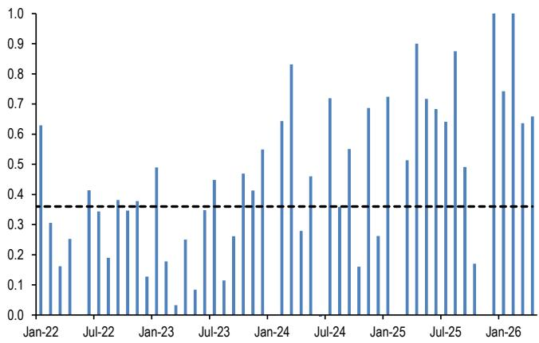

bar

| Date | Value |
|---|---|
| Jan-22 | 0.63 |
| Feb-22 | 0.31 |
| Mar-22 | 0.16 |
| Apr-22 | 0.25 |
| May-22 | 0.41 |
| Jun-22 | 0.34 |
| Jul-22 | 0.38 |
| Aug-22 | 0.35 |
| Sep-22 | 0.37 |
| Oct-22 | 0.13 |
| Nov-22 | 0.49 |
| Dec-22 | 0.18 |
| Jan-23 | 0.03 |
| Feb-23 | 0.25 |
| Mar-23 | 0.07 |
| Apr-23 | 0.35 |
| May-23 | 0.44 |
| Jun-23 | 0.11 |
| Jul-23 | 0.26 |
| Aug-23 | 0.47 |
| Sep-23 | 0.41 |
| Oct-23 | 0.54 |
| Nov-23 | 0.64 |
| Dec-23 | 0.83 |
| Jan-24 | 0.28 |
| Feb-24 | 0.45 |
| Mar-24 | 0.72 |
| Apr-24 | 0.55 |
| May-24 | 0.16 |
| Jun-24 | 0.68 |
| Jul-24 | 0.72 |
| Aug-24 | 0.51 |
| Sep-24 | 0.91 |
| Oct-24 | 0.71 |
| Nov-24 | 0.67 |
| Dec-24 | 0.64 |
| Jan-25 | 0.88 |
| Feb-25 | 0.49 |
| Mar-25 | 0.17 |
| Apr-25 | 0.99 |
| May-25 | 0.74 |
| Jun-25 | 0.99 |
| Jul-25 | 0.64 |
| Aug-25 | 0.66 |
| Sep-25 | 0.66 |
Dashed line at 0.35 for reference.

Source: Bloomberg Finance L.P., Pivotal Path, JPM Flows & Liquidity.

# Global Markets Strategy

20 May 2026

# Chart A21: Equity beta of US Balanced Mutual funds and Risk Parity funds

Rolling 42-day equity beta based on a bivariate regression of the daily returns of our Balanced Mutual fund and Risk Parity fund return indices to the daily returns of the S&P 500 and BarCap US Agg indices. Given that these funds invest in both equities and bonds we believe that the bivariate regression will be more suitable for these funds. Our risk parity index consists of 40 daily reporting Risk Parity funds. Our Balanced Mutual fund index includes the top 20 US-based active funds by assets and that have existed since 2006. Our Balanced Mutual fund index has a total AUM of \$700bn, which is around half of the total AUM of \$1.5tr of US based Balanced funds which we believe to be a good proxy of the overall industry It excludes tracker funds and funds with a low tracking error. Dotted lines are average since 2015.

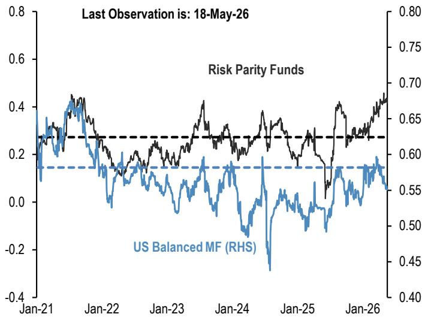

line

| Date    | Risk Parity Funds | US Balanced MF (RHS) |
|---------|-------------------|----------------------|
| Jan-21  | ~0.3              | ~0.4                 |
| Jan-22  | ~0.4              | ~0.2                 |
| Jan-23  | ~0.3              | ~0.1                 |
| Jan-24  | ~0.4              | ~0.0                 |
| Jan-25  | ~0.3              | ~-0.3                |
| Jan-26  | ~0.4              | ~0.1                 |

Source: Bloomberg Finance L.P., JPM Flows & Liquidity.

# Chart A23: USD exposure of currency hedge funds

The net spec position in the USD as reported by the CFTC. Spec is the non-commercial category from the CFTC.

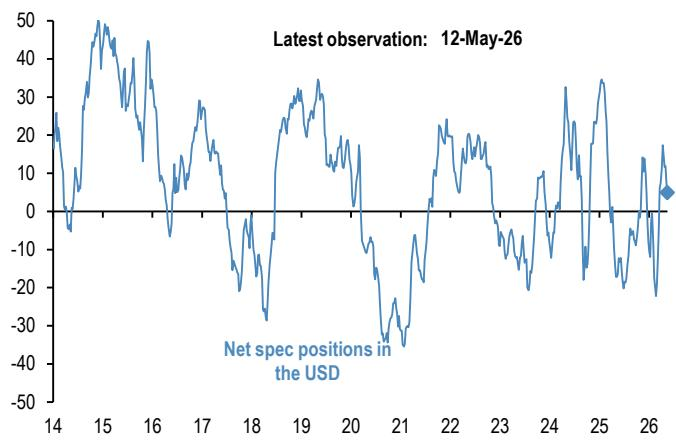

line

| Date       | Net spec positions in the USD |
| ---------- | ----------------------------- |
| 12-May-26  | 0                             |

Source: CFTC, BARC, Datastream, Bloomberg Finance L.P., JPM Flows & Liquidity.

# CTAs – Trend following investors' momentum indicators

# Table A3: Simple return momentum trading rules across various commodities

Optimal look-back period of each momentum strategy combined with a mean reversion indicator that turns signal neutral when momentum z-score more than 1.5 standard deviations above or below mean, and a filter that turns neutral when the z-score is low (below 0.05 and above -0.05) to avoid excessive trading. Look-backs, current signals and z-scores are shown for shorter-term and longer-term momentum separately, along with performance of a combined signal. Annualised return, volatility and information ratio of the signal; current signal; and z-score of the current return over the relevant look-back period; data from 1999 onward.

<table><tr><td colspan="2"></td><td>Lookback (moving avg, days)</td><td>Annualized return (%)</td><td>Vol (%)</td><td>IR</td><td>Current signal</td><td>Time since last change (days)</td><td>Z-score</td><td>% Change of return index from its moving average</td></tr><tr><td rowspan="2">WTI</td><td>short</td><td>21</td><td rowspan="2">5.8</td><td rowspan="2">22.7</td><td rowspan="2">0.26</td><td>1</td><td>0</td><td>1.4</td><td>8.8%</td></tr><tr><td>long</td><td>462</td><td>0</td><td>21</td><td>2.7</td><td>77.6%</td></tr><tr><td rowspan="2">Brent</td><td>short</td><td>84</td><td rowspan="2">4.7</td><td rowspan="2">21.5</td><td rowspan="2">0.22</td><td>0</td><td>56</td><td>2.5</td><td>30.2%</td></tr><tr><td>long</td><td>504</td><td>0</td><td>21</td><td>2.7</td><td>75.3%</td></tr><tr><td rowspan="2">Unleaded gas</td><td>short</td><td>105</td><td rowspan="2">2.7</td><td rowspan="2">23.2</td><td rowspan="2">0.12</td><td>0</td><td>54</td><td>3.1</td><td>42.9%</td></tr><tr><td>long</td><td>483</td><td>0</td><td>48</td><td>2.9</td><td>78.0%</td></tr><tr><td rowspan="2">Heat Oil</td><td>short</td><td>63</td><td rowspan="2">4.8</td><td rowspan="2">21.9</td><td rowspan="2">0.22</td><td>0</td><td>2</td><td>1.8</td><td>19.4%</td></tr><tr><td>long</td><td>483</td><td>0</td><td>55</td><td>3.6</td><td>108.6%</td></tr><tr><td rowspan="2">Gasoil</td><td>short</td><td>63</td><td rowspan="2">8.4</td><td rowspan="2">21.1</td><td rowspan="2">0.40</td><td>0</td><td>56</td><td>1.8</td><td>20.0%</td></tr><tr><td>long</td><td>378</td><td>0</td><td>55</td><td>3.8</td><td>107.6%</td></tr><tr><td rowspan="2">Nat gas</td><td>short</td><td>105</td><td rowspan="2">13.0</td><td rowspan="2">36.0</td><td rowspan="2">0.36</td><td>-1</td><td>47</td><td>-0.1</td><td>-2.2%</td></tr><tr><td>long</td><td>315</td><td>-1</td><td>76</td><td>-0.6</td><td>-16.9%</td></tr><tr><td rowspan="2">EU emission allowances</td><td>short</td><td>42</td><td rowspan="2">9.9</td><td rowspan="2">28.9</td><td rowspan="2">0.34</td><td>1</td><td>28</td><td>0.2</td><td>1.6%</td></tr><tr><td>long</td><td>483</td><td>0</td><td>5</td><td>0.0</td><td>-0.4%</td></tr><tr><td rowspan="2">1m fwd TTF Nat gas</td><td>short</td><td>21</td><td rowspan="2">36.8</td><td rowspan="2">31.4</td><td rowspan="2">1.17</td><td>1</td><td>6</td><td>1.4</td><td>13.2%</td></tr><tr><td>long</td><td>294</td><td>1</td><td>41</td><td>1.1</td><td>50.1%</td></tr><tr><td rowspan="2">Gold</td><td>short</td><td>21</td><td rowspan="2">3.1</td><td rowspan="2">10.6</td><td rowspan="2">0.29</td><td>-1</td><td>3</td><td>-1.2</td><td>-3.3%</td></tr><tr><td>long</td><td>483</td><td>0</td><td>316</td><td>1.8</td><td>23.6%</td></tr><tr><td rowspan="2">Silver</td><td>short</td><td>10</td><td rowspan="2">6.5</td><td rowspan="2">19.7</td><td rowspan="2">0.33</td><td>0</td><td>0</td><td>-2.0</td><td>-6.9%</td></tr><tr><td>long</td><td>462</td><td>0</td><td>168</td><td>2.3</td><td>54.4%</td></tr><tr><td rowspan="2">Palladium</td><td>short</td><td>42</td><td rowspan="2">11.9</td><td rowspan="2">23.0</td><td rowspan="2">0.52</td><td>-1</td><td>3</td><td>-1.1</td><td>-8.9%</td></tr><tr><td>long</td><td>273</td><td>-1</td><td>0</td><td>-0.2</td><td>-5.0%</td></tr><tr><td rowspan="2">Platinum</td><td>short</td><td>105</td><td rowspan="2">4.2</td><td rowspan="2">18.6</td><td rowspan="2">0.22</td><td>-1</td><td>3</td><td>-1.1</td><td>-10.3%</td></tr><tr><td>long</td><td>273</td><td>1</td><td>3</td><td>0.8</td><td>11.8%</td></tr><tr><td rowspan="2">Aluminium</td><td>short</td><td>105</td><td rowspan="2">5.9</td><td rowspan="2">15.2</td><td rowspan="2">0.39</td><td>1</td><td>2</td><td>1.4</td><td>10.5%</td></tr><tr><td>long</td><td>357</td><td>0</td><td>36</td><td>2.0</td><td>28.4%</td></tr><tr><td rowspan="2">Copper</td><td>short</td><td>147</td><td rowspan="2">7.3</td><td rowspan="2">17.3</td><td rowspan="2">0.42</td><td>1</td><td>68</td><td>0.6</td><td>7.4%</td></tr><tr><td>long</td><td>399</td><td>1</td><td>74</td><td>1.1</td><td>25.1%</td></tr><tr><td rowspan="2">Lead</td><td>short</td><td>126</td><td rowspan="2">0.7</td><td rowspan="2">19.3</td><td rowspan="2">0.04</td><td>-1</td><td>2</td><td>-0.2</td><td>-2.2%</td></tr><tr><td>long</td><td>357</td><td>-1</td><td>87</td><td>-0.3</td><td>-6.0%</td></tr><tr><td rowspan="2">Nickel</td><td>short</td><td>42</td><td rowspan="2">12.1</td><td rowspan="2">23.0</td><td rowspan="2">0.52</td><td>1</td><td>26</td><td>0.4</td><td>3.0%</td></tr><tr><td>long</td><td>336</td><td>1</td><td>100</td><td>0.5</td><td>13.5%</td></tr><tr><td rowspan="2">Zinc</td><td>short</td><td>126</td><td rowspan="2">7.9</td><td rowspan="2">19.6</td><td rowspan="2">0.41</td><td>1</td><td>36</td><td>0.6</td><td>7.1%</td></tr><tr><td>long</td><td>399</td><td>1</td><td>166</td><td>0.8</td><td>17.5%</td></tr><tr><td rowspan="2">Wheat</td><td>short</td><td>168</td><td rowspan="2">4.4</td><td rowspan="2">23.3</td><td rowspan="2">0.19</td><td>1</td><td>3</td><td>1.4</td><td>16.6%</td></tr><tr><td>long</td><td>294</td><td>1</td><td>26</td><td>0.9</td><td>14.6%</td></tr><tr><td rowspan="2">Kansas wheat</td><td>short</td><td>147</td><td rowspan="2">8.6</td><td rowspan="2">20.8</td><td rowspan="2">0.41</td><td>0</td><td>1</td><td>1.5</td><td>18.5%</td></tr><tr><td>long</td><td>483</td><td>1</td><td>23</td><td>0.6</td><td>11.6%</td></tr><tr><td rowspan="2">Corn</td><td>short</td><td>63</td><td rowspan="2">7.5</td><td rowspan="2">16.5</td><td rowspan="2">0.45</td><td>1</td><td>1</td><td>0.3</td><td>2.0%</td></tr><tr><td>long</td><td>399</td><td>-1</td><td>10</td><td>-0.1</td><td>-2.2%</td></tr><tr><td rowspan="2">Soybeans</td><td>short</td><td>42</td><td rowspan="2">4.9</td><td rowspan="2">14.5</td><td rowspan="2">0.34</td><td>1</td><td>1</td><td>0.3</td><td>1.7%</td></tr><tr><td>long</td><td>231</td><td>1</td><td>74</td><td>0.6</td><td>7.3%</td></tr><tr><td rowspan="2">Cotton</td><td>short</td><td>168</td><td rowspan="2">6.0</td><td rowspan="2">18.5</td><td rowspan="2">0.33</td><td>1</td><td>3</td><td>1.2</td><td>16.1%</td></tr><tr><td>long</td><td>483</td><td>1</td><td>24</td><td>0.4</td><td>8.7%</td></tr><tr><td rowspan="2">Sugar</td><td>short</td><td>63</td><td rowspan="2">6.2</td><td rowspan="2">21.6</td><td rowspan="2">0.29</td><td>1</td><td>7</td><td>0.3</td><td>2.5%</td></tr><tr><td>long</td><td>252</td><td>-1</td><td>3</td><td>-0.1</td><td>-2.7%</td></tr><tr><td rowspan="2">Coffee</td><td>short</td><td>63</td><td rowspan="2">8.0</td><td rowspan="2">23.8</td><td rowspan="2">0.34</td><td>-1</td><td>9</td><td>-0.7</td><td>-6.0%</td></tr><tr><td>long</td><td>273</td><td>-1</td><td>77</td><td>-0.8</td><td>-14.9%</td></tr><tr><td>Cocoa*</td><td></td><td>10</td><td>4.7</td><td>30.9</td><td>0.15</td><td>-1</td><td>2</td><td>-2.0</td><td>-7.4%</td></tr></table>

\* For cocoa, uses only short-term momentum and a z-score threshold of 3 rather than 1.5 as for other contracts.   
Source: Bloomberg Finance L.P., JPM Flows & Liquidity.

# Table A4: Simple return momentum trading rules across international equity indices, bond futures and FX

Optimal look-back period of each momentum strategy combined with a mean reversion indicator that turns signal neutral when momentum z-score more than 1.5 standard deviations above or below mean, and a filter that turns neutral when the z-score is low (below 0.05 and above -0.05) to avoid excessive trading. Look-backs, current signals and z-scores are shown for shorter-term and longer-term momentum separately, along with performance of a combined signal. Annualised return, volatility and information ratio of the signal; current signal; and z-score of the current return over the relevant look-back period; data from 1999 onward.

<table><tr><td colspan="2"></td><td>Lookback (moving avg, days)</td><td>Annualized return (%)</td><td>Vol (%)</td><td>IR</td><td>Current signal</td><td>Time since last change (days)</td><td>Z-score</td><td>% Change of return index from its moving average</td></tr><tr><td rowspan="2">S&amp;P 500</td><td>short</td><td>84</td><td rowspan="2">7.6</td><td rowspan="2">12.3</td><td rowspan="2">0.62</td><td>1</td><td>2</td><td>1.3</td><td>6.5%</td></tr><tr><td>long</td><td>315</td><td>1</td><td>1</td><td>1.4</td><td>14.6%</td></tr><tr><td rowspan="2">Nasdaq 100</td><td>short</td><td>84</td><td rowspan="2">9.9</td><td rowspan="2">16.2</td><td rowspan="2">0.61</td><td>0</td><td>9</td><td>1.6</td><td>12.3%</td></tr><tr><td>long</td><td>462</td><td>1</td><td>2</td><td>1.4</td><td>27.6%</td></tr><tr><td rowspan="2">Nikkei</td><td>short</td><td>63</td><td rowspan="2">3.9</td><td rowspan="2">13.3</td><td rowspan="2">0.29</td><td>1</td><td>2</td><td>1.1</td><td>6.4%</td></tr><tr><td>long</td><td>420</td><td>0</td><td>34</td><td>2.5</td><td>37.3%</td></tr><tr><td rowspan="2">FTSE 100</td><td>short</td><td>168</td><td rowspan="2">5.2</td><td rowspan="2">12.1</td><td rowspan="2">0.43</td><td>1</td><td>53</td><td>0.6</td><td>4.1%</td></tr><tr><td>long</td><td>504</td><td>0</td><td>1</td><td>1.6</td><td>18.0%</td></tr><tr><td rowspan="2">Eurostoxx 50</td><td>short</td><td>168</td><td rowspan="2">4.7</td><td rowspan="2">16.6</td><td rowspan="2">0.28</td><td>1</td><td>29</td><td>0.3</td><td>2.4%</td></tr><tr><td>long</td><td>294</td><td>1</td><td>36</td><td>0.6</td><td>6.7%</td></tr><tr><td rowspan="2">MSCI EM</td><td>short</td><td>42</td><td rowspan="2">12.9</td><td rowspan="2">11.5</td><td rowspan="2">1.12</td><td>1</td><td>2</td><td>0.9</td><td>4.4%</td></tr><tr><td>long</td><td>357</td><td>0</td><td>25</td><td>1.7</td><td>26.3%</td></tr><tr><td rowspan="2">HYG credit</td><td>short</td><td>168</td><td rowspan="2">0.4</td><td rowspan="2">3.4</td><td rowspan="2">0.12</td><td>0</td><td>59</td><td>0.0</td><td>0.0%</td></tr><tr><td>long</td><td>273</td><td>1</td><td>0</td><td>0.1</td><td>0.3%</td></tr><tr><td rowspan="2">LQD credit</td><td>short</td><td>10</td><td rowspan="2">2.6</td><td rowspan="2">6.5</td><td rowspan="2">0.41</td><td>0</td><td>10</td><td>0.0</td><td>0.0%</td></tr><tr><td>long</td><td>189</td><td>-1</td><td>0</td><td>-0.2</td><td>-0.8%</td></tr><tr><td rowspan="2">2Y USTs</td><td>short</td><td>252</td><td rowspan="2">0.9</td><td rowspan="2">1.1</td><td rowspan="2">0.78</td><td>-1</td><td>56</td><td>-1.0</td><td>-1.2%</td></tr><tr><td>long</td><td>462</td><td>-1</td><td>54</td><td>-0.6</td><td>-1.2%</td></tr><tr><td rowspan="2">5Y USTs</td><td>short</td><td>252</td><td rowspan="2">1.6</td><td rowspan="2">2.8</td><td rowspan="2">0.55</td><td>-1</td><td>49</td><td>-0.9</td><td>-2.3%</td></tr><tr><td>long</td><td>420</td><td>-1</td><td>20</td><td>-0.5</td><td>-1.9%</td></tr><tr><td rowspan="2">10Y USTs</td><td>short</td><td>42</td><td rowspan="2">2.0</td><td rowspan="2">3.6</td><td rowspan="2">0.57</td><td>-1</td><td>20</td><td>-1.3</td><td>-1.8%</td></tr><tr><td>long</td><td>441</td><td>-1</td><td>20</td><td>-0.5</td><td>-2.4%</td></tr><tr><td rowspan="2">2Y Schatz</td><td>short</td><td>189</td><td rowspan="2">0.6</td><td rowspan="2">0.8</td><td rowspan="2">0.82</td><td>-1</td><td>25</td><td>-1.3</td><td>-1.1%</td></tr><tr><td>long</td><td>504</td><td>0</td><td>2</td><td>-1.6</td><td>-2.7%</td></tr><tr><td rowspan="2">5y Bobl</td><td>short</td><td>63</td><td rowspan="2">1.4</td><td rowspan="2">1.9</td><td rowspan="2">0.73</td><td>-1</td><td>29</td><td>-1.1</td><td>-1.0%</td></tr><tr><td>long</td><td>483</td><td>-1</td><td>306</td><td>-1.1</td><td>-3.7%</td></tr><tr><td rowspan="2">10y Bund</td><td>short</td><td>105</td><td rowspan="2">2.2</td><td rowspan="2">3.4</td><td rowspan="2">0.65</td><td>-1</td><td>53</td><td>-0.9</td><td>-1.9%</td></tr><tr><td>long</td><td>462</td><td>-1</td><td>655</td><td>-1.0</td><td>-4.9%</td></tr><tr><td rowspan="2">10Y JGB</td><td>short</td><td>126</td><td rowspan="2">0.9</td><td rowspan="2">2.3</td><td rowspan="2">0.37</td><td>0</td><td>6</td><td>-2.7</td><td>-2.8%</td></tr><tr><td>long</td><td>273</td><td>0</td><td>53</td><td>-3.2</td><td>-4.7%</td></tr><tr><td rowspan="2">10Y Gilts</td><td>short</td><td>42</td><td rowspan="2">2.3</td><td rowspan="2">4.0</td><td rowspan="2">0.57</td><td>-1</td><td>0</td><td>-1.3</td><td>-2.1%</td></tr><tr><td>long</td><td>399</td><td>-1</td><td>182</td><td>-1.3</td><td>-6.9%</td></tr><tr><td rowspan="2">10y OAT vs Bund</td><td>short</td><td>189</td><td rowspan="2">0.4</td><td rowspan="2">1.5</td><td rowspan="2">0.28</td><td>1</td><td>36</td><td>0.7</td><td>0.6%</td></tr><tr><td>long</td><td>294</td><td>1</td><td>57</td><td>0.8</td><td>0.8%</td></tr><tr><td rowspan="2">10y BTP vs. Bund</td><td>short</td><td>84</td><td rowspan="2">2.3</td><td rowspan="2">6.3</td><td rowspan="2">0.36</td><td>0</td><td>2</td><td>0.0</td><td>-0.1%</td></tr><tr><td>long</td><td>273</td><td>1</td><td>13</td><td>0.1</td><td>0.6%</td></tr><tr><td rowspan="2">Euro</td><td>short</td><td>42</td><td rowspan="2">3.3</td><td rowspan="2">6.4</td><td rowspan="2">0.51</td><td>-1</td><td>3</td><td>-0.5</td><td>-1.0%</td></tr><tr><td>long</td><td>273</td><td>-1</td><td>56</td><td>-0.6</td><td>-3.3%</td></tr><tr><td rowspan="2">Yen</td><td>short</td><td>21</td><td rowspan="2">3.6</td><td rowspan="2">6.3</td><td rowspan="2">0.56</td><td>-1</td><td>3</td><td>-0.5</td><td>-0.8%</td></tr><tr><td>long</td><td>462</td><td>-1</td><td>13</td><td>-1.4</td><td>-11.5%</td></tr><tr><td rowspan="2">Sterling</td><td>short</td><td>168</td><td rowspan="2">1.3</td><td rowspan="2">7.1</td><td rowspan="2">0.19</td><td>-1</td><td>5</td><td>-0.3</td><td>-1.3%</td></tr><tr><td>long</td><td>294</td><td>-1</td><td>58</td><td>-0.4</td><td>-2.3%</td></tr><tr><td rowspan="2">AUD</td><td>short</td><td>42</td><td rowspan="2">3.9</td><td rowspan="2">7.8</td><td rowspan="2">0.49</td><td>0</td><td>0</td><td>0.0</td><td>-0.1%</td></tr><tr><td>long</td><td>420</td><td>1</td><td>83</td><td>0.5</td><td>4.3%</td></tr><tr><td rowspan="2">CAD</td><td>short</td><td>168</td><td rowspan="2">1.3</td><td rowspan="2">5.9</td><td rowspan="2">0.22</td><td>-1</td><td>11</td><td>-0.4</td><td>-1.3%</td></tr><tr><td>long</td><td>504</td><td>-1</td><td>293</td><td>-0.7</td><td>-4.8%</td></tr><tr><td rowspan="2">G10 FX</td><td>short</td><td>42</td><td rowspan="2">2.1</td><td rowspan="2">5.2</td><td rowspan="2">0.40</td><td>1</td><td>0</td><td>0.2</td><td>0.4%</td></tr><tr><td>long</td><td>189</td><td>1</td><td>3</td><td>0.2</td><td>0.8%</td></tr><tr><td rowspan="2">EMCI</td><td>short</td><td>42</td><td rowspan="2">2.6</td><td rowspan="2">5.0</td><td rowspan="2">0.53</td><td>1</td><td>21</td><td>0.4</td><td>0.7%</td></tr><tr><td>long</td><td>189</td><td>1</td><td>222</td><td>0.8</td><td>3.3%</td></tr></table>

Source: Bloomberg Finance L.P., JPM Flows & Liquidity.

Nikolaos Panigirtzoglou AC (44-20) 7134-7815   
Mayur Yeole (91 22) 6157 3872   
nikolaos.panigirtzoglou@JPM.com   
mayur.yeole@jpmchase.com  
JPM Securities plc   
JPM India Private Limited   
Mika Inkinen (44-20) 7742 6565   
Krutik P Mehta (91-22) 6157-5016   
mika.j.inkinen@JPM.com   
krutik.mehta@jpmchase.com  
JPM Securities plc   
JPM India Private Limited

# Corporate Activity

# Chart A24: G4 non-financial corporate capex and cash flow as % of GDP

% of GDP, G4 includes the US, the UK, the Euro area and Japan. Last observation as of Q4 2025.

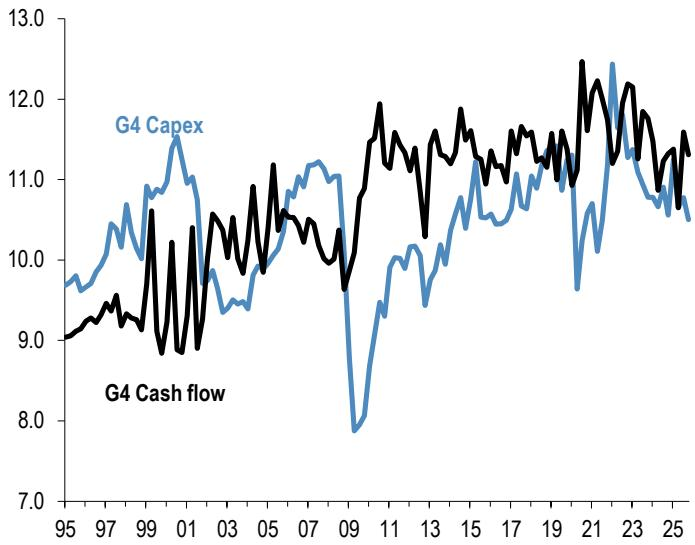

line

| Year | G4 Capex | G4 Cash flow |
|------|----------|--------------|
| 95   | ~9.0     | ~9.0         |
| 97   | ~9.5     | ~9.5         |
| 99   | ~10.5    | ~10.5        |
| 01   | ~11.5    | ~11.5        |
| 03   | ~10.0    | ~10.0        |
| 05   | ~10.5    | ~10.5        |
| 07   | ~11.0    | ~11.0        |
| 09   | ~8.0     | ~8.0         |
| 11   | ~11.5    | ~11.5        |
| 13   | ~11.0    | ~11.0        |
| 15   | ~11.5    | ~11.5        |
| 17   | ~11.0    | ~11.0        |
| 19   | ~11.5    | ~11.5        |
| 21   | ~12.5    | ~12.5        |
| 23   | ~12.0    | ~12.0        |
| 25   | ~11.5    | ~11.5        |

Source: ECB, BOJ, BOE, Federal Reserve flow of funds, JPM Flows & Liquidity.

# Chart A26: Global M&A and LBO

\$tr. M&A and LBOs are announced.

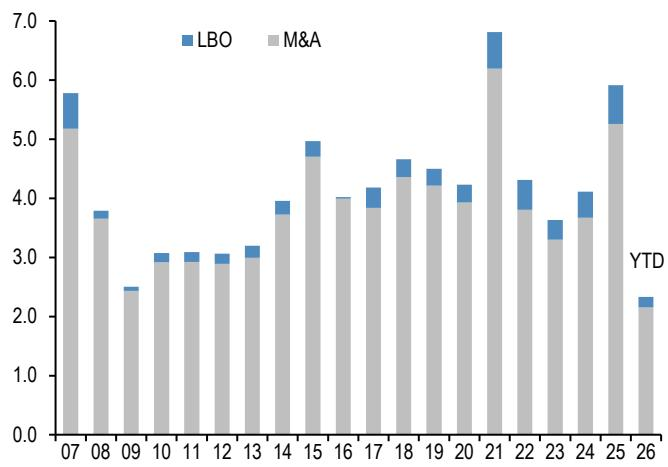

bar_stacked

| Year | LBO  | M&A  |
|------|------|------|
| 07   | 0.8  | 5.2  |
| 08   | 0.3  | 3.7  |
| 09   | 0.1  | 2.4  |
| 10   | 0.3  | 3.0  |
| 11   | 0.3  | 3.0  |
| 12   | 0.3  | 2.9  |
| 13   | 0.3  | 3.1  |
| 14   | 0.3  | 3.8  |
| 15   | 0.4  | 4.7  |
| 16   | 0.0  | 4.0  |
| 17   | 0.4  | 3.8  |
| 18   | 0.4  | 4.4  |
| 19   | 0.4  | 4.2  |
| 20   | 0.4  | 4.0  |
| 21   | 0.8  | 6.2  |
| 22   | 0.5  | 3.8  |
| 23   | 0.4  | 3.3  |
| 24   | 0.5  | 3.6  |
| 25   | 0.6  | 5.2  |
| YTD  | 0.2  | 2.2  |

Source: Dealogic, JPM Flows & Liquidity.

# Global Markets Strategy

20 May 2026

# Chart A25: G4 non-financial corporate sector net debt and equity issuance

\$tr per quarter, G4 includes the US, the UK, the Euro area and Japan. Last observation as of Q4 2025.

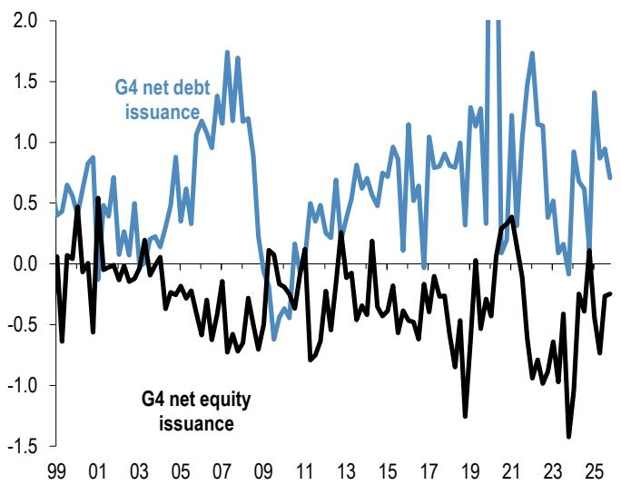

line

| Year | G4 net debt issuance | G4 net equity issuance |
|------|----------------------|------------------------|
| 99   | ~0.5                 | ~0.0                   |
| 01   | ~0.8                 | ~0.5                   |
| 03   | ~0.6                 | ~0.0                   |
| 05   | ~1.0                 | ~-0.5                  |
| 07   | ~1.7                 | ~-0.8                  |
| 09   | ~1.2                 | ~-0.5                  |
| 11   | ~0.5                 | ~-0.8                  |
| 13   | ~0.8                 | ~-0.5                  |
| 15   | ~1.0                 | ~-0.2                  |
| 17   | ~1.2                 | ~-0.5                  |
| 19   | ~1.5                 | ~-1.2                  |
| 21   | ~2.0                 | ~0.4                   |
| 23   | ~1.7                 | ~-1.5                  |
| 25   | ~1.4                 | ~-0.8                  |

Source: ECB, BOJ, BOE, Federal Reserve flow of funds, JPM Flows & Liquidity.

# Chart A27: US and non-US share buyback

\$bn, are as of May 26. Buybacks are as announced.

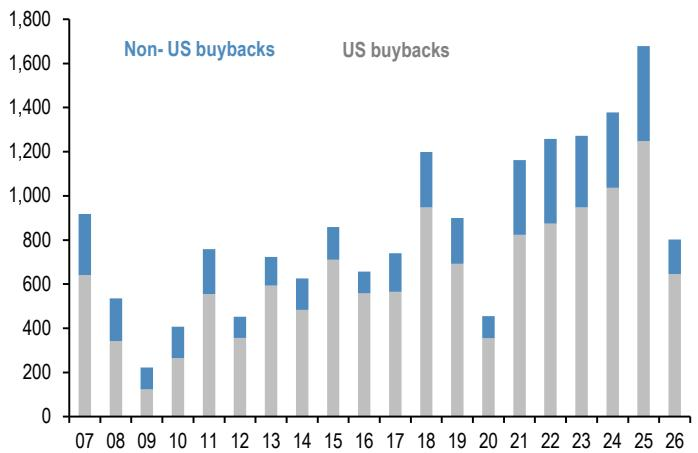

bar_stacked

| Year | US buybacks | Non-US buybacks |
| :--- | :--- | :--- |
| 07 | 630 | 410 |
| 08 | 340 | 310 |
| 09 | 100 | 110 |
| 10 | 250 | 210 |
| 11 | 560 | 310 |
| 12 | 350 | 150 |
| 13 | 590 | 180 |
| 14 | 480 | 210 |
| 15 | 710 | 230 |
| 16 | 560 | 140 |
| 17 | 570 | 140 |
| 18 | 940 | 360 |
| 19 | 690 | 280 |
| 20 | 360 | 120 |
| 21 | 820 | 420 |
| 22 | 870 | 430 |
| 23 | 940 | 420 |
| 24 | 1020 | 480 |
| 25 | 1240 | 530 |
| 26 | 640 | 230 |
The chart displays a stacked bar chart comparing the total number of buybacks for each year from 2007 to 2026. The labels 'Non-US buybacks' and 'US buybacks' are present above the bars.

Source: Bloomberg Finance L.P., LSEG, JPM Flows & Liquidity.

<table><tr><td>Nikolaos Panigirtzoglou  $^{AC}$  (44-20) 7134-7815</td><td>Mayur Yeole (91 22) 6157 3872</td></tr><tr><td>nikolaos.panigirtzoglou@JPM.com</td><td>mayur.yeole@jpmchase.com</td></tr><tr><td>JPM Securities plc</td><td>JPM India Private Limited</td></tr><tr><td>Mika Inkinen (44-20) 7742 6565</td><td>Krutik P Mehta (91-22) 6157-5016</td></tr><tr><td>mika.j.inkinen@JPM.com</td><td>krutik.mehta@jpmchase.com</td></tr><tr><td>JPM Securities plc</td><td>JPM India Private Limited</td></tr></table>

# Pension fund and insurance company flows

# Chart A28: G4 pension funds and insurance companies equity and bond flows

Equity and bond buying in \$bn per quarter. G4 includes the US, the UK, Euro area and Japan. Last observation is Q4 2025.

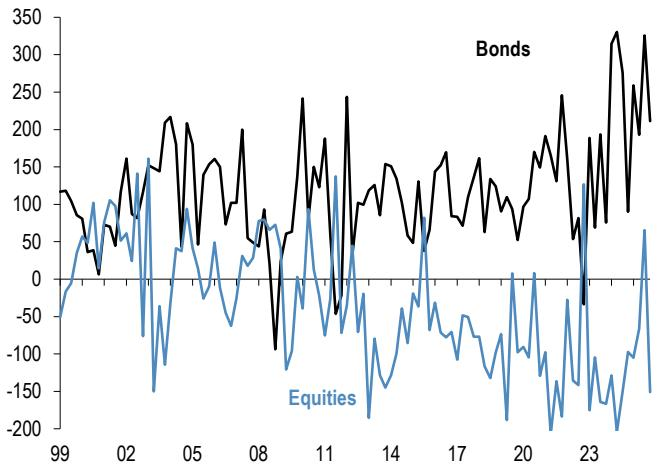

line

| Year | Bonds | Equities |
|------|-------|----------|
| 99   | 120   | -50      |
| 02   | 150   | 100      |
| 05   | 200   | 50       |
| 08   | 100   | -50      |
| 11   | 250   | 100      |
| 14   | 150   | -100     |
| 17   | 100   | -50      |
| 20   | 200   | -100     |
| 23   | 300   | -150     |
| 26   | 250   | -100     |

Source: ECB, BOJ, BOE, Federal Reserve flow of funds, JPM Flows & Liquidity.

# Chart A30: Pension fund deficits

US\$bn. For US, funded status of the 100 largest corporate defined benefit pension plans, from Milliman. For UK, funded status of the defined benefit schemes eligible for entry to the Pension Protection Fund, converted to US\$ at today's exchange rates. Last obs. is Apr'26 for US & UK.

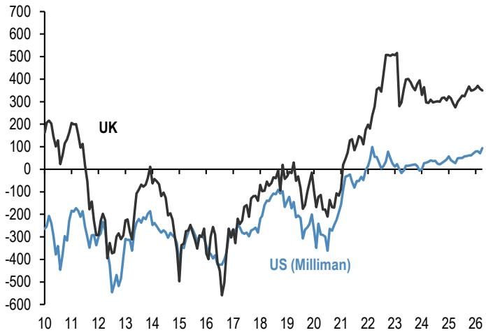

line

| Year | UK    | US (Milliman) |
|------|-------|---------------|
| 10   | 200   | -200          |
| 11   | 200   | -200          |
| 12   | -200  | -300          |
| 13   | -200  | -400          |
| 14   | 0     | -200          |
| 15   | -200  | -300          |
| 16   | -200  | -400          |
| 17   | -600  | -300          |
| 18   | -100  | -200          |
| 19   | 0     | -100          |
| 20   | -100  | -200          |
| 21   | 100   | -100          |
| 22   | 300   | 100           |
| 23   | 500   | 50            |
| 24   | 300   | 50            |
| 25   | 350   | 75            |
| 26   | 350   | 100           |

Source: Milliman, UK Pension Protection Fund, JPM Flows & Liquidity.

# Global Markets Strategy

# Flows & Liquidity

20 May 2026

# Chart A29: G4 pension funds and insurance companies equity and bond levels

Equity and bond as % of total assets per quarter. G4 includes the US, the UK, Euro area and Japan. Last observation is Q4 2025.

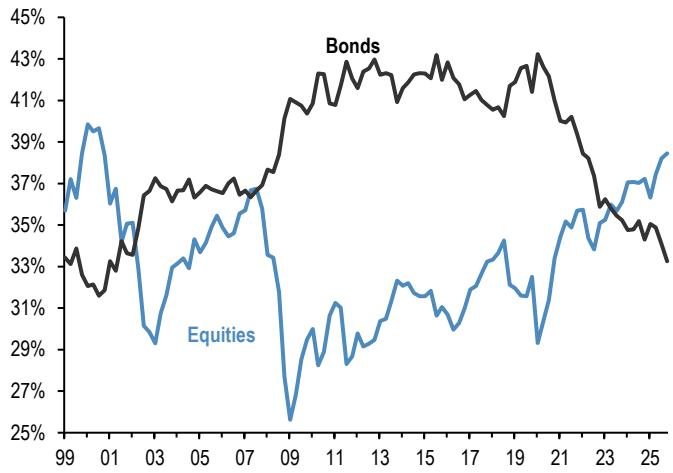

line

| Year | Bonds | Equities |
|------|-------|----------|
| 99   | 33%   | 37%      |
| 01   | 35%   | 39%      |
| 03   | 37%   | 29%      |
| 05   | 38%   | 33%      |
| 07   | 37%   | 36%      |
| 09   | 41%   | 26%      |
| 11   | 43%   | 31%      |
| 13   | 42%   | 29%      |
| 15   | 43%   | 31%      |
| 17   | 42%   | 33%      |
| 19   | 43%   | 35%      |
| 21   | 41%   | 29%      |
| 23   | 37%   | 35%      |
| 25   | 33%   | 39%      |

Source: ECB, BOJ, BOE, Federal Reserve flow of funds, JPM Flows & Liquidity.

# Chart A31: G4 pension funds and insurance companies cash and alternatives levels

Cash and alternative investments as % of total assets per quarter. G4 includes the US, the UK, Euro area and Japan. Last observation is Q4 2025.

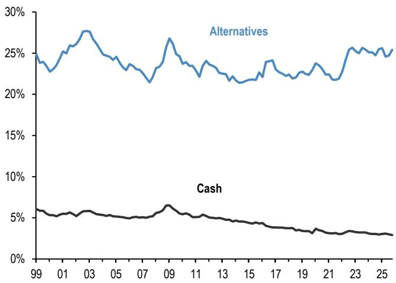

line

| Year | Alternatives | Cash |
|------|--------------|------|
| 99   | 24%          | 5%   |
| 01   | 25%          | 5%   |
| 03   | 27%          | 5%   |
| 05   | 24%          | 5%   |
| 07   | 22%          | 5%   |
| 09   | 27%          | 6%   |
| 11   | 24%          | 5%   |
| 13   | 23%          | 4%   |
| 15   | 22%          | 4%   |
| 17   | 24%          | 3%   |
| 19   | 23%          | 3%   |
| 21   | 22%          | 3%   |
| 23   | 25%          | 3%   |
| 25   | 25%          | 3%   |

Source: ECB, BOJ, BOE, Federal Reserve flow of funds, JPM Flows & Liquidity.

Nikolaos Panigirtzoglou AC (44-20) 7134-7815   
nikolaos.panigirtzoglou@JPM.com   
JPM Securities plc   
Mika Inkinen (44-20) 7742 6565   
mika.j.inkinen@JPM.com   
JPM Securities plc   
Mayur Yeole (91 22) 6157 3872   
mayur.yeole@jpmchase.com  
JPM India Private Limited   
Krutik P Mehta (91-22) 6157-5016   
krutik.mehta@jpmchase.com  
JPM India Private Limited

# Credit Creation

# Chart A32: Credit creation in the US, Japan and Euro area

Rolling sum of 4-quarter credit creation as % of GDP. Credit creation includes both bank loans as well as net debt issuance by non-financial corporations and households. Last obs. is Q4'25 for Japan, Euro Area and US.

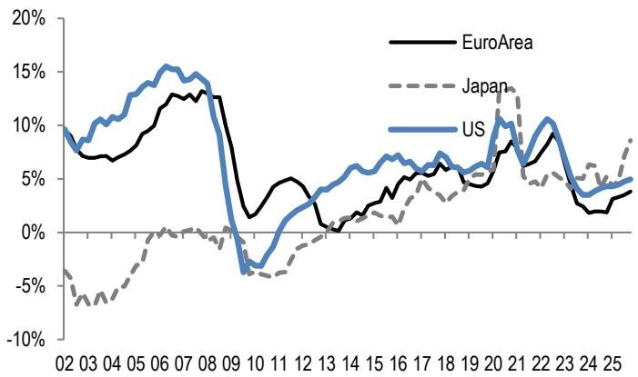

line

| Year | EuroArea | Japan | US   |
|------|----------|-------|------|
| 02   | 10%      | -5%   | 10%  |
| 03   | 8%       | -6%   | 8%   |
| 04   | 7%       | -7%   | 10%  |
| 05   | 9%       | -5%   | 12%  |
| 06   | 12%      | -2%   | 15%  |
| 07   | 13%      | 0%    | 14%  |
| 08   | 12%      | -1%   | 13%  |
| 09   | 1%       | -3%   | -5%  |
| 10   | -2%      | -4%   | -4%  |
| 11   | -1%      | -5%   | -3%  |
| 12   | 0%       | -4%   | -2%  |
| 13   | 1%       | -3%   | 0%   |
| 14   | 2%       | -2%   | 1%   |
| 15   | 3%       | 0%    | 2%   |
| 16   | 4%       | 1%    | 3%   |
| 17   | 5%       | 2%    | 4%   |
| 18   | 6%       | 3%    | 5%   |
| 19   | 7%       | 4%    | 6%   |
| 20   | 8%       | 5%    | 7%   |
| 21   | 9%       | 6%    | 8%   |
| 22   | 10%      | 7%    | 9%   |
| 23   | 8%       | 6%    | 7%   |
| 24   | 6%       | 5%    | 5%   |
| 25   | 5%       | 4%    | 4%   |

Source: Fed, ECB, BoJ, Bloomberg Finance L.P., and JPM Flows & Liquidity.

# Chart A34: Monthly net issuance of US HG bonds

\$bn. Up to May 14 $^{th}$ .

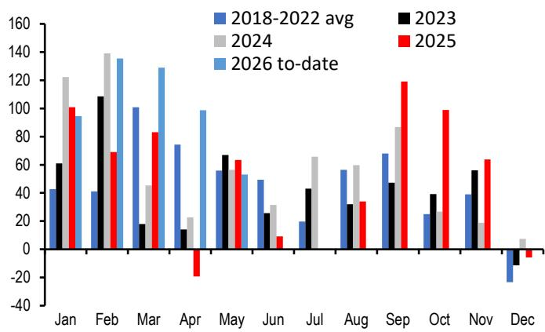

bar

| Month | 2018-2022 avg | 2023 | 2024 | 2025 | 2026 to-date |
|---|---|---|---|---|---|
| Jan | 42 | 61 | 122 | 100 | 94 |
| Feb | 41 | 108 | 140 | 69 | 135 |
| Mar | 101 | 17 | 45 | 83 | 129 |
| Apr | 74 | 13 | 22 | -17 | 99 |
| May | 56 | 67 | 65 | 63 | 53 |
| Jun | 50 | 25 | 30 | 8 | |
| Jul | 18 | 43 | 65 | 0 | |
| Aug | 56 | 31 | 60 | 33 | |
| Sep | 68 | 47 | 87 | 119 | |
| Oct | 24 | 39 | 25 | 99 | |
| Nov | 38 | 56 | 17 | 64 | |
| Dec | -23 | -8 | 7 | -5 | |

Source: Dealogic, JPM Flows & Liquidity.

# Global Markets Strategy

20 May 2026

# Chart A33: Credit creation in EM

Rolling sum of 4-quarter credit creation as % of GDP. Credit creation includes both bank loans as well as net debt issuance by non-financial corporations and households. The chart uses the FX rates as of the latest observation to calculate the credit creation at constant exchange rates. Last obs. is for Q2'25.

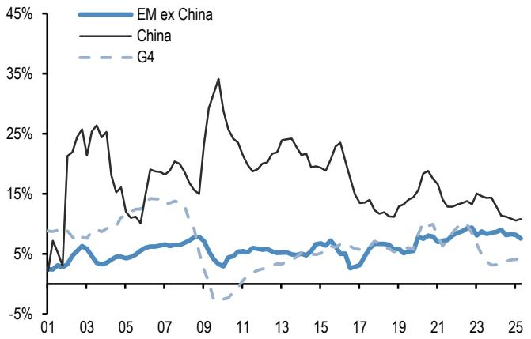

line

| Year | EM ex China | China | G4 |
|------|-------------|-------|----|
| 01   | ~3%         | ~3%   | ~6% |
| 03   | ~5%         | ~25%  | ~8% |
| 05   | ~4%         | ~15%  | ~10% |
| 07   | ~5%         | ~18%  | ~12% |
| 09   | ~6%         | ~35%  | ~10% |
| 11   | ~5%         | ~20%  | ~5% |
| 13   | ~5%         | ~22%  | ~5% |
| 15   | ~6%         | ~20%  | ~5% |
| 17   | ~5%         | ~15%  | ~5% |
| 19   | ~6%         | ~18%  | ~6% |
| 21   | ~7%         | ~15%  | ~8% |
| 23   | ~7%         | ~12%  | ~5% |
| 25   | ~7%         | ~10%  | ~4% |

Source: G4 Central banks FoF, BIS, ICI, Barcap, Bloomberg Finance L.P., IMF, and JPM Flows & Liquidity.

# Table A5: Equity and Bond issuance

\$bn, Equity supply and corporate announcements are based on announced deals, not completed. M&A is announced deal value and buybacks are announced transactions. Y/Y change is change in YTD announcements over the same period last year.

<table><tr><td>Equity Supply</td><td>8-May</td><td>4 wk avg</td><td>13 wk avg</td><td>y/y chng</td></tr><tr><td>Global IPOs</td><td>3.2</td><td>5.3</td><td>3.6</td><td>79%</td></tr><tr><td>Secondary Offerings</td><td>9.5</td><td>10.0</td><td>10.3</td><td>25%</td></tr><tr><td colspan="5">Corporate announcements</td></tr><tr><td>M&amp;A - Global</td><td>148.7</td><td>127.7</td><td>127.8</td><td>33%</td></tr><tr><td>- US Target</td><td>97.6</td><td>60.0</td><td>60.2</td><td>53%</td></tr><tr><td>- Non-US Target</td><td>51.0</td><td>67.7</td><td>67.6</td><td>19%</td></tr><tr><td>Net bond issuance</td><td>Feb-26</td><td>3 mth avg</td><td>YTD avg</td><td>y/y chng</td></tr><tr><td>USD</td><td>8</td><td>144</td><td>179</td><td>-50%</td></tr><tr><td>Non-USD</td><td>162</td><td>129</td><td>277</td><td>-4%</td></tr></table>

Source: Bloomberg Finance L.P., Dealogic, Thomson Reuters, JPM Flows & Liquidity.

<table><tr><td>Nikolaos Panigirtzoglou  $^{AC}$  (44-20) 7134-7815</td><td>Mayur Yeole (91 22) 6157 3872</td></tr><tr><td>nikolaos.panigirtzoglou@JPM.com</td><td>mayur.yeole@jpmchase.com</td></tr><tr><td>JPM Securities plc</td><td>JPM India Private Limited</td></tr><tr><td>Mika Inkinen (44-20) 7742 6565</td><td>Krutik P Mehta (91-22) 6157-5016</td></tr><tr><td>mika.j.inkinen@JPM.com</td><td>krutik.mehta@jpmchase.com</td></tr><tr><td>JPM Securities plc</td><td>JPM India Private Limited</td></tr></table>

# Bitcoin monitor

# Chart A35: Our Bitcoin position proxy, based on open interest in CME Bitcoin futures contracts

In number of contracts. Last obs. for 19 $^{th}$ May2026.   
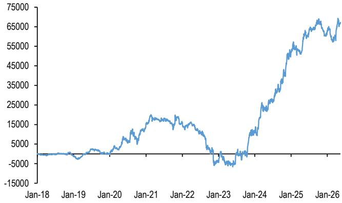

line

| Date   | Value  |
|--------|--------|
| Jan-18 | -5000  |
| Jan-19 | -4000  |
| Jan-20 | 5000   |
| Jan-21 | 15000  |
| Jan-22 | 10000  |
| Jan-23 | -5000  |
| Jan-24 | 25000  |
| Jan-25 | 55000  |
| Jan-26 | 65000  |

Source: Bloomberg Finance L.P., JPM Flows & Liquidity.

# Chart A37: Ratio of bitcoin market price to production cost

Based on the cost of production approach following Hayes (2018).   
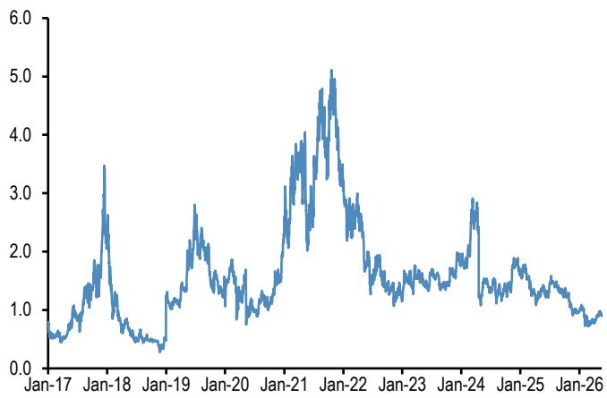

line

| Date   | Value |
|--------|-------|
| Jan-17 | 0.5   |
| Jan-18 | 3.5   |
| Jan-19 | 0.3   |
| Jan-20 | 1.8   |
| Jan-21 | 4.0   |
| Jan-22 | 5.0   |
| Jan-23 | 1.5   |
| Jan-24 | 2.8   |
| Jan-25 | 1.5   |
| Jan-26 | 0.8   |

Source: Bloomberg Finance L.P., JPM Flows & Liquidity.

# Global Markets Strategy

# Flows & Liquidity

20 May 2026

# Chart A36: Cumulative Flows in all Bitcoin funds and Gold ETF holdings

Both the y-axis in \$bn.   
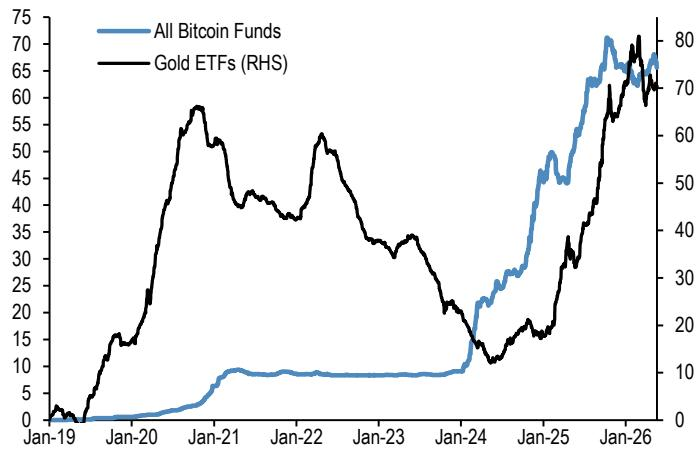

line

| Date   | All Bitcoin Funds | Gold ETFs (RHS) |
|--------|-------------------|-----------------|
| Jan-19 | 0                 | 0               |
| Jan-20 | 0                 | 15              |
| Jan-21 | 5                 | 60              |
| Jan-22 | 10                | 50              |
| Jan-23 | 10                | 35              |
| Jan-24 | 10                | 15              |
| Jan-25 | 50                | 50              |
| Jan-26 | 70                | 75              |

Source: Bloomberg Finance L.P., JPM Flows & Liquidity.

# Chart A38: Monthly flows into spot bitcoin ETFs, spot ethereum ETFs and leveraged MicroStrategy ETF

\$bn.   
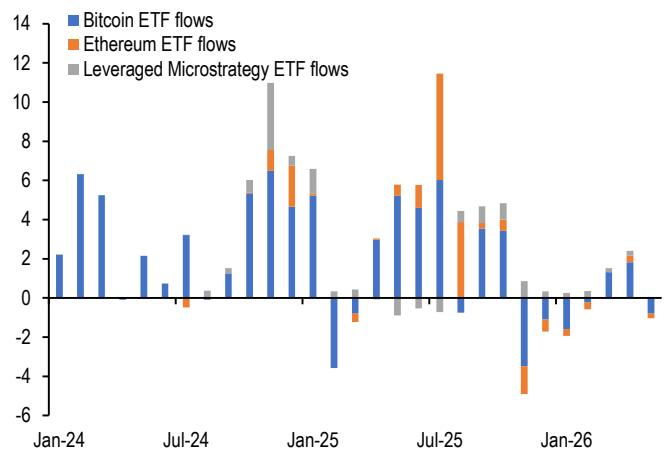

bar_stacked

| Date    | Bitcoin ETF flows | Ethereum ETF flows | Leveraged Microstrategy ETF flows |
|---------|-------------------|--------------------|-----------------------------------|
| Jan-24  | 2                 | 0                  | 0                                 |
| Jul-24  | 6                 | 0                  | 0                                 |
| Jan-25  | 5                 | 1                  | 1                                 |
| Jul-25  | 6                 | 3                  | 1                                 |
| Jan-26  | -4                | -1                 | 0                                 |

Source: Bloomberg Finance L.P., JPM Flows & Liquidity.

Nikolaos Panigirtzoglou AC (44-20) 7134-7815   
Mayur Yeole (91 22) 6157 3872   
nikolaos.panigirtzoglou@JPM.com   
mayur.yeole@jpmchase.com  
JPM Securities plc   
JPM India Private Limited   
Mika Inkinen (44-20) 7742 6565   
Krutik P Mehta (91-22) 6157-5016   
mika.j.inkinen@JPM.com   
krutik.mehta@jpmchase.com  
JPM Securities plc   
JPM India Private Limited

# Japanese flows and positions

# Chart A39: Tokyo Stock Exchange margin trading: total buys minus total sells

In bn of shares. Topix on right axis.

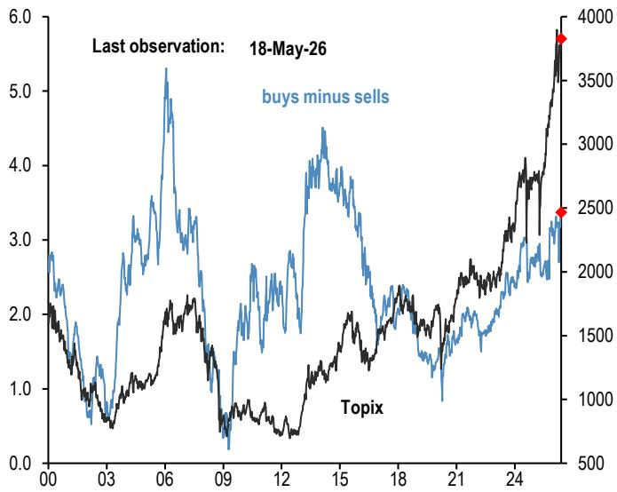

line

| Date       | Topix | buys minus sells |
| ---------- | ----- | ---------------- |
| 18-May-26  | 5.8   | 2500             |

Source: Tokyo Stock Exchange, Bloomberg Finance L.P., JPM Flows & Liquidity.

# Chart A41: Monthly net purchases of foreign bonds and foreign equities by Japanese residents

\$bn, Last weekly obs. is for 8 $^{th}$ May' 26.

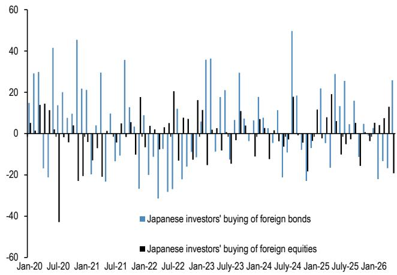

bar

| Date   | Japanese investors' buying of foreign bonds | Japanese investors' buying of foreign equities |
|--------|---------------------------------------------|------------------------------------------------|
| Jan-20 | 15                                          | 5                                              |
| Jul-20 | 40                                          | -45                                            |
| Jan-21 | 45                                          | -25                                            |
| Jul-21 | 30                                          | -10                                            |
| Jan-22 | 10                                          | 15                                             |
| Jul-22 | -30                                         | 20                                             |
| Jan-23 | 35                                          | -15                                            |
| Jul-23 | 20                                          | -10                                            |
| Jan-24 | 15                                          | -5                                             |
| Jul-24 | 50                                          | 15                                             |
| Jan-25 | 25                                          | -10                                            |
| Jul-25 | 30                                          | -5                                             |
| Jan-26 | 25                                          | 10                                             |

Source: Japan MoF, Bloomberg Finance L.P., and JPM Flows & Liquidity.

# Global Markets Strategy

20 May 2026

# Chart A40: Monthly net purchases of Japanese bonds and Japanese equities by foreign residents

\$bn, Last weekly obs. is for 8 $^{th}$ May' 26.

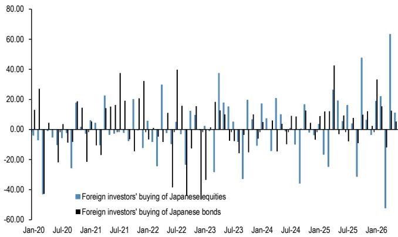

bar

| Date | Foreign investors' buying of Japanese equities (%) | Foreign investors' buying of Japanese bonds (%) |
|---|---|---|
| Jan-20 | -5.0 | 15.0 |
| Jul-20 | -3.0 | 28.0 |
| Jan-21 | 5.0 | -10.0 |
| Jul-21 | 22.0 | 18.0 |
| Jan-22 | -15.0 | 32.0 |
| Jul-22 | -25.0 | 40.0 |
| Jan-23 | 10.0 | -35.0 |
| Jul-23 | 38.0 | 18.0 |
| Jan-24 | -10.0 | 5.0 |
| Jul-24 | -35.0 | 10.0 |
| Jan-25 | -25.0 | 42.0 |
| Jul-25 | 18.0 | 10.0 |
| Jan-26 | -55.0 | 35.0 |
| Jun-26 | 65.0 | -15.0 |

Source: Japan MoF, Bloomberg Finance L.P., and JPM Flows & Liquidity.

# Chart A42: Overseas CFTC spec positions

CFTC spec positions are in \$bn. For Nikkei we use CFTC positions in Nikkei futures (USD & JPY) by Leveraged funds and Asset managers.

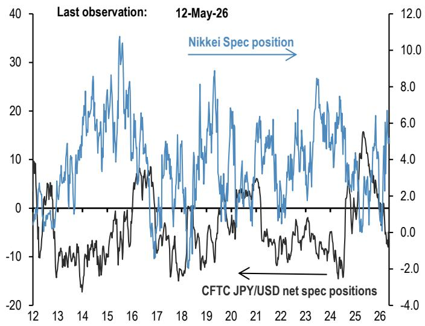

line

| Date       | Nikkei Spec Position | CFTC JPY/USD Net Spec Positions |
| ---------- | -------------------- | ------------------------------- |
| 12-May-26  | -                    | -                               |

Source: Bloomberg Finance L.P., CFTC, JPM Flows & Liquidity.

Nikolaos Panigirtzoglou AC (44-20) 7134-7815   
Mayur Yeole (91 22) 6157 3872   
nikolaos.panigirtzoglou@JPM.com   
mayur.yeole@jpmchase.com  
JPM Securities plc   
JPM India Private Limited   
Mika Inkinen (44-20) 7742 6565   
Krutik P Mehta (91-22) 6157-5016   
mika.j.inkinen@JPM.com   
krutik.mehta@jpmchase.com  
JPM Securities plc   
JPM India Private Limited

# Commodity flows and positions

Chart A43: Gold spec positions   
\$bn. CFTC net long minus short position in futures for the Managed Money category.   
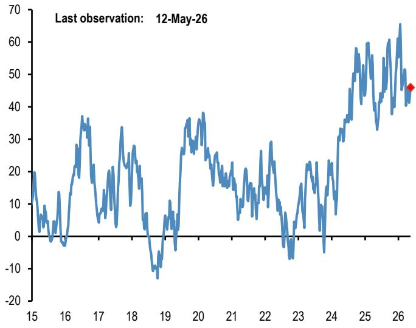

line

| Date       | Value |
| ---------- | ----- |
| 12-May-26  | 45    |

Source: CFTC, Bloomberg Finance L.P., JPM Flows & Liquidity.

# Chart A45: Oil spec positions

Net spec positions divided by open interest. CFTC futures positions for WTI and Brent are net long minus short for the Managed Money category.

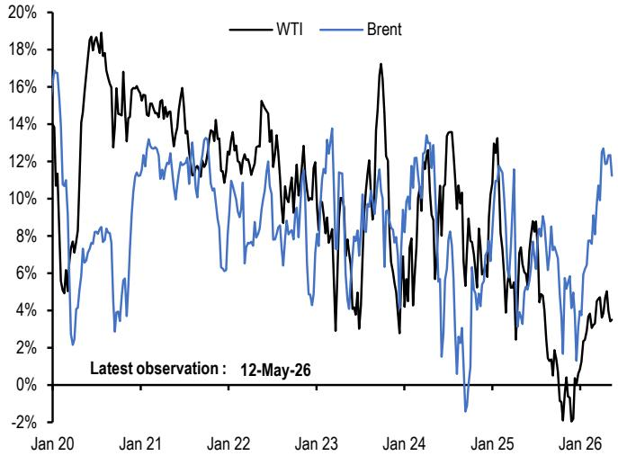

line

| Date       | WTI   | Brent |
| ---------- | ----- | ----- |
| Latest observation | 12-May-26 | 12-May-26 |

Source: CFTC, Bloomberg Finance L.P., JPM Flows & Liquidity.

# Global Markets Strategy

# Flows & Liquidity

20 May 2026

# Chart A44: Gold ETFs

Mn troy oz. Physical gold held by all gold ETFs globally.   
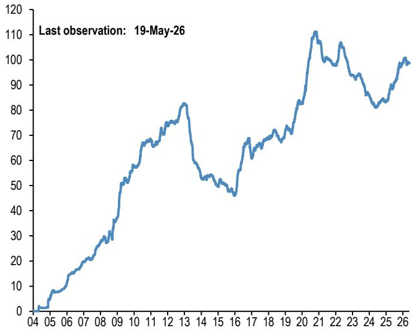

line

| Date       | Value |
| ---------- | ----- |
| 19-May-26  | 100   |

Source: Bloomberg Finance L.P., JPM Flows & Liquidity.

# Chart A46: Energy ETF flows

Cumulative energy ETFs flows as a \% of AUM. MLP refers to the Alerian MLP ETF.   
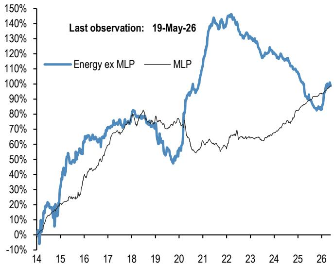

line

| Year | Energy ex MLP | MLP |
|------|---------------|-----|
| 14   | -5%           | 0%  |
| 15   | 20%           | 10% |
| 16   | 60%           | 30% |
| 17   | 70%           | 50% |
| 18   | 80%           | 60% |
| 19   | 70%           | 70% |
| 20   | 50%           | 60% |
| 21   | 140%          | 60% |
| 22   | 145%          | 70% |
| 23   | 130%          | 75% |
| 24   | 120%          | 80% |
| 25   | 90%           | 85% |
| 26   | 100%          | 95% |

Source: CFTC, Bloomberg Finance L.P., JPM Flows & Liquidity.

Nikolaos Panigirtzoglou AC (44-20) 7134-7815   
Mayur Yeole (91 22) 6157 3872   
nikolaos.panigirtzoglou@JPM.com   
mayur.yeole@jpmchase.com  
JPM Securities plc   
JPM India Private Limited   
Mika Inkinen (44-20) 7742 6565   
Krutik P Mehta (91-22) 6157-5016   
mika.j.inkinen@JPM.com   
krutik.mehta@jpmchase.com  
JPM Securities plc   
JPM India Private Limited

# Corporate FX hedging proxies

# Chart A47: Average beta of Eurostoxx 50 companies and Eurostoxx Mid-Cap to trade-weighted EUR

Rolling 26 weeks average betas based on a bivariate regression of the weekly returns of individual stocks in the Eurostoxx 50 index to the weekly returns of the MSCI AC World and JPM EUR Nominal broad effective exchange rate (NEER).

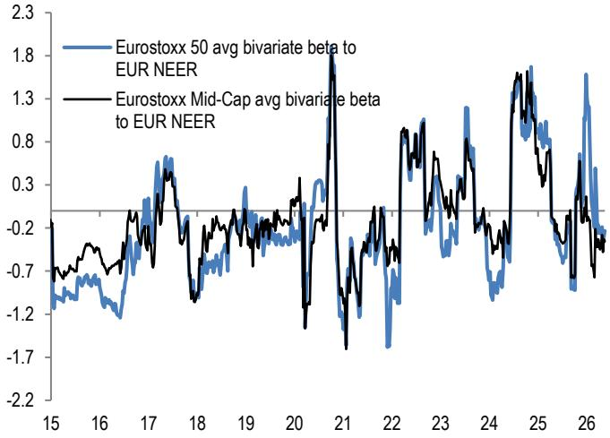

line

| Year | Eurostoxx 50 avg bivariate beta to EUR NEER | Eurostoxx Mid-Cap avg bivariate beta to EUR NEER |
|------|---------------------------------------------|------------------------------------------------|
| 15   | -1.2                                        | -0.7                                           |
| 16   | -1.3                                        | -0.8                                           |
| 17   | -0.9                                        | -0.6                                           |
| 18   | -0.7                                        | -0.4                                           |
| 19   | -0.5                                        | -0.3                                           |
| 20   | -0.3                                        | -0.1                                           |
| 21   | 1.8                                         | 1.7                                            |
| 22   | -0.8                                        | -0.6                                           |
| 23   | 0.8                                         | 0.7                                            |
| 24   | -0.6                                        | -0.4                                           |
| 25   | 1.7                                         | 1.6                                            |
| 26   | -0.4                                        | -0.2                                           |

Source: Bloomberg Finance L.P., JPM Flows & Liquidity.

# Chart A49: Average beta of FTSE 100 companies to trade-weighted GBP

Rolling 26 weeks average betas based on a bivariate regression of the weekly returns of individual stocks in the FTSE 100 index to the weekly returns of the MSCI AC World and JPM GBP Nominal broad effective exchange rate (NEER).

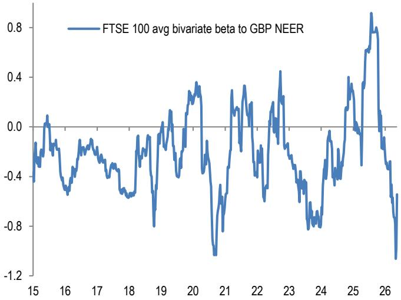

line

| Year | FTSE 100 avg bivariate beta to GBP NEER |
| ---- | ---------------------------------------- |
| 15   | -0.4                                     |
| 16   | -0.3                                     |
| 17   | -0.2                                     |
| 18   | -0.5                                     |
| 19   | -0.1                                     |
| 20   | 0.3                                      |
| 21   | -0.9                                     |
| 22   | 0.2                                      |
| 23   | -0.4                                     |
| 24   | -0.8                                     |
| 25   | 0.4                                      |
| 26   | -1.1                                     |

Source: Bloomberg Finance L.P., JPM Flows & Liquidity.

# Global Markets Strategy

20 May 2026

# Chart A48: Average beta of S&P500 companies to trade-weighted US dollar

Rolling 26 weeks average betas based on a bivariate regression of the weekly returns of stocks in the S&P500 index to the weekly returns of the MSCI AC World and JPM USD Nominal broad effective exchange rate(NEER).

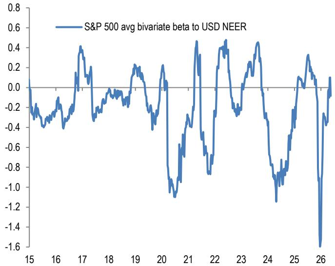

line

| Year | S&P 500 avg bivariate beta to USD NEER |
| ---- | -------------------------------------- |
| 15   | 0.0                                    |
| 16   | -0.2                                   |
| 17   | 0.4                                    |
| 18   | -0.1                                   |
| 19   | 0.2                                    |
| 20   | -0.3                                   |
| 21   | -1.0                                   |
| 22   | 0.5                                    |
| 23   | -0.2                                   |
| 24   | -1.2                                   |
| 25   | 0.3                                    |
| 26   | -1.6                                   |

Source: Bloomberg Finance L.P., JPM Flows & Liquidity.

# Chart A50: Average beta of MSCI EM companies to trade-weighted EM Currency Index

Rolling 26 weeks average betas based on a bivariate regression of the weekly returns of individual stocks in the MSCI EM index to the weekly returns of the MSCI AC World and JPM EM Nominal broad effective exchange rate (NEER).

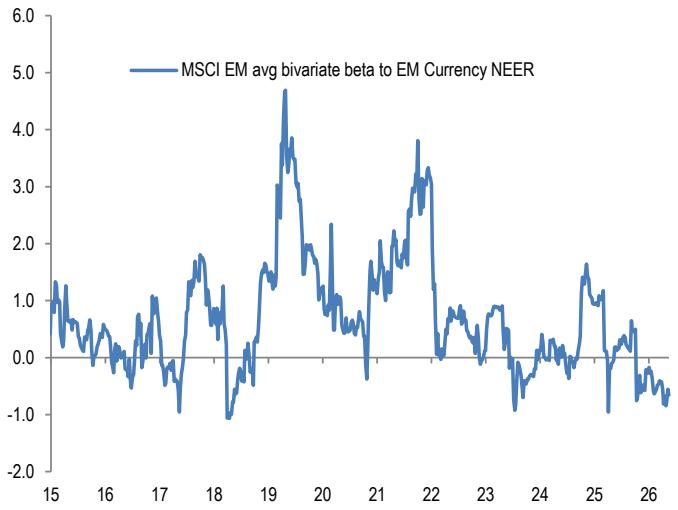

line

| Year | MSCI EM avg bivariate beta to EM Currency NEER |
| ---- | ----------------------------------------------- |
| 15   | 1.0                                             |
| 16   | 0.5                                             |
| 17   | 1.0                                             |
| 18   | 1.5                                             |
| 19   | 4.5                                             |
| 20   | 2.0                                             |
| 21   | 3.0                                             |
| 22   | 3.5                                             |
| 23   | 0.5                                             |
| 24   | 0.0                                             |
| 25   | 1.5                                             |
| 26   | -0.5                                            |

Source: Bloomberg Finance L.P., JPM Flows & Liquidity.

<table><tr><td>Nikolaos Panigirtzoglou  $^{AC}$  (44-20) 7134-7815</td><td>Mayur Yeole (91 22) 6157 3872</td></tr><tr><td>nikolaos.panigirtzoglou@JPM.com</td><td>mayur.yeole@jpmchase.com</td></tr><tr><td>JPM Securities plc</td><td>JPM India Private Limited</td></tr><tr><td>Mika Inkinen (44-20) 7742 6565</td><td>Krutik P Mehta (91-22) 6157-5016</td></tr><tr><td>mika.j.inkinen@JPM.com</td><td>krutik.mehta@jpmchase.com</td></tr><tr><td>JPM Securities plc</td><td>JPM India Private Limited</td></tr></table>

# Non-Bank investors' implied allocations

# Chart A51: Implied equity allocation by non-bank investors globally

Global equities as % total holdings of equities/bonds/M2 by non-bank investors/Commodities including gold held by private investors. Dotted lines are averages.

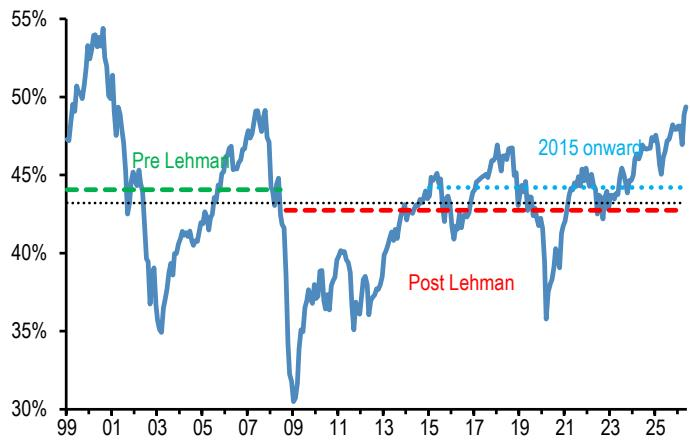

line

| Year | Value |
|------|-------|
| 99   | ~47%  |
| 01   | ~54%  |
| 03   | ~35%  |
| 05   | ~42%  |
| 07   | ~48%  |
| 09   | ~31%  |
| 11   | ~38%  |
| 13   | ~40%  |
| 15   | ~45%  |
| 17   | ~46%  |
| 19   | ~44%  |
| 21   | ~36%  |
| 23   | ~45%  |
| 25   | ~49%  |

Source: Bloomberg Finance L.P., JPM Flows & Liquidity.

# Chart A53: Implied cash allocation by non-bank investors globally

Global cash held by non-bank investors as % total holdings of equities/bonds/M2 by non-bank investors/Commodities including gold held by private investors. Dotted lines are averages.

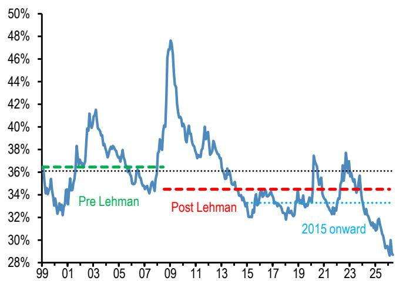

line

| Year | Value |
|------|-------|
| 99   | 36%   |
| 01   | 36%   |
| 03   | 42%   |
| 05   | 36%   |
| 07   | 36%   |
| 09   | 48%   |
| 11   | 40%   |
| 13   | 36%   |
| 15   | 34%   |
| 17   | 34%   |
| 19   | 34%   |
| 21   | 36%   |
| 23   | 36%   |
| 25   | 30%   |

Source: Bloomberg Finance L.P., JPM Flows & Liquidity.

# Global Markets Strategy

# Flows & Liquidity

20 May 2026

# Chart A52: Implied bond allocation by non-bank investors globally

Global bonds as % total holdings of equities/bonds/M2 by non-bank investors/Commodities including gold held by private investors. Dotted lines are averages.

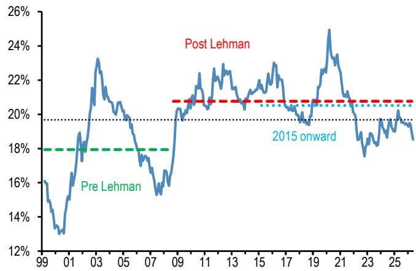

line

| Year | Value |
|------|-------|
| 99   | 16%   |
| 01   | 13%   |
| 03   | 23%   |
| 05   | 20%   |
| 07   | 17%   |
| 09   | 20%   |
| 11   | 22%   |
| 13   | 21%   |
| 15   | 23%   |
| 17   | 20%   |
| 19   | 19%   |
| 21   | 25%   |
| 23   | 18%   |
| 25   | 19%   |

Source: Bloomberg Finance L.P., JPM Flows & Liquidity.

# Chart A54: Implied commodity allocation (including privately held gold) by non-bank investors globally

Proxied by the open interest of commodity futures ex gold and privately held gold as % of the stock of equities, bonds, cash held by non-bank investors globally and commodities including gold held by private investors.

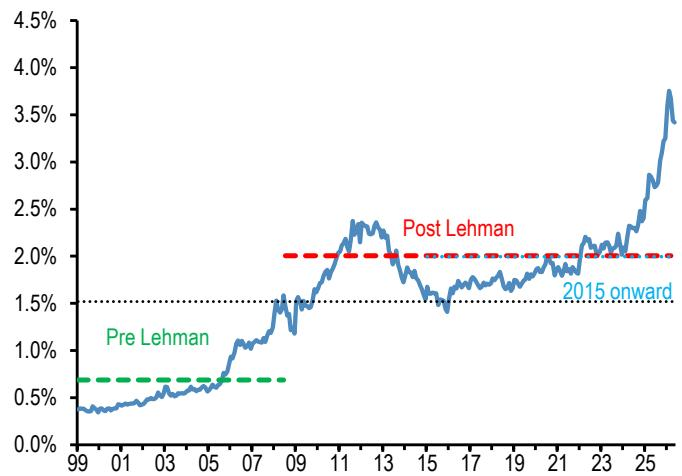

line

| Year | Value |
|------|-------|
| 99   | ~0.4% |
| 01   | ~0.5% |
| 03   | ~0.6% |
| 05   | ~0.7% |
| 07   | ~1.0% |
| 09   | ~1.5% |
| 11   | ~2.2% |
| 13   | ~2.0% |
| 15   | ~1.5% |
| 17   | ~1.8% |
| 19   | ~1.9% |
| 21   | ~2.0% |
| 23   | ~2.2% |
| 25   | ~3.8% |
| 27   | ~3.5% |

Source: Bloomberg Finance L.P., JPM Flows & Liquidity.

Analyst Certification: The Research Analyst(s) denoted by an “AC” on the cover of this report certifies (or, where multiple Research Analysts are primarily responsible for this report, the Research Analyst denoted by an “AC” on the cover or within the document individually certifies, with respect to each security or issuer that the Research Analyst covers in this research) that: (1) all of the views expressed in this report accurately reflect the Research Analyst’s personal views about any and all of the subject securities or issuers; and (2) no part of any of the Research Analyst's compensation was, is, or will be directly or indirectly related to the specific recommendations or views expressed by the Research Analyst(s) in this report. For all Korea-based Research Analysts listed on the front cover, if applicable, they also certify, as per KOFIA requirements, that the Research Analyst’s analysis was made in good faith and that the views reflect the Research Analyst’s own opinion, without undue influence or intervention.

All authors named within this report are Research Analysts who produce independent research unless otherwise specified. In Europe, Sector Specialists (Sales and Trading) may be shown on this report as contacts but are not authors of the report or part of the Research Department.

# Important Disclosures

An analyst listed on the front cover has personal holdings in digital or crypto assets.

Company-Specific Disclosures: JPM does and seeks to do business with companies covered in its research reports. As a result, investors should be aware that the firm may have a conflict of interest that could affect the objectivity of this report. Investors should consider this report as only a single factor in making their investment decision. Important disclosures, including price charts and credit opinion history tables (if applicable), are available for compendium reports and all JPM-covered companies, and certain non-covered companies, by visiting https://www.jpmm.com/research/disclosures, calling 1-800-477-0406, or e-mailing research.disclosure.inquiries@JPM.com with your request.

# Explanation of Equity Research Ratings, Designations and Analyst(s) Coverage Universe:

JPM uses the following rating system: Overweight (over the duration of the price target indicated in this report, we expect this stock will outperform the average total return of the stocks in the Research Analyst's, or the Research Analyst's team's, coverage universe); Neutral (over the duration of the price target indicated in this report, we expect this stock will perform in line with the average total return of the stocks in the Research Analyst's, or the Research Analyst's team's, coverage universe); and Underweight (over the duration of the price target indicated in this report, we expect this stock will underperform the average total return of the stocks in the Research Analyst's, or the Research Analyst's team's, coverage universe. NR is Not Rated. In this case, JPM has removed the rating and, if applicable, the price target, for this stock because of either a lack of a sufficient fundamental basis or for legal, regulatory or policy reasons. The previous rating and, if applicable, the price target, no longer should be relied upon. An NR designation is not a recommendation or a rating. Some stocks under coverage have a rating but no price target; in these cases, we expect the stock will outperform/perform in line/underperform the average total return of the stocks in the Research Analyst's, or the Research Analyst's team's, coverage universe of the relevant duration of the region. In our Asia (ex-Australia and ex-India) and U.K. small- and mid-cap Equity Research, each stock's expected total return is compared to the expected total return of a benchmark country market index, not to those Research Analysts' coverage universe. If it does not appear in the Important Disclosures section of this report, the certifying Research Analyst's coverage universe can be found on JPM's Research website, https://.

JPM Equity Research Ratings Distribution, as of April 04, 2026 

<table><tr><td></td><td>Overweight (buy)</td><td>Neutral (hold)</td><td>Underweight (sell)</td></tr><tr><td>JPM Global Equity Research Coverage*</td><td>51%</td><td>37%</td><td>12%</td></tr><tr><td>IB clients**</td><td>83%</td><td>79%</td><td>74%</td></tr><tr><td>JPMS Equity Research Coverage*</td><td>49%</td><td>39%</td><td>13%</td></tr><tr><td>IB clients**</td><td>94%</td><td>93%</td><td>85%</td></tr></table>

\*Please note that the percentages may not add to 100% because of rounding.   
\*\*Percentage of subject companies within each of the "buy," "hold" and "sell" categories for which JPM has provided investment banking services within the previous 12 months.   
For purposes of FINRA ratings distribution rules only, our Overweight rating falls into a buy rating category; our Neutral rating falls into a hold rating category; and our Underweight rating falls into a sell rating category. Please note that stocks with an NR designation are not included in the table above. This information is current as of the end of the most recent calendar quarter.

Equity Valuation and Risks: For valuation methodology and risks associated with covered companies or price targets for covered companies, please see the most recent company-specific research report at http://, contact the primary analyst or your JPM representative, or email research.disclosure.inquiries@JPM.com. For material information about the proprietary models used, please see the Summary of Financials in company-specific research reports and the Company Tearsheets, which are available to download on the company pages of our client website, http://. This report also sets out within it the material underlying assumptions used.

# History of Investment Recommendations:

A history of JPM investment recommendations disseminated during the preceding 12 months can be accessed on the Research &

Commentary page of http:// where you can also search by analyst name, sector or financial instrument.

Analysts' Compensation: The research analysts responsible for the preparation of this report receive compensation based upon various factors, including the quality and accuracy of research, client feedback, competitive factors, and overall firm revenues.

Registration of non-US Analysts: Unless otherwise noted, the non-US analysts listed on the front of this report are employees of non-US affiliates of JPM Securities LLC, may not be registered as research analysts under FINRA rules, may not be associated persons of JPM Securities LLC, and may not be subject to FINRA Rule 2241 or 2242 restrictions on communications with covered companies, public appearances, and trading securities held by a research analyst account.

# Other Disclosures

JPM is a marketing name for investment banking businesses of JPM Chase & Co. and its subsidiaries and affiliates worldwide.

UK MIFID FICC research unbundling exemption: UK clients should refer to UK MIFID Research Unbundling exemption for details of JPM's implementation of the FICC research exemption and guidance on relevant FICC research categorisation.

All research material made available to clients are simultaneously available on our client website, JPM Markets, unless specifically permitted by relevant laws. Not all research content is redistributed, e-mailed or made available to third-party aggregators. For all research material available on a particular stock, please contact your sales representative.

Any long form nomenclature for references to China; Hong Kong; Taiwan; and Macau within this research material are Mainland China; Hong Kong SAR (China); Taiwan (China); and Macau SAR (China).

JPM may, from time to time, write on issuers or securities targeted by economic or financial sanctions imposed or administered by the governmental authorities of the U.S., EU, UK or other relevant jurisdictions (Sanctioned Securities). Nothing in this report is intended to be read or construed as encouraging, facilitating, promoting or otherwise approving investment or dealing in such Sanctioned Securities. Clients should be aware of their own legal and compliance obligations when making investment decisions.

Any digital or crypto assets discussed in this research report are subject to a rapidly changing regulatory landscape. For relevant regulatory advisories on crypto assets, including bitcoin and ether, please see https://www.JPM.com/disclosures/cryptoasset-disclosure.

The author(s) of this research report may not be licensed to carry on regulated activities in your jurisdiction and, if not licensed, do not hold themselves out as being able to do so.

Exchange-Traded Funds (ETFs): JPM Securities LLC (“JPMS”) acts as authorized participant for substantially all U.S.-listed ETFs. To the extent that any ETFs are mentioned in this report, JPMS may earn commissions and transaction-based compensation in connection with the distribution of those ETF shares and may earn fees for performing other trade-related services, such as securities lending to short sellers of the ETF shares. JPMS may also perform services for the ETFs themselves, including acting as a broker or dealer to the ETFs. In addition, affiliates of JPMS may perform services for the ETFs, including trust, custodial, administration, lending, index calculation and/or maintenance and other services.

Options and Futures related research: If the information contained herein regards options- or futures-related research, such information is available only to persons who have received the proper options or futures risk disclosure documents. Please contact your JPM Representative or visit https://www.theocc.com/components/docs/riskstoc.pdf for a copy of the Option Clearing Corporation's Characteristics and Risks of Standardized Options or https://www.finra.org/sites/default/files/2020-08/Security\_Futures\_Risk\_Disclosure\_Statement\_2020.pdf for a copy of the Security Futures Risk Disclosure Statement.

Changes to Interbank Offered Rates (IBORs) and other benchmark rates: Certain interest rate benchmarks are, or may in the future become, subject to ongoing international, national and other regulatory guidance, reform and proposals for reform. For more information, please consult: https://www.JPM.com/global/disclosures/interbank\_offered\_rates

Private Bank Clients: Where you are receiving research as a client of the private banking businesses offered by JPM Chase & Co. and its subsidiaries (“JPM Private Bank”), research is provided to you by JPM Private Bank and not by any other division of JPM, including, but not limited to, the JPM Corporate and Investment Bank and its Global Research division.

Legal entity responsible for the production and distribution of research: The legal entity identified below the name of the Reg AC Research Analyst who authored this material is the legal entity responsible for the production of this research. Where multiple Reg AC Research Analysts authored this material with different legal entities identified below their names, these legal entities are jointly responsible for the production of this research. Where more than one legal entity is listed under an analyst's name, the first legal entity is responsible for the production unless stated otherwise. Research Analysts from various JPM affiliates may have contributed to the production of this material but may not be licensed to carry out regulated activities in your jurisdiction (and do not hold themselves out as being able to do so). Unless otherwise stated below in the legal entity disclosures, this material has been distributed by the legal entity responsible for production, or where more than one legal entity is listed under the analyst's name, the first legal entity will be responsible for distribution. If you have any queries, please contact the relevant Research Analyst in your jurisdiction or the entity in your jurisdiction that has distributed this research material.

# Legal Entities Disclosures and Country-/Region-Specific Disclosures:

Argentina: JPM Chase Bank N.A Sucursal Buenos Aires is regulated by Banco Central de la República Argentina (“BCRA”- Central Bank of Argentina) and Comisión Nacional de Valores (“CNV”- Argentinian Securities Commission - ALYC y AN Integral N°51).

Australia: JPM Securities Australia Limited (“JPMSAL”) (ABN 61 003 245 234/AFS Licence No: 238066) is regulated by the Australian Securities and Investments Commission and is a Market Participant of ASX Limited, a Clearing and Settlement Participant of ASX Clear Pty Limited and a Clearing Participant of ASX Clear (Futures) Pty Limited. This material is issued and distributed in Australia by or on behalf of JPMSAL only to "wholesale clients" (as defined in section 761G of the Corporations Act 2001). A list of all financial products covered can be found by visiting https://www.jpmm.com/research/disclosures. JPM seeks to cover companies of relevance to the domestic and international investor base across all Global Industry Classification Standard (GICS) sectors, as well as across a range of market capitalisation sizes. If applicable, in the course of conducting public side due diligence on the subject company(ies), the Research Analyst team may at times perform such diligence through corporate engagements such as site visits, discussions with company representatives, management presentations, etc. Research issued by JPMSAL has been prepared in accordance with JPM Australia’s Research Independence Policy which can be found at the following link: JPM Australia - Research Independence Policy.

Brazil: Banco JPM S.A. is regulated by the Comissao de Valores Mobiliarios (CVM) and by the Central Bank of Brazil. Ombudsman JPM: 0800-7700847 / 0800-7700810 (For Hearing Impaired) / ouvidoria.jp.morgan@jpmchase.com.

Canada: JPM Securities Canada Inc. is a registered investment dealer, regulated by the Canadian Investment Regulatory Organization and the Ontario Securities Commission and is the participating member on Canadian exchanges. This material is distributed in Canada by or on behalf of JPM Securities Canada Inc.

Chile: Inversiones JPM Limitada is an unregulated entity incorporated in Chile.

China: JPM Securities (China) Company Limited has been approved by CSRC to conduct the securities investment consultancy business.

Colombia: Banco JPM Colombia S.A. is supervised by the Superintendencia Financiera de Colombia (SFC). Any reference in this material to products or services offered abroad by entities other than the Bank in Colombia is included exclusively for descriptive purposes. Such references do not constitute, and should not be construed as, promotional activity or the provision of financial products or services within Colombian territory, as defined under applicable Colombian regulation.

Dubai International Financial Centre (DIFC): JPM Chase Bank, N.A., Dubai Branch is regulated by the Dubai Financial Services Authority (DFSA) and its registered address is Dubai International Financial Centre - The Gate, West Wing, Level 3 and 9 PO Box 506551, Dubai, UAE. This material has been distributed by JPM Chase Bank, N.A., Dubai Branch to persons regarded as professional clients or market counterparties as defined under the DFSA rules.

European Economic Area (EEA): Unless specified to the contrary, research is distributed in the EEA by JPM SE (“JPM SE”), which is authorised as a credit institution by the Federal Financial Supervisory Authority (Bundesanstalt für Finanzdienstleistungsaufsicht, BaFin) and jointly supervised by the BaFin, the German Central Bank (Deutsche Bundesbank) and the European Central Bank (ECB). JPM SE is a company headquartered in Frankfurt with registered address at TaunusTurm, Taunustor 1, Frankfurt am Main, 60310, Germany. The material has been distributed in the EEA to persons regarded as professional investors (or equivalent) pursuant to Art. 4 para. 1 no. 10 and Annex II of MiFID II and its respective implementation in their home jurisdictions (“EEA professional investors”). This material must not be acted on or relied on by persons who are not EEA professional investors. Any investment or investment activity to which this material relates is only available to EEA relevant persons and will be engaged in only with EEA relevant persons.

Hong Kong: JPM Securities (Asia Pacific) Limited (CE number AAJ321) is regulated by the Hong Kong Monetary Authority and the Securities and Futures Commission in Hong Kong, and JPM Broking (Hong Kong) Limited (CE number AAB027) is regulated by the Securities and Futures Commission in Hong Kong. JPM Chase Bank, N.A., Hong Kong Branch (CE Number AAL996) is regulated by the Hong Kong Monetary Authority and the Securities and Futures Commission, is organized under the laws of the United States with limited liability. Where the distribution of this material is a regulated activity in Hong Kong, the material is distributed in Hong Kong by or through JPM Securities (Asia Pacific) Limited and/or JPM Broking (Hong Kong) Limited.

India: JPM India Private Limited (Corporate Identity Number - U67120MH1992FTC068724), having its registered office at JPM Tower, Off. C.S.T. Road, Kalina, Santacruz - East, Mumbai – 400098, is registered with the Securities and Exchange Board of India (SEBI) as a 'Research Analyst' having registration number INH000001873. JPM India Private Limited is also registered with SEBI as a member of the National Stock Exchange of India Limited and the Bombay Stock Exchange Limited (SEBI Registration Number – INZ000239730) and as a Merchant Banker (SEBI Registration Number - MB/INM000002970). Telephone: 91-22-6157 3000, Facsimile: 91-22-6157 3990 and Website: http://www.jpmipl.com. JPM Chase Bank, N.A. - Mumbai Branch is licensed by the Reserve Bank of India (RBI) (Licence No. 53/Licence No. BY.4/94; SEBI - IN/CUS/014/ CDSL : IN-DP-CDSL-444-2008/ IN-DP-NSDL-285-2008/ INBI00000984/ INE231311239) as a Scheduled Commercial Bank in India, which is its primary license allowing it to carry on Banking business in India and other activities, which a Bank branch in India are permitted to undertake. For non-local research material, this material is not distributed in India by JPM India Private Limited. Compliance Officer: Ashutosh Sharma; ashutosh.j.sharma@jpmchase.com; +912261575002. Grievance Officer: Ramprasadh K, jpmipl.research.feedback@JPM.com; +912261573000. Registration granted by SEBI and certification from NISM in no way guarantee performance of the intermediary or provide any assurance of returns to investors. Please visit Terms and Conditions and Most Important Terms and Conditions (MITC). The annual Compliance audit report is available at http://www.jpmipl.com/#research.

Indonesia: PT JPM Sekuritas Indonesia is a member of the Indonesia Stock Exchange and is registered and supervised by the Otoritas Jasa Keuangan (OJK).

Korea: JPM Securities (Far East) Limited, Seoul Branch, is a member of the Korea Exchange (KRX). JPM Chase Bank, N.A., Seoul Branch, is licensed as a branch office of foreign bank (JPM Chase Bank, N.A.) in Korea. Both entities are regulated by the Financial Services Commission (FSC) and the Financial Supervisory Service (FSS). For non-macro research material, the material is distributed in Korea by or through JPM Securities (Far East) Limited, Seoul Branch.

Japan: JPM Securities Japan Co., Ltd. and JPM Chase Bank, N.A., Tokyo Branch are regulated by the Financial Services Agency in Japan.

Malaysia: This material is issued and distributed in Malaysia by JPM Securities (Malaysia) Sdn Bhd (18146-X), which is a Participating Organization of Bursa Malaysia Berhad and holds a Capital Markets Services License issued by the Securities Commission in Malaysia.

Mexico: JPM Casa de Bolsa, S.A. de C.V., JPM Grupo Financiero is member of the Mexican Stock Exchange (“Bolsa Mexicana de Valores”) and the Institutional Stock Exchange (“Bolsa Institucional de Valores”), and it is authorized to act as a broker dealer by the National Banking and Securities Exchange Commission (“Comisión Nacional Bancaria y de Valores”).

New Zealand: This material is issued and distributed by JPMSAL in New Zealand only to "wholesale clients" (as defined in the Financial Markets Conduct Act 2013). JPMSAL is registered as a Financial Service Provider under the Financial Service providers (Registration and Dispute Resolution) Act of 2008.

Philippines: JPM Securities Philippines Inc. is a Trading Participant of the Philippine Stock Exchange and a member of the Securities Clearing Corporation of the Philippines and the Securities Investor Protection Fund. It is regulated by the Securities and Exchange Commission.

Singapore: This material is issued and distributed in Singapore by or through JPM Securities Singapore Private Limited (JPMSS) [MDDI (P) 057/08/2025 and Co. Reg. No.: 199405335R], which is a member of the Singapore Exchange Securities Trading Limited, and/or JPM Chase Bank, N.A., Singapore branch (JPMCB Singapore), both of which are regulated by the Monetary Authority of Singapore. This material is issued and distributed in Singapore only to accredited investors, expert investors and institutional investors, as defined in Section 4A of the Securities and Futures Act, Cap. 289 (SFA). This material is not intended to be issued or distributed to any retail investors or any other investors that do not fall into the classes of “accredited investors,” “expert investors” or “institutional investors,” as defined under Section 4A of the SFA. Recipients of this material in Singapore are to contact JPMSS or JPMCB Singapore in respect of any matters arising from, or in connection with, the material.

South Africa: JPM Equities South Africa Proprietary Limited and JPM Chase Bank, N.A., Johannesburg Branch are members of the Johannesburg Securities Exchange and are regulated by the Financial Services Conduct Authority (FSCA).

Taiwan: JPM Securities (Taiwan) Limited is a participant of the Taiwan Stock Exchange (company-type) and regulated by the Taiwan Securities and Futures Bureau. Material relating to equity securities is issued and distributed in Taiwan by JPM Securities (Taiwan) Limited, subject to the license scope and the applicable laws and the regulations in Taiwan. To the extent that JPM Securities (Taiwan) Limited produces research materials on securities not listed on the Taiwan Stock Exchange or Taipei Exchange (“Non-Taiwan Listed Securities”), these materials shall not constitute securities recommendations for the purpose of applicable Taiwan regulations, and, for the avoidance of doubt, JPM Securities (Taiwan) Limited does not act as broker for Non-Taiwan Listed Securities. According to Paragraph 2, Article 7-1 of Operational Regulations Governing Securities Firms Recommending Trades in Securities to Customers (as amended or supplemented) and/or other applicable laws or regulations, please note that the recipient of this material is not permitted to engage in any activities in connection with the material that may give rise to conflicts of interests, unless otherwise disclosed in the “Important Disclosures” in this material.

Thailand: This material is issued and distributed in Thailand by JPM Securities (Thailand) Ltd., which is a member of the Stock Exchange of Thailand and is regulated by the Ministry of Finance and the Securities and Exchange Commission. The registered address is 548 One City Center Building, 50th Floor, Ploenchit Road, Lymphini, Pathum Wan, Bangkok 10330.

UK: Research is produced in the UK by JPM Securities plc (“JPMS plc”) which is a member of the London Stock Exchange and is authorised by the Prudential Regulation Authority and regulated by the Financial Conduct Authority and the Prudential Regulation Authority or JPM Markets Limited (“JPMML Ltd”) which is authorised and regulated by the Financial Conduct Authority. Unless specified to the contrary, this material is distributed in the UK by JPMS plc and is directed in the UK only to: (a) persons having professional experience in matters relating to investments falling within article 19(5) of the Financial Services and Markets Act 2000 (Financial Promotion) (Order) 2005 (“the FPO”); (b) persons outlined in article 49 of the FPO (high net worth companies, unincorporated associations or partnerships, the trustees of high value trusts, etc.); or (c) any persons to whom this communication may otherwise lawfully be made; all such persons being referred to as "UK relevant persons". This material must not be acted on or relied on by persons who are not UK relevant persons. Any investment or investment activity to which this material relates is only available to UK relevant persons and will be engaged in only with UK relevant persons. A description of JPM EMEA’s policy for prevention and avoidance of conflicts of interest related to the production of Research can be found at the following link: JPM EMEA - Research Independence Policy.

U.S.: JPM Securities LLC (“JPMS”) is a member of the NYSE, FINRA, SIPC, and the NFA. JPM Chase Bank, N.A. is a member of the FDIC. Material published by non-U.S. affiliates is distributed in the U.S. by JPMS who accepts responsibility for its content.

General: Additional information is available upon request. The information in this material has been obtained from sources believed to be reliable. While all reasonable care has been taken to ensure that the facts stated in this material are accurate and that the forecasts, opinions and expectations contained herein are fair and reasonable, JPM Chase & Co. or its affiliates and/or subsidiaries (collectively JPM) make no representations or warranties whatsoever to the completeness or accuracy of the material provided, except with respect to any disclosures relative to JPM and the Research Analyst's involvement with the issuer that is the subject of the material. Accordingly, no reliance should be placed on the accuracy, fairness or completeness of the information contained in this material. There may be certain discrepancies with data and/or limited content in this material as a result of calculations, adjustments, translations to different languages, and/or local regulatory restrictions, as applicable. These discrepancies should not impact the overall investment analysis, views and/or recommendations of the subject company(ies) that may be discussed in the material. Artificial intelligence tools may have been used in the preparation of this material, including assisting in data analysis, pattern recognition, and content drafting for research material. JPM accepts no liability whatsoever for any loss arising from any use of this material or its contents, and neither JPM nor any of its respective directors, officers or employees, shall be in any way responsible for the contents hereof, apart from the liabilities and responsibilities that may be imposed on them by the relevant regulatory authority in the jurisdiction in question, or the regulatory regime thereunder. Opinions, forecasts or projections contained in this material represent JPM's current opinions or judgment as of the date of the material only and are therefore subject to change without notice. Periodic updates may be provided on companies/industries based on company-specific developments or announcements, market conditions or any other publicly available information. There can be no assurance that future results or events will be consistent with any such opinions, forecasts or projections, which represent only one possible outcome. Furthermore, such opinions, forecasts or projections are subject to certain risks, uncertainties and assumptions that have not been verified, and future actual results or events could differ materially. The value of, or income from, any investments referred to in this material may fluctuate and/or be affected by changes in exchange rates. All pricing is indicative as of the close of market for the securities discussed, unless otherwise stated. Past performance is not indicative of future results. Accordingly, investors may receive back less than originally invested. This material is not intended as an offer or solicitation for the purchase or sale of any financial instrument. The opinions and recommendations herein do not take into account individual client circumstances, objectives, or needs and are not intended as recommendations of particular securities, financial instruments or strategies to particular clients. This material may include views on structured securities, options, futures and other derivatives. These are complex instruments, may involve a high degree of risk and may be appropriate investments only for sophisticated investors who are capable of understanding and assuming the risks involved. The recipients of this material must make their own independent decisions regarding any securities or financial instruments mentioned herein and should seek advice from such independent financial, legal, tax or other adviser as they deem necessary. JPM may trade as a principal on the basis of the Research Analysts' views and research, and it may also engage in transactions for its own account or for its clients' accounts in a manner inconsistent with the views taken in this material, and JPM is under no obligation to ensure that such other communication is brought to the attention of any recipient of this material. Others within JPM, including Strategists, Sales staff and other Research Analysts, may take views that are inconsistent with those taken in this material. Employees of JPM not involved in the preparation of this material may have investments in the securities (or derivatives of such securities) mentioned in this material and may trade them in ways different from those discussed in this material. This material is not an advertisement for or marketing of any issuer, its products or services, or its securities in any jurisdiction.

Confidentiality and Security Notice: This transmission may contain information that is privileged, confidential, legally privileged, and/or exempt from disclosure under applicable law. If you are not the intended recipient, you are hereby notified that any disclosure, copying, distribution, or use of the information contained herein (including any reliance thereon) is STRICTLY PROHIBITED. Although this transmission and any attachments are believed to be free of any virus or other defect that might affect any computer system into which it is received and opened, it is the responsibility of the recipient to ensure that it is virus free and no responsibility is accepted by JPM Chase & Co., its subsidiaries and affiliates, as applicable, for any loss or damage arising in any way from its use. If you received this transmission in error, please immediately contact the sender and destroy the material in its entirety, whether in electronic or hard copy format. This message is subject to electronic monitoring: https://www.JPM.com/disclosures/email

MSCI: Certain information herein (“Information”) is reproduced by permission of MSCI Inc., its affiliates and information providers (“MSCI”) ©2026. No reproduction or dissemination of the Information is permitted without an appropriate license. MSCI MAKES NO EXPRESS OR IMPLIED WARRANTIES (INCLUDING MERCHANTABILITY OR FITNESS) AS TO THE INFORMATION AND DISCLAIMS ALL LIABILITY TO THE EXTENT PERMITTED BY LAW. No Information constitutes investment advice, except for any applicable Information from MSCI ESG Research. Subject also to msci.com/disclaimer

Sustainalytics: Certain information, data, analyses and opinions contained herein are reproduced by permission of Sustainalytics and: (1) includes the proprietary information of Sustainalytics; (2) may not be copied or redistributed except as specifically authorized; (3) do not constitute investment advice nor an endorsement of any product or project; (4) are provided solely for informational purposes; and (5) are not warranted to be complete, accurate or timely. Sustainalytics is not responsible for any trading decisions, damages or other losses related to it or its use. The use of the data is subject to conditions available at https://www.sustainalytics.com/legal-disclaimers. ©2026 Sustainalytics. All Rights Reserved.

"Other Disclosures" last revised May 16, 2026.

Copyright 2026 JPM Chase & Co. All rights reserved. This material or any portion hereof may not be reprinted, sold or redistributed without the written consent of JPM. It is strictly prohibited to use or share without prior written consent from JPM any research material received from JPM or an authorized third-party (“JPM Data”) in any third-party artificial intelligence (“AI”) systems or models when such JPM Data is accessible by a third-party.

Completed 20 May 2026 08:28 PM BST

Disseminated 20 May 2026 08:28 PM BST