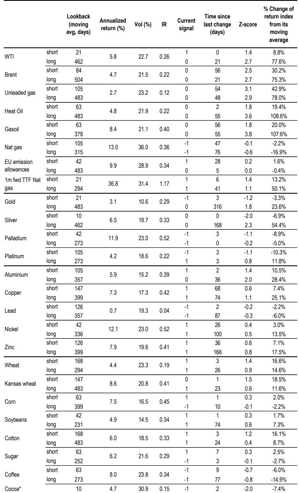
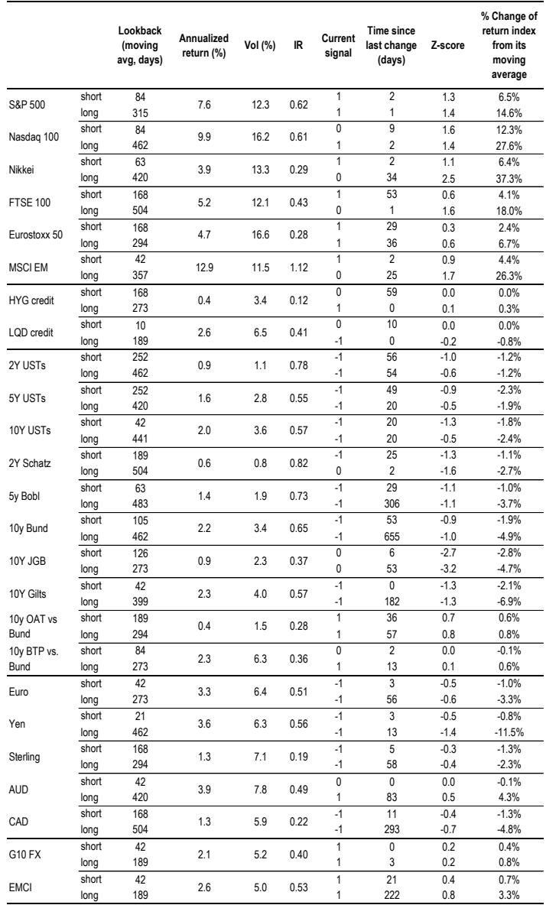
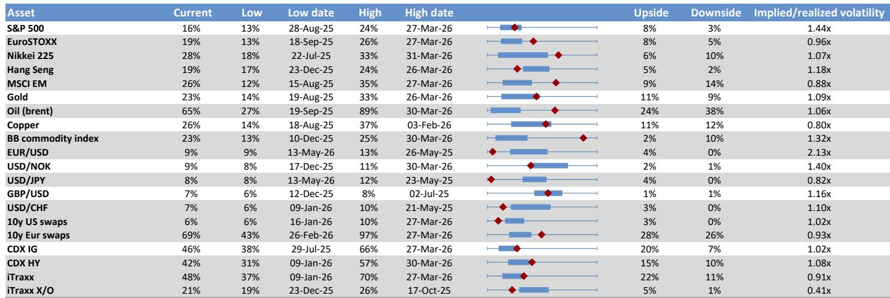

# The Equity Risk Premium Has Narrowed to a Post-Crisis Low, and That Changes the Calculus for Every Long-Term Portfolio

The gap between what equities yield and what bonds yield has compressed to a level not seen since before the global financial crisis. According to a recent cross-asset flows and liquidity analysis, the equity risk premium for the S&P 500 now stands at only 2.2 percent, a full 90 basis points below its long-run historical average of 3.1 percent. This is not merely a statistical curiosity. It represents a structural shift in the relative attractiveness of two of the largest asset classes in the world, and it carries direct implications for institutional asset allocation, risk management, and the sustainability of the current equity rally.

The immediate question is whether rising bond yields have finally reached a threshold that will begin to pressure equity markets. The data suggests that the cushion has thinned considerably. While the ERP remains above the near-zero levels seen at the peak of the tech bubble in 2000, the margin for error has shrunk. A further rise in real bond yields from here could trigger a meaningful repricing in equities, not because equities are inherently fragile, but because the risk compensation investors demand for holding them has already been eroded.

This analysis is not about predicting a crash. It is about recognizing that the post-financial-crisis regime of cheap money and generous equity risk premia is over. Investors who continue to allocate capital based on the assumptions of the last decade are implicitly betting that bond yields will not rise further. That is a bet worth examining carefully.

**The equity risk premium has collapsed because equity discount rates have been unusually stable while bond yields have surged.**

The core insight from the report is that the equity discount rate, the real yield investors implicitly require to hold the S&P 500, has been remarkably insensitive to the rise in bond yields over the past two years. The model-based real equity discount rate currently sits at approximately 4.4 percent, only 60 basis points below the 5 percent average that has prevailed since the mid-1990s. In contrast, real 10-year U.S. Treasury yields have moved from near zero in early 2022 to levels that now meaningfully compress the gap between the two.

This asymmetry is historically unusual. During the period of high macro and policy uncertainty between 1967 and 1981, equity yields moved almost in tandem with bond yields. When interest rates rose, equity discount rates rose with them, and the ERP remained relatively stable. After 1981, better macroeconomic policies contributed to a normalization of both bond and equity yields, a process that lasted roughly 15 years. But since 1996, equity discount rates have hovered around 5 percent even as real bond yields trended steadily lower, approaching zero by March 2020. The ERP widened to a peak of nearly 700 basis points in 2020, and that generous risk premium underpinned the long equity bull market.

What has changed is that the ERP is now compressing rapidly from the other direction. Bond yields are rising while equity discount rates are not adjusting upward at the same pace. The result is that equities look expensive on a relative basis. The report estimates that the current equity discount rate implies an 18 percent overvaluation in price terms relative to the norms of the past thirty years, simply by multiplying the 60 basis point shortfall by a duration of roughly 30 years. That is a significant departure from fair value, and it becomes even more pronounced when compared directly to bonds.

**The bond market is already signaling that a structural shift in positioning is underway.**

The report identifies which investor categories have been driving the recent long positioning in bonds. This is not an abstract question. Understanding who is buying bonds and why reveals whether the current bond yield levels are sustainable or whether they reflect a temporary positioning imbalance that could reverse.

The largest active U.S. bond mutual fund managers are currently long duration, as measured by their 21-day rolling beta to the U.S. Aggregate Bond Index. Their positioning is above the long-term average, indicating a deliberate decision to extend duration in anticipation of either lower yields or a flight to safety. Balanced mutual fund managers, who invest in both equities and bonds, have also raised their bond betas significantly since the onset of the Iran conflict, moving well above historical averages. This suggests that multi-asset managers are rotating out of equities and into bonds as a defensive measure, not merely as a tactical trade.

European bond fund managers, by contrast, appear closer to neutral. The divergence between U.S. and European bond positioning is itself informative. It implies that the bond yield repricing is not a global phenomenon driven by a uniform macroeconomic shock, but rather one that is concentrated in U.S. markets and potentially linked to geopolitical risk premiums that are more acutely felt in dollar-denominated assets.

The report also notes that implied bond positioning, as measured by the reaction of bond markets to economic news, shifted into positive territory in late April. A positive reading on this metric means that bond investors have found themselves longer duration than they would like given the flow of economic data. In other words, the market is already positioned for a scenario in which bond yields decline or economic growth disappoints. If the data instead continues to surprise to the upside, this positioning could unwind quickly, pushing yields higher and exacerbating the pressure on equities.

**What the report does not fully answer is whether the current ERP compression is a cyclical or structural phenomenon.**

The analysis provides a clear picture of where the ERP stands today and how it arrived here. It does not, however, resolve the deeper question of whether this compression is temporary or permanent. The answer matters enormously for long-term asset allocation.

One possibility is that the ERP is compressing because the equity market is pricing in a new regime of lower macroeconomic uncertainty. If inflation remains contained, if geopolitical risks fade, and if central banks succeed in engineering a soft landing, then a lower ERP might be justified. Equities would be expensive relative to history, but not irrationally so. In this scenario, bond yields would stabilize or decline, and the current tension between bonds and equities would resolve itself without a major correction.

The alternative possibility is that the ERP is compressing because equity investors are ignoring duration risk. The equity discount rate has been sticky at around 5 percent for nearly three decades, but that stickiness may itself be a relic of the disinflationary era. If the macro regime has shifted to one of higher and more volatile real rates, the equity discount rate may need to rise to reflect that new reality. In that case, the current ERP of 2.2 percent is not a floor but a waypoint on the path to an even lower level, or alternatively, a precursor to a sharp repricing when bond yields cross a threshold that forces equity investors to adjust their discount rate assumptions.

The report notes that the ERP reached near zero at the peak of the tech bubble, so there is room for further compression before reaching that extreme. But the path to that outcome would require either a continued equity rally or a continued rise in bond yields, or both. The risk is that the combination of expensive equities and rising yields creates a self-reinforcing dynamic in which the ERP compresses further until it breaks.

**The decision framework for investors should focus on the sensitivity of equity discount rates to bond yields, not on the level of yields alone.**

The report provides a useful framework for thinking about this question, even if it does not offer a definitive answer. The key variable is not the absolute level of bond yields, but the responsiveness of equity discount rates to changes in those yields. If equity discount rates remain as insensitive as they have been since 1996, then a further rise in bond yields will continue to compress the ERP and make equities progressively more expensive relative to bonds. If equity discount rates become more sensitive, as they were during the 1967-1981 period, then the ERP could stabilize, but only at the cost of lower equity prices.

For long-term investors, the implication is that the risk-reward tradeoff has shifted. The report states explicitly that from a long-term asset allocation point of view, bonds should command a higher weight relative to equities compared to the norms of the post-financial-crisis period. This is not a market timing call. It is a structural assessment based on the current level of the ERP and the historical evidence that such low levels have typically preceded periods of subpar equity returns.

The report also raises a second-order question that investors should consider. If tokenized money market funds still represent a relatively small proportion of the stablecoin universe, as the report notes, then the shift into bonds may not yet be fully captured in traditional flow data. The migration of capital from digital assets into traditional fixed income could be an underappreciated source of demand for bonds, and one that may persist even if equity markets remain resilient.

**Join the community to read the full report and review the original charts.**

The analysis summarized here is drawn from a longer report that includes detailed charts on the evolution of the equity discount rate, the real bond yield, the equity risk premium, and the positioning of various investor categories. The original report also contains a cross-asset positioning monitor that shows current percentile rankings for equities, government bonds, credit, the dollar, commodities, gold, bitcoin, and regional equity markets. These charts provide context that cannot be fully captured in text, and they are essential for any investor who wants to make their own assessment of the risks.

The report leaves several important questions open. Will the equity discount rate eventually adjust upward, or will bond yields fall back to restore the ERP? Which investor category will be the marginal buyer of bonds if yields continue to rise? And how will the growing role of tokenized money market funds alter the traditional relationship between bond and equity flows? These are not questions that can be answered with a single data point, but they are the questions that will define the next phase of the market cycle.

Join the community to read the full report and review the original charts.

*This article is for learning and discussion only and does not constitute investment advice.*

Personal reading notes and learning share only. Not investment advice.

