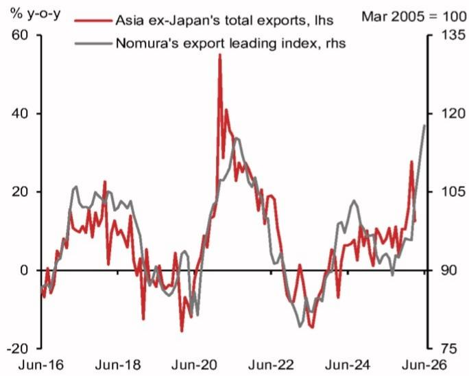

# 亚洲出口复苏的真正信号：不再是普涨，而是AI驱动的结构性分化

当市场还在为全球贸易的周期性回暖争论不休时，一份来自某外资投行的最新先行指标揭示了一个更值得关注的现实：亚洲出口的确在走强，但驱动力的高度集中正在重塑整个区域的增长格局。那些习惯了“亚洲出口增长意味着所有经济体同步受益”的旧逻辑，可能已经无法解释当下正在发生的变化。

这份名为NOM’s Export Leading Index（NELI）的指标在6月攀升至117.7，创下2010年7月以来的最高水平，且已是连续第四个月上行。从历史经验看，NELI对亚洲出口的拐点判断准确度极高，且因其剔除了基数效应的干扰，比官方出口数据更能反映真实动能。换句话说，这不是一个模糊的乐观信号，而是一个明确的、有数据支撑的周期启动信号。

但真正有价值的判断，不是“出口复苏了”，而是“出口复苏的驱动力高度集中，且这种集中正在制造赢家与输家的裂谷”。

## 1. 这轮出口周期的驱动力几乎完全来自半导体和AI相关链条

NELI的九个构成成分中，6月读数上行的主要推手是两项：费城半导体指数的同比增速达到三位数，以及中国从亚洲其他地区的进口出现改善。这两者指向的是同一个逻辑——全球AI基础设施投资正在拉动亚洲半导体产业链的出口。

台湾和韩国是这一轮复苏的典型代表。作为全球先进制程芯片和存储芯片的核心供应地，两地的出口增速在过去几个月显著跑赢区域平均水平。这份报告明确指出，AI技术驱动的经济体正在引领这轮出口上升周期。

这意味着什么？对于投资者而言，过去那种“买整个亚洲出口板块”的策略已经失效。半导体周期与AI资本开支的绑定程度，决定了哪些经济体能够真正受益。而那些依赖大宗商品、低端制造或传统消费电子组装的东南亚经济体，尽管也会感受到全球贸易回暖的暖意，但增长弹性明显弱于半导体核心区。

## 2. 非科技领域和部分东盟国家的出口表现相对温和

报告使用了“bifurcated”一词来描述当下的区域出口格局，直译为“分叉”，但在投资语境中，更准确的理解是“结构性分化”。

非科技领域的出口增长明显乏力。这背后的原因并不复杂：全球终端需求并未出现全面爆发。欧美央行的利率水平仍处于高位，消费者对耐用品的支出并未大幅回升，而企业的资本开支也主要集中在AI相关的基础设施上，而非传统的产能扩张。

东盟国家中，除了一些与半导体封装测试相关的经济体，多数国家的出口增速远不如台湾和韩国亮眼。这种分化不是短期的扰动，而是全球产业链再布局和AI技术浪潮共同作用下的结构性结果。报告没有展开的是，这种分化可能在未来几个季度持续强化，因为AI相关投资的确定性远高于传统需求的复苏。

## 3. 地缘政治风险仍是最大的“不可预测项”

报告专门提到了地缘政治风险作为潜在的“摇摆因素”。中东冲突的持续可能扰乱供应链、推高航运成本并削弱外部需求，从而制约亚洲出口的上行空间。

这一判断的隐含意义值得深思。当前NELI的读数已经反映了市场对AI和半导体出口的乐观预期，但并没有充分计入地缘政治冲击带来的供应链中断风险。红海航运危机、中美科技竞争的进一步升级、以及区域贸易协定的执行不确定性，都可能成为打断这轮出口复苏的变量。

对于决策者而言，这意味着不能简单地将NELI的上行视为“无风险买入信号”。出口复苏的可持续性，取决于地缘政治风险是否会在未来几个季度实质性恶化。这份报告提供了一个观察窗口：韩国每月的20天出口初值数据，被认为是判断亚洲贸易脉冲的最及时指标。5月21日即将公布的数据，将是验证这一轮复苏是否具有韧性的第一个关键节点。

## 4. 报告尚未完全回答的关键问题：AI驱动的出口繁荣能否对冲传统需求的疲软？

这是整份报告最值得追问的问题，也是报告本身没有完全展开的盲区。

NELI的构成中，半导体相关的指标权重较高。这意味着，当半导体出口强劲时，NELI自然会走高。但问题在于，非科技领域的出口疲软是否会拖累整体复苏的持续性？换句话说，如果AI资本开支放缓，或者全球半导体周期进入下行阶段，亚洲出口的支撑点在哪里？

报告没有给出答案。它只是指出了现象，但并未深入分析“AI驱动的出口繁荣”与“传统需求疲软”之间的对冲关系。这种分析需要更细颗粒度的数据：比如，韩国和台湾的半导体出口中，有多少是直接服务于AI训练与推理的，多少是传统的消费电子与汽车芯片？如果AI相关部分占比过高，那么一旦AI资本开支出现边际放缓，出口增速的回调幅度可能比市场预期的更大。

这个问题的答案，决定了当前NELI的高读数究竟是周期启动的信号，还是结构性的假象。

## 5. 一个更实用的观察框架：从“区域出口”转向“链条出口”

基于以上分析，投资者和产业决策者需要调整自己的观察框架。过去，亚洲出口被视为一个整体，关注的是总量增速和区域分布。但在当下，更有意义的框架是从“区域”转向“链条”。

具体来说，可以建立三个观察维度：

第一，半导体链条的景气度。费城半导体指数、全球半导体销售额、以及韩国半导体出口数据，是判断亚洲出口核心动力的最直接指标。如果这些指标出现拐点，那么整个亚洲出口的复苏逻辑就会动摇。

第二，中国进口的“再分配效应”。报告特别提到了中国从亚洲其他地区的进口改善。这一指标的意义在于，中国自身的经济复苏和产业升级，正在改变其与亚洲其他经济体的贸易关系。如果中国对芯片、设备和中间品的进口持续增长，那么东南亚和日韩的相关出口企业将受益；反之，如果中国本土替代加速，则其他亚洲经济体的出口份额可能被挤压。

第三，航运成本与供应链稳定性。地缘政治风险对航运成本的影响，是判断出口复苏是否可持续的“温度计”。如果航运成本持续高企，即使需求存在，企业的出口利润也会被侵蚀，最终抑制出口量的增长。

这三个维度加在一起，才能构成对NELI信号的完整解读。单独看任何一个指标，都可能得出片面的结论。

## 6. 一个尚未被定价的潜在风险：出口复苏的质量可能低于总量数据的表现

NELI是一个总量指标，它反映的是出口金额的变动，而非出口企业的盈利质量。在当前的宏观环境下，出口复苏的质量可能比总量更重要。

如果出口增长主要来自价格驱动（比如半导体价格上涨），而非量的扩张，那么企业的营收增长可能无法转化为利润增长。此外，如果航运成本上升和汇率波动侵蚀了出口企业的利润率，那么即使出口数据亮眼，相关股票的表现也可能落后于指数。

报告没有讨论这个问题，但这恰恰是投资者在做资产配置时最需要考虑的。总量数据只是起点，真正决定投资回报的，是出口复苏的质量和可持续性。

---

以上分析所依据的原始报告包含了NELI的详细构建方法、历史回测表现、以及各构成成分的权重分布。这些技术细节对于理解指标的局限性至关重要。例如，NELI的领先时间约为三个月，这意味着当前的高读数反映的是未来两到三个月的出口前景，但无法预测更远期的拐点。此外，报告中的图表数据揭示了亚洲各经济体出口增速的分化程度，这些原始数据本身包含了许多未被展开的二阶影响。

欢迎来星球微信群里继续讨论：如果出口复苏的质量低于预期，哪些资产类别会率先承压？NELI的九个构成成分中，哪一个才是预测拐点的最灵敏指标？这些问题的答案，需要结合完整的报告数据和更细致的行业研究才能得出。

Personal reading notes and learning share only. Not investment advice.

