# China Equity Strategy

# How crowded is the AI trade and other frequently asked investor questions

# Buoyant mood supported by earnings and improving fundamentals

In this note, we provide answers to five of the topical questions by investors in our recent conversations. In general sentiment is buoyant with investors largely putting behind the impact of Strait of Hormuz shutdown, anchored by solid earnings from hardware tech companies. AI hardware tech seems to be the consensus long among investors with PM's and generalists dedicating more time looking for alpha opportunities along the supply chain though some investors question the sustainability of the rally given crowded positions. The property market recovery also garnered significant level of interest from investors and while conviction level of a sustained recovery is not high, the positive development is supportive for overall market sentiment. Another topic of interest was whether the recent rise in PPI, driven by imported inflation, could weigh on corporate earnings this time around. In addition, investors showed interest in the potential re-rating of HSTECH though in general sentiment is poor around the internet sector.

# How crowded is the AI trade and what could derail the rally?

Current investor positioning of AI hardware names is elevated but this has been the case most of this year as evidenced by: 1) onshore mutual fund positioning in telecom and electronics have been broadly stable in the last 3 quarters with a decline in electronics allocation offset by higher allocation towards telecoms (Figure 2); 2) the average crowding factor of a basket of popular AI names indicate that investor positioning has risen this year, although there has been a modest pullback from the high recorded in early May 2026 (Figure 3); 3) Turnover in the broader TMT sector is elevated at \~37% of total A-share turnover, compared with a historical peak of 43% in 2023. Looking at regional flows and positions, foreign investor outflows from Taiwan and Korea equities (both global AI proxies) this year suggest some broad profit taking in this space. Meanwhile, domestic token pricing has been rising and while valuation is high with semi's for example trading on 59x forward P/E (2.5 std. dev above historical average shown in Figure 41), earnings growth in the sector has also been accelerating (up 64% in 1Q26). It is difficult to specifically pinpoint the events that could derail the tech rally with some investors pointing to the rising US interest rates, IPO's of the large LLM companies and a slowdown in earnings growth as potential sign-posts that could trigger a re-assessment of positioning.

# Would higher PPI lead to lower earnings?

Investors were concerned whether imported inflation would squeeze corporate margins given the recent surge in energy prices. We think a higher PPI may not hurt overall listed company earnings given the following observations: 1) higher PPI's historically have led to higher revenue and earnings growth in listed companies. This relationship also held up during the Russia–Ukraine war in 2022, when supply disruptions also drove a surge in energy and transport prices; 2) exporters' earnings historically have done well in periods of imported inflation as this gives companies an excuse to raise prices (Figure 23), 3) listed companies generally have better ability to pass on the higher costs to customers - historically utilities and food and beverage companies' earnings were shown to be the most impacted by higher energy prices but they make up a small portion of the overall index at c.10%, 4) energy shocks typically benefit the renewable sector which make up a large portion of the index, and 5) consumers were somewhat insulated given only a portion of the higher energy costs were passed down to retail prices.

What to do with HSTECH and the impact from IPO lock-up expiry?

# Equity Strategy

China

James Wang

Strategist

james-zb.wang@ubs.com

+852-3712 2557

Tommy Tang, CFA

Strategist

tommy.tang@ubs.com

+852-2971 8357

Lei Meng

Strategist

S1460517080001

lei.meng@ubs.com

+86-21-3866 8939

Yu Sheng

Strategist

S1460524080001

yu.sheng@ubs.com

+86-21-3866 4873

Last month we held the tactical view (see here) that HSTECH could outperform near term given a myriad of catalysts coming up. Many of these catalysts have come through as we had hoped for including: 1) launch of the new LLM models from Deepseek and Tencent; 2) food delivery competition easing in the quarterly results, 3) US China leadership summit promoting strategic stability and leading to H200 chip ban lift, 4) EV demand to pick up as oil price stay higher for longer. While these development were positive, we now think it may take longer for HSTECH to outperform: our recent discussions with investors suggest that their attention remains focused around hardware tech, power equipment and other North Asian names which may have drawn liquidity away from HK internet names. We also note upcoming lock-up expiry coming up for the LLM companies in July - historically companies facing lock-up expiry typically underperform in the lead-up to the expiry date and should these LLM companies be included in HSTECH, this could also trigger some short term pressure for the index performance. We have included a schedule of lock-up expiry in the coming months in Figure 32.

# Prefer A-share ChiNext, tech hardware and electrical equipment

We prefer A-share ChiNext given its greater exposure towards robust earnings momentum (+23% in 1Q26) and its higher exposure towards hardware tech and power equipment names. Our preferred sectors and model portfolio are shown in Figure 39 and 40 - we have removed the property underweight though retain our underweight in consumers.

# How crowded is the AI trade?

AI has remained the most widely discussed topic during our investor conversations. Most investors acknowledged that the AI narrative is well supported by strong fundamentals. The key concern is the degree of crowding in the AI trade and the potential downside risk should positioning unwind. Current indicators suggest that crowding in the AI theme is high but this has been the case for some time and broadly unchanged in recent periods:

- Onshore mutual fund positioning: Allocation to electronics declined from a peak of 22% in 3Q25 to 20% in 1Q26, with overweight (OW) relative to benchmark reduced by c.2ppt. In contrast, allocations to telecom (another AI-linked sector) rose to an all-time high of 11% as of 1Q26, representing 4ppt overweight versus benchmark. If we combine the aggregate positioning in electronics and telecom, positions are close to a historical high though broadly unchanged in the last 3 quarters (show in Figure 2).   
- Stock-level positioning: Crowding scores for a sample basket of popular AI names (see list in Figure 7, list based on our previous report on China AI) indicate that investor positioning has increased materially in the last 12 months, although there has been a modest pullback from the highest recorded in early May 2026.   
- Market activity concentration: Turnover in the broader TMT sector has trended higher since 2025 and remains elevated at \~37% of total A-share turnover, compared with a historical peak of 43% in 2023.

Foreign investor flows out of Taiwan and Korea equities (both are AI proxies) in recent months also suggest some profit taking by investors of these themes in recent periods. Our EM team's data suggest that investors' remain underweight in the North Asian markets.

Figure 1: Onshore mutual fund holdings in A share electronics   
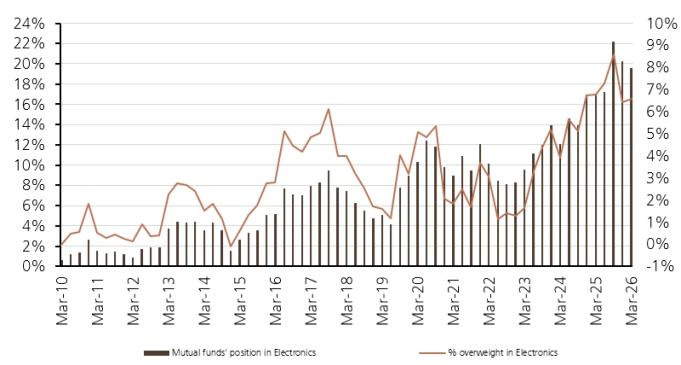

bar_line

| Date   | Mutual funds' position in Electronics | % overweight in Electronics |
|--------|--------------------------------------|-----------------------------|
| Mar-10 | 1%                                   | 0%                          |
| Mar-11 | 2%                                   | 2%                          |
| Mar-12 | 3%                                   | 1%                          |
| Mar-13 | 4%                                   | 3%                          |
| Mar-14 | 5%                                   | 4%                          |
| Mar-15 | 6%                                   | 5%                          |
| Mar-16 | 8%                                   | 7%                          |
| Mar-17 | 10%                                  | 9%                          |
| Mar-18 | 12%                                  | 8%                          |
| Mar-19 | 14%                                  | 6%                          |
| Mar-20 | 16%                                  | 5%                          |
| Mar-21 | 18%                                  | 4%                          |
| Mar-22 | 20%                                  | 3%                          |
| Mar-23 | 22%                                  | 2%                          |
| Mar-24 | 24%                                  | 1%                          |
| Mar-25 | 26%                                  | 0%                          |
| Mar-26 | 28%                                  | -1%                         |

Source: Wind, UBS

Figure 2: Onshore mutual fund holdings in A share telecom and electronics   
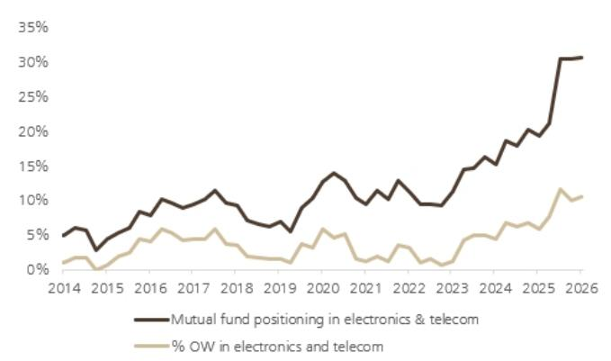

line

| Year | Mutual fund positioning in electronics & telecom | % OW in electronics and telecom |
|------|--------------------------------------------------|----------------------------------|
| 2014 | ~5%                                              | ~1%                              |
| 2015 | ~3%                                              | ~0%                              |
| 2016 | ~8%                                              | ~4%                              |
| 2017 | ~10%                                             | ~5%                              |
| 2018 | ~8%                                              | ~3%                              |
| 2019 | ~6%                                              | ~2%                              |
| 2020 | ~14%                                             | ~5%                              |
| 2021 | ~10%                                             | ~2%                              |
| 2022 | ~13%                                             | ~3%                              |
| 2023 | ~10%                                             | ~5%                              |
| 2024 | ~18%                                             | ~6%                              |
| 2025 | ~20%                                             | ~8%                              |
| 2026 | ~30%                                             | ~10%                             |

Source: Wind, UBS

Figure 3: Crowding scores vs performance of popular China AI names (ex-internet)   
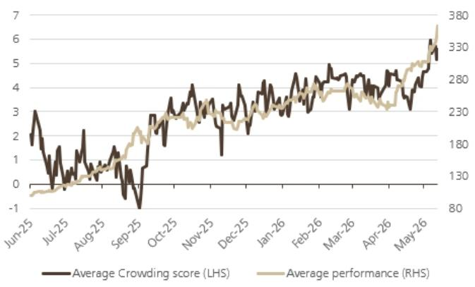

line

| Month   | Average Crowding score (LHS) | Average performance (RHS) |
|---------|-------------------------------|---------------------------|
| Jun-25  | 3                             | 80                        |
| Jul-25  | 0                             | 130                       |
| Aug-25  | 1                             | 180                       |
| Sep-25  | -1                            | 230                       |
| Oct-25  | 3                             | 280                       |
| Nov-25  | 4                             | 330                       |
| Dec-25  | 3                             | 380                       |
| Jan-26  | 4                             | 330                       |
| Feb-26  | 5                             | 380                       |
| Mar-26  | 4                             | 330                       |
| Apr-26  | 5                             | 380                       |
| May-26  | 6                             | 380                       |

Source: UBS Quant Research, FactSet Note: Crowding scores and performance are equally weighted. Last data point up to 13 May 2026

Figure 4: TMT turnover as % of total A share turnover (30DMA)   
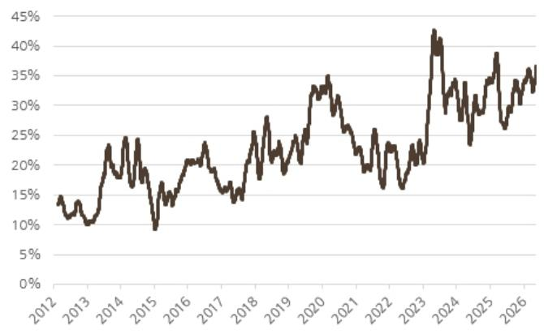

line

| Year | Value |
|------|-------|
| 2012 | 15%   |
| 2013 | 10%   |
| 2014 | 25%   |
| 2015 | 10%   |
| 2016 | 20%   |
| 2017 | 15%   |
| 2018 | 25%   |
| 2019 | 30%   |
| 2020 | 35%   |
| 2021 | 25%   |
| 2022 | 20%   |
| 2023 | 30%   |
| 2024 | 40%   |
| 2025 | 35%   |
| 2026 | 35%   |

Source: Bloomberg, FactSet, UBS Note: IT and communication services are included

Figure 5: Cumulative foreign net inflows into EM equities (ex-China)   
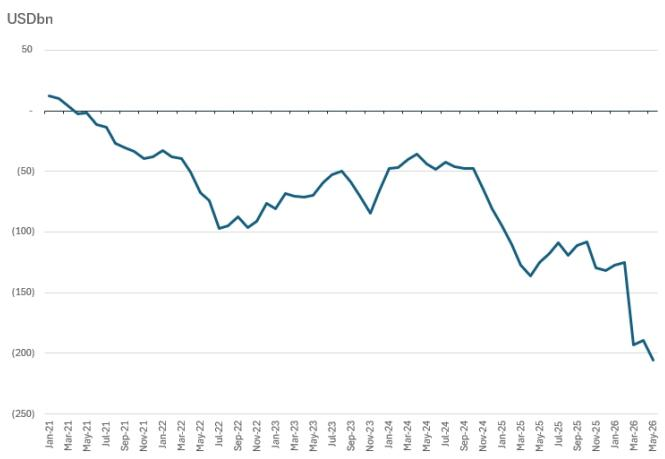

line

| Date    | Value (USDbn) |
|---------|---------------|
| Jun-21  | ~30           |
| Mar-21  | ~25           |
| May-21  | ~20           |
| Jul-21  | ~15           |
| Sep-21  | ~10           |
| Nov-21  | ~5            |
| Jan-22  | ~0            |
| Mar-22  | ~-5           |
| May-22  | ~-10          |
| Jul-22  | ~-15          |
| Sep-22  | ~-10          |
| Nov-22  | ~-5           |
| Jan-23  | ~0            |
| Mar-23  | ~5            |
| May-23  | ~10           |
| Jul-23  | ~15           |
| Sep-23  | ~10           |
| Nov-23  | ~5            |
| Jan-24  | ~0            |
| Mar-24  | ~5            |
| May-24  | ~10           |
| Jul-24  | ~5            |
| Sep-24  | ~0            |
| Nov-24  | ~-5           |
| Jan-25  | ~-10          |
| Mar-25  | ~-15          |
| May-25  | ~-10          |
| Jul-25  | ~-5           |
| Sep-25  | ~0            |
| Nov-25  | ~5            |
| Jan-26  | ~10           |
| Mar-26  | ~-10          |
| May-26  | ~-15          |

Source: Bloomberg, UBS Note: Last data point as of 15 May 2026

Figure 6: Cumulative foreign net inflows into Korea and Taiwan equities   
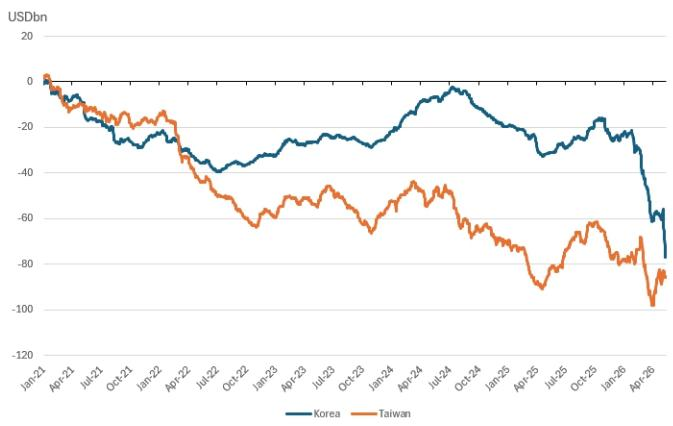

line

| Date    | Korea | Taiwan |
|---------|-------|--------|
| Jan-21  | 0     | 0      |
| Apr-21  | -10   | -5     |
| Jul-21  | -15   | -10    |
| Oct-21  | -20   | -15    |
| Jan-22  | -25   | -20    |
| Apr-22  | -30   | -25    |
| Jul-22  | -35   | -30    |
| Oct-22  | -40   | -35    |
| Jan-23  | -45   | -40    |
| Apr-23  | -50   | -45    |
| Jul-23  | -55   | -50    |
| Oct-23  | -60   | -55    |
| Jan-24  | -65   | -60    |
| Apr-24  | -70   | -65    |
| Jul-24  | -75   | -70    |
| Oct-24  | -80   | -75    |
| Jan-25  | -85   | -80    |
| Apr-25  | -90   | -85    |
| Jul-25  | -95   | -90    |
| Oct-25  | -100  | -95    |
| Jan-26  | -105  | -100   |
| Apr-26  | -110  | -105   |

Source: Bloomberg, UBS Note: Last data point as of 15 May 2026

Figure 7: China AI names used in crowding score calculation 

<table><tr><td>Ticker</td><td>Name</td><td>YTD return</td><td>Market cap (CNYbn)</td><td>30D ADTV (CNYbn)</td></tr><tr><td>688256-CN</td><td>Cambricon Technologies Corp. Ltd. Class A</td><td>34%</td><td>765</td><td>15.0</td></tr><tr><td>601138-CN</td><td>Foxconn Industrial Internet Co., Ltd. Class A</td><td>12%</td><td>1369</td><td>14.5</td></tr><tr><td>300308-CN</td><td>Zhongji Innolight Co., Ltd. Class A</td><td>71%</td><td>1164</td><td>23.6</td></tr><tr><td>300394-CN</td><td>Suzhou TFC Optical Communication Co., Ltd. Class A</td><td>90%</td><td>300</td><td>15.8</td></tr><tr><td>688041-CN</td><td>Hygon Information Technology Co., Ltd. Class A</td><td>35%</td><td>706</td><td>10.1</td></tr><tr><td>600183-CN</td><td>Shengyi Technology Co., Ltd. Class A</td><td>39%</td><td>240</td><td>4.4</td></tr><tr><td>600584-CN</td><td>JCET Group Co., Ltd. Class A</td><td>59%</td><td>104</td><td>4.9</td></tr><tr><td>002156-CN</td><td>TongFu Microelectronics Co., Ltd. Class A</td><td>54%</td><td>88</td><td>5.2</td></tr><tr><td>002371-CN</td><td>NAURA Technology Group Co Ltd Class A</td><td>30%</td><td>433</td><td>5.9</td></tr><tr><td>981-HK</td><td>Semiconductor Manufacturing International Corp. Class A</td><td>-4%</td><td>594</td><td>5.5</td></tr><tr><td>1347-HK</td><td>Hua Hong Semiconductor Ltd. Class A</td><td>56%</td><td>194</td><td>3.0</td></tr><tr><td>VNET-US</td><td>VNET Group, Inc. Sponsored ADR</td><td>24%</td><td>20</td><td>0.6</td></tr><tr><td>GDS-US</td><td>GDS Holdings Ltd.</td><td>20%</td><td>58</td><td>0.5</td></tr><tr><td>522-HK</td><td>ASMPT</td><td>129%</td><td>64</td><td>0.6</td></tr></table>

Source: FactSet, UBS Note: based on the report excluding internet and software names

Figure 8: EM funds' active holdings across major markets as of 1Q26   
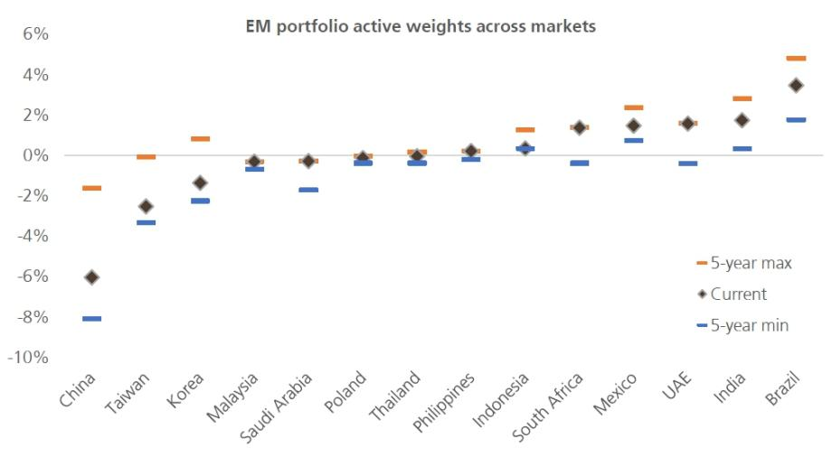

line

| Country       | 5-year max | Current | 5-year min |
| ------------- | ---------- | ------- | ---------- |
| China         | -2%        | -6%     | -8%        |
| Taiwan        | 0%         | -3%     | -4%        |
| Korea         | 1%         | -2%     | -3%        |
| Malaysia      | 0%         | -1%     | -2%        |
| Saudi Arabia  | 0%         | -1%     | -3%        |
| Poland        | 0%         | -1%     | -2%        |
| Thailand      | 0%         | -1%     | -2%        |
| Philippines   | 0%         | 0%      | -1%        |
| Indonesia     | 1%         | 0%      | 0%         |
| South Africa  | 0%         | 1%      | -1%        |
| Mexico        | 2%         | 1%      | 0%         |
| UAE           | 1%         | 1%      | -1%        |
| India         | 3%         | 2%      | 0%         |
| Brazil        | 5%         | 4%      | 2%         |

Source: Bloomberg, UBS

# What could derail the AI tech trade in China?

There is no definitive answer to this question given the strong fundamentals and near term share price momentum. Investors are seemingly looking more into the US market for read-across for China tech - we note that the correlation between US and China AI tech names have picked up materially this year as shown in Figure 12 and as such we believe global spillover presents one of the biggest downside risks to the AI tech trade in China.

There are sign-posts that investors may look to as potential pit stops in re-assessing the AI trade, including:

- Continued rise in US yields (primarily driven by higher energy prices) though arguably this is now somewhat reflected in the share price given the significant rise in the US 10 year interest rate in recent periods. We note that historically the correlation of Chinese hardware tech to US 10 year government bond yield has been limited;   
- Deceleration in earnings growth, though so far earnings growth has been robust for the AI hardware tech space and accelerating as shown in Figure 10. This is also the case for US tech hardware names;   
- Listing of the largest LLM providers in the US. Some investors may see this as a sign of peak growth of LLM monetization.

Figure 9: US 10Y treasury yield has been rising   
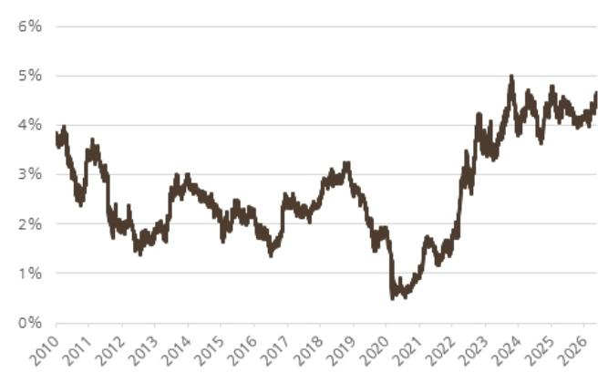

line

| Year | Value |
|------|-------|
| 2010 | 3.8%  |
| 2011 | 3.5%  |
| 2012 | 2.5%  |
| 2013 | 1.8%  |
| 2014 | 2.8%  |
| 2015 | 2.5%  |
| 2016 | 2.2%  |
| 2017 | 1.5%  |
| 2018 | 2.5%  |
| 2019 | 3.2%  |
| 2020 | 1.8%  |
| 2021 | 0.5%  |
| 2022 | 1.5%  |
| 2023 | 3.5%  |
| 2024 | 5.0%  |
| 2025 | 4.5%  |
| 2026 | 4.8%  |

Source: FactSet, UBS

Figure 10: China AI tech hardware earnings YoY vs share price quarterly change   
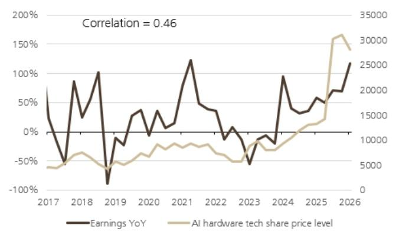

line

| Year | Earnings YoY | AI hardware tech share price level |
|------|--------------|------------------------------------|
| 2017 | ~80%         | ~5000                              |
| 2018 | ~90%         | ~6000                              |
| 2019 | ~-100%       | ~5000                              |
| 2020 | ~40%         | ~7000                              |
| 2021 | ~120%        | ~8000                              |
| 2022 | ~30%         | ~9000                              |
| 2023 | ~-50%        | ~10000                             |
| 2024 | ~100%        | ~15000                             |
| 2025 | ~60%         | ~25000                             |
| 2026 | ~120%        | ~35000                             |

Source: FactSet, UBS Note: Based on the list in figure 7

Figure 11: China semi earnings growth accelerating YoY   
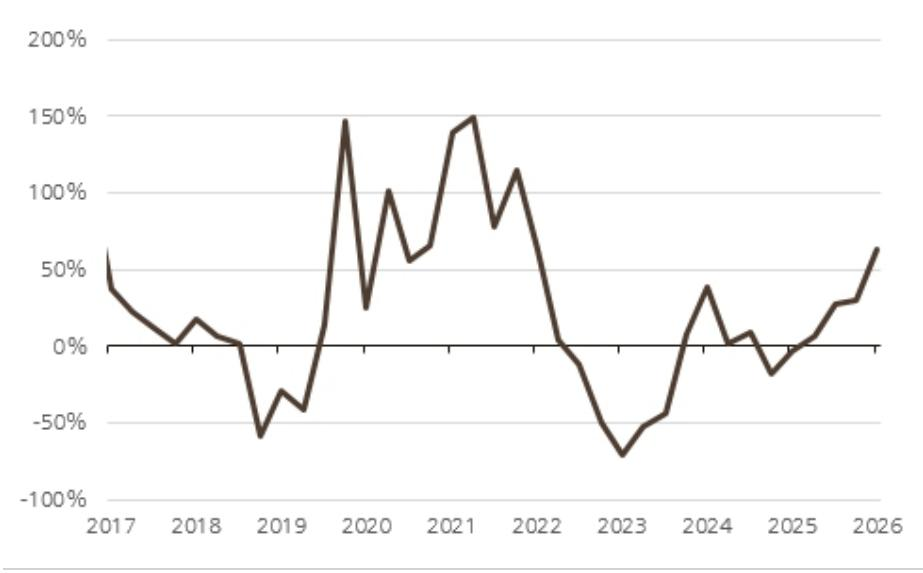

line

| Year | Value  |
|------|--------|
| 2017 | ~60%   |
| 2018 | ~0%    |
| 2019 | ~-60%  |
| 2020 | ~150%  |
| 2021 | ~150%  |
| 2022 | ~100%  |
| 2023 | ~-80%  |
| 2024 | ~40%   |
| 2025 | ~-20%  |
| 2026 | ~60%   |

Source: FactSet, UBS

Figure 12: Sector correlation with US 10Y yield since 2017 (tech hardware close to zero)   
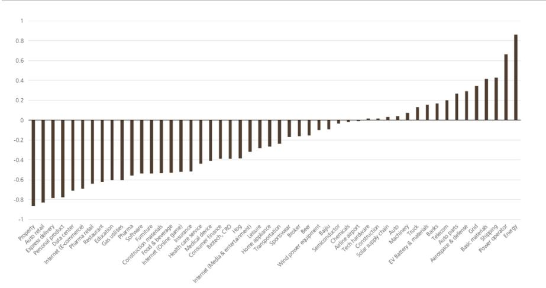

bar

| Industry | Value |
| --- | --- |
| Property | -0.9 |
| Auto retail | -0.85 |
| Express delivery | -0.8 |
| Personal product | -0.75 |
| Data center | -0.7 |
| Internet (E-commerce) | -0.65 |
| Pharmaceuticals | -0.6 |
| Retailer | -0.55 |
| Restaurant | -0.5 |
| Education | -0.45 |
| Gas utilities | -0.4 |
| Pharma | -0.35 |
| Software | -0.3 |
| Furniture | -0.25 |
| Construction materials | -0.2 |
| Food & beverages | -0.15 |
| Power & beverages | -0.1 |
| Internet (Online services) | -0.05 |
| Insurance | 0.0 |
| Health care service | 0.05 |
| Medical device | 0.1 |
| Consumer finance | 0.15 |
| Biotech, CRO | 0.2 |
| H2O | 0.25 |
| Home appliances | 0.3 |
| Leisure | 0.35 |
| Transportation | 0.4 |
| Sportswear | 0.45 |
| Bioker | 0.5 |
| Wind power equipment | 0.55 |
| Beer | 0.6 |
| Bajili | 0.65 |
| Semiconductor | 0.7 |
| Chemicals | 0.75 |
| Airline airport | 0.8 |
| Tech hardware | 0.85 |
| Construction | 0.9 |
| Solar supply chain | 0.95 |
| Auto | 1.0 |
| Machinery | 1.05 |
| Truck | 1.1 |
| EV battery & materials | 1.15 |
| Banks | 1.2 |
| Telecom | 1.25 |
| Auto parts | 1.3 |
| Aerospace & defense | 1.35 |
| Grid | 1.4 |
| Basic materials | 1.45 |
| Shipping | 1.5 |
| Power operator | 1.55 |
| Energy | 1.6 |

Source: FactSet, UBS Note: Based on daily price levels

Figure 13: Correlation of selected popular China AI hardware names and NYSE Semiconductor Index   
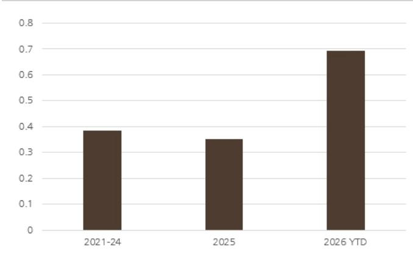

bar

| Period | Value |
|---|---|
| 2021-24 | 0.39 |
| 2025 | 0.35 |
| 2026 YTD | 0.70 |

Source: FactSet, UBS Note: Based on equally weighted weekly performance

Figure 14: Software sector forward P/E   
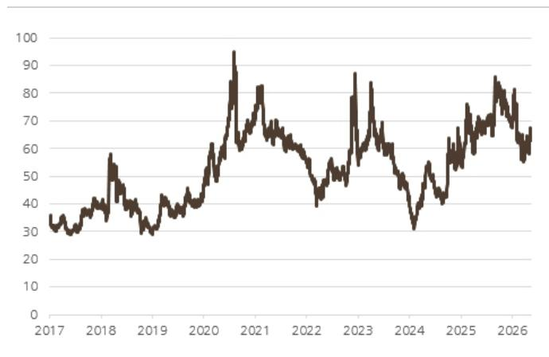

line

| Year | Value |
| ---- | ----- |
| 2017 | 35    |
| 2018 | 55    |
| 2019 | 30    |
| 2020 | 60    |
| 2021 | 85    |
| 2022 | 40    |
| 2023 | 85    |
| 2024 | 30    |
| 2025 | 75    |
| 2026 | 65    |

Source: FactSet, UBS

Figure 15: Forward P/E - China vs US internet   
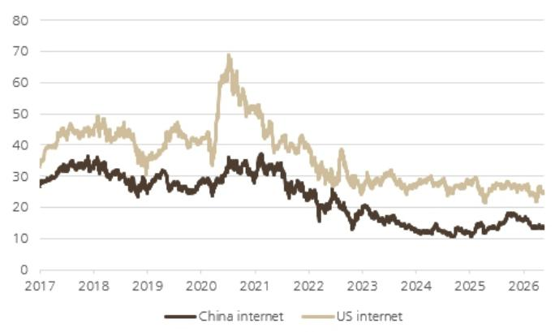

line

| Year | China internet | US internet |
|------|----------------|-------------|
| 2017 | ~28            | ~35         |
| 2018 | ~34            | ~48         |
| 2019 | ~28            | ~35         |
| 2020 | ~34            | ~68         |
| 2021 | ~36            | ~50         |
| 2022 | ~25            | ~35         |
| 2023 | ~15            | ~30         |
| 2024 | ~12            | ~28         |
| 2025 | ~10            | ~25         |
| 2026 | ~14            | ~24         |

Source: FactSet, UBS

Figure 16: Forward P/E - China vs US AI tech hardware   
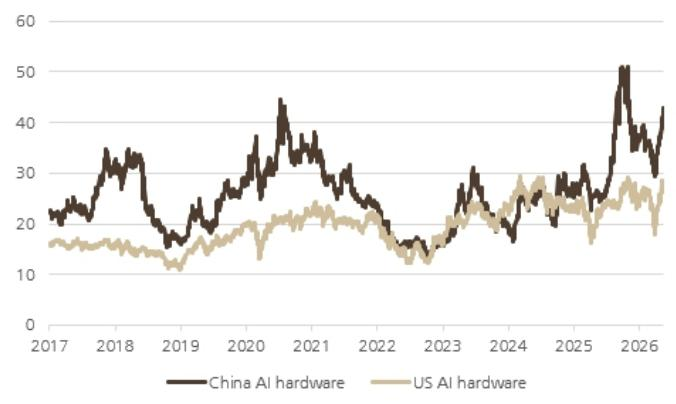

line

| Year | China AI hardware | US AI hardware |
|------|-------------------|----------------|
| 2017 | ~22               | ~16            |
| 2018 | ~34               | ~16            |
| 2019 | ~18               | ~12            |
| 2020 | ~38               | ~18            |
| 2021 | ~45               | ~20            |
| 2022 | ~25               | ~15            |
| 2023 | ~15               | ~12            |
| 2024 | ~30               | ~25            |
| 2025 | ~35               | ~28            |
| 2026 | ~50               | ~30            |

Source: FactSet, UBS Note: based on the list in our earlier report

For investors concerned about crowding in tech, we think a proxy could be the power equipment space and energy storage names in China which provide some indirect exposure towards the global AIDC build-out and provide some fundamental protection against the risk of higher energy prices.

We show in the following charts that the Chinese power equipment names generally trade cheaper compared with their international peers (please see this report for details).

Figure 17: Top picks from analysts on energy independence 

<table><tr><td>Ticker</td><td>Name</td><td>Subsector</td><td>Forward P/E</td><td>FY26 consensus earnings growth</td><td>Major catalysts</td><td>UBS rating</td></tr><tr><td>300750-CN</td><td>Contemporary Amperex Technology Co., Limited Class A</td><td>Battery</td><td>19.2</td><td>31%</td><td>Market share gain, rising EV exports, HDT electrification and energy storage expansion trends</td><td>Buy</td></tr><tr><td>002850-CN</td><td>Shenzhen Kedali Industry Co Ltd Class A</td><td>Battery materials</td><td>20.1</td><td>35%</td><td>Strong downstream battery demand and global market share gain</td><td>Buy</td></tr><tr><td>300274-CN</td><td>Sungrow Power Supply Co., Ltd. Class A</td><td>BESS</td><td>17.8</td><td>15%</td><td>BESS GPM normalization from better pricing power and cost pass through, AIDC related BESS demand</td><td>Buy</td></tr><tr><td>6656-HK</td><td>Sigenergy Technology Co., Ltd. Class H</td><td>BESS</td><td>21.0</td><td>71%</td><td>Strong demand in a niche market (stackable all-in-one distributed BESS)</td><td>Buy</td></tr><tr><td>1211-HK</td><td>BYD Company Limited Class H</td><td>EV</td><td>17.4</td><td>26%</td><td>Overseas expansion and rising external battery sales revenue</td><td>Buy</td></tr><tr><td>600875-CN</td><td>Dongfang Electric Corporation Limited Class A</td><td>Power equipment</td><td>27.5</td><td>25%</td><td>Expanding export orders and higher ASP amid structural global gas turbine shortage and limited capacity</td><td>Buy</td></tr><tr><td>603308-CN</td><td>Anhui Yingliu Electromechanical Co., Ltd. Class A</td><td>Power equipment</td><td>73.0</td><td>78%</td><td>Margin uplift on higher overseas revenue mix. Strong revenue visibility on higher contract liability</td><td>Buy</td></tr><tr><td>601012-CN</td><td>LONGi Green Energy Technology Co., Ltd. Class A</td><td>Solar</td><td>N/A</td><td>79%</td><td>Price premium on better product technology and expansion in BESS business</td><td>Buy</td></tr><tr><td>002487-CN</td><td>Dajin Heavy Industry Co., Ltd. Class A</td><td>Wind power equipment</td><td>25.1</td><td>64%</td><td>Strong order intake driven by shortage of overseas monopile supply and robust overseas offshore wind demand</td><td>Buy</td></tr></table>

Source: FactSet, UBS

Figure 18: Average crowding score for China battery / BESS names   
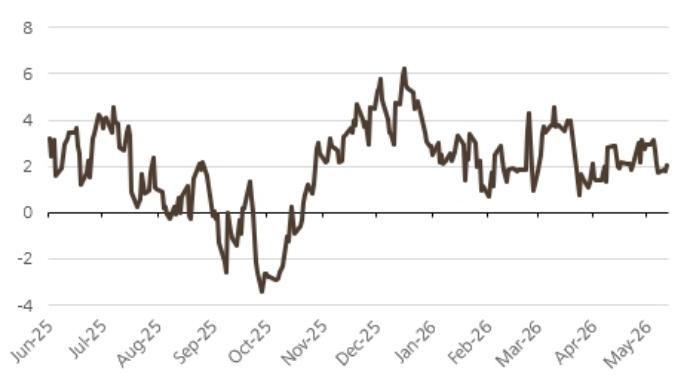

line

| Date   | Value |
|--------|-------|
| Jun-25 | 3.0   |
| Jul-25 | 4.0   |
| Aug-25 | 1.0   |
| Sep-25 | -2.0  |
| Oct-25 | -4.0  |
| Nov-25 | 0.0   |
| Dec-25 | 6.0   |
| Jan-26 | 3.0   |
| Feb-26 | 2.0   |
| Mar-26 | 4.0   |
| Apr-26 | 1.0   |
| May-26 | 3.0   |

Source: UBS Quant Research Note: based on the stock list shown in this report (see here)

Figure 19: Average crowding score for China power equipment names   
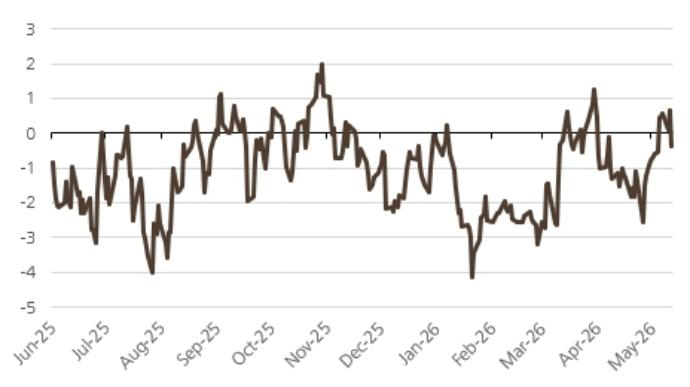

line

| Month   | Value |
|---------|-------|
| Jun-25  | -1.0  |
| Jul-25  | -2.5  |
| Aug-25  | -4.0  |
| Sep-25  | -1.5  |
| Oct-25  | 0.5   |
| Nov-25  | 2.0   |
| Dec-25  | -1.0  |
| Jan-26  | -2.0  |
| Feb-26  | -4.5  |
| Mar-26  | -2.5  |
| Apr-26  | 1.0   |
| May-26  | -1.0  |

Source: UBS Quant Research Note: based on the stock list shown in this report (see here)

# Would higher PPI lead to lower earnings?

Investors are concerned as to whether imported inflation would squeeze corporate margins as the recent surge in energy and commodity prices are primarily supply-driven. We note that historically a higher PPI have led to faster listed companies' revenue and earnings growth in China, even during the 2022 Russia Ukraine conflict as shown in the following charts.

Figure 20: A share non-financials trailing earnings growth vs PPI YoY   
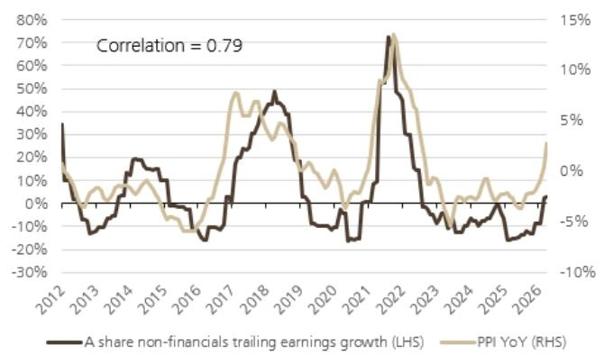

line

| Year | A share non-financials trailing earnings growth (LHS) | PPI YoY (RHS) |
|------|--------------------------------------------------|---------------|
| 2012 | ~35%                                             | ~10%          |
| 2013 | ~-10%                                            | ~0%           |
| 2014 | ~20%                                             | ~5%           |
| 2015 | ~-5%                                             | ~-5%          |
| 2016 | ~-15%                                            | ~-5%          |
| 2017 | ~45%                                             | ~10%          |
| 2018 | ~50%                                             | ~5%           |
| 2019 | ~-5%                                             | ~-5%          |
| 2020 | ~-10%                                            | ~-5%          |
| 2021 | ~-20%                                            | ~-5%          |
| 2022 | ~75%                                             | ~15%          |
| 2023 | ~-5%                                             | ~-5%          |
| 2024 | ~-10%                                            | ~-5%          |
| 2025 | ~-15%                                            | ~-5%          |
| 2026 | ~-5%                                             | ~0%           |

Source: FactSet, UBS

Figure 21: A share non-financials trailing earnings growth vs Brent oil YoY   
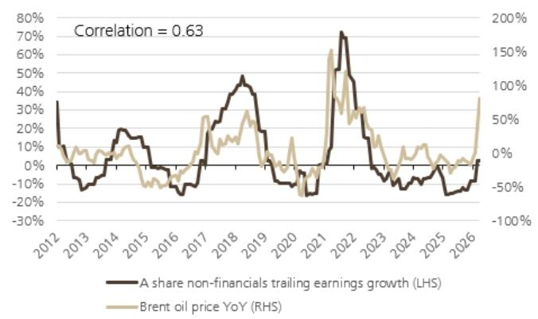

line

| Year | A share non-financials trailing earnings growth (LHS) | Brent oil price YoY (RHS) |
|------|--------------------------------------------------|---------------------------|
| 2012 | ~35%                                             | ~10%                      |
| 2013 | ~-10%                                            | ~5%                       |
| 2014 | ~20%                                             | ~10%                      |
| 2015 | ~-5%                                             | ~5%                       |
| 2016 | ~-10%                                            | ~0%                       |
| 2017 | ~30%                                             | ~20%                      |
| 2018 | ~50%                                             | ~40%                      |
| 2019 | ~45%                                             | ~30%                      |
| 2020 | ~-10%                                            | ~-5%                      |
| 2021 | ~-20%                                            | ~-10%                     |
| 2022 | ~75%                                             | ~150%                     |
| 2023 | ~-5%                                             | ~-10%                     |
| 2024 | ~-10%                                            | ~-5%                      |
| 2025 | ~-20%                                            | ~0%                       |
| 2026 | ~-5%                                             | ~50%                      |

Source: FactSet, UBS

From a sector perspective, the following sectors historically have performed better when PPI rose:

- Upstream sectors, including energy and capital goods, benefit the most as direct beneficiaries of higher commodity prices;   
- Export oriented sectors tend to do well with higher PPI - one would imagine that as global commodity prices rise, all players raise prices and Chinese companies tend to benefit from the inflationary environment;   
- Sectors with stronger pricing power, such as shipping companies and consumer durables, also tend to benefit from higher PPI;   
- Midstream manufacturing sectors (e.g., chemicals, autos, and tech hardware) historically saw moderate gains, as they are able to partially pass through cost inflation.   
- Semiconductors show little correlation with PPI given their distinct earnings cyclicality;   
- Downstream sectors with weaker pricing power, such as food & beverage, consumer services, and utilities, were typically negatively impacted by rising input costs. That said, these sectors make up 10% of the CSI 300 index.

Figure 22: Correlation between sector trailing earnings growth and PPI YoY   
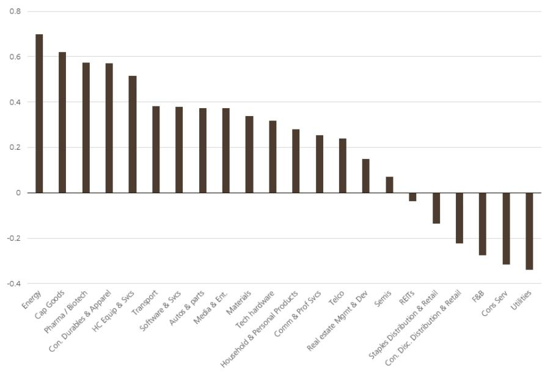

bar

| Sector | Value |
| :--- | :--- |
| Energy | 0.7 |
| Cap Goods | 0.62 |
| Pharma / Biotech | 0.58 |
| Con. Durables & Apparel | 0.57 |
| HC Equip & Svcs | 0.52 |
| Transport | 0.39 |
| Software & Svcs | 0.38 |
| Autos & parts | 0.38 |
| Media & Ent. | 0.38 |
| Materials | 0.34 |
| Tech hardware | 0.32 |
| Household & Personal Products | 0.28 |
| Comm & Prod Svcs | 0.25 |
| Telco | 0.24 |
| Real estate Mgmt & Dev | 0.15 |
| Semis | 0.07 |
| REITs | -0.03 |
| Staples Distribution & Retail | -0.12 |
| Con. Disc. Distribution & Retail | -0.22 |
| R&B | -0.28 |
| Cons Serv | -0.31 |
| Utilities | -0.35 |

Source: CEIC, FactSet, UBS Note: Monthly data since 2011 is used

Figure 23: Exporters trailing revenue growth vs PPI YoY   
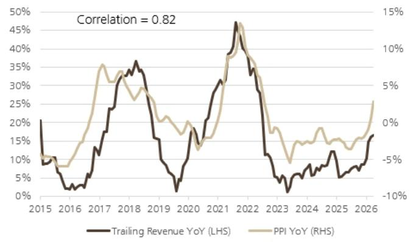

line

| Year | Trailing Revenue YoY (LHS) | PPI YoY (RHS) |
|------|-----------------------------|---------------|
| 2015 | ~10%                        | ~10%          |
| 2016 | ~5%                         | ~5%           |
| 2017 | ~35%                        | ~35%          |
| 2018 | ~35%                        | ~30%          |
| 2019 | ~10%                        | ~10%          |
| 2020 | ~-5%                        | ~-5%          |
| 2021 | ~45%                        | ~40%          |
| 2022 | ~45%                        | ~45%          |
| 2023 | ~-5%                        | ~-5%          |
| 2024 | ~-5%                        | ~-5%          |
| 2025 | ~-5%                        | ~-5%          |
| 2026 | ~15%                        | ~25%          |

Source: FactSet, UBS Note: Companies with >40% overseas revenue exposure are included (see here for a detailed list)

Figure 24: Exporters trailing earnings growth vs PPI YoY   
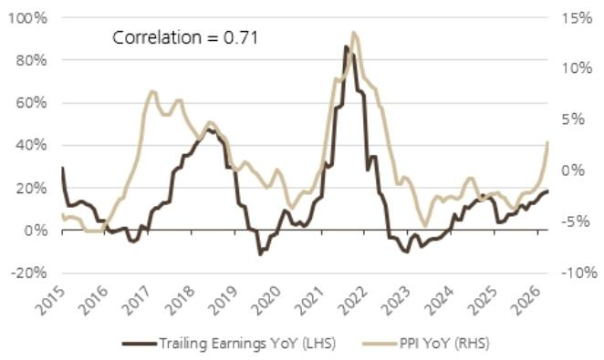

line

| Year | Trailing Earnings YoY (LHS) | PPI YoY (RHS) |
|------|-----------------------------|---------------|
| 2015 | ~30%                        | ~5%           |
| 2016 | ~-5%                        | ~-5%          |
| 2017 | ~40%                        | ~10%          |
| 2018 | ~50%                        | ~15%          |
| 2019 | ~30%                        | ~5%           |
| 2020 | ~-10%                       | ~-5%          |
| 2021 | ~30%                        | ~10%          |
| 2022 | ~90%                        | ~15%          |
| 2023 | ~-5%                        | ~-5%          |
| 2024 | ~-10%                       | ~-5%          |
| 2025 | ~10%                        | ~5%           |
| 2026 | ~20%                        | ~10%          |

Source: FactSet, UBS Note: Companies with >40% overseas revenue exposure are included

That being said, whether China can sustainably exit deflation remains uncertain. In our earlier analysis of Japan's reflation episode in 2022 (see here), we highlighted employment conditions and wage growth as key drivers in Japan's exit from deflation. With youth unemployment rate remaining elevated and wage growth moderating in 2H25 (based on A-share listed company data), overall labour market conditions appear to remain lukewarm which are likely to feed into a weak broad consumption environment near term.

Figure 25: China unemployment rate of selected age group   
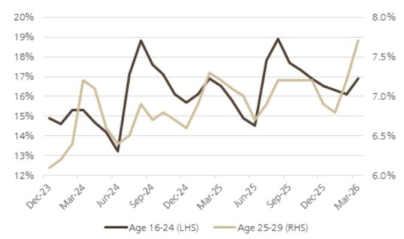

line

| Date   | Age 16-24 (LHS) | Age 25-29 (RHS) |
|--------|-----------------|-----------------|
| Dec-23 | 15.0%           | 6.0%            |
| Mar-24 | 15.5%           | 6.5%            |
| Jun-24 | 13.5%           | 6.5%            |
| Sep-24 | 19.0%           | 7.0%            |
| Dec-24 | 16.0%           | 6.5%            |
| Mar-25 | 17.0%           | 7.0%            |
| Jun-25 | 14.5%           | 6.5%            |
| Sep-25 | 19.0%           | 7.0%            |
| Dec-25 | 17.0%           | 6.5%            |
| Mar-26 | 17.0%           | 7.5%            |

Source: NBS, UBS

Figure 26: A share companies average wage growth   
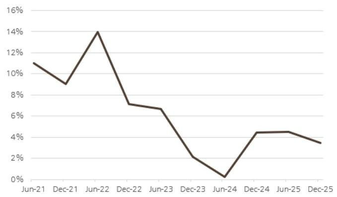

line

| Date | Value (%) |
|---|---|
| Jun-21 | 11.0 |
| Dec-21 | 9.0 |
| Jun-22 | 14.0 |
| Dec-22 | 7.0 |
| Jun-23 | 6.5 |
| Dec-23 | 2.0 |
| Jun-24 | 0.5 |
| Dec-24 | 4.5 |
| Jun-25 | 4.5 |
| Dec-25 | 3.5 |

Source: Wind, UBS

Figure 27: Japan labour participation and youth unemployment rate   
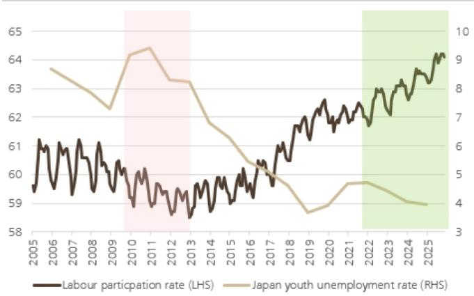

line

| Year | Labour participation rate (LHS) | Japan youth unemployment rate (RHS) |
|------|----------------------------------|-------------------------------------|
| 2005 | 60.5                             | 64.0                                |
| 2006 | 61.0                             | 63.5                                |
| 2007 | 60.8                             | 63.0                                |
| 2008 | 61.2                             | 62.5                                |
| 2009 | 60.5                             | 62.0                                |
| 2010 | 60.0                             | 64.5                                |
| 2011 | 59.5                             | 64.8                                |
| 2012 | 59.0                             | 63.5                                |
| 2013 | 58.5                             | 63.0                                |
| 2014 | 59.0                             | 61.5                                |
| 2015 | 59.5                             | 60.0                                |
| 2016 | 60.0                             | 58.5                                |
| 2017 | 60.5                             | 57.0                                |
| 2018 | 61.0                             | 55.5                                |
| 2019 | 61.5                             | 54.0                                |
| 2020 | 62.0                             | 53.5                                |
| 2021 | 62.5                             | 54.5                                |
| 2022 | 63.0                             | 55.0                                |
| 2023 | 63.5                             | 54.5                                |
| 2024 | 64.0                             | 54.0                                |
| 2025 | 64.5                             | 53.5                                |

Source: Bloomberg, UBS Note: Reflationary periods during 2010-2012 and 2022-now are shaded in red and green

Figure 28: Japan Spring wage negotiation (Shuntou) monthly avg wage increase rate   
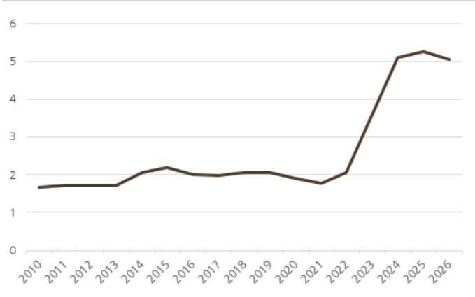

line

| Year | Value |
| ---- | ----- |
| 2010 | 1.7   |
| 2011 | 1.7   |
| 2012 | 1.7   |
| 2013 | 1.7   |
| 2014 | 2.0   |
| 2015 | 2.2   |
| 2016 | 2.0   |
| 2017 | 2.0   |
| 2018 | 2.0   |
| 2019 | 2.0   |
| 2020 | 1.9   |
| 2021 | 1.8   |
| 2022 | 2.0   |
| 2023 | 3.5   |
| 2024 | 5.1   |
| 2025 | 5.3   |
| 2026 | 5.1   |

Source: Bloomberg, UBS

# How much impact could we see coming from lock-up expiry?

The Hong Kong IPO market has remained active into 2026, with several large-cap listings such as Zhipu and MiniMax successfully coming to market earlier this year. Looking ahead, the value of shares subject to lock-up expiry is expected to rise over the next two months, reaching a peak of c.HK\$200bn in July.

Historically we see a meaningful impact from lock-up expiries at an individual stock level: typically stocks underperform the broader market 3 months out from the lock-up expiry date by c.25% and then outperform post the expiry date. For the recent IPO's in the last 18 months, the effect is less significant with stocks expecting lock-up expiry having underperformed 6% (median) vs the HSI in the three months leading up to the lock-up expiry.

Figure 29: HK IPO share price performance relative to HSI around 1st lock up expiry date   
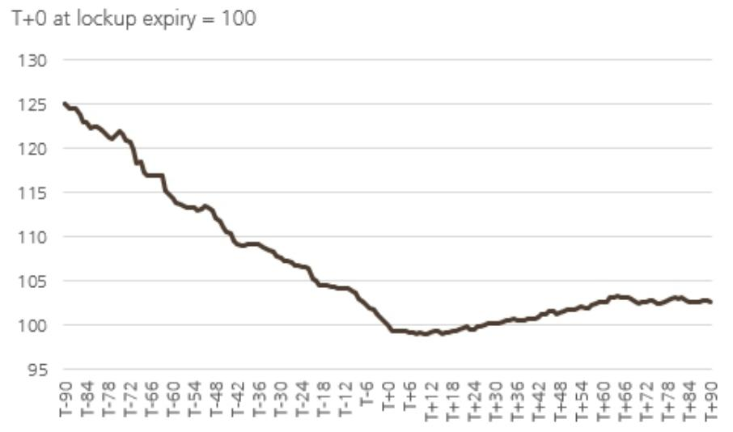

line

| Time Period | Value |
| ----------- | ----- |
| T-90        | 125   |
| T-84        | 123   |
| T-78        | 121   |
| T-72        | 118   |
| T-66        | 115   |
| T-60        | 113   |
| T-54        | 111   |
| T-48        | 109   |
| T-42        | 107   |
| T-36        | 105   |
| T-30        | 103   |
| T-24        | 101   |
| T-18        | 99    |
| T-12        | 98    |
| T-6         | 97    |
| T+0         | 96    |
| T+6         | 95    |
| T+12        | 96    |
| T+18        | 97    |
| T+24        | 98    |
| T+30        | 99    |
| T+36        | 100   |
| T+42        | 101   |
| T+48        | 102   |
| T+54        | 103   |
| T+60        | 104   |
| T+66        | 103   |
| T+72        | 104   |
| T+78        | 103   |
| T+84        | 104   |
| T+90        | 103   |

Source: FactSet, Bloomberg, UBS Note: History since 2012, simple average is used

For the broader market, there is less of a correlation - the estimated HK\$200bn of unlock in July represents only around 0.4% of total HK market cap, or roughly $\frac{3}{4}$ of average daily turnover and would therefore appear manageable.

Figure 30: Estimated monthly amount subject to IPO lock-up expiry   
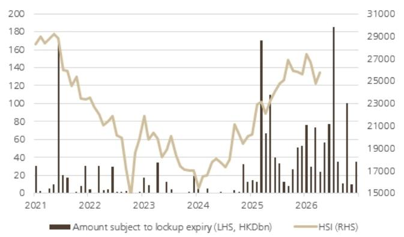

bar_line

| Year | Amount subject to lockup expiry (LHS, HKDbn) | HSI (RHS) |
|------|---------------------------------------------|-----------|
| 2021 | 30                                          | 31000     |
| 2022 | 30                                          | 29000     |
| 2023 | 30                                          | 27000     |
| 2024 | 30                                          | 25000     |
| 2025 | 170                                         | 23000     |
| 2026 | 80                                          | 27000     |

Source: Bloomberg, UBS

Figure 31: HK total market cap and average daily turnover   
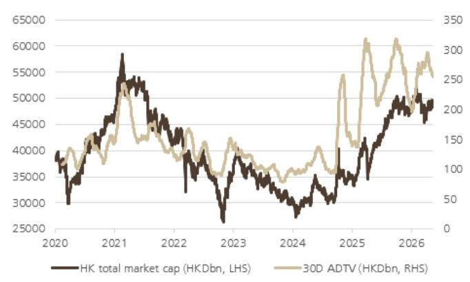

line

| Year | HK total market cap (HKDbn, LHS) | 30D ADTV (HKDbn, RHS) |
|------|-----------------------------------|------------------------|
| 2020 | ~38000                            | ~40000                 |
| 2021 | ~58000                            | ~52000                 |
| 2022 | ~45000                            | ~42000                 |
| 2023 | ~27000                            | ~40000                 |
| 2024 | ~30000                            | ~35000                 |
| 2025 | ~45000                            | ~35000                 |
| 2026 | ~50000                            | ~30000                 |

Source: CEIC, UBS

We provide a detailed schedule of upcoming lock-up expiries in the table below. Notable stocks expected to see lock-up expiry in the next few months include the LLM companies Zhipu, Minimax as well as JD Industrials.

Figure 32: Upcoming IPO lockup expiry schedule up to July 

<table><tr><td>Ticker</td><td>Name</td><td>Lock up expiry date</td><td>Est. amount subject to lock-up expiry (HKDbn)</td><td>As % of current free float</td></tr><tr><td>2788-HK</td><td>Chuangxin Industries Holdings Ltd</td><td>5/23/2026</td><td>35.1</td><td>384%</td></tr><tr><td>2685-HK</td><td>QuantGroup</td><td>5/26/2026</td><td>2.4</td><td>220%</td></tr><tr><td>2693-HK</td><td>Anhui Jinyan Kaolin New Materials Co Ltd</td><td>6/2/2026</td><td>0.0</td><td>75%</td></tr><tr><td>2658-HK</td><td>Guangdong Tianyu Semiconductor Co Ltd</td><td>6/4/2026</td><td>0.1</td><td>6%</td></tr><tr><td>2408-HK</td><td>Guangzhou Xiao Noodles Catering Management Co Ltd</td><td>6/4/2026</td><td>0.1</td><td>27%</td></tr><tr><td>2676-HK</td><td>Suzhou Novosense Microelectronics Co Ltd</td><td>6/7/2026</td><td>1.9</td><td>46%</td></tr><tr><td>2659-HK</td><td>Shanghai Bao Pharmaceuticals Co Ltd</td><td>6/9/2026</td><td>0.2</td><td>43%</td></tr><tr><td>7618-HK</td><td>JINGDONG Industrials Inc</td><td>6/10/2026</td><td>38.7</td><td>969%</td></tr><tr><td>2655-HK</td><td>Guoxia Technology Co Ltd</td><td>6/15/2026</td><td>0.1</td><td>8%</td></tr><tr><td>3887-HK</td><td>HashKey Holdings Ltd</td><td>6/16/2026</td><td>10.1</td><td>381%</td></tr><tr><td>2546-HK</td><td>Xizang Zhihui Mining Co Ltd</td><td>6/18/2026</td><td>0.8</td><td>69%</td></tr><tr><td>2581-HK</td><td>BenQ BM Holding Cayman Corp</td><td>6/21/2026</td><td>0.8</td><td>788%</td></tr><tr><td>3378-HK</td><td>HanX Biopharmaceuticals Inc</td><td>6/22/2026</td><td>0.1</td><td>11%</td></tr><tr><td>2619-HK</td><td>X.J. Electrics Hu Bei Co Ltd</td><td>6/24/2026</td><td>0.3</td><td>308%</td></tr><tr><td>3696-HK</td><td>Insilico Medicine Cayman TopCo</td><td>6/29/2026</td><td>23.3</td><td>101%</td></tr><tr><td>3317-HK</td><td>Shenzhen Xunce Technology Co Ltd</td><td>6/29/2026</td><td>1.8</td><td>5%</td></tr><tr><td>6600-HK</td><td>OneRobotics Shenzhen Co Ltd</td><td>6/29/2026</td><td>1.0</td><td>13%</td></tr><tr><td>2657-HK</td><td>Shanghai Lingqingxuan Biological Technology Co Ltd</td><td>6/29/2026</td><td>0.3</td><td>52%</td></tr><tr><td>2671-HK</td><td>USAS Building System Shanghai Co Ltd</td><td>6/29/2026</td><td>0.0</td><td>22%</td></tr><tr><td>2513-HK</td><td>Beijing Zhipu Huazhang Technology Co Ltd</td><td>7/7/2026</td><td>28.1</td><td>141%</td></tr><tr><td>9903-HK</td><td>Shanghai Tianshu Zhixin Semiconductor Co Ltd</td><td>7/7/2026</td><td>5.2</td><td>32%</td></tr><tr><td>100-HK</td><td>Minimax Group Inc</td><td>7/8/2026</td><td>119.1</td><td>144%</td></tr><tr><td>6938-HK</td><td>Suzhou Ribo Life Science Co Ltd</td><td>7/8/2026</td><td>0.8</td><td>17%</td></tr><tr><td>2675-HK</td><td>Edge Medical Robotics Co Ltd</td><td>7/8/2026</td><td>0.7</td><td>12%</td></tr><tr><td>2651-HK</td><td>Wuhan Dazhong Dental Medical Co Ltd</td><td>7/8/2026</td><td>0.5</td><td>226%</td></tr><tr><td>3636-HK</td><td>Yunnan Jinxun Resources Co Ltd</td><td>7/9/2026</td><td>0.2</td><td>43%</td></tr><tr><td>501-HK</td><td>OmniVision Integrated Circuits</td><td>7/11/2026</td><td>1.8</td><td>62%</td></tr><tr><td>3986-HK</td><td>GigaDevice Semiconductor Inc</td><td>7/12/2026</td><td>8.3</td><td>46%</td></tr><tr><td>8610-HK</td><td>BBSB International Ltd</td><td>7/12/2026</td><td>0.2</td><td>421%</td></tr><tr><td>1641-HK</td><td>Hongxing Coldchain Hunan Co Ltd</td><td>7/12/2026</td><td>0.0</td><td>18%</td></tr><tr><td>9611-HK</td><td>Longcheer Technology Shanghai Co Ltd</td><td>7/21/2026</td><td>0.4</td><td>29%</td></tr><tr><td>1768-HK</td><td>Busy Ming Group Co Ltd</td><td>7/27/2026</td><td>2.7</td><td>9%</td></tr><tr><td>2718-HK</td><td>Mininglamp Technology Group Ltd</td><td>7/30/2026</td><td>28.8</td><td>266%</td></tr></table>

Source: Bloomberg, UBS

# What to do with HSTECH?

HSTECH is down c.10% YTD, significantly underperforming MSCI AC World by 20% which is trading close to its all time high. We believe the key factors are:

- Unfavorable sector mix with internet, auto and consumer making up c.70% of the index, where they are all facing different headwinds YTD, including anti-trust regulation (against Trip.com), ongoing industry competition and absence of consumption stimulus;   
- Investors have become more selective among AI names since 2026, as the narrative has shifted from software (seen as an AI loser) to hardware (AI enabler). This has weighed on Chinese internet names amid rising concerns that they could be displaced by AI agents over the longer term, leading to a sell off alongside with the U.S. software stocks;   
- Weak inflows as southbound flows slowing down coupled with elevated capital raising activities from IPO and secondary offerings;   
- Significant earnings downgrade (-37%) in the past 12 months primarily driven by competition among food delivery platforms with the three companies (Meituan, JD, Alibaba) made up over 70% of the earnings cut;   
- Foreign investors selling out of EM equities post the Iran conflict began which would have affected HK equities.

Last month we held the tactical view (see here) that HSTECH could perform well given a myriad of catalysts coming up in the next 2 months. Many of these catalysts have come through including:

- Launch of the new LLM models from Deepseek and Tencent;   
- Food delivery competition easing in the quarterly results;   
- US China leadership summit leading to a potential relaxation of export control on AI chips;   
- EV demand to see some upside as oil price stay higher for longer.

With the market not heeding these positive developments, we now think it may take longer for HSTECH to outperform. Our recent discussions with investors suggest that their attention is focused around hardware tech, power equipment and other North Asian names which may have drawn liquidity away from HK internet names.

Figure 33: HSTECH sector weighting mix   
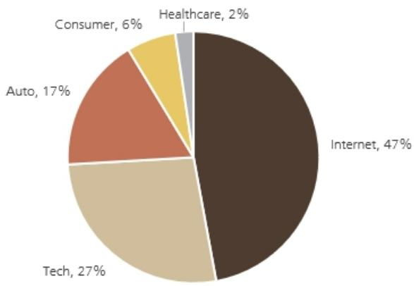

pie

| Category | Percentage (%) |
| :--- | :--- |
| Internet | 47 |
| Tech | 27 |
| Auto | 17 |
| Consumer | 6 |
| Healthcare | 2 |

Source: FactSet, UBS

Figure 34: HSTECH vs US Software   
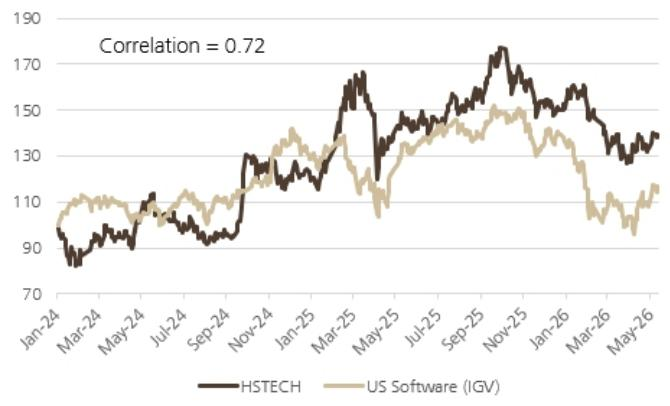

line

| Date    | HSTECH | US Software (IGV) |
|---------|--------|-------------------|
| Jan-24  | 80     | 105               |
| Mar-24  | 90     | 110               |
| May-24  | 100    | 105               |
| Jul-24  | 95     | 100               |
| Sep-24  | 105    | 110               |
| Nov-24  | 130    | 135               |
| Jan-25  | 140    | 145               |
| Mar-25  | 170    | 130               |
| May-25  | 150    | 135               |
| Jul-25  | 160    | 145               |
| Sep-25  | 175    | 150               |
| Nov-25  | 180    | 155               |
| Jan-26  | 160    | 140               |
| Mar-26  | 140    | 120               |
| May-26  | 130    | 110               |

Source: FactSet, UBS

Figure 35: Recent HSTECH consensus earnings performance   
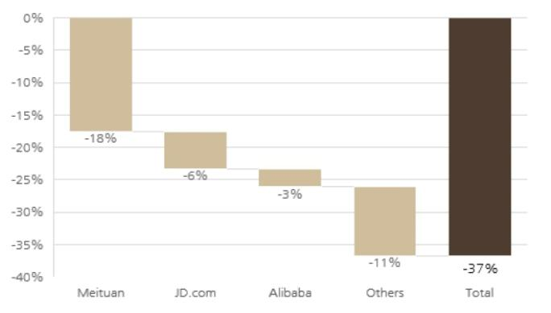

bar

| Category | Value (%) |
|---|---|
| Meituan | -18 |
| JD.com | -6 |
| Alibaba | -3 |
| Others | -11 |
| Total | -37 |

Source: Bloomerbg

Figure 36: Foreign net inflows into EM equities (ex-China)   
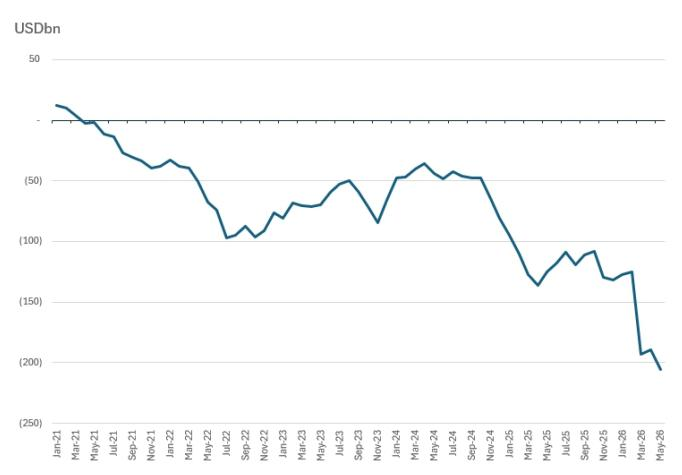

line

| Date    | Value  |
|---------|--------|
| Jan-21  | 50     |
| Mar-21  | 40     |
| May-21  | 30     |
| Jul-21  | 20     |
| Sep-21  | 10     |
| Nov-21  | 0      |
| Jan-22  | -10    |
| Mar-22  | -20    |
| May-22  | -30    |
| Jul-22  | -40    |
| Sep-22  | -50    |
| Nov-22  | -60    |
| Jan-23  | -70    |
| Mar-23  | -80    |
| May-23  | -90    |
| Jul-23  | -100   |
| Sep-23  | -110   |
| Nov-23  | -120   |
| Jan-24  | -130   |
| Mar-24  | -140   |
| May-24  | -150   |
| Jul-24  | -160   |
| Sep-24  | -170   |
| Nov-24  | -180   |
| Jan-25  | -190   |
| Mar-25  | -200   |
| May-25  | -210   |
| Jul-25  | -220   |
| Sep-25  | -230   |
| Nov-25  | -240   |
| Jan-26  | -250   |
| Mar-26  | -260   |
| May-26  | -270   |

Source: Bloomberg, UBS

Figure 37: Southbound net inflows by year   
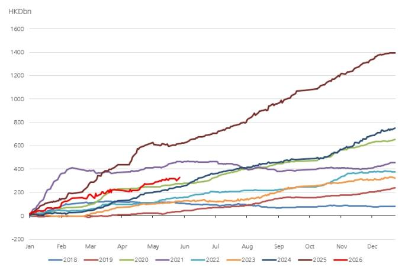  
Source: CEIC, UBS

Figure 38: Quarterly southbound flows vs capital raising   
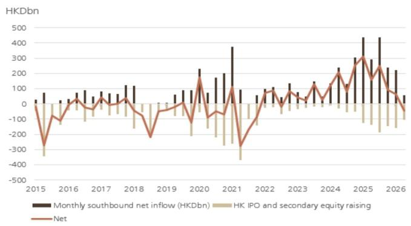

line

| Year | Monthly southbound net inflow (HKDbn) | HK IPO and secondary equity raising | Net |
|------|----------------------------------------|-------------------------------------|-----|
| 2015 | ~50                                    | ~-300                               | ~-300 |
| 2016 | ~50                                    | ~-100                               | ~-100 |
| 2017 | ~50                                    | ~-50                                | ~-50 |
| 2018 | ~100                                   | ~-100                               | ~-100 |
| 2019 | ~50                                    | ~-50                                | ~-50 |
| 2020 | ~200                                   | ~-100                               | ~-100 |
| 2021 | ~400                                   | ~-400                               | ~-400 |
| 2022 | ~100                                   | ~-100                               | ~-100 |
| 2023 | ~150                                   | ~-50                                | ~-50 |
| 2024 | ~300                                   | ~-100                               | ~-100 |
| 2025 | ~450                                   | ~-150                               | ~-150 |
| 2026 | ~200                                   | ~-100                               | ~-100 |

Source: Bloomberg, UBS Note: Last data point up to 15 May 2026

# Changes to sector preferences and model portfolio

We turn neutral on property given the improvement in secondary transaction and reduction in secondary home listings.

Figure 39: Changes to sector preferences 

<table><tr><td>Most preferred</td><td>Least preferred</td></tr><tr><td>Tech hardware</td><td>Construction</td></tr><tr><td>Internet</td><td>Auto OEM</td></tr><tr><td>&quot;Going Abroad&quot; stocks</td><td>Software</td></tr><tr><td>Non-ferrous metal</td><td>Consumer</td></tr><tr><td>Electrical equipment</td><td>Property</td></tr></table>

Source: UBS

Figure 40: Changes to model portfolio 

<table><tr><td colspan="11">Most preferred names</td></tr><tr><td>Stock Code</td><td>Company name</td><td>Lead analyst</td><td>UBS rating</td><td>Last close</td><td>Price target</td><td>FY26 P/E</td><td>UBSe FY26 EPS growth</td><td>UBSe vs consensus FY26 earnings</td><td>Forward div yield</td><td>YTD return</td></tr><tr><td>9888.HK</td><td>Baidu</td><td>Wei Xiong</td><td>Buy</td><td>134.20</td><td>175.00</td><td>16.6</td><td>-32%</td><td>-2%</td><td>2%</td><td>2%</td></tr><tr><td>3606.HK</td><td>Fuyao Glass</td><td>Nora Min</td><td>Buy</td><td>56.65</td><td>93.00</td><td>11.9</td><td>17%</td><td>4%</td><td>5%</td><td>-14%</td></tr><tr><td>2899.HK</td><td>Zijin Mining Group - H</td><td>Sharon Ding</td><td>Buy</td><td>32.72</td><td>57.00</td><td>9.0</td><td>63%</td><td>4%</td><td>3%</td><td>-8%</td></tr><tr><td>0700.HK</td><td>Tencent Holdings</td><td>Kenneth Fong</td><td>Buy</td><td>455.20</td><td>780.00</td><td>12.3</td><td>9%</td><td>4%</td><td>1%</td><td>-23%</td></tr><tr><td>GDS.O</td><td>GDS</td><td>Sara Wang</td><td>Buy</td><td>37.71</td><td>60.00</td><td>32.2</td><td>63%</td><td>164%</td><td>0%</td><td>8%</td></tr><tr><td>300750.SZ</td><td>Contemporary Amperex Technology</td><td>Paul Gong</td><td>Buy</td><td>414.75</td><td>600.00</td><td>18.2</td><td>41%</td><td>10%</td><td>3%</td><td>15%</td></tr><tr><td>1072.HK</td><td>Dongfang Electric Corporation</td><td>Ken Liu</td><td>Buy</td><td>36.52</td><td>68.00</td><td>19.2</td><td>25%</td><td>19%</td><td>2%</td><td>46%</td></tr><tr><td>0883.HK</td><td>China National Offshore Oil Corporation</td><td>Amily Guo</td><td>Buy</td><td>27.80</td><td>37.80</td><td>6.5</td><td>46%</td><td>8%</td><td>6%</td><td>31%</td></tr><tr><td>1211.HK</td><td>BYD Company Limited</td><td>Paul Gong</td><td>Buy</td><td>90.20</td><td>128.00</td><td>17.9</td><td>23%</td><td>-2%</td><td>1%</td><td>-5%</td></tr><tr><td>2359.HK</td><td>Wuxi Apptec</td><td>Chen Chen, PhD</td><td>Buy</td><td>129.30</td><td>171.20</td><td>18.1</td><td>-5%</td><td>5%</td><td>2%</td><td>33%</td></tr><tr><td>002532.SZ</td><td>Tianshan Aluminum Group</td><td>Beili Wang</td><td>Buy</td><td>15.55</td><td>23.00</td><td>8.0</td><td>88%</td><td>-1%</td><td>7%</td><td>-2%</td></tr><tr><td>002714.SZ</td><td>Muyuan Foods</td><td>Nina Jiang</td><td>Buy</td><td>39.54</td><td>60.50</td><td>48.3</td><td>-71%</td><td>-41%</td><td>3%</td><td>-22%</td></tr><tr><td>YAZG.SI</td><td>Yangzijiang Shipbuilding</td><td>Kunlun Li</td><td>Buy</td><td>3.81</td><td>5.10</td><td>7.7</td><td>20%</td><td>9%</td><td>6%</td><td>15%</td></tr><tr><td>002648.SZ</td><td>Zhejiang Satellite Chemical</td><td>Amily Guo</td><td>Buy</td><td>25.57</td><td>36.80</td><td>10.2</td><td>59%</td><td>-7%</td><td>3%</td><td>45%</td></tr><tr><td>2259.HK</td><td>Zijin Gold International</td><td>Sharon Ding</td><td>Buy</td><td>139.10</td><td>283.00</td><td>14.8</td><td>101%</td><td>-14%</td><td>2%</td><td>-5%</td></tr><tr><td>002850.SZ</td><td>Shenzhen Kedali Industry</td><td>Nora Min</td><td>Buy</td><td>207.84</td><td>268.00</td><td>23.2</td><td>40%</td><td>4%</td><td>2%</td><td>32%</td></tr></table>

<table><tr><td colspan="11">Addition</td></tr><tr><td>Stock Code</td><td>Company name</td><td>Lead analyst</td><td>UBS rating</td><td>Last close</td><td>Price target</td><td>FY26 P/E</td><td>UBSe FY26 EPS growth</td><td>UBSe vs consensus FY26 earnings</td><td>Forward div yield</td><td>YTD return</td></tr><tr><td>002487.SZ</td><td>Dajin Heavy Industry</td><td>Yishu Yan</td><td>Buy</td><td>77.03</td><td>100.00</td><td>26.4</td><td>73%</td><td>3%</td><td>1%</td><td>49%</td></tr></table>

<table><tr><td colspan="11">Removal</td></tr><tr><td>Stock Code</td><td>Company name</td><td>Lead analyst</td><td>UBS rating</td><td>Last close</td><td>Price target</td><td>FY26 P/E</td><td>UBSe FY26 EPS growth</td><td>UBSe vs consensus FY26 earnings</td><td>Forward div yield</td><td>YTD return</td></tr><tr><td>9618.HK</td><td>JD.com - H</td><td>Kenneth Fong</td><td>Buy</td><td>127.80</td><td>187.00</td><td>9.0</td><td>5%</td><td>10%</td><td>3%</td><td>18%</td></tr><tr><td>603606.SS</td><td>Ningbo Orient Wire &amp; Cables</td><td>Yishu Yan</td><td>Buy</td><td>58.60</td><td>78.00</td><td>21.7</td><td>47%</td><td>-1%</td><td>2%</td><td>-2%</td></tr></table>

Source: FactSet, UBS

Figure 41: Sector valuation 

<table><tr><td rowspan="2">Sector</td><td rowspan="2">Current P/E or P/B*</td><td colspan="4">Valuation</td><td rowspan="2">2026 YTD Return (%)</td><td rowspan="2">Forward Dividend yield</td></tr><tr><td>5Y Average</td><td>Standard deviation</td><td>Forward PEG</td><td>FY26 consensus earnings growth</td></tr><tr><td>Construction</td><td>6.8</td><td>5.1</td><td>2.9</td><td>2.8</td><td>6%</td><td>1%</td><td>4.0%</td></tr><tr><td>Truck</td><td>15.3</td><td>10.9</td><td>2.7</td><td>0.8</td><td>21%</td><td>57%</td><td>4.3%</td></tr><tr><td>Wind power equipment</td><td>22.4</td><td>12.7</td><td>2.6</td><td>0.8</td><td>80%</td><td>27%</td><td>1.5%</td></tr><tr><td>Semiconductor</td><td>59.0</td><td>35.2</td><td>2.5</td><td>1.3</td><td>58%</td><td>37%</td><td>0.4%</td></tr><tr><td>Tech hardware</td><td>23.5</td><td>17.5</td><td>2.3</td><td>1.5</td><td>32%</td><td>18%</td><td>1.6%</td></tr><tr><td>Construction materials</td><td>17.1</td><td>10.9</td><td>2.2</td><td>1.9</td><td>87%</td><td>9%</td><td>6.4%</td></tr><tr><td>Aerospace &amp; defense</td><td>49.4</td><td>35.1</td><td>2.1</td><td>N/A</td><td>10%</td><td>3%</td><td>0.7%</td></tr><tr><td>Power operator</td><td>16.3</td><td>13.8</td><td>2.1</td><td>3.5</td><td>0%</td><td>7%</td><td>3.2%</td></tr><tr><td>Telecom</td><td>12.9</td><td>9.9</td><td>1.7</td><td>N/A</td><td>-5%</td><td>0%</td><td>6.0%</td></tr><tr><td>Energy</td><td>10.5</td><td>8.0</td><td>1.6</td><td>10.8</td><td>27%</td><td>14%</td><td>5.1%</td></tr><tr><td>Transportation</td><td>13.6</td><td>11.4</td><td>1.4</td><td>1.7</td><td>62%</td><td>0%</td><td>4.1%</td></tr><tr><td>Data center*</td><td>2.2</td><td>1.5</td><td>1.1</td><td>3.9</td><td>144%</td><td>23%</td><td>0.8%</td></tr><tr><td>Banks*</td><td>0.6</td><td>0.5</td><td>1.0</td><td>1.7</td><td>4%</td><td>-3%</td><td>4.8%</td></tr><tr><td>Shipping</td><td>9.9</td><td>7.7</td><td>0.9</td><td>N/A</td><td>-1%</td><td>10%</td><td>5.0%</td></tr><tr><td>Software</td><td>68.2</td><td>58.3</td><td>0.9</td><td>16.6</td><td>78%</td><td>-7%</td><td>0.7%</td></tr><tr><td>Chemicals</td><td>15.8</td><td>13.6</td><td>0.9</td><td>N/A</td><td>95%</td><td>17%</td><td>2.3%</td></tr><tr><td>Property*</td><td>0.7</td><td>0.6</td><td>0.8</td><td>N/A</td><td>-74%</td><td>10%</td><td>3.0%</td></tr><tr><td>Machinery</td><td>18.1</td><td>16.5</td><td>0.7</td><td>0.9</td><td>22%</td><td>4%</td><td>2.5%</td></tr><tr><td>Gas utilities</td><td>9.8</td><td>9.1</td><td>0.5</td><td>11.7</td><td>6%</td><td>-7%</td><td>5.4%</td></tr><tr><td>Auto parts</td><td>17.8</td><td>17.5</td><td>0.1</td><td>1.1</td><td>15%</td><td>-7%</td><td>2.3%</td></tr><tr><td>Grid</td><td>23.2</td><td>22.9</td><td>0.1</td><td>3.6</td><td>14%</td><td>17%</td><td>2.5%</td></tr><tr><td>Consumer finance</td><td>4.9</td><td>4.7</td><td>0.1</td><td>N/A</td><td>-11%</td><td>-29%</td><td>10.8%</td></tr><tr><td>Solar supply chain</td><td>53.2</td><td>28.3</td><td>0.1</td><td>2.3</td><td>190%</td><td>3%</td><td>0.8%</td></tr><tr><td>Pharma</td><td>23.0</td><td>23.0</td><td>0.0</td><td>5.2</td><td>21%</td><td>-4%</td><td>1.5%</td></tr><tr><td>Hog*</td><td>2.4</td><td>2.4</td><td>0.0</td><td>3.7</td><td>-46%</td><td>-12%</td><td>2.4%</td></tr><tr><td>Basic materials</td><td>11.9</td><td>12.0</td><td>-0.1</td><td>0.6</td><td>65%</td><td>4%</td><td>3.5%</td></tr><tr><td>Auto retail</td><td>8.8</td><td>14.9</td><td>-0.1</td><td>N/A</td><td>159%</td><td>-32%</td><td>7.5%</td></tr><tr><td>EV Battery &amp; materials</td><td>21.1</td><td>25.7</td><td>-0.2</td><td>0.7</td><td>50%</td><td>16%</td><td>2.0%</td></tr><tr><td>Education*</td><td>1.3</td><td>1.5</td><td>-0.2</td><td>4.5</td><td>14%</td><td>-8%</td><td>3.0%</td></tr><tr><td>Internet (E-commerce)</td><td>14.5</td><td>16.7</td><td>-0.3</td><td>4.0</td><td>11%</td><td>-13%</td><td>1.1%</td></tr><tr><td>Airline airport*</td><td>1.8</td><td>1.9</td><td>-0.4</td><td>1.4</td><td>53%</td><td>-22%</td><td>2.8%</td></tr><tr><td>Home appliance</td><td>11.0</td><td>11.8</td><td>-0.4</td><td>3.1</td><td>7%</td><td>-13%</td><td>5.7%</td></tr><tr><td>Auto</td><td>18.6</td><td>20.6</td><td>-0.6</td><td>1.9</td><td>109%</td><td>-3%</td><td>2.4%</td></tr><tr><td>Health care service</td><td>28.8</td><td>40.1</td><td>-0.6</td><td>3.0</td><td>86%</td><td>-1%</td><td>1.6%</td></tr><tr><td>Biotech, CRO</td><td>32.9</td><td>44.7</td><td>-0.6</td><td>3.6</td><td>52%</td><td>7%</td><td>1.3%</td></tr><tr><td>Furniture</td><td>11.4</td><td>14.2</td><td>-0.6</td><td>N/A</td><td>7%</td><td>-3%</td><td>5.4%</td></tr><tr><td>Express delivery*</td><td>1.6</td><td>2.2</td><td>-0.7</td><td>1.0</td><td>23%</td><td>11%</td><td>2.8%</td></tr><tr><td>Baijiu</td><td>18.6</td><td>24.5</td><td>-0.7</td><td>3.6</td><td>10%</td><td>-8%</td><td>4.3%</td></tr><tr><td>Medical device</td><td>20.7</td><td>25.4</td><td>-0.8</td><td>4.0</td><td>22%</td><td>-9%</td><td>2.7%</td></tr><tr><td>Personal product</td><td>16.9</td><td>21.4</td><td>-0.9</td><td>2.1</td><td>7%</td><td>-10%</td><td>3.5%</td></tr><tr><td>Pharma retail</td><td>16.5</td><td>27.5</td><td>-0.9</td><td>4.8</td><td>14%</td><td>-13%</td><td>4.2%</td></tr><tr><td>Food &amp; beverage</td><td>16.3</td><td>19.7</td><td>-0.9</td><td>2.1</td><td>16%</td><td>-4%</td><td>4.2%</td></tr><tr><td>Restaurant</td><td>15.9</td><td>23.7</td><td>-0.9</td><td>2.6</td><td>13%</td><td>-1%</td><td>3.7%</td></tr><tr><td>Broker</td><td>12.1</td><td>14.6</td><td>-1.0</td><td>1.2</td><td>15%</td><td>-8%</td><td>2.8%</td></tr><tr><td>Beer</td><td>14.6</td><td>23.6</td><td>-1.0</td><td>1.0</td><td>23%</td><td>0%</td><td>4.2%</td></tr><tr><td>Sportswear</td><td>12.6</td><td>19.6</td><td>-1.0</td><td>1.5</td><td>5%</td><td>-6%</td><td>4.2%</td></tr><tr><td>Internet (Media &amp; entertainment)</td><td>12.9</td><td>20.4</td><td>-1.1</td><td>1.7</td><td>7%</td><td>-25%</td><td>1.4%</td></tr><tr><td>Internet (Online game)</td><td>13.7</td><td>16.6</td><td>-1.1</td><td>6.8</td><td>26%</td><td>-10%</td><td>2.6%</td></tr><tr><td>Leisure</td><td>15.0</td><td>24.7</td><td>-1.1</td><td>12.1</td><td>-20%</td><td>-24%</td><td>2.9%</td></tr><tr><td>Insurance</td><td>7.5</td><td>9.0</td><td>-1.7</td><td>2.1</td><td>-1%</td><td>-8%</td><td>3.6%</td></tr></table>

Source: FactSet, UBS

# Valuation Method and Risk Statement

For various stocks across the industries we cover in the Hong Kong and mainland China stock markets, we use a variety of valuation approaches, including DCF models, Gordon growth model analysis and relative valuation analysis using various multiples such as PE, EV/EBITDA and P/BV.

We think the risks facing China's equities include a hard landing for the property market, a capital exodus associated with currency depreciation and slow structural reform progress. In our view, any government policies that do not adequately address these risks could result in a shock to the market. For example, an excess of stimulus policies could pose a risk to the transition from an investment-driven to a consumption-driven economy and increase the debt of government and state-owned enterprises.

# Required Disclosures

This document has been prepared by UBS Asia Limited, an affiliate of UBS AG. UBS AG, its subsidiaries, branches and affiliates, including former CS AG and its subsidiaries, branches and affiliates are referred to herein as "UBS".

For information on the ways in which UBS manages conflicts and maintains independence of its UBS Global Research product; historical performance information; certain additional disclosures concerning UBS Global Research recommendations; and terms and conditions for certain third party data used in research report, please visit https://www.ubs.com/disclosures. Unless otherwise indicated, information and data in this report are based on company disclosures including but not limited to annual, interim, quarterly reports and other company announcements. The figures contained in performance charts refer to the past; past performance is not a reliable indicator of future results. Additional information will be made available upon request. UBS Co. Limited is licensed to conduct securities investment consultancy businesses by the China Securities Regulatory Commission. UBS acts or may act as principal in the debt securities (or in related derivatives) that may be the subject of this report. This recommendation was finalized on: 20 May 2026 05:15 PM GMT. UBS has designated certain UBS Global Research department members as Derivatives Research Analysts where those department members publish research principally on the analysis of the price or market for a derivative, and provide information reasonably sufficient upon which to base a decision to enter into a derivatives transaction. Where Derivatives Research Analysts co-author research reports with Equity Research Analysts or Economists, the Derivatives Research Analyst is responsible for the derivatives investment views, forecasts, and/or recommendations. Quantitative Research Review: UBS Global Research publishes a quantitative assessment of its analysts' responses to certain questions about the likelihood of an occurrence of a number of short term factors in a product known as the 'Quantitative Research Review'. Views contained in this assessment on a particular stock reflect only the views on those short term factors which are a different timeframe to the 12-month timeframe reflected in any equity rating set out in this note. For the latest responses, please see the Quantitative Research Review Addendum at the back of this report, where applicable. For previous responses please make reference to (i) previous UBS Global Research reports; and (ii) where no applicable research report was published that month, the Quantitative Research Review which can be found at https://neo.ubs.com/quantitative, or contact your UBS sales representative for access to the report or the Quantitative Research Team on ubs-quant-answers@ubs.com. A consolidated report which contains all responses is also available and again you should contact your UBS sales representative for details and pricing or the Quantitative Research team on the email above.

# Analyst Certification:

Each research analyst primarily responsible for the content of this research report, in whole or in part, certifies that with respect to each security or issuer that the analyst covered in this report: (1) all of the views expressed accurately reflect his or her personal views about those securities or issuers and were prepared in an independent manner, including with respect to UBS, and (2) no part of his or her compensation was, is, or will be, directly or indirectly, related to the specific recommendations or views expressed by that research analyst in the research report.

UBS Global Research: Global Equity Rating Definitions 

<table><tr><td>12-Month Rating</td><td>Definition</td><td>Coverage $^{1}$ </td><td>IB Services $^{2}$ </td></tr><tr><td>Buy</td><td>FSR is &gt; 6% above the MRA.</td><td>54%</td><td>24%</td></tr><tr><td>Neutral</td><td>FSR is between -6% and 6% of the MRA.</td><td>40%</td><td>21%</td></tr><tr><td>Sell</td><td>FSR is &gt; 6% below the MRA.</td><td>6%</td><td>21%</td></tr></table>

Source: UBS. Rating allocations are as of 31 March 2026.   
1: Percentage of companies under coverage globally within the 12-month rating category.   
2: Percentage of companies within the 12-month rating category for which investment banking (IB) services were provided within the past 12 months.

KEY DEFINITIONS: Forecast Stock Return (FSR) is defined as expected percentage price appreciation plus gross dividend yield over the next 12 months. In some cases, this yield may be based on accrued dividends. Market Return Assumption (MRA) is defined as the one-year local market interest rate plus 5% (a proxy for, and not a forecast of, the equity risk premium). Under Review (UR) Stocks may be flagged as UR by the analyst, indicating that the stock's price target and/or rating are subject to possible change in the near term, usually in response to an event that may affect the investment case or valuation. Equity Price Targets have an investment horizon of 12 months.

EXCEPTIONS AND SPECIAL CASES:UK and European Investment Fund ratings and definitions are: Buy: Positive on factors such as structure, management, performance record, discount; Neutral: Neutral on factors such as structure, management, performance record, discount; Sell: Negative on factors such as structure, management, performance record, discount. Core Banding Exceptions (CBE): Exceptions to the standard +/-6% bands may be granted by the Investment Review Consultation (IRC). Factors considered by the IRC include the stock's volatility and the credit spread of the respective company's debt. As a result, stocks deemed to be very high or low risk may be subject to higher or lower bands as they relate to the rating. When such exceptions apply, they will be identified in the Company Disclosures table in the relevant research piece.

Research analysts contributing to this report who are employed by any non-US affiliate of UBS LLC are not registered/qualified as research analysts with FINRA. Such analysts may not be associated persons of UBS LLC and therefore are not subject to the FINRA restrictions on communications with a subject company, public appearances, and trading securities held by a research analyst account. The name of each affiliate and analyst employed by that affiliate contributing to this report, if any, follows.

UBS AG Hong Kong Branch: James Wang, Tommy Tang, CFA. UBS Co. Limited: Lei Meng, Yu Sheng.

Company Disclosures 

<table><tr><td>Company Name</td><td>Reuters</td><td>12-month rating</td><td>Price</td><td>Price date</td></tr><tr><td>Anhui Yingliu Electromechanical</td><td>603308.SS</td><td>Buy</td><td>Rmb73.49</td><td>20 May 2026</td></tr><tr><td>BYD Company Limited $^{18a,16a}$ </td><td>1211.HK</td><td>Buy</td><td>HK$90.20</td><td>20 May 2026</td></tr><tr><td>Baidu $^{4,6,28,7,16a,16b}$ </td><td>9888.HK</td><td>Buy</td><td>HK$134.20</td><td>20 May 2026</td></tr><tr><td>China National Offshore Oil Corporation $^{28,18a,16a}$ </td><td>0883.HK</td><td>Buy</td><td>HK$27.80</td><td>20 May 2026</td></tr><tr><td>Contemporary Amperex Technology $^{13,4,18a,18b,16a}$ </td><td>300750.SZ</td><td>Buy</td><td>Rmb414.75</td><td>20 May 2026</td></tr><tr><td>Dajin Heavy Industry</td><td>002487.SZ</td><td>Buy</td><td>Rmb77.03</td><td>20 May 2026</td></tr><tr><td>Dongfang Electric Corporation $^{18a}$ </td><td>1072.HK</td><td>Buy</td><td>HK$36.52</td><td>20 May 2026</td></tr><tr><td>Dongfang Electric-A $^{18a}$ </td><td>600875.SS</td><td>Buy</td><td>Rmb37.21</td><td>20 May 2026</td></tr><tr><td>Fuyao Glass $^{28,18a}$ </td><td>3606.HK</td><td>Buy</td><td>HK$56.65</td><td>20 May 2026</td></tr><tr><td>GDS $^{2,4,6,28,16b}$ </td><td>GDS.O</td><td>Buy</td><td>US$39.25</td><td>20 May 2026</td></tr><tr><td>JD.com - H $^{4,5,6,28,16a,16b}$ </td><td>9618.HK</td><td>Buy</td><td>HK$127.80</td><td>20 May 2026</td></tr><tr><td>Longi Green Energy Technology</td><td>601012.SS</td><td>Buy</td><td>Rmb15.35</td><td>20 May 2026</td></tr><tr><td>Muyuan Foods</td><td>002714.SZ</td><td>Buy</td><td>Rmb39.54</td><td>20 May 2026</td></tr><tr><td>NAURA Technology Group</td><td>002371.SZ</td><td>Buy</td><td>Rmb656.00</td><td>20 May 2026</td></tr><tr><td>Ningbo Orient Wire &amp; Cables</td><td>603606.SS</td><td>Buy</td><td>Rmb58.60</td><td>20 May 2026</td></tr><tr><td>Shengyi Technology</td><td>600183.SS</td><td>Buy</td><td>Rmb100.56</td><td>20 May 2026</td></tr><tr><td>Shenzhen Kedali Industry</td><td>002850.SZ</td><td>Buy</td><td>Rmb207.84</td><td>20 May 2026</td></tr><tr><td>Sigenergy Technology</td><td>6656.HK</td><td>Buy</td><td>HK$525.00</td><td>20 May 2026</td></tr><tr><td>Sungrow Power Supply</td><td>300274.SZ</td><td>Buy</td><td>Rmb167.20</td><td>20 May 2026</td></tr><tr><td>Tencent Holdings $^{28,16a}$ </td><td>0700.HK</td><td>Buy</td><td>HK$455.20</td><td>20 May 2026</td></tr><tr><td>Tianshan Aluminum Group</td><td>002532.SZ</td><td>Buy</td><td>Rmb15.55</td><td>20 May 2026</td></tr><tr><td>Wuxi Apptec $^{28,18a}$ </td><td>2359.HK</td><td>Buy</td><td>HK$129.30</td><td>20 May 2026</td></tr><tr><td>Yangzijiang Shipbuilding $^{28}$ </td><td>YAZG.SI</td><td>Buy</td><td>S$3.81</td><td>20 May 2026</td></tr><tr><td>Zhejiang Satellite Chemical</td><td>002648.SZ</td><td>Buy</td><td>Rmb25.57</td><td>20 May 2026</td></tr><tr><td>Zijin Gold International $^{16a}$ </td><td>2259.HK</td><td>Buy</td><td>HK$139.10</td><td>20 May 2026</td></tr><tr><td>Zijin Mining Group - H $^{2,13,4,28,18a,18b,16a}$ </td><td>2899.HK</td><td>Buy</td><td>HK$32.72</td><td>20 May 2026</td></tr></table>

Source: UBS Global Research; LSEG Eikon. All prices as of local market close. Ratings in this table are the most current published ratings prior to this report. They may be more recent than the stock pricing date.   
2. UBS has acted as manager/co-manager in the underwriting or placement of securities of this company/entity or one of its affiliates within the past 12 months.   
4. Within the past 12 months, UBS has received compensation for investment banking services from this company/entity or one of its affiliates.   
5. UBS expects to receive or intend to seek compensation for investment banking services from this company/entity within the next three months.   
6. This company/entity is, or within the past 12 months has been, a client of UBS LLC and/or its affiliates, and investment banking services are being, or have been, provided.   
7. Within the past 12 months, UBS has received compensation for products and services other than investment banking services from this company/entity.   
13. UBS beneficially owned 1% or more of a class of this company's common equity securities as of last month's end (or the prior month's end if this report is dated less than 10 days after the most recent month's end).   
16a. UBS Hong Kong Limited is a market maker in the Hong Kong-listed securities of this company.   
16b. UBS LLC makes a market in the securities and/or ADRs of this company.   
18a. Market capitalisation is calculated by multiplying the current share price by the sum of A and H shares.   
18b. This company/entity is, or within the past 12 months has been, a client of UBS LLC and/or its affiliates, and investment banking services are being, or have been, provided.   
28. UBS holds a long or short position of 0.5% or more of the listed shares of this company.

Unless otherwise indicated, please refer to the Valuation and Risk sections within the body of this report. For a complete set of disclosure statements associated with the companies discussed in this report, including information on valuation and risk, please contact UBS LLC, 11 Madison Avenue, New York, NY 10010, USA, Attention: Investment Research.

# UBS Global Research Disclaimer

This document has been prepared by UBS Asia Limited, an affiliate of UBS AG. UBS AG, its subsidiaries, branches and affiliates, including former CS AG and its subsidiaries, branches and affiliates are referred to herein as "UBS".

Any opinions expressed in this document may change without notice and are only current as of the date of publication. Different areas, groups, and personnel within UBS may produce and distribute separate research products independently of each other. For example, research publications from UBS CIO are produced by UBS Global Wealth Management. UBS Global Research is produced by UBS Investment Bank. Research methodologies and rating systems of each separate research organization may differ, for example, in terms of investment recommendations, investment horizon, model assumptions, and valuation methods. As a consequence, except for certain economic forecasts (for which UBS CIO and UBS Global Research may collaborate), investment recommendations, ratings, price targets, and valuations provided by each of the separate research organizations may be different, or inconsistent. You should refer to each relevant research product for the details as to their methodologies and rating system. Not all clients may have access to all products from every organization. Each research product is subject to the policies and procedures of the organization that produces it.

# This document is provided solely to recipients who are expressly authorized by UBS to receive it. If you are not so authorized you must immediately destroy the document.

UBS Global Research is provided to our clients through UBS Neo, and in certain instances, UBS.com and any other system or distribution method specifically identified in one or more communications distributed through UBS Neo or UBS.com (each a system) as an approved means for distributing UBS Global Research. It may also be made available through third party vendors and distributed by UBS and/or third parties via e-mail or alternative electronic means.

All UBS Global Research is available on UBS Neo. Please contact your UBS sales representative if you wish to discuss your access to UBS Neo. Where UBS Global Research refers to "UBS Evidence Lab Inside" or has made use of data provided by UBS Evidence Lab and you would like to access that data please contact your UBS sales representative. UBS Evidence Lab data is available on UBS Neo. The level and types of services provided by UBS Global Research and UBS Evidence Lab to a client may vary depending upon various factors such as a client's individual preferences as to the frequency and manner of receiving communications, a client's risk profile and investment focus and perspective (e.g., market wide, sector specific, long-term, short-term, etc.), the size and scope of the overall client relationship with UBS Global Research and UBS Evidence Lab and legal and regulatory constraints. UBS HOLT and UBS Pharma Values are offerings of UBS Global Research. HOLT Lens is a corporate performance platform offering that provides an objective accounting-led framework for comparing and valuing companies and is available to clients of UBS Global Research; for further details and pricing please contact your UBS Sales representative. In particular, HOLT has a variety of warranted prices based on the scenario chosen; please mail UBS LLC, 11 Madison Avenue, New York, NY 10010, USA, Attention: Investment Research, if you are interested in the warranted price on a particular company, again subject to commercial considerations. UBS Pharma Values is an analytical tool that involves the creation of a number of individual product net present value calculations, based on published forecasts of sales for pharmaceuticals, and is available to clients of UBS Global Research; for further details and pricing please contact your UBS Sales representative. For all other specific disclaimers, please see https://www.ubs.com/disclosures.

When you receive UBS Global Research through a system, your access and/or use of such UBS Global Research is subject to this UBS Global Research Disclaimer and to the UBS Neo Platform Use Agreement (the "Neo Terms") together with any other relevant terms of use governing the applicable System.

When you receive UBS Global Research via a third party vendor, e-mail or other electronic means, you agree that use shall be subject to this UBS Global Research Disclaimer, the Neo Terms and where applicable the UBS Investment Bank terms of business (https://www.ubs.com/global/en/investment-bank/regulatory.html) and to UBS's Terms of Use/Disclaimer (https://www.ubs.com/global/en/legalinfo2/disclaimer.html). In addition, you consent to UBS processing your personal data and using cookies in accordance with our Privacy Statement (https://www.ubs.com/global/en/legalinfo2/privacy.html) and cookie notice (https://www.ubs.com/global/en/legal/privacy/users.html).

If you receive UBS Global Research, whether through a System or by any other means, you agree that you shall not copy, revise, amend, create a derivative work, provide to any third party, or in any way commercially exploit any UBS provided via UBS Global Research or otherwise, and that you shall not extract data from any research or estimates provided to you via UBS Global Research or otherwise, without the prior written consent of UBS. You agree not to use UBS Global Research in any artificial intelligence system, without the prior written consent of UBS.

In certain circumstances you may receive UBS Global Research otherwise than in the capacity of a client of UBS and you understand and agree that under these circumstances (i) the UBS Global Research is provided to you for information purposes only; (ii) for the purposes of receiving it you are not intended to be and will not be treated as a “client” of UBS for any legal or regulatory purpose; (iii) the UBS Global Research must not be relied on or acted upon for any purpose; and (iv) such content is subject to the relevant disclaimers that follow.

This document is for distribution only as may be permitted by law. It is not directed to, or intended for distribution to or use by, any person or entity who is a citizen or resident of or located in any locality, state, country or other jurisdiction where such distribution, publication, availability or use would be contrary to law or regulation or would subject UBS to any registration or licensing requirement within such jurisdiction.

This document is a general communication and is educational in nature; it is not an advertisement nor is it a solicitation or an offer to buy or sell any financial instruments or to participate in any particular trading strategy. Nothing in this document constitutes a representation that any investment strategy or recommendation is suitable or appropriate to an investor's individual circumstances or otherwise constitutes a personal recommendation. By providing this document, none of UBS or its representatives has any responsibility or authority to provide or have provided investment advice in a fiduciary capacity or otherwise. Investments involve risks, and investors should exercise prudence and their own judgment in making their investment decisions. None of UBS or its representatives is suggesting that the recipient or any other person take a specific course of action or any action at all. The recipient should carefully read this document in its entirety and not draw inferences or conclusions from the rating alone. By receiving this document, the recipient acknowledges and agrees with the intended purpose described above and further disclaims any expectation or belief that the information constitutes investment advice to the recipient or otherwise purports to meet the investment objectives of the recipient. The financial instruments described in the document may not be eligible for sale in all jurisdictions or to certain categories of investors.

Options, structured derivative products and futures (including OTC derivatives) are not suitable for all investors. Trading in these instruments is considered risky and may be appropriate only for sophisticated investors. Prior to buying or selling an option, and for the complete risks relating to options, you must receive a copy of "The Characteristics and Risks of Standardized Options." You may read the document at https://www.theocc.com/publications/risks/riskchap1.jsp or ask your salesperson for a copy. Various theoretical explanations of the risks associated with these instruments have been published. Supporting documentation for any claims, comparisons, recommendations, statistics or other technical data will be supplied upon request. Past performance is not necessarily indicative of future results. Transaction costs may be significant in option strategies calling for multiple purchases and sales of options, such as spreads and straddles. Because of the importance of tax considerations to many options transactions, the investor considering options should consult with his/her tax advisor as to how taxes affect the outcome of contemplated options transactions.

Mortgage and asset-backed securities may involve a high degree of risk and may be highly volatile in response to fluctuations in interest rates or other market conditions. Foreign currency rates of exchange may adversely affect the value, price or income of any security or related instrument referred to in the document. For investment advice, trade execution or other enquiries, clients should contact their local sales representative.

UBS notes that no globally accepted framework or definition (legal, regulatory or otherwise) currently exists, nor is there a market consensus as to what constitutes an “ESG” (Environmental, Social or Governance) or an equivalent-label, or as to what precise attributes are required for the Information (as defined below) to be defined as ESG or equivalently-labelled. Any information, data or other content including from a third party source contained, referred to herein or used for whatsoever purpose by UBS or a third party (“Information”), in relation to any actual or potential ESG objective, issue or consideration is not intended to be relied upon for ESG classification, regulatory regime or industry initiative purposes (“ESG Regimes”). Nothing in these materials is intended to convey, suggest or indicate that UBS considers or represents any product, service, person or body mentioned in these materials as meeting or qualifying for any ESG classification, labelling or similar standards that may exist under the ESG Regimes. UBS has not conducted any assessment of compliance with ESG Regimes. Parties are reminded to make their own assessments for these purposes.

The value of any investment or income may go down as well as up, and investors may not get back the full (or any) amount invested. Past performance is not necessarily a guide to future performance. Neither UBS nor any of its directors, employees or agents accepts any liability for any loss (including investment loss) or damage arising out of the use of all or any of the Information.

Prior to making any investment or financial decisions, any recipient of this document or the information should take steps to understand the risk and return of the investment and seek individualized advice from his or her personal financial, legal, tax and other professional advisors that takes into account all the particular facts and circumstances of his or her investment objectives.

Any prices stated in this document are for information purposes only and do not represent valuations for individual securities or other financial instruments. There is no representation that any transaction can or could have been effected at those prices, and any prices do not necessarily reflect UBS's internal books and records or theoretical model-based valuations and may be based on certain assumptions. Different assumptions by UBS or any other source may yield substantially different results.

No representation or warranty, either expressed or implied, is provided in relation to the accuracy, completeness or reliability of the information contained in any materials to which this document relates (the "Information"), except with respect to Information concerning UBS. The Information is not intended to be a complete statement or summary of the securities, markets or developments referred to in the document. UBS does not undertake to update or keep current the

Information. Any statements contained in this report attributed to a third party represent UBS's interpretation of the data, information and/or opinions provided by that third party either publicly or through a subscription service, and such use and interpretation have not been reviewed by the third party. In no circumstances may this document or any of the Information (including any forecast, value, index or other calculated amount ("Values")) be used for any of the following purposes:

(i) valuation or accounting purposes;

(ii) to determine the amounts due or payable, the price or the value of any financial instrument or financial contract; or

(iii) to measure the performance of any financial instrument including, without limitation, for the purpose of tracking the return or performance of any Value or of defining the asset allocation of portfolio or of computing performance fees.

By receiving this document and the Information you will be deemed to represent and warrant to UBS that you will not use this document or any of the Information for any of the above purposes or otherwise rely upon this document or any of the Information.

UBS has policies and procedures, which include, without limitation, independence policies and permanent information barriers, that are intended, and upon which UBS relies, to manage potential conflicts of interest and control the flow of information within divisions of UBS and among its subsidiaries, branches and affiliates. UBS does and seeks to do business with companies covered in its research reports. As a result, investors should be aware that the firm may have a conflict of interest that could affect the objectivity of this report. Investors should consider this report as only a single factor in making their investment decision. For further information on the ways in which UBS Global Research manages conflicts and maintains independence of its research products, historical performance information and certain additional disclosures concerning UBS Global Research recommendations, please visit https://www.ubs.com/disclosures.

UBS Global Research will initiate, update and cease coverage solely at the discretion of UBS Global Research Management, which will also have sole discretion on the timing and frequency of any published research product. The analysis contained in this document is based on numerous assumptions. All material information in relation to published research reports, such as valuation methodology, risk statements, underlying assumptions (including sensitivity analysis of those assumptions), ratings history etc. as required by the Market Abuse Regulation, can be found on UBS Neo. Different assumptions could result in materially different results.

UBS Global Research may utilise artificial intelligence tools ("AI Tools") in the preparation of this document. Notwithstanding any such use of AI Tools, this document has undergone human review.

The analyst(s) responsible for the preparation of this document may interact with trading desk personnel, sales personnel and other parties for the purpose of gathering, applying and interpreting market information. UBS relies on information barriers to control the flow of information contained in one or more areas within UBS into other areas, units, groups or affiliates of UBS. The compensation of the analyst who prepared this document is determined exclusively by UBS Global Research management and senior management (not including investment banking). Analyst compensation is not based on investment banking revenues; however, compensation may relate to the revenues of UBS and/or its divisions as a whole, of which investment banking, sales and trading are a part, and UBS as a whole.

For financial instruments admitted to trading on an EU regulated market: UBS (excluding UBS LLC) acts as a market maker or liquidity provider (in accordance with the interpretation of these terms under English law or, if not carried out by UBS in the UK the law of the relevant jurisdiction in which UBS determines it carries out the activity) in the financial instruments of the issuer save that where the activity of liquidity provider is carried out in accordance with the definition given to it by the laws and regulations of any other EU jurisdictions, such information is separately disclosed in this document. For financial instruments admitted to trading on a non-EU regulated market: UBS may act as a market maker save that where this activity is carried out in the US in accordance with the definition given to it by the relevant laws and regulations, such activity will be specifically disclosed in this document. UBS may have issued a warrant the value of which is based on one or more of the financial instruments referred to in the document. UBS and its affiliates and employees may have long or short positions, trade as principal and buy and sell in instruments or derivatives identified herein; such transactions or positions may be inconsistent with the opinions expressed in this document.

Within the past 12 months UBS may have received or provided investment services and activities or ancillary services as per MiFID II which may have given rise to a payment or promise of a payment in relation to these services from or to this company.

Please note that all transactions conducted by UBS are consistent with sanctions regulations imposed by Switzerland, the European Union, the United Nations, the United Kingdom and the United States, per UBS' global sanctions policy. UBS opinion as to future investment worthiness assumes no new sanctions are imposed. US persons are prohibited from purchasing or selling securities of certain companies designated as being associated with the Chinese Military in accordance with the amended US Presidential Executive Order 13959.

United Kingdom: This material is distributed by UBS AG, London Branch to persons who are eligible counterparties or professional clients. UBS AG, London Branch is authorised by the Prudential Regulation Authority and subject to regulation by the Financial Conduct Authority and limited regulation by the Prudential Regulation Authority. Europe: Except as otherwise specified herein, these materials are distributed by UBS Europe SE, a subsidiary of UBS AG, to persons who are eligible counterparties or professional clients (as detailed in the Bundesanstalt für Finanzdienstleistungsaufsicht (BaFin) Rules and according to MIFID) and are only available to such persons. The information does not apply to, and should not be relied upon by, retail clients. UBS Europe SE is authorised by the European Central Bank (ECB) and regulated by the BaFin and the ECB. Germany, Luxembourg, the Netherlands, Belgium and Ireland: Where an analyst of UBS Europe SE has contributed to this document, the document is also deemed to have been prepared by UBS Europe SE. In all cases it is distributed by UBS Europe SE and UBS AG, London Branch. Turkey: Distributed by UBS AG, London Branch. No information in this document is provided for the purpose of offering, marketing and sale by any means of any capital market instruments and services in the Republic of Turkey. Therefore, this document may not be considered as an offer made or to be made to residents of the Republic of Turkey. UBS AG, London Branch is not licensed by the Turkish Capital Market Board under the provisions of the Capital Market Law (Law No. 6362). Accordingly, neither this document nor any other offering material related to the instruments/services may be utilized in connection with providing any capital market services to persons within the Republic of Turkey without the prior approval of the Capital Market Board. However, according to article 15 (d) (ii) of the Decree No. 32, there is no restriction on the purchase or sale of the securities abroad by residents of the Republic of Turkey. Poland: Distributed by UBS Europe SE (spolka z ograniczona odpowiedzialnoscia) Oddzial w Polsce. Where an analyst of UBS Europe SE (spolka z ograniczona odpowiedzialnoscia) Oddzial w Polsce has contributed to this document, the document is also deemed to have been prepared by UBS Europe SE (spolka z ograniczona odpowiedzialnoscia) Oddzial w Polsce. Russia: Prepared and distributed by UBS Bank (OOO). Should not be construed as an individual Investment Recommendation for the purpose of the Russian Law - Federal Law #39-FZ ON THE SECURITIES MARKET Articles 6.1-6.2. Switzerland: Distributed by UBS AG to persons who are institutional investors only. UBS AG is regulated by the Swiss Financial Market Supervisory Authority (FINMA). Italy: Prepared by UBS Europe SE and distributed by UBS Europe SE and UBS Europe SE, Italy Branch. Where an analyst of UBS Europe SE, Italy Branch has contributed to this document, the document is also deemed to have been prepared by UBS Europe SE, Italy Branch. France: Prepared by UBS Europe SE and distributed by UBS Europe SE and UBS Europe SE, France Branch. Where an analyst of UBS Europe SE, France Branch has contributed to this document, the document is also deemed to have been prepared by UBS Europe SE, France Branch. Spain: Prepared by UBS Europe SE and distributed by UBS Europe SE and UBS Europe SE, Spain Branch. Where an analyst of UBS Europe SE, Spain Branch has contributed to this document, the document is also deemed to have been prepared by UBS Europe SE, Spain Branch. Sweden: Prepared by UBS Europe SE and distributed by UBS Europe SE and UBS Europe SE, Sweden Branch. Where an analyst of UBS Europe SE, Sweden Branch has contributed to this document, the document is also deemed to have been prepared by UBS Europe SE, Sweden Branch. South Africa: Distributed by UBS South Africa (Pty) Limited (Registration No. 1995/011140/07), an authorised user of the JSE and an authorised Financial Services Provider (FSP 7328). Saudi Arabia: This document has been issued by UBS AG (and/or any of its subsidiaries, branches or affiliates), a public company limited by shares, incorporated in Switzerland with its registered offices at Aeschenvorstadt 1, CH-4051 Basel and Bahnhofstrasse 45, CH-8001 Zurich. This publication has been approved by UBS Saudi Arabia (a subsidiary of UBS AG), a Saudi closed joint stock company incorporated in the Kingdom of Saudi Arabia under commercial register number 1010257812 having its registered office at Tatweer Towers, P.O. Box 75724, Riyadh 11588, Kingdom of Saudi Arabia. UBS Saudi Arabia is authorized and regulated by the Capital Market Authority to conduct securities business under license number 08113-37. UAE / Dubai: The information distributed by UBS AG Dubai Branch is only intended for Professional Clients and/or Market Counterparties, as classified under the DFSA rulebook. No other person should act upon this material/communication. The information is not for further distribution within the United Arab Emirates. UBS AG Dubai Branch is regulated by the DFSA in the DIFC. UBS is not licensed to provide banking services in the UAE by the Central Bank of the UAE, nor is it licensed by the UAE Securities and Commodities Authority. Israel: This Material is distributed by UBS AG, London Branch. UBS Israel Ltd is a licensed Investment Marketer that is supervised by the Israel Securities Authority (ISA). UBS AG, London Branch and its affiliates incorporated outside Israel are not licensed under the Israeli Advisory Law. UBS may engage among others in issuance of Financial Assets or in distribution of Financial Assets of other issuers for fees or other benefits. UBS AG, London Branch and its affiliates may prefer various Financial Assets to which they have or may have an Affiliation (as such term is defined under the Israeli Advisory Law). Nothing in this Material should be considered as investment advice under the Israeli Advisory Law. This Material is being issued only to and/or is directed only at persons who are Eligible Clients within the meaning of the Israeli Advisory Law, and this Material must not be furnished to, relied on or acted upon by any other persons. United States: Distributed to US persons by either UBS LLC or by UBS Financial Services Inc., subsidiaries of UBS AG; or by a group, subsidiary or affiliate of UBS AG that is not registered as a US broker-dealer (a 'non-US affiliate') to major US institutional investors only. UBS LLC or UBS Financial Services Inc. accepts responsibility for the content of a report prepared by another non-US affiliate when distributed to US persons by UBS LLC or UBS Financial Services Inc. All transactions by a US person in the securities mentioned in this report must be effected through UBS LLC or UBS Financial Services Inc., and not through a non-US affiliate. UBS LLC is not acting as a municipal advisor to any municipal entity or obligated person within the meaning of Section 15B of the Securities Exchange Act (the "Municipal Advisor Rule"), and the opinions or views contained herein are not intended to be, and do not constitute, advice within the meaning of the Municipal Advisor Rule. Canada: Distributed by UBS Canada Inc., a registered investment dealer in Canada and a Member-Canadian Investor Protection Fund, or by another affiliate of UBS AG that is registered to conduct business in Canada or is otherwise exempt from registration. Brazil: Except as otherwise specified herein, this Material is prepared by UBS BB Corretora de Câmbio, Títulos e Valores Mobiliários S.A. (UBS BB CCTVVM) to persons who are eligible investors residing in Brazil, which are considered to be Professional Investors (Investidores Profissionais), as designated by the applicable regulation, mainly the CVM Resolution No. 30 from the 11th of May 2021 (determines the duty to verify the suitability of products, services and transactions with regards to the client's profile). UBS BB CCTVVM is a subsidiary of UBS BB Servicos de Assessoria Financeira e Participacoes S.A. ("UBS BB"). UBS BB is an association between UBS AG and Banco do Brasil (through its subsidiary BB – Banco de Investimentos S.A.), of which UBS AG is the majority owner and which provides investment banking services and coverage in Brazil, Argentina, Chile, Paraguay, Peru and Uruguay. UBS BB CCTVVM is regulated by the Comissao de Valores Mobiliarios (CVM) and by the Central Bank of Brazil. Ombudsman: 0800-940-0266/ https://www.ubs.com/br/pt/ubsbb-investment-bank/ombudsman.html. UBS may hold relevant financial and commercial interest in relation to the company subject to this Research report. Hong Kong: Distributed by UBS Asia Limited. Please contact local licensed persons of UBS Asia Limited in respect of any matters arising from, or in connection with, the analysis or document Singapore: Distributed by UBS Pte. Ltd. [Co. Reg. No.: 198500648C] or UBS AG, Singapore Branch. Please contact UBS Pte. Ltd., an exempt financial adviser under the Singapore Financial Advisers Act (Cap. 110); or UBS AG, Singapore Branch, an exempt financial adviser under the Singapore Financial Advisers Act (Cap. 110) and a wholesale bank licensed under the Singapore Banking Act (Cap. 19) regulated by the Monetary Authority of Singapore, in respect of any matters arising from, or in connection with, the analysis or document. The recipients of this document represent and warrant that they are accredited and institutional investors as defined in the Securities and Futures Act (Cap. 289). Japan: Distributed by UBS Japan Co., Ltd. to professional investors (except as otherwise permitted). Where this report has been prepared by UBS Japan Co., Ltd., UBS Japan Co., Ltd. is the author, publisher and distributor of the report. Distributed by UBS AG, Tokyo Branch to Professional Investors (except as otherwise permitted) in relation to foreign exchange and other banking businesses when relevant. Australia: Clients of UBS AG: Distributed by UBS AG (ABN 47 088 129 613 and holder of Australian Financial Services License No. 231087). For all other recipients: Distributed by UBS Australia Ltd (ABN 62 008 586 481 and holder of Australian Financial Services License No. 231098). This document contains general information and/or general advice only and does not constitute personal financial product advice. As such, the Information in this document has been prepared without taking into account any investor's objectives, financial situation or needs, and investors should, before acting on the Information, consider the appropriateness of the Information, having regard to their objectives, financial situation and needs. If the Information contained in this document relates to the acquisition, or potential acquisition of a particular financial product by a 'Retail' client as defined by section 761G of the Corporations Act 2001 where a Product Disclosure Statement would be required, the retail client should obtain and consider the Product Disclosure Statement relating to the product before making any decision about whether to acquire the product. New Zealand: Distributed by UBS New Zealand Ltd. UBS New Zealand Ltd is not a registered bank in New Zealand. You are being provided with this publication or material because you have indicated to UBS that you are a "wholesale client" within the meaning of clause 4 of schedule 5 of the Financial Markets Conduct Act 2013 of New Zealand (Permitted Client). This publication or material is not intended for clients who are not Permitted Clients (non-permitted Clients). If you are a non-permitted Client you must not rely on this publication or material. If despite this warning you nevertheless rely on this publication or material, you hereby (i) acknowledge that you may not rely on the content of this publication or material and that any recommendations or opinions in such this publication or material are not made or provided to you, and (ii) to the maximum extent permitted by law (a) indemnify UBS and its associates or related entities (and their respective Directors, officers, agents and Advisors) (each a 'Relevant Person') for any loss, damage, liability or claim any of them may incur or suffer as a result of, or in connection with, your unauthorised reliance on this publication or material and (b) waive any rights or remedies you may have against any Relevant Person for (or in respect of) any loss, damage, liability or claim you may incur or suffer as a result of, or in connection with, your unauthorised reliance on this publication or material. Korea: Distributed in Korea by UBS Pte. Ltd., Seoul Branch. This report may have been edited or contributed to from time to time by affiliates of UBS Pte. Ltd., Seoul Branch. This material is intended for professional/institutional clients only and not for distribution to any retail clients. Malaysia: This material is authorized to be distributed in Malaysia by UBS Malaysia Sdn. Bhd (Capital Markets Services License No.: CMSL/A0063/2007). This material is intended for professional/institutional clients only and not for distribution to any retail clients. India: Distributed by UBS India Private Ltd. (Corporate Identity Number U67120MH1996PTC097299) 2/F, 3 North Avenue, Maker Maxity, Bandra Kurla Complex, Bandra (East), Mumbai (India) 400051. Phone: +912261556000. It provides brokerage services bearing SEBI Registration Number: INZ000259830; Merchant Banking services bearing SEBI Registration Number: INM000013101; and Research Analyst services bearing SEBI Registration Number: INH000001204. Name of Compliance Officer Mr Parameshwaran Shivaramakrishnan, Phone: +912261556151, Email: ol-ubs-sec-compliance@ubs.com Registration granted by SEBI, and certification from NISM in no way guarantee performance of the intermediary or provide any assurance of returns to investors. UBS may have debt holdings or positions in the subject Indian company/companies. UBS may have financial interests (e.g. loan/derivative products, rights to or interests in investments, etc.) in the subject Indian company/companies from time to time. Within the past 12 months, UBS may have received compensation for non-investment banking securities-related services and/or non-securities services from the subject Indian company/companies. The subject company/companies may have been a client/clients of UBS during the 12 months preceding the date of distribution of the research report with respect to investment banking and/or non-investment banking securities-related services and/or non-securities services. With regard to information on associates, please refer to the Annual Report at: https://www.ubs.com/global/en/about\_ubs/investor\_relations/annualreporting.html The Research Annual Compliance Report for UBS India Private Limited is available on www.ubs.com/ubssi under Research tab. Taiwan: Except as otherwise specified herein, this material may not be distributed in Taiwan. Information and material on securities/instruments that are traded in a Taiwan organized exchange is deemed to be issued and distributed by UBS Pte. LTD., Taipei Branch, which is licensed and regulated by Taiwan Financial Supervisory Commission. Save for securities/instruments that are traded in a Taiwan organized exchange, this material should not constitute "recommendation" to clients or recipients in Taiwan for the covered companies or any companies mentioned in this document. No portion of the document may be reproduced or quoted by the press or any other person without authorisation from UBS. Indonesia: This report is being distributed by PT UBS Sekuritas Indonesia and is delivered by its licensed employee(s), including marketing/sales person, to its client. PT UBS Sekuritas Indonesia, having its registered office at Sequis Tower Level 22 unit 22-1,Jl.Jend. Sudirman, kav.71, SCBD lot 11B, Jakarta 12190. Indonesia, is a subsidiary company of UBS AG and licensed under Capital Market Law no. 8 year 1995, a holder of broker-dealer and underwriter licenses issued by the Capital Market and Financial Institution Supervisory Agency (now Otoritas Jasa Keuangan/OJK). PT UBS Sekuritas Indonesia is also a member of Indonesia Stock Exchange and supervised by Otoritas Jasa Keuangan (OJK). Neither this report nor any copy hereof may be distributed in Indonesia or to any Indonesian citizens except in compliance with applicable Indonesian capital market laws and regulations. This report is not an offer of securities in Indonesia and may not be distributed within the territory of the Republic of Indonesia or to Indonesian citizens in circumstance which constitutes an offering within the meaning of Indonesian capital market laws and regulations.

The disclosures contained in research documents produced by UBS AG, London Branch or UBS Europe SE shall be governed by and construed in accordance with English law.

UBS specifically prohibits the redistribution of this document in whole or in part without the written permission of UBS and in any event UBS accepts no liability whatsoever for any redistribution of this document or its contents or the actions of third parties in this respect. Images may depict objects or elements that are protected by third party copyright, trademarks and other intellectual property rights. © UBS 2026. The key symbol and UBS are among the registered and unregistered trademarks of UBS. All rights reserved.

# UBS