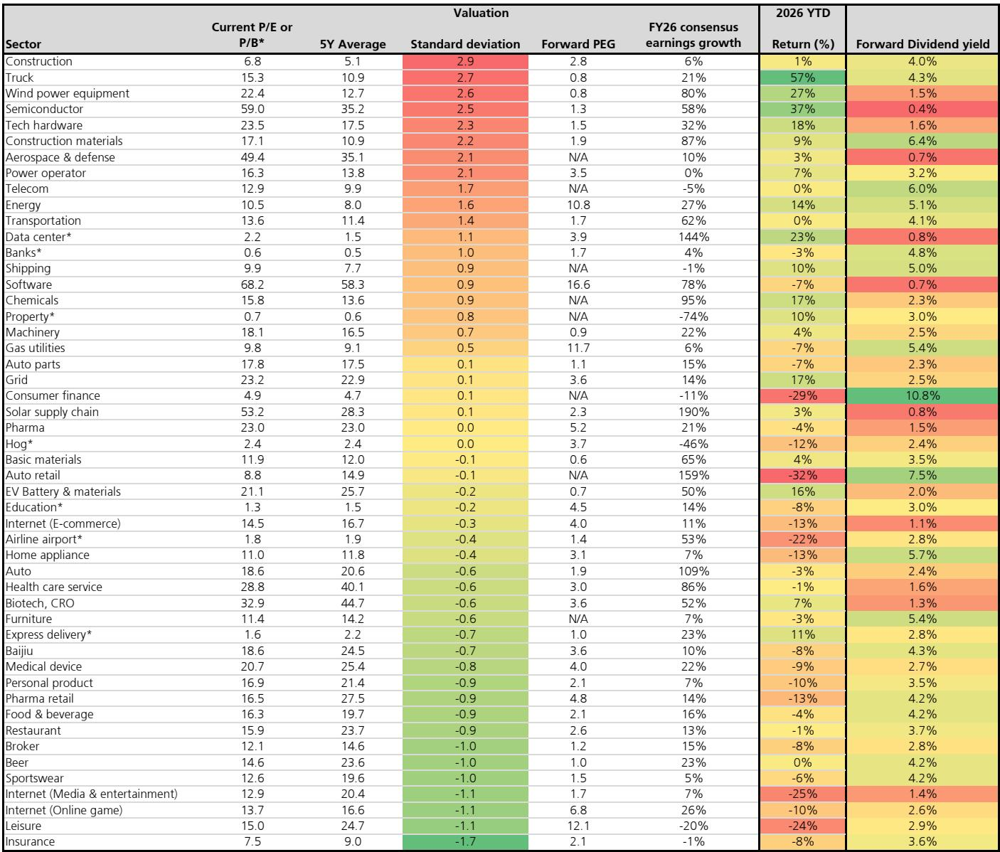
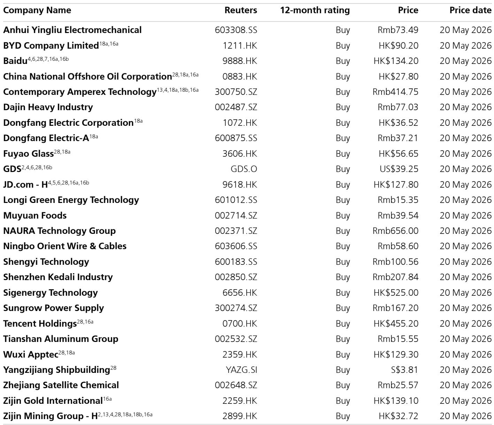
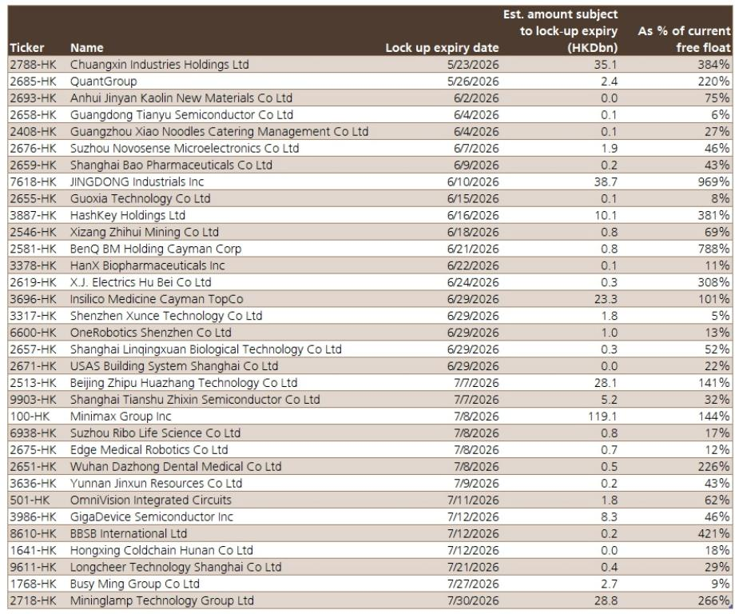

# AI硬件拥挤度已至历史高位，但市场真正低估的不是拥挤本身，而是拥挤背后的结构分化

当前中国AI硬件主题的拥挤度有多高？某外资投行最新发布的策略报告给出了一个看似矛盾但极具洞察力的答案：拥挤度确实处于历史高位，但这一状态已经持续了相当长时间，且最近三个季度并未进一步恶化。这意味着，市场真正需要回答的问题不是“AI交易是否拥挤”，而是“在当前拥挤度下，哪些环节还有继续创造超额收益的空间”。

这份报告在最近与投资者的交流中捕捉到一个关键信号：市场情绪整体偏乐观，硬件科技公司的坚实盈利正在为AI叙事提供基本面支撑。但与此同时，基金经理和宏观策略师正在花更多时间寻找供应链中的alpha机会——这暗示着AI主题内部正在发生从“买赛道”到“挑环节”的转变。

我们基于这份报告的核心数据和分析逻辑，提炼出五个值得产业决策者和投资者深入思考的判断。

## 1. 拥挤度指标已从“方向判断”转为“结构分析”工具

报告提供了三个衡量AI交易拥挤度的核心指标，但更重要的是这些指标之间的差异。

第一，公募基金在电子和电信两个AI相关板块的合计持仓接近历史高位，但过去三个季度基本持平。电子板块的配置比例从2025年三季度的22%峰值回落至2026年一季度的20%，而电信板块的配置比例则创下11%的历史新高。这种“电子降、电信升”的结构性调整，说明资金不是简单地在AI主题内加仓或减仓，而是在重新定价不同环节的风险收益比。

第二，热门AI个股的拥挤度评分在今年持续上升，但5月初达到高点后已有小幅回落。报告特别指出，这个评分是基于一个包含14只中国AI硬件和半导体个股的样本篮计算的。这些个股年初至今涨幅从-4%到129%不等，市值从88亿元到1369亿元不等——分化之大本身就说明这个主题内部并非铁板一块。

第三，TMT板块成交额占A股总成交额的比重约为37%，历史峰值为2023年的43%。距离历史极值还有约6个百分点的空间，但已明显高于过去十年的中位数水平。

这三个指标合在一起意味着什么？拥挤度不是警报信号，而是筛选信号。当市场整体拥挤度较高但结构开始分化时，那些既能保持拥挤度又能维持盈利增速的细分领域，往往是最值得关注的“拥挤但正确”的交易。

## 2. 外资流出恰恰说明AI主题的定价权正在从“全球资金”转向“本土资金”

报告提供了一个反直觉的数据点：今年以来，外资从韩国和台湾股市持续流出，而这两个市场是全球AI主题的重要proxy。同时，新兴市场基金对北亚市场的整体配置仍然处于低配状态。

这组数据需要放在一个更大的框架里理解。全球AI主题的定价权在过去两年经历了两次转移：第一次是从美国科技股向亚洲供应链的扩散，第二次是从全球资金向本土资金的切换。当外资在韩国和台湾市场兑现利润时，中国A股市场的AI硬件交易却仍然活跃——这说明本土资金正在成为这个主题的主要定价力量。

这对投资者意味着什么？如果AI交易的定价权已经从全球资金转向本土资金，那么传统上用于判断全球科技股拥挤度的框架（比如美债收益率、美联储政策预期）对A股AI硬件的影响可能会减弱。报告也提到了这一点：虽然投资者在关注美国利率上升对AI交易的潜在冲击，但报告暗示这种影响可能已经在股价中有所反映。

真正需要关注的，是本土资金的边际变化。报告指出，公募基金在电信板块的配置比例已经达到历史新高，而电子板块的配置比例正在回落。如果这个趋势延续，AI主题内部的资金流向可能会从“硬件制造”向“基础设施和应用”进一步转移。

## 3. PPI上升不是盈利杀手，反而可能是部分行业的定价权催化剂

投资者普遍担心进口通胀会挤压企业利润率，但报告给出了一个值得深思的结论：更高的PPI历史上并未导致上市公司整体盈利受损，反而往往伴随着收入增长和盈利改善。

这个判断基于五个观察，其中最有洞察力的是两点。第一，出口型企业在进口通胀时期反而表现更好，因为通胀给了企业提价的“借口”。第二，上市公司整体比非上市企业有更强的成本转嫁能力，受能源价格影响最大的公用事业和食品饮料板块在指数中占比仅约10%。

这里有一个重要的隐含逻辑：PPI上升对盈利的影响不是由通胀本身决定的，而是由企业在产业链中的议价能力决定的。那些能够将成本上涨转嫁给下游的企业，在PPI上升周期中反而可能因为收入端的弹性更大而获得更高的盈利增长。

报告没有完全展开的一个问题是：这种成本转嫁能力在AI硬件产业链中如何分布？芯片设计、晶圆代工、封装测试、光模块、服务器代工——这些环节的成本结构和议价能力差异巨大。PPI上升可能会成为区分“真正有定价权”和“只是受益于行业景气”的试金石。

## 4. 港股科技指数面临一个尚未被充分定价的短期压力源

报告在讨论港股科技指数（HSTECH）时提出了一个值得关注的时间节点：7月份将迎来大型语言模型公司的锁定期到期。历史数据显示，面临解禁的公司通常在解禁日期前表现偏弱，而如果这些公司被纳入HSTECH指数，可能会对指数整体表现带来短期压力。

这个判断的微妙之处在于，它指向的是一个“非基本面”的短期扰动因素。AI公司的基本面叙事依然强劲，但锁定期到期引发的供给冲击是独立于基本面的变量。报告没有给出具体的解禁规模数据，但明确提到在附图中列出了未来几个月的解禁时间表——这显然是希望投资者在完整报告中自行评估这个风险的大小。

这引出一个更本质的问题：当市场对AI主题的共识度极高时，非基本面的技术性因素（解禁、指数调整、流动性迁移）可能会在短期内主导价格走势。报告此前提到，投资者的注意力仍然集中在硬件科技和电力设备上，港股互联网板块的流动性被分流——这种流动性迁移本身就是一种技术性压力。

## 5. 报告尚未完全回答的关键问题：AI交易的真正风险来自哪里？

这份报告在回答“什么可能破坏AI交易”时显得格外谨慎。它没有给出一个明确的答案，而是列举了几个投资者正在关注的潜在信号：美国利率持续上升、大型语言模型公司的IPO、盈利增速放缓。

但报告真正想传递的信息可能不是这些具体事件，而是一个更宏观的判断：中国AI硬件与美股AI科技股的相关性今年以来显著上升。这意味着，中国AI交易面临的最大下行风险可能不是来自国内基本面，而是来自全球科技股的溢出效应。

这是一个值得深思的观察框架。如果中国AI硬件股的定价越来越受到美股科技股波动的影响，那么投资者需要关注的就不再只是中国AI公司的盈利和估值，而是整个全球科技股的宏观环境。但报告没有进一步展开的是：这种相关性上升是暂时的还是结构性的？如果美股AI主题出现系统性回调，中国AI硬件股是会同步下跌，还是会因为估值和基本面差异而表现出韧性？

这些问题在报告中留下了开放的答案，也正是这些未解问题，让这份报告的完整版本值得深入阅读。

---

我们围绕这份研报的核心数据和逻辑框架，梳理了上述五个判断。但正如报告本身所暗示的，AI主题的投资机会正在从“买赛道”转向“挑环节”，从“判断方向”转向“评估结构”。拥挤度本身不是风险，但拥挤度叠加结构分化，意味着选股和择时的难度都在上升。

如果你对报告中提到的解禁时间表、个股拥挤度评分、以及不同AI产业链环节的成本转嫁能力分析感兴趣，欢迎来我们的星球微信群里继续讨论。我们会围绕这份报告的核心图表和数据，做进一步的拆解和推演，帮助大家在这个拥挤但仍有alpha机会的赛道中找到更清晰的观察框架。

Personal reading notes and learning share only. Not investment advice.

