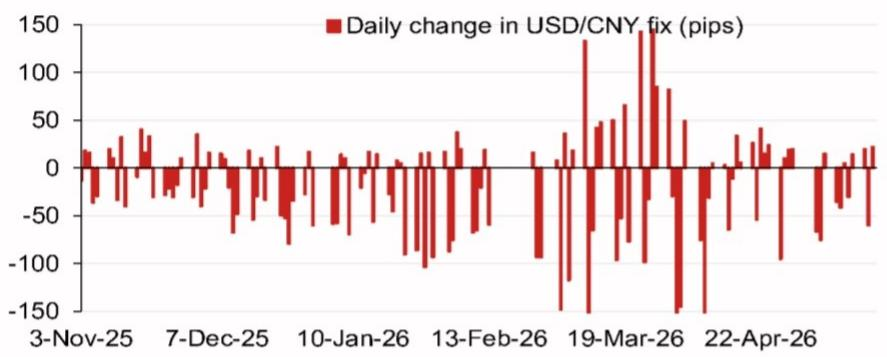
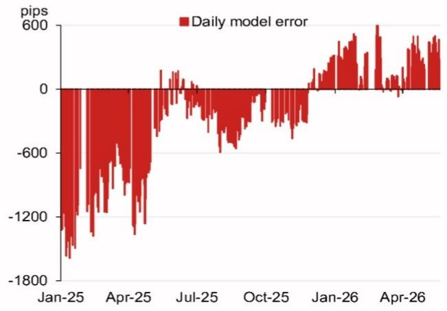

# The PBOC's Fix Model Is Sending a Signal Markets Are Not Yet Fully Pricing In

The People's Bank of China does not set the daily USD/CNY central parity rate arbitrarily. It follows a rules-based framework that incorporates overnight currency moves, and it has the discretion to add a counter-cyclical factor when it wants to lean against market pressure. The latest model projection from a leading Asia FX strategy team shows the fix dropping to 6.7927, a full 470 pips lower than the previous projection. This is not a minor adjustment. It is a deliberate signal that Chinese authorities are willing to let the yuan strengthen, and they are doing so at a moment when the dollar is broadly under pressure and the geopolitical calendar is packed with high-stakes events.

What makes this moment strategically important is the context. The model projection with the counter-cyclical factor is 6.8058, which is still 339 pips lower than the previous fix. This means the PBOC is not simply following market forces. It is actively choosing to guide the fix lower, even after accounting for its own smoothing mechanism. The implication is clear: Beijing sees room for yuan appreciation and is prepared to use its daily fix as a policy tool to achieve it. For anyone managing cross-border exposure, Asian FX portfolios, or China-linked equities, this is a shift that demands a reassessment of positioning.

The argument of this article is straightforward. The PBOC's fix model is not a mechanical black box. It is a strategic communication device. The current reading points to a policy preference for a stronger yuan, and the supporting data on model errors and fix changes suggests this preference is not an outlier. It is part of a pattern that investors should interpret as a deliberate tilt. The rest of this article unpacks why this matters, what the model is telling us, and where the unanswered questions lie.

## The Model's Pip-Level Precision Reveals a Clear Policy Tilt That Goes Beyond Mechanical Adjustment

The headline number is 6.7927, but the real insight lies in the decomposition. The model calculates the projected change in the fix based on overnight moves in a basket of currencies. The top four weighted contributors tell a compelling story. The Russian ruble contributed plus 10 pips, while the Australian dollar, euro, and Korean won contributed minus 18, minus 30, and minus 36 pips respectively. The net effect is a strong downward pull on the USD/CNY fix, driven primarily by weakness in the dollar against the euro and the won.

This is not random. The euro and the won are two of the most liquid proxies for global risk appetite and trade-weighted dollar weakness. When both are moving sharply against the dollar, the PBOC's model mechanically captures that pressure and translates it into a lower fix. But the counter-cyclical factor adjustment is where the policy signal becomes unmistakable. Without the factor, the projected fix is 6.7927. With it, the fix is 6.8058. That 131-pip gap is the PBOC's own buffer. It is saying, in effect, that it is willing to let the yuan appreciate, but it does not want to overshoot or trigger disruptive volatility.

The so-what here is crucial. Many market participants treat the fix as a lagging indicator of overnight moves. That is only half true. The fix is also a leading indicator of where the PBOC wants the yuan to trade. When the model projection drops by nearly 500 pips and the PBOC does not fully offset it with the counter-cyclical factor, it is effectively validating the market's direction. Investors who ignore this signal risk being caught on the wrong side of a trend that has official backing.

## The Pattern of Model Errors Suggests the PBOC Has Been Consistently Leaning Against Yuan Weakness, Not Strength

The second figure in the report shows daily model errors over a multi-year period. The errors are not random. They cluster in a range that reveals the PBOC's asymmetric intervention behavior. When the model error is positive, meaning the actual fix is higher than the model projection, the PBOC is effectively resisting yuan appreciation. When the error is negative, it is resisting depreciation.

The data shows that the largest negative errors occurred in early 2025, with a spike of approximately minus 1,800 pips. That was a period of intense dollar strength and yuan depreciation pressure. The PBOC responded by setting the fix significantly lower than the model suggested, effectively leaning against the depreciation. In mid-2025, the errors converged toward zero, indicating a period of relative equilibrium. By early 2026, the errors turned positive, meaning the PBOC was now resisting appreciation.

This pattern is not symmetrical. The PBOC intervenes more aggressively to prevent sharp depreciation than to prevent sharp appreciation. That is consistent with its historical preference for a stable or gradually appreciating yuan. But the recent shift to positive errors, combined with the lower model projection, creates an interesting tension. The PBOC is now in a position where it may need to choose between letting the yuan strengthen further or using its counter-cyclical factor to slow the move. The model suggests it is choosing the former, at least for now.

The implication for investors is that the yuan's current strength has a policy backstop. It is not purely a speculative move. The PBOC has room to allow further appreciation, and the model error history shows it is willing to do so when the global environment supports it. The risk is not that the PBOC will suddenly reverse course. The risk is that the model projection is already pricing in a level of appreciation that has not yet fully materialized in spot markets. That gap is where the opportunity lies.

## The Calendar of Political Events Creates a Window for Managed Yuan Strength That Investors Should Anticipate

The report includes a calendar of events extending through late 2026. The key milestones are the Politburo economic work meeting in late July, the APEC summit in Shenzhen in November, the Central Economic Work Conference in mid-December, and the potential visit of President Xi to the United States toward the end of the year. Each of these events creates a diplomatic and economic context in which a stable or stronger yuan serves China's interests.

Consider the APEC summit. China is hosting the event in Shenzhen, and it will be a showcase for its economic openness and regional leadership. A depreciating yuan during that period would send exactly the wrong signal. It would be interpreted as a sign of weakness or a deliberate attempt to gain competitive advantage. The PBOC has every incentive to ensure the yuan is stable or appreciating in the run-up to and during the summit. The same logic applies to the Xi visit to the US. A stronger yuan reduces trade friction and provides negotiating leverage.

The so-what is that the model projection is not just a technical reading. It is consistent with the political calendar. The PBOC is likely to use its fix as a tool to support diplomatic objectives. Investors should map these events onto their FX positioning and ask themselves whether the current market consensus is pricing in the full extent of this policy alignment. The report does not make this connection explicitly, but the logic is unavoidable. When the model says one thing and the calendar says another, the smart money follows the calendar.

## The Report's Framework Leaves Open a Critical Question About the Sustainability of the Counter-Cyclical Factor

For all its analytical rigor, the report does not fully answer one question: how long can the PBOC sustain a counter-cyclical factor that is out of sync with the underlying model? The current gap is 131 pips. That is manageable. But if the model projection continues to drop, the gap will widen, and the PBOC will face a choice. It can either reduce the counter-cyclical factor and let the fix fall further, or it can increase the factor and resist appreciation. The first option validates the market trend. The second option introduces policy uncertainty.

The history of model errors suggests the PBOC is willing to tolerate large gaps for short periods, but not indefinitely. The minus 1,800 pip error in early 2025 was an extreme case that lasted only a few weeks. The current environment is different. The dollar is weak, global risk appetite is strong, and China's own economic data is showing signs of stabilization. In that context, the PBOC may be more comfortable letting the fix converge toward the model projection. But if the yuan appreciates too quickly, the counter-cyclical factor will become a binding constraint.

This is the open question that the report's framework cannot resolve. The model tells us where the fix should be. It does not tell us where the PBOC wants it to be. The gap between those two numbers is the real source of uncertainty. Investors who rely solely on the model projection without understanding the policy dynamics behind the counter-cyclical factor are missing half the picture. The report provides the data to ask the right question, but it does not provide the answer.

## A Decision Framework for Interpreting the Fix Model and Positioning for the Next Move

For readers who want to translate this analysis into actionable decisions, the following framework is useful. It is not a trading strategy. It is a way to organize the signals from the model, the policy context, and the calendar into a coherent view.

First, monitor the gap between the model projection and the actual fix. When the gap narrows, it means the PBOC is converging toward the model. When it widens, the PBOC is actively resisting. The current gap of 131 pips is moderate. A narrowing gap would be a bullish signal for the yuan. A widening gap would indicate policy resistance and introduce downside risk.

Second, track the composition of the model's weighted contributors. The top four currencies are not random. They reflect the PBOC's implicit basket. When the euro and the won are the dominant drivers, as they are now, the model is capturing broad dollar weakness. When the ruble or other emerging market currencies become dominant, the model is capturing idiosyncratic risk. The composition matters because it tells you whether the fix is responding to global or local factors.

Third, align your positioning with the political calendar. The APEC summit and the Xi visit are the two most important events. In the three months leading up to each event, the PBOC has a strong incentive to maintain yuan stability or appreciation. That is the window for positioning. After the events, the policy constraint may ease, and the model will become the dominant driver again.

Fourth, do not assume the counter-cyclical factor is permanent. It is a discretionary tool that the PBOC can adjust or remove. If the model projection continues to drop and the PBOC keeps the factor unchanged, the gap will widen, and the factor will become a larger distortion. At some point, the PBOC will have to adjust. The direction of that adjustment is the single most important variable for the yuan's medium-term path.

This framework is not a substitute for the full report. It is a way to extract the maximum analytical value from the model data without getting lost in the pip-level noise. The report's charts on model errors and fix changes are essential for calibrating the framework. They provide the historical context that makes the current projection meaningful.

## The Full Report Contains the Charts and Data That Make This Analysis Actionable

The model projection, the error history, and the fix change data are all presented in the original report with detailed charts that are difficult to replicate in text. The bar chart of top four weighted contributions shows exactly how each currency is driving the projection. The line chart of model errors over time reveals the PBOC's asymmetric intervention pattern. The bar chart of daily fix changes highlights the moments when the PBOC broke from its usual pattern of stability.

These charts are not decorative. They are the raw material for the analysis presented in this article. Without them, the numbers are abstract. With them, the story becomes concrete. The model error chart, in particular, is worth studying closely. It shows that the PBOC's intervention behavior is not random. It follows a cycle that is closely tied to the dollar cycle and China's own policy priorities. The current position in that cycle suggests the PBOC is in a permissive phase for yuan appreciation.

Join the community to read the full report and review the original charts.

*This article is for learning and discussion only and does not constitute investment advice.*

Personal reading notes and learning share only. Not investment advice.

