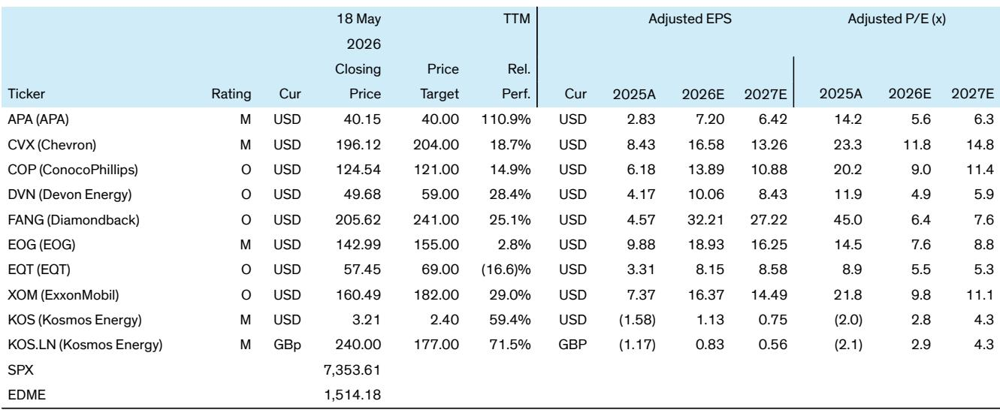
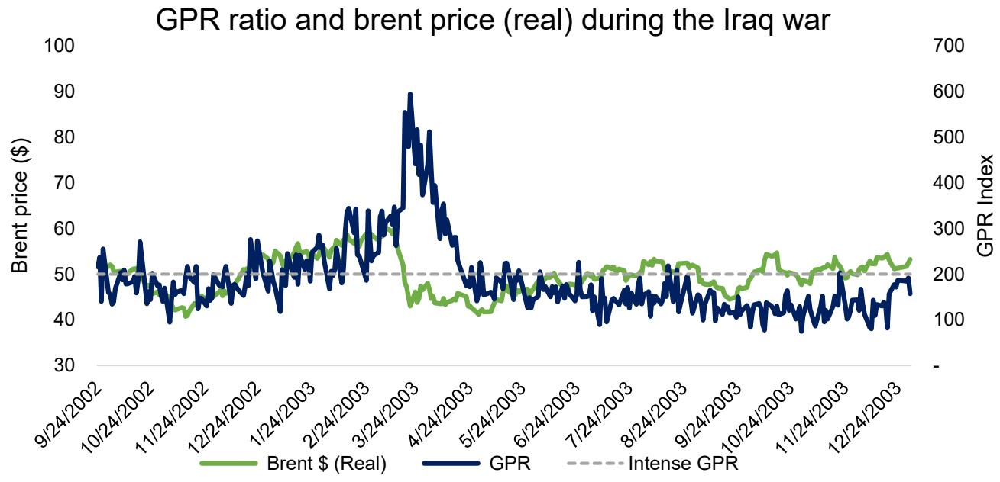
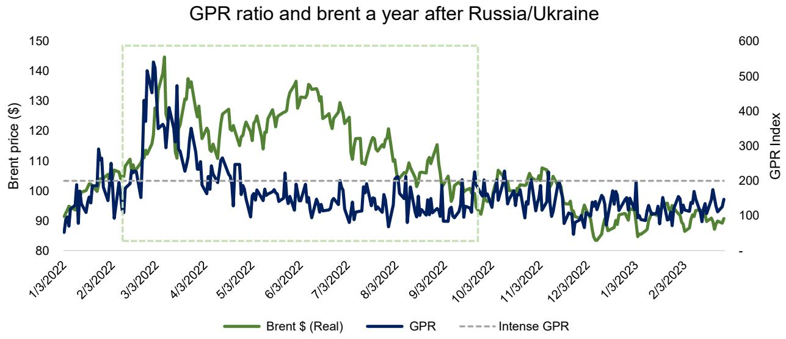

# Oil Prices Are Stickier Than Markets Assume: Why Geopolitical Risk Demands a Rethink of the Return to Normal

The prevailing consensus among oil market participants is that the geopolitical risk premium embedded in crude prices will fade as conflicts de-escalate and supply disruptions resolve. This assumption has become so deeply embedded in forward curves and equity valuations that it now constitutes the single most dangerous consensus trade in energy markets today. A rigorous analysis of the relationship between geopolitical risk and oil prices over nearly four decades suggests the opposite conclusion: oil prices exhibit far greater persistence than geopolitical fear indicators, and the market systematically underestimates how slowly these premiums decay.

The core argument is straightforward. When a linear regression model incorporates the Geopolitical Risk Index alongside conventional drivers such as marginal cost, inventory levels, and dollar strength, the predicted Brent price for today stands at approximately $120 per barrel in real terms. This is meaningfully above where the forward curve sits. The gap between model output and market pricing is not noise. It reflects a structural mispricing of how geopolitical shocks propagate through time in physical oil markets.

Why this matters now is because the current environment mirrors historical supply shock episodes more closely than the market acknowledges. The pattern is consistent across the Kuwait invasion, the Iraq War buildup, and the Russia-Ukraine conflict: oil prices take 30 to 50 days to peak after the initial shock and then require two to three months to decline back toward pre-crisis levels. Yet the Geopolitical Risk Index, which captures the intensity of media coverage, completes its entire roller coaster in roughly one month. The fear fades fast. The price stickiness does not.

This introduces a critical strategic tension. If the market is pricing a return to normal that history suggests is too fast, then the cash flow generation of oil companies over the next twelve to eighteen months will be materially higher than consensus expects. Equity valuations that assume a rapid normalization of prices are not just conservative. They are structurally wrong. The implications for portfolio construction, hedging strategy, and capital allocation decisions are profound.

## The Four Structural Drivers of Oil Price Formation Reveal That Geopolitical Risk Is Not a Transient Add-On

The conventional approach to oil price forecasting typically relies on marginal cost, inventory levels, and macroeconomic variables. The analysis presented here demonstrates that this framework is incomplete. When the Geopolitical Risk Index is included as an explicit variable, the model explains approximately 70 percent of the variation in real oil prices across more than ninety quarters of data. The regression equation is revealing: Real Brent equals 121 plus 0.75 times marginal cost minus 0.04 times inventory minus 1.33 times the dollar index plus 0.13 times the GPR index, plus smaller contributions from the federal funds rate and OPEC spare capacity.

The relative economic impact of each variable, measured by how much a one-standard-deviation move shifts predicted Brent, establishes a clear hierarchy. A ten-dollar increase in marginal cost raises Brent by roughly seven dollars. A one-point rise in the dollar index lowers real Brent by about 1.33 dollars. A 100 million barrel increase in OECD inventories reduces real Brent by approximately four dollars. The Geopolitical Risk Index carries a positive sign, as expected, but its most important characteristic is not the magnitude of its coefficient. It is the asymmetry between how quickly the index spikes and how slowly the price premium dissipates.

This asymmetry is the key insight that most market participants miss. The GPR index is constructed from the intensity of media coverage. It is a measure of attention, not of physical reality. Markets react to headlines, and the index captures that reaction faithfully. But physical oil markets operate on fundamentally different timescales. Once a supply disruption occurs, the rebalancing process involves tanker rerouting, inventory drawdowns, refinery adjustments, and contractual renegotiations. These processes take months, not weeks. The media moves on. The oil market cannot.

The practical implication is that any valuation model that treats geopolitical risk as a temporary additive premium, one that decays rapidly once headlines fade, is systematically underestimating the persistence of price effects. The premium is not a transient spike. It is a structural shift that decays on the timescale of physical market rebalancing, not on the timescale of news cycles.

## Historical Supply Shocks Demonstrate a Consistent Pattern of Price Stickiness That the Current Market Ignores

The historical record provides a laboratory for understanding how oil prices behave during and after geopolitical supply shocks. The analysis identifies two distinct categories of events: supply shock episodes and non-oil geopolitical spikes. The supply shocks are the relevant analog for the current environment, and they share a remarkably consistent pattern.

During the Kuwait invasion of 1990, the sudden removal of approximately 4.3 million barrels per day of Iraqi and Kuwaiti exports, representing roughly 7 percent of global supply, triggered a textbook price spike. Brent prices jumped from about $21 per barrel at the end of July to a peak near $46 per barrel within two months. The price remained elevated for approximately six months. The GPR index, by contrast, fell back below its crisis threshold within two months of the initial spike. The fear subsided. The price did not.

The Iraq War episode in 2003 tells a similar story. Oil prices began strengthening once the United States signaled its intention to invade in late 2002 and remained elevated around the $50 per barrel level even after geopolitical risk indicators declined in mid-2003. The GPR index normalized gradually to lower levels, but Brent prices exhibited greater stickiness. The pattern repeated with the Russia-Ukraine conflict in 2022, where oil prices took roughly 20 days to peak and then declined only slowly, while the GPR index reverted much more quickly.

The quantitative evidence is striking. After one week following a supply shock, the GPR index declines approximately 28 percent while Brent prices decline only 1 percent. Four months later, Brent still shows 89 percent persistence while the GPR index has almost fully reverted. The autocorrelation analysis confirms this across multiple time frames: Brent autocorrelation remains above 0.90 even at 90 days, while GPR autocorrelation drops below 0.20 over the same period.

The strategic implication is clear. If the current geopolitical environment represents a supply shock episode, and the historical pattern holds, then the market is pricing a return to normal that is roughly two to three months too fast. The cash flows generated by oil companies over that period will be higher than the forward curve implies. Equity valuations that assume a rapid normalization are building in a margin of safety that does not exist.

## The Report Leaves Unanswered How to Distinguish Between Transient Fear and Structural Supply Disruption in Real Time

For all its analytical rigor, the report does not fully resolve the most difficult question facing investors today: how to distinguish, in real time, between a geopolitical event that is primarily a media-driven fear spike and one that represents a genuine structural supply disruption. The GPR index captures both types of events, and its behavior during the first few days can look identical across very different scenarios.

The September 11 attacks provide a clear example of a GPR spike that had no direct oil supply implications. The index surged, but oil prices did not follow the same trajectory. The 2008 financial crisis produced a massive oil price spike without a corresponding GPR signal. The index is a useful proxy, but it is not a perfect discriminator.

The report hints at a solution by noting that GPR and the VIX correlate during supply shocks but not during non-oil geopolitical events. This suggests that the cross-asset behavior of volatility indices could provide a real-time filter for distinguishing between event types. If GPR spikes while the VIX remains subdued, the event is likely not a supply shock. If both indices surge together, the probability of a genuine supply disruption increases significantly.

But this framework remains incomplete. The correlation between GPR and VIX during supply shocks is empirically observed but not theoretically derived. The mechanism that connects geopolitical fear to equity market volatility during oil supply disruptions is not fully understood. Is it the direct impact of higher oil prices on corporate earnings? Is it the indirect effect of increased uncertainty on investment decisions? Or is it a third factor, such as a broader geopolitical crisis that simultaneously threatens oil supply and financial stability?

These questions matter because the answer determines how investors should position for the next event. A framework that relies on ex post identification of supply shocks is useful for historical analysis but less helpful for forward positioning. The report provides the analytical tools to understand what has happened. It does not fully provide the tools to predict what will happen next.

## A Decision Framework for Investors Navigating the Gap Between Model Price and Market Price

The gap between the model-predicted Brent price of $120 per barrel and the forward curve creates a specific set of strategic choices for investors. The framework below translates the report's analytical insights into actionable decisions across three time horizons.

For the immediate term, the key question is whether the current geopolitical risk premium is being correctly priced by the options market. If Brent prices are stickier than the GPR index suggests, then out-of-the-money put options on oil equities are likely overpriced relative to the true probability of a rapid price decline. Investors who accept the stickiness thesis should consider reducing hedging costs by selling downside protection or by moving from put options to put spreads that cap the premium they pay for tail risk.

For the medium term, the critical decision is whether to overweight oil equities that benefit most from sustained high prices. The report identifies a preference for companies with high oil exposure and strong free cash flow generation. The logic is straightforward: if prices remain elevated for longer than consensus expects, the companies with the highest marginal exposure to each dollar of Brent will generate the most excess cash. This cash can be returned to shareholders through buybacks and dividends, or it can be reinvested into production growth that compounds over time.

For the longer term, the framework raises a deeper strategic question about portfolio construction. If geopolitical risk is systematically underpriced in oil markets, then a strategic allocation to energy equities serves not just as a return generator but as a hedge against a broader set of macroeconomic scenarios that involve supply disruptions. The correlation between oil prices and equity markets during supply shocks, as captured by the GPR-VIX relationship, means that energy exposure can provide diversification benefits precisely when they are most needed.

The decision framework is not a recommendation to blindly overweight oil. It is a tool for assessing whether the current market pricing of geopolitical risk is consistent with the historical evidence. For investors who conclude that it is not, the framework provides a structured approach to capturing the resulting mispricing.

## The Full Report Contains the Charts and Data That Make This Argument Actionable

The analysis presented here draws on a rich dataset spanning nearly four decades of oil prices, geopolitical risk indices, and macroeconomic variables. The full report contains the regression outputs, the historical case studies, the autocorrelation analysis, and the detailed ticker-level implications that allow investors to translate this strategic insight into specific portfolio decisions.

The charts in the original report are not decorative. They are the analytical foundation for the argument that oil prices are stickier than markets assume. The regression exhibit showing the model fit across ninety quarters, the historical comparison of GPR and Brent during supply shocks, the persistence analysis showing the decay rates of both variables, and the case study charts for Kuwait, Iraq, and Russia-Ukraine all contain granular data that cannot be fully conveyed in a summary.

Investors who want to test the argument against their own assumptions, who want to see the specific data points that drive the $120 per barrel model output, and who want to review the exact timing of price peaks and declines during historical supply shocks will find that information in the full report.

Join the community to read the full report and review the original charts.

*This article is for learning and discussion only and does not constitute investment advice.*

Personal reading notes and learning share only. Not investment advice.

