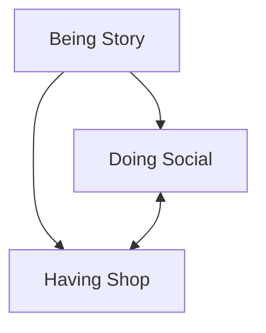
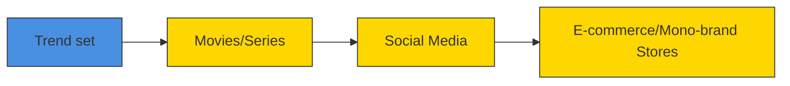

你是麦肯锡/投研风格的微信公众号财经文章主笔，擅长用金字塔原理把研报内容转化为“有主张、有层次、有洞察、但仍保留完整报告阅读欲望”的长文。

【目标】
- 基于下面的研报解析内容，写一篇微信公众号文章 Markdown。
- 风格：稳重、专业、克制、有洞察，像咨询公司合伙人写给高净值读者/产业决策者的研报导读。
- 长度：约 3000 字，允许上下浮动 15%。
- 不要使用 emoji。
- 可以基于报告内容做适度发散，但必须是从原文逻辑推出的判断，不要编造数据、公司动作或引用。
- 不要把研报所有正文内容讲完，要留下明确但自然的伏笔，让读者愿意加入社群阅读完整报告。

【金字塔原理写作原则】
1. 结论先行：文章开头先回答“这份报告最值得看的判断是什么”，而不是介绍背景。
2. 统领思想：全文只能服务一个主判断，避免变成摘要合集。
3. 纵向回答：每一层都要回答上一层提出的“为什么”或“所以呢”。
4. 横向 MECE：每个一级小节必须彼此独立、共同支撑主判断，避免重叠。
5. Synthesis over summary：不要复述报告段落，要提炼“这些事实合在一起意味着什么”。
6. So what：每个小节末尾必须落到对行业、公司、竞争格局、资产定价或读者观察框架的含义。
7. Action title：所有 `##` 小标题必须是“直接讲述洞察的完整句子”，不能是目录标签。

【标题与小标题硬性要求】
- `# 标题` 必须直接表达一个判断，例如“市场真正低估的不是需求，而是供给侧的再定价”。
- 禁止使用以下机械标题：
  - 一、核心判断
  - 二、真正重要的是结构性变量
  - 三、报告没有说透
  - 四、对读者的启发
  - 关键变化
  - 投资启示
  - 总结
- 所有 `##` 标题都要像麦肯锡报告里的 action title：读完标题就知道这一节结论。
- 小标题可以带序号，但序号后必须是一句洞察，例如：`## 1. 这轮变化真正考验的是企业能否把规模转化为议价权`。

【建议结构，但不要机械照抄标题】
1. `# 标题`：一句主判断，不超过 32 字。
2. 开头 4-6 段：直接给出主判断、为什么现在重要、报告提供了什么新信号。
3. 4-6 个 `##` 小节：每个小节标题都是洞察句，不是栏目名。
4. 至少一个小节讨论“报告尚未完全回答的关键问题”，但标题也要是洞察句。
5. 至少一个小节给出读者的观察框架，但不要命名为“对读者的启发”。
6. 文末自然承接未解问题，引导读者加入社群/微信群继续讨论。不要照抄固定话术，请基于本文未解问题每次重新写一段自然 CTA；语义可以参考：欢迎来星球微信群里继续讨论。
7. 在免责声明前，单独插入这张图片链接：``
8. 结尾只输出英文灰色免责声明：`
Personal reading notes and learning share only. Not investment advice.
`

【hook 要求】
- 不要硬插“加入社群”。
- hook 应该来自正文自然出现的未解问题，比如：关键假设尚未验证、竞争优势仍需拆解、图表背后的二阶影响没有展开。
- 文末 CTA 要像“顺着这些未解问题继续读完整报告/继续讨论”，不是广告口吻。
- CTA 必须每篇重新写，不能固定输出“加入社群，领取完整研报解读与原始图表”。可以类似“欢迎来星球微信群里继续讨论”。

【图片要求】
- 不要主动生成 MinerU 图片 markdown；系统会在文章生成后自动插入 MinerU 原始图片。
- 但文末免责声明前必须保留知识星球图片：``。

【内容边界】
- 只能基于研报原文和解析结果推导，不要编造数据、公司动作、引用。
- 遇到不确定内容，要用“这里仍需验证”“报告没有完全展开”等表达。
- 避免“震惊”“爆款”“一文看懂”等浮夸表达。
- 不要出现小红书话题标签。
- 不要出现 emoji。
- 默认避免出现具体投行品牌名，比如“GS”“GS”，统一写作“投行研报”。
- 不要解释你的思考过程，不要输出多余说明。

【研报解析内容】
"""
# Global Luxury Goods

# Global Luxury Goods: The accelerating loop of Story-Social-Shop

  
Luca Solca

+41 582 723 126

luca.solca@bernsteinsg.com

  
Maria Meita

+44 20 7170 0540

maria.meita@bernsteinsg.com

Eric Chen, CFA

+852 2123 2628

eric.chen@bernsteinsg.com

Yi-Peng Khoo, CFA

+44 20 7676 6822

yi-peng.khoo@bernsteinsg.com

# Specialist Sales

Alix Turner

+44 20 7762 4044

alix.turner@bernsteinsg.com

We have written before how TV role models impact the lifestyles and aspirations of entire generations in China, but also the West. Keeping with the exploding complexity principle, luxury brands need to move at the speed of culture in order to stay relevant. Streaming releases, social feeds and shoppable platforms have compressed the old cycle of editorials-runway-retail into a rapid loop of story-social-shop.

First, a series or film launches a distinctive aesthetic that gives consumers a fully formed visual narrative anchored in story and emotion, rather than just a product. Love Story (based on the tragic romance of JFK Jr and Carolyn Bessette-Kennedy) crystallises 90s minimalism; Wuthering Heights (starring Margot Robbie and Jacob Elordi) delivers a Gothic Romance wardrobe set against windswept moors. The characters' style becomes a proxy for a mood and identity consumers can buy into. Press tours now extend and pre-sell that aesthetic before the film or series even lands. Margot Robbie's method dressing around the Barbie press tour set the template in delivering sartorial hysteria; she repeated the playbook for Wuthering Heights, moving the trend straight off the set and onto the street. The result was an immediate spike in desire for period dressing and, specifically, Vivienne Westwood's corset dress, which saw demand on Lyst rise 88% quarter-on-quarter.

Second, as soon as the series or movie premieres, brands move to formalise the trend, guided by data-driven merchandising and real-time search behaviour. Less than a week after Love Story launched, Polo Ralph Lauren (not covered) posted a campaign on social media clearly inspired by the protagonist and his aesthetic. A week later, Uniqlo (not covered) followed with its own interpretation, while Starbucks (covered by the U.S. restaurants team) joined in with a tongue-in-cheek Instagram reference to JFK Jr. For some brands, the upside is outsized. Calvin Klein (not covered) was served cultural relevance on a silver platter with Love Story: CBK was a CK publicist and the brand features heavily in the show, despite its lack of official involvement. Lyst searches for Calvin Klein went up +43%, while its website traffic increased 41% MoM after the series launched. On PVH's annual earnings call, the CEO noted, "We can't talk about CK today without referencing Love Story, the TV show." The stock rose 9.75% after results, helped by the show's virality. So far, this looks largely like a US-centric phenomenon with some spillover into other Western markets and limited adoption in Asia.

Third, the trend goes mainstream. E-commerce makes the inspiration-to-purchase journey almost frictionless: consumers can move from seeing a look on screen or social to “their” version in a few taps. Algorithms reward repetition and recognisability, so early adopters and influencers quickly translate the cinematic wardrobe into real-life outfits and “get the look” content, turning fantasy into something anyone can recreate at home. Official license partners (often high street retailers) drop limited-edition collaborations to ride the wave. The H&M x Wuthering Heights 11-piece capsule is a case in point, designed to capture the media frenzy and drive traffic in store and online. These drops generate more content which help extend the trend’s lifespan. By that point, early adopters have usually moved on to the next micro-phenomenon, following the piracy paradox.

BERNSTEIN TICKER TABLE 

<table><tr><td rowspan="2">Ticker</td><td rowspan="2">Rating</td><td rowspan="2">Cur</td><td rowspan="2">18 May2026ClosingPrice</td><td rowspan="2">PriceTarget</td><td rowspan="2">TTMRel.Perf.</td><td colspan="4">Adjusted EPS</td><td colspan="3">Adjusted P/E (x)</td></tr><tr><td>Cur</td><td>2025A</td><td>2026E</td><td>2027E</td><td>2025A</td><td>2026E</td><td>2027E</td></tr><tr><td>BIRK (Birkenstock)</td><td>M</td><td>USD</td><td>32.12</td><td>50.00</td><td>(66.0)%</td><td>EUR</td><td>1.85</td><td>2.01</td><td>2.49</td><td>14.9</td><td>13.7</td><td>11.1</td></tr><tr><td>BC.IM (Brunello Cucinelli)</td><td>O</td><td>EUR</td><td>82.10</td><td>108.00</td><td>(34.9)%</td><td>EUR</td><td>1.99</td><td>2.26</td><td>2.65</td><td>41.3</td><td>36.3</td><td>31.0</td></tr><tr><td>BRBY.LN (Burberry)</td><td>O</td><td>GBp</td><td>1,083.00</td><td>1,300.00</td><td>(1.4)%</td><td>GBP</td><td>0.24</td><td>0.39</td><td></td><td>44.3</td><td>27.9</td><td>19.7</td></tr><tr><td>CFR.SW (Richemont)</td><td>O</td><td>CHF</td><td>154.65</td><td>200.00</td><td>(15.5)%</td><td>EUR</td><td>6.39</td><td>6.12</td><td>6.87</td><td>26.4</td><td>27.6</td><td>24.6</td></tr><tr><td>ZGN</td><td>O</td><td>USD</td><td>12.69</td><td>14.00</td><td>38.2%</td><td>EUR</td><td>0.45</td><td>0.42</td><td>0.60</td><td>24.3</td><td>26.0</td><td>18.2</td></tr><tr><td>EL.FP (EssilorLuxottica)</td><td>M</td><td>EUR</td><td>174.20</td><td>185.00</td><td>(42.5)%</td><td>EUR</td><td>6.79</td><td>7.65</td><td>8.95</td><td>25.6</td><td>22.8</td><td>19.5</td></tr><tr><td>RMS.FP (Hermes)</td><td>O</td><td>EUR</td><td>1,580.00</td><td>2,150.00</td><td>(47.5)%</td><td>EUR</td><td>43.12</td><td>44.33</td><td>52.47</td><td>36.6</td><td>35.6</td><td>30.1</td></tr><tr><td>KER.FP (Kering)</td><td>M</td><td>EUR</td><td>239.50</td><td>220.00</td><td>27.5%</td><td>EUR</td><td>4.35</td><td>6.66</td><td>10.04</td><td>55.1</td><td>36.0</td><td>23.9</td></tr><tr><td>MC.FP (LVMH)</td><td>O</td><td>EUR</td><td>456.25</td><td>600.00</td><td>(17.1)%</td><td>EUR</td><td>22.73</td><td>22.22</td><td>26.71</td><td>20.1</td><td>20.5</td><td>17.1</td></tr><tr><td>MONC.IM (Moncler)</td><td>M</td><td>EUR</td><td>49.25</td><td>57.50</td><td>(21.4)%</td><td>EUR</td><td>2.31</td><td>2.44</td><td>2.64</td><td>21.3</td><td>20.2</td><td>18.7</td></tr><tr><td>1913.HK (Prada SpA)</td><td>O</td><td>HKD</td><td>35.56</td><td>50.00</td><td>(70.3)%</td><td>EUR</td><td>0.33</td><td>0.32</td><td>0.36</td><td>11.7</td><td>12.4</td><td>11.0</td></tr><tr><td>SFER.IM (Ferragamo)</td><td>O</td><td>EUR</td><td>6.94</td><td>8.80</td><td>8.5%</td><td>EUR</td><td>(0.30)</td><td>0.04</td><td>0.15</td><td>(23.5)</td><td>184.8</td><td>47.3</td></tr><tr><td>UHR.SW (Swatch)</td><td>O</td><td>CHF</td><td>201.90</td><td>180.00</td><td>27.1%</td><td>CHF</td><td>0.03</td><td>4.32</td><td>8.16</td><td>N/M</td><td>46.7</td><td>24.7</td></tr><tr><td>SPX</td><td></td><td></td><td>7,353.61</td><td></td><td></td><td></td><td></td><td></td><td></td><td></td><td></td><td></td></tr><tr><td>EDME</td><td></td><td></td><td>1,514.18</td><td></td><td></td><td></td><td></td><td></td><td></td><td></td><td></td><td></td></tr><tr><td>EMLSF</td><td></td><td></td><td>5,952.61</td><td></td><td></td><td></td><td></td><td></td><td></td><td></td><td></td><td></td></tr><tr><td>ASIAX</td><td></td><td></td><td>1,894.75</td><td></td><td></td><td></td><td></td><td></td><td></td><td></td><td></td><td></td></tr></table>

O - Outperform, M - Market-Perform, U - Underperform, NR - Not Rated, CS - Coverage Suspended   
BRBY.LN base year is 2026;   
Source: Bloomberg, Bernstein estimates and analysis.

# INVESTMENT IMPLICATIONS

The open question is whether brands can consistently turn these cultural spikes into sustainable revenue before the moment evaporates. PVH's CEO gave concrete examples of how Calvin Klein is trying to do just that: a 90s-heavy product assortment and marketing focus, which generated higher-than-average social engagement and click-through rates, and strategic styling of key talent. By contrast, Prada and Dior appear to have kept a more measured distance from the launch of The Devil Wears Prada 2. Despite a short-lived uptick in Google searches and dressing key talent for red carpets, they have not leaned fully into the phenomenon. That hasn't deterred others: we count more than ten brands, from Grey Goose to United Airlines, that have jumped in with opportunistic campaigns. The underlying lesson is clear: brands can no longer rely on heritage or product alone. They need to exist inside a wider cultural ecosystem—where image, narrative and accessibility reinforce one another—or risk watching others harvest the trends that their own products helped inspire in the first place.

# DETAILS

We have written before how TV role models impact the lifestyles and aspirations of entire generations in China, but also the West. Keeping with the exploding complexity principle, luxury brands need to move at the speed of culture in order to stay relevant. Streaming releases, social feeds and shoppable platforms have compressed the old cycle of editorials-runway-retail into a rapid loop of story-social-shop.

EXHIBIT 1: Luxury goods support people's identity through "having". This projective identification cycle is being compressed from the old cycle of editorials-runway-retail into a rapid loop of story-social-shop.

flowchart

Source: Bernstein analysis

EXHIBIT 2: Streaming, social media and e-commerce have accelerated luxury trends: what used to take months before, now takes weeks.

flowchart

flowchart

Source: Bernstein analysis

First, a series or film launches a distinctive aesthetic that gives consumers a fully formed visual narrative anchored in story and emotion, rather than just a product. Love Story (based on the tragic romance of JFK Jr and Carolyn Bessette-Kennedy) crystallises 90s minimalism and polished Ivy League ease; Wuthering Heights (starring Margot Robbie and Jacob Elordi) delivers a Gothic Romance wardrobe set against windswept moors. The characters' style becomes a proxy for a mood and identity consumers can buy into. Press tours now extend and pre-sell that aesthetic before the film or series even lands. Margot Robbie's method dressing around the Barbie press tour set the template in delivering sartorial hysteria; she repeated the playbook for Wuthering Heights, moving the trend straight off the set and onto the street. The result was an immediate spike in demand for period dressing and, specifically, Vivienne Westwood's corset dress, which saw demand on Lyst rise 88% quarter-on-quarter.

EXHIBIT 3: Margot Robbie's method dressing around the Barbie press tour set the template in delivering sartorial hysteria; she repeated the playbook for Wuthering Heights, moving the trend straight off the set and onto the street.   
  
Source: Instagram, Company websites, Bernstein analysis

EXHIBIT 4: The FW26 trends were reinterpreted by editors through the lens of the cultural sensation that became the Wutherng Heights movie, with gothic, opulent and elegant at the forefront.   
The Fall/Winter 2026 Trends 

<table><tr><td>Net-a-Porter</td><td>Coveteur</td><td>Hypebeast</td><td>WhoWhatWear</td></tr><tr><td>Mood: Gothic romance</td><td>Long Exit (trains)</td><td>The Boiler Suit (Workwear)</td><td>Modern Heirlooms</td></tr><tr><td>Key colors: purple, green, ochre, red</td><td>Tactile Texture (fur, shearling, fringe)</td><td>Crimson (primary red)</td><td>Minimal, pure, essential</td></tr><tr><td>Key piece: the minimalist dress</td><td>Pin It (brooches)</td><td>Silver surfaces</td><td>Romantic and grandiose</td></tr><tr><td>Boots as pants</td><td>Dark Romance</td><td>Leopardmania</td><td>Fur</td></tr><tr><td>The styling trick: layers upon layers</td><td>Checked Out (plaid, tartan)</td><td>Asymmetrical Embellishments</td><td>Tuxedos</td></tr><tr><td>Haute hosiery</td><td>Statement Fur</td><td>Dirty &amp; Disheveled (distressed textures)</td><td>Fitted looks</td></tr><tr><td>Folk tales</td><td>The New Suit (skirt suits)</td><td></td><td></td></tr><tr><td>The texture: velvet</td><td>Open Season (open bags)</td><td></td><td></td></tr><tr><td>The finishing touch: long gloves</td><td></td><td></td><td></td></tr></table>

Source: Industry media, company websites, Bernstein analysis

EXHIBIT 5: The result was an immediate spike in demand for period dressing...   

line

| Date       | Gothic style | Period dressing | Bustier top | Puff sleeve |
| ---------- | ------------ | --------------- | ----------- | ----------- |
| 01/02/2026 | 100%         | 200%            | 50%         | 30%         |
| 01/03/2026 | 400%         | 350%            | 200%        | 100%        |
| 01/04/2026 | 150%         | 550%            | 200%        | 50%         |
| 01/05/2026 | 100%         | 100%            | 50%         | -50%        |

Source: Google Trends, Bernstein analysis

EXHIBIT 6: ...specifically, Vivienne Westwood's corset dress, which saw demand on Lyst rise $88\%$ quarter-on-quarter.   

bar

| Category | Impact |
| -------- | ------ |
| QoQ rise in demand for Vivienne Westwood corset dress on Lyst | +88% |
| Feb to Mar rise in viviennewestwood.com traffic | +25% |

Source: Lyst, Semrush, Bernstein analysis

Second, as soon as the series or movie premieres, brands move to formalise the trend, guided by data-driven merchandising and real-time search behaviour. Less than a week after Love Story launched, Polo Ralph Lauren (not covered) posted a campaign on social media clearly inspired by the protagonist and his aesthetic. A week later, Uniqlo followed with its own interpretation, while Starbucks (covered by the U.S. restaurants team) joined in with a tongue-in-cheek Instagram reference to JFK Jr. For some brands, the upside is outsized. Calvin Klein (not covered) was served cultural relevance on a silver platter with Love Story: CBK was a CK publicist and the brand features heavily in the show, despite its lack of official involvement. Lyst searches for Calvin Klein went up +43%, while its website traffic increased 41% MoM after the series launched. On PVH's annual earnings call, the CEO noted, "We can't talk about CK today without referencing Love Story, the TV show." The stock rose 9.75% after results, helped by the show's virality. So far, this looks largely like a US-centric phenomenon with some spillover into other Western markets and limited adoption in Asia.

EXHIBIT 7: Less than a week after Love Story launched on February 12th, Polo Ralph Lauren posted a campaign on social media clearly inspired by the protagonist and his aesthetic. A week later, Uniqlo followed with its own interpretation, while Starbucks joined in with a tongue-in-cheek Instagram reference to JFK Jr.   
  
Ralph Lauren and Fast Retailing (Uniqlo) not covered. Starbucks covered by Danilo Gargiulo in the U.S. Restaurants team. Sporty and Rich private. Source: Instagram, Bernstein analysis

EXHIBIT 8: Highly specific items like CBK's headband or sunglasses are cutting through the noise, with CBK acting as a reference for customer shopping decisions.   

line

| Date       | Tortoiseshell headband | Narciso Rodriguez | CBK style | Selima Optique sunglasses |
| ---------- | ---------------------- | ----------------- | --------- | ------------------------- |
| 01/02/2026 | 10%                    | 10%               | 10%       | 10%                       |
| 01/03/2026 | 80%                    | 125%              | 90%       | 100%                      |
| 01/04/2026 | 100%                   | 60%               | 80%       | 30%                       |
| 01/05/2026 | 25%                    | 25%               | 20%       | 10%                       |

Source: Google Trends, Bernstein analysis

EXHIBIT 9: The Kangol cap, worn by JFK Jr. and his namesake in the series was one of the top 10 most searched items on Lyst in 1Q26   

text_image

JFK Jr 1990s
Love Story - Feb 12th
Lyst Hottest Items 1Q26
10
KANGOL
Tropic 504 Flat Cap

Source: Instagram, Lyst, Bernstein analysis

EXHIBIT 10: Lyst searches for Love Story-inspired products shot up, with Calvin Klein the stand-out brand linked to the series.   
Lyst and Depop\* Search Data (since Love Story First Episode, Feb 12th 2026)   

bar

| Brand | Change (%) |
| :--- | :--- |
| Black turtleneck knit | +217 |
| Levi's vintage 517s* | +67 |
| Calvin Klein | +43 |
| Kangol flat cap | +14 |

Source: Lyst, Depop, Bernstein analysis

EXHIBIT 11: Calvin Klein was served cultural relevance on a silver platter as the brand features heavily in the show. Its website traffic increased 41% MoM as a result.   
calvinklein.us website traffic
(total #visits in million)   
 as to the sources of information or data contained herein are accurate, complete, not misleading or as to its fitness for the purpose intended even though the entities noted herein rely on reputable or trustworthy data providers, it should not be relied upon as such. Opinions expressed are the author(s)' current opinions as of the date appearing on the material only and we do not undertake to advise you of any change in the reported information or in the opinions herein.

This publication was prepared and issued by the entity referred to herein for distribution to eligible counterparties or professional clients. The information in this report is intended for general circulation and does not constitute an offer to buy or sell any security, investment, legal or tax advice nor a personal recommendation, as defined by any of the aforementioned regulators. It does not take into account the particular investment objectives, financial situations, or needs of individual investors. The report has not been reviewed by any of the aforementioned regulators and does not represent any official recommendation from the aforementioned regulators. The investments referred to herein may not be suitable for you. Investors must make their own investment decisions in consultation with advice sought from a financial adviser regarding the suitability of the investment product, taking into account the specific investment objectives, financial situation or particular needs of any recipient of the recommendation, before the recipient makes a commitment to purchase the investment product.

The analysis contained herein is based on numerous assumptions. Different assumptions could result in materially different results. The information in this report does not constitute, or form part of, any offer to sell or issue, or any offer to purchase or subscribe for shares, or to induce engage in any other investment activity. The value of any securities or financial instruments mentioned in this report may fluctuate subject to market conditions. Information about past performance of an investment is not necessarily a guide to, indicative of, or assurance of future performance. Estimates of future performance mentioned by the research analyst in this report are based on assumptions that may not be realized due to unforeseen factors like market volatility/fluctuation. In relation to securities or financial instruments denominated in a foreign currency other than the clients' home currency, movements in exchange rates will have an effect on the value, either favorable or unfavorable. Before acting on any recommendations in this report, recipients should consider the appropriateness of investing in the subject securities or financial instruments mentioned in this report and, if necessary, seek for independent professional advice.

The securities described herein may not be eligible for sale in all jurisdictions or to certain categories of investors where that permission profile is not consistent with the licenses held by the entities noted herein. This document is for distribution only as may be permitted by law. It is not directed to, or intended for distribution to or use by, any person or entity who is a citizen or resident of or located in any locality, state, country or other jurisdiction where such distribution, publication, availability or use would be contrary to law or regulation or would subject the entities noted herein to any regulation or licensing requirement within such jurisdiction.

Source: Bloomberg Index Services Limited. BLOOMBERG® is a trademark and service mark of Bloomberg Finance L.P. and its affiliates (collectively “Bloomberg”). Bloomberg or Bloomberg’s licensors own all proprietary rights in the Bloomberg Indices. Neither Bloomberg nor Bloomberg’s licensors approves or endorses this material, or guarantees the accuracy or completeness of any information herein, or makes any warranty, express or implied, as to the results to be obtained therefrom and, to the maximum extent allowed by law, neither shall have any liability or responsibility for injury or damages arising in connection therewith.

No part of this material may be reproduced, distributed or transmitted or otherwise made available without prior consent of the entities noted herein. Copyright Bernstein Institutional Services LLC Bernstein Autonomous LLP, BSG France S.A., Bernstein (Hong Kong) Limited 盛博香港有限公司, Bernstein (Canada) Limited, Bernstein (India) Private Limited (SEBI registration no. INH000006378), Bernstein (Singapore) Private Limited and Bernstein Japan KK (サンフォード・C・バーンスタイン株式会社). All rights reserved. The trademarks and service marks contained herein are the property of their respective owners. Any unauthorized use or disclosure is strictly prohibited. The entities noted herein may pursue legal action if the unauthorized use results in any defamation and/or reputational risk to the entities noted herein and research published under the Bernstein and Autonomous brands.
"""
