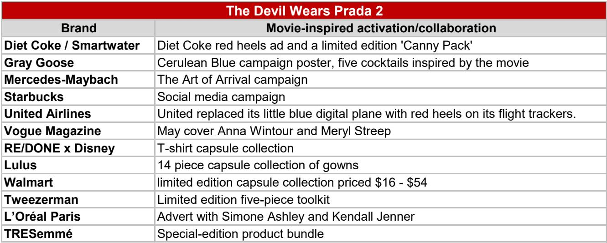
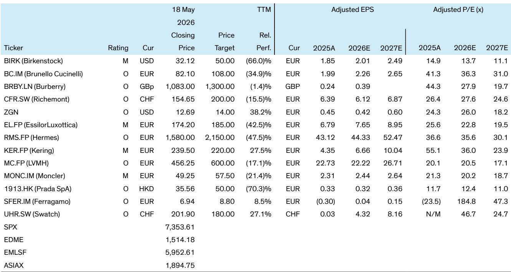

# 奢侈品的增长逻辑已变：谁能在“故事-社交-购买”的循环中占据第一秒

奢侈品行业正在经历一场底层逻辑的重构。过去，一个时尚趋势从秀场到消费者衣橱，需要六到十二个月。今天，一部剧集上线、一条社交媒体帖子、一个明星的公开亮相，可以在几天甚至几小时内完成从“种草”到“下单”的闭环。

某外资投行最新发布的全球奢侈品行业深度报告，提出了一个核心判断：传统“编辑-秀场-零售”的线性周期，已经被压缩为“故事-社交-购买”的加速循环。这意味着，奢侈品牌的核心竞争力不再是设计本身，而是能否在文化瞬间爆发时，成为那个被搜索、被讨论、被购买的名字。

这不是一个关于“营销创新”的讨论。这是一个关于行业价值分配方式正在被重塑的判断。那些能够持续将文化热度转化为可测量收入的品牌，将在未来五年显著拉开与竞争对手的差距。

## 1. 趋势的诞生方式变了：从秀场预言到影视剧的“美学提案”

过去，下一季的流行色、廓形和面料，由时装周上的少数编辑和买手决定。消费者在六个月后才能在门店看到成品。这个过程是自上而下的，品牌掌握着话语权。

现在，趋势的源头正在转移。一部影视剧可以在一周内，为消费者提供一个完整的、可感知的视觉叙事。报告特别指出，这种“美学提案”不是通过单品呈现的，而是通过角色、场景、情绪共同构建的身份认同。

以近期热播的《爱情故事》为例，该剧精准复刻了1990年代极简主义与常春藤风格。剧中主角的造型——从玳瑁发箍到Kangol贝雷帽——迅速成为社交媒体的热门搜索词。报告数据显示，剧中主角的造型直接推动了Calvin Klein的Lyst搜索量上升43%，网站流量环比增长41%。更值得关注的是，这一热度直接反映在了母公司PVH的股价上：财报发布后股价上涨9.75%，CEO在电话会上明确表示，“现在谈论Calvin Klein，不可能不提到《爱情故事》。”

另一部引发关注的影视剧是《呼啸山庄》。Margot Robbie的“方法式穿搭”在宣传期就将哥特浪漫风推向了前台。Vivienne Westwood的束腰裙在Lyst上的季度需求环比飙升88%。报告还展示了一个更细致的观察：Google Trends数据显示，与该剧相关的“哥特风格”“复古装扮”“泡泡袖”等搜索词在剧集上线后迅速冲高，尽管热度在两个月后有所回落，但“复古装扮”的搜索峰值持续了更长时间。

这意味着什么？趋势的诞生已经从一个“行业事件”变成了“文化事件”。品牌不再需要等待时装周来定义自己，而是需要有能力识别并快速响应正在发生的文化叙事。

## 2. 品牌响应速度决定收益：一周内的行动窗口是新的竞争壁垒

报告揭示了第二个关键变化：品牌对文化瞬间的响应速度，直接决定了它能从中获取多少商业价值。

在《爱情故事》上线不到一周内，Polo Ralph Lauren就在社交媒体上发布了明显受剧中主角造型启发的广告。一周后，优衣库也推出了自己的诠释。星巴克也加入了这场文化消费——在Instagram上发布了一条与剧中角色相关的幽默帖子。

这种快速响应不是偶然的。报告指出，品牌正在利用数据驱动的商品策略和实时搜索行为来指导决策。当消费者在社交媒体上讨论某个造型时，品牌需要立刻判断：这是否是一个可以商品化的趋势？应该由哪个品类承接？定价和库存应如何调整？

Calvin Klein的案例尤其值得关注。尽管品牌并未正式参与《爱情故事》的植入，但剧中主角本身就是该品牌的忠实用户。这种“被动卷入”的文化关联，反而产生了超出预期的商业效果。报告的数据显示，与剧中相关的“黑色高领针织衫”搜索量增长217%，“Calvin Klein”品牌搜索量增长43%，而“Kangol贝雷帽”则进入了Lyst 2026年第一季度最热门单品前十。

但并非所有品牌都抓住了这一波红利。报告提到，Prada和Dior在《穿普拉达的女魔头2》上映时保持了相对克制的距离，尽管Google搜索曾出现短暂上升，但它们并未全力投入这一文化现象。这背后可能是品牌战略的选择——比如担心过度商业化会稀释核心定位——但报告暗示，这种克制可能正在让品牌错失重要的增长机会。

这里有一个尚未被完全回答的问题：品牌如何在“不显得刻意”和“快速响应”之间找到平衡？这需要比过去更精细的运营能力，以及更清晰的品牌定位判断。

## 3. 从“灵感”到“购买”的摩擦正在消失，但品牌面临“海盗悖论”

报告提出的第三个结构性变化，是消费路径的极速缩短。消费者可以从看到屏幕上的一个造型，到在电商平台上找到“平替版”，只需几次点击。

算法在加速这一过程。社交媒体平台会奖励重复性和可识别性——当早期采用者和KOL将影视造型转化为日常穿搭的“get the look”内容时，这种模仿本身会进一步放大趋势。报告引用了H&M与《呼啸山庄》合作的11件胶囊系列作为案例：一个快时尚品牌在文化热度最高点推出联名系列，既能捕获流量，也能延长趋势的生命周期。

但这里存在一个悖论：当趋势被快速商品化后，最先引领它的早期采用者往往已经转向下一个微趋势。报告称之为“海盗悖论”——模仿者来得越快，原创者的窗口期就越短。对于奢侈品牌而言，这意味着它们必须在趋势的生命周期中找准自己的位置：是作为趋势的发起者，还是作为趋势的受益者？

对于高端品牌来说，过早或过深地卷入快速消费的循环，可能会损害其稀缺性和定价权。但完全置身事外，又可能被边缘化。报告没有给出标准答案，但暗示了这一问题的复杂性：品牌需要在“文化相关性”和“品牌排他性”之间找到动态平衡。

## 4. 目前这仍是一个美国现象，亚洲市场的传导路径尚未完全打开

报告在多个地方指出，当前这种“故事-社交-购买”的加速循环，在很大程度上是一个以美国为中心的现象，对欧洲等其他西方市场有一定溢出效应，但在亚洲市场的渗透仍然有限。

这是一个值得警惕的观察。中国和日本等亚洲市场长期以来是奢侈品行业增长的重要引擎，但消费者行为模式、社交媒体生态和内容消费习惯与西方存在显著差异。例如，在中国市场，抖音和小红书的算法逻辑与Instagram和TikTok有所不同，影视剧对消费的拉动路径也可能更为复杂。

报告没有深入分析亚洲市场为何尚未完全接纳这一模式。是内容供给的问题？是消费者成熟度的差异？还是品牌在亚洲市场的运营策略尚未调整到位？这些未解问题，恰恰是决策者在制定区域战略时需要重点关注的方向。

## 5. 尚未完全回答的关键问题：可持续的收入转化能否实现？

报告最核心的开放性问题，也是所有品牌管理者最关心的：这些文化热度带来的销售脉冲，能否被转化为可持续的收入增长？

Calvin Klein的案例提供了部分答案。PVH的CEO在电话会上透露，公司正在通过“90年代风格的产品组合和营销重点”来延续热度，并观察到高于平均水平的社交参与度和点击率。但这种策略能否长期有效？当《爱情故事》的热度消退后，Calvin Klein能否保持消费者的兴趣？还是会回到此前的增长轨道？

报告还提到，某些品牌通过“授权合作伙伴”来延续趋势——比如快时尚品牌推出联名系列。但这对于高端奢侈品牌而言，可能不是一个合适的选项。授权合作可能带来短期流量，但也可能稀释品牌形象，尤其是在核心客户群体中。

另一个尚未被充分讨论的问题是：这种文化驱动的消费模式，是否会导致品牌过度依赖“外部事件”？如果一部剧集没有达到预期热度，或者消费者对某种美学的追捧迅速消退，品牌是否具备足够的韧性来对冲这种波动？

这些问题的答案，可能决定了哪些品牌能够在新周期中胜出，哪些品牌会沦为“一次性趋势”的受害者。

## 6. 决策者需要建立的观察框架：三个维度判断品牌是否具备“文化捕获”能力

基于报告的分析，我们可以提炼出一个评估品牌未来竞争力的观察框架，供决策者参考。

第一，品牌是否具备“文化雷达”？即是否有专门的团队或机制，实时监测影视、社交媒体、音乐、体育等领域的文化信号，并快速判断哪些信号与品牌定位相关。这不是一个传统的市场调研职能，而是一个需要跨文化理解、数据分析和直觉判断的复合能力。

第二，品牌是否拥有“快速响应”的运营体系？从识别趋势到推出产品，中间的供应链、商品企划、营销执行需要高度协同。一周的窗口期意味着传统六个月的设计-生产周期已经失效。报告中没有提及，但可以合理推断，那些具备柔性供应链和快速决策机制的品牌，将在这一轮竞争中占据优势。

第三，品牌能否在“参与”和“克制”之间做出明智选择？并非所有文化瞬间都值得追逐。当一个趋势与品牌的核心价值相冲突，或者当参与的门槛过高（比如需要大规模折扣或授权）时，选择不参与可能比错误参与更明智。这需要品牌对自己的定位有极其清晰的认知，而不是盲目追热点。

这三个维度，将帮助我们识别出那些真正具备“文化资本”的品牌——它们不仅能捕捉趋势，还能在趋势中强化自己的品牌资产，而不是被趋势消耗。

---

报告还提供了丰富的图表数据，包括Google Trends的搜索热度变化、Lyst的搜索量排名、品牌网站流量变化等，这些原始数据对于理解趋势的爆发速度和衰减曲线非常有价值。但由于篇幅限制，本文仅提取了最核心的逻辑框架。

关于亚洲市场为何尚未完全融入这一新模式、品牌如何平衡短期热度和长期品牌价值、以及哪些公司更可能在新的竞争格局中胜出，报告中还有更深层的分析——包括对主要奢侈品公司的评级和目标价调整。这些内容，欢迎来我们的知识星球微信群继续讨论。我们会在群内分享完整报告的解读、关键图表的中文注释，以及针对具体公司的投资框架讨论。

Personal reading notes and learning share only. Not investment advice.

