# Global Luxury Goods

# Global Luxury Goods: 10 Key Takeaways from Our Trip to China

  
Luca Solca

+41 582 723 126

luca.solca@bernsteinsg.com

  
Maria Meita

+44 20 7170 0540

maria.meita@bernsteinsg.com

Eric Chen, CFA

+852 2123 2628

eric.chen@bernsteinsg.com

Yi-Peng Khoo, CFA

+44 20 7676 6822

yi-peng.khoo@bernsteinsg.com

# Specialist Sales

Alix Turner

+44 20 7762 4044

alix.turner@bernsteinsg.com

We have been on the road with a group of investors in Hong Kong and Shanghai to meet with public and private companies, retailers, industry insiders, to get the temperature of the luxury and fashion market in China. (See our last year's takeaways: Global Luxury Goods — From the Road in China).

1. Chinese luxury demand is stabilising from a weak base and remains highly polarised, with very strong top-end spending and still-fragile middle-class demand.

The high end continues to spend on luxury goods, travel and hospitality, but this is not translating into a broad-based rebound, as middle-income consumers remain cautious, more selective and less willing to stretch for big-ticket, logo-heavy purchases.

2. Hong Kong is a bright spot, supported by local consumers and the return of tourists. A firmer residential property market and rising transaction volumes are feeding into a “feelgood” factor, which, combined with 11 months of retail sales growth and improving hotel metrics, is underpinning better discretionary spending and luxury demand.

3. Mainland tier 1 cities show early but uneven improvement, helped by signs of property stabilisation. Transaction volumes are up in Tier 1 cities and there is some price recovery, but meaningful price appreciation is concentrated in the very top, prime locations, leaving many mainstream areas and mall projects still under pressure.

4. Oversupply of malls and stores continues to weigh on the market, keeping pressure on weaker locations and formats. Luxury retail consolidation is firmly on the agenda, with brands closing underperforming doors, shrinking footprints and concentrating on a smaller number of highly productive, flagship-type locations in the best tier 1 malls (see Global Luxury Goods: Retail Network dynamics in China).

5. Brand polarisation has intensified: Hermès, Louis Vuitton, Chanel, Van Cleef & Arpels and top Swiss watch maisons remain very strong, while many tier 2 and tier 3 brands struggle to maintain relevance and productivity. In practice, this means the strongest houses are still able to expand space, hold price and invest in experiences, while weaker names increasingly reducing their retail network and likely consumer mindshare too.

6. “China for China” is now central to strategy, with global brands localising assortments, storytelling and clienteling rather than simply importing global playbooks. Examples range from tailoring product and pricing to Mainland consumers, to building WeChat-centric CRM, local KOL partnerships and lifestyle ecosystems (cafés, museums, club-like spaces) designed specifically around Chinese client expectations.

7. Local brands have become serious competitors in beauty, RTW and jewellery, especially at entry price points. Songmont and Grotto in leather goods, Laopu in jewellery, and domestic beauty brands such as Mao Geping and others are winning share by combining credible product with strong cultural storytelling, digital engagement and sharper value-for-money than many international aspirational brands (see Richemont and the Chinese jewellery market).

Continued on the next page...

... continued from the first page

8. In the context of subdued middle-class demand, global brands are leaning heavily on creative activations and experiential formats to defend pricing power and share of mind. High-impact examples include The Louis in Shanghai, craftsmanship events (e.g., Hermes), and branded pop-ups that turn stores and malls into destinations rather than simple points of sale (see Global Luxury Goods: The Battle for Attention).

9. Pressured middle-class consumers are clearly value-conscious, trading down within brands or into outlets and local brands. Years of price increases have made shoppers far more price aware; instead of absorbing further hikes, many choose entry SKUs, factory outlets, second-hand platforms or well-positioned Chinese brands that offer better perceived value at lower absolute tickets (see Global Luxury Goods: Chinese demand dynamics).

10. For listed names, the field trip supports a more constructive stance on the strongest global houses but reinforces caution elsewhere. Louis Vuitton, Dior and Richemont's key maisons look well placed to navigate a selective recovery, while Kering and more middle-class dependent or tier-2 brands still lack clear evidence of sustainable turnaround, leaving their recovery very much in question (see Global Luxury Goods: Preparing for consumer polarisation).

BERNSTEIN TICKER TABLE 

<table><tr><td rowspan="2">Ticker</td><td rowspan="2">Rating</td><td rowspan="2">Cur</td><td rowspan="2">18 May2026ClosingPrice</td><td rowspan="2">PriceTarget</td><td rowspan="2">TTMRel.Perf.</td><td colspan="4">Adjusted EPS</td><td colspan="3">Adjusted P/E (x)</td></tr><tr><td>Cur</td><td>2025A</td><td>2026E</td><td>2027E</td><td>2025A</td><td>2026E</td><td>2027E</td></tr><tr><td>BIRK (Birkenstock)</td><td>M</td><td>USD</td><td>32.12</td><td>50.00</td><td>(66.0)%</td><td>EUR</td><td>1.85</td><td>2.01</td><td>2.49</td><td>14.9</td><td>13.7</td><td>11.1</td></tr><tr><td>BC.IM (Brunello Cucinelli)</td><td>O</td><td>EUR</td><td>82.10</td><td>108.00</td><td>(34.9)%</td><td>EUR</td><td>1.99</td><td>2.26</td><td>2.65</td><td>41.3</td><td>36.3</td><td>31.0</td></tr><tr><td>BRBY.LN (Burberry)</td><td>O</td><td>GBp</td><td>1,083.00</td><td>1,300.00</td><td>(1.4)%</td><td>GBP</td><td>0.24</td><td>0.39</td><td>0.55</td><td>44.3</td><td>27.9</td><td>19.7</td></tr><tr><td>CFR.SW (Richemont)</td><td>O</td><td>CHF</td><td>154.65</td><td>200.00</td><td>(15.5)%</td><td>EUR</td><td>6.39</td><td>6.12</td><td>6.87</td><td>26.4</td><td>27.6</td><td>24.6</td></tr><tr><td>ZGN</td><td>O</td><td>USD</td><td>12.69</td><td>14.00</td><td>38.2%</td><td>EUR</td><td>0.45</td><td>0.42</td><td>0.60</td><td>24.3</td><td>26.0</td><td>18.2</td></tr><tr><td>EL.FP (EssilorLuxottica)</td><td>M</td><td>EUR</td><td>174.20</td><td>185.00</td><td>(42.5)%</td><td>EUR</td><td>6.79</td><td>7.65</td><td>8.95</td><td>25.6</td><td>22.8</td><td>19.5</td></tr><tr><td>RMS.FP (Hermes)</td><td>O</td><td>EUR</td><td>1,580.00</td><td>2,150.00</td><td>(47.5)%</td><td>EUR</td><td>43.12</td><td>44.33</td><td>52.47</td><td>36.6</td><td>35.6</td><td>30.1</td></tr><tr><td>KER.FP (Kering)</td><td>M</td><td>EUR</td><td>239.50</td><td>220.00</td><td>27.5%</td><td>EUR</td><td>4.35</td><td>6.66</td><td>10.04</td><td>55.1</td><td>36.0</td><td>23.9</td></tr><tr><td>MC.FP (LVMH)</td><td>O</td><td>EUR</td><td>456.25</td><td>600.00</td><td>(17.1)%</td><td>EUR</td><td>22.73</td><td>22.22</td><td>26.71</td><td>20.1</td><td>20.5</td><td>17.1</td></tr><tr><td>MONC.IM (Moncler)</td><td>M</td><td>EUR</td><td>49.25</td><td>57.50</td><td>(21.4)%</td><td>EUR</td><td>2.31</td><td>2.44</td><td>2.64</td><td>21.3</td><td>20.2</td><td>18.7</td></tr><tr><td>1913.HK (Prada SpA)</td><td>O</td><td>HKD</td><td>35.56</td><td>50.00</td><td>(70.3)%</td><td>EUR</td><td>0.33</td><td>0.32</td><td>0.36</td><td>11.7</td><td>12.4</td><td>11.0</td></tr><tr><td>SFER.IM (Ferragamo)</td><td>O</td><td>EUR</td><td>6.94</td><td>8.80</td><td>8.5%</td><td>EUR</td><td>(0.30)</td><td>0.04</td><td>0.15</td><td>(23.5)</td><td>184.8</td><td>47.3</td></tr><tr><td>UHR.SW (Swatch)</td><td>O</td><td>CHF</td><td>201.90</td><td>180.00</td><td>27.1%</td><td>CHF</td><td>0.03</td><td>4.32</td><td>8.16</td><td>N/M</td><td>46.7</td><td>24.7</td></tr><tr><td>SPX</td><td></td><td></td><td>7,353.61</td><td></td><td></td><td></td><td></td><td></td><td></td><td></td><td></td><td></td></tr><tr><td>EDME</td><td></td><td></td><td>1,514.18</td><td></td><td></td><td></td><td></td><td></td><td></td><td></td><td></td><td></td></tr><tr><td>EMLSF</td><td></td><td></td><td>5,952.61</td><td></td><td></td><td></td><td></td><td></td><td></td><td></td><td></td><td></td></tr><tr><td>ASIAX</td><td></td><td></td><td>1,894.75</td><td></td><td></td><td></td><td></td><td></td><td></td><td></td><td></td><td></td></tr></table>

O - Outperform, M - Market-Perform, U - Underperform, NR - Not Rated, CS - Coverage Suspended   
BRBY.LN base year is 2026;   
Source: Bloomberg, Bernstein estimates and analysis.

# INVESTMENT IMPLICATIONS

The trajectory of a recovery in global luxury demand remains uncertain. We find two sources of volatility at play: a) underlying demand gyrations, as consumers navigate a fragile macro-economic environment and a tenser and tenser geopolitical environment; and b) short-term investors playing the sector long and short, amplifying upswings and downswings beyond natural news flow. In this context of heightened uncertainty, we would take a more defensive posture with a core exposure to plain vanilla:

1) We would prefer high-quality names “at fair value”... Richemont is our top preference due to strong jewellery momentum and leadership, with Brunello Cucinelli also favored for their quality and potential mean reversion. It is difficult to be positive on Hermès in the short-term, but one weak quarter can be forgiven by the market, if they return to high single digit growth (Hermès: Valuations already discount a 'Ferrari reset').

2) ...as well as the self-help stories with more promising trajectories. LVMH sits between high quality and self-help. Lingering concerns around the W&S turnaround and the Arnault family's ‘Darwinian’ succession process are counter-balanced by Dior's revival, cost efficiencies, and Louis Vuitton's strength; Turnaround at Burberry is well on track. One-year anniversary of the Burberry Forward strategy has paid off, in the form of improved brand momentum and stronger full-price sell-through. With a solid foundation in place, the next leg of the turnaround will see focus shifting to driving store productivity, by capitalizing on the extended momentum in other categories from the core outerwear & scarf; Ferragamo is at the earlier stage of and trading at the lower end of the trading range. Recent conversation with management suggests a possible turnaround in the making, as a team of “old hands” are tackling key issues around the brand, assortment and retail store network.

# DETAILS

1. Chinese luxury demand is stabilising from a weak base and remains highly polarised, with very strong top-end spending and still-fragile middle-class demand. The high end continues to spend on luxury goods, travel and hospitality, but this is not translating into a broad-based rebound, as middle-income consumers remain cautious, more selective and less willing to stretch for big-ticket, logo-heavy purchases.

EXHIBIT 1: Resilient demand at the higher end continues to support RevPAR outperformance within the luxury hotel segment. The middle tiers are likely most squeezed - on both a 2yr and 3yr basis, this group has even underperformed the economy segment, likely reflecting tighter consumer travel budgets and a corresponding shift in spending behavior

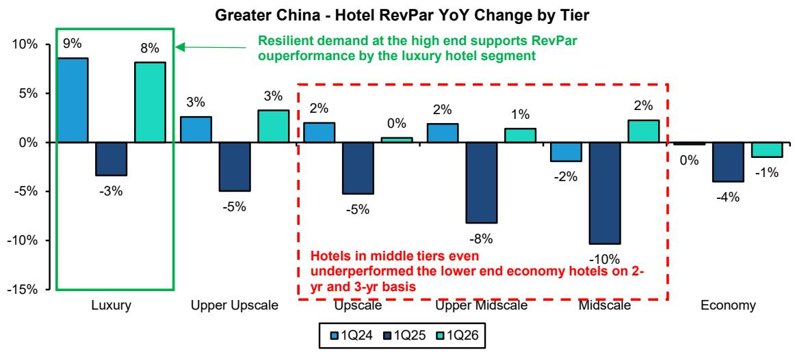

bar

Greater China - Hotel RevPar YoY Change by Tier
| Hotel Segment | 1Q24 (%) | 1Q25 (%) | 1Q26 (%) |
|---|---|---|---|
| Luxury | 9 | -3 | 8 |
| Upper Upscale | 3 | -5 | 3 |
| Upscale | 2 | -5 | 0 |
| Upper Midscale | 2 | -8 | 1 |
| Midscale | -2 | -10 | 2 |
| Economy | 0 | -4 | -1 |
Resilient demand at the high end supports RevPar outperformance by the luxury hotel segment
Hotels in middle tiers even underperformed the lower end economy hotels on 2-yr and 3-yr basis

Source: STR, Bernstein analysis

2. Hong Kong is a bright spot, supported by local consumers and the return of tourists. A firmer residential property market and rising transaction volumes are feeding into a “feelgood” factor, which, combined with 11 months of retail sales growth and improving hotel metrics, is underpinning better discretionary spending and luxury demand.

EXHIBIT 2: The recovery in property prices, which began in Sep-25, has accelerated since Jan-26, with week-on-week price growth averaging approximately +0.4%

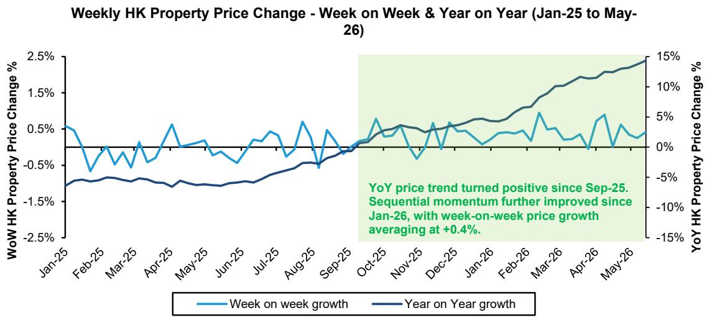

line

| Month    | Week on week growth | Year on Year growth |
| -------- | ------------------- | ------------------- |
| Jan-25   | 0.5%                | -1.0%               |
| Feb-25   | -0.5%               | -1.0%               |
| Mar-25   | -0.5%               | -1.0%               |
| Apr-25   | 0.5%                | -1.0%               |
| May-25   | 0.0%                | -1.0%               |
| Jun-25   | -0.5%               | -1.0%               |
| Jul-25   | 0.0%                | -0.5%               |
| Aug-25   | 0.5%                | -0.5%               |
| Sep-25   | 0.0%                | 0.0%                |
| Oct-25   | 0.5%                | 0.0%                |
| Nov-25   | -0.5%               | 0.0%                |
| Dec-25   | 0.5%                | 0.0%                |
| Jan-26   | 0.0%                | 0.0%                |
| Feb-26   | 0.5%                | 0.0%                |
| Mar-26   | 1.0%                | 0.0%                |
| Apr-26   | 0.5%                | 0.0%                |
| May-26   | 0.5%                | 15.0%               |

We take the average of weekly price indices for Hong Kong Island, Kowloon and New Territories as a proxy for the HK region  
Source: Midland Realty, Bernstein analysis

EXHIBIT 3: Improved consumer sentiment/ feel-good, driven by rising property and equity markets in Hong Kong, has translated into a buoyant retail environment, with particularly strong momentum in the watches and jewellery category   
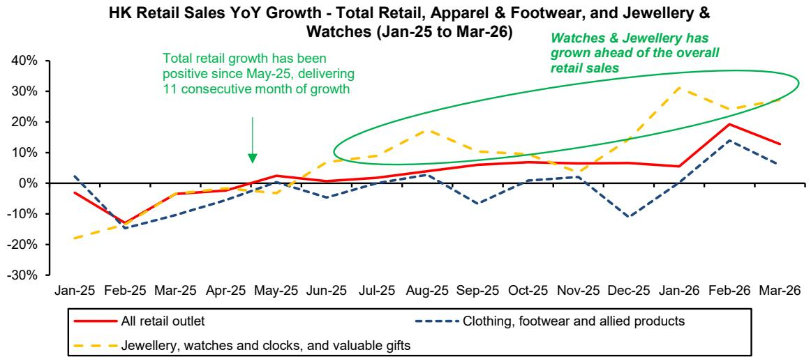

line

| Month    | All retail outlet | Clothing, footwear and allied products | Jewellery, watches and clocks, and valuable gifts |
|----------|-------------------|----------------------------------------|----------------------------------------------------|
| Jan-25   | -5%               | 0%                                     | -18%                                               |
| Feb-25   | -15%              | -10%                                   | -15%                                               |
| Mar-25   | -5%               | -5%                                    | -5%                                                |
| Apr-25   | 0%                | 0%                                     | 0%                                                 |
| May-25   | 5%                | 0%                                     | 5%                                                 |
| Jun-25   | 0%                | 0%                                     | 10%                                                |
| Jul-25   | 5%                | 0%                                     | 15%                                                |
| Aug-25   | 10%               | 0%                                     | 20%                                                |
| Sep-25   | 10%               | 0%                                     | 10%                                                |
| Oct-25   | 10%               | 0%                                     | 5%                                                 |
| Nov-25   | 10%               | 0%                                     | 0%                                                 |
| Dec-25   | 10%               | -10%                                   | 10%                                                |
| Jan-26   | 10%               | 0%                                     | 30%                                                |
| Feb-26   | 20%               | 10%                                    | 25%                                                |
| Mar-26   | 15%               | 5%                                     | 25%                                                |

Source: HK Census and Statistics Department, Bernstein analysis

EXHIBIT 4: YoY RevPar growth in luxury hospitality, such as The Peninsula hotels, is well above the more mass market peers   
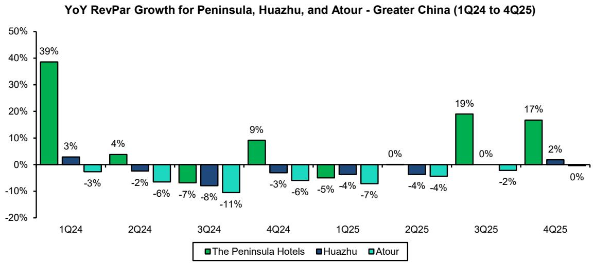

bar

YoY RevPar Growth for Peninsula, Huazhu, and Atour - Greater China (1Q24 to 4Q25)
| Quarter | The Peninsula Hotels (%) | Huazhu (%) | Atour (%) |
| :--- | :--- | :--- | :--- |
| 1Q24 | 39 | 3 | -3 |
| 2Q24 | 4 | -2 | -6 |
| 3Q24 | -7 | -8 | -11 |
| 4Q24 | 9 | -3 | -6 |
| 1Q25 | -5 | -4 | -7 |
| 2Q25 | 0 | -4 | -4 |
| 3Q25 | 19 | 0 | -2 |
| 4Q25 | 17 | 2 | 0 |

All not covered   
Source: Company reports, Bernstein analysis

3. Mainland tier 1 cities show early but uneven improvement, helped by signs of property stabilisation. Transaction volumes are up in Tier 1 cities and there is some price recovery, but meaningful price appreciation is concentrated in the very top, prime locations, leaving many mainstream areas and mall projects still under pressure.

EXHIBIT 5: Second-hand property prices recovery, a key driver of the consumer wealth effect in China, has been uneven and has only recently turned positive in Tier 1 cities   
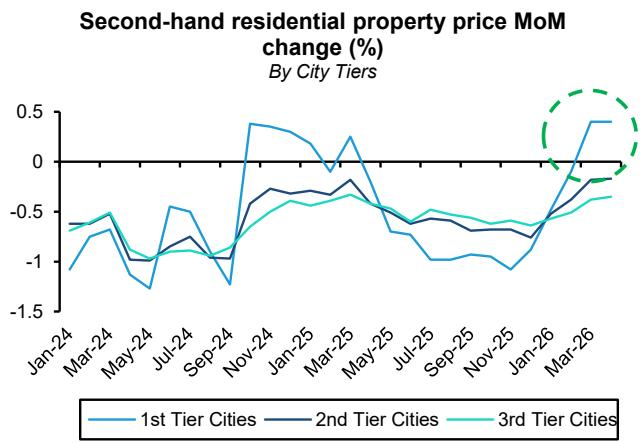

line

| Month    | 1st Tier Cities | 2nd Tier Cities | 3rd Tier Cities |
| -------- | --------------- | --------------- | --------------- |
| Jan-24   | -1.0            | -0.7            | -0.6            |
| Mar-24   | -0.8            | -0.6            | -0.5            |
| May-24   | -1.2            | -0.9            | -0.8            |
| Jul-24   | -0.5            | -0.7            | -0.6            |
| Sep-24   | -1.3            | -0.9            | -0.8            |
| Nov-24   | 0.4             | -0.5            | -0.6            |
| Jan-25   | 0.3             | -0.4            | -0.5            |
| Mar-25   | 0.2             | -0.3            | -0.4            |
| May-25   | -0.6            | -0.5            | -0.6            |
| Jul-25   | -0.9            | -0.7            | -0.8            |
| Sep-25   | -0.8            | -0.6            | -0.7            |
| Nov-25   | -1.0            | -0.7            | -0.6            |
| Jan-26   | -1.1            | -0.6            | -0.5            |
| Mar-26   | 0.4             | -0.3            | -0.2            |

April-26 is the last data point   
Source: NBS, Bernstein analysis

EXHIBIT 6: Even within Tier 1 cities, the recovery has been uneven, with Shanghai showing relatively stronger momentum, while Guangzhou has lagged behind   
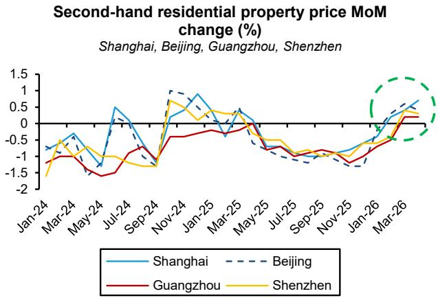

line

| Month   | Shanghai | Beijing | Guangzhou | Shenzhen |
|---------|----------|---------|-----------|----------|
| Jan-24  | -0.5     | -0.8    | -1.0      | -1.2     |
| Mar-24  | -0.3     | -0.6    | -1.1      | -1.0     |
| May-24  | -0.7     | -0.9    | -1.3      | -1.1     |
| Jul-24  | 0.5      | 0.2     | -1.4      | -1.3     |
| Sep-24  | -0.8     | -0.6    | -1.5      | -1.4     |
| Nov-24  | 0.8      | 1.0     | -0.5      | 0.7      |
| Jan-25  | 0.6      | 0.4     | -0.3      | 0.5      |
| Mar-25  | 0.3      | 0.1     | -0.2      | 0.2      |
| May-25  | -0.2     | -0.4    | -0.5      | -0.3     |
| Jul-25  | -0.6     | -0.8    | -0.9      | -0.7     |
| Sep-25  | -0.8     | -1.0    | -1.1      | -0.9     |
| Nov-25  | -0.9     | -1.1    | -1.2      | -1.0     |
| Jan-26  | -0.5     | -0.7    | -0.8      | -0.6     |
| Mar-26  | 0.7      | 0.9     | 0.6       | 0.8      |

April-26 is the last data point   
Source: NBS, Bernstein analysis

4. Oversupply of malls and stores continues to weigh on the market, keeping pressure on weaker locations and formats. Luxury retail consolidation is firmly on the agenda, with brands closing underperforming doors, shrinking footprints and concentrating on a smaller number of highly productive, flagship-type locations in the best tier 1 malls (see Global Luxury Goods: Retail Network dynamics in China).

EXHIBIT 7: Non-prime location shopping mall retail space now represents 88% share, after having grown aat +6.2% CAGR 2019 to 2026 vs. +0.9% CARG retail space growth in prime locations   
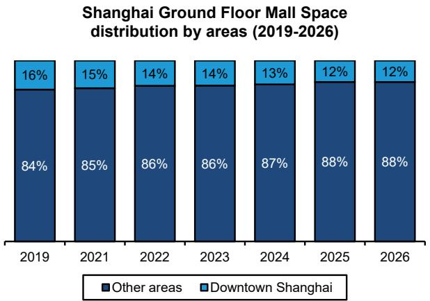

bar_stacked

Shanghai Ground Floor Mall Space distribution by areas (2019-2026)
| Year | Downtown Shanghai (%) | Other areas (%) |
| :--- | :--- | :--- |
| 2019 | 16 | 84 |
| 2021 | 15 | 85 |
| 2022 | 14 | 86 |
| 2023 | 14 | 86 |
| 2024 | 13 | 87 |
| 2025 | 12 | 88 |
| 2026 | 12 | 88 |

Prime space usually refers to the ground floor of shopping malls.   
Downtown areas include retail space on Nanjing East Road, Nanjing West Road,   
Huaihai Middle Road, Xujiahui, Lujiazui   
Source: Cushman & Wakefield, Bernstein analysis

EXHIBIT 8: Vacancy rates have been notably lower in prime locations, reflecting a clear trend of brands consolidating into higher-quality assets, while the bulk of excess supply remains concentrated in non-prime areas   
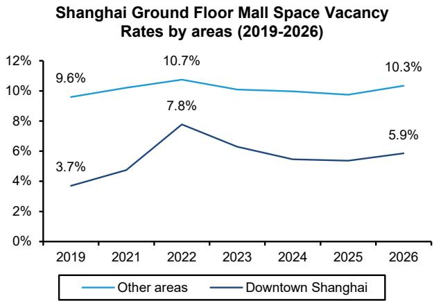

line

| Year | Other areas | Downtown Shanghai |
|------|-------------|-------------------|
| 2019 | 9.6%        | 3.7%              |
| 2022 | 10.7%       | 7.8%              |
| 2026 | 10.3%       | 5.9%              |

Prime space usually refers to the ground floor of shopping malls.   
Downtown areas include retail space on Nanjing East Road, Nanjing West Road,   
Huaihai Middle Road, Xujiahui, Lujiazui   
Source: Cushman & Wakefield, Bernstein analysis

EXHIBIT 9: Luxury brands are increasingly closing underperforming stores and consolidating into larger, higher-quality locations, as reflected in the recent wave of high-profile flagship openings and new store concepts   
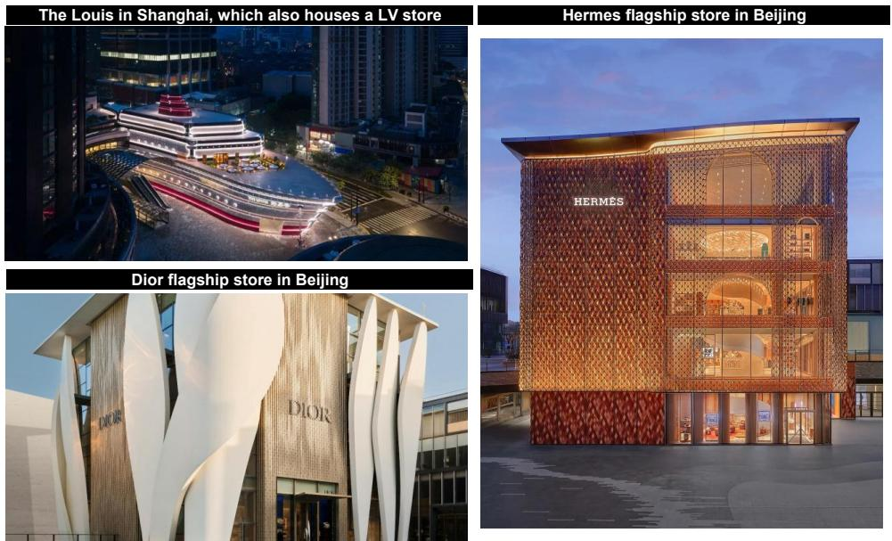

text_image

The Louis in Shanghai, which also houses a LV store
Hermes flagship store in Beijing
Dior flagship store in Beijing
HERMES
DIOR
DIOR

Source: brand.com, Bernstein analysis

5. Brand polarisation has intensified: Hermes, Louis Vuitton, Chanel, Van Cleef & Arpels and top Swiss watch maisons remain very strong, while many tier 2 and tier 3 brands struggle to maintain relevance and productivity. In practice, this means the strongest houses are still able to expand space, hold price and invest in experiences, while weaker names increasingly reducing their retail network and likely consumer mindshare too.

EXHIBIT 10: Luxury goods brands have taken divergent pricing strategies to deal with the post-Covid19 normalization of growth, as a function of their brand equity, momentum and exposure to aspirational customers   
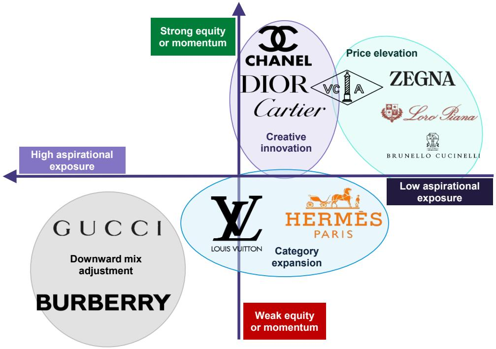

text_image

Strong equity
or momentum
CHANEL
DIOR
Cartier
Creative
innovation
VC A
Price elevation
ZEGNA
Loro Pana
BRUNELLO CUCINELLI
High aspirational
exposure
Low aspirational
exposure
GUCCI
Downward mix
adjustment
BURBERRY
Y
LOUIS VUITTON
HERMÈS
PARIS
Category
expansion
Weak equity
or momentum

Source: Company website, Bernstein estimates and analysis

6. “China for China” is now central to strategy, with global brands localising assortments, storytelling and clienteling rather than simply importing global playbooks. Examples range from tailoring product and pricing to Mainland consumers, to building WeChat-centric CRM, local KOL partnerships and lifestyle ecosystems (cafés, museums, club-like spaces) designed specifically around Chinese client expectations.

EXHIBIT 11: The Louis is a case in point: the concept was initiated by the local China team rather than top-down from the group. Importantly, it shows how brands can deliver an engaging, highly shareable, and experiential touchpoint - even at lower price points - that strengthens brand connection and social media visibility

Examples of cake and coffee served in the Café on top of The Louis   
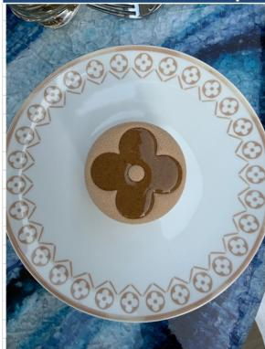

natural_image

Top-down view of a decorative plate with floral border and central floral motif (no text or symbols)

natural_image

White plate with a brown and white geometric pattern resembling a stylized animal or robot, placed on a blue textured surface (no text or symbols)

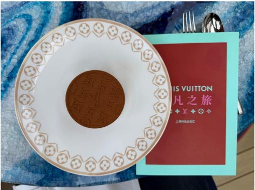

text_image

VIS VUITON
凡之旅
上海好品店舗

Source: Bernstein photos

EXHIBIT 12: Adidas' Zhangyuan store in Shanghai is another strong example of a global brand successfully embracing a “China for China” strategy, spanning localized store concepts, architectural design, and tailored product offerings

Adidas Originals Concept Store in Zhangyuan, Shanghai   
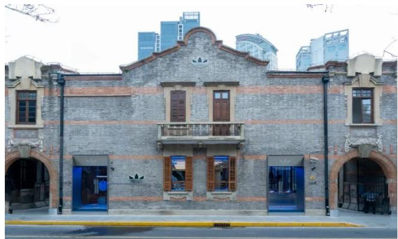

natural_image

Exterior view of a historic brick building with arched entrances and modern skyscrapers in the background (no signage or text visible)

Adidas Originals concept store in Shanghai's historical building Zhangyuan. Design of the store drew inspiration from Zhangyuan's distinctive Shanghai-style heritage, and preserved the original Shikumen building structure.

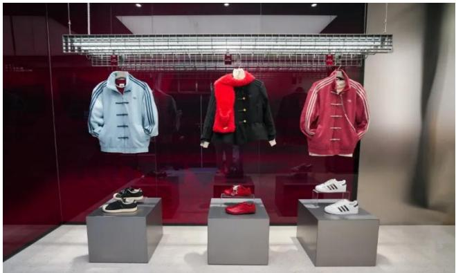

natural_image

Display of three men's sportswear outfits in a retail store, each mounted on a stand with matching shoes and red scarves (no visible text or signage)

The store also offers collections that are tailored to the local consumers - a new Chinese-style collection created by the adidas Shanghai Creative Center. With pieces such as silk jackets with traditional frog buttons and the updated Bubble Skirt 2.0, the collection reinterprets Eastern design elements through a modern fashion lens.

Adidas is covered by Aneesha Sherman

Source: Shanghai Government, Bernstein analysis

7. Local brands have become serious competitors in beauty, RTW and jewellery, especially at entry price points. Songmont and Grotto (both private) in leather goods, Laopu (not covered) in jewellery, and domestic beauty brands such as Mao Geping (not covered) and others are winning share by combining credible product with strong cultural storytelling, digital engagement and sharper value-for-money than many international aspirational brands (see Richemont and the Chinese jewellery market).

EXHIBIT 13: Songmont also operates one of the most successful podcasts in China, covering topics such as culture, tradition, and lived experiences. This approach places greater emphasis on brand building rather than direct product promotion, similar to strategies observed at Loewe, particularly in its social media content management

Song of Mont is a podcast by Songmont. It focuses on sharing and discussing thoughts and experiences on broader aspects of life, rather than any specific product or even the Songmont brand.

山下 Overview 节目概览 声

PODCAST 播客

text_image

山下声
——《山下声》
Songming

INTERVIEW 对谈

「山下声」是 Songmont 山下有松 品牌自创播客节目，邀请写作者、纪录片导演周轶君作为主持人，对话不同领域与山下有松同行的朋友，分享彼此的生活、思考和感受。

「山下声·席地而谈」是「山下声」对话脉络的延续，走向更多元视角的尝试。让我们席地而坐，轻松而谈。

Songmont

Interviewees backgrounds span from writer, actor, singer, to film director and artists, on topics such as "Come on! Let go of things that seem important", "Confused? Young people in every generation are like this"

山下 Season O2 第二季 声

文淇

Vol. 07

陈丹青

Vol. 08

蒋奇明、王一通

Vol. 09

伊莎贝尔·于佩尔

Vol. 10

“看上去一切正常，是一种虚伪”

韦唯

Vol. 11

“上山十年，做回野生的人”

贾樟柯

Vol. 12

“过去有一种东西叫'遥远'”

徐冰

Vol. 13

Source: RED, Bernstein analysis

8. In the context of subdued middle-class demand, global brands are leaning heavily on creative activations and experiential formats to defend pricing power and share of mind. High-impact examples include The Louis in Shanghai, craftsmanship events (e.g., Hermes), and branded pop-ups that turn stores and malls into destinations rather than simple points of sale (see Global Luxury Goods: The Battle for Attention).

EXHIBIT 14: Mega-brands have demonstrated strong innovation in developing new immersive experiences to engage consumers   

text_image

Hermes
Hermes in the Making travelling exhibition that showcases the brand's traditional craftsmanship, and artisanal expertise through live demos and workshops. It's now in Shanghai, after having attracted huge attention in Shenzhen a year ago
Right: Chanel Coco Beach 2026 collection pop-up store, Shanghai - an immersive environment that resembles a resort atmosphere in a holiday villa.
Left: Chanel's No.5 Garden popup, Shanghai - an interactive experience with a real perfume garden, as a tribute to the legendary No.5
Chanel
CHANEL
Louis Vuitton & Loro Piana
LOUIS VUITION HOTEL

Right: Artisan demonstrating the creation of the customisable patches (e.g, the labels) that's available on LV luggages and handbags.   
Middle: Louis Vuitton Hotel exhibition in Shanghai, in celebration of the 10th anniversary of Monogram. The space was transformed into a hotel-inspired setting featuring a lobby, guest room, fitness bar etc, featuring classic monogram pieces.   
Left: "If You Know, You Know. Loro Piana's Quest for Excellence" Exhibition in Shanghai. Loro Piana's first ever exhibition, in celeration of its 100-year anniversary, providing an immersive and sensorial journey through the brand's heritage.   
Source: RED, Bernstein analysis

9. Pressured middle-class consumers are clearly value-conscious, trading down within brands or into outlets and local brands. Years of price increases have made shoppers far more price aware; instead of absorbing further hikes, many choose entry SKUs, factory outlets, second-hand platforms or well-positioned Chinese brands that offer better perceived value at lower absolute tickets (see Global Luxury Goods: Chinese demand dynamics).

EXHIBIT 15: Soft luxury pricing post-Covid-19 accelerated well beyond the typical 5-7% range, and moved well into the double digits

LFL price inflation across selected key products   
France, 2023 vs. 2020 (%)   
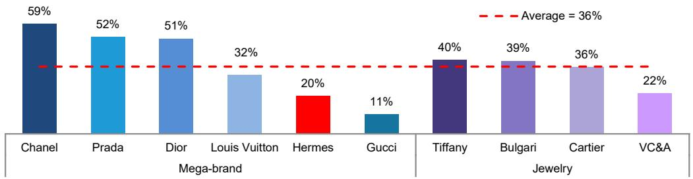

bar

| Brand | Mega-brand (%) | Jewelry (%) |
| :--- | :--- | :--- |
| Chanel | 59 | 40 |
| Prada | 52 | 39 |
| Dior | 51 | 36 |
| Louis Vuitton | 32 | 22 |
| Hermes | 20 |  |
| Gucci | 11 |  |
Average = 36%

Source: Company websites, Bernstein analysis

EXHIBIT 16: Chinese local brands are increasingly securing leading positions during key online shopping festivals, a sharp contrast to the landscape observed just five years ago

<table><tr><td colspan="8">Top-ranked brand by sales over 6.18 &amp; 11.11 Shopping Festivals</td></tr><tr><td>Ranking</td><td>2021 6.18</td><td>2021 11.11</td><td></td><td>2024 6.18</td><td>2024 11.11</td><td>2025 6.18</td><td>2025 11.11</td></tr><tr><td>1</td><td>Michael Kors</td><td>Coach</td><td rowspan="5"></td><td>Coach</td><td>Coach</td><td>Beneunder</td><td>Songmont</td></tr><tr><td>2</td><td>Coach</td><td>Michael Kors</td><td>Songmont</td><td>Songmont</td><td>Songmont</td><td>Coach</td></tr><tr><td>3</td><td>Tory Burch</td><td>MCM</td><td>Beneunder</td><td>MCM</td><td>Coach</td><td>Qiuzhen</td></tr><tr><td>4</td><td>MCM</td><td>Charles Keith</td><td>MCM</td><td>Grotto</td><td>Charles Keith</td><td>Grotto</td></tr><tr><td>5</td><td>Gucci</td><td>Tory Burch</td><td>Grotto</td><td>Tory Burch</td><td>Grotto</td><td>MCM</td></tr><tr><td colspan="8">Chinese local brands</td></tr></table>

Source: Taobao, Bernstein analysis

10. For listed names, the field trip supports a more constructive stance on the strongest global houses but reinforces caution elsewhere. Louis Vuitton, Dior and Richemont's key maisons look well placed to navigate a selective recovery, while Kering and more middle-class dependent or tier-2 brands still lack clear evidence of sustainable turnaround, leaving their recovery very much in question (see Global Luxury Goods: Preparing for consumer polarisation).

EXHIBIT 17: Consensus expectations appear broadly aligned with this view, with weaker organic sales growth anticipated for Kering and Ferragamo in APAC ex-Japan over the next 24 months

Reported and Consensus OSG expectations Segment including China (2025-2027E)   
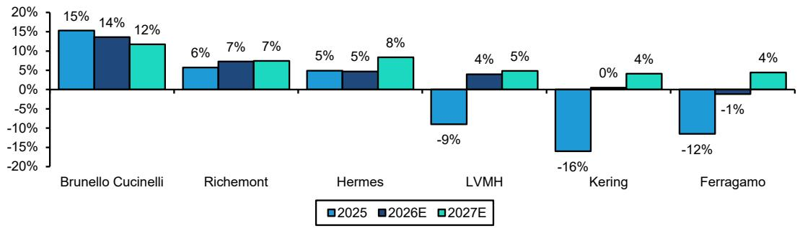

bar

| Company | 2025 (%) | 2026E (%) | 2027E (%) |
| :--- | :--- | :--- | :--- |
| Brunello Cucinelli | 15 | 14 | 12 |
| Richemont | 6 | 7 | 7 |
| Hermes | 5 | 5 | 8 |
| LVMH | -9 | 4 | 5 |
| Kering | -16 | 0 | 4 |
| Ferragamo | -12 | -1 | 4 |

The year refers to calendar year, and corresponds to Richemont's FY26 to FY28E. We consensus where reported figures aren't available. The relevant regional segment is APAC ex. JP for all companies, except Brunello Cucinelli, which is Asia
Source: Company reports, Visible Alpha, Bernstein analysis

# I. REQUIRED DISCLOSURES

References to "Bernstein" or the "Firm" in these disclosures relate to the following entities: Bernstein Institutional Services LLC (April 1, 2024 onwards), Bernstein & Co., LLC (pre April 1, 2024), Bernstein Autonomous LLP, BSG France S.A. (April 1, 2024 onwards), Bernstein (Hong Kong) Limited 盛博香港有限公司, Bernstein (Canada) Limited, Bernstein (India) Private Limited (SEBI registration no. INH000006378), Bernstein (Singapore) Private Limited, Bernstein Japan KK (サンフォード・C・バーンスタイン株式会社) and analysts employed by SG Africa Technologies & Services to produce Bernstein under a Global Services Agreement in place between Bernstein and SG.

Bernstein is part of a joint venture between SG (SG) and AllianceBernstein, L.P. (AB). Unless specifically noted otherwise, for purposes of these disclosures, references to Bernstein's “affiliates” relate to both SG and AB and their respective affiliates.

# VALUATION METHODOLOGY

This research publication covers six or more companies. For valuation methodology and other company disclosures:

Please visit: https://bernstein-autonomous.bluematrix.com/sellside/Disclosures.action.

Or, you can also write to the Director of Compliance, Bernstein Institutional Services LLC, 245 Park Avenue, New York, NY 10167.

# RISKS

This research publication covers six or more companies. For risks and other company disclosures:

Please visit: https://bernstein-autonomous.bluematrix.com/sellside/Disclosures.action.

Or, you can also write to the Director of Compliance, Bernstein Institutional Services LLC, 245 Park Avenue, New York, NY 10167.

# RATINGS DEFINITIONS, BENCHMARKS AND DISTRIBUTION

# EQUITY RATINGS DEFINITIONS

# Bernstein brand

The Bernstein brand rates stocks based on forecasts of relative performance for the next 12 months versus the S&P 500 for stocks listed on the U.S. and Canadian exchanges, versus the Bloomberg Europe Developed Markets Large and Mid Cap Price Return Index EUR (EDME) for stocks listed on the European exchanges and emerging markets exchanges outside of the Asia Pacific region, versus the Bloomberg Japan Large and Mid Cap Price Return Index USD (JPL) for stocks listed on the Japanese exchanges, and versus the Bloomberg Asia ex-Japan Large and Mid Cap Price Return Index (ASIAX) for stocks listed on the Asian (ex-Japan) exchanges -unless otherwise specified.

The Bernstein brand has three categories of ratings:

- Outperform: Stock will outpace the market index by more than 15 pp   
• Market-Perform: Stock will perform in line with the market index to within +/-15 pp   
• Underperform: Stock will trail the performance of the market index by more than 15 pp

Coverage Suspended: Coverage of a company under the Bernstein brand has been suspended. Ratings and price targets are suspended temporarily, are no longer current, and should therefore not be relied upon.

Not Rated: A rating assigned when the stock cannot be accurately valued, or the performance of the company accurately predicted, at the present time. The covering analyst may continue to publish research reports on the company to update investors on events and developments.

Not Covered (NC) denotes companies that are not under coverage.

Bernstein brand stock ratings are based on a 12-month time horizon.

# Autonomous brand – common stocks

The Autonomous brand rates common stocks as indicated below. As our benchmarks we use the Bloomberg Europe 500 Banks And Financial Services Index (BEBANKS) and Bloomberg Europe Dev Mkt Financials Large and Mid Cap Price Ret Index EUR (EDMFI) index for developed European banks and Payments, the Bloomberg Europe 500 Insurance Index (BEINSUR) for European insurers, the S&P 500 and S&P Financials for US banks and Payments coverage, S5LIFE for US Insurance, the S&P Insurance Select Industry (SPSIINS) for US Non-Life Insurers coverage, and the Bloomberg Emerging Markets Financials Large, Mid and Small Cap Price Return Index (EMLSF) for emerging market banks and insurers and Payments. Ratings are stated relative to the sector (not the market).

The Autonomous brand has three categories of common stock ratings:

- Outperform (OP): Stock will outpace the relevant index by more than 10 pp   
- Neutral (N): Stock will perform in line with the market index to within +/-10 pp   
• Underperform (UP): Stock will trail the performance of the relevant index by more than 10 pp

Coverage Suspended: Coverage of a company under the Autonomous research brand has been suspended. Ratings and price targets are suspended temporarily, are no longer current, and should therefore not be relied upon.

Not Rated: A rating assigned when the stock cannot be accurately valued, or the performance of the company accurately predicted, at the present time. The covering analyst may continue to publish research reports on the company to update investors on events and developments.

Those denoted as ‘Feature’ (e.g., Feature Outperform FOP, Feature Under Outperform FUP) are our core ideas.

Not Covered (NC) denotes companies that are not under coverage.

Autonomous brand common stock ratings are based on a 12-month time horizon.

# Autonomous brand – preferred stocks

The Autonomous brand has three categories of preferred stock ratings:

- Outperform (OP): The total return of the preferred instrument is expected to outperform preferred securities of other issuers operating in similar sectors or rating categories over the next six months.   
- Neutral (N): The total return of the preferred instrument is expected to perform in line with preferred securities of other issuers operating in similar sectors or rating categories over the next six months.   
- Underperform (UP): The total return of the preferred instrument is expected to underperform preferred securities of other issuers operating in similar sectors or rating categories over the next six months.

Autonomous preferred stock ratings are based on a 6-month time horizon.

# AUTONOMOUS CREDIT RESEARCH

Where this report contains investment recommendations for credit instruments, as defined in article 3(1)(35) of the Market Abuse Regulation, the information below is presented to comply with its disclosure requirements.

The report may also include reference(s) to published opinions by other Autonomous or Bernstein analysts covering the equity securities of the issuer(s) referenced herein. Please note an investment recommendation for credit instruments published by the author(s) of this report may differ from the published view of the analyst covering equity securities for the issuer(s) contained in this report and vice versa.

# CREDIT RATINGS DEFINITIONS

The Autonomous brand has three categories of credit ratings:

\- Credit Outperform (C-OP): The total return of the Reference Credit Instrument is expected to outperform the credit spread of bonds of other issuers operating in similar sectors or rating categories over the next six months.

- Credit Neutral (C-N): The total return of the Reference Credit Instrument is expected to perform in line with the credit spread of bonds of other issuers operating in similar sectors or rating categories over the next six months.   
- Credit Underperform (C-UP): The total return of the Reference Credit Instrument is expected to underperform the credit spread of bonds of other issuers operating in similar sectors or rating categories over the next six months.

Autonomous credit ratings are based on a 6-month time horizon.

A list of all investment recommendations produced by the author(s) of this report alongside credit ratings history are available upon request.

It is at the sole discretion of the Firm as to when to initiate, update and cease research coverage. The Firm has established, maintains and relies on information barriers to control the flow of information contained in one or more areas (i.e. the private side) within the Firm, and into other areas, units, groups or affiliates (i.e. public side) of the Firm

DISTRIBUTION OF EQUITY RATINGS/INVESTMENT BANKING SERVICES 

<table><tr><td>Equity Rating</td><td>Market Abuse Regulation (MAR) and FINRA Rating Category</td><td>Global Rating Distribution</td><td>Investment Banking Relationships*</td></tr><tr><td>Outperform</td><td>BUY</td><td>51.1%</td><td>16.5%</td></tr><tr><td>Market-Perform (Bernstein Brand) Neutral (Autonomous Brand)</td><td>HOLD</td><td>36.3%</td><td>17.8%</td></tr><tr><td>Underperform</td><td>SELL</td><td>12.6%</td><td>14.9%</td></tr></table>

\* These figures represent the percentage of companies within each equity rating category for which affiliates of Bernstein have provided investment banking services within the previous 12 months.
As of March 31, 2026. All figures are updated quarterly.

# PRICE CHARTS/ RATINGS AND PRICE TARGET HISTORY

This research publication covers six or more companies. For price chart and other company disclosures, please visit https://bernstein-autonomous.bluematrix.com/sellside/Disclosures.action or you can write to the Director of Compliance, Bernstein Institutional Services LLC, 245 Park Avenue, New York, NY 10167.

# CONFLICTS OF INTEREST

SG and/or its affiliates beneficially own 1% or more of a class of common equity securities of the following companies: Burberry Group PLC and Moncler SpA.

AB and/or its affiliates beneficially own 1% or more of a class of common equity securities of the following company: Burberry Group PLC.

Bernstein Autonomous LLP or BSG France SA, beneficially, has either a net long or short position of 0.5% or more of the total issued share capital of a class of common equity securities of the following MiFID eligible securities: Burberry Group PLC.

Bernstein and/or affiliates have received compensation for investment banking services in the past twelve months from Burberry Group PLC, Kering SA and LVMH Moet Hennessy Louis Vuitton SE.

Bernstein has received compensation for non-investment banking securities-related products or services in the previous twelve months from the following clients: Birkenstock Holding Plc and Hermes International.

Bernstein and/or affiliates have received compensation for non-investment banking securities-related products or services in the previous twelve months from the following clients: Burberry Group PLC, Cie Financiere Richemont SA, EssilorLuxottica SA, Kering SA, LVMH Moet Hennessy Louis Vuitton SE and Swatch Group AG/The.

Bernstein and/or affiliates expect to receive or intend to seek compensation for investment banking services in the next three months from EssilorLuxottica SA and Kering SA.

Certain affiliates of Bernstein act as market maker or liquidity provider in the equities securities of: Birkenstock Holding Plc, Brunello Cucinelli, Burberry Group PLC, Cie Financiere Richemont SA, EssilorLuxottica SA, Hermes International, Kering SA, LVMH Moet Hennessy Louis Vuitton SE, Moncler SpA, Salvatore Ferragamo SpA and Swatch Group AG/The.

Bernstein and/or affiliates had an investment banking client relationship during the past twelve months with Burberry Group PLC, EssilorLuxottica SA, Kering SA and LVMH Moet Hennessy Louis Vuitton SE.

Certain affiliates of Bernstein act as market maker or liquidity provider in the debt securities of: Cie Financiere Richemont SA, Kering SA and LVMH Moet Hennessy Louis Vuitton SE.

Affiliates of Bernstein managed or co-managed in the past twelve months a public offering of securities of LVMH Moet Hennessy Louis Vuitton SE.

# OTHER MATTERS

The legal entity(ies) employing the analyst(s) listed in this report, and their location, can be determined by the country code of their phone number, as follows:

+1 Bernstein Institutional Services LLC; New York, New York, USA

+44 Bernstein Autonomous LLP; London UK

+212 SG Africa Technologies & Services; Casablanca, Morocco

+33 BSG France S.A.; Paris, France

+34 BSG France S.A.; Madrid, Spain

+41 Bernstein Autonomous LLP; Geneva, Switzerland

+49 BSG France S.A.; Frankfurt, Germany

+91 Bernstein (India) Private Limited; Mumbai, India

+852 Bernstein (Hong Kong) Limited 盛博香港有限公司; Hong Kong, China

+65 Bernstein (Singapore) Private Limited; Singapore

+81 Bernstein Japan KK; Tokyo, Japan

Where this report has been prepared by research analyst(s) employed by a non-US affiliate, such analyst(s), is/are (unless otherwise expressly noted below) not registered as associated persons of Bernstein Institutional Services LLC or any other SEC-registered broker-dealer and are not licensed or qualified as research analysts with FINRA. Accordingly, such analyst(s) may not be subject to FINRA's restrictions regarding (among other things) communications by research analysts with a subject company, interactions between research analysts and investment banking personnel, participation by research analysts in solicitation and marketing activities relating to investment banking transactions, public appearances by research analysts, and trading securities held by a research analyst account.

Where this report has been prepared by research analyst(s) employed by SG Africa Technologies & Services (part of the SG group of companies), it has been prepared on behalf of a Bernstein company under a Global Services Agreement in place between Bernstein and SG.

# CERTIFICATION

Each research analyst listed in this report, who is primarily responsible for the preparation of the content of this report, certifies that all of the views expressed in this publication accurately reflect that analyst's personal views about any and all of the subject securities or issuers and that no part of that analyst's compensation was, is, or will be, directly or indirectly, related to the specific recommendations or views in this publication.

# II. ADDITIONAL GLOBAL CONFLICT DISCLOSURES

It is at the sole discretion of the Firm as to when to initiate, update and cease research coverage. The Firm has established, maintains and relies on information barriers to control the flow of information contained in one or more areas (i.e., the private side) within the Firm, and into other areas, units, groups or affiliates (i.e., public side) of the Firm.

# III. OTHER IMPORTANT INFORMATION AND DISCLOSURES

Separate branding is maintained for “Bernstein” and “Autonomous” research products.

- Bernstein produces a number of different types of research products including, among others, fundamental analysis and quantitative analysis under both the “Autonomous” and “Bernstein” brands. Recommendations contained within one type of research product may differ from recommendations contained within other types of research products, whether as a result of differing time horizons, methodologies or otherwise. Furthermore, views or recommendations within a research product issued under one brand may differ from views or recommendations under the same type of research product issued under the other brand. The Research Ratings System for the two brands and other information related to those Rating Systems are included in the previous section.   
- Autonomous operates as a separate business unit within the following entities: Bernstein Institutional Services LLC, Bernstein Autonomous LLP, Bernstein (Hong Kong) Limited 盛博香港有限公司 and Bernstein (India) Private Limited. For information relating to “Autonomous” branded products (including certain Sales materials) please visit: www.autonomous.com. For information relating to Bernstein branded products please visit: www.bernsteinresearch.com.

Analysts are compensated based on aggregate contributions to the research franchise as measured by account penetration, productivity and proactivity of investment ideas. No analysts are compensated based on performance in, or contributions to, generating investment banking revenues.

This report has been produced by an independent analyst as defined in Article 3 (1)(34)(i) of EU 596/2014 Market Abuse Regulation (“MAR”) and the same article of MAR as it forms part of United Kingdom domestic law by virtue of the European Union (Withdrawal) Act 2018.

To our readers in the United States: Bernstein Institutional Services LLC, a broker-dealer registered with the U.S. Securities and Exchange Commission (“SEC”) and a member of the U.S. Financial Industry Regulatory Authority, Inc. (“FINRA”) is distributing this publication in the United States and accepts responsibility for its contents. Where this material contains an analysis of debt product(s), such material is intended only for institutional investors and is not subject to the US independence and disclosure standards applicable to debt research prepared for retail investors.

Bernstein Institutional Services LLC may act as principal for its own account or as agent for another person (including an affiliate) in sales or purchases of any security which is a subject of this report. This report does not purport to meet the objectives or needs of any specific individuals, entities or accounts.

To our readers in Canada: If this publication pertains to a Canadian domiciled company, it is being distributed in Canada by Bernstein (Canada) Limited, which is licensed and regulated by the Canadian Investment Regulatory Organization. If the publication pertains to a non-Canadian domiciled company, it is being distributed by Bernstein Institutional Services LLC, which is licensed and regulated by both the SEC and FINRA, into Canada under the International Dealers Exemption.

This document may not be passed onto any person in Canada unless that person qualifies as "permitted client" as defined in Section 1.1 of NI 31-103.

To our readers in Brazil: This report has been prepared by Bernstein Institutional Services LLC, and Banco BTG Pactual S.A. ("BTG") is responsible for the distribution of this report in Brazil.

To readers in the United Kingdom: This publication has been issued or approved for issue in the United Kingdom by Bernstein Autonomous LLP, authorised and regulated by the Financial Conduct Authority and located at 60 London Wall, London EC2M 5SH, +44 (0)20-7170-5000. Registered in England & Wales No OC343985.

This document is for distribution only to persons who (i) have professional experience in matters relating to investments falling within Article 19(5) of the Financial Services and Markets Act 2000 (Financial Promotion) Order 2005 (as amended, the “Financial Promotion Order”), (ii) are persons falling within Article 49(2)(a) to (d) (“high net worth companies, unincorporated associations, etc.”) of the Financial Promotion Order, (iii) are outside the United Kingdom, or (iv) are persons to whom an invitation or inducement to engage in investment activity (within the meaning of section 21 of the FSMA) in connection with the issue or sale of any securities may otherwise lawfully be communicated or caused to be communicated (all such persons together being referred to as “relevant persons"). This document is directed only at relevant persons and must not be acted on or relied on by persons who are not relevant persons. Any investment or investment activity to which this document relates is available only to relevant persons and will be engaged in only with relevant persons.

To our readers in the member states of the EEA: This publication is being distributed by BSG France SA, which is authorised and regulated by the Autorité de Contrôle Prudentiel et de Résolution (ACPR) and Autorité des Marchés Financiers (AMF).

To our readers in Hong Kong: This publication is being distributed in Hong Kong by Bernstein (Hong Kong) Limited 盛博香港有限公司, which is licensed and regulated by the Hong Kong Securities and Futures Commission (Central Entity No. AXC846) to carry out Type 4 (Advising on Securities) regulated activities and subject to the licensing conditions mentioned in the SFC Public Register (https://www.sfc.hk/publicregWeb/corp/AXC846/details)). This publication is solely for professional investors, as defined in the Securities and Futures Ordinance (Cap. 571). The purpose of this report is solely to provide an analysis of the issuers referred to in this report and is not intended for any purpose contrary to the laws of Hong Kong.

To our readers in Singapore: This publication is being distributed in Singapore by Bernstein (Singapore) Private Limited, only to accredited investors or institutional investors, as defined in the Securities and Futures Act 2001 of Singapore ("SFA"). Recipients in Singapore should contact Bernstein (Singapore) Private Limited in respect of matters arising from, or in connection with, this publication. Bernstein (Singapore) Private Limited is regulated by the Monetary Authority of Singapore and licensed under the SFA as a capital markets services licence holder for dealing in capital markets products that are securities and collective investment schemes and an exempt financial adviser for advising on, issuing and promulgating analyses and reports on securities. Bernstein (Singapore) Private Limited is registered in Singapore with Company Registration No. 20213710W and located at One Raffles Quay, #27-11 South Tower, Singapore 048583, +65-6230-4612.

To our readers in the People's Republic of China: The securities referred to in this document are not being offered or sold and may not be offered or sold, directly or indirectly, in the People's Republic of China (for such purposes, not including the Hong Kong and Macau Special Administrative Regions or Taiwan, the “PRC”) in contravention of any applicable laws of the PRC.

This document does not constitute an offer to sell or the solicitation of an offer to buy any securities in the PRC to any person to whom it is unlawful to make the offer or solicitation in the PRC.

We do not represent that this document may be lawfully distributed, or that any securities may be lawfully offered, in compliance with any applicable registration or other requirements in the PRC, or pursuant to an exemption available thereunder, or assume any responsibility for facilitating any such distribution or offering. In particular, no action has been taken by us which would permit a public offering of any securities or distribution of this document in the PRC. Accordingly, the securities are not being offered or sold within the PRC by means of this document or any other document. Neither this document nor any advertisement or other offering material may be distributed or published in the PRC, except under circumstances that will result in compliance with any applicable laws and regulations.

To our readers in Japan: This publication is being distributed in Japan by Bernstein Japan KK (サンフォード・C・バーンスタイン株式会社), which is registered in Japan as a Financial Instruments Business Operator with the Kanto Local Finance Bureau (registration number: The Director-General of Kanto Local Finance Bureau (FIBO) No.3387) and regulated by the Financial Services Agency. It is also a member of Japan Investment Advisers Association. This publication is solely for qualified institutional investors in Japan only, as defined in Article 2, paragraph (3), items (i) of the Financial Instruments and Exchange Act.

For the institutional client readers in Japan who have been granted access to the Bernstein website by Daiwa Group Inc. ("Daiwa"), your access to this document should not be construed as meaning that Bernstein is providing you with investment advice for any purposes. Whilst Bernstein has prepared this document, your relationship is, and will remain with, Daiwa, and Bernstein has neither any contractual relationship with you nor any obligations towards you.

To our readers in Australia: Bernstein (Hong Kong) Limited 盛博香港有限公司 is responsible for distributing research in Australia. It is regulated by the Securities and Exchange Commission under U.S. laws, by the Financial Conduct Authority under U.K. laws, which differs from Australian laws. Bernstein (Hong Kong) Limited 盛博香港有限公司 is exempt from the requirement to hold an Australian financial services license under the Corporations Act 2001 in respect of the provision of the following financial services to wholesale clients:

• providing financial product advice;   
• dealing in a financial product;   
• making a market for a financial product; and   
• providing a custodial or depository service.

To our readers in India: This publication is being distributed in India by Bernstein (India) Private Limited (SCB India) which is licensed and regulated by Securities and Exchange Board of India ("SEBI") as a research analyst entity under the SEBI (Research Analyst) Regulations, 2014, having registration no. INH000006378 and as a stock broker having registration no. INZ000213537. SCB India is currently engaged in the business of providing research and stock broking services. Please refer to www.bernsteinresearch.in for more information.

- SCB India is a Private limited company incorporated under the Companies Act, 2013, on April 12, 2017 bearing corporate identification number U65999MH2017FTC293762, and registered office at Level 3A, 4th Floor, First International Financial Centre, Plot Nos C-54 and C-55, G Block, Near CBI Office, Bandra Kurla Complex, Bandra (East), Mumbai 400098, Maharashtra, India (Phone No: +91-22-68421401).   
- For details of Associates (i.e., affiliates/group companies) of SCB India, kindly email MUM-BERNSTEIN-InCompliance@bernsteinsg.com.   
• SCB India does not have any disciplinary history as on the date of this report.   
- Except as noted above, SCB India and/or its Associates (i.e., affiliates/group companies), the Research Analysts authoring this report, and their relatives

• do not have any financial interest in the subject company   
• do not have actual/beneficial ownership of one percent or more in securities of the subject company;   
• is not engaged in any investment banking activities for Indian companies, as such;   
• have not managed or co-managed a public offering in the past twelve months for any Indian companies;   
- have not received any compensation for investment banking services or merchant banking services from the subject company in the past 12 months;   
• have not received compensation for brokerage services from the subject company in the past twelve months;   
- have not received any compensation or other benefits from the subject company or third party related to the specific recommendations or views in this report; and   
- do not currently, but may in the future, act as a market maker in the financial instruments of the companies covered in the report.   
- do not have any conflict of interest in the subject company as of the date of this report.

- Except as noted above, the subject company has not been a client of SCB India during twelve months preceding the date of distribution of this research report. Neither SCB India nor its Associates (i.e., affiliates/group companies) have received compensation for products or services other than investment banking, merchant banking or brokerage services from the subject company in the past twelve months.   
- The principal research analyst(s) who prepared this report, members of the analysts' team, and members of their households are not an officer, director, employee or advisory board member of the companies covered in the report.   
- Our Compliance officer / Grievance officer is Ms. Rupal Talati, who can be reached at +91-22-68421451, or MUM-BERNSTEIN-InCompliance@bernsteinsg.com / Scbin-investorgrievance@bernsteinsg.com   
- The Research investor charter and Terms & Conditions of SCB India are available on its website and may be accessed at Bernstein (India) Private Limited (https://bernsteinresearch.in/) for your reference.   
- Disclaimer: Registration granted by SEBI, and certification from NISM, is in no way a guarantee of performance of the intermediary or provide any assurance of returns to investors. Investments in securities market are subject to market risks. Read all the related documents carefully before investing.

To our readers in Switzerland: This document is provided in Switzerland by or through Bernstein Autonomous LLP, and is provided only to qualified investors as defined in article 10 of the Swiss Collective Investment Scheme Act (“CISA”) and related provisions of the Collective Investment Scheme Ordinance and in strict compliance with applicable Swiss law and regulations. The products mentioned in this document may not be suitable for all types of investors. This document is based on the Directives on the Independence of Financial Research issued by the Swiss Bankers Association (SBA) in January 2008.

To our readers in the Middle East: Bernstein Autonomous LLP, DIFC branch has its principal office at Gate Village 06, DIFC, Dubai, UAE. Bernstein Autonomous LLP, DIFC branch is regulated by the Dubai Financial Services Authority (DFSA) with the registration number CL10040 and is provisioned for Arranging Deals in Investments and Advising on Financial Products. All communications and services are directed at Professional Clients and Market Counterparties only (as defined in the DFSA rulebook). Persons other than Professional Clients and Market Counterparties, such as Retail Clients, are not the intended recipients of our communications or services.

# LEGAL

All research publications are disseminated to our clients through posting on the firm's password protected websites, bernsteinresearch.com and autonomous.com. Certain, but not all, research publications are also made available to clients through third-party vendors or redistributed to clients through alternate electronic means as a convenience.

This publication has been published and distributed in accordance with the Firm's policy for management of conflicts of interest in investment research, a copy of which is available from Bernstein Institutional Services LLC, Director of Compliance, 245 Park Avenue, New York, NY 10167. Additional disclosures and information regarding Bernstein's business are available on our website www.bernsteinresearch.com.

The securities described herein may not be eligible for sale in all jurisdictions or to certain categories of investors where that permission profile is not consistent with the licenses held by the entities noted herein. This document is for distribution only as may be permitted by law. This publication is not directed to, or intended for distribution to or use by, any person or entity who is a citizen or resident of, or located in any locality, state, country or other jurisdiction where such distribution, publication, availability or use would be contrary to law or regulation or which would subject any of the entities referenced herein or any of their subsidiaries or affiliates to any registration or licensing requirement within such jurisdiction. This publication is based upon public sources we believe to be reliable, but no representation is made by us that the publication is accurate or complete. We do not undertake to advise you of any change in the reported information or in the opinions herein. This publication was prepared and issued by entity referred to herein for distribution to eligible counterparties or professional clients. This publication is not an offer to buy or sell any security, and it does not constitute investment, legal or tax advice. The investments referred to herein may not be suitable for you. Investors must make their own investment decisions in consultation with their professional advisors in light of their specific circumstances. The value of investments may fluctuate, and investments that are denominated in foreign currencies may fluctuate in value as a result of exposure to exchange rate movements. Information about past performance of an investment is not necessarily a guide to, indicator of, or assurance of, future performance.

This report is directed to and intended only for our clients who are “eligible counterparties”, “professional clients”, “institutional investors” and/or “professional investors” as defined by the aforementioned regulators, and must not be redistributed to retail clients as defined by the aforementioned regulators. Retail clients who receive this report should note that the services of the entities noted herein are not available to them and should not rely on the material herein to make an investment decision. The result of such act will not hold the entities noted herein liable for any loss thus incurred as the entities noted herein are not registered/authorised/licensed to deal with retail clients and will not enter into any contractual agreement/arrangement with retail clients. This report is provided subject to the terms and conditions of any agreement that the clients may have entered into with the entities noted herein. All research reports are disseminated on a simultaneous basis to eligible clients through electronic publication to our client portal.

The information in this report was prepared by Bernstein solely for the internal business use of our clients. Clients may store, display, analyze, reformat and print the information in this report for this limited use only. Clients may not copy, alter, create derivative works, resell, reverse engineer, commercially exploit, share or distribute any part of the information contained herein for any purpose without Bernstein's express written consent. These restrictions include extracting data or using the content to develop indices or other products. Further, you may not use this report, or any portion of this report, to train or finetune any third-party machine learning or artificial intelligence system, or as a prompt or input into any such system. You also may not, without Bernstein's express written consent, do any of the foregoing in connection with your own internal machine learning or artificial intelligence system.

Bernstein may use artificial intelligence tools in the preparation of its materials. Any such materials are reviewed by Bernstein's research analysts prior to publication.

This report has been prepared for information purposes only and is based on current public information that we consider reliable, but the entities noted herein do not warrant or represent (express or implied) as to the sources of information or data contained herein are accurate, complete, not misleading or as to its fitness for the purpose intended even though the entities noted herein rely on reputable or trustworthy data providers, it should not be relied upon as such. Opinions expressed are the author(s)' current opinions as of the date appearing on the material only and we do not undertake to advise you of any change in the reported information or in the opinions herein.

This publication was prepared and issued by the entity referred to herein for distribution to eligible counterparties or professional clients. The information in this report is intended for general circulation and does not constitute an offer to buy or sell any security, investment, legal or tax advice nor a personal recommendation, as defined by any of the aforementioned regulators. It does not take into account the particular investment objectives, financial situations, or needs of individual investors. The report has not been reviewed by any of the aforementioned regulators and does not represent any official recommendation from the aforementioned regulators. The investments referred to herein may not be suitable for you. Investors must make their own investment decisions in consultation with advice sought from a financial adviser regarding the suitability of the investment product, taking into account the specific investment objectives, financial situation or particular needs of any recipient of the recommendation, before the recipient makes a commitment to purchase the investment product.

The analysis contained herein is based on numerous assumptions. Different assumptions could result in materially different results. The information in this report does not constitute, or form part of, any offer to sell or issue, or any offer to purchase or subscribe for shares, or to induce engage in any other investment activity. The value of any securities or financial instruments mentioned in this report may fluctuate subject to market conditions. Information about past performance of an investment is not necessarily a guide to, indicative of, or assurance of future performance. Estimates of future performance mentioned by the research analyst in this report are based on assumptions that may not be realized due to unforeseen factors like market volatility/fluctuation. In relation to securities or financial instruments denominated in a foreign currency other than the clients' home currency, movements in exchange rates will have an effect on the value, either favorable or unfavorable. Before acting on any recommendations in this report, recipients should consider the appropriateness of investing in the subject securities or financial instruments mentioned in this report and, if necessary, seek for independent professional advice.

The securities described herein may not be eligible for sale in all jurisdictions or to certain categories of investors where that permission profile is not consistent with the licenses held by the entities noted herein. This document is for distribution only as may be permitted by law. It is not directed to, or intended for distribution to or use by, any person or entity who is a citizen or resident of or located in any locality, state, country or other jurisdiction where such distribution, publication, availability or use would be contrary to law or regulation or would subject the entities noted herein to any regulation or licensing requirement within such jurisdiction.

Source: Bloomberg Index Services Limited. BLOOMBERG® is a trademark and service mark of Bloomberg Finance L.P. and its affiliates (collectively “Bloomberg”). Bloomberg or Bloomberg’s licensors own all proprietary rights in the Bloomberg Indices. Neither Bloomberg nor Bloomberg’s licensors approves or endorses this material, or guarantees the accuracy or completeness of any information herein, or makes any warranty, express or implied, as to the results to be obtained therefrom and, to the maximum extent allowed by law, neither shall have any liability or responsibility for injury or damages arising in connection therewith.

No part of this material may be reproduced, distributed or transmitted or otherwise made available without prior consent of the entities noted herein. Copyright Bernstein Institutional Services LLC Bernstein Autonomous LLP, BSG France S.A., Bernstein (Hong Kong) Limited 盛博香港有限公司, Bernstein (Canada) Limited, Bernstein (India) Private Limited (SEBI registration no. INH000006378), Bernstein (Singapore) Private Limited and Bernstein Japan KK (サンフォード・C・バーンスタイン株式会社). All rights reserved. The trademarks and service marks contained herein are the property of their respective owners. Any unauthorized use or disclosure is strictly prohibited. The entities noted herein may pursue legal action if the unauthorized use results in any defamation and/or reputational risk to the entities noted herein and research published under the Bernstein and Autonomous brands.