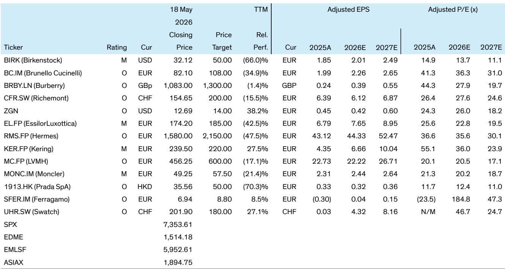

# 中国奢侈品市场的真正信号不是复苏，而是结构性分化加速

过去几个月，关于中国奢侈品市场“触底反弹”的声音不绝于耳。投行研报团队近期在香港和上海进行了实地调研，与上市公司、零售商和行业内部人士进行了密集交流。其结论值得每一位关注全球奢侈品行业的人重新审视：中国奢侈品需求确实在企稳，但这种企稳是建立在高度两极化的基础之上——高端消费依旧强劲，而中产阶层的购买力仍然脆弱。

这不是一个“V型反转”的故事，也不是一个“全面复苏”的故事。这是一个关于结构性分化如何重塑品牌格局、零售网络和竞争逻辑的故事。报告中的10个关键发现，指向同一个核心判断：市场真正低估的不是需求总量，而是供给侧正在发生的再定价——品牌之间的赢家通吃效应正在加速，而零售网络的整合才刚刚开始。

## 1. 香港的“财富效应”正在重塑奢侈品消费格局，但这不是内地市场的先行指标

在本次调研中，香港被描述为一个“亮点”。这并非简单的旅游复苏故事。报告指出，香港住宅市场自2025年9月以来出现价格回升，周环比涨幅平均约0.4%，同时零售销售已经连续11个月增长，酒店RevPAR指标也在改善。这些数据叠加在一起，形成了一个典型的“财富效应”传导：资产价格上涨带来消费者信心改善，进而推动奢侈品消费。

值得关注的是，香港的珠宝和手表品类表现尤为突出。报告中的数据显示，2026年1月至3月，该品类零售同比增长达到25%-30%，远高于整体零售增速。这并非偶然——高端珠宝和腕表历来是财富效应最直接、最敏感的受益者。

但这里有一个关键问题：香港的复苏能否作为内地市场的先行指标？报告的判断是谨慎的。香港是一个高度开放、资本自由流动的市场，其资产价格波动与全球流动性密切相关。而内地市场面临的结构性问题——尤其是中产阶层消费信心修复——需要更长的时间。香港的“亮点”更多反映了局部财富效应的回归，而非整体消费动能的恢复。

## 2. 一线城市企稳但分化严重，房地产价格回升尚未形成广泛的财富效应传导

报告对内地一线城市的判断是“早期且不均衡的改善”。二手房价格在一线城市刚刚转正，但这一回升主要集中在顶级地段，大量主流区域和商业项目仍然承压。这意味着，即便是中国最富裕的城市，财富效应的传导路径也是狭窄的。

这对奢侈品品牌意味着什么？它意味着品牌不能简单地将“一线城市企稳”解读为扩张信号。实际上，报告明确指出，商场和门店的供给过剩仍在压制市场，品牌正在关闭表现不佳的门店，缩减面积，将资源集中在少数高产出的旗舰店位置。这是一个典型的存量优化阶段，而非增量扩张阶段。

从资产定价的角度看，那些在顶级商场拥有旗舰店位的品牌，其租金成本优势正在转化为竞争壁垒。而依赖大量中低端门店覆盖市场的品牌，则面临单店产出持续下滑的压力。零售网络的“马太效应”正在加剧。

## 3. 品牌两极分化已经进入“赢家通吃”阶段，第二梯队品牌正在失去消费者心智

报告中最引人注目的判断之一是品牌两极分化的加剧。Hermes、Louis Vuitton、Chanel、Van Cleef & Arpels以及顶级瑞士腕表品牌仍然非常强势，而大量二线和三线品牌则在努力维持相关性和产出。

这种分化不是简单的市场份额变化，而是消费者心智的重新排序。报告提到，强势品牌仍然能够扩展空间、维持定价权并投资于体验式营销，而弱势品牌则在缩减零售网络，并可能也在失去消费者的心智份额。这意味着，品牌之间的差距正在从“经营效率”层面扩展到“品牌资产”层面——一旦消费者将某个品牌归类为“二线”，重新夺回心智的成本将极其高昂。

对于投资者而言，这意味着在当前的行业周期中，选股逻辑应该从“行业beta”转向“公司alpha”。那些拥有不可替代品牌资产的公司，其估值溢价可能比市场预期的更持久。

## 4. “中国为中国”战略正在从营销口号变成运营刚需，全球品牌的本土化能力成为关键变量

报告指出，“中国为中国”现在已成为全球奢侈品牌的战略核心。这不仅意味着产品定价和品类的本地化，更包括以微信为中心的CRM系统、本地KOL合作以及生活方式生态系统的构建——咖啡馆、博物馆、俱乐部式空间，这些专门针对中国消费者期望而设计的体验正在成为标配。

这一趋势的深层含义是：全球品牌在中国市场的竞争，正在从“品牌力”竞争转向“本地化运营能力”竞争。那些能够将全球品牌资产与中国消费者行为深度结合的公司，将获得显著的竞争优势。而那些继续“简单输入全球模板”的品牌，则可能面临消费者疏离的风险。

报告没有完全展开的一个问题是：这种本地化投入的ROI如何衡量？对于大多数品牌而言，构建微信生态、运营本地化内容、维护KOL关系网，都需要持续的高额投入。在行业景气度下行时，这些投入可能成为利润率的拖累。这里仍需验证的关键点是：本地化投入是否真的能够转化为可量化的销售提升和客户忠诚度。

## 5. 国产品牌正在成为“价值锚点”，但它们的崛起可能重塑整个价格带

报告确认了一个重要的结构性变化：在美妆、成衣和珠宝领域，国产品牌已经成为严肃的竞争对手，尤其是在入门价格带。报告提到了皮革制品领域的Songmont和Grotto、珠宝领域的Laopu，以及Mao Geping等本土美妆品牌。这些品牌通过将可信的产品与强大的文化叙事、数字化互动以及比许多国际品牌更优的性价比相结合，正在赢得市场份额。

这一趋势的so what是：国产品牌的崛起正在重新定义“性价比”的基准。对于国际品牌而言，入门级产品的定价空间正在被压缩。过去，国际品牌可以通过品牌溢价在入门价格带维持高毛利。但现在，消费者有了更多的选择——他们可以在国产品牌中找到设计感不差、品质可靠、价格低得多的替代品。

这意味着国际品牌面临一个两难选择：要么下调入门产品价格以维持竞争力，从而侵蚀整体利润率；要么坚守定价，但承担入门级客户流失的风险。报告没有给出明确的答案，但暗示了“贸易下移”已经在发生——消费者在品牌内部选择入门SKU，或者转向奥特莱斯和二手平台。

## 6. 体验式营销正在成为定价权的最后防线，但它的可持续性仍是一个开放问题

在需求疲软的环境下，全球品牌正在大力依赖创意活动和体验式营销来捍卫定价权和心智份额。报告提到的案例包括Louis Vuitton在上海的“The Louis”空间、Hermes的手工艺活动，以及各种品牌快闪店。这些活动将门店和商场从简单的销售点转变为“目的地”。

这背后的逻辑是：当消费者对价格变得更加敏感时，品牌需要通过提供不可替代的体验来证明其溢价的合理性。体验式营销本质上是一种“情感附加值”的创造。如果消费者愿意为一次独特的品牌体验支付溢价，那么品牌的定价权就能得到捍卫。

但这里有一个尚未被充分回答的问题：体验式营销的投入产出比能否持续？这些活动通常需要大量的前期投入，包括场地、策划、明星和KOL费用。在行业景气度好的时候，这些投入可以通过销售增长来覆盖。但在需求疲软的环境下，这些成本可能成为利润率的沉重负担。报告没有深入分析不同品牌的体验式营销ROI差异，这可能是投资者需要进一步研究的方向。

## 7. 投资启示：在不确定中寻找确定性，但不要忽视“自我救赎”型公司的机会

报告的最终投资建议是防御性的：偏好“公允价值”的高质量公司，以及那些拥有更乐观发展轨迹的“自我救赎”型公司。报告将Richemont列为首选，理由是其强劲的珠宝业务势头和领导地位。同时，报告对Burberry和Ferragamo的转型持较为积极的看法。

但值得警惕的是，报告对Kering等更依赖中产阶级或二线品牌的股票持谨慎态度。这再次印证了前文的判断：在结构性分化加速的背景下，品牌资产的质量比行业景气度更重要。

对于投资者而言，这意味着需要建立一个新的观察框架：不是看“中国奢侈品市场什么时候复苏”，而是看“哪些品牌在中国市场拥有不可替代的竞争优势”。这些优势可能来自于品牌资产的稀缺性（如Hermes）、零售网络的效率（如Louis Vuitton）、或本地化运营的深度（如一些正在转型的品牌）。

报告尚未完全回答的一个关键问题是：如果中国中产阶层的消费信心修复推迟到2027年甚至更晚，哪些品牌能够承受更长时间的利润率压力？这个问题的答案，可能决定了当前估值水平的合理性。

---

以上是基于本次调研报告的深度解读与框架性思考。报告原文还包含大量未在此处展开的图表数据、品牌层面的具体分析以及估值模型。如果您希望进一步探讨“哪些品牌最有可能在分化中胜出”或“如何构建一个应对中国奢侈品市场不确定性的投资组合”，欢迎来星球微信群里继续讨论。

Personal reading notes and learning share only. Not investment advice.

