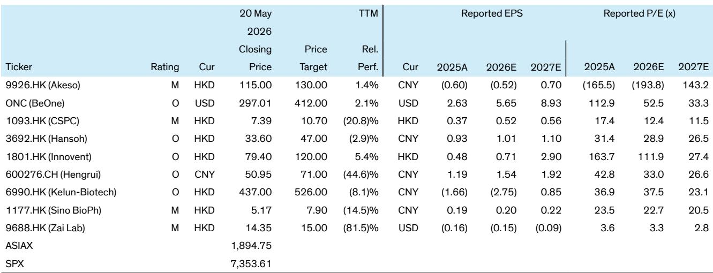

# 中国创新药研发的“效率拐点”已经到来，市场正在重新定价赢家

过去几年，中国生物医药行业经历了一轮完整的估值收缩与信心重建。市场从追逐管线数量、概念热度，转向拷问一个更本质的问题：每一分研发投入，究竟能换回多少真金白银的收入？

某外资投行近期发布的一份深度研报，试图用一套系统化的框架回答这个问题。其核心结论是：中国药企的研发能力正在出现明显的分化，而真正具备“研发经济回报”的公司，将在未来三到五年内被市场重新定价。这份报告通过三个维度的交叉验证，筛选出了几家有望成为“未来冠军”的企业。

这不是一个关于“谁管线最多”的故事，而是一个关于“谁最能将研发转化为商业回报”的判断。对于产业决策者和长期投资者而言，理解这个效率拐点的含义，比追逐任何短期催化剂都更重要。

## 1. 衡量研发能力的真正标尺不是管线数量，而是“研发经济回报”

长期以来，市场习惯于用管线规模、IND数量或临床阶段来评估一家生物科技公司的实力。但这份研报提出了一个更犀利的视角：真正有效的衡量标准，是“研发经济回报”——即企业能否将数年前的研发投入，转化为当下的创新药销售收入或授权收入。

报告构建了两组核心指标：一是“销售收入研发回报率”，即创新药销售额除以四年前的累计研发支出；二是“授权收入研发回报率”，即BD授权收入除以三年前的累计研发支出。这两组指标共同回答了同一个问题：企业的研发投入，究竟在以多高的效率变现。

从2025年的数据来看，豪森药业在销售收入研发回报率上领先同行，达到2.0倍；科伦博泰则在授权收入回报率上表现突出，达到1.0倍。但更值得关注的，是这些数字在2030年的预期变化。报告预测，到2030年，信达生物和康方生物的销售收入研发回报率将提升至约3.1倍，授权收入回报率也将达到0.7至0.9倍。恒瑞医药则在传统药企中表现最佳，预计销售收入研发回报率将从2025年的0.9倍回升至2030年的2.4倍。

这意味着什么？市场目前对部分公司的估值，可能尚未充分反映其研发投入即将进入“收获期”的现实。尤其是对于那些正处于商业化放量前夜的企业，其研发投入的效率拐点可能就在未来一两年内出现。

## 2. 信达和康方在“研发效率”上已建立起可量化的护城河

如果仅看回报率，可能有人会质疑这仅仅是财务模型的推演。但报告进一步从“时间”和“转化率”两个维度，验证了这些公司的效率优势。

在时间维度上，报告统计了从IND申请到获批上市的中位时间。在所覆盖的公司中，肿瘤产品的平均用时约为2100天，非肿瘤产品约为2900天。信达生物是其中效率最高的之一：其肿瘤产品从IND到上市仅需约1067天，比行业平均快约50%；非肿瘤产品为2111天，也比平均低约30%。在拥有大量自研管线的公司中，这一速度具有显著的竞争优势。

在转化率维度上，报告计算了“命中率”——即截至2023年底提交的所有IND中，最终成功上市的比例。生物科技公司的平均命中率几乎是传统药企的两倍，而信达和康方又以超过40%的命中率领先所有同行。这意味着，它们不仅跑得快，而且选得准——在早期研发阶段就具备更高的决策质量。

这两个数据合在一起，指向一个更深刻的判断：信达和康方的效率优势并非偶然，而是系统性的。它们可能在靶点选择、临床设计、注册策略等环节建立了可复用的能力平台。这种能力一旦形成，就很难被竞争对手简单复制。

## 3. 传统药企正在经历“研发回报率”的周期低谷，但恒瑞可能率先走出

与生物科技公司相比，传统药企的研发回报率在过去几年普遍承压。报告数据显示，从2022年到2025年，石药集团、中国生物制药等公司的销售收入研发回报率持续下降，主要原因是老产品的生命周期进入后半段，而新产品的上市尚未形成足够的收入规模来弥补研发支出的增长。

但恒瑞医药是一个值得单独讨论的案例。其研发回报率从2022年的1.2倍一路降至2025年的0.9倍，表面上看与同行趋势一致。然而，报告预测其回报率将从2027年开始加速回升，到2030年达到2.4倍。这一反转的背后，是恒瑞在创新药管线上持续投入的累积效应——新的产品上市将逐步对冲老产品的下滑。

这里有一个尚未被市场充分定价的逻辑：对于恒瑞这样体量的公司，其研发支出的绝对规模巨大，因此回报率的任何边际改善，都将带来极为可观的绝对收益增量。如果恒瑞能够如期实现2.4倍的研发回报率，其创新药收入将远超当前市场的一致预期。问题在于，这一反转的节奏和确定性，目前仍存在不确定性——尤其是新产品的放量速度和医保谈判的潜在影响。

## 4. 授权收入正在成为部分公司“研发回报”的第二引擎

报告特别关注了授权收入在研发回报中的角色。对于许多中国生物科技公司而言，对外授权（out-licensing）已经从一个“锦上添花”的选项，变成了核心的商业模式之一。

以康方生物为例，其核心资产AK112有望在2027年获得FDA批准，届时将进入里程碑付款和销售分成的收获期。报告预测，其授权收入研发回报率将从2025年的几乎为零，提升至2030年的0.9倍。信达生物同样如此，预计2027年将从武田获得一笔可观的里程碑收入，推动其授权收入回报率跃升至0.7倍。

科伦博泰的情况则更为特殊。尽管其核心资产sac-TMT仍处于全球III期临床阶段，但其2025年的授权收入研发回报率已经达到1.0倍，主要得益于此前与默沙东的合作。不过，报告也指出，随着研发支出的持续增长，这一回报率在2026至2028年间可能会暂时回落，直到sac-TMT进入商业化阶段后才重新回升。

这里需要特别注意的是：授权收入具有高度非线性和不确定性。一笔里程碑付款就能大幅改变当年的回报率数据，但下一笔何时到来、金额多少，往往取决于临床数据的读出时间和监管审批节奏。报告对此的预测基于一系列假设，这些假设尚未经过现实验证。投资者在参考这些数据时，需要理解其背后的概率分布，而非将其视为确定性的预测。

## 5. 报告尚未完全回答的关键问题：效率优势能否在更大规模下持续

尽管报告的分析框架令人信服，但它也留下了一个尚未充分解答的问题：当信达、康方这样的公司管线规模继续扩张、研发支出持续增长时，它们的效率优势能否维持？

从历史经验来看，许多生物科技公司在从小型创新企业向成熟生物制药公司转型的过程中，都曾面临“效率稀释”的挑战。随着管线从几十个资产扩展到上百个，管理复杂度急剧上升，早期那种“每个项目都经过创始人亲自把关”的决策模式难以为继。信达目前已经拥有超过100个在研资产，进入了成熟生物制药公司的规模区间。其高达28%的潜在FIC（first-in-class）资产占比，在行业中遥遥领先，但这同时也意味着更高的研发风险。

恒瑞医药则代表了另一种挑战：如何在360多个资产的庞大管线中，保持足够的资源聚焦和决策效率。报告显示，恒瑞和康方在“每亿元研发支出对应的临床试验数量”上表现最优，平均每年约20项试验。但这一数字能否在管线进一步扩张后维持，仍需要持续跟踪。

这些问题的答案，可能决定了当前被筛选出的“冠军候选人”能否最终成为真正的赢家。而这也正是完整报告中最值得深入研读的部分——它提供了足够多的数据维度和分析框架，让读者可以自行推演不同的情景。

## 6. 对产业决策者的观察框架：从“谁在研发”转向“谁在有效研发”

对于产业决策者和长期投资者而言，这份报告提供了一个可复用的分析框架。与其追逐短期的股价波动或政策催化，不如建立一套系统性的“研发效率评估体系”。

核心可以关注三个维度：第一，研发投入的“滞后回报率”。不要只看当年的研发费用率，而要追踪几年前的研发投入在今天产生了多少收入。第二，从IND到上市的“时间效率”。这不仅是执行力的体现，更是注册策略、临床设计、患者入组等综合能力的函数。第三，早期管线的“命中率”。如果一家公司早期项目的大量IND最终无法上市，那么其管线的“账面价值”就存在严重高估。

将这些维度综合起来，就能区分出哪些公司真正具备“研发能力”，哪些公司只是“研发规模大”。在当前的市场环境下，前者将享受估值溢价，后者则可能面临持续的下修压力。

这份报告所覆盖的公司中，信达、康方、恒瑞在多个维度上表现突出，但各自的优势来源不同。信达和康方更偏向于“效率驱动”，而恒瑞则更多体现为“规模与效率的平衡”。未来三到五年，这三家公司的表现，将在很大程度上定义中国创新药行业的研发效率基准。

---

以上分析基于投行研报的核心框架和公开数据，旨在为读者提供一个结构化的思考起点。报告中还有大量关于各公司具体管线、临床数据、财务预测的详细分析，以及更多关于研发效率的图表和敏感性测试，这些内容无法在一篇文章中完整呈现。

如果您对文中提到的“效率拐点”判断有进一步探讨的兴趣，或者希望看到完整的原始数据图表和详细的公司对比分析，欢迎来星球微信群里继续讨论。在那里，我们可以一起拆解更细颗粒度的数据，推演不同情景下的投资与产业决策逻辑。

Personal reading notes and learning share only. Not investment advice.

