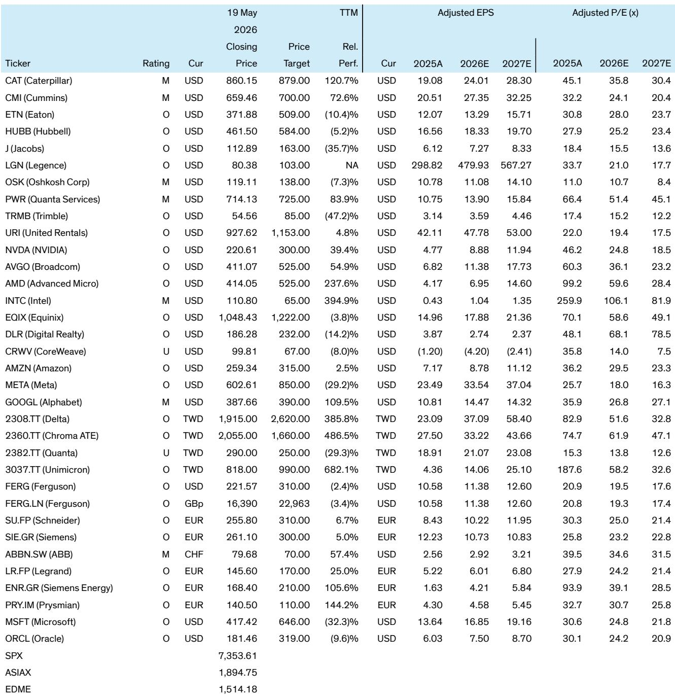
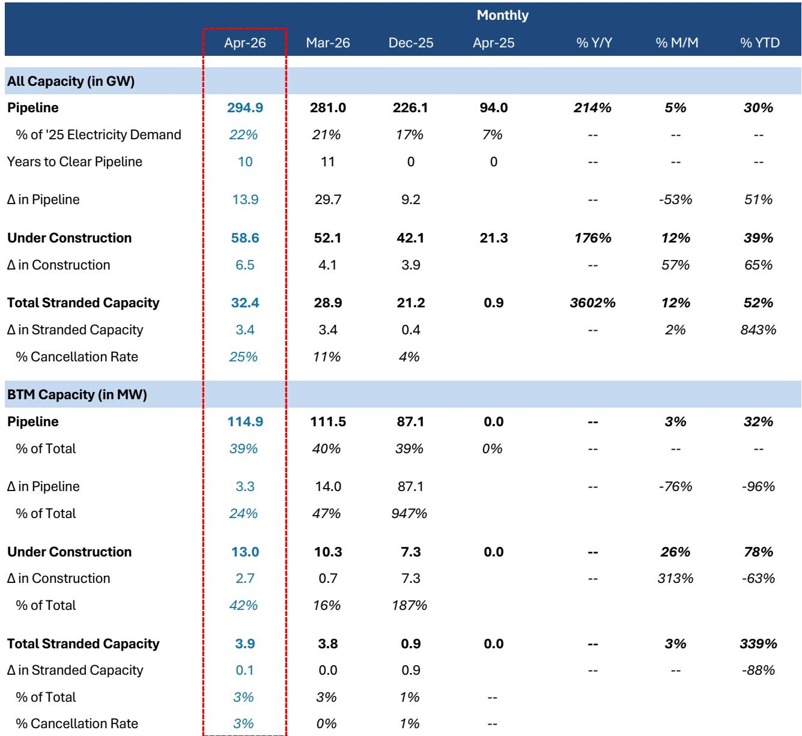

# 数据中心投资的下一个分水岭不是算力，而是“表后电力”的规模化落地

市场对AI算力需求的叙事已经足够充分。真正被低估的，是一张正在快速成形的、围绕“表后电力”（Behind-the-Meter, BTM）展开的全新基础设施投资地图。某外资投行最新发布的北美数据中心容量追踪报告显示，截至2026年4月，BTM模式在数据中心管道中的渗透率已从几乎为零飙升至39%，而在在建项目中占比达到22%。这组数字背后，是一场正在改写电力设备、发动机制造乃至电气工程总包商估值逻辑的结构性变革。

这份报告的价值，不在于它确认了数据中心建设仍在高速增长——管道总量已达295 GW，同比增长214%，这些数字市场并不陌生。它真正提供了三个关键信号：第一，管道增速正在从“爆发”转向“有序”，但结构变化比总量变化更重要；第二，表后电力正在从边缘方案变成主流选择，这将重塑供应链的竞争格局；第三，一个此前被忽视的风险维度——社区反对导致的搁浅产能——正在以惊人的速度积累，可能成为未来项目交付的最大变数。

以下是我们基于报告数据的四个核心洞察，以及一个报告尚未完全回答的关键问题。

## 1. 管道增长的结构性分化：开发商正在取代超大规模云厂商成为增量主力

过去市场习惯将数据中心投资等同于“超大规模云厂商的资本开支”。但报告4月的数据揭示了一个重要转折：在当月13.9 GW的管道增量中，开发商贡献了86%，而超大规模云厂商仅占37%。这意味着，数据中心建设的驱动力正在从“自建”向“批发/租赁”模式迁移。

这种变化的含义是双重的。一方面，它意味着资本开支的承担主体正在分散化，降低了单一客户削减订单对供应链的冲击。另一方面，开发商主导的项目往往对电力解决方案的标准化和可复制性要求更高，这恰恰是BTM模式能够快速渗透的土壤。报告显示，开发商在过去12个月贡献了约60%的BTM管道增量，其BTM渗透率已达到40%，远高于超大规模云厂商的36%。

对于投资者而言，这意味着需要重新评估哪些供应商更受益于“开发商主导”的采购模式。那些能够提供“交钥匙”式电力解决方案、而非单纯售卖设备的企业，可能在订单获取上占据优势。

## 2. 表后电力的“渗透率拐点”已过，但市场仍低估其供应链二阶效应

BTM模式——即数据中心在电网之外自建发电设施——正在经历从“实验性方案”到“标准配置”的转变。报告数据显示，目前仅有4%的已装机数据中心采用BTM，但在建项目中这一比例跃升至22%，而管道项目中更是达到39%。

这种阶梯式渗透率提升，直接解释了为什么发动机制造商正在成为数据中心投资的新受益者。报告明确指出，BTM的加速增长支持了卡特彼勒将大型发动机产能扩张三倍的计划，以及康明斯可能进入主力电力市场的判断。但市场可能低估的是，BTM对电气设备总需求的放大效应：报告估算，采用BTM的项目在电气分配设备上的支出比纯电网接入项目高出约30%。这意味着，即使数据中心建设总量不变，BTM渗透率的提升也将为伊顿、哈勃等电气设备商带来额外的TAM增量。

报告给出的电气设备TAM估算——伊顿6900亿美元、施耐德7870亿美元、ABB5900亿美元——已经相当庞大。但如果BTM渗透率在未来两年内从39%进一步向50%甚至更高迈进，这些数字可能还需要上调。关键变量在于：天然气发电机组和电池储能系统的交付周期能否匹配数据中心建设的节奏。

## 3. 搁浅产能的快速积累：一个正在被忽视的风险信号

报告中最令人不安的数据点，是搁浅产能的急剧膨胀。4月，因社区反对、审批延迟或开发商主动取消而“搁浅”的产能达到32.4 GW，占管道总量的11%，而去年夏天这一比例仅为7-9%。更值得注意的是，当月搁浅产能环比增长3.4 GW，其中开发商贡献了超过50%的增量，另有35%的来源“无法解释”。

“无法解释”的35%是一个需要高度警惕的信号。它可能意味着部分项目在未公开披露的情况下被悄然搁置，也可能反映数据收集的滞后性。无论原因如何，11%的搁浅率已经足够让投资者重新审视管道项目的“可执行性”。报告给出的“取消率”从去年底的4%跃升至25%，尽管这个数字可能包含了部分重新规划的项目，但趋势方向是明确的。

这个风险对于不同环节的影响是不对称的。对于土地和规划阶段的开发商，搁浅产能意味着沉没成本。但对于已经锁定订单的工程总包商和设备供应商，只要在建项目（59 GW）的交付不受影响，短期业绩仍有支撑。风险更多体现在远期估值上——如果搁浅率继续上升，市场可能会对管道项目的转化率进行折价，从而压制相关股票的估值倍数。

## 4. 电气设备TAM的“可寻址性”问题：谁真正能吃到最大份额？

报告给出了多个电气设备商的TAM估算，从PWR的4万亿美元到LGN的2990亿美元不等。这些数字本身具有参考价值，但投资者需要追问一个更关键的问题：这些TAM中有多少是“可寻址”的，即各公司实际能够获取的份额？

以伊顿为例，其6900亿美元的TAM涵盖了配电设备、UPS、开关柜等多个品类。但在数据中心领域，伊顿面临施耐德、ABB等对手的激烈竞争，且在部分细分市场（如中压配电）的份额并非绝对领先。同样，PWR的4万亿美元TAM主要来自其作为工程总包商的角色，但这个市场进入门槛相对较低，利润率也远低于设备制造。

报告没有完全展开的一个维度是：不同环节的竞争格局和利润率差异。例如，发动机制造（CAT、CMI）的进入壁垒较高，但市场增速可能受制于产能扩张速度；电气设备（ETN、HUBB）的市场空间更大，但竞争也更分散。对于希望“一键配置”数据中心主题的投资者，可能需要一个更精细的框架来区分“受益于总量增长”和“受益于结构性份额提升”的标的。

## 报告尚未完全回答的关键问题：BTM的规模化能否绕过电网瓶颈的制约？

BTM模式的兴起，本质上是对电网瓶颈的一种“绕过”策略。但这里存在一个尚未被充分讨论的悖论：BTM项目虽然不依赖电网供电，但仍然需要电网提供备用容量和并网接口。如果社区反对和审批延迟导致电网基础设施本身无法扩张，BTM项目的“最后一公里”同样可能受阻。

报告提到，BTM项目在4月贡献了24%的管道增量和21%的新增搁浅产能。这说明BTM并非免疫于搁浅风险。随着BTM渗透率的提高，其自身的搁浅产能也在增加——尽管目前3.9 GW的BTM搁浅量占总搁浅量的比例仍较低（约12%），但这个数字正在快速上升。

另一个悬而未决的问题是：天然气发电机组的大规模部署是否会在局部地区引发新的环保争议？报告没有讨论这个维度，但考虑到数据中心社区反对的核心原因之一就是噪音和排放，BTM项目未来可能面临与电网项目类似的NIMBY阻力。

这些未解问题，恰好是深入理解数据中心投资下半场的关键。报告提供了一份极为详尽的月度数据追踪，但数据的背后——哪些项目会真正落地、哪些技术路线会胜出、哪些公司能持续获得超额利润——仍需要更深入的产业链验证和情境分析。

欢迎来星球微信群里继续讨论。我们已经整理了报告中的核心图表和TAM估算明细，并正在追踪几个关键BTM项目的审批进展。群内将定期分享我们对搁浅产能、电气设备份额变化以及发动机制造商产能爬坡的跟踪更新。

Personal reading notes and learning share only. Not investment advice.

