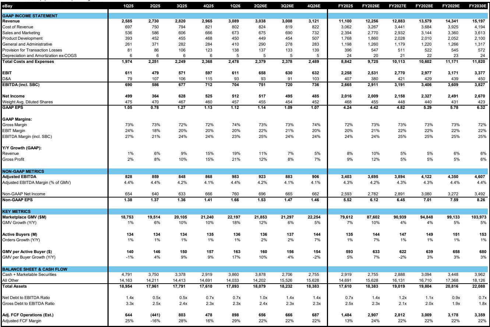
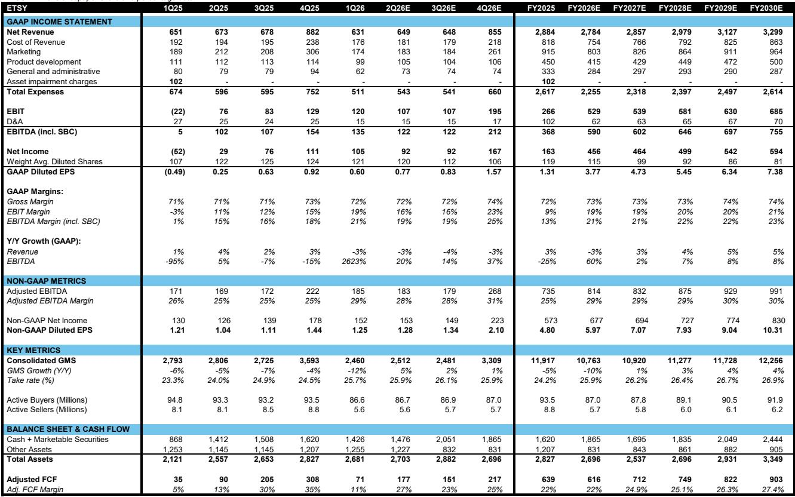
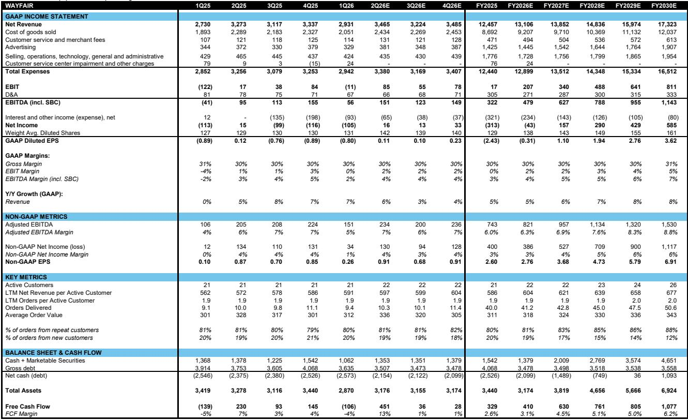

# US eCommerce Has Reached an Inflection Point in Active Buyer Growth—But the Real Test Is Still Ahead

After two years of stagnation and decline, active buyer growth across major US eCommerce platforms is showing signs of stabilization. In the first quarter of 2026, the combined active buyer base at eBay, Etsy, and Wayfair posted quarter-over-quarter growth for the second consecutive period. This is not yet a breakout, but it marks a clear departure from the trajectory of 2024 and early 2025, when year-over-year declines were the norm and investor confidence in volume-led growth was eroding.

The improvement matters because the eCommerce sector has historically been valued on user growth trajectories. When active buyers shrink, the market penalizes platforms regardless of whether they can offset the decline through pricing power or cost discipline. Conversely, a sustained recovery in buyer acquisition and retention would support the higher gross merchandise value expectations that are already being priced into forward estimates. The question is whether this stabilization is the beginning of a durable trend or a temporary reprieve driven by one-off tailwinds.

The data from the latest earnings cycle reveals a nuanced picture. eBay has maintained steady active buyer levels while accelerating new buyer funnel momentum, particularly in the US where enthusiast buyer growth reached 8% year-over-year. Wayfair has returned to positive order growth after a prolonged contraction. Etsy, which has been the weakest of the three, finally saw its new buyer growth turn positive on a year-over-year basis for the first time in two years. These are encouraging signals, but they also raise a set of strategic questions that investors need to answer before concluding that the corner has been turned.

The most critical insight from the current data is that the mechanics of active buyer measurement create a misleading lag effect. The standard metric—buyers who have purchased within the last twelve months—means that current weakness reflects past strength, and current improvement reflects past weakness rolling off. Understanding where the real demand is requires looking beneath the headline number at gross adds, churn, and quarterly order trends. This is where the most actionable signals are emerging, and where the most important uncertainties remain.

## The Twelve-Month Look-Back Window Distorts the True Picture of Current Demand

The standard active buyer metric is a backward-looking construct that creates a systematic lag between actual demand trends and reported figures. When a platform adds a surge of new buyers in one year, those buyers remain in the active count for the next twelve months, masking any subsequent deterioration in acquisition. Conversely, when that cohort begins to roll off the metric, the reported active buyer number can decline even if current acquisition is improving. This is precisely what has been happening across the sector.

For Wayfair, the exit from the German market in the first quarter of 2025 created an additional mechanical drag on the reported active buyer count that had nothing to do with demand trends in its core markets. For Etsy, the year-over-year declines in active buyers through 2025 were partly a reflection of the strong buyer acquisition that occurred in 2024, which boosted the denominator and made subsequent comparisons more difficult. As those 2024 cohorts age out of the twelve-month window, the year-over-year comparisons become easier, creating a mechanical improvement that could be mistaken for organic demand recovery.

The implication for investors is that reported active buyer trends over the next two to three quarters will likely show improvement regardless of whether underlying acquisition is accelerating. The real test is whether gross adds and order frequency are actually strengthening, not whether the reported number is getting better. The data on new buyer growth at Etsy and Wayfair suggests that there is genuine improvement happening beneath the surface, but the magnitude is modest and the sustainability is unproven.

## Gross Adds Are Improving, But Churn Dynamics Will Determine Whether Stabilization Becomes Growth

The most encouraging data point from the recent earnings cycle is the improvement in new buyer acquisition. At Etsy, new buyer growth turned positive year-over-year in the first quarter of 2026 for the first time since early 2023. At Wayfair, new order growth has been positive for four consecutive quarters and accelerated to 7% year-over-year in the most recent period. eBay does not disclose new buyer metrics directly, but management commentary about funnel growth and US buyer count acceleration suggests a similar dynamic.

However, new buyer growth alone is insufficient to drive active buyer expansion. The other side of the equation is churn, and here the picture is more mixed. Etsy's churn numbers have remained elevated, reflecting the fact that many of the buyers acquired during the pandemic-era surge were low-frequency purchasers who did not develop habitual buying patterns. The good news is that churn is likely to moderate mechanically as the 2024 buyer cohort rolls off the twelve-month window, simply because there are fewer high-churn buyers left in the denominator. But mechanical improvement is not the same as structural improvement.

The real driver of sustainable active buyer growth will be order frequency among existing buyers. This requires platforms to expand their addressable use cases—more categories, more occasions, more reasons to return. The core recipe remains price, selection, and convenience, but the execution varies significantly across platforms. eBay has benefited from its focus on enthusiast verticals and cross-border trade. Wayfair is seeing improvement as the housing market stabilizes and consumers resume spending on home goods. Etsy is still searching for the product and marketing formula that will convert its occasional gift buyers into repeat purchasers.

The critical unknown is whether the recent improvement in gross adds represents a structural shift in acquisition efficiency or a temporary tailwind from external factors. One of the most significant external tailwinds has been the change in Google Shopping advertising dynamics following Amazon's exit from the auction. This has reduced competition for ad placements and lowered customer acquisition costs for every other eCommerce platform. But this tailwind will begin to lap in the third quarter of 2026, and the comparison will become more difficult. Platforms that have not built organic acquisition momentum by then could see their gross adds deteriorate again.

## The Google Shopping Tailwind Is Real, But It Is About to Become a Headwind

The most consequential external factor in the recent improvement in buyer acquisition has been the change in Google Shopping advertising dynamics. When Amazon exited the Google Shopping ad auction in late 2024, it created a vacuum that benefited every other eCommerce platform by reducing competition for ad placements and lowering cost per click. This has been a persistent tailwind to customer acquisition efforts for eBay, Etsy, Wayfair, and others.

The data shows that US Google Shopping ad impression share for the median competitor increased significantly following Amazon's exit and has remained elevated. This means that platforms are getting more visibility for their ad spend, which directly translates into more efficient acquisition of new buyers. The improvement in new buyer metrics across the sector over the past two quarters is at least partially attributable to this dynamic.

The problem is that this tailwind is about to become a headwind. The sector will begin to lap the Amazon exit in the third quarter of 2026, meaning that year-over-year comparisons for ad impression share will normalize. If Amazon re-enters the auction, the competitive dynamic could reverse sharply. Even if Amazon does not return, the easy gains from the initial shift have already been captured. Going forward, platforms will need to sustain their acquisition momentum through organic improvements in their product and marketing, not through a one-time structural change in the advertising landscape.

Additionally, Etsy has noted a favorable Google algorithm change in paid search that has benefited its traffic. Algorithm changes are inherently unpredictable and can reverse without warning. The lack of visibility into these dynamics makes it difficult to assess how much of the recent improvement in buyer acquisition is sustainable versus dependent on factors that are outside the control of management.

## AI Referral Traffic Is Growing Fast, But It Is Still Too Small to Move the Needle

One of the more interesting developments in the eCommerce landscape is the rapid growth of AI-generated referral traffic. eBay has noted that half of returning AI traffic is direct, meaning that users who discover products through AI tools are coming back to the platform on their own. This suggests that AI referrals are not just a novelty but are actually driving genuine user engagement.

The growth rate of AI referral traffic is impressive, but the base is still very small. For the foreseeable future, AI will remain a marginal channel for buyer acquisition relative to search, social, and direct traffic. The strategic question is whether AI will eventually become a meaningful distribution channel for eCommerce or whether it will remain a niche source of traffic that is difficult to scale.

The early data suggests that AI referrals may have higher conversion rates and better retention than other channels, which would make them disproportionately valuable even at small volumes. But the technology is evolving rapidly, and the competitive dynamics of AI-powered commerce are still being shaped. The platforms that invest early in optimizing for AI discovery and building direct relationships with AI-driven users could gain an advantage that compounds over time.

For now, AI referral traffic is an interesting narrative but not a material driver of active buyer growth. Investors should monitor it as a potential future tailwind but should not base their near-term thesis on it.

## A Decision Framework for Evaluating Active Buyer Sustainability

For investors trying to assess whether the recent improvement in active buyer growth is sustainable, the key is to decompose the headline number into its components and evaluate each one independently. The following framework provides a structured approach.

First, assess gross adds. Are new buyers being acquired at a rate that is consistent with the platform's historical norms, and is the cost of acquisition improving or deteriorating? The Google Shopping tailwind has made acquisition cheaper, but this benefit is fading. Platforms that are seeing gross add improvement despite stable or increasing acquisition costs are showing genuine demand. Platforms that are benefiting only from lower costs are more vulnerable.

Second, evaluate churn. Is the improvement in active buyers coming from lower churn, higher gross adds, or both? Mechanical improvements from rolling off prior cohorts are not sustainable. Structural improvements in churn require evidence that buyers are returning more frequently and purchasing across more categories. Etsy's data on habitual and repeat buyers is the most granular available, and it shows that these cohorts are still declining year-over-year, albeit at a decelerating rate. Until these trends turn positive, the active buyer improvement at Etsy is fragile.

Third, look at order frequency. Active buyers are a stock, but GMV growth requires both stock and flow. Even if the active buyer base stabilizes, GMV growth will be anemic if order frequency per buyer is declining. Wayfair's return to positive order growth is a positive signal, but the magnitude is still modest. eBay's management commentary about balanced trends across buyer count, cohort mix, frequency, and spend is reassuring but difficult to verify with publicly available data.

Fourth, consider the macro environment. Consumer spending is the ultimate driver of eCommerce volumes, and the current environment is characterized by uncertainty around interest rates, inflation, and employment. The sector is entering a period of tougher year-over-year comparisons, and any macro shock could reverse the recent improvement in buyer sentiment. Platforms with exposure to discretionary categories like home goods and gifts are more vulnerable than platforms focused on everyday essentials or enthusiast verticals.

Finally, assess the competitive landscape. Amazon's exit from Google Shopping was a gift to the rest of the sector, but it could be temporary. The competitive dynamics of AI-powered commerce are still forming. And the traditional competitive advantages of scale, selection, and convenience remain as powerful as ever. Platforms that cannot differentiate themselves on these dimensions will struggle to sustain buyer growth regardless of the macro environment.

## The Full Report Contains the Charts and Data That Make These Trends Visible

The analysis above is based on the detailed data and charts contained in the original research report, which provides a comprehensive view of active buyer trends across eBay, Etsy, and Wayfair over the past two years. The exhibits in the full report show the quarter-over-quarter and year-over-year trends for each platform, the decomposition of gross adds and churn, the impact of the Google Shopping dynamics, and the forward estimates for active buyer growth.

The data reveals patterns that are not immediately obvious from the headline numbers. For example, the sum of active buyers across the three platforms has been essentially flat for two years, but the composition has shifted significantly. eBay has held steady while Etsy has lost ground and Wayfair has recovered from its trough. The forward estimates suggest that all three platforms will see modest improvement over the next four quarters, but the confidence intervals are wide and the assumptions about churn and acquisition costs are critical.

The full report also includes the detailed traffic and monthly active user data from SimilarWeb and SensorTower, which provide a more current view of demand trends than the quarterly active buyer metrics. These data sources show that web traffic and app usage are improving across the sector, but the trends are uneven and the relationship between traffic and conversion is not always linear.

Join the community to read the full report and review the original charts.

*This article is for learning and discussion only and does not constitute investment advice.*

Personal reading notes and learning share only. Not investment advice.

