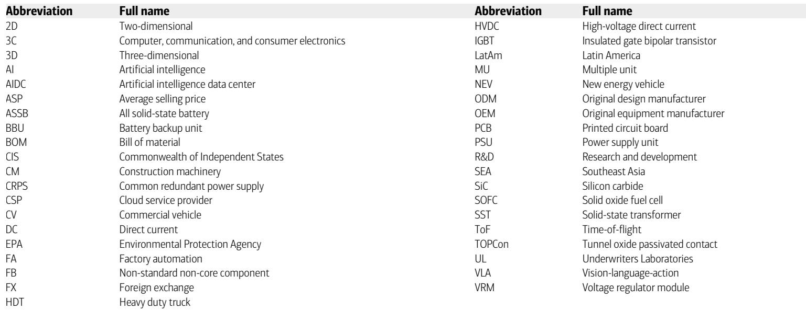
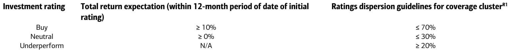

# 中国工业的真正拐点不是出口，而是“技术溢价”的全球定价权

五月的这场会议，密集的18场管理层交流，覆盖了从工程机械到自动化，从重卡到动力设备的所有关键赛道。如果你只记住一个判断，那应该是这个：中国工业企业的全球扩张，正在从“规模换份额”转向“技术换溢价”。出口增速仍然可观，但真正驱动利润结构变化的，是电动化、AI数据中心和高端装备这三个维度的技术定价权。报告提供的新信号在于，这些企业不再只是谈论海外收入占比，而是开始量化地讨论——在哪些产品线上，他们正在成为全球价格制定者，而不是接受者。

这轮变化真正考验的是企业能否把规模转化为议价权。过去五年，中国工程机械和自动化企业的海外扩张，核心逻辑是性价比替代。但2026年的会议纪要显示，多家龙头企业正在讨论的不是“降价抢单”，而是“技术溢价”和“客户粘性”。这背后是三个结构性变量的叠加：全球能源价格上涨正在加速电动化设备的接受度，AI数据中心催生了全新的高壁垒产品需求，而人形机器人供应链的成熟正在重新定义精密制造的价值。这些变量共同指向一个结论：中国工业的竞争力拐点，已经从成本优势转向了技术定义能力。

## 1. 工程机械的海外增长不再是“量的故事”，而是“汇率管理与产品结构”的双重考验

工程机械板块的会议共识非常清晰：2026年海外收入增速预计在15%到20%之间，显著高于国内个位数的增长。但真正值得关注的不是这个数字，而是企业如何管理这个增长的质量。多家管理层主动提及了美元波动的影响，并给出了具体的应对策略：降低外币敞口、缩短海外应收账款周期、以及更科学化的对冲操作。这背后传递的信号是，海外业务已经从“增量补充”变成了“利润核心”，因此汇率管理不再是财务部门的辅助工作，而是直接关系全年利润表的关键变量。

更值得拆解的是产品结构的变化。三一重工看到了电动挖掘机和电动混凝土机械的机会，中联重科和徐工则对矿山机械更为乐观，预计出口增长超过50%。这表明，海外市场的增长驱动力正在分化：电动化设备受益于能源价格上涨带来的运营成本优势，而矿山机械则受益于全球资源品投资的持续活跃。对于投资者而言，需要关注的不再是笼统的“出口增速”，而是每个企业在电动化和矿山这两个高壁垒细分赛道的渗透率。报告没有完全展开的是，这些高价值产品的毛利率是否显著高于传统产品，以及这种结构性改善能否在2026年的利润表中得到体现。

## 2. 自动化上行周期的核心驱动力已从“国产替代”切换为“AI基础设施”

工厂自动化企业的订单增长在4月继续环比改善，但驱动因素已经发生了根本性变化。过去两年的自动化上行周期，核心逻辑是国产设备对进口设备的替代。而2026年的会议纪要显示，AI相关需求、电池和半导体设备、以及钠离子电池、全固态电池、钙钛矿和3D打印等技术升级，正在成为新的增长引擎。这标志着自动化行业的驱动力正在从“存量替代”转向“增量创造”。

以大族激光为例，管理层预计2026年锂电池业务收入同比增长60%，同时PCB设备业务收入目标达到100亿元人民币。更重要的是，3D打印设备的订单和收入进展被管理层认为将快于以往的消费电子更新周期。这意味着，AI产业链的资本开支正在向下游设备端传导，而且传导速度在加快。报告中的一个关键信号是，麦格米特的AI服务器电源已经在第一季度开始大规模出货，并且管理层预计在英伟达Rubin平台上的测试和客户验证将加速。这暗示了一个重要的二阶效应：中国自动化企业正在从AI基础设施的“跟随者”转向“领先者”，尤其是在电源、视觉检测和精密加工等细分领域。

## 3. 人形机器人的竞争焦点已从硬件转向“具身智能”与数据

这是报告中最具前瞻性的部分。人形机器人专家的观点非常明确：2026年的关键战场将从硬件转向具身AI和训练数据。VLA（视觉-语言-动作）加世界模型正在成为主流解决方案，其中VLA易于部署但缺乏物理直觉，而世界模型擅长长流程任务但泛化能力更强。这意味着，人形机器人的竞争壁垒正在从“谁能造出更灵活的关节”转向“谁能训练出更聪明的模型”。

对于供应链企业而言，这带来了新的挑战和机会。专家指出，硬件与AI算法的兼容性是当前的主要瓶颈，而传感器和灵巧手模块的进入壁垒仍然很高。这与市场上普遍认为的“人形机器人供应链即将放量”的乐观预期形成了微妙的反差。报告没有完全回答的关键问题是，中国企业在具身AI领域相对于美国企业的差距有多大，以及硬件兼容性的瓶颈何时能够突破。优必选虽然给出了2026年人形机器人出货量显著增长的指引，但支撑这一增长的具体工业场景和产品组合尚未完全清晰。这恰恰是需要持续跟踪的核心变量。

## 4. AIDC发动机出口是一个“被低估的结构性变量”，但时间表和验证点仍需关注

潍柴动力和玉柴国际的会议内容，揭示了一个此前市场关注度较低但潜力巨大的增长极：AI数据中心用的柴油和天然气发电机组。潍柴动力将从2026年第四季度开始向美国客户交付2-5MW的天然气发电机组，并给出了2026年200台、2027年超过1000台的交付目标。玉柴国际也在扩大AIDC发动机产能，并计划在2027年底前向美国出口。

这一数据点的意义在于，它代表了中国工业企业在全球AI基础设施供应链中，从“零部件供应商”向“系统解决方案提供商”的跃迁。过去，中国企业在数据中心领域更多提供的是散热、电源模块等标准化产品。而发动机和发电机组是数据中心的核心设备，技术壁垒和客户认证周期都很高。如果潍柴和玉柴能够顺利实现交付目标，将意味着中国工业企业在全球AI资本开支中分得更大的一块蛋糕。

但这里需要保持谨慎。报告本身也指出了几个尚未验证的关键点：美国客户的订单确认进度、地缘政治风险对出口的潜在影响、以及大规模交付后的质量和售后服务能力。这些都不是小问题。对于读者而言，2026年第四季度的首次交付和2027年的交付节奏，将是验证这一逻辑的关键观察窗口。

## 5. 报告尚未完全回答的关键问题：当“技术溢价”遭遇“产能过剩”，利润率的真实走向是什么？

尽管会议纪要充满了乐观信号，但一个核心矛盾始终存在：在光伏、锂电池和传统工程机械等部分领域，国内产能过剩的问题并未完全解决。例如，SC新能源的TOPCon设备国内订单在2025年已经降至零，虽然海外订单和钙钛矿设备在弥补缺口，但传统业务的利润率压力仍然存在。同样，多家自动化企业虽然订单增长强劲，但管理层并未详细讨论毛利率的变化趋势。

这意味着，我们看到的“技术溢价”可能只适用于部分细分赛道，而整体工业企业的利润率改善，仍然需要依赖规模效应和成本控制。报告没有完全展开的分析是，在哪些产品线上，技术溢价足以覆盖产能过剩带来的价格压力，而在哪些领域，企业仍然只能通过降价来争夺份额。这将是区分“真正有定价权的公司”和“只是受益于周期的公司”的核心标准。

## 欢迎来星球微信群里继续讨论

以上分析只是这份研报的冰山一角。我们还有大量未在本文中展开的内容：工程机械各企业的具体海外收入结构对比、自动化企业分产品的订单增速明细、人形机器人供应链的国产化率测算、以及AIDC发动机出口对潍柴和玉柴利润弹性的量化分析。这些数据和图表，以及我们基于原文逻辑推导的更多判断，都在星球微信群里与会员持续分享。欢迎加入，一起拆解这份报告的完整逻辑链条，探讨那些尚未验证的关键假设。

Personal reading notes and learning share only. Not investment advice.

