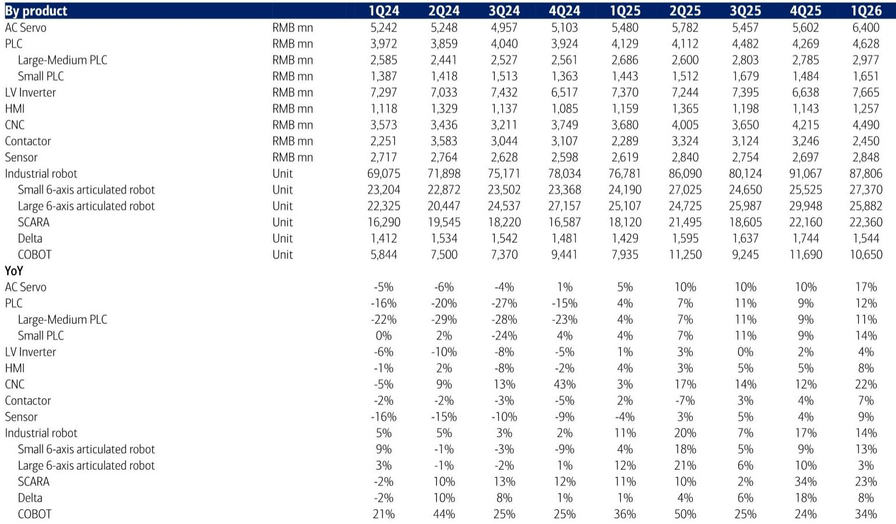
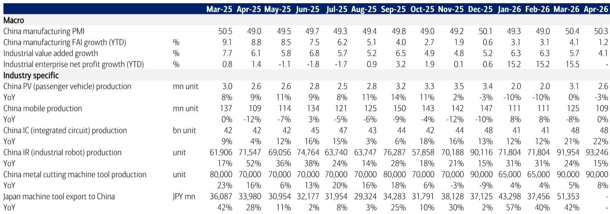
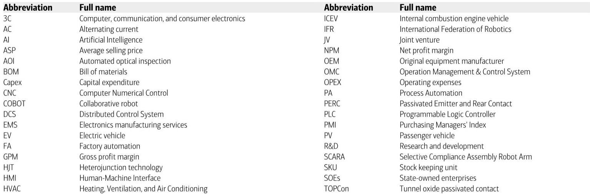

# 工业机器人产量增长15%的背后，自动化市场的结构性分化比总量更重要

中国4月工业增加值同比增速从3月的5.7%回落至4.1%，制造业固定资产投资同比转负。这些宏观读数似乎指向一个正在放缓的工业活动图景。但这份某外资投行于5月19日发布的研报揭示了一个更值得关注的信号：工业机器人产量同比仍增长15%至9.3万台，3C行业增加值增速从13%进一步升至16%，而半导体领域的自动化需求正在加速。总量放缓与结构性亮点并存，意味着当前市场对自动化板块的定价可能低估了供给侧的再定价空间，而非需求端的短期波动。

这份报告的核心判断并非“自动化市场正在复苏”，而是“复苏的路径正在收窄，赢家与输家的分化将比过去两年更剧烈”。对于产业决策者和投资者而言，真正需要追问的不是“自动化市场何时全面回暖”，而是“哪些细分赛道正在从结构性需求中受益，哪些则面临被拖累的风险”。

## 1. 工业机器人产量增速仍维持两位数，但增速放缓本身就是一个需要拆解的信号

4月工业机器人产量同比增长15%，虽低于3月的24%，但连续第三个月保持在15%以上。从绝对值看，9.3万台的月产量处于历史高位。这一数据至少说明两件事：第一，自动化投资的惯性仍在，尤其在下游电子和电池领域；第二，增速放缓并非需求崩塌，而是高基数效应和部分传统制造业资本开支节奏调整的叠加。

报告还引用了两家核心自动化零部件厂商的月度数据：AirTAC 4月销售额同比增长21%（3月为16%），Hiwin同比增长21%（3月为17%）。这两家公司的营收增速均在加速，与工业机器人产量增速放缓形成对比。这意味着，自动化供应链内部的景气度并不完全同步。零部件环节的订单改善可能领先于整机出货，或者下游客户正在从整机采购转向产线改造和零部件替换——后者通常意味着更可持续的需求。

对于投资者而言，工业机器人产量增速放缓不应被简单解读为行业见顶。关键变量在于：放缓是由通用制造业需求疲软驱动，还是由特定子行业（如光伏）的资本开支收缩所致。如果是后者，那么自动化板块的估值逻辑应当从“总量弹性”转向“结构韧性”。

## 2. 3C和半导体是当前最清晰的需求引擎，但它们的驱动力并不相同

报告明确指出，3C行业增加值4月同比增长16%，较3月的13%继续加速。与此同时，半导体设备的需求增长也在4月出现提速。这两个行业是目前自动化市场最核心的增量来源，但它们的驱动力需要区分。

3C行业的自动化需求更多来自存量产线的效率提升和产品迭代。智能手机、可穿戴设备等终端产品的出货量并未大幅增长，但产线对精密装配、检测和柔性化的要求持续提高。这意味着3C领域的自动化采购更多是“提质”而非“扩产”，对供应商的技术门槛和定制化能力要求更高。

半导体领域的自动化需求则更接近“扩产”逻辑。国内晶圆厂和封测厂的资本开支仍在高位，且国产设备替代进程加速，带动了配套自动化设备的采购。这一领域的需求对政策周期和地缘政治因素的敏感度更高，但也更具爆发力。

这两个引擎的共同点是：它们对价格不敏感，对性能和交付周期敏感。因此，能够在这两个领域建立客户粘性的自动化企业，其盈利能力和估值中枢应当高于行业平均。报告没有直接给出这个判断，但从数据推导，这是合理的推论。

## 3. 工厂自动化与过程自动化的分化，正在重塑2026年自动化市场的整体格局

报告给出了一个明确的预测：2026年中国自动化市场整体同比增长0.7%，其中工厂自动化（FA）增长3.2%，过程自动化（PA）下降0.6%。这个0.7%的总量增速看似平淡，但3.2%与-0.6%的分化意味着，FA赛道的实际景气度远高于整体读数。

FA的驱动力来自电子和电池的持续需求，而PA的拖累则来自化工和石化领域的资本开支收缩。这种分化不是短期现象。化工和石化行业的自动化投资与大宗商品价格、环保政策、产能利用率高度相关，其投资周期通常落后于制造业景气度6-12个月。当前PA的下行可能反映的是2024-2025年化工行业利润收缩的滞后影响。

对于投资者而言，这意味着在自动化板块内部，配置重心应当继续向FA倾斜。但报告没有完全展开的一个问题是：FA内部的子行业分化是否也在加剧？例如，通用FA（如伺服、PLC）与专用FA（如锂电设备、半导体设备）的景气度差异可能比FA与PA之间的差异更大。这是需要进一步验证的关键假设。

## 4. 制造业PMI连续两个月处于扩张区间，但产需缺口仍在扩大

4月制造业PMI为50.3，较3月的50.4微降，但连续两个月处于扩张区间。然而，报告的数据表格显示，生产指数与新订单指数之间的差距在拉大。4月生产指数为51.0，新订单指数为48.0，产需缺口达到3个百分点。这一缺口意味着，企业仍在主动生产，但终端需求的承接能力不足，库存可能被动累积。

这与报告提到的另一个数据相呼应：截至3月底，工业企业产成品库存周转天数为21.5天，虽较2月的22.7天有所改善，但同比仍增加0.3天。库存周转效率尚未回到健康水平。

产需缺口的存在，意味着自动化设备采购的可持续性面临挑战。下游客户在产能利用率不饱和的情况下，是否有动力持续采购新设备？答案可能取决于两个因素：一是设备是否用于替代人工（而非扩产），二是设备是否用于生产高附加值产品（而非大宗品）。这进一步强化了前文的判断：自动化市场正在从“总量驱动”转向“结构驱动”，只有那些能够帮助客户降本、提质、换代的供应商才能获得持续订单。

## 5. 光伏和汽车两大下游的疲软，是自动化市场总量承压的核心变量

报告数据显示，4月太阳能电池产量同比下降26%，较3月的-21%进一步恶化。乘用车产量同比下降3%，而3月为持平。这两个行业曾是自动化投资的主要拉动力量，如今却成为拖累。

光伏行业的困境无需赘言：产能过剩、价格战、贸易壁垒，导致全行业资本开支收缩。自动化设备供应商在光伏领域的订单从2024年下半年开始明显放缓，这一趋势在2025-2026年仍在延续。汽车行业的挑战则更多来自传统燃油车产量的下降和新能源车产能利用率的分化。虽然新能源车仍在增长，但增速放缓且产能过剩，整车厂的资本开支趋于谨慎。

这两个行业的疲软，解释了为什么FA整体增长3.2%的预测虽然正面，但并不激进。如果剔除光伏和汽车，FA中电子和半导体赛道的实际增速可能远高于3.2%。报告没有给出这个拆分，但从数据逻辑看，这是合理的推测。

## 6. 报告尚未完全回答的关键问题：这轮复苏的可持续性取决于哪些尚未验证的假设

尽管报告给出了清晰的框架和预测，但有几个关键假设尚未得到充分验证，值得读者在阅读完整报告时重点关注。

第一，FA 3.2%的增长预测是否已经充分考虑了光伏和汽车的下行风险？如果光伏行业的资本开支在2026年下半年进一步收缩，或者汽车产量增速转负幅度扩大，FA的实际增速可能低于预期。

第二，半导体和3C的需求能持续多久？半导体设备的国产替代进程虽然确定性强，但设备采购的节奏受到晶圆厂产能利用率和下游需求的双重影响。3C行业的自动化升级更多是存量改造，其订单周期可能比扩产型需求更短，波动性也更难预测。

第三，零部件环节的订单改善能否转化为整机出货的增长？AirTAC和Hiwin的营收增速加速是积极信号，但如果终端客户只是补库存而非真正扩大产能，这一改善的可持续性需要更多数据验证。

这些未解问题，正是完整报告中最值得深入阅读的部分。报告提供了大量的历史数据和行业交叉验证，能够帮助读者对上述假设做出更准确的判断。

## 7. 对决策者的观察框架：从“自动化市场好不好”转向“哪个环节在涨价”

基于这份报告的推导，一个更有操作性的观察框架是：不再追问“自动化市场整体好不好”，而是关注“哪个环节的价格和利润率在改善”。

在FA领域，零部件环节（如气动元件、线性导轨）的订单改善可能领先于系统集成环节。在PA领域，化工和石化的资本开支收缩可能尚未见底。在终端需求侧，3C和半导体的自动化采购最有可能维持正增长，而光伏和汽车则可能继续承压。

对于产业决策者而言，这个框架意味着：如果企业的客户结构中光伏和汽车占比过高，可能需要加速向电子和半导体领域转型。对于投资者而言，这个框架意味着：自动化板块的选股逻辑应当从“行业龙头”转向“赛道卡位”，优先选择在3C和半导体领域有深度布局、且零部件自给率较高的企业。

报告的完整版本包含了更详细的行业拆分、公司层面的数据以及渠道调研的结论，能够为上述框架提供更扎实的验证依据。

---

Personal reading notes and learning share only. Not investment advice.

