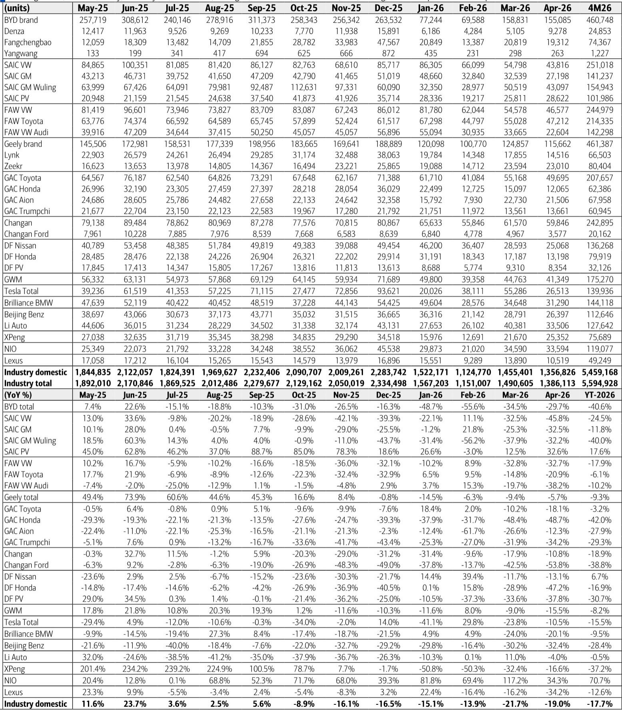
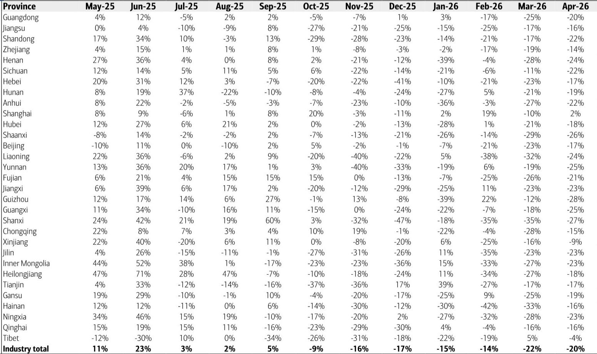
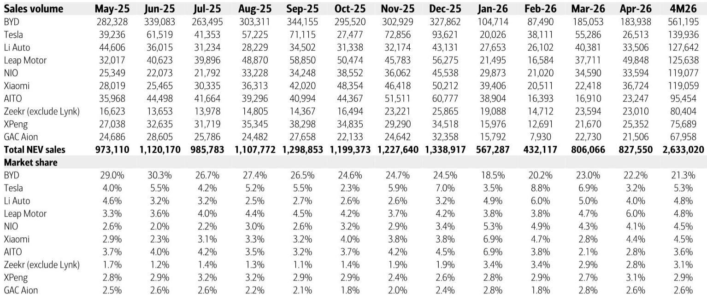

# China's Auto Market Is Not in a Cyclical Slump — It Is Undergoing a Structural Reallocation of Market Power

April's passenger vehicle insurance registration data landed with a thud: 1.36 million units, down 19% year-on-year and 7% month-on-month. A casual reading of the headline number would suggest a market in distress, a demand-side collapse driven by weak consumer confidence, fading stimulus effects, or macro headwinds. That interpretation would be incomplete, and for investors, dangerously misleading.

The controlling insight from the April data is not that the market is shrinking. It is that the market is being remade. The 19% YoY decline in total PV registrations masks a far more important divergence: the EV segment fell only 6% YoY, while the legacy internal combustion engine (ICE) segment — particularly joint venture (JV) brands and traditional luxury marques — suffered declines of 30% to 50%. Meanwhile, channel inventory actually declined by 23,000 units in April after adjusting for exports, meaning that the wholesale-to-retail gap is not a sign of overproduction but of deliberate destocking.

This is not a demand crisis. This is a competitive shakeout. The market is voting with its registrations, and the ballot box is revealing a winner-take-most dynamic that will reshape the industry's profit pool over the next 12 to 18 months. The data from a single month in April is a snapshot of a structural shift, not a seasonal blip. The strategic question for investors, OEMs, and suppliers is no longer "when will the market recover?" but "who will own the market that emerges?"

To answer that, one must look past the aggregate and into the granular detail of who is winning, who is losing, and what the inventory data tells us about the supply side's response. The April numbers offer a rare, clean signal because they strip away the noise of year-end promotions and pre-holiday pull-forwards. What remains is a clear picture of a market that is bifurcating along lines of powertrain, brand heritage, and distribution discipline.

## The EV Market Is Not Immune to Weakness, But It Is Absorbing Share at an Accelerating Pace

The April EV insurance registration figure of 827,000 units — down 6% YoY but up 3% MoM — tells a story of relative resilience. In a market where total PVs dropped 19%, the EV segment's single-digit decline is a striking outperformance. The penetration rate for locally manufactured EVs in April pushed higher, even as the absolute volume contracted.

But the more important story is inside the EV numbers. The market share data reveals a shakeout within the shakeout. BYD, the dominant player with a 22.2% EV market share in April, saw its own registrations fall 30% YoY to 184,000 units. This is a significant deceleration for a company that has been the undisputed volume leader. The reason is not that BYD's products are suddenly uncompetitive, but that the competitive set around it has widened dramatically. Leapmotor posted 50,000 units, up 53% YoY. Zeekr delivered 23,000 units, up 86% YoY. NIO grew 34% YoY. Xiaomi, still ramping its production, delivered 37,000 units.

The pattern is unmistakable: the EV market is fragmenting at the top. BYD's absolute dominance is being challenged by a second tier of startups that have found product-market fit in specific segments — Leapmotor in affordable EVs, Zeekr in premium performance, NIO in the service-driven luxury niche. Tesla's domestic sales of 26,000 units, down 11% YoY, underscore the point. Even the pioneer is feeling the squeeze from local competitors who are iterating faster on features, pricing, and distribution.

The strategic implication is that the EV market is moving from a "winner-take-most" phase to a "multi-leader" phase. This is good for consumers and bad for incumbents who believed that scale alone would protect them. The question for investors is whether the second-tier winners can sustain their growth without destroying their margins. Leapmotor's 53% YoY growth is impressive, but it is coming from a base that is still unprofitable on a unit basis. The market is rewarding volume today, but it will eventually demand profitability.

## Joint Venture Brands Are Not Just Declining — They Are Being Systematically Displaced

The April data for JV brands is catastrophic by any historical standard. GAC Honda fell 49% YoY. DF Honda fell 47%. SAIC VW fell 46%. FAW VW fell 33%. These are not cyclical pullbacks. These are structural losses of market position that have been accelerating for 18 months.

The traditional narrative has been that JV brands are being squeezed by the rise of domestic EVs, but that they retain a stronghold in the ICE segment and among older, more conservative buyers. The April data challenges that assumption. The declines are broad-based across Japanese, German, and American JVs. Even Toyota, which has been the most resilient of the legacy players, saw GAC Toyota down 18% and FAW Toyota down 21%.

What is happening is a demand-side desertion. Chinese consumers, particularly first-time buyers and trade-up buyers, are no longer defaulting to JV brands as the safe choice. The safety halo of a Toyota or a Volkswagen badge has been eroded by the superior digital experience, lower total cost of ownership, and faster product cycles of domestic EVs. The JV brands are caught in a trap: they cannot match the speed of Chinese OEMs on software and electrification, and they cannot compete on price because their cost structures are burdened by legacy supply chains and royalty payments to foreign partners.

The data on luxury brands reinforces this point. Lexus fell 34% YoY. FAW Audi fell 38%. Brilliance BMW fell 20%. Beijing Benz fell 32%. Porsche fell 45%. The premium segment, long considered immune to disruption because of brand loyalty and high switching costs, is now showing the same vulnerability. The reason is that the definition of luxury is changing. A Porsche or a Mercedes no longer offers the same status signal as a NIO ET7 or a Li Auto L9, which combine advanced driver-assistance systems, over-the-air updates, and a service ecosystem that legacy luxury brands cannot replicate.

The implication is stark: the JV and traditional luxury segments are not in a temporary downturn. They are in a permanent structural decline. The only question is the speed of the descent and which players will manage to salvage a niche. For investors, this means that any thesis based on a cyclical recovery in JV volumes is unsupported by the data.

## The Inventory Data Reveals a Market That Is Cleaning Itself, Not Stockpiling

One of the most informative data points in the April report is the estimate that channel inventory decreased by 23,000 units. This is a counterintuitive finding in a month where retail sales fell 19% YoY. The natural assumption would be that weak demand leads to bloated inventories and heavy discounting. The data suggests the opposite: OEMs and dealers are actively managing inventory downward, even as sales slow.

This is a sign of discipline, not distress. After two years of aggressive production and inventory buildup, the industry is now in a destocking phase. The wholesale number of 2.13 million units (down only 4% YoY) is higher than the retail number, but the gap is explained by exports of 796,000 units. When exports are stripped out, the domestic wholesale-to-retail gap is negative, meaning that fewer cars are being pushed into the channel than are being sold out.

The strategic significance of this cannot be overstated. A market that is destocking is a market that is preparing for a pivot. OEMs are not flooding the channel with cars that will sit on lots. They are adjusting production schedules, cutting shifts, and rationalizing model lineups. This is painful in the short term — it depresses wholesale revenue and factory utilization — but it is healthy in the medium term because it prevents the kind of price war that destroys brand equity and dealer margins.

The question that the report does not fully answer is whether this destocking is voluntary or forced. If it is voluntary, it signals that OEMs have learned the lessons of the 2022-2023 inventory glut and are acting preemptively. If it is forced — because dealers are refusing to take delivery of cars they cannot sell — then the situation is more precarious. The data alone cannot distinguish between these two scenarios, but the fact that destocking is happening in a month of weak retail suggests that the supply side is responding rationally to demand signals.

## What the Report Does Not Fully Answer: The Profitability Consequence of Market Share Shifts

The April data is rich in volume and share information, but it is silent on the most important variable for investors: profitability. We know that Leapmotor grew 53% YoY, but we do not know at what margin. We know that BYD's share fell from 30% to 22%, but we do not know whether the company is defending margin or pursuing volume. We know that JV brands are losing share, but we do not know the depth of their cost-cutting measures or the pace of their EV transition.

This is the critical gap in the analysis. The market is clearly moving toward a multi-leader structure in EVs and a rapid decline in ICE reliance, but the profitability of the new leaders is unproven. The startups that are gaining share are doing so at scale that is still well below the breakeven thresholds for most auto companies. Leapmotor's 50,000 units per month is impressive, but it is still a fraction of BYD's run rate. The unit economics of a 50,000-unit-per-month startup are fundamentally different from those of a 300,000-unit-per-month incumbent.

The second-order implication is that the market may be heading for a "volume trap" where companies gain share but lose money on every unit sold. This is a classic pattern in disruptive industries: the new entrants win the volume battle but lose the profit war until they achieve sufficient scale to optimize their cost structures. The question for investors is whether the current share gains are sustainable on a margin basis, or whether they are being subsidized by venture capital, low pricing, or aggressive leasing programs.

Without profitability data, the volume story is incomplete. The report provides the "what" of market share shifts but not the "so what" of value creation. This is the analytical frontier that investors must probe in their own due diligence.

## A Decision Framework for Navigating the Structural Shift

For readers who are portfolio managers, corporate strategists, or supply chain executives, the April data provides a clear framework for decision-making. The framework has three dimensions: powertrain positioning, brand resilience, and inventory management.

First, powertrain positioning is no longer a binary choice between ICE and EV. The data shows that pure ICE is in terminal decline, but that EV is not a monolith. The winners in EV are those that have achieved product differentiation — not just in battery range, but in software, service, and brand identity. The losers in EV are those that are competing purely on price or on spec parity. The decision rule is: invest in EV players that have a clear brand identity and a path to unit profitability, and avoid those that are chasing volume without a margin story.

Second, brand resilience is now determined by the speed of product cycles. The JV brands are losing because their product cycles are 5-7 years, while Chinese EV startups are iterating in 18-24 months. The luxury brands are losing because their definition of luxury is static, while Chinese consumers are defining luxury in terms of technology and service. The decision rule is: favor brands that can compress their product development cycles and adapt their luxury proposition to local preferences.

Third, inventory management is a leading indicator of pricing power. The April destocking is a positive signal, but it must be sustained. If OEMs revert to pushing inventory in the second half of the year to meet annual targets, the pricing environment will deteriorate. The decision rule is: monitor monthly inventory data as a real-time check on industry discipline. Rising inventory is a sell signal for the sector; sustained destocking is a buy signal for the survivors.

## The Unresolved Question That Demands Deeper Analysis

The April data leaves one large, unanswered question hanging over the entire thesis: How much of the current market share shift is permanent, and how much is a function of the current macroeconomic environment? If Chinese consumer confidence rebounds and the housing market stabilizes, will buyers return to JV brands as a safe choice, or has the preference shift become structural?

The report provides data but not a definitive answer to this question. The evidence from the luxury segment — where even Porsche lost 45% YoY — suggests that the shift is structural, because luxury buyers are less sensitive to macro conditions and more sensitive to brand relevance. But the data is only one month. A sustained trend over two or three more months would confirm the structural thesis. A reversal in May or June would reopen the cyclical debate.

This is the analytical tension that makes the auto sector so compelling right now. The data is pointing in a clear direction, but the sample size is still small. Investors who can differentiate between cyclical noise and structural signals will have a significant edge.

Join the community to read the full report and review the original charts. The exhibits on monthly inventory changes, EV market share trends, and OEM-level registration data contain the granular detail that supports the analysis above. The full report also includes regional breakdowns and additional commentary on export dynamics that are beyond the scope of this article.

*This article is for learning and discussion only and does not constitute investment advice.*

Personal reading notes and learning share only. Not investment advice.

