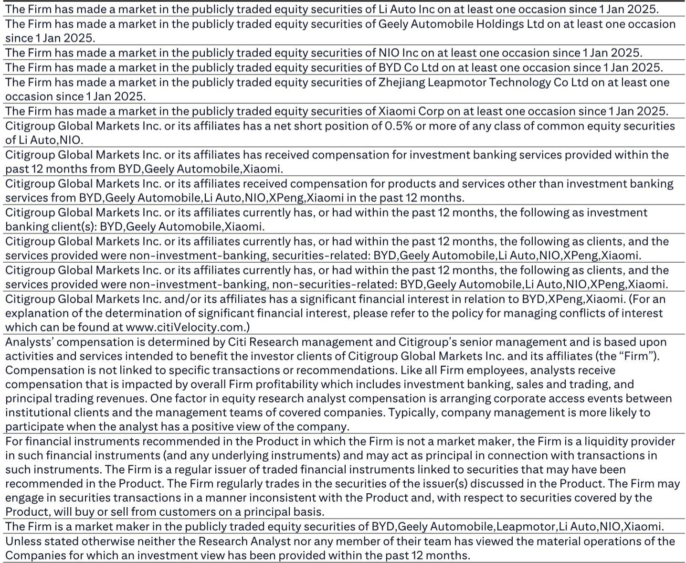
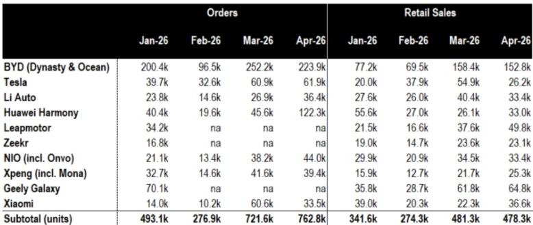
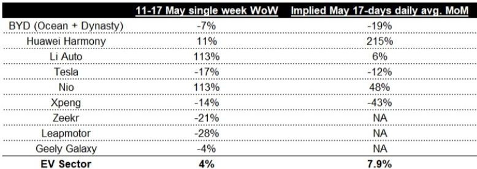

# 中国新能源车市正在经历的不是需求危机，而是品牌分化的加速器

5月中旬的周度订单数据，像一面棱镜，折射出中国新能源车市场一个被多数人低估的信号：行业整体beta正在走弱，但品牌间的分化已经大到足以重新定义竞争格局。

某外资投行在5月19日发布的周度追踪报告，用一份看似平淡的订单数据表，揭示了一个值得产业决策者和投资者认真对待的判断：5月前17天中国新能源车日均订单环比增长7.9%，但这不足以扭转beta的下行趋势。更关键的是，品牌间周环比和月环比表现的差距，已经分别扩大到56个百分点和87个百分点。

这不是一个需求塌陷的故事。这是一个“谁在结构性走强，谁在战术性挣扎，谁在库存压力下被动收缩”的叙事。而这份报告的核心价值，不在于它给出了多少预测，而在于它提供了一套用高频数据拆解品牌真实竞争力的观察框架。

## 1. 行业整体beta走弱，但真正的风险不是需求，而是库存和基数效应

5月前17天日均订单环比增长7.9%，这个数字看起来并不差。但报告指出，如果5月全月零售端也仅环比增长8%，那么对应的同比增速将是负8%。换句话说，当前的需求恢复速度，仅仅是在低基数上的温和修复，远谈不上强劲。

更值得关注的信号来自库存端。报告虽然没有给出具体的库存数字，但明确提到了“库存担忧”是beta走弱的三个原因之一。结合4月底的库存估算，以及5月以来多数品牌订单持续走弱的趋势，可以推断：行业整体正在进入一个“主动去库存”的阶段。

这意味着什么？对于投资者而言，未来几个月的销量数据，可能更多反映的是渠道去库存的节奏，而非终端真实需求的强弱。对于企业而言，谁能在库存压力下维持健康的订单-销售比，谁就掌握了定价权和渠道信心。

报告给出的4月订单-销售比数据，恰好提供了这个维度的参照。行业整体比率为1.59倍，同比提升10%，环比提升6%。这个比率本身不算差，但关键在于：5月是传统的下行周期起点，去年5月行业就已进入下行通道，因此今年5月即使订单-销售比同比改善，也可能只是“矮子里拔将军”，并不构成趋势反转的信号。

## 2. 比亚迪的周订单环比下降7%，暴露的不是短期波动，而是增长引擎切换的阵痛

比亚迪无疑是这份报告中最值得拆解的对象。仅看“海洋+王朝”双网数据，其5月第二周订单环比下降7%，前17天日均订单环比下降19%。两者均跑输行业整体表现。

这个数据有多严重？需要放在比亚迪自身的增长逻辑中理解。过去两年，比亚迪的增长主要靠规模扩张和产品线覆盖。但当渗透率已经超过50%之后，规模扩张的边际效益正在递减。报告提到的“出口增长可能帮助捍卫二季度盈利”，恰恰说明了一个关键问题：国内市场的增长动能正在放缓，比亚迪正在被迫将增长引擎切换至海外。

但出口能否完全对冲国内增速放缓？报告没有给出明确结论，这里仍需验证。一个值得关注的角度是：比亚迪4月的订单-销售比为1.47倍，同比下降8%，低于行业平均水平。这意味着比亚迪的订单储备正在消耗，未来几个月的零售交付可能面临压力。

对于投资者而言，比亚迪的下行风险不在于需求消失，而在于市场尚未充分定价其国内增长放缓和库存压力。报告指出，比亚迪的二季度财报要到8月底才发布，这意味着未来三个月，市场可能要在信息不透明的情况下消化这些高频信号。

## 3. 理想汽车周订单环比暴增113%，但月环比仅6%，新车型的“脉冲效应”需要时间验证

理想的周订单数据看起来非常亮眼：5月第二周环比增长113%，达到1.34万辆。但仔细看月环比数据，前17天日均订单环比仅增长6%。这个反差说明了什么？

答案在于新车型L9的订单贡献。理想在5月第二周集中释放了L9的订单，造成了周度数据的脉冲式增长。但月环比数据表明，剔除这一脉冲后，理想的整体订单增长其实相当温和。

报告对此的表述非常克制：“在纳入新L9订单后，理想的月环比增长6%，在现阶段提供二季度利润率趋势的可见度有限。”这句话的潜台词是：理想的利润率能否改善，取决于L9的订单能否持续、以及高毛利车型的占比能否提升。如果L9的订单只是短期脉冲，那么理想的利润率改善可能无法持续到二季度末。

对于产业观察者而言，理想的案例提供了一个重要的分析框架：在评估一家车企的订单数据时，必须区分“产品周期驱动的结构性增长”和“促销/新车型发布的脉冲式增长”。前者可以支撑估值，后者则可能带来预期差。

## 4. 蔚来是唯一在周环比和月环比上同时显著跑赢的品牌，但其“游戏规则改变者”地位仍需验证

在所有品牌中，蔚来的表现最为突出：5月第二周订单环比增长113%，前17天日均订单环比增长48%。报告在“进一步阅读”部分明确指出，蔚来在二季度利润率可见度上优于比亚迪、理想、小鹏和零跑，并给出了“买入”评级。

这背后是蔚来新车型周期的驱动。但报告也提出了一个关键问题：蔚来能否将订单增长转化为可持续的利润率改善？报告用“A ST Game Changer”来形容蔚来，直译是“短期游戏规则改变者”。这个表述本身就暗示了不确定性：蔚来的改变是结构性的，还是阶段性的？

这里仍需验证的两个关键点：一是蔚来的订单-销售比为1.32倍，虽然环比改善19%，但绝对水平在行业中并不算高；二是蔚来的销量基数较低，高环比增长能否持续，取决于其产能爬坡和渠道扩张的速度。

对于投资者而言，蔚来的短期趋势是清晰的，但长期竞争地位的判断，需要更多关于其成本结构、毛利率和现金流的数据。这份报告没有完全展开这些维度，但其提供的订单数据，已经为后续判断提供了高频的验证工具。

## 5. 小鹏和特斯拉的月环比均录得负增长，但两者的底层逻辑完全不同

小鹏和特斯拉在5月前17天的日均订单环比分别下降43%和12%。表面上看，两者都在走弱，但背后的原因截然不同。

小鹏的下滑，更多是产品周期空窗期的体现。小鹏的订单-销售比为1.56倍，同比提升42%，说明其订单储备相对健康。但问题在于，新车型Mona的订单贡献似乎正在衰减，而下一款新车的上市时间表尚未明确。小鹏面临的核心挑战是：如何在产品空窗期维持订单的稳定性。

特斯拉的下滑，则更多是结构性因素。特斯拉的订单-销售比在4月达到2.36倍，同比提升66%，但这更多是价格调整带来的短期效应。特斯拉在中国市场面临的真正挑战是：随着本土品牌在产品力和智能化上的追赶，其品牌溢价正在被压缩。12%的月环比下降，反映的是需求端的边际走弱，而非供给端的问题。

对于产业决策者而言，这两个案例提供了不同的启示：小鹏需要解决的是产品节奏问题，特斯拉需要面对的是竞争格局的变化。两者的问题性质和解决方案完全不同，不能简单归因于“需求疲软”。

## 6. 报告尚未完全回答的关键问题：品牌分化的可持续性，以及库存压力的真实规模

这份报告的价值，在于用高频数据揭示了品牌分化的现状。但它也留下了一些尚未完全回答的问题。

第一个问题是：品牌分化的趋势能否持续？蔚来的高增长、比亚迪的走弱、理想的脉冲式反弹，这些是结构性趋势还是短期波动？答案取决于每个品牌的产能、渠道、成本和产品规划。报告没有给出这些维度的完整分析，但提供了继续跟踪的框架。

第二个问题是：库存压力的真实规模有多大？报告提到了库存担忧，但没有给出具体的库存天数或库存深度数据。对于投资者而言，库存是判断企业未来几个月销量和价格策略的关键变量。如果库存过高，企业可能被迫降价去库存，进而压缩利润。如果库存可控，企业则可以在需求疲软时维持价格稳定。

第三个问题是：订单-销售比这个指标本身，在不同品牌之间的可比性有多强？订单-销售比受订单确认周期、渠道模式、促销活动等多种因素影响。报告没有讨论这些差异，但其隐含的判断是：这个指标在品牌间横向对比时，需要结合具体商业模式进行解读。

正是这些未解问题，构成了继续阅读完整报告、以及在社群中持续讨论的价值。高频数据的意义，不在于给出一次性答案，而在于提供一个持续验证和修正判断的工具。

---

Personal reading notes and learning share only. Not investment advice.

