# Pacific Positioning

# Dividing the crowd

# Large performance spread within “Crowded” stocks

Contrary to popular opinion, some crowded stocks can continue outperforming despite being well held by investors. In the last 12 months, “Crowded Positives” (well-owned stocks + Positive Triple Momentum) outperformed “Crowded Negatives” (well-owned stocks + Negative Triple Momentum) by 36.0%. The latest screen of Crowded Positives includes TSMC, MediaTek, BeOne Medicine-ADR, WinWay Tech, and Taiwan Union. “Crowded Negatives” include Bharti (Airtel), Infosys, Hub24, NextDC, and Faraday Tech.

# Active funds sold China and Korea in April

As the MSCI Asia Pac ex-Japan Index rallied 15% in April, long-only funds globally bought shares in Australia (+\$3.8bn) and India (+\$2.9bn) but sold shares in China (-\$39.7bn) and Korea (-\$13.6bn). By sector in Asia, long-only funds bought the most shares in Energy (+\$1.4bn) and Materials (+\$0.9bn), while selling Semis (-\$26.2bn). By stock, funds bought shares in Suzhou Dongshan, Bharti (Airtel), Zhongji Innolight, and China CSSC. In contrast, funds sold shares in SK Hynix, TSMC, Samsung Electronics, and CATL.

# Funds remain most overweight Taiwan and Korea

Funds remain most overweight Taiwan and Korea, and underweight India and Australia. By sector, funds are most overweight Semis, Tech Hardware, and Consumer Discretionary, and most underweight Banks, Energy, and Diversified Financials.

Chart 1: Asia Positioning + Triple Momentum relative performance: Last 12-months   
In the last year, Crowded Positives outperformed, Under-owned Negatives underperformed   
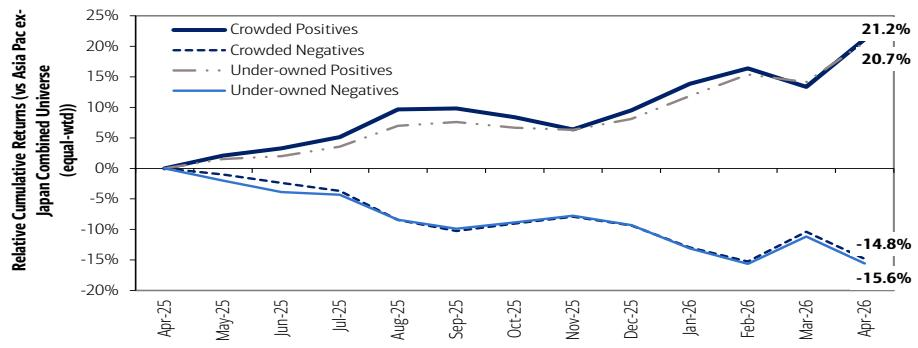

line

| Month   | Crowded Positives | Crowded Negatives | Under-owned Positives | Under-owned Negatives |
|---------|-------------------|-------------------|----------------------|-----------------------|
| Apr-26  | 21.2%             | -14.8%            | 20.7%                | -15.6%                |

Source : BofA Asia Pac Quantitative Strategy, MSCI, FTSE, FactSet, Bloomberg, 13F Filings, Benchmark Indices, Country Stock Exchanges Performance is shown relative to the average performance of stocks in the analysis with Ownership, Active Exposure, and Triple Momentum Ranks.

BofA GLOBAL RESEARCH

Trading ideas and investment strategies discussed herein may give rise to significant risk and are not suitable for all investors. Investors should have experience in relevant markets and the financial resources to absorb any losses arising from applying these ideas or strategies.

>> Employed by a non-US affiliate of BofAS and is not registered/qualified as a research analyst under the FINRA rules.

Refer to "Other Important Disclosures" for information on certain BofA entities that take responsibility for the information herein in particular jurisdictions.

BofA does and seeks to do business with issuers covered in its research reports. As a result, investors should be aware that the firm may have a conflict of interest that could affect the objectivity of this report. Investors should consider this report as only a single factor in making their investment decision.

Refer to important disclosures on page 75 to 77.

12976301

# 21 May 2026

Quant Strategy

Asia Pacific

BofA

Data

Analytics

Nigel Tupper >>

Quant Strategist

BofA (Australia)

+61 2 9226 5735

nigel.tupper@bofa.com

Amar Vashi >>

Quant Strategist

BofA (Australia)

amar.vashi@bofa.com

Sumuhan Shanmugalingam >>

Quant Strategist

BofA (Australia)

sumuhan.shanmugalingam@bofa.com

Unless otherwise noted all links on the front page of this report refer to sections in this research report.

# Executive Summary

Crowded Positives Screen

Crowded Negatives Screen

Under-owned Negatives Screen

Under-owned Positives Screen

Equity Flow

■ Active Exposures (over/underweights)

■ Stock Charts (Australia, China, India, Korea, Singapore, Taiwan)

Performance Overview

# Contents

Executive Summary 5

Active Exposure – Positioning versus Benchmark 5

Equity Flow – Long-only Funds 6

Fund Ownership 7

Combining Fund Ownership & Active Exposure 7

Four Stock Screens 8

Stock Positioning Charts 9

Methodology changes versus previous version of this analysis 9

Methodology 10

Funds included in this Analysis 10

Stocks included in this Analysis 12

Relative Weight versus Benchmark 12

Data Sources 12

Construction Methodology 13

Performance Calculation Methodology 15

Limitations 15

Four Stock Screens 17

Crowded Positives - Stock Screen 18

Under-owned Positives - Stock Screen 18

Crowded Negatives - Stock Screen 19

Under-owned Negatives - Stock Screen 19

Equity Flow - Long-Only 20

Countries – Equity Flow 20

Asia Pac ex-Japan Sectors – Equity Flow 23

Country-Sectors – Equity Flow 25

Asia Pac ex-Japan Stocks – Equity Flow 27

Positioning versus Benchmark - Active Long-Only 28

Countries - Positioning versus benchmark 28

Asia Pac ex-Japan Sectors - Positioning versus benchmark 31

Asia Pac ex-Japan Stocks – Positioning versus Benchmark 35

Stock Positioning Charts 37

Australia 37

China 41

India 45

South Korea 49

Singapore 53

Taiwan 57

Performance Overview 61

Positioning and Triple Momentum Performance 61

Back-testing Results 65

Appendix A: Positioning and Triple Momentum Performance Summary 67

Global Quant Publications 73

# Notice to Readers:

The various screens identified in this report are intended to be indicative metrics only and may not be used for reference purposes or as a measure of performance for any financial instrument or contract, or otherwise relied upon by third parties for any other purpose, without the prior written consent of BofA Global Research. These screens were not created to act as a benchmark.

The screens in this report are not a recommended list either individually or as a group of stocks. Investors should consider the fundamentals of the companies and their own individual circumstances/objectives before making any investment decisions.

Triple Momentum is intended to be an indicative metric only and may not be used for reference purposes or as a measure of performance for any financial instrument or contract, or otherwise relied upon by third parties for any other purpose, without the prior written consent of BofA Global Research. Triple Momentum was not created to act as a benchmark.

Some of the analysis as described in this report is back-tested and does not represent the actual performance of any account or fund. Back-tested performance depicts the hypothetical back-tested performance of a particular strategy over the time period indicated. In future periods, market and economic conditions will differ and the same strategy will not necessarily produce the same results. No representation is being made that any actual portfolio is likely to have achieved returns similar to those shown herein. In fact, there are frequently sharp differences between back-tested returns and the actual results realized in the actual management of a portfolio. Back-tested performance results are created by applying an investment strategy or methodology to historical data and attempts to give an indication as to how a strategy might have performed during a certain period in the past if the product had been in existence during such time. Back-tested results have inherent limitations including the fact that they are calculated with the full benefit of hindsight, which allows the security selection methodology to be adjusted to maximize the returns. Further, the results shown do not reflect actual trading or the impact that material economic and market factors might have had on a portfolio manager's decision-making under actual circumstances. Back-tested returns do not reflect advisory fees, trading costs, or other fees or expenses.

This report includes factors for informational or descriptive purposes, and inclusion here is not equivalent to a recommendation of the factor or portfolio.

All data in the report is as of 30-Apr-2026 unless stated otherwise.

# Executive Summary

This report includes analysis on the following topics:

• Active Exposure - Positioning versus Benchmark   
• Equity Flow - Long-only funds   
• Fund Ownership – Proportion of funds owning a stock   
• Combining Fund Ownership & Active Exposure   
• Four Stock Screens   
• Stock Positioning Charts   
- Back-testing   
• Methodology changes versus previous version of this analysis

# Active Exposure – Positioning versus Benchmark

# Long-only funds' declared portfolio holdings versus benchmark

Each month we analyze the declared portfolio holdings of large active long-only funds globally that invest in Asia equities or Asia stocks are in their benchmark. Funds are included in the analysis if (i) they manage more than US\$500m in equities, (ii) declare portfolio holdings on a regular basis, (iii) we can identify the benchmark of these funds, and (iv) we have access to the constituents of the benchmark. We review the funds included in the analysis annually. This analysis currently includes more than 4581 active long-only funds managing more than US\$2.8 trillion in equities. We identify the benchmark of each fund, and there are more than 637 unique benchmarks across the funds in this analysis.

To find the active exposure for each fund, we compare the stock holdings versus the specific benchmark disclosed by the relevant fund to establish relative overweight and underweight stock positions (“Relative Weight”). The relative positions are weighted by the dollar value of the relative positions to calculate AUM-weighted relative weight. We aggregate the US dollar-weighted overweight and underweight positions by stock, sector, country, and region in order to monitor how funds’ active exposures against the benchmarks change through time.

The chart below is an example of Active long-only funds' relative weight for a stock.

Chart 2: Stock A - Long-only Funds Active Exposure (Relative Weight %) vs identified Benchmarks   
Active Long-only funds have been persistently overweight   
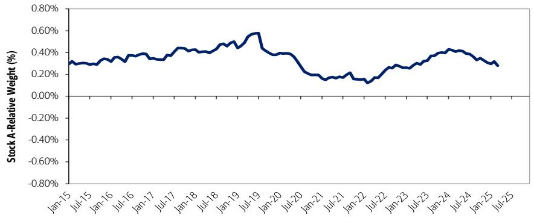

line

| Date    | Stock A-Relative Weight (%) |
|---------|----------------------------|
| Jan-15  | 0.30%                      |
| Jul-15  | 0.32%                      |
| Jan-16  | 0.34%                      |
| Jul-16  | 0.36%                      |
| Jan-17  | 0.38%                      |
| Jul-17  | 0.40%                      |
| Jan-18  | 0.42%                      |
| Jul-18  | 0.44%                      |
| Jan-19  | 0.46%                      |
| Jul-19  | 0.58%                      |
| Jan-20  | 0.40%                      |
| Jul-20  | 0.35%                      |
| Jan-21  | 0.20%                      |
| Jul-21  | 0.15%                      |
| Jan-22  | 0.10%                      |
| Jul-22  | 0.25%                      |
| Jan-23  | 0.30%                      |
| Jul-23  | 0.35%                      |
| Jan-24  | 0.40%                      |
| Jul-24  | 0.42%                      |
| Jan-25  | 0.35%                      |
| Jul-25  | 0.30%                      |

Source: BofA Global Quantitative Strategy, MSCI, FTSE, Factset, Bloomberg, 13F Filings, Benchmark Indices, Country Stock Exchanges
BofA GLOBAL RESEARCH

# Equity Flow -Long-only Funds

# Value of shares bought and sold by long-only funds

In addition to monitoring Active Exposure versus benchmark, we also calculate the value of the shares that long-only funds (active and passive) have bought and sold each month. Each month, we calculate the change in the number of every share held in each portfolio and disclosed by the relevant long-only fund, and multiple this by the respective Volume Weighted Average Price (VWAP) for the month. We believe VWAP is a reasonable approximation of the price at which funds may have bought and sold stocks during the month. It’s worth noting the Active Exposure versus benchmark can be impacted by 1) changes to stock holdings, but also 2) changes to benchmark weights, and 3) the performance of stocks (e.g. an underweight position increases in magnitude if a stock outperforms even if no shares were sold).

Client have consistently asked for information on what funds are buying and selling. To address this question we introduce the Equity Flow analysis. We believe Equity Flow effectively determines the contribution to the change in the active exposure from funds buying and selling shares. We aggregate the US dollar value of the change in the declared portfolio holdings by stock, sector, country, and region. The chart below is an example of the value of Active long-only funds' cumulative buying and selling in aggregate for all listed China stocks.

Chart 3: Aggregate Cumulative Long-only Equity Flow   
China Cumulative Long-only Equity Flow   
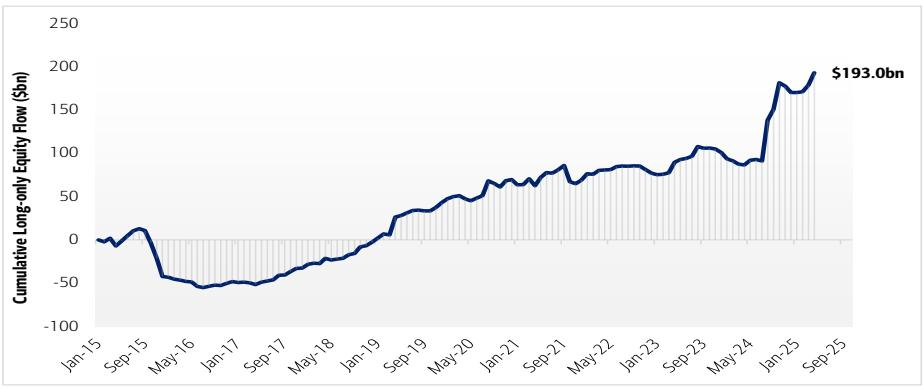

line

| Date    | Cumulative Long-only Equity Flow ($bn) |
|---------|----------------------------------------|
| Sep-25  | 193.0                                  |

Source: BofA Global Quantitative Strategy, MSCI, FTSE, FactSet, Bloomberg, 13F Filings, Benchmark Indices, Country Stock Exchanges
BofA GLOBAL RESEARCH

Chart 4: APxJ Long-only Active and Passive Funds Cumulative Equity Flow (\$bn)   
Long-only funds have been consistently buying Passive Funds and selling shares in Active Funds   
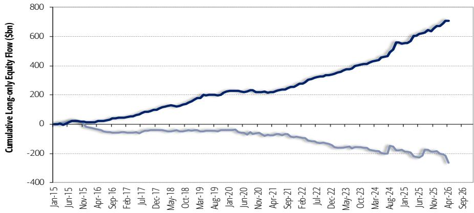

line

| Date    | Cumulative Long-only Equity Flow ($bn) |
|---------|----------------------------------------|
| Jan-15  | 0                                      |
| Jun-15  | 0                                      |
| Nov-15  | 0                                      |
| Apr-16  | 0                                      |
| Sep-16  | 0                                      |
| Feb-17  | 0                                      |
| Jul-17  | 0                                      |
| Dec-17  | 0                                      |
| May-18  | 0                                      |
| Oct-18  | 0                                      |
| Mar-19  | 0                                      |
| Aug-19  | 0                                      |
| Jan-20  | 0                                      |
| Jun-20  | 0                                      |
| Nov-20  | 0                                      |
| Apr-21  | 0                                      |
| Sep-21  | 0                                      |
| Feb-22  | 0                                      |
| Jul-22  | 0                                      |
| Dec-22  | 0                                      |
| May-23  | 0                                      |
| Oct-23  | 0                                      |
| Mar-24  | 0                                      |
| Aug-24  | 0                                      |
| Jan-25  | 0                                      |
| Jun-25  | 0                                      |
| Nov-25  | 0                                      |
| Apr-26  | 0                                      |
| Sep-26  | 0                                      |

Source : BofA Asia Pac Quantitative Strategy, MSCI, FTSE, FactSet, Bloomberg, 13F Filings, Benchmark Indices, Country Stock Exchanges   
BofA GLOBAL RESEARCH

# Fund Ownership

For each stock in the analysis, every month we calculate “Fund Ownership” as the proportion of relevant Active Long-only funds that own a stock (e.g. 73% of relevant funds own Stock B) at the end of each month. A relevant fund is one for which the stock is included in the fund’s benchmark, or the fund owns the stock even if it is not in the benchmark. For example, if the total number of funds in the analysis is 1000, but a certain stock is only in the benchmark of 180 funds, and 150 funds in total own the stock, of which 20 funds own the stock even though it is not in the benchmark of that fund, then Fund Ownership is 75% (150 / (180 +20)).

The example chart below shows the proportion of Active long-only funds in the analysis that own Stock A.

Chart 5: Stock B: Fund Ownership = Proportion of Active Long-only Funds holding the stock   
Fund Ownership of Stock B has increased through time and is now at all-time high   
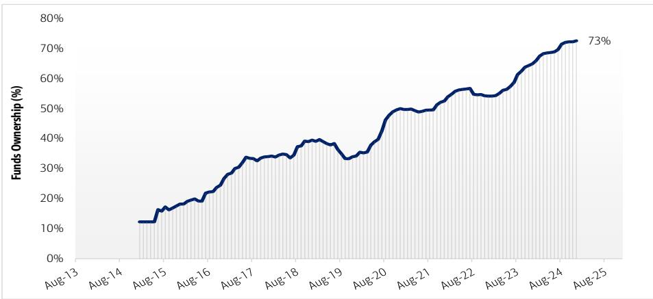

line

| Date   | Funds Ownership (%) |
|--------|---------------------|
| Aug-25 | 73%                 |

Source: BofA Global Quantitative Strategy, MSCI, FTSE, FactSet, 13F Filings, Benchmark Indices, Country Stock Exchanges   
BofA GLOBAL RESEARCH

# Combining Fund Ownership & Active Exposure

# Combining fund ownership levels and relative weight

We illustrate in quadrant charts (Chart 5) which stocks have various combinations of 1)

Above/Below-median Fund Ownership, and 2) Active Exposure

(Overweight/Underweight):

- Above-median Fund Ownership ("High Fund Ownership") + Overweight   
- Above-median Fund Ownership ("High Fund Ownership") + Underweight   
Below-median Fund Ownership ("Low Fund Ownership") + Overweight   
• Below-median Fund Ownership ("Low Fund Ownership") + Underweight

# Four Stock Screens

# Positioning (Fund Ownership + Active Exposure) + Catalyst (Triple Momentum)

While many investors often aim to do the opposite of what everyone else is doing, it is not necessarily a successful strategy to always be contrarian. Our analysis shows that stocks that have high ownership and are overweight can outperform for years if a stock's fundamentals remain relatively attractive. Therefore, we believe the challenge for investors is to differentiate between crowded trades with a positive catalyst and crowded trades with a negative catalyst. Similarly, there is an opportunity to identify under-owned stocks which have a positive catalyst and under-owned stocks with a negative catalyst.

Our Triple Momentum analysis combines earnings, price, and news momentum to determine when a stock is in vogue or not in vogue, and is useful for identifying stocks with catalysts for a potential change (positive or negative) in subsequent performance. Methodology for Triple Momentum is detailed in “Triple Momentum Allocator” report.

We therefore combined the analysis we introduced above with our Triple Momentum Strategy to create the Four Stock Screens. These are:

• Crowded Positives (Consensus)   
High Fund Ownership + Overweight + Positive Triple Momentum   
• Crowded Negatives (Contrarian)   
High Fund Ownership + Underweight + Negative Triple Momentum   
• Under-owned Positives (Contrarian)   
Low Fund Ownership + Overweight + Positive Triple Momentum   
• Under-owned Negatives (Consensus)   
Low Fund Ownership + Underweight + Negative Triple Momentum

# Chart 6: Concept: Positioning and Triple Momentum Quadrants

The Positioning and Triple Momentum Quadrant charts illustrate combinations of 1) fund ownership (Y-axis), 2) active exposure (X-axis), and 3) Triple Momentum (colour)

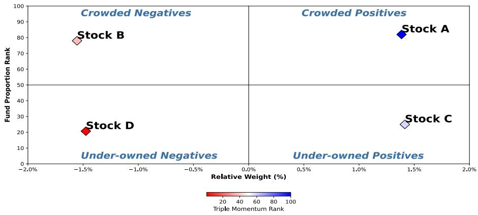

scatter

| Stock    | Fund Proportion Rank | Triple Momentum Rank |
| -------- | -------------------- | -------------------- |
| Stock A  | 90                   | 1.5                  |
| Stock B  | 75                   | -1.5                 |
| Stock C  | 30                   | 1.5                  |
| Stock D  | 20                   | -1.5                 |

Source: BofA Global Quantitative Strategy   
BofA GLOBAL RESEARCH

The three components included in this analysis are Fund Ownership, Active Exposure (Relative Weight), and Triple Momentum. Refer to the Appendix A for back-testing of each of the three components separately, and the eight combinations of High and Low Fund Ownership, Active Exposure (Overweight/Underweight), and Positive and Negative Triple Momentum.

# Stock Positioning Charts

The “Stock Positioning Charts” section of this report includes charts for six Most Important Stocks for each covered country (Australia, China, India, Korea, Singapore, Taiwan). Importance is determined by multiplying the market cap of the stock by the standard deviation of the relative return of the stocks versus the MSCI AC World Index over the preceding ten years.

For each of the six Most Important Stocks in every country, two charts are included:

# • Cumulative Equity Flow chart

The cumulative value of the net shares bought and sold by Long-only funds

# - Positioning

1) Fund Ownership = Proportion of Active long-only funds holding the stock, and   
2) Active exposure = Relative Weight versus Benchmark

# Methodology changes versus previous version of this analysis

We have been publishing “Pacific Positioning” since October 2013. In this modified version of Pacific Positioning, we still monitor how active long-only funds are positioned versus benchmark but have included new analysis based on client feedback. “Equity Flow” focuses on the value of the stocks that are bought and sold by funds each month. We have also back-tested the performance of four stock screens which combine positioning data with Triple Momentum to highlight which crowded positions have positive catalysts and which have negative catalysts. Similarly, we screen for under-owned stocks with negative momentum and under-owned stocks with positive momentum.

Changes to the analysis in June-2025 are summarized below.

# Previous version: November 2015 to May 2025

• Funds Included = Active + Passive   
- Focus on Active Exposure = overweights / underweights (equal-weighted across all funds, and also weighted by the dollar value of the positions)   
• Performance of overweights / underweights   
• Included hundreds of charts = stocks, sectors, countries, regions

# New version: June 2025 onwards

• Active Exposures = Active Long-only Funds (excludes Passive), overweights and underweights weighted by AUM (the dollar value of the positions)   
• Equity Flow = Active + Passive, Value of shares funds buy and sell each month   
• Combine Positioning (Fund Ownership, Active Exposures) with Triple Momentum   
• Four stock screens with back-tested performance   
• Charts showing key conclusions with a focus on the Most Important stocks.

The conclusions from the previous version of “Pacific Positioning” are available on request.

# Methodology

# Funds included in this Analysis

We include funds in this analysis if 1) the value of the fund is at least US\$500m in equities, 2) the fund declares portfolio holdings on a regular basis, and 3) we can identify the benchmark of the fund and we have access to the constituents of the benchmark, 4) funds either invest in Asia stocks or they are part of any of their benchmarks. We update the list of funds included in the analysis annually. If a fund's declared portfolio holdings are more than 12 months old at any month-end, we omit the fund from the analysis from the calculations at that month-end. The most common “age” of portfolio holdings is 2-3 months, and is dependent on the timing of data availability and when our calculations are performed. To provide a more recent snapshot of the value of the fund managers' equity holdings, we have marked-to-market the holdings using the most recent month-end prices. The monthly analysis does not reflect any changes, other than re-pricing in portfolio holdings after the filing dates. The analysis of Active Exposures includes long-only fund holdings (including passive) relative to benchmark but excludes Passive funds because their holdings tend to mirror the benchmark so their Active Exposures are close to zero. The Equity Flow analysis includes data for both Active and Passive funds because assets under management (AUM) has fallen for Active Long-only Funds but increased for Passive funds over the period of the analysis, so including both types of funds is important for capturing a broad measure of equity flow.

Table 1: Positioning - Long-only Funds Summary Stats

Asia Pac ex-Japan long-only funds and benchmarks positioning summary

<table><tr><td>Total Funds</td><td>Characteristics</td></tr><tr><td>Number of Funds</td><td>4,997</td></tr><tr><td>Total Value (Equities) of Long-only Funds ($US millions)</td><td>4,205,349</td></tr><tr><td>Unique Benchmarks</td><td>668</td></tr></table>

<table><tr><td>Total Active Funds</td><td>Characteristics</td></tr><tr><td>Number of Funds</td><td>4,010</td></tr><tr><td>Total Value (Equities) of Active Long-only Funds ($US millions)</td><td>2,308,736</td></tr><tr><td>Unique Benchmarks</td><td>482</td></tr></table>

<table><tr><td>Total Passive Funds</td><td>Characteristics</td></tr><tr><td>Number of Funds</td><td>987</td></tr><tr><td>Total Value (Equities) of Passive Long-only Funds ($US millions)</td><td>1,896,612</td></tr><tr><td>Unique Benchmarks</td><td>284</td></tr></table>

Source : BofA Asia Pac Quantitative Strategy, MSCI, FTSE, FactSet, Bloomberg, 13F Filings, Benchmark Indices, Country Stock Exchanges. BofA GLOBAL RESEARCH

# Chart 7: APxJ Long-only Active and Passive Funds Total Assets Under Management (AUM) (2015 to 2025)

Total Assets Under Management (AUM) for Active funds is close to \$20.0 trillion

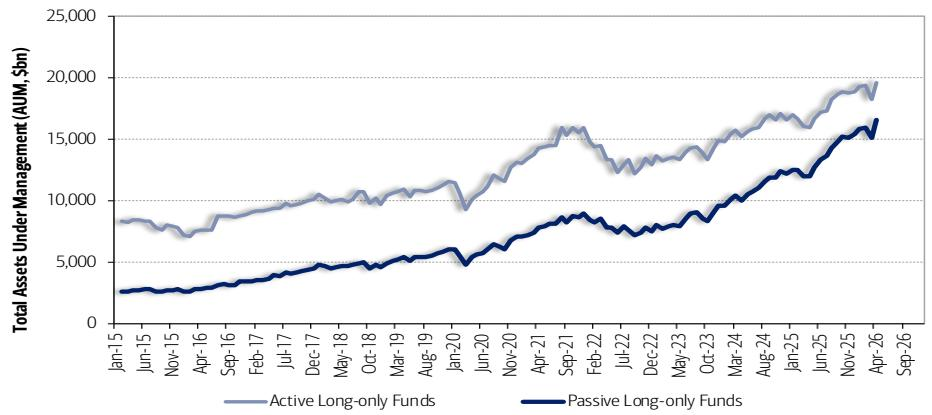

line

| Date    | Active Long-only Funds | Passive Long-only Funds |
|---------|------------------------|-------------------------|
| Jan-15  | ~8,000                 | ~2,500                  |
| Jun-15  | ~7,500                 | ~2,700                  |
| Nov-15  | ~7,000                 | ~3,000                  |
| Apr-16  | ~8,000                 | ~3,500                  |
| Sep-16  | ~9,000                 | ~4,000                  |
| Feb-17  | ~9,500                 | ~4,500                  |
| Jul-17  | ~10,000                | ~5,000                  |
| Dec-17  | ~10,500                | ~5,500                  |
| May-18  | ~11,000                | ~6,000                  |
| Oct-18  | ~11,500                | ~6,500                  |
| Mar-19  | ~12,000                | ~7,000                  |
| Aug-19  | ~12,500                | ~7,500                  |
| Jan-20  | ~9,500                 | ~5,500                  |
| Jun-20  | ~12,000                | ~6,500                  |
| Nov-20  | ~13,000                | ~7,500                  |
| Apr-21  | ~15,500                | ~8,500                  |
| Sep-21  | ~16,500                | ~9,500                  |
| Feb-22  | ~14,500                | ~8,500                  |
| Jul-22  | ~13,500                | ~8,000                  |
| Dec-22  | ~14,500                | ~9,500                  |
| May-23  | ~15,500                | ~11,500                 |
| Oct-23  | ~16,500                | ~13,500                 |
| Mar-24  | ~17,500                | ~15,500                 |
| Aug-24  | ~18,500                | ~17,500                 |
| Jan-25  | ~19,500                | ~19,500                 |
| Jun-25  | ~20,500                | ~21,500                 |
| Nov-25  | ~21,500                | ~23,500                 |
| Apr-26  | ~22,500                | ~25,500                 |
| Sep-26  | ~23,500                | ~27,500                 |

Source : BofA Asia Pac Quantitative Strategy, MSCI, FTSE, FactSet, Bloomberg, 13F Filings, Benchmark Indices, Country Stock Exchanges   
BofA GLOBAL RESEARCH

# Table 2: Asia Pac ex-Japan Country Positioning Summary Stats

APxJ country funds and benchmarks positioning summary based on long-only active funds

<table><tr><td>Country</td><td>Funds Count</td><td>Total Value of Equities Under Management ($US millions)</td><td>Benchmarks Count</td></tr><tr><td>Australia</td><td>2,388</td><td>126,879</td><td>268</td></tr><tr><td>China</td><td>2,480</td><td>535,039</td><td>352</td></tr><tr><td>Hong Kong</td><td>3,491</td><td>96,319</td><td>376</td></tr><tr><td>India</td><td>1,262</td><td>493,236</td><td>203</td></tr><tr><td>Indonesia</td><td>941</td><td>16,177</td><td>126</td></tr><tr><td>Korea</td><td>1,766</td><td>372,989</td><td>222</td></tr><tr><td>Malaysia</td><td>914</td><td>9,239</td><td>124</td></tr><tr><td>New Zealand</td><td>1,253</td><td>5,410</td><td>191</td></tr><tr><td>Philippines</td><td>893</td><td>5,791</td><td>119</td></tr><tr><td>Singapore</td><td>2,131</td><td>54,998</td><td>255</td></tr><tr><td>Taiwan</td><td>1,708</td><td>560,664</td><td>229</td></tr><tr><td>Thailand</td><td>969</td><td>31,945</td><td>146</td></tr></table>

Source : BofA Asia Pac Quantitative Strategy, MSCI, FTSE, FactSet, Bloomberg, 13F Filings, Benchmark Indices, Country Stock Exchanges   
BofA GLOBAL RESEARCH

# Stocks included in this Analysis

The stocks included in this analysis are constituents of the MSCI Asia Pac ex-Japan index as at each month-end. For each region included in the MSCI Asia Pac ex-Japan index, we also include listed stocks not included in the MSCI Asia Pac ex-Japan Index but which have average daily turnover greater than \$5m. We do this to include non-index stocks that global investors often include in their portfolios (for e.g. HSBC for Asian investors). We also include associated ADRs and GDRs with average daily turnover greater than \$5m. Stocks on the firm’s restricted list at the time of the month-end analysis are included in the aggregate country and sector calculations but we omit these stocks from the report.

# Relative Weight versus Benchmark

Each fund's stock portfolio weights are compared to the stock weights in that fund's own benchmark. The aggregate active exposure is calculated by weighting each position by the dollar value of the positions across all funds in the analysis.

# Data Sources

Sources for this analysis include IBES, RavenPack, Benchmark Indices, Bloomberg, 13F, 13G, 13D, Registration filings (S-1, S-2, S-3), Proxy, 10-K, Insider filings (Forms 3, 4, 5), N-30D, N-Q mutual fund holdings, annual reports, and country specific authorities as collated by FactSet.

# Construction Methodology

The back-testing in this analysis is from Jan-15 to Apr-25.

In this analysis, we have back-tested various combinations of 1) Fund Ownership, 2) Active Exposure (Relative Weight), and 3) Triple Momentum to show how each combination would have performed over the testing period.

For each stock in the analysis, each month we calculate a percentile “Factor Rank” from 1 (low) to 100 (high) for Fund Ownership, Relative Weight, and Triple Momentum.

Fund Ownership: The proportion of relevant funds that own a stock, where a relevant fund is one for which the stock is included in the fund's benchmark, or the fund owns the stock even if it is not in the benchmark.

Active Exposure (Relative Weight): In each fund, the active exposure is calculated as the stock weight in the funds minus the stock weight in the benchmark of the fund. For each stock, the Relative Weight is the US dollar-weighted (AUM-weighted) average of all Active exposures across all funds in the analysis.

Triple Momentum is an amalgamation of Earnings Momentum, Price Momentum and News Momentum. Earnings Momentum is defined as the three-month change in the consensus EPS estimate for each stock. Price Momentum is defined as the slope of the log-linear regression using daily prices over the preceding 12-months. News Momentum captures the trend in news sentiment based on Natural Language Processing analysis of news articles from the preceding 90 days.

The “Four Stock Screens” are determined at the end of each month using month-end data.

Crowded Positives: The “Crowded Positives Rank” for each stock is a percentile rank based on the average of the Fund Ownership Rank, Active Exposure (Relative Weight) Rank, and Triple Momentum Rank. The back-testing results for the Crowded Positives is based on the stocks in the top quintile (top 20%) by the Crowded Positives Rank. The Crowded Positives screen includes the 20 Most Important Stocks in the top quintile (top 20% of stocks) by the Crowded Positives Rank.

Crowded Negatives: The “Crowded Negatives Rank” for each stock is a percentile rank based on the average of the Fund Ownership Rank, 100 minus the Active Exposure (Relative Weight) Rank, and 100 minus the Triple Momentum Rank. The back-testing results for the Crowded Negatives is based on the stocks in the top quintile (top 20%) by the Crowded Negatives Rank. The Crowded Negatives screen includes the 20 Most Important Stocks in the top quintile (top 20% of stocks) by the Crowded Negatives Rank.

Under-owned Positives: The “Under-owned Positives Rank” for each stock is a percentile rank based on the average of 100 minus the Fund Ownership Rank, the Active Exposure (Relative Weight) Rank, and the Triple Momentum Rank. The back-testing results for the Under-owned Positives is based on the stocks in the top quintile (top 20%) by the Under-owned Positives Rank. The Under-owned Positives screen includes the 20 Most Important Stocks in the top quintile (top 20% of stocks) by the Under-owned Positives Rank.

Under-owned Negatives: The “Under-owned Negatives Rank” for each stock is a percentile rank based on the average of 100 minus the Fund Ownership Rank, 100 minus the Active Exposure (Relative Weight) Rank, and 100 minus the Triple Momentum Rank. The back-testing results for the Under-owned Negatives is based on the stocks in the top quintile (top 20%) by the Under-owned Negatives Rank. The Under-owned Negatives screen includes the 20 Most Important Stocks in the top quintile (top 20% of stocks) by the Under-owned Negatives Rank.

The three components included in this analysis are Fund Ownership, Active Exposure (Relative Weight), and Triple Momentum. Refer to the Appendix A for back-testing of each of the three components separately, and the eight combinations of high and low Fund Ownership, Active Exposure (Overweight/Underweight), and high and low Triple Momentum.

The “Four Stock Screens” act as stock screens and not as recommended stock portfolios. The screens are not a recommended list either individually or as a group of stocks. Investors should consider the fundamentals of the companies and their own individual circumstances/objectives before making any investment decisions.

Stocks in the firm's restricted list are not included in this analysis.

The “Four Stock Screens” are determined using data and closing prices corresponding to the market's close on the last business day of each month from MSCI, IBES, FactSet, and RavenPack databases.

We expect to publish these Four Stock Screens each month in this “Global Positioning in Stocks” report.

# Performance Calculation Methodology

Refer to appendix “Positioning and Triple Momentum Performance” for detailed performance data.

Rebalancing and back-tested performance calculations are conducted each month, using data and closing prices corresponding to the market's close on the last business day of each month. Back-tested performance is computed on the basis of price return. Performance of the Ownership and Active Exposure (Relative Weights) analysis is presented relative to the “Asia Pac ex-Japan Positioning Universe”, which is equal-weighted performance of the stocks in the analysis for which positioning data exists. Performance of the analysis which combines positioning and Triple Momentum analysis is presented relative to the “Asia Pac ex-Japan Combined Universe”, which is equal-weighted performance of the stocks in the analysis for which both positioning and Triple Momentum data exists. We have decided to use equal-weighted performance as it eliminates the possibility of a few very large stocks skewing the results. This is more important now than ever given a small number of stocks have been dominating market performance in recent years.

The analysis is back-tested and does not represent the actual performance of any account or fund. Back-tested performance depicts the hypothetical back-tested performance of a particular strategy over the time period indicated. In future periods, market and economic conditions will differ and the same strategy will not necessarily produce the same results. No representation is being made that any actual portfolio is likely to have achieved returns similar to those shown herein. In fact, there are frequently sharp differences between back-tested returns and the actual results realized in the actual management of a portfolio. Back-tested performance results are created by applying an investment strategy or methodology to historical data and attempts to give an indication as to how a strategy might have performed during a certain period in the past if the product had been in existence during such time. Back-tested results have inherent limitations including the fact that they are calculated with the full benefit of hindsight, which allows the security selection methodology to be adjusted to maximize the returns. Further, the results shown do not reflect actual trading or the impact that material economic and market factors might have had on a portfolio manager's decision-making under actual circumstances. Back-tested returns do not reflect advisory fees, trading costs, or other fees or expenses.

This report includes factors for informational or descriptive purposes, and inclusion here is not equivalent to a recommendation of the factor or portfolio.

Past performance is no guarantee of future results.

# Limitations

Below is a non-exhaustive list of the limitations this analysis:

- We use the most recent data available for each fund, excluding data that is more than 12 months old. The most common “age” of portfolio holdings is 2-3 months, and is dependent on the timing of data availability and when our calculations are performed. To provide a more recent snapshot of the value of the fund managers’ equity holdings, we have marked-to-market the holdings as of the most recent month-end. The report does not reflect any changes, other than re-pricing, in portfolio holdings after the filing dates. Any fund may have changed portfolio holdings since the last filing date.   
- The Equity Flow for each stock is calculated as the change in the number of shares held by the funds in the analysis multiplied by VWAP. Any particular fund's sale or purchase of a stock may have been at a different price from VWAP.   
- All calculations have been converted to a common currency (USD), so currency moves may impact results.

- We have used Triple Momentum to capture positive and negative catalysts. The signals from Triple Momentum may change quickly when sudden events such as trade war impact the price, earnings, and news of a stock.   
- This analysis does not include funds which do not declare portfolio holdings on a regular basis, or it is not possible to identify the benchmark of the fund, or we do not have access to the benchmark constituents of the benchmark. We review the fund constituents annually. This analysis does not include all investor positions including retail investors, funds managing less than US\$500m in AUM, Hedge Funds who typically do not regularly declare all long and short positions, Sovereign Wealth Funds, and more.   
- The Equity Flow calculation is based on the US dollar value of the change in the total share holdings of the funds included in this analysis. Therefore, Equity Flow may be negative if investors shift exposure from the funds in this analysis to other funds which are not included in this analysis.

# Four Stock Screens

Chart 8: Positioning and Triple Momentum Quadrants   
Crowded Positives include TSMC, MediaTek, and BeOne Medicine-ADR   
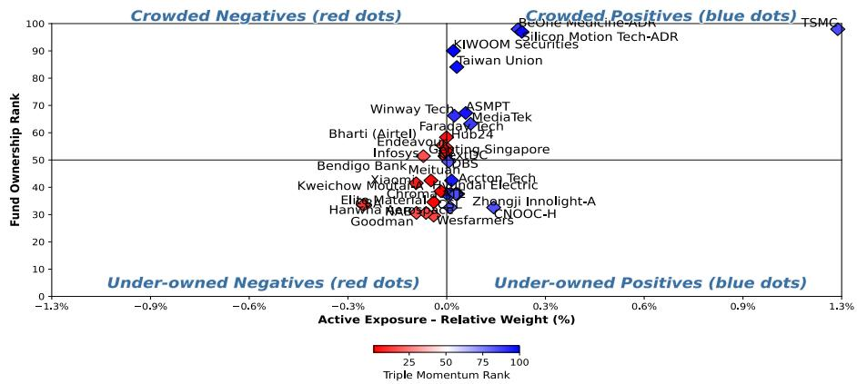

scatter

| Company | Fund Ownership Rank | Active Exposure - Relative Weight (%) | Triple Momentum Rank |
| --- | --- | --- | --- |
| TSMC | 100 | 1.3 | 100 |
| Biorec Medicine-ADR | 95 | 0.8 | 95 |
| Silicon Motion Tech-ADR | 90 | 0.7 | 90 |
| KIWOOM Securities | 85 | 0.6 | 85 |
| Taiwan Union | 80 | 0.5 | 80 |
| Winway Tech | 75 | 0.4 | 75 |
| MediaTek | 70 | 0.3 | 70 |
| Faraday Tech | 65 | 0.2 | 65 |
| Hdb24 | 60 | 0.1 | 60 |
| Endeavour Technologies Singapore | 55 | 0.0 | 55 |
| Infosys Technologies | 50 | -0.1 | 50 |
| OBC | 45 | -0.2 | 45 |
| Bendigo Bank Meitual Davis | 40 | -0.3 | 40 |
| Xiaomi Electronics | 35 | -0.4 | 35 |
| Accton Tech | 30 | -0.5 | 30 |
| Kweichow Material Corporation Electric | 25 | -0.6 | 25 |
| Chom Electronic Technology | 20 | -0.7 | 20 |
| Zhengji Innolight-A | 15 | -0.8 | 15 |
| Elika Materials Corporation | 10 | -0.9 | 10 |
| Hanwha Aerospace Engineering Corporation | 5 | -1.0 | 5 |
| CNOOC-H | 0 | -1.1 | 0 |
| Goodman & Wesoformers | -5 | -1.2 | -5 |
| Other Companies (Red Dots) vs. Under-owned Positives (Blue Dots) vs. Under-owned Negatives (Red Dots)

Source : BofA Asia Pac Quantitative Strategy, MSCI, FTSE, FactSet, Bloomberg, 13F Filings, Benchmark Indices, Country Stock Exchanges   
BofA GLOBAL RESEARCH

Our back-testing (from Jan-15 to Apr-25) showed the consensus screens would have performed better than the contrarian screens:

• Crowded Positives would have performed better than Under-owned Positives   
• Under-owned Negatives would have performed better than Crowded Negatives

Chart 9: Asia Pac ex-Japan Stock Positioning and Triple Momentum: Relative Cumulative Performance   
Crowded Positives stocks have outperformed the Asia Pac ex-Japan Combined Universe by +5.9% since Jan-15, on average   
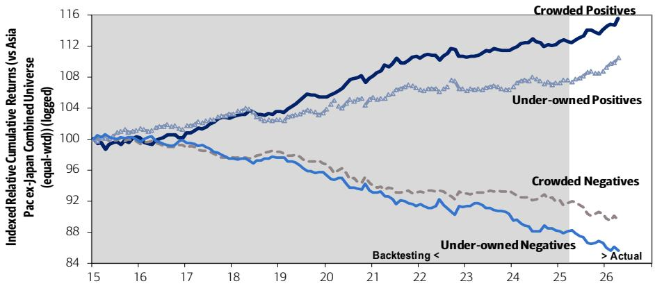

line

| Year | Crowded Positives | Under-owned Positives | Crowded Negatives | Under-owned Negatives |
|------|-------------------|------------------------|-------------------|------------------------|
| 15   | 100               | 100                    | 100               | 100                    |
| 16   | 100               | 100                    | 100               | 100                    |
| 17   | 100               | 100                    | 100               | 100                    |
| 18   | 103               | 103                    | 99                | 99                     |
| 19   | 105               | 104                    | 98                | 98                     |
| 20   | 107               | 105                    | 96                | 96                     |
| 21   | 109               | 106                    | 94                | 94                     |
| 22   | 110               | 107                    | 92                | 92                     |
| 23   | 111               | 108                    | 92                | 92                     |
| 24   | 112               | 109                    | 92                | 92                     |
| 25   | 113               | 110                    | 92                | 92                     |
| 26   | 115               | 111                    | 88                | 88                     |

Source : BofA Asia Pac Quantitative Strategy, MSCI, FTSE, FactSet, Bloomberg, 13F Filings, Benchmark Indices, Country Stock Exchanges Performance is shown relative to the average performance of stocks in the analysis with Fund Ownership, Relative Weight, and Triple Momentum Ranks, where data exists.   
The shaded area shows back-tested results during the period from Jan-15 to Apr-25. The unshaded portion represents actual performance since May-25.   
Back-tested performance depicts the theoretical (not actual) performance of a particular strategy over the time period indicated. No representation is being made that any actual portfolio is likely to have achieved returns similar to those shown herein.   
BofA GLOBAL RESEARCH

# Crowded Positives - Stock Screen

Table 3: Asia Pac ex-Japan CROWDED POSITIVES (consensus)

Stocks that have HIGH Fund Ownership, OVERWEIGHT relative to benchmark, and HIGH Triple Momentum Rank

<table><tr><td>Company Name</td><td>BBG Code</td><td>Country</td><td>Sector</td><td>MCAP (Total $USm)</td><td>Avg Daily TO (6m $US m)</td><td>Proportion of Funds (%)</td><td>FUM-Wtd Relative Wgt (%)</td><td>Triple Momentum Rank</td></tr><tr><td>TSMC</td><td>2330 TT</td><td>Taiwan</td><td>Semiconductors</td><td>1,747,414</td><td>2,189.7</td><td>92%</td><td>1.251%</td><td>85</td></tr><tr><td>MediaTek</td><td>2454 TT</td><td>Taiwan</td><td>Semiconductors</td><td>132,122</td><td>547.0</td><td>48%</td><td>0.077%</td><td>88</td></tr><tr><td>BeOne Medicine-ADR</td><td>ONC US</td><td>China</td><td>Health Care</td><td>32,397</td><td>88.1</td><td>90%</td><td>0.229%</td><td>89</td></tr><tr><td>Winway Tech</td><td>6515 TT</td><td>Taiwan</td><td>Semiconductors</td><td>11,813</td><td>93.0</td><td>53%</td><td>0.024%</td><td>91</td></tr><tr><td>Taiwan Union</td><td>6274 TT</td><td>Taiwan</td><td>Tech Hardware</td><td>9,205</td><td>193.0</td><td>67%</td><td>0.032%</td><td>98</td></tr><tr><td>KIWOOM Securities</td><td>039490 KS</td><td>South Korea</td><td>Div Financials</td><td>7,038</td><td>46.4</td><td>74%</td><td>0.021%</td><td>100</td></tr><tr><td>Silicon Motion Tech-ADR</td><td>SIMO US</td><td>China</td><td>Semiconductors</td><td>7,418</td><td>72.4</td><td>90%</td><td>0.241%</td><td>98</td></tr><tr><td>ASMPT</td><td>522 HK</td><td>Hong Kong</td><td>Semiconductors</td><td>8,698</td><td>38.5</td><td>53%</td><td>0.061%</td><td>96</td></tr><tr><td>Farsoon Technologies-A</td><td>688433 CH</td><td>China</td><td>Industrials</td><td>2,059</td><td>45.1</td><td>69%</td><td>0.497%</td><td>83</td></tr><tr><td>Himax Tech-ADR</td><td>HIMX US</td><td>Taiwan</td><td>Semiconductors</td><td>2,050</td><td>19.0</td><td>57%</td><td>0.019%</td><td>94</td></tr></table>

Source : BofA Asia Pac Quantitative Strategy, MSCI, FTSE, FactSet, Bloomberg, 13F Filings, Benchmark Indices, Country Stock Exchanges

BofA GLOBAL RESEARCH

# Under-owned Positives - Stock Screen

Table 4: Asia Pac ex-Japan UNDER-OWNED POSITIVES (contrarian)

Stocks that have LOW Fund Ownership, are OVERWEIGHT relative to benchmark, and have HIGH Triple Momentum Rank

<table><tr><td>Company Name</td><td>BBG Code</td><td>Country</td><td>Sector</td><td>MCAP (Total $USm)</td><td>Avg Daily TO (6m $US m)</td><td>Proportion of Funds (%)</td><td>FUM-Wtd Relative Wgt (%)</td><td>Triple Momentum Rank</td></tr><tr><td>Zhongji Innolight-A</td><td>300308 CH</td><td>China</td><td>Tech Hardware</td><td>139,425</td><td>2,752.9</td><td>21%</td><td>0.034%</td><td>98</td></tr><tr><td>Elite Material</td><td>2383 TT</td><td>Taiwan</td><td>Tech Hardware</td><td>51,400</td><td>267.0</td><td>21%</td><td>0.011%</td><td>85</td></tr><tr><td>Hyundai Electric</td><td>267260 KS</td><td>South Korea</td><td>Industrials</td><td>30,428</td><td>146.7</td><td>21%</td><td>0.001%</td><td>91</td></tr><tr><td>Hanwha Aerospace</td><td>012450 KS</td><td>South Korea</td><td>Industrials</td><td>49,262</td><td>312.4</td><td>17%</td><td>0.011%</td><td>83</td></tr><tr><td>Accton Tech</td><td>2345 TT</td><td>Taiwan</td><td>Tech Hardware</td><td>40,378</td><td>232.5</td><td>28%</td><td>0.016%</td><td>95</td></tr><tr><td>CNOOC-H</td><td>883 HK</td><td>China</td><td>Energy</td><td>167,044</td><td>388.1</td><td>17%</td><td>0.150%</td><td>84</td></tr><tr><td>Chroma ATE</td><td>2360 TT</td><td>Taiwan</td><td>Tech Hardware</td><td>28,454</td><td>154.9</td><td>21%</td><td>0.029%</td><td>85</td></tr><tr><td>DBS</td><td>DBS SP</td><td>Singapore</td><td>Banks</td><td>130,347</td><td>212.4</td><td>35%</td><td>0.007%</td><td>84</td></tr><tr><td>Yuanjie Semi-A</td><td>688498 CH</td><td>China</td><td>Semiconductors</td><td>19,759</td><td>410.6</td><td>4%</td><td>0.008%</td><td>85</td></tr><tr><td>Zijin Mining-H</td><td>2899 HK</td><td>China</td><td>Materials</td><td>27,277</td><td>318.3</td><td>31%</td><td>0.002%</td><td>95</td></tr></table>

Source : BofA Asia Pac Quantitative Strategy, MSCI, FTSE, FactSet, Bloomberg, 13F Filings, Benchmark Indices, Country Stock Exchanges

BofA GLOBAL RESEARCH

# Crowded Negatives - Stock Screen

Table 5: Asia Pac ex-Japan CROWDED NEGATIVES (contrarian)

Stocks that have HIGH Fund Ownership, UNDERWEIGHT relative to benchmark, and LOW Triple Momentum Rank

<table><tr><td>Company Name</td><td>BBG Code</td><td>Country</td><td>Sector</td><td>MCAP (Total $USm)</td><td>Avg Daily TO (6m $US m)</td><td>Proportion of Funds (%)</td><td>FUM-Wtd Relative Wgt (%)</td><td>Triple Momentum Rank</td></tr><tr><td>Bharti (Airtel)</td><td>BHARTI IN</td><td>India</td><td>Telecom</td><td>113,353</td><td>189.8</td><td>41%</td><td>-0.012%</td><td>15</td></tr><tr><td>Infosys</td><td>INFO IN</td><td>India</td><td>Software</td><td>50,486</td><td>185.3</td><td>37%</td><td>-0.075%</td><td>17</td></tr><tr><td>Hub24</td><td>HUB AU</td><td>Australia</td><td>Div Financials</td><td>4,899</td><td>21.0</td><td>40%</td><td>0.000%</td><td>13</td></tr><tr><td>NextDC</td><td>NXT AU</td><td>Australia</td><td>Software</td><td>7,786</td><td>26.3</td><td>38%</td><td>-0.005%</td><td>9</td></tr><tr><td>Faraday Tech</td><td>3035 TT</td><td>Taiwan</td><td>Semiconductors</td><td>1,382</td><td>25.8</td><td>43%</td><td>-0.001%</td><td>5</td></tr><tr><td>Bendigo Bank</td><td>BEN AU</td><td>Australia</td><td>Banks</td><td>4,368</td><td>15.4</td><td>37%</td><td>-0.005%</td><td>12</td></tr><tr><td>Endeavour</td><td>EDV AU</td><td>Australia</td><td>Cons. Staples</td><td>4,325</td><td>12.1</td><td>38%</td><td>-0.003%</td><td>12</td></tr><tr><td>Genting Singapore</td><td>GENS SP</td><td>Singapore</td><td>Cons. Discretionary</td><td>6,457</td><td>26.0</td><td>39%</td><td>-0.003%</td><td>4</td></tr><tr><td>Seek</td><td>SEK AU</td><td>Australia</td><td>Media &amp; Ent.</td><td>3,554</td><td>21.9</td><td>40%</td><td>-0.001%</td><td>19</td></tr><tr><td>Cheng Shin Rubber</td><td>2105 TT</td><td>Taiwan</td><td>Cons. Discretionary</td><td>3,192</td><td>13.3</td><td>38%</td><td>-0.001%</td><td>4</td></tr></table>

Source : BofA Asia Pac Quantitative Strategy, MSCI, FTSE, FactSet, Bloomberg, 13F Filings, Benchmark Indices, Country Stock Exchanges

BofA GLOBAL RESEARCH

# Under-owned Negatives - Stock Screen

Table 6: Asia Pac ex-Japan UNDER-OWNED NEGATIVES (consensus)

Stocks that have LOW Fund Ownership, UNDERWEIGHT relative to benchmark, and LOW Triple Momentum Rank

<table><tr><td>Company Name</td><td>BBG Code</td><td>Country</td><td>Sector</td><td>MCAP (Total $USm)</td><td>Avg Daily TO (6m $US m)</td><td>Proportion of Funds (%)</td><td>FUM-Wtd Relative Wgt (%)</td><td>Triple Momentum Rank</td></tr><tr><td>Xiaomi</td><td>1810 HK</td><td>China</td><td>Tech Hardware</td><td>79,783</td><td>802.6</td><td>26%</td><td>-0.098%</td><td>7</td></tr><tr><td>Meituan</td><td>3690 HK</td><td>China</td><td>Cons. Discretionary</td><td>58,791</td><td>568.3</td><td>28%</td><td>-0.050%</td><td>4</td></tr><tr><td>CBA</td><td>CBA AU</td><td>Australia</td><td>Banks</td><td>208,937</td><td>267.8</td><td>17%</td><td>-0.266%</td><td>11</td></tr><tr><td>Kweichow Moutai-A</td><td>600519 CH</td><td>China</td><td>Cons. Staples</td><td>253,764</td><td>815.2</td><td>23%</td><td>-0.018%</td><td>3</td></tr><tr><td>NAB</td><td>NAB AU</td><td>Australia</td><td>Banks</td><td>87,951</td><td>155.3</td><td>15%</td><td>-0.097%</td><td>17</td></tr><tr><td>CSL</td><td>CSL AU</td><td>Australia</td><td>Health Care</td><td>43,380</td><td>148.7</td><td>19%</td><td>-0.041%</td><td>2</td></tr><tr><td>Goodman</td><td>GMG AU</td><td>Australia</td><td>Real Estate</td><td>43,486</td><td>89.8</td><td>15%</td><td>-0.042%</td><td>15</td></tr><tr><td>Wesfarmers</td><td>WES AU</td><td>Australia</td><td>Cons. Discretionary</td><td>59,518</td><td>86.0</td><td>15%</td><td>-0.066%</td><td>15</td></tr><tr><td>Larsen &amp; Toubro</td><td>LT IN</td><td>India</td><td>Industrials</td><td>58,175</td><td>118.7</td><td>21%</td><td>-0.041%</td><td>15</td></tr><tr><td>UOB</td><td>UOB SP</td><td>Singapore</td><td>Banks</td><td>47,320</td><td>89.9</td><td>19%</td><td>-0.019%</td><td>11</td></tr></table>

Source : BofA Asia Pac Quantitative Strategy, MSCI, FTSE, FactSet, Bloomberg, 13F Filings, Benchmark Indices, Country Stock Exchanges

BofA GLOBAL RESEARCH

# Equity Flow - Long-Only

# Countries – Equity Flow

Chart 10: Asia Pac ex-Japan Countries Long-only Equity Flow Summary: LAST MONTH   
Last month, long-only funds' largest inflows were in Australia, India, and Hong Kong   
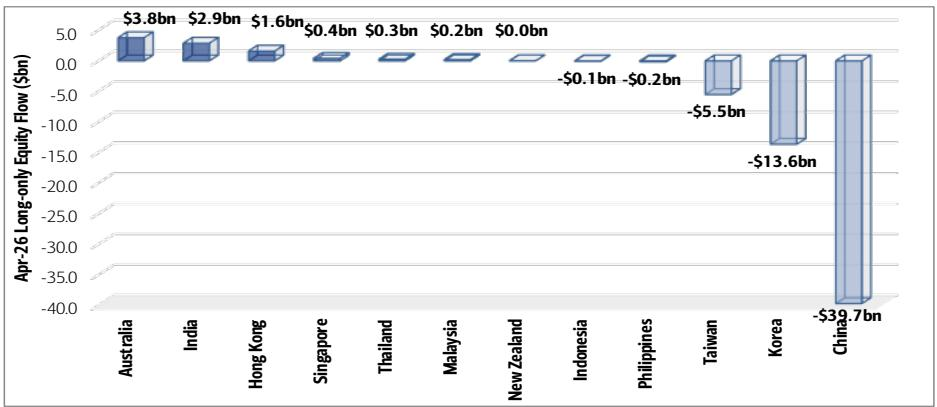

bar

| Country | Apr-26 Long-only Equity Flow ($bn) |
| :--- | :--- |
| Australia | 3.8 |
| India | 2.9 |
| Hong Kong | 1.6 |
| Singapore | 0.4 |
| Thailand | 0.3 |
| Malaysia | 0.2 |
| New Zealand | 0.0 |
| Indonesia | -0.1 |
| Philippines | -0.2 |
| Taiwan | -5.5 |
| Korea | -13.6 |
| China | -39.7 |

Source : BofA Asia Pac Quantitative Strategy, MSCI, FTSE, FactSet, Bloomberg, 13F Filings, Benchmark Indices, Country Stock Exchanges   
BofA GLOBAL RESEARCH

Chart 11: Asia Pac ex-Japan Countries Long-only Equity Flow Summary: YEAR-TO-DATE   
In aggregate, long-only funds had a positive flow in Australia   
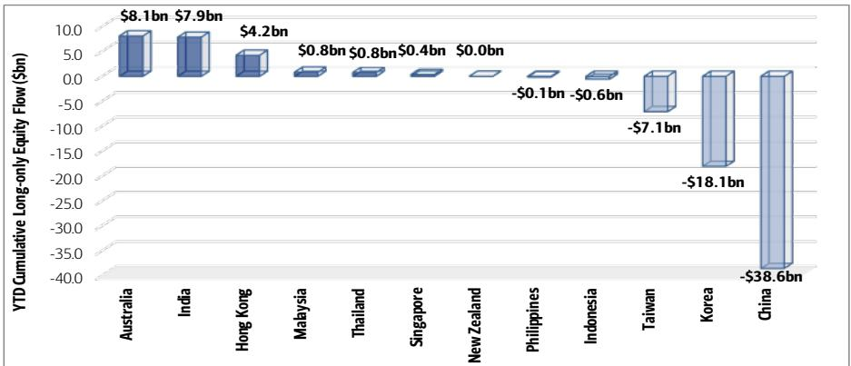

bar

YTD Cumulative Long-only Equity Flow ($bn)
| Country | YTD Cumulative Long-only Equity Flow ($bn) |
| :--- | :--- |
| Australia | 8.1 |
| India | 7.9 |
| Hong Kong | 4.2 |
| Malaysia | 0.8 |
| Thailand | 0.8 |
| Singapore | 0.4 |
| New Zealand | 0.0 |
| Philippines | -0.1 |
| Indonesia | -0.6 |
| Taiwan | -7.1 |
| Korea | -18.1 |
| China | -38.6 |

Source : BofA Asia Pac Quantitative Strategy, MSCI, FTSE, FactSet, Bloomberg, 13F Filings, Benchmark Indices, Country Stock Exchanges   
BofA GLOBAL RESEARCH

Chart 12: Asia Pac ex-Japan Countries Long-only Equity Flow Summary: LAST 12-MONTHS   
In aggregate, long-only funds had a positive flow in India   
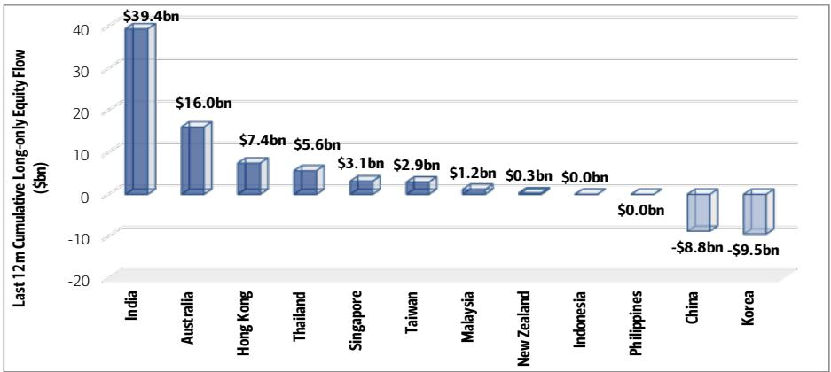

bar

| Country | Last 12m Cumulative Long-only Equity Flow ($bn) |
| :--- | :--- |
| India | 39.4 |
| Australia | 16.0 |
| Hong Kong | 7.4 |
| Thailand | 5.6 |
| Singapore | 3.1 |
| Taiwan | 2.9 |
| Malaysia | 1.2 |
| New Zealand | 0.3 |
| Indonesia | 0.0 |
| Philippines | 0.0 |
| China | -8.8 |
| Korea | -9.5 |

Source : BofA Asia Pac Quantitative Strategy, MSCI, FTSE, FactSet, Bloomberg, 13F Filings, Benchmark Indices, Country Stock Exchanges   
BofA GLOBAL RESEARCH

Chart 13: Australia: Rolling 12-months Long-only Equity Flow   
In last 12m, long-only funds had an inflow into Australia by \$16.0bn   
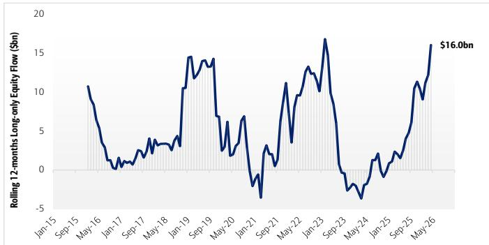

line

| Date     | Rolling 12-months Long-only Equity Flow ($bn) |
| -------- | --------------------------------------------- |
| May-26   | $16.0bn                                       |

Source : BofA Asia Pac Quantitative Strategy, MSCI, FTSE, FactSet, Bloomberg, 13F Filings, Benchmark Indices, Country Stock Exchanges   
BofA GLOBAL RESEARCH

Chart 15: Hong Kong: Rolling 12-months Long-only Equity Flow   
Last month, long-only funds had an inflow into Hong Kong by \$1.6bn   
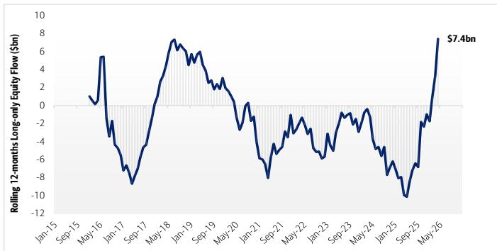

line

| Date    | Rolling 12-months Long-only Equity Flow ($bn) |
|---------|-----------------------------------------------|
| May-26  | $7.4bn                                        |

Source : BofA Asia Pac Quantitative Strategy, MSCI, FTSE, FactSet, Bloomberg, 13F Filings, Benchmark Indices, Country Stock Exchanges   
BofA GLOBAL RESEARCH

Chart 17: Indonesia: Rolling 12-months Long-only Equity Flow   
In last 12m, long-only funds had an inflow into Indonesia by \$0.0bn   
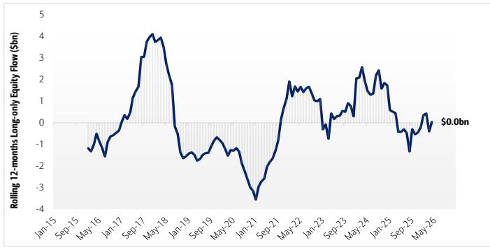

line

| Date     | Rolling 12-months Long-only Equity Flow ($bn) |
| -------- | --------------------------------------------- |
| May-26   | $0.0bn                                        |

Source : BofA Asia Pac Quantitative Strategy, MSCI, FTSE, FactSet, Bloomberg, 13F Filings,   
Benchmark Indices, Country Stock Exchanges   
BofA GLOBAL RESEARCH

Chart 14: China: Rolling 12-months Long-only Equity Flow   
YTD, long-only funds had an outflow from China by -\$38.6bn   
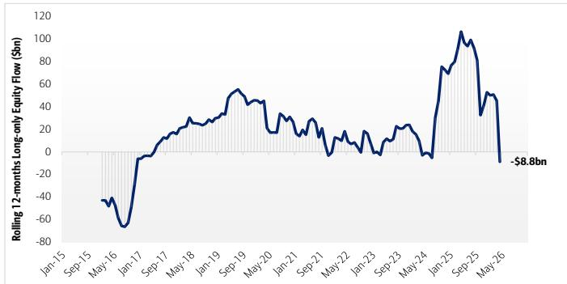

line

| Date     | Rolling 12-months Long-only Equity Flow ($bn) |
| -------- | --------------------------------------------- |
| May-26   | -$8.8bn                                       |

Source : BofA Asia Pac Quantitative Strategy, MSCI, FTSE, FactSet, Bloomberg, 13F Filings, Benchmark Indices, Country Stock Exchanges   
BofA GLOBAL RESEARCH

Chart 16: India: Rolling 12-months Long-only Equity Flow   
YTD, long-only funds had an inflow into India by \$7.9bn   
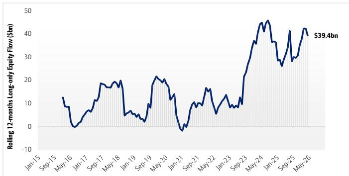

line

| Date     | Rolling 12-months Long-only Equity Flow ($bn) |
| -------- | --------------------------------------------- |
| May-26   | 39.4                                          |

Source : BofA Asia Pac Quantitative Strategy, MSCI, FTSE, FactSet, Bloomberg, 13F Filings, Benchmark Indices, Country Stock Exchanges   
BofA GLOBAL RESEARCH

Chart 18: Korea: Rolling 12-months Long-only Equity Flow   
In last 12m, long-only funds had an outflow from Korea by -\$9.5bn   
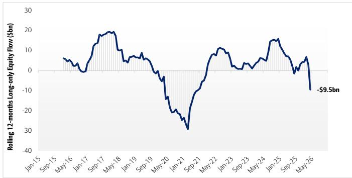

line

| Date    | Rolling 12-months Long-only Equity Flow ($bn) |
|---------|-----------------------------------------------|
| May-26  | -9.5                                          |

Source : BofA Asia Pac Quantitative Strategy, MSCI, FTSE, FactSet, Bloomberg, 13F Filings,   
Benchmark Indices, Country Stock Exchanges   
BofA GLOBAL RESEARCH

Chart 19: Malaysia: Rolling 12-months Long-only Equity Flow YTD, long-only funds had an inflow into Malaysia by \$0.8bn   
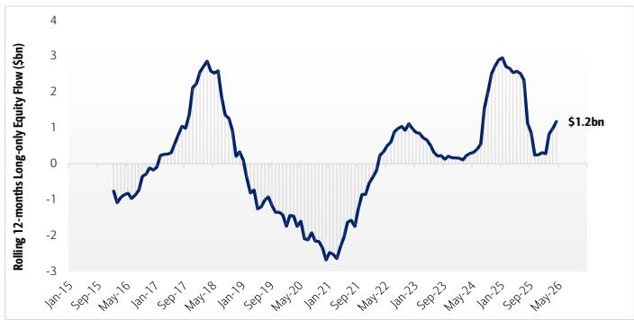

line

| Date     | Rolling 12-months Long-only Equity Flow ($bn) |
| -------- | --------------------------------------------- |
| May-26   | 1.2bn                                         |

Source : BofA Asia Pac Quantitative Strategy, MSCI, FTSE, FactSet, Bloomberg, 13F Filings, Benchmark Indices, Country Stock Exchanges   
BofA GLOBAL RESEARCH

Chart 21: Philippines: Rolling 12-months Long-only Equity Flow In last 12m, long-only funds had an outflow from Philippines by \$0.0bn   
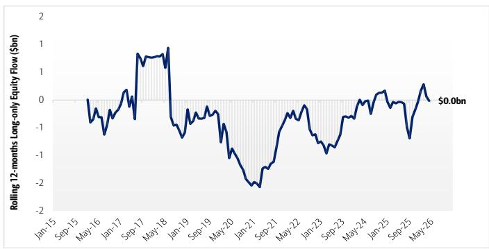

line

| Date    | Rolling 12-months Long-only Equity Flow ($bn) |
|---------|-----------------------------------------------|
| May-26  | $0.0bn                                        |

Source : BofA Asia Pac Quantitative Strategy, MSCI, FTSE, FactSet, Bloomberg, 13F Filings, Benchmark Indices, Country Stock Exchanges   
BofA GLOBAL RESEARCH

Chart 23: Taiwan: Rolling 12-months Long-only Equity Flow In last 12m, long-only funds had an inflow into Taiwan by \$2.9bn   
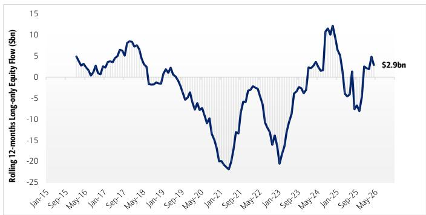

line

| Date     | Rolling 12-months Long-only Equity Flow ($bn) |
| -------- | --------------------------------------------- |
| May-26   | $2.9bn                                        |

Source : BofA Asia Pac Quantitative Strategy, MSCI, FTSE, FactSet, Bloomberg, 13F Filings, Benchmark Indices, Country Stock Exchanges   
BofA GLOBAL RESEARCH

Chart 20: New Zealand: Rolling 12-months Long-only Equity Flow YTD, long-only funds had an inflow into New Zealand by \$0.0bn   
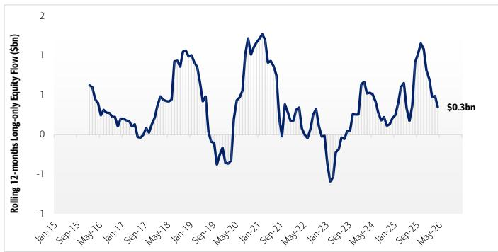

line

| Date     | Rolling 12-months Long-only Equity Flow ($bn) |
| -------- | --------------------------------------------- |
| May-26   | $0.3bn                                        |

Source : BofA Asia Pac Quantitative Strategy, MSCI, FTSE, FactSet, Bloomberg, 13F Filings, Benchmark Indices, Country Stock Exchanges   
BofA GLOBAL RESEARCH

Chart 22: Singapore: Rolling 12-months Long-only Equity Flow YTD, long-only funds had an inflow into Singapore by \$0.4bn   
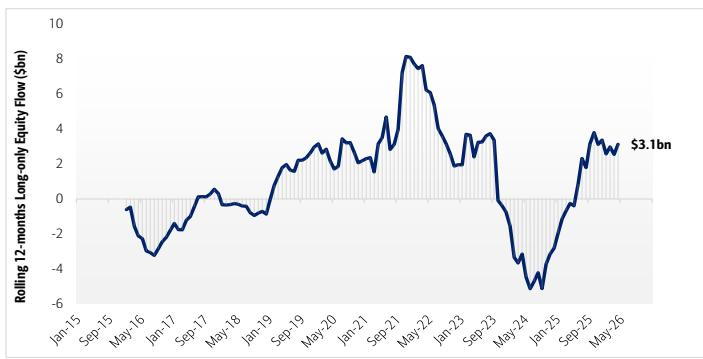

line

| Date     | Rolling 12-months Long-only Equity Flow ($bn) |
| -------- | --------------------------------------------- |
| May-26   | $3.1bn                                        |

Source : BofA Asia Pac Quantitative Strategy, MSCI, FTSE, FactSet, Bloomberg, 13F Filings, Benchmark Indices, Country Stock Exchanges   
BofA GLOBAL RESEARCH

Chart 24: Thailand: Rolling 12-months Long-only Equity Flow
Last month, long-only funds had an inflow into Thailand by \$0.3bn   
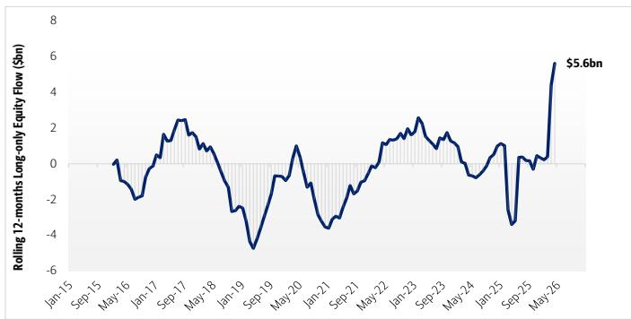

line

| Date     | Rolling 12-months Long-only Equity Flow ($bn) |
| -------- | --------------------------------------------- |
| May '26  | $5.6bn                                        |

Source : BofA Asia Pac Quantitative Strategy, MSCI, FTSE, FactSet, Bloomberg, 13F Filings, Benchmark Indices, Country Stock Exchanges   
BofA GLOBAL RESEARCH

# Asia Pac ex-Japan Sectors – Equity Flow

Chart 25: Asia Pac ex-Japan SECTORS Long-only Equity Flow Summary: LAST MONTH In aggregate, long-only funds had a positive flow in Energy   
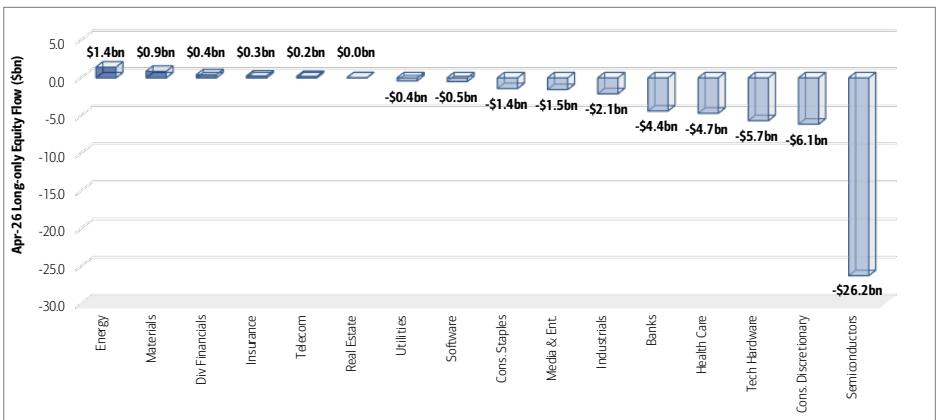

bar

| Sector | Apr-26 Long-only Equity Flow ($bn) |
| :--- | :--- |
| Energy | 1.4 |
| Materials | 0.9 |
| Div Financials | 0.4 |
| Insurance | 0.3 |
| Telecom | 0.2 |
| Real Estate | 0.0 |
| Utilities | -0.4 |
| Software | -0.5 |
| Cons. Staples | -1.4 |
| Media & Ent. | -1.5 |
| Industrials | -2.1 |
| Banks | -4.4 |
| Health Care | -4.7 |
| Tech Hardware | -5.7 |
| Cons. Discretionary | -6.1 |
| Semiconductors | -26.2 |

Source : BofA Asia Pac Quantitative Strategy, MSCI, FTSE, FactSet, Bloomberg, 13F Filings, Benchmark Indices, Country Stock Exchanges
BofA GLOBAL RESEARCH

Chart 26: Asia Pac ex-Japan SECTORS Long-only Equity Flow Summary: YEAR-TO-DATE In aggregate, long-only funds had a positive flow in Industrials   
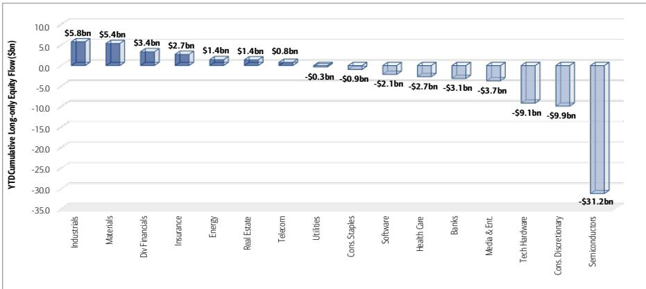

bar

YTD Cumulative Long-only Equity Flow ($bn)
| Sector | YTD Cumulative Long-only Equity Flow ($bn) |
| :--- | :--- |
| Industrials | 5.8 |
| Materials | 5.4 |
| Div Financials | 3.4 |
| Insurance | 2.7 |
| Energy | 1.4 |
| Real Estate | 1.4 |
| Telecom | 0.8 |
| Utilities | -0.3 |
| Cons Staples | -0.9 |
| Software | -2.1 |
| Health Care | -2.7 |
| Banks | -3.1 |
| Media & Ent. | -3.7 |
| Tech Hardware | -9.1 |
| Cons. Discretionary | -9.9 |
| Semiconductors | -31.2 |

Source : BofA Asia Pac Quantitative Strategy, MSCI, FTSE, FactSet, Bloomberg, 13F Filings, Benchmark Indices, Country Stock Exchanges
BofA GLOBAL RESEARCH

Chart 27: Asia Pac ex-Japan SECTORS Long-only Equity Flow Summary: LAST 12-MONTHS In the last 12m, long-only funds' largest inflows were in Industrials, Div Financials, and Materials   
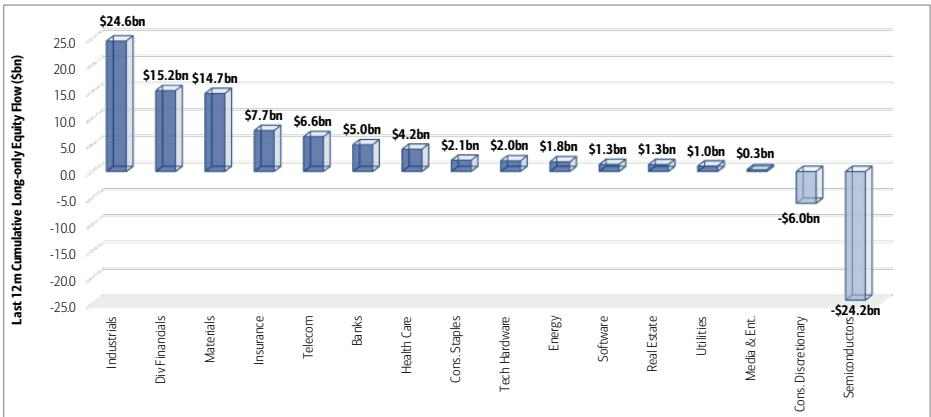

bar

| Sector | Last 12m Cumulative Long-only Equity Flow ($bn) |
| :--- | :--- |
| Industrials | 24.6 |
| Div Financials | 15.2 |
| Materials | 14.7 |
| Insurance | 7.7 |
| Telecom | 6.6 |
| Banks | 5.0 |
| Health Care | 4.2 |
| Cons. Staples | 2.1 |
| Tech Hardware | 2.0 |
| Energy | 1.8 |
| Software | 1.3 |
| Real Estate | 1.3 |
| Utilities | 1.0 |
| Media & Ent. | 0.3 |
| Cons Discretionary | -6.0 |
| Semiconductors | -24.2 |

Source : BofA Asia Pac Quantitative Strategy, MSCI, FTSE, FactSet, Bloomberg, 13F Filings, Benchmark Indices, Country Stock Exchanges
BofA GLOBAL RESEARCH

# Chart 28: Asia Pac ex-Japan EARLY CYCLICALS Rolling 12-months Long-only Equity Flow

Within Early Cyclicals, long-only funds' biggest inflow last month was in Real Estate

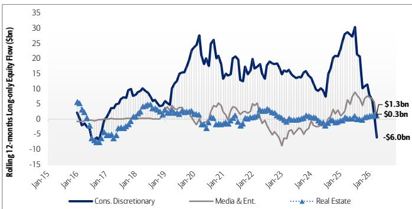

line

| Date    | Cons. Discretionary | Media & Ent. | Real Estate |
|---------|---------------------|--------------|-------------|
| Jan-26  | -$6.0bn             | -$0.3bn      | -$1.3bn     |

Source : BofA Asia Pac Quantitative Strategy, MSCI, FTSE, FactSet, Bloomberg, 13F Filings, Benchmark Indices, Country Stock Exchanges   
BofA GLOBAL RESEARCH

# Chart 30: Asia Pac ex-Japan INFORMATION TECHNOLOGY Rolling 12-months Long-only Equity Flow

Within Tech, long-only funds biggest outflow last month was from Semiconductors

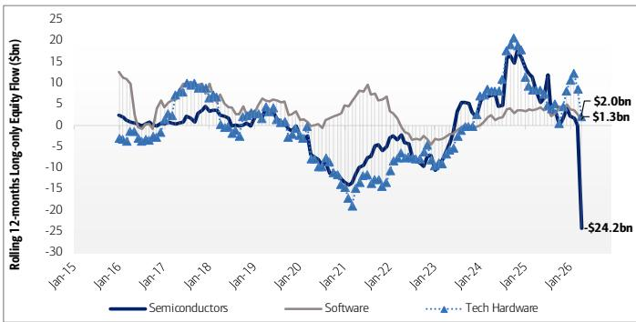

line

| Date    | Semiconductors | Software | Tech Hardware |
|---------|----------------|----------|---------------|
| Jan-26  | -$24.2bn       | -        | -             |
| Jan-25  | -              | -        | -             |
| Jan-24  | -              | -        | -             |
| Jan-23  | -              | -        | -             |
| Jan-22  | -              | -        | -             |
| Jan-21  | -              | -        | -             |
| Jan-20  | -              | -        | -             |
| Jan-19  | -              | -        | -             |
| Jan-18  | -              | -        | -             |
| Jan-17  | -              | -        | -             |
| Jan-16  | -              | -        | -             |
| Jan-15  | -              | -        | -             |

Source : BofA Asia Pac Quantitative Strategy, MSCI, FTSE, FactSet, Bloomberg, 13F Filings, Benchmark Indices, Country Stock Exchanges   
BofA GLOBAL RESEARCH

# Chart 32: Asia Pac ex-Japan DEFENSIVES Rolling 12-months Long-only Equity Flow

Within Defensives, long-only funds' biggest inflow last month was in Telecom

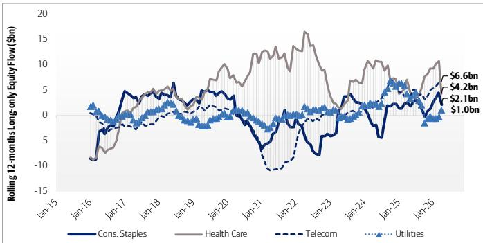

line

| Date   | Cons. Staples | Health Care | Telecom | Utilities |
|--------|---------------|-------------|---------|-----------|
| Jan-26 | $1.0bn        | $4.2bn      | $2.1bn  | $6.6bn    |

Source : BofA Asia Pac Quantitative Strategy, MSCI, FTSE, FactSet, Bloomberg, 13F Filings, Benchmark Indices, Country Stock Exchanges   
BofA GLOBAL RESEARCH

# Chart 29: Asia Pac ex-Japan FINANCIALS Rolling 12-months Long-only Equity Flow

Within Financials, long-only funds' biggest inflow last month was in Div Financials

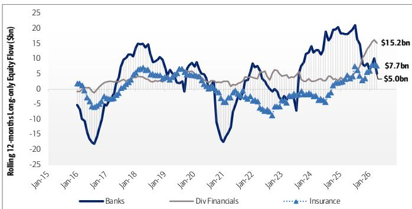

line

| Date   | Banks | Div Financials | Insurance |
|--------|-------|----------------|---------|
| Jan-26 | $15.2bn | $7.7bn         | $5.0bn  |

Source : BofA Asia Pac Quantitative Strategy, MSCI, FTSE, FactSet, Bloomberg, 13F Filings, Benchmark Indices, Country Stock Exchanges   
BofA GLOBAL RESEARCH

# Chart 31: Asia Pac ex-Japan LATE CYCLICALS Rolling 12-months Long-only Equity Flow

Within Late Cyclicals, long-only funds' biggest inflow last month was in Energy

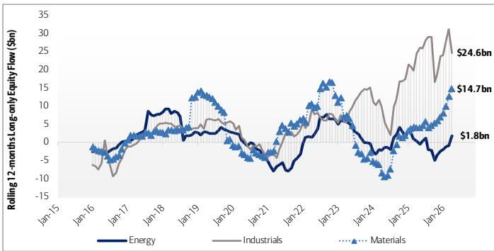

line

| Date   | Energy | Industrials | Materials |
|--------|--------|-------------|-----------|
| Jan-26 | $1.8bn | $24.6bn     | $14.7bn   |

Source : BofA Asia Pac Quantitative Strategy, MSCI, FTSE, FactSet, Bloomberg, 13F Filings, Benchmark Indices, Country Stock Exchanges   
BofA GLOBAL RESEARCH

# Country-Sectors – Equity Flow

Table 7: Asia Pac ex-Japan COUNTRY-SECTORS Long-only Equity Flow in USD billions: LAST MONTH

Asia Pac ex-Japan SECTORS Active Equity Flow Long-only in USD billions: LAST MONTH

<table><tr><td></td><td>Banks</td><td>Cons. Discretionary</td><td>Cons. Staples</td><td>Div Financials</td><td>Energy</td><td>Health Care</td><td>Industrials</td><td>Insurance</td><td>Materials</td><td>Media &amp; Ent.</td><td>Real Estate</td><td>Semis</td><td>Software</td><td>Tech Hardware</td><td>Telecom</td><td>Utilities</td><td>Total</td></tr><tr><td>Australia</td><td>1.02</td><td>0.05</td><td>0.14</td><td>-0.27</td><td>0.54</td><td>0.28</td><td>-0.02</td><td>0.31</td><td>1.40</td><td>-0.03</td><td>0.09</td><td>0.00</td><td>0.08</td><td>0.04</td><td>0.10</td><td>0.08</td><td>3.79</td></tr><tr><td>China</td><td>-5.07</td><td>-5.89</td><td>-1.68</td><td>-0.01</td><td>0.23</td><td>-5.55</td><td>-3.98</td><td>-0.10</td><td>-1.19</td><td>-1.41</td><td>-0.30</td><td>-9.33</td><td>-1.02</td><td>-2.77</td><td>-1.15</td><td>-0.47</td><td>-39.70</td></tr><tr><td>Hong Kong</td><td>0.03</td><td>0.19</td><td>0.17</td><td>-0.03</td><td>0.02</td><td>-0.09</td><td>0.59</td><td>0.17</td><td>0.23</td><td>0.12</td><td>0.22</td><td>0.03</td><td>0.07</td><td>0.00</td><td>-0.11</td><td>-0.03</td><td>1.59</td></tr><tr><td>India</td><td>-0.26</td><td>0.24</td><td>-0.38</td><td>0.68</td><td>0.13</td><td>0.38</td><td>0.64</td><td>-0.24</td><td>0.24</td><td>-0.01</td><td>-0.23</td><td>0.19</td><td>0.38</td><td>-0.02</td><td>1.24</td><td>-0.10</td><td>2.88</td></tr><tr><td>Indonesia</td><td>-0.28</td><td>0.00</td><td>-0.03</td><td>0.00</td><td>0.34</td><td>0.00</td><td>-0.08</td><td>0.00</td><td>0.01</td><td>0.00</td><td>0.00</td><td>-</td><td>0.00</td><td>0.00</td><td>-0.02</td><td>0.00</td><td>-0.06</td></tr><tr><td>Korea</td><td>0.14</td><td>-0.87</td><td>0.34</td><td>-0.06</td><td>0.06</td><td>0.25</td><td>0.20</td><td>0.06</td><td>0.02</td><td>-0.21</td><td>0.00</td><td>-9.37</td><td>0.01</td><td>-4.18</td><td>-0.06</td><td>0.02</td><td>-13.64</td></tr><tr><td>Malaysia</td><td>-0.03</td><td>-0.01</td><td>0.06</td><td>0.00</td><td>0.00</td><td>0.03</td><td>0.00</td><td>0.00</td><td>0.09</td><td>0.00</td><td>0.02</td><td>0.00</td><td>0.00</td><td>0.02</td><td>0.00</td><td>0.04</td><td>0.21</td></tr><tr><td>Philippines</td><td>-0.07</td><td>0.00</td><td>-0.05</td><td>0.00</td><td>0.00</td><td>-</td><td>-0.04</td><td>-</td><td>0.00</td><td>-</td><td>0.00</td><td>-</td><td>-</td><td>-</td><td>0.00</td><td>0.00</td><td>-0.16</td></tr><tr><td>Singapore</td><td>0.06</td><td>0.10</td><td>0.02</td><td>0.04</td><td>0.00</td><td>0.06</td><td>-0.02</td><td>0.00</td><td>0.01</td><td>0.00</td><td>0.17</td><td>0.00</td><td>0.00</td><td>-0.01</td><td>0.00</td><td>-0.01</td><td>0.42</td></tr><tr><td>Taiwan</td><td>0.14</td><td>0.05</td><td>0.02</td><td>0.08</td><td>0.01</td><td>0.00</td><td>0.58</td><td>0.06</td><td>0.04</td><td>-0.01</td><td>0.00</td><td>-7.75</td><td>0.00</td><td>1.24</td><td>0.04</td><td>0.00</td><td>-5.50</td></tr><tr><td>Thailand</td><td>-0.08</td><td>0.00</td><td>-0.02</td><td>0.00</td><td>0.11</td><td>0.02</td><td>-0.01</td><td>0.00</td><td>0.02</td><td>0.00</td><td>0.04</td><td>-</td><td>0.00</td><td>0.01</td><td>0.16</td><td>0.05</td><td>0.29</td></tr><tr><td>Asia Pac ex-Japan</td><td>-4.39</td><td>-6.14</td><td>-1.42</td><td>0.42</td><td>1.43</td><td>-4.69</td><td>-2.11</td><td>0.26</td><td>0.87</td><td>-1.54</td><td>0.02</td><td>-26.23</td><td>-0.48</td><td>-5.67</td><td>0.19</td><td>-0.40</td><td>-49.87</td></tr></table>

Source : BofA Asia Pac Quantitative Strategy, MSCI, FTSE, FactSet, Bloomberg, 13F Filings, Benchmark Indices, Country Stock Exchanges   
BofA GLOBAL RESEARCH

Table 8: Asia Pac ex-Japan COUNTRY-SECTORS Long-only Equity Flow in USD billions: Year-to-Date

Asia Pac ex-Japan SECTORS Active Equity Flow Long-only in USD billions: YEAR-TO-DATE

<table><tr><td></td><td>Banks</td><td>Cons. Discretionary</td><td>Cons. Staples</td><td>Div Financials</td><td>Energy</td><td>Health Care</td><td>Industrials</td><td>Insurance</td><td>Materials</td><td>Media &amp; Ent.</td><td>Real Estate</td><td>Semis</td><td>Software</td><td>Tech Hardware</td><td>Telecom</td><td>Utilities</td><td>Total</td></tr><tr><td>Australia</td><td>2.57</td><td>-0.11</td><td>0.31</td><td>-0.10</td><td>0.52</td><td>0.70</td><td>0.10</td><td>0.36</td><td>2.98</td><td>-0.01</td><td>0.55</td><td>0.00</td><td>-0.11</td><td>0.04</td><td>0.11</td><td>0.21</td><td>8.10</td></tr><tr><td>China</td><td>-5.97</td><td>-9.06</td><td>-2.12</td><td>0.02</td><td>0.64</td><td>-4.45</td><td>-1.40</td><td>0.60</td><td>0.70</td><td>-3.64</td><td>-0.85</td><td>-8.28</td><td>-0.74</td><td>-2.46</td><td>-1.12</td><td>-0.45</td><td>-38.59</td></tr><tr><td>Hong Kong</td><td>-1.42</td><td>0.77</td><td>0.03</td><td>0.40</td><td>0.02</td><td>0.31</td><td>1.30</td><td>1.62</td><td>0.49</td><td>0.10</td><td>0.58</td><td>0.02</td><td>0.07</td><td>0.02</td><td>-0.11</td><td>0.02</td><td>4.22</td></tr><tr><td>India</td><td>2.66</td><td>0.69</td><td>-0.48</td><td>3.02</td><td>-0.02</td><td>-0.32</td><td>1.74</td><td>0.04</td><td>0.34</td><td>-0.01</td><td>0.44</td><td>0.26</td><td>-1.36</td><td>-0.08</td><td>1.34</td><td>-0.40</td><td>7.86</td></tr><tr><td>Indonesia</td><td>-0.85</td><td>-0.01</td><td>-0.01</td><td>0.00</td><td>0.07</td><td>-0.01</td><td>0.08</td><td>0.00</td><td>0.12</td><td>-0.02</td><td>0.01</td><td>-</td><td>0.00</td><td>0.00</td><td>-0.03</td><td>0.08</td><td>-0.57</td></tr><tr><td>Korea</td><td>-0.12</td><td>-1.71</td><td>0.84</td><td>-0.28</td><td>0.19</td><td>0.86</td><td>2.35</td><td>-0.09</td><td>0.15</td><td>-0.04</td><td>0.01</td><td>-11.06</td><td>0.13</td><td>-8.86</td><td>-0.42</td><td>-0.04</td><td>-18.07</td></tr><tr><td>Malaysia</td><td>0.27</td><td>-0.04</td><td>0.14</td><td>-0.01</td><td>-0.01</td><td>0.05</td><td>0.08</td><td>0.00</td><td>0.15</td><td>0.00</td><td>0.04</td><td>0.00</td><td>0.00</td><td>0.02</td><td>0.04</td><td>0.10</td><td>0.83</td></tr><tr><td>Philippines</td><td>-0.10</td><td>-0.05</td><td>0.01</td><td>0.00</td><td>0.00</td><td>-</td><td>-0.08</td><td>-</td><td>0.00</td><td>-</td><td>0.04</td><td>-</td><td>-</td><td>-</td><td>0.00</td><td>0.03</td><td>-0.15</td></tr><tr><td>Singapore</td><td>-0.60</td><td>-0.18</td><td>0.09</td><td>0.03</td><td>0.03</td><td>0.04</td><td>0.17</td><td>0.00</td><td>0.01</td><td>0.00</td><td>0.47</td><td>0.00</td><td>0.00</td><td>0.00</td><td>0.37</td><td>-0.08</td><td>0.37</td></tr><tr><td>Taiwan</td><td>0.75</td><td>-0.18</td><td>0.10</td><td>0.16</td><td>0.02</td><td>0.18</td><td>1.27</td><td>0.19</td><td>0.38</td><td>-0.08</td><td>0.00</td><td>-12.12</td><td>0.02</td><td>2.06</td><td>0.18</td><td>0.00</td><td>-7.08</td></tr><tr><td>Thailand</td><td>-0.33</td><td>-0.01</td><td>0.15</td><td>0.09</td><td>-0.05</td><td>0.06</td><td>0.05</td><td>0.01</td><td>0.05</td><td>0.00</td><td>0.06</td><td>-</td><td>0.00</td><td>0.13</td><td>0.39</td><td>0.17</td><td>0.76</td></tr><tr><td>Asia Pac ex-Japan</td><td>-3.14</td><td>-9.88</td><td>-0.95</td><td>3.36</td><td>1.43</td><td>-2.69</td><td>5.80</td><td>2.73</td><td>5.37</td><td>-3.71</td><td>1.38</td><td>-31.18</td><td>-2.14</td><td>-9.14</td><td>0.78</td><td>-0.33</td><td>-42.31</td></tr></table>

Source : BofA Asia Pac Quantitative Strategy, MSCI, FTSE, FactSet, Bloomberg, 13F Filings, Benchmark Indices, Country Stock Exchanges   
BofA GLOBAL RESEARCH

Table 9: Asia Pac ex-Japan COUNTRIES Long-only Active and Passive Funds Cumulative Equity Flow (\$bn)

Asia Pac ex-Japan COUNTRIES Active and Passive Equity Flow Long-only in USD billions across periods

<table><tr><td rowspan="2"></td><td colspan="3">Active Funds ($USbn)</td><td colspan="3">Passive Funds ($USbn)</td></tr><tr><td>1-month Flow</td><td>12-months Flow</td><td>Year-to-Date Flow</td><td>1-month Flow</td><td>12-months Flow</td><td>Year-to-Date Flow</td></tr><tr><td>Australia</td><td>0.94</td><td>-1.29</td><td>0.36</td><td>2.85</td><td>17.32</td><td>7.74</td></tr><tr><td>China</td><td>-27.88</td><td>-18.95</td><td>-34.46</td><td>-11.81</td><td>10.17</td><td>-4.13</td></tr><tr><td>Hong Kong</td><td>0.95</td><td>5.53</td><td>3.87</td><td>0.63</td><td>1.88</td><td>0.35</td></tr><tr><td>India</td><td>-0.20</td><td>13.39</td><td>-1.76</td><td>3.08</td><td>26.00</td><td>9.62</td></tr><tr><td>Indonesia</td><td>-0.40</td><td>-1.78</td><td>-0.89</td><td>0.34</td><td>1.82</td><td>0.31</td></tr><tr><td>Korea</td><td>-15.22</td><td>-27.63</td><td>-28.28</td><td>1.58</td><td>18.15</td><td>10.21</td></tr><tr><td>Malaysia</td><td>0.02</td><td>-0.01</td><td>0.14</td><td>0.19</td><td>1.19</td><td>0.69</td></tr><tr><td>Philippines</td><td>-0.17</td><td>-0.32</td><td>-0.31</td><td>0.01</td><td>0.30</td><td>0.17</td></tr><tr><td>Singapore</td><td>0.00</td><td>-0.57</td><td>-1.35</td><td>0.42</td><td>3.70</td><td>1.72</td></tr><tr><td>Taiwan</td><td>-7.02</td><td>-16.48</td><td>-16.98</td><td>1.53</td><td>19.39</td><td>9.90</td></tr><tr><td>Thailand</td><td>0.26</td><td>1.51</td><td>0.29</td><td>0.03</td><td>4.12</td><td>0.47</td></tr><tr><td>Asia Pac ex-Japan</td><td>-48.83</td><td>-47.31</td><td>-79.66</td><td>-1.03</td><td>105.05</td><td>37.35</td></tr></table>

Source : BofA Asia Pac Quantitative Strategy, MSCI, FTSE, FactSet, Bloomberg, 13F Filings, Benchmark Indices, Country Stock Exchanges   
BofA GLOBAL RESEARCH

# Asia Pac ex-Japan Stocks – Equity Flow

Chart 33: Asia Pac ex-Japan STOCK Long-only Equity Flow Summary: LAST MONTH   
Last month, long-only funds had largest inflow into Suzhou Dongshan and Bharti (Airtel)   
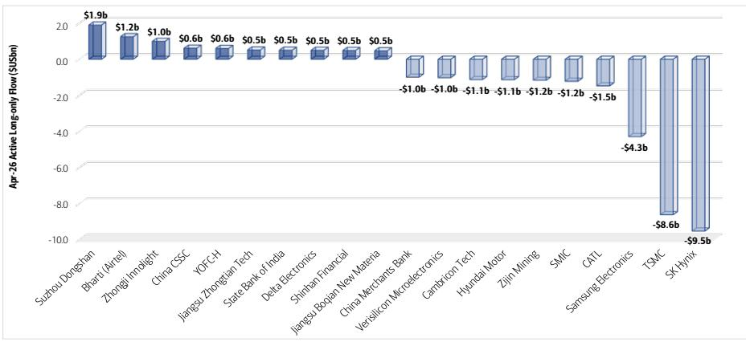

bar

Apr-26 Active Long-only Flow ($USbn)
| Company | Value ($) |
|---|---|
| Suzhou Dongshan | 1.9 |
| Bharti (Airtell) | 1.2 |
| Zhongyi Innolight | 1.0 |
| China CSSC | 0.6 |
| YOFCH | 0.6 |
| Jiangsu Zhongjian Tech | 0.5 |
| State Bank of India | 0.5 |
| Delta Electronics | 0.5 |
| Shinhan Financial | 0.5 |
| Jiangsu Boqian New Materia | 0.5 |
| China Merchants Bank | -1.0 |
| Verisilicon Microelectronics | -1.0 |
| Cambricon Tech | -1.1 |
| Hyundai Motor | -1.1 |
| Zijin Mining | -1.2 |
| SMIC | -1.2 |
| CATL | -1.5 |
| Samsung Electronics | -4.3 |
| TSMC | -8.6 |
| SK Hynix | -9.5 |

Source : BofA Asia Pac Quantitative Strategy, MSCI, FTSE, FactSet, Bloomberg, 13F Filings, Benchmark Indices, Country Stock Exchanges   
BofA GLOBAL RESEARCH

Chart 34: Asia Pac ex-Japan STOCK Long-only Equity Flow Summary: YEAR-TO-DATE   
Year-to-Date, long-only funds had largest inflow into Suzhou Dongshan and AIA   
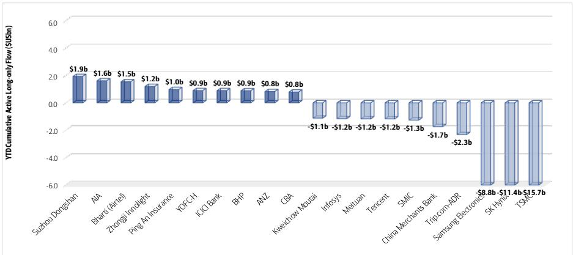

bar

YTD Cumulative Active Long-only Flow ($USbn)
| Company | YTD Cumulative Active Long-only Flow ($USbn) |
| :--- | :--- |
| Suzhou Dongshan | 1.9 |
| AIA | 1.6 |
| Bharti (Airrel) | 1.5 |
| Zhongyi Innoight | 1.2 |
| Ping An Insurance | 1.0 |
| YOFC-H | 0.9 |
| ICICI Bank | 0.9 |
| BHP | 0.9 |
| ANZ | 0.8 |
| CBA | 0.8 |
| Kweidrow Meucai | -1.1 |
| Infosys | -1.2 |
| Meituan | -1.2 |
| Tencent | -1.2 |
| SMIC | -1.3 |
| China Merchants Bank | -1.7 |
| Trip.com-ADR | -2.3 |
| Samsung Electronics | -8.8 |
| SK Hynix | -11.4 |
| TSMC | -15.7 |

Source : BofA Asia Pac Quantitative Strategy, MSCI, FTSE, FactSet, Bloomberg, 13F Filings, Benchmark Indices, Country Stock Exchanges   
BofA GLOBAL RESEARCH

Chart 35: Asia Pac ex-Japan STOCK Long-only Equity Flow Summary: LAST 12-MONTHS   
In the last 12-months, long-only funds had largest inflow into CATL and Bharti (Airtel)   
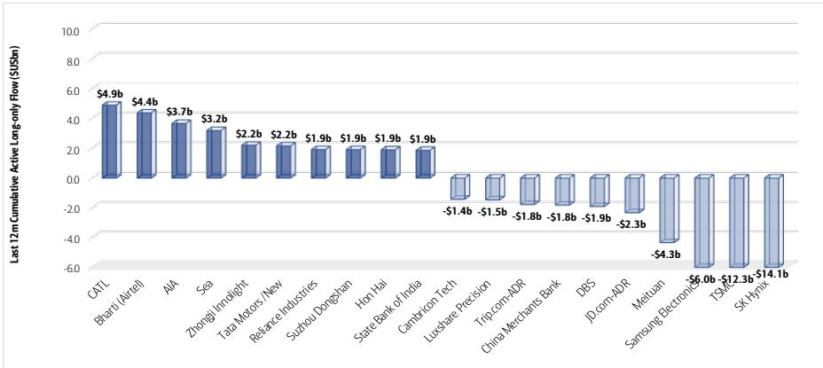

bar

| Company | Last 12m Cumulative Active Long-only Flow ($USbn) |
| :--- | :--- |
| CATL | 4.9 |
| Bharti (Airtel) | 4.4 |
| AIA | 3.7 |
| Sea | 3.2 |
| Zhongji Innolight | 2.2 |
| Tata Motors / New | 2.2 |
| Reliance Industries | 1.9 |
| Suzhou Dongshan | 1.9 |
| Hon Hai | 1.9 |
| State Bank of India | 1.9 |
| Cambricon Tech | -1.4 |
| Luxshare Precision | -1.5 |
| Trip.com/ADR | -1.8 |
| China Merchants Bank | -1.8 |
| DBS | -1.9 |
| JD.com/ADR | -2.3 |
| Meituan | -4.3 |
| Samsung Electronics | -6.0 |
| TSMC | -12.3 |
| SK Hynix | -14.1 |

Source : BofA Asia Pac Quantitative Strategy, MSCI, FTSE, FactSet, Bloomberg, 13F Filings, Benchmark Indices, Country Stock Exchanges   
BofA GLOBAL RESEARCH

# Positioning versus Benchmark - Active Long-Only

Countries - Positioning versus benchmark

Chart 36: Asia Pac ex-Japan Countries Positioning versus Benchmark: LAST MONTH   
Funds are most overweight Taiwan and most underweight India   
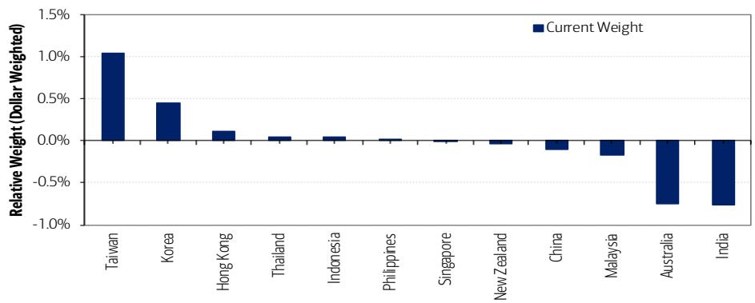

bar

| Country | Current Weight (Dollar Weighted) (%) |
| :--- | :--- |
| Taiwan | 1.05 |
| Korea | 0.45 |
| Hong Kong | 0.12 |
| Thailand | 0.03 |
| Indonesia | 0.04 |
| Philippines | -0.01 |
| Singapore | -0.02 |
| New Zealand | -0.03 |
| China | -0.15 |
| Malaysia | -0.28 |
| Australia | -0.75 |
| India | -0.78 |

Source : BofA Asia Pac Quantitative Strategy, MSCI, FTSE, FactSet, Bloomberg, 13F Filings, Benchmark Indices, Country Stock Exchanges   
BofA GLOBAL RESEARCH

Chart 37: Asia Pac: Positioning versus Benchmark   
Funds have increased their exposure globally in recent months   
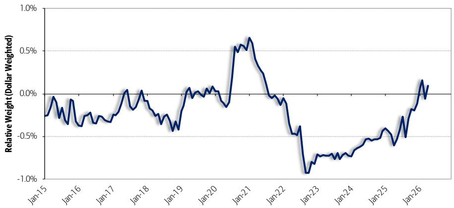

line

| Date   | Relative Weight (Dollar Weighted) |
|--------|-----------------------------------|
| Jan-15 | -0.2%                             |
| Jan-16 | -0.3%                             |
| Jan-17 | -0.4%                             |
| Jan-18 | -0.1%                             |
| Jan-19 | -0.5%                             |
| Jan-20 | 0.0%                              |
| Jan-21 | 0.6%                              |
| Jan-22 | -0.2%                             |
| Jan-23 | -0.9%                             |
| Jan-24 | -0.7%                             |
| Jan-25 | -0.5%                             |
| Jan-26 | 0.1%                              |

Source : BofA Asia Pac Quantitative Strategy, MSCI, FTSE, FactSet, Bloomberg, 13F Filings, Benchmark Indices, Country Stock Exchanges   
BofA GLOBAL RESEARCH

Chart 38: Australia: Positioning versus Benchmark   
In last 3m, funds have increased exposure to Australia   
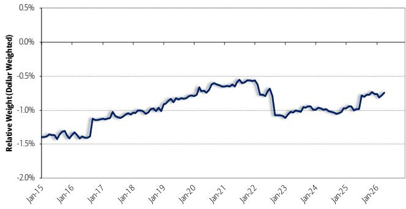

line

| Date   | Relative Weight (Dollar Weighted) |
|--------|-----------------------------------|
| Jan-15 | -1.5%                             |
| Jan-16 | -1.4%                             |
| Jan-17 | -1.0%                             |
| Jan-18 | -0.9%                             |
| Jan-19 | -0.8%                             |
| Jan-20 | -0.7%                             |
| Jan-21 | -0.6%                             |
| Jan-22 | -0.5%                             |
| Jan-23 | -1.0%                             |
| Jan-24 | -0.9%                             |
| Jan-25 | -0.8%                             |
| Jan-26 | -0.7%                             |

Source : BofA Asia Pac Quantitative Strategy, MSCI, FTSE, FactSet, Bloomberg, 13F Filings, Benchmark Indices, Country Stock Exchanges   
BofA GLOBAL RESEARCH

Chart 40: Hong Kong: Positioning versus Benchmark   
In last 3m, funds have increased exposure to Hong Kong   
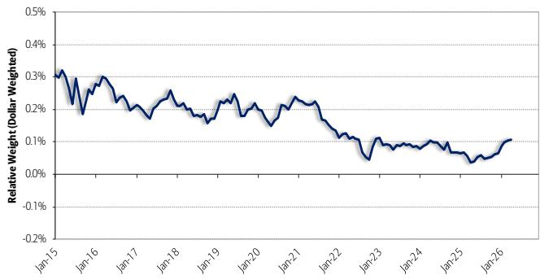

line

| Date   | Relative Weight (Dollar Weighted) |
|--------|-----------------------------------|
| Jan-15 | 0.3%                              |
| Jan-16 | 0.2%                              |
| Jan-17 | 0.25%                             |
| Jan-18 | 0.2%                              |
| Jan-19 | 0.25%                             |
| Jan-20 | 0.2%                              |
| Jan-21 | 0.25%                             |
| Jan-22 | 0.1%                              |
| Jan-23 | 0.05%                             |
| Jan-24 | 0.08%                             |
| Jan-25 | 0.05%                             |
| Jan-26 | 0.1%                              |

Source : BofA Asia Pac Quantitative Strategy, MSCI, FTSE, FactSet, Bloomberg, 13F Filings, Benchmark Indices, Country Stock Exchanges   
BofA GLOBAL RESEARCH

Chart 42: Indonesia: Positioning versus Benchmark   
In last 3m, funds have cut exposure to Indonesia   
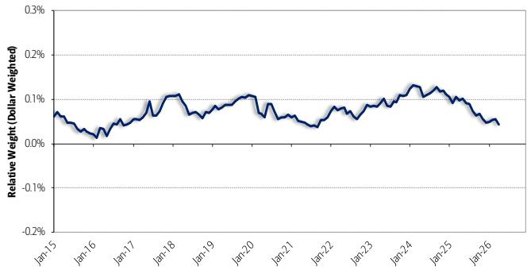

line

| Date   | Relative Weight (Dollar Weighted) |
|--------|-----------------------------------|
| Jan-15 | 0.07%                             |
| Jan-16 | 0.03%                             |
| Jan-17 | 0.08%                             |
| Jan-18 | 0.11%                             |
| Jan-19 | 0.09%                             |
| Jan-20 | 0.10%                             |
| Jan-21 | 0.07%                             |
| Jan-22 | 0.08%                             |
| Jan-23 | 0.10%                             |
| Jan-24 | 0.13%                             |
| Jan-25 | 0.12%                             |
| Jan-26 | 0.05%                             |

Source : BofA Asia Pac Quantitative Strategy, MSCI, FTSE, FactSet, Bloomberg, 13F Filings, Benchmark Indices, Country Stock Exchanges   
BofA GLOBAL RESEARCH

Chart 39: China: Positioning versus Benchmark   
In last 3m, funds have cut exposure to China   
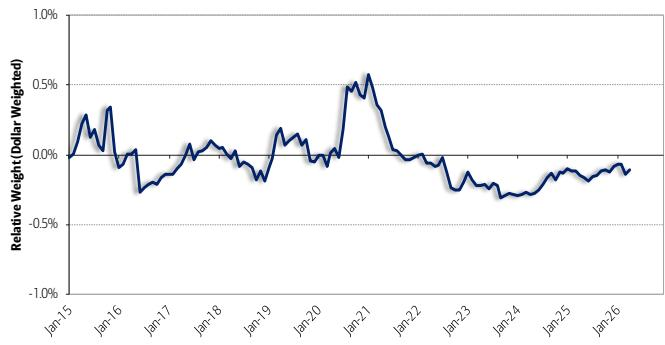

line

| Date   | Relative Weight (Dollar Weighted) |
|--------|-----------------------------------|
| Jan-15 | 0.0%                              |
| Jan-16 | 0.3%                              |
| Jan-17 | -0.2%                             |
| Jan-18 | 0.1%                              |
| Jan-19 | -0.1%                             |
| Jan-20 | 0.2%                              |
| Jan-21 | 0.6%                              |
| Jan-22 | 0.0%                              |
| Jan-23 | -0.3%                             |
| Jan-24 | -0.4%                             |
| Jan-25 | -0.2%                             |
| Jan-26 | -0.1%                             |

Source : BofA Asia Pac Quantitative Strategy, MSCI, FTSE, FactSet, Bloomberg, 13F Filings, Benchmark Indices, Country Stock Exchanges   
BofA GLOBAL RESEARCH

Chart 41: India: Positioning versus Benchmark   
In last 3m, funds have cut exposure to India   
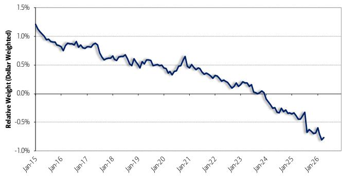

line

| Date   | Relative Weight (Dollar Weighted) |
|--------|-----------------------------------|
| Jan-15 | 1.2%                              |
| Jan-16 | 0.9%                              |
| Jan-17 | 0.8%                              |
| Jan-18 | 0.6%                              |
| Jan-19 | 0.5%                              |
| Jan-20 | 0.4%                              |
| Jan-21 | 0.6%                              |
| Jan-22 | 0.3%                              |
| Jan-23 | 0.1%                              |
| Jan-24 | -0.2%                             |
| Jan-25 | -0.5%                             |
| Jan-26 | -0.8%                             |

Source : BofA Asia Pac Quantitative Strategy, MSCI, FTSE, FactSet, Bloomberg, 13F Filings, Benchmark Indices, Country Stock Exchanges   
BofA GLOBAL RESEARCH

Chart 43: Korea: Positioning versus Benchmark   
In last 3m, funds have cut exposure to Korea   
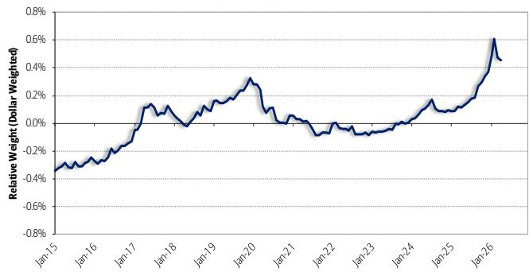

line

| Date    | Relative Weight (Dollar Weighted) |
|---------|-----------------------------------|
| Jan-15  | -0.4%                             |
| Jan-16  | -0.3%                             |
| Jan-17  | -0.2%                             |
| Jan-18  | 0.1%                              |
| Jan-19  | 0.2%                              |
| Jan-20  | 0.3%                              |
| Jan-21  | 0.1%                              |
| Jan-22  | -0.1%                             |
| Jan-23  | -0.2%                             |
| Jan-24  | 0.1%                              |
| Jan-25  | 0.3%                              |
| Jan-26  | 0.6%                              |

Source : BofA Asia Pac Quantitative Strategy, MSCI, FTSE, FactSet, Bloomberg, 13F Filings, Benchmark Indices, Country Stock Exchanges   
BofA GLOBAL RESEARCH

Chart 44: Malaysia: Positioning versus Benchmark In last 3m, funds have increased exposure to Malaysia   
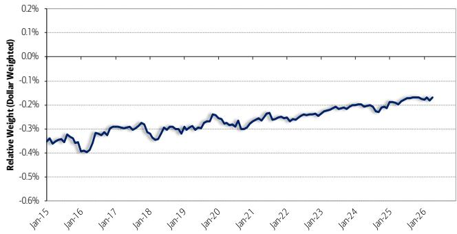

line

| Date   | Relative Weight (Dollar Weighted) |
|--------|-----------------------------------|
| Jan-15 | -0.4%                             |
| Jan-16 | -0.4%                             |
| Jan-17 | -0.3%                             |
| Jan-18 | -0.3%                             |
| Jan-19 | -0.3%                             |
| Jan-20 | -0.2%                             |
| Jan-21 | -0.2%                             |
| Jan-22 | -0.2%                             |
| Jan-23 | -0.2%                             |
| Jan-24 | -0.2%                             |
| Jan-25 | -0.2%                             |
| Jan-26 | -0.2%                             |

Source : BofA Asia Pac Quantitative Strategy, MSCI, FTSE, FactSet, Bloomberg, 13F Filings, Benchmark Indices, Country Stock Exchanges   
BofA GLOBAL RESEARCH

Chart 46: Philippines: Positioning versus Benchmark
In last 3m, funds have cut exposure to Philippines   
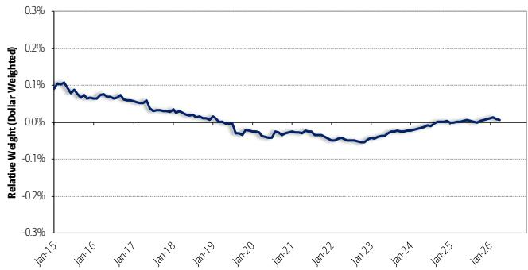

line

| Date    | Relative Weight (Dollar Weighted) |
|---------|-----------------------------------|
| Jan-15  | 0.1%                              |
| Jan-16  | 0.08%                             |
| Jan-17  | 0.06%                             |
| Jan-18  | 0.04%                             |
| Jan-19  | 0.02%                             |
| Jan-20  | -0.02%                            |
| Jan-21  | -0.04%                            |
| Jan-22  | -0.06%                            |
| Jan-23  | -0.08%                            |
| Jan-24  | -0.04%                            |
| Jan-25  | 0.0%                              |
| Jan-26  | 0.02%                             |

Source : BofA Asia Pac Quantitative Strategy, MSCI, FTSE, FactSet, Bloomberg, 13F Filings, Benchmark Indices, Country Stock Exchanges   
BofA GLOBAL RESEARCH

Chart 48: Taiwan: Positioning versus Benchmark In last 3m, funds have increased exposure to Taiwan   
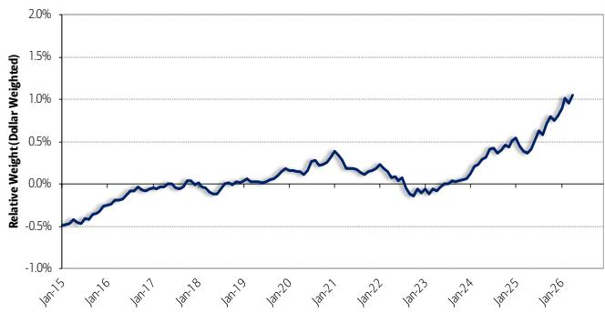

line

| Date   | Relative Weight (Dollar Weighted) |
|--------|-----------------------------------|
| Jan-15 | -0.5%                             |
| Jan-16 | -0.3%                             |
| Jan-17 | -0.1%                             |
| Jan-18 | 0.0%                              |
| Jan-19 | 0.1%                              |
| Jan-20 | 0.2%                              |
| Jan-21 | 0.4%                              |
| Jan-22 | 0.3%                              |
| Jan-23 | -0.1%                             |
| Jan-24 | 0.2%                              |
| Jan-25 | 0.5%                              |
| Jan-26 | 1.0%                              |

Source : BofA Asia Pac Quantitative Strategy, MSCI, FTSE, FactSet, Bloomberg, 13F Filings, Benchmark Indices, Country Stock Exchanges   
BofA GLOBAL RESEARCH

Chart 45: New Zealand: Positioning versus Benchmark
In last 3m, funds have cut exposure to New Zealand   
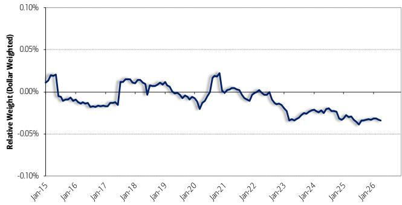

line

| Date   | Relative Weight (Dollar Weighted) |
|--------|-----------------------------------|
| Jan-15 | 0.02%                             |
| Jan-16 | -0.01%                            |
| Jan-17 | -0.02%                            |
| Jan-18 | 0.01%                             |
| Jan-19 | 0.00%                             |
| Jan-20 | -0.03%                            |
| Jan-21 | 0.02%                             |
| Jan-22 | -0.01%                            |
| Jan-23 | -0.04%                            |
| Jan-24 | -0.03%                            |
| Jan-25 | -0.04%                            |
| Jan-26 | -0.05%                            |

Source : BofA Asia Pac Quantitative Strategy, MSCI, FTSE, FactSet, Bloomberg, 13F Filings, Benchmark Indices, Country Stock Exchanges   
BofA GLOBAL RESEARCH

Chart 47: Singapore: Positioning versus Benchmark In last 3m, funds have cut exposure to Singapore   
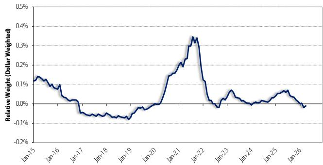

line

| Date   | Relative Weight (Dollar Weighted) |
|--------|-----------------------------------|
| Jan-15 | 0.12                              |
| Jan-16 | 0.08                              |
| Jan-17 | -0.05                             |
| Jan-18 | -0.08                             |
| Jan-19 | -0.10                             |
| Jan-20 | 0.00                              |
| Jan-21 | 0.20                              |
| Jan-22 | 0.35                              |
| Jan-23 | 0.05                              |
| Jan-24 | 0.02                              |
| Jan-25 | 0.08                              |
| Jan-26 | -0.02                             |

Source : BofA Asia Pac Quantitative Strategy, MSCI, FTSE, FactSet, Bloomberg, 13F Filings, Benchmark Indices, Country Stock Exchanges   
BofA GLOBAL RESEARCH

Chart 49: Thailand: Positioning versus Benchmark In last 3m, funds have cut exposure to Thailand   
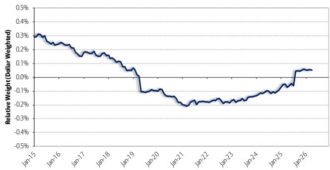

line

| Date    | Relative Weight (Dollar Weighted) |
|---------|-----------------------------------|
| Jan-15  | 0.3%                              |
| Jan-16  | 0.25%                             |
| Jan-17  | 0.2%                              |
| Jan-18  | 0.15%                             |
| Jan-19  | 0.05%                             |
| Jan-20  | -0.1%                             |
| Jan-21  | -0.2%                             |
| Jan-22  | -0.15%                            |
| Jan-23  | -0.1%                             |
| Jan-24  | -0.05%                            |
| Jan-25  | 0.0%                              |
| Jan-26  | 0.05%                             |

Source : BofA Asia Pac Quantitative Strategy, MSCI, FTSE, FactSet, Bloomberg, 13F Filings, Benchmark Indices, Country Stock Exchanges   
BofA GLOBAL RESEARCH

# Asia Pac ex-Japan Sectors - Positioning versus benchmark

Chart 50: Asia Pac ex-Japan SECTORS Positioning versus Benchmark: LAST MONTH   
Relative to their benchmark funds are most overweight Semiconductors   
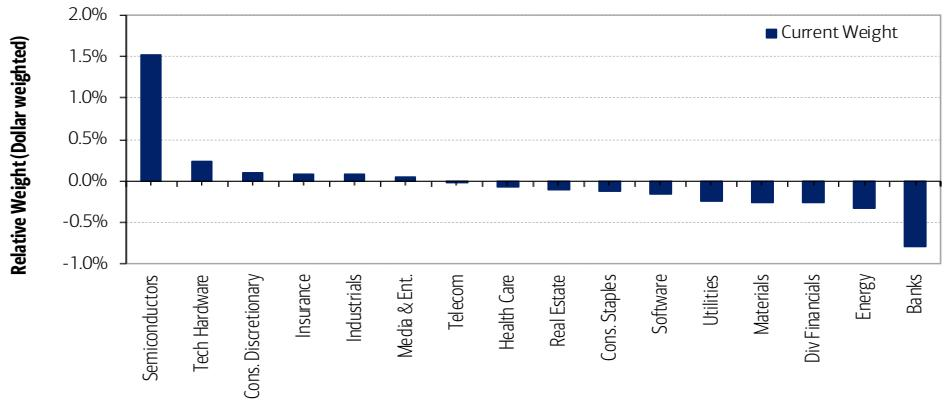

bar

| Sector              | Relative Weight (Dollar weighted) |
| ------------------- | ---------------------------------- |
| Semiconductors      | 1.5%                               |
| Tech Hardware       | 0.2%                               |
| Cons. Discretionary | 0.1%                               |
| Insurance           | 0.1%                               |
| Industrials         | 0.1%                               |
| Media & Ent.        | 0.0%                               |
| Telecom             | -0.1%                              |
| Health Care         | -0.1%                              |
| Real Estate         | -0.2%                              |
| Cons. Staples       | -0.2%                              |
| Software            | -0.3%                              |
| Utilities           | -0.4%                              |
| Materials           | -0.4%                              |
| Div Financials      | -0.5%                              |
| Energy              | -0.6%                              |
| Banks               | -0.8%                              |

Source : BofA Asia Pac Quantitative Strategy, MSCI, FTSE, FactSet, Bloomberg, 13F Filings, Benchmark Indices, Country Stock Exchanges
BofA GLOBAL RESEARCH

Chart 51: Asia Pac ex-Japan EARLY CYCLICALS Positioning versus Benchmark   
Funds are most overweight Cons. Discretionary   
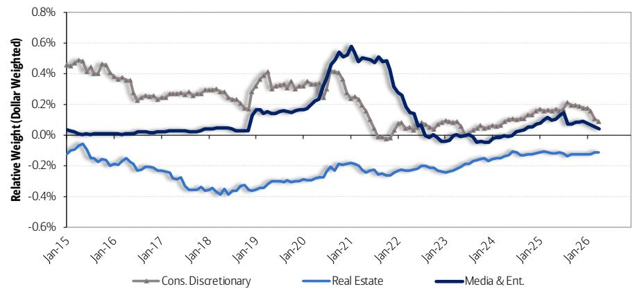

line

| Date   | Cons. Discretionary | Real Estate | Media & Ent. |
|--------|---------------------|-------------|--------------|
| Jan-15 | 0.45%               | -0.1%       | 0.0%         |
| Jan-16 | 0.40%               | -0.2%       | 0.0%         |
| Jan-17 | 0.35%               | -0.3%       | 0.0%         |
| Jan-18 | 0.30%               | -0.4%       | 0.0%         |
| Jan-19 | 0.25%               | -0.3%       | 0.1%         |
| Jan-20 | 0.30%               | -0.2%       | 0.2%         |
| Jan-21 | 0.40%               | -0.1%       | 0.6%         |
| Jan-22 | 0.10%               | -0.1%       | 0.5%         |
| Jan-23 | 0.05%               | -0.1%       | 0.1%         |
| Jan-24 | 0.10%               | -0.1%       | -0.1%        |
| Jan-25 | 0.15%               | -0.1%       | 0.1%         |
| Jan-26 | 0.10%               | -0.1%       | 0.1%         |

Source : BofA Asia Pac Quantitative Strategy, MSCI, FTSE, FactSet, Bloomberg, 13F Filings, Benchmark Indices, Country Stock Exchanges
BofA GLOBAL RESEARCH

Chart 52: Asia Pac ex-Japan FINANCIALS Positioning versus Benchmark   
In last 3m, funds have increased exposure the most to Insurance   
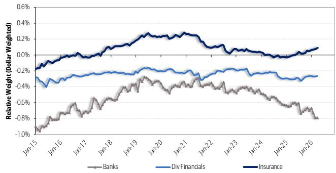

line

| Date   | Banks  | Div Financials | Insurance |
|--------|--------|----------------|---------|
| Jan-15 | -1.0%  | -0.4%          | -0.2%   |
| Jan-16 | -0.8%  | -0.3%          | -0.1%   |
| Jan-17 | -0.6%  | -0.2%          | 0.0%    |
| Jan-18 | -0.4%  | -0.1%          | 0.1%    |
| Jan-19 | -0.2%  | 0.0%           | 0.2%    |
| Jan-20 | 0.0%   | 0.1%           | 0.3%    |
| Jan-21 | 0.1%   | 0.2%           | 0.4%    |
| Jan-22 | 0.2%   | 0.1%           | 0.3%    |
| Jan-23 | 0.1%   | 0.0%           | 0.2%    |
| Jan-24 | 0.0%   | -0.1%          | 0.1%    |
| Jan-25 | -0.1%  | -0.2%          | 0.0%    |
| Jan-26 | -0.3%  | -0.3%          | 0.1%    |

Source : BofA Asia Pac Quantitative Strategy, MSCI, FTSE, FactSet, Bloomberg, 13F Filings, Benchmark Indices, Country Stock Exchanges

BofA GLOBAL RESEARCH

Chart 54: Asia Pac ex-Japan LATE CYCLICALS Positioning versus Benchmark   
Funds are most overweight Industrials   
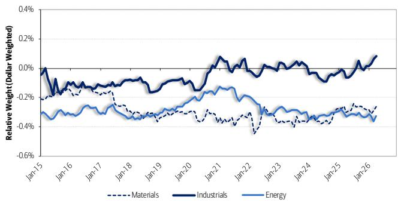

line

| Date   | Materials | Industrials | Energy |
|--------|-----------|-------------|--------|
| Jan-15 | -0.3%     | 0.0%        | -0.3%  |
| Jan-16 | -0.2%     | -0.1%       | -0.3%  |
| Jan-17 | -0.3%     | -0.1%       | -0.3%  |
| Jan-18 | -0.4%     | -0.1%       | -0.3%  |
| Jan-19 | -0.3%     | -0.1%       | -0.3%  |
| Jan-20 | -0.2%     | -0.1%       | -0.3%  |
| Jan-21 | -0.3%     | 0.1%        | -0.2%  |
| Jan-22 | -0.4%     | 0.1%        | -0.3%  |
| Jan-23 | -0.3%     | 0.1%        | -0.3%  |
| Jan-24 | -0.3%     | 0.1%        | -0.3%  |
| Jan-25 | -0.3%     | 0.1%        | -0.3%  |
| Jan-26 | -0.3%     | 0.1%        | -0.3%  |

Source : BofA Asia Pac Quantitative Strategy, MSCI, FTSE, FactSet, Bloomberg, 13F Filings, Benchmark Indices, Country Stock Exchanges

BofA GLOBAL RESEARCH

Chart 53: Asia Pac ex-Japan INFORMATION TECHNOLOGY Positioning versus Benchmark   
In last 3m, funds have increased exposure the most to Semiconductors   
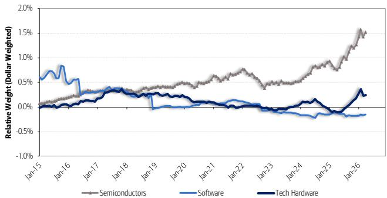

line

| Date   | Semiconductors | Software | Tech Hardware |
|--------|----------------|----------|---------------|
| Jan-15 | 0.0%           | 0.5%     | 0.0%          |
| Jan-16 | 0.1%           | 0.8%     | 0.1%          |
| Jan-17 | 0.2%           | 0.3%     | 0.2%          |
| Jan-18 | 0.3%           | 0.4%     | 0.3%          |
| Jan-19 | 0.4%           | 0.2%     | 0.4%          |
| Jan-20 | 0.5%           | 0.1%     | 0.3%          |
| Jan-21 | 0.6%           | 0.0%     | 0.2%          |
| Jan-22 | 0.7%           | -0.1%    | 0.1%          |
| Jan-23 | 0.8%           | -0.2%    | 0.0%          |
| Jan-24 | 0.9%           | -0.3%    | -0.1%         |
| Jan-25 | 1.0%           | -0.4%    | -0.2%         |
| Jan-26 | 1.5%           | -0.5%    | 0.3%          |

Source : BofA Asia Pac Quantitative Strategy, MSCI, FTSE, FactSet, Bloomberg, 13F Filings, Benchmark Indices, Country Stock Exchanges

BofA GLOBAL RESEARCH

Chart 55: Asia Pac ex-Japan DEFENSIVES Positioning versus Benchmark   
In last 3m, funds have increased exposure the most to Cons. Staples   
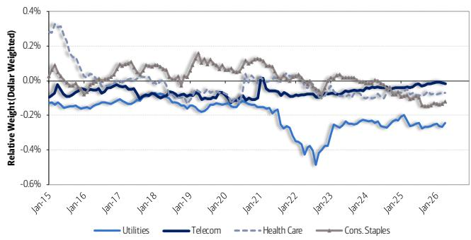

line

| Date   | Utilities | Telecom | Health Care | Cons. Staples |
|--------|-----------|---------|-------------|---------------|
| Jan-15 | -0.1      | -0.05   | 0.3         | 0.1           |
| Jan-16 | -0.15     | -0.08   | 0.2         | 0.05          |
| Jan-17 | -0.1      | -0.07   | 0.1         | 0.0           |
| Jan-18 | -0.12     | -0.09   | 0.05        | 0.0           |
| Jan-19 | -0.1      | -0.1    | 0.0         | 0.1           |
| Jan-20 | -0.15     | -0.12   | -0.05       | 0.05          |
| Jan-21 | -0.2      | -0.15   | -0.1        | 0.0           |
| Jan-22 | -0.4      | -0.2    | -0.15       | -0.05         |
| Jan-23 | -0.3      | -0.25   | -0.2        | -0.1          |
| Jan-24 | -0.25     | -0.2    | -0.25       | -0.15         |
| Jan-25 | -0.2      | -0.15   | -0.3        | -0.2          |
| Jan-26 | -0.15     | -0.1    | -0.35       | -0.25         |

Source : BofA Asia Pac Quantitative Strategy, MSCI, FTSE, FactSet, Bloomberg, 13F Filings, Benchmark Indices, Country Stock Exchanges

BofA GLOBAL RESEARCH

Table 10: Asia Pac ex-Japan Country-Sectors Active Long-only Positioning versus Benchmark: DOLLAR VALUE (\$USbn)

Asia Pac ex-Japan Country-Sectors Active Long-only Positioning versus Benchmark in Dollar Value

<table><tr><td></td><td>Banks</td><td>Cons. Discretionary</td><td>Cons. Staples</td><td>Div Financials</td><td>Energy</td><td>Health Care</td><td>Industrials</td><td>Insurance</td><td>Materials</td><td>Media &amp; Ent.</td><td>Real Estate</td><td>Semis</td><td>Software</td><td>Tech Hardware</td><td>Telecom</td><td>Utilities</td><td>Total</td></tr><tr><td>Australia</td><td>-44.97</td><td>-5.64</td><td>-3.84</td><td>-6.12</td><td>-4.95</td><td>-5.22</td><td>-2.00</td><td>-2.80</td><td>-19.97</td><td>-0.64</td><td>-6.12</td><td>-0.02</td><td>-0.71</td><td>0.18</td><td>0.05</td><td>-1.93</td><td>-104.69</td></tr><tr><td>China</td><td>-35.65</td><td>3.47</td><td>-2.20</td><td>-9.84</td><td>-9.82</td><td>6.38</td><td>27.70</td><td>-2.73</td><td>4.19</td><td>8.09</td><td>0.49</td><td>9.86</td><td>-2.99</td><td>-1.10</td><td>-1.24</td><td>-8.34</td><td>-13.72</td></tr><tr><td>Hong Kong</td><td>-1.32</td><td>7.56</td><td>0.75</td><td>-0.79</td><td>0.02</td><td>-1.17</td><td>5.02</td><td>16.07</td><td>0.49</td><td>0.09</td><td>-4.22</td><td>2.29</td><td>-0.21</td><td>0.52</td><td>-0.26</td><td>-5.21</td><td>19.63</td></tr><tr><td>India</td><td>4.90</td><td>0.07</td><td>-7.95</td><td>-7.28</td><td>-18.39</td><td>-1.25</td><td>-10.76</td><td>1.60</td><td>-12.84</td><td>0.03</td><td>2.32</td><td>-0.82</td><td>-14.43</td><td>0.78</td><td>-2.03</td><td>-4.54</td><td>-70.59</td></tr><tr><td>Indonesia</td><td>3.31</td><td>-0.03</td><td>0.42</td><td>0.02</td><td>-0.50</td><td>0.08</td><td>0.38</td><td>0.00</td><td>-1.18</td><td>0.02</td><td>0.15</td><td>-</td><td>0.00</td><td>0.01</td><td>0.52</td><td>-0.17</td><td>3.04</td></tr><tr><td>Korea</td><td>6.55</td><td>5.99</td><td>0.87</td><td>-0.69</td><td>-1.51</td><td>-4.99</td><td>-9.60</td><td>2.13</td><td>-2.03</td><td>-1.96</td><td>-0.09</td><td>28.86</td><td>-0.16</td><td>33.19</td><td>1.67</td><td>-0.42</td><td>57.79</td></tr><tr><td>Malaysia</td><td>-4.62</td><td>-0.26</td><td>-1.32</td><td>0.02</td><td>0.02</td><td>-0.60</td><td>-0.85</td><td>0.05</td><td>-1.14</td><td>0.00</td><td>-0.06</td><td>0.12</td><td>0.01</td><td>0.04</td><td>-0.87</td><td>-2.08</td><td>-11.54</td></tr><tr><td>Philippines</td><td>-0.12</td><td>-0.06</td><td>0.36</td><td>0.00</td><td>-0.01</td><td>-</td><td>0.85</td><td>-</td><td>0.08</td><td>-</td><td>-0.35</td><td>-</td><td>-</td><td>-</td><td>-0.10</td><td>-0.27</td><td>0.39</td></tr><tr><td>Singapore</td><td>-5.44</td><td>5.10</td><td>0.02</td><td>-0.24</td><td>0.34</td><td>0.32</td><td>-1.84</td><td>0.00</td><td>0.00</td><td>-0.04</td><td>-2.56</td><td>0.03</td><td>0.04</td><td>0.19</td><td>3.02</td><td>-0.13</td><td>-1.19</td></tr><tr><td>Taiwan</td><td>-11.39</td><td>0.55</td><td>-0.40</td><td>-1.85</td><td>-0.01</td><td>-0.94</td><td>0.95</td><td>-5.53</td><td>-4.16</td><td>-0.38</td><td>0.02</td><td>168.49</td><td>0.02</td><td>-5.08</td><td>-2.46</td><td>0.01</td><td>137.84</td></tr><tr><td>Thailand</td><td>7.22</td><td>0.06</td><td>0.47</td><td>0.10</td><td>1.14</td><td>-0.30</td><td>-0.47</td><td>0.03</td><td>-0.39</td><td>-0.01</td><td>-0.23</td><td>-</td><td>-0.01</td><td>-4.01</td><td>0.07</td><td>0.03</td><td>3.69</td></tr><tr><td>Asia Pac ex-Japan</td><td>-81.50</td><td>16.87</td><td>-12.79</td><td>-27.07</td><td>-33.67</td><td>-8.29</td><td>9.13</td><td>8.85</td><td>-36.93</td><td>5.23</td><td>-10.71</td><td>208.80</td><td>-19.37</td><td>24.71</td><td>-1.65</td><td>-23.75</td><td>17.86</td></tr></table>

Source : BofA Asia Pac Quantitative Strategy, MSCI, FTSE, FactSet, Bloomberg, 13F Filings, Benchmark Indices, Country Stock Exchanges   
BofA GLOBAL RESEARCH

Table 11: Asia Pac ex-Japan Country-Sectors Active Long-only Positioning versus Benchmark: LAST MONTH

Asia Pac ex-Japan COUNTRY-SECTORS Active Long-only Positioning versus Benchmark

<table><tr><td></td><td>Banks</td><td>Cons. Discretionary</td><td>Cons. Staples</td><td>Div Financials</td><td>Energy</td><td>Health Care</td><td>Industrials</td><td>Insurance</td><td>Materials</td><td>Media &amp; Ent.</td><td>Real Estate</td><td>Semis</td><td>Software</td><td>Tech Hardware</td><td>Telecom</td><td>Utilities</td><td>Total</td></tr><tr><td>Australia</td><td>-0.56%</td><td>-0.07%</td><td>-0.05%</td><td>-0.07%</td><td>-0.06%</td><td>-0.05%</td><td>-0.02%</td><td>-0.03%</td><td>-0.16%</td><td>-0.01%</td><td>-0.08%</td><td>0.00%</td><td>-0.01%</td><td>0.01%</td><td>0.00%</td><td>-0.02%</td><td>-0.74%</td></tr><tr><td>China</td><td>-0.53%</td><td>0.04%</td><td>-0.03%</td><td>-0.14%</td><td>-0.15%</td><td>0.08%</td><td>0.28%</td><td>-0.04%</td><td>0.06%</td><td>0.10%</td><td>0.01%</td><td>0.14%</td><td>-0.03%</td><td>-0.01%</td><td>-0.02%</td><td>-0.12%</td><td>-0.11%</td></tr><tr><td>Hong Kong</td><td>-0.02%</td><td>0.04%</td><td>0.01%</td><td>-0.01%</td><td>0.00%</td><td>-0.02%</td><td>0.05%</td><td>0.19%</td><td>0.01%</td><td>0.00%</td><td>-0.05%</td><td>0.06%</td><td>0.00%</td><td>0.01%</td><td>0.00%</td><td>-0.06%</td><td>0.11%</td></tr><tr><td>India</td><td>0.06%</td><td>0.00%</td><td>-0.11%</td><td>-0.10%</td><td>-0.25%</td><td>-0.02%</td><td>-0.15%</td><td>0.02%</td><td>-0.18%</td><td>0.00%</td><td>0.03%</td><td>-0.01%</td><td>-0.20%</td><td>0.02%</td><td>-0.03%</td><td>-0.06%</td><td>-0.77%</td></tr><tr><td>Indonesia</td><td>0.05%</td><td>0.00%</td><td>0.01%</td><td>0.00%</td><td>-0.01%</td><td>0.00%</td><td>0.01%</td><td>0.00%</td><td>-0.02%</td><td>0.00%</td><td>0.00%</td><td>-</td><td>0.00%</td><td>0.00%</td><td>0.01%</td><td>0.00%</td><td>0.04%</td></tr><tr><td>Korea</td><td>0.09%</td><td>0.06%</td><td>0.01%</td><td>-0.01%</td><td>-0.02%</td><td>-0.07%</td><td>-0.14%</td><td>0.03%</td><td>-0.03%</td><td>-0.03%</td><td>0.00%</td><td>0.32%</td><td>0.00%</td><td>0.36%</td><td>0.03%</td><td>-0.01%</td><td>0.45%</td></tr><tr><td>Malaysia</td><td>-0.07%</td><td>0.00%</td><td>-0.02%</td><td>0.00%</td><td>0.00%</td><td>-0.01%</td><td>-0.01%</td><td>0.00%</td><td>-0.02%</td><td>0.00%</td><td>0.00%</td><td>0.00%</td><td>0.00%</td><td>0.00%</td><td>-0.01%</td><td>-0.03%</td><td>-0.17%</td></tr><tr><td>Philippines</td><td>0.00%</td><td>0.00%</td><td>0.01%</td><td>0.00%</td><td>0.00%</td><td>-</td><td>0.01%</td><td>-</td><td>0.00%</td><td>-</td><td>-0.01%</td><td>-</td><td>-</td><td>-</td><td>0.00%</td><td>0.00%</td><td>0.01%</td></tr><tr><td>Singapore</td><td>-0.07%</td><td>0.06%</td><td>0.00%</td><td>0.00%</td><td>0.01%</td><td>0.01%</td><td>-0.02%</td><td>0.00%</td><td>0.00%</td><td>0.00%</td><td>-0.03%</td><td>0.00%</td><td>0.01%</td><td>0.01%</td><td>0.04%</td><td>0.00%</td><td>-0.01%</td></tr><tr><td>Taiwan</td><td>-0.18%</td><td>0.01%</td><td>-0.01%</td><td>-0.03%</td><td>0.00%</td><td>-0.01%</td><td>0.01%</td><td>-0.09%</td><td>-0.06%</td><td>-0.01%</td><td>0.00%</td><td>1.31%</td><td>0.00%</td><td>-0.07%</td><td>-0.04%</td><td>0.00%</td><td>1.05%</td></tr><tr><td>Thailand</td><td>0.11%</td><td>0.00%</td><td>0.01%</td><td>0.00%</td><td>0.02%</td><td>0.00%</td><td>-0.01%</td><td>0.00%</td><td>-0.01%</td><td>0.00%</td><td>0.00%</td><td>-</td><td>0.00%</td><td>-0.06%</td><td>0.00%</td><td>0.00%</td><td>0.05%</td></tr><tr><td>Asia Pac ex-Japan</td><td>-0.79%</td><td>0.09%</td><td>-0.12%</td><td>-0.26%</td><td>-0.33%</td><td>-0.07%</td><td>0.08%</td><td>0.09%</td><td>-0.26%</td><td>0.04%</td><td>-0.11%</td><td>1.52%</td><td>-0.16%</td><td>0.24%</td><td>-0.02%</td><td>-0.24%</td><td>0.09%</td></tr></table>

Source : BofA Asia Pac Quantitative Strategy, MSCI, FTSE, FactSet, Bloomberg, 13F Filings, Benchmark Indices, Country Stock Exchanges   
BofA GLOBAL RESEARCH

Table 12: Asia Pac ex-Japan Country-Sectors Active Long-only Positioning versus Benchmark: 1-MONTH CHANGE

Asia Pac ex-Japan Country-Sectors Active Long-only Positioning versus Benchmark: 1-MONTH CHANGE

<table><tr><td></td><td>Banks</td><td>Cons. Discretionary</td><td>Cons. Staples</td><td>Div Financials</td><td>Energy</td><td>Health Care</td><td>Industrials</td><td>Insurance</td><td>Materials</td><td>Media &amp; Ent.</td><td>Real Estate</td><td>Semiconductors</td><td>Software</td><td>Tech Hardware</td><td>Telecom</td><td>Utilities</td><td>Total</td></tr><tr><td>Australia</td><td>0.02%</td><td>0.00%</td><td>0.00%</td><td>-0.01%</td><td>0.01%</td><td>0.01%</td><td>0.00%</td><td>0.00%</td><td>0.01%</td><td>0.00%</td><td>0.00%</td><td>0.00%</td><td>0.00%</td><td>0.00%</td><td>0.00%</td><td>0.00%</td><td>0.04%</td></tr><tr><td>China</td><td>0.01%</td><td>-0.04%</td><td>0.00%</td><td>0.02%</td><td>0.02%</td><td>-0.03%</td><td>0.02%</td><td>0.02%</td><td>0.04%</td><td>-0.01%</td><td>0.00%</td><td>-0.01%</td><td>-0.01%</td><td>0.02%</td><td>-0.01%</td><td>0.02%</td><td>0.03%</td></tr><tr><td>Hong Kong</td><td>-0.01%</td><td>0.00%</td><td>0.00%</td><td>0.00%</td><td>0.00%</td><td>0.00%</td><td>0.01%</td><td>0.00%</td><td>0.00%</td><td>0.00%</td><td>0.00%</td><td>0.02%</td><td>0.00%</td><td>0.00%</td><td>0.00%</td><td>0.00%</td><td>0.00%</td></tr><tr><td>India</td><td>0.01%</td><td>0.02%</td><td>-0.01%</td><td>0.01%</td><td>0.01%</td><td>0.01%</td><td>0.00%</td><td>0.00%</td><td>0.02%</td><td>0.00%</td><td>0.00%</td><td>0.00%</td><td>0.02%</td><td>0.00%</td><td>0.00%</td><td>0.01%</td><td>0.04%</td></tr><tr><td>Indonesia</td><td>-0.01%</td><td>0.00%</td><td>0.00%</td><td>0.00%</td><td>0.00%</td><td>0.00%</td><td>0.00%</td><td>0.00%</td><td>0.00%</td><td>0.00%</td><td>0.00%</td><td>-</td><td>0.00%</td><td>0.00%</td><td>0.00%</td><td>0.00%</td><td>-0.01%</td></tr><tr><td>Korea</td><td>0.01%</td><td>-0.01%</td><td>0.01%</td><td>0.00%</td><td>0.00%</td><td>0.00%</td><td>-0.02%</td><td>0.00%</td><td>-0.01%</td><td>0.00%</td><td>0.00%</td><td>0.00%</td><td>0.00%</td><td>-0.01%</td><td>0.00%</td><td>0.00%</td><td>-0.02%</td></tr><tr><td>Malaysia</td><td>0.01%</td><td>0.00%</td><td>0.00%</td><td>0.00%</td><td>0.00%</td><td>0.00%</td><td>0.00%</td><td>0.00%</td><td>0.00%</td><td>0.00%</td><td>0.00%</td><td>0.00%</td><td>0.00%</td><td>0.00%</td><td>0.00%</td><td>0.00%</td><td>0.01%</td></tr><tr><td>Philippines</td><td>0.00%</td><td>0.00%</td><td>0.00%</td><td>0.00%</td><td>0.00%</td><td>-</td><td>0.00%</td><td>-</td><td>0.00%</td><td>-</td><td>0.00%</td><td>-</td><td>-</td><td>-</td><td>0.00%</td><td>0.00%</td><td>0.00%</td></tr><tr><td>Singapore</td><td>0.01%</td><td>0.00%</td><td>0.00%</td><td>0.00%</td><td>0.00%</td><td>0.00%</td><td>0.00%</td><td>0.00%</td><td>0.00%</td><td>0.00%</td><td>0.00%</td><td>0.00%</td><td>0.00%</td><td>0.00%</td><td>0.00%</td><td>0.00%</td><td>0.11%</td></tr><tr><td>Taiwan</td><td>0.01%</td><td>0.00%</td><td>0.00%</td><td>0.00%</td><td>0.00%</td><td>0.00%</td><td>0.01%</td><td>0.00%</td><td>0.00%</td><td>0.00%</td><td>0.00%</td><td>0.09%</td><td>0.00%</td><td>0.00%</td><td>0.00%</td><td>0.00%</td><td>0.10%</td></tr><tr><td>Thailand</td><td>-0.01%</td><td>0.00%</td><td>0.01%</td><td>0.00%</td><td>0.00%</td><td>0.00%</td><td>0.00%</td><td>0.00%</td><td>0.00%</td><td>0.00%</td><td>0.00%</td><td>-</td><td>0.00%</td><td>-0.01%</td><td>0.00%</td><td>0.00%</td><td>0.00%</td></tr><tr><td>Asia Pacific</td><td>0.00%</td><td>-0.02%</td><td>0.01%</td><td>0.01%</td><td>0.03%</td><td>0.00%</td><td>0.02%</td><td>0.01%</td><td>0.03%</td><td>-0.01%</td><td>0.00%</td><td>0.09%</td><td>0.01%</td><td>0.00%</td><td>0.00%</td><td>0.02%</td><td>0.15%</td></tr></table>

Source : BofA Asia Pac Quantitative Strategy, MSCI, FTSE, FactSet, Bloomberg, 13F Filings, Benchmark Indices, Country Stock Exchanges

BofA GLOBAL RESEARCH

Table 13: Asia Pac ex-Japan Country-Sectors Active Long-only Positioning versus Benchmark: YEAR-TO-DATE CHANGE

Asia Pac ex-Japan Country-Sectors Active Long-only Positioning versus Benchmark: YEAR-TO-DATE CHANGE

<table><tr><td></td><td>Banks</td><td>Cons. Discretionary</td><td>Cons. Staples</td><td>Div Financials</td><td>Energy</td><td>Health Care</td><td>Industrials</td><td>Insurance</td><td>Materials</td><td>Media &amp; Ent.</td><td>Real Estate</td><td>Semiconductors</td><td>Software</td><td>Tech Hardware</td><td>Telecom</td><td>Utilities</td><td>Total</td></tr><tr><td>Australia</td><td>-0.01%</td><td>0.00%</td><td>0.00%</td><td>-0.01%</td><td>-0.01%</td><td>0.02%</td><td>0.00%</td><td>0.00%</td><td>-0.01%</td><td>0.00%</td><td>0.02%</td><td>0.00%</td><td>-0.01%</td><td>0.00%</td><td>0.00%</td><td>0.00%</td><td>0.02%</td></tr><tr><td>China</td><td>-0.02%</td><td>-0.09%</td><td>0.00%</td><td>0.04%</td><td>0.00%</td><td>-0.01%</td><td>0.05%</td><td>0.03%</td><td>0.06%</td><td>-0.06%</td><td>-0.01%</td><td>0.01%</td><td>-0.03%</td><td>0.02%</td><td>-0.01%</td><td>0.01%</td><td>-0.03%</td></tr><tr><td>Hong Kong</td><td>0.02%</td><td>0.00%</td><td>0.00%</td><td>0.00%</td><td>0.00%</td><td>0.00%</td><td>0.02%</td><td>0.03%</td><td>0.00%</td><td>0.00%</td><td>0.00%</td><td>0.03%</td><td>0.00%</td><td>0.00%</td><td>0.00%</td><td>0.00%</td><td>0.04%</td></tr><tr><td>India</td><td>-0.04%</td><td>-0.04%</td><td>-0.01%</td><td>0.02%</td><td>0.02%</td><td>-0.02%</td><td>0.01%</td><td>-0.02%</td><td>0.01%</td><td>-0.01%</td><td>0.00%</td><td>0.00%</td><td>0.06%</td><td>0.00%</td><td>-0.01%</td><td>0.00%</td><td>-0.08%</td></tr><tr><td>Indonesia</td><td>-0.03%</td><td>0.00%</td><td>0.00%</td><td>0.00%</td><td>0.01%</td><td>0.00%</td><td>0.00%</td><td>0.00%</td><td>0.01%</td><td>0.00%</td><td>0.00%</td><td>-</td><td>0.00%</td><td>0.00%</td><td>0.00%</td><td>0.01%</td><td>0.00%</td></tr><tr><td>Korea</td><td>0.01%</td><td>-0.01%</td><td>0.01%</td><td>-0.01%</td><td>-0.01%</td><td>0.01%</td><td>-0.02%</td><td>0.00%</td><td>0.00%</td><td>0.00%</td><td>0.00%</td><td>0.05%</td><td>0.00%</td><td>0.03%</td><td>0.00%</td><td>0.00%</td><td>0.08%</td></tr><tr><td>Malaysia</td><td>0.00%</td><td>0.00%</td><td>0.00%</td><td>0.00%</td><td>0.00%</td><td>0.00%</td><td>0.00%</td><td>0.00%</td><td>0.00%</td><td>0.00%</td><td>0.00%</td><td>0.00%</td><td>0.00%</td><td>0.00%</td><td>0.00%</td><td>0.00%</td><td>0.00%</td></tr><tr><td>Philippines</td><td>0.00%</td><td>0.00%</td><td>0.00%</td><td>0.00%</td><td>0.00%</td><td>-</td><td>0.00%</td><td>-</td><td>0.00%</td><td>-</td><td>0.00%</td><td>-</td><td>-</td><td>-</td><td>0.00%</td><td>0.00%</td><td>0.00%</td></tr><tr><td>Singapore</td><td>-0.01%</td><td>-0.04%</td><td>0.00%</td><td>0.00%</td><td>0.00%</td><td>0.00%</td><td>0.00%</td><td>0.00%</td><td>0.00%</td><td>0.00%</td><td>0.01%</td><td>0.00%</td><td>0.00%</td><td>0.00%</td><td>0.00%</td><td>0.00%</td><td>-0.02%</td></tr><tr><td>Taiwan</td><td>0.01%</td><td>0.01%</td><td>0.00%</td><td>0.00%</td><td>0.00%</td><td>0.00%</td><td>0.02%</td><td>0.01%</td><td>-0.01%</td><td>0.00%</td><td>0.00%</td><td>0.20%</td><td>0.00%</td><td>0.04%</td><td>0.00%</td><td>0.00%</td><td>0.24%</td></tr><tr><td>Thailand</td><td>-0.01%</td><td>0.00%</td><td>0.01%</td><td>0.00%</td><td>0.00%</td><td>0.00%</td><td>0.00%</td><td>0.00%</td><td>0.00%</td><td>0.00%</td><td>0.00%</td><td>-</td><td>0.00%</td><td>-0.02%</td><td>0.01%</td><td>0.00%</td><td>-0.01%</td></tr><tr><td>Asia Pacific</td><td>-0.09%</td><td>-0.09%</td><td>0.01%</td><td>0.00%</td><td>0.00%</td><td>0.01%</td><td>0.07%</td><td>0.04%</td><td>0.02%</td><td>-0.05%</td><td>0.02%</td><td>0.25%</td><td>0.02%</td><td>0.07%</td><td>0.00%</td><td>0.01%</td><td>0.21%</td></tr></table>

Source : BofA Asia Pac Quantitative Strategy, MSCI, FTSE, FactSet, Bloomberg, 13F Filings, Benchmark Indices, Country Stock Exchanges

BofA GLOBAL RESEARCH

# Asia Pac ex-Japan Stocks – Positioning versus Benchmark

Chart 56: ASIA PAC EX-JAPAN STOCK Positioning versus Benchmark: LAST MONTH   
Funds in APxJ are most underweight CBA and have increased their underweight in the last 3m   
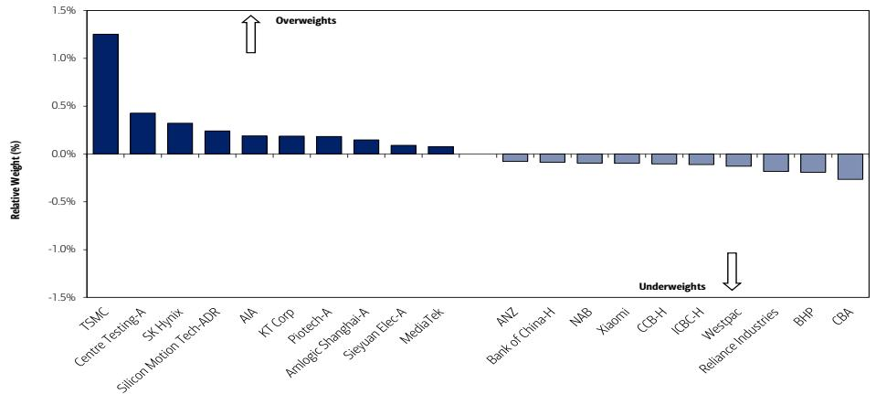

bar

| Company | Relative Weight (%) |
| --- | --- |
| TSMC | 1.25 |
| Centre Testing A | 0.45 |
| SK Hynix | 0.35 |
| Silicon Motion Tech ADR | 0.25 |
| AIA | 0.20 |
| KT Corp | 0.20 |
| Piotech A | 0.20 |
| Armlgic Shanghai A | 0.15 |
| Siayuan Elec A | 0.10 |
| MediaTek | 0.05 |
| ANZ | -0.10 |
| Bank of China H | -0.10 |
| NAB | -0.10 |
| Xiaomi | -0.10 |
| CCB-H | -0.10 |
| ICBC-H | -0.10 |
| Westpac | -0.10 |
| Reliance Industries | -0.20 |
| BHP | -0.20 |
| CBA | -0.25 |

Source : BofA Asia Pac Quantitative Strategy, MSCI, FTSE, FactSet, Bloomberg, 13F Filings, Benchmark Indices, Country Stock Exchanges
BofA GLOBAL RESEARCH

Chart 57: AUSTRALIA STOCK Positioning versus Benchmark: LAST MONTH   
In Australia, the funds are most overweight Regis Resources and most underweight CBA   
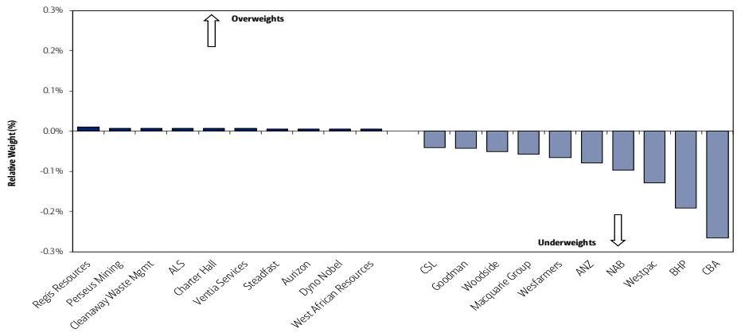

bar

| Company | Relative Weight (%) |
| --- | --- |
| Regis Resources | 0.01 |
| Perseus Mining | 0.005 |
| Cleanaway Waste Mgmt | 0.005 |
| ALS | 0.005 |
| Charter Hall | 0.005 |
| Ventia Services | 0.005 |
| Steadfast | 0.005 |
| Aurizon | 0.005 |
| Dyno Nobel | 0.005 |
| West African Resources | 0.005 |
| CSL | -0.03 |
| Goodman | -0.04 |
| Woodside | -0.05 |
| MQ Group | -0.06 |
| Wexfarmers | -0.07 |
| ANZ | -0.08 |
| NAB | -0.12 |
| Westpac | -0.15 |
| BHP | -0.22 |
| CBA | -0.28 |

Source : BofA Asia Pac Quantitative Strategy, MSCI, FTSE, FactSet, Bloomberg, 13F Filings, Benchmark Indices, Country Stock Exchanges
BofA GLOBAL RESEARCH

Chart 58: CHINA STOCK Positioning versus Benchmark: LAST MONTH   
In China, the funds are most overweight Centre Testing-A and most underweight ICBC-H   
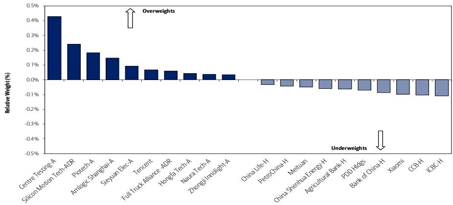

bar

| Company | Relative Weight (%) |
| --- | --- |
| Centre Testing A | 0.42 |
| Silicon Motion Tech-ADR | 0.24 |
| Piotech-A | 0.18 |
| Amlogic Shanghai-A | 0.15 |
| Sieyuan Elec-A | 0.10 |
| Tencent | 0.07 |
| Full Truck Alliance-ADR | 0.06 |
| Hongfa Tech-A | 0.04 |
| Naura Tech-A | 0.03 |
| Zhongji InnoLight-A | 0.03 |
| China Life-H | -0.02 |
| PetroChina-H | -0.03 |
| Meituan | -0.04 |
| China Shenhua Energy-H | -0.05 |
| Agricultural Bank-H | -0.06 |
| PDD Hldgs | -0.07 |
| Bank of China-H | -0.08 |
| Xiaomi | -0.09 |
| CCB-H | -0.10 |
| CBC-H | -0.11 |

Source : BofA Asia Pac Quantitative Strategy, MSCI, FTSE, FactSet, Bloomberg, 13F Filings, Benchmark Indices, Country Stock Exchanges   
BofA GLOBAL RESEARCH

# Chart 59: INDIA STOCK Positioning versus Benchmark: LAST MONTH

Funds are most overweight LIC Insurance and have increased their exposure in the last 3m

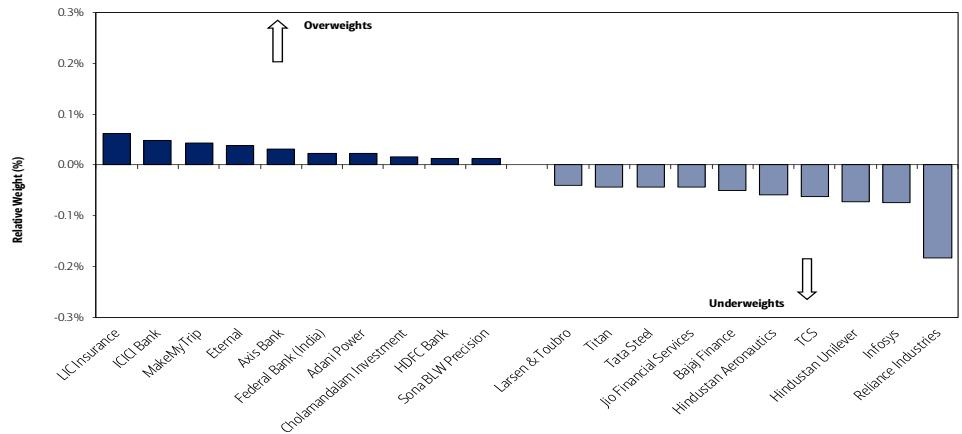

bar

| Company | Relative Weight (%) |
| --- | --- |
| LICInsurance | 0.06 |
| ICICI Bank | 0.05 |
| MakeMyTrip | 0.04 |
| Eternal | 0.04 |
| Axis Bank | 0.03 |
| Federal Bank (India) | 0.02 |
| Adani Power | 0.02 |
| Cholamandalan Investment | 0.01 |
| HDFC Bank | 0.01 |
| Sona BLW Precision | 0.01 |
| Larsen & Toubro | -0.05 |
| Titan | -0.06 |
| Tata Steel | -0.06 |
| Jio Financial Services | -0.07 |
| Bajaj Finance | -0.08 |
| Hindustan Aeronautics | -0.09 |
| TCS | -0.10 |
| Hindustan Unilever | -0.11 |
| Infosys | -0.12 |
| Reliance Industries | -0.18 |

Source : BofA Asia Pac Quantitative Strategy, MSCI, FTSE, FactSet, Bloomberg, 13F Filings, Benchmark Indices, Country Stock Exchanges   
BofA GLOBAL RESEARCH

# Chart 60: KOREA STOCK Positioning versus Benchmark: LAST MONTH

Funds in Korea are most underweight Doosan Enerbility

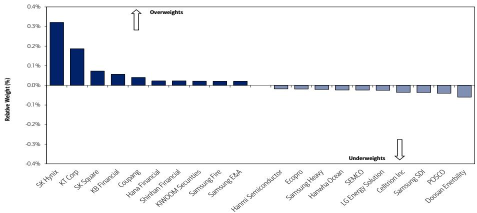

bar

| Company | Relative Weight (%) |
| --- | --- |
| SK Hynix | 0.32 |
| KT Corp | 0.19 |
| SK Square | 0.08 |
| KB Financial | 0.06 |
| Coupang | 0.04 |
| Hana Financial | 0.02 |
| Shinhan Financial | 0.02 |
| KIKWOM Securities | 0.02 |
| Samsung Fire | 0.02 |
| Samsung E&A | 0.02 |
| Hanmi Semiconductor | -0.01 |
| Ecopro | -0.01 |
| Samsung Heavy | -0.01 |
| Hanwha Ocean | -0.01 |
| StEMCO | -0.01 |
| LG Energy Solution | -0.01 |
| Celltrion Inc | -0.01 |
| Samsung SDI | -0.01 |
| POSCO | -0.01 |
| Doosan Enerblity | -0.07 |

Source : BofA Asia Pac Quantitative Strategy, MSCI, FTSE, FactSet, Bloomberg, 13F Filings, Benchmark Indices, Country Stock Exchanges   
BofA GLOBAL RESEARCH

# Chart 61: TAIWAN STOCK Positioning versus Benchmark: LAST MONTH

In Taiwan, the funds are most overweight TSMC and most underweight Hon Hai

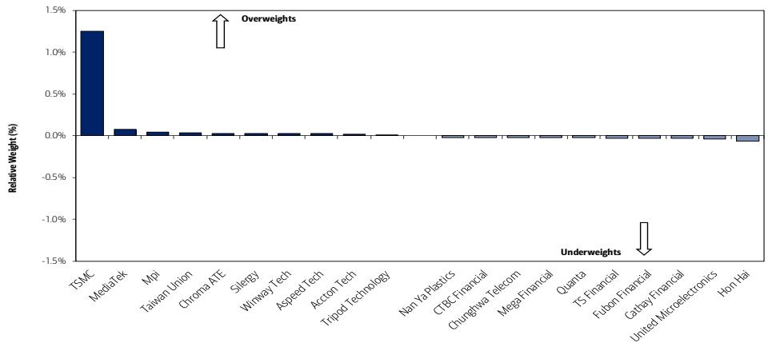

bar

| Company | Relative Weight (%) |
| --- | --- |
| TSMC | 1.25 |
| MediaTek | 0.08 |
| Mja | 0.03 |
| Taiwan Union | 0.02 |
| Chroma ATE | 0.01 |
| Silergy | 0.01 |
| Wimway Tech | 0.01 |
| Aspeed Tech | 0.01 |
| Accton Tech | 0.01 |
| Tripod Technology | 0.01 |
| Nan Ya Plastics | -0.01 |
| CTBC Financial | -0.01 |
| Chunghua Telecom | -0.01 |
| Mega Financial | -0.01 |
| Quanta | -0.01 |
| TS Financial | -0.01 |
| Fubon Financial | -0.01 |
| Cattay Financial | -0.01 |
| United Microelectronics | -0.01 |
| Hon Hai | -0.02 |

Source : BofA Asia Pac Quantitative Strategy, MSCI, FTSE, FactSet, Bloomberg, 13F Filings, Benchmark Indices, Country Stock Exchanges   
BofA GLOBAL RESEARCH

# Stock Positioning Charts

# Australia

Chart 62: Positioning and Triple Momentum Quadrants: Australia's Most Important Stocks   
In Australia, Under-owned Negatives include CBA and CSL   
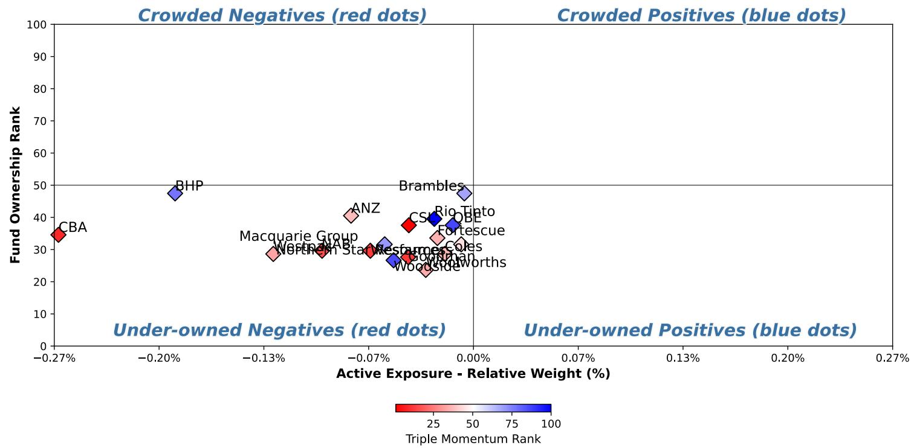

scatter

| Company | Fund Ownership Rank | Active Exposure - Relative Weight (%) | Triple Momentum Rank |
|---------|---------------------|--------------------------------------|----------------------|
| CBA     | 35                  | -0.27%                               | 25                   |
| BHP     | 48                  | -0.20%                               | 100                  |
| MQ Group | 30              | -0.13%                             | 25                   |
| ANZ     | 40                  | -0.07%                               | 50                   |
| Rockhead Star | 30               | -0.07%                               | 25                   |
| Resfarmers Coles | 30             | -0.07%                               | 50                   |
| Woodside | 25                  | -0.07%                               | 25                   |
| Braebles | 48                  | 0.00%                                | 100                  |
| Rio Tinto | 40                  | 0.00%                                | 75                   |
| Fortescue | 35                 | 0.00%                                | 50                   |
| Woodman | 30                  | 0.00%                                | 25                   |
| Northworths | 25                | 0.00%                                | 25                   |

Source : BofA Asia Pac Quantitative Strategy, MSCI, FTSE, FactSet, Bloomberg, 13F Filings, Benchmark Indices, Country Stock Exchanges

BofA GLOBAL RESEARCH

Chart 63: BHP-Rolling 12-months Long-Only Equity Flow (\$bn)
In the last 12m, funds had a cumulative inflow of \$1.0bn   
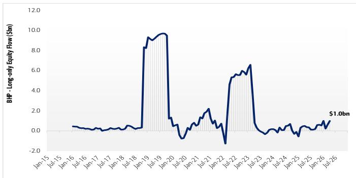

line

| Date    | BHP - Long-only Equity Flow ($bn) |
|---------|-----------------------------------|
| Jul-26  | $1.0bn                            |

Source : BofA Asia Pac Quantitative Strategy, MSCI, FTSE, FactSet, Bloomberg, 13F Filings, Benchmark Indices, Country Stock Exchanges   
BofA GLOBAL RESEARCH

Chart 65: CBA-Rolling 12-months Long-Only Equity Flow (\$bn)
Last month, long-only funds bought shares worth \$0.3bn   
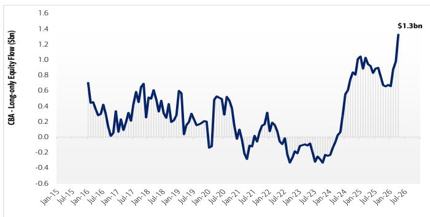

line

| Date    | CBA - Long-only Equity Flow ($bn) |
|---------|-----------------------------------|
| Jul-26  | 1.3                               |

Source : BofA Asia Pac Quantitative Strategy, MSCI, FTSE, FactSet, Bloomberg, 13F Filings, Benchmark Indices, Country Stock Exchanges   
BofA GLOBAL RESEARCH

Chart 67: Westpac-Rolling 12-months Long-Only Equity Flow (\$bn)
Last month, long-only funds bought shares worth \$0.2bn   
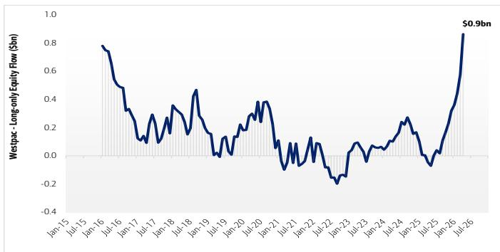

line

| Date    | Westpac - Long-only Equity Flow ($bn) |
|---------|--------------------------------------|
| Jul-26  | $0.9bn                               |

Source : BofA Asia Pac Quantitative Strategy, MSCI, FTSE, FactSet, Bloomberg, 13F Filings, Benchmark Indices, Country Stock Exchanges   
BofA GLOBAL RESEARCH

Chart 64: BHP-Ownership And Active Exposure Funds are underweight this stock   
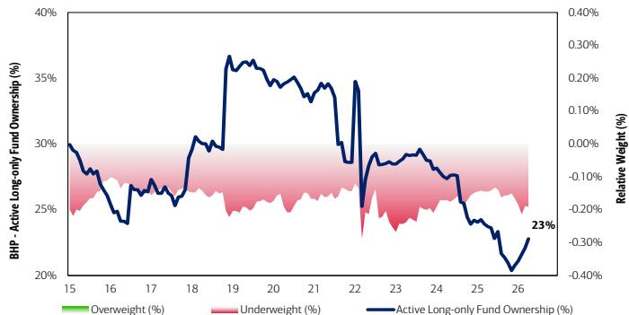

line

| Year | BHP - Active Long-only Fund Ownership (%) | Relative Weight (%) |
|------|------------------------------------------|---------------------|
| 15   | ~30%                                     | ~0.00%              |
| 16   | ~25%                                     | ~-0.10%             |
| 17   | ~27%                                     | ~-0.15%             |
| 18   | ~30%                                     | ~-0.20%             |
| 19   | ~37%                                     | ~-0.25%             |
| 20   | ~36%                                     | ~-0.20%             |
| 21   | ~34%                                     | ~-0.15%             |
| 22   | ~35%                                     | ~-0.10%             |
| 23   | ~28%                                     | ~-0.15%             |
| 24   | ~27%                                     | ~-0.20%             |
| 25   | ~24%                                     | ~-0.25%             |
| 26   | 23%                                      | ~-0.30%             |

Source : BofA Asia Pac Quantitative Strategy, MSCI, FTSE, FactSet, Bloomberg, 13F Filings, Benchmark Indices, Country Stock Exchanges   
BofA GLOBAL RESEARCH

Chart 66: CBA-Ownership And Active Exposure
17% active long-only funds own this stock   
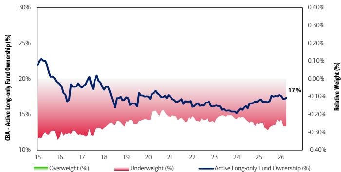

line

| Year | Active Long-only Fund Ownership (%) | Overweight (%) | Underweight (%) |
|------|-------------------------------------|----------------|----------------|
| 26   | 17%                                 | -              | -              |

Source : BofA Asia Pac Quantitative Strategy, MSCI, FTSE, FactSet, Bloomberg, 13F Filings, Benchmark Indices, Country Stock Exchanges   
BofA GLOBAL RESEARCH

Chart 68: Westpac-Ownership And Active Exposure
15% active long-only funds own this stock   
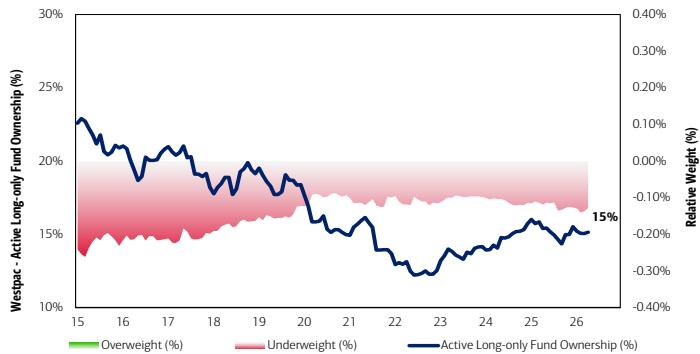

line

| Year | Active Long-only Fund Ownership (%) | Overweight (%) | Underweight (%) | Relative Weight (%) |
|------|-------------------------------------|----------------|-----------------|---------------------|
| 15   | 23%                                 | 15%            | 15%             | 0.40                |
| 16   | 21%                                 | 15%            | 15%             | 0.30                |
| 17   | 20%                                 | 15%            | 15%             | 0.20                |
| 18   | 19%                                 | 15%            | 15%             | 0.10                |
| 19   | 18%                                 | 15%            | 15%             | 0.00                |
| 20   | 17%                                 | 15%            | 15%             | -0.10               |
| 21   | 16%                                 | 15%            | 15%             | -0.20               |
| 22   | 14%                                 | 15%            | 15%             | -0.30               |
| 23   | 13%                                 | 15%            | 15%             | -0.40               |
| 24   | 14%                                 | 15%            | 15%             | -0.30               |
| 25   | 15%                                 | 15%            | 15%             | -0.20               |
| 26   | 15%                                 | 15%            | 15%             | -0.10               |

Source : BofA Asia Pac Quantitative Strategy, MSCI, FTSE, FactSet, Bloomberg, 13F Filings, Benchmark Indices, Country Stock Exchanges   
BofA GLOBAL RESEARCH

Chart 69: NAB-Rolling 12-months Long-Only Equity Flow (\$bn)
In the last 12m, funds had a cumulative inflow of \$0.8bn   
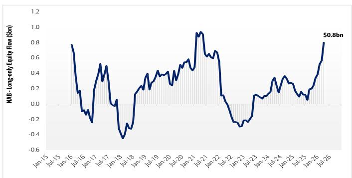

line

| Date    | NAB - Long-only Equity Flow ($bn) |
|---------|-----------------------------------|
| Jul-26  | $0.8bn                            |

Source : BofA Asia Pac Quantitative Strategy, MSCI, FTSE, FactSet, Bloomberg, 13F Filings, Benchmark Indices, Country Stock Exchanges   
BofA GLOBAL RESEARCH

Chart 71: Fortescue-Rolling 12-months Long-Only Equity Flow (\$bn)
In last 12-months, long-only funds bought shares worth \$0.3bn   
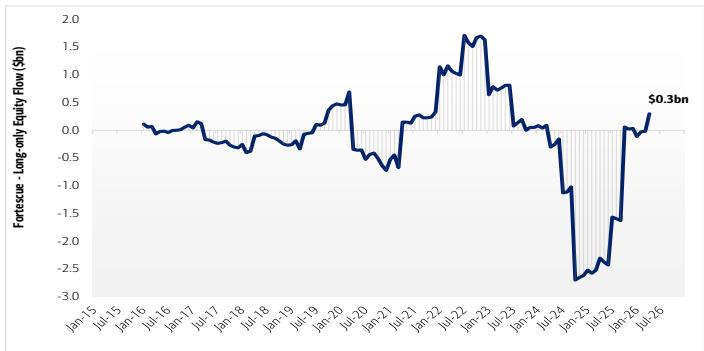

line

| Date    | Long-only Equity Flow ($bn) |
|---------|-----------------------------|
| Jul-26  | $0.3bn                      |

Source : BofA Asia Pac Quantitative Strategy, MSCI, FTSE, FactSet, Bloomberg, 13F Filings, Benchmark Indices, Country Stock Exchanges   
BofA GLOBAL RESEARCH

Chart 73: ANZ-Rolling 12-months Long-Only Equity Flow (\$bn)
Last month, long-only funds bought shares worth \$0.2bn   
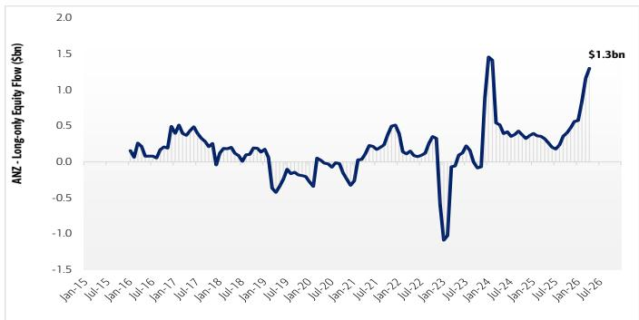

line

| Date    | Value     |
|---------|-----------|
| Jul-26  | $1.3bn    |

Source : BofA Asia Pac Quantitative Strategy, MSCI, FTSE, FactSet, Bloomberg, 13F Filings, Benchmark Indices, Country Stock Exchanges   
BofA GLOBAL RESEARCH

Chart 70: NAB-Ownership And Active Exposure Funds are underweight this stock   
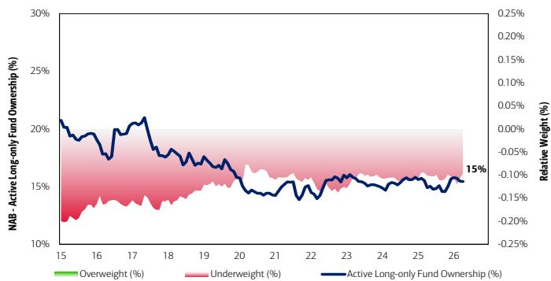

line

| Year | Active Long-only Fund Ownership (%) | Overweight (%) | Underweight (%) |
|------|-------------------------------------|----------------|----------------|
| 15   | 20%                                 | -              | -              |
| 16   | 18%                                 | -              | -              |
| 17   | 21%                                 | -              | -              |
| 18   | 18%                                 | -              | -              |
| 19   | 17%                                 | -              | -              |
| 20   | 15%                                 | -              | -              |
| 21   | 14%                                 | -              | -              |
| 22   | 13%                                 | -              | -              |
| 23   | 15%                                 | -              | -              |
| 24   | 14%                                 | -              | -              |
| 25   | 15%                                 | -              | -              |
| 26   | 15%                                 | -              | -              |

Source : BofA Asia Pac Quantitative Strategy, MSCI, FTSE, FactSet, Bloomberg, 13F Filings, Benchmark Indices, Country Stock Exchanges   
BofA GLOBAL RESEARCH

Chart 72: Fortescue-Ownership And Active Exposure
17% active long-only funds own this stock   
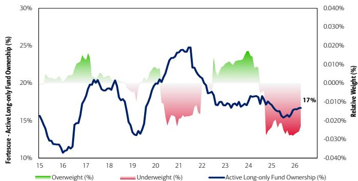

line

| Year | Active Long-only Fund Ownership (%) | Overweight (%) | Underweight (%) |
|------|-------------------------------------|----------------|-----------------|
| 2026 | 17%                                 |                |                 |

Source : BofA Asia Pac Quantitative Strategy, MSCI, FTSE, FactSet, Bloomberg, 13F Filings, Benchmark Indices, Country Stock Exchanges   
BofA GLOBAL RESEARCH

Chart 74: ANZ-Ownership And Active Exposure Funds have increased exposure in last 3-months   
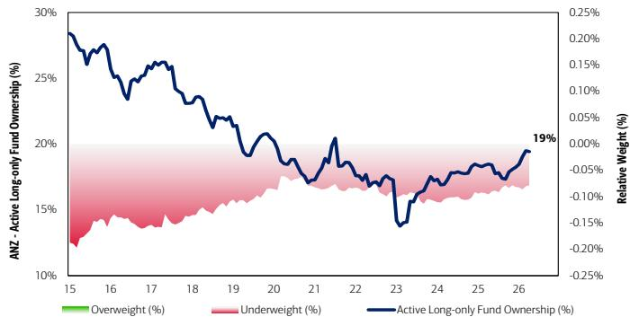

line

| Year | Active Long-only Fund Ownership (%) | Overweight (%) | Underweight (%) |
|------|-------------------------------------|----------------|----------------|
| 2026 | 19                                  |                |                |

Source : BofA Asia Pac Quantitative Strategy, MSCI, FTSE, FactSet, Bloomberg, 13F Filings, Benchmark Indices, Country Stock Exchanges   
BofA GLOBAL RESEARCH

Table 14: Australia Stock Positioning Characteristics: Top 50 by Market Capitalisation

Characteristics of the Australia Top 50 stocks by market capitalization

<table><tr><td>Name</td><td>BBG Code</td><td>Sector</td><td>MCAP (Total $USm)</td><td>Avg Daily TO (6m $US m)</td><td>Relative Weight (%)</td><td>Relative e Dollar ($USm)</td><td>Long-only Equity Flow ($USm)</td><td>Fund Ownership (%)</td><td>Triple Momentum Rank</td><td>Positioning Flag</td><td>Funds Count</td></tr><tr><td>Orica</td><td>ORI AU</td><td>Materials</td><td>7,050</td><td>38.3</td><td>0.005%</td><td>162</td><td>-4</td><td>48%</td><td>33</td><td>-</td><td>165</td></tr><tr><td>Technology One</td><td>TNE AU</td><td>Software</td><td>6,588</td><td>29.5</td><td>0.004%</td><td>137</td><td>-10</td><td>46%</td><td>10</td><td>-</td><td>132</td></tr><tr><td>Bluescope Steel</td><td>BSL AU</td><td>Materials</td><td>9,383</td><td>45.3</td><td>-0.006%</td><td>-235</td><td>31</td><td>46%</td><td>89</td><td>-</td><td>165</td></tr><tr><td>ALS</td><td>ALQ AU</td><td>Industrials</td><td>7,765</td><td>27.0</td><td>0.007%</td><td>239</td><td>4</td><td>45%</td><td>50</td><td>-</td><td>142</td></tr><tr><td>Charter Hall</td><td>CHC AU</td><td>Real Estate</td><td>6,852</td><td>24.4</td><td>0.007%</td><td>224</td><td>50</td><td>41%</td><td>47</td><td>-</td><td>146</td></tr><tr><td>NextDC</td><td>NXT AU</td><td>Software</td><td>7,786</td><td>26.3</td><td>-0.005%</td><td>-169</td><td>37</td><td>38%</td><td>9</td><td>Crowded Negatives</td><td>135</td></tr><tr><td>Pilbara Minerals</td><td>PLS AU</td><td>Materials</td><td>13,940</td><td>108.2</td><td>-0.023%</td><td>-791</td><td>21</td><td>37%</td><td>77</td><td>-</td><td>136</td></tr><tr><td>Mineral Resources</td><td>MIN AU</td><td>Materials</td><td>9,052</td><td>54.7</td><td>0.005%</td><td>163</td><td>5</td><td>35%</td><td>83</td><td>Crowded Positives</td><td>133</td></tr><tr><td>BHP</td><td>BHP AU</td><td>Materials</td><td>196,158</td><td>370.5</td><td>-0.191%</td><td>-15,236</td><td>458</td><td>23%</td><td>70</td><td>-</td><td>1,119</td></tr><tr><td>Brambles</td><td>BXB AU</td><td>Industrials</td><td>22,095</td><td>53.8</td><td>-0.006%</td><td>-486</td><td>-113</td><td>23%</td><td>62</td><td>-</td><td>1,122</td></tr><tr><td>ANZ</td><td>ANZ AU</td><td>Banks</td><td>79,423</td><td>139.1</td><td>-0.078%</td><td>-6,164</td><td>163</td><td>19%</td><td>37</td><td>-</td><td>1,107</td></tr><tr><td>Rio Tinto</td><td>RIO AU</td><td>Materials</td><td>44,692</td><td>165.2</td><td>-0.025%</td><td>-1,982</td><td>200</td><td>19%</td><td>89</td><td>-</td><td>1,110</td></tr><tr><td>Aristocrat</td><td>ALL AU</td><td>Cons. Discretionary</td><td>20,899</td><td>67.2</td><td>-0.005%</td><td>-418</td><td>-54</td><td>19%</td><td>30</td><td>-</td><td>1,103</td></tr><tr><td>QBE</td><td>QBE AU</td><td>Insurance</td><td>24,181</td><td>58.0</td><td>-0.013%</td><td>-1,054</td><td>-16</td><td>19%</td><td>76</td><td>-</td><td>1,121</td></tr><tr><td>CSL</td><td>CSL AU</td><td>Health Care</td><td>43,380</td><td>148.7</td><td>-0.041%</td><td>-3,303</td><td>57</td><td>19%</td><td>2</td><td>Under-Owned Negatives</td><td>1,133</td></tr><tr><td>CBA</td><td>CBA AU</td><td>Banks</td><td>208,937</td><td>267.8</td><td>-0.266%</td><td>-20,914</td><td>348</td><td>17%</td><td>11</td><td>Under-Owned Negatives</td><td>1,107</td></tr><tr><td>Telstra</td><td>TLS AU</td><td>Telecom</td><td>43,048</td><td>92.3</td><td>-0.001%</td><td>-61</td><td>80</td><td>17%</td><td>68</td><td>-</td><td>1,107</td></tr><tr><td>Fortescue</td><td>FMG AU</td><td>Materials</td><td>43,498</td><td>116.0</td><td>-0.023%</td><td>-1,819</td><td>129</td><td>17%</td><td>35</td><td>-</td><td>1,102</td></tr><tr><td>MQ Group</td><td>MQG AU</td><td>Div Financials</td><td>64,416</td><td>133.2</td><td>-0.057%</td><td>-4,545</td><td>-124</td><td>16%</td><td>64</td><td>-</td><td>1,103</td></tr><tr><td>Northern Star Res.</td><td>NST AU</td><td>Materials</td><td>21,601</td><td>134.4</td><td>-0.008%</td><td>-633</td><td>42</td><td>16%</td><td>42</td><td>-</td><td>1,116</td></tr><tr><td>Computershare</td><td>CPU AU</td><td>Industrials</td><td>12,550</td><td>34.0</td><td>-0.007%</td><td>-574</td><td>-14</td><td>16%</td><td>46</td><td>-</td><td>1,112</td></tr><tr><td>Wesfarmers</td><td>WES AU</td><td>Cons. Discretionary</td><td>59,518</td><td>86.0</td><td>-0.066%</td><td>-5,204</td><td>51</td><td>15%</td><td>15</td><td>Under-Owned Negatives</td><td>1,097</td></tr><tr><td>NAB</td><td>NAB AU</td><td>Banks</td><td>87,951</td><td>155.3</td><td>-0.097%</td><td>-7,614</td><td>245</td><td>15%</td><td>17</td><td>Under-Owned Negatives</td><td>1,100</td></tr><tr><td>Coles</td><td>COL AU</td><td>Cons. Staples</td><td>21,335</td><td>51.3</td><td>-0.018%</td><td>-1,456</td><td>59</td><td>15%</td><td>36</td><td>-</td><td>1,104</td></tr><tr><td>Westpac</td><td>WBC AU</td><td>Banks</td><td>94,673</td><td>143.0</td><td>-0.128%</td><td>-10,057</td><td>241</td><td>15%</td><td>33</td><td>-</td><td>1,096</td></tr><tr><td>Goodman Group</td><td>GMG AU</td><td>Real Estate</td><td>43,486</td><td>89.8</td><td>-0.042%</td><td>-3,292</td><td>25</td><td>15%</td><td>15</td><td>Under-Owned Negatives</td><td>1,119</td></tr><tr><td>Woodside</td><td>WDS AU</td><td>Energy</td><td>45,856</td><td>144.5</td><td>-0.051%</td><td>-4,063</td><td>200</td><td>15%</td><td>76</td><td>-</td><td>1,107</td></tr><tr><td>Suncorp Group</td><td>SUN AU</td><td>Insurance</td><td>13,321</td><td>50.7</td><td>-0.007%</td><td>-554</td><td>248</td><td>14%</td><td>52</td><td>-</td><td>1,111</td></tr><tr><td>Woolworths</td><td>WOW AU</td><td>Cons. Staples</td><td>30,204</td><td>69.1</td><td>-0.031%</td><td>-2,387</td><td>45</td><td>13%</td><td>34</td><td>-</td><td>1,090</td></tr><tr><td>Pro Medicus</td><td>PME AU</td><td>Health Care</td><td>10,095</td><td>43.9</td><td>-0.004%</td><td>-333</td><td>5</td><td>13%</td><td>9</td><td>Under-Owned Negatives</td><td>1,117</td></tr><tr><td>Evolution Mining</td><td>EVN AU</td><td>Materials</td><td>17,373</td><td>86.3</td><td>-0.013%</td><td>-1,010</td><td>17</td><td>13%</td><td>73</td><td>-</td><td>1,102</td></tr><tr><td>Medibank</td><td>MPL AU</td><td>Insurance</td><td>9,286</td><td>26.2</td><td>-0.007%</td><td>-517</td><td>17</td><td>13%</td><td>43</td><td>-</td><td>1,105</td></tr><tr><td>Qantas</td><td>QAN AU</td><td>Industrials</td><td>9,149</td><td>54.3</td><td>0.001%</td><td>50</td><td>-124</td><td>13%</td><td>22</td><td>-</td><td>1,101</td></tr><tr><td>IAG</td><td>IAG AU</td><td>Insurance</td><td>12,771</td><td>37.2</td><td>-0.014%</td><td>-1,120</td><td>38</td><td>12%</td><td>17</td><td>Under-Owned Negatives</td><td>1,104</td></tr><tr><td>Scentre</td><td>SCG AU</td><td>Real Estate</td><td>13,914</td><td>36.2</td><td>-0.013%</td><td>-1,059</td><td>13</td><td>12%</td><td>42</td><td>-</td><td>1,118</td></tr><tr><td>Stockland</td><td>SGP AU</td><td>Real Estate</td><td>7,053</td><td>32.0</td><td>-0.007%</td><td>-531</td><td>-6</td><td>12%</td><td>26</td><td>-</td><td>1,123</td></tr><tr><td>REA Group</td><td>REA AU</td><td>Media &amp; Ent.</td><td>16,133</td><td>38.5</td><td>-0.006%</td><td>-506</td><td>-30</td><td>11%</td><td>53</td><td>-</td><td>1,106</td></tr><tr><td>Santos</td><td>STO AU</td><td>Energy</td><td>18,680</td><td>84.0</td><td>-0.014%</td><td>-1,081</td><td>290</td><td>11%</td><td>71</td><td>-</td><td>1,098</td></tr><tr><td>Sonic Healthcare</td><td>SHL AU</td><td>Health Care</td><td>7,025</td><td>28.4</td><td>-0.004%</td><td>-308</td><td>5</td><td>10%</td><td>36</td><td>-</td><td>1,122</td></tr><tr><td>Lynas Rare Earths</td><td>LYC AU</td><td>Materials</td><td>13,756</td><td>96.9</td><td>-0.009%</td><td>-668</td><td>71</td><td>10%</td><td>94</td><td>-</td><td>1,098</td></tr><tr><td>CAR</td><td>CAR AU</td><td>Media &amp; Ent.</td><td>6,903</td><td>36.4</td><td>-0.006%</td><td>-467</td><td>20</td><td>10%</td><td>9</td><td>Under-Owned Negatives</td><td>1,104</td></tr><tr><td>WiseTech</td><td>WTC AU</td><td>Software</td><td>10,321</td><td>60.7</td><td>-0.003%</td><td>-223</td><td>-20</td><td>9%</td><td>19</td><td>Under-Owned Negatives</td><td>1,128</td></tr><tr><td>ASX</td><td>ASX AU</td><td>Div Financials</td><td>8,493</td><td>31.1</td><td>-0.011%</td><td>-857</td><td>13</td><td>9%</td><td>66</td><td>-</td><td>1,101</td></tr><tr><td>Origin Energy</td><td>ORG AU</td><td>Utilities</td><td>14,987</td><td>37.2</td><td>-0.016%</td><td>-1,220</td><td>41</td><td>9%</td><td>25</td><td>-</td><td>1,090</td></tr><tr><td>SGH</td><td>SGH AU</td><td>Industrials</td><td>11,336</td><td>15.4</td><td>-0.004%</td><td>-333</td><td>10</td><td>9%</td><td>25</td><td>-</td><td>1,088</td></tr><tr><td>South32</td><td>S32 AU</td><td>Materials</td><td>12,999</td><td>62.5</td><td>-0.016%</td><td>-1,234</td><td>39</td><td>9%</td><td>67</td><td>-</td><td>1,096</td></tr><tr><td>Vicinity Centres</td><td>VCX AU</td><td>Real Estate</td><td>8,300</td><td>23.1</td><td>-0.009%</td><td>-723</td><td>18</td><td>9%</td><td>44</td><td>-</td><td>1,116</td></tr><tr><td>APA</td><td>APA AU</td><td>Utilities</td><td>9,777</td><td>23.7</td><td>-0.007%</td><td>-548</td><td>20</td><td>8%</td><td>70</td><td>-</td><td>1,095</td></tr><tr><td>Sigma Healthcare</td><td>SIG AU</td><td>Health Care</td><td>23,155</td><td>42.6</td><td>-0.014%</td><td>-1,079</td><td>51</td><td>8%</td><td>59</td><td>-</td><td>1,112</td></tr><tr><td>IREN</td><td>IREN US</td><td>Software</td><td>14,943</td><td>1,739.4</td><td>-0.010%</td><td>-630</td><td>74</td><td>3%</td><td>80</td><td>-</td><td>877</td></tr></table>

Source : BofA Asia Pac Quantitative Strategy, MSCI, FTSE, FactSet, Bloomberg, 13F Filings, Benchmark Indices, Country Stock Exchanges   
\* OW # Overweight, ^ UW # Underweight, # BM # Benchmark

BofA GLOBAL RESEARCH

# China

Chart 75: Positioning and Triple Momentum Quadrants: China's Most Important Stocks   
In China, Crowded Positives include Zijin Mining-H   
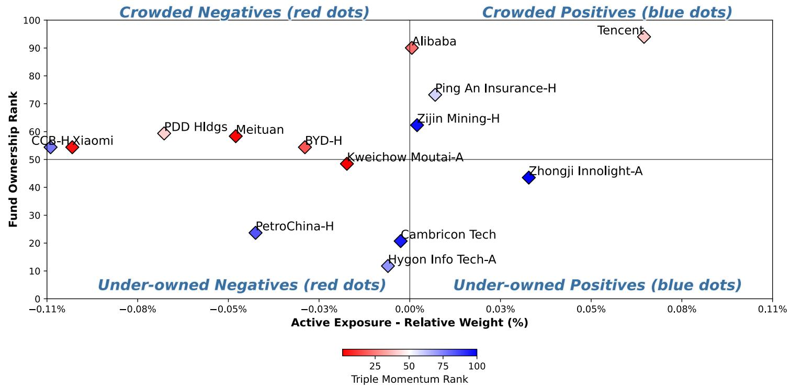  
Source : BofA Asia Pac Quantitative Strategy, MSCI, FTSE, FactSet, Bloomberg, 13F Filings, Benchmark Indices, Country Stock Exchanges

BofA GLOBAL RESEARCH

Chart 76: Tencent-Rolling 12-months Long-Only Equity Flow (\$bn)
In the last 12m, funds had a cumulative inflow of \$1.3bn   
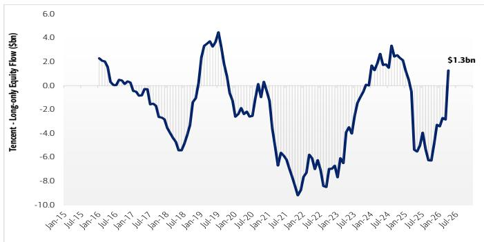

line

| Date    | Tencent - Long-only Equity Flow ($bn) |
|---------|----------------------------------------|
| Jul-26  | $1.3bn                                 |

Source : BofA Asia Pac Quantitative Strategy, MSCI, FTSE, FactSet, Bloomberg, 13F Filings, Benchmark Indices, Country Stock Exchanges   
BofA GLOBAL RESEARCH

Chart 78: Alibaba-Rolling 12-months Long-Only Equity Flow (\$bn)
In the last 12m, funds had a cumulative outflow of -\$0.7bn   
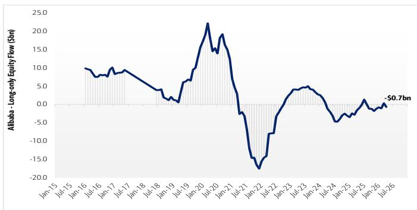

line

| Date    | Alibaba - Long-only Equity Flow ($bn) |
|---------|--------------------------------------|
| Jul-26  | -$0.7bn                              |

Source : BofA Asia Pac Quantitative Strategy, MSCI, FTSE, FactSet, Bloomberg, 13F Filings, Benchmark Indices, Country Stock Exchanges   
BofA GLOBAL RESEARCH

Chart 80: PDD Hldgs-Rolling 12-months Long-Only Equity Flow (\$bn)   
Last month, long-only funds sold shares worth -\$0.1bn   
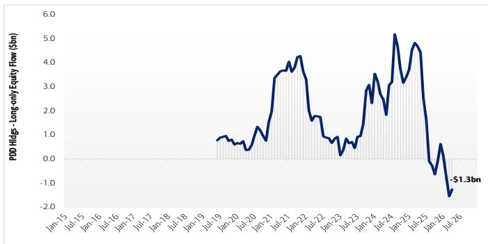

line

| Date    | Value (bn) |
|---------|------------|
| Jul-26  | -1.3       |

Source : BofA Asia Pac Quantitative Strategy, MSCI, FTSE, FactSet, Bloomberg, 13F Filings, Benchmark Indices, Country Stock Exchanges   
BofA GLOBAL RESEARCH

Chart 77: Tencent-Ownership And Active Exposure
72% active long-only funds own this stock   
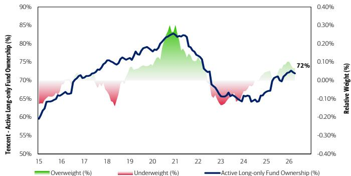

line

| Year | Tencent - Active Long-only Fund Ownership (%) | Overweight (%) | Underweight (%) |
|------|-----------------------------------------------|----------------|----------------|
| 15   | 60%                                           | 0.00%          | 0.00%          |
| 16   | 65%                                           | 0.00%          | 0.00%          |
| 17   | 70%                                           | 0.00%          | 0.00%          |
| 18   | 75%                                           | 0.00%          | 0.00%          |
| 19   | 80%                                           | 0.00%          | 0.00%          |
| 20   | 85%                                           | 0.00%          | 0.00%          |
| 21   | 85%                                           | 0.30%          | 0.00%          |
| 22   | 80%                                           | 0.20%          | 0.00%          |
| 23   | 65%                                           | -0.10%         | -0.10%         |
| 24   | 65%                                           | -0.10%         | -0.10%         |
| 25   | 70%                                           | -0.10%         | -0.10%         |
| 26   | 72%                                           | -0.10%         | -0.10%         |

Source : BofA Asia Pac Quantitative Strategy, MSCI, FTSE, FactSet, Bloomberg, 13F Filings, Benchmark Indices, Country Stock Exchanges   
BofA GLOBAL RESEARCH

Chart 79: Alibaba-Ownership And Active Exposure
Active long-only funds are neutral this stock   
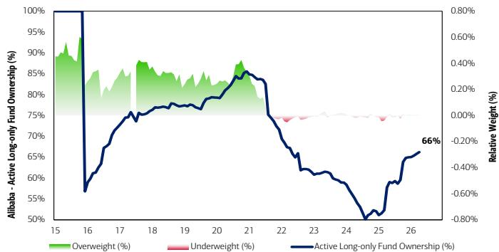

line

| Year | Overweight (%) | Underweight (%) | Active Long-only Fund Ownership (%) |
|------|----------------|-----------------|-------------------------------------|
| 15   | 90%            | 0%              | 100%                                |
| 16   | 85%            | 0%              | 55%                                 |
| 17   | 88%            | 0%              | 75%                                 |
| 18   | 87%            | 0%              | 78%                                 |
| 19   | 86%            | 0%              | 79%                                 |
| 20   | 85%            | 0%              | 80%                                 |
| 21   | 84%            | 0%              | 85%                                 |
| 22   | 83%            | 0%              | 70%                                 |
| 23   | 82%            | 0%              | 60%                                 |
| 24   | 81%            | 0%              | 50%                                 |
| 25   | 80%            | 0%              | 55%                                 |
| 26   | 80%            | 0%              | 66%                                 |

Source : BofA Asia Pac Quantitative Strategy, MSCI, FTSE, FactSet, Bloomberg, 13F Filings, Benchmark Indices, Country Stock Exchanges   
BofA GLOBAL RESEARCH

Chart 81: PDD Hldgs-Ownership And Active Exposure Funds have reduced exposure in last 3-mths   
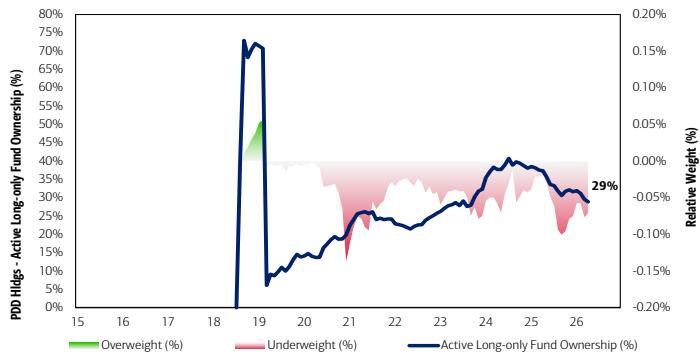

line

| Year | Active Long-only Fund Ownership (%) | Overweight (%) | Underweight (%) | Relative Weight (%) |
|------|-------------------------------------|----------------|-----------------|---------------------|
| 19   | 70%                                 | 50%            | 0%              | 0.15%               |
| 26   | 29%                                 |                |                 | -0.05%              |

Source : BofA Asia Pac Quantitative Strategy, MSCI, FTSE, FactSet, Bloomberg, 13F Filings, Benchmark Indices, Country Stock Exchanges   
BofA GLOBAL RESEARCH

Chart 82: Zhongji Innolight-A-Rolling 12-months Long-Only Equity Flow (\$bn)   
In last 12-months, long-only funds bought shares worth \$2.2bn   
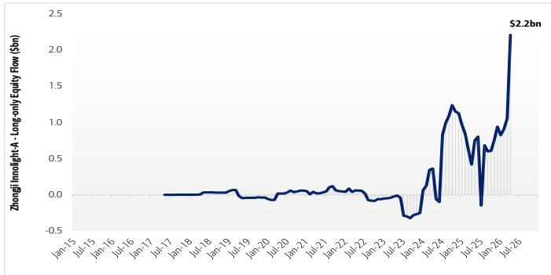

line

| Date     | Value (bn) |
| -------- | ---------- |
| Jul-26   | 2.2        |

Source : BofA Asia Pac Quantitative Strategy, MSCI, FTSE, FactSet, Bloomberg, 13F Filings, Benchmark Indices, Country Stock Exchanges   
BofA GLOBAL RESEARCH

Chart 84: Xiaomi-Rolling 12-months Long-Only Equity Flow (\$bn)
In last 12-months, long-only funds bought shares worth \$0.4bn   
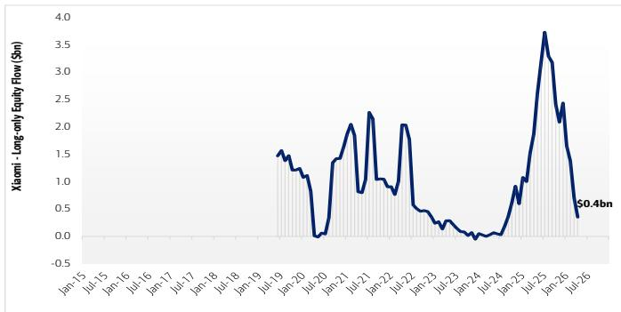

line

| Date    | Xiaomi - Long-only Equity Flow ($bn) |
|---------|--------------------------------------|
| Jul-26  | $0.4bn                               |

Source : BofA Asia Pac Quantitative Strategy, MSCI, FTSE, FactSet, Bloomberg, 13F Filings, Benchmark Indices, Country Stock Exchanges   
BofA GLOBAL RESEARCH

Chart 86: BYD-H-Rolling 12-months Long-Only Equity Flow (\$bn)
In last 12-months, long-only funds bought shares worth \$0.3bn   
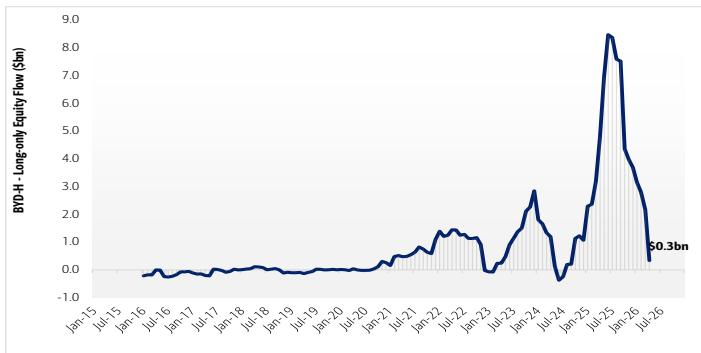

line

| Date    | Value (bn) |
|---------|------------|
| Jul-26  | 50.3       |

Source : BofA Asia Pac Quantitative Strategy, MSCI, FTSE, FactSet, Bloomberg, 13F Filings, Benchmark Indices, Country Stock Exchanges   
BofA GLOBAL RESEARCH

Chart 83: Zhongji Innolight-A-Ownership and Active Exposure Funds are overweight this stock   
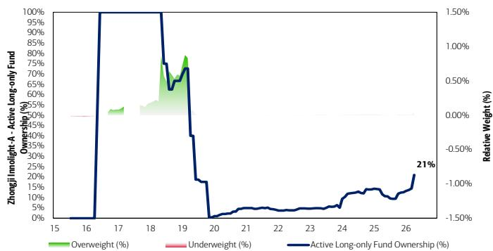

line

| Year | Overweight (%) | Underweight (%) | Active Long-only Fund Ownership (%) |
|------|----------------|-----------------|-------------------------------------|
| 15   |                |                 |                                     |
| 16   |                |                 |                                     |
| 17   |                |                 |                                     |
| 18   |                |                 |                                     |
| 19   |                |                 |                                     |
| 20   |                |                 |                                     |
| 21   |                |                 |                                     |
| 22   |                |                 |                                     |
| 23   |                |                 |                                     |
| 24   |                |                 |                                     |
| 25   |                |                 |                                     |
| 26   |                |                 |                                     |
| 27   |                |                 | 21%                                 |

Source : BofA Asia Pac Quantitative Strategy, MSCI, FTSE, FactSet, Bloomberg, 13F Filings, Benchmark Indices, Country Stock Exchanges   
BofA GLOBAL RESEARCH

Chart 85: Xiaomi-Ownership And Active Exposure
26% active long-only funds own this stock   
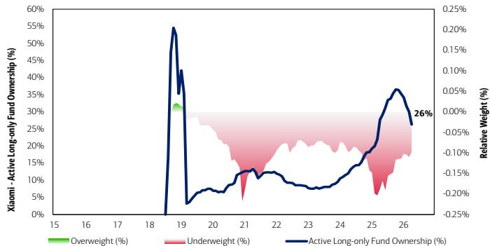

line

| Year | Active Long-only Fund Ownership (%) | Overweight (%) | Underweight (%) |
|------|-------------------------------------|----------------|----------------|
| 19   | 55%                                 | 30%            | 0%             |
| 26   | 26%                                 | 0%             | -0.25%         |

Source : BofA Asia Pac Quantitative Strategy, MSCI, FTSE, FactSet, Bloomberg, 13F Filings, Benchmark Indices, Country Stock Exchanges   
BofA GLOBAL RESEARCH

Chart 87: BYD-H-Ownership And Active Exposure Funds have reduced exposure in last 3-mths   
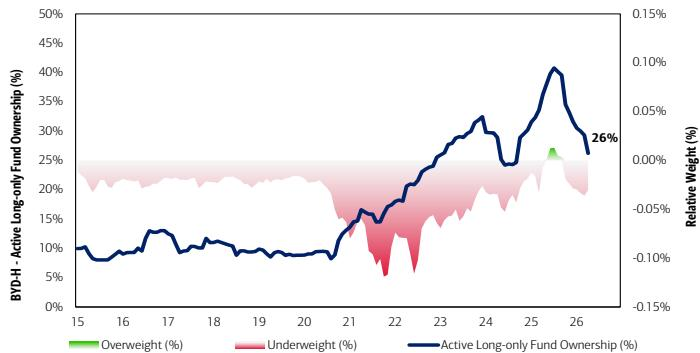

line

| Year | Active Long-only Fund Ownership (%) | Overweight (%) | Underweight (%) |
|------|-------------------------------------|----------------|----------------|
| 2026 | 26%                                 | 0.00%          | 0.00%          |

Source : BofA Asia Pac Quantitative Strategy, MSCI, FTSE, FactSet, Bloomberg, 13F Filings, Benchmark Indices, Country Stock Exchanges   
BofA GLOBAL RESEARCH

Table 15: China Stock Positioning Characteristics: Top 50 by Market Capitalisation

Characteristics of the China Top 50 stocks by market capitalization

<table><tr><td>Name</td><td>BBG Code</td><td>Sector</td><td>MCAP (Total $USm)</td><td>Avg Daily TO (6m $US m)</td><td>Relative Weight (%)</td><td>Relative Dollar ($USm)</td><td>Long-only Equity Flow ($USm)</td><td>Fund Ownership (%)</td><td>Triple Momentum Rank</td><td>Positioning Flag</td><td>Funds Count</td></tr><tr><td>Tencent</td><td>700 HK</td><td>Media &amp; Ent.</td><td>544,782</td><td>1,643.8</td><td>0.068%</td><td>5,182</td><td>112</td><td>72%</td><td>42</td><td>-</td><td>1,168</td></tr><tr><td>Alibaba</td><td>9988 HK</td><td>Cons. Discretionary</td><td>307,197</td><td>1,637.6</td><td>0.001%</td><td>47</td><td>-780</td><td>66%</td><td>25</td><td>-</td><td>1,178</td></tr><tr><td>Ping An Insurance</td><td>2318 HK</td><td>Insurance</td><td>59,894</td><td>340.7</td><td>0.007%</td><td>488</td><td>19</td><td>40%</td><td>59</td><td>-</td><td>1,187</td></tr><tr><td>Zijin Mining</td><td>2899 HK</td><td>Materials</td><td>27,277</td><td>318.3</td><td>0.002%</td><td>137</td><td>-1,165</td><td>31%</td><td>95</td><td>Crowded Positives</td><td>1,171</td></tr><tr><td>SMIC</td><td>981 HK</td><td>Semiconductors</td><td>54,308</td><td>572.7</td><td>0.194%</td><td>330</td><td>-1,218</td><td>29%</td><td>51</td><td>-</td><td>294</td></tr><tr><td>PDD Hldgs</td><td>PDD US</td><td>Cons. Discretionary</td><td>141,794</td><td>860.3</td><td>-0.071%</td><td>-4,724</td><td>-62</td><td>29%</td><td>43</td><td>-</td><td>904</td></tr><tr><td>Meituan</td><td>3690 HK</td><td>Cons. Discretionary</td><td>58,791</td><td>568.3</td><td>-0.050%</td><td>-3,200</td><td>-371</td><td>28%</td><td>4</td><td>Crowded Negatives</td><td>993</td></tr><tr><td>Xiaomi Corp-B</td><td>1810 HK</td><td>Tech Hardware</td><td>79,783</td><td>802.6</td><td>-0.098%</td><td>-6,371</td><td>30</td><td>26%</td><td>7</td><td>Crowded Negatives</td><td>1,025</td></tr><tr><td>CCB</td><td>939 HK</td><td>Banks</td><td>269,458</td><td>251.7</td><td>-0.104%</td><td>-6,778</td><td>-13</td><td>26%</td><td>76</td><td>-</td><td>1,174</td></tr><tr><td>BYD</td><td>1211 HK</td><td>Cons. Discretionary</td><td>48,195</td><td>338.7</td><td>-0.030%</td><td>-2,129</td><td>-177</td><td>26%</td><td>21</td><td>-</td><td>1,205</td></tr><tr><td>China Merchants Bank</td><td>3968 HK</td><td>Banks</td><td>27,603</td><td>109.0</td><td>-0.022%</td><td>-1,452</td><td>-990</td><td>25%</td><td>52</td><td>-</td><td>1,165</td></tr><tr><td>Kweichow Moutai</td><td>600519 CH</td><td>Cons. Staples</td><td>253,764</td><td>815.2</td><td>-0.018%</td><td>-1,214</td><td>-854</td><td>23%</td><td>3</td><td>Under-Owned Negatives</td><td>1,157</td></tr><tr><td>Baidu</td><td>9888 HK</td><td>Media &amp; Ent.</td><td>33,727</td><td>214.3</td><td>0.002%</td><td>157</td><td>68</td><td>23%</td><td>25</td><td>-</td><td>1,023</td></tr><tr><td>Sungrow Power</td><td>300274 CH</td><td>Industrials</td><td>41,688</td><td>1,629.7</td><td>0.012%</td><td>747</td><td>5</td><td>21%</td><td>23</td><td>-</td><td>1,153</td></tr><tr><td>Zhongji Innolight</td><td>300308 CH</td><td>Tech Hardware</td><td>139,425</td><td>2,752.9</td><td>0.034%</td><td>2,261</td><td>989</td><td>21%</td><td>98</td><td>Under-Owned Positives</td><td>1,167</td></tr><tr><td>Beigene</td><td>6160 HK</td><td>Health Care</td><td>31,593</td><td>95.5</td><td>-0.016%</td><td>-1,018</td><td>-378</td><td>18%</td><td>67</td><td>-</td><td>979</td></tr><tr><td>Anta Sports</td><td>2020 HK</td><td>Cons. Discretionary</td><td>28,971</td><td>95.1</td><td>0.006%</td><td>403</td><td>-254</td><td>18%</td><td>28</td><td>-</td><td>1,000</td></tr><tr><td>Geely Auto</td><td>175 HK</td><td>Cons. Discretionary</td><td>31,859</td><td>157.3</td><td>-0.014%</td><td>-905</td><td>-77</td><td>18%</td><td>58</td><td>-</td><td>991</td></tr><tr><td>China Resources Land</td><td>1109 HK</td><td>Real Estate</td><td>29,584</td><td>65.2</td><td>0.000%</td><td>11</td><td>115</td><td>18%</td><td>31</td><td>-</td><td>993</td></tr><tr><td>Pop Mart International</td><td>9992 HK</td><td>Cons. Discretionary</td><td>26,949</td><td>424.1</td><td>-0.008%</td><td>-515</td><td>-125</td><td>18%</td><td>9</td><td>Under-Owned Negatives</td><td>994</td></tr><tr><td>CNOOC</td><td>883 HK</td><td>Energy</td><td>167,044</td><td>388.1</td><td>0.150%</td><td>256</td><td>17</td><td>17%</td><td>84</td><td>Under-Owned Positives</td><td>297</td></tr><tr><td>China Mobile HK</td><td>941 HK</td><td>Telecom</td><td>224,000</td><td>240.1</td><td>-0.002%</td><td>-3</td><td>-783</td><td>16%</td><td>20</td><td>Under-Owned Negatives</td><td>298</td></tr><tr><td>ICBC</td><td>1398 HK</td><td>Banks</td><td>77,889</td><td>172.5</td><td>-0.111%</td><td>-7,210</td><td>-530</td><td>16%</td><td>78</td><td>-</td><td>1,165</td></tr><tr><td>China Hongqiao</td><td>1378 HK</td><td>Materials</td><td>39,735</td><td>201.6</td><td>-0.005%</td><td>-305</td><td>-9</td><td>16%</td><td>80</td><td>-</td><td>997</td></tr><tr><td>China Life</td><td>2628 HK</td><td>Insurance</td><td>27,186</td><td>235.7</td><td>-0.034%</td><td>-2,186</td><td>66</td><td>15%</td><td>66</td><td>-</td><td>1,161</td></tr><tr><td>Advanced Micro-Fab</td><td>688012 CH</td><td>Semiconductors</td><td>34,479</td><td>575.9</td><td>0.027%</td><td>1,783</td><td>-613</td><td>14%</td><td>94</td><td>Under-Owned Positives</td><td>1,157</td></tr><tr><td>PetroChina</td><td>857 HK</td><td>Energy</td><td>32,401</td><td>164.5</td><td>-0.045%</td><td>-2,899</td><td>-17</td><td>13%</td><td>83</td><td>-</td><td>1,164</td></tr><tr><td>WUS Printed Circuit</td><td>002463 CH</td><td>Tech Hardware</td><td>28,884</td><td>809.9</td><td>0.016%</td><td>1,028</td><td>-152</td><td>13%</td><td>96</td><td>Under-Owned Positives</td><td>1,159</td></tr><tr><td>Hansoh Pharma</td><td>3692 HK</td><td>Health Care</td><td>28,677</td><td>42.6</td><td>0.002%</td><td>133</td><td>-59</td><td>13%</td><td>59</td><td>-</td><td>986</td></tr><tr><td>Cambricon Tech</td><td>688256 CH</td><td>Semiconductors</td><td>104,070</td><td>1,395.1</td><td>-0.003%</td><td>-171</td><td>-1,123</td><td>12%</td><td>93</td><td>-</td><td>1,155</td></tr><tr><td>Shenzhen Mindray</td><td>300760 CH</td><td>Health Care</td><td>29,878</td><td>200.9</td><td>0.004%</td><td>232</td><td>-309</td><td>12%</td><td>19</td><td>-</td><td>1,152</td></tr><tr><td>Bank of China</td><td>3988 HK</td><td>Banks</td><td>54,014</td><td>123.8</td><td>-0.087%</td><td>-5,620</td><td>-73</td><td>12%</td><td>66</td><td>-</td><td>1,162</td></tr><tr><td>Nongfu Spring</td><td>9633 HK</td><td>Cons. Staples</td><td>30,078</td><td>37.5</td><td>-0.022%</td><td>-1,366</td><td>8</td><td>10%</td><td>61</td><td>-</td><td>986</td></tr><tr><td>China Yangtze Power</td><td>600900 CH</td><td>Utilities</td><td>97,821</td><td>360.3</td><td>-0.032%</td><td>-2,049</td><td>-496</td><td>9%</td><td>32</td><td>-</td><td>1,143</td></tr><tr><td>Wanhua Chemical</td><td>600309 CH</td><td>Materials</td><td>41,018</td><td>438.8</td><td>-0.001%</td><td>-83</td><td>65</td><td>9%</td><td>77</td><td>-</td><td>1,136</td></tr><tr><td>Bank of Ningbo</td><td>002142 CH</td><td>Banks</td><td>32,082</td><td>116.8</td><td>0.006%</td><td>410</td><td>-80</td><td>9%</td><td>87</td><td>Under-Owned Positives</td><td>1,142</td></tr><tr><td>Hygon Info Tech</td><td>688041 CH</td><td>Semiconductors</td><td>100,764</td><td>847.6</td><td>-0.006%</td><td>-410</td><td>-976</td><td>8%</td><td>71</td><td>-</td><td>1,155</td></tr><tr><td>CITIC</td><td>267 HK</td><td>Industrials</td><td>47,904</td><td>27.7</td><td>-0.010%</td><td>-658</td><td>-17</td><td>8%</td><td>93</td><td>-</td><td>975</td></tr><tr><td>Hangzhou HIK-Vision</td><td>002415 CH</td><td>Tech Hardware</td><td>48,670</td><td>219.2</td><td>-0.262%</td><td>-404</td><td>-178</td><td>8%</td><td>88</td><td>-</td><td>278</td></tr><tr><td>Qinghai Salt</td><td>000792 CH</td><td>Materials</td><td>30,424</td><td>491.3</td><td>-0.006%</td><td>-357</td><td>104</td><td>7%</td><td>97</td><td>-</td><td>1,137</td></tr><tr><td>S.F. Holding</td><td>002352 CH</td><td>Industrials</td><td>26,056</td><td>137.7</td><td>0.003%</td><td>216</td><td>-575</td><td>7%</td><td>42</td><td>-</td><td>1,139</td></tr><tr><td>Bank of Comm.</td><td>3328 HK</td><td>Banks</td><td>31,956</td><td>22.0</td><td>-0.032%</td><td>-2,031</td><td>-165</td><td>7%</td><td>65</td><td>-</td><td>1,142</td></tr><tr><td>East Money Info</td><td>300059 CH</td><td>Div Financials</td><td>47,086</td><td>858.8</td><td>-0.018%</td><td>-1,150</td><td>-329</td><td>7%</td><td>64</td><td>-</td><td>1,137</td></tr><tr><td>Industrial Bank</td><td>601166 CH</td><td>Banks</td><td>55,527</td><td>236.9</td><td>-0.023%</td><td>-1,498</td><td>-196</td><td>7%</td><td>12</td><td>Under-Owned Negatives</td><td>1,144</td></tr><tr><td>Avary Holding</td><td>002938 CH</td><td>Tech Hardware</td><td>24,440</td><td>268.1</td><td>-0.004%</td><td>-230</td><td>-395</td><td>6%</td><td>47</td><td>-</td><td>1,159</td></tr><tr><td>Ping An Bank</td><td>000001 CH</td><td>Banks</td><td>32,629</td><td>146.6</td><td>-0.010%</td><td>-652</td><td>-74</td><td>5%</td><td>38</td><td>-</td><td>1,139</td></tr><tr><td>China Unicom</td><td>762 HK</td><td>Telecom</td><td>28,591</td><td>39.4</td><td>0.042%</td><td>24</td><td>-129</td><td>4%</td><td>8</td><td>-</td><td>120</td></tr><tr><td>Shanghai Pudong Bank</td><td>600000 CH</td><td>Banks</td><td>43,177</td><td>125.4</td><td>-0.014%</td><td>-863</td><td>-70</td><td>4%</td><td>22</td><td>-</td><td>1,138</td></tr><tr><td>Shaanxi Coal Industry</td><td>601225 CH</td><td>Energy</td><td>37,071</td><td>149.3</td><td>-0.011%</td><td>-682</td><td>-90</td><td>3%</td><td>39</td><td>-</td><td>1,130</td></tr><tr><td>China North Rare Earth</td><td>600111 CH</td><td>Materials</td><td>28,059</td><td>794.6</td><td>-0.012%</td><td>-790</td><td>263</td><td>2%</td><td>76</td><td>-</td><td>1,134</td></tr></table>

Source : BofA Asia Pac Quantitative Strategy, MSCI, FTSE, FactSet, Bloomberg, 13F Filings, Benchmark Indices, Country Stock Exchanges   
\* OW = Overweight, ^ UW = Underweight, # BM = Benchmark

BofA GLOBAL RESEARCH

# India

Chart 88: Positioning and Triple Momentum Quadrants: India's Most Important Stocks   
In India, Under-owned Negatives include Larsen & Toubro   
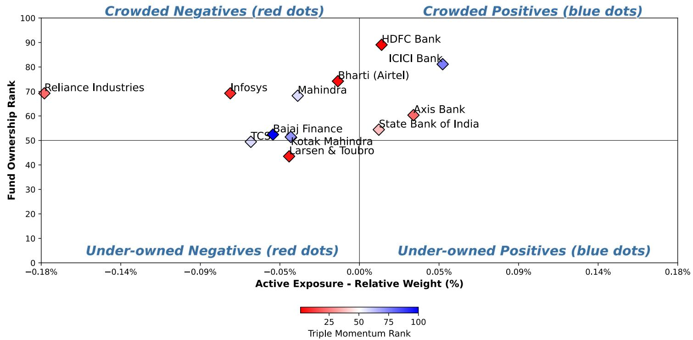

scatter

| Institution | Fund Ownership Rank | Active Exposure - Relative Weight (%) | Triple Momentum Rank |
| --- | --- | --- | --- |
| Reliance Industries | 70 | -0.18 | 25 |
| Infosys | 70 | -0.09 | 25 |
| Mahindra | 70 | -0.04 | 50 |
| Bajaj Finance | 53 | -0.05 | 50 |
| Kotak Mahindra | 51 | -0.04 | 50 |
| Larsen & Toubro | 44 | -0.04 | 25 |
| State Bank of India | 55 | 0.03 | 75 |
| Axis Bank | 61 | 0.05 | 75 |
| Bharti (Airtel) | 75 | -0.01 | 75 |
| HDFC Bank | 90 | 0.02 | 25 |
| ICICI Bank | 81 | 0.05 | 100 |
| Reliance Industries | 70 | -0.18 | 25 |
| Infosys | 70 | -0.09 | 25 |
| Mahindra | 69 | -0.04 | 50 |
| Bajaj Finance | 53 | -0.05 | 50 |
| Kotak Mahindra | 51 | -0.04 | 50 |
| Larsen & Toubro | 44 | -0.04 | 25 |
| State Bank of India | 55 | 0.03 | 75 |
| Axis Bank | 81 | 0.05 | 25 |
| Theoretical Points for Crowded Positives are labeled in the legend as 'Under-owned Negatives (red dots)' and 'Under-owned Positives (blue dots)' respectively.

Source : BofA Asia Pac Quantitative Strategy, MSCI, FTSE, FactSet, Bloomberg, 13F Filings, Benchmark Indices, Country Stock Exchanges

BofA GLOBAL RESEARCH

# Chart 89: Reliance Industries-Rolling 12-months Long-Only Equity Flow (\$bn)

In the last 12m, funds had a cumulative inflow of \$1.9bn

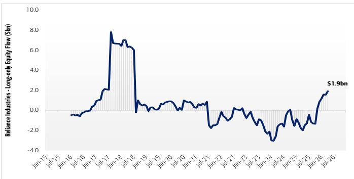

line

| Date    | Reliance Industries - Long-only Equity Flow ($bn) |
|---------|--------------------------------------------------|
| Jul-26  | $1.9bn                                           |

Source : BofA Asia Pac Quantitative Strategy, MSCI, FTSE, FactSet, Bloomberg, 13F Filings, Benchmark Indices, Country Stock Exchanges   
BofA GLOBAL RESEARCH

# Chart 91: ICICI Bank-Rolling 12-months Long-Only Equity Flow (\$bn)

Last month, long-only funds bought shares worth \$0.3bn

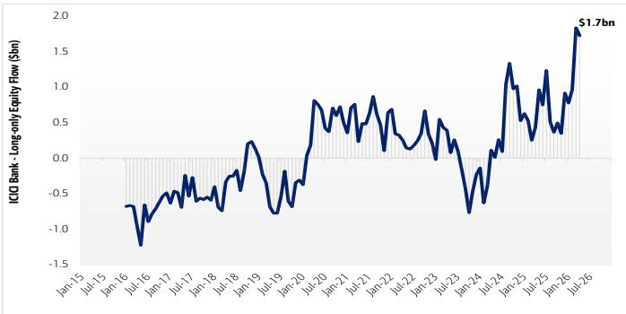

line

| Date     | ICICI Bank - Long-only Equity Flow ($bn) |
| -------- | ---------------------------------------- |
| Jul-26   | 1.7bn                                    |

Source : BofA Asia Pac Quantitative Strategy, MSCI, FTSE, FactSet, Bloomberg, 13F Filings, Benchmark Indices, Country Stock Exchanges   
BofA GLOBAL RESEARCH

# Chart 93: HDFC Bank-Rolling 12-months Long-Only Equity Flow (\$bn)

Last month, long-only funds sold shares worth -\$1.0bn

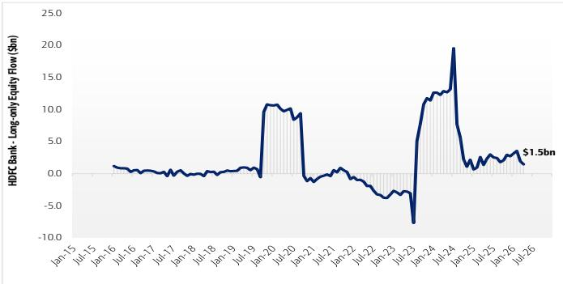

line

| Date     | Value (bn) |
| -------- | ---------- |
| Jul-26   | $1.5bn     |

Source : BofA Asia Pac Quantitative Strategy, MSCI, FTSE, FactSet, Bloomberg, 13F Filings, Benchmark Indices, Country Stock Exchanges   
BofA GLOBAL RESEARCH

# Chart 90: Reliance Industries-Ownership and Active Exposure Funds are underweight this stock

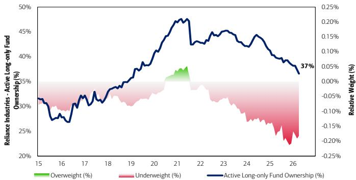

line

| Year | Active Long-only Fund Ownership (%) | Relative Weight (%) |
|------|-------------------------------------|---------------------|
| 2026 | 37                                  | -0.25               |

Source : BofA Asia Pac Quantitative Strategy, MSCI, FTSE, FactSet, Bloomberg, 13F Filings, Benchmark Indices, Country Stock Exchanges   
BofA GLOBAL RESEARCH

# Chart 92: ICICI Bank-Ownership And Active Exposure Funds have reduced exposure in last 3-mths

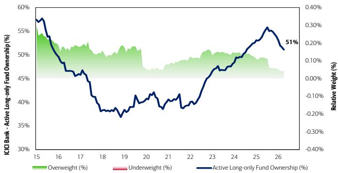

line

| Year | Active Long-only Fund Ownership (%) | Overweight (%) |
|------|-------------------------------------|----------------|
| 2026 | 51%                                 | -              |

Source : BofA Asia Pac Quantitative Strategy, MSCI, FTSE, FactSet, Bloomberg, 13F Filings, Benchmark Indices, Country Stock Exchanges   
BofA GLOBAL RESEARCH

# Chart 94: HDFC Bank-Ownership And Active Exposure Funds have reduced exposure in last 3-mths

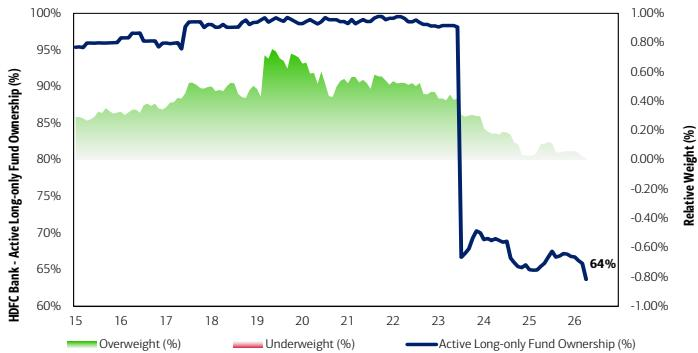

line

| Year | Overweight (%) | Underweight (%) | Active Long-only Fund Ownership (%) |
|------|----------------|-----------------|-------------------------------------|
| 2026 | 64%            | -               | -                                   |

Source : BofA Asia Pac Quantitative Strategy, MSCI, FTSE, FactSet, Bloomberg, 13F Filings, Benchmark Indices, Country Stock Exchanges   
BofA GLOBAL RESEARCH

Chart 95: Bharti (Airtel)-Rolling 12-months Long-Only Equity Flow (\$bn)   
Last month, long-only funds bought shares worth \$1.2bn   
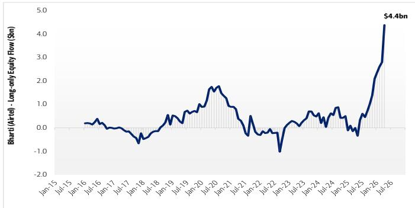

line

| Date     | Value (bn) |
| -------- | ---------- |
| Jul-26   | $4.4bn     |

Source : BofA Asia Pac Quantitative Strategy, MSCI, FTSE, FactSet, Bloomberg, 13F Filings, Benchmark Indices, Country Stock Exchanges   
BofA GLOBAL RESEARCH

Chart 97: Infosys-Rolling 12-months Long-Only Equity Flow (\$bn)
Last month, long-only funds bought shares worth \$0.1bn   
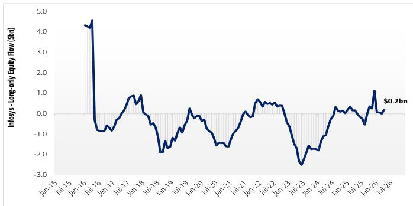

line

| Date   | Value ($bn) |
|--------|-------------|
| Jul-26 | $0.2bn      |

Source : BofA Asia Pac Quantitative Strategy, MSCI, FTSE, FactSet, Bloomberg, 13F Filings, Benchmark Indices, Country Stock Exchanges   
BofA GLOBAL RESEARCH

Chart 99: Bajaj Finance-Rolling 12-months Long-Only Equity Flow (\$bn)   
Last month, long-only funds bought shares worth \$0.2bn   
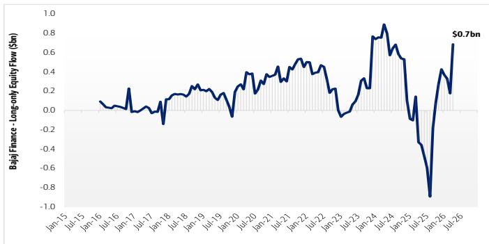

line

| Date   | Value     |
|--------|-----------|
| Jul-26 | $0.7bn    |

Source : BofA Asia Pac Quantitative Strategy, MSCI, FTSE, FactSet, Bloomberg, 13F Filings, Benchmark Indices, Country Stock Exchanges   
BofA GLOBAL RESEARCH

Chart 96: Bharti (Airtel)-Ownership and Active Exposure Funds are underweight this stock   
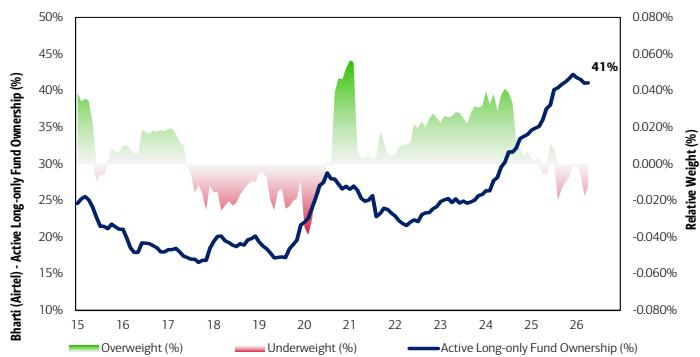

line

| Year | Overweight (%) | Underweight (%) | Active Long-only Fund Ownership (%) |
|------|----------------|-----------------|-------------------------------------|
| 2026 | 41%            | -               | 41%                                 |

Source : BofA Asia Pac Quantitative Strategy, MSCI, FTSE, FactSet, Bloomberg, 13F Filings, Benchmark Indices, Country Stock Exchanges   
BofA GLOBAL RESEARCH

Chart 98: Infosys-Ownership And Active Exposure
37% active long-only funds own this stock   
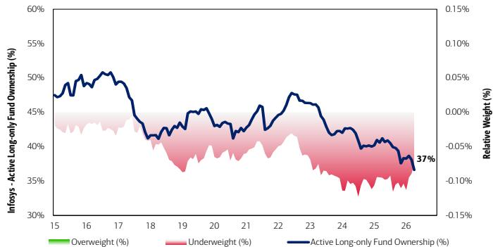

line

| Year | Active Long-only Fund Ownership (%) | Overweight (%) | Underweight (%) |
|------|-------------------------------------|----------------|----------------|
| 26   | 37%                                 |                |                |

Source : BofA Asia Pac Quantitative Strategy, MSCI, FTSE, FactSet, Bloomberg, 13F Filings, Benchmark Indices, Country Stock Exchanges   
BofA GLOBAL RESEARCH

Chart 100: Bajaj Finance-Ownership and Active Exposure Funds have reduced exposure in last 3-mths   
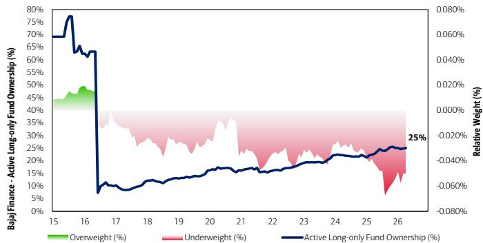

line

| Year | Active Long-only Fund Ownership (%) | Overweight (%) | Underweight (%) |
|------|-------------------------------------|----------------|----------------|
| 15   | 70%                                 | 45%            | 0.08%          |
| 16   | 65%                                 | 45%            | 0.08%          |
| 17   | 10%                                 | 45%            | 0.08%          |
| 18   | 15%                                 | 45%            | 0.08%          |
| 19   | 20%                                 | 45%            | 0.08%          |
| 20   | 25%                                 | 45%            | 0.08%          |
| 21   | 30%                                 | 45%            | 0.08%          |
| 22   | 35%                                 | 45%            | 0.08%          |
| 23   | 40%                                 | 45%            | 0.08%          |
| 24   | 45%                                 | 45%            | 0.08%          |
| 25   | 50%                                 | 45%            | 0.08%          |
| 26   | 55%                                 | 45%            | 0.08%          |

Source : BofA Asia Pac Quantitative Strategy, MSCI, FTSE, FactSet, Bloomberg, 13F Filings, Benchmark Indices, Country Stock Exchanges   
BofA GLOBAL RESEARCH

Table 16: India Stock Positioning Characteristics: Top 50 by Market Capitalisation

Characteristics of the India Top 50 stocks by market capitalization

<table><tr><td>Name</td><td>BBG Code</td><td>Sector</td><td>MCAP (Total $USm)</td><td>Avg Daily TO (6m $US m)</td><td>Relative Weight (%)</td><td>Relative Dollar ($USm)</td><td>Long-only Equity Flow ($USm)</td><td>Fund Ownership (%)</td><td>Triple Momentum Rank</td><td>Positioning Flag</td><td>Funds Count</td></tr><tr><td>HDFC Bank</td><td>HDFCB IN</td><td>Banks</td><td>125,085</td><td>328.5</td><td>0.013%</td><td>949</td><td>-990</td><td>64%</td><td>13</td><td>-</td><td>1,060</td></tr><tr><td>ICICI Bank</td><td>ICICIBC IN</td><td>Banks</td><td>95,187</td><td>223.0</td><td>0.048%</td><td>3,348</td><td>327</td><td>51%</td><td>49</td><td>-</td><td>994</td></tr><tr><td>Bharti (Airtel)</td><td>BHARTI IN</td><td>Telecom</td><td>113,353</td><td>189.8</td><td>-0.012%</td><td>-861</td><td>1,248</td><td>41%</td><td>15</td><td>Crowded Negatives</td><td>974</td></tr><tr><td>Infosys</td><td>INFO IN</td><td>Software</td><td>50,486</td><td>185.3</td><td>-0.075%</td><td>-5,109</td><td>123</td><td>37%</td><td>17</td><td>Crowded Negatives</td><td>983</td></tr><tr><td>Reliance Industries</td><td>RELIANCE IN</td><td>Energy</td><td>203,998</td><td>236.2</td><td>-0.182%</td><td>-13,090</td><td>201</td><td>37%</td><td>24</td><td>-</td><td>981</td></tr><tr><td>Mahindra</td><td>MM IN</td><td>Cons. Discretionary</td><td>40,582</td><td>103.3</td><td>-0.036%</td><td>-2,374</td><td>-260</td><td>36%</td><td>41</td><td>-</td><td>960</td></tr><tr><td>LIC Insurance</td><td>LICI IN</td><td>Insurance</td><td>53,185</td><td>14.6</td><td>0.061%</td><td>141</td><td>-9</td><td>32%</td><td>54</td><td>-</td><td>95</td></tr><tr><td>Axis Bank</td><td>AXSB IN</td><td>Banks</td><td>41,494</td><td>93.8</td><td>0.031%</td><td>2,083</td><td>63</td><td>30%</td><td>24</td><td>-</td><td>962</td></tr><tr><td>Adani Green Energy</td><td>ADANIGR IN</td><td>Utilities</td><td>21,275</td><td>39.7</td><td>-0.024%</td><td>-722</td><td>18</td><td>28%</td><td>67</td><td>-</td><td>120</td></tr><tr><td>Zomato</td><td>ETERNAL IN</td><td>Cons. Discretionary</td><td>25,117</td><td>140.2</td><td>0.038%</td><td>2,645</td><td>184</td><td>27%</td><td>58</td><td>-</td><td>966</td></tr><tr><td>State Bank of India</td><td>SBIN IN</td><td>Banks</td><td>103,910</td><td>164.1</td><td>0.011%</td><td>734</td><td>501</td><td>26%</td><td>31</td><td>-</td><td>951</td></tr><tr><td>Bajaj Finance</td><td>BAF IN</td><td>Div Financials</td><td>61,429</td><td>91.1</td><td>-0.050%</td><td>-3,276</td><td>196</td><td>25%</td><td>61</td><td>-</td><td>945</td></tr><tr><td>Kotak Mahindra</td><td>KMB IN</td><td>Banks</td><td>40,164</td><td>79.8</td><td>-0.040%</td><td>-2,601</td><td>-77</td><td>24%</td><td>48</td><td>-</td><td>949</td></tr><tr><td>TCS</td><td>TCS IN</td><td>Software</td><td>94,304</td><td>117.3</td><td>-0.063%</td><td>-4,192</td><td>7</td><td>24%</td><td>41</td><td>-</td><td>964</td></tr><tr><td>Maruti Suzuki</td><td>MSIL IN</td><td>Cons. Discretionary</td><td>44,103</td><td>73.6</td><td>-0.020%</td><td>-1,301</td><td>-191</td><td>21%</td><td>20</td><td>Under-Owned Negatives</td><td>945</td></tr><tr><td>Shriram Finance</td><td>SHFL IN</td><td>Div Financials</td><td>23,233</td><td>85.5</td><td>-0.020%</td><td>-1,302</td><td>112</td><td>21%</td><td>91</td><td>-</td><td>953</td></tr><tr><td>Eicher Motors</td><td>EIM IN</td><td>Cons. Discretionary</td><td>20,545</td><td>45.4</td><td>-0.015%</td><td>-973</td><td>50</td><td>21%</td><td>61</td><td>-</td><td>947</td></tr><tr><td>Larsen &amp; Toubro</td><td>LT IN</td><td>Industrials</td><td>58,175</td><td>118.7</td><td>-0.041%</td><td>-2,643</td><td>70</td><td>21%</td><td>15</td><td>Under-Owned Negatives</td><td>936</td></tr><tr><td>Hindalco Industries</td><td>HNDL IN</td><td>Materials</td><td>24,576</td><td>67.4</td><td>-0.034%</td><td>-2,186</td><td>-8</td><td>21%</td><td>65</td><td>-</td><td>937</td></tr><tr><td>Sun Pharma</td><td>SUNP IN</td><td>Health Care</td><td>45,711</td><td>58.6</td><td>-0.032%</td><td>-2,104</td><td>104</td><td>20%</td><td>68</td><td>-</td><td>948</td></tr><tr><td>HCL Technologies</td><td>HCLT IN</td><td>Software</td><td>34,283</td><td>58.3</td><td>-0.015%</td><td>-994</td><td>59</td><td>19%</td><td>7</td><td>Under-Owned Negatives</td><td>962</td></tr><tr><td>Bharat Elec</td><td>BHE IN</td><td>Industrials</td><td>33,217</td><td>83.7</td><td>-0.036%</td><td>-2,367</td><td>120</td><td>19%</td><td>73</td><td>-</td><td>956</td></tr><tr><td>Interglobe Aviation</td><td>INDIGO IN</td><td>Industrials</td><td>17,495</td><td>102.0</td><td>0.003%</td><td>164</td><td>169</td><td>19%</td><td>23</td><td>-</td><td>943</td></tr><tr><td>Power Grid - India</td><td>PWGR IN</td><td>Utilities</td><td>31,195</td><td>47.0</td><td>-0.020%</td><td>-1,319</td><td>-38</td><td>19%</td><td>27</td><td>-</td><td>955</td></tr><tr><td>SBI Life Insurance</td><td>SBILIFE IN</td><td>Insurance</td><td>19,219</td><td>24.5</td><td>-0.003%</td><td>-199</td><td>-31</td><td>18%</td><td>8</td><td>Under-Owned Negatives</td><td>947</td></tr><tr><td>NTPC</td><td>NTPC IN</td><td>Utilities</td><td>40,778</td><td>45.7</td><td>-0.033%</td><td>-2,161</td><td>-64</td><td>16%</td><td>57</td><td>-</td><td>945</td></tr><tr><td>TVS Motor</td><td>TVSL IN</td><td>Cons. Discretionary</td><td>17,484</td><td>33.3</td><td>0.000%</td><td>-3</td><td>74</td><td>16%</td><td>56</td><td>-</td><td>933</td></tr><tr><td>Titan</td><td>TTAN IN</td><td>Cons. Discretionary</td><td>41,017</td><td>44.2</td><td>-0.043%</td><td>-2,789</td><td>-36</td><td>16%</td><td>44</td><td>-</td><td>938</td></tr><tr><td>Ultratech Cement</td><td>UTCEM IN</td><td>Materials</td><td>35,971</td><td>38.2</td><td>-0.030%</td><td>-1,978</td><td>-42</td><td>16%</td><td>49</td><td>-</td><td>939</td></tr><tr><td>Varun Beverages</td><td>VBL IN</td><td>Cons. Staples</td><td>18,304</td><td>32.3</td><td>0.002%</td><td>133</td><td>-32</td><td>15%</td><td>70</td><td>-</td><td>921</td></tr><tr><td>Hindustan Unilever</td><td>HUVR IN</td><td>Cons. Staples</td><td>55,721</td><td>46.8</td><td>-0.073%</td><td>-4,780</td><td>-22</td><td>15%</td><td>29</td><td>-</td><td>941</td></tr><tr><td>ITC</td><td>ITC IN</td><td>Cons. Staples</td><td>41,568</td><td>88.7</td><td>-0.005%</td><td>-326</td><td>-106</td><td>14%</td><td>25</td><td>-</td><td>939</td></tr><tr><td>Bajaj Auto</td><td>BJAUT IN</td><td>Cons. Discretionary</td><td>29,430</td><td>37.0</td><td>-0.013%</td><td>-875</td><td>97</td><td>14%</td><td>73</td><td>-</td><td>935</td></tr><tr><td>Tata Steel</td><td>TATA IN</td><td>Materials</td><td>27,799</td><td>67.0</td><td>-0.043%</td><td>-2,815</td><td>-12</td><td>14%</td><td>70</td><td>-</td><td>936</td></tr><tr><td>Divi&#x27;s Labs</td><td>DIVI IN</td><td>Health Care</td><td>18,187</td><td>24.1</td><td>-0.003%</td><td>-166</td><td>26</td><td>13%</td><td>55</td><td>-</td><td>929</td></tr><tr><td>WIPRO</td><td>WPRO IN</td><td>Software</td><td>22,170</td><td>38.7</td><td>-0.018%</td><td>-1,181</td><td>9</td><td>13%</td><td>44</td><td>-</td><td>954</td></tr><tr><td>Asian Paints</td><td>APNT IN</td><td>Materials</td><td>24,704</td><td>41.4</td><td>-0.032%</td><td>-2,076</td><td>70</td><td>13%</td><td>56</td><td>-</td><td>940</td></tr><tr><td>Hindustan Aeronautics</td><td>HNAL IN</td><td>Industrials</td><td>30,572</td><td>67.6</td><td>-0.059%</td><td>-3,804</td><td>-9</td><td>13%</td><td>43</td><td>-</td><td>929</td></tr><tr><td>ONGC</td><td>ONGC IN</td><td>Energy</td><td>39,704</td><td>52.0</td><td>-0.034%</td><td>-2,222</td><td>-95</td><td>13%</td><td>78</td><td>-</td><td>939</td></tr><tr><td>Indian Oil</td><td>IOCL IN</td><td>Energy</td><td>21,164</td><td>30.4</td><td>-0.009%</td><td>-549</td><td>-50</td><td>11%</td><td>7</td><td>Under-Owned Negatives</td><td>921</td></tr><tr><td>Avenue Supermarts</td><td>DMART IN</td><td>Cons. Staples</td><td>31,441</td><td>23.7</td><td>0.005%</td><td>323</td><td>-65</td><td>10%</td><td>38</td><td>-</td><td>919</td></tr><tr><td>Adani Ports</td><td>ADSEZ IN</td><td>Industrials</td><td>37,718</td><td>42.9</td><td>-0.012%</td><td>-798</td><td>97</td><td>10%</td><td>41</td><td>-</td><td>939</td></tr><tr><td>Bajaj Finserv</td><td>BJFIN IN</td><td>Div Financials</td><td>29,413</td><td>27.9</td><td>-0.020%</td><td>-1,307</td><td>100</td><td>10%</td><td>41</td><td>-</td><td>937</td></tr><tr><td>Tata Motors /New</td><td>TMCV IN</td><td>Industrials</td><td>15,900</td><td>65.9</td><td>-0.012%</td><td>-736</td><td>75</td><td>10%</td><td>49</td><td>-</td><td>886</td></tr><tr><td>Grasim Ind</td><td>GRASIM IN</td><td>Materials</td><td>20,036</td><td>23.9</td><td>-0.032%</td><td>-2,086</td><td>-52</td><td>9%</td><td>44</td><td>-</td><td>928</td></tr><tr><td>ABB India</td><td>ABB IN</td><td>Industrials</td><td>16,142</td><td>23.8</td><td>-0.003%</td><td>-162</td><td>-29</td><td>9%</td><td>29</td><td>-</td><td>908</td></tr><tr><td>Coal India</td><td>COAL IN</td><td>Energy</td><td>31,260</td><td>47.5</td><td>-0.028%</td><td>-1,820</td><td>77</td><td>8%</td><td>71</td><td>-</td><td>934</td></tr><tr><td>JSW Steel</td><td>ISTL IN</td><td>Materials</td><td>32,580</td><td>23.7</td><td>-0.032%</td><td>-2,054</td><td>8</td><td>7%</td><td>73</td><td>-</td><td>931</td></tr><tr><td>Adani Power</td><td>ADANI IN</td><td>Utilities</td><td>45,076</td><td>51.8</td><td>0.022%</td><td>1,417</td><td>18</td><td>5%</td><td>82</td><td>Under-Owned Positives</td><td>908</td></tr><tr><td>Adani Ent.</td><td>ADE IN</td><td>Industrials</td><td>29,287</td><td>46.0</td><td>-0.002%</td><td>-112</td><td>48</td><td>5%</td><td>30</td><td>-</td><td>929</td></tr></table>

Source : BofA Asia Pac Quantitative Strategy, MSCI, FTSE, FactSet, Bloomberg, 13F Filings, Benchmark Indices, Country Stock Exchanges   
\* OW = Overweight, ^ UW = Underweight, # BM = Benchmark

BofA GLOBAL RESEARCH

# South Korea

Chart 101: Positioning and Triple Momentum Quadrants: South Korea's Most Important Stocks   
In Korea, Crowded Positives include SK Hynix   
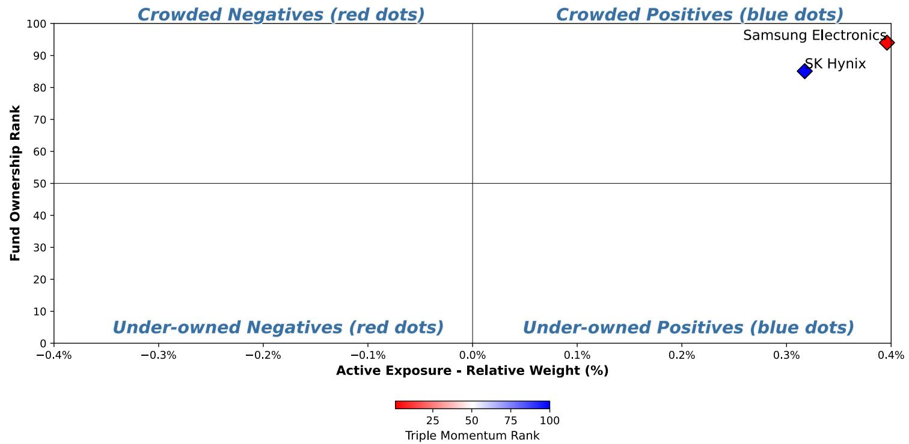

scatter

| Category                  | Active Exposure - Relative Weight (%) | Triple Momentum Rank |
| ------------------------- | ------------------------------------- | -------------------- |
| Crowded Negatives (red dots) | 0.4                                   | 100                  |
| Crowded Positives (blue dots) | 0.3                                   | 75                   |
| Samsung Electronics       | 0.4                                   | 50                   |
| SK Hynix                  | 0.3                                   | 75                   |

Source : BofA Asia Pac Quantitative Strategy, MSCI, FTSE, FactSet, Bloomberg, 13F Filings, Benchmark Indices, Country Stock Exchanges

BofA GLOBAL RESEARCH

Chart 102: SK Hynix-Rolling 12-months Long-Only Equity Flow (\$bn)   
In last 12-months, long-only funds sold shares worth -\$14.1bn   
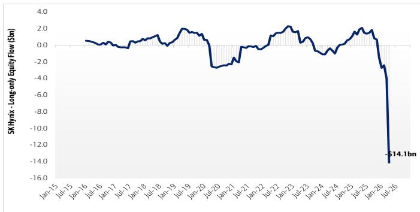

line

| Date    | SK Hynix - Long-only Equity Flow ($bn) |
|---------|----------------------------------------|
| Jul-26  | -14.1bn                                |

Source : BofA Asia Pac Quantitative Strategy, MSCI, FTSE, FactSet, Bloomberg, 13F Filings, Benchmark Indices, Country Stock Exchanges

BofA GLOBAL RESEARCH

Chart 104: Samsung Electronics-Rolling 12-months Long-Only Equity Flow (\$bn)   
In last 12-months, long-only funds sold shares worth -\$6.0bn   
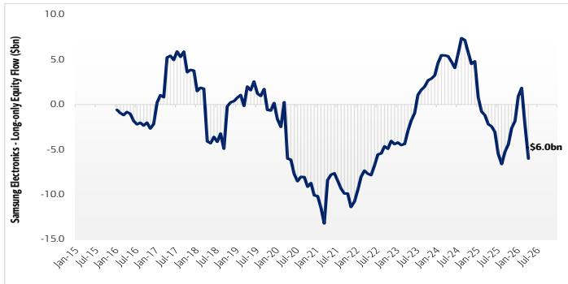

line

| Date    | Samsung Electronics - Long-only Equity Flow ($bn) |
|---------|--------------------------------------------------|
| Jul-26  | $6.0bn                                           |

Source : BofA Asia Pac Quantitative Strategy, MSCI, FTSE, FactSet, Bloomberg, 13F Filings, Benchmark Indices, Country Stock Exchanges

BofA GLOBAL RESEARCH

Chart 106: SK Square-Rolling 12-months Long-Only Equity Flow (\$bn)   
In last 12-months, long-only funds sold shares worth -\$0.1bn   
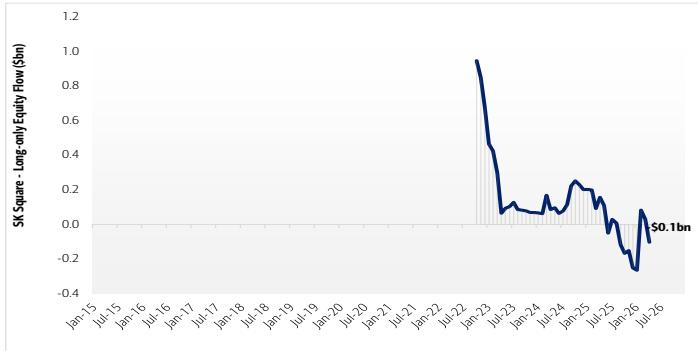

line

| Date    | SK Square - Long-only Equity Flow ($bn) |
|---------|------------------------------------------|
| Jul-26  | $0.1                                     |

Source : BofA Asia Pac Quantitative Strategy, MSCI, FTSE, FactSet, Bloomberg, 13F Filings, Benchmark Indices, Country Stock Exchanges

BofA GLOBAL RESEARCH

Chart 103: SK Hynix-Ownership And Active Exposure   
Active long-only funds ownership has increased in the last 3m   
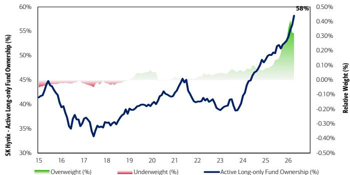

line

| Year | Active Long-only Fund Ownership (%) | Overweight (%) | Underweight (%) |
|------|-------------------------------------|----------------|-----------------|
| 2026 | 58%                                 | 0.50           | 0.00            |

Source : BofA Asia Pac Quantitative Strategy, MSCI, FTSE, FactSet, Bloomberg, 13F Filings, Benchmark Indices, Country Stock Exchanges

BofA GLOBAL RESEARCH

Chart 105: Samsung Electronics-Ownership and Active Exposure   
Funds have reduced exposure in last 3-mths   
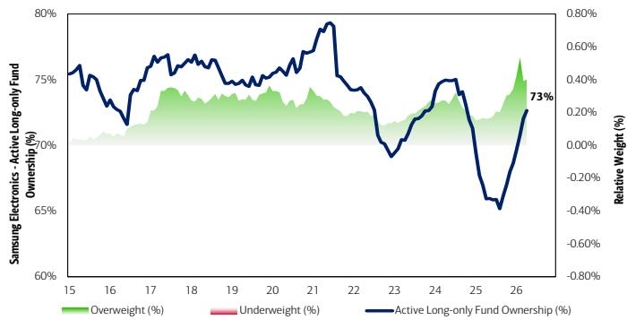

line

| Year | Samsung Electronics - Active Long-only Fund Ownership (%) | Overweight (%) | Underweight (%) | Active Long-only Fund Ownership (%) |
|------|---------------------------------------------------------------|----------------|-----------------|-------------------------------------|
| 2026 | 73%                                                           | 73%            | 73%             | 73%                                 |

Source : BofA Asia Pac Quantitative Strategy, MSCI, FTSE, FactSet, Bloomberg, 13F Filings, Benchmark Indices, Country Stock Exchanges

BofA GLOBAL RESEARCH

Chart 107: SK Square-Ownership And Active Exposure   
Active long-only funds ownership has increased in the last 3m   
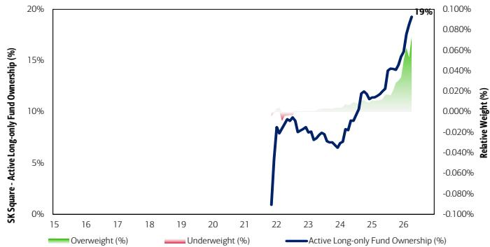

line

| Year | Active Long-only Fund Ownership (%) | Relative Weight (%) |
|------|-------------------------------------|---------------------|
| 2026 | 19%                                 | 0.100%              |

Source : BofA Asia Pac Quantitative Strategy, MSCI, FTSE, FactSet, Bloomberg, 13F Filings, Benchmark Indices, Country Stock Exchanges

BofA GLOBAL RESEARCH

# Chart 108: Doosan Enerbility-Rolling 12-months Long-Only Equity Flow (\$bn)

Last month, long-only funds sold shares worth -\$0.1bn

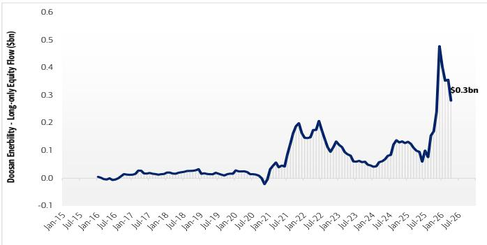

line

| Date     | Value (bn) |
| -------- | ---------- |
| Jul-26   | 0.3        |

Source : BofA Asia Pac Quantitative Strategy, MSCI, FTSE, FactSet, Bloomberg, 13F Filings, Benchmark Indices, Country Stock Exchanges

BofA GLOBAL RESEARCH

Chart 109: Doosan Enerbility-Ownership and Active Exposure
10% active long-only funds own this stock   
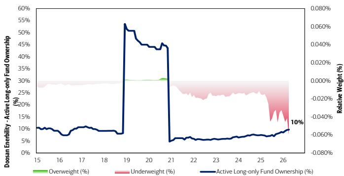

line

| Year | Active Long-only Fund Ownership (%) | Overweight (%) | Underweight (%) |
|------|-------------------------------------|----------------|----------------|
| 15   | ~10%                                | ~28%           | ~-0.02%        |
| 16   | ~10%                                | ~28%           | ~-0.02%        |
| 17   | ~10%                                | ~28%           | ~-0.02%        |
| 18   | ~10%                                | ~28%           | ~-0.02%        |
| 19   | ~55%                                | ~28%           | ~-0.02%        |
| 20   | ~45%                                | ~28%           | ~-0.02%        |
| 21   | ~5%                                 | ~28%           | ~-0.02%        |
| 22   | ~5%                                 | ~28%           | ~-0.02%        |
| 23   | ~5%                                 | ~28%           | ~-0.02%        |
| 24   | ~5%                                 | ~28%           | ~-0.02%        |
| 25   | ~5%                                 | ~28%           | ~-0.02%        |
| 26   | ~10%                                | ~28%           | ~-0.02%        |

Source : BofA Asia Pac Quantitative Strategy, MSCI, FTSE, FactSet, Bloomberg, 13F Filings, Benchmark Indices, Country Stock Exchanges

BofA GLOBAL RESEARCH

Table 17: Korea Stock Positioning Characteristics: Top 50 by Market Capitalisation

Characteristics of the Korea Top 50 stocks by market capitalization

<table><tr><td>Name</td><td>BBG Code</td><td>Sector</td><td>MCAP (Total $USm)</td><td>Avg Daily TO (6m $US m)</td><td>Relative Weight (%)</td><td>Relative Dollar ($USm)</td><td>Long-only Equity Flow ($USm)</td><td>Fund Ownership p (%)</td><td>Triple Momentum Rank</td><td>Positioning Flag</td><td>Funds Count</td></tr><tr><td>KT Corp</td><td>030200 KS</td><td>Telecom</td><td>10,348</td><td>23.6</td><td>0.187%</td><td>1,248</td><td>-34</td><td>97%</td><td>10</td><td>-</td><td>116</td></tr><tr><td>SK Hynix</td><td>000660 KS</td><td>Semiconductors</td><td>631,210</td><td>3,878.0</td><td>0.321%</td><td>27,815</td><td>-9,518</td><td>58%</td><td>99</td><td>Crowded Positives</td><td>981</td></tr><tr><td>Korea Zinc</td><td>010130 KS</td><td>Materials</td><td>22,221</td><td>82.0</td><td>0.000%</td><td>13</td><td>-22</td><td>42%</td><td>92</td><td>Crowded Positives</td><td>71</td></tr><tr><td>KB Financial</td><td>105560 KS</td><td>Banks</td><td>41,279</td><td>129.5</td><td>0.057%</td><td>3,833</td><td>-440</td><td>36%</td><td>59</td><td>-</td><td>884</td></tr><tr><td>Coupang</td><td>CPNG US</td><td>Cons. Discretionary</td><td>32,712</td><td>426.4</td><td>0.041%</td><td>2,741</td><td>206</td><td>34%</td><td>3</td><td>-</td><td>649</td></tr><tr><td>Kia</td><td>000270 KS</td><td>Cons. Discretionary</td><td>39,957</td><td>192.7</td><td>0.019%</td><td>1,293</td><td>30</td><td>29%</td><td>75</td><td>-</td><td>879</td></tr><tr><td>Shinhan Financial</td><td>055550 KS</td><td>Banks</td><td>32,700</td><td>93.7</td><td>0.023%</td><td>1,522</td><td>487</td><td>28%</td><td>99</td><td>Crowded Positives</td><td>877</td></tr><tr><td>Hana Financial</td><td>086790 KS</td><td>Banks</td><td>24,001</td><td>73.9</td><td>0.023%</td><td>1,512</td><td>-120</td><td>26%</td><td>80</td><td>Crowded Positives</td><td>866</td></tr><tr><td>Hyundai Motor</td><td>005380 KS</td><td>Cons. Discretionary</td><td>73,305</td><td>1,028.3</td><td>0.003%</td><td>243</td><td>-1,128</td><td>22%</td><td>63</td><td>-</td><td>863</td></tr><tr><td>Samsung Fire</td><td>000810 KS</td><td>Insurance</td><td>14,301</td><td>43.4</td><td>0.021%</td><td>1,342</td><td>-17</td><td>21%</td><td>74</td><td>-</td><td>863</td></tr><tr><td>Hyundai Electric</td><td>267260 KS</td><td>Industrials</td><td>30,428</td><td>146.7</td><td>0.001%</td><td>67</td><td>-61</td><td>21%</td><td>91</td><td>Under-Owned Positives</td><td>866</td></tr><tr><td>Hyundai Mobis</td><td>012330 KS</td><td>Cons. Discretionary</td><td>25,999</td><td>141.0</td><td>0.019%</td><td>1,270</td><td>41</td><td>21%</td><td>40</td><td>-</td><td>856</td></tr><tr><td>Naver</td><td>035420 KS</td><td>Media &amp; Ent.</td><td>22,314</td><td>341.4</td><td>-0.010%</td><td>-679</td><td>-111</td><td>20%</td><td>35</td><td>-</td><td>852</td></tr><tr><td>Samsung Biologics</td><td>207940 KS</td><td>Health Care</td><td>45,879</td><td>89.7</td><td>-0.001%</td><td>-79</td><td>-8</td><td>19%</td><td>59</td><td>-</td><td>855</td></tr><tr><td>Samsung C&amp;T</td><td>028260 KS</td><td>Industrials</td><td>34,208</td><td>96.5</td><td>0.014%</td><td>926</td><td>-23</td><td>19%</td><td>78</td><td>-</td><td>848</td></tr><tr><td>HD Korea Shipbuilding</td><td>009540 KS</td><td>Industrials</td><td>22,021</td><td>85.1</td><td>-0.006%</td><td>-392</td><td>16</td><td>18%</td><td>64</td><td>-</td><td>846</td></tr><tr><td>Hanwha Aerospace</td><td>012450 KS</td><td>Industrials</td><td>49,262</td><td>312.4</td><td>0.011%</td><td>731</td><td>317</td><td>17%</td><td>83</td><td>Under-Owned Positives</td><td>846</td></tr><tr><td>LG Chem</td><td>051910 KS</td><td>Materials</td><td>18,895</td><td>111.7</td><td>-0.003%</td><td>-181</td><td>65</td><td>16%</td><td>34</td><td>-</td><td>845</td></tr><tr><td>Woori Financial</td><td>316140 KS</td><td>Banks</td><td>16,506</td><td>60.0</td><td>-0.012%</td><td>-793</td><td>17</td><td>16%</td><td>25</td><td>-</td><td>860</td></tr><tr><td>SEMCO</td><td>009150 KS</td><td>Tech Hardware</td><td>41,899</td><td>295.4</td><td>-0.024%</td><td>-1,554</td><td>-50</td><td>16%</td><td>99</td><td>-</td><td>862</td></tr><tr><td>Glovis</td><td>086280 KS</td><td>Industrials</td><td>11,479</td><td>76.3</td><td>0.000%</td><td>-12</td><td>13</td><td>15%</td><td>22</td><td>-</td><td>848</td></tr><tr><td>Hyundai Heavy Ind</td><td>329180 KS</td><td>Industrials</td><td>48,475</td><td>165.8</td><td>-0.017%</td><td>-1,112</td><td>27</td><td>14%</td><td>92</td><td>-</td><td>839</td></tr><tr><td>Hyundai Rotem</td><td>064350 KS</td><td>Industrials</td><td>19,758</td><td>194.0</td><td>-0.013%</td><td>-819</td><td>19</td><td>14%</td><td>82</td><td>-</td><td>849</td></tr><tr><td>LG Electronics</td><td>066570 KS</td><td>Cons. Discretionary</td><td>15,474</td><td>171.6</td><td>-0.006%</td><td>-358</td><td>10</td><td>14%</td><td>96</td><td>-</td><td>844</td></tr><tr><td>HD Hyundai</td><td>267250 KS</td><td>Energy</td><td>16,537</td><td>41.9</td><td>-0.010%</td><td>-657</td><td>20</td><td>13%</td><td>94</td><td>-</td><td>844</td></tr><tr><td>Kakao</td><td>035720 KS</td><td>Media &amp; Ent.</td><td>14,111</td><td>144.8</td><td>-0.014%</td><td>-862</td><td>-42</td><td>13%</td><td>39</td><td>-</td><td>838</td></tr><tr><td>KEPCO</td><td>015760 KS</td><td>Utilities</td><td>18,849</td><td>195.3</td><td>-0.007%</td><td>-454</td><td>24</td><td>12%</td><td>24</td><td>-</td><td>844</td></tr><tr><td>SK Telecom</td><td>017670 KS</td><td>Telecom</td><td>13,772</td><td>77.5</td><td>0.001%</td><td>48</td><td>-23</td><td>12%</td><td>36</td><td>-</td><td>856</td></tr><tr><td>Korea Tobacco</td><td>033780 KS</td><td>Cons. Staples</td><td>14,182</td><td>37.0</td><td>0.010%</td><td>669</td><td>59</td><td>12%</td><td>96</td><td>Under-Owned Positives</td><td>851</td></tr><tr><td>LG Corp</td><td>003550 KS</td><td>Industrials</td><td>10,304</td><td>24.9</td><td>0.004%</td><td>241</td><td>51</td><td>12%</td><td>51</td><td>-</td><td>848</td></tr><tr><td>Samsung Heavy</td><td>010140 KS</td><td>Industrials</td><td>19,194</td><td>192.2</td><td>-0.021%</td><td>-1,357</td><td>23</td><td>12%</td><td>66</td><td>-</td><td>844</td></tr><tr><td>Samsung SDI</td><td>006400 KS</td><td>Tech Hardware</td><td>37,761</td><td>447.6</td><td>-0.037%</td><td>-2,361</td><td>12</td><td>10%</td><td>100</td><td>-</td><td>855</td></tr><tr><td>SK</td><td>034730 KS</td><td>Industrials</td><td>20,775</td><td>73.8</td><td>-0.011%</td><td>-691</td><td>50</td><td>10%</td><td>84</td><td>-</td><td>841</td></tr><tr><td>Mirae Asset Securities</td><td>006800 KS</td><td>Div Financials</td><td>24,957</td><td>311.2</td><td>-0.013%</td><td>-814</td><td>-37</td><td>10%</td><td>87</td><td>-</td><td>846</td></tr><tr><td>Industrial Bank of Korea</td><td>024110 KS</td><td>Banks</td><td>12,151</td><td>25.5</td><td>-0.005%</td><td>-318</td><td>5</td><td>10%</td><td>31</td><td>-</td><td>849</td></tr><tr><td>LS Electric</td><td>010120 KS</td><td>Industrials</td><td>28,115</td><td>172.6</td><td>-0.001%</td><td>-81</td><td>-158</td><td>9%</td><td>95</td><td>-</td><td>846</td></tr><tr><td>LG Energy Solution</td><td>373220 KS</td><td>Industrials</td><td>72,652</td><td>165.1</td><td>-0.025%</td><td>-1,615</td><td>11</td><td>9%</td><td>20</td><td>Under-Owned Negatives</td><td>838</td></tr><tr><td>Celltrion Inc</td><td>068270 KS</td><td>Health Care</td><td>31,221</td><td>162.4</td><td>-0.036%</td><td>-2,295</td><td>6</td><td>9%</td><td>89</td><td>-</td><td>839</td></tr><tr><td>POSCO</td><td>005490 KS</td><td>Materials</td><td>25,210</td><td>207.1</td><td>-0.040%</td><td>-2,552</td><td>52</td><td>9%</td><td>91</td><td>-</td><td>836</td></tr><tr><td>HMM</td><td>011200 KS</td><td>Industrials</td><td>13,037</td><td>48.7</td><td>-0.005%</td><td>-288</td><td>-1</td><td>7%</td><td>17</td><td>Under-Owned Negatives</td><td>836</td></tr><tr><td>Alteogen</td><td>196170 KS</td><td>Health Care</td><td>13,293</td><td>305.2</td><td>-0.017%</td><td>-1,098</td><td>4</td><td>7%</td><td>30</td><td>-</td><td>837</td></tr><tr><td>Korea Aerospace</td><td>047810 KS</td><td>Industrials</td><td>11,107</td><td>149.0</td><td>-0.002%</td><td>-115</td><td>-5</td><td>7%</td><td>73</td><td>-</td><td>842</td></tr><tr><td>S-Oil</td><td>010950 KS</td><td>Energy</td><td>10,209</td><td>97.4</td><td>-0.004%</td><td>-245</td><td>32</td><td>7%</td><td>97</td><td>-</td><td>840</td></tr><tr><td>Hanwha Systems</td><td>272210 KS</td><td>Industrials</td><td>14,941</td><td>345.2</td><td>-0.011%</td><td>-682</td><td>-7</td><td>6%</td><td>67</td><td>-</td><td>843</td></tr><tr><td>Hanwha Ocean</td><td>042660 KS</td><td>Industrials</td><td>27,228</td><td>327.2</td><td>-0.024%</td><td>-1,497</td><td>13</td><td>6%</td><td>95</td><td>-</td><td>833</td></tr><tr><td>SK Innovation</td><td>096770 KS</td><td>Energy</td><td>16,664</td><td>71.2</td><td>-0.011%</td><td>-676</td><td>5</td><td>6%</td><td>86</td><td>-</td><td>842</td></tr><tr><td>Hyundai Engineering</td><td>000720 KS</td><td>Industrials</td><td>12,148</td><td>212.0</td><td>-0.012%</td><td>-735</td><td>14</td><td>6%</td><td>82</td><td>-</td><td>837</td></tr><tr><td>POSCO Future M</td><td>003670 KS</td><td>Industrials</td><td>15,112</td><td>108.4</td><td>-0.011%</td><td>-702</td><td>3</td><td>5%</td><td>23</td><td>-</td><td>839</td></tr><tr><td>Posco International</td><td>047050 KS</td><td>Industrials</td><td>10,355</td><td>65.9</td><td>-0.006%</td><td>-351</td><td>11</td><td>4%</td><td>97</td><td>-</td><td>837</td></tr><tr><td>LIG Nex1</td><td>079550 KS</td><td>Industrials</td><td>13,958</td><td>280.5</td><td>0.001%</td><td>36</td><td>-202</td><td>4%</td><td>67</td><td>-</td><td>838</td></tr></table>

Source : BofA Asia Pac Quantitative Strategy, MSCI, FTSE, FactSet, Bloomberg, 13F Filings, Benchmark Indices, Country Stock Exchanges   
\* OW = Overweight, ^ UW = Underweight, # BM = Benchmark

BofA GLOBAL RESEARCH

# Singapore

Chart 110: Positioning and Triple Momentum Quadrants: Singapore's Most Important Stocks   
In Singapore, Crowded Positives include DBS   
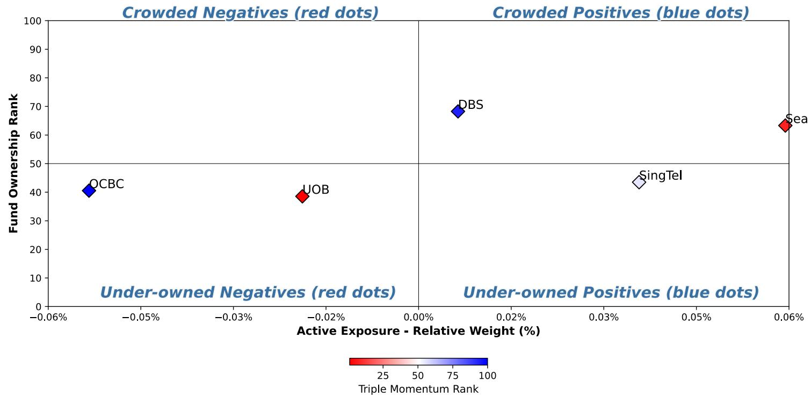

scatter

| Institution | Active Exposure - Relative Weight (%) | Triple Momentum Rank |
| --- | --- | --- |
| OCBC | -0.05 | 40 |
| UOB | -0.02 | 38 |
| DBS | 0.01 | 68 |
| SingTel | 0.04 | 43 |
| Sea | 0.06 | 63 |

Source : BofA Asia Pac Quantitative Strategy, MSCI, FTSE, FactSet, Bloomberg, 13F Filings, Benchmark Indices, Country Stock Exchanges

BofA GLOBAL RESEARCH

Chart 111: Sea-Rolling 12-months Long-Only Equity Flow (\$bn)
Last month, long-only funds bought shares worth \$0.1bn   
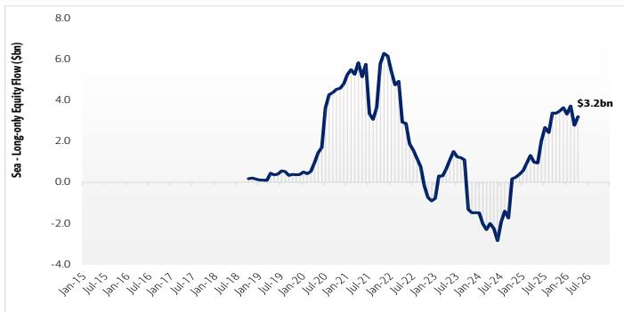

line

| Date    | Sea - Long-only Equity Flow ($bn) |
|---------|-----------------------------------|
| Jul-26  | $3.2bn                            |

Source : BofA Asia Pac Quantitative Strategy, MSCI, FTSE, FactSet, Bloomberg, 13F Filings, Benchmark Indices, Country Stock Exchanges   
BofA GLOBAL RESEARCH

Chart 113: DBS-Rolling 12-months Long-Only Equity Flow (\$bn)
In last 12-months, long-only funds sold shares worth -\$1.9bn   
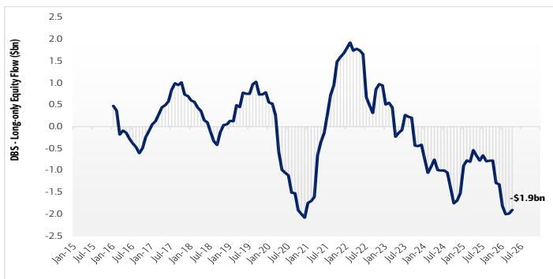

line

| Date    | DBS - Long-only Equity Flow ($bn) |
|---------|-----------------------------------|
| Jul-26  | -1.9                              |

Source : BofA Asia Pac Quantitative Strategy, MSCI, FTSE, FactSet, Bloomberg, 13F Filings, Benchmark Indices, Country Stock Exchanges   
BofA GLOBAL RESEARCH

Chart 115: OCBC-Rolling 12-months Long-Only Equity Flow (\$bn)
In last 12-months, long-only funds sold shares worth -\$0.6bn   
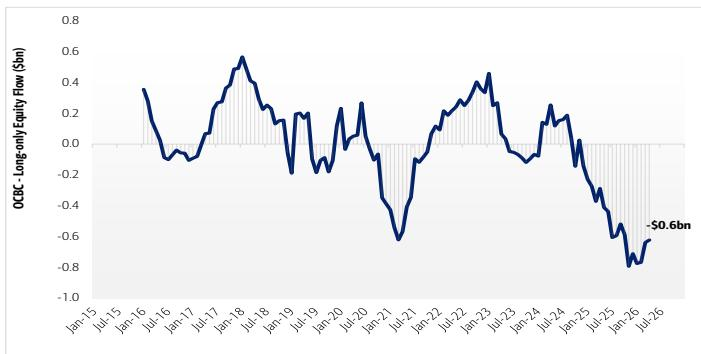

line

| Date    | OCBC - Long-only Equity Flow ($bn) |
|---------|------------------------------------|
| Jul-26  | -$0.6bn                            |

Source : BofA Asia Pac Quantitative Strategy, MSCI, FTSE, FactSet, Bloomberg, 13F Filings, Benchmark Indices, Country Stock Exchanges   
BofA GLOBAL RESEARCH

Chart 112: Sea-Ownership And Active Exposure
Active long-only funds ownership has decreased in the last 3m   
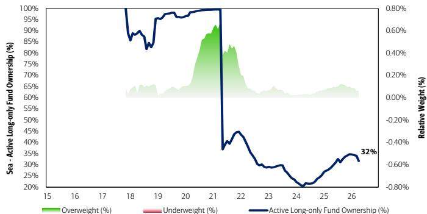

line

| Year | Overweight (%) | Underweight (%) | Active Long-only Fund Ownership (%) |
|------|----------------|-----------------|-------------------------------------|
| 26   | 32%            | -               | 32%                                 |

Source : BofA Asia Pac Quantitative Strategy, MSCI, FTSE, FactSet, Bloomberg, 13F Filings, Benchmark Indices, Country Stock Exchanges   
BofA GLOBAL RESEARCH

Chart 114: DBS-Ownership And Active Exposure
Funds have reduced exposure in last 3-mths   
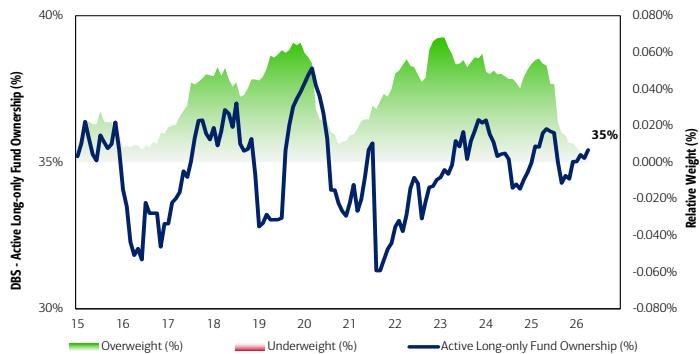

line

| Year | Overweight (%) | Underweight (%) | Active Long-only Fund Ownership (%) |
|------|----------------|-----------------|-------------------------------------|
| 26   | 35%            |                 |                                     |

Source : BofA Asia Pac Quantitative Strategy, MSCI, FTSE, FactSet, Bloomberg, 13F Filings, Benchmark Indices, Country Stock Exchanges   
BofA GLOBAL RESEARCH

Chart 116: OCBC-Ownership And Active Exposure
20% active long-only funds own this stock   
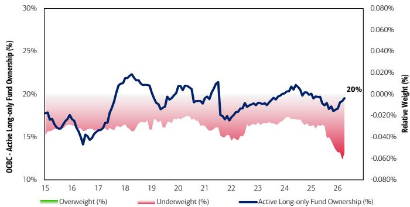

line

| Year | Active Long-only Fund Ownership (%) | Overweight (%) | Underweight (%) |
|------|-------------------------------------|----------------|----------------|
| 2026 | 20%                                 | -              | -              |

Source : BofA Asia Pac Quantitative Strategy, MSCI, FTSE, FactSet, Bloomberg, 13F Filings, Benchmark Indices, Country Stock Exchanges   
BofA GLOBAL RESEARCH

Chart 117: SingTel-Rolling 12-months Long-Only Equity Flow (\$bn)
Last month, long-only funds sold shares worth \$0.0bn   
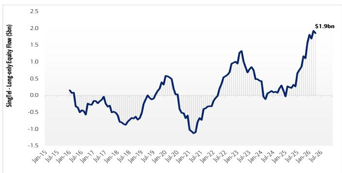

line

| Date    | Value     |
|---------|-----------|
| Jul-26  | $1.9bn    |

Source : BofA Asia Pac Quantitative Strategy, MSCI, FTSE, FactSet, Bloomberg, 13F Filings, Benchmark Indices, Country Stock Exchanges   
BofA GLOBAL RESEARCH

Chart 119: UOB-Rolling 12-months Long-Only Equity Flow (\$bn)
In the last 12m, funds had a cumulative outflow of -\$0.7bn   
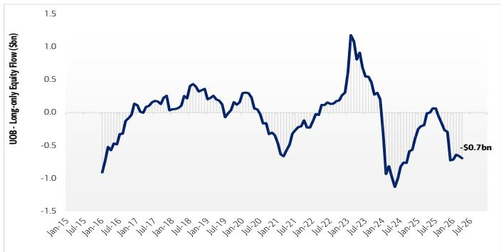

line

| Date    | Value     |
|---------|-----------|
| Jul-26  | -$0.7bn   |

Source : BofA Asia Pac Quantitative Strategy, MSCI, FTSE, FactSet, Bloomberg, 13F Filings, Benchmark Indices, Country Stock Exchanges   
BofA GLOBAL RESEARCH

Chart 118: SingTel-Ownership And Active Exposure Funds have increased exposure in last 3-months   
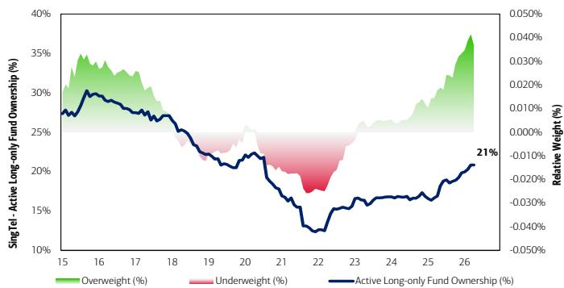

line

| Year | Overweight (%) | Underweight (%) | Active Long-only Fund Ownership (%) |
|------|----------------|-----------------|-------------------------------------|
| 2026 | 37%            | -               | 21%                                 |

Source : BofA Asia Pac Quantitative Strategy, MSCI, FTSE, FactSet, Bloomberg, 13F Filings, Benchmark Indices, Country Stock Exchanges   
BofA GLOBAL RESEARCH

Chart 120: UOB-Ownership And Active Exposure Funds are underweight this stock   
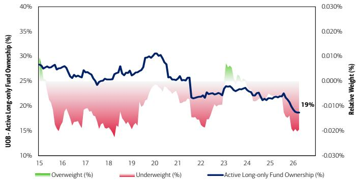

line

| Year | Active Long-only Fund Ownership (%) | Relative Weight (%) |
|------|-------------------------------------|---------------------|
| 2026 | 19%                                 | -0.030%             |

Source : BofA Asia Pac Quantitative Strategy, MSCI, FTSE, FactSet, Bloomberg, 13F Filings, Benchmark Indices, Country Stock Exchanges   
BofA GLOBAL RESEARCH

Table 18: Singapore Stock Positioning Characteristics: Top 50 by Market Capitalisation

Characteristics of the Singapore Top 50 stocks by market capitalization

<table><tr><td>Name</td><td>BBG Code</td><td>Sector</td><td>MCAP (Total $USm)</td><td>Avg Daily TO (6m $US m)</td><td>Relative Weight (%)</td><td>Relative Dollar ($USm)</td><td>Long-only Equity Flow ($USm)</td><td>Fund Ownership (%)</td><td>Triple Momentum Rank</td><td>Positioning Flag</td><td>Funds Count</td></tr><tr><td>Frencken Group L</td><td>FRKN SP</td><td>Industrials</td><td>901</td><td>7.4</td><td>0.015%</td><td>29</td><td>2</td><td>79%</td><td>90</td><td>Crowded Positives</td><td>28</td></tr><tr><td>CSE Global</td><td>CSE SP</td><td>Software</td><td>779</td><td>5.8</td><td>0.007%</td><td>24</td><td>0</td><td>77%</td><td>95</td><td>Crowded Positives</td><td>31</td></tr><tr><td>Sheng Siong Grou</td><td>SSG SP</td><td>Cons. Staples</td><td>3,577</td><td>5.8</td><td>0.003%</td><td>103</td><td>9</td><td>64%</td><td>79</td><td>-</td><td>61</td></tr><tr><td>UOL</td><td>UOL SP</td><td>Real Estate</td><td>7,061</td><td>13.6</td><td>0.003%</td><td>116</td><td>36</td><td>50%</td><td>58</td><td>-</td><td>165</td></tr><tr><td>Venture</td><td>VMS SP</td><td>Tech Hardware</td><td>3,678</td><td>9.1</td><td>0.005%</td><td>187</td><td>-10</td><td>40%</td><td>77</td><td>-</td><td>129</td></tr><tr><td>UMS</td><td>UMSH SP</td><td>Semiconductors</td><td>1,520</td><td>8.2</td><td>0.001%</td><td>34</td><td>-5</td><td>40%</td><td>92</td><td>Crowded Positives</td><td>45</td></tr><tr><td>Genting Singapore</td><td>GENS SP</td><td>Cons. Discretionary</td><td>6,457</td><td>26.0</td><td>-0.003%</td><td>-96</td><td>1</td><td>39%</td><td>4</td><td>Crowded Negatives</td><td>124</td></tr><tr><td>ComfortDelGro</td><td>CD SP</td><td>Industrials</td><td>2,519</td><td>10.3</td><td>0.002%</td><td>83</td><td>4</td><td>36%</td><td>6</td><td>-</td><td>120</td></tr><tr><td>City Devs</td><td>CIT SP</td><td>Real Estate</td><td>5,826</td><td>17.7</td><td>-0.001%</td><td>-41</td><td>37</td><td>35%</td><td>84</td><td>-</td><td>141</td></tr><tr><td>DBS</td><td>DBS SP</td><td>Banks</td><td>130,347</td><td>212.4</td><td>0.007%</td><td>543</td><td>79</td><td>35%</td><td>84</td><td>Crowded Positives</td><td>1,183</td></tr><tr><td>Keppel DC REIT</td><td>KDCREIT SP</td><td>Real Estate</td><td>4,511</td><td>18.4</td><td>0.001%</td><td>41</td><td>21</td><td>34%</td><td>77</td><td>-</td><td>116</td></tr><tr><td>K-Reit Asia</td><td>KREIT SP</td><td>Real Estate</td><td>3,482</td><td>10.9</td><td>-0.003%</td><td>-97</td><td>16</td><td>32%</td><td>41</td><td>-</td><td>117</td></tr><tr><td>SATS</td><td>SATS SP</td><td>Industrials</td><td>3,874</td><td>12.3</td><td>-0.002%</td><td>-60</td><td>9</td><td>32%</td><td>58</td><td>-</td><td>119</td></tr><tr><td>Sea</td><td>SE US</td><td>Cons. Discretionary</td><td>48,000</td><td>596.3</td><td>0.061%</td><td>5,155</td><td>101</td><td>32%</td><td>16</td><td>-</td><td>1,243</td></tr><tr><td>Lendlease Global</td><td>LREIT SP</td><td>Real Estate</td><td>1,483</td><td>6.2</td><td>0.000%</td><td>-4</td><td>5</td><td>31%</td><td>63</td><td>-</td><td>68</td></tr><tr><td>Mapletree Pan Asia Comm</td><td>MPACT SP</td><td>Real Estate</td><td>5,346</td><td>9.0</td><td>-0.004%</td><td>-146</td><td>8</td><td>21%</td><td>3</td><td>Under-Owned Negatives</td><td>126</td></tr><tr><td>SingTel</td><td>ST SP</td><td>Telecom</td><td>59,520</td><td>91.1</td><td>0.037%</td><td>3,028</td><td>-1</td><td>21%</td><td>54</td><td>-</td><td>1,171</td></tr><tr><td>Frasers Logistics</td><td>FLT SP</td><td>Real Estate</td><td>2,861</td><td>8.8</td><td>-0.003%</td><td>-85</td><td>1</td><td>20%</td><td>52</td><td>-</td><td>105</td></tr><tr><td>OCBC</td><td>OCBC SP</td><td>Banks</td><td>77,640</td><td>93.0</td><td>-0.055%</td><td>-4,425</td><td>95</td><td>20%</td><td>89</td><td>-</td><td>1,157</td></tr><tr><td>UOB</td><td>UOB SP</td><td>Banks</td><td>47,320</td><td>89.9</td><td>-0.019%</td><td>-1,556</td><td>-110</td><td>19%</td><td>11</td><td>Under-Owned Negatives</td><td>1,156</td></tr><tr><td>China Yuchai</td><td>CYD US</td><td>Industrials</td><td>1,546</td><td>5.4</td><td>0.000%</td><td>1</td><td>3</td><td>18%</td><td>76</td><td>-</td><td>34</td></tr><tr><td>Sing Exchange</td><td>SGX SP</td><td>Div Financials</td><td>18,260</td><td>40.6</td><td>-0.004%</td><td>-291</td><td>8</td><td>17%</td><td>59</td><td>-</td><td>1,168</td></tr><tr><td>Mapletree Logistics</td><td>MLT SP</td><td>Real Estate</td><td>4,888</td><td>13.0</td><td>-0.007%</td><td>-226</td><td>6</td><td>16%</td><td>71</td><td>-</td><td>124</td></tr><tr><td>Suntec REIT</td><td>SUN SP</td><td>Real Estate</td><td>3,446</td><td>11.6</td><td>-0.003%</td><td>-111</td><td>-4</td><td>16%</td><td>80</td><td>-</td><td>122</td></tr><tr><td>Grindr</td><td>GRND US</td><td>Media &amp; Ent.</td><td>2,475</td><td>18.4</td><td>-0.001%</td><td>-42</td><td>-1</td><td>14%</td><td>40</td><td>-</td><td>366</td></tr><tr><td>Sing Tech</td><td>STE SP</td><td>Industrials</td><td>26,283</td><td>40.2</td><td>-0.002%</td><td>-185</td><td>-17</td><td>14%</td><td>56</td><td>-</td><td>1,157</td></tr><tr><td>Yangzijiang Shipbuilding</td><td>YZJSGD SP</td><td>Industrials</td><td>13,449</td><td>51.9</td><td>0.000%</td><td>9</td><td>-35</td><td>14%</td><td>78</td><td>-</td><td>1,149</td></tr><tr><td>Keppel</td><td>KEP SP</td><td>Industrials</td><td>15,539</td><td>39.5</td><td>-0.014%</td><td>-1,130</td><td>-15</td><td>10%</td><td>57</td><td>-</td><td>1,149</td></tr><tr><td>BOC Aviation</td><td>2588 HK</td><td>Industrials</td><td>7,070</td><td>7.8</td><td>0.002%</td><td>120</td><td>7</td><td>10%</td><td>71</td><td>-</td><td>899</td></tr><tr><td>CapitaLand Ascendas</td><td>CLAR SP</td><td>Real Estate</td><td>9,757</td><td>34.5</td><td>-0.010%</td><td>-786</td><td>34</td><td>9%</td><td>64</td><td>-</td><td>1,170</td></tr><tr><td>Singapore Airlines</td><td>SIA SP</td><td>Industrials</td><td>15,591</td><td>34.4</td><td>-0.011%</td><td>-838</td><td>24</td><td>8%</td><td>9</td><td>Under-Owned Negatives</td><td>1,144</td></tr><tr><td>Wilmar Int&#x27;l</td><td>WIL SP</td><td>Cons. Staples</td><td>18,151</td><td>20.7</td><td>-0.006%</td><td>-494</td><td>2</td><td>8%</td><td>62</td><td>-</td><td>1,158</td></tr><tr><td>Capitaland Investment</td><td>CLI SP</td><td>Real Estate</td><td>11,358</td><td>24.6</td><td>-0.006%</td><td>-511</td><td>0</td><td>8%</td><td>65</td><td>-</td><td>1,160</td></tr><tr><td>Sembcorp Ind</td><td>SCI SP</td><td>Utilities</td><td>9,334</td><td>26.7</td><td>-0.001%</td><td>-119</td><td>-5</td><td>7%</td><td>12</td><td>Under-Owned Negatives</td><td>1,151</td></tr></table>

Source : BofA Asia Pac Quantitative Strategy, MSCI, FTSE, FactSet, Bloomberg, 13F Filings, Benchmark Indices, Country Stock Exchanges   
\* OW = Overweight, ^ UW = Underweight, # BM = Benchmark   
BofA GLOBAL RESEARCH

# Taiwan

Chart 121: Positioning and Triple Momentum Quadrants: Taiwan's Most Important Stocks   
In Taiwan, Crowded Positives include TSMC, Delta Electronics, and MediaTek   
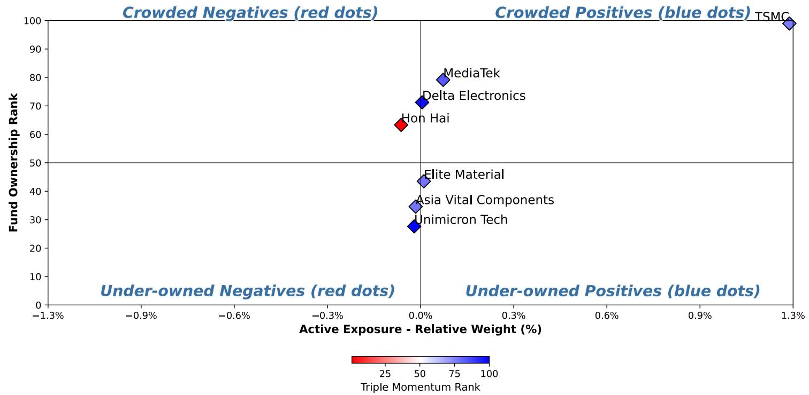

scatter

| Company             | Fund Ownership Rank | Active Exposure - Relative Weight (%) |
|---------------------|---------------------|--------------------------------------|
| TSMC                | 100                 | 1.3                                  |
| MediaTek            | 80                  | 0.2                                  |
| Delta Electronics   | 70                  | 0.1                                  |
| Hon Hai             | 65                  | -0.1                                 |
| Elite Material      | 45                  | 0.1                                  |
| Asia Vital Components | 35                  | 0.0                                  |
| Unimicron Tech      | 30                  | 0.0                                  |

Source : BofA Asia Pac Quantitative Strategy, MSCI, FTSE, FactSet, Bloomberg, 13F Filings, Benchmark Indices, Country Stock Exchanges

BofA GLOBAL RESEARCH

Chart 122: TSMC-Rolling 12-months Long-Only Equity Flow (\$bn)
Last month, long-only funds sold shares worth -\$8.6bn   
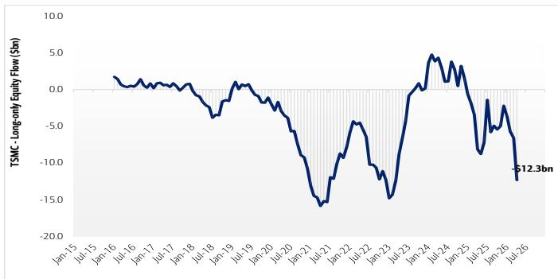

line

| Date    | TSMC - Long-only Equity Flow ($bn) |
|---------|------------------------------------|
| Jul-26  | -12.3bn                            |

Source : BofA Asia Pac Quantitative Strategy, MSCI, FTSE, FactSet, Bloomberg, 13F Filings, Benchmark Indices, Country Stock Exchanges   
BofA GLOBAL RESEARCH

Chart 124: Delta Electronics-Rolling 12-months Long-Only Equity Flow (\$bn)
In last 12-months, long-only funds sold shares worth -\$1.0bn   
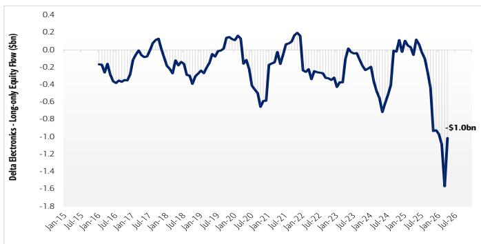

line

| Date    | Delta Electronics - Long-only Equity Flow ($bn) |
|---------|-----------------------------------------------|
| Jul-26  | -1.0                                          |

Source : BofA Asia Pac Quantitative Strategy, MSCI, FTSE, FactSet, Bloomberg, 13F Filings, Benchmark Indices, Country Stock Exchanges   
BofA GLOBAL RESEARCH

Chart 126: MediaTek-Rolling 12-months Long-Only Equity Flow (\$bn)
Last month, long-only funds sold shares worth -\$0.1bn   
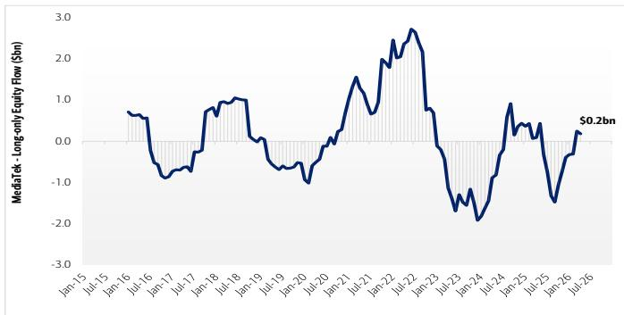

line

| Date    | MediaTek - Long-only Equity Flow ($bn) |
|---------|----------------------------------------|
| Jul-26  | $0.2bn                                 |

Source : BofA Asia Pac Quantitative Strategy, MSCI, FTSE, FactSet, Bloomberg, 13F Filings, Benchmark Indices, Country Stock Exchanges   
BofA GLOBAL RESEARCH

Chart 123: TSMC-Ownership And Active Exposure Funds have increased exposure in last 3-months   
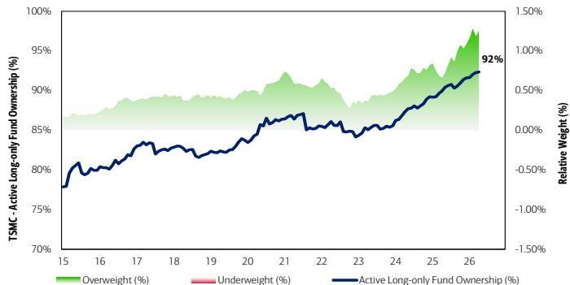

line

| Year | TSMC - Active Long-only Fund Ownership (%) | Overweight (%) | Underweight (%) | Active Long-only Fund Ownership (%) |
|------|------------------------------------------|----------------|-----------------|-------------------------------------|
| 2026 | 92%                                      | 1.50           | 0.50            | 0.75                                |

Source : BofA Asia Pac Quantitative Strategy, MSCI, FTSE, FactSet, Bloomberg, 13F Filings, Benchmark Indices, Country Stock Exchanges   
BofA GLOBAL RESEARCH

Chart 125: Delta Electronics-Ownership and Active Exposure
39% active long-only funds own this stock   
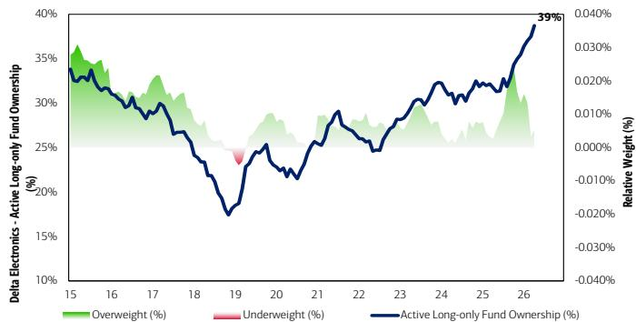

line

| Year | Active Long-only Fund Ownership (%) | Relative Weight (%) |
|------|-------------------------------------|---------------------|
| 15   | ~35%                                | ~0.030%             |
| 16   | ~34%                                | ~0.025%             |
| 17   | ~32%                                | ~0.020%             |
| 18   | ~28%                                | ~0.015%             |
| 19   | ~18%                                | ~-0.020%            |
| 20   | ~25%                                | ~-0.010%            |
| 21   | ~28%                                | ~0.005%             |
| 22   | ~26%                                | ~0.010%             |
| 23   | ~30%                                | ~0.015%             |
| 24   | ~32%                                | ~0.020%             |
| 25   | ~34%                                | ~0.025%             |
| 26   | 39%                                 | ~0.040%             |

Source : BofA Asia Pac Quantitative Strategy, MSCI, FTSE, FactSet, Bloomberg, 13F Filings, Benchmark Indices, Country Stock Exchanges   
BofA GLOBAL RESEARCH

Chart 127: MediaTek-Ownership And Active Exposure Funds are overweight this stock   
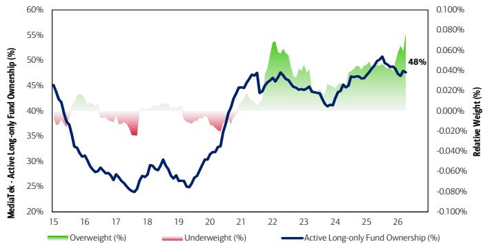

line

| Year | Overweight (%) | Underweight (%) | Active Long-only Fund Ownership (%) |
|------|----------------|-----------------|-------------------------------------|
| 2026 | 48             |                 |                                     |

Source : BofA Asia Pac Quantitative Strategy, MSCI, FTSE, FactSet, Bloomberg, 13F Filings, Benchmark Indices, Country Stock Exchanges   
BofA GLOBAL RESEARCH

Chart 128: Elite Material-Rolling 12-months Long-Only Equity Flow (\$bn)   
Last month, long-only funds bought shares worth \$0.1bn   
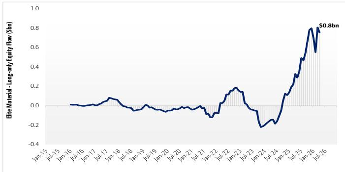

line

| Date    | Elite Material - Long-only Equity Flow ($bn) |
|---------|---------------------------------------------|
| Jul-26  | $0.8bn                                      |

Source : BofA Asia Pac Quantitative Strategy, MSCI, FTSE, FactSet, Bloomberg, 13F Filings, Benchmark Indices, Country Stock Exchanges   
BofA GLOBAL RESEARCH

Chart 130: Unimicron Tech-Rolling 12-months Long-Only Equity Flow (\$bn)   
In the last 12m, funds had a cumulative inflow of \$0.0bn   
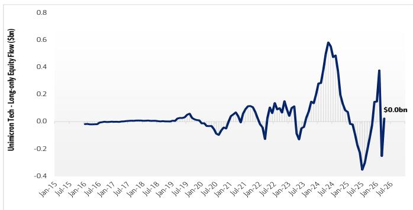

line

| Date    | Value (bn) |
|---------|------------|
| Jul-26  | $0.0       |

Source : BofA Asia Pac Quantitative Strategy, MSCI, FTSE, FactSet, Bloomberg, 13F Filings, Benchmark Indices, Country Stock Exchanges   
BofA GLOBAL RESEARCH

Chart 132: Asia Vital Components-Rolling 12-months Long-Only Equity Flow (\$bn)   
In last 12-months, long-only funds bought shares worth \$0.6bn   
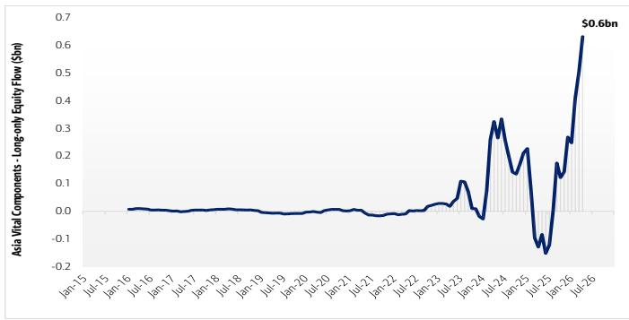

line

| Date     | Asia Vital Components - Long-only Equity Flow ($bn) |
| -------- | -------------------------------------------------- |
| Jul-26   | $0.6bn                                             |

Source : BofA Asia Pac Quantitative Strategy, MSCI, FTSE, FactSet, Bloomberg, 13F Filings, Benchmark Indices, Country Stock Exchanges   
BofA GLOBAL RESEARCH

Chart 129: Elite Material-Ownership and Active Exposure Funds are overweight this stock   
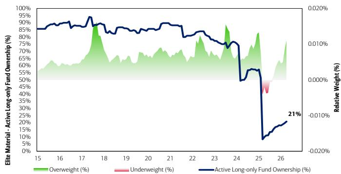

line

| Year | Overweight (%) | Underweight (%) | Active Long-only Fund Ownership (%) |
|------|----------------|-----------------|-------------------------------------|
| 2026 | 21%            | -               | 21%                                 |

Source : BofA Asia Pac Quantitative Strategy, MSCI, FTSE, FactSet, Bloomberg, 13F Filings, Benchmark Indices, Country Stock Exchanges   
BofA GLOBAL RESEARCH

Chart 131: Unimicron Tech-Ownership and Active Exposure
15% active long-only funds own this stock   
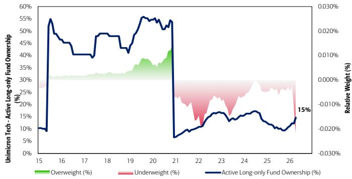

line

| Year | Active Long-only Fund Ownership (%) | Overweight (%) | Underweight (%) | Relative Weight (%) |
|------|-------------------------------------|----------------|-----------------|---------------------|
| 15   | 55%                                 | 30%            | -               | -0.030%             |
| 16   | 45%                                 | 30%            | -               | -0.020%             |
| 17   | 40%                                 | 30%            | -               | -0.010%             |
| 18   | 45%                                 | 30%            | -               | 0.000%              |
| 19   | 50%                                 | 35%            | -               | 0.010%              |
| 20   | 55%                                 | 40%            | -               | 0.020%              |
| 21   | 50%                                 | 45%            | -               | 0.030%              |
| 22   | 15%                                 | 30%            | -               | -0.030%             |
| 23   | -                                   | 30%            | -               | -0.020%             |
| 24   | -                                   | 30%            | -               | -0.010%             |
| 25   | -                                   | 30%            | -               | 0.000%              |
| 26   | -                                   | 30%            | -               | 0.010%              |
| 27   | -                                   | 30%            | -               | 0.020%              |
| 28   | -                                   | 30%            | -               | 0.030%              |
| 29   | -                                   | 30%            | -               | 0.020%              |
| 30   | -                                   | 30%            | -               | 0.010%              |
| 31   | -                                   | 30%            | -               | 0.000%              |
| 32   | -                                   | 30%            | -               | -0.010%             |
| 33   | -                                   | 30%            | -               | -0.020%             |
| 34   | -                                   | 30%            | -               | -0.030%             |
| 35   | -                                   | 30%            | -               | -0.020%             |
| 36   | -                                   | 30%            | -               | -0.010%             |
| 37   | -                                   | 30%            | -               | 0.000%              |
| 38   | -                                   | 30%            | -               | 0.010%              |
| 39   | -                                   | 30%            | -               | 0.020%              |
| 40   | -                                   | 30%            | -               | 0.030%              |
| 41   | -                                   | 30%            | -               | 0.020%              |
| 42   | -                                   | 30%            | -               | 0.010%              |
| 43   | -                                   | 30%            | -               | 0.000%              |
| 44   | -                                   | 30%            | -               | -0.010%             |
| 45   | -                                   | 30%            | -               | -0.020%             |
| 46   | -                                   | 30%            | -               | -0.030%             |
| 47   | -                                   | 30%            | -               | -0.020%             |
| 48   | -                                   | 30%            | -               | -0.010%             |
| 49   | -                                   | 30%            | -               | 0.000%              |
| 50   | -                                   | 30%            | -               | 0.010%              |
| 51   | -                                   | 30%            | -               | 0.020%              |
| 52   | -                                   | 30%            | -               | 0.030%              |
| 53   | -                                   | 30%            | -               | 0.020%              |
| 54   | -                                   | 30%            | -               | 0.010%              |
| 55   | -                                   | 30%            | -               | 0.000%              |
| 56   | -                                   | 30%            | -               | -0.010%             |
| 57   | -                                   | 30%            | -               | -0.020%             |
| 58   | -                                   | 30%            | -               | -0.030%             |
| 59   | -                                   | 30%            | -               | -0.020%             |
| 60   | -                                   | 30%            | -               | -0.010%             |
| 61   | -                                   | 30%            | -               | 0.000%              |
| 62   | -                                   | 30%            | -               | 0.010%              |
| 63   | -                                   | 30%            | -               | 0.020%              |
| 64   | -                                   | 30%            | -               | 0.030%              |
| 65   | -                                   | 30%            | -               | 0.020%              |
| 66   | -                                   | 30%            | -               | 0.010%              |
| 67   | -                                   | 30%            | -               | 0.000%              |
| 68   | -                                   | 30%            | -               | -                   |
| 69   | -                                   | 30%            | -               | -                   |
| 70   | -                                   | 30%            | -               | -                   |
| 71   | -                                   | 30%            | -               | -                   |
| 72   | -                                   | 30%            | -               | -                   |
| 73   | -                                   | 30%            | -               | -                   |
| 74   | -                                   | 30%            | -               | -                   |
| 75   | -                                   | 30%            | -               | -                   |
| 76   | -                                   | 30%            | -               | -                   |
| 77   | -                                   | 30%            | -               | -                   |
| 78   | -                                   | 30%            | -               | -                   |
| 79   | -                                   | 30%            | -               | -                   |
| 80   | -                                   | 30%            | -               | -                   |
| 81   | -                                   | 30%            | -               | -                   |
| 82   | -                                   | 30%            | -               | -                   |
| 83   | -                                   | 30%            | -               | -                   |
| 84   | -                                   | 30%            | -               | -                   |
| 85   | -                                   | 30%            | -               | -                   |
| 86   | -                                   | 30%            | -               | -                   |
| 87   | -                                   | 30%            | -               | -                   |
| 88   | -                                   | 30%            | -               | -                   |
| 89   | -                                   | 30%            | -               | -                   |
| 90   | -                                   | 30%            | -               | -                   |
| 91   | -                                   | 30%            | -               | -                   |
| 92   | -                                   | 30%            | -               | -                   |
| 93   | -                                   | 30%            | -               | -                   |
| 94   | -                                   | 30%            | -               | -                   |
| 95   | -                                   | 30%            | -               | -                   |
| 96   | -                                   | 30%            | -               | -                   |
| 97   | -                                   | 30%            | -               | -                   |
| 98   | -                                   | 30%            | -               | -                   |
| 99   | -                                   | 30%            | -               | -                   |
| 1Q    | ~15%                                | ~15%           | ~15%            | ~-                    |
| Q1     | ~15%                                | ~15%           | ~15%            | ~-                    |
| Q2     | ~15%                                | ~15%           | ~15%            | ~-                    |
| Q3     | ~15%                                | ~15%           | ~15%            | ~-                    |
| Q4     | ~15%                                | ~15%           | ~15%            | ~-                    |
| Q1     (Overweight) %: ~15%; Underweight %: ~15%; Active Long-only Fund Ownership %: ~15%; Relative Weight %: ~15%; Relative Weight %: ~15%; Relative Weight %: ~15%; Relative Weight %: ~15%; Relative Weight %: ~15%; Relative Weight %: ~15%; Relative Weight %: ~15%; Relative Weight %: ~15%; Relative Weight %: ~15%; Relative Weight %: ~15%; Relative Weight %: ~15%; Relative Weight %: ~15%; Relative Weight %: ~-                  |
| End    (Overweight) %: ~15%; Underweight %: ~15%; Active Long-only Fund Ownership %: ~15%; Relative Weight %: ~15%; Relative Weight %: ~15%; Relative Weight %: ~15%; Relative Weight %: ~15%; Relative Weight %: ~-                  )

Source : BofA Asia Pac Quantitative Strategy, MSCI, FTSE, FactSet, Bloomberg, 13F Filings, Benchmark Indices, Country Stock Exchanges   
BofA GLOBAL RESEARCH

Chart 133: Asia Vital Components-Ownership and Active Exposure
Active long-only funds ownership has increased in the last 3m   
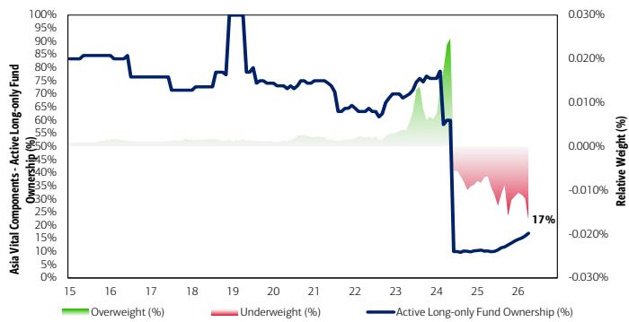

line

| Year | Ownership (%) | Relative Weight (%) |
|------|---------------|---------------------|
| 2026 | 17            | -0.030%             |

Source : BofA Asia Pac Quantitative Strategy, MSCI, FTSE, FactSet, Bloomberg, 13F Filings, Benchmark Indices, Country Stock Exchanges   
BofA GLOBAL RESEARCH

Table 19: Taiwan Stock Positioning Characteristics: Top 50 by Market Capitalisation

Characteristics of the Taiwan Top 50 stocks by market capitalization

<table><tr><td>Name</td><td>BBG Code</td><td>Sector</td><td>MCAP (Total $USm)</td><td>Avg Daily TO (6m $US m)</td><td>Relative Weight (%)</td><td>Relative Dollar ($USm)</td><td>Long-only Equity Flow ($USm)</td><td>Fund Ownership p (%)</td><td>Triple Momentum Rank</td><td>Positioning Flag</td><td>Funds Count</td></tr><tr><td>TSMC</td><td>2330 TT</td><td>Semiconductors</td><td>1,747,414</td><td>2,189.7</td><td>1.251%</td><td>157,974</td><td>-8,616</td><td>92%</td><td>85</td><td>Crowded Positives</td><td>1,570</td></tr><tr><td>Winway Tech</td><td>6515 TT</td><td>Semiconductors</td><td>11,813</td><td>93.0</td><td>0.024%</td><td>749</td><td>144</td><td>53%</td><td>91</td><td>Crowded Positives</td><td>51</td></tr><tr><td>MediaTek</td><td>2454 TT</td><td>Semiconductors</td><td>132,122</td><td>547.0</td><td>0.077%</td><td>5,461</td><td>-129</td><td>48%</td><td>88</td><td>Crowded Positives</td><td>917</td></tr><tr><td>Winbond</td><td>2344 TT</td><td>Semiconductors</td><td>12,754</td><td>574.4</td><td>0.000%</td><td>-13</td><td>39</td><td>47%</td><td>100</td><td>-</td><td>111</td></tr><tr><td>Formosa Petro</td><td>6505 TT</td><td>Energy</td><td>16,957</td><td>27.1</td><td>0.000%</td><td>-12</td><td>6</td><td>45%</td><td>93</td><td>-</td><td>69</td></tr><tr><td>Nanya Tech</td><td>2408 TT</td><td>Semiconductors</td><td>23,466</td><td>736.6</td><td>-0.004%</td><td>-147</td><td>0</td><td>44%</td><td>87</td><td>-</td><td>110</td></tr><tr><td>Phison Elec</td><td>8299 TT</td><td>Semiconductors</td><td>12,471</td><td>412.2</td><td>-0.003%</td><td>-100</td><td>-22</td><td>43%</td><td>87</td><td>-</td><td>112</td></tr><tr><td>Delta Electronics</td><td>2308 TT</td><td>Tech Hardware</td><td>177,490</td><td>502.8</td><td>0.005%</td><td>363</td><td>496</td><td>39%</td><td>96</td><td>Crowded Positives</td><td>914</td></tr><tr><td>Nan Ya Printed</td><td>8046 TT</td><td>Tech Hardware</td><td>20,496</td><td>225.9</td><td>-0.001%</td><td>-47</td><td>61</td><td>35%</td><td>87</td><td>-</td><td>102</td></tr><tr><td>Hon Hai</td><td>2317 TT</td><td>Tech Hardware</td><td>96,740</td><td>447.0</td><td>-0.066%</td><td>-4,340</td><td>11</td><td>32%</td><td>44</td><td>-</td><td>889</td></tr><tr><td>Accton Tech</td><td>2345 TT</td><td>Tech Hardware</td><td>40,378</td><td>232.5</td><td>0.016%</td><td>1,034</td><td>-247</td><td>28%</td><td>95</td><td>Crowded Positives</td><td>889</td></tr><tr><td>Elite Material</td><td>2383 TT</td><td>Tech Hardware</td><td>51,400</td><td>267.0</td><td>0.011%</td><td>725</td><td>70</td><td>21%</td><td>85</td><td>Under-Owned Positives</td><td>882</td></tr><tr><td>Chroma Ate</td><td>2360 TT</td><td>Tech Hardware</td><td>28,454</td><td>154.9</td><td>0.029%</td><td>1,955</td><td>194</td><td>21%</td><td>85</td><td>Under-Owned Positives</td><td>900</td></tr><tr><td>Wiwynn</td><td>6669 TT</td><td>Tech Hardware</td><td>27,421</td><td>252.2</td><td>0.005%</td><td>327</td><td>-409</td><td>19%</td><td>94</td><td>Under-Owned Positives</td><td>874</td></tr><tr><td>CTBC Financial</td><td>2891 TT</td><td>Banks</td><td>32,481</td><td>64.5</td><td>-0.024%</td><td>-1,524</td><td>47</td><td>18%</td><td>92</td><td>-</td><td>865</td></tr><tr><td>Asia Vitalmponents</td><td>3017 TT</td><td>Tech Hardware</td><td>34,959</td><td>315.0</td><td>-0.017%</td><td>-1,087</td><td>151</td><td>17%</td><td>87</td><td>-</td><td>882</td></tr><tr><td>Quanta</td><td>2382 TT</td><td>Tech Hardware</td><td>38,097</td><td>171.5</td><td>-0.025%</td><td>-1,615</td><td>51</td><td>17%</td><td>78</td><td>-</td><td>871</td></tr><tr><td>Unimicron Tech</td><td>3037 TT</td><td>Tech Hardware</td><td>43,589</td><td>392.9</td><td>-0.022%</td><td>-1,388</td><td>249</td><td>15%</td><td>99</td><td>-</td><td>874</td></tr><tr><td>Asustek</td><td>2357 TT</td><td>Tech Hardware</td><td>13,620</td><td>84.1</td><td>-0.014%</td><td>-914</td><td>-62</td><td>15%</td><td>59</td><td>-</td><td>879</td></tr><tr><td>United Microelectronics</td><td>2303 TT</td><td>Semiconductors</td><td>30,711</td><td>254.2</td><td>-0.039%</td><td>-2,566</td><td>61</td><td>14%</td><td>97</td><td>-</td><td>872</td></tr><tr><td>BizLink</td><td>3665 TT</td><td>Industrials</td><td>17,045</td><td>202.9</td><td>0.004%</td><td>253</td><td>282</td><td>14%</td><td>77</td><td>-</td><td>864</td></tr><tr><td>Uni-President</td><td>1216 TT</td><td>Cons. Staples</td><td>12,428</td><td>26.7</td><td>-0.004%</td><td>-225</td><td>5</td><td>14%</td><td>8</td><td>Under-Owned Negatives</td><td>852</td></tr><tr><td>Lite-On Tech</td><td>2301 TT</td><td>Tech Hardware</td><td>12,138</td><td>115.7</td><td>-0.007%</td><td>-437</td><td>187</td><td>14%</td><td>66</td><td>-</td><td>875</td></tr><tr><td>E.Sun Financial</td><td>2884 TT</td><td>Banks</td><td>16,258</td><td>44.0</td><td>-0.019%</td><td>-1,235</td><td>-3</td><td>13%</td><td>48</td><td>-</td><td>858</td></tr><tr><td>Jentech Precision Ind</td><td>3653 TT</td><td>Semiconductors</td><td>24,599</td><td>176.6</td><td>0.005%</td><td>352</td><td>-107</td><td>13%</td><td>91</td><td>Under-Owned Positives</td><td>886</td></tr><tr><td>Advantech</td><td>2395 TT</td><td>Tech Hardware</td><td>9,817</td><td>28.1</td><td>0.002%</td><td>119</td><td>7</td><td>13%</td><td>71</td><td>-</td><td>874</td></tr><tr><td>Cathay Financial</td><td>2882 TT</td><td>Insurance</td><td>35,742</td><td>63.7</td><td>-0.035%</td><td>-2,246</td><td>18</td><td>13%</td><td>87</td><td>-</td><td>857</td></tr><tr><td>Fubon Financial</td><td>2881 TT</td><td>Insurance</td><td>39,788</td><td>68.6</td><td>-0.035%</td><td>-2,209</td><td>27</td><td>13%</td><td>58</td><td>-</td><td>855</td></tr><tr><td>Alchip Tech</td><td>3661 TT</td><td>Semiconductors</td><td>10,608</td><td>236.8</td><td>-0.007%</td><td>-436</td><td>-38</td><td>12%</td><td>48</td><td>-</td><td>873</td></tr><tr><td>Yuanta Financial</td><td>2885 TT</td><td>Div Financials</td><td>21,963</td><td>35.8</td><td>-0.023%</td><td>-1,473</td><td>24</td><td>12%</td><td>83</td><td>-</td><td>853</td></tr><tr><td>Gold Circuit Electronics</td><td>2368 TT</td><td>Tech Hardware</td><td>22,160</td><td>242.2</td><td>-0.003%</td><td>-182</td><td>-35</td><td>12%</td><td>86</td><td>-</td><td>869</td></tr><tr><td>Evergreen Marine</td><td>2603 TT</td><td>Industrials</td><td>13,803</td><td>76.9</td><td>-0.007%</td><td>-430</td><td>17</td><td>11%</td><td>30</td><td>-</td><td>855</td></tr><tr><td>Largan Precision</td><td>3008 TT</td><td>Tech Hardware</td><td>10,594</td><td>76.3</td><td>-0.003%</td><td>-224</td><td>22</td><td>11%</td><td>38</td><td>-</td><td>869</td></tr><tr><td>King Slide</td><td>2059 TT</td><td>Tech Hardware</td><td>11,760</td><td>99.7</td><td>-0.004%</td><td>-247</td><td>19</td><td>11%</td><td>85</td><td>-</td><td>873</td></tr><tr><td>King Yuan</td><td>2449 TT</td><td>Semiconductors</td><td>11,674</td><td>212.5</td><td>-0.010%</td><td>-642</td><td>-98</td><td>11%</td><td>73</td><td>-</td><td>876</td></tr><tr><td>Wistron</td><td>3231 TT</td><td>Tech Hardware</td><td>13,752</td><td>185.3</td><td>-0.018%</td><td>-1,144</td><td>15</td><td>11%</td><td>80</td><td>-</td><td>874</td></tr><tr><td>Chunghwa Telecom</td><td>2412 TT</td><td>Telecom</td><td>33,297</td><td>38.5</td><td>-0.025%</td><td>-1,570</td><td>28</td><td>10%</td><td>71</td><td>-</td><td>853</td></tr><tr><td>Far EasTone</td><td>4904 TT</td><td>Telecom</td><td>10,758</td><td>17.6</td><td>-0.006%</td><td>-376</td><td>7</td><td>10%</td><td>62</td><td>-</td><td>852</td></tr><tr><td>SinoPac Financial</td><td>2890 TT</td><td>Banks</td><td>14,156</td><td>23.8</td><td>-0.017%</td><td>-1,085</td><td>36</td><td>10%</td><td>88</td><td>-</td><td>863</td></tr><tr><td>KGI Financial</td><td>2883 TT</td><td>Insurance</td><td>11,519</td><td>27.1</td><td>-0.017%</td><td>-1,090</td><td>19</td><td>9%</td><td>64</td><td>-</td><td>859</td></tr><tr><td>Taishin Financial</td><td>2887 TT</td><td>Banks</td><td>18,679</td><td>68.9</td><td>-0.028%</td><td>-1,788</td><td>39</td><td>9%</td><td>85</td><td>-</td><td>853</td></tr><tr><td>First Financial</td><td>2892 TT</td><td>Banks</td><td>13,093</td><td>23.9</td><td>-0.016%</td><td>-1,042</td><td>5</td><td>9%</td><td>49</td><td>-</td><td>855</td></tr><tr><td>Global Unichip</td><td>3443 TT</td><td>Semiconductors</td><td>18,018</td><td>235.6</td><td>-0.002%</td><td>-157</td><td>-10</td><td>9%</td><td>97</td><td>-</td><td>871</td></tr><tr><td>Taiwan Mobile</td><td>3045 TT</td><td>Telecom</td><td>13,102</td><td>32.3</td><td>-0.008%</td><td>-529</td><td>4</td><td>8%</td><td>63</td><td>-</td><td>851</td></tr><tr><td>Nan Ya Plastics</td><td>1303 TT</td><td>Materials</td><td>22,427</td><td>258.1</td><td>-0.024%</td><td>-1,511</td><td>11</td><td>8%</td><td>99</td><td>-</td><td>854</td></tr><tr><td>Hua Nan Financial</td><td>2880 TT</td><td>Banks</td><td>14,078</td><td>17.3</td><td>-0.015%</td><td>-984</td><td>2</td><td>8%</td><td>68</td><td>-</td><td>855</td></tr><tr><td>Mega Financial</td><td>2886 TT</td><td>Banks</td><td>18,305</td><td>26.4</td><td>-0.025%</td><td>-1,574</td><td>5</td><td>8%</td><td>30</td><td>-</td><td>856</td></tr><tr><td>FCFC</td><td>1326 TT</td><td>Materials</td><td>9,675</td><td>50.2</td><td>-0.011%</td><td>-690</td><td>-8</td><td>6%</td><td>62</td><td>-</td><td>852</td></tr><tr><td>Formosa Plastics</td><td>1301 TT</td><td>Materials</td><td>10,347</td><td>52.8</td><td>-0.010%</td><td>-644</td><td>5</td><td>5%</td><td>53</td><td>-</td><td>851</td></tr><tr><td>Hon Precision</td><td>7769 TT</td><td>Semiconductors</td><td>28,082</td><td>147.7</td><td>-0.015%</td><td>-940</td><td>52</td><td>5%</td><td>94</td><td>-</td><td>823</td></tr></table>

Source : BofA Asia Pac Quantitative Strategy, MSCI, FTSE, FactSet, Bloomberg, 13F Filings, Benchmark Indices, Country Stock Exchanges   
\* OW = Overweight, ^ UW = Underweight, # BM = Benchmark

BofA GLOBAL RESEARCH

# Performance Overview

# Positioning and Triple Momentum Performance

# Chart 134: Asia Pac ex-Japan Stock Positioning and Triple Momentum: Relative Cumulative Performance

CROWDED Positive stocks have outperformed the Under-owned Negatives, on average

line

| Year | Crowded Positives | Under-owned Positives | Crowded Negatives | Under-owned Negatives |
|------|-------------------|------------------------|-------------------|------------------------|
| 15   | 100               | 100                    | 100               | 100                    |
| 16   | 100               | 100                    | 100               | 100                    |
| 17   | 100               | 100                    | 100               | 100                    |
| 18   | 102               | 102                    | 99                | 99                     |
| 19   | 104               | 104                    | 98                | 98                     |
| 20   | 106               | 106                    | 96                | 96                     |
| 21   | 108               | 108                    | 94                | 94                     |
| 22   | 110               | 110                    | 92                | 92                     |
| 23   | 112               | 112                    | 90                | 90                     |
| 24   | 114               | 114                    | 88                | 88                     |
| 25   | 116               | 116                    | 86                | 86                     |
| 26   | 118               | 118                    | 84                | 84                     |

Source : BofA Asia Pac Quantitative Strategy, MSCI, FTSE, FactSet, Bloomberg, 13F Filings, Benchmark Indices, Country Stock Exchanges Performance is shown relative to the average performance of stocks in the analysis with Fund Ownership, Relative Weight, and Triple Momentum Ranks, where data exists.   
The shaded area shows back-tested results during the period from Jan-15 to Apr-25. The unshaded portion represents actual performance since May-25.   
Back-tested performance depicts the theoretical (not actual) performance of a particular strategy over the time period indicated. No representation is being made that any actual portfolio is likely to have achieved returns similar to those shown herein.   
BofA GLOBAL RESEARCH

# Chart 135: Asia Pac ex-Japan Stock Positioning and Triple Momentum relative cumulative performance: Last 12-months

CROWDED Positive stocks have outperformed the Under-owned Negatives in the last 12m

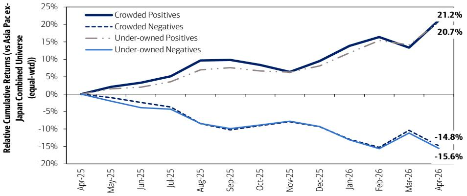

line

| Date   | Crowded Positives | Crowded Negatives | Under-owned Positives | Under-owned Negatives |
|--------|-------------------|-------------------|----------------------|-----------------------|
| Apr-26 | 21.2%             | -14.8%            | 20.7%                | -15.6%                |

Source : BofA Asia Pac Quantitative Strategy, MSCI, FTSE, FactSet, Bloomberg, 13F Filings, Benchmark Indices, Country Stock Exchanges Performance is shown relative to the average performance of stocks in the analysis with Fund Ownership, Relative Weight, and Triple Momentum Ranks, where data exists.   
BofA GLOBAL RESEARCH

# Chart 136: Asia Pac ex-Japan Fund Ownership (top and bottom quintile): Relative Cumulative Performance

High Fund Ownership stocks tend to outperform Low Fund Ownership stocks

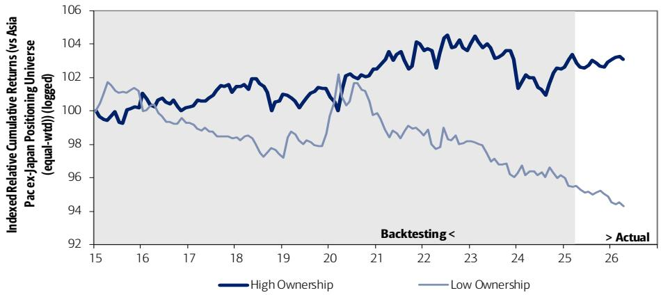

line

| Year | High Ownership | Low Ownership |
|------|-----------------|---------------|
| 15   | 100.0           | 101.5         |
| 16   | 100.5           | 100.8         |
| 17   | 100.8           | 100.2         |
| 18   | 101.2           | 99.5          |
| 19   | 101.5           | 98.0          |
| 20   | 101.8           | 97.5          |
| 21   | 102.5           | 98.5          |
| 22   | 103.5           | 97.0          |
| 23   | 104.0           | 96.5          |
| 24   | 103.0           | 96.0          |
| 25   | 103.5           | 95.5          |
| 26   | 103.8           | 94.5          |

Source : BofA Asia Pac Quantitative Strategy, MSCI, FTSE, FactSet, Bloomberg, 13F Filings, Benchmark Indices, Country Stock Exchanges Performance is shown relative to the average performance of stocks in the analysis with Fund Ownership and Relative Weight, where data exists.   
The shaded area shows back-tested results during the period from Jan-15 to Apr-25. The unshaded portion represents actual performance since May-25.   
Back-tested performance depicts the theoretical (not actual) performance of a particular strategy over the time period indicated. No representation is being made that any actual portfolio is likely to have achieved returns similar to those shown herein.   
BofA GLOBAL RESEARCH

# Chart 137: Asia Pac ex-Japan Relative Weight (top vs bottom quintile): Relative Cumulative Performance

High Relative Weight stocks have outperformed Low Relative Weight stocks

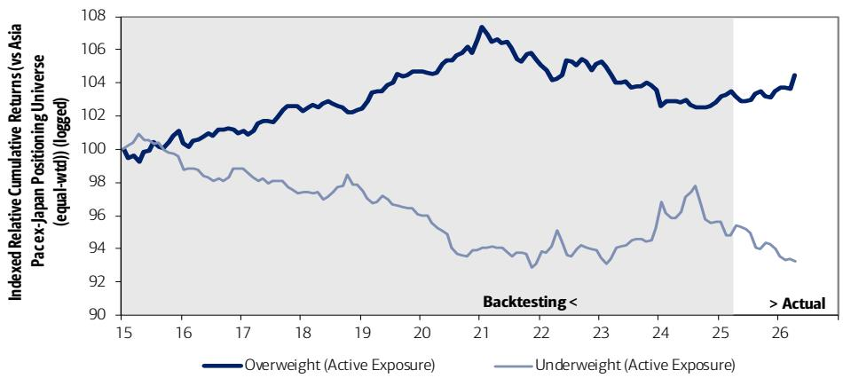

line

| Year | Overweight (Active Exposure) | Underweight (Active Exposure) |
|------|------------------------------|------------------------------|
| 15   | 100                          | 100                          |
| 16   | 101                          | 99                           |
| 17   | 102                          | 98                           |
| 18   | 103                          | 97                           |
| 19   | 104                          | 96                           |
| 20   | 105                          | 95                           |
| 21   | 107                          | 94                           |
| 22   | 106                          | 93                           |
| 23   | 105                          | 94                           |
| 24   | 104                          | 95                           |
| 25   | 103                          | 96                           |
| 26   | 104                          | 93                           |

Source : BofA Asia Pac Quantitative Strategy, MSCI, FTSE, FactSet, Bloomberg, 13F Filings, Benchmark Indices, Country Stock Exchanges Performance is shown relative to the average performance of stocks in the analysis with Fund Ownership and Relative Weight, where data exists.   
The shaded area shows back-tested results during the period from Jan-15 to Apr-25. The unshaded portion represents actual performance since May-25.   
Back-tested performance depicts the theoretical (not actual) performance of a particular strategy over the time period indicated. No representation is being made that any actual portfolio is likely to have achieved returns similar to those shown herein.   
BofA GLOBAL RESEARCH

# Chart 138: Asia Pac ex-Japan Triple Momentum (top vs bottom quintile): Relative Cumulative Performance

Stocks with Positive Triple Momentum have historically outperformed the stocks with Negative Triple Momentum

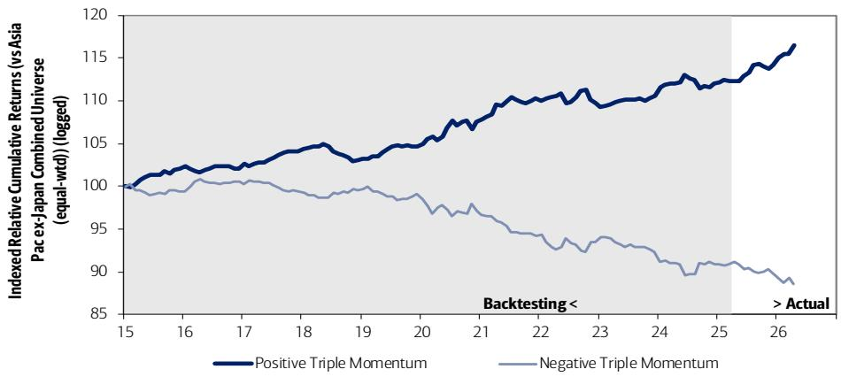

line

| Year | Positive Triple Momentum | Negative Triple Momentum |
|------|---------------------------|---------------------------|
| 15   | 100                       | 100                       |
| 16   | ~101                      | ~100                      |
| 17   | ~102                      | ~100                      |
| 18   | ~103                      | ~99                       |
| 19   | ~104                      | ~99                       |
| 20   | ~105                      | ~98                       |
| 21   | ~107                      | ~96                       |
| 22   | ~109                      | ~94                       |
| 23   | ~110                      | ~93                       |
| 24   | ~111                      | ~91                       |
| 25   | ~113                      | ~90                       |
| 26   | ~116                      | ~89                       |

Source : BofA Asia Pac Quantitative Strategy, MSCI, FTSE, FactSet, Bloomberg, 13F Filings, Benchmark Indices, Country Stock Exchanges Performance is shown relative to the average performance of stocks in the analysis with Fund Ownership, Relative Weight, and Triple Momentum Ranks, where data exists.   
The shaded area shows back-tested results during the period from Jan-15 to Apr-25. The unshaded portion represents actual performance since May-25.   
Back-tested performance depicts the theoretical (not actual) performance of a particular strategy over the time period indicated. No representation is being made that any actual portfolio is likely to have achieved returns similar to those shown herein.   
BofA GLOBAL RESEARCH

The four charts below show the performance of each combination of 1) Proportion of Funds 2) Underweight/Overweight and 3) Triple Momentum.

Among stocks in the top-left quadrant (High Fund Ownership and Underweight), stocks with low Triple Momentum (“Crowded Negatives”) generally underperform.

Among stocks in the top-right quadrant (High Fund Ownership and Overweight), stocks with High Triple Momentum (“Crowded Positives”) generally outperform.

Among stocks in the bottom-left quadrant (Low Fund Ownership and Underweight), stocks with low Triple Momentum (“Under-owned Negatives”) generally underperform.

Among stocks in the bottom-left quadrant (Low Fund Ownership and Overweight), stocks with high Triple Momentum (“Under-owned Positives”) generally outperform.

# Chart 139: Asia Pac ex-Japan HIGH Fund Ownership, UNDERWEIGHT, and Triple Momentum (Crowded Negatives): Relative Cumulative Performance

Stocks with low Triple Momentum (“Crowded Negatives”) have historically underperformed APxJ Combined Universe

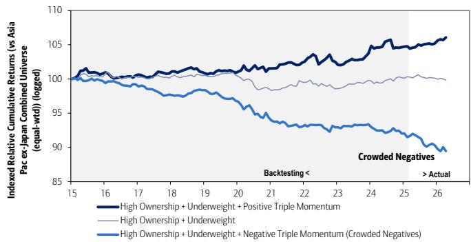

line

| Backtesting | High Ownership + Underweight + Positive Triple Momentum | High Ownership + Underweight | High Ownership + Underweight + Negative Triple Momentum (Crowded Negatives) |
| ---------- | -------------------------------------------------------- | ----------------------------- | ------------------------------------------------------------------ |
| 15         | 100.0                                                    | 100.0                         | 100.0                                                              |
| 16         | 100.5                                                    | 100.2                         | 99.8                                                               |
| 17         | 101.0                                                    | 100.5                         | 99.5                                                               |
| 18         | 101.5                                                    | 100.8                         | 99.0                                                               |
| 19         | 102.0                                                    | 101.0                         | 98.5                                                               |
| 20         | 102.5                                                    | 101.2                         | 97.5                                                               |
| 21         | 103.0                                                    | 101.5                         | 96.5                                                               |
| 22         | 103.5                                                    | 101.8                         | 95.5                                                               |
| 23         | 104.0                                                    | 102.0                         | 94.5                                                               |
| 24         | 104.5                                                    | 102.2                         | 93.5                                                               |
| 25         | 105.0                                                    | 102.5                         | 92.5                                                               |
| 26         | 105.5                                                    | 102.8                         | 91.5                                                               |

Source : BofA Asia Pac Quantitative Strategy, MSCI, FTSE, FactSet, Bloomberg, 13F Filings, Benchmark Indices, Country Stock Exchanges   
The shaded area shows back-tested results during the period from Jan-15 to Apr-25. The unshaded portion represents actual performance since May-25. Back-tested performance depicts the theoretical (not actual) performance of a particular strategy over the time period indicated. No representation is being made that any actual portfolio is likely to have achieved returns similar to those shown herein.

BofA GLOBAL RESEARCH

# Chart 141: Asia Pac ex-Japan LOW Fund Ownership, UNDERWEIGHT, and Triple Momentum (Under-owned Negatives): Relative Cumulative Performance

Stocks with low Triple Momentum (“Under-owned Negatives”) have historically underperformed APxJ Combined Universe

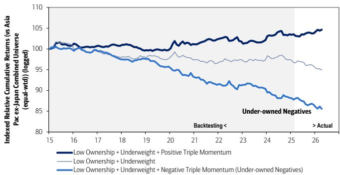

line

| Backtesting | Low Ownership + Underweight + Positive Triple Momentum | Low Ownership + Underweight | Low Ownership + Underweight + Negative Triple Momentum (Under-owned Negatives) |
| ---------- | -------------------------------------------------------- | ---------------------------- | ------------------------------------------------------------------ |
| 15         | 100.0                                                    | 100.0                        | 100.0                                                              |
| 16         | 100.5                                                    | 99.5                         | 99.0                                                               |
| 17         | 100.0                                                    | 99.0                         | 98.5                                                               |
| 18         | 99.5                                                     | 98.5                         | 98.0                                                               |
| 19         | 99.0                                                     | 98.0                         | 97.5                                                               |
| 20         | 100.0                                                    | 97.5                         | 97.0                                                               |
| 21         | 101.0                                                    | 97.0                         | 96.5                                                               |
| 22         | 102.0                                                    | 96.5                         | 96.0                                                               |
| 23         | 103.0                                                    | 96.0                         | 95.5                                                               |
| 24         | 104.0                                                    | 95.5                         | 95.0                                                               |
| 25         | 105.0                                                    | 95.0                         | 94.5                                                               |
| 26         | 106.0                                                    | 94.5                         | 94.0                                                               |

Source : BofA Asia Pac Quantitative Strategy, MSCI, FTSE, FactSet, Bloomberg, 13F Filings, Benchmark Indices, Country Stock Exchanges   
The shaded area shows back-tested results during the period from Jan-15 to Apr-25. The unshaded portion represents actual performance since May-25. Back-tested performance depicts the theoretical (not actual) performance of a particular strategy over the time period indicated. No representation is being made that any actual portfolio is likely to have achieved returns similar to those shown herein.

BofA GLOBAL RESEARCH

# Chart 140: Asia Pac ex-Japan HIGH Fund Ownership, OVERWEIGHT, and Triple Momentum (Crowded Positives): Relative Cumulative Performance

Stocks with High Triple Momentum (“Crowded Positives”) have historically outperformed APxJ Combined Universe

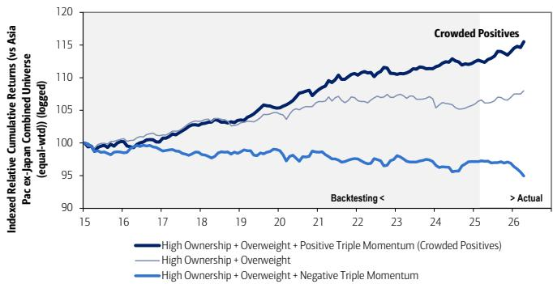

line

| Year | High Ownership + Overweight + Positive Triple Momentum (Crowded Positives) | High Ownership + Overweight | High Ownership + Overweight + Negative Triple Momentum |
|------|------------------------------------------------------------------------|------------------------------|-----------------------------------------------------|
| 15   | 100                                                                    | 100                          | 100                                                 |
| 16   | 100                                                                    | 100                          | 100                                                 |
| 17   | 100                                                                    | 100                          | 100                                                 |
| 18   | 100                                                                    | 100                          | 100                                                 |
| 19   | 100                                                                    | 100                          | 100                                                 |
| 20   | 105                                                                    | 105                          | 100                                                 |
| 21   | 110                                                                    | 105                          | 98                                                  |
| 22   | 110                                                                    | 105                          | 98                                                  |
| 23   | 110                                                                    | 105                          | 98                                                  |
| 24   | 110                                                                    | 105                          | 98                                                  |
| 25   | 115                                                                    | 105                          | 98                                                  |
| 26   | 120                                                                    | 105                          | 95                                                  |

Source : BofA Asia Pac Quantitative Strategy, MSCI, FTSE, FactSet, Bloomberg, 13F Filings, Benchmark Indices, Country Stock Exchanges   
The shaded area shows back-tested results during the period from Jan-15 to Apr-25. The unshaded portion represents actual performance since May-25. Back-tested performance depicts the theoretical (not actual) performance of a particular strategy over the time period indicated. No representation is being made that any actual portfolio is likely to have achieved returns similar to those shown herein.

BofA GLOBAL RESEARCH

# Chart 142: Asia Pac ex-Japan LOW Fund Ownership, OVERWEIGHT, and Triple Momentum (Under-owned Positives): Relative Cumulative Performance

Stocks with high Triple Momentum (“Under-owned Positives”) have historically outperformed APxJ Combined Universe

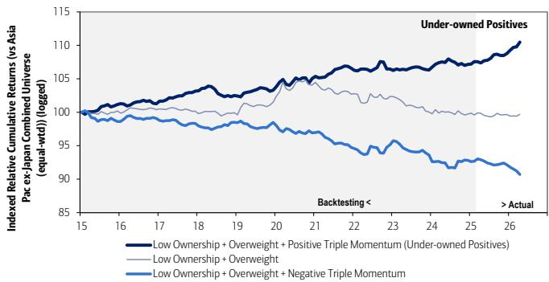

line

| Year | Low Ownership + Overweight + Positive Triple Momentum (Under-owned Positives) | Low Ownership + Overweight | Low Ownership + Overweight + Negative Triple Momentum |
|------|------------------------------------------------------------------------|-----------------------------|------------------------------------------------------|
| 15   | 100                                                                    | 100                         | 100                                                  |
| 16   | 101                                                                    | 100                         | 99                                                   |
| 17   | 102                                                                    | 100                         | 98                                                   |
| 18   | 103                                                                    | 100                         | 97                                                   |
| 19   | 104                                                                    | 100                         | 96                                                   |
| 20   | 105                                                                    | 101                         | 95                                                   |
| 21   | 106                                                                    | 102                         | 94                                                   |
| 22   | 107                                                                    | 103                         | 93                                                   |
| 23   | 108                                                                    | 104                         | 92                                                   |
| 24   | 109                                                                    | 105                         | 91                                                   |
| 25   | 110                                                                    | 106                         | 90                                                   |
| 26   | 111                                                                    | 107                         | 89                                                   |

Source : BofA Asia Pac Quantitative Strategy, MSCI, FTSE, FactSet, Bloomberg, 13F Filings, Benchmark Indices, Country Stock Exchanges   
The shaded area shows back-tested results during the period from Jan-15 to Apr-25. The unshaded portion represents actual performance since May-25. Back-tested performance depicts the theoretical (not actual) performance of a particular strategy over the time period indicated. No representation is being made that any actual portfolio is likely to have achieved returns similar to those shown herein.

BofA GLOBAL RESEARCH

# Back-testing Results

The three components of this analysis are Fund Ownership, Relative Weights, and Triple Momentum. The back-testing shown below includes the eight combinations of high and low Fund Ownership, high and low Relative Weights, and high and low triple Momentum.

Additionally, back-testing shows the performance of high (top quintile) and low (bottom quintile) for each of the three components individually.

Table 20: Asia Pac ex-Japan Stock Positioning and Triple Momentum: Back-testing results from Jan-15 to Apr-25

Asia Pac ex-Japan Positioning and Triple Momentum back-testing performance across different periods (1m, 3m, 12m, YTD)

<table><tr><td>Fund Ownership + Relative Weight + Triple Momentum</td><td>1mth</td><td>3mth</td><td>6mth</td><td>12mth</td><td>YTD</td><td>Last 5yr</td><td>Since Inception Jan-15</td><td>Annualised</td></tr><tr><td>CROWDED POSITIVES =High Ownership + Overweight +Positive Triple Momentum</td><td>1.4%</td><td>1.6%</td><td>-0.1%</td><td>6.2%</td><td>3.3%</td><td>89.8%</td><td>157.4%</td><td>9.6%</td></tr><tr><td>High Ownership + Overweight +Negative Triple Momentum</td><td>1.7%</td><td>2.4%</td><td>0.7%</td><td>11.0%</td><td>2.6%</td><td>37.8%</td><td>28.1%</td><td>2.4%</td></tr><tr><td>High Ownership + Underweight +Positive Triple Momentum</td><td>2.6%</td><td>1.4%</td><td>-1.3%</td><td>6.3%</td><td>2.0%</td><td>65.4%</td><td>79.8%</td><td>5.8%</td></tr><tr><td>CROWDED NEGATIVES =High Ownership + Underweight +Negative Triple Momentum</td><td>3.5%</td><td>1.8%</td><td>-3.0%</td><td>4.2%</td><td>2.3%</td><td>18.7%</td><td>0.8%</td><td>0.1%</td></tr><tr><td>UNDER-OWNED POSITIVES =Low Ownership + Overweight +Positive Triple Momentum</td><td>1.2%</td><td>2.9%</td><td>-0.7%</td><td>5.9%</td><td>3.6%</td><td>65.4%</td><td>104.7%</td><td>7.2%</td></tr><tr><td>Low Ownership + Overweight +Negative Triple Momentum</td><td>1.4%</td><td>3.4%</td><td>0.1%</td><td>8.7%</td><td>2.8%</td><td>15.1%</td><td>5.1%</td><td>0.5%</td></tr><tr><td>Low Ownership + Underweight +Positive Triple Momentum</td><td>1.7%</td><td>0.5%</td><td>-2.6%</td><td>5.7%</td><td>0.3%</td><td>56.3%</td><td>67.8%</td><td>5.1%</td></tr><tr><td>UNDER-OWNED NEGATIVES =Low Ownership + Underweight +Negative Triple Momentum</td><td>2.8%</td><td>2.5%</td><td>-2.5%</td><td>3.3%</td><td>2.5%</td><td>4.6%</td><td>-15.3%</td><td>-1.6%</td></tr><tr><td>Asia Pac ex-Japan Combined Universe (equal-wtd)</td><td>2.0%</td><td>2.1%</td><td>-1.1%</td><td>6.5%</td><td>2.4%</td><td>42.6%</td><td>45.7%</td><td>3.7%</td></tr></table>

Source : BofA Asia Pac Quantitative Strategy, MSCI, FTSE, FactSet, Bloomberg, 13F Filings, Benchmark Indices, Country Stock Exchanges   
Performance is shown relative to the average performance of stocks in the analysis with Fund Ownership, Relative Weight, and Triple Momentum Ranks, where data exists.   
This performance is backtested and does not represent the actual performance of any account or fund. Backtested performance depicts the theoretical (not actual) performance of a particular strategy over the time period indicated. No representation is being made that any actual portfolio is likely to have achieved returns similar to those shown herein.

BofA GLOBAL RESEARCH

Based on the above table, the four stocks screens with the most relevant and actionable results are the four below:

• Crowded Positives (Consensus)   
High Fund Ownership + Overweight + Positive Triple Momentum   
• Crowded Negatives (Contrarian)   
High Fund Ownership + Underweight + Negative Triple Momentum   
• Under-owned Positives (Contrarian)   
Low Fund Ownership + Overweight + Positive Triple Momentum   
• Under-owned Negatives (Consensus)

Low Fund Ownership + Underweight + Negative Triple Momentum

# Chart 143: Asia Pac ex-Japan Stock Positioning and Triple Momentum: Annualised Relative Performance (back-tested from Jan-15 to Apr-25)

Asia Pac ex-Japan Stock Positioning and Triple Momentum Annualised Relative Performance Summary based on back-testing

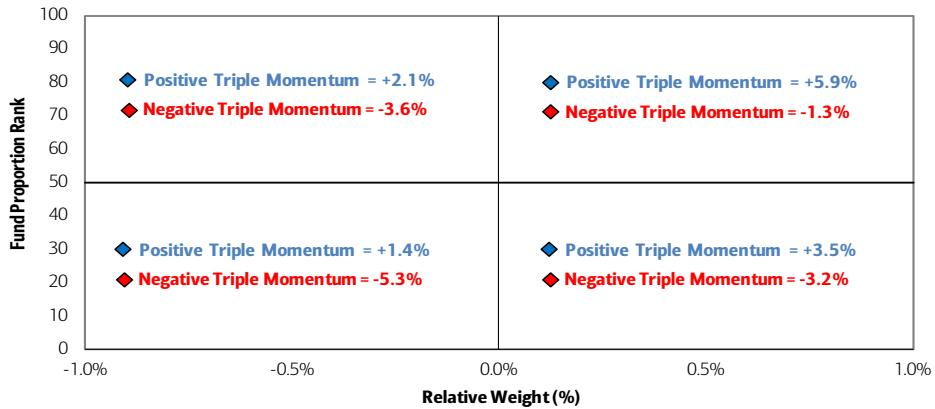

scatter

| Category | Relative Weight (%) | Fund Proportion Rank |
| :--- | :--- | :--- |
| Positive Triple Momentum | -0.8 | 30 |
| Negative Triple Momentum | -0.7 | 25 |
| Positive Triple Momentum | 0.1 | 80 |
| Negative Triple Momentum | 0.0 | 70 |
| Positive Triple Momentum | 0.6 | 35 |
| Negative Triple Momentum | 0.1 | 20 |
| Positive Triple Momentum | 0.9 | 85 |
| Negative Triple Momentum | 0.1 | 75 |
| Positive Triple Momentum | +0.4 | 32 |
| Negative Triple Momentum | -0.6 | 28 |
| Positive Triple Momentum | +0.5 | 82 |
| Negative Triple Momentum | -0.6 | 72 |
| Positive Triple Momentum | +0.7 | 33 |
| Negative Triple Momentum | -0.7 | 27 |
| Positive Triple Momentum | +0.8 | 88 |
| Negative Triple Momentum | -0.8 | 78 |
| Positive Triple Momentum | +0.6 | 34 |
| Negative Triple Momentum | -0.7 | 26 |
| Positive Triple Momentum | +0.9 | 86 |
| Negative Triple Momentum | -0.8 | 76 |
| Positive Triple Momentum | +0.7 | 36 |
| Negative Triple Momentum | -0.7 | 29 |
| Positive Triple Momentum | +0.8 | 36 |
| Negative Triple Momentum | -0.8 | 28 |
| Positive Triple Momentum | +0.5 | 84 |
| Negative Triple Momentum | -0.7 | 29 |
| Positive Triple Momentum | +0.6 | 35 |
| Negative Triple Momentum | -0.8 | 27 |
| Positive Triple Momentum | +0.9 | 87 |
| Negative Triple Momentum | -0.8 | 28 |
| Positive Triple Momentum | +0.7 | 37 |
| Negative Triple Momentum | -0.8 | 26 |
| Positive Triple Momentum | +0.6 | 36 |
| Negative Triple Momentum | -0.8 | 29 |
| Positive Triple Momentum | +0.8 | 38 |
| Negative Triple Momentum | -0.8 | 27 |
| Positive Triple Momentum | +0.5 | 34 |
| Negative Triple Momentum | -0.7 | 28 |
| Positive Triple Momentum | +0.7 | 35 |
| Negative Triple Momentum | -0.8 | 27 |
| Positive Triple Momentum | +0.6 | 36 |
| Negative Triple Momentum | -0.8 | 29 |
| Positive Triple Momentum | +0.9 | 39 |
| Negative Triple Momentum | -0.8 | 28 |
| Positive Triple Momentum | +0.5 | 35 |
| Negative Triple Momentum | -0.7 | 29 |
| Positive Triple Momentum | +0.7 | 36 |
| Negative Triple Momentum | -0.8 | 27 |
| Positive Triple Momentum | +0.6 | 34 |
| Negative Triple Momentum | -0.8 | 28 |
| Positive Triple Momentum | +0.8 | 37 |
| Negative Triple Momentum | -0.8 | 29 |
| Positive Triple Momentum | +0.5 | 35 |
| Negative Triple Momentum | -0.7 | 28 |
| Positive Triple Momentum | +0.7 | 36 |
| Negative Triple Momentum | -0.8 | 27 |
| Positive Triple Momentum | +0.6 | 34 |
| Negative Triple Momentum | -0.8 | 29 |
| Positive Triple Momentum | +0.9 | 38 |
| Negative Triple Momentum | -0.8 | 28 |
| Positive Triple Momentum | +0.5 | 35 |
| Negative Triple Momentum | -0.7 | 29 |
| Positive Triple Momentum | +0.7 | 36 |
| Negative Triple Momentum | -0.8 | 27 |
| Positive Triple Momentum | +0.6 | 34 |
| Negative Triple Momentum | -0.8 | 29 |
| Positive Triple Momentum | +0.5 | 35 |
| Negative Triple Momentum | -0.7 | 28 |
| Positive Triple Momentum | +0.7 | 36 |
| Negative Triple Momentum | -0.8 | 27 |

Source : BofA Asia Pac Quantitative Strategy, MSCI, FTSE, FactSet, Bloomberg, 13F Filings, Benchmark Indices, Country Stock Exchanges Benchmark performance is based on equal-weighted performance of stocks with Ownership, Active Exposure, and Triple Momentum Ranks. This performance is backtested and does not represent the actual performance of any account or fund. Backtested performance depicts the theoretical (not actual) performance of a particular strategy over the time period indicated. No representation is being made that any actual portfolio is likely to have achieved returns similar to those shown herein.   
BofA GLOBAL RESEARCH

The below chart (Holding Period Performance) shows the average subsequent performance over the next 12 months of stocks from the time they are included in one of the four screens (time zero).

# Chart 144: Asia Pac ex-Japan Stock Positioning and Triple Momentum: Holding Period Performance (back-tested results Jan-15 to Apr-25)

CROWDED Positive stocks outperform the Asia Pac Combined Universe for subsequent six months, on average

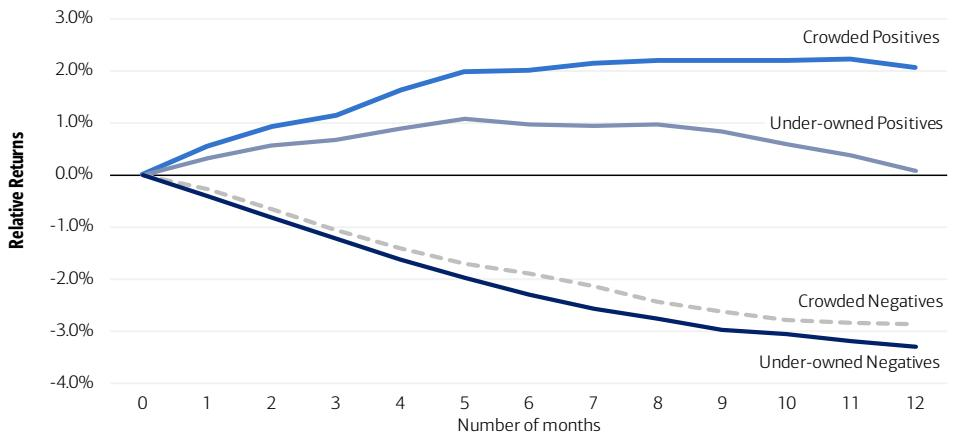

line

| Number of months | Crowded Positives | Under-owned Positives | Crowded Negatives | Under-owned Negatives |
| ---------------- | ------------------ | --------------------- | ------------------ | --------------------- |
| 0                | 0.0%               | 0.0%                  | 0.0%               | 0.0%                  |
| 1                | ~0.5%              | ~0.2%                 | ~-0.5%             | ~-0.8%                |
| 2                | ~0.8%              | ~0.4%                 | ~-1.0%             | ~-1.2%                |
| 3                | ~1.0%              | ~0.6%                 | ~-1.5%             | ~-1.6%                |
| 4                | ~1.3%              | ~0.8%                 | ~-1.8%             | ~-1.9%                |
| 5                | ~1.8%              | ~1.0%                 | ~-2.0%             | ~-2.2%                |
| 6                | ~2.0%              | ~0.9%                 | ~-2.2%             | ~-2.4%                |
| 7                | ~2.1%              | ~0.9%                 | ~-2.4%             | ~-2.6%                |
| 8                | ~2.2%              | ~0.9%                 | ~-2.6%             | ~-2.8%                |
| 9                | ~2.2%              | ~0.8%                 | ~-2.8%             | ~-3.0%                |
| 10               | ~2.2%              | ~0.6%                 | ~-3.0%             | ~-3.2%                |
| 11               | ~2.2%              | ~0.4%                 | ~-3.1%             | ~-3.4%                |
| 12               | ~2.1%              | ~0.2%                 | ~-3.2%             | ~-3.6%                |

Source : BofA Asia Pac Quantitative Strategy, MSCI, FTSE, FactSet, Bloomberg, 13F Filings, Benchmark Indices, Country Stock Exchanges Benchmark performance is based on equal-weighted performance of stocks with Ownership, Active Exposure, and Triple Momentum Ranks. This performance is backtested and does not represent the actual performance of any account or fund. Backtested performance depicts the theoretical (not actual) performance of a particular strategy over the time period indicated. No representation is being made that any actual portfolio is likely to have achieved returns similar to those shown herein.   
BofA GLOBAL RESEARCH

# Appendix A: Positioning and Triple Momentum Performance Summary

Table 21: Asia Pac ex-Japan Stock Positioning and Triple Momentum: Back-testing results from Jan-15 to Apr-25

Asia Pac ex-Japan Stock Positioning and Triple Momentum back-testing performance across different periods (1m, 3m, 12m, YTD)

<table><tr><td>Fund Ownership + Relative Weight+ Triple Momentum</td><td>1mth</td><td>3mth</td><td>6mth</td><td>12mth</td><td>YTD</td><td>Last 5yr</td><td>Since InceptionJan-15</td><td>Annualised</td></tr><tr><td>CROWDED POSITIVES =High Ownership + Overweight + PositiveTriple Momentum</td><td>1.4%</td><td>1.6%</td><td>-0.1%</td><td>6.2%</td><td>3.3%</td><td>89.8%</td><td>157.4%</td><td>9.6%</td></tr><tr><td>High Ownership + Overweight + NegativeTriple Momentum</td><td>1.7%</td><td>2.4%</td><td>0.7%</td><td>11.0%</td><td>2.6%</td><td>37.8%</td><td>28.1%</td><td>2.4%</td></tr><tr><td>High Ownership + Underweight + PositiveTriple Momentum</td><td>2.6%</td><td>1.4%</td><td>-1.3%</td><td>6.3%</td><td>2.0%</td><td>65.4%</td><td>79.8%</td><td>5.8%</td></tr><tr><td>CROWDED NEGATIVES =High Ownership + Underweight +Negative Triple Momentum</td><td>3.5%</td><td>1.8%</td><td>-3.0%</td><td>4.2%</td><td>2.3%</td><td>18.7%</td><td>0.8%</td><td>0.1%</td></tr><tr><td>UNDER-OWNED POSITIVES =Low Ownership + Overweight + PositiveTriple Momentum</td><td>1.2%</td><td>2.9%</td><td>-0.7%</td><td>5.9%</td><td>3.6%</td><td>65.4%</td><td>104.7%</td><td>7.2%</td></tr><tr><td>Low Ownership + Overweight + NegativeTriple Momentum</td><td>1.4%</td><td>3.4%</td><td>0.1%</td><td>8.7%</td><td>2.8%</td><td>15.1%</td><td>5.1%</td><td>0.5%</td></tr><tr><td>Low Ownership + Underweight + PositiveTriple Momentum</td><td>1.7%</td><td>0.5%</td><td>-2.6%</td><td>5.7%</td><td>0.3%</td><td>56.3%</td><td>67.8%</td><td>5.1%</td></tr><tr><td>UNDER-OWNED NEGATIVES =Low Ownership + Underweight + NegativeTriple Momentum</td><td>2.8%</td><td>2.5%</td><td>-2.5%</td><td>3.3%</td><td>2.5%</td><td>4.6%</td><td>-15.3%</td><td>-1.6%</td></tr><tr><td>Asia Pac ex-Japan Combined Universe(equal-weight)</td><td>2.0%</td><td>2.1%</td><td>-1.1%</td><td>6.5%</td><td>2.4%</td><td>42.6%</td><td>45.7%</td><td>3.7%</td></tr></table>

Source : BofA Asia Pac Quantitative Strategy, MSCI, FTSE, FactSet, Bloomberg, 13F Filings, Benchmark Indices, Country Stock Exchanges   
Performance is shown relative to the average performance of stocks in the analysis with Fund Ownership, Relative Weight, and Triple Momentum Ranks, where data exists.   
This performance is backtested and does not represent the actual performance of any account or fund. Backtested performance depicts the theoretical (not actual) performance of a particular strategy over the time period indicated. No representation is being made that any actual portfolio is likely to have achieved returns similar to those shown herein.

BofA GLOBAL RESEARCH

Table 22: Asia Pac ex-Japan Stock Positioning and Triple Momentum: Actual Performance Ending Apr-26

Asia Pac ex-Japan Stock Positioning and Triple Momentum actual performance ending Apr-26 across different periods (1m, 3m, 12m, YTD)

<table><tr><td>Active Long-only</td><td>1mth</td><td>3mth</td><td>6mth</td><td>12mth</td><td>YTD</td><td>Since Inception Apr-25</td><td>Annualised</td></tr><tr><td>CROWDED POSITIVES =High Ownership + Overweight + Positive Triple Momentum</td><td>15.9%</td><td>6.6%</td><td>16.4%</td><td>56.2%</td><td>16.6%</td><td>56.2%</td><td>56.2%</td></tr><tr><td>High Ownership + Overweight + Negative Triple Momentum</td><td>8.1%</td><td>-4.7%</td><td>-2.0%</td><td>21.8%</td><td>-0.8%</td><td>21.8%</td><td>21.8%</td></tr><tr><td>High Ownership + Underweight + Positive Triple Momentum</td><td>13.1%</td><td>3.9%</td><td>11.9%</td><td>44.8%</td><td>13.0%</td><td>44.8%</td><td>44.8%</td></tr><tr><td>CROWDED NEGATIVES =High Ownership + Underweight + Negative Triple Momentum</td><td>8.3%</td><td>0.5%</td><td>3.0%</td><td>20.3%</td><td>4.4%</td><td>20.3%</td><td>20.3%</td></tr><tr><td>UNDER-OWNED POSITIVES =Low Ownership + Overweight + Positive Triple Momentum</td><td>14.9%</td><td>7.8%</td><td>17.5%</td><td>55.7%</td><td>17.4%</td><td>55.7%</td><td>55.7%</td></tr><tr><td>Low Ownership + Overweight + Negative Triple Momentum</td><td>8.6%</td><td>-3.3%</td><td>-0.1%</td><td>22.0%</td><td>1.4%</td><td>22.0%</td><td>22.0%</td></tr><tr><td>Low Ownership + Underweight + Positive Triple Momentum</td><td>12.6%</td><td>4.0%</td><td>10.9%</td><td>45.4%</td><td>13.1%</td><td>45.4%</td><td>45.4%</td></tr><tr><td>UNDER-OWNED NEGATIVES =Low Ownership + Underweight + Negative Triple Momentum</td><td>8.4%</td><td>0.0%</td><td>2.2%</td><td>19.5%</td><td>3.7%</td><td>19.5%</td><td>19.5%</td></tr><tr><td>Asia Pac ex-Japan Combined Universe (equal-weight)</td><td>11.2%</td><td>1.8%</td><td>7.3%</td><td>35.1%</td><td>8.5%</td><td>35.1%</td><td>35.1%</td></tr></table>

Source : BofA Asia Pac Quantitative Strategy, MSCI, FTSE, FactSet, Bloomberg, 13F Filings, Benchmark Indices, Country Stock Exchanges   
Performance is shown relative to the average performance of stocks in the analysis with Fund Ownership, Relative Weight, and Triple Momentum Ranks, where data exists.   
Note: No transaction costs are included in the return figures. The performance figures are updated on a monthly basis. Past performance is no guarantee of future results. A complete performance record is available on request. Past performance is no guarantee of future results. A complete performance record is available on request.

BofA GLOBAL RESEARCH

Table 23: Asia Pac ex-Japan Stock Positioning and Triple Momentum: Advance Decline Ending Apr-26

Asia Pac ex-Japan Stock Positioning and Triple Momentum advance decline ending Apr-26 across different periods (1m, 3m, 12m, YTD)

Positioning + Triple 

<table><tr><td>Momentum</td><td colspan="2">Last Month</td><td colspan="2">Last 3-Months</td><td colspan="2">Last 6-Months</td><td colspan="2">Last 12-Months</td><td colspan="2">Year-To-Date</td><td colspan="2">25</td></tr><tr><td></td><td>Advance</td><td>Decline</td><td>Advance</td><td>Decline</td><td>Advance</td><td>Decline</td><td>Advance</td><td>Decline</td><td>Advance</td><td>Decline</td><td>Advance</td><td>Decline</td></tr><tr><td>CROWDED POSITIVES =High Ownership + Overweight +Positive Triple Momentum</td><td>115</td><td>52</td><td>103</td><td>103</td><td>138</td><td>101</td><td>255</td><td>114</td><td>118</td><td>98</td><td>1254</td><td>1186</td></tr><tr><td>High Ownership + Overweight +Negative Triple Momentum</td><td>163</td><td>50</td><td>126</td><td>127</td><td>154</td><td>116</td><td>214</td><td>101</td><td>145</td><td>113</td><td>756</td><td>716</td></tr><tr><td>High Ownership + Underweight+ Positive Triple Momentum</td><td>124</td><td>64</td><td>98</td><td>129</td><td>141</td><td>105</td><td>177</td><td>99</td><td>120</td><td>110</td><td>760</td><td>911</td></tr><tr><td>CROWDED NEGATIVES =High Ownership + Underweight+ Negative Triple Momentum</td><td>148</td><td>63</td><td>111</td><td>143</td><td>158</td><td>136</td><td>247</td><td>121</td><td>126</td><td>140</td><td>1151</td><td>1075</td></tr><tr><td>UNDER-OWNED POSITIVES =Low Ownership + Overweight +Positive Triple Momentum</td><td>144</td><td>44</td><td>125</td><td>123</td><td>138</td><td>143</td><td>222</td><td>155</td><td>132</td><td>130</td><td>1048</td><td>1275</td></tr><tr><td>Low Ownership + Overweight +Negative Triple Momentum</td><td>148</td><td>55</td><td>130</td><td>113</td><td>185</td><td>104</td><td>289</td><td>104</td><td>153</td><td>109</td><td>1255</td><td>1026</td></tr><tr><td>Low Ownership + Underweight +Positive Triple Momentum</td><td>143</td><td>70</td><td>118</td><td>126</td><td>170</td><td>113</td><td>258</td><td>109</td><td>137</td><td>120</td><td>1242</td><td>1048</td></tr><tr><td>UNDER-OWNED NEGATIVES =Low Ownership + Underweight +Negative Triple Momentum</td><td>53</td><td>18</td><td>42</td><td>43</td><td>69</td><td>48</td><td>133</td><td>65</td><td>54</td><td>43</td><td>834</td><td>848</td></tr></table>

Source : BofA Asia Pac Quantitative Strategy, MSCI, FTSE, FactSet, Bloomberg, 13F Filings, Benchmark Indices, Country Stock Exchanges

BofA GLOBAL RESEARCH

Table 24: Asia Pac ex-Japan Fund Ownership (top vs bottom quintile): Back-testing results from Jan-15 to Apr-25

Asia Pac ex-Japan Fund Ownership back-testing performance across different periods (1m, 3m, 12m, YTD)

<table><tr><td>Fund Ownership</td><td>1mth</td><td>3mth</td><td>6mth</td><td>12mth</td><td>YTD</td><td>Last 5yr</td><td>Since Inception Jan-15</td><td>Annualised</td></tr><tr><td>High Ownership</td><td>-3.7%</td><td>2.8%</td><td>-0.1%</td><td>10.2%</td><td>2.3%</td><td>31.8%</td><td>39.1%</td><td>3.2%</td></tr><tr><td>Low Ownership</td><td>-1.1%</td><td>-0.4%</td><td>-6.3%</td><td>2.0%</td><td>-2.0%</td><td>-3.6%</td><td>-0.6%</td><td>-0.1%</td></tr><tr><td>Asia Pac ex-Japan Positioning Universe (equal-weight)</td><td>-1.3%</td><td>1.6%</td><td>-2.8%</td><td>6.0%</td><td>0.8%</td><td>23.2%</td><td>22.1%</td><td>2.0%</td></tr></table>

Source : BofA Asia Pac Quantitative Strategy, MSCI, FTSE, FactSet, Bloomberg, 13F Filings, Benchmark Indices, Country Stock Exchanges   
Performance is shown relative to the average performance of stocks in the analysis with Fund Ownership and Relative Weight, where data exists.   
This performance is backtested and does not represent the actual performance of any account or fund. Backtested performance depicts the theoretical (not actual) performance of a particular strategy over the time period indicated. No representation is being made that any actual portfolio is likely to have achieved returns similar to those shown herein.

BofA GLOBAL RESEARCH

Table 25: Asia Pac ex-Japan Fund Ownership (top vs bottom quintile): Actual Performance Ending Apr-26

Asia Pac ex-Japan Fund Ownership (top vs bottom quintile) actual performance ending Apr-26 across different periods (1m, 3m, 12m, YTD)

<table><tr><td>Fund Ownership</td><td>1mth</td><td>3mth</td><td>6mth</td><td>12mth</td><td>YTD</td><td>Since Inception Apr-25</td><td>Annualised</td></tr><tr><td>High Ownership</td><td>9.7%</td><td>3%</td><td>15%</td><td>46%</td><td>12%</td><td>46%</td><td>45.5%</td></tr><tr><td>Low Ownership</td><td>9.2%</td><td>1%</td><td>8%</td><td>36%</td><td>8%</td><td>36%</td><td>35.7%</td></tr><tr><td>Asia Pac ex-Japan Positioning Universe (equal-weight)</td><td>10.4%</td><td>2.3%</td><td>12.3%</td><td>43.7%</td><td>11.3%</td><td>43.7%</td><td>43.7%</td></tr></table>

Source : BofA Asia Pac Quantitative Strategy, MSCI, FTSE, FactSet, Bloomberg, 13F Filings, Benchmark Indices, Country Stock Exchanges   
Performance is shown relative to the average performance of stocks in the analysis with Fund Ownership and Relative Weight, where data exists.   
Note: No transaction costs are included in the return figures. The performance figures are updated on a monthly basis. Past performance is no guarantee of future results. A complete performance record is available on request. Past performance is no guarantee of future results. A complete performance record is available on request.

BofA GLOBAL RESEARCH

Table 26: Asia Pac ex-Japan Fund Ownership (top vs bottom quintile): Advance Decline Ending Apr-26

Asia Pac ex-Japan Fund Ownership (top vs bottom quintile) advance decline ending Apr-26 across different periods (1m, 3m, 12m, YTD)

<table><tr><td>Fund Ownership</td><td colspan="2">High Ownership</td><td colspan="2">Low Ownership</td></tr><tr><td></td><td>Advance</td><td>Decline</td><td>Advance</td><td>Decline</td></tr><tr><td>Last Month</td><td>277</td><td>53</td><td>90</td><td>13</td></tr><tr><td>Last 3-Months</td><td>201</td><td>198</td><td>63</td><td>87</td></tr><tr><td>Last 6-Months</td><td>261</td><td>229</td><td>79</td><td>129</td></tr><tr><td>Last 12-Months</td><td>451</td><td>237</td><td>182</td><td>184</td></tr><tr><td>Year-To-Date</td><td>250</td><td>177</td><td>74</td><td>85</td></tr><tr><td>Since Inception Apr-25</td><td>1915</td><td>2287</td><td>1241</td><td>1511</td></tr></table>

Source : BofA Asia Pac Quantitative Strategy, MSCI, FTSE, FactSet, Bloomberg, 13F Filings, Benchmark Indices, Country Stock Exchanges

BofA GLOBAL RESEARCH

Table 27: Asia Pac ex-Japan Active Exposure - Relative Weight (top vs bottom quintile): Back-testing results from Jan-15 to Apr-25

Asia Pac ex-Japan Relative Weight back-testing performance across different periods (1m, 3m, 12m, YTD)

<table><tr><td>Relative Weight</td><td>1mth</td><td>3mth</td><td>6mth</td><td>12mth</td><td>YTD</td><td>Last 5yr</td><td>Since Inception Jan-15</td><td>Annualised</td></tr><tr><td>Overweight (Active Exposure)</td><td>-2.5%</td><td>1.6%</td><td>0.4%</td><td>7.6%</td><td>2.6%</td><td>15.7%</td><td>41.6%</td><td>3.4%</td></tr><tr><td>Underweight (Active Exposure)</td><td>1.4%</td><td>0.6%</td><td>-4.6%</td><td>3.8%</td><td>-0.3%</td><td>24.1%</td><td>-1.2%</td><td>-0.1%</td></tr><tr><td>Asia Pac ex-Japan Positioning Universe (equal-weight)</td><td>-1.3%</td><td>1.6%</td><td>-2.8%</td><td>6.0%</td><td>0.8%</td><td>23.2%</td><td>22.1%</td><td>2.0%</td></tr></table>

Source : BofA Asia Pac Quantitative Strategy, MSCI, FTSE, FactSet, Bloomberg, 13F Filings, Benchmark Indices, Country Stock Exchanges   
Performance is shown relative to the average performance of stocks in the analysis with Fund Ownership and Relative Weight, where data exists.   
This performance is backtested and does not represent the actual performance of any account or fund. Backtested performance depicts the theoretical (not actual) performance of a particular strategy over the time period indicated. No representation is being made that any actual portfolio is likely to have achieved returns similar to those shown herein.

BofA GLOBAL RESEARCH

Table 28: Asia Pac ex-Japan Active Exposure - Relative Weight (top vs bottom quintile): Actual Performance Ending Apr-26

Asia Pac ex-Japan Relative Weight actual performance ending Apr-26 across different periods (1m, 3m, 12m, YTD)

<table><tr><td>Relative Weight</td><td>1mth</td><td>3mth</td><td>6mth</td><td>12mth</td><td>YTD</td><td>Since Inception Apr-25</td><td>Annualised</td></tr><tr><td>Overweight (Active Exposure)</td><td>14.7%</td><td>6%</td><td>19%</td><td>52%</td><td>17%</td><td>52%</td><td>52.2%</td></tr><tr><td>Underweight (Active Exposure)</td><td>9.5%</td><td>1%</td><td>7%</td><td>30%</td><td>7%</td><td>30%</td><td>30.0%</td></tr><tr><td>Asia Pac ex-Japan Positioning Universe (equal-weight)</td><td>10.4%</td><td>2%</td><td>12%</td><td>44%</td><td>11%</td><td>44%</td><td>43.7%</td></tr></table>

Source : BofA Asia Pac Quantitative Strategy, MSCI, FTSE, FactSet, Bloomberg, 13F Filings, Benchmark Indices, Country Stock Exchanges   
Performance is shown relative to the average performance of stocks in the analysis with Fund Ownership and Relative Weight, where data exists.   
Note: No transaction costs are included in the return figures. The performance figures are updated on a monthly basis. Past performance is no guarantee of future results. A complete performance record is available on request. Past performance is no guarantee of future results. A complete performance record is available on request.

BofA GLOBAL RESEARCH

Table 29: Asia Pac ex-Japan Active Exposure - Relative Weight (top vs bottom quintile): Advance Decline Ending Apr-26

Asia Pac ex-Japan Relative Weight advance decline ending Apr-26 across different periods (1m, 3m, 12m, YTD)

<table><tr><td>Relative Weight</td><td colspan="2">Overweight</td><td colspan="2">Underweight</td></tr><tr><td></td><td>Advance</td><td>Decline</td><td>Advance</td><td>Decline</td></tr><tr><td>Last Month</td><td>84</td><td>13</td><td>131</td><td>48</td></tr><tr><td>Last 3-Months</td><td>75</td><td>56</td><td>116</td><td>137</td></tr><tr><td>Last 6-Months</td><td>108</td><td>66</td><td>181</td><td>146</td></tr><tr><td>Last 12-Months</td><td>174</td><td>103</td><td>285</td><td>210</td></tr><tr><td>Year-To-Date</td><td>92</td><td>51</td><td>151</td><td>125</td></tr><tr><td>Since Inception Apr-25</td><td>2119</td><td>2157</td><td>2837</td><td>2585</td></tr></table>

Source : BofA Asia Pac Quantitative Strategy, MSCI, FTSE, FactSet, Bloomberg, 13F Filings, Benchmark Indices, Country Stock Exchanges

BofA GLOBAL RESEARCH

Table 30: Asia Pac ex-Japan Triple Momentum (top vs bottom quintile): Back-testing results from Jan-15 to Apr-25

Asia Pac ex-Japan Triple Momentum back-testing performance across different periods (1m, 3m, 12m, YTD)

<table><tr><td>Triple Momentum</td><td>1mth</td><td>3mth</td><td>6mth</td><td>12mth</td><td>YTD</td><td>Last 5yr</td><td>Since Inception Jan-15</td><td>Annualised</td></tr><tr><td>Positive Triple Momentum</td><td>2.1%</td><td>2.7%</td><td>1.2%</td><td>7.7%</td><td>4.1%</td><td>96.5%</td><td>156.5%</td><td>9.5%</td></tr><tr><td>Negative Triple Momentum</td><td>3.6%</td><td>3.3%</td><td>0.0%</td><td>7.1%</td><td>3.6%</td><td>6.7%</td><td>-3.0%</td><td>-0.3%</td></tr><tr><td>Asia Pac ex-Japan Combined Universe (equal-weight)</td><td>2.0%</td><td>2.1%</td><td>-1.1%</td><td>6.5%</td><td>2.4%</td><td>42.6%</td><td>45.7%</td><td>3.7%</td></tr></table>

Source : BofA Asia Pac Quantitative Strategy, MSCI, FTSE, FactSet, Bloomberg, 13F Filings, Benchmark Indices, Country Stock Exchanges   
Performance is shown relative to the average performance of stocks in the analysis with Fund Ownership, Relative Weight, and Triple Momentum Ranks, where data exists.   
This performance is backtested and does not represent the actual performance of any account or fund. Backtested performance depicts the theoretical (not actual) performance of a particular strategy over the time period indicated. No representation is being made that any actual portfolio is likely to have achieved returns similar to those shown herein.

BofA GLOBAL RESEARCH

Table 31: Asia Pac ex-Japan Triple Momentum (top vs bottom quintile): Actual Performance Ending Apr-26

Asia Pac ex-Japan Triple Momentum actual performance ending Apr-26 across different periods (1m, 3m, 12m, YTD)

<table><tr><td>Triple Momentum</td><td>1mth</td><td>3mth</td><td>6mth</td><td>12mth</td><td>YTD</td><td>Since Inception Apr-25</td><td>Annualised</td></tr><tr><td>Positive Triple Momentum</td><td>16.7%</td><td>9%</td><td>20%</td><td>64%</td><td>20%</td><td>64%</td><td>63.8%</td></tr><tr><td>Negative Triple Momentum</td><td>7.9%</td><td>-1%</td><td>1%</td><td>20%</td><td>3%</td><td>20%</td><td>19.9%</td></tr><tr><td>Asia Pac ex-Japan Combined Universe (equal-weight)</td><td>11.2%</td><td>2%</td><td>7%</td><td>35%</td><td>8%</td><td>35%</td><td>35.1%</td></tr></table>

Source : BofA Asia Pac Quantitative Strategy, MSCI, FTSE, FactSet, Bloomberg, 13F Filings, Benchmark Indices, Country Stock Exchanges   
Performance is shown relative to the average performance of stocks in the analysis with Fund Ownership, Relative Weight, and Triple Momentum Ranks, where data exists.   
Note: No transaction costs are included in the return figures. The performance figures are updated on a monthly basis. Past performance is no guarantee of future results. A complete performance record is available on request. Past performance is no guarantee of future results. A complete performance record is available on request.

BofA GLOBAL RESEARCH

Table 32: Asia Pac ex-Japan Triple Momentum (top vs bottom quintile): Advance Decline Ending Apr-26

Asia Pac ex-Japan Triple Momentum advance decline ending Apr-26 across different periods (1m, 3m, 12m, YTD)

<table><tr><td>Triple Momentum</td><td colspan="2">Positive Triple Momentum</td><td colspan="2">Negative Triple Momentum</td></tr><tr><td></td><td>Advance</td><td>Decline</td><td>Advance</td><td>Decline</td></tr><tr><td>Last Month</td><td>58</td><td>9</td><td>103</td><td>24</td></tr><tr><td>Last 3-Months</td><td>48</td><td>42</td><td>76</td><td>72</td></tr><tr><td>Last 6-Months</td><td>68</td><td>57</td><td>97</td><td>101</td></tr><tr><td>Last 12-Months</td><td>115</td><td>79</td><td>182</td><td>174</td></tr><tr><td>Year-To-Date</td><td>58</td><td>43</td><td>76</td><td>78</td></tr><tr><td>Since Inception Apr-25</td><td>939</td><td>1019</td><td>1193</td><td>1252</td></tr></table>

Source : BofA Asia Pac Quantitative Strategy, MSCI, FTSE, FactSet, Bloomberg, 13F Filings, Benchmark Indices, Country Stock Exchanges

BofA GLOBAL RESEARCH

# Global Quant Publications

# Monthly reports schedule

# Day 1: Global Contenders & Defenders

A popular visual stock selection model. For each stock, this report graphically shows how consensus earnings expectations have changed over the long term versus the market, and whether recent earnings revisions appear to have been reflected in relative share price performance. Popular ways of using this analysis include 1) reviewing the Contenders (buys) and Defenders (Sells) lists, 2) perusing individual stock charts, 3) monitoring region, country and sector themes using the “quadrant charts”, and 4) reviewing stock rankings.

# Day 1: Global Performance Monitor

The above linked monthly report analysing the performance of global regions, countries, sectors and identifying the major stock contributors to global equity market performance.

# Day 2/3: Quantessential Style

Style rotation. Different investment styles outperform at various stages of the cycle. This investment style analysis relates performance of seven Quantessential Styles (Value, Growth, Quality, Risk, Momentum, Dividend and Size) to trends in global macro data. Popular uses include 1) when to buy “Deep Value”, “Growthiest of Growth”, and other styles, 2) identifying stocks with various style characteristics, 3) monitoring style performance, and 4) explaining out/under-performance due to style tilts. Regional versions are published in these linked monthly reports for Global Quantessential Style and Asia Pac ex-Japan Quantessential Style.

# Week 1: Global Fund Performance Monitor

The above linked monthly report analysing the relative returns of large long-only equity funds in order to help fund managers understand how returns have been affected by fund characteristics. Funds are grouped by Region, Investment Style, Active/Passive, Active Share Ratio, Funds Under Management, Stock Size, Number of Stocks, and Portfolio Turnover.

# Week 1: Triple Momentum Allocator

The above linked monthly report highlights the benefits of combining three types of momentum, namely Earnings Momentum, Price Momentum, and News Momentum. Popular uses include 1) Using Triple Momentum for Global Sector Allocation and Region-Sector Allocation, 2) changes in Triple Momentum highlight which signals are fading and when new opportunities are emerging, and 3) trend in Triple Momentum shows which sectors and region-sectors have been in vogue at any point in time in the past.

# Week 2: Global Wave

The Global Wave (report link above) quantifies turning points and multi-year trends in global economic activity. The direction of the global cycle influences equity market performance, regional allocation, country allocation, style allocation, and stock selection. The Bunkers are stocks for a downturn and the Boosters are stocks for an upturn.

# Week 2: Positioning in Stocks

Our Positioning analysis monitors the aggregate positioning of thousands of active long-only funds globally versus benchmark by stock, sector, country, and region. Additionally, "Equity Flow" (dollar value of stocks bought and sold each month) is calculated by stock, sector, country, and region. The challenge is to determine which crowded trades may outperform and which may face performance hurdles. We combine the positioning analysis with Triple Momentum to highlight which crowded positions have positive catalysts "Crowded Positives" and which have negative catalysts "Crowded Negatives". Similarly, we screen for under-owned stocks with negative momentum "Under-owned

Negatives" and under-owned stocks with positive momentum "Under-owned Positives". Back-testing highlights the efficacy of these strategies. Regional versions are published in these linked monthly reports for Global Positioning in Stocks and Pacific Positioning.

# Week 3: Quant Panorama

Summary report. In this monthly report, we present all our views and recent research on regional allocation, country and sector allocation, style allocation, and stock selection. One-stop shopping. Regional versions are published in these linked monthly reports for Global Quant Panorama and Asia Pac ex-Japan Quant Panorama.

# Week 4: Global Earnings Revision Ratio

Shows trends in earnings expectations at the regional, country and sector level. We also include the Asia analysis for countries and sectors in this monthly report.

# Weekly: High Frequency Monitor

In this above linked weekly report, we monitor high frequency data to help equity investors track short-term changes in market-moving data in order to swiftly identify hot topics and turning points.

# Occasional: Focus Point

The report above contains brief comments on topical issues and new research.

# Special Disclosures

BofA is currently advising FIBRA MQ Mexico on the potential sale of the company to FIBRA Prologis, announced Feb 25 2026.

BofA is currently acting as Financial Advisor to Aligned Data Centers in connection with its proposed sale by MQ Asset Management to Global Infrastructure Partners, which was announced on October 15, 2025.

# Disclosures

# Important Disclosures

FUNDAMENTAL EQUITY OPINION KEY: Opinions include a Volatility Risk Rating, an Investment Rating and an Income Rating. VOLATILITY RISK RATINGS, indicators of potential price fluctuation, are: A - Low, B - Medium and C - High. INVESTMENT RATINGS reflect the analyst's assessment of both a stock's absolute total return potential as well as its attractiveness for investment relative to other stocks within its Coverage Cluster (defined below). Our investment ratings are: 1 - Buy stocks are expected to have a total return of at least 10% and are the most attractive stocks in the coverage cluster; 2 - Neutral stocks are expected to remain flat or increase in value and are less attractive than Buy rated stocks and 3 - Underperform stocks are the least attractive stocks in a coverage cluster. An investment rating of 6 (No Rating) indicates that a stock is no longer trading on the basis of fundamentals. Analysts assign investment ratings considering, among other things, the 0-12 month total return expectation for a stock and the firm's guidelines for ratings dispersions (shown in the table below). The current price objective for a stock should be referenced to better understand the total return expectation at any given time. The price objective reflects the analyst's view of the potential price appreciation (depreciation).

<table><tr><td>Investment rating</td><td>Total return expectation (within 12-month period of date of initial rating)</td><td>Ratings dispersion guidelines for coverage cluster $^{R1}$ </td></tr><tr><td>Buy</td><td>≥ 10%</td><td>≤ 70%</td></tr><tr><td>Neutral</td><td>≥ 0%</td><td>≤ 30%</td></tr><tr><td>Underperform</td><td>N/A</td><td>≥ 20%</td></tr></table>

$^{R1}$ Ratings dispersions may vary from time to time where BofA Global Research believes it better reflects the investment prospects of stocks in a Coverage Cluster.

INCOME RATINGS, indicators of potential cash dividends, are: 7 - same/higher (dividend considered to be secure), 8 - same/lower (dividend not considered to be secure) and 9 - pays no cash dividend. Coverage Cluster is comprised of stocks covered by a single analyst or two or more analysts sharing a common industry, sector, region or other classification(s). A stock's coverage cluster is included in the most recent BofA Global Research report referencing the stock.

BofA Global Research personnel (including the analyst(s) responsible for this report) receive compensation based upon, among other factors, the overall profitability of BofA Corporation, including profits derived from investment banking. The analyst(s) responsible for this report may also receive compensation based upon, among other factors, the overall profitability of the Bank's sales and trading businesses relating to the class of securities or financial instruments for which such analyst is responsible.

# Other Important Disclosures

Prices are indicative and for information purposes only. Except as otherwise stated in the report, for any recommendation in relation to an equity security, the price referenced is the publicly traded price of the security as of close of business on the day prior to the date of the report or, if the report is published during intraday trading, the price referenced is indicative of the traded price as of the date and time of the report and in relation to a debt security (including equity preferred and CDS), prices are indicative as of the date and time of the report and are from various sources including BofA trading desks.

The date and time of completion of the production of any recommendation in this report shall be the date and time of dissemination of this report as recorded in the report timestamp.

Recipients who are not institutional investors or market professionals should seek the advice of their independent financial advisor before considering information in this report in connection with any investment decision, or for a necessary explanation of its contents.

Officers of BofAS or one or more of its affiliates (other than research analysts) may have a financial interest in securities of the issuer(s) or in related investments.

Refer to BofA Global Research policies relating to conflicts of interest.

"BofA" includes BofA, Inc. ("BofAS") and its affiliates. Investors should contact their BofA representative or Merrill Global Wealth Management financial advisor if they have questions concerning this report or concerning the appropriateness of any investment idea described herein for such investor. "BofA" is a global brand for BofA Global Research.

Information relating to Non-US affiliates of BofA and Distribution of Affiliate Research Reports:

BofAS and/or BofA, Pierce, Fenner & Smith Incorporated ("MLPF&S") may in the future distribute, information of the following non-US affiliates in the US (short name: legal name, regulator): BofA (South Africa): BofA South Africa (Pty) Ltd., regulated by the Financial Sector Conduct Authority; MLI (UK): BofA International, regulated by the Financial Conduct Authority (FCA) and the Prudential Regulation Authority (PRA); BofASE (France): BofA Europe SA is authorized by the Autorité de Contrôle Prudentiel et de Résolution (ACPR) and regulated by the ACPR and the Autorité des Marchés Financiers (AMF). BofA Europe SA ("BofASE") with registered address at 51, rue La Boétie, 75008 Paris is registered under no 842 602 690 RCS Paris. In accordance with the provisions of French Code Monétaire et Financier (Monetary and Financial Code), BofASE is an établissement de crédit et d'investissement (credit and investment institution) that is authorised and supervised by the European Central Bank and the Autorité de Contrôle Prudentiel et de Résolution (ACPR) and regulated by the ACPR and the Autorité des Marchés Financiers. BofASE's share capital can be found at www.bofaml.com/BofASEdisclaimer; BofA Europe (Milan): BofA Europe Designated Activity Company, Milan Branch, regulated by the Bank of Italy, the European Central Bank (ECB) and the Central Bank of Ireland (CBI); BofA Europe (Frankfurt): BofA Europe Designated Activity Company, Frankfurt Branch regulated by BaFin, the ECB and the CBI; BofA Europe (Zurich): BofA Europe Designated Activity Company, Zurich Branch, regulated by the Swiss Financial Market Supervisory Authority FINMA, the ECB and CBI; BofA Europe (Madrid): BofA Europe Designated Activity Company, Sucursal en España, regulated by the Bank of Spain, the ECB and the CBI; BofA (Australia): BofA Equities (Australia) Limited, regulated by the Australian Securities and Investments Commission; BofA (Hong Kong): BofA (Asia Pacific) Limited, regulated by the Hong Kong Securities and Futures Commission (HKSFC); BofA (Singapore): BofA (Singapore) Pte Ltd, regulated by the Monetary Authority of Singapore (MAS); BofA (Canada): BofA Canada Inc, regulated by the Canadian Investment Regulatory Organization; BofA (Mexico): BofA Mexico, SA de CV, Casa de Bolsa, regulated by the Comisión Nacional Bancaria y de Valores; BofAS Japan: BofA Japan Co., Ltd., regulated by the Financial Services Agency; BofA (Seoul): BofA International, LLC Seoul Branch, regulated by the Financial Supervisory Service; BofA (Taiwan): BofA (Taiwan) Ltd., regulated by the Securities and Futures Bureau; BofAS India: BofA India Limited, regulated by the Securities and Exchange Board of India (SEBI); BofA (Israel): BofA Israel Limited, regulated by Israel Securities Authority; BofA (DIFC): BofA International (DIFC Branch), regulated by the Dubai Financial Services Authority (DFSA); BofA (Brazil): BofA S.A. Corretora de Títulos e Valores Mobiliários, regulated by Comissão de Valores Mobiliários; BofA KSA Company: BofA Kingdom of Saudi Arabia Company, regulated by the Capital Market Authority. This information: has been approved for publication and is distributed in the United Kingdom (UK) to professional clients and eligible counterparties (as each is defined in the rules of the FCA and the PRA) by MLI (UK), which is authorized by the PRA and regulated by the FCA and the PRA - details about the extent of our regulation by the FCA and PRA are available from us on request; has been approved for publication and is distributed in the European Economic Area (EEA) by BofASE (France), which is authorized by the ACPR and regulated by the ACPR and the AMF; has been considered and distributed in Japan by BofAS Japan, a registered securities dealer under the Financial Instruments and Exchange Act in Japan, or its permitted affiliates; is issued and distributed in Hong Kong by BofA (Hong Kong) which is regulated by HKSFC; is issued and distributed in Taiwan by BofA (Taiwan); is issued and distributed in India by BofAS India; and is issued and distributed in Singapore to institutional investors and/or accredited investors (each as defined under the Financial Advisers Regulations) by BofA (Singapore) (Company Registration No 198602883D). BofA (Singapore) is regulated by MAS. BofA Equities (Australia) Limited (ABN 65 006 276 795), AFS License 235132 (MLEA) distributes this information in Australia only to 'Wholesale' clients as defined by s.761G of the Corporations Act 2001. With the exception of BofA N.A., Australia Branch, neither MLEA nor any of its affiliates involved in preparing this information is an Authorised Deposit-Taking Institution under the Banking Act 1959 nor regulated by the Australian Prudential Regulation Authority. No approval is required for publication or distribution of this information in Brazil and its local distribution is by BofA (Brazil) in accordance with applicable regulations. BofA (DIFC) is authorized and regulated by the DFSA. Information prepared and issued by BofA (DIFC) is done so in accordance with the requirements of the DFSA conduct of business rules. BofA Europe (Frankfurt) distributes this information in Germany and is regulated by BaFin, the ECB and the CBI. BofA entities, including BofA Europe and BofASE (France), may outsource/delegate the marketing and/or provision of certain research services or aspects of research services to other branches or members of the BofA group. You may be contacted by a different BofA entity acting for and on behalf of your service provider where permitted by applicable law. This does not change your service provider. Please refer to the Electronic Communications Disclaimers for further information.

This information has been prepared and issued by BofAS and/or one or more of its non-US affiliates. The author(s) of this information may not be licensed to carry on regulated activities in your jurisdiction and, if not licensed, do not hold themselves out as being able to do so. BofAS and/or MLPF&S is the distributor of this information in the US and accepts full responsibility for information distributed to BofAS and/or MLPF&S clients in the US by its non-US affiliates. Any US person receiving this information and wishing to effect any transaction in any security discussed herein should do so through BofAS and/or MLPF&S and not such foreign affiliates. Hong Kong recipients of this information should contact BofA (Asia Pacific) Limited in respect of any matters relating to dealing in securities or provision of specific advice on securities or any other matters arising from, or in connection with, this information. Singapore recipients of this information should contact BofA (Singapore) Pte Ltd in respect of any matters arising from, or in connection with, this information. For clients that are not accredited investors, expert investors or institutional investors BofA (Singapore) Pte Ltd accepts full responsibility for the contents of this information distributed to such clients in Singapore.

# General Investment Related Disclosures:

Taiwan Readers: Neither the information nor any opinion expressed herein constitutes an offer or a solicitation of an offer to transact in any securities or other financial instrument. No part of this report may be used or reproduced or quoted in any manner whatsoever in Taiwan by the press or any other person without the express written consent of BofA. This document provides general information only, and has been prepared for, and is intended for general distribution to, BofA clients. Neither the information nor any opinion expressed constitutes an offer or an invitation to make an offer, to buy or sell any securities or other financial instrument or any derivative related to such securities or instruments (e.g., options, futures, warrants, and contracts for differences). This document is not intended to provide personal investment advice and it does not take into account the specific investment objectives, financial situation and the particular needs of, and is not directed to, any specific person(s). This document and its content do not constitute, and should not be considered to constitute, investment advice for purposes of ERISA, the US tax code, the Investment Advisers Act or otherwise. Investors should seek financial advice regarding the appropriateness of investing in financial instruments and implementing investment strategies discussed or recommended in this document and should understand that statements regarding future prospects may not be realized. Any decision to purchase or subscribe for securities in any offering must be based solely on existing public information on such security or the information in the prospectus or other offering document issued in connection with such offering, and not on this document.

Securities and other financial instruments referred to herein, or recommended, offered or sold by BofA, are not insured by the Federal Deposit Insurance Corporation and are not deposits or other obligations of any insured depository institution (including, BofA, N.A.). Investments in general and, derivatives, in particular, involve numerous risks, including, among others, market risk, counterparty default risk and liquidity risk. No security, financial instrument or derivative is suitable for all investors. Digital assets are extremely speculative, volatile and are largely unregulated. In some cases, securities and other financial instruments may be difficult to value or sell and reliable information about the value or risks related to the security or financial instrument may be difficult to obtain. Investors should note that income from such securities and other financial instruments, if any, may fluctuate and that price or value of such securities and instruments may rise or fall and, in some cases, investors may lose their entire principal investment. Past performance is not necessarily a guide to future performance. Levels and basis for taxation may change.

This report may contain a short-term trading idea or recommendation, which highlights a specific near-term catalyst or event impacting the issuer or the market that is anticipated to have a short-term price impact on the equity securities of the issuer. Short-term trading ideas and recommendations are different from and do not affect a stock's fundamental equity rating, which reflects both a longer term total return expectation and attractiveness for investment relative to other stocks within its Coverage Cluster. Short-term trading ideas and recommendations may be more or less positive than a stock's fundamental equity rating.

BofA is aware that the implementation of the ideas expressed in this report may depend upon an investor's ability to "short" securities or other financial instruments and that such action may be limited by regulations prohibiting or restricting "shortselling" in many jurisdictions. Investors are urged to seek advice regarding the applicability of such regulations prior to executing any short idea contained in this report.

Foreign currency rates of exchange may adversely affect the value, price or income of any security or financial instrument mentioned herein. Investors in such securities and instruments, including ADRs, effectively assume currency risk.

BofAS or one of its affiliates is a regular issuer of traded financial instruments linked to securities that may have been recommended in this report. BofAS or one of its affiliates may, at any time, hold a trading position (long or short) in the securities and financial instruments discussed in this report.

BofA, through business units other than BofA Global Research, may have issued and may in the future issue trading ideas or recommendations that are inconsistent with, and reach different conclusions from, the information presented herein. Such ideas or recommendations may reflect different time frames, assumptions, views and analytical methods of the persons who prepared them, and BofA is under no obligation to ensure that such other trading ideas or recommendations are brought to the attention of any recipient of this information. In the event that the recipient received this information pursuant to a contract between the recipient and BofAS for the provision of research services for a separate fee, and in connection therewith BofAS may be deemed to be acting as an investment adviser, such status relates, if at all, solely to the person with whom BofAS has contracted directly and does not extend beyond the delivery of this report (unless otherwise agreed specifically in writing by BofAS). If such recipient uses the services of BofAS in connection with the sale or purchase of a security referred to herein, BofAS may act as principal for its own account or as agent for another person. BofAS is and continues to act solely as a broker-dealer in connection with the execution of any transactions, including transactions in any securities referred to herein.

# Copyright and General Information:

Copyright 2026 BofA Corporation. All rights reserved. iQdatabase® is a registered service mark of BofA Corporation. This information is prepared for the use of BofA clients and may not be redistributed, retransmitted or disclosed, in whole or in part, or in any form or manner, without the express written consent of BofA. This document and its content is provided solely for informational purposes and cannot be used for training or developing artificial intelligence (AI) models or as an input in any AI application (collectively, an AI tool). Any attempt to utilize this document or any of its content in connection with an AI tool without explicit written permission from BofA Global Research is strictly prohibited. BofA Global Research utilizes AI, including machine learning and other technologies, to enhance the services we provide to our clients. These technologies assist our analysts in various aspects of their work, including but not limited to data analysis, content extraction, content creation, data aggregation and summarization and identifying relevant information from diverse sources. All AI-driven processes are subject to review by BofA Global Research employees. BofA Global Research information is distributed simultaneously to internal and client websites and other portals by BofA and is not publicly-available material. Any unauthorized use or disclosure is prohibited. Receipt and review of this information constitutes your agreement not to redistribute, retransmit, or disclose to others the contents, opinions, conclusion, or information contained herein (including any investment recommendations, estimates or price targets) without first obtaining express permission from an authorized officer of BofA.

Materials prepared by BofA Global Research personnel are based on public information. Facts and views presented in this material have not been reviewed by, and may not reflect information known to, professionals in other business areas of BofA, including investment banking personnel. BofA has established information barriers between BofA Global Research and certain business groups. As a result, BofA does not disclose certain client relationships with, or compensation received from, such issuers. To the extent this material discusses any legal proceeding or issues, it has not been prepared as nor is it intended to express any legal conclusion, opinion or advice. Investors should consult their own legal advisers as to issues of law relating to the subject matter of this material. BofA Global Research personnel's knowledge of legal proceedings in which any BofA entity and/or its directors, officers and employees may be plaintiffs, defendants, co-defendants or co-plaintiffs with or involving issuers mentioned in this material is based on public information. Facts and views presented in this material that relate to any such proceedings have not been reviewed by, discussed with, and may not reflect information known to, professionals in other business areas of BofA in connection with the legal proceedings or matters relevant to such proceedings.

This information has been prepared independently of any issuer of securities mentioned herein and not in connection with any proposed offering of securities or as agent of any issuer of any securities. None of BofAS any of its affiliates or their research analysts has any authority whatsoever to make any representation or warranty on behalf of the issuer(s). BofA Global Research policy prohibits research personnel from disclosing a recommendation, investment rating, or investment thesis for review by an issuer prior to the publication of a research report containing such rating, recommendation or investment thesis.

Any information relating to sustainability in this material is limited as discussed herein and is not intended to provide a comprehensive view on any sustainability claim with respect to any issuer or security.

Any information relating to the tax status of financial instruments discussed herein is not intended to provide tax advice or to be used by anyone to provide tax advice. Investors are urged to seek tax advice based on their particular circumstances from an independent tax professional.

The information herein (other than disclosure information relating to BofA and its affiliates) was obtained from various sources and we do not guarantee its accuracy. This information may contain links to third-party websites. BofA is not responsible for the content of any third-party website or any linked content contained in a third-party website. Content contained on such third-party websites is not part of this information and is not incorporated by reference. The inclusion of a link does not imply any endorsement by or any affiliation with BofA. Access to any third-party website is at your own risk, and you should always review the terms and privacy policies at third-party websites before submitting any personal information to them. BofA is not responsible for such terms and privacy policies and expressly disclaims any liability for them.

All opinions, projections and estimates constitute the judgment of the author as of the date of publication and are subject to change without notice. Prices also are subject to change without notice. BofA is under no obligation to update this information and BofA ability to publish information on the subject issuer(s) in the future is subject to applicable quiet periods. You should therefore assume that BofA will not update any fact, circumstance or opinion contained herein.

Certain outstanding reports or investment opinions relating to securities, financial instruments and/or issuers may no longer be current. Always refer to the most recent research report relating to an issuer prior to making an investment decision.

In some cases, an issuer may be classified as Restricted or may be Under Review or Extended Review. In each case, investors should consider any investment opinion relating to such issuer (or its security and/or financial instruments) to be suspended or withdrawn and should not rely on the analyses and investment opinion(s) pertaining to such issuer (or its securities and/or financial instruments) nor should the analyses or opinion(s) be considered a solicitation of any kind. Sales persons and financial advisors affiliated with BofAS or any of its affiliates may not solicit purchases of securities or financial instruments that are Restricted or Under Review and may only solicit securities under Extended Review in accordance with firm policies.

Neither BofA nor any officer or employee of BofA accepts any liability whatsoever for any direct, indirect or consequential damages or losses arising from any use of this information.