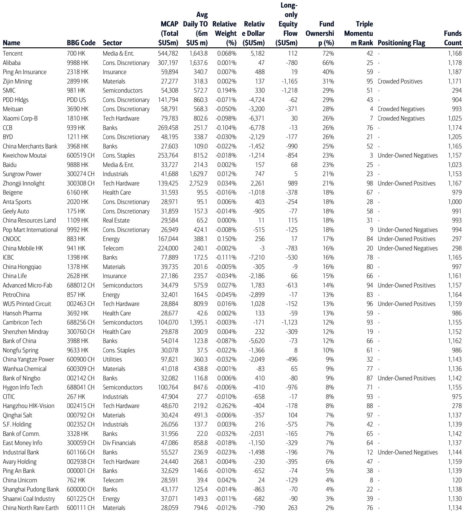
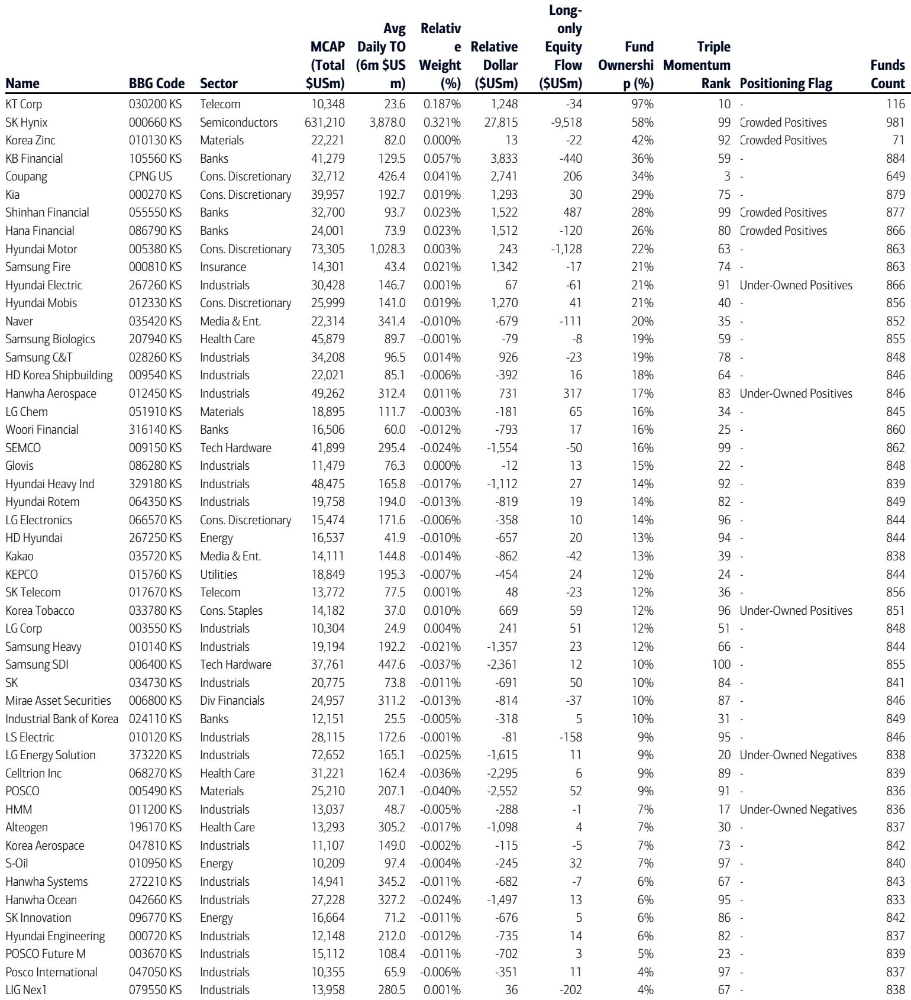
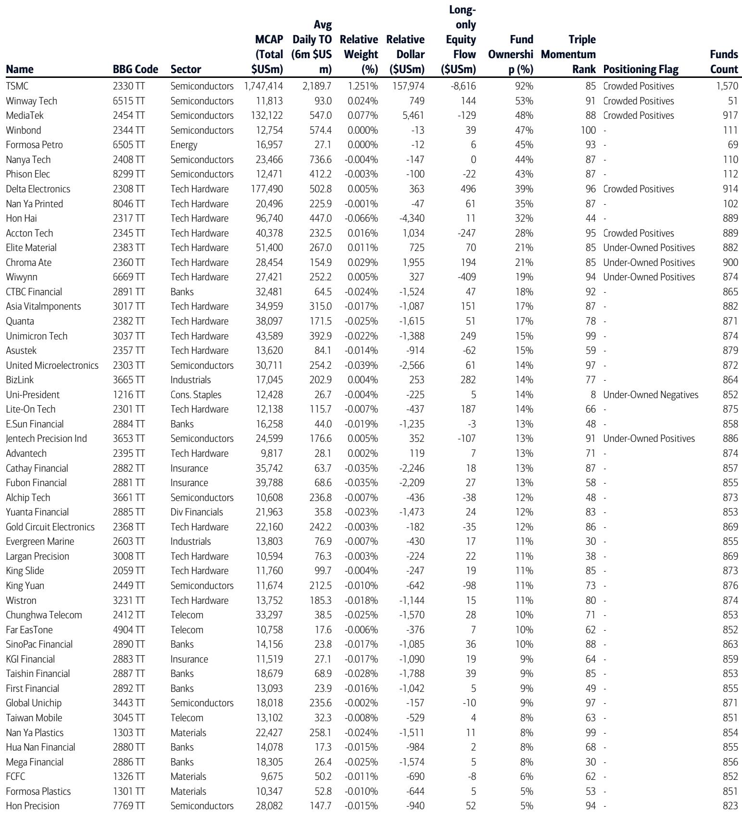

# Crowded Stocks Are Not All Dangerous: The Real Divide Is Between Those With Momentum and Those Without

The conventional wisdom that overcrowded trades are inherently risky misses a critical distinction. A global investment bank's quantitative analysis of active long-only fund positioning across Asia Pacific ex-Japan reveals that the most important determinant of future performance is not whether a stock is widely held, but whether that holding is reinforced by positive momentum. In the last twelve months, stocks that were both heavily owned by funds and exhibited positive triple momentum outperformed those that were heavily owned but carried negative momentum by a staggering 36.0 percentage points. This is not a marginal edge. It is a structural divide that separates the winners from the losers in crowded territory.

This finding challenges the reflexive contrarianism that dominates many investment discussions. The instinct to sell what everyone owns and buy what everyone ignores can be costly when the crowd is right. The data shows that crowded positions with favorable earnings, price, and news momentum can continue to deliver strong relative returns. The risk lies not in popularity itself, but in popularity that has lost its fundamental catalyst.

The report's framework combines two dimensions: positioning (fund ownership and active exposure relative to benchmarks) and momentum (a composite of earnings revisions, price trends, and news sentiment). This creates four distinct quadrants. The most powerful insight is that the interaction between these two dimensions produces asymmetric outcomes. Crowded positives deliver strong outperformance. Crowded negatives deliver severe underperformance. The spread between them is the largest of any pairwise comparison in the analysis.

The timing of this insight is particularly relevant. After the MSCI Asia Pacific ex-Japan Index rallied 15 percent in April, long-only funds engaged in significant portfolio rebalancing. They sold China and Korea while adding to Australia and India. They rotated out of Semiconductors and into Energy and Materials. These flows create new crowded positions and new under-owned opportunities. Understanding which of these crowded trades still have momentum is the key strategic question for the months ahead.

---

## The 36 Percent Performance Gap Proves That Crowdedness Alone Does Not Predict Reversal

The most compelling evidence in the report is the performance chart comparing the four stock screens over the last twelve months. Crowded positives returned 21.2 percent relative to the average stock in the analysis. Crowded negatives returned negative 14.8 percent. That 36 percentage point gap is not a statistical anomaly. It is the result of a systematic relationship between positioning and momentum that has persisted across market environments.

The implication is straightforward: investors should not treat high fund ownership as a sell signal. Instead, they must assess whether the thesis that attracted the crowd remains intact. If earnings are still being revised upward, prices are still trending higher, and news sentiment is still positive, then the crowded trade can continue to work. The danger comes when these momentum indicators turn negative while ownership remains high. At that point, the stock becomes a crowded negative, and the subsequent performance has been devastating.

This framework also explains why some under-owned stocks can be value traps. Under-owned negatives underperformed by 15.6 percent relative to the average stock, nearly matching the underperformance of crowded negatives. Being unpopular does not protect you from bad momentum. The only quadrant that consistently delivered positive relative returns was crowded positives. The only quadrant that consistently delivered negative relative returns was crowded negatives. Positioning alone is not enough. Momentum is the differentiator.

---

## The April Flow Data Reveals a Sharp Divergence Between What Funds Bought and What They Already Own

The equity flow data for April contains a puzzle that deserves careful examination. Long-only funds sold $39.7 billion of Chinese stocks and $13.6 billion of Korean stocks in a month when the regional index rallied 15 percent. They bought Australian stocks and Indian stocks instead. At the sector level, they sold $26.2 billion of Semiconductors while buying Energy and Materials.

Yet the positioning data tells a different story. Funds remain most overweight Taiwan and Korea. They remain most overweight Semiconductors, Tech Hardware, and Consumer Discretionary. This means the selling in April reduced their exposure but did not eliminate their structural overweight. The question is whether the selling was tactical profit-taking or the beginning of a more fundamental rotation.

The report does not fully answer this question, and that is precisely why it is valuable. Investors must decide for themselves whether the April flows represent a temporary adjustment or a lasting shift in preferences. The crowded positives screen currently includes TSMC, MediaTek, and WinWay Tech, all of which are Taiwanese semiconductor-related names. If the April selling in Semiconductors continues, these stocks could transition from crowded positives to crowded negatives. Monitoring their triple momentum in the coming months will be essential.

---

## The Decision Framework: Four Questions Every Investor Should Ask About Their Positions

This report provides a practical framework that any investor can apply to their own portfolio. The logic is simple but powerful. For each position, ask four questions in sequence.

First, is this stock heavily owned by active long-only funds relative to its benchmark? This is the crowdedness test. If fund ownership is above the median and the stock is overweight, it qualifies as crowded. If ownership is below the median and the stock is underweight, it qualifies as under-owned.

Second, does this stock have positive triple momentum? This is the catalyst test. Triple momentum combines earnings revision momentum, price momentum, and news sentiment momentum. If all three are positive, the stock has a favorable catalyst. If any are negative, the catalyst is questionable.

Third, what quadrant does the stock fall into? Crowded positive, crowded negative, under-owned positive, or under-owned negative. The report's performance data provides clear guidance on which quadrants to favor and which to avoid.

Fourth, what is the trend in both positioning and momentum? This is the dynamic test. A stock that was crowded positive three months ago may have seen its momentum deteriorate. A stock that was under-owned negative may have seen its momentum improve. The monthly updates in this report allow investors to track these changes in real time.

This framework is not a mechanical trading system. It is a diagnostic tool that forces investors to separate popularity from quality. The most dangerous positions are those that are both crowded and losing momentum. The most attractive opportunities are those that are under-owned and gaining momentum. But the report's data also shows that crowded positives can be the best performers. The key is knowing which category each stock belongs to.

---

## What the Report Does Not Fully Answer: The Sustainability of Crowded Positive Performance and the Role of Passive Flows

The report leaves several important questions open, and these are precisely the areas where further analysis is needed. First, how long can crowded positives sustain their outperformance? The historical back-testing in the report shows that this relationship has persisted over multiple years, but the magnitude of the recent spread is extreme. A 36 percentage point gap over twelve months is not normal. It may reflect a period of unusually strong momentum for a concentrated set of stocks. Whether that gap can persist or will mean-revert is unclear.

Second, the report focuses exclusively on active long-only funds. It does not incorporate the positioning of passive funds, hedge funds, or retail investors. The equity flow data shows that passive funds have been consistently buying while active funds have been selling. This creates a complex dynamic where the aggregate ownership of a stock may be rising even as active managers reduce their exposure. The report's crowdedness measure is based on active fund ownership, but the marginal price impact may increasingly come from passive flows. How this affects the predictive power of the framework is an open question.

Third, the report identifies specific stocks in each quadrant but does not provide a detailed fundamental analysis of why some crowded stocks maintain momentum while others lose it. The triple momentum indicator is a quantitative signal, not a substitute for fundamental research. Investors who use this framework will still need to conduct their own due diligence on the companies that appear in the screens. The framework identifies opportunities and risks. It does not make investment decisions.

---

## The Most Important Question for Investors: Are You Holding a Crowded Positive or a Crowded Negative?

The report's core message is that the distinction between crowded positives and crowded negatives is the most important categorization an investor can make. It matters more than country allocation, sector allocation, or market capitalization. It matters more than value versus growth. It is a cross-cutting factor that applies to all stocks in all markets.

The current crowded positives screen includes TSMC, MediaTek, BeOne Medicine-ADR, WinWay Tech, and Taiwan Union. These are mostly Taiwanese technology and healthcare names. The crowded negatives screen includes Bharti Airtel, Infosys, Hub24, NextDC, and Faraday Technology. These are Indian and Australian stocks across telecom, IT, financial services, and data centers. The contrast is striking. The crowded positives are concentrated in a market that funds are already overweight. The crowded negatives are in markets where funds are underweight.

This suggests that the crowd is not uniformly distributed. It is concentrated in specific themes and geographies. Investors who are underweight Taiwan and overweight India may be holding the wrong crowded trades. They may be avoiding the crowded positives that are working and embracing the crowded negatives that are failing. The report's data provides a mechanism to check these biases.

The framework also has implications for portfolio construction. If an investor holds a stock that appears on the crowded negatives screen, the appropriate response is not necessarily to sell immediately. It is to reassess the catalyst. Has the earnings momentum turned negative? Is the price trend breaking down? Has news sentiment deteriorated? If the answer to any of these questions is yes, then the stock is at risk. If the answer to all three is no, then the stock may be a false signal. The triple momentum indicator is directional, not deterministic. It identifies probabilities, not certainties.

---

## Join the community to read the full report and review the original charts.

The full report contains detailed stock screens, positioning charts for each major market, back-testing results over multiple time horizons, and methodology documentation that allows investors to replicate the analysis for their own portfolios. The charts alone are worth the time: they show the evolution of fund ownership and active exposure for hundreds of stocks across Australia, China, India, Korea, Singapore, and Taiwan. Understanding where the crowd is positioned and whether that positioning is supported by momentum is the foundation of a disciplined investment process in Asia Pacific equities.

*This article is for learning and discussion only and does not constitute investment advice.*

Personal reading notes and learning share only. Not investment advice.

